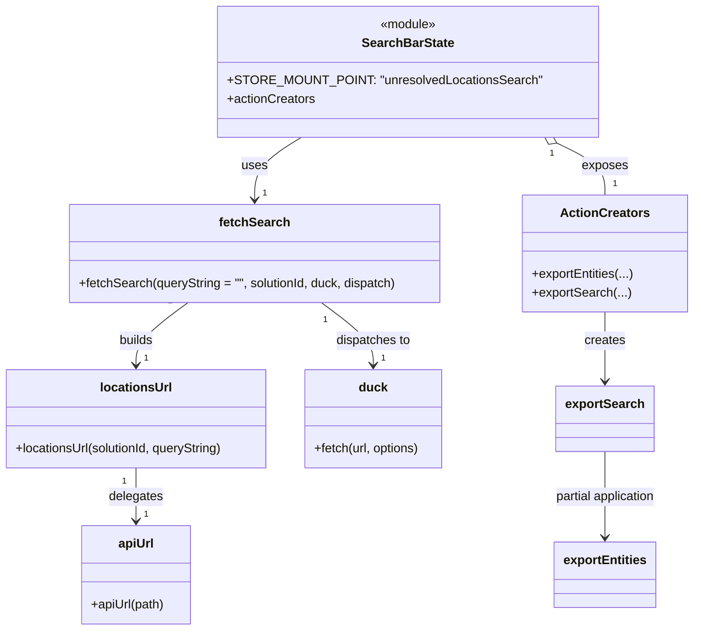

# Diagram: web/portal/src/pages/administration/location-management/unresolved-locations/search/UnresolvedLocations.SearchBar.state.js


> Auto-generated by Obscura crawlers

## Diagram 1

```mermaid
flowchart TD
  UI[Search UI] -->|uses| SearchBarState[SearchBarState]
  SearchBarState -->|calls| fetchSearch[fetchSearch(queryString, solutionId, duck, dispatch)]
  fetchSearch -->|builds URL| locationsUrl[locationsUrl(solutionId, queryString)]
  locationsUrl -->|calls| apiUrl[apiUrl("/location/unlinked")]
  fetchSearch -->|dispatches| duckFetch[duck.fetch(url, {Accept: "application/json;version=summary"})]
  SearchBarState -->|exposes| ActionCreators[SearchBarState.actionCreators]
  ActionCreators -->|includes| exportSearch[exportSearch -> exportEntities(locationsUrl, null, {Accept: "text/csv"}, "unresolved-location-search-results")]
```

> SVG rendering failed for this diagram.

## Diagram 2



### SVG

<svg id="container" width="899.599609375" xmlns="http://www.w3.org/2000/svg" class="classDiagram" height="808" viewBox="0 0 899.599609375 808" role="graphics-document document" aria-roledescription="class"><style>#container{font-family:"trebuchet ms",verdana,arial,sans-serif;font-size:16px;fill:#333;}@keyframes edge-animation-frame{from{stroke-dashoffset:0;}}@keyframes dash{to{stroke-dashoffset:0;}}#container .edge-animation-slow{stroke-dasharray:9,5!important;stroke-dashoffset:900;animation:dash 50s linear infinite;stroke-linecap:round;}#container .edge-animation-fast{stroke-dasharray:9,5!important;stroke-dashoffset:900;animation:dash 20s linear infinite;stroke-linecap:round;}#container .error-icon{fill:#552222;}#container .error-text{fill:#552222;stroke:#552222;}#container .edge-thickness-normal{stroke-width:1px;}#container .edge-thickness-thick{stroke-width:3.5px;}#container .edge-pattern-solid{stroke-dasharray:0;}#container .edge-thickness-invisible{stroke-width:0;fill:none;}#container .edge-pattern-dashed{stroke-dasharray:3;}#container .edge-pattern-dotted{stroke-dasharray:2;}#container .marker{fill:#333333;stroke:#333333;}#container .marker.cross{stroke:#333333;}#container svg{font-family:"trebuchet ms",verdana,arial,sans-serif;font-size:16px;}#container p{margin:0;}#container g.classGroup text{fill:#9370DB;stroke:none;font-family:"trebuchet ms",verdana,arial,sans-serif;font-size:10px;}#container g.classGroup text .title{font-weight:bolder;}#container .nodeLabel,#container .edgeLabel{color:#131300;}#container .edgeLabel .label rect{fill:#ECECFF;}#container .label text{fill:#131300;}#container .labelBkg{background:#ECECFF;}#container .edgeLabel .label span{background:#ECECFF;}#container .classTitle{font-weight:bolder;}#container .node rect,#container .node circle,#container .node ellipse,#container .node polygon,#container .node path{fill:#ECECFF;stroke:#9370DB;stroke-width:1px;}#container .divider{stroke:#9370DB;stroke-width:1;}#container g.clickable{cursor:pointer;}#container g.classGroup rect{fill:#ECECFF;stroke:#9370DB;}#container g.classGroup line{stroke:#9370DB;stroke-width:1;}#container .classLabel .box{stroke:none;stroke-width:0;fill:#ECECFF;opacity:0.5;}#container .classLabel .label{fill:#9370DB;font-size:10px;}#container .relation{stroke:#333333;stroke-width:1;fill:none;}#container .dashed-line{stroke-dasharray:3;}#container .dotted-line{stroke-dasharray:1 2;}#container #compositionStart,#container .composition{fill:#333333!important;stroke:#333333!important;stroke-width:1;}#container #compositionEnd,#container .composition{fill:#333333!important;stroke:#333333!important;stroke-width:1;}#container #dependencyStart,#container .dependency{fill:#333333!important;stroke:#333333!important;stroke-width:1;}#container #dependencyStart,#container .dependency{fill:#333333!important;stroke:#333333!important;stroke-width:1;}#container #extensionStart,#container .extension{fill:transparent!important;stroke:#333333!important;stroke-width:1;}#container #extensionEnd,#container .extension{fill:transparent!important;stroke:#333333!important;stroke-width:1;}#container #aggregationStart,#container .aggregation{fill:transparent!important;stroke:#333333!important;stroke-width:1;}#container #aggregationEnd,#container .aggregation{fill:transparent!important;stroke:#333333!important;stroke-width:1;}#container #lollipopStart,#container .lollipop{fill:#ECECFF!important;stroke:#333333!important;stroke-width:1;}#container #lollipopEnd,#container .lollipop{fill:#ECECFF!important;stroke:#333333!important;stroke-width:1;}#container .edgeTerminals{font-size:11px;line-height:initial;}#container .classTitleText{text-anchor:middle;font-size:18px;fill:#333;}#container .label-icon{display:inline-block;height:1em;overflow:visible;vertical-align:-0.125em;}#container .node .label-icon path{fill:currentColor;stroke:revert;stroke-width:revert;}#container :root{--mermaid-font-family:"trebuchet ms",verdana,arial,sans-serif;}</style><g><defs><marker id="container_class-aggregationStart" class="marker aggregation class" refX="18" refY="7" markerWidth="190" markerHeight="240" orient="auto"><path d="M 18,7 L9,13 L1,7 L9,1 Z"></path></marker></defs><defs><marker id="container_class-aggregationEnd" class="marker aggregation class" refX="1" refY="7" markerWidth="20" markerHeight="28" orient="auto"><path d="M 18,7 L9,13 L1,7 L9,1 Z"></path></marker></defs><defs><marker id="container_class-extensionStart" class="marker extension class" refX="18" refY="7" markerWidth="190" markerHeight="240" orient="auto"><path d="M 1,7 L18,13 V 1 Z"></path></marker></defs><defs><marker id="container_class-extensionEnd" class="marker extension class" refX="1" refY="7" markerWidth="20" markerHeight="28" orient="auto"><path d="M 1,1 V 13 L18,7 Z"></path></marker></defs><defs><marker id="container_class-compositionStart" class="marker composition class" refX="18" refY="7" markerWidth="190" markerHeight="240" orient="auto"><path d="M 18,7 L9,13 L1,7 L9,1 Z"></path></marker></defs><defs><marker id="container_class-compositionEnd" class="marker composition class" refX="1" refY="7" markerWidth="20" markerHeight="28" orient="auto"><path d="M 18,7 L9,13 L1,7 L9,1 Z"></path></marker></defs><defs><marker id="container_class-dependencyStart" class="marker dependency class" refX="6" refY="7" markerWidth="190" markerHeight="240" orient="auto"><path d="M 5,7 L9,13 L1,7 L9,1 Z"></path></marker></defs><defs><marker id="container_class-dependencyEnd" class="marker dependency class" refX="13" refY="7" markerWidth="20" markerHeight="28" orient="auto"><path d="M 18,7 L9,13 L14,7 L9,1 Z"></path></marker></defs><defs><marker id="container_class-lollipopStart" class="marker lollipop class" refX="13" refY="7" markerWidth="190" markerHeight="240" orient="auto"><circle stroke="black" fill="transparent" cx="7" cy="7" r="6"></circle></marker></defs><defs><marker id="container_class-lollipopEnd" class="marker lollipop class" refX="1" refY="7" markerWidth="190" markerHeight="240" orient="auto"><circle stroke="black" fill="transparent" cx="7" cy="7" r="6"></circle></marker></defs><g class="root"><g class="clusters"></g><g class="edgePaths"><path d="M394.373,176L384.338,182.167C374.304,188.333,354.234,200.667,344.199,214C334.164,227.333,334.164,241.667,334.164,248.833L334.164,256" id="id_SearchBarState_fetchSearch_1" class="edge-thickness-normal edge-pattern-solid relation" style=";;;" data-edge="true" data-et="edge" data-id="id_SearchBarState_fetchSearch_1" data-points="W3sieCI6Mzk0LjM3MzI3Mjg1NjQwNDksInkiOjE3Nn0seyJ4IjozMzQuMTY0MDYyNSwieSI6MjEzfSx7IngiOjMzNC4xNjQwNjI1LCJ5IjoyNjJ9XQ==" marker-end="url(#container_class-dependencyEnd)"></path><path d="M246.77,388L235.441,396.167C224.112,404.333,201.455,420.667,190.126,434C178.797,447.333,178.797,457.667,178.797,462.833L178.797,468" id="id_fetchSearch_locationsUrl_2" class="edge-thickness-normal edge-pattern-solid relation" style=";;;" data-edge="true" data-et="edge" data-id="id_fetchSearch_locationsUrl_2" data-points="W3sieCI6MjQ2Ljc3MDAxOTUzMTI1LCJ5IjozODh9LHsieCI6MTc4Ljc5Njg3NSwieSI6NDM3fSx7IngiOjE3OC43OTY4NzUsInkiOjQ3NH1d" marker-end="url(#container_class-dependencyEnd)"></path><path d="M178.797,600L178.797,606.167C178.797,612.333,178.797,624.667,178.797,636C178.797,647.333,178.797,657.667,178.797,662.833L178.797,668" id="id_locationsUrl_apiUrl_3" class="edge-thickness-normal edge-pattern-solid relation" style=";;;" data-edge="true" data-et="edge" data-id="id_locationsUrl_apiUrl_3" data-points="W3sieCI6MTc4Ljc5Njg3NSwieSI6NjAwfSx7IngiOjE3OC43OTY4NzUsInkiOjYzN30seyJ4IjoxNzguNzk2ODc1LCJ5Ijo2NzR9XQ==" marker-end="url(#container_class-dependencyEnd)"></path><path d="M421.558,388L432.887,396.167C444.216,404.333,466.874,420.667,478.202,434C489.531,447.333,489.531,457.667,489.531,462.833L489.531,468" id="id_fetchSearch_duck_4" class="edge-thickness-normal edge-pattern-solid relation" style=";;;" data-edge="true" data-et="edge" data-id="id_fetchSearch_duck_4" data-points="W3sieCI6NDIxLjU1ODEwNTQ2ODc1LCJ5IjozODh9LHsieCI6NDg5LjUzMTI1LCJ5Ijo0Mzd9LHsieCI6NDg5LjUzMTI1LCJ5Ijo0NzR9XQ==" marker-end="url(#container_class-dependencyEnd)"></path><path d="M724.217,183.377L734.653,188.314C745.089,193.251,765.962,203.126,776.398,214.229C786.834,225.333,786.834,237.667,786.834,243.833L786.834,250" id="id_SearchBarState_ActionCreators_5" class="edge-thickness-normal edge-pattern-solid relation" style=";;;" data-edge="true" data-et="edge" data-id="id_SearchBarState_ActionCreators_5" data-points="W3sieCI6NzA4LjYyMzQ2NjU1NDc1MjEsInkiOjE3Nn0seyJ4Ijo3ODYuODMzOTg0Mzc1LCJ5IjoyMTN9LHsieCI6Nzg2LjgzMzk4NDM3NSwieSI6MjUwfV0=" marker-start="url(#container_class-aggregationStart)"></path><path d="M786.834,400L786.834,406.167C786.834,412.333,786.834,424.667,786.834,439.5C786.834,454.333,786.834,471.667,786.834,480.333L786.834,489" id="id_ActionCreators_exportSearch_6" class="edge-thickness-normal edge-pattern-solid relation" style=";;;" data-edge="true" data-et="edge" data-id="id_ActionCreators_exportSearch_6" data-points="W3sieCI6Nzg2LjgzMzk4NDM3NSwieSI6NDAwfSx7IngiOjc4Ni44MzM5ODQzNzUsInkiOjQzN30seyJ4Ijo3ODYuODMzOTg0Mzc1LCJ5Ijo0OTV9XQ==" marker-end="url(#container_class-dependencyEnd)"></path><path d="M786.834,579L786.834,588.667C786.834,598.333,786.834,617.667,786.834,636C786.834,654.333,786.834,671.667,786.834,680.333L786.834,689" id="id_exportSearch_exportEntities_7" class="edge-thickness-normal edge-pattern-solid relation" style=";;;" data-edge="true" data-et="edge" data-id="id_exportSearch_exportEntities_7" data-points="W3sieCI6Nzg2LjgzMzk4NDM3NSwieSI6NTc5fSx7IngiOjc4Ni44MzM5ODQzNzUsInkiOjYzN30seyJ4Ijo3ODYuODMzOTg0Mzc1LCJ5Ijo2OTV9XQ==" marker-end="url(#container_class-dependencyEnd)"></path></g><g class="edgeLabels"><g class="edgeLabel" transform="translate(334.1640625, 213)"><g class="label" data-id="id_SearchBarState_fetchSearch_1" transform="translate(-16.4921875, -12)"><foreignObject width="32.984375" height="24"><div xmlns="http://www.w3.org/1999/xhtml" class="labelBkg" style="display: table-cell; white-space: nowrap; line-height: 1.5; max-width: 200px; text-align: center;"><span class="edgeLabel"><p>uses</p></span></div></foreignObject></g></g><g class="edgeLabel" transform="translate(178.796875, 437)"><g class="label" data-id="id_fetchSearch_locationsUrl_2" transform="translate(-22.4921875, -12)"><foreignObject width="44.984375" height="24"><div xmlns="http://www.w3.org/1999/xhtml" class="labelBkg" style="display: table-cell; white-space: nowrap; line-height: 1.5; max-width: 200px; text-align: center;"><span class="edgeLabel"><p>builds</p></span></div></foreignObject></g></g><g class="edgeLabel" transform="translate(178.796875, 637)"><g class="label" data-id="id_locationsUrl_apiUrl_3" transform="translate(-35.0390625, -12)"><foreignObject width="70.078125" height="24"><div xmlns="http://www.w3.org/1999/xhtml" class="labelBkg" style="display: table-cell; white-space: nowrap; line-height: 1.5; max-width: 200px; text-align: center;"><span class="edgeLabel"><p>delegates</p></span></div></foreignObject></g></g><g class="edgeLabel" transform="translate(489.53125, 437)"><g class="label" data-id="id_fetchSearch_duck_4" transform="translate(-48.7421875, -12)"><foreignObject width="97.484375" height="24"><div xmlns="http://www.w3.org/1999/xhtml" class="labelBkg" style="display: table-cell; white-space: nowrap; line-height: 1.5; max-width: 200px; text-align: center;"><span class="edgeLabel"><p>dispatches to</p></span></div></foreignObject></g></g><g class="edgeLabel" transform="translate(786.833984375, 213)"><g class="label" data-id="id_SearchBarState_ActionCreators_5" transform="translate(-29.4296875, -12)"><foreignObject width="58.859375" height="24"><div xmlns="http://www.w3.org/1999/xhtml" class="labelBkg" style="display: table-cell; white-space: nowrap; line-height: 1.5; max-width: 200px; text-align: center;"><span class="edgeLabel"><p>exposes</p></span></div></foreignObject></g></g><g class="edgeLabel" transform="translate(786.833984375, 437)"><g class="label" data-id="id_ActionCreators_exportSearch_6" transform="translate(-26.171875, -12)"><foreignObject width="52.34375" height="24"><div xmlns="http://www.w3.org/1999/xhtml" class="labelBkg" style="display: table-cell; white-space: nowrap; line-height: 1.5; max-width: 200px; text-align: center;"><span class="edgeLabel"><p>creates</p></span></div></foreignObject></g></g><g class="edgeLabel" transform="translate(786.833984375, 637)"><g class="label" data-id="id_exportSearch_exportEntities_7" transform="translate(-67.0546875, -12)"><foreignObject width="134.109375" height="24"><div xmlns="http://www.w3.org/1999/xhtml" class="labelBkg" style="display: table-cell; white-space: nowrap; line-height: 1.5; max-width: 200px; text-align: center;"><span class="edgeLabel"><p>partial application</p></span></div></foreignObject></g></g><g class="edgeTerminals" transform="translate(371.61004526490973, 172.3826127789367)"><g class="inner" transform="translate(0, 0)"><foreignObject style="width: 9px; height: 12px;"><div xmlns="http://www.w3.org/1999/xhtml" style="display: inline-block; padding-right: 1px; white-space: nowrap;"><span class="edgeLabel">1</span></div></foreignObject></g></g><g class="edgeTerminals" transform="translate(223.80248215374738, 386.06551196969804)"><g class="inner" transform="translate(0, 0)"><foreignObject style="width: 9px; height: 12px;"><div xmlns="http://www.w3.org/1999/xhtml" style="display: inline-block; padding-right: 1px; white-space: nowrap;"><span class="edgeLabel">1</span></div></foreignObject></g></g><g class="edgeTerminals" transform="translate(163.79687750000014, 617.5000021428572)"><g class="inner" transform="translate(0, 0)"><foreignObject style="width: 9px; height: 12px;"><div xmlns="http://www.w3.org/1999/xhtml" style="display: inline-block; padding-right: 1px; white-space: nowrap;"><span class="edgeLabel">1</span></div></foreignObject></g></g><g class="edgeTerminals" transform="translate(426.9825141060003, 410.4014672975369)"><g class="inner" transform="translate(0, 0)"><foreignObject style="width: 9px; height: 12px;"><div xmlns="http://www.w3.org/1999/xhtml" style="display: inline-block; padding-right: 1px; white-space: nowrap;"><span class="edgeLabel">1</span></div></foreignObject></g></g><g class="edgeTerminals" transform="translate(718.0279379383604, 197.04295496900386)"><g class="inner" transform="translate(0, 0)"><foreignObject style="width: 9px; height: 12px;"><div xmlns="http://www.w3.org/1999/xhtml" style="display: inline-block; padding-right: 1px; white-space: nowrap;"><span class="edgeLabel">1</span></div></foreignObject></g></g><g class="edgeTerminals" transform="translate(344.16406125, 239.49999892857144)"><g class="inner" transform="translate(0, 0)"></g><foreignObject style="width: 9px; height: 12px;"><div xmlns="http://www.w3.org/1999/xhtml" style="display: inline-block; padding-right: 1px; white-space: nowrap;"><span class="edgeLabel">1</span></div></foreignObject></g><g class="edgeTerminals" transform="translate(188.79687749999985, 451.5000021428571)"><g class="inner" transform="translate(0, 0)"></g><foreignObject style="width: 9px; height: 12px;"><div xmlns="http://www.w3.org/1999/xhtml" style="display: inline-block; padding-right: 1px; white-space: nowrap;"><span class="edgeLabel">1</span></div></foreignObject></g><g class="edgeTerminals" transform="translate(188.79687749999985, 651.5000021428572)"><g class="inner" transform="translate(0, 0)"></g><foreignObject style="width: 9px; height: 12px;"><div xmlns="http://www.w3.org/1999/xhtml" style="display: inline-block; padding-right: 1px; white-space: nowrap;"><span class="edgeLabel">1</span></div></foreignObject></g><g class="edgeTerminals" transform="translate(499.53125, 451.5)"><g class="inner" transform="translate(0, 0)"></g><foreignObject style="width: 9px; height: 12px;"><div xmlns="http://www.w3.org/1999/xhtml" style="display: inline-block; padding-right: 1px; white-space: nowrap;"><span class="edgeLabel">1</span></div></foreignObject></g><g class="edgeTerminals" transform="translate(796.8339821874998, 227.499998125)"><g class="inner" transform="translate(0, 0)"></g><foreignObject style="width: 9px; height: 12px;"><div xmlns="http://www.w3.org/1999/xhtml" style="display: inline-block; padding-right: 1px; white-space: nowrap;"><span class="edgeLabel">1</span></div></foreignObject></g></g><g class="nodes"><g class="node default" id="classId-SearchBarState-0" transform="translate(531.064453125, 92)"><g class="basic label-container"><path d="M-232.73046875 -84 L232.73046875 -84 L232.73046875 84 L-232.73046875 84" stroke="none" stroke-width="0" fill="#ECECFF" style=""></path><path d="M-232.73046875 -84 C-133.84715631037776 -84, -34.96384387075551 -84, 232.73046875 -84 M-232.73046875 -84 C-116.24176195538652 -84, 0.24694483922695554 -84, 232.73046875 -84 M232.73046875 -84 C232.73046875 -48.581762980792035, 232.73046875 -13.163525961584071, 232.73046875 84 M232.73046875 -84 C232.73046875 -22.12703712129548, 232.73046875 39.74592575740904, 232.73046875 84 M232.73046875 84 C117.87893684192598 84, 3.0274049338519546 84, -232.73046875 84 M232.73046875 84 C130.9330754951288 84, 29.13568224025761 84, -232.73046875 84 M-232.73046875 84 C-232.73046875 31.815706424194204, -232.73046875 -20.368587151611592, -232.73046875 -84 M-232.73046875 84 C-232.73046875 40.105260508240534, -232.73046875 -3.789478983518933, -232.73046875 -84" stroke="#9370DB" stroke-width="1.3" fill="none" stroke-dasharray="0 0" style=""></path></g><g class="annotation-group text" transform="translate(-36.6015625, -60)"><g class="label" style="" transform="translate(0,-12)"><foreignObject width="73.203125" height="24"><div xmlns="http://www.w3.org/1999/xhtml" style="display: table-cell; white-space: nowrap; line-height: 1.5; max-width: 123px; text-align: center;"><span class="nodeLabel markdown-node-label" style=""><p>«module»</p></span></div></foreignObject></g></g><g class="label-group text" transform="translate(-56.5546875, -36)"><g class="label" style="font-weight: bolder" transform="translate(0,-12)"><foreignObject width="113.109375" height="24"><div xmlns="http://www.w3.org/1999/xhtml" style="display: table-cell; white-space: nowrap; line-height: 1.5; max-width: 161px; text-align: center;"><span class="nodeLabel markdown-node-label" style=""><p>SearchBarState</p></span></div></foreignObject></g></g><g class="members-group text" transform="translate(-220.73046875, 12)"><g class="label" style="" transform="translate(0,-12)"><foreignObject width="384.90625" height="24"><div xmlns="http://www.w3.org/1999/xhtml" style="display: table-cell; white-space: nowrap; line-height: 1.5; max-width: 442px; text-align: center;"><span class="nodeLabel markdown-node-label" style=""><p>+STORE_MOUNT_POINT: "unresolvedLocationsSearch"</p></span></div></foreignObject></g><g class="label" style="" transform="translate(0,12)"><foreignObject width="113.078125" height="24"><div xmlns="http://www.w3.org/1999/xhtml" style="display: table-cell; white-space: nowrap; line-height: 1.5; max-width: 170px; text-align: center;"><span class="nodeLabel markdown-node-label" style=""><p>+actionCreators</p></span></div></foreignObject></g></g><g class="methods-group text" transform="translate(-220.73046875, 84)"></g><g class="divider" style=""><path d="M-232.73046875 -12 C-86.08827747291579 -12, 60.55391380416842 -12, 232.73046875 -12 M-232.73046875 -12 C-54.17115371259837 -12, 124.38816132480326 -12, 232.73046875 -12" stroke="#9370DB" stroke-width="1.3" fill="none" stroke-dasharray="0 0" style=""></path></g><g class="divider" style=""><path d="M-232.73046875 60 C-102.590891447574 60, 27.54868585485201 60, 232.73046875 60 M-232.73046875 60 C-130.1024242067835 60, -27.47437966356702 60, 232.73046875 60" stroke="#9370DB" stroke-width="1.3" fill="none" stroke-dasharray="0 0" style=""></path></g></g><g class="node default" id="classId-fetchSearch-1" transform="translate(334.1640625, 325)"><g class="basic label-container"><path d="M-239.03515625 -63 L239.03515625 -63 L239.03515625 63 L-239.03515625 63" stroke="none" stroke-width="0" fill="#ECECFF" style=""></path><path d="M-239.03515625 -63 C-51.88152964113294 -63, 135.27209696773411 -63, 239.03515625 -63 M-239.03515625 -63 C-128.0849133615371 -63, -17.13467047307421 -63, 239.03515625 -63 M239.03515625 -63 C239.03515625 -15.415368610680574, 239.03515625 32.16926277863885, 239.03515625 63 M239.03515625 -63 C239.03515625 -29.843530882192844, 239.03515625 3.312938235614311, 239.03515625 63 M239.03515625 63 C66.44391318371572 63, -106.14732988256856 63, -239.03515625 63 M239.03515625 63 C106.32591992988091 63, -26.38331639023818 63, -239.03515625 63 M-239.03515625 63 C-239.03515625 26.05331596361882, -239.03515625 -10.893368072762357, -239.03515625 -63 M-239.03515625 63 C-239.03515625 14.463626687528382, -239.03515625 -34.072746624943235, -239.03515625 -63" stroke="#9370DB" stroke-width="1.3" fill="none" stroke-dasharray="0 0" style=""></path></g><g class="annotation-group text" transform="translate(0, -39)"></g><g class="label-group text" transform="translate(-43.2890625, -39)"><g class="label" style="font-weight: bolder" transform="translate(0,-12)"><foreignObject width="86.578125" height="24"><div xmlns="http://www.w3.org/1999/xhtml" style="display: table-cell; white-space: nowrap; line-height: 1.5; max-width: 135px; text-align: center;"><span class="nodeLabel markdown-node-label" style=""><p>fetchSearch</p></span></div></foreignObject></g></g><g class="members-group text" transform="translate(-227.03515625, 9)"></g><g class="methods-group text" transform="translate(-227.03515625, 39)"><g class="label" style="" transform="translate(0,-12)"><foreignObject width="410.78125" height="24"><div xmlns="http://www.w3.org/1999/xhtml" style="display: table-cell; white-space: nowrap; line-height: 1.5; max-width: 468px; text-align: center;"><span class="nodeLabel markdown-node-label" style=""><p>+fetchSearch(queryString = "", solutionId, duck, dispatch)</p></span></div></foreignObject></g></g><g class="divider" style=""><path d="M-239.03515625 -15 C-80.83436930599808 -15, 77.36641763800384 -15, 239.03515625 -15 M-239.03515625 -15 C-104.04142181640046 -15, 30.952312617199084 -15, 239.03515625 -15" stroke="#9370DB" stroke-width="1.3" fill="none" stroke-dasharray="0 0" style=""></path></g><g class="divider" style=""><path d="M-239.03515625 9 C-92.64741101490469 9, 53.74033422019062 9, 239.03515625 9 M-239.03515625 9 C-121.71403296311689 9, -4.392909676233785 9, 239.03515625 9" stroke="#9370DB" stroke-width="1.3" fill="none" stroke-dasharray="0 0" style=""></path></g></g><g class="node default" id="classId-locationsUrl-2" transform="translate(178.796875, 537)"><g class="basic label-container"><path d="M-170.796875 -63 L170.796875 -63 L170.796875 63 L-170.796875 63" stroke="none" stroke-width="0" fill="#ECECFF" style=""></path><path d="M-170.796875 -63 C-100.88294863157299 -63, -30.969022263145973 -63, 170.796875 -63 M-170.796875 -63 C-64.35763510516144 -63, 42.08160478967713 -63, 170.796875 -63 M170.796875 -63 C170.796875 -13.256134604171258, 170.796875 36.487730791657484, 170.796875 63 M170.796875 -63 C170.796875 -31.827336863315956, 170.796875 -0.6546737266319127, 170.796875 63 M170.796875 63 C50.2076805017236 63, -70.3815139965528 63, -170.796875 63 M170.796875 63 C61.78124338195683 63, -47.234388236086346 63, -170.796875 63 M-170.796875 63 C-170.796875 27.06484060376379, -170.796875 -8.870318792472418, -170.796875 -63 M-170.796875 63 C-170.796875 13.831586884830806, -170.796875 -35.33682623033839, -170.796875 -63" stroke="#9370DB" stroke-width="1.3" fill="none" stroke-dasharray="0 0" style=""></path></g><g class="annotation-group text" transform="translate(0, -39)"></g><g class="label-group text" transform="translate(-44.4375, -39)"><g class="label" style="font-weight: bolder" transform="translate(0,-12)"><foreignObject width="88.875" height="24"><div xmlns="http://www.w3.org/1999/xhtml" style="display: table-cell; white-space: nowrap; line-height: 1.5; max-width: 138px; text-align: center;"><span class="nodeLabel markdown-node-label" style=""><p>locationsUrl</p></span></div></foreignObject></g></g><g class="members-group text" transform="translate(-158.796875, 9)"></g><g class="methods-group text" transform="translate(-158.796875, 39)"><g class="label" style="" transform="translate(0,-12)"><foreignObject width="273.15625" height="24"><div xmlns="http://www.w3.org/1999/xhtml" style="display: table-cell; white-space: nowrap; line-height: 1.5; max-width: 331px; text-align: center;"><span class="nodeLabel markdown-node-label" style=""><p>+locationsUrl(solutionId, queryString)</p></span></div></foreignObject></g></g><g class="divider" style=""><path d="M-170.796875 -15 C-71.2199403998911 -15, 28.356994200217798 -15, 170.796875 -15 M-170.796875 -15 C-59.16059955661149 -15, 52.475675886777026 -15, 170.796875 -15" stroke="#9370DB" stroke-width="1.3" fill="none" stroke-dasharray="0 0" style=""></path></g><g class="divider" style=""><path d="M-170.796875 9 C-67.38397193199079 9, 36.02893113601843 9, 170.796875 9 M-170.796875 9 C-41.53998760946226 9, 87.71689978107548 9, 170.796875 9" stroke="#9370DB" stroke-width="1.3" fill="none" stroke-dasharray="0 0" style=""></path></g></g><g class="node default" id="classId-apiUrl-3" transform="translate(178.796875, 737)"><g class="basic label-container"><path d="M-70.85546875 -63 L70.85546875 -63 L70.85546875 63 L-70.85546875 63" stroke="none" stroke-width="0" fill="#ECECFF" style=""></path><path d="M-70.85546875 -63 C-25.60134886376906 -63, 19.652771022461877 -63, 70.85546875 -63 M-70.85546875 -63 C-40.93302616876721 -63, -11.010583587534434 -63, 70.85546875 -63 M70.85546875 -63 C70.85546875 -17.062032934421097, 70.85546875 28.875934131157805, 70.85546875 63 M70.85546875 -63 C70.85546875 -36.988912428447996, 70.85546875 -10.977824856895992, 70.85546875 63 M70.85546875 63 C26.04630649968273 63, -18.762855750634543 63, -70.85546875 63 M70.85546875 63 C33.037265896361944 63, -4.780936957276111 63, -70.85546875 63 M-70.85546875 63 C-70.85546875 20.231095145228316, -70.85546875 -22.537809709543367, -70.85546875 -63 M-70.85546875 63 C-70.85546875 30.84166972605579, -70.85546875 -1.316660547888418, -70.85546875 -63" stroke="#9370DB" stroke-width="1.3" fill="none" stroke-dasharray="0 0" style=""></path></g><g class="annotation-group text" transform="translate(0, -39)"></g><g class="label-group text" transform="translate(-22.2109375, -39)"><g class="label" style="font-weight: bolder" transform="translate(0,-12)"><foreignObject width="44.421875" height="24"><div xmlns="http://www.w3.org/1999/xhtml" style="display: table-cell; white-space: nowrap; line-height: 1.5; max-width: 94px; text-align: center;"><span class="nodeLabel markdown-node-label" style=""><p>apiUrl</p></span></div></foreignObject></g></g><g class="members-group text" transform="translate(-58.85546875, 9)"></g><g class="methods-group text" transform="translate(-58.85546875, 39)"><g class="label" style="" transform="translate(0,-12)"><foreignObject width="95.5" height="24"><div xmlns="http://www.w3.org/1999/xhtml" style="display: table-cell; white-space: nowrap; line-height: 1.5; max-width: 153px; text-align: center;"><span class="nodeLabel markdown-node-label" style=""><p>+apiUrl(path)</p></span></div></foreignObject></g></g><g class="divider" style=""><path d="M-70.85546875 -15 C-41.25138204542954 -15, -11.647295340859074 -15, 70.85546875 -15 M-70.85546875 -15 C-28.775861345782943 -15, 13.303746058434115 -15, 70.85546875 -15" stroke="#9370DB" stroke-width="1.3" fill="none" stroke-dasharray="0 0" style=""></path></g><g class="divider" style=""><path d="M-70.85546875 9 C-35.878460254774424 9, -0.9014517595488485 9, 70.85546875 9 M-70.85546875 9 C-20.701800649703742 9, 29.451867450592516 9, 70.85546875 9" stroke="#9370DB" stroke-width="1.3" fill="none" stroke-dasharray="0 0" style=""></path></g></g><g class="node default" id="classId-duck-4" transform="translate(489.53125, 537)"><g class="basic label-container"><path d="M-89.9375 -63 L89.9375 -63 L89.9375 63 L-89.9375 63" stroke="none" stroke-width="0" fill="#ECECFF" style=""></path><path d="M-89.9375 -63 C-46.14188910932548 -63, -2.3462782186509656 -63, 89.9375 -63 M-89.9375 -63 C-32.22704633040349 -63, 25.483407339193022 -63, 89.9375 -63 M89.9375 -63 C89.9375 -26.092690213357223, 89.9375 10.814619573285555, 89.9375 63 M89.9375 -63 C89.9375 -26.838864387322907, 89.9375 9.322271225354186, 89.9375 63 M89.9375 63 C39.38992224567616 63, -11.157655508647679 63, -89.9375 63 M89.9375 63 C20.183494853603065 63, -49.57051029279387 63, -89.9375 63 M-89.9375 63 C-89.9375 32.34955776823321, -89.9375 1.6991155364664152, -89.9375 -63 M-89.9375 63 C-89.9375 26.47523219223354, -89.9375 -10.049535615532918, -89.9375 -63" stroke="#9370DB" stroke-width="1.3" fill="none" stroke-dasharray="0 0" style=""></path></g><g class="annotation-group text" transform="translate(0, -39)"></g><g class="label-group text" transform="translate(-17.625, -39)"><g class="label" style="font-weight: bolder" transform="translate(0,-12)"><foreignObject width="35.25" height="24"><div xmlns="http://www.w3.org/1999/xhtml" style="display: table-cell; white-space: nowrap; line-height: 1.5; max-width: 86px; text-align: center;"><span class="nodeLabel markdown-node-label" style=""><p>duck</p></span></div></foreignObject></g></g><g class="members-group text" transform="translate(-77.9375, 9)"></g><g class="methods-group text" transform="translate(-77.9375, 39)"><g class="label" style="" transform="translate(0,-12)"><foreignObject width="138.25" height="24"><div xmlns="http://www.w3.org/1999/xhtml" style="display: table-cell; white-space: nowrap; line-height: 1.5; max-width: 196px; text-align: center;"><span class="nodeLabel markdown-node-label" style=""><p>+fetch(url, options)</p></span></div></foreignObject></g></g><g class="divider" style=""><path d="M-89.9375 -15 C-20.946005130830173 -15, 48.045489738339654 -15, 89.9375 -15 M-89.9375 -15 C-23.102240272607574 -15, 43.73301945478485 -15, 89.9375 -15" stroke="#9370DB" stroke-width="1.3" fill="none" stroke-dasharray="0 0" style=""></path></g><g class="divider" style=""><path d="M-89.9375 9 C-53.259181668337 9, -16.580863336674 9, 89.9375 9 M-89.9375 9 C-35.850183330511655 9, 18.23713333897669 9, 89.9375 9" stroke="#9370DB" stroke-width="1.3" fill="none" stroke-dasharray="0 0" style=""></path></g></g><g class="node default" id="classId-ActionCreators-5" transform="translate(786.833984375, 325)"><g class="basic label-container"><path d="M-104.765625 -75 L104.765625 -75 L104.765625 75 L-104.765625 75" stroke="none" stroke-width="0" fill="#ECECFF" style=""></path><path d="M-104.765625 -75 C-31.15514038935089 -75, 42.45534422129822 -75, 104.765625 -75 M-104.765625 -75 C-58.36678717095582 -75, -11.967949341911634 -75, 104.765625 -75 M104.765625 -75 C104.765625 -20.9162208903235, 104.765625 33.167558219353, 104.765625 75 M104.765625 -75 C104.765625 -41.602204067277086, 104.765625 -8.204408134554171, 104.765625 75 M104.765625 75 C51.772488313918316 75, -1.2206483721633674 75, -104.765625 75 M104.765625 75 C31.813114434197374 75, -41.13939613160525 75, -104.765625 75 M-104.765625 75 C-104.765625 44.74203642570171, -104.765625 14.484072851403425, -104.765625 -75 M-104.765625 75 C-104.765625 25.445379502403995, -104.765625 -24.10924099519201, -104.765625 -75" stroke="#9370DB" stroke-width="1.3" fill="none" stroke-dasharray="0 0" style=""></path></g><g class="annotation-group text" transform="translate(0, -51)"></g><g class="label-group text" transform="translate(-53.96875, -51)"><g class="label" style="font-weight: bolder" transform="translate(0,-12)"><foreignObject width="107.9375" height="24"><div xmlns="http://www.w3.org/1999/xhtml" style="display: table-cell; white-space: nowrap; line-height: 1.5; max-width: 156px; text-align: center;"><span class="nodeLabel markdown-node-label" style=""><p>ActionCreators</p></span></div></foreignObject></g></g><g class="members-group text" transform="translate(-92.765625, -3)"></g><g class="methods-group text" transform="translate(-92.765625, 27)"><g class="label" style="" transform="translate(0,-12)"><foreignObject width="131.5625" height="24"><div xmlns="http://www.w3.org/1999/xhtml" style="display: table-cell; white-space: nowrap; line-height: 1.5; max-width: 189px; text-align: center;"><span class="nodeLabel markdown-node-label" style=""><p>+exportEntities(...)</p></span></div></foreignObject></g><g class="label" style="" transform="translate(0,12)"><foreignObject width="125.71875" height="24"><div xmlns="http://www.w3.org/1999/xhtml" style="display: table-cell; white-space: nowrap; line-height: 1.5; max-width: 183px; text-align: center;"><span class="nodeLabel markdown-node-label" style=""><p>+exportSearch(...)</p></span></div></foreignObject></g></g><g class="divider" style=""><path d="M-104.765625 -27 C-62.70822319779977 -27, -20.650821395599536 -27, 104.765625 -27 M-104.765625 -27 C-45.97122704981038 -27, 12.823170900379239 -27, 104.765625 -27" stroke="#9370DB" stroke-width="1.3" fill="none" stroke-dasharray="0 0" style=""></path></g><g class="divider" style=""><path d="M-104.765625 -3 C-21.543228212677775 -3, 61.67916857464445 -3, 104.765625 -3 M-104.765625 -3 C-44.35242657198131 -3, 16.060771856037377 -3, 104.765625 -3" stroke="#9370DB" stroke-width="1.3" fill="none" stroke-dasharray="0 0" style=""></path></g></g><g class="node default" id="classId-exportSearch-6" transform="translate(786.833984375, 537)"><g class="basic label-container"><path d="M-60.8671875 -42 L60.8671875 -42 L60.8671875 42 L-60.8671875 42" stroke="none" stroke-width="0" fill="#ECECFF" style=""></path><path d="M-60.8671875 -42 C-14.903644951776023 -42, 31.059897596447954 -42, 60.8671875 -42 M-60.8671875 -42 C-14.549158676219044 -42, 31.768870147561913 -42, 60.8671875 -42 M60.8671875 -42 C60.8671875 -17.45512757846495, 60.8671875 7.0897448430701, 60.8671875 42 M60.8671875 -42 C60.8671875 -11.436926156977236, 60.8671875 19.126147686045528, 60.8671875 42 M60.8671875 42 C14.601780344049693 42, -31.663626811900613 42, -60.8671875 42 M60.8671875 42 C22.19175713515027 42, -16.483673229699463 42, -60.8671875 42 M-60.8671875 42 C-60.8671875 10.556875426953187, -60.8671875 -20.886249146093625, -60.8671875 -42 M-60.8671875 42 C-60.8671875 11.513150557251446, -60.8671875 -18.973698885497107, -60.8671875 -42" stroke="#9370DB" stroke-width="1.3" fill="none" stroke-dasharray="0 0" style=""></path></g><g class="annotation-group text" transform="translate(0, -18)"></g><g class="label-group text" transform="translate(-48.8671875, -18)"><g class="label" style="font-weight: bolder" transform="translate(0,-12)"><foreignObject width="97.734375" height="24"><div xmlns="http://www.w3.org/1999/xhtml" style="display: table-cell; white-space: nowrap; line-height: 1.5; max-width: 146px; text-align: center;"><span class="nodeLabel markdown-node-label" style=""><p>exportSearch</p></span></div></foreignObject></g></g><g class="members-group text" transform="translate(-48.8671875, 30)"></g><g class="methods-group text" transform="translate(-48.8671875, 60)"></g><g class="divider" style=""><path d="M-60.8671875 6 C-20.855412643910498 6, 19.156362212179005 6, 60.8671875 6 M-60.8671875 6 C-33.66273204056604 6, -6.45827658113209 6, 60.8671875 6" stroke="#9370DB" stroke-width="1.3" fill="none" stroke-dasharray="0 0" style=""></path></g><g class="divider" style=""><path d="M-60.8671875 24 C-31.24293089637431 24, -1.6186742927486222 24, 60.8671875 24 M-60.8671875 24 C-26.50393764716579 24, 7.859312205668417 24, 60.8671875 24" stroke="#9370DB" stroke-width="1.3" fill="none" stroke-dasharray="0 0" style=""></path></g></g><g class="node default" id="classId-exportEntities-7" transform="translate(786.833984375, 737)"><g class="basic label-container"><path d="M-63.8671875 -42 L63.8671875 -42 L63.8671875 42 L-63.8671875 42" stroke="none" stroke-width="0" fill="#ECECFF" style=""></path><path d="M-63.8671875 -42 C-35.36608131628063 -42, -6.864975132561256 -42, 63.8671875 -42 M-63.8671875 -42 C-18.13950712755465 -42, 27.588173244890697 -42, 63.8671875 -42 M63.8671875 -42 C63.8671875 -17.187160965718725, 63.8671875 7.62567806856255, 63.8671875 42 M63.8671875 -42 C63.8671875 -11.604417250412894, 63.8671875 18.791165499174213, 63.8671875 42 M63.8671875 42 C26.655666235052294 42, -10.555855029895412 42, -63.8671875 42 M63.8671875 42 C23.41670801506386 42, -17.033771469872278 42, -63.8671875 42 M-63.8671875 42 C-63.8671875 9.849371937533526, -63.8671875 -22.301256124932948, -63.8671875 -42 M-63.8671875 42 C-63.8671875 23.940839488898323, -63.8671875 5.881678977796646, -63.8671875 -42" stroke="#9370DB" stroke-width="1.3" fill="none" stroke-dasharray="0 0" style=""></path></g><g class="annotation-group text" transform="translate(0, -18)"></g><g class="label-group text" transform="translate(-51.8671875, -18)"><g class="label" style="font-weight: bolder" transform="translate(0,-12)"><foreignObject width="103.734375" height="24"><div xmlns="http://www.w3.org/1999/xhtml" style="display: table-cell; white-space: nowrap; line-height: 1.5; max-width: 152px; text-align: center;"><span class="nodeLabel markdown-node-label" style=""><p>exportEntities</p></span></div></foreignObject></g></g><g class="members-group text" transform="translate(-51.8671875, 30)"></g><g class="methods-group text" transform="translate(-51.8671875, 60)"></g><g class="divider" style=""><path d="M-63.8671875 6 C-19.180638747295355 6, 25.50591000540929 6, 63.8671875 6 M-63.8671875 6 C-19.09977988830012 6, 25.66762772339976 6, 63.8671875 6" stroke="#9370DB" stroke-width="1.3" fill="none" stroke-dasharray="0 0" style=""></path></g><g class="divider" style=""><path d="M-63.8671875 24 C-13.83629135232512 24, 36.19460479534976 24, 63.8671875 24 M-63.8671875 24 C-33.39015457857445 24, -2.913121657148899 24, 63.8671875 24" stroke="#9370DB" stroke-width="1.3" fill="none" stroke-dasharray="0 0" style=""></path></g></g></g></g></g></svg>
