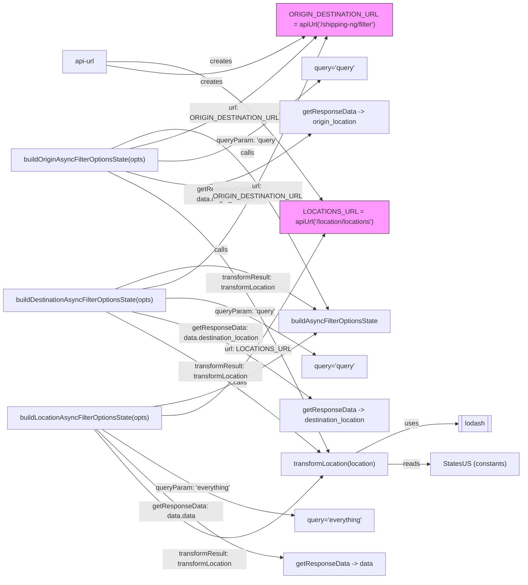

# Diagram: web/portal/src/pages/administration/location-management/utils/buildLocationAsyncFilterOptionsState.js

> Auto-generated by Obscura crawlers

## Mermaid

### SVG

<svg id="container" width="1231.703125" xmlns="http://www.w3.org/2000/svg" class="flowchart" height="1402" viewBox="0 0 1231.703125 1402" role="graphics-document document" aria-roledescription="flowchart-v2"><g><marker id="container_flowchart-v2-pointEnd" class="marker flowchart-v2" viewBox="0 0 10 10" refX="5" refY="5" markerUnits="userSpaceOnUse" markerWidth="8" markerHeight="8" orient="auto"><path d="M 0 0 L 10 5 L 0 10 z" class="arrowMarkerPath" style="stroke-width: 1; stroke-dasharray: 1, 0;"></path></marker><marker id="container_flowchart-v2-pointStart" class="marker flowchart-v2" viewBox="0 0 10 10" refX="4.5" refY="5" markerUnits="userSpaceOnUse" markerWidth="8" markerHeight="8" orient="auto"><path d="M 0 5 L 10 10 L 10 0 z" class="arrowMarkerPath" style="stroke-width: 1; stroke-dasharray: 1, 0;"></path></marker><marker id="container_flowchart-v2-circleEnd" class="marker flowchart-v2" viewBox="0 0 10 10" refX="11" refY="5" markerUnits="userSpaceOnUse" markerWidth="11" markerHeight="11" orient="auto"><circle cx="5" cy="5" r="5" class="arrowMarkerPath" style="stroke-width: 1; stroke-dasharray: 1, 0;"></circle></marker><marker id="container_flowchart-v2-circleStart" class="marker flowchart-v2" viewBox="0 0 10 10" refX="-1" refY="5" markerUnits="userSpaceOnUse" markerWidth="11" markerHeight="11" orient="auto"><circle cx="5" cy="5" r="5" class="arrowMarkerPath" style="stroke-width: 1; stroke-dasharray: 1, 0;"></circle></marker><marker id="container_flowchart-v2-crossEnd" class="marker cross flowchart-v2" viewBox="0 0 11 11" refX="12" refY="5.2" markerUnits="userSpaceOnUse" markerWidth="11" markerHeight="11" orient="auto"><path d="M 1,1 l 9,9 M 10,1 l -9,9" class="arrowMarkerPath" style="stroke-width: 2; stroke-dasharray: 1, 0;"></path></marker><marker id="container_flowchart-v2-crossStart" class="marker cross flowchart-v2" viewBox="0 0 11 11" refX="-1" refY="5.2" markerUnits="userSpaceOnUse" markerWidth="11" markerHeight="11" orient="auto"><path d="M 1,1 l 9,9 M 10,1 l -9,9" class="arrowMarkerPath" style="stroke-width: 2; stroke-dasharray: 1, 0;"></path></marker><g class="root"><g class="clusters"></g><g class="edgePaths"><path d="M839.872,1102L861.486,1090.417C883.1,1078.833,926.327,1055.667,965.627,1044.164C1004.927,1032.661,1040.3,1032.821,1057.986,1032.902L1075.672,1032.982" id="L_transformLocation_Lodash_0" class="edge-thickness-normal edge-pattern-solid edge-thickness-normal edge-pattern-solid flowchart-link" style=";" data-edge="true" data-et="edge" data-id="L_transformLocation_Lodash_0" data-points="W3sieCI6ODM5Ljg3MjM2ODg0NzE1MDMsInkiOjExMDJ9LHsieCI6OTY5LjU1NDY4NzUsInkiOjEwMzIuNX0seyJ4IjoxMDc5LjY3MTg3NSwieSI6MTAzM31d" marker-end="url(#container_flowchart-v2-pointEnd)"></path><path d="M921,1129L929.092,1129C937.185,1129,953.37,1129,968.297,1129C983.224,1129,996.893,1129,1003.728,1129L1010.563,1129" id="L_transformLocation_StatesUS_0" class="edge-thickness-normal edge-pattern-solid edge-thickness-normal edge-pattern-solid flowchart-link" style=";" data-edge="true" data-et="edge" data-id="L_transformLocation_StatesUS_0" data-points="W3sieCI6OTIxLCJ5IjoxMTI5fSx7IngiOjk2OS41NTQ2ODc1LCJ5IjoxMTI5fSx7IngiOjEwMTQuNTYyNSwieSI6MTEyOX1d" marker-end="url(#container_flowchart-v2-pointEnd)"></path><path d="M269.457,372L312.787,353.5C356.117,335,442.777,298,526.939,362.402C611.101,426.804,692.764,592.608,733.595,675.51L774.427,758.412" id="L_buildOrigin_Builder_0" class="edge-thickness-normal edge-pattern-solid edge-thickness-normal edge-pattern-solid flowchart-link" style=";" data-edge="true" data-et="edge" data-id="L_buildOrigin_Builder_0" data-points="W3sieCI6MjY5LjQ1NzIwMTA4Njk1NjUsInkiOjM3Mn0seyJ4Ijo1MjkuNDM3NSwieSI6MjYxfSx7IngiOjc3Ni4xOTM5MzY0MzQ2NTkxLCJ5Ijo3NjJ9XQ==" marker-end="url(#container_flowchart-v2-pointEnd)"></path><path d="M278.943,712L320.692,696.5C362.441,681,445.939,650,523.589,657.969C601.239,665.937,673.04,712.874,708.941,736.343L744.841,759.811" id="L_buildDestination_Builder_0" class="edge-thickness-normal edge-pattern-solid edge-thickness-normal edge-pattern-solid flowchart-link" style=";" data-edge="true" data-et="edge" data-id="L_buildDestination_Builder_0" data-points="W3sieCI6Mjc4Ljk0Mjk2ODc1LCJ5Ijo3MTJ9LHsieCI6NTI5LjQzNzUsInkiOjYxOX0seyJ4Ijo3NDguMTg5Mzg0MTkxMTc2NSwieSI6NzYyfV0=" marker-end="url(#container_flowchart-v2-pointEnd)"></path><path d="M367.828,992L394.763,987.5C421.698,983,475.568,974,538.644,945.04C601.72,916.081,674.002,867.161,710.144,842.702L746.285,818.242" id="L_buildLocation_Builder_0" class="edge-thickness-normal edge-pattern-solid edge-thickness-normal edge-pattern-solid flowchart-link" style=";" data-edge="true" data-et="edge" data-id="L_buildLocation_Builder_0" data-points="W3sieCI6MzY3LjgyODEyNSwieSI6OTkyfSx7IngiOjUyOS40Mzc1LCJ5Ijo5NjV9LHsieCI6NzQ5LjU5NzQzNDMwMzk3NzMsInkiOjgxNn1d" marker-end="url(#container_flowchart-v2-pointEnd)"></path><path d="M312.644,372L348.777,362.833C384.909,353.667,457.173,335.333,527.607,292.136C598.04,248.939,666.643,180.878,700.945,146.848L735.246,112.817" id="L_buildOrigin_ORIGIN_DEST_URL_0" class="edge-thickness-normal edge-pattern-solid edge-thickness-normal edge-pattern-solid flowchart-link" style=";" data-edge="true" data-et="edge" data-id="L_buildOrigin_ORIGIN_DEST_URL_0" data-points="W3sieCI6MzEyLjY0NDQzNTk3NTYwOTgsInkiOjM3Mn0seyJ4Ijo1MjkuNDM3NSwieSI6MzE3fSx7IngiOjczOC4wODYwMjgzNDMwMjMzLCJ5IjoxMTB9XQ==" marker-end="url(#container_flowchart-v2-pointEnd)"></path><path d="M384.484,404.515L408.643,405.263C432.802,406.01,481.12,407.505,542.843,376.185C604.566,344.866,679.694,280.731,717.258,248.664L754.822,216.597" id="L_buildOrigin_query1_0" class="edge-thickness-normal edge-pattern-solid edge-thickness-normal edge-pattern-solid flowchart-link" style=";" data-edge="true" data-et="edge" data-id="L_buildOrigin_query1_0" data-points="W3sieCI6Mzg0LjQ4NDM3NSwieSI6NDA0LjUxNTMyNDM3Mzk3Mjc2fSx7IngiOjUyOS40Mzc1LCJ5Ijo0MDl9LHsieCI6NzU3Ljg2MzkxNDY5NTk0NTksInkiOjIxNH1d" marker-end="url(#container_flowchart-v2-pointEnd)"></path><path d="M297.124,426L335.843,437.5C374.562,449,452,472,524.721,458.396C597.442,444.792,665.446,394.584,699.448,369.48L733.451,344.376" id="L_buildOrigin_resp1_0" class="edge-thickness-normal edge-pattern-solid edge-thickness-normal edge-pattern-solid flowchart-link" style=";" data-edge="true" data-et="edge" data-id="L_buildOrigin_resp1_0" data-points="W3sieCI6Mjk3LjEyNDAyMzQzNzUsInkiOjQyNn0seyJ4Ijo1MjkuNDM3NSwieSI6NDk1fSx7IngiOjczNi42Njg1NzkxMDE1NjI1LCJ5IjozNDJ9XQ==" marker-end="url(#container_flowchart-v2-pointEnd)"></path><path d="M259.432,426L304.433,448.833C349.434,471.667,439.436,517.333,525.433,629.394C611.431,741.455,693.424,919.91,734.42,1009.138L775.417,1098.365" id="L_buildOrigin_transformLocation_0" class="edge-thickness-normal edge-pattern-solid edge-thickness-normal edge-pattern-solid flowchart-link" style=";" data-edge="true" data-et="edge" data-id="L_buildOrigin_transformLocation_0" data-points="W3sieCI6MjU5LjQzMTU5Mjk4NzgwNDksInkiOjQyNn0seyJ4Ijo1MjkuNDM3NSwieSI6NTYzfSx7IngiOjc3Ny4wODY3NTE4NzcyMDg1LCJ5IjoxMTAyfV0=" marker-end="url(#container_flowchart-v2-pointEnd)"></path><path d="M342.577,712L373.72,705.833C404.864,699.667,467.151,687.333,537.789,587.614C608.427,487.895,687.416,300.79,726.911,207.238L766.406,113.685" id="L_buildDestination_ORIGIN_DEST_URL_0" class="edge-thickness-normal edge-pattern-solid edge-thickness-normal edge-pattern-solid flowchart-link" style=";" data-edge="true" data-et="edge" data-id="L_buildDestination_ORIGIN_DEST_URL_0" data-points="W3sieCI6MzQyLjU3NjY2MDE1NjI1LCJ5Ijo3MTJ9LHsieCI6NTI5LjQzNzUsInkiOjY3NX0seyJ4Ijo3NjcuOTYxNjg1Nzc1MTYyMywieSI6MTEwfV0=" marker-end="url(#container_flowchart-v2-pointEnd)"></path><path d="M404.438,734.094L425.271,733.578C446.104,733.063,487.771,732.031,544.335,754.324C600.899,776.616,672.361,822.232,708.092,845.04L743.822,867.848" id="L_buildDestination_query2_0" class="edge-thickness-normal edge-pattern-solid edge-thickness-normal edge-pattern-solid flowchart-link" style=";" data-edge="true" data-et="edge" data-id="L_buildDestination_query2_0" data-points="W3sieCI6NDA0LjQzNzUsInkiOjczNC4wOTM4Nzk5MTg3ODU3fSx7IngiOjUyOS40Mzc1LCJ5Ijo3MzF9LHsieCI6NzQ3LjE5NDEzNTkxODY3NDYsInkiOjg3MH1d" marker-end="url(#container_flowchart-v2-pointEnd)"></path><path d="M318.102,766L353.325,774.5C388.547,783,458.992,800,528.401,834.265C597.809,868.531,666.181,920.062,700.366,945.827L734.552,971.592" id="L_buildDestination_resp2_0" class="edge-thickness-normal edge-pattern-solid edge-thickness-normal edge-pattern-solid flowchart-link" style=";" data-edge="true" data-et="edge" data-id="L_buildDestination_resp2_0" data-points="W3sieCI6MzE4LjEwMjE2MzQ2MTUzODQ1LCJ5Ijo3NjZ9LHsieCI6NTI5LjQzNzUsInkiOjgxN30seyJ4Ijo3MzcuNzQ2NjExOTI2MDIwNCwieSI6OTc0fV0=" marker-end="url(#container_flowchart-v2-pointEnd)"></path><path d="M257.553,766L302.867,789.833C348.181,813.667,438.809,861.333,521.638,916.903C604.466,972.472,679.494,1035.944,717.008,1067.68L754.523,1099.417" id="L_buildDestination_transformLocation_0" class="edge-thickness-normal edge-pattern-solid edge-thickness-normal edge-pattern-solid flowchart-link" style=";" data-edge="true" data-et="edge" data-id="L_buildDestination_transformLocation_0" data-points="W3sieCI6MjU3LjU1MzQ5MjY0NzA1ODgsInkiOjc2Nn0seyJ4Ijo1MjkuNDM3NSwieSI6OTA5fSx7IngiOjc1Ny41NzYzODQ5NDMxODE4LCJ5IjoxMTAyfV0=" marker-end="url(#container_flowchart-v2-pointEnd)"></path><path d="M393.563,1013.204L416.208,1012.503C438.854,1011.803,484.146,1010.401,546.198,938.783C608.251,867.165,687.065,725.331,726.471,654.414L765.878,583.496" id="L_buildLocation_LOCATIONS_URL_0" class="edge-thickness-normal edge-pattern-solid edge-thickness-normal edge-pattern-solid flowchart-link" style=";" data-edge="true" data-et="edge" data-id="L_buildLocation_LOCATIONS_URL_0" data-points="W3sieCI6MzkzLjU2MjUsInkiOjEwMTMuMjAzODA5MzM5NjV9LHsieCI6NTI5LjQzNzUsInkiOjEwMDl9LHsieCI6NzY3LjgyMDk2MzU0MTY2NjYsInkiOjU4MH1d" marker-end="url(#container_flowchart-v2-pointEnd)"></path><path d="M247.775,1046L294.719,1076.5C341.663,1107,435.55,1168,509.084,1201.976C582.618,1235.953,635.799,1242.906,662.389,1246.382L688.979,1249.859" id="L_buildLocation_query3_0" class="edge-thickness-normal edge-pattern-solid edge-thickness-normal edge-pattern-solid flowchart-link" style=";" data-edge="true" data-et="edge" data-id="L_buildLocation_query3_0" data-points="W3sieCI6MjQ3Ljc3NTQ0NjQyODU3MTQzLCJ5IjoxMDQ2fSx7IngiOjUyOS40Mzc1LCJ5IjoxMjI5fSx7IngiOjY5Mi45NDUzMTI1LCJ5IjoxMjUwLjM3NzI5NDQzOTI3MDZ9XQ==" marker-end="url(#container_flowchart-v2-pointEnd)"></path><path d="M234.011,1046L283.249,1093.833C332.487,1141.667,430.962,1237.333,502.764,1288.117C574.566,1338.9,619.694,1344.8,642.259,1347.75L664.823,1350.701" id="L_buildLocation_resp3_0" class="edge-thickness-normal edge-pattern-solid edge-thickness-normal edge-pattern-solid flowchart-link" style=";" data-edge="true" data-et="edge" data-id="L_buildLocation_resp3_0" data-points="W3sieCI6MjM0LjAxMTQ0NTA2MzY5NDI4LCJ5IjoxMDQ2fSx7IngiOjUyOS40Mzc1LCJ5IjoxMzMzfSx7IngiOjY2OC43ODkwNjI1LCJ5IjoxMzUxLjIxOTA2NDQ5OTY1NDV9XQ==" marker-end="url(#container_flowchart-v2-pointEnd)"></path><path d="M229.064,1046L279.126,1105.167C329.189,1164.333,429.313,1282.667,517.955,1301.482C606.596,1320.297,683.755,1239.594,722.334,1199.243L760.914,1158.891" id="L_buildLocation_transformLocation_0" class="edge-thickness-normal edge-pattern-solid edge-thickness-normal edge-pattern-solid flowchart-link" style=";" data-edge="true" data-et="edge" data-id="L_buildLocation_transformLocation_0" data-points="W3sieCI6MjI5LjA2NDA1NDMxOTM3MTczLCJ5IjoxMDQ2fSx7IngiOjUyOS40Mzc1LCJ5IjoxNDAxfSx7IngiOjc2My42Nzc5MzU0MzE5ODUyLCJ5IjoxMTU2fV0=" marker-end="url(#container_flowchart-v2-pointEnd)"></path><path d="M260.898,165L305.655,165C350.411,165,439.924,165,523.149,220.618C606.373,276.237,683.308,387.473,721.775,443.092L760.243,498.71" id="L_APIUrl_LOCATIONS_URL_0" class="edge-thickness-normal edge-pattern-solid edge-thickness-normal edge-pattern-solid flowchart-link" style=";" data-edge="true" data-et="edge" data-id="L_APIUrl_LOCATIONS_URL_0" data-points="W3sieCI6MjYwLjg5ODQzNzUsInkiOjE2NX0seyJ4Ijo1MjkuNDM3NSwieSI6MTY1fSx7IngiOjc2Mi41MTg0MzAwMTk5NDY4LCJ5Ijo1MDJ9XQ==" marker-end="url(#container_flowchart-v2-pointEnd)"></path><path d="M260.898,173.797L305.655,180.997C350.411,188.198,439.924,202.599,513.463,192.312C587.002,182.026,644.567,147.051,673.35,129.564L702.132,112.077" id="L_APIUrl_ORIGIN_DEST_URL_0" class="edge-thickness-normal edge-pattern-solid edge-thickness-normal edge-pattern-solid flowchart-link" style=";" data-edge="true" data-et="edge" data-id="L_APIUrl_ORIGIN_DEST_URL_0" data-points="W3sieCI6MjYwLjg5ODQzNzUsInkiOjE3My43OTY5NjQxMzAzMjk2OH0seyJ4Ijo1MjkuNDM3NSwieSI6MjE3fSx7IngiOjcwNS41NTA0ODQ1NzI3ODQ5LCJ5IjoxMTB9XQ==" marker-end="url(#container_flowchart-v2-pointEnd)"></path></g><g class="edgeLabels"><g class="edgeLabel" transform="translate(969.5546875, 1032.5)"><g class="label" data-id="L_transformLocation_Lodash_0" transform="translate(-16.4921875, -12)"><foreignObject width="32.984375" height="24">

uses

</foreignObject></g></g><g class="edgeLabel" transform="translate(969.5546875, 1129)"><g class="label" data-id="L_transformLocation_StatesUS_0" transform="translate(-20.0078125, -12)"><foreignObject width="40.015625" height="24">

reads

</foreignObject></g></g><g class="edgeLabel" transform="translate(590.36455, 384.70276)"><g class="label" data-id="L_buildOrigin_Builder_0" transform="translate(-16.4453125, -12)"><foreignObject width="32.890625" height="24">

calls

</foreignObject></g></g><g class="edgeLabel" transform="translate(526.69261, 620.01908)"><g class="label" data-id="L_buildDestination_Builder_0" transform="translate(-16.4453125, -12)"><foreignObject width="32.890625" height="24">

calls

</foreignObject></g></g><g class="edgeLabel" transform="translate(571.67041, 936.41758)"><g class="label" data-id="L_buildLocation_Builder_0" transform="translate(-16.4453125, -12)"><foreignObject width="32.890625" height="24">

calls

</foreignObject></g></g><g class="edgeLabel" transform="translate(554.37266, 292.26185)"><g class="label" data-id="L_buildOrigin_ORIGIN_DEST_URL_0" transform="translate(-100, -24)"><foreignObject width="200" height="48">

url: ORIGIN_DESTINATION_URL

</foreignObject></g></g><g class="edgeLabel" transform="translate(529.4375, 409)"><g class="label" data-id="L_buildOrigin_query1_0" transform="translate(-71.6953125, -12)"><foreignObject width="143.390625" height="24">

queryParam: 'query'

</foreignObject></g></g><g class="edgeLabel" transform="translate(535.57107, 490.47155)"><g class="label" data-id="L_buildOrigin_resp1_0" transform="translate(-100, -24)"><foreignObject width="200" height="48">

getResponseData: data.origin_location

</foreignObject></g></g><g class="edgeLabel" transform="translate(590.05787, 694.93813)"><g class="label" data-id="L_buildOrigin_transformLocation_0" transform="translate(-100, -24)"><foreignObject width="200" height="48">

transformResult: transformLocation

</foreignObject></g></g><g class="edgeLabel" transform="translate(611.65632, 480.2456)"><g class="label" data-id="L_buildDestination_ORIGIN_DEST_URL_0" transform="translate(-100, -24)"><foreignObject width="200" height="48">

url: ORIGIN_DESTINATION_URL

</foreignObject></g></g><g class="edgeLabel" transform="translate(585.61775, 766.86138)"><g class="label" data-id="L_buildDestination_query2_0" transform="translate(-71.6953125, -12)"><foreignObject width="143.390625" height="24">

queryParam: 'query'

</foreignObject></g></g><g class="edgeLabel" transform="translate(546.78516, 830.07471)"><g class="label" data-id="L_buildDestination_resp2_0" transform="translate(-100, -24)"><foreignObject width="200" height="48">

getResponseData: data.destination_location

</foreignObject></g></g><g class="edgeLabel" transform="translate(525.73273, 907.05144)"><g class="label" data-id="L_buildDestination_transformLocation_0" transform="translate(-100, -24)"><foreignObject width="200" height="48">

transformResult: transformLocation

</foreignObject></g></g><g class="edgeLabel" transform="translate(615.61477, 853.91353)"><g class="label" data-id="L_buildLocation_LOCATIONS_URL_0" transform="translate(-71.6953125, -12)"><foreignObject width="143.390625" height="24">

url: LOCATIONS_URL

</foreignObject></g></g><g class="edgeLabel" transform="translate(457.74488, 1182.42025)"><g class="label" data-id="L_buildLocation_query3_0" transform="translate(-89.1640625, -12)"><foreignObject width="178.328125" height="24">

queryParam: 'everything'

</foreignObject></g></g><g class="edgeLabel" transform="translate(432.12555, 1238.46355)"><g class="label" data-id="L_buildLocation_resp3_0" transform="translate(-100, -24)"><foreignObject width="200" height="48">

getResponseData: data.data

</foreignObject></g></g><g class="edgeLabel" transform="translate(488.72255, 1352.88055)"><g class="label" data-id="L_buildLocation_transformLocation_0" transform="translate(-100, -24)"><foreignObject width="200" height="48">

transformResult: transformLocation

</foreignObject></g></g><g class="edgeLabel" transform="translate(529.4375, 165)"><g class="label" data-id="L_APIUrl_LOCATIONS_URL_0" transform="translate(-26.171875, -12)"><foreignObject width="52.34375" height="24">

creates

</foreignObject></g></g><g class="edgeLabel" transform="translate(496.89481, 211.76447)"><g class="label" data-id="L_APIUrl_ORIGIN_DEST_URL_0" transform="translate(-26.171875, -12)"><foreignObject width="52.34375" height="24">

creates

</foreignObject></g></g></g><g class="nodes"><g class="node default" id="flowchart-Lodash-0" transform="translate(1119.1328125, 1032.5)"><polygon points="0,0 63.921875,0 63.921875,-39 0,-39 0,0 -8,0 71.921875,0 71.921875,-39 -8,-39 -8,0" class="label-container" transform="translate(-31.9609375,19.5)"></polygon><g class="label" style="" transform="translate(-24.4609375, -12)"><rect></rect><foreignObject width="48.921875" height="24">

lodash

</foreignObject></g></g><g class="node default" id="flowchart-APIUrl-1" transform="translate(206.21875, 165)"><rect class="basic label-container" style="" x="-54.6796875" y="-27" width="109.359375" height="54"></rect><g class="label" style="" transform="translate(-24.6796875, -12)"><rect></rect><foreignObject width="49.359375" height="24">

api-url

</foreignObject></g></g><g class="node default" id="flowchart-Builder-2" transform="translate(789.4921875, 789)"><rect class="basic label-container" style="" x="-135.0546875" y="-27" width="270.109375" height="54"></rect><g class="label" style="" transform="translate(-105.0546875, -12)"><rect></rect><foreignObject width="210.109375" height="24">

buildAsyncFilterOptionsState

</foreignObject></g></g><g class="node default" id="flowchart-StatesUS-3" transform="translate(1119.1328125, 1129)"><rect class="basic label-container" style="" x="-104.5703125" y="-27" width="209.140625" height="54"></rect><g class="label" style="" transform="translate(-74.5703125, -12)"><rect></rect><foreignObject width="149.140625" height="24">

StatesUS (constants)

</foreignObject></g></g><g class="node default constants" id="flowchart-LOCATIONS_URL-4" transform="translate(789.4921875, 541)"><rect class="basic label-container" style="fill:#f9f !important;stroke:#333 !important;stroke-width:1px !important" x="-131.0625" y="-39" width="262.125" height="78"></rect><g class="label" style="" transform="translate(-101.0625, -24)"><rect></rect><foreignObject width="202.125" height="48">

LOCATIONS_URL = apiUrl('/location/locations')

</foreignObject></g></g><g class="node default constants" id="flowchart-ORIGIN_DEST_URL-5" transform="translate(789.4921875, 59)"><rect class="basic label-container" style="fill:#f9f !important;stroke:#333 !important;stroke-width:1px !important" x="-130" y="-51" width="260" height="102"></rect><g class="label" style="" transform="translate(-100, -36)"><rect></rect><foreignObject width="200" height="72">

ORIGIN_DESTINATION_URL = apiUrl('/shipping-ng/filter')

</foreignObject></g></g><g class="node default" id="flowchart-transformLocation-6" transform="translate(789.4921875, 1129)"><rect class="basic label-container" style="" x="-131.5078125" y="-27" width="263.015625" height="54"></rect><g class="label" style="" transform="translate(-101.5078125, -12)"><rect></rect><foreignObject width="203.015625" height="24">

transformLocation(location)

</foreignObject></g></g><g class="node default" id="flowchart-buildOrigin-11" transform="translate(206.21875, 399)"><rect class="basic label-container" style="" x="-178.265625" y="-27" width="356.53125" height="54"></rect><g class="label" style="" transform="translate(-148.265625, -12)"><rect></rect><foreignObject width="296.53125" height="24">

buildOriginAsyncFilterOptionsState(opts)

</foreignObject></g></g><g class="node default" id="flowchart-buildDestination-12" transform="translate(206.21875, 739)"><rect class="basic label-container" style="" x="-198.21875" y="-27" width="396.4375" height="54"></rect><g class="label" style="" transform="translate(-168.21875, -12)"><rect></rect><foreignObject width="336.4375" height="24">

buildDestinationAsyncFilterOptionsState(opts)

</foreignObject></g></g><g class="node default" id="flowchart-buildLocation-13" transform="translate(206.21875, 1019)"><rect class="basic label-container" style="" x="-187.34375" y="-27" width="374.6875" height="54"></rect><g class="label" style="" transform="translate(-157.34375, -12)"><rect></rect><foreignObject width="314.6875" height="24">

buildLocationAsyncFilterOptionsState(opts)

</foreignObject></g></g><g class="node default" id="flowchart-query1-23" transform="translate(789.4921875, 187)"><rect class="basic label-container" style="" x="-79.078125" y="-27" width="158.15625" height="54"></rect><g class="label" style="" transform="translate(-49.078125, -12)"><rect></rect><foreignObject width="98.15625" height="24">

query='query'

</foreignObject></g></g><g class="node default" id="flowchart-resp1-25" transform="translate(789.4921875, 303)"><rect class="basic label-container" style="" x="-130" y="-39" width="260" height="78"></rect><g class="label" style="" transform="translate(-100, -24)"><rect></rect><foreignObject width="200" height="48">

getResponseData -&gt; origin_location

</foreignObject></g></g><g class="node default" id="flowchart-query2-31" transform="translate(789.4921875, 897)"><rect class="basic label-container" style="" x="-79.078125" y="-27" width="158.15625" height="54"></rect><g class="label" style="" transform="translate(-49.078125, -12)"><rect></rect><foreignObject width="98.15625" height="24">

query='query'

</foreignObject></g></g><g class="node default" id="flowchart-resp2-33" transform="translate(789.4921875, 1013)"><rect class="basic label-container" style="" x="-130" y="-39" width="260" height="78"></rect><g class="label" style="" transform="translate(-100, -24)"><rect></rect><foreignObject width="200" height="48">

getResponseData -&gt; destination_location

</foreignObject></g></g><g class="node default" id="flowchart-query3-39" transform="translate(789.4921875, 1263)"><rect class="basic label-container" style="" x="-96.546875" y="-27" width="193.09375" height="54"></rect><g class="label" style="" transform="translate(-66.546875, -12)"><rect></rect><foreignObject width="133.09375" height="24">

query='everything'

</foreignObject></g></g><g class="node default" id="flowchart-resp3-41" transform="translate(789.4921875, 1367)"><rect class="basic label-container" style="" x="-120.703125" y="-27" width="241.40625" height="54"></rect><g class="label" style="" transform="translate(-90.703125, -12)"><rect></rect><foreignObject width="181.40625" height="24">

getResponseData -&gt; data

</foreignObject></g></g></g></g></g></svg>
