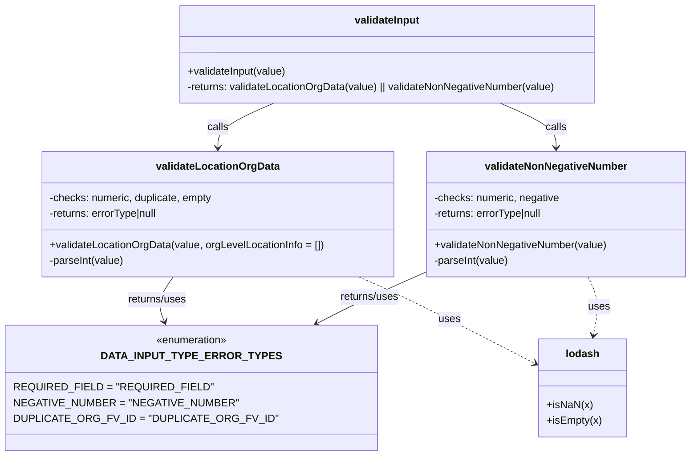

# Diagram: web/portal/src/pages/administration/location-management/utils/field_validation.js

> Auto-generated by Obscura crawlers

## Mermaid

### SVG

<svg id="container" width="1021.296875" xmlns="http://www.w3.org/2000/svg" class="classDiagram" height="698" viewBox="0 0 1021.296875 698" role="graphics-document document" aria-roledescription="class"><g><defs><marker id="container_class-aggregationStart" class="marker aggregation class" refX="18" refY="7" markerWidth="190" markerHeight="240" orient="auto"><path d="M 18,7 L9,13 L1,7 L9,1 Z"></path></marker></defs><defs><marker id="container_class-aggregationEnd" class="marker aggregation class" refX="1" refY="7" markerWidth="20" markerHeight="28" orient="auto"><path d="M 18,7 L9,13 L1,7 L9,1 Z"></path></marker></defs><defs><marker id="container_class-extensionStart" class="marker extension class" refX="18" refY="7" markerWidth="190" markerHeight="240" orient="auto"><path d="M 1,7 L18,13 V 1 Z"></path></marker></defs><defs><marker id="container_class-extensionEnd" class="marker extension class" refX="1" refY="7" markerWidth="20" markerHeight="28" orient="auto"><path d="M 1,1 V 13 L18,7 Z"></path></marker></defs><defs><marker id="container_class-compositionStart" class="marker composition class" refX="18" refY="7" markerWidth="190" markerHeight="240" orient="auto"><path d="M 18,7 L9,13 L1,7 L9,1 Z"></path></marker></defs><defs><marker id="container_class-compositionEnd" class="marker composition class" refX="1" refY="7" markerWidth="20" markerHeight="28" orient="auto"><path d="M 18,7 L9,13 L1,7 L9,1 Z"></path></marker></defs><defs><marker id="container_class-dependencyStart" class="marker dependency class" refX="6" refY="7" markerWidth="190" markerHeight="240" orient="auto"><path d="M 5,7 L9,13 L1,7 L9,1 Z"></path></marker></defs><defs><marker id="container_class-dependencyEnd" class="marker dependency class" refX="13" refY="7" markerWidth="20" markerHeight="28" orient="auto"><path d="M 18,7 L9,13 L14,7 L9,1 Z"></path></marker></defs><defs><marker id="container_class-lollipopStart" class="marker lollipop class" refX="13" refY="7" markerWidth="190" markerHeight="240" orient="auto"><circle stroke="black" fill="transparent" cx="7" cy="7" r="6"></circle></marker></defs><defs><marker id="container_class-lollipopEnd" class="marker lollipop class" refX="1" refY="7" markerWidth="190" markerHeight="240" orient="auto"><circle stroke="black" fill="transparent" cx="7" cy="7" r="6"></circle></marker></defs><g class="root"><g class="clusters"></g><g class="edgePaths"><path d="M384.803,158L370.596,164.167C356.388,170.333,327.973,182.667,313.766,194C299.559,205.333,299.559,215.667,299.559,220.833L299.559,226" id="id_validateInput_validateLocationOrgData_1" class="edge-thickness-normal edge-pattern-solid relation" style=";;;" data-edge="true" data-et="edge" data-id="id_validateInput_validateLocationOrgData_1" data-points="W3sieCI6Mzg0LjgwMjk5NTk1NDI0MTA2LCJ5IjoxNTh9LHsieCI6Mjk5LjU1ODU5Mzc1LCJ5IjoxOTV9LHsieCI6Mjk5LjU1ODU5Mzc1LCJ5IjoyMzJ9XQ==" marker-end="url(#container_class-dependencyEnd)"></path><path d="M730.388,158L744.596,164.167C758.803,170.333,787.218,182.667,801.425,194C815.633,205.333,815.633,215.667,815.633,220.833L815.633,226" id="id_validateInput_validateNonNegativeNumber_2" class="edge-thickness-normal edge-pattern-solid relation" style=";;;" data-edge="true" data-et="edge" data-id="id_validateInput_validateNonNegativeNumber_2" data-points="W3sieCI6NzMwLjM4ODQxMDI5NTc1OSwieSI6MTU4fSx7IngiOjgxNS42MzI4MTI1LCJ5IjoxOTV9LHsieCI6ODE1LjYzMjgxMjUsInkiOjIzMn1d" marker-end="url(#container_class-dependencyEnd)"></path><path d="M228.63,424L224.074,430.167C219.518,436.333,210.405,448.667,208.085,460.08C205.765,471.493,210.237,481.987,212.473,487.234L214.709,492.48" id="id_validateLocationOrgData_DATA_INPUT_TYPE_ERROR_TYPES_3" class="edge-thickness-normal edge-pattern-solid relation" style=";;;" data-edge="true" data-et="edge" data-id="id_validateLocationOrgData_DATA_INPUT_TYPE_ERROR_TYPES_3" data-points="W3sieCI6MjI4LjYzMDAyMjMyMTQyODU2LCJ5Ijo0MjR9LHsieCI6MjAxLjI5Mjk2ODc1LCJ5Ijo0NjF9LHsieCI6MjE3LjA2MTAwMjExNDY2MTY1LCJ5Ijo0OTh9XQ==" marker-end="url(#container_class-dependencyEnd)"></path><path d="M617.969,415.741L600.976,423.284C583.982,430.828,549.996,445.914,521.928,459.165C493.859,472.417,471.709,483.834,460.634,489.543L449.558,495.251" id="id_validateNonNegativeNumber_DATA_INPUT_TYPE_ERROR_TYPES_4" class="edge-thickness-normal edge-pattern-solid relation" style=";;;" data-edge="true" data-et="edge" data-id="id_validateNonNegativeNumber_DATA_INPUT_TYPE_ERROR_TYPES_4" data-points="W3sieCI6NjE3Ljk2ODc1LCJ5Ijo0MTUuNzQxMzE1NTg1MzM4M30seyJ4Ijo1MTYuMDA5NzY1NjI1LCJ5Ijo0NjF9LHsieCI6NDQ0LjIyNTAwNTg3NDA2MDEsInkiOjQ5OH1d" marker-end="url(#container_class-dependencyEnd)"></path><path d="M515.828,424L529.72,430.167C543.612,436.333,571.397,448.667,616.417,470.877C661.437,493.088,723.693,525.177,754.82,541.221L785.948,557.265" id="id_validateLocationOrgData_lodash_5" class="edge-thickness-normal edge-pattern-dashed relation" style=";;;" data-edge="true" data-et="edge" data-id="id_validateLocationOrgData_lodash_5" data-points="W3sieCI6NTE1LjgyNzg2MDY2NzI5MzIsInkiOjQyNH0seyJ4Ijo1OTkuMTgxNjQwNjI1LCJ5Ijo0NjF9LHsieCI6NzkxLjI4MTI1LCJ5Ijo1NjAuMDEzODUxNTY4NzA5MX1d" marker-end="url(#container_class-dependencyEnd)"></path><path d="M864.772,424L867.928,430.167C871.085,436.333,877.398,448.667,878.824,463.519C880.251,478.372,876.79,495.744,875.06,504.43L873.33,513.116" id="id_validateNonNegativeNumber_lodash_6" class="edge-thickness-normal edge-pattern-dashed relation" style=";;;" data-edge="true" data-et="edge" data-id="id_validateNonNegativeNumber_lodash_6" data-points="W3sieCI6ODY0Ljc3MTkxMDI0NDM2MDksInkiOjQyNH0seyJ4Ijo4ODMuNzEwOTM3NSwieSI6NDYxfSx7IngiOjg3Mi4xNTc5NTM0Nzc0NDM2LCJ5Ijo1MTl9XQ==" marker-end="url(#container_class-dependencyEnd)"></path></g><g class="edgeLabels"><g class="edgeLabel" transform="translate(299.55859375, 195)"><g class="label" data-id="id_validateInput_validateLocationOrgData_1" transform="translate(-16.4453125, -12)"><foreignObject width="32.890625" height="24">

calls

</foreignObject></g></g><g class="edgeLabel" transform="translate(815.6328125, 195)"><g class="label" data-id="id_validateInput_validateNonNegativeNumber_2" transform="translate(-16.4453125, -12)"><foreignObject width="32.890625" height="24">

calls

</foreignObject></g></g><g class="edgeLabel" transform="translate(203.0114, 458.67415)"><g class="label" data-id="id_validateLocationOrgData_DATA_INPUT_TYPE_ERROR_TYPES_3" transform="translate(-46.6796875, -12)"><foreignObject width="93.359375" height="24">

returns/uses

</foreignObject></g></g><g class="edgeLabel" transform="translate(516.009765625, 461)"><g class="label" data-id="id_validateNonNegativeNumber_DATA_INPUT_TYPE_ERROR_TYPES_4" transform="translate(-46.6796875, -12)"><foreignObject width="93.359375" height="24">

returns/uses

</foreignObject></g></g><g class="edgeLabel" transform="translate(654.70023, 489.61593)"><g class="label" data-id="id_validateLocationOrgData_lodash_5" transform="translate(-16.4921875, -12)"><foreignObject width="32.984375" height="24">

uses

</foreignObject></g></g><g class="edgeLabel" transform="translate(881.99439, 469.61769)"><g class="label" data-id="id_validateNonNegativeNumber_lodash_6" transform="translate(-16.4921875, -12)"><foreignObject width="32.984375" height="24">

uses

</foreignObject></g></g></g><g class="nodes"><g class="node default" id="classId-DATA_INPUT_TYPE_ERROR_TYPES-0" transform="translate(257.97265625, 594)"><g class="basic label-container"><path d="M-249.97265625 -96 L249.97265625 -96 L249.97265625 96 L-249.97265625 96" stroke="none" stroke-width="0" fill="#ECECFF" style=""></path><path d="M-249.97265625 -96 C-139.40404721520645 -96, -28.835438180412922 -96, 249.97265625 -96 M-249.97265625 -96 C-115.38057525846992 -96, 19.211505733060164 -96, 249.97265625 -96 M249.97265625 -96 C249.97265625 -56.61984042291896, 249.97265625 -17.239680845837924, 249.97265625 96 M249.97265625 -96 C249.97265625 -51.49092557855938, 249.97265625 -6.981851157118754, 249.97265625 96 M249.97265625 96 C113.77164049822224 96, -22.42937525355552 96, -249.97265625 96 M249.97265625 96 C93.41632717680372 96, -63.14000189639256 96, -249.97265625 96 M-249.97265625 96 C-249.97265625 38.0736460376187, -249.97265625 -19.852707924762598, -249.97265625 -96 M-249.97265625 96 C-249.97265625 45.55735858640214, -249.97265625 -4.885282827195724, -249.97265625 -96" stroke="#9370DB" stroke-width="1.3" fill="none" stroke-dasharray="0 0" style=""></path></g><g class="annotation-group text" transform="translate(-55.5546875, -72)"><g class="label" style="" transform="translate(0,-12)"><foreignObject width="111.109375" height="24">

«enumeration»

</foreignObject></g></g><g class="label-group text" transform="translate(-120.6015625, -48)"><g class="label" style="font-weight: bolder" transform="translate(0,-12)"><foreignObject width="241.203125" height="24">

DATA_INPUT_TYPE_ERROR_TYPES

</foreignObject></g></g><g class="members-group text" transform="translate(-237.97265625, 0)"><g class="label" style="" transform="translate(0,-12)"><foreignObject width="269.359375" height="24">

REQUIRED_FIELD = "REQUIRED_FIELD"

</foreignObject></g><g class="label" style="" transform="translate(0,12)"><foreignObject width="306.1875" height="24">

NEGATIVE_NUMBER = "NEGATIVE_NUMBER"

</foreignObject></g><g class="label" style="" transform="translate(0,36)"><foreignObject width="355.34375" height="24">

DUPLICATE_ORG_FV_ID = "DUPLICATE_ORG_FV_ID"

</foreignObject></g></g><g class="methods-group text" transform="translate(-237.97265625, 96)"></g><g class="divider" style=""><path d="M-249.97265625 -24 C-115.00114609308704 -24, 19.97036406382591 -24, 249.97265625 -24 M-249.97265625 -24 C-74.06572423262719 -24, 101.84120778474562 -24, 249.97265625 -24" stroke="#9370DB" stroke-width="1.3" fill="none" stroke-dasharray="0 0" style=""></path></g><g class="divider" style=""><path d="M-249.97265625 72 C-121.8897198560513 72, 6.193216537897399 72, 249.97265625 72 M-249.97265625 72 C-84.80102403768242 72, 80.37060817463515 72, 249.97265625 72" stroke="#9370DB" stroke-width="1.3" fill="none" stroke-dasharray="0 0" style=""></path></g></g><g class="node default" id="classId-validateLocationOrgData-1" transform="translate(299.55859375, 328)"><g class="basic label-container"><path d="M-268.41015625 -96 L268.41015625 -96 L268.41015625 96 L-268.41015625 96" stroke="none" stroke-width="0" fill="#ECECFF" style=""></path><path d="M-268.41015625 -96 C-56.48062118906057 -96, 155.44891387187886 -96, 268.41015625 -96 M-268.41015625 -96 C-126.83033553245255 -96, 14.749485185094898 -96, 268.41015625 -96 M268.41015625 -96 C268.41015625 -54.637304165912404, 268.41015625 -13.274608331824808, 268.41015625 96 M268.41015625 -96 C268.41015625 -28.54139872305997, 268.41015625 38.91720255388006, 268.41015625 96 M268.41015625 96 C85.81972538449196 96, -96.77070548101608 96, -268.41015625 96 M268.41015625 96 C82.25019552130206 96, -103.90976520739588 96, -268.41015625 96 M-268.41015625 96 C-268.41015625 34.92827063599062, -268.41015625 -26.143458728018757, -268.41015625 -96 M-268.41015625 96 C-268.41015625 57.450061105807805, -268.41015625 18.90012221161561, -268.41015625 -96" stroke="#9370DB" stroke-width="1.3" fill="none" stroke-dasharray="0 0" style=""></path></g><g class="annotation-group text" transform="translate(0, -72)"></g><g class="label-group text" transform="translate(-90.6953125, -72)"><g class="label" style="font-weight: bolder" transform="translate(0,-12)"><foreignObject width="181.390625" height="24">

validateLocationOrgData

</foreignObject></g></g><g class="members-group text" transform="translate(-256.41015625, -24)"><g class="label" style="" transform="translate(0,-12)"><foreignObject width="252.671875" height="24">

-checks: numeric, duplicate, empty

</foreignObject></g><g class="label" style="" transform="translate(0,12)"><foreignObject width="171.421875" height="24">

-returns: errorType|null

</foreignObject></g></g><g class="methods-group text" transform="translate(-256.41015625, 48)"><g class="label" style="" transform="translate(0,-12)"><foreignObject width="422.125" height="24">

+validateLocationOrgData(value, orgLevelLocationInfo = [])

</foreignObject></g><g class="label" style="" transform="translate(0,12)"><foreignObject width="115.75" height="24">

-parseInt(value)

</foreignObject></g></g><g class="divider" style=""><path d="M-268.41015625 -48 C-150.0862653096554 -48, -31.762374369310777 -48, 268.41015625 -48 M-268.41015625 -48 C-60.7428839993415 -48, 146.924388251317 -48, 268.41015625 -48" stroke="#9370DB" stroke-width="1.3" fill="none" stroke-dasharray="0 0" style=""></path></g><g class="divider" style=""><path d="M-268.41015625 24 C-71.15994589300263 24, 126.09026446399474 24, 268.41015625 24 M-268.41015625 24 C-87.25648648635138 24, 93.89718327729724 24, 268.41015625 24" stroke="#9370DB" stroke-width="1.3" fill="none" stroke-dasharray="0 0" style=""></path></g></g><g class="node default" id="classId-validateNonNegativeNumber-2" transform="translate(815.6328125, 328)"><g class="basic label-container"><path d="M-197.6640625 -96 L197.6640625 -96 L197.6640625 96 L-197.6640625 96" stroke="none" stroke-width="0" fill="#ECECFF" style=""></path><path d="M-197.6640625 -96 C-74.14956966981897 -96, 49.36492316036205 -96, 197.6640625 -96 M-197.6640625 -96 C-74.17798729904577 -96, 49.308087901908465 -96, 197.6640625 -96 M197.6640625 -96 C197.6640625 -47.86771903853864, 197.6640625 0.2645619229227236, 197.6640625 96 M197.6640625 -96 C197.6640625 -44.839781188467825, 197.6640625 6.32043762306435, 197.6640625 96 M197.6640625 96 C59.76640275009083 96, -78.13125699981833 96, -197.6640625 96 M197.6640625 96 C118.05329335450465 96, 38.44252420900929 96, -197.6640625 96 M-197.6640625 96 C-197.6640625 22.91279325640373, -197.6640625 -50.17441348719254, -197.6640625 -96 M-197.6640625 96 C-197.6640625 45.69202862754564, -197.6640625 -4.615942744908722, -197.6640625 -96" stroke="#9370DB" stroke-width="1.3" fill="none" stroke-dasharray="0 0" style=""></path></g><g class="annotation-group text" transform="translate(0, -72)"></g><g class="label-group text" transform="translate(-105.171875, -72)"><g class="label" style="font-weight: bolder" transform="translate(0,-12)"><foreignObject width="210.34375" height="24">

validateNonNegativeNumber

</foreignObject></g></g><g class="members-group text" transform="translate(-185.6640625, -24)"><g class="label" style="" transform="translate(0,-12)"><foreignObject width="192.84375" height="24">

-checks: numeric, negative

</foreignObject></g><g class="label" style="" transform="translate(0,12)"><foreignObject width="171.421875" height="24">

-returns: errorType|null

</foreignObject></g></g><g class="methods-group text" transform="translate(-185.6640625, 48)"><g class="label" style="" transform="translate(0,-12)"><foreignObject width="266.15625" height="24">

+validateNonNegativeNumber(value)

</foreignObject></g><g class="label" style="" transform="translate(0,12)"><foreignObject width="115.75" height="24">

-parseInt(value)

</foreignObject></g></g><g class="divider" style=""><path d="M-197.6640625 -48 C-93.3875298462332 -48, 10.889002807533586 -48, 197.6640625 -48 M-197.6640625 -48 C-101.51534347873874 -48, -5.366624457477485 -48, 197.6640625 -48" stroke="#9370DB" stroke-width="1.3" fill="none" stroke-dasharray="0 0" style=""></path></g><g class="divider" style=""><path d="M-197.6640625 24 C-59.312934172505294 24, 79.03819415498941 24, 197.6640625 24 M-197.6640625 24 C-82.60415267148045 24, 32.4557571570391 24, 197.6640625 24" stroke="#9370DB" stroke-width="1.3" fill="none" stroke-dasharray="0 0" style=""></path></g></g><g class="node default" id="classId-validateInput-3" transform="translate(557.595703125, 83)"><g class="basic label-container"><path d="M-323.6796875 -75 L323.6796875 -75 L323.6796875 75 L-323.6796875 75" stroke="none" stroke-width="0" fill="#ECECFF" style=""></path><path d="M-323.6796875 -75 C-110.6887485701117 -75, 102.3021903597766 -75, 323.6796875 -75 M-323.6796875 -75 C-126.08192116068949 -75, 71.51584517862102 -75, 323.6796875 -75 M323.6796875 -75 C323.6796875 -32.272034854728105, 323.6796875 10.45593029054379, 323.6796875 75 M323.6796875 -75 C323.6796875 -37.04710690770969, 323.6796875 0.9057861845806201, 323.6796875 75 M323.6796875 75 C93.9759708975738 75, -135.7277457048524 75, -323.6796875 75 M323.6796875 75 C126.72081825811983 75, -70.23805098376033 75, -323.6796875 75 M-323.6796875 75 C-323.6796875 25.22916464942039, -323.6796875 -24.54167070115922, -323.6796875 -75 M-323.6796875 75 C-323.6796875 32.63353517130789, -323.6796875 -9.732929657384219, -323.6796875 -75" stroke="#9370DB" stroke-width="1.3" fill="none" stroke-dasharray="0 0" style=""></path></g><g class="annotation-group text" transform="translate(0, -51)"></g><g class="label-group text" transform="translate(-48.8125, -51)"><g class="label" style="font-weight: bolder" transform="translate(0,-12)"><foreignObject width="97.625" height="24">

validateInput

</foreignObject></g></g><g class="members-group text" transform="translate(-311.6796875, -3)"></g><g class="methods-group text" transform="translate(-311.6796875, 27)"><g class="label" style="" transform="translate(0,-12)"><foreignObject width="153.65625" height="24">

+validateInput(value)

</foreignObject></g><g class="label" style="" transform="translate(0,12)"><foreignObject width="574.546875" height="24">

-returns: validateLocationOrgData(value) || validateNonNegativeNumber(value)

</foreignObject></g></g><g class="divider" style=""><path d="M-323.6796875 -27 C-150.43019921955087 -27, 22.819289060898257 -27, 323.6796875 -27 M-323.6796875 -27 C-186.26132446746257 -27, -48.842961434925144 -27, 323.6796875 -27" stroke="#9370DB" stroke-width="1.3" fill="none" stroke-dasharray="0 0" style=""></path></g><g class="divider" style=""><path d="M-323.6796875 -3 C-135.39542040935422 -3, 52.88884668129157 -3, 323.6796875 -3 M-323.6796875 -3 C-91.44617383139979 -3, 140.78733983720042 -3, 323.6796875 -3" stroke="#9370DB" stroke-width="1.3" fill="none" stroke-dasharray="0 0" style=""></path></g></g><g class="node default" id="classId-lodash-4" transform="translate(857.21875, 594)"><g class="basic label-container"><path d="M-65.9375 -75 L65.9375 -75 L65.9375 75 L-65.9375 75" stroke="none" stroke-width="0" fill="#ECECFF" style=""></path><path d="M-65.9375 -75 C-31.01232124487057 -75, 3.91285751025886 -75, 65.9375 -75 M-65.9375 -75 C-34.143943878370884 -75, -2.3503877567417675 -75, 65.9375 -75 M65.9375 -75 C65.9375 -27.790301320424334, 65.9375 19.419397359151333, 65.9375 75 M65.9375 -75 C65.9375 -27.599099446518956, 65.9375 19.80180110696209, 65.9375 75 M65.9375 75 C25.52765636881184 75, -14.88218726237632 75, -65.9375 75 M65.9375 75 C37.39806617843711 75, 8.858632356874224 75, -65.9375 75 M-65.9375 75 C-65.9375 37.00296511815777, -65.9375 -0.9940697636844646, -65.9375 -75 M-65.9375 75 C-65.9375 29.150625142336985, -65.9375 -16.69874971532603, -65.9375 -75" stroke="#9370DB" stroke-width="1.3" fill="none" stroke-dasharray="0 0" style=""></path></g><g class="annotation-group text" transform="translate(0, -51)"></g><g class="label-group text" transform="translate(-24.59375, -51)"><g class="label" style="font-weight: bolder" transform="translate(0,-12)"><foreignObject width="49.1875" height="24">

lodash

</foreignObject></g></g><g class="members-group text" transform="translate(-53.9375, -3)"></g><g class="methods-group text" transform="translate(-53.9375, 27)"><g class="label" style="" transform="translate(0,-12)"><foreignObject width="68.65625" height="24">

+isNaN(x)

</foreignObject></g><g class="label" style="" transform="translate(0,12)"><foreignObject width="83.28125" height="24">

+isEmpty(x)

</foreignObject></g></g><g class="divider" style=""><path d="M-65.9375 -27 C-23.84782692857302 -27, 18.24184614285396 -27, 65.9375 -27 M-65.9375 -27 C-30.835032873864 -27, 4.267434252271997 -27, 65.9375 -27" stroke="#9370DB" stroke-width="1.3" fill="none" stroke-dasharray="0 0" style=""></path></g><g class="divider" style=""><path d="M-65.9375 -3 C-18.21399825208362 -3, 29.50950349583276 -3, 65.9375 -3 M-65.9375 -3 C-26.280322997195327 -3, 13.376854005609346 -3, 65.9375 -3" stroke="#9370DB" stroke-width="1.3" fill="none" stroke-dasharray="0 0" style=""></path></g></g></g></g></g></svg>
