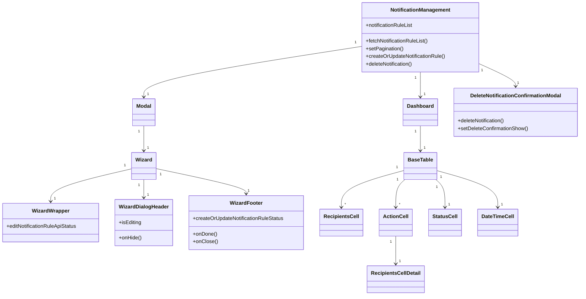

# Diagram: web/portal/src/pages/administration/notification-management/NotificationManagement.page.js


> Auto-generated by Obscura crawlers

## Diagram 1



### SVG

<svg id="container" width="1782.015625" xmlns="http://www.w3.org/2000/svg" class="classDiagram" height="918" viewBox="0 0 1782.015625 918" role="graphics-document document" aria-roledescription="class"><style>#container{font-family:"trebuchet ms",verdana,arial,sans-serif;font-size:16px;fill:#333;}@keyframes edge-animation-frame{from{stroke-dashoffset:0;}}@keyframes dash{to{stroke-dashoffset:0;}}#container .edge-animation-slow{stroke-dasharray:9,5!important;stroke-dashoffset:900;animation:dash 50s linear infinite;stroke-linecap:round;}#container .edge-animation-fast{stroke-dasharray:9,5!important;stroke-dashoffset:900;animation:dash 20s linear infinite;stroke-linecap:round;}#container .error-icon{fill:#552222;}#container .error-text{fill:#552222;stroke:#552222;}#container .edge-thickness-normal{stroke-width:1px;}#container .edge-thickness-thick{stroke-width:3.5px;}#container .edge-pattern-solid{stroke-dasharray:0;}#container .edge-thickness-invisible{stroke-width:0;fill:none;}#container .edge-pattern-dashed{stroke-dasharray:3;}#container .edge-pattern-dotted{stroke-dasharray:2;}#container .marker{fill:#333333;stroke:#333333;}#container .marker.cross{stroke:#333333;}#container svg{font-family:"trebuchet ms",verdana,arial,sans-serif;font-size:16px;}#container p{margin:0;}#container g.classGroup text{fill:#9370DB;stroke:none;font-family:"trebuchet ms",verdana,arial,sans-serif;font-size:10px;}#container g.classGroup text .title{font-weight:bolder;}#container .nodeLabel,#container .edgeLabel{color:#131300;}#container .edgeLabel .label rect{fill:#ECECFF;}#container .label text{fill:#131300;}#container .labelBkg{background:#ECECFF;}#container .edgeLabel .label span{background:#ECECFF;}#container .classTitle{font-weight:bolder;}#container .node rect,#container .node circle,#container .node ellipse,#container .node polygon,#container .node path{fill:#ECECFF;stroke:#9370DB;stroke-width:1px;}#container .divider{stroke:#9370DB;stroke-width:1;}#container g.clickable{cursor:pointer;}#container g.classGroup rect{fill:#ECECFF;stroke:#9370DB;}#container g.classGroup line{stroke:#9370DB;stroke-width:1;}#container .classLabel .box{stroke:none;stroke-width:0;fill:#ECECFF;opacity:0.5;}#container .classLabel .label{fill:#9370DB;font-size:10px;}#container .relation{stroke:#333333;stroke-width:1;fill:none;}#container .dashed-line{stroke-dasharray:3;}#container .dotted-line{stroke-dasharray:1 2;}#container #compositionStart,#container .composition{fill:#333333!important;stroke:#333333!important;stroke-width:1;}#container #compositionEnd,#container .composition{fill:#333333!important;stroke:#333333!important;stroke-width:1;}#container #dependencyStart,#container .dependency{fill:#333333!important;stroke:#333333!important;stroke-width:1;}#container #dependencyStart,#container .dependency{fill:#333333!important;stroke:#333333!important;stroke-width:1;}#container #extensionStart,#container .extension{fill:transparent!important;stroke:#333333!important;stroke-width:1;}#container #extensionEnd,#container .extension{fill:transparent!important;stroke:#333333!important;stroke-width:1;}#container #aggregationStart,#container .aggregation{fill:transparent!important;stroke:#333333!important;stroke-width:1;}#container #aggregationEnd,#container .aggregation{fill:transparent!important;stroke:#333333!important;stroke-width:1;}#container #lollipopStart,#container .lollipop{fill:#ECECFF!important;stroke:#333333!important;stroke-width:1;}#container #lollipopEnd,#container .lollipop{fill:#ECECFF!important;stroke:#333333!important;stroke-width:1;}#container .edgeTerminals{font-size:11px;line-height:initial;}#container .classTitleText{text-anchor:middle;font-size:18px;fill:#333;}#container .label-icon{display:inline-block;height:1em;overflow:visible;vertical-align:-0.125em;}#container .node .label-icon path{fill:currentColor;stroke:revert;stroke-width:revert;}#container :root{--mermaid-font-family:"trebuchet ms",verdana,arial,sans-serif;}</style><g><defs><marker id="container_class-aggregationStart" class="marker aggregation class" refX="18" refY="7" markerWidth="190" markerHeight="240" orient="auto"><path d="M 18,7 L9,13 L1,7 L9,1 Z"></path></marker></defs><defs><marker id="container_class-aggregationEnd" class="marker aggregation class" refX="1" refY="7" markerWidth="20" markerHeight="28" orient="auto"><path d="M 18,7 L9,13 L1,7 L9,1 Z"></path></marker></defs><defs><marker id="container_class-extensionStart" class="marker extension class" refX="18" refY="7" markerWidth="190" markerHeight="240" orient="auto"><path d="M 1,7 L18,13 V 1 Z"></path></marker></defs><defs><marker id="container_class-extensionEnd" class="marker extension class" refX="1" refY="7" markerWidth="20" markerHeight="28" orient="auto"><path d="M 1,1 V 13 L18,7 Z"></path></marker></defs><defs><marker id="container_class-compositionStart" class="marker composition class" refX="18" refY="7" markerWidth="190" markerHeight="240" orient="auto"><path d="M 18,7 L9,13 L1,7 L9,1 Z"></path></marker></defs><defs><marker id="container_class-compositionEnd" class="marker composition class" refX="1" refY="7" markerWidth="20" markerHeight="28" orient="auto"><path d="M 18,7 L9,13 L1,7 L9,1 Z"></path></marker></defs><defs><marker id="container_class-dependencyStart" class="marker dependency class" refX="6" refY="7" markerWidth="190" markerHeight="240" orient="auto"><path d="M 5,7 L9,13 L1,7 L9,1 Z"></path></marker></defs><defs><marker id="container_class-dependencyEnd" class="marker dependency class" refX="13" refY="7" markerWidth="20" markerHeight="28" orient="auto"><path d="M 18,7 L9,13 L14,7 L9,1 Z"></path></marker></defs><defs><marker id="container_class-lollipopStart" class="marker lollipop class" refX="13" refY="7" markerWidth="190" markerHeight="240" orient="auto"><circle stroke="black" fill="transparent" cx="7" cy="7" r="6"></circle></marker></defs><defs><marker id="container_class-lollipopEnd" class="marker lollipop class" refX="1" refY="7" markerWidth="190" markerHeight="240" orient="auto"><circle stroke="black" fill="transparent" cx="7" cy="7" r="6"></circle></marker></defs><g class="root"><g class="clusters"></g><g class="edgePaths"><path d="M1292,224L1292,228.167C1292,232.333,1292,240.667,1292,253.5C1292,266.333,1292,283.667,1292,292.333L1292,301" id="id_NotificationManagement_Dashboard_1" class="edge-thickness-normal edge-pattern-solid relation" style=";;;" data-edge="true" data-et="edge" data-id="id_NotificationManagement_Dashboard_1" data-points="W3sieCI6MTI5MiwieSI6MjI0fSx7IngiOjEyOTIsInkiOjI0OX0seyJ4IjoxMjkyLCJ5IjozMDd9XQ==" marker-end="url(#container_class-dependencyEnd)"></path><path d="M1292,391L1292,400.667C1292,410.333,1292,429.667,1292,442.5C1292,455.333,1292,461.667,1292,464.833L1292,468" id="id_Dashboard_BaseTable_2" class="edge-thickness-normal edge-pattern-solid relation" style=";;;" data-edge="true" data-et="edge" data-id="id_Dashboard_BaseTable_2" data-points="W3sieCI6MTI5MiwieSI6MzkxfSx7IngiOjEyOTIsInkiOjQ0OX0seyJ4IjoxMjkyLCJ5Ijo0NzR9XQ==" marker-end="url(#container_class-dependencyEnd)"></path><path d="M1109.809,144.678L999.348,162.065C888.888,179.452,667.967,214.226,557.507,240.28C447.047,266.333,447.047,283.667,447.047,292.333L447.047,301" id="id_NotificationManagement_Modal_3" class="edge-thickness-normal edge-pattern-solid relation" style=";;;" data-edge="true" data-et="edge" data-id="id_NotificationManagement_Modal_3" data-points="W3sieCI6MTEwOS44MDg1OTM3NSwieSI6MTQ0LjY3Nzg3MTM2ODYwNDAzfSx7IngiOjQ0Ny4wNDY4NzUsInkiOjI0OX0seyJ4Ijo0NDcuMDQ2ODc1LCJ5IjozMDd9XQ==" marker-end="url(#container_class-dependencyEnd)"></path><path d="M447.047,391L447.047,400.667C447.047,410.333,447.047,429.667,447.047,442.5C447.047,455.333,447.047,461.667,447.047,464.833L447.047,468" id="id_Modal_Wizard_4" class="edge-thickness-normal edge-pattern-solid relation" style=";;;" data-edge="true" data-et="edge" data-id="id_Modal_Wizard_4" data-points="W3sieCI6NDQ3LjA0Njg3NSwieSI6MzkxfSx7IngiOjQ0Ny4wNDY4NzUsInkiOjQ0OX0seyJ4Ijo0NDcuMDQ2ODc1LCJ5Ijo0NzR9XQ==" marker-end="url(#container_class-dependencyEnd)"></path><path d="M410.305,524.556L368.475,534.297C326.645,544.037,242.984,563.519,201.154,580.426C159.324,597.333,159.324,611.667,159.324,618.833L159.324,626" id="id_Wizard_WizardWrapper_5" class="edge-thickness-normal edge-pattern-solid relation" style=";;;" data-edge="true" data-et="edge" data-id="id_Wizard_WizardWrapper_5" data-points="W3sieCI6NDEwLjMwNDY4NzUsInkiOjUyNC41NTU5MDEwMDA1ODM4fSx7IngiOjE1OS4zMjQyMTg3NSwieSI6NTgzfSx7IngiOjE1OS4zMjQyMTg3NSwieSI6NjMyfV0=" marker-end="url(#container_class-dependencyEnd)"></path><path d="M447.047,558L447.047,562.167C447.047,566.333,447.047,574.667,447.047,584C447.047,593.333,447.047,603.667,447.047,608.833L447.047,614" id="id_Wizard_WizardDialogHeader_6" class="edge-thickness-normal edge-pattern-solid relation" style=";;;" data-edge="true" data-et="edge" data-id="id_Wizard_WizardDialogHeader_6" data-points="W3sieCI6NDQ3LjA0Njg3NSwieSI6NTU4fSx7IngiOjQ0Ny4wNDY4NzUsInkiOjU4M30seyJ4Ijo0NDcuMDQ2ODc1LCJ5Ijo2MjB9XQ==" marker-end="url(#container_class-dependencyEnd)"></path><path d="M483.789,523.806L530.225,533.672C576.661,543.537,669.534,563.269,715.97,576.301C762.406,589.333,762.406,595.667,762.406,598.833L762.406,602" id="id_Wizard_WizardFooter_7" class="edge-thickness-normal edge-pattern-solid relation" style=";;;" data-edge="true" data-et="edge" data-id="id_Wizard_WizardFooter_7" data-points="W3sieCI6NDgzLjc4OTA2MjUsInkiOjUyMy44MDYwOTkxOTIzODk2fSx7IngiOjc2Mi40MDYyNSwieSI6NTgzfSx7IngiOjc2Mi40MDYyNSwieSI6NjA4fV0=" marker-end="url(#container_class-dependencyEnd)"></path><path d="M1474.191,199.062L1492.447,207.385C1510.703,215.708,1547.215,232.354,1565.471,243.844C1583.727,255.333,1583.727,261.667,1583.727,264.833L1583.727,268" id="id_NotificationManagement_DeleteNotificationConfirmationModal_8" class="edge-thickness-normal edge-pattern-solid relation" style=";;;" data-edge="true" data-et="edge" data-id="id_NotificationManagement_DeleteNotificationConfirmationModal_8" data-points="W3sieCI6MTQ3NC4xOTE0MDYyNSwieSI6MTk5LjA2MjIyMzgyOTAzNTF9LHsieCI6MTU4My43MjY1NjI1LCJ5IjoyNDl9LHsieCI6MTU4My43MjY1NjI1LCJ5IjoyNzR9XQ==" marker-end="url(#container_class-dependencyEnd)"></path><path d="M1245.646,558L1241.048,562.167C1236.449,566.333,1227.252,574.667,1222.653,589C1218.055,603.333,1218.055,623.667,1218.055,633.833L1218.055,644" id="id_BaseTable_ActionCell_9" class="edge-thickness-normal edge-pattern-solid relation" style=";;;" data-edge="true" data-et="edge" data-id="id_BaseTable_ActionCell_9" data-points="W3sieCI6MTI0NS42NDYyMjIwMTQ5MjUzLCJ5Ijo1NTh9LHsieCI6MTIxOC4wNTQ2ODc1LCJ5Ijo1ODN9LHsieCI6MTIxOC4wNTQ2ODc1LCJ5Ijo2NTB9XQ==" marker-end="url(#container_class-dependencyEnd)"></path><path d="M1242.641,529.972L1211.419,538.81C1180.198,547.648,1117.755,565.324,1086.534,584.329C1055.313,603.333,1055.313,623.667,1055.313,633.833L1055.313,644" id="id_BaseTable_RecipientsCell_10" class="edge-thickness-normal edge-pattern-solid relation" style=";;;" data-edge="true" data-et="edge" data-id="id_BaseTable_RecipientsCell_10" data-points="W3sieCI6MTI0Mi42NDA2MjUsInkiOjUyOS45NzIzMzk1ODI3ODMyfSx7IngiOjEwNTUuMzEyNSwieSI6NTgzfSx7IngiOjEwNTUuMzEyNSwieSI6NjUwfV0=" marker-end="url(#container_class-dependencyEnd)"></path><path d="M1218.055,734L1218.055,745.167C1218.055,756.333,1218.055,778.667,1218.055,793C1218.055,807.333,1218.055,813.667,1218.055,816.833L1218.055,820" id="id_ActionCell_RecipientsCellDetail_11" class="edge-thickness-normal edge-pattern-solid relation" style=";;;" data-edge="true" data-et="edge" data-id="id_ActionCell_RecipientsCellDetail_11" data-points="W3sieCI6MTIxOC4wNTQ2ODc1LCJ5Ijo3MzR9LHsieCI6MTIxOC4wNTQ2ODc1LCJ5Ijo4MDF9LHsieCI6MTIxOC4wNTQ2ODc1LCJ5Ijo4MjZ9XQ==" marker-end="url(#container_class-dependencyEnd)"></path><path d="M1338.354,558L1342.952,562.167C1347.551,566.333,1356.748,574.667,1361.347,589C1365.945,603.333,1365.945,623.667,1365.945,633.833L1365.945,644" id="id_BaseTable_StatusCell_12" class="edge-thickness-normal edge-pattern-solid relation" style=";;;" data-edge="true" data-et="edge" data-id="id_BaseTable_StatusCell_12" data-points="W3sieCI6MTMzOC4zNTM3Nzc5ODUwNzQ3LCJ5Ijo1NTh9LHsieCI6MTM2NS45NDUzMTI1LCJ5Ijo1ODN9LHsieCI6MTM2NS45NDUzMTI1LCJ5Ijo2NTB9XQ==" marker-end="url(#container_class-dependencyEnd)"></path><path d="M1341.359,530.177L1372.012,538.981C1402.664,547.785,1463.969,565.392,1494.621,584.363C1525.273,603.333,1525.273,623.667,1525.273,633.833L1525.273,644" id="id_BaseTable_DateTimeCell_13" class="edge-thickness-normal edge-pattern-solid relation" style=";;;" data-edge="true" data-et="edge" data-id="id_BaseTable_DateTimeCell_13" data-points="W3sieCI6MTM0MS4zNTkzNzUsInkiOjUzMC4xNzY4MzExMDYxOTkyfSx7IngiOjE1MjUuMjczNDM3NSwieSI6NTgzfSx7IngiOjE1MjUuMjczNDM3NSwieSI6NjUwfV0=" marker-end="url(#container_class-dependencyEnd)"></path></g><g class="edgeLabels"><g class="edgeLabel"><g class="label" data-id="id_NotificationManagement_Dashboard_1" transform="translate(0, 0)"><foreignObject width="0" height="0"><div xmlns="http://www.w3.org/1999/xhtml" class="labelBkg" style="display: table-cell; white-space: nowrap; line-height: 1.5; max-width: 200px; text-align: center;"><span class="edgeLabel"></span></div></foreignObject></g></g><g class="edgeLabel"><g class="label" data-id="id_Dashboard_BaseTable_2" transform="translate(0, 0)"><foreignObject width="0" height="0"><div xmlns="http://www.w3.org/1999/xhtml" class="labelBkg" style="display: table-cell; white-space: nowrap; line-height: 1.5; max-width: 200px; text-align: center;"><span class="edgeLabel"></span></div></foreignObject></g></g><g class="edgeLabel"><g class="label" data-id="id_NotificationManagement_Modal_3" transform="translate(0, 0)"><foreignObject width="0" height="0"><div xmlns="http://www.w3.org/1999/xhtml" class="labelBkg" style="display: table-cell; white-space: nowrap; line-height: 1.5; max-width: 200px; text-align: center;"><span class="edgeLabel"></span></div></foreignObject></g></g><g class="edgeLabel"><g class="label" data-id="id_Modal_Wizard_4" transform="translate(0, 0)"><foreignObject width="0" height="0"><div xmlns="http://www.w3.org/1999/xhtml" class="labelBkg" style="display: table-cell; white-space: nowrap; line-height: 1.5; max-width: 200px; text-align: center;"><span class="edgeLabel"></span></div></foreignObject></g></g><g class="edgeLabel"><g class="label" data-id="id_Wizard_WizardWrapper_5" transform="translate(0, 0)"><foreignObject width="0" height="0"><div xmlns="http://www.w3.org/1999/xhtml" class="labelBkg" style="display: table-cell; white-space: nowrap; line-height: 1.5; max-width: 200px; text-align: center;"><span class="edgeLabel"></span></div></foreignObject></g></g><g class="edgeLabel"><g class="label" data-id="id_Wizard_WizardDialogHeader_6" transform="translate(0, 0)"><foreignObject width="0" height="0"><div xmlns="http://www.w3.org/1999/xhtml" class="labelBkg" style="display: table-cell; white-space: nowrap; line-height: 1.5; max-width: 200px; text-align: center;"><span class="edgeLabel"></span></div></foreignObject></g></g><g class="edgeLabel"><g class="label" data-id="id_Wizard_WizardFooter_7" transform="translate(0, 0)"><foreignObject width="0" height="0"><div xmlns="http://www.w3.org/1999/xhtml" class="labelBkg" style="display: table-cell; white-space: nowrap; line-height: 1.5; max-width: 200px; text-align: center;"><span class="edgeLabel"></span></div></foreignObject></g></g><g class="edgeLabel"><g class="label" data-id="id_NotificationManagement_DeleteNotificationConfirmationModal_8" transform="translate(0, 0)"><foreignObject width="0" height="0"><div xmlns="http://www.w3.org/1999/xhtml" class="labelBkg" style="display: table-cell; white-space: nowrap; line-height: 1.5; max-width: 200px; text-align: center;"><span class="edgeLabel"></span></div></foreignObject></g></g><g class="edgeLabel"><g class="label" data-id="id_BaseTable_ActionCell_9" transform="translate(0, 0)"><foreignObject width="0" height="0"><div xmlns="http://www.w3.org/1999/xhtml" class="labelBkg" style="display: table-cell; white-space: nowrap; line-height: 1.5; max-width: 200px; text-align: center;"><span class="edgeLabel"></span></div></foreignObject></g></g><g class="edgeLabel"><g class="label" data-id="id_BaseTable_RecipientsCell_10" transform="translate(0, 0)"><foreignObject width="0" height="0"><div xmlns="http://www.w3.org/1999/xhtml" class="labelBkg" style="display: table-cell; white-space: nowrap; line-height: 1.5; max-width: 200px; text-align: center;"><span class="edgeLabel"></span></div></foreignObject></g></g><g class="edgeLabel"><g class="label" data-id="id_ActionCell_RecipientsCellDetail_11" transform="translate(0, 0)"><foreignObject width="0" height="0"><div xmlns="http://www.w3.org/1999/xhtml" class="labelBkg" style="display: table-cell; white-space: nowrap; line-height: 1.5; max-width: 200px; text-align: center;"><span class="edgeLabel"></span></div></foreignObject></g></g><g class="edgeLabel"><g class="label" data-id="id_BaseTable_StatusCell_12" transform="translate(0, 0)"><foreignObject width="0" height="0"><div xmlns="http://www.w3.org/1999/xhtml" class="labelBkg" style="display: table-cell; white-space: nowrap; line-height: 1.5; max-width: 200px; text-align: center;"><span class="edgeLabel"></span></div></foreignObject></g></g><g class="edgeLabel"><g class="label" data-id="id_BaseTable_DateTimeCell_13" transform="translate(0, 0)"><foreignObject width="0" height="0"><div xmlns="http://www.w3.org/1999/xhtml" class="labelBkg" style="display: table-cell; white-space: nowrap; line-height: 1.5; max-width: 200px; text-align: center;"><span class="edgeLabel"></span></div></foreignObject></g></g><g class="edgeTerminals" transform="translate(1277, 241.5)"><g class="inner" transform="translate(0, 0)"><foreignObject style="width: 9px; height: 12px;"><div xmlns="http://www.w3.org/1999/xhtml" style="display: inline-block; padding-right: 1px; white-space: nowrap;"><span class="edgeLabel">1</span></div></foreignObject></g></g><g class="edgeTerminals" transform="translate(1277, 408.5)"><g class="inner" transform="translate(0, 0)"><foreignObject style="width: 9px; height: 12px;"><div xmlns="http://www.w3.org/1999/xhtml" style="display: inline-block; padding-right: 1px; white-space: nowrap;"><span class="edgeLabel">1</span></div></foreignObject></g></g><g class="edgeTerminals" transform="translate(1090.189079402632, 132.5814006524517)"><g class="inner" transform="translate(0, 0)"><foreignObject style="width: 9px; height: 12px;"><div xmlns="http://www.w3.org/1999/xhtml" style="display: inline-block; padding-right: 1px; white-space: nowrap;"><span class="edgeLabel">1</span></div></foreignObject></g></g><g class="edgeTerminals" transform="translate(432.04687750000016, 408.5000021428571)"><g class="inner" transform="translate(0, 0)"><foreignObject style="width: 9px; height: 12px;"><div xmlns="http://www.w3.org/1999/xhtml" style="display: inline-block; padding-right: 1px; white-space: nowrap;"><span class="edgeLabel">1</span></div></foreignObject></g></g><g class="edgeTerminals" transform="translate(389.8587629998836, 513.9156840723092)"><g class="inner" transform="translate(0, 0)"><foreignObject style="width: 9px; height: 12px;"><div xmlns="http://www.w3.org/1999/xhtml" style="display: inline-block; padding-right: 1px; white-space: nowrap;"><span class="edgeLabel">1</span></div></foreignObject></g></g><g class="edgeTerminals" transform="translate(432.04687750000016, 575.5000021428572)"><g class="inner" transform="translate(0, 0)"><foreignObject style="width: 9px; height: 12px;"><div xmlns="http://www.w3.org/1999/xhtml" style="display: inline-block; padding-right: 1px; white-space: nowrap;"><span class="edgeLabel">1</span></div></foreignObject></g></g><g class="edgeTerminals" transform="translate(497.78973042260225, 542.1154231423237)"><g class="inner" transform="translate(0, 0)"><foreignObject style="width: 9px; height: 12px;"><div xmlns="http://www.w3.org/1999/xhtml" style="display: inline-block; padding-right: 1px; white-space: nowrap;"><span class="edgeLabel">1</span></div></foreignObject></g></g><g class="edgeTerminals" transform="translate(1483.8922135319172, 219.97022295692975)"><g class="inner" transform="translate(0, 0)"><foreignObject style="width: 9px; height: 12px;"><div xmlns="http://www.w3.org/1999/xhtml" style="display: inline-block; padding-right: 1px; white-space: nowrap;"><span class="edgeLabel">1</span></div></foreignObject></g></g><g class="edgeTerminals" transform="translate(1222.606097253032, 558.6345732942461)"><g class="inner" transform="translate(0, 0)"><foreignObject style="width: 9px; height: 12px;"><div xmlns="http://www.w3.org/1999/xhtml" style="display: inline-block; padding-right: 1px; white-space: nowrap;"><span class="edgeLabel">1</span></div></foreignObject></g></g><g class="edgeTerminals" transform="translate(1221.7166946997745, 520.3059509579451)"><g class="inner" transform="translate(0, 0)"><foreignObject style="width: 9px; height: 12px;"><div xmlns="http://www.w3.org/1999/xhtml" style="display: inline-block; padding-right: 1px; white-space: nowrap;"><span class="edgeLabel">1</span></div></foreignObject></g></g><g class="edgeTerminals" transform="translate(1203.05468875, 751.5000010714285)"><g class="inner" transform="translate(0, 0)"><foreignObject style="width: 9px; height: 12px;"><div xmlns="http://www.w3.org/1999/xhtml" style="display: inline-block; padding-right: 1px; white-space: nowrap;"><span class="edgeLabel">1</span></div></foreignObject></g></g><g class="edgeTerminals" transform="translate(1341.2504552381067, 580.8661167057537)"><g class="inner" transform="translate(0, 0)"><foreignObject style="width: 9px; height: 12px;"><div xmlns="http://www.w3.org/1999/xhtml" style="display: inline-block; padding-right: 1px; white-space: nowrap;"><span class="edgeLabel">1</span></div></foreignObject></g></g><g class="edgeTerminals" transform="translate(1354.0385169704964, 549.4249301317942)"><g class="inner" transform="translate(0, 0)"><foreignObject style="width: 9px; height: 12px;"><div xmlns="http://www.w3.org/1999/xhtml" style="display: inline-block; padding-right: 1px; white-space: nowrap;"><span class="edgeLabel">1</span></div></foreignObject></g></g><g class="edgeTerminals" transform="translate(1302, 284.5)"><g class="inner" transform="translate(0, 0)"></g><foreignObject style="width: 9px; height: 12px;"><div xmlns="http://www.w3.org/1999/xhtml" style="display: inline-block; padding-right: 1px; white-space: nowrap;"><span class="edgeLabel">1</span></div></foreignObject></g><g class="edgeTerminals" transform="translate(1302, 451.5)"><g class="inner" transform="translate(0, 0)"></g><foreignObject style="width: 9px; height: 12px;"><div xmlns="http://www.w3.org/1999/xhtml" style="display: inline-block; padding-right: 1px; white-space: nowrap;"><span class="edgeLabel">1</span></div></foreignObject></g><g class="edgeTerminals" transform="translate(457.0468774999998, 284.5000021428571)"><g class="inner" transform="translate(0, 0)"></g><foreignObject style="width: 9px; height: 12px;"><div xmlns="http://www.w3.org/1999/xhtml" style="display: inline-block; padding-right: 1px; white-space: nowrap;"><span class="edgeLabel">1</span></div></foreignObject></g><g class="edgeTerminals" transform="translate(457.0468774999998, 451.5000021428571)"><g class="inner" transform="translate(0, 0)"></g><foreignObject style="width: 9px; height: 12px;"><div xmlns="http://www.w3.org/1999/xhtml" style="display: inline-block; padding-right: 1px; white-space: nowrap;"><span class="edgeLabel">1</span></div></foreignObject></g><g class="edgeTerminals" transform="translate(169.32421937499998, 609.5000005357143)"><g class="inner" transform="translate(0, 0)"></g><foreignObject style="width: 9px; height: 12px;"><div xmlns="http://www.w3.org/1999/xhtml" style="display: inline-block; padding-right: 1px; white-space: nowrap;"><span class="edgeLabel">1</span></div></foreignObject></g><g class="edgeTerminals" transform="translate(457.0468774999998, 597.5000021428572)"><g class="inner" transform="translate(0, 0)"></g><foreignObject style="width: 9px; height: 12px;"><div xmlns="http://www.w3.org/1999/xhtml" style="display: inline-block; padding-right: 1px; white-space: nowrap;"><span class="edgeLabel">1</span></div></foreignObject></g><g class="edgeTerminals" transform="translate(766.6231444806799, 584.3646537444105)"><g class="inner" transform="translate(0, 0)"></g><foreignObject style="width: 9px; height: 12px;"><div xmlns="http://www.w3.org/1999/xhtml" style="display: inline-block; padding-right: 1px; white-space: nowrap;"><span class="edgeLabel">1</span></div></foreignObject></g><g class="edgeTerminals" transform="translate(1588.4956425276657, 249.9561376285468)"><g class="inner" transform="translate(0, 0)"></g><foreignObject style="width: 9px; height: 12px;"><div xmlns="http://www.w3.org/1999/xhtml" style="display: inline-block; padding-right: 1px; white-space: nowrap;"><span class="edgeLabel">1</span></div></foreignObject></g><g class="edgeTerminals" transform="translate(1228.05468875, 627.5000010714285)"><g class="inner" transform="translate(0, 0)"></g><foreignObject style="width: 9px; height: 12px;"><div xmlns="http://www.w3.org/1999/xhtml" style="display: inline-block; padding-right: 1px; white-space: nowrap;"><span class="edgeLabel">*</span></div></foreignObject></g><g class="edgeTerminals" transform="translate(1065.3125, 627.5)"><g class="inner" transform="translate(0, 0)"></g><foreignObject style="width: 9px; height: 12px;"><div xmlns="http://www.w3.org/1999/xhtml" style="display: inline-block; padding-right: 1px; white-space: nowrap;"><span class="edgeLabel">*</span></div></foreignObject></g><g class="edgeTerminals" transform="translate(1228.05468875, 803.5000010714285)"><g class="inner" transform="translate(0, 0)"></g><foreignObject style="width: 9px; height: 12px;"><div xmlns="http://www.w3.org/1999/xhtml" style="display: inline-block; padding-right: 1px; white-space: nowrap;"><span class="edgeLabel">1</span></div></foreignObject></g><g class="edgeTerminals" transform="translate(1375.94531125, 627.4999989285715)"><g class="inner" transform="translate(0, 0)"></g><foreignObject style="width: 9px; height: 12px;"><div xmlns="http://www.w3.org/1999/xhtml" style="display: inline-block; padding-right: 1px; white-space: nowrap;"><span class="edgeLabel">1</span></div></foreignObject></g><g class="edgeTerminals" transform="translate(1535.27343875, 627.5000010714285)"><g class="inner" transform="translate(0, 0)"></g><foreignObject style="width: 9px; height: 12px;"><div xmlns="http://www.w3.org/1999/xhtml" style="display: inline-block; padding-right: 1px; white-space: nowrap;"><span class="edgeLabel">1</span></div></foreignObject></g></g><g class="nodes"><g class="node default" id="classId-NotificationManagement-0" transform="translate(1292, 116)"><g class="basic label-container"><path d="M-182.19140625 -108 L182.19140625 -108 L182.19140625 108 L-182.19140625 108" stroke="none" stroke-width="0" fill="#ECECFF" style=""></path><path d="M-182.19140625 -108 C-38.89896894537807 -108, 104.39346835924385 -108, 182.19140625 -108 M-182.19140625 -108 C-90.89472283818898 -108, 0.4019605736220342 -108, 182.19140625 -108 M182.19140625 -108 C182.19140625 -61.4883787664956, 182.19140625 -14.9767575329912, 182.19140625 108 M182.19140625 -108 C182.19140625 -64.39750074164783, 182.19140625 -20.79500148329565, 182.19140625 108 M182.19140625 108 C64.24637122979706 108, -53.698663790405874 108, -182.19140625 108 M182.19140625 108 C59.29634919969921 108, -63.598707850601585 108, -182.19140625 108 M-182.19140625 108 C-182.19140625 64.7814568073438, -182.19140625 21.562913614687602, -182.19140625 -108 M-182.19140625 108 C-182.19140625 29.92546053058072, -182.19140625 -48.14907893883856, -182.19140625 -108" stroke="#9370DB" stroke-width="1.3" fill="none" stroke-dasharray="0 0" style=""></path></g><g class="annotation-group text" transform="translate(0, -84)"></g><g class="label-group text" transform="translate(-90.0078125, -84)"><g class="label" style="font-weight: bolder" transform="translate(0,-12)"><foreignObject width="180.015625" height="24"><div xmlns="http://www.w3.org/1999/xhtml" style="display: table-cell; white-space: nowrap; line-height: 1.5; max-width: 229px; text-align: center;"><span class="nodeLabel markdown-node-label" style=""><p>NotificationManagement</p></span></div></foreignObject></g></g><g class="members-group text" transform="translate(-170.19140625, -36)"><g class="label" style="" transform="translate(0,-12)"><foreignObject width="149.453125" height="24"><div xmlns="http://www.w3.org/1999/xhtml" style="display: table-cell; white-space: nowrap; line-height: 1.5; max-width: 207px; text-align: center;"><span class="nodeLabel markdown-node-label" style=""><p>+notificationRuleList</p></span></div></foreignObject></g></g><g class="methods-group text" transform="translate(-170.19140625, 12)"><g class="label" style="" transform="translate(0,-12)"><foreignObject width="197.609375" height="24"><div xmlns="http://www.w3.org/1999/xhtml" style="display: table-cell; white-space: nowrap; line-height: 1.5; max-width: 255px; text-align: center;"><span class="nodeLabel markdown-node-label" style=""><p>+fetchNotificationRuleList()</p></span></div></foreignObject></g><g class="label" style="" transform="translate(0,12)"><foreignObject width="117.203125" height="24"><div xmlns="http://www.w3.org/1999/xhtml" style="display: table-cell; white-space: nowrap; line-height: 1.5; max-width: 175px; text-align: center;"><span class="nodeLabel markdown-node-label" style=""><p>+setPagination()</p></span></div></foreignObject></g><g class="label" style="" transform="translate(0,36)"><foreignObject width="250.375" height="24"><div xmlns="http://www.w3.org/1999/xhtml" style="display: table-cell; white-space: nowrap; line-height: 1.5; max-width: 308px; text-align: center;"><span class="nodeLabel markdown-node-label" style=""><p>+createOrUpdateNotificationRule()</p></span></div></foreignObject></g><g class="label" style="" transform="translate(0,60)"><foreignObject width="149.1875" height="24"><div xmlns="http://www.w3.org/1999/xhtml" style="display: table-cell; white-space: nowrap; line-height: 1.5; max-width: 207px; text-align: center;"><span class="nodeLabel markdown-node-label" style=""><p>+deleteNotification()</p></span></div></foreignObject></g></g><g class="divider" style=""><path d="M-182.19140625 -60 C-104.53790514810102 -60, -26.884404046202036 -60, 182.19140625 -60 M-182.19140625 -60 C-64.52057800972906 -60, 53.15025023054187 -60, 182.19140625 -60" stroke="#9370DB" stroke-width="1.3" fill="none" stroke-dasharray="0 0" style=""></path></g><g class="divider" style=""><path d="M-182.19140625 -12 C-93.04866065635426 -12, -3.905915062708516 -12, 182.19140625 -12 M-182.19140625 -12 C-56.0121416682332 -12, 70.1671229135336 -12, 182.19140625 -12" stroke="#9370DB" stroke-width="1.3" fill="none" stroke-dasharray="0 0" style=""></path></g></g><g class="node default" id="classId-Dashboard-1" transform="translate(1292, 349)"><g class="basic label-container"><path d="M-51.4375 -42 L51.4375 -42 L51.4375 42 L-51.4375 42" stroke="none" stroke-width="0" fill="#ECECFF" style=""></path><path d="M-51.4375 -42 C-25.556224618265603 -42, 0.3250507634687949 -42, 51.4375 -42 M-51.4375 -42 C-22.066733707709016 -42, 7.304032584581968 -42, 51.4375 -42 M51.4375 -42 C51.4375 -18.702808850236888, 51.4375 4.594382299526224, 51.4375 42 M51.4375 -42 C51.4375 -8.78131015161447, 51.4375 24.43737969677106, 51.4375 42 M51.4375 42 C11.221048688125265 42, -28.99540262374947 42, -51.4375 42 M51.4375 42 C24.058389949825237 42, -3.3207201003495257 42, -51.4375 42 M-51.4375 42 C-51.4375 13.288428009980283, -51.4375 -15.423143980039434, -51.4375 -42 M-51.4375 42 C-51.4375 22.75779655378034, -51.4375 3.515593107560683, -51.4375 -42" stroke="#9370DB" stroke-width="1.3" fill="none" stroke-dasharray="0 0" style=""></path></g><g class="annotation-group text" transform="translate(0, -18)"></g><g class="label-group text" transform="translate(-39.4375, -18)"><g class="label" style="font-weight: bolder" transform="translate(0,-12)"><foreignObject width="78.875" height="24"><div xmlns="http://www.w3.org/1999/xhtml" style="display: table-cell; white-space: nowrap; line-height: 1.5; max-width: 128px; text-align: center;"><span class="nodeLabel markdown-node-label" style=""><p>Dashboard</p></span></div></foreignObject></g></g><g class="members-group text" transform="translate(-39.4375, 30)"></g><g class="methods-group text" transform="translate(-39.4375, 60)"></g><g class="divider" style=""><path d="M-51.4375 6 C-11.157512474945925 6, 29.12247505010815 6, 51.4375 6 M-51.4375 6 C-23.502024574778765 6, 4.433450850442469 6, 51.4375 6" stroke="#9370DB" stroke-width="1.3" fill="none" stroke-dasharray="0 0" style=""></path></g><g class="divider" style=""><path d="M-51.4375 24 C-16.276853694766395 24, 18.88379261046721 24, 51.4375 24 M-51.4375 24 C-11.351283116398605 24, 28.73493376720279 24, 51.4375 24" stroke="#9370DB" stroke-width="1.3" fill="none" stroke-dasharray="0 0" style=""></path></g></g><g class="node default" id="classId-Modal-2" transform="translate(447.046875, 349)"><g class="basic label-container"><path d="M-34.4453125 -42 L34.4453125 -42 L34.4453125 42 L-34.4453125 42" stroke="none" stroke-width="0" fill="#ECECFF" style=""></path><path d="M-34.4453125 -42 C-15.87189006283442 -42, 2.7015323743311583 -42, 34.4453125 -42 M-34.4453125 -42 C-10.498235055166582 -42, 13.448842389666837 -42, 34.4453125 -42 M34.4453125 -42 C34.4453125 -17.80101624974383, 34.4453125 6.397967500512337, 34.4453125 42 M34.4453125 -42 C34.4453125 -17.513553707375422, 34.4453125 6.972892585249156, 34.4453125 42 M34.4453125 42 C17.899775739696274 42, 1.354238979392548 42, -34.4453125 42 M34.4453125 42 C16.783759472862652 42, -0.877793554274696 42, -34.4453125 42 M-34.4453125 42 C-34.4453125 9.57134140354519, -34.4453125 -22.85731719290962, -34.4453125 -42 M-34.4453125 42 C-34.4453125 14.097217770041269, -34.4453125 -13.805564459917463, -34.4453125 -42" stroke="#9370DB" stroke-width="1.3" fill="none" stroke-dasharray="0 0" style=""></path></g><g class="annotation-group text" transform="translate(0, -18)"></g><g class="label-group text" transform="translate(-22.4453125, -18)"><g class="label" style="font-weight: bolder" transform="translate(0,-12)"><foreignObject width="44.890625" height="24"><div xmlns="http://www.w3.org/1999/xhtml" style="display: table-cell; white-space: nowrap; line-height: 1.5; max-width: 95px; text-align: center;"><span class="nodeLabel markdown-node-label" style=""><p>Modal</p></span></div></foreignObject></g></g><g class="members-group text" transform="translate(-22.4453125, 30)"></g><g class="methods-group text" transform="translate(-22.4453125, 60)"></g><g class="divider" style=""><path d="M-34.4453125 6 C-8.721124085616097 6, 17.003064328767806 6, 34.4453125 6 M-34.4453125 6 C-16.189136013390275 6, 2.06704047321945 6, 34.4453125 6" stroke="#9370DB" stroke-width="1.3" fill="none" stroke-dasharray="0 0" style=""></path></g><g class="divider" style=""><path d="M-34.4453125 24 C-11.625428884898572 24, 11.194454730202857 24, 34.4453125 24 M-34.4453125 24 C-19.315050181719098 24, -4.184787863438196 24, 34.4453125 24" stroke="#9370DB" stroke-width="1.3" fill="none" stroke-dasharray="0 0" style=""></path></g></g><g class="node default" id="classId-Wizard-3" transform="translate(447.046875, 516)"><g class="basic label-container"><path d="M-36.7421875 -42 L36.7421875 -42 L36.7421875 42 L-36.7421875 42" stroke="none" stroke-width="0" fill="#ECECFF" style=""></path><path d="M-36.7421875 -42 C-20.734449259968525 -42, -4.726711019937049 -42, 36.7421875 -42 M-36.7421875 -42 C-19.65429941079816 -42, -2.56641132159632 -42, 36.7421875 -42 M36.7421875 -42 C36.7421875 -20.691719294670666, 36.7421875 0.6165614106586688, 36.7421875 42 M36.7421875 -42 C36.7421875 -24.057955848064907, 36.7421875 -6.115911696129814, 36.7421875 42 M36.7421875 42 C12.168497681350328 42, -12.405192137299345 42, -36.7421875 42 M36.7421875 42 C20.47117960097766 42, 4.20017170195532 42, -36.7421875 42 M-36.7421875 42 C-36.7421875 12.446890540056156, -36.7421875 -17.106218919887688, -36.7421875 -42 M-36.7421875 42 C-36.7421875 18.676826656998546, -36.7421875 -4.646346686002907, -36.7421875 -42" stroke="#9370DB" stroke-width="1.3" fill="none" stroke-dasharray="0 0" style=""></path></g><g class="annotation-group text" transform="translate(0, -18)"></g><g class="label-group text" transform="translate(-24.7421875, -18)"><g class="label" style="font-weight: bolder" transform="translate(0,-12)"><foreignObject width="49.484375" height="24"><div xmlns="http://www.w3.org/1999/xhtml" style="display: table-cell; white-space: nowrap; line-height: 1.5; max-width: 98px; text-align: center;"><span class="nodeLabel markdown-node-label" style=""><p>Wizard</p></span></div></foreignObject></g></g><g class="members-group text" transform="translate(-24.7421875, 30)"></g><g class="methods-group text" transform="translate(-24.7421875, 60)"></g><g class="divider" style=""><path d="M-36.7421875 6 C-14.682459456234906 6, 7.377268587530189 6, 36.7421875 6 M-36.7421875 6 C-7.58531761007546 6, 21.57155227984908 6, 36.7421875 6" stroke="#9370DB" stroke-width="1.3" fill="none" stroke-dasharray="0 0" style=""></path></g><g class="divider" style=""><path d="M-36.7421875 24 C-12.687990923870778 24, 11.366205652258444 24, 36.7421875 24 M-36.7421875 24 C-13.534070159976544 24, 9.674047180046912 24, 36.7421875 24" stroke="#9370DB" stroke-width="1.3" fill="none" stroke-dasharray="0 0" style=""></path></g></g><g class="node default" id="classId-WizardWrapper-4" transform="translate(159.32421875, 692)"><g class="basic label-container"><path d="M-151.32421875 -60 L151.32421875 -60 L151.32421875 60 L-151.32421875 60" stroke="none" stroke-width="0" fill="#ECECFF" style=""></path><path d="M-151.32421875 -60 C-84.27464038501661 -60, -17.22506202003322 -60, 151.32421875 -60 M-151.32421875 -60 C-75.77674823179595 -60, -0.2292777135918982 -60, 151.32421875 -60 M151.32421875 -60 C151.32421875 -25.521043614110766, 151.32421875 8.957912771778467, 151.32421875 60 M151.32421875 -60 C151.32421875 -16.46933128517024, 151.32421875 27.061337429659517, 151.32421875 60 M151.32421875 60 C33.33530304957513 60, -84.65361265084974 60, -151.32421875 60 M151.32421875 60 C44.46788449825314 60, -62.38844975349372 60, -151.32421875 60 M-151.32421875 60 C-151.32421875 17.516042780417706, -151.32421875 -24.967914439164588, -151.32421875 -60 M-151.32421875 60 C-151.32421875 31.32004063481618, -151.32421875 2.6400812696323612, -151.32421875 -60" stroke="#9370DB" stroke-width="1.3" fill="none" stroke-dasharray="0 0" style=""></path></g><g class="annotation-group text" transform="translate(0, -36)"></g><g class="label-group text" transform="translate(-55.9609375, -36)"><g class="label" style="font-weight: bolder" transform="translate(0,-12)"><foreignObject width="111.921875" height="24"><div xmlns="http://www.w3.org/1999/xhtml" style="display: table-cell; white-space: nowrap; line-height: 1.5; max-width: 161px; text-align: center;"><span class="nodeLabel markdown-node-label" style=""><p>WizardWrapper</p></span></div></foreignObject></g></g><g class="members-group text" transform="translate(-139.32421875, 12)"><g class="label" style="" transform="translate(0,-12)"><foreignObject width="222.6875" height="24"><div xmlns="http://www.w3.org/1999/xhtml" style="display: table-cell; white-space: nowrap; line-height: 1.5; max-width: 280px; text-align: center;"><span class="nodeLabel markdown-node-label" style=""><p>+editNotificationRuleApiStatus</p></span></div></foreignObject></g></g><g class="methods-group text" transform="translate(-139.32421875, 60)"></g><g class="divider" style=""><path d="M-151.32421875 -12 C-57.37769804101872 -12, 36.568822667962564 -12, 151.32421875 -12 M-151.32421875 -12 C-73.85911309797444 -12, 3.605992554051113 -12, 151.32421875 -12" stroke="#9370DB" stroke-width="1.3" fill="none" stroke-dasharray="0 0" style=""></path></g><g class="divider" style=""><path d="M-151.32421875 36 C-47.51628228742514 36, 56.291654175149716 36, 151.32421875 36 M-151.32421875 36 C-67.06056861560286 36, 17.203081518794278 36, 151.32421875 36" stroke="#9370DB" stroke-width="1.3" fill="none" stroke-dasharray="0 0" style=""></path></g></g><g class="node default" id="classId-WizardDialogHeader-5" transform="translate(447.046875, 692)"><g class="basic label-container"><path d="M-86.3984375 -72 L86.3984375 -72 L86.3984375 72 L-86.3984375 72" stroke="none" stroke-width="0" fill="#ECECFF" style=""></path><path d="M-86.3984375 -72 C-40.6537465642858 -72, 5.090944371428407 -72, 86.3984375 -72 M-86.3984375 -72 C-36.51976090360583 -72, 13.358915692788344 -72, 86.3984375 -72 M86.3984375 -72 C86.3984375 -14.743489215880949, 86.3984375 42.5130215682381, 86.3984375 72 M86.3984375 -72 C86.3984375 -28.997382072489465, 86.3984375 14.00523585502107, 86.3984375 72 M86.3984375 72 C50.93918364824027 72, 15.479929796480533 72, -86.3984375 72 M86.3984375 72 C26.407433852576148 72, -33.583569794847705 72, -86.3984375 72 M-86.3984375 72 C-86.3984375 33.58400647747752, -86.3984375 -4.831987045044954, -86.3984375 -72 M-86.3984375 72 C-86.3984375 27.64666110862793, -86.3984375 -16.706677782744137, -86.3984375 -72" stroke="#9370DB" stroke-width="1.3" fill="none" stroke-dasharray="0 0" style=""></path></g><g class="annotation-group text" transform="translate(0, -48)"></g><g class="label-group text" transform="translate(-74.3984375, -48)"><g class="label" style="font-weight: bolder" transform="translate(0,-12)"><foreignObject width="148.796875" height="24"><div xmlns="http://www.w3.org/1999/xhtml" style="display: table-cell; white-space: nowrap; line-height: 1.5; max-width: 198px; text-align: center;"><span class="nodeLabel markdown-node-label" style=""><p>WizardDialogHeader</p></span></div></foreignObject></g></g><g class="members-group text" transform="translate(-74.3984375, 0)"><g class="label" style="" transform="translate(0,-12)"><foreignObject width="70.28125" height="24"><div xmlns="http://www.w3.org/1999/xhtml" style="display: table-cell; white-space: nowrap; line-height: 1.5; max-width: 128px; text-align: center;"><span class="nodeLabel markdown-node-label" style=""><p>+isEditing</p></span></div></foreignObject></g></g><g class="methods-group text" transform="translate(-74.3984375, 48)"><g class="label" style="" transform="translate(0,-12)"><foreignObject width="70.765625" height="24"><div xmlns="http://www.w3.org/1999/xhtml" style="display: table-cell; white-space: nowrap; line-height: 1.5; max-width: 128px; text-align: center;"><span class="nodeLabel markdown-node-label" style=""><p>+onHide()</p></span></div></foreignObject></g></g><g class="divider" style=""><path d="M-86.3984375 -24 C-45.11000423468291 -24, -3.8215709693658226 -24, 86.3984375 -24 M-86.3984375 -24 C-22.862745933879623 -24, 40.672945632240754 -24, 86.3984375 -24" stroke="#9370DB" stroke-width="1.3" fill="none" stroke-dasharray="0 0" style=""></path></g><g class="divider" style=""><path d="M-86.3984375 24 C-33.56041077993953 24, 19.27761594012094 24, 86.3984375 24 M-86.3984375 24 C-28.965703657802436 24, 28.467030184395128 24, 86.3984375 24" stroke="#9370DB" stroke-width="1.3" fill="none" stroke-dasharray="0 0" style=""></path></g></g><g class="node default" id="classId-WizardFooter-6" transform="translate(762.40625, 692)"><g class="basic label-container"><path d="M-178.9609375 -84 L178.9609375 -84 L178.9609375 84 L-178.9609375 84" stroke="none" stroke-width="0" fill="#ECECFF" style=""></path><path d="M-178.9609375 -84 C-104.68162475521119 -84, -30.402312010422378 -84, 178.9609375 -84 M-178.9609375 -84 C-48.35499092232058 -84, 82.25095565535884 -84, 178.9609375 -84 M178.9609375 -84 C178.9609375 -44.46016923244292, 178.9609375 -4.920338464885845, 178.9609375 84 M178.9609375 -84 C178.9609375 -20.797586803343357, 178.9609375 42.404826393313286, 178.9609375 84 M178.9609375 84 C76.14526861472157 84, -26.670400270556854 84, -178.9609375 84 M178.9609375 84 C63.54611184215386 84, -51.868713815692274 84, -178.9609375 84 M-178.9609375 84 C-178.9609375 28.27904146485271, -178.9609375 -27.44191707029458, -178.9609375 -84 M-178.9609375 84 C-178.9609375 49.11808441951565, -178.9609375 14.236168839031293, -178.9609375 -84" stroke="#9370DB" stroke-width="1.3" fill="none" stroke-dasharray="0 0" style=""></path></g><g class="annotation-group text" transform="translate(0, -60)"></g><g class="label-group text" transform="translate(-48.265625, -60)"><g class="label" style="font-weight: bolder" transform="translate(0,-12)"><foreignObject width="96.53125" height="24"><div xmlns="http://www.w3.org/1999/xhtml" style="display: table-cell; white-space: nowrap; line-height: 1.5; max-width: 146px; text-align: center;"><span class="nodeLabel markdown-node-label" style=""><p>WizardFooter</p></span></div></foreignObject></g></g><g class="members-group text" transform="translate(-166.9609375, -12)"><g class="label" style="" transform="translate(0,-12)"><foreignObject width="285.65625" height="24"><div xmlns="http://www.w3.org/1999/xhtml" style="display: table-cell; white-space: nowrap; line-height: 1.5; max-width: 343px; text-align: center;"><span class="nodeLabel markdown-node-label" style=""><p>+createOrUpdateNotificationRuleStatus</p></span></div></foreignObject></g></g><g class="methods-group text" transform="translate(-166.9609375, 36)"><g class="label" style="" transform="translate(0,-12)"><foreignObject width="74.828125" height="24"><div xmlns="http://www.w3.org/1999/xhtml" style="display: table-cell; white-space: nowrap; line-height: 1.5; max-width: 132px; text-align: center;"><span class="nodeLabel markdown-node-label" style=""><p>+onDone()</p></span></div></foreignObject></g><g class="label" style="" transform="translate(0,12)"><foreignObject width="76.03125" height="24"><div xmlns="http://www.w3.org/1999/xhtml" style="display: table-cell; white-space: nowrap; line-height: 1.5; max-width: 133px; text-align: center;"><span class="nodeLabel markdown-node-label" style=""><p>+onClose()</p></span></div></foreignObject></g></g><g class="divider" style=""><path d="M-178.9609375 -36 C-86.61506362608152 -36, 5.730810247836956 -36, 178.9609375 -36 M-178.9609375 -36 C-65.70138341828437 -36, 47.55817066343127 -36, 178.9609375 -36" stroke="#9370DB" stroke-width="1.3" fill="none" stroke-dasharray="0 0" style=""></path></g><g class="divider" style=""><path d="M-178.9609375 12 C-97.62299509824496 12, -16.285052696489913 12, 178.9609375 12 M-178.9609375 12 C-93.49188143965566 12, -8.022825379311314 12, 178.9609375 12" stroke="#9370DB" stroke-width="1.3" fill="none" stroke-dasharray="0 0" style=""></path></g></g><g class="node default" id="classId-DeleteNotificationConfirmationModal-7" transform="translate(1583.7265625, 349)"><g class="basic label-container"><path d="M-190.2890625 -75 L190.2890625 -75 L190.2890625 75 L-190.2890625 75" stroke="none" stroke-width="0" fill="#ECECFF" style=""></path><path d="M-190.2890625 -75 C-62.73327263819556 -75, 64.82251722360888 -75, 190.2890625 -75 M-190.2890625 -75 C-109.16130044769393 -75, -28.033538395387865 -75, 190.2890625 -75 M190.2890625 -75 C190.2890625 -27.10686048744504, 190.2890625 20.78627902510992, 190.2890625 75 M190.2890625 -75 C190.2890625 -28.90276451435021, 190.2890625 17.19447097129958, 190.2890625 75 M190.2890625 75 C75.9462787107134 75, -38.3965050785732 75, -190.2890625 75 M190.2890625 75 C52.661649252793666 75, -84.96576399441267 75, -190.2890625 75 M-190.2890625 75 C-190.2890625 43.71358917827078, -190.2890625 12.42717835654156, -190.2890625 -75 M-190.2890625 75 C-190.2890625 16.385184114793425, -190.2890625 -42.22963177041315, -190.2890625 -75" stroke="#9370DB" stroke-width="1.3" fill="none" stroke-dasharray="0 0" style=""></path></g><g class="annotation-group text" transform="translate(0, -51)"></g><g class="label-group text" transform="translate(-136.5625, -51)"><g class="label" style="font-weight: bolder" transform="translate(0,-12)"><foreignObject width="273.125" height="24"><div xmlns="http://www.w3.org/1999/xhtml" style="display: table-cell; white-space: nowrap; line-height: 1.5; max-width: 321px; text-align: center;"><span class="nodeLabel markdown-node-label" style=""><p>DeleteNotificationConfirmationModal</p></span></div></foreignObject></g></g><g class="members-group text" transform="translate(-178.2890625, -3)"></g><g class="methods-group text" transform="translate(-178.2890625, 27)"><g class="label" style="" transform="translate(0,-12)"><foreignObject width="149.1875" height="24"><div xmlns="http://www.w3.org/1999/xhtml" style="display: table-cell; white-space: nowrap; line-height: 1.5; max-width: 207px; text-align: center;"><span class="nodeLabel markdown-node-label" style=""><p>+deleteNotification()</p></span></div></foreignObject></g><g class="label" style="" transform="translate(0,12)"><foreignObject width="220.015625" height="24"><div xmlns="http://www.w3.org/1999/xhtml" style="display: table-cell; white-space: nowrap; line-height: 1.5; max-width: 277px; text-align: center;"><span class="nodeLabel markdown-node-label" style=""><p>+setDeleteConfirmationShow()</p></span></div></foreignObject></g></g><g class="divider" style=""><path d="M-190.2890625 -27 C-50.555177236994865 -27, 89.17870802601027 -27, 190.2890625 -27 M-190.2890625 -27 C-71.78034201747573 -27, 46.728378465048536 -27, 190.2890625 -27" stroke="#9370DB" stroke-width="1.3" fill="none" stroke-dasharray="0 0" style=""></path></g><g class="divider" style=""><path d="M-190.2890625 -3 C-104.8787402004638 -3, -19.46841790092759 -3, 190.2890625 -3 M-190.2890625 -3 C-84.09172979219464 -3, 22.105602915610717 -3, 190.2890625 -3" stroke="#9370DB" stroke-width="1.3" fill="none" stroke-dasharray="0 0" style=""></path></g></g><g class="node default" id="classId-BaseTable-8" transform="translate(1292, 516)"><g class="basic label-container"><path d="M-49.359375 -42 L49.359375 -42 L49.359375 42 L-49.359375 42" stroke="none" stroke-width="0" fill="#ECECFF" style=""></path><path d="M-49.359375 -42 C-28.64542739768736 -42, -7.93147979537472 -42, 49.359375 -42 M-49.359375 -42 C-23.36283897283775 -42, 2.6336970543245 -42, 49.359375 -42 M49.359375 -42 C49.359375 -9.907129508011884, 49.359375 22.18574098397623, 49.359375 42 M49.359375 -42 C49.359375 -24.748704773668287, 49.359375 -7.497409547336574, 49.359375 42 M49.359375 42 C16.829790680953224 42, -15.699793638093553 42, -49.359375 42 M49.359375 42 C24.817339581680613 42, 0.275304163361227 42, -49.359375 42 M-49.359375 42 C-49.359375 25.073773359347317, -49.359375 8.147546718694635, -49.359375 -42 M-49.359375 42 C-49.359375 10.481972203499666, -49.359375 -21.03605559300067, -49.359375 -42" stroke="#9370DB" stroke-width="1.3" fill="none" stroke-dasharray="0 0" style=""></path></g><g class="annotation-group text" transform="translate(0, -18)"></g><g class="label-group text" transform="translate(-37.359375, -18)"><g class="label" style="font-weight: bolder" transform="translate(0,-12)"><foreignObject width="74.71875" height="24"><div xmlns="http://www.w3.org/1999/xhtml" style="display: table-cell; white-space: nowrap; line-height: 1.5; max-width: 123px; text-align: center;"><span class="nodeLabel markdown-node-label" style=""><p>BaseTable</p></span></div></foreignObject></g></g><g class="members-group text" transform="translate(-37.359375, 30)"></g><g class="methods-group text" transform="translate(-37.359375, 60)"></g><g class="divider" style=""><path d="M-49.359375 6 C-28.482933568003038 6, -7.606492136006075 6, 49.359375 6 M-49.359375 6 C-19.756982775494745 6, 9.84540944901051 6, 49.359375 6" stroke="#9370DB" stroke-width="1.3" fill="none" stroke-dasharray="0 0" style=""></path></g><g class="divider" style=""><path d="M-49.359375 24 C-13.70717987898361 24, 21.94501524203278 24, 49.359375 24 M-49.359375 24 C-26.224917515718314 24, -3.0904600314366277 24, 49.359375 24" stroke="#9370DB" stroke-width="1.3" fill="none" stroke-dasharray="0 0" style=""></path></g></g><g class="node default" id="classId-RecipientsCell-9" transform="translate(1055.3125, 692)"><g class="basic label-container"><path d="M-63.9453125 -42 L63.9453125 -42 L63.9453125 42 L-63.9453125 42" stroke="none" stroke-width="0" fill="#ECECFF" style=""></path><path d="M-63.9453125 -42 C-27.726154466808097 -42, 8.493003566383805 -42, 63.9453125 -42 M-63.9453125 -42 C-15.479009944472317 -42, 32.987292611055366 -42, 63.9453125 -42 M63.9453125 -42 C63.9453125 -18.858107001278896, 63.9453125 4.283785997442209, 63.9453125 42 M63.9453125 -42 C63.9453125 -16.5790788686356, 63.9453125 8.841842262728797, 63.9453125 42 M63.9453125 42 C36.81686640041516 42, 9.688420300830316 42, -63.9453125 42 M63.9453125 42 C28.268914162482965 42, -7.407484175034071 42, -63.9453125 42 M-63.9453125 42 C-63.9453125 16.95986670384597, -63.9453125 -8.080266592308057, -63.9453125 -42 M-63.9453125 42 C-63.9453125 12.999229126159968, -63.9453125 -16.001541747680065, -63.9453125 -42" stroke="#9370DB" stroke-width="1.3" fill="none" stroke-dasharray="0 0" style=""></path></g><g class="annotation-group text" transform="translate(0, -18)"></g><g class="label-group text" transform="translate(-51.9453125, -18)"><g class="label" style="font-weight: bolder" transform="translate(0,-12)"><foreignObject width="103.890625" height="24"><div xmlns="http://www.w3.org/1999/xhtml" style="display: table-cell; white-space: nowrap; line-height: 1.5; max-width: 153px; text-align: center;"><span class="nodeLabel markdown-node-label" style=""><p>RecipientsCell</p></span></div></foreignObject></g></g><g class="members-group text" transform="translate(-51.9453125, 30)"></g><g class="methods-group text" transform="translate(-51.9453125, 60)"></g><g class="divider" style=""><path d="M-63.9453125 6 C-16.676409249904125 6, 30.59249400019175 6, 63.9453125 6 M-63.9453125 6 C-35.90499541560628 6, -7.864678331212552 6, 63.9453125 6" stroke="#9370DB" stroke-width="1.3" fill="none" stroke-dasharray="0 0" style=""></path></g><g class="divider" style=""><path d="M-63.9453125 24 C-36.728054032044085 24, -9.510795564088163 24, 63.9453125 24 M-63.9453125 24 C-22.555920086394558 24, 18.833472327210885 24, 63.9453125 24" stroke="#9370DB" stroke-width="1.3" fill="none" stroke-dasharray="0 0" style=""></path></g></g><g class="node default" id="classId-RecipientsCellDetail-10" transform="translate(1218.0546875, 868)"><g class="basic label-container"><path d="M-85.578125 -42 L85.578125 -42 L85.578125 42 L-85.578125 42" stroke="none" stroke-width="0" fill="#ECECFF" style=""></path><path d="M-85.578125 -42 C-33.56160876415781 -42, 18.45490747168438 -42, 85.578125 -42 M-85.578125 -42 C-35.24652652315415 -42, 15.085071953691696 -42, 85.578125 -42 M85.578125 -42 C85.578125 -9.094501218568944, 85.578125 23.810997562862113, 85.578125 42 M85.578125 -42 C85.578125 -20.93990394021424, 85.578125 0.1201921195715201, 85.578125 42 M85.578125 42 C38.36002632176803 42, -8.858072356463936 42, -85.578125 42 M85.578125 42 C20.788757279297357 42, -44.000610441405286 42, -85.578125 42 M-85.578125 42 C-85.578125 24.099276385392983, -85.578125 6.198552770785966, -85.578125 -42 M-85.578125 42 C-85.578125 8.66452143442811, -85.578125 -24.67095713114378, -85.578125 -42" stroke="#9370DB" stroke-width="1.3" fill="none" stroke-dasharray="0 0" style=""></path></g><g class="annotation-group text" transform="translate(0, -18)"></g><g class="label-group text" transform="translate(-73.578125, -18)"><g class="label" style="font-weight: bolder" transform="translate(0,-12)"><foreignObject width="147.15625" height="24"><div xmlns="http://www.w3.org/1999/xhtml" style="display: table-cell; white-space: nowrap; line-height: 1.5; max-width: 195px; text-align: center;"><span class="nodeLabel markdown-node-label" style=""><p>RecipientsCellDetail</p></span></div></foreignObject></g></g><g class="members-group text" transform="translate(-73.578125, 30)"></g><g class="methods-group text" transform="translate(-73.578125, 60)"></g><g class="divider" style=""><path d="M-85.578125 6 C-42.52700535402778 6, 0.5241142919444428 6, 85.578125 6 M-85.578125 6 C-33.316660534164775 6, 18.94480393167045 6, 85.578125 6" stroke="#9370DB" stroke-width="1.3" fill="none" stroke-dasharray="0 0" style=""></path></g><g class="divider" style=""><path d="M-85.578125 24 C-31.317360435277493 24, 22.943404129445014 24, 85.578125 24 M-85.578125 24 C-44.40153377601733 24, -3.224942552034662 24, 85.578125 24" stroke="#9370DB" stroke-width="1.3" fill="none" stroke-dasharray="0 0" style=""></path></g></g><g class="node default" id="classId-ActionCell-11" transform="translate(1218.0546875, 692)"><g class="basic label-container"><path d="M-48.796875 -42 L48.796875 -42 L48.796875 42 L-48.796875 42" stroke="none" stroke-width="0" fill="#ECECFF" style=""></path><path d="M-48.796875 -42 C-24.506725534595333 -42, -0.21657606919066552 -42, 48.796875 -42 M-48.796875 -42 C-22.525694083907513 -42, 3.745486832184973 -42, 48.796875 -42 M48.796875 -42 C48.796875 -10.33655045567179, 48.796875 21.32689908865642, 48.796875 42 M48.796875 -42 C48.796875 -18.701342925093016, 48.796875 4.597314149813968, 48.796875 42 M48.796875 42 C12.064801450453622 42, -24.667272099092756 42, -48.796875 42 M48.796875 42 C16.27877356333427 42, -16.23932787333146 42, -48.796875 42 M-48.796875 42 C-48.796875 9.995608909495402, -48.796875 -22.008782181009195, -48.796875 -42 M-48.796875 42 C-48.796875 11.931725576684155, -48.796875 -18.13654884663169, -48.796875 -42" stroke="#9370DB" stroke-width="1.3" fill="none" stroke-dasharray="0 0" style=""></path></g><g class="annotation-group text" transform="translate(0, -18)"></g><g class="label-group text" transform="translate(-36.796875, -18)"><g class="label" style="font-weight: bolder" transform="translate(0,-12)"><foreignObject width="73.59375" height="24"><div xmlns="http://www.w3.org/1999/xhtml" style="display: table-cell; white-space: nowrap; line-height: 1.5; max-width: 123px; text-align: center;"><span class="nodeLabel markdown-node-label" style=""><p>ActionCell</p></span></div></foreignObject></g></g><g class="members-group text" transform="translate(-36.796875, 30)"></g><g class="methods-group text" transform="translate(-36.796875, 60)"></g><g class="divider" style=""><path d="M-48.796875 6 C-28.064881540560595 6, -7.33288808112119 6, 48.796875 6 M-48.796875 6 C-28.86468798070031 6, -8.93250096140062 6, 48.796875 6" stroke="#9370DB" stroke-width="1.3" fill="none" stroke-dasharray="0 0" style=""></path></g><g class="divider" style=""><path d="M-48.796875 24 C-15.876506923272046 24, 17.043861153455907 24, 48.796875 24 M-48.796875 24 C-24.77594371422176 24, -0.7550124284435213 24, 48.796875 24" stroke="#9370DB" stroke-width="1.3" fill="none" stroke-dasharray="0 0" style=""></path></g></g><g class="node default" id="classId-StatusCell-12" transform="translate(1365.9453125, 692)"><g class="basic label-container"><path d="M-49.09375 -42 L49.09375 -42 L49.09375 42 L-49.09375 42" stroke="none" stroke-width="0" fill="#ECECFF" style=""></path><path d="M-49.09375 -42 C-20.67796969934988 -42, 7.7378106013002395 -42, 49.09375 -42 M-49.09375 -42 C-23.080326131040252 -42, 2.9330977379194962 -42, 49.09375 -42 M49.09375 -42 C49.09375 -24.203507080747713, 49.09375 -6.407014161495425, 49.09375 42 M49.09375 -42 C49.09375 -23.106878275998987, 49.09375 -4.2137565519979745, 49.09375 42 M49.09375 42 C12.119692315307013 42, -24.854365369385974 42, -49.09375 42 M49.09375 42 C14.987244908563127 42, -19.119260182873745 42, -49.09375 42 M-49.09375 42 C-49.09375 19.144802424617897, -49.09375 -3.7103951507642066, -49.09375 -42 M-49.09375 42 C-49.09375 14.599800342215282, -49.09375 -12.800399315569436, -49.09375 -42" stroke="#9370DB" stroke-width="1.3" fill="none" stroke-dasharray="0 0" style=""></path></g><g class="annotation-group text" transform="translate(0, -18)"></g><g class="label-group text" transform="translate(-37.09375, -18)"><g class="label" style="font-weight: bolder" transform="translate(0,-12)"><foreignObject width="74.1875" height="24"><div xmlns="http://www.w3.org/1999/xhtml" style="display: table-cell; white-space: nowrap; line-height: 1.5; max-width: 123px; text-align: center;"><span class="nodeLabel markdown-node-label" style=""><p>StatusCell</p></span></div></foreignObject></g></g><g class="members-group text" transform="translate(-37.09375, 30)"></g><g class="methods-group text" transform="translate(-37.09375, 60)"></g><g class="divider" style=""><path d="M-49.09375 6 C-24.505292583787714 6, 0.08316483242457196 6, 49.09375 6 M-49.09375 6 C-17.7039124489427 6, 13.685925102114602 6, 49.09375 6" stroke="#9370DB" stroke-width="1.3" fill="none" stroke-dasharray="0 0" style=""></path></g><g class="divider" style=""><path d="M-49.09375 24 C-24.32131201768783 24, 0.45112596462433885 24, 49.09375 24 M-49.09375 24 C-28.481338286726444 24, -7.868926573452889 24, 49.09375 24" stroke="#9370DB" stroke-width="1.3" fill="none" stroke-dasharray="0 0" style=""></path></g></g><g class="node default" id="classId-DateTimeCell-13" transform="translate(1525.2734375, 692)"><g class="basic label-container"><path d="M-60.234375 -42 L60.234375 -42 L60.234375 42 L-60.234375 42" stroke="none" stroke-width="0" fill="#ECECFF" style=""></path><path d="M-60.234375 -42 C-15.065432737058153 -42, 30.103509525883695 -42, 60.234375 -42 M-60.234375 -42 C-36.13781953191645 -42, -12.041264063832891 -42, 60.234375 -42 M60.234375 -42 C60.234375 -10.747775247856218, 60.234375 20.504449504287564, 60.234375 42 M60.234375 -42 C60.234375 -23.140317627703133, 60.234375 -4.280635255406267, 60.234375 42 M60.234375 42 C19.180283147452023 42, -21.873808705095954 42, -60.234375 42 M60.234375 42 C26.58811575440081 42, -7.058143491198379 42, -60.234375 42 M-60.234375 42 C-60.234375 19.294219199338908, -60.234375 -3.411561601322184, -60.234375 -42 M-60.234375 42 C-60.234375 17.49247089668767, -60.234375 -7.0150582066246585, -60.234375 -42" stroke="#9370DB" stroke-width="1.3" fill="none" stroke-dasharray="0 0" style=""></path></g><g class="annotation-group text" transform="translate(0, -18)"></g><g class="label-group text" transform="translate(-48.234375, -18)"><g class="label" style="font-weight: bolder" transform="translate(0,-12)"><foreignObject width="96.46875" height="24"><div xmlns="http://www.w3.org/1999/xhtml" style="display: table-cell; white-space: nowrap; line-height: 1.5; max-width: 145px; text-align: center;"><span class="nodeLabel markdown-node-label" style=""><p>DateTimeCell</p></span></div></foreignObject></g></g><g class="members-group text" transform="translate(-48.234375, 30)"></g><g class="methods-group text" transform="translate(-48.234375, 60)"></g><g class="divider" style=""><path d="M-60.234375 6 C-29.241842413046616 6, 1.7506901739067686 6, 60.234375 6 M-60.234375 6 C-22.4566781005064 6, 15.321018798987197 6, 60.234375 6" stroke="#9370DB" stroke-width="1.3" fill="none" stroke-dasharray="0 0" style=""></path></g><g class="divider" style=""><path d="M-60.234375 24 C-22.01274585888487 24, 16.20888328223026 24, 60.234375 24 M-60.234375 24 C-22.77622349640206 24, 14.681928007195879 24, 60.234375 24" stroke="#9370DB" stroke-width="1.3" fill="none" stroke-dasharray="0 0" style=""></path></g></g></g></g></g></svg>

## Diagram 2

```mermaid
flowchart TD
    U[User] -->|Click "Create Notification"| BtnCreate[Create Button]
    BtnCreate --> OpenModal[Open Modal (wizardShow = true)]
    OpenModal --> WizardStart[Wizard startIndex=0]
    WizardStart --> Step1[EventInformationStep]
    Step1 -->|Next| Step2[FilterCriteriaStep]
    Step2 -->|Next| Step3[GeneralInformationStep]
    Step3 -->|Next| Confirmation[ConfirmationStep]
    Confirmation -->|Done| Submit[createOrUpdateNotificationRule(allUserInputData)]
    Submit --> API[API: create/update]
    API -->|IN_PROGRESS| FooterLoading[WizardFooter shows spinner/disabled]
    API -->|SUCCESS| OnSuccess[fetchNotificationRuleList(pageIdx,pageSize)]
    OnSuccess --> CloseModal[resetWizardState & close modal]
    API -->|FAILED| OnFail[WizardFooter shows RetryButton]
    CloseModal --> RefreshTable[BaseTable reloads data]
    RecipientsDisplay[RecipientsCell] --> Tooltip[Recipients tooltip with RecipientsCellDetail]
    ActionCellButtons[ActionCell: Edit/Delete] -->|Edit| OpenModal
    ActionCellButtons -->|Delete| DeleteConfirm[DeleteNotificationConfirmationModal]
    DeleteConfirm -->|Delete| DeleteAPI[API: deleteNotification]
    DeleteAPI --> RefreshTable
```

> SVG rendering failed for this diagram.
