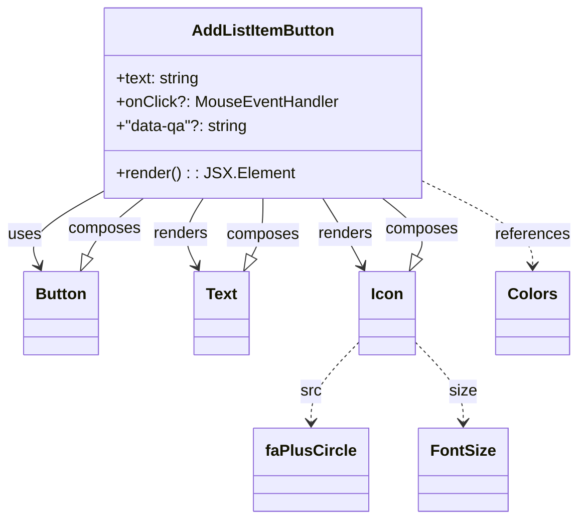

# Diagram: web/portal/src/pages/administration/notification-management/components/atoms/AddListItemButton.atom.tsx

> Auto-generated by Obscura crawlers

## Mermaid

### SVG

<svg id="container" width="583.421875" xmlns="http://www.w3.org/2000/svg" class="classDiagram" height="524" viewBox="0 0 583.421875 524" role="graphics-document document" aria-roledescription="class"><g><defs><marker id="container_class-aggregationStart" class="marker aggregation class" refX="18" refY="7" markerWidth="190" markerHeight="240" orient="auto"><path d="M 18,7 L9,13 L1,7 L9,1 Z"></path></marker></defs><defs><marker id="container_class-aggregationEnd" class="marker aggregation class" refX="1" refY="7" markerWidth="20" markerHeight="28" orient="auto"><path d="M 18,7 L9,13 L1,7 L9,1 Z"></path></marker></defs><defs><marker id="container_class-extensionStart" class="marker extension class" refX="18" refY="7" markerWidth="190" markerHeight="240" orient="auto"><path d="M 1,7 L18,13 V 1 Z"></path></marker></defs><defs><marker id="container_class-extensionEnd" class="marker extension class" refX="1" refY="7" markerWidth="20" markerHeight="28" orient="auto"><path d="M 1,1 V 13 L18,7 Z"></path></marker></defs><defs><marker id="container_class-compositionStart" class="marker composition class" refX="18" refY="7" markerWidth="190" markerHeight="240" orient="auto"><path d="M 18,7 L9,13 L1,7 L9,1 Z"></path></marker></defs><defs><marker id="container_class-compositionEnd" class="marker composition class" refX="1" refY="7" markerWidth="20" markerHeight="28" orient="auto"><path d="M 18,7 L9,13 L1,7 L9,1 Z"></path></marker></defs><defs><marker id="container_class-dependencyStart" class="marker dependency class" refX="6" refY="7" markerWidth="190" markerHeight="240" orient="auto"><path d="M 5,7 L9,13 L1,7 L9,1 Z"></path></marker></defs><defs><marker id="container_class-dependencyEnd" class="marker dependency class" refX="13" refY="7" markerWidth="20" markerHeight="28" orient="auto"><path d="M 18,7 L9,13 L14,7 L9,1 Z"></path></marker></defs><defs><marker id="container_class-lollipopStart" class="marker lollipop class" refX="13" refY="7" markerWidth="190" markerHeight="240" orient="auto"><circle stroke="black" fill="transparent" cx="7" cy="7" r="6"></circle></marker></defs><defs><marker id="container_class-lollipopEnd" class="marker lollipop class" refX="1" refY="7" markerWidth="190" markerHeight="240" orient="auto"><circle stroke="black" fill="transparent" cx="7" cy="7" r="6"></circle></marker></defs><g class="root"><g class="clusters"></g><g class="edgePaths"><path d="M108.965,190.45L94.886,198.209C80.807,205.967,52.65,221.483,40.999,234.5C29.348,247.518,34.204,258.035,36.631,263.294L39.059,268.553" id="id_AddListItemButton_Button_1" class="edge-thickness-normal edge-pattern-solid relation" style=";;;" data-edge="true" data-et="edge" data-id="id_AddListItemButton_Button_1" data-points="W3sieCI6MTA4Ljk2NDg0Mzc1LCJ5IjoxOTAuNDUwMjE1MjU5MTIwMTd9LHsieCI6MjQuNDkyMTg3NSwieSI6MjM3fSx7IngiOjQxLjU3NDMxNzY0MjQwNTA2LCJ5IjoyNzR9XQ==" marker-end="url(#container_class-dependencyEnd)"></path><path d="M205.066,200L201.161,206.167C197.257,212.333,189.449,224.667,188.361,236.117C187.273,247.568,192.905,258.137,195.721,263.421L198.537,268.705" id="id_AddListItemButton_Text_2" class="edge-thickness-normal edge-pattern-solid relation" style=";;;" data-edge="true" data-et="edge" data-id="id_AddListItemButton_Text_2" data-points="W3sieCI6MjA1LjA2NTU1NDUxMTI3ODIsInkiOjIwMH0seyJ4IjoxODEuNjQwNjI1LCJ5IjoyMzd9LHsieCI6MjAxLjM1OTA3ODMyMjc4NDgsInkiOjI3NH1d" marker-end="url(#container_class-dependencyEnd)"></path><path d="M326.622,200L330.526,206.167C334.43,212.333,342.239,224.667,348.959,236.117C355.679,247.568,361.311,258.137,364.127,263.421L366.943,268.705" id="id_AddListItemButton_Icon_3" class="edge-thickness-normal edge-pattern-solid relation" style=";;;" data-edge="true" data-et="edge" data-id="id_AddListItemButton_Icon_3" data-points="W3sieCI6MzI2LjYyMTk0NTQ4ODcyMTgsInkiOjIwMH0seyJ4IjozNTAuMDQ2ODc1LCJ5IjoyMzd9LHsieCI6MzY5Ljc2NTMyODMyMjc4NDgsInkiOjI3NH1d" marker-end="url(#container_class-dependencyEnd)"></path><path d="M422.723,180.78L441.868,190.15C461.013,199.52,499.303,218.26,518.449,232.797C537.594,247.333,537.594,257.667,537.594,262.833L537.594,268" id="id_AddListItemButton_Colors_4" class="edge-thickness-normal edge-pattern-dashed relation" style=";;;" data-edge="true" data-et="edge" data-id="id_AddListItemButton_Colors_4" data-points="W3sieCI6NDIyLjcyMjY1NjI1LCJ5IjoxODAuNzc5NzQwNjg1MzcyNn0seyJ4Ijo1MzcuNTkzNzUsInkiOjIzN30seyJ4Ijo1MzcuNTkzNzUsInkiOjI3NH1d" marker-end="url(#container_class-dependencyEnd)"></path><path d="M364.844,345.183L357.076,353.486C349.307,361.789,333.771,378.394,326.003,391.864C318.234,405.333,318.234,415.667,318.234,420.833L318.234,426" id="id_Icon_faPlusCircle_5" class="edge-thickness-normal edge-pattern-dashed relation" style=";;;" data-edge="true" data-et="edge" data-id="id_Icon_faPlusCircle_5" data-points="W3sieCI6MzY0Ljg0Mzc1LCJ5IjozNDUuMTgzNDkwMTE3MzIzNzR9LHsieCI6MzE4LjIzNDM3NSwieSI6Mzk1fSx7IngiOjMxOC4yMzQzNzUsInkiOjQzMn1d" marker-end="url(#container_class-dependencyEnd)"></path><path d="M419.453,345.183L427.221,353.486C434.99,361.789,450.526,378.394,458.294,391.864C466.063,405.333,466.063,415.667,466.063,420.833L466.063,426" id="id_Icon_FontSize_6" class="edge-thickness-normal edge-pattern-dashed relation" style=";;;" data-edge="true" data-et="edge" data-id="id_Icon_FontSize_6" data-points="W3sieCI6NDE5LjQ1MzEyNSwieSI6MzQ1LjE4MzQ5MDExNzMyMzc0fSx7IngiOjQ2Ni4wNjI1LCJ5IjozOTV9LHsieCI6NDY2LjA2MjUsInkiOjQzMn1d" marker-end="url(#container_class-dependencyEnd)"></path><path d="M87.586,258.339L89.228,254.782C90.87,251.226,94.154,244.113,103.604,234.39C113.054,224.667,128.671,212.333,136.479,206.167L144.287,200" id="id_Button_AddListItemButton_7" class="edge-thickness-normal edge-pattern-solid relation" style=";;;" data-edge="true" data-et="edge" data-id="id_Button_AddListItemButton_7" data-points="W3sieCI6ODAuMzU1MzY5ODU3NTk0OTQsInkiOjI3NH0seyJ4Ijo5Ny40Mzc1LCJ5IjoyMzd9LHsieCI6MTQ0LjI4NzM1OTAyMjU1NjQsInkiOjIwMH1d" marker-start="url(#container_class-extensionStart)"></path><path d="M254.238,258.777L256.172,255.147C258.107,251.518,261.975,244.259,263.909,234.463C265.844,224.667,265.844,212.333,265.844,206.167L265.844,200" id="id_Text_AddListItemButton_8" class="edge-thickness-normal edge-pattern-solid relation" style=";;;" data-edge="true" data-et="edge" data-id="id_Text_AddListItemButton_8" data-points="W3sieCI6MjQ2LjEyNTI5NjY3NzIxNTIsInkiOjI3NH0seyJ4IjoyNjUuODQzNzUsInkiOjIzN30seyJ4IjoyNjUuODQzNzUsInkiOjIwMH1d" marker-start="url(#container_class-extensionStart)"></path><path d="M422.644,258.777L424.579,255.147C426.513,251.518,430.381,244.259,424.507,234.463C418.633,224.667,403.017,212.333,395.208,206.167L387.4,200" id="id_Icon_AddListItemButton_9" class="edge-thickness-normal edge-pattern-solid relation" style=";;;" data-edge="true" data-et="edge" data-id="id_Icon_AddListItemButton_9" data-points="W3sieCI6NDE0LjUzMTU0NjY3NzIxNTIsInkiOjI3NH0seyJ4Ijo0MzQuMjUsInkiOjIzN30seyJ4IjozODcuNDAwMTQwOTc3NDQzNiwieSI6MjAwfV0=" marker-start="url(#container_class-extensionStart)"></path></g><g class="edgeLabels"><g class="edgeLabel" transform="translate(24.4921875, 237)"><g class="label" data-id="id_AddListItemButton_Button_1" transform="translate(-16.4921875, -12)"><foreignObject width="32.984375" height="24">

uses

</foreignObject></g></g><g class="edgeLabel" transform="translate(182.13958, 236.2119)"><g class="label" data-id="id_AddListItemButton_Text_2" transform="translate(-27.75, -12)"><foreignObject width="55.5" height="24">

renders

</foreignObject></g></g><g class="edgeLabel" transform="translate(349.54792, 236.2119)"><g class="label" data-id="id_AddListItemButton_Icon_3" transform="translate(-27.75, -12)"><foreignObject width="55.5" height="24">

renders

</foreignObject></g></g><g class="edgeLabel" transform="translate(537.59375, 237)"><g class="label" data-id="id_AddListItemButton_Colors_4" transform="translate(-37.828125, -12)"><foreignObject width="75.65625" height="24">

references

</foreignObject></g></g><g class="edgeLabel" transform="translate(318.234375, 395)"><g class="label" data-id="id_Icon_faPlusCircle_5" transform="translate(-10.4140625, -12)"><foreignObject width="20.828125" height="24">

src

</foreignObject></g></g><g class="edgeLabel" transform="translate(466.0625, 395)"><g class="label" data-id="id_Icon_FontSize_6" transform="translate(-13.796875, -12)"><foreignObject width="27.59375" height="24">

size

</foreignObject></g></g><g class="edgeLabel" transform="translate(104.87151, 231.12894)"><g class="label" data-id="id_Button_AddListItemButton_7" transform="translate(-36.453125, -12)"><foreignObject width="72.90625" height="24">

composes

</foreignObject></g></g><g class="edgeLabel" transform="translate(265.84375, 237)"><g class="label" data-id="id_Text_AddListItemButton_8" transform="translate(-36.453125, -12)"><foreignObject width="72.90625" height="24">

composes

</foreignObject></g></g><g class="edgeLabel" transform="translate(427.27643, 231.49258)"><g class="label" data-id="id_Icon_AddListItemButton_9" transform="translate(-36.453125, -12)"><foreignObject width="72.90625" height="24">

composes

</foreignObject></g></g></g><g class="nodes"><g class="node default" id="classId-AddListItemButton-0" transform="translate(265.84375, 104)"><g class="basic label-container"><path d="M-156.87890625 -96 L156.87890625 -96 L156.87890625 96 L-156.87890625 96" stroke="none" stroke-width="0" fill="#ECECFF" style=""></path><path d="M-156.87890625 -96 C-93.91284045943274 -96, -30.946774668865487 -96, 156.87890625 -96 M-156.87890625 -96 C-71.25324788091292 -96, 14.372410488174154 -96, 156.87890625 -96 M156.87890625 -96 C156.87890625 -28.618159936892837, 156.87890625 38.763680126214325, 156.87890625 96 M156.87890625 -96 C156.87890625 -36.546864797494706, 156.87890625 22.906270405010588, 156.87890625 96 M156.87890625 96 C68.43802815734895 96, -20.002849935302095 96, -156.87890625 96 M156.87890625 96 C49.170427103070665 96, -58.53805204385867 96, -156.87890625 96 M-156.87890625 96 C-156.87890625 49.294198442353796, -156.87890625 2.588396884707592, -156.87890625 -96 M-156.87890625 96 C-156.87890625 36.76870297863379, -156.87890625 -22.46259404273242, -156.87890625 -96" stroke="#9370DB" stroke-width="1.3" fill="none" stroke-dasharray="0 0" style=""></path></g><g class="annotation-group text" transform="translate(0, -72)"></g><g class="label-group text" transform="translate(-68.9296875, -72)"><g class="label" style="font-weight: bolder" transform="translate(0,-12)"><foreignObject width="137.859375" height="24">

AddListItemButton

</foreignObject></g></g><g class="members-group text" transform="translate(-144.87890625, -24)"><g class="label" style="" transform="translate(0,-12)"><foreignObject width="85.34375" height="24">

+text: string

</foreignObject></g><g class="label" style="" transform="translate(0,12)"><foreignObject width="220.828125" height="24">

+onClick?: MouseEventHandler

</foreignObject></g><g class="label" style="" transform="translate(0,36)"><foreignObject width="134.703125" height="24">

+"data-qa"?: string

</foreignObject></g></g><g class="methods-group text" transform="translate(-144.87890625, 72)"><g class="label" style="" transform="translate(0,-12)"><foreignObject width="172.34375" height="24">

+render() : : JSX.Element

</foreignObject></g></g><g class="divider" style=""><path d="M-156.87890625 -48 C-61.13281983000476 -48, 34.613266589990474 -48, 156.87890625 -48 M-156.87890625 -48 C-40.99204704652253 -48, 74.89481215695494 -48, 156.87890625 -48" stroke="#9370DB" stroke-width="1.3" fill="none" stroke-dasharray="0 0" style=""></path></g><g class="divider" style=""><path d="M-156.87890625 48 C-47.08247432074705 48, 62.71395760850589 48, 156.87890625 48 M-156.87890625 48 C-53.428542173953716 48, 50.02182190209257 48, 156.87890625 48" stroke="#9370DB" stroke-width="1.3" fill="none" stroke-dasharray="0 0" style=""></path></g></g><g class="node default" id="classId-Button-1" transform="translate(60.96484375, 316)"><g class="basic label-container"><path d="M-36.8359375 -42 L36.8359375 -42 L36.8359375 42 L-36.8359375 42" stroke="none" stroke-width="0" fill="#ECECFF" style=""></path><path d="M-36.8359375 -42 C-17.532106045762383 -42, 1.771725408475234 -42, 36.8359375 -42 M-36.8359375 -42 C-18.758875461859276 -42, -0.6818134237185518 -42, 36.8359375 -42 M36.8359375 -42 C36.8359375 -14.608106864530399, 36.8359375 12.783786270939203, 36.8359375 42 M36.8359375 -42 C36.8359375 -15.625241129010696, 36.8359375 10.749517741978607, 36.8359375 42 M36.8359375 42 C18.826271351496437 42, 0.816605202992875 42, -36.8359375 42 M36.8359375 42 C11.353261581769956 42, -14.129414336460087 42, -36.8359375 42 M-36.8359375 42 C-36.8359375 20.484570186664584, -36.8359375 -1.030859626670832, -36.8359375 -42 M-36.8359375 42 C-36.8359375 23.34034057447835, -36.8359375 4.680681148956701, -36.8359375 -42" stroke="#9370DB" stroke-width="1.3" fill="none" stroke-dasharray="0 0" style=""></path></g><g class="annotation-group text" transform="translate(0, -18)"></g><g class="label-group text" transform="translate(-24.8359375, -18)"><g class="label" style="font-weight: bolder" transform="translate(0,-12)"><foreignObject width="49.671875" height="24">

Button

</foreignObject></g></g><g class="members-group text" transform="translate(-24.8359375, 30)"></g><g class="methods-group text" transform="translate(-24.8359375, 60)"></g><g class="divider" style=""><path d="M-36.8359375 6 C-18.22224196904104 6, 0.39145356191792047 6, 36.8359375 6 M-36.8359375 6 C-12.906236439602402 6, 11.023464620795195 6, 36.8359375 6" stroke="#9370DB" stroke-width="1.3" fill="none" stroke-dasharray="0 0" style=""></path></g><g class="divider" style=""><path d="M-36.8359375 24 C-20.92756952597169 24, -5.019201551943379 24, 36.8359375 24 M-36.8359375 24 C-12.355347106733745 24, 12.125243286532509 24, 36.8359375 24" stroke="#9370DB" stroke-width="1.3" fill="none" stroke-dasharray="0 0" style=""></path></g></g><g class="node default" id="classId-Text-2" transform="translate(223.7421875, 316)"><g class="basic label-container"><path d="M-27.3828125 -42 L27.3828125 -42 L27.3828125 42 L-27.3828125 42" stroke="none" stroke-width="0" fill="#ECECFF" style=""></path><path d="M-27.3828125 -42 C-5.587476594864356 -42, 16.20785931027129 -42, 27.3828125 -42 M-27.3828125 -42 C-11.893129329959406 -42, 3.5965538400811887 -42, 27.3828125 -42 M27.3828125 -42 C27.3828125 -22.97940710067102, 27.3828125 -3.9588142013420367, 27.3828125 42 M27.3828125 -42 C27.3828125 -13.353810634984729, 27.3828125 15.292378730030542, 27.3828125 42 M27.3828125 42 C10.073384983964097 42, -7.2360425320718065 42, -27.3828125 42 M27.3828125 42 C5.601558957634925 42, -16.17969458473015 42, -27.3828125 42 M-27.3828125 42 C-27.3828125 13.745283847386116, -27.3828125 -14.509432305227769, -27.3828125 -42 M-27.3828125 42 C-27.3828125 20.240637049719158, -27.3828125 -1.5187259005616838, -27.3828125 -42" stroke="#9370DB" stroke-width="1.3" fill="none" stroke-dasharray="0 0" style=""></path></g><g class="annotation-group text" transform="translate(0, -18)"></g><g class="label-group text" transform="translate(-15.3828125, -18)"><g class="label" style="font-weight: bolder" transform="translate(0,-12)"><foreignObject width="30.765625" height="24">

Text

</foreignObject></g></g><g class="members-group text" transform="translate(-15.3828125, 30)"></g><g class="methods-group text" transform="translate(-15.3828125, 60)"></g><g class="divider" style=""><path d="M-27.3828125 6 C-15.62805606706318 6, -3.8732996341263615 6, 27.3828125 6 M-27.3828125 6 C-12.690692141163204 6, 2.001428217673592 6, 27.3828125 6" stroke="#9370DB" stroke-width="1.3" fill="none" stroke-dasharray="0 0" style=""></path></g><g class="divider" style=""><path d="M-27.3828125 24 C-9.005481311206804 24, 9.371849877586392 24, 27.3828125 24 M-27.3828125 24 C-10.419585295466717 24, 6.543641909066565 24, 27.3828125 24" stroke="#9370DB" stroke-width="1.3" fill="none" stroke-dasharray="0 0" style=""></path></g></g><g class="node default" id="classId-Icon-3" transform="translate(392.1484375, 316)"><g class="basic label-container"><path d="M-27.3046875 -42 L27.3046875 -42 L27.3046875 42 L-27.3046875 42" stroke="none" stroke-width="0" fill="#ECECFF" style=""></path><path d="M-27.3046875 -42 C-8.515561140126106 -42, 10.273565219747788 -42, 27.3046875 -42 M-27.3046875 -42 C-7.611596013299788 -42, 12.081495473400423 -42, 27.3046875 -42 M27.3046875 -42 C27.3046875 -19.58558363042757, 27.3046875 2.8288327391448576, 27.3046875 42 M27.3046875 -42 C27.3046875 -12.650506149334344, 27.3046875 16.698987701331312, 27.3046875 42 M27.3046875 42 C15.004072936609644 42, 2.703458373219288 42, -27.3046875 42 M27.3046875 42 C9.346734976277741 42, -8.611217547444518 42, -27.3046875 42 M-27.3046875 42 C-27.3046875 17.04160597812887, -27.3046875 -7.916788043742258, -27.3046875 -42 M-27.3046875 42 C-27.3046875 23.197426932594844, -27.3046875 4.394853865189688, -27.3046875 -42" stroke="#9370DB" stroke-width="1.3" fill="none" stroke-dasharray="0 0" style=""></path></g><g class="annotation-group text" transform="translate(0, -18)"></g><g class="label-group text" transform="translate(-15.3046875, -18)"><g class="label" style="font-weight: bolder" transform="translate(0,-12)"><foreignObject width="30.609375" height="24">

Icon

</foreignObject></g></g><g class="members-group text" transform="translate(-15.3046875, 30)"></g><g class="methods-group text" transform="translate(-15.3046875, 60)"></g><g class="divider" style=""><path d="M-27.3046875 6 C-11.324918427396533 6, 4.654850645206935 6, 27.3046875 6 M-27.3046875 6 C-12.056776927413122 6, 3.191133645173757 6, 27.3046875 6" stroke="#9370DB" stroke-width="1.3" fill="none" stroke-dasharray="0 0" style=""></path></g><g class="divider" style=""><path d="M-27.3046875 24 C-9.0874916081397 24, 9.1297042837206 24, 27.3046875 24 M-27.3046875 24 C-6.826775726443948 24, 13.651136047112104 24, 27.3046875 24" stroke="#9370DB" stroke-width="1.3" fill="none" stroke-dasharray="0 0" style=""></path></g></g><g class="node default" id="classId-Colors-4" transform="translate(537.59375, 316)"><g class="basic label-container"><path d="M-35.1015625 -42 L35.1015625 -42 L35.1015625 42 L-35.1015625 42" stroke="none" stroke-width="0" fill="#ECECFF" style=""></path><path d="M-35.1015625 -42 C-15.870743541624233 -42, 3.3600754167515348 -42, 35.1015625 -42 M-35.1015625 -42 C-15.483787515662552 -42, 4.133987468674896 -42, 35.1015625 -42 M35.1015625 -42 C35.1015625 -20.601913668982604, 35.1015625 0.7961726620347918, 35.1015625 42 M35.1015625 -42 C35.1015625 -23.251499754236537, 35.1015625 -4.502999508473074, 35.1015625 42 M35.1015625 42 C13.521299327953624 42, -8.058963844092752 42, -35.1015625 42 M35.1015625 42 C9.94752985422151 42, -15.206502791556979 42, -35.1015625 42 M-35.1015625 42 C-35.1015625 19.44102366643904, -35.1015625 -3.1179526671219193, -35.1015625 -42 M-35.1015625 42 C-35.1015625 10.835173117233985, -35.1015625 -20.32965376553203, -35.1015625 -42" stroke="#9370DB" stroke-width="1.3" fill="none" stroke-dasharray="0 0" style=""></path></g><g class="annotation-group text" transform="translate(0, -18)"></g><g class="label-group text" transform="translate(-23.1015625, -18)"><g class="label" style="font-weight: bolder" transform="translate(0,-12)"><foreignObject width="46.203125" height="24">

Colors

</foreignObject></g></g><g class="members-group text" transform="translate(-23.1015625, 30)"></g><g class="methods-group text" transform="translate(-23.1015625, 60)"></g><g class="divider" style=""><path d="M-35.1015625 6 C-13.835159094814362 6, 7.431244310371277 6, 35.1015625 6 M-35.1015625 6 C-10.348714305550576 6, 14.404133888898848 6, 35.1015625 6" stroke="#9370DB" stroke-width="1.3" fill="none" stroke-dasharray="0 0" style=""></path></g><g class="divider" style=""><path d="M-35.1015625 24 C-15.116477168665554 24, 4.868608162668892 24, 35.1015625 24 M-35.1015625 24 C-13.890455799130692 24, 7.320650901738617 24, 35.1015625 24" stroke="#9370DB" stroke-width="1.3" fill="none" stroke-dasharray="0 0" style=""></path></g></g><g class="node default" id="classId-FontSize-5" transform="translate(466.0625, 474)"><g class="basic label-container"><path d="M-42.84375 -42 L42.84375 -42 L42.84375 42 L-42.84375 42" stroke="none" stroke-width="0" fill="#ECECFF" style=""></path><path d="M-42.84375 -42 C-21.726051598983826 -42, -0.6083531979676522 -42, 42.84375 -42 M-42.84375 -42 C-18.28003759634862 -42, 6.283674807302759 -42, 42.84375 -42 M42.84375 -42 C42.84375 -8.6373213683639, 42.84375 24.7253572632722, 42.84375 42 M42.84375 -42 C42.84375 -15.867114315316318, 42.84375 10.265771369367364, 42.84375 42 M42.84375 42 C13.602310327951525 42, -15.63912934409695 42, -42.84375 42 M42.84375 42 C17.99458601697371 42, -6.854577966052581 42, -42.84375 42 M-42.84375 42 C-42.84375 12.700865627400336, -42.84375 -16.598268745199327, -42.84375 -42 M-42.84375 42 C-42.84375 20.855226879971262, -42.84375 -0.28954624005747576, -42.84375 -42" stroke="#9370DB" stroke-width="1.3" fill="none" stroke-dasharray="0 0" style=""></path></g><g class="annotation-group text" transform="translate(0, -18)"></g><g class="label-group text" transform="translate(-30.84375, -18)"><g class="label" style="font-weight: bolder" transform="translate(0,-12)"><foreignObject width="61.6875" height="24">

FontSize

</foreignObject></g></g><g class="members-group text" transform="translate(-30.84375, 30)"></g><g class="methods-group text" transform="translate(-30.84375, 60)"></g><g class="divider" style=""><path d="M-42.84375 6 C-11.9710393589958 6, 18.9016712820084 6, 42.84375 6 M-42.84375 6 C-23.07241131543013 6, -3.3010726308602614 6, 42.84375 6" stroke="#9370DB" stroke-width="1.3" fill="none" stroke-dasharray="0 0" style=""></path></g><g class="divider" style=""><path d="M-42.84375 24 C-12.744835086649111 24, 17.354079826701778 24, 42.84375 24 M-42.84375 24 C-22.809320957328055 24, -2.7748919146561093 24, 42.84375 24" stroke="#9370DB" stroke-width="1.3" fill="none" stroke-dasharray="0 0" style=""></path></g></g><g class="node default" id="classId-faPlusCircle-6" transform="translate(318.234375, 474)"><g class="basic label-container"><path d="M-54.984375 -42 L54.984375 -42 L54.984375 42 L-54.984375 42" stroke="none" stroke-width="0" fill="#ECECFF" style=""></path><path d="M-54.984375 -42 C-13.07425143281047 -42, 28.83587213437906 -42, 54.984375 -42 M-54.984375 -42 C-29.699836795924572 -42, -4.415298591849144 -42, 54.984375 -42 M54.984375 -42 C54.984375 -24.064476089725147, 54.984375 -6.128952179450295, 54.984375 42 M54.984375 -42 C54.984375 -19.100607730032994, 54.984375 3.7987845399340117, 54.984375 42 M54.984375 42 C18.1446399510408 42, -18.695095097918397 42, -54.984375 42 M54.984375 42 C25.915916500920684 42, -3.1525419981586325 42, -54.984375 42 M-54.984375 42 C-54.984375 9.88283500557096, -54.984375 -22.23432998885808, -54.984375 -42 M-54.984375 42 C-54.984375 9.299779059942082, -54.984375 -23.400441880115835, -54.984375 -42" stroke="#9370DB" stroke-width="1.3" fill="none" stroke-dasharray="0 0" style=""></path></g><g class="annotation-group text" transform="translate(0, -18)"></g><g class="label-group text" transform="translate(-42.984375, -18)"><g class="label" style="font-weight: bolder" transform="translate(0,-12)"><foreignObject width="85.96875" height="24">

faPlusCircle

</foreignObject></g></g><g class="members-group text" transform="translate(-42.984375, 30)"></g><g class="methods-group text" transform="translate(-42.984375, 60)"></g><g class="divider" style=""><path d="M-54.984375 6 C-27.738470536853377 6, -0.49256607370675454 6, 54.984375 6 M-54.984375 6 C-27.05008232100444 6, 0.8842103579911225 6, 54.984375 6" stroke="#9370DB" stroke-width="1.3" fill="none" stroke-dasharray="0 0" style=""></path></g><g class="divider" style=""><path d="M-54.984375 24 C-22.98077702932538 24, 9.022820941349238 24, 54.984375 24 M-54.984375 24 C-24.431890324915425 24, 6.120594350169149 24, 54.984375 24" stroke="#9370DB" stroke-width="1.3" fill="none" stroke-dasharray="0 0" style=""></path></g></g></g></g></g></svg>
