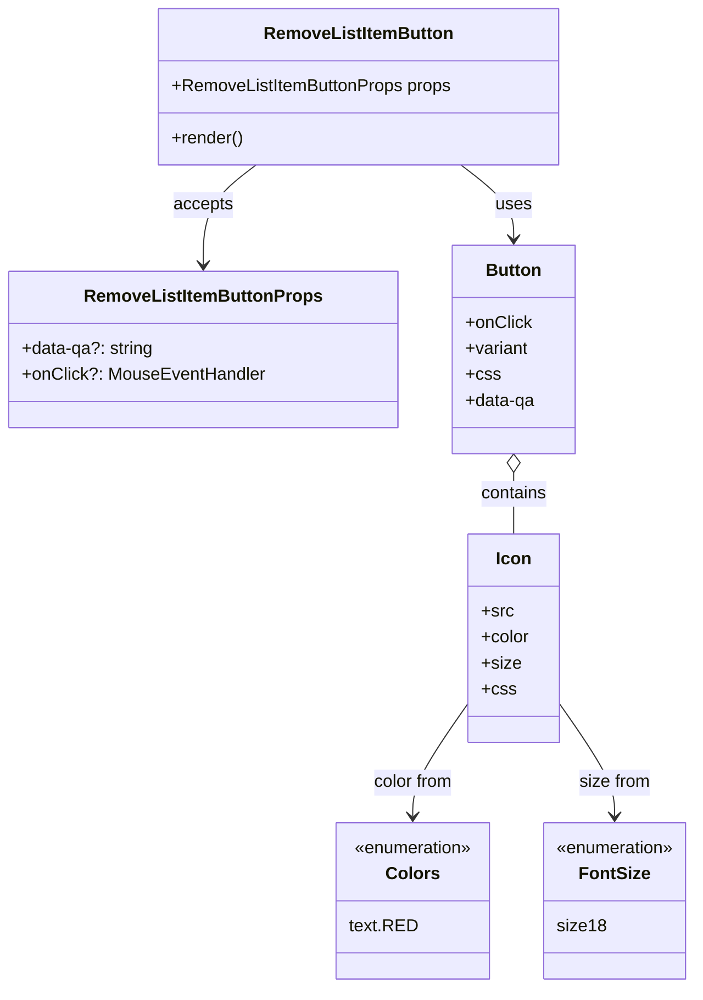

# Diagram: web/portal/src/pages/administration/notification-management/components/atoms/RemoveListItemButton.atom.tsx

> Auto-generated by Obscura crawlers

## Mermaid

### SVG

<svg id="container" width="633.673828125" xmlns="http://www.w3.org/2000/svg" class="classDiagram" height="910" viewBox="0 0 633.673828125 910" role="graphics-document document" aria-roledescription="class"><g><defs><marker id="container_class-aggregationStart" class="marker aggregation class" refX="18" refY="7" markerWidth="190" markerHeight="240" orient="auto"><path d="M 18,7 L9,13 L1,7 L9,1 Z"></path></marker></defs><defs><marker id="container_class-aggregationEnd" class="marker aggregation class" refX="1" refY="7" markerWidth="20" markerHeight="28" orient="auto"><path d="M 18,7 L9,13 L1,7 L9,1 Z"></path></marker></defs><defs><marker id="container_class-extensionStart" class="marker extension class" refX="18" refY="7" markerWidth="190" markerHeight="240" orient="auto"><path d="M 1,7 L18,13 V 1 Z"></path></marker></defs><defs><marker id="container_class-extensionEnd" class="marker extension class" refX="1" refY="7" markerWidth="20" markerHeight="28" orient="auto"><path d="M 1,1 V 13 L18,7 Z"></path></marker></defs><defs><marker id="container_class-compositionStart" class="marker composition class" refX="18" refY="7" markerWidth="190" markerHeight="240" orient="auto"><path d="M 18,7 L9,13 L1,7 L9,1 Z"></path></marker></defs><defs><marker id="container_class-compositionEnd" class="marker composition class" refX="1" refY="7" markerWidth="20" markerHeight="28" orient="auto"><path d="M 18,7 L9,13 L1,7 L9,1 Z"></path></marker></defs><defs><marker id="container_class-dependencyStart" class="marker dependency class" refX="6" refY="7" markerWidth="190" markerHeight="240" orient="auto"><path d="M 5,7 L9,13 L1,7 L9,1 Z"></path></marker></defs><defs><marker id="container_class-dependencyEnd" class="marker dependency class" refX="13" refY="7" markerWidth="20" markerHeight="28" orient="auto"><path d="M 18,7 L9,13 L14,7 L9,1 Z"></path></marker></defs><defs><marker id="container_class-lollipopStart" class="marker lollipop class" refX="13" refY="7" markerWidth="190" markerHeight="240" orient="auto"><circle stroke="black" fill="transparent" cx="7" cy="7" r="6"></circle></marker></defs><defs><marker id="container_class-lollipopEnd" class="marker lollipop class" refX="1" refY="7" markerWidth="190" markerHeight="240" orient="auto"><circle stroke="black" fill="transparent" cx="7" cy="7" r="6"></circle></marker></defs><g class="root"><g class="clusters"></g><g class="edgePaths"><path d="M416.611,152L424.58,158.167C432.549,164.333,448.488,176.667,456.457,188C464.426,199.333,464.426,209.667,464.426,214.833L464.426,220" id="id_RemoveListItemButton_Button_1" class="edge-thickness-normal edge-pattern-solid relation" style=";;;" data-edge="true" data-et="edge" data-id="id_RemoveListItemButton_Button_1" data-points="W3sieCI6NDE2LjYxMTEzMTAyMDY0MjIzLCJ5IjoxNTJ9LHsieCI6NDY0LjQyNTc4MTI1LCJ5IjoxODl9LHsieCI6NDY0LjQyNTc4MTI1LCJ5IjoyMjZ9XQ==" marker-end="url(#container_class-dependencyEnd)"></path><path d="M230.522,152L222.553,158.167C214.583,164.333,198.645,176.667,190.676,192C182.707,207.333,182.707,225.667,182.707,234.833L182.707,244" id="id_RemoveListItemButton_RemoveListItemButtonProps_2" class="edge-thickness-normal edge-pattern-solid relation" style=";;;" data-edge="true" data-et="edge" data-id="id_RemoveListItemButton_RemoveListItemButtonProps_2" data-points="W3sieCI6MjMwLjUyMTY4MTQ3OTM1NzgsInkiOjE1Mn0seyJ4IjoxODIuNzA3MDMxMjUsInkiOjE4OX0seyJ4IjoxODIuNzA3MDMxMjUsInkiOjI1MH1d" marker-end="url(#container_class-dependencyEnd)"></path><path d="M464.426,435.25L464.426,438.542C464.426,441.833,464.426,448.417,464.426,457.875C464.426,467.333,464.426,479.667,464.426,485.833L464.426,492" id="id_Button_Icon_3" class="edge-thickness-normal edge-pattern-solid relation" style=";;;" data-edge="true" data-et="edge" data-id="id_Button_Icon_3" data-points="W3sieCI6NDY0LjQyNTc4MTI1LCJ5Ijo0MTh9LHsieCI6NDY0LjQyNTc4MTI1LCJ5Ijo0NTV9LHsieCI6NDY0LjQyNTc4MTI1LCJ5Ijo0OTJ9XQ==" marker-start="url(#container_class-aggregationStart)"></path><path d="M422.375,647.692L413.768,659.91C405.161,672.128,387.947,696.564,379.34,713.949C370.732,731.333,370.732,741.667,370.732,746.833L370.732,752" id="id_Icon_Colors_4" class="edge-thickness-normal edge-pattern-solid relation" style=";;;" data-edge="true" data-et="edge" data-id="id_Icon_Colors_4" data-points="W3sieCI6NDIyLjM3NSwieSI6NjQ3LjY5MjEwNTY0NzE2MTh9LHsieCI6MzcwLjczMjQyMTg3NSwieSI6NzIxfSx7IngiOjM3MC43MzI0MjE4NzUsInkiOjc1OH1d" marker-end="url(#container_class-dependencyEnd)"></path><path d="M506.477,647.692L515.084,659.91C523.691,672.128,540.905,696.564,549.512,713.949C558.119,731.333,558.119,741.667,558.119,746.833L558.119,752" id="id_Icon_FontSize_5" class="edge-thickness-normal edge-pattern-solid relation" style=";;;" data-edge="true" data-et="edge" data-id="id_Icon_FontSize_5" data-points="W3sieCI6NTA2LjQ3NjU2MjUsInkiOjY0Ny42OTIxMDU2NDcxNjE4fSx7IngiOjU1OC4xMTkxNDA2MjUsInkiOjcyMX0seyJ4Ijo1NTguMTE5MTQwNjI1LCJ5Ijo3NTh9XQ==" marker-end="url(#container_class-dependencyEnd)"></path></g><g class="edgeLabels"><g class="edgeLabel" transform="translate(464.42578125, 189)"><g class="label" data-id="id_RemoveListItemButton_Button_1" transform="translate(-16.4921875, -12)"><foreignObject width="32.984375" height="24">

uses

</foreignObject></g></g><g class="edgeLabel" transform="translate(182.70703125, 189)"><g class="label" data-id="id_RemoveListItemButton_RemoveListItemButtonProps_2" transform="translate(-27.421875, -12)"><foreignObject width="54.84375" height="24">

accepts

</foreignObject></g></g><g class="edgeLabel" transform="translate(464.42578125, 455)"><g class="label" data-id="id_Button_Icon_3" transform="translate(-30.890625, -12)"><foreignObject width="61.78125" height="24">

contains

</foreignObject></g></g><g class="edgeLabel" transform="translate(370.732421875, 721)"><g class="label" data-id="id_Icon_Colors_4" transform="translate(-37.578125, -12)"><foreignObject width="75.15625" height="24">

color from

</foreignObject></g></g><g class="edgeLabel" transform="translate(558.119140625, 721)"><g class="label" data-id="id_Icon_FontSize_5" transform="translate(-32.96875, -12)"><foreignObject width="65.9375" height="24">

size from

</foreignObject></g></g></g><g class="nodes"><g class="node default" id="classId-RemoveListItemButton-0" transform="translate(323.56640625, 80)"><g class="basic label-container"><path d="M-183.7890625 -72 L183.7890625 -72 L183.7890625 72 L-183.7890625 72" stroke="none" stroke-width="0" fill="#ECECFF" style=""></path><path d="M-183.7890625 -72 C-99.47438836555052 -72, -15.159714231101049 -72, 183.7890625 -72 M-183.7890625 -72 C-48.586520540768106 -72, 86.61602141846379 -72, 183.7890625 -72 M183.7890625 -72 C183.7890625 -42.10759884135615, 183.7890625 -12.215197682712308, 183.7890625 72 M183.7890625 -72 C183.7890625 -40.061281074159325, 183.7890625 -8.12256214831865, 183.7890625 72 M183.7890625 72 C98.97671593811901 72, 14.164369376238028 72, -183.7890625 72 M183.7890625 72 C106.15005255727928 72, 28.511042614558562 72, -183.7890625 72 M-183.7890625 72 C-183.7890625 38.05075972688385, -183.7890625 4.101519453767693, -183.7890625 -72 M-183.7890625 72 C-183.7890625 28.45620816264401, -183.7890625 -15.08758367471198, -183.7890625 -72" stroke="#9370DB" stroke-width="1.3" fill="none" stroke-dasharray="0 0" style=""></path></g><g class="annotation-group text" transform="translate(0, -48)"></g><g class="label-group text" transform="translate(-83.671875, -48)"><g class="label" style="font-weight: bolder" transform="translate(0,-12)"><foreignObject width="167.34375" height="24">

RemoveListItemButton

</foreignObject></g></g><g class="members-group text" transform="translate(-171.7890625, 0)"><g class="label" style="" transform="translate(0,-12)"><foreignObject width="259.90625" height="24">

+RemoveListItemButtonProps props

</foreignObject></g></g><g class="methods-group text" transform="translate(-171.7890625, 48)"><g class="label" style="" transform="translate(0,-12)"><foreignObject width="66.609375" height="24">

+render()

</foreignObject></g></g><g class="divider" style=""><path d="M-183.7890625 -24 C-57.069341304576 -24, 69.650379890848 -24, 183.7890625 -24 M-183.7890625 -24 C-109.38523071312365 -24, -34.981398926247294 -24, 183.7890625 -24" stroke="#9370DB" stroke-width="1.3" fill="none" stroke-dasharray="0 0" style=""></path></g><g class="divider" style=""><path d="M-183.7890625 24 C-54.548518003631614 24, 74.69202649273677 24, 183.7890625 24 M-183.7890625 24 C-51.070981224019675 24, 81.64710005196065 24, 183.7890625 24" stroke="#9370DB" stroke-width="1.3" fill="none" stroke-dasharray="0 0" style=""></path></g></g><g class="node default" id="classId-RemoveListItemButtonProps-1" transform="translate(182.70703125, 322)"><g class="basic label-container"><path d="M-174.70703125 -72 L174.70703125 -72 L174.70703125 72 L-174.70703125 72" stroke="none" stroke-width="0" fill="#ECECFF" style=""></path><path d="M-174.70703125 -72 C-88.18136902555874 -72, -1.655706801117475 -72, 174.70703125 -72 M-174.70703125 -72 C-40.41397837541888 -72, 93.87907449916224 -72, 174.70703125 -72 M174.70703125 -72 C174.70703125 -27.203583001906274, 174.70703125 17.59283399618745, 174.70703125 72 M174.70703125 -72 C174.70703125 -37.54016432126798, 174.70703125 -3.08032864253596, 174.70703125 72 M174.70703125 72 C73.61151876005212 72, -27.483993729895758 72, -174.70703125 72 M174.70703125 72 C66.30738059345784 72, -42.09227006308433 72, -174.70703125 72 M-174.70703125 72 C-174.70703125 24.102190246049112, -174.70703125 -23.795619507901776, -174.70703125 -72 M-174.70703125 72 C-174.70703125 21.978037985780425, -174.70703125 -28.04392402843915, -174.70703125 -72" stroke="#9370DB" stroke-width="1.3" fill="none" stroke-dasharray="0 0" style=""></path></g><g class="annotation-group text" transform="translate(0, -48)"></g><g class="label-group text" transform="translate(-104.5859375, -48)"><g class="label" style="font-weight: bolder" transform="translate(0,-12)"><foreignObject width="209.171875" height="24">

RemoveListItemButtonProps

</foreignObject></g></g><g class="members-group text" transform="translate(-162.70703125, 0)"><g class="label" style="" transform="translate(0,-12)"><foreignObject width="121.765625" height="24">

+data-qa?: string

</foreignObject></g><g class="label" style="" transform="translate(0,12)"><foreignObject width="220.828125" height="24">

+onClick?: MouseEventHandler

</foreignObject></g></g><g class="methods-group text" transform="translate(-162.70703125, 72)"></g><g class="divider" style=""><path d="M-174.70703125 -24 C-69.09278599010766 -24, 36.521459269784685 -24, 174.70703125 -24 M-174.70703125 -24 C-87.55305080517229 -24, -0.3990703603445809 -24, 174.70703125 -24" stroke="#9370DB" stroke-width="1.3" fill="none" stroke-dasharray="0 0" style=""></path></g><g class="divider" style=""><path d="M-174.70703125 48 C-92.63694614095787 48, -10.56686103191575 48, 174.70703125 48 M-174.70703125 48 C-89.7382440274429 48, -4.769456804885806 48, 174.70703125 48" stroke="#9370DB" stroke-width="1.3" fill="none" stroke-dasharray="0 0" style=""></path></g></g><g class="node default" id="classId-Button-2" transform="translate(464.42578125, 322)"><g class="basic label-container"><path d="M-57.01171875 -96 L57.01171875 -96 L57.01171875 96 L-57.01171875 96" stroke="none" stroke-width="0" fill="#ECECFF" style=""></path><path d="M-57.01171875 -96 C-19.001880052852762 -96, 19.007958644294476 -96, 57.01171875 -96 M-57.01171875 -96 C-28.9601091054857 -96, -0.9084994609713988 -96, 57.01171875 -96 M57.01171875 -96 C57.01171875 -48.26012734425376, 57.01171875 -0.5202546885075208, 57.01171875 96 M57.01171875 -96 C57.01171875 -27.29563906903809, 57.01171875 41.40872186192382, 57.01171875 96 M57.01171875 96 C26.03816750945195 96, -4.935383731096103 96, -57.01171875 96 M57.01171875 96 C16.864304312733324 96, -23.28311012453335 96, -57.01171875 96 M-57.01171875 96 C-57.01171875 53.68113405687885, -57.01171875 11.362268113757693, -57.01171875 -96 M-57.01171875 96 C-57.01171875 31.54027233183882, -57.01171875 -32.91945533632236, -57.01171875 -96" stroke="#9370DB" stroke-width="1.3" fill="none" stroke-dasharray="0 0" style=""></path></g><g class="annotation-group text" transform="translate(0, -72)"></g><g class="label-group text" transform="translate(-24.8359375, -72)"><g class="label" style="font-weight: bolder" transform="translate(0,-12)"><foreignObject width="49.671875" height="24">

Button

</foreignObject></g></g><g class="members-group text" transform="translate(-45.01171875, -24)"><g class="label" style="" transform="translate(0,-12)"><foreignObject width="60.546875" height="24">

+onClick

</foreignObject></g><g class="label" style="" transform="translate(0,12)"><foreignObject width="58.703125" height="24">

+variant

</foreignObject></g><g class="label" style="" transform="translate(0,36)"><foreignObject width="30.421875" height="24">

+css

</foreignObject></g><g class="label" style="" transform="translate(0,60)"><foreignObject width="65.1875" height="24">

+data-qa

</foreignObject></g></g><g class="methods-group text" transform="translate(-45.01171875, 96)"></g><g class="divider" style=""><path d="M-57.01171875 -48 C-22.683490957626596 -48, 11.644736834746809 -48, 57.01171875 -48 M-57.01171875 -48 C-16.663546907535448 -48, 23.684624934929104 -48, 57.01171875 -48" stroke="#9370DB" stroke-width="1.3" fill="none" stroke-dasharray="0 0" style=""></path></g><g class="divider" style=""><path d="M-57.01171875 72 C-26.682385232659055 72, 3.6469482846818906 72, 57.01171875 72 M-57.01171875 72 C-31.367720498465445 72, -5.72372224693089 72, 57.01171875 72" stroke="#9370DB" stroke-width="1.3" fill="none" stroke-dasharray="0 0" style=""></path></g></g><g class="node default" id="classId-Icon-3" transform="translate(464.42578125, 588)"><g class="basic label-container"><path d="M-42.05078125 -96 L42.05078125 -96 L42.05078125 96 L-42.05078125 96" stroke="none" stroke-width="0" fill="#ECECFF" style=""></path><path d="M-42.05078125 -96 C-17.426407458792934 -96, 7.197966332414133 -96, 42.05078125 -96 M-42.05078125 -96 C-16.82871475039073 -96, 8.393351749218539 -96, 42.05078125 -96 M42.05078125 -96 C42.05078125 -25.2440613686136, 42.05078125 45.5118772627728, 42.05078125 96 M42.05078125 -96 C42.05078125 -37.06071071935311, 42.05078125 21.87857856129378, 42.05078125 96 M42.05078125 96 C16.772830199380245 96, -8.50512085123951 96, -42.05078125 96 M42.05078125 96 C17.304206773685767 96, -7.4423677026284665 96, -42.05078125 96 M-42.05078125 96 C-42.05078125 45.25989814344467, -42.05078125 -5.4802037131106545, -42.05078125 -96 M-42.05078125 96 C-42.05078125 19.581407538209632, -42.05078125 -56.837184923580736, -42.05078125 -96" stroke="#9370DB" stroke-width="1.3" fill="none" stroke-dasharray="0 0" style=""></path></g><g class="annotation-group text" transform="translate(0, -72)"></g><g class="label-group text" transform="translate(-15.3046875, -72)"><g class="label" style="font-weight: bolder" transform="translate(0,-12)"><foreignObject width="30.609375" height="24">

Icon

</foreignObject></g></g><g class="members-group text" transform="translate(-30.05078125, -24)"><g class="label" style="" transform="translate(0,-12)"><foreignObject width="28.8125" height="24">

+src

</foreignObject></g><g class="label" style="" transform="translate(0,12)"><foreignObject width="44.796875" height="24">

+color

</foreignObject></g><g class="label" style="" transform="translate(0,36)"><foreignObject width="35.578125" height="24">

+size

</foreignObject></g><g class="label" style="" transform="translate(0,60)"><foreignObject width="30.421875" height="24">

+css

</foreignObject></g></g><g class="methods-group text" transform="translate(-30.05078125, 96)"></g><g class="divider" style=""><path d="M-42.05078125 -48 C-16.19293604925175 -48, 9.664909151496502 -48, 42.05078125 -48 M-42.05078125 -48 C-19.051771476020352 -48, 3.947238297959295 -48, 42.05078125 -48" stroke="#9370DB" stroke-width="1.3" fill="none" stroke-dasharray="0 0" style=""></path></g><g class="divider" style=""><path d="M-42.05078125 72 C-24.712257868346526 72, -7.373734486693053 72, 42.05078125 72 M-42.05078125 72 C-23.457593135906276 72, -4.864405021812551 72, 42.05078125 72" stroke="#9370DB" stroke-width="1.3" fill="none" stroke-dasharray="0 0" style=""></path></g></g><g class="node default" id="classId-Colors-4" transform="translate(370.732421875, 830)"><g class="basic label-container"><path d="M-69.83203125 -72 L69.83203125 -72 L69.83203125 72 L-69.83203125 72" stroke="none" stroke-width="0" fill="#ECECFF" style=""></path><path d="M-69.83203125 -72 C-25.68960457344123 -72, 18.45282210311754 -72, 69.83203125 -72 M-69.83203125 -72 C-25.284189162523845 -72, 19.26365292495231 -72, 69.83203125 -72 M69.83203125 -72 C69.83203125 -35.790322540567274, 69.83203125 0.4193549188654515, 69.83203125 72 M69.83203125 -72 C69.83203125 -33.595142300037566, 69.83203125 4.809715399924869, 69.83203125 72 M69.83203125 72 C26.429895056335795 72, -16.97224113732841 72, -69.83203125 72 M69.83203125 72 C17.5140277390775 72, -34.803975771845 72, -69.83203125 72 M-69.83203125 72 C-69.83203125 19.842973932377845, -69.83203125 -32.31405213524431, -69.83203125 -72 M-69.83203125 72 C-69.83203125 19.55649050951577, -69.83203125 -32.88701898096846, -69.83203125 -72" stroke="#9370DB" stroke-width="1.3" fill="none" stroke-dasharray="0 0" style=""></path></g><g class="annotation-group text" transform="translate(-55.5546875, -48)"><g class="label" style="" transform="translate(0,-12)"><foreignObject width="111.109375" height="24">

«enumeration»

</foreignObject></g></g><g class="label-group text" transform="translate(-23.1015625, -24)"><g class="label" style="font-weight: bolder" transform="translate(0,-12)"><foreignObject width="46.203125" height="24">

Colors

</foreignObject></g></g><g class="members-group text" transform="translate(-57.83203125, 24)"><g class="label" style="" transform="translate(0,-12)"><foreignObject width="60.109375" height="24">

text.RED

</foreignObject></g></g><g class="methods-group text" transform="translate(-57.83203125, 72)"></g><g class="divider" style=""><path d="M-69.83203125 0 C-19.275201796070533 0, 31.281627657858934 0, 69.83203125 0 M-69.83203125 0 C-28.819087276903375 0, 12.19385669619325 0, 69.83203125 0" stroke="#9370DB" stroke-width="1.3" fill="none" stroke-dasharray="0 0" style=""></path></g><g class="divider" style=""><path d="M-69.83203125 48 C-31.251500626091392 48, 7.329029997817216 48, 69.83203125 48 M-69.83203125 48 C-17.149764170373757 48, 35.532502909252486 48, 69.83203125 48" stroke="#9370DB" stroke-width="1.3" fill="none" stroke-dasharray="0 0" style=""></path></g></g><g class="node default" id="classId-FontSize-5" transform="translate(558.119140625, 830)"><g class="basic label-container"><path d="M-67.5546875 -72 L67.5546875 -72 L67.5546875 72 L-67.5546875 72" stroke="none" stroke-width="0" fill="#ECECFF" style=""></path><path d="M-67.5546875 -72 C-15.278805408336396 -72, 36.99707668332721 -72, 67.5546875 -72 M-67.5546875 -72 C-26.77335225716861 -72, 14.007982985662778 -72, 67.5546875 -72 M67.5546875 -72 C67.5546875 -22.93924048719977, 67.5546875 26.121519025600463, 67.5546875 72 M67.5546875 -72 C67.5546875 -43.19367366742183, 67.5546875 -14.387347334843653, 67.5546875 72 M67.5546875 72 C20.504353036868494 72, -26.545981426263012 72, -67.5546875 72 M67.5546875 72 C21.1652340064474 72, -25.224219487105202 72, -67.5546875 72 M-67.5546875 72 C-67.5546875 26.60766121138593, -67.5546875 -18.784677577228138, -67.5546875 -72 M-67.5546875 72 C-67.5546875 21.093675265181275, -67.5546875 -29.81264946963745, -67.5546875 -72" stroke="#9370DB" stroke-width="1.3" fill="none" stroke-dasharray="0 0" style=""></path></g><g class="annotation-group text" transform="translate(-55.5546875, -48)"><g class="label" style="" transform="translate(0,-12)"><foreignObject width="111.109375" height="24">

«enumeration»

</foreignObject></g></g><g class="label-group text" transform="translate(-30.84375, -24)"><g class="label" style="font-weight: bolder" transform="translate(0,-12)"><foreignObject width="61.6875" height="24">

FontSize

</foreignObject></g></g><g class="members-group text" transform="translate(-55.5546875, 24)"><g class="label" style="" transform="translate(0,-12)"><foreignObject width="42.53125" height="24">

size18

</foreignObject></g></g><g class="methods-group text" transform="translate(-55.5546875, 72)"></g><g class="divider" style=""><path d="M-67.5546875 0 C-29.35142553863514 0, 8.851836422729718 0, 67.5546875 0 M-67.5546875 0 C-24.445066683136993 0, 18.664554133726014 0, 67.5546875 0" stroke="#9370DB" stroke-width="1.3" fill="none" stroke-dasharray="0 0" style=""></path></g><g class="divider" style=""><path d="M-67.5546875 48 C-32.108388670447916 48, 3.337910159104169 48, 67.5546875 48 M-67.5546875 48 C-29.211119597747555 48, 9.13244830450489 48, 67.5546875 48" stroke="#9370DB" stroke-width="1.3" fill="none" stroke-dasharray="0 0" style=""></path></g></g></g></g></g></svg>
