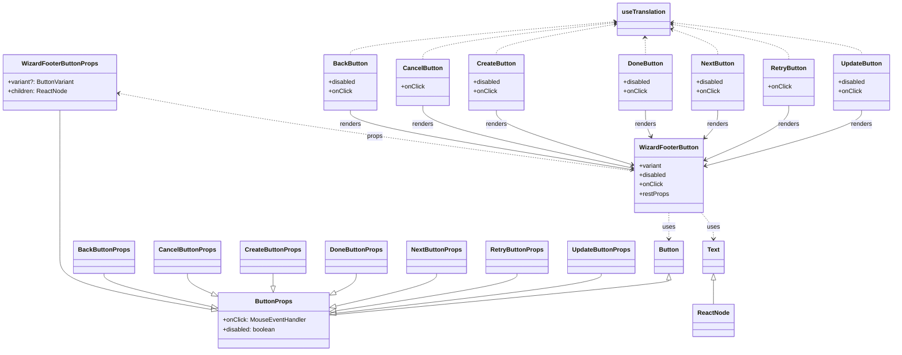

# Diagram: web/portal/src/pages/administration/notification-management/components/atoms/WizardFooterButtons.tsx

> Auto-generated by Obscura crawlers

## Mermaid

### SVG

<svg id="container" width="2255.125" xmlns="http://www.w3.org/2000/svg" class="classDiagram" height="912" viewBox="0 0 2255.125 912" role="graphics-document document" aria-roledescription="class"><g><defs><marker id="container_class-aggregationStart" class="marker aggregation class" refX="18" refY="7" markerWidth="190" markerHeight="240" orient="auto"><path d="M 18,7 L9,13 L1,7 L9,1 Z"></path></marker></defs><defs><marker id="container_class-aggregationEnd" class="marker aggregation class" refX="1" refY="7" markerWidth="20" markerHeight="28" orient="auto"><path d="M 18,7 L9,13 L1,7 L9,1 Z"></path></marker></defs><defs><marker id="container_class-extensionStart" class="marker extension class" refX="18" refY="7" markerWidth="190" markerHeight="240" orient="auto"><path d="M 1,7 L18,13 V 1 Z"></path></marker></defs><defs><marker id="container_class-extensionEnd" class="marker extension class" refX="1" refY="7" markerWidth="20" markerHeight="28" orient="auto"><path d="M 1,1 V 13 L18,7 Z"></path></marker></defs><defs><marker id="container_class-compositionStart" class="marker composition class" refX="18" refY="7" markerWidth="190" markerHeight="240" orient="auto"><path d="M 18,7 L9,13 L1,7 L9,1 Z"></path></marker></defs><defs><marker id="container_class-compositionEnd" class="marker composition class" refX="1" refY="7" markerWidth="20" markerHeight="28" orient="auto"><path d="M 18,7 L9,13 L1,7 L9,1 Z"></path></marker></defs><defs><marker id="container_class-dependencyStart" class="marker dependency class" refX="6" refY="7" markerWidth="190" markerHeight="240" orient="auto"><path d="M 5,7 L9,13 L1,7 L9,1 Z"></path></marker></defs><defs><marker id="container_class-dependencyEnd" class="marker dependency class" refX="13" refY="7" markerWidth="20" markerHeight="28" orient="auto"><path d="M 18,7 L9,13 L14,7 L9,1 Z"></path></marker></defs><defs><marker id="container_class-lollipopStart" class="marker lollipop class" refX="13" refY="7" markerWidth="190" markerHeight="240" orient="auto"><circle stroke="black" fill="transparent" cx="7" cy="7" r="6"></circle></marker></defs><defs><marker id="container_class-lollipopEnd" class="marker lollipop class" refX="1" refY="7" markerWidth="190" markerHeight="240" orient="auto"><circle stroke="black" fill="transparent" cx="7" cy="7" r="6"></circle></marker></defs><g class="root"><g class="clusters"></g><g class="edgePaths"><path d="M154.121,286L154.121,292.167C154.121,298.333,154.121,310.667,154.121,339C154.121,367.333,154.121,411.667,154.121,456C154.121,500.333,154.121,544.667,154.121,580C154.121,615.333,154.121,641.667,154.121,666C154.121,690.333,154.121,712.667,215.059,735.104C275.997,757.542,397.873,780.084,458.811,791.355L519.749,802.626" id="id_WizardFooterButtonProps_ButtonProps_1" class="edge-thickness-normal edge-pattern-solid relation" style=";;;" data-edge="true" data-et="edge" data-id="id_WizardFooterButtonProps_ButtonProps_1" data-points="W3sieCI6MTU0LjEyMTA5Mzc1LCJ5IjoyODZ9LHsieCI6MTU0LjEyMTA5Mzc1LCJ5IjozMjN9LHsieCI6MTU0LjEyMTA5Mzc1LCJ5Ijo0NTZ9LHsieCI6MTU0LjEyMTA5Mzc1LCJ5Ijo1ODl9LHsieCI6MTU0LjEyMTA5Mzc1LCJ5Ijo2Njh9LHsieCI6MTU0LjEyMTA5Mzc1LCJ5Ijo3MzV9LHsieCI6NTM2LjcxMDkzNzUsInkiOjgwNS43NjM4NDY2ODA5Njc3fV0=" marker-end="url(#container_class-extensionEnd)"></path><path d="M1678.566,552L1678.566,558.167C1678.566,564.333,1678.566,576.667,1678.566,588C1678.566,599.333,1678.566,609.667,1678.566,614.833L1678.566,620" id="id_WizardFooterButton_Button_2" class="edge-thickness-normal edge-pattern-dashed relation" style=";;;" data-edge="true" data-et="edge" data-id="id_WizardFooterButton_Button_2" data-points="W3sieCI6MTY3OC41NjY0MDYyNSwieSI6NTUyfSx7IngiOjE2NzguNTY2NDA2MjUsInkiOjU4OX0seyJ4IjoxNjc4LjU2NjQwNjI1LCJ5Ijo2MjZ9XQ==" marker-end="url(#container_class-dependencyEnd)"></path><path d="M1761.01,552L1766.306,558.167C1771.602,564.333,1782.193,576.667,1787.489,588C1792.785,599.333,1792.785,609.667,1792.785,614.833L1792.785,620" id="id_WizardFooterButton_Text_3" class="edge-thickness-normal edge-pattern-dashed relation" style=";;;" data-edge="true" data-et="edge" data-id="id_WizardFooterButton_Text_3" data-points="W3sieCI6MTc2MS4wMTAwMTUyNzI1NTYzLCJ5Ijo1NTJ9LHsieCI6MTc5Mi43ODUxNTYyNSwieSI6NTg5fSx7IngiOjE3OTIuNzg1MTU2MjUsInkiOjYyNn1d" marker-end="url(#container_class-dependencyEnd)"></path><path d="M306.132,243.497L374.418,256.748C442.703,269.998,579.273,296.499,793.534,329.916C1007.794,363.333,1299.745,403.666,1445.72,423.832L1591.695,443.999" id="id_WizardFooterButtonProps_WizardFooterButton_4" class="edge-thickness-normal edge-pattern-dashed relation" style=";;;" data-edge="true" data-et="edge" data-id="id_WizardFooterButtonProps_WizardFooterButton_4" data-points="W3sieCI6MzAwLjI0MjE4NzUsInkiOjI0Mi4zNTQyMDQ3NjkwOTA2MX0seyJ4Ijo3MTUuODQzNzUsInkiOjMyM30seyJ4IjoxNTkxLjY5NTMxMjUsInkiOjQ0My45OTg3NzA1NzY2MTE3fV0=" marker-start="url(#container_class-dependencyStart)"></path><path d="M882.385,286L882.385,292.167C882.385,298.333,882.385,310.667,999.617,336.417C1116.849,362.167,1351.313,401.333,1468.545,420.917L1585.777,440.5" id="id_BackButton_WizardFooterButton_5" class="edge-thickness-normal edge-pattern-solid relation" style=";;;" data-edge="true" data-et="edge" data-id="id_BackButton_WizardFooterButton_5" data-points="W3sieCI6ODgyLjM4NDc2NTYyNSwieSI6Mjg2fSx7IngiOjg4Mi4zODQ3NjU2MjUsInkiOjMyM30seyJ4IjoxNTkxLjY5NTMxMjUsInkiOjQ0MS40ODg0MTc2MTgyNzA4fV0=" marker-end="url(#container_class-dependencyEnd)"></path><path d="M264.441,710L264.441,714.167C264.441,718.333,264.441,726.667,307.02,740.807C349.599,754.947,434.757,774.894,477.337,784.867L519.916,794.841" id="id_BackButtonProps_ButtonProps_6" class="edge-thickness-normal edge-pattern-solid relation" style=";;;" data-edge="true" data-et="edge" data-id="id_BackButtonProps_ButtonProps_6" data-points="W3sieCI6MjY0LjQ0MTQwNjI1LCJ5Ijo3MTB9LHsieCI6MjY0LjQ0MTQwNjI1LCJ5Ijo3MzV9LHsieCI6NTM2LjcxMDkzNzUsInkiOjc5OC43NzQ1Njc1MDk5NTE2fV0=" marker-end="url(#container_class-extensionEnd)"></path><path d="M1067.514,274L1067.514,282.167C1067.514,290.333,1067.514,306.667,1153.9,333.636C1240.287,360.605,1413.06,398.211,1499.446,417.013L1585.833,435.816" id="id_CancelButton_WizardFooterButton_7" class="edge-thickness-normal edge-pattern-solid relation" style=";;;" data-edge="true" data-et="edge" data-id="id_CancelButton_WizardFooterButton_7" data-points="W3sieCI6MTA2Ny41MTM2NzE4NzUsInkiOjI3NH0seyJ4IjoxMDY3LjUxMzY3MTg3NSwieSI6MzIzfSx7IngiOjE1OTEuNjk1MzEyNSwieSI6NDM3LjA5MTg4NDg0MjY5Mjd9XQ==" marker-end="url(#container_class-dependencyEnd)"></path><path d="M471.504,710L471.504,714.167C471.504,718.333,471.504,726.667,479.768,734.705C488.033,742.743,504.561,750.487,512.826,754.358L521.09,758.23" id="id_CancelButtonProps_ButtonProps_8" class="edge-thickness-normal edge-pattern-solid relation" style=";;;" data-edge="true" data-et="edge" data-id="id_CancelButtonProps_ButtonProps_8" data-points="W3sieCI6NDcxLjUwMzkwNjI1LCJ5Ijo3MTB9LHsieCI6NDcxLjUwMzkwNjI1LCJ5Ijo3MzV9LHsieCI6NTM2LjcxMDkzNzUsInkiOjc2NS41NDc4ODEzNzE5MjAyfV0=" marker-end="url(#container_class-extensionEnd)"></path><path d="M1255.635,286L1255.635,292.167C1255.635,298.333,1255.635,310.667,1310.691,334.147C1365.747,357.627,1475.859,392.254,1530.916,409.568L1585.972,426.882" id="id_CreateButton_WizardFooterButton_9" class="edge-thickness-normal edge-pattern-solid relation" style=";;;" data-edge="true" data-et="edge" data-id="id_CreateButton_WizardFooterButton_9" data-points="W3sieCI6MTI1NS42MzQ3NjU2MjUsInkiOjI4Nn0seyJ4IjoxMjU1LjYzNDc2NTYyNSwieSI6MzIzfSx7IngiOjE1OTEuNjk1MzEyNSwieSI6NDI4LjY4MTUwNjA0MjczNTZ9XQ==" marker-end="url(#container_class-dependencyEnd)"></path><path d="M684.551,710L684.551,714.167C684.551,718.333,684.551,726.667,684.471,732.13C684.391,737.594,684.23,740.189,684.15,741.486L684.07,742.783" id="id_CreateButtonProps_ButtonProps_10" class="edge-thickness-normal edge-pattern-solid relation" style=";;;" data-edge="true" data-et="edge" data-id="id_CreateButtonProps_ButtonProps_10" data-points="W3sieCI6Njg0LjU1MDc4MTI1LCJ5Ijo3MTB9LHsieCI6Njg0LjU1MDc4MTI1LCJ5Ijo3MzV9LHsieCI6NjgzLjAwNjQwMzAyODM1MDUsInkiOjc2MH1d" marker-end="url(#container_class-extensionEnd)"></path><path d="M1616.984,286L1616.984,292.167C1616.984,298.333,1616.984,310.667,1619.42,322.093C1621.855,333.518,1626.725,344.037,1629.16,349.296L1631.595,354.555" id="id_DoneButton_WizardFooterButton_11" class="edge-thickness-normal edge-pattern-solid relation" style=";;;" data-edge="true" data-et="edge" data-id="id_DoneButton_WizardFooterButton_11" data-points="W3sieCI6MTYxNi45ODQzNzUsInkiOjI4Nn0seyJ4IjoxNjE2Ljk4NDM3NSwieSI6MzIzfSx7IngiOjE2MzQuMTE2MjE4MjgwMDc1MSwieSI6MzYwfV0=" marker-end="url(#container_class-dependencyEnd)"></path><path d="M892.527,710L892.527,714.167C892.527,718.333,892.527,726.667,883.126,735.095C873.724,743.524,854.921,752.049,845.519,756.311L836.117,760.573" id="id_DoneButtonProps_ButtonProps_12" class="edge-thickness-normal edge-pattern-solid relation" style=";;;" data-edge="true" data-et="edge" data-id="id_DoneButtonProps_ButtonProps_12" data-points="W3sieCI6ODkyLjUyNzM0Mzc1LCJ5Ijo3MTB9LHsieCI6ODkyLjUyNzM0Mzc1LCJ5Ijo3MzV9LHsieCI6ODIwLjQwNjI1LCJ5Ijo3NjcuNjk1MTc2NzE5NzMxM31d" marker-end="url(#container_class-extensionEnd)"></path><path d="M1804.16,286L1804.16,292.167C1804.16,298.333,1804.16,310.667,1798.393,322.941C1792.626,335.215,1781.091,347.429,1775.324,353.536L1769.557,359.644" id="id_NextButton_WizardFooterButton_13" class="edge-thickness-normal edge-pattern-solid relation" style=";;;" data-edge="true" data-et="edge" data-id="id_NextButton_WizardFooterButton_13" data-points="W3sieCI6MTgwNC4xNjAxNTYyNSwieSI6Mjg2fSx7IngiOjE4MDQuMTYwMTU2MjUsInkiOjMyM30seyJ4IjoxNzY1LjQzNzUsInkiOjM2NC4wMDYxMjcxNDYwNTYyfV0=" marker-end="url(#container_class-dependencyEnd)"></path><path d="M1093.754,710L1093.754,714.167C1093.754,718.333,1093.754,726.667,1050.996,740.823C1008.237,754.979,922.721,774.958,879.962,784.947L837.204,794.936" id="id_NextButtonProps_ButtonProps_14" class="edge-thickness-normal edge-pattern-solid relation" style=";;;" data-edge="true" data-et="edge" data-id="id_NextButtonProps_ButtonProps_14" data-points="W3sieCI6MTA5My43NTM5MDYyNSwieSI6NzEwfSx7IngiOjEwOTMuNzUzOTA2MjUsInkiOjczNX0seyJ4Ijo4MjAuNDA2MjUsInkiOjc5OC44NjA4NDI5NzY3NjE3fV0=" marker-end="url(#container_class-extensionEnd)"></path><path d="M1986.746,274L1986.746,282.167C1986.746,290.333,1986.746,306.667,1950.779,330.355C1914.813,354.044,1842.88,385.088,1806.913,400.61L1770.946,416.132" id="id_RetryButton_WizardFooterButton_15" class="edge-thickness-normal edge-pattern-solid relation" style=";;;" data-edge="true" data-et="edge" data-id="id_RetryButton_WizardFooterButton_15" data-points="W3sieCI6MTk4Ni43NDYwOTM3NSwieSI6Mjc0fSx7IngiOjE5ODYuNzQ2MDkzNzUsInkiOjMyM30seyJ4IjoxNzY1LjQzNzUsInkiOjQxOC41MDkzNTQzMjM1MjI3fV0=" marker-end="url(#container_class-dependencyEnd)"></path><path d="M1295.738,710L1295.738,714.167C1295.738,718.333,1295.738,726.667,1219.356,742.838C1142.975,759.009,990.211,783.019,913.829,795.023L837.447,807.028" id="id_RetryButtonProps_ButtonProps_16" class="edge-thickness-normal edge-pattern-solid relation" style=";;;" data-edge="true" data-et="edge" data-id="id_RetryButtonProps_ButtonProps_16" data-points="W3sieCI6MTI5NS43MzgyODEyNSwieSI6NzEwfSx7IngiOjEyOTUuNzM4MjgxMjUsInkiOjczNX0seyJ4Ijo4MjAuNDA2MjUsInkiOjgwOS43MDYyOTM3NTA1NTM4fV0=" marker-end="url(#container_class-extensionEnd)"></path><path d="M2174.199,286L2174.199,292.167C2174.199,298.333,2174.199,310.667,2107.038,334.856C2039.877,359.045,1905.555,395.089,1838.394,413.111L1771.232,431.134" id="id_UpdateButton_WizardFooterButton_17" class="edge-thickness-normal edge-pattern-solid relation" style=";;;" data-edge="true" data-et="edge" data-id="id_UpdateButton_WizardFooterButton_17" data-points="W3sieCI6MjE3NC4xOTkyMTg3NSwieSI6Mjg2fSx7IngiOjIxNzQuMTk5MjE4NzUsInkiOjMyM30seyJ4IjoxNzY1LjQzNzUsInkiOjQzMi42ODg2NzkyNDUyODN9XQ==" marker-end="url(#container_class-dependencyEnd)"></path><path d="M1507.449,710L1507.449,714.167C1507.449,718.333,1507.449,726.667,1395.798,743.899C1284.146,761.132,1060.843,787.264,949.191,800.33L837.539,813.395" id="id_UpdateButtonProps_ButtonProps_18" class="edge-thickness-normal edge-pattern-solid relation" style=";;;" data-edge="true" data-et="edge" data-id="id_UpdateButtonProps_ButtonProps_18" data-points="W3sieCI6MTUwNy40NDkyMTg3NSwieSI6NzEwfSx7IngiOjE1MDcuNDQ5MjE4NzUsInkiOjczNX0seyJ4Ijo4MjAuNDA2MjUsInkiOjgxNS40MDA0MzYzODg5OTg5fV0=" marker-end="url(#container_class-extensionEnd)"></path><path d="M1678.566,727.25L1678.566,728.542C1678.566,729.833,1678.566,732.417,1535.54,747.582C1392.513,762.747,1106.46,790.494,963.433,804.367L820.406,818.241" id="id_Button_ButtonProps_19" class="edge-thickness-normal edge-pattern-solid relation" style=";;;" data-edge="true" data-et="edge" data-id="id_Button_ButtonProps_19" data-points="W3sieCI6MTY3OC41NjY0MDYyNSwieSI6NzEwfSx7IngiOjE2NzguNTY2NDA2MjUsInkiOjczNX0seyJ4Ijo4MjAuNDA2MjUsInkiOjgxOC4yNDA4ODQ4MzY4MzczfV0=" marker-start="url(#container_class-extensionStart)"></path><path d="M1792.785,727.25L1792.785,728.542C1792.785,729.833,1792.785,732.417,1792.785,742.875C1792.785,753.333,1792.785,771.667,1792.785,780.833L1792.785,790" id="id_Text_ReactNode_20" class="edge-thickness-normal edge-pattern-solid relation" style=";;;" data-edge="true" data-et="edge" data-id="id_Text_ReactNode_20" data-points="W3sieCI6MTc5Mi43ODUxNTYyNSwieSI6NzEwfSx7IngiOjE3OTIuNzg1MTU2MjUsInkiOjczNX0seyJ4IjoxNzkyLjc4NTE1NjI1LCJ5Ijo3OTB9XQ==" marker-start="url(#container_class-extensionStart)"></path><path d="M1541.629,56.602L1431.755,66.668C1321.881,76.735,1102.133,96.867,992.259,111.1C882.385,125.333,882.385,133.667,882.385,137.833L882.385,142" id="id_useTranslation_BackButton_21" class="edge-thickness-normal edge-pattern-dashed relation" style=";;;" data-edge="true" data-et="edge" data-id="id_useTranslation_BackButton_21" data-points="W3sieCI6MTU0Ny42MDM1MTU2MjUsInkiOjU2LjA1NDYwMDYxNzQ3NTE5fSx7IngiOjg4Mi4zODQ3NjU2MjUsInkiOjExN30seyJ4Ijo4ODIuMzg0NzY1NjI1LCJ5IjoxNDJ9XQ==" marker-start="url(#container_class-dependencyStart)"></path><path d="M1541.648,58.837L1462.626,68.531C1383.603,78.225,1225.559,97.612,1146.536,113.473C1067.514,129.333,1067.514,141.667,1067.514,147.833L1067.514,154" id="id_useTranslation_CancelButton_22" class="edge-thickness-normal edge-pattern-dashed relation" style=";;;" data-edge="true" data-et="edge" data-id="id_useTranslation_CancelButton_22" data-points="W3sieCI6MTU0Ny42MDM1MTU2MjUsInkiOjU4LjEwNjgzNjU5ODIyMjAxfSx7IngiOjEwNjcuNTEzNjcxODc1LCJ5IjoxMTd9LHsieCI6MTA2Ny41MTM2NzE4NzUsInkiOjE1NH1d" marker-start="url(#container_class-dependencyStart)"></path><path d="M1541.706,63.47L1494.027,72.391C1446.349,81.313,1350.992,99.157,1303.313,112.245C1255.635,125.333,1255.635,133.667,1255.635,137.833L1255.635,142" id="id_useTranslation_CreateButton_23" class="edge-thickness-normal edge-pattern-dashed relation" style=";;;" data-edge="true" data-et="edge" data-id="id_useTranslation_CreateButton_23" data-points="W3sieCI6MTU0Ny42MDM1MTU2MjUsInkiOjYyLjM2NjE0OTU0OTQzMTYxfSx7IngiOjEyNTUuNjM0NzY1NjI1LCJ5IjoxMTd9LHsieCI6MTI1NS42MzQ3NjU2MjUsInkiOjE0Mn1d" marker-start="url(#container_class-dependencyStart)"></path><path d="M1616.05,97.993L1616.205,101.161C1616.361,104.329,1616.673,110.664,1616.829,117.999C1616.984,125.333,1616.984,133.667,1616.984,137.833L1616.984,142" id="id_useTranslation_DoneButton_24" class="edge-thickness-normal edge-pattern-dashed relation" style=";;;" data-edge="true" data-et="edge" data-id="id_useTranslation_DoneButton_24" data-points="W3sieCI6MTYxNS43NTQ5MjY1MzkxNzksInkiOjkyfSx7IngiOjE2MTYuOTg0Mzc1LCJ5IjoxMTd9LHsieCI6MTYxNi45ODQzNzUsInkiOjE0Mn1d" marker-start="url(#container_class-dependencyStart)"></path><path d="M1685.435,75.237L1705.223,82.198C1725.01,89.158,1764.585,103.079,1784.373,114.206C1804.16,125.333,1804.16,133.667,1804.16,137.833L1804.16,142" id="id_useTranslation_NextButton_25" class="edge-thickness-normal edge-pattern-dashed relation" style=";;;" data-edge="true" data-et="edge" data-id="id_useTranslation_NextButton_25" data-points="W3sieCI6MTY3OS43NzUzOTA2MjUsInkiOjczLjI0NjM5ODIxMTY2NzIzfSx7IngiOjE4MDQuMTYwMTU2MjUsInkiOjExN30seyJ4IjoxODA0LjE2MDE1NjI1LCJ5IjoxNDJ9XQ==" marker-start="url(#container_class-dependencyStart)"></path><path d="M1685.681,62.929L1735.858,71.941C1786.036,80.953,1886.391,98.976,1936.569,114.155C1986.746,129.333,1986.746,141.667,1986.746,147.833L1986.746,154" id="id_useTranslation_RetryButton_26" class="edge-thickness-normal edge-pattern-dashed relation" style=";;;" data-edge="true" data-et="edge" data-id="id_useTranslation_RetryButton_26" data-points="W3sieCI6MTY3OS43NzUzOTA2MjUsInkiOjYxLjg2ODg2MjA3MTY3MzUyfSx7IngiOjE5ODYuNzQ2MDkzNzUsInkiOjExN30seyJ4IjoxOTg2Ljc0NjA5Mzc1LCJ5IjoxNTR9XQ==" marker-start="url(#container_class-dependencyStart)"></path><path d="M1685.733,58.612L1767.144,68.343C1848.555,78.074,2011.377,97.537,2092.788,111.435C2174.199,125.333,2174.199,133.667,2174.199,137.833L2174.199,142" id="id_useTranslation_UpdateButton_27" class="edge-thickness-normal edge-pattern-dashed relation" style=";;;" data-edge="true" data-et="edge" data-id="id_useTranslation_UpdateButton_27" data-points="W3sieCI6MTY3OS43NzUzOTA2MjUsInkiOjU3Ljg5OTUxOTQ4MDM4MzcyfSx7IngiOjIxNzQuMTk5MjE4NzUsInkiOjExN30seyJ4IjoyMTc0LjE5OTIxODc1LCJ5IjoxNDJ9XQ==" marker-start="url(#container_class-dependencyStart)"></path></g><g class="edgeLabels"><g class="edgeLabel"><g class="label" data-id="id_WizardFooterButtonProps_ButtonProps_1" transform="translate(0, 0)"><foreignObject width="0" height="0">

</foreignObject></g></g><g class="edgeLabel" transform="translate(1678.56640625, 589)"><g class="label" data-id="id_WizardFooterButton_Button_2" transform="translate(-16.4921875, -12)"><foreignObject width="32.984375" height="24">

uses

</foreignObject></g></g><g class="edgeLabel" transform="translate(1792.78515625, 589)"><g class="label" data-id="id_WizardFooterButton_Text_3" transform="translate(-16.4921875, -12)"><foreignObject width="32.984375" height="24">

uses

</foreignObject></g></g><g class="edgeLabel" transform="translate(944.08416, 354.53138)"><g class="label" data-id="id_WizardFooterButtonProps_WizardFooterButton_4" transform="translate(-20.765625, -12)"><foreignObject width="41.53125" height="24">

props

</foreignObject></g></g><g class="edgeLabel" transform="translate(882.384765625, 323)"><g class="label" data-id="id_BackButton_WizardFooterButton_5" transform="translate(-27.75, -12)"><foreignObject width="55.5" height="24">

renders

</foreignObject></g></g><g class="edgeLabel"><g class="label" data-id="id_BackButtonProps_ButtonProps_6" transform="translate(0, 0)"><foreignObject width="0" height="0">

</foreignObject></g></g><g class="edgeLabel" transform="translate(1067.513671875, 323)"><g class="label" data-id="id_CancelButton_WizardFooterButton_7" transform="translate(-27.75, -12)"><foreignObject width="55.5" height="24">

renders

</foreignObject></g></g><g class="edgeLabel"><g class="label" data-id="id_CancelButtonProps_ButtonProps_8" transform="translate(0, 0)"><foreignObject width="0" height="0">

</foreignObject></g></g><g class="edgeLabel" transform="translate(1255.634765625, 323)"><g class="label" data-id="id_CreateButton_WizardFooterButton_9" transform="translate(-27.75, -12)"><foreignObject width="55.5" height="24">

renders

</foreignObject></g></g><g class="edgeLabel"><g class="label" data-id="id_CreateButtonProps_ButtonProps_10" transform="translate(0, 0)"><foreignObject width="0" height="0">

</foreignObject></g></g><g class="edgeLabel" transform="translate(1616.984375, 323)"><g class="label" data-id="id_DoneButton_WizardFooterButton_11" transform="translate(-27.75, -12)"><foreignObject width="55.5" height="24">

renders

</foreignObject></g></g><g class="edgeLabel"><g class="label" data-id="id_DoneButtonProps_ButtonProps_12" transform="translate(0, 0)"><foreignObject width="0" height="0">

</foreignObject></g></g><g class="edgeLabel" transform="translate(1804.16015625, 323)"><g class="label" data-id="id_NextButton_WizardFooterButton_13" transform="translate(-27.75, -12)"><foreignObject width="55.5" height="24">

renders

</foreignObject></g></g><g class="edgeLabel"><g class="label" data-id="id_NextButtonProps_ButtonProps_14" transform="translate(0, 0)"><foreignObject width="0" height="0">

</foreignObject></g></g><g class="edgeLabel" transform="translate(1986.74609375, 323)"><g class="label" data-id="id_RetryButton_WizardFooterButton_15" transform="translate(-27.75, -12)"><foreignObject width="55.5" height="24">

renders

</foreignObject></g></g><g class="edgeLabel"><g class="label" data-id="id_RetryButtonProps_ButtonProps_16" transform="translate(0, 0)"><foreignObject width="0" height="0">

</foreignObject></g></g><g class="edgeLabel" transform="translate(2174.19921875, 323)"><g class="label" data-id="id_UpdateButton_WizardFooterButton_17" transform="translate(-27.75, -12)"><foreignObject width="55.5" height="24">

renders

</foreignObject></g></g><g class="edgeLabel"><g class="label" data-id="id_UpdateButtonProps_ButtonProps_18" transform="translate(0, 0)"><foreignObject width="0" height="0">

</foreignObject></g></g><g class="edgeLabel"><g class="label" data-id="id_Button_ButtonProps_19" transform="translate(0, 0)"><foreignObject width="0" height="0">

</foreignObject></g></g><g class="edgeLabel"><g class="label" data-id="id_Text_ReactNode_20" transform="translate(0, 0)"><foreignObject width="0" height="0">

</foreignObject></g></g><g class="edgeLabel"><g class="label" data-id="id_useTranslation_BackButton_21" transform="translate(0, 0)"><foreignObject width="0" height="0">

</foreignObject></g></g><g class="edgeLabel"><g class="label" data-id="id_useTranslation_CancelButton_22" transform="translate(0, 0)"><foreignObject width="0" height="0">

</foreignObject></g></g><g class="edgeLabel"><g class="label" data-id="id_useTranslation_CreateButton_23" transform="translate(0, 0)"><foreignObject width="0" height="0">

</foreignObject></g></g><g class="edgeLabel"><g class="label" data-id="id_useTranslation_DoneButton_24" transform="translate(0, 0)"><foreignObject width="0" height="0">

</foreignObject></g></g><g class="edgeLabel"><g class="label" data-id="id_useTranslation_NextButton_25" transform="translate(0, 0)"><foreignObject width="0" height="0">

</foreignObject></g></g><g class="edgeLabel"><g class="label" data-id="id_useTranslation_RetryButton_26" transform="translate(0, 0)"><foreignObject width="0" height="0">

</foreignObject></g></g><g class="edgeLabel"><g class="label" data-id="id_useTranslation_UpdateButton_27" transform="translate(0, 0)"><foreignObject width="0" height="0">

</foreignObject></g></g></g><g class="nodes"><g class="node default" id="classId-ButtonProps-0" transform="translate(678.55859375, 832)"><g class="basic label-container"><path d="M-141.84765625 -72 L141.84765625 -72 L141.84765625 72 L-141.84765625 72" stroke="none" stroke-width="0" fill="#ECECFF" style=""></path><path d="M-141.84765625 -72 C-54.77173787183449 -72, 32.30418050633102 -72, 141.84765625 -72 M-141.84765625 -72 C-44.01811625300613 -72, 53.811423743987746 -72, 141.84765625 -72 M141.84765625 -72 C141.84765625 -31.624333324540565, 141.84765625 8.75133335091887, 141.84765625 72 M141.84765625 -72 C141.84765625 -23.11307693227078, 141.84765625 25.77384613545844, 141.84765625 72 M141.84765625 72 C84.23184153523273 72, 26.616026820465464 72, -141.84765625 72 M141.84765625 72 C47.77618527354693 72, -46.29528570290614 72, -141.84765625 72 M-141.84765625 72 C-141.84765625 16.159275811798224, -141.84765625 -39.68144837640355, -141.84765625 -72 M-141.84765625 72 C-141.84765625 25.71230036758611, -141.84765625 -20.57539926482778, -141.84765625 -72" stroke="#9370DB" stroke-width="1.3" fill="none" stroke-dasharray="0 0" style=""></path></g><g class="annotation-group text" transform="translate(0, -48)"></g><g class="label-group text" transform="translate(-45.7578125, -48)"><g class="label" style="font-weight: bolder" transform="translate(0,-12)"><foreignObject width="91.515625" height="24">

ButtonProps

</foreignObject></g></g><g class="members-group text" transform="translate(-129.84765625, 0)"><g class="label" style="" transform="translate(0,-12)"><foreignObject width="213.9375" height="24">

+onClick: MouseEventHandler

</foreignObject></g><g class="label" style="" transform="translate(0,12)"><foreignObject width="138.015625" height="24">

+disabled: boolean

</foreignObject></g></g><g class="methods-group text" transform="translate(-129.84765625, 72)"></g><g class="divider" style=""><path d="M-141.84765625 -24 C-42.89950542017233 -24, 56.048645409655336 -24, 141.84765625 -24 M-141.84765625 -24 C-74.74343041180968 -24, -7.639204573619367 -24, 141.84765625 -24" stroke="#9370DB" stroke-width="1.3" fill="none" stroke-dasharray="0 0" style=""></path></g><g class="divider" style=""><path d="M-141.84765625 48 C-42.430469427096156 48, 56.98671739580769 48, 141.84765625 48 M-141.84765625 48 C-67.83836784749184 48, 6.170920555016323 48, 141.84765625 48" stroke="#9370DB" stroke-width="1.3" fill="none" stroke-dasharray="0 0" style=""></path></g></g><g class="node default" id="classId-WizardFooterButtonProps-1" transform="translate(154.12109375, 214)"><g class="basic label-container"><path d="M-146.12109375 -72 L146.12109375 -72 L146.12109375 72 L-146.12109375 72" stroke="none" stroke-width="0" fill="#ECECFF" style=""></path><path d="M-146.12109375 -72 C-32.246198608513026 -72, 81.62869653297395 -72, 146.12109375 -72 M-146.12109375 -72 C-78.58464718796446 -72, -11.048200625928928 -72, 146.12109375 -72 M146.12109375 -72 C146.12109375 -40.447501326894795, 146.12109375 -8.89500265378959, 146.12109375 72 M146.12109375 -72 C146.12109375 -16.48070936733356, 146.12109375 39.03858126533288, 146.12109375 72 M146.12109375 72 C35.95118514809862 72, -74.21872345380277 72, -146.12109375 72 M146.12109375 72 C84.16887969435388 72, 22.216665638707752 72, -146.12109375 72 M-146.12109375 72 C-146.12109375 21.703798409860717, -146.12109375 -28.592403180278566, -146.12109375 -72 M-146.12109375 72 C-146.12109375 33.483819012068096, -146.12109375 -5.032361975863807, -146.12109375 -72" stroke="#9370DB" stroke-width="1.3" fill="none" stroke-dasharray="0 0" style=""></path></g><g class="annotation-group text" transform="translate(0, -48)"></g><g class="label-group text" transform="translate(-94.0234375, -48)"><g class="label" style="font-weight: bolder" transform="translate(0,-12)"><foreignObject width="188.046875" height="24">

WizardFooterButtonProps

</foreignObject></g></g><g class="members-group text" transform="translate(-134.12109375, 0)"><g class="label" style="" transform="translate(0,-12)"><foreignObject width="174.21875" height="24">

+variant?: ButtonVariant

</foreignObject></g><g class="label" style="" transform="translate(0,12)"><foreignObject width="154.265625" height="24">

+children: ReactNode

</foreignObject></g></g><g class="methods-group text" transform="translate(-134.12109375, 72)"></g><g class="divider" style=""><path d="M-146.12109375 -24 C-73.67041092922511 -24, -1.2197281084502265 -24, 146.12109375 -24 M-146.12109375 -24 C-29.480163571713348 -24, 87.1607666065733 -24, 146.12109375 -24" stroke="#9370DB" stroke-width="1.3" fill="none" stroke-dasharray="0 0" style=""></path></g><g class="divider" style=""><path d="M-146.12109375 48 C-58.91188686075931 48, 28.29732002848138 48, 146.12109375 48 M-146.12109375 48 C-74.97088220464383 48, -3.820670659287657 48, 146.12109375 48" stroke="#9370DB" stroke-width="1.3" fill="none" stroke-dasharray="0 0" style=""></path></g></g><g class="node default" id="classId-WizardFooterButton-2" transform="translate(1678.56640625, 456)"><g class="basic label-container"><path d="M-86.87109375 -96 L86.87109375 -96 L86.87109375 96 L-86.87109375 96" stroke="none" stroke-width="0" fill="#ECECFF" style=""></path><path d="M-86.87109375 -96 C-43.425176581347635 -96, 0.020740587304729274 -96, 86.87109375 -96 M-86.87109375 -96 C-35.425727280527866 -96, 16.019639188944268 -96, 86.87109375 -96 M86.87109375 -96 C86.87109375 -38.40945957953869, 86.87109375 19.18108084092262, 86.87109375 96 M86.87109375 -96 C86.87109375 -40.526403464437706, 86.87109375 14.947193071124588, 86.87109375 96 M86.87109375 96 C39.662118613720835 96, -7.546856522558329 96, -86.87109375 96 M86.87109375 96 C48.83032873383021 96, 10.789563717660414 96, -86.87109375 96 M-86.87109375 96 C-86.87109375 56.2141467054458, -86.87109375 16.428293410891598, -86.87109375 -96 M-86.87109375 96 C-86.87109375 46.33036776580998, -86.87109375 -3.339264468380037, -86.87109375 -96" stroke="#9370DB" stroke-width="1.3" fill="none" stroke-dasharray="0 0" style=""></path></g><g class="annotation-group text" transform="translate(0, -72)"></g><g class="label-group text" transform="translate(-73.1015625, -72)"><g class="label" style="font-weight: bolder" transform="translate(0,-12)"><foreignObject width="146.203125" height="24">

WizardFooterButton

</foreignObject></g></g><g class="members-group text" transform="translate(-74.87109375, -24)"><g class="label" style="" transform="translate(0,-12)"><foreignObject width="58.703125" height="24">

+variant

</foreignObject></g><g class="label" style="" transform="translate(0,12)"><foreignObject width="70.484375" height="24">

+disabled

</foreignObject></g><g class="label" style="" transform="translate(0,36)"><foreignObject width="60.546875" height="24">

+onClick

</foreignObject></g><g class="label" style="" transform="translate(0,60)"><foreignObject width="76.640625" height="24">

+restProps

</foreignObject></g></g><g class="methods-group text" transform="translate(-74.87109375, 96)"></g><g class="divider" style=""><path d="M-86.87109375 -48 C-47.87688418748727 -48, -8.882674624974541 -48, 86.87109375 -48 M-86.87109375 -48 C-47.50999419756882 -48, -8.148894645137645 -48, 86.87109375 -48" stroke="#9370DB" stroke-width="1.3" fill="none" stroke-dasharray="0 0" style=""></path></g><g class="divider" style=""><path d="M-86.87109375 72 C-40.0992198678582 72, 6.672654014283594 72, 86.87109375 72 M-86.87109375 72 C-38.90517997291111 72, 9.060733804177787 72, 86.87109375 72" stroke="#9370DB" stroke-width="1.3" fill="none" stroke-dasharray="0 0" style=""></path></g></g><g class="node default" id="classId-Button-3" transform="translate(1678.56640625, 668)"><g class="basic label-container"><path d="M-36.8359375 -42 L36.8359375 -42 L36.8359375 42 L-36.8359375 42" stroke="none" stroke-width="0" fill="#ECECFF" style=""></path><path d="M-36.8359375 -42 C-20.267497174650867 -42, -3.6990568493017335 -42, 36.8359375 -42 M-36.8359375 -42 C-20.25866444416259 -42, -3.6813913883251814 -42, 36.8359375 -42 M36.8359375 -42 C36.8359375 -9.804668772107618, 36.8359375 22.390662455784764, 36.8359375 42 M36.8359375 -42 C36.8359375 -18.87344312375063, 36.8359375 4.2531137524987415, 36.8359375 42 M36.8359375 42 C14.191811185899507 42, -8.452315128200986 42, -36.8359375 42 M36.8359375 42 C8.994786542710802 42, -18.846364414578396 42, -36.8359375 42 M-36.8359375 42 C-36.8359375 14.425971645952306, -36.8359375 -13.148056708095389, -36.8359375 -42 M-36.8359375 42 C-36.8359375 19.18122527646061, -36.8359375 -3.637549447078783, -36.8359375 -42" stroke="#9370DB" stroke-width="1.3" fill="none" stroke-dasharray="0 0" style=""></path></g><g class="annotation-group text" transform="translate(0, -18)"></g><g class="label-group text" transform="translate(-24.8359375, -18)"><g class="label" style="font-weight: bolder" transform="translate(0,-12)"><foreignObject width="49.671875" height="24">

Button

</foreignObject></g></g><g class="members-group text" transform="translate(-24.8359375, 30)"></g><g class="methods-group text" transform="translate(-24.8359375, 60)"></g><g class="divider" style=""><path d="M-36.8359375 6 C-17.722486929140054 6, 1.3909636417198925 6, 36.8359375 6 M-36.8359375 6 C-17.385864004855147 6, 2.0642094902897057 6, 36.8359375 6" stroke="#9370DB" stroke-width="1.3" fill="none" stroke-dasharray="0 0" style=""></path></g><g class="divider" style=""><path d="M-36.8359375 24 C-12.399893596283508 24, 12.036150307432983 24, 36.8359375 24 M-36.8359375 24 C-13.964700353854969 24, 8.906536792290062 24, 36.8359375 24" stroke="#9370DB" stroke-width="1.3" fill="none" stroke-dasharray="0 0" style=""></path></g></g><g class="node default" id="classId-Text-4" transform="translate(1792.78515625, 668)"><g class="basic label-container"><path d="M-27.3828125 -42 L27.3828125 -42 L27.3828125 42 L-27.3828125 42" stroke="none" stroke-width="0" fill="#ECECFF" style=""></path><path d="M-27.3828125 -42 C-6.273127581836029 -42, 14.836557336327942 -42, 27.3828125 -42 M-27.3828125 -42 C-16.316991487907735 -42, -5.251170475815474 -42, 27.3828125 -42 M27.3828125 -42 C27.3828125 -20.63265620284011, 27.3828125 0.7346875943197801, 27.3828125 42 M27.3828125 -42 C27.3828125 -23.971214822543153, 27.3828125 -5.942429645086307, 27.3828125 42 M27.3828125 42 C13.783352070749883 42, 0.18389164149976622 42, -27.3828125 42 M27.3828125 42 C9.020193048194024 42, -9.342426403611952 42, -27.3828125 42 M-27.3828125 42 C-27.3828125 13.473492553246231, -27.3828125 -15.053014893507537, -27.3828125 -42 M-27.3828125 42 C-27.3828125 10.16920533997746, -27.3828125 -21.66158932004508, -27.3828125 -42" stroke="#9370DB" stroke-width="1.3" fill="none" stroke-dasharray="0 0" style=""></path></g><g class="annotation-group text" transform="translate(0, -18)"></g><g class="label-group text" transform="translate(-15.3828125, -18)"><g class="label" style="font-weight: bolder" transform="translate(0,-12)"><foreignObject width="30.765625" height="24">

Text

</foreignObject></g></g><g class="members-group text" transform="translate(-15.3828125, 30)"></g><g class="methods-group text" transform="translate(-15.3828125, 60)"></g><g class="divider" style=""><path d="M-27.3828125 6 C-10.446918725827167 6, 6.488975048345665 6, 27.3828125 6 M-27.3828125 6 C-8.357204481691983 6, 10.668403536616033 6, 27.3828125 6" stroke="#9370DB" stroke-width="1.3" fill="none" stroke-dasharray="0 0" style=""></path></g><g class="divider" style=""><path d="M-27.3828125 24 C-5.905728628421823 24, 15.571355243156354 24, 27.3828125 24 M-27.3828125 24 C-10.879547938741222 24, 5.623716622517556 24, 27.3828125 24" stroke="#9370DB" stroke-width="1.3" fill="none" stroke-dasharray="0 0" style=""></path></g></g><g class="node default" id="classId-BackButton-5" transform="translate(882.384765625, 214)"><g class="basic label-container"><path d="M-68.4453125 -72 L68.4453125 -72 L68.4453125 72 L-68.4453125 72" stroke="none" stroke-width="0" fill="#ECECFF" style=""></path><path d="M-68.4453125 -72 C-31.99208822166051 -72, 4.461136056678981 -72, 68.4453125 -72 M-68.4453125 -72 C-25.689108361301393 -72, 17.067095777397213 -72, 68.4453125 -72 M68.4453125 -72 C68.4453125 -28.085210415912428, 68.4453125 15.829579168175144, 68.4453125 72 M68.4453125 -72 C68.4453125 -15.825821424332673, 68.4453125 40.34835715133465, 68.4453125 72 M68.4453125 72 C40.045263735217674 72, 11.64521497043534 72, -68.4453125 72 M68.4453125 72 C20.461784408649038 72, -27.521743682701924 72, -68.4453125 72 M-68.4453125 72 C-68.4453125 31.079853769087364, -68.4453125 -9.840292461825271, -68.4453125 -72 M-68.4453125 72 C-68.4453125 28.24502098521515, -68.4453125 -15.509958029569702, -68.4453125 -72" stroke="#9370DB" stroke-width="1.3" fill="none" stroke-dasharray="0 0" style=""></path></g><g class="annotation-group text" transform="translate(0, -48)"></g><g class="label-group text" transform="translate(-42.40625, -48)"><g class="label" style="font-weight: bolder" transform="translate(0,-12)"><foreignObject width="84.8125" height="24">

BackButton

</foreignObject></g></g><g class="members-group text" transform="translate(-56.4453125, 0)"><g class="label" style="" transform="translate(0,-12)"><foreignObject width="70.484375" height="24">

+disabled

</foreignObject></g><g class="label" style="" transform="translate(0,12)"><foreignObject width="60.546875" height="24">

+onClick

</foreignObject></g></g><g class="methods-group text" transform="translate(-56.4453125, 72)"></g><g class="divider" style=""><path d="M-68.4453125 -24 C-30.84477097255123 -24, 6.755770554897538 -24, 68.4453125 -24 M-68.4453125 -24 C-27.014560238228178 -24, 14.416192023543644 -24, 68.4453125 -24" stroke="#9370DB" stroke-width="1.3" fill="none" stroke-dasharray="0 0" style=""></path></g><g class="divider" style=""><path d="M-68.4453125 48 C-30.709885914509826 48, 7.025540670980348 48, 68.4453125 48 M-68.4453125 48 C-26.403771575266802 48, 15.637769349466396 48, 68.4453125 48" stroke="#9370DB" stroke-width="1.3" fill="none" stroke-dasharray="0 0" style=""></path></g></g><g class="node default" id="classId-BackButtonProps-6" transform="translate(264.44140625, 668)"><g class="basic label-container"><path d="M-75.3203125 -42 L75.3203125 -42 L75.3203125 42 L-75.3203125 42" stroke="none" stroke-width="0" fill="#ECECFF" style=""></path><path d="M-75.3203125 -42 C-34.72562711946448 -42, 5.8690582610710464 -42, 75.3203125 -42 M-75.3203125 -42 C-33.35169802956243 -42, 8.616916440875144 -42, 75.3203125 -42 M75.3203125 -42 C75.3203125 -18.090519592455305, 75.3203125 5.81896081508939, 75.3203125 42 M75.3203125 -42 C75.3203125 -11.195161890090528, 75.3203125 19.609676219818944, 75.3203125 42 M75.3203125 42 C38.24904129185462 42, 1.177770083709234 42, -75.3203125 42 M75.3203125 42 C22.0889746162401 42, -31.142363267519798 42, -75.3203125 42 M-75.3203125 42 C-75.3203125 17.83303831862326, -75.3203125 -6.333923362753481, -75.3203125 -42 M-75.3203125 42 C-75.3203125 18.259961217032455, -75.3203125 -5.48007756593509, -75.3203125 -42" stroke="#9370DB" stroke-width="1.3" fill="none" stroke-dasharray="0 0" style=""></path></g><g class="annotation-group text" transform="translate(0, -18)"></g><g class="label-group text" transform="translate(-63.3203125, -18)"><g class="label" style="font-weight: bolder" transform="translate(0,-12)"><foreignObject width="126.640625" height="24">

BackButtonProps

</foreignObject></g></g><g class="members-group text" transform="translate(-63.3203125, 30)"></g><g class="methods-group text" transform="translate(-63.3203125, 60)"></g><g class="divider" style=""><path d="M-75.3203125 6 C-19.34030061546403 6, 36.63971126907194 6, 75.3203125 6 M-75.3203125 6 C-18.70725930649136 6, 37.90579388701728 6, 75.3203125 6" stroke="#9370DB" stroke-width="1.3" fill="none" stroke-dasharray="0 0" style=""></path></g><g class="divider" style=""><path d="M-75.3203125 24 C-18.38176464693052 24, 38.55678320613896 24, 75.3203125 24 M-75.3203125 24 C-41.13785513372392 24, -6.955397767447835 24, 75.3203125 24" stroke="#9370DB" stroke-width="1.3" fill="none" stroke-dasharray="0 0" style=""></path></g></g><g class="node default" id="classId-CancelButton-7" transform="translate(1067.513671875, 214)"><g class="basic label-container"><path d="M-66.68359375 -60 L66.68359375 -60 L66.68359375 60 L-66.68359375 60" stroke="none" stroke-width="0" fill="#ECECFF" style=""></path><path d="M-66.68359375 -60 C-35.4430800815791 -60, -4.202566413158202 -60, 66.68359375 -60 M-66.68359375 -60 C-34.593262426137116 -60, -2.502931102274232 -60, 66.68359375 -60 M66.68359375 -60 C66.68359375 -29.118557459108978, 66.68359375 1.762885081782045, 66.68359375 60 M66.68359375 -60 C66.68359375 -12.440515333601539, 66.68359375 35.11896933279692, 66.68359375 60 M66.68359375 60 C14.314974896973055 60, -38.05364395605389 60, -66.68359375 60 M66.68359375 60 C24.519242005772476 60, -17.645109738455048 60, -66.68359375 60 M-66.68359375 60 C-66.68359375 35.56523420288003, -66.68359375 11.130468405760055, -66.68359375 -60 M-66.68359375 60 C-66.68359375 27.56553483795713, -66.68359375 -4.8689303240857384, -66.68359375 -60" stroke="#9370DB" stroke-width="1.3" fill="none" stroke-dasharray="0 0" style=""></path></g><g class="annotation-group text" transform="translate(0, -36)"></g><g class="label-group text" transform="translate(-48.8203125, -36)"><g class="label" style="font-weight: bolder" transform="translate(0,-12)"><foreignObject width="97.640625" height="24">

CancelButton

</foreignObject></g></g><g class="members-group text" transform="translate(-54.68359375, 12)"><g class="label" style="" transform="translate(0,-12)"><foreignObject width="60.546875" height="24">

+onClick

</foreignObject></g></g><g class="methods-group text" transform="translate(-54.68359375, 60)"></g><g class="divider" style=""><path d="M-66.68359375 -12 C-36.099593028997646 -12, -5.515592307995291 -12, 66.68359375 -12 M-66.68359375 -12 C-29.31269439943022 -12, 8.058204951139558 -12, 66.68359375 -12" stroke="#9370DB" stroke-width="1.3" fill="none" stroke-dasharray="0 0" style=""></path></g><g class="divider" style=""><path d="M-66.68359375 36 C-16.843557198510247 36, 32.996479352979506 36, 66.68359375 36 M-66.68359375 36 C-18.543456532331952 36, 29.596680685336096 36, 66.68359375 36" stroke="#9370DB" stroke-width="1.3" fill="none" stroke-dasharray="0 0" style=""></path></g></g><g class="node default" id="classId-CancelButtonProps-8" transform="translate(471.50390625, 668)"><g class="basic label-container"><path d="M-81.7421875 -42 L81.7421875 -42 L81.7421875 42 L-81.7421875 42" stroke="none" stroke-width="0" fill="#ECECFF" style=""></path><path d="M-81.7421875 -42 C-33.779554489995554 -42, 14.183078520008891 -42, 81.7421875 -42 M-81.7421875 -42 C-36.68141196636275 -42, 8.379363567274495 -42, 81.7421875 -42 M81.7421875 -42 C81.7421875 -20.367421661172497, 81.7421875 1.265156677655007, 81.7421875 42 M81.7421875 -42 C81.7421875 -18.037105505276408, 81.7421875 5.9257889894471845, 81.7421875 42 M81.7421875 42 C20.0696862311923 42, -41.6028150376154 42, -81.7421875 42 M81.7421875 42 C36.43990811243897 42, -8.862371275122058 42, -81.7421875 42 M-81.7421875 42 C-81.7421875 19.66218354602947, -81.7421875 -2.6756329079410577, -81.7421875 -42 M-81.7421875 42 C-81.7421875 22.35794762352181, -81.7421875 2.715895247043619, -81.7421875 -42" stroke="#9370DB" stroke-width="1.3" fill="none" stroke-dasharray="0 0" style=""></path></g><g class="annotation-group text" transform="translate(0, -18)"></g><g class="label-group text" transform="translate(-69.7421875, -18)"><g class="label" style="font-weight: bolder" transform="translate(0,-12)"><foreignObject width="139.484375" height="24">

CancelButtonProps

</foreignObject></g></g><g class="members-group text" transform="translate(-69.7421875, 30)"></g><g class="methods-group text" transform="translate(-69.7421875, 60)"></g><g class="divider" style=""><path d="M-81.7421875 6 C-44.62092448461403 6, -7.499661469228059 6, 81.7421875 6 M-81.7421875 6 C-20.06612145564057 6, 41.60994458871886 6, 81.7421875 6" stroke="#9370DB" stroke-width="1.3" fill="none" stroke-dasharray="0 0" style=""></path></g><g class="divider" style=""><path d="M-81.7421875 24 C-29.67166067705091 24, 22.398866145898182 24, 81.7421875 24 M-81.7421875 24 C-26.82849413151324 24, 28.085199236973523 24, 81.7421875 24" stroke="#9370DB" stroke-width="1.3" fill="none" stroke-dasharray="0 0" style=""></path></g></g><g class="node default" id="classId-CreateButton-9" transform="translate(1255.634765625, 214)"><g class="basic label-container"><path d="M-71.4375 -72 L71.4375 -72 L71.4375 72 L-71.4375 72" stroke="none" stroke-width="0" fill="#ECECFF" style=""></path><path d="M-71.4375 -72 C-30.847185815879882 -72, 9.743128368240235 -72, 71.4375 -72 M-71.4375 -72 C-41.51752362215248 -72, -11.59754724430497 -72, 71.4375 -72 M71.4375 -72 C71.4375 -35.838380273842375, 71.4375 0.3232394523152493, 71.4375 72 M71.4375 -72 C71.4375 -26.613298206125464, 71.4375 18.773403587749073, 71.4375 72 M71.4375 72 C15.97259535544839 72, -39.49230928910322 72, -71.4375 72 M71.4375 72 C23.447496086372972 72, -24.542507827254056 72, -71.4375 72 M-71.4375 72 C-71.4375 18.230414483203923, -71.4375 -35.539171033592154, -71.4375 -72 M-71.4375 72 C-71.4375 36.16209342741106, -71.4375 0.3241868548221163, -71.4375 -72" stroke="#9370DB" stroke-width="1.3" fill="none" stroke-dasharray="0 0" style=""></path></g><g class="annotation-group text" transform="translate(0, -48)"></g><g class="label-group text" transform="translate(-48.390625, -48)"><g class="label" style="font-weight: bolder" transform="translate(0,-12)"><foreignObject width="96.78125" height="24">

CreateButton

</foreignObject></g></g><g class="members-group text" transform="translate(-59.4375, 0)"><g class="label" style="" transform="translate(0,-12)"><foreignObject width="70.484375" height="24">

+disabled

</foreignObject></g><g class="label" style="" transform="translate(0,12)"><foreignObject width="60.546875" height="24">

+onClick

</foreignObject></g></g><g class="methods-group text" transform="translate(-59.4375, 72)"></g><g class="divider" style=""><path d="M-71.4375 -24 C-16.54820896706336 -24, 38.34108206587328 -24, 71.4375 -24 M-71.4375 -24 C-21.15476144763857 -24, 29.12797710472286 -24, 71.4375 -24" stroke="#9370DB" stroke-width="1.3" fill="none" stroke-dasharray="0 0" style=""></path></g><g class="divider" style=""><path d="M-71.4375 48 C-22.33348561400046 48, 26.770528771999082 48, 71.4375 48 M-71.4375 48 C-22.50150669119685 48, 26.434486617606296 48, 71.4375 48" stroke="#9370DB" stroke-width="1.3" fill="none" stroke-dasharray="0 0" style=""></path></g></g><g class="node default" id="classId-CreateButtonProps-10" transform="translate(684.55078125, 668)"><g class="basic label-container"><path d="M-81.3046875 -42 L81.3046875 -42 L81.3046875 42 L-81.3046875 42" stroke="none" stroke-width="0" fill="#ECECFF" style=""></path><path d="M-81.3046875 -42 C-28.151621957314447 -42, 25.001443585371106 -42, 81.3046875 -42 M-81.3046875 -42 C-18.755002166429215 -42, 43.79468316714157 -42, 81.3046875 -42 M81.3046875 -42 C81.3046875 -18.31466617554889, 81.3046875 5.37066764890222, 81.3046875 42 M81.3046875 -42 C81.3046875 -10.294827389794534, 81.3046875 21.41034522041093, 81.3046875 42 M81.3046875 42 C22.582824564092554 42, -36.13903837181489 42, -81.3046875 42 M81.3046875 42 C28.105057187825942 42, -25.094573124348116 42, -81.3046875 42 M-81.3046875 42 C-81.3046875 8.724017991965908, -81.3046875 -24.551964016068183, -81.3046875 -42 M-81.3046875 42 C-81.3046875 21.854780590093053, -81.3046875 1.7095611801861068, -81.3046875 -42" stroke="#9370DB" stroke-width="1.3" fill="none" stroke-dasharray="0 0" style=""></path></g><g class="annotation-group text" transform="translate(0, -18)"></g><g class="label-group text" transform="translate(-69.3046875, -18)"><g class="label" style="font-weight: bolder" transform="translate(0,-12)"><foreignObject width="138.609375" height="24">

CreateButtonProps

</foreignObject></g></g><g class="members-group text" transform="translate(-69.3046875, 30)"></g><g class="methods-group text" transform="translate(-69.3046875, 60)"></g><g class="divider" style=""><path d="M-81.3046875 6 C-20.79853745645174 6, 39.70761258709652 6, 81.3046875 6 M-81.3046875 6 C-44.29810567237765 6, -7.291523844755304 6, 81.3046875 6" stroke="#9370DB" stroke-width="1.3" fill="none" stroke-dasharray="0 0" style=""></path></g><g class="divider" style=""><path d="M-81.3046875 24 C-42.20196547612763 24, -3.0992434522552657 24, 81.3046875 24 M-81.3046875 24 C-30.28070623237908 24, 20.743275035241837 24, 81.3046875 24" stroke="#9370DB" stroke-width="1.3" fill="none" stroke-dasharray="0 0" style=""></path></g></g><g class="node default" id="classId-DoneButton-11" transform="translate(1616.984375, 214)"><g class="basic label-container"><path d="M-69.1171875 -72 L69.1171875 -72 L69.1171875 72 L-69.1171875 72" stroke="none" stroke-width="0" fill="#ECECFF" style=""></path><path d="M-69.1171875 -72 C-19.113335346614754 -72, 30.890516806770492 -72, 69.1171875 -72 M-69.1171875 -72 C-34.590581986847205 -72, -0.06397647369441017 -72, 69.1171875 -72 M69.1171875 -72 C69.1171875 -18.89540004500052, 69.1171875 34.20919990999896, 69.1171875 72 M69.1171875 -72 C69.1171875 -20.699676785496756, 69.1171875 30.60064642900649, 69.1171875 72 M69.1171875 72 C32.72680572114474 72, -3.6635760577105145 72, -69.1171875 72 M69.1171875 72 C25.78088169135546 72, -17.55542411728908 72, -69.1171875 72 M-69.1171875 72 C-69.1171875 25.4651078694884, -69.1171875 -21.0697842610232, -69.1171875 -72 M-69.1171875 72 C-69.1171875 23.492375796212443, -69.1171875 -25.015248407575115, -69.1171875 -72" stroke="#9370DB" stroke-width="1.3" fill="none" stroke-dasharray="0 0" style=""></path></g><g class="annotation-group text" transform="translate(0, -48)"></g><g class="label-group text" transform="translate(-43.75, -48)"><g class="label" style="font-weight: bolder" transform="translate(0,-12)"><foreignObject width="87.5" height="24">

DoneButton

</foreignObject></g></g><g class="members-group text" transform="translate(-57.1171875, 0)"><g class="label" style="" transform="translate(0,-12)"><foreignObject width="70.484375" height="24">

+disabled

</foreignObject></g><g class="label" style="" transform="translate(0,12)"><foreignObject width="60.546875" height="24">

+onClick

</foreignObject></g></g><g class="methods-group text" transform="translate(-57.1171875, 72)"></g><g class="divider" style=""><path d="M-69.1171875 -24 C-18.198363774579043 -24, 32.720459950841914 -24, 69.1171875 -24 M-69.1171875 -24 C-29.661934499998928 -24, 9.793318500002144 -24, 69.1171875 -24" stroke="#9370DB" stroke-width="1.3" fill="none" stroke-dasharray="0 0" style=""></path></g><g class="divider" style=""><path d="M-69.1171875 48 C-32.09671716745471 48, 4.923753165090574 48, 69.1171875 48 M-69.1171875 48 C-22.029300740478185 48, 25.05858601904363 48, 69.1171875 48" stroke="#9370DB" stroke-width="1.3" fill="none" stroke-dasharray="0 0" style=""></path></g></g><g class="node default" id="classId-DoneButtonProps-12" transform="translate(892.52734375, 668)"><g class="basic label-container"><path d="M-76.671875 -42 L76.671875 -42 L76.671875 42 L-76.671875 42" stroke="none" stroke-width="0" fill="#ECECFF" style=""></path><path d="M-76.671875 -42 C-16.141666814311705 -42, 44.38854137137659 -42, 76.671875 -42 M-76.671875 -42 C-29.01963497823806 -42, 18.63260504352388 -42, 76.671875 -42 M76.671875 -42 C76.671875 -15.049954976929815, 76.671875 11.90009004614037, 76.671875 42 M76.671875 -42 C76.671875 -11.039299243022086, 76.671875 19.92140151395583, 76.671875 42 M76.671875 42 C40.03743238884352 42, 3.40298977768704 42, -76.671875 42 M76.671875 42 C20.355700920737128 42, -35.960473158525744 42, -76.671875 42 M-76.671875 42 C-76.671875 10.86635283610816, -76.671875 -20.26729432778368, -76.671875 -42 M-76.671875 42 C-76.671875 24.805169605351246, -76.671875 7.610339210702492, -76.671875 -42" stroke="#9370DB" stroke-width="1.3" fill="none" stroke-dasharray="0 0" style=""></path></g><g class="annotation-group text" transform="translate(0, -18)"></g><g class="label-group text" transform="translate(-64.671875, -18)"><g class="label" style="font-weight: bolder" transform="translate(0,-12)"><foreignObject width="129.34375" height="24">

DoneButtonProps

</foreignObject></g></g><g class="members-group text" transform="translate(-64.671875, 30)"></g><g class="methods-group text" transform="translate(-64.671875, 60)"></g><g class="divider" style=""><path d="M-76.671875 6 C-30.136960138172874 6, 16.39795472365425 6, 76.671875 6 M-76.671875 6 C-43.77841688522753 6, -10.884958770455057 6, 76.671875 6" stroke="#9370DB" stroke-width="1.3" fill="none" stroke-dasharray="0 0" style=""></path></g><g class="divider" style=""><path d="M-76.671875 24 C-43.572098165662794 24, -10.472321331325588 24, 76.671875 24 M-76.671875 24 C-22.011747142189513 24, 32.64838071562097 24, 76.671875 24" stroke="#9370DB" stroke-width="1.3" fill="none" stroke-dasharray="0 0" style=""></path></g></g><g class="node default" id="classId-NextButton-13" transform="translate(1804.16015625, 214)"><g class="basic label-container"><path d="M-68.05859375 -72 L68.05859375 -72 L68.05859375 72 L-68.05859375 72" stroke="none" stroke-width="0" fill="#ECECFF" style=""></path><path d="M-68.05859375 -72 C-18.661553905001583 -72, 30.735485939996835 -72, 68.05859375 -72 M-68.05859375 -72 C-28.495143412690062 -72, 11.068306924619876 -72, 68.05859375 -72 M68.05859375 -72 C68.05859375 -25.0628586653311, 68.05859375 21.874282669337802, 68.05859375 72 M68.05859375 -72 C68.05859375 -16.77382984038526, 68.05859375 38.45234031922948, 68.05859375 72 M68.05859375 72 C29.34682029171954 72, -9.364953166560923 72, -68.05859375 72 M68.05859375 72 C32.38541596580401 72, -3.287761818391985 72, -68.05859375 72 M-68.05859375 72 C-68.05859375 34.357172280968484, -68.05859375 -3.2856554380630314, -68.05859375 -72 M-68.05859375 72 C-68.05859375 34.4190122355976, -68.05859375 -3.1619755288048026, -68.05859375 -72" stroke="#9370DB" stroke-width="1.3" fill="none" stroke-dasharray="0 0" style=""></path></g><g class="annotation-group text" transform="translate(0, -48)"></g><g class="label-group text" transform="translate(-41.6328125, -48)"><g class="label" style="font-weight: bolder" transform="translate(0,-12)"><foreignObject width="83.265625" height="24">

NextButton

</foreignObject></g></g><g class="members-group text" transform="translate(-56.05859375, 0)"><g class="label" style="" transform="translate(0,-12)"><foreignObject width="70.484375" height="24">

+disabled

</foreignObject></g><g class="label" style="" transform="translate(0,12)"><foreignObject width="60.546875" height="24">

+onClick

</foreignObject></g></g><g class="methods-group text" transform="translate(-56.05859375, 72)"></g><g class="divider" style=""><path d="M-68.05859375 -24 C-32.0764781518343 -24, 3.905637446331397 -24, 68.05859375 -24 M-68.05859375 -24 C-26.81554958772137 -24, 14.427494574557258 -24, 68.05859375 -24" stroke="#9370DB" stroke-width="1.3" fill="none" stroke-dasharray="0 0" style=""></path></g><g class="divider" style=""><path d="M-68.05859375 48 C-32.38591412688942 48, 3.2867654962211645 48, 68.05859375 48 M-68.05859375 48 C-25.13803405351957 48, 17.782525642960863 48, 68.05859375 48" stroke="#9370DB" stroke-width="1.3" fill="none" stroke-dasharray="0 0" style=""></path></g></g><g class="node default" id="classId-NextButtonProps-14" transform="translate(1093.75390625, 668)"><g class="basic label-container"><path d="M-74.5546875 -42 L74.5546875 -42 L74.5546875 42 L-74.5546875 42" stroke="none" stroke-width="0" fill="#ECECFF" style=""></path><path d="M-74.5546875 -42 C-31.68297950249284 -42, 11.188728495014317 -42, 74.5546875 -42 M-74.5546875 -42 C-18.909577132783305 -42, 36.73553323443339 -42, 74.5546875 -42 M74.5546875 -42 C74.5546875 -10.221159613090663, 74.5546875 21.557680773818674, 74.5546875 42 M74.5546875 -42 C74.5546875 -9.002799059725994, 74.5546875 23.99440188054801, 74.5546875 42 M74.5546875 42 C41.07456135904671 42, 7.594435218093423 42, -74.5546875 42 M74.5546875 42 C36.5632091932058 42, -1.4282691135883994 42, -74.5546875 42 M-74.5546875 42 C-74.5546875 21.902476822508657, -74.5546875 1.8049536450173136, -74.5546875 -42 M-74.5546875 42 C-74.5546875 11.4133103295642, -74.5546875 -19.1733793408716, -74.5546875 -42" stroke="#9370DB" stroke-width="1.3" fill="none" stroke-dasharray="0 0" style=""></path></g><g class="annotation-group text" transform="translate(0, -18)"></g><g class="label-group text" transform="translate(-62.5546875, -18)"><g class="label" style="font-weight: bolder" transform="translate(0,-12)"><foreignObject width="125.109375" height="24">

NextButtonProps

</foreignObject></g></g><g class="members-group text" transform="translate(-62.5546875, 30)"></g><g class="methods-group text" transform="translate(-62.5546875, 60)"></g><g class="divider" style=""><path d="M-74.5546875 6 C-38.332442830336554 6, -2.1101981606731073 6, 74.5546875 6 M-74.5546875 6 C-37.05690001297903 6, 0.4408874740419435 6, 74.5546875 6" stroke="#9370DB" stroke-width="1.3" fill="none" stroke-dasharray="0 0" style=""></path></g><g class="divider" style=""><path d="M-74.5546875 24 C-38.99302792155716 24, -3.4313683431143147 24, 74.5546875 24 M-74.5546875 24 C-34.30637419915949 24, 5.941939101681015 24, 74.5546875 24" stroke="#9370DB" stroke-width="1.3" fill="none" stroke-dasharray="0 0" style=""></path></g></g><g class="node default" id="classId-RetryButton-15" transform="translate(1986.74609375, 214)"><g class="basic label-container"><path d="M-64.52734375 -60 L64.52734375 -60 L64.52734375 60 L-64.52734375 60" stroke="none" stroke-width="0" fill="#ECECFF" style=""></path><path d="M-64.52734375 -60 C-15.858968790253869 -60, 32.80940616949226 -60, 64.52734375 -60 M-64.52734375 -60 C-28.121077867797695 -60, 8.28518801440461 -60, 64.52734375 -60 M64.52734375 -60 C64.52734375 -13.936402599486556, 64.52734375 32.12719480102689, 64.52734375 60 M64.52734375 -60 C64.52734375 -34.93206019286839, 64.52734375 -9.864120385736783, 64.52734375 60 M64.52734375 60 C27.221035406901926 60, -10.085272936196148 60, -64.52734375 60 M64.52734375 60 C21.86030159671118 60, -20.806740556577637 60, -64.52734375 60 M-64.52734375 60 C-64.52734375 27.11023853543992, -64.52734375 -5.779522929120162, -64.52734375 -60 M-64.52734375 60 C-64.52734375 23.823661843028233, -64.52734375 -12.352676313943533, -64.52734375 -60" stroke="#9370DB" stroke-width="1.3" fill="none" stroke-dasharray="0 0" style=""></path></g><g class="annotation-group text" transform="translate(0, -36)"></g><g class="label-group text" transform="translate(-44.5078125, -36)"><g class="label" style="font-weight: bolder" transform="translate(0,-12)"><foreignObject width="89.015625" height="24">

RetryButton

</foreignObject></g></g><g class="members-group text" transform="translate(-52.52734375, 12)"><g class="label" style="" transform="translate(0,-12)"><foreignObject width="60.546875" height="24">

+onClick

</foreignObject></g></g><g class="methods-group text" transform="translate(-52.52734375, 60)"></g><g class="divider" style=""><path d="M-64.52734375 -12 C-33.14214544883821 -12, -1.7569471476764136 -12, 64.52734375 -12 M-64.52734375 -12 C-36.488242124035054 -12, -8.449140498070108 -12, 64.52734375 -12" stroke="#9370DB" stroke-width="1.3" fill="none" stroke-dasharray="0 0" style=""></path></g><g class="divider" style=""><path d="M-64.52734375 36 C-28.70373308862804 36, 7.119877572743917 36, 64.52734375 36 M-64.52734375 36 C-22.600998890509196 36, 19.32534596898161 36, 64.52734375 36" stroke="#9370DB" stroke-width="1.3" fill="none" stroke-dasharray="0 0" style=""></path></g></g><g class="node default" id="classId-RetryButtonProps-16" transform="translate(1295.73828125, 668)"><g class="basic label-container"><path d="M-77.4296875 -42 L77.4296875 -42 L77.4296875 42 L-77.4296875 42" stroke="none" stroke-width="0" fill="#ECECFF" style=""></path><path d="M-77.4296875 -42 C-40.94683395053225 -42, -4.463980401064504 -42, 77.4296875 -42 M-77.4296875 -42 C-17.280915559482438 -42, 42.867856381035125 -42, 77.4296875 -42 M77.4296875 -42 C77.4296875 -9.254361168181632, 77.4296875 23.491277663636737, 77.4296875 42 M77.4296875 -42 C77.4296875 -22.30244497822044, 77.4296875 -2.6048899564408785, 77.4296875 42 M77.4296875 42 C33.35542716469267 42, -10.718833170614658 42, -77.4296875 42 M77.4296875 42 C25.8446313124644 42, -25.7404248750712 42, -77.4296875 42 M-77.4296875 42 C-77.4296875 24.91338602697191, -77.4296875 7.82677205394382, -77.4296875 -42 M-77.4296875 42 C-77.4296875 12.765090724931998, -77.4296875 -16.469818550136004, -77.4296875 -42" stroke="#9370DB" stroke-width="1.3" fill="none" stroke-dasharray="0 0" style=""></path></g><g class="annotation-group text" transform="translate(0, -18)"></g><g class="label-group text" transform="translate(-65.4296875, -18)"><g class="label" style="font-weight: bolder" transform="translate(0,-12)"><foreignObject width="130.859375" height="24">

RetryButtonProps

</foreignObject></g></g><g class="members-group text" transform="translate(-65.4296875, 30)"></g><g class="methods-group text" transform="translate(-65.4296875, 60)"></g><g class="divider" style=""><path d="M-77.4296875 6 C-31.546392809471747 6, 14.336901881056505 6, 77.4296875 6 M-77.4296875 6 C-18.032682626817234 6, 41.36432224636553 6, 77.4296875 6" stroke="#9370DB" stroke-width="1.3" fill="none" stroke-dasharray="0 0" style=""></path></g><g class="divider" style=""><path d="M-77.4296875 24 C-17.674332390097582 24, 42.081022719804835 24, 77.4296875 24 M-77.4296875 24 C-45.618393894785626 24, -13.80710028957126 24, 77.4296875 24" stroke="#9370DB" stroke-width="1.3" fill="none" stroke-dasharray="0 0" style=""></path></g></g><g class="node default" id="classId-UpdateButton-17" transform="translate(2174.19921875, 214)"><g class="basic label-container"><path d="M-72.92578125 -72 L72.92578125 -72 L72.92578125 72 L-72.92578125 72" stroke="none" stroke-width="0" fill="#ECECFF" style=""></path><path d="M-72.92578125 -72 C-17.899446486606372 -72, 37.126888276787255 -72, 72.92578125 -72 M-72.92578125 -72 C-22.961844750859917 -72, 27.002091748280165 -72, 72.92578125 -72 M72.92578125 -72 C72.92578125 -37.52995518374173, 72.92578125 -3.059910367483454, 72.92578125 72 M72.92578125 -72 C72.92578125 -40.76063672029103, 72.92578125 -9.521273440582057, 72.92578125 72 M72.92578125 72 C25.477269686997175 72, -21.97124187600565 72, -72.92578125 72 M72.92578125 72 C20.33421845335375 72, -32.2573443432925 72, -72.92578125 72 M-72.92578125 72 C-72.92578125 27.99241215031204, -72.92578125 -16.015175699375916, -72.92578125 -72 M-72.92578125 72 C-72.92578125 31.788503419334276, -72.92578125 -8.422993161331448, -72.92578125 -72" stroke="#9370DB" stroke-width="1.3" fill="none" stroke-dasharray="0 0" style=""></path></g><g class="annotation-group text" transform="translate(0, -48)"></g><g class="label-group text" transform="translate(-51.3671875, -48)"><g class="label" style="font-weight: bolder" transform="translate(0,-12)"><foreignObject width="102.734375" height="24">

UpdateButton

</foreignObject></g></g><g class="members-group text" transform="translate(-60.92578125, 0)"><g class="label" style="" transform="translate(0,-12)"><foreignObject width="70.484375" height="24">

+disabled

</foreignObject></g><g class="label" style="" transform="translate(0,12)"><foreignObject width="60.546875" height="24">

+onClick

</foreignObject></g></g><g class="methods-group text" transform="translate(-60.92578125, 72)"></g><g class="divider" style=""><path d="M-72.92578125 -24 C-28.154218186422476 -24, 16.61734487715505 -24, 72.92578125 -24 M-72.92578125 -24 C-23.12554378461794 -24, 26.674693680764122 -24, 72.92578125 -24" stroke="#9370DB" stroke-width="1.3" fill="none" stroke-dasharray="0 0" style=""></path></g><g class="divider" style=""><path d="M-72.92578125 48 C-28.610435415963337 48, 15.704910418073325 48, 72.92578125 48 M-72.92578125 48 C-25.565697846997438 48, 21.794385556005125 48, 72.92578125 48" stroke="#9370DB" stroke-width="1.3" fill="none" stroke-dasharray="0 0" style=""></path></g></g><g class="node default" id="classId-UpdateButtonProps-18" transform="translate(1507.44921875, 668)"><g class="basic label-container"><path d="M-84.28125 -42 L84.28125 -42 L84.28125 42 L-84.28125 42" stroke="none" stroke-width="0" fill="#ECECFF" style=""></path><path d="M-84.28125 -42 C-43.893951177014 -42, -3.506652354028006 -42, 84.28125 -42 M-84.28125 -42 C-33.32363459807811 -42, 17.633980803843784 -42, 84.28125 -42 M84.28125 -42 C84.28125 -21.3492012517113, 84.28125 -0.6984025034225994, 84.28125 42 M84.28125 -42 C84.28125 -24.219600646468955, 84.28125 -6.439201292937909, 84.28125 42 M84.28125 42 C43.52455750758656 42, 2.767865015173115 42, -84.28125 42 M84.28125 42 C41.78993604461671 42, -0.7013779107665812 42, -84.28125 42 M-84.28125 42 C-84.28125 9.451441021048801, -84.28125 -23.097117957902398, -84.28125 -42 M-84.28125 42 C-84.28125 20.994649714849025, -84.28125 -0.010700570301949597, -84.28125 -42" stroke="#9370DB" stroke-width="1.3" fill="none" stroke-dasharray="0 0" style=""></path></g><g class="annotation-group text" transform="translate(0, -18)"></g><g class="label-group text" transform="translate(-72.28125, -18)"><g class="label" style="font-weight: bolder" transform="translate(0,-12)"><foreignObject width="144.5625" height="24">

UpdateButtonProps

</foreignObject></g></g><g class="members-group text" transform="translate(-72.28125, 30)"></g><g class="methods-group text" transform="translate(-72.28125, 60)"></g><g class="divider" style=""><path d="M-84.28125 6 C-41.75796740380264 6, 0.7653151923947235 6, 84.28125 6 M-84.28125 6 C-40.88318015464095 6, 2.514889690718107 6, 84.28125 6" stroke="#9370DB" stroke-width="1.3" fill="none" stroke-dasharray="0 0" style=""></path></g><g class="divider" style=""><path d="M-84.28125 24 C-31.168658218054127 24, 21.943933563891747 24, 84.28125 24 M-84.28125 24 C-27.20092408527954 24, 29.879401829440923 24, 84.28125 24" stroke="#9370DB" stroke-width="1.3" fill="none" stroke-dasharray="0 0" style=""></path></g></g><g class="node default" id="classId-ReactNode-19" transform="translate(1792.78515625, 832)"><g class="basic label-container"><path d="M-51.6484375 -42 L51.6484375 -42 L51.6484375 42 L-51.6484375 42" stroke="none" stroke-width="0" fill="#ECECFF" style=""></path><path d="M-51.6484375 -42 C-21.10231964329458 -42, 9.443798213410837 -42, 51.6484375 -42 M-51.6484375 -42 C-22.058485082110813 -42, 7.531467335778373 -42, 51.6484375 -42 M51.6484375 -42 C51.6484375 -18.270044342783148, 51.6484375 5.459911314433704, 51.6484375 42 M51.6484375 -42 C51.6484375 -20.48442815025758, 51.6484375 1.0311436994848435, 51.6484375 42 M51.6484375 42 C26.52424072419443 42, 1.4000439483888627 42, -51.6484375 42 M51.6484375 42 C26.993728037643184 42, 2.3390185752863673 42, -51.6484375 42 M-51.6484375 42 C-51.6484375 10.015075773818552, -51.6484375 -21.969848452362896, -51.6484375 -42 M-51.6484375 42 C-51.6484375 13.59062257580258, -51.6484375 -14.818754848394839, -51.6484375 -42" stroke="#9370DB" stroke-width="1.3" fill="none" stroke-dasharray="0 0" style=""></path></g><g class="annotation-group text" transform="translate(0, -18)"></g><g class="label-group text" transform="translate(-39.6484375, -18)"><g class="label" style="font-weight: bolder" transform="translate(0,-12)"><foreignObject width="79.296875" height="24">

ReactNode

</foreignObject></g></g><g class="members-group text" transform="translate(-39.6484375, 30)"></g><g class="methods-group text" transform="translate(-39.6484375, 60)"></g><g class="divider" style=""><path d="M-51.6484375 6 C-22.637434302872823 6, 6.373568894254355 6, 51.6484375 6 M-51.6484375 6 C-24.487182364465124 6, 2.6740727710697527 6, 51.6484375 6" stroke="#9370DB" stroke-width="1.3" fill="none" stroke-dasharray="0 0" style=""></path></g><g class="divider" style=""><path d="M-51.6484375 24 C-25.457033578872185 24, 0.7343703422556302 24, 51.6484375 24 M-51.6484375 24 C-16.531383439639058 24, 18.585670620721885 24, 51.6484375 24" stroke="#9370DB" stroke-width="1.3" fill="none" stroke-dasharray="0 0" style=""></path></g></g><g class="node default" id="classId-useTranslation-20" transform="translate(1613.689453125, 50)"><g class="basic label-container"><path d="M-66.0859375 -42 L66.0859375 -42 L66.0859375 42 L-66.0859375 42" stroke="none" stroke-width="0" fill="#ECECFF" style=""></path><path d="M-66.0859375 -42 C-19.80458398504195 -42, 26.476769529916098 -42, 66.0859375 -42 M-66.0859375 -42 C-16.44241220847038 -42, 33.20111308305924 -42, 66.0859375 -42 M66.0859375 -42 C66.0859375 -18.378070706848952, 66.0859375 5.243858586302096, 66.0859375 42 M66.0859375 -42 C66.0859375 -16.915089124962734, 66.0859375 8.169821750074533, 66.0859375 42 M66.0859375 42 C13.28722701012424 42, -39.51148347975152 42, -66.0859375 42 M66.0859375 42 C27.482811453043965 42, -11.12031459391207 42, -66.0859375 42 M-66.0859375 42 C-66.0859375 15.64251364249629, -66.0859375 -10.71497271500742, -66.0859375 -42 M-66.0859375 42 C-66.0859375 14.24557641579279, -66.0859375 -13.50884716841442, -66.0859375 -42" stroke="#9370DB" stroke-width="1.3" fill="none" stroke-dasharray="0 0" style=""></path></g><g class="annotation-group text" transform="translate(0, -18)"></g><g class="label-group text" transform="translate(-54.0859375, -18)"><g class="label" style="font-weight: bolder" transform="translate(0,-12)"><foreignObject width="108.171875" height="24">

useTranslation

</foreignObject></g></g><g class="members-group text" transform="translate(-54.0859375, 30)"></g><g class="methods-group text" transform="translate(-54.0859375, 60)"></g><g class="divider" style=""><path d="M-66.0859375 6 C-23.805243411925076 6, 18.475450676149848 6, 66.0859375 6 M-66.0859375 6 C-36.98207311875994 6, -7.878208737519877 6, 66.0859375 6" stroke="#9370DB" stroke-width="1.3" fill="none" stroke-dasharray="0 0" style=""></path></g><g class="divider" style=""><path d="M-66.0859375 24 C-32.35786616158437 24, 1.3702051768312629 24, 66.0859375 24 M-66.0859375 24 C-28.119634061675868 24, 9.846669376648265 24, 66.0859375 24" stroke="#9370DB" stroke-width="1.3" fill="none" stroke-dasharray="0 0" style=""></path></g></g></g></g></g></svg>
