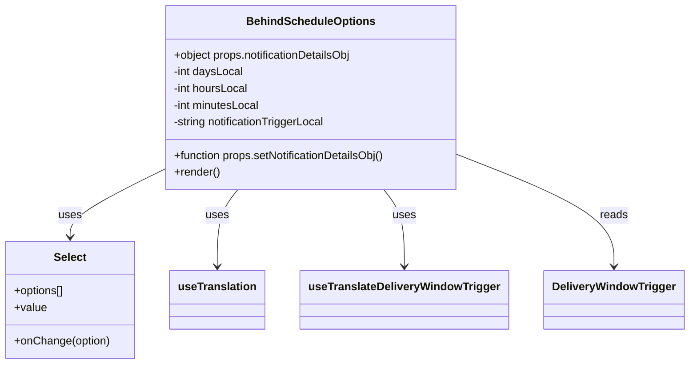

# Diagram: web/portal/src/pages/administration/notification-management/components/molecules/BehindScheduleOptions.molecule.js


> Auto-generated by Obscura crawlers

## Diagram 1



### SVG

<svg id="container" width="964.3671875" xmlns="http://www.w3.org/2000/svg" class="classDiagram" height="522" viewBox="0 0 964.3671875 522" role="graphics-document document" aria-roledescription="class"><style>#container{font-family:"trebuchet ms",verdana,arial,sans-serif;font-size:16px;fill:#333;}@keyframes edge-animation-frame{from{stroke-dashoffset:0;}}@keyframes dash{to{stroke-dashoffset:0;}}#container .edge-animation-slow{stroke-dasharray:9,5!important;stroke-dashoffset:900;animation:dash 50s linear infinite;stroke-linecap:round;}#container .edge-animation-fast{stroke-dasharray:9,5!important;stroke-dashoffset:900;animation:dash 20s linear infinite;stroke-linecap:round;}#container .error-icon{fill:#552222;}#container .error-text{fill:#552222;stroke:#552222;}#container .edge-thickness-normal{stroke-width:1px;}#container .edge-thickness-thick{stroke-width:3.5px;}#container .edge-pattern-solid{stroke-dasharray:0;}#container .edge-thickness-invisible{stroke-width:0;fill:none;}#container .edge-pattern-dashed{stroke-dasharray:3;}#container .edge-pattern-dotted{stroke-dasharray:2;}#container .marker{fill:#333333;stroke:#333333;}#container .marker.cross{stroke:#333333;}#container svg{font-family:"trebuchet ms",verdana,arial,sans-serif;font-size:16px;}#container p{margin:0;}#container g.classGroup text{fill:#9370DB;stroke:none;font-family:"trebuchet ms",verdana,arial,sans-serif;font-size:10px;}#container g.classGroup text .title{font-weight:bolder;}#container .nodeLabel,#container .edgeLabel{color:#131300;}#container .edgeLabel .label rect{fill:#ECECFF;}#container .label text{fill:#131300;}#container .labelBkg{background:#ECECFF;}#container .edgeLabel .label span{background:#ECECFF;}#container .classTitle{font-weight:bolder;}#container .node rect,#container .node circle,#container .node ellipse,#container .node polygon,#container .node path{fill:#ECECFF;stroke:#9370DB;stroke-width:1px;}#container .divider{stroke:#9370DB;stroke-width:1;}#container g.clickable{cursor:pointer;}#container g.classGroup rect{fill:#ECECFF;stroke:#9370DB;}#container g.classGroup line{stroke:#9370DB;stroke-width:1;}#container .classLabel .box{stroke:none;stroke-width:0;fill:#ECECFF;opacity:0.5;}#container .classLabel .label{fill:#9370DB;font-size:10px;}#container .relation{stroke:#333333;stroke-width:1;fill:none;}#container .dashed-line{stroke-dasharray:3;}#container .dotted-line{stroke-dasharray:1 2;}#container #compositionStart,#container .composition{fill:#333333!important;stroke:#333333!important;stroke-width:1;}#container #compositionEnd,#container .composition{fill:#333333!important;stroke:#333333!important;stroke-width:1;}#container #dependencyStart,#container .dependency{fill:#333333!important;stroke:#333333!important;stroke-width:1;}#container #dependencyStart,#container .dependency{fill:#333333!important;stroke:#333333!important;stroke-width:1;}#container #extensionStart,#container .extension{fill:transparent!important;stroke:#333333!important;stroke-width:1;}#container #extensionEnd,#container .extension{fill:transparent!important;stroke:#333333!important;stroke-width:1;}#container #aggregationStart,#container .aggregation{fill:transparent!important;stroke:#333333!important;stroke-width:1;}#container #aggregationEnd,#container .aggregation{fill:transparent!important;stroke:#333333!important;stroke-width:1;}#container #lollipopStart,#container .lollipop{fill:#ECECFF!important;stroke:#333333!important;stroke-width:1;}#container #lollipopEnd,#container .lollipop{fill:#ECECFF!important;stroke:#333333!important;stroke-width:1;}#container .edgeTerminals{font-size:11px;line-height:initial;}#container .classTitleText{text-anchor:middle;font-size:18px;fill:#333;}#container .label-icon{display:inline-block;height:1em;overflow:visible;vertical-align:-0.125em;}#container .node .label-icon path{fill:currentColor;stroke:revert;stroke-width:revert;}#container :root{--mermaid-font-family:"trebuchet ms",verdana,arial,sans-serif;}</style><g><defs><marker id="container_class-aggregationStart" class="marker aggregation class" refX="18" refY="7" markerWidth="190" markerHeight="240" orient="auto"><path d="M 18,7 L9,13 L1,7 L9,1 Z"></path></marker></defs><defs><marker id="container_class-aggregationEnd" class="marker aggregation class" refX="1" refY="7" markerWidth="20" markerHeight="28" orient="auto"><path d="M 18,7 L9,13 L1,7 L9,1 Z"></path></marker></defs><defs><marker id="container_class-extensionStart" class="marker extension class" refX="18" refY="7" markerWidth="190" markerHeight="240" orient="auto"><path d="M 1,7 L18,13 V 1 Z"></path></marker></defs><defs><marker id="container_class-extensionEnd" class="marker extension class" refX="1" refY="7" markerWidth="20" markerHeight="28" orient="auto"><path d="M 1,1 V 13 L18,7 Z"></path></marker></defs><defs><marker id="container_class-compositionStart" class="marker composition class" refX="18" refY="7" markerWidth="190" markerHeight="240" orient="auto"><path d="M 18,7 L9,13 L1,7 L9,1 Z"></path></marker></defs><defs><marker id="container_class-compositionEnd" class="marker composition class" refX="1" refY="7" markerWidth="20" markerHeight="28" orient="auto"><path d="M 18,7 L9,13 L1,7 L9,1 Z"></path></marker></defs><defs><marker id="container_class-dependencyStart" class="marker dependency class" refX="6" refY="7" markerWidth="190" markerHeight="240" orient="auto"><path d="M 5,7 L9,13 L1,7 L9,1 Z"></path></marker></defs><defs><marker id="container_class-dependencyEnd" class="marker dependency class" refX="13" refY="7" markerWidth="20" markerHeight="28" orient="auto"><path d="M 18,7 L9,13 L14,7 L9,1 Z"></path></marker></defs><defs><marker id="container_class-lollipopStart" class="marker lollipop class" refX="13" refY="7" markerWidth="190" markerHeight="240" orient="auto"><circle stroke="black" fill="transparent" cx="7" cy="7" r="6"></circle></marker></defs><defs><marker id="container_class-lollipopEnd" class="marker lollipop class" refX="1" refY="7" markerWidth="190" markerHeight="240" orient="auto"><circle stroke="black" fill="transparent" cx="7" cy="7" r="6"></circle></marker></defs><g class="root"><g class="clusters"></g><g class="edgePaths"><path d="M227.387,245.529L206.208,256.108C185.03,266.686,142.673,287.843,121.495,303.588C100.316,319.333,100.316,329.667,100.316,334.833L100.316,340" id="id_BehindScheduleOptions_Select_1" class="edge-thickness-normal edge-pattern-solid relation" style=";;;" data-edge="true" data-et="edge" data-id="id_BehindScheduleOptions_Select_1" data-points="W3sieCI6MjI3LjM4NjcxODc1LCJ5IjoyNDUuNTI5Mzk0MTA3MzI0MjZ9LHsieCI6MTAwLjMxNjQwNjI1LCJ5IjozMDl9LHsieCI6MTAwLjMxNjQwNjI1LCJ5IjozNDZ9XQ==" marker-end="url(#container_class-dependencyEnd)"></path><path d="M337.167,272L332.426,278.167C327.685,284.333,318.202,296.667,313.46,315C308.719,333.333,308.719,357.667,308.719,369.833L308.719,382" id="id_BehindScheduleOptions_useTranslation_2" class="edge-thickness-normal edge-pattern-solid relation" style=";;;" data-edge="true" data-et="edge" data-id="id_BehindScheduleOptions_useTranslation_2" data-points="W3sieCI6MzM3LjE2NzQ2MDI0NDA4Mjg2LCJ5IjoyNzJ9LHsieCI6MzA4LjcxODc1LCJ5IjozMDl9LHsieCI6MzA4LjcxODc1LCJ5IjozODh9XQ==" marker-end="url(#container_class-dependencyEnd)"></path><path d="M540.153,272L544.894,278.167C549.636,284.333,559.119,296.667,563.86,315C568.602,333.333,568.602,357.667,568.602,369.833L568.602,382" id="id_BehindScheduleOptions_useTranslateDeliveryWindowTrigger_3" class="edge-thickness-normal edge-pattern-solid relation" style=";;;" data-edge="true" data-et="edge" data-id="id_BehindScheduleOptions_useTranslateDeliveryWindowTrigger_3" data-points="W3sieCI6NTQwLjE1Mjg1MjI1NTkxNzIsInkiOjI3Mn0seyJ4Ijo1NjguNjAxNTYyNSwieSI6MzA5fSx7IngiOjU2OC42MDE1NjI1LCJ5IjozODh9XQ==" marker-end="url(#container_class-dependencyEnd)"></path><path d="M649.934,224.866L684.842,238.889C719.75,252.911,789.566,280.955,824.475,307.144C859.383,333.333,859.383,357.667,859.383,369.833L859.383,382" id="id_BehindScheduleOptions_DeliveryWindowTrigger_4" class="edge-thickness-normal edge-pattern-solid relation" style=";;;" data-edge="true" data-et="edge" data-id="id_BehindScheduleOptions_DeliveryWindowTrigger_4" data-points="W3sieCI6NjQ5LjkzMzU5Mzc1LCJ5IjoyMjQuODY2Mzg1MDMzMTkyNX0seyJ4Ijo4NTkuMzgyODEyNSwieSI6MzA5fSx7IngiOjg1OS4zODI4MTI1LCJ5IjozODh9XQ==" marker-end="url(#container_class-dependencyEnd)"></path></g><g class="edgeLabels"><g class="edgeLabel" transform="translate(100.31640625, 309)"><g class="label" data-id="id_BehindScheduleOptions_Select_1" transform="translate(-16.4921875, -12)"><foreignObject width="32.984375" height="24"><div xmlns="http://www.w3.org/1999/xhtml" class="labelBkg" style="display: table-cell; white-space: nowrap; line-height: 1.5; max-width: 200px; text-align: center;"><span class="edgeLabel"><p>uses</p></span></div></foreignObject></g></g><g class="edgeLabel" transform="translate(308.71875, 309)"><g class="label" data-id="id_BehindScheduleOptions_useTranslation_2" transform="translate(-16.4921875, -12)"><foreignObject width="32.984375" height="24"><div xmlns="http://www.w3.org/1999/xhtml" class="labelBkg" style="display: table-cell; white-space: nowrap; line-height: 1.5; max-width: 200px; text-align: center;"><span class="edgeLabel"><p>uses</p></span></div></foreignObject></g></g><g class="edgeLabel" transform="translate(568.6015625, 309)"><g class="label" data-id="id_BehindScheduleOptions_useTranslateDeliveryWindowTrigger_3" transform="translate(-16.4921875, -12)"><foreignObject width="32.984375" height="24"><div xmlns="http://www.w3.org/1999/xhtml" class="labelBkg" style="display: table-cell; white-space: nowrap; line-height: 1.5; max-width: 200px; text-align: center;"><span class="edgeLabel"><p>uses</p></span></div></foreignObject></g></g><g class="edgeLabel" transform="translate(859.3828125, 309)"><g class="label" data-id="id_BehindScheduleOptions_DeliveryWindowTrigger_4" transform="translate(-20.0078125, -12)"><foreignObject width="40.015625" height="24"><div xmlns="http://www.w3.org/1999/xhtml" class="labelBkg" style="display: table-cell; white-space: nowrap; line-height: 1.5; max-width: 200px; text-align: center;"><span class="edgeLabel"><p>reads</p></span></div></foreignObject></g></g></g><g class="nodes"><g class="node default" id="classId-BehindScheduleOptions-0" transform="translate(438.66015625, 140)"><g class="basic label-container"><path d="M-211.2734375 -132 L211.2734375 -132 L211.2734375 132 L-211.2734375 132" stroke="none" stroke-width="0" fill="#ECECFF" style=""></path><path d="M-211.2734375 -132 C-60.01088448995071 -132, 91.25166852009858 -132, 211.2734375 -132 M-211.2734375 -132 C-114.31234197313732 -132, -17.351246446274644 -132, 211.2734375 -132 M211.2734375 -132 C211.2734375 -29.324007223570973, 211.2734375 73.35198555285805, 211.2734375 132 M211.2734375 -132 C211.2734375 -69.66078967847575, 211.2734375 -7.321579356951503, 211.2734375 132 M211.2734375 132 C90.90386300854927 132, -29.46571148290147 132, -211.2734375 132 M211.2734375 132 C94.72215367392407 132, -21.829130152151862 132, -211.2734375 132 M-211.2734375 132 C-211.2734375 64.87746048182615, -211.2734375 -2.245079036347704, -211.2734375 -132 M-211.2734375 132 C-211.2734375 37.97301922352108, -211.2734375 -56.053961552957844, -211.2734375 -132" stroke="#9370DB" stroke-width="1.3" fill="none" stroke-dasharray="0 0" style=""></path></g><g class="annotation-group text" transform="translate(0, -108)"></g><g class="label-group text" transform="translate(-88.015625, -108)"><g class="label" style="font-weight: bolder" transform="translate(0,-12)"><foreignObject width="176.03125" height="24"><div xmlns="http://www.w3.org/1999/xhtml" style="display: table-cell; white-space: nowrap; line-height: 1.5; max-width: 225px; text-align: center;"><span class="nodeLabel markdown-node-label" style=""><p>BehindScheduleOptions</p></span></div></foreignObject></g></g><g class="members-group text" transform="translate(-199.2734375, -60)"><g class="label" style="" transform="translate(0,-12)"><foreignObject width="261.59375" height="24"><div xmlns="http://www.w3.org/1999/xhtml" style="display: table-cell; white-space: nowrap; line-height: 1.5; max-width: 319px; text-align: center;"><span class="nodeLabel markdown-node-label" style=""><p>+object props.notificationDetailsObj</p></span></div></foreignObject></g><g class="label" style="" transform="translate(0,12)"><foreignObject width="101.25" height="24"><div xmlns="http://www.w3.org/1999/xhtml" style="display: table-cell; white-space: nowrap; line-height: 1.5; max-width: 159px; text-align: center;"><span class="nodeLabel markdown-node-label" style=""><p>-int daysLocal</p></span></div></foreignObject></g><g class="label" style="" transform="translate(0,36)"><foreignObject width="109.4375" height="24"><div xmlns="http://www.w3.org/1999/xhtml" style="display: table-cell; white-space: nowrap; line-height: 1.5; max-width: 167px; text-align: center;"><span class="nodeLabel markdown-node-label" style=""><p>-int hoursLocal</p></span></div></foreignObject></g><g class="label" style="" transform="translate(0,60)"><foreignObject width="126.625" height="24"><div xmlns="http://www.w3.org/1999/xhtml" style="display: table-cell; white-space: nowrap; line-height: 1.5; max-width: 184px; text-align: center;"><span class="nodeLabel markdown-node-label" style=""><p>-int minutesLocal</p></span></div></foreignObject></g><g class="label" style="" transform="translate(0,84)"><foreignObject width="223.125" height="24"><div xmlns="http://www.w3.org/1999/xhtml" style="display: table-cell; white-space: nowrap; line-height: 1.5; max-width: 281px; text-align: center;"><span class="nodeLabel markdown-node-label" style=""><p>-string notificationTriggerLocal</p></span></div></foreignObject></g></g><g class="methods-group text" transform="translate(-199.2734375, 84)"><g class="label" style="" transform="translate(0,-12)"><foreignObject width="310.53125" height="24"><div xmlns="http://www.w3.org/1999/xhtml" style="display: table-cell; white-space: nowrap; line-height: 1.5; max-width: 368px; text-align: center;"><span class="nodeLabel markdown-node-label" style=""><p>+function props.setNotificationDetailsObj()</p></span></div></foreignObject></g><g class="label" style="" transform="translate(0,12)"><foreignObject width="66.609375" height="24"><div xmlns="http://www.w3.org/1999/xhtml" style="display: table-cell; white-space: nowrap; line-height: 1.5; max-width: 124px; text-align: center;"><span class="nodeLabel markdown-node-label" style=""><p>+render()</p></span></div></foreignObject></g></g><g class="divider" style=""><path d="M-211.2734375 -84 C-91.78490212708363 -84, 27.703633245832748 -84, 211.2734375 -84 M-211.2734375 -84 C-67.51403484732882 -84, 76.24536780534237 -84, 211.2734375 -84" stroke="#9370DB" stroke-width="1.3" fill="none" stroke-dasharray="0 0" style=""></path></g><g class="divider" style=""><path d="M-211.2734375 60 C-82.3986979378544 60, 46.47604162429121 60, 211.2734375 60 M-211.2734375 60 C-66.5209835055027 60, 78.2314704889946 60, 211.2734375 60" stroke="#9370DB" stroke-width="1.3" fill="none" stroke-dasharray="0 0" style=""></path></g></g><g class="node default" id="classId-Select-1" transform="translate(100.31640625, 430)"><g class="basic label-container"><path d="M-92.31640625 -84 L92.31640625 -84 L92.31640625 84 L-92.31640625 84" stroke="none" stroke-width="0" fill="#ECECFF" style=""></path><path d="M-92.31640625 -84 C-36.856453451598895 -84, 18.60349934680221 -84, 92.31640625 -84 M-92.31640625 -84 C-20.09137155511516 -84, 52.13366313976968 -84, 92.31640625 -84 M92.31640625 -84 C92.31640625 -46.26257155474396, 92.31640625 -8.525143109487914, 92.31640625 84 M92.31640625 -84 C92.31640625 -46.17534444579387, 92.31640625 -8.350688891587737, 92.31640625 84 M92.31640625 84 C55.20162029025165 84, 18.086834330503294 84, -92.31640625 84 M92.31640625 84 C42.07767536165742 84, -8.16105552668516 84, -92.31640625 84 M-92.31640625 84 C-92.31640625 46.784441115985935, -92.31640625 9.56888223197187, -92.31640625 -84 M-92.31640625 84 C-92.31640625 27.832419776771317, -92.31640625 -28.335160446457365, -92.31640625 -84" stroke="#9370DB" stroke-width="1.3" fill="none" stroke-dasharray="0 0" style=""></path></g><g class="annotation-group text" transform="translate(0, -60)"></g><g class="label-group text" transform="translate(-22.6640625, -60)"><g class="label" style="font-weight: bolder" transform="translate(0,-12)"><foreignObject width="45.328125" height="24"><div xmlns="http://www.w3.org/1999/xhtml" style="display: table-cell; white-space: nowrap; line-height: 1.5; max-width: 94px; text-align: center;"><span class="nodeLabel markdown-node-label" style=""><p>Select</p></span></div></foreignObject></g></g><g class="members-group text" transform="translate(-80.31640625, -12)"><g class="label" style="" transform="translate(0,-12)"><foreignObject width="73.625" height="24"><div xmlns="http://www.w3.org/1999/xhtml" style="display: table-cell; white-space: nowrap; line-height: 1.5; max-width: 131px; text-align: center;"><span class="nodeLabel markdown-node-label" style=""><p>+options[]</p></span></div></foreignObject></g><g class="label" style="" transform="translate(0,12)"><foreignObject width="46.71875" height="24"><div xmlns="http://www.w3.org/1999/xhtml" style="display: table-cell; white-space: nowrap; line-height: 1.5; max-width: 104px; text-align: center;"><span class="nodeLabel markdown-node-label" style=""><p>+value</p></span></div></foreignObject></g></g><g class="methods-group text" transform="translate(-80.31640625, 60)"><g class="label" style="" transform="translate(0,-12)"><foreignObject width="137.96875" height="24"><div xmlns="http://www.w3.org/1999/xhtml" style="display: table-cell; white-space: nowrap; line-height: 1.5; max-width: 195px; text-align: center;"><span class="nodeLabel markdown-node-label" style=""><p>+onChange(option)</p></span></div></foreignObject></g></g><g class="divider" style=""><path d="M-92.31640625 -36 C-30.12723215510939 -36, 32.06194193978122 -36, 92.31640625 -36 M-92.31640625 -36 C-22.220938726477414 -36, 47.87452879704517 -36, 92.31640625 -36" stroke="#9370DB" stroke-width="1.3" fill="none" stroke-dasharray="0 0" style=""></path></g><g class="divider" style=""><path d="M-92.31640625 36 C-31.94313269682626 36, 28.430140856347478 36, 92.31640625 36 M-92.31640625 36 C-54.18124304224911 36, -16.046079834498215 36, 92.31640625 36" stroke="#9370DB" stroke-width="1.3" fill="none" stroke-dasharray="0 0" style=""></path></g></g><g class="node default" id="classId-DeliveryWindowTrigger-2" transform="translate(859.3828125, 430)"><g class="basic label-container"><path d="M-96.984375 -42 L96.984375 -42 L96.984375 42 L-96.984375 42" stroke="none" stroke-width="0" fill="#ECECFF" style=""></path><path d="M-96.984375 -42 C-27.00638420507832 -42, 42.97160658984336 -42, 96.984375 -42 M-96.984375 -42 C-25.023256993487834 -42, 46.93786101302433 -42, 96.984375 -42 M96.984375 -42 C96.984375 -18.59814812564173, 96.984375 4.8037037487165435, 96.984375 42 M96.984375 -42 C96.984375 -15.142482127067684, 96.984375 11.715035745864633, 96.984375 42 M96.984375 42 C44.7375784888073 42, -7.509218022385397 42, -96.984375 42 M96.984375 42 C54.18852462151214 42, 11.392674243024274 42, -96.984375 42 M-96.984375 42 C-96.984375 14.502420379040473, -96.984375 -12.995159241919055, -96.984375 -42 M-96.984375 42 C-96.984375 21.94019468794452, -96.984375 1.8803893758890382, -96.984375 -42" stroke="#9370DB" stroke-width="1.3" fill="none" stroke-dasharray="0 0" style=""></path></g><g class="annotation-group text" transform="translate(0, -18)"></g><g class="label-group text" transform="translate(-84.984375, -18)"><g class="label" style="font-weight: bolder" transform="translate(0,-12)"><foreignObject width="169.96875" height="24"><div xmlns="http://www.w3.org/1999/xhtml" style="display: table-cell; white-space: nowrap; line-height: 1.5; max-width: 217px; text-align: center;"><span class="nodeLabel markdown-node-label" style=""><p>DeliveryWindowTrigger</p></span></div></foreignObject></g></g><g class="members-group text" transform="translate(-84.984375, 30)"></g><g class="methods-group text" transform="translate(-84.984375, 60)"></g><g class="divider" style=""><path d="M-96.984375 6 C-30.664831031052486 6, 35.65471293789503 6, 96.984375 6 M-96.984375 6 C-29.41760350572602 6, 38.14916798854796 6, 96.984375 6" stroke="#9370DB" stroke-width="1.3" fill="none" stroke-dasharray="0 0" style=""></path></g><g class="divider" style=""><path d="M-96.984375 24 C-36.803621326190694 24, 23.377132347618613 24, 96.984375 24 M-96.984375 24 C-37.55232561906013 24, 21.879723761879745 24, 96.984375 24" stroke="#9370DB" stroke-width="1.3" fill="none" stroke-dasharray="0 0" style=""></path></g></g><g class="node default" id="classId-useTranslation-3" transform="translate(308.71875, 430)"><g class="basic label-container"><path d="M-66.0859375 -42 L66.0859375 -42 L66.0859375 42 L-66.0859375 42" stroke="none" stroke-width="0" fill="#ECECFF" style=""></path><path d="M-66.0859375 -42 C-22.47165731712245 -42, 21.1426228657551 -42, 66.0859375 -42 M-66.0859375 -42 C-33.427818002719654 -42, -0.7696985054393082 -42, 66.0859375 -42 M66.0859375 -42 C66.0859375 -22.632989194548266, 66.0859375 -3.2659783890965315, 66.0859375 42 M66.0859375 -42 C66.0859375 -15.61859511987814, 66.0859375 10.76280976024372, 66.0859375 42 M66.0859375 42 C13.467584004027941 42, -39.15076949194412 42, -66.0859375 42 M66.0859375 42 C36.04428503530869 42, 6.002632570617372 42, -66.0859375 42 M-66.0859375 42 C-66.0859375 18.073717613200344, -66.0859375 -5.852564773599312, -66.0859375 -42 M-66.0859375 42 C-66.0859375 16.31322504499996, -66.0859375 -9.37354991000008, -66.0859375 -42" stroke="#9370DB" stroke-width="1.3" fill="none" stroke-dasharray="0 0" style=""></path></g><g class="annotation-group text" transform="translate(0, -18)"></g><g class="label-group text" transform="translate(-54.0859375, -18)"><g class="label" style="font-weight: bolder" transform="translate(0,-12)"><foreignObject width="108.171875" height="24"><div xmlns="http://www.w3.org/1999/xhtml" style="display: table-cell; white-space: nowrap; line-height: 1.5; max-width: 157px; text-align: center;"><span class="nodeLabel markdown-node-label" style=""><p>useTranslation</p></span></div></foreignObject></g></g><g class="members-group text" transform="translate(-54.0859375, 30)"></g><g class="methods-group text" transform="translate(-54.0859375, 60)"></g><g class="divider" style=""><path d="M-66.0859375 6 C-35.34811763425942 6, -4.6102977685188335 6, 66.0859375 6 M-66.0859375 6 C-18.70878012288407 6, 28.668377254231856 6, 66.0859375 6" stroke="#9370DB" stroke-width="1.3" fill="none" stroke-dasharray="0 0" style=""></path></g><g class="divider" style=""><path d="M-66.0859375 24 C-31.04622267266138 24, 3.9934921546772415 24, 66.0859375 24 M-66.0859375 24 C-32.78830676325224 24, 0.5093239734955262 24, 66.0859375 24" stroke="#9370DB" stroke-width="1.3" fill="none" stroke-dasharray="0 0" style=""></path></g></g><g class="node default" id="classId-useTranslateDeliveryWindowTrigger-4" transform="translate(568.6015625, 430)"><g class="basic label-container"><path d="M-143.796875 -42 L143.796875 -42 L143.796875 42 L-143.796875 42" stroke="none" stroke-width="0" fill="#ECECFF" style=""></path><path d="M-143.796875 -42 C-61.435730283155095 -42, 20.92541443368981 -42, 143.796875 -42 M-143.796875 -42 C-77.51688631055035 -42, -11.236897621100695 -42, 143.796875 -42 M143.796875 -42 C143.796875 -16.20070936225463, 143.796875 9.598581275490737, 143.796875 42 M143.796875 -42 C143.796875 -10.026924066823263, 143.796875 21.946151866353475, 143.796875 42 M143.796875 42 C83.54885468057998 42, 23.300834361159943 42, -143.796875 42 M143.796875 42 C56.46372916128898 42, -30.869416677422038 42, -143.796875 42 M-143.796875 42 C-143.796875 20.037205247048536, -143.796875 -1.925589505902927, -143.796875 -42 M-143.796875 42 C-143.796875 16.02832551632679, -143.796875 -9.943348967346417, -143.796875 -42" stroke="#9370DB" stroke-width="1.3" fill="none" stroke-dasharray="0 0" style=""></path></g><g class="annotation-group text" transform="translate(0, -18)"></g><g class="label-group text" transform="translate(-131.796875, -18)"><g class="label" style="font-weight: bolder" transform="translate(0,-12)"><foreignObject width="263.59375" height="24"><div xmlns="http://www.w3.org/1999/xhtml" style="display: table-cell; white-space: nowrap; line-height: 1.5; max-width: 309px; text-align: center;"><span class="nodeLabel markdown-node-label" style=""><p>useTranslateDeliveryWindowTrigger</p></span></div></foreignObject></g></g><g class="members-group text" transform="translate(-131.796875, 30)"></g><g class="methods-group text" transform="translate(-131.796875, 60)"></g><g class="divider" style=""><path d="M-143.796875 6 C-35.56185389907847 6, 72.67316720184306 6, 143.796875 6 M-143.796875 6 C-30.51093511096569 6, 82.77500477806862 6, 143.796875 6" stroke="#9370DB" stroke-width="1.3" fill="none" stroke-dasharray="0 0" style=""></path></g><g class="divider" style=""><path d="M-143.796875 24 C-34.4832451985196 24, 74.8303846029608 24, 143.796875 24 M-143.796875 24 C-50.6700834872983 24, 42.4567080254034 24, 143.796875 24" stroke="#9370DB" stroke-width="1.3" fill="none" stroke-dasharray="0 0" style=""></path></g></g></g></g></g></svg>

## Diagram 2

```mermaid
flowchart LR
  A[notificationDetailsObj prop] --> B{Initialize locals}
  B --> C[daysLocal = notificationDetailsObj.notificationTriggerTimeObj.days]
  B --> D[hoursLocal = notificationDetailsObj.notificationTriggerTimeObj.hours]
  B --> E[minutesLocal = notificationDetailsObj.notificationTriggerTimeObj.minutes]
  B --> F[notificationTriggerLocal = notificationDetailsObj.notificationTrigger]
  subgraph UI
    G[Day Select]
    H[Hour Select]
    I[Minute Select]
    J[Trigger Type Select]
  end
  G -->|onChange: setDaysLocal(value)| C2[update daysLocal]
  H -->|onChange: setHoursLocal(value)| D2[update hoursLocal]
  I -->|onChange: setMinutesLocal(value)| E2[update minutesLocal]
  J -->|onChange: setNotificationTriggerLocal(value)| F2[update notificationTriggerLocal]
  C2 --> K[call setNotificationDetailsObj with new days/hours/minutes]
  D2 --> K
  E2 --> K
  F2 --> L[call setNotificationDetailsObj with new notificationTrigger]
  K --> M[Parent notificationDetailsObj updated]
  L --> M
```

> SVG rendering failed for this diagram.
