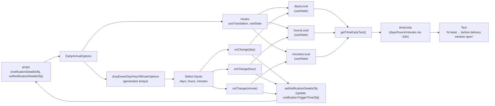

# Diagram: web/portal/src/pages/administration/notification-management/components/molecules/EarlyArrivalOptions.molecule.js


> Auto-generated by Obscura crawlers

## Diagram 1



### SVG

<svg id="container" width="2925.171875" xmlns="http://www.w3.org/2000/svg" class="flowchart" height="494" viewBox="0 0 2925.171875 494" role="graphics-document document" aria-roledescription="flowchart-v2"><style>#container{font-family:"trebuchet ms",verdana,arial,sans-serif;font-size:16px;fill:#333;}@keyframes edge-animation-frame{from{stroke-dashoffset:0;}}@keyframes dash{to{stroke-dashoffset:0;}}#container .edge-animation-slow{stroke-dasharray:9,5!important;stroke-dashoffset:900;animation:dash 50s linear infinite;stroke-linecap:round;}#container .edge-animation-fast{stroke-dasharray:9,5!important;stroke-dashoffset:900;animation:dash 20s linear infinite;stroke-linecap:round;}#container .error-icon{fill:#552222;}#container .error-text{fill:#552222;stroke:#552222;}#container .edge-thickness-normal{stroke-width:1px;}#container .edge-thickness-thick{stroke-width:3.5px;}#container .edge-pattern-solid{stroke-dasharray:0;}#container .edge-thickness-invisible{stroke-width:0;fill:none;}#container .edge-pattern-dashed{stroke-dasharray:3;}#container .edge-pattern-dotted{stroke-dasharray:2;}#container .marker{fill:#333333;stroke:#333333;}#container .marker.cross{stroke:#333333;}#container svg{font-family:"trebuchet ms",verdana,arial,sans-serif;font-size:16px;}#container p{margin:0;}#container .label{font-family:"trebuchet ms",verdana,arial,sans-serif;color:#333;}#container .cluster-label text{fill:#333;}#container .cluster-label span{color:#333;}#container .cluster-label span p{background-color:transparent;}#container .label text,#container span{fill:#333;color:#333;}#container .node rect,#container .node circle,#container .node ellipse,#container .node polygon,#container .node path{fill:#ECECFF;stroke:#9370DB;stroke-width:1px;}#container .rough-node .label text,#container .node .label text,#container .image-shape .label,#container .icon-shape .label{text-anchor:middle;}#container .node .katex path{fill:#000;stroke:#000;stroke-width:1px;}#container .rough-node .label,#container .node .label,#container .image-shape .label,#container .icon-shape .label{text-align:center;}#container .node.clickable{cursor:pointer;}#container .root .anchor path{fill:#333333!important;stroke-width:0;stroke:#333333;}#container .arrowheadPath{fill:#333333;}#container .edgePath .path{stroke:#333333;stroke-width:2.0px;}#container .flowchart-link{stroke:#333333;fill:none;}#container .edgeLabel{background-color:rgba(232,232,232, 0.8);text-align:center;}#container .edgeLabel p{background-color:rgba(232,232,232, 0.8);}#container .edgeLabel rect{opacity:0.5;background-color:rgba(232,232,232, 0.8);fill:rgba(232,232,232, 0.8);}#container .labelBkg{background-color:rgba(232, 232, 232, 0.5);}#container .cluster rect{fill:#ffffde;stroke:#aaaa33;stroke-width:1px;}#container .cluster text{fill:#333;}#container .cluster span{color:#333;}#container div.mermaidTooltip{position:absolute;text-align:center;max-width:200px;padding:2px;font-family:"trebuchet ms",verdana,arial,sans-serif;font-size:12px;background:hsl(80, 100%, 96.2745098039%);border:1px solid #aaaa33;border-radius:2px;pointer-events:none;z-index:100;}#container .flowchartTitleText{text-anchor:middle;font-size:18px;fill:#333;}#container rect.text{fill:none;stroke-width:0;}#container .icon-shape,#container .image-shape{background-color:rgba(232,232,232, 0.8);text-align:center;}#container .icon-shape p,#container .image-shape p{background-color:rgba(232,232,232, 0.8);padding:2px;}#container .icon-shape rect,#container .image-shape rect{opacity:0.5;background-color:rgba(232,232,232, 0.8);fill:rgba(232,232,232, 0.8);}#container .label-icon{display:inline-block;height:1em;overflow:visible;vertical-align:-0.125em;}#container .node .label-icon path{fill:currentColor;stroke:revert;stroke-width:revert;}#container :root{--mermaid-font-family:"trebuchet ms",verdana,arial,sans-serif;}</style><g><marker id="container_flowchart-v2-pointEnd" class="marker flowchart-v2" viewBox="0 0 10 10" refX="5" refY="5" markerUnits="userSpaceOnUse" markerWidth="8" markerHeight="8" orient="auto"><path d="M 0 0 L 10 5 L 0 10 z" class="arrowMarkerPath" style="stroke-width: 1; stroke-dasharray: 1, 0;"></path></marker><marker id="container_flowchart-v2-pointStart" class="marker flowchart-v2" viewBox="0 0 10 10" refX="4.5" refY="5" markerUnits="userSpaceOnUse" markerWidth="8" markerHeight="8" orient="auto"><path d="M 0 5 L 10 10 L 10 0 z" class="arrowMarkerPath" style="stroke-width: 1; stroke-dasharray: 1, 0;"></path></marker><marker id="container_flowchart-v2-circleEnd" class="marker flowchart-v2" viewBox="0 0 10 10" refX="11" refY="5" markerUnits="userSpaceOnUse" markerWidth="11" markerHeight="11" orient="auto"><circle cx="5" cy="5" r="5" class="arrowMarkerPath" style="stroke-width: 1; stroke-dasharray: 1, 0;"></circle></marker><marker id="container_flowchart-v2-circleStart" class="marker flowchart-v2" viewBox="0 0 10 10" refX="-1" refY="5" markerUnits="userSpaceOnUse" markerWidth="11" markerHeight="11" orient="auto"><circle cx="5" cy="5" r="5" class="arrowMarkerPath" style="stroke-width: 1; stroke-dasharray: 1, 0;"></circle></marker><marker id="container_flowchart-v2-crossEnd" class="marker cross flowchart-v2" viewBox="0 0 11 11" refX="12" refY="5.2" markerUnits="userSpaceOnUse" markerWidth="11" markerHeight="11" orient="auto"><path d="M 1,1 l 9,9 M 10,1 l -9,9" class="arrowMarkerPath" style="stroke-width: 2; stroke-dasharray: 1, 0;"></path></marker><marker id="container_flowchart-v2-crossStart" class="marker cross flowchart-v2" viewBox="0 0 11 11" refX="-1" refY="5.2" markerUnits="userSpaceOnUse" markerWidth="11" markerHeight="11" orient="auto"><path d="M 1,1 l 9,9 M 10,1 l -9,9" class="arrowMarkerPath" style="stroke-width: 2; stroke-dasharray: 1, 0;"></path></marker><g class="root"><g class="clusters"></g><g class="edgePaths"><path d="M233.155,297L248.192,289.667C263.228,282.333,293.302,267.667,311.838,260.333C330.375,253,337.375,253,340.875,253L344.375,253" id="L_Props_Component_0" class="edge-thickness-normal edge-pattern-solid edge-thickness-normal edge-pattern-solid flowchart-link" style=";" data-edge="true" data-et="edge" data-id="L_Props_Component_0" data-points="W3sieCI6MjMzLjE1NTEyMDQ4MTkyNzcyLCJ5IjoyOTd9LHsieCI6MzIzLjM3NSwieSI6MjUzfSx7IngiOjM0OC4zNzUsInkiOjI1M31d" marker-end="url(#container_flowchart-v2-pointEnd)"></path><path d="M468.229,226L485.685,202.5C503.142,179,538.055,132,594.591,108.5C651.128,85,729.286,85,807.445,85C885.604,85,963.763,85,1028.676,85C1093.589,85,1145.255,85,1196.922,85C1248.589,85,1300.255,85,1329.589,85C1358.922,85,1365.922,85,1369.422,85L1372.922,85" id="L_Component_SubHooks_0" class="edge-thickness-normal edge-pattern-solid edge-thickness-normal edge-pattern-solid flowchart-link" style=";" data-edge="true" data-et="edge" data-id="L_Component_SubHooks_0" data-points="W3sieCI6NDY4LjIyODUxNTYyNSwieSI6MjI2fSx7IngiOjU3Mi45Njg3NSwieSI6ODV9LHsieCI6ODA3LjQ0NTMxMjUsInkiOjg1fSx7IngiOjEwNDEuOTIxODc1LCJ5Ijo4NX0seyJ4IjoxMTk2LjkyMTg3NSwieSI6ODV9LHsieCI6MTM1MS45MjE4NzUsInkiOjg1fSx7IngiOjEzNzYuOTIxODc1LCJ5Ijo4NX1d" marker-end="url(#container_flowchart-v2-pointEnd)"></path><path d="M1607.672,46L1616.714,42.5C1625.755,39,1643.839,32,1664.632,29.134C1685.426,26.269,1708.931,27.537,1720.683,28.172L1732.436,28.806" id="L_SubHooks_StateDays_0" class="edge-thickness-normal edge-pattern-solid edge-thickness-normal edge-pattern-solid flowchart-link" style=";" data-edge="true" data-et="edge" data-id="L_SubHooks_StateDays_0" data-points="W3sieCI6MTYwNy42NzE4NzUsInkiOjQ2fSx7IngiOjE2NjEuOTIxODc1LCJ5IjoyNX0seyJ4IjoxNzM2LjQyOTY4NzUsInkiOjI5LjAyMTg0NDU1NzgzNzQ3Mn1d" marker-end="url(#container_flowchart-v2-pointEnd)"></path><path d="M1636.922,95.065L1641.089,95.387C1645.255,95.71,1653.589,96.355,1668.842,99.191C1684.095,102.027,1706.269,107.054,1717.356,109.568L1728.443,112.081" id="L_SubHooks_StateHours_0" class="edge-thickness-normal edge-pattern-solid edge-thickness-normal edge-pattern-solid flowchart-link" style=";" data-edge="true" data-et="edge" data-id="L_SubHooks_StateHours_0" data-points="W3sieCI6MTYzNi45MjE4NzUsInkiOjk1LjA2NDUxNjEyOTAzMjI2fSx7IngiOjE2NjEuOTIxODc1LCJ5Ijo5N30seyJ4IjoxNzMyLjM0Mzc1LCJ5IjoxMTIuOTY1NDE5ODExOTE3NTF9XQ==" marker-end="url(#container_flowchart-v2-pointEnd)"></path><path d="M1559.034,124L1576.182,136.833C1593.33,149.667,1627.626,175.333,1655.151,190.519C1682.676,205.705,1703.43,210.41,1713.807,212.763L1724.184,215.116" id="L_SubHooks_StateMinutes_0" class="edge-thickness-normal edge-pattern-solid edge-thickness-normal edge-pattern-solid flowchart-link" style=";" data-edge="true" data-et="edge" data-id="L_SubHooks_StateMinutes_0" data-points="W3sieCI6MTU1OS4wMzM5NDM5NjU1MTcyLCJ5IjoxMjR9LHsieCI6MTY2MS45MjE4NzUsInkiOjIwMX0seyJ4IjoxNzI4LjA4NTM3OTQ2NDI4NTgsInkiOjIxNn1d" marker-end="url(#container_flowchart-v2-pointEnd)"></path><path d="M477.991,280L493.82,294.333C509.65,308.667,541.309,337.333,560.639,351.667C579.969,366,586.969,366,590.469,366L593.969,366" id="L_Component_Options_0" class="edge-thickness-normal edge-pattern-solid edge-thickness-normal edge-pattern-solid flowchart-link" style=";" data-edge="true" data-et="edge" data-id="L_Component_Options_0" data-points="W3sieCI6NDc3Ljk5MDU5NzM0NTEzMjc2LCJ5IjoyODB9LHsieCI6NTcyLjk2ODc1LCJ5IjozNjZ9LHsieCI6NTk3Ljk2ODc1LCJ5IjozNjZ9XQ==" marker-end="url(#container_flowchart-v2-pointEnd)"></path><path d="M1016.922,366L1021.089,366C1025.255,366,1033.589,366,1041.255,366C1048.922,366,1055.922,366,1059.422,366L1062.922,366" id="L_Options_Dropdowns_0" class="edge-thickness-normal edge-pattern-solid edge-thickness-normal edge-pattern-solid flowchart-link" style=";" data-edge="true" data-et="edge" data-id="L_Options_Dropdowns_0" data-points="W3sieCI6MTAxNi45MjE4NzUsInkiOjM2Nn0seyJ4IjoxMDQxLjkyMTg3NSwieSI6MzY2fSx7IngiOjEwNjYuOTIxODc1LCJ5IjozNjZ9XQ==" marker-end="url(#container_flowchart-v2-pointEnd)"></path><path d="M1235.672,327L1255.047,307.5C1274.422,288,1313.172,249,1343.71,229.5C1374.247,210,1396.573,210,1407.736,210L1418.898,210" id="L_Dropdowns_onChangeDay_0" class="edge-thickness-normal edge-pattern-solid edge-thickness-normal edge-pattern-solid flowchart-link" style=";" data-edge="true" data-et="edge" data-id="L_Dropdowns_onChangeDay_0" data-points="W3sieCI6MTIzNS42NzE4NzUsInkiOjMyN30seyJ4IjoxMzUxLjkyMTg3NSwieSI6MjEwfSx7IngiOjE0MjIuODk4NDM3NSwieSI6MjEwfV0=" marker-end="url(#container_flowchart-v2-pointEnd)"></path><path d="M1313.172,327L1319.63,324.833C1326.089,322.667,1339.005,318.333,1355.935,316.167C1372.865,314,1393.807,314,1404.279,314L1414.75,314" id="L_Dropdowns_onChangeHour_0" class="edge-thickness-normal edge-pattern-solid edge-thickness-normal edge-pattern-solid flowchart-link" style=";" data-edge="true" data-et="edge" data-id="L_Dropdowns_onChangeHour_0" data-points="W3sieCI6MTMxMy4xNzE4NzUsInkiOjMyN30seyJ4IjoxMzUxLjkyMTg3NSwieSI6MzE0fSx7IngiOjE0MTguNzUsInkiOjMxNH1d" marker-end="url(#container_flowchart-v2-pointEnd)"></path><path d="M1313.172,405L1319.63,407.167C1326.089,409.333,1339.005,413.667,1354.522,415.833C1370.039,418,1388.156,418,1397.215,418L1406.273,418" id="L_Dropdowns_onChangeMinute_0" class="edge-thickness-normal edge-pattern-solid edge-thickness-normal edge-pattern-solid flowchart-link" style=";" data-edge="true" data-et="edge" data-id="L_Dropdowns_onChangeMinute_0" data-points="W3sieCI6MTMxMy4xNzE4NzUsInkiOjQwNX0seyJ4IjoxMzUxLjkyMTg3NSwieSI6NDE4fSx7IngiOjE0MTAuMjczNDM3NSwieSI6NDE4fV0=" marker-end="url(#container_flowchart-v2-pointEnd)"></path><path d="M1538.388,183L1558.977,165.333C1579.566,147.667,1620.744,112.333,1653.101,91.999C1685.457,71.664,1708.993,66.328,1720.761,63.661L1732.529,60.993" id="L_onChangeDay_StateDays_0" class="edge-thickness-normal edge-pattern-solid edge-thickness-normal edge-pattern-solid flowchart-link" style=";" data-edge="true" data-et="edge" data-id="L_onChangeDay_StateDays_0" data-points="W3sieCI6MTUzOC4zODgwNDA0MTM1MzM5LCJ5IjoxODN9LHsieCI6MTY2MS45MjE4NzUsInkiOjc3fSx7IngiOjE3MzYuNDI5Njg3NSwieSI6NjAuMTA4MjUyODU3MDgyNjF9XQ==" marker-end="url(#container_flowchart-v2-pointEnd)"></path><path d="M1538.388,287L1558.977,269.333C1579.566,251.667,1620.744,216.333,1652.42,196.153C1684.095,175.973,1706.269,170.946,1717.356,168.432L1728.443,165.919" id="L_onChangeHour_StateHours_0" class="edge-thickness-normal edge-pattern-solid edge-thickness-normal edge-pattern-solid flowchart-link" style=";" data-edge="true" data-et="edge" data-id="L_onChangeHour_StateHours_0" data-points="W3sieCI6MTUzOC4zODgwNDA0MTM1MzM5LCJ5IjoyODd9LHsieCI6MTY2MS45MjE4NzUsInkiOjE4MX0seyJ4IjoxNzMyLjM0Mzc1LCJ5IjoxNjUuMDM0NTgwMTg4MDgyNX1d" marker-end="url(#container_flowchart-v2-pointEnd)"></path><path d="M1539.875,391L1560.216,374.333C1580.557,357.667,1621.239,324.333,1654.444,304.334C1687.648,284.334,1713.374,277.669,1726.237,274.336L1739.1,271.003" id="L_onChangeMinute_StateMinutes_0" class="edge-thickness-normal edge-pattern-solid edge-thickness-normal edge-pattern-solid flowchart-link" style=";" data-edge="true" data-et="edge" data-id="L_onChangeMinute_StateMinutes_0" data-points="W3sieCI6MTUzOS44NzQ2MzA5MDU1MTE4LCJ5IjozOTF9LHsieCI6MTY2MS45MjE4NzUsInkiOjI5MX0seyJ4IjoxNzQyLjk3MjE2Nzk2ODc1LCJ5IjoyNzB9XQ==" marker-end="url(#container_flowchart-v2-pointEnd)"></path><path d="M1548.358,237L1567.285,249.333C1586.212,261.667,1624.067,286.333,1663.104,311.475C1702.14,336.617,1742.358,362.234,1762.468,375.043L1782.577,387.851" id="L_onChangeDay_UpdateObj_0" class="edge-thickness-normal edge-pattern-solid edge-thickness-normal edge-pattern-solid flowchart-link" style=";" data-edge="true" data-et="edge" data-id="L_onChangeDay_UpdateObj_0" data-points="W3sieCI6MTU0OC4zNTc1MTg1NjQzNTY1LCJ5IjoyMzd9LHsieCI6MTY2MS45MjE4NzUsInkiOjMxMX0seyJ4IjoxNzg1Ljk1MDQxMDQ4NzI4OCwieSI6MzkwfV0=" marker-end="url(#container_flowchart-v2-pointEnd)"></path><path d="M1567.574,341L1583.299,348C1599.023,355,1630.473,369,1650.249,377.006C1670.025,385.012,1678.128,387.024,1682.18,388.03L1686.231,389.036" id="L_onChangeHour_UpdateObj_0" class="edge-thickness-normal edge-pattern-solid edge-thickness-normal edge-pattern-solid flowchart-link" style=";" data-edge="true" data-et="edge" data-id="L_onChangeHour_UpdateObj_0" data-points="W3sieCI6MTU2Ny41NzQwNDg5MTMwNDM1LCJ5IjozNDF9LHsieCI6MTY2MS45MjE4NzUsInkiOjM4M30seyJ4IjoxNjkwLjExMzI4MTI1LCJ5IjozOTB9XQ==" marker-end="url(#container_flowchart-v2-pointEnd)"></path><path d="M1603.57,434.836L1613.296,436.53C1623.021,438.224,1642.471,441.612,1655.699,443.003C1668.927,444.395,1675.932,443.79,1679.434,443.488L1682.937,443.185" id="L_onChangeMinute_UpdateObj_0" class="edge-thickness-normal edge-pattern-solid edge-thickness-normal edge-pattern-solid flowchart-link" style=";" data-edge="true" data-et="edge" data-id="L_onChangeMinute_UpdateObj_0" data-points="W3sieCI6MTYwMy41NzAzMTI1LCJ5Ijo0MzQuODM1NTM0Mjc0MTkzNTV9LHsieCI6MTY2MS45MjE4NzUsInkiOjQ0NX0seyJ4IjoxNjg2LjkyMTg3NSwieSI6NDQyLjg0MDg0Njc5Mjg5ODR9XQ==" marker-end="url(#container_flowchart-v2-pointEnd)"></path><path d="M1957.93,35L1970.348,35C1982.766,35,2007.602,35,2034.524,47.4C2061.446,59.8,2090.455,84.6,2104.959,97.001L2119.464,109.401" id="L_StateDays_getTime_0" class="edge-thickness-normal edge-pattern-solid edge-thickness-normal edge-pattern-solid flowchart-link" style=";" data-edge="true" data-et="edge" data-id="L_StateDays_getTime_0" data-points="W3sieCI6MTk1Ny45Mjk2ODc1LCJ5IjozNX0seyJ4IjoyMDMyLjQzNzUsInkiOjM1fSx7IngiOjIxMjIuNTA0MTMxNjEwNTc3LCJ5IjoxMTJ9XQ==" marker-end="url(#container_flowchart-v2-pointEnd)"></path><path d="M1962.016,139L1973.753,139C1985.49,139,2008.964,139,2024.201,139C2039.438,139,2046.438,139,2049.938,139L2053.438,139" id="L_StateHours_getTime_0" class="edge-thickness-normal edge-pattern-solid edge-thickness-normal edge-pattern-solid flowchart-link" style=";" data-edge="true" data-et="edge" data-id="L_StateHours_getTime_0" data-points="W3sieCI6MTk2Mi4wMTU2MjUsInkiOjEzOX0seyJ4IjoyMDMyLjQzNzUsInkiOjEzOX0seyJ4IjoyMDU3LjQzNzUsInkiOjEzOX1d" marker-end="url(#container_flowchart-v2-pointEnd)"></path><path d="M1970.617,243L1980.921,243C1991.224,243,2011.831,243,2036.638,230.6C2061.446,218.2,2090.455,193.4,2104.959,180.999L2119.464,168.599" id="L_StateMinutes_getTime_0" class="edge-thickness-normal edge-pattern-solid edge-thickness-normal edge-pattern-solid flowchart-link" style=";" data-edge="true" data-et="edge" data-id="L_StateMinutes_getTime_0" data-points="W3sieCI6MTk3MC42MTcxODc1LCJ5IjoyNDN9LHsieCI6MjAzMi40Mzc1LCJ5IjoyNDN9LHsieCI6MjEyMi41MDQxMzE2MTA1NzcsInkiOjE2Nn1d" marker-end="url(#container_flowchart-v2-pointEnd)"></path><path d="M2250.734,139L2254.901,139C2259.068,139,2267.401,139,2275.068,139C2282.734,139,2289.734,139,2293.234,139L2296.734,139" id="L_getTime_TimeUnits_0" class="edge-thickness-normal edge-pattern-solid edge-thickness-normal edge-pattern-solid flowchart-link" style=";" data-edge="true" data-et="edge" data-id="L_getTime_TimeUnits_0" data-points="W3sieCI6MjI1MC43MzQzNzUsInkiOjEzOX0seyJ4IjoyMjc1LjczNDM3NSwieSI6MTM5fSx7IngiOjIzMDAuNzM0Mzc1LCJ5IjoxMzl9XQ==" marker-end="url(#container_flowchart-v2-pointEnd)"></path><path d="M2607.172,139L2611.339,139C2615.505,139,2623.839,139,2631.505,139C2639.172,139,2646.172,139,2649.672,139L2653.172,139" id="L_TimeUnits_DisplayText_0" class="edge-thickness-normal edge-pattern-solid edge-thickness-normal edge-pattern-solid flowchart-link" style=";" data-edge="true" data-et="edge" data-id="L_TimeUnits_DisplayText_0" data-points="W3sieCI6MjYwNy4xNzE4NzUsInkiOjEzOX0seyJ4IjoyNjMyLjE3MTg3NSwieSI6MTM5fSx7IngiOjI2NTcuMTcxODc1LCJ5IjoxMzl9XQ==" marker-end="url(#container_flowchart-v2-pointEnd)"></path><path d="M1720.424,468L1710.674,471C1700.924,474,1681.423,480,1645.839,483C1610.255,486,1558.589,486,1506.922,486C1455.255,486,1403.589,486,1351.922,486C1300.255,486,1248.589,486,1196.922,486C1145.255,486,1093.589,486,1028.676,486C963.763,486,885.604,486,807.445,486C729.286,486,651.128,486,591.249,486C531.37,486,489.771,486,448.172,486C406.573,486,364.974,486,323.685,467.941C282.396,449.882,241.416,413.763,220.927,395.704L200.437,377.645" id="L_UpdateObj_Props_0" class="edge-thickness-normal edge-pattern-solid edge-thickness-normal edge-pattern-solid flowchart-link" style=";" data-edge="true" data-et="edge" data-id="L_UpdateObj_Props_0" data-points="W3sieCI6MTcyMC40MjQzNDIxMDUyNjMxLCJ5Ijo0Njh9LHsieCI6MTY2MS45MjE4NzUsInkiOjQ4Nn0seyJ4IjoxNTA2LjkyMTg3NSwieSI6NDg2fSx7IngiOjEzNTEuOTIxODc1LCJ5Ijo0ODZ9LHsieCI6MTE5Ni45MjE4NzUsInkiOjQ4Nn0seyJ4IjoxMDQxLjkyMTg3NSwieSI6NDg2fSx7IngiOjgwNy40NDUzMTI1LCJ5Ijo0ODZ9LHsieCI6NTcyLjk2ODc1LCJ5Ijo0ODZ9LHsieCI6NDQ4LjE3MTg3NSwieSI6NDg2fSx7IngiOjMyMy4zNzUsInkiOjQ4Nn0seyJ4IjoxOTcuNDM2MjUsInkiOjM3NX1d" marker-end="url(#container_flowchart-v2-pointEnd)"></path></g><g class="edgeLabels"><g class="edgeLabel"><g class="label" data-id="L_Props_Component_0" transform="translate(0, 0)"><foreignObject width="0" height="0"><div xmlns="http://www.w3.org/1999/xhtml" class="labelBkg" style="display: table-cell; white-space: nowrap; line-height: 1.5; max-width: 200px; text-align: center;"><span class="edgeLabel"></span></div></foreignObject></g></g><g class="edgeLabel"><g class="label" data-id="L_Component_SubHooks_0" transform="translate(0, 0)"><foreignObject width="0" height="0"><div xmlns="http://www.w3.org/1999/xhtml" class="labelBkg" style="display: table-cell; white-space: nowrap; line-height: 1.5; max-width: 200px; text-align: center;"><span class="edgeLabel"></span></div></foreignObject></g></g><g class="edgeLabel"><g class="label" data-id="L_SubHooks_StateDays_0" transform="translate(0, 0)"><foreignObject width="0" height="0"><div xmlns="http://www.w3.org/1999/xhtml" class="labelBkg" style="display: table-cell; white-space: nowrap; line-height: 1.5; max-width: 200px; text-align: center;"><span class="edgeLabel"></span></div></foreignObject></g></g><g class="edgeLabel"><g class="label" data-id="L_SubHooks_StateHours_0" transform="translate(0, 0)"><foreignObject width="0" height="0"><div xmlns="http://www.w3.org/1999/xhtml" class="labelBkg" style="display: table-cell; white-space: nowrap; line-height: 1.5; max-width: 200px; text-align: center;"><span class="edgeLabel"></span></div></foreignObject></g></g><g class="edgeLabel"><g class="label" data-id="L_SubHooks_StateMinutes_0" transform="translate(0, 0)"><foreignObject width="0" height="0"><div xmlns="http://www.w3.org/1999/xhtml" class="labelBkg" style="display: table-cell; white-space: nowrap; line-height: 1.5; max-width: 200px; text-align: center;"><span class="edgeLabel"></span></div></foreignObject></g></g><g class="edgeLabel"><g class="label" data-id="L_Component_Options_0" transform="translate(0, 0)"><foreignObject width="0" height="0"><div xmlns="http://www.w3.org/1999/xhtml" class="labelBkg" style="display: table-cell; white-space: nowrap; line-height: 1.5; max-width: 200px; text-align: center;"><span class="edgeLabel"></span></div></foreignObject></g></g><g class="edgeLabel"><g class="label" data-id="L_Options_Dropdowns_0" transform="translate(0, 0)"><foreignObject width="0" height="0"><div xmlns="http://www.w3.org/1999/xhtml" class="labelBkg" style="display: table-cell; white-space: nowrap; line-height: 1.5; max-width: 200px; text-align: center;"><span class="edgeLabel"></span></div></foreignObject></g></g><g class="edgeLabel"><g class="label" data-id="L_Dropdowns_onChangeDay_0" transform="translate(0, 0)"><foreignObject width="0" height="0"><div xmlns="http://www.w3.org/1999/xhtml" class="labelBkg" style="display: table-cell; white-space: nowrap; line-height: 1.5; max-width: 200px; text-align: center;"><span class="edgeLabel"></span></div></foreignObject></g></g><g class="edgeLabel"><g class="label" data-id="L_Dropdowns_onChangeHour_0" transform="translate(0, 0)"><foreignObject width="0" height="0"><div xmlns="http://www.w3.org/1999/xhtml" class="labelBkg" style="display: table-cell; white-space: nowrap; line-height: 1.5; max-width: 200px; text-align: center;"><span class="edgeLabel"></span></div></foreignObject></g></g><g class="edgeLabel"><g class="label" data-id="L_Dropdowns_onChangeMinute_0" transform="translate(0, 0)"><foreignObject width="0" height="0"><div xmlns="http://www.w3.org/1999/xhtml" class="labelBkg" style="display: table-cell; white-space: nowrap; line-height: 1.5; max-width: 200px; text-align: center;"><span class="edgeLabel"></span></div></foreignObject></g></g><g class="edgeLabel"><g class="label" data-id="L_onChangeDay_StateDays_0" transform="translate(0, 0)"><foreignObject width="0" height="0"><div xmlns="http://www.w3.org/1999/xhtml" class="labelBkg" style="display: table-cell; white-space: nowrap; line-height: 1.5; max-width: 200px; text-align: center;"><span class="edgeLabel"></span></div></foreignObject></g></g><g class="edgeLabel"><g class="label" data-id="L_onChangeHour_StateHours_0" transform="translate(0, 0)"><foreignObject width="0" height="0"><div xmlns="http://www.w3.org/1999/xhtml" class="labelBkg" style="display: table-cell; white-space: nowrap; line-height: 1.5; max-width: 200px; text-align: center;"><span class="edgeLabel"></span></div></foreignObject></g></g><g class="edgeLabel"><g class="label" data-id="L_onChangeMinute_StateMinutes_0" transform="translate(0, 0)"><foreignObject width="0" height="0"><div xmlns="http://www.w3.org/1999/xhtml" class="labelBkg" style="display: table-cell; white-space: nowrap; line-height: 1.5; max-width: 200px; text-align: center;"><span class="edgeLabel"></span></div></foreignObject></g></g><g class="edgeLabel"><g class="label" data-id="L_onChangeDay_UpdateObj_0" transform="translate(0, 0)"><foreignObject width="0" height="0"><div xmlns="http://www.w3.org/1999/xhtml" class="labelBkg" style="display: table-cell; white-space: nowrap; line-height: 1.5; max-width: 200px; text-align: center;"><span class="edgeLabel"></span></div></foreignObject></g></g><g class="edgeLabel"><g class="label" data-id="L_onChangeHour_UpdateObj_0" transform="translate(0, 0)"><foreignObject width="0" height="0"><div xmlns="http://www.w3.org/1999/xhtml" class="labelBkg" style="display: table-cell; white-space: nowrap; line-height: 1.5; max-width: 200px; text-align: center;"><span class="edgeLabel"></span></div></foreignObject></g></g><g class="edgeLabel"><g class="label" data-id="L_onChangeMinute_UpdateObj_0" transform="translate(0, 0)"><foreignObject width="0" height="0"><div xmlns="http://www.w3.org/1999/xhtml" class="labelBkg" style="display: table-cell; white-space: nowrap; line-height: 1.5; max-width: 200px; text-align: center;"><span class="edgeLabel"></span></div></foreignObject></g></g><g class="edgeLabel"><g class="label" data-id="L_StateDays_getTime_0" transform="translate(0, 0)"><foreignObject width="0" height="0"><div xmlns="http://www.w3.org/1999/xhtml" class="labelBkg" style="display: table-cell; white-space: nowrap; line-height: 1.5; max-width: 200px; text-align: center;"><span class="edgeLabel"></span></div></foreignObject></g></g><g class="edgeLabel"><g class="label" data-id="L_StateHours_getTime_0" transform="translate(0, 0)"><foreignObject width="0" height="0"><div xmlns="http://www.w3.org/1999/xhtml" class="labelBkg" style="display: table-cell; white-space: nowrap; line-height: 1.5; max-width: 200px; text-align: center;"><span class="edgeLabel"></span></div></foreignObject></g></g><g class="edgeLabel"><g class="label" data-id="L_StateMinutes_getTime_0" transform="translate(0, 0)"><foreignObject width="0" height="0"><div xmlns="http://www.w3.org/1999/xhtml" class="labelBkg" style="display: table-cell; white-space: nowrap; line-height: 1.5; max-width: 200px; text-align: center;"><span class="edgeLabel"></span></div></foreignObject></g></g><g class="edgeLabel"><g class="label" data-id="L_getTime_TimeUnits_0" transform="translate(0, 0)"><foreignObject width="0" height="0"><div xmlns="http://www.w3.org/1999/xhtml" class="labelBkg" style="display: table-cell; white-space: nowrap; line-height: 1.5; max-width: 200px; text-align: center;"><span class="edgeLabel"></span></div></foreignObject></g></g><g class="edgeLabel"><g class="label" data-id="L_TimeUnits_DisplayText_0" transform="translate(0, 0)"><foreignObject width="0" height="0"><div xmlns="http://www.w3.org/1999/xhtml" class="labelBkg" style="display: table-cell; white-space: nowrap; line-height: 1.5; max-width: 200px; text-align: center;"><span class="edgeLabel"></span></div></foreignObject></g></g><g class="edgeLabel"><g class="label" data-id="L_UpdateObj_Props_0" transform="translate(0, 0)"><foreignObject width="0" height="0"><div xmlns="http://www.w3.org/1999/xhtml" class="labelBkg" style="display: table-cell; white-space: nowrap; line-height: 1.5; max-width: 200px; text-align: center;"><span class="edgeLabel"></span></div></foreignObject></g></g></g><g class="nodes"><g class="node default" id="flowchart-Props-0" transform="translate(153.1875, 336)"><rect class="basic label-container" style="" x="-145.1875" y="-39" width="290.375" height="78"></rect><g class="label" style="" transform="translate(-115.1875, -24)"><rect></rect><foreignObject width="230.375" height="48"><div xmlns="http://www.w3.org/1999/xhtml" style="display: table; white-space: break-spaces; line-height: 1.5; max-width: 200px; text-align: center; width: 200px;"><span class="nodeLabel"><p>props\n(notificationDetailsObj, setNotificationDetailsObj)</p></span></div></foreignObject></g></g><g class="node default" id="flowchart-Component-1" transform="translate(448.171875, 253)"><rect class="basic label-container" style="" x="-99.796875" y="-27" width="199.59375" height="54"></rect><g class="label" style="" transform="translate(-69.796875, -12)"><rect></rect><foreignObject width="139.59375" height="24"><div xmlns="http://www.w3.org/1999/xhtml" style="display: table-cell; white-space: nowrap; line-height: 1.5; max-width: 200px; text-align: center;"><span class="nodeLabel"><p>EarlyArrivalOptions</p></span></div></foreignObject></g></g><g class="node default" id="flowchart-SubHooks-2" transform="translate(1506.921875, 85)"><rect class="basic label-container" style="" x="-130" y="-39" width="260" height="78"></rect><g class="label" style="" transform="translate(-100, -24)"><rect></rect><foreignObject width="200" height="48"><div xmlns="http://www.w3.org/1999/xhtml" style="display: table; white-space: break-spaces; line-height: 1.5; max-width: 200px; text-align: center; width: 200px;"><span class="nodeLabel"><p>Hooks\nuseTranslation, useState</p></span></div></foreignObject></g></g><g class="node default" id="flowchart-StateDays-3" transform="translate(1847.1796875, 35)"><rect class="basic label-container" style="" x="-110.75" y="-27" width="221.5" height="54"></rect><g class="label" style="" transform="translate(-80.75, -12)"><rect></rect><foreignObject width="161.5" height="24"><div xmlns="http://www.w3.org/1999/xhtml" style="display: table-cell; white-space: nowrap; line-height: 1.5; max-width: 200px; text-align: center;"><span class="nodeLabel"><p>daysLocal\n(useState)</p></span></div></foreignObject></g></g><g class="node default" id="flowchart-StateHours-4" transform="translate(1847.1796875, 139)"><rect class="basic label-container" style="" x="-114.8359375" y="-27" width="229.671875" height="54"></rect><g class="label" style="" transform="translate(-84.8359375, -12)"><rect></rect><foreignObject width="169.671875" height="24"><div xmlns="http://www.w3.org/1999/xhtml" style="display: table-cell; white-space: nowrap; line-height: 1.5; max-width: 200px; text-align: center;"><span class="nodeLabel"><p>hoursLocal\n(useState)</p></span></div></foreignObject></g></g><g class="node default" id="flowchart-StateMinutes-5" transform="translate(1847.1796875, 243)"><rect class="basic label-container" style="" x="-123.4375" y="-27" width="246.875" height="54"></rect><g class="label" style="" transform="translate(-93.4375, -12)"><rect></rect><foreignObject width="186.875" height="24"><div xmlns="http://www.w3.org/1999/xhtml" style="display: table-cell; white-space: nowrap; line-height: 1.5; max-width: 200px; text-align: center;"><span class="nodeLabel"><p>minutesLocal\n(useState)</p></span></div></foreignObject></g></g><g class="node default" id="flowchart-Dropdowns-6" transform="translate(1196.921875, 366)"><rect class="basic label-container" style="" x="-130" y="-39" width="260" height="78"></rect><g class="label" style="" transform="translate(-100, -24)"><rect></rect><foreignObject width="200" height="48"><div xmlns="http://www.w3.org/1999/xhtml" style="display: table; white-space: break-spaces; line-height: 1.5; max-width: 200px; text-align: center; width: 200px;"><span class="nodeLabel"><p>Select Inputs\ndays, hours, minutes</p></span></div></foreignObject></g></g><g class="node default" id="flowchart-Options-7" transform="translate(807.4453125, 366)"><rect class="basic label-container" style="" x="-209.4765625" y="-39" width="418.953125" height="78"></rect><g class="label" style="" transform="translate(-179.4765625, -24)"><rect></rect><foreignObject width="358.953125" height="48"><div xmlns="http://www.w3.org/1999/xhtml" style="display: table; white-space: break-spaces; line-height: 1.5; max-width: 200px; text-align: center; width: 200px;"><span class="nodeLabel"><p>dropDownDay/Hour/MinuteOptions\n(generated arrays)</p></span></div></foreignObject></g></g><g class="node default" id="flowchart-onChangeDay-8" transform="translate(1506.921875, 210)"><rect class="basic label-container" style="" x="-84.0234375" y="-27" width="168.046875" height="54"></rect><g class="label" style="" transform="translate(-54.0234375, -12)"><rect></rect><foreignObject width="108.046875" height="24"><div xmlns="http://www.w3.org/1999/xhtml" style="display: table-cell; white-space: nowrap; line-height: 1.5; max-width: 200px; text-align: center;"><span class="nodeLabel"><p>onChange(day)</p></span></div></foreignObject></g></g><g class="node default" id="flowchart-onChangeHour-9" transform="translate(1506.921875, 314)"><rect class="basic label-container" style="" x="-88.171875" y="-27" width="176.34375" height="54"></rect><g class="label" style="" transform="translate(-58.171875, -12)"><rect></rect><foreignObject width="116.34375" height="24"><div xmlns="http://www.w3.org/1999/xhtml" style="display: table-cell; white-space: nowrap; line-height: 1.5; max-width: 200px; text-align: center;"><span class="nodeLabel"><p>onChange(hour)</p></span></div></foreignObject></g></g><g class="node default" id="flowchart-onChangeMinute-10" transform="translate(1506.921875, 418)"><rect class="basic label-container" style="" x="-96.6484375" y="-27" width="193.296875" height="54"></rect><g class="label" style="" transform="translate(-66.6484375, -12)"><rect></rect><foreignObject width="133.296875" height="24"><div xmlns="http://www.w3.org/1999/xhtml" style="display: table-cell; white-space: nowrap; line-height: 1.5; max-width: 200px; text-align: center;"><span class="nodeLabel"><p>onChange(minute)</p></span></div></foreignObject></g></g><g class="node default" id="flowchart-UpdateObj-11" transform="translate(1847.1796875, 429)"><rect class="basic label-container" style="" x="-160.2578125" y="-39" width="320.515625" height="78"></rect><g class="label" style="" transform="translate(-130.2578125, -24)"><rect></rect><foreignObject width="260.515625" height="48"><div xmlns="http://www.w3.org/1999/xhtml" style="display: table; white-space: break-spaces; line-height: 1.5; max-width: 200px; text-align: center; width: 200px;"><span class="nodeLabel"><p>setNotificationDetailsObj\n(update notificationTriggerTimeObj)</p></span></div></foreignObject></g></g><g class="node default" id="flowchart-getTime-12" transform="translate(2154.0859375, 139)"><rect class="basic label-container" style="" x="-96.6484375" y="-27" width="193.296875" height="54"></rect><g class="label" style="" transform="translate(-66.6484375, -12)"><rect></rect><foreignObject width="133.296875" height="24"><div xmlns="http://www.w3.org/1999/xhtml" style="display: table-cell; white-space: nowrap; line-height: 1.5; max-width: 200px; text-align: center;"><span class="nodeLabel"><p>getTimeEarlyText()</p></span></div></foreignObject></g></g><g class="node default" id="flowchart-TimeUnits-13" transform="translate(2453.953125, 139)"><rect class="basic label-container" style="" x="-153.21875" y="-39" width="306.4375" height="78"></rect><g class="label" style="" transform="translate(-123.21875, -24)"><rect></rect><foreignObject width="246.4375" height="48"><div xmlns="http://www.w3.org/1999/xhtml" style="display: table; white-space: break-spaces; line-height: 1.5; max-width: 200px; text-align: center; width: 200px;"><span class="nodeLabel"><p>timeUnits\n(days/hours/minutes via i18n)</p></span></div></foreignObject></g></g><g class="node default" id="flowchart-DisplayText-14" transform="translate(2787.171875, 139)"><rect class="basic label-container" style="" x="-130" y="-39" width="260" height="78"></rect><g class="label" style="" transform="translate(-100, -24)"><rect></rect><foreignObject width="200" height="48"><div xmlns="http://www.w3.org/1999/xhtml" style="display: table; white-space: break-spaces; line-height: 1.5; max-width: 200px; text-align: center; width: 200px;"><span class="nodeLabel"><p>Text\n'At least ... before delivery window open'</p></span></div></foreignObject></g></g></g></g></g></svg>

## Diagram 2

```mermaid
classDiagram
  class EarlyArrivalOptions {
    +object notificationDetailsObj
    +function setNotificationDetailsObj
    -number daysLocal
    -number hoursLocal
    -number minutesLocal
    -array dropDownDayOptions
    -array dropDownHourOptions
    -array dropDownMinuteOptions
    -object timeUnits
    +getTimeEarlyText()
    +render()
  }
  class Select {
    +options
    +onChange(option)
    +value
  }
  class Text {
    +block
    +css
  }
  EarlyArrivalOptions "1" o-- "3" Select : uses
  EarlyArrivalOptions --> Text : renders
  EarlyArrivalOptions ..> "i18n" : useTranslation()
  EarlyArrivalOptions : updates setNotificationDetailsObj(notificationTriggerTimeObj)
```

> SVG rendering failed for this diagram.
