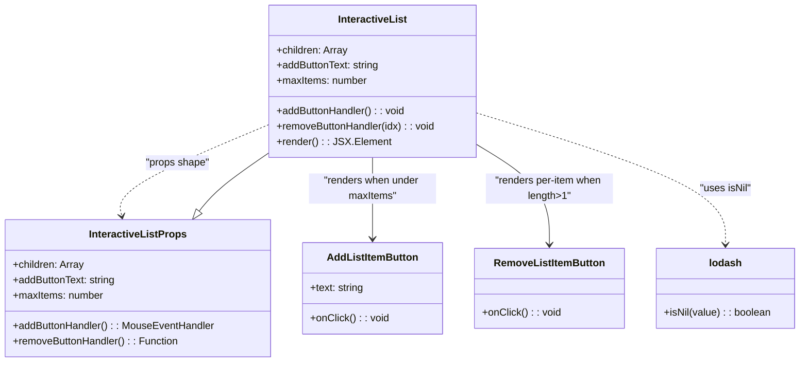

# Diagram: web/portal/src/pages/administration/notification-management/components/molecules/InteractiveList.molecule.tsx

> Auto-generated by Obscura crawlers

## Mermaid

### SVG

<svg id="container" width="1245.6953125" xmlns="http://www.w3.org/2000/svg" class="classDiagram" height="570" viewBox="0 0 1245.6953125 570" role="graphics-document document" aria-roledescription="class"><g><defs><marker id="container_class-aggregationStart" class="marker aggregation class" refX="18" refY="7" markerWidth="190" markerHeight="240" orient="auto"><path d="M 18,7 L9,13 L1,7 L9,1 Z"></path></marker></defs><defs><marker id="container_class-aggregationEnd" class="marker aggregation class" refX="1" refY="7" markerWidth="20" markerHeight="28" orient="auto"><path d="M 18,7 L9,13 L1,7 L9,1 Z"></path></marker></defs><defs><marker id="container_class-extensionStart" class="marker extension class" refX="18" refY="7" markerWidth="190" markerHeight="240" orient="auto"><path d="M 1,7 L18,13 V 1 Z"></path></marker></defs><defs><marker id="container_class-extensionEnd" class="marker extension class" refX="1" refY="7" markerWidth="20" markerHeight="28" orient="auto"><path d="M 1,1 V 13 L18,7 Z"></path></marker></defs><defs><marker id="container_class-compositionStart" class="marker composition class" refX="18" refY="7" markerWidth="190" markerHeight="240" orient="auto"><path d="M 18,7 L9,13 L1,7 L9,1 Z"></path></marker></defs><defs><marker id="container_class-compositionEnd" class="marker composition class" refX="1" refY="7" markerWidth="20" markerHeight="28" orient="auto"><path d="M 18,7 L9,13 L1,7 L9,1 Z"></path></marker></defs><defs><marker id="container_class-dependencyStart" class="marker dependency class" refX="6" refY="7" markerWidth="190" markerHeight="240" orient="auto"><path d="M 5,7 L9,13 L1,7 L9,1 Z"></path></marker></defs><defs><marker id="container_class-dependencyEnd" class="marker dependency class" refX="13" refY="7" markerWidth="20" markerHeight="28" orient="auto"><path d="M 18,7 L9,13 L14,7 L9,1 Z"></path></marker></defs><defs><marker id="container_class-lollipopStart" class="marker lollipop class" refX="13" refY="7" markerWidth="190" markerHeight="240" orient="auto"><circle stroke="black" fill="transparent" cx="7" cy="7" r="6"></circle></marker></defs><defs><marker id="container_class-lollipopEnd" class="marker lollipop class" refX="1" refY="7" markerWidth="190" markerHeight="240" orient="auto"><circle stroke="black" fill="transparent" cx="7" cy="7" r="6"></circle></marker></defs><g class="root"><g class="clusters"></g><g class="edgePaths"><path d="M417.23,197.357L377.787,213.964C338.344,230.571,259.457,263.786,221.642,287.584C183.826,311.383,187.082,325.765,188.71,332.957L190.337,340.148" id="id_InteractiveList_InteractiveListProps_1" class="edge-thickness-normal edge-pattern-dashed relation" style=";;;" data-edge="true" data-et="edge" data-id="id_InteractiveList_InteractiveListProps_1" data-points="W3sieCI6NDE3LjIzMDQ2ODc1LCJ5IjoxOTcuMzU2NTI3NjYyODg3NDZ9LHsieCI6MTgwLjU3MDMxMjUsInkiOjI5N30seyJ4IjoxOTEuNjYyMTIxODE1Mjg2NjQsInkiOjM0Nn1d" marker-end="url(#container_class-dependencyEnd)"></path><path d="M581.957,248L581.957,256.167C581.957,264.333,581.957,280.667,581.957,302C581.957,323.333,581.957,349.667,581.957,362.833L581.957,376" id="id_InteractiveList_AddListItemButton_2" class="edge-thickness-normal edge-pattern-solid relation" style=";;;" data-edge="true" data-et="edge" data-id="id_InteractiveList_AddListItemButton_2" data-points="W3sieCI6NTgxLjk1NzAzMTI1LCJ5IjoyNDh9LHsieCI6NTgxLjk1NzAzMTI1LCJ5IjoyOTd9LHsieCI6NTgxLjk1NzAzMTI1LCJ5IjozODJ9XQ==" marker-end="url(#container_class-dependencyEnd)"></path><path d="M746.684,230.031L764.704,241.192C782.724,252.354,818.764,274.677,836.785,300.505C854.805,326.333,854.805,355.667,854.805,370.333L854.805,385" id="id_InteractiveList_RemoveListItemButton_3" class="edge-thickness-normal edge-pattern-solid relation" style=";;;" data-edge="true" data-et="edge" data-id="id_InteractiveList_RemoveListItemButton_3" data-points="W3sieCI6NzQ2LjY4MzU5Mzc1LCJ5IjoyMzAuMDMwNTIyOTg1Mjk2ODR9LHsieCI6ODU0LjgwNDY4NzUsInkiOjI5N30seyJ4Ijo4NTQuODA0Njg3NSwieSI6MzkxfV0=" marker-end="url(#container_class-dependencyEnd)"></path><path d="M746.684,178.908L810.37,198.59C874.057,218.272,1001.431,257.636,1065.118,291.985C1128.805,326.333,1128.805,355.667,1128.805,370.333L1128.805,385" id="id_InteractiveList_lodash_4" class="edge-thickness-normal edge-pattern-dashed relation" style=";;;" data-edge="true" data-et="edge" data-id="id_InteractiveList_lodash_4" data-points="W3sieCI6NzQ2LjY4MzU5Mzc1LCJ5IjoxNzguOTA3NzU5NjczNjk3OTd9LHsieCI6MTEyOC44MDQ2ODc1LCJ5IjoyOTd9LHsieCI6MTEyOC44MDQ2ODc1LCJ5IjozOTF9XQ==" marker-end="url(#container_class-dependencyEnd)"></path><path d="M311.303,332.418L315.924,326.515C320.546,320.612,329.79,308.806,347.444,293.836C365.099,278.866,391.165,260.733,404.198,251.666L417.23,242.599" id="id_InteractiveListProps_InteractiveList_5" class="edge-thickness-normal edge-pattern-solid relation" style=";;;" data-edge="true" data-et="edge" data-id="id_InteractiveListProps_InteractiveList_5" data-points="W3sieCI6MzAwLjY2ODQ0MTQ4MDg5MTcsInkiOjM0Nn0seyJ4IjozMzkuMDMzMjAzMTI1LCJ5IjoyOTd9LHsieCI6NDE3LjIzMDQ2ODc1LCJ5IjoyNDIuNTk4ODQwNjIxNjU4MzN9XQ==" marker-start="url(#container_class-extensionStart)"></path></g><g class="edgeLabels"><g class="edgeLabel" transform="translate(275.74894, 256.92596)"><g class="label" data-id="id_InteractiveList_InteractiveListProps_1" transform="translate(-51.078125, -12)"><foreignObject width="102.15625" height="24">

"props shape"

</foreignObject></g></g><g class="edgeLabel" transform="translate(581.95703125, 297)"><g class="label" data-id="id_InteractiveList_AddListItemButton_2" transform="translate(-100, -24)"><foreignObject width="200" height="48">

"renders when under maxItems"

</foreignObject></g></g><g class="edgeLabel" transform="translate(854.8046875, 297)"><g class="label" data-id="id_InteractiveList_RemoveListItemButton_3" transform="translate(-100, -24)"><foreignObject width="200" height="48">

"renders per-item when length&gt;1"

</foreignObject></g></g><g class="edgeLabel" transform="translate(1128.8046875, 297)"><g class="label" data-id="id_InteractiveList_lodash_4" transform="translate(-40.9296875, -12)"><foreignObject width="81.859375" height="24">

"uses isNil"

</foreignObject></g></g><g class="edgeLabel"><g class="label" data-id="id_InteractiveListProps_InteractiveList_5" transform="translate(0, 0)"><foreignObject width="0" height="0">

</foreignObject></g></g></g><g class="nodes"><g class="node default" id="classId-InteractiveList-0" transform="translate(581.95703125, 128)"><g class="basic label-container"><path d="M-164.7265625 -120 L164.7265625 -120 L164.7265625 120 L-164.7265625 120" stroke="none" stroke-width="0" fill="#ECECFF" style=""></path><path d="M-164.7265625 -120 C-95.70484736299701 -120, -26.68313222599403 -120, 164.7265625 -120 M-164.7265625 -120 C-54.190477536613 -120, 56.345607426773995 -120, 164.7265625 -120 M164.7265625 -120 C164.7265625 -69.42614546937726, 164.7265625 -18.85229093875452, 164.7265625 120 M164.7265625 -120 C164.7265625 -58.911469756621045, 164.7265625 2.1770604867579095, 164.7265625 120 M164.7265625 120 C82.20606739272283 120, -0.31442771455434126 120, -164.7265625 120 M164.7265625 120 C67.03998815582096 120, -30.64658618835807 120, -164.7265625 120 M-164.7265625 120 C-164.7265625 36.76989940617389, -164.7265625 -46.46020118765222, -164.7265625 -120 M-164.7265625 120 C-164.7265625 71.22683986821777, -164.7265625 22.453679736435532, -164.7265625 -120" stroke="#9370DB" stroke-width="1.3" fill="none" stroke-dasharray="0 0" style=""></path></g><g class="annotation-group text" transform="translate(0, -96)"></g><g class="label-group text" transform="translate(-52.578125, -96)"><g class="label" style="font-weight: bolder" transform="translate(0,-12)"><foreignObject width="105.15625" height="24">

InteractiveList

</foreignObject></g></g><g class="members-group text" transform="translate(-152.7265625, -48)"><g class="label" style="" transform="translate(0,-12)"><foreignObject width="112.875" height="24">

+children: Array

</foreignObject></g><g class="label" style="" transform="translate(0,12)"><foreignObject width="163.9375" height="24">

+addButtonText: string

</foreignObject></g><g class="label" style="" transform="translate(0,36)"><foreignObject width="143.203125" height="24">

+maxItems: number

</foreignObject></g></g><g class="methods-group text" transform="translate(-152.7265625, 48)"><g class="label" style="" transform="translate(0,-12)"><foreignObject width="204.703125" height="24">

+addButtonHandler() : : void

</foreignObject></g><g class="label" style="" transform="translate(0,12)"><foreignObject width="252.875" height="24">

+removeButtonHandler(idx) : : void

</foreignObject></g><g class="label" style="" transform="translate(0,36)"><foreignObject width="172.34375" height="24">

+render() : : JSX.Element

</foreignObject></g></g><g class="divider" style=""><path d="M-164.7265625 -72 C-84.4737255327159 -72, -4.220888565431807 -72, 164.7265625 -72 M-164.7265625 -72 C-62.34831011529997 -72, 40.02994226940007 -72, 164.7265625 -72" stroke="#9370DB" stroke-width="1.3" fill="none" stroke-dasharray="0 0" style=""></path></g><g class="divider" style=""><path d="M-164.7265625 24 C-52.339563672108866 24, 60.04743515578227 24, 164.7265625 24 M-164.7265625 24 C-43.58194883523474 24, 77.56266482953052 24, 164.7265625 24" stroke="#9370DB" stroke-width="1.3" fill="none" stroke-dasharray="0 0" style=""></path></g></g><g class="node default" id="classId-InteractiveListProps-1" transform="translate(216.109375, 454)"><g class="basic label-container"><path d="M-208.109375 -108 L208.109375 -108 L208.109375 108 L-208.109375 108" stroke="none" stroke-width="0" fill="#ECECFF" style=""></path><path d="M-208.109375 -108 C-98.23926567727139 -108, 11.630843645457219 -108, 208.109375 -108 M-208.109375 -108 C-111.57713122749891 -108, -15.04488745499782 -108, 208.109375 -108 M208.109375 -108 C208.109375 -55.7954059991159, 208.109375 -3.5908119982318, 208.109375 108 M208.109375 -108 C208.109375 -28.070443164275133, 208.109375 51.859113671449734, 208.109375 108 M208.109375 108 C55.277061499805114 108, -97.55525200038977 108, -208.109375 108 M208.109375 108 C108.9548922807846 108, 9.80040956156921 108, -208.109375 108 M-208.109375 108 C-208.109375 39.481189762561584, -208.109375 -29.03762047487683, -208.109375 -108 M-208.109375 108 C-208.109375 57.98229093791653, -208.109375 7.964581875833062, -208.109375 -108" stroke="#9370DB" stroke-width="1.3" fill="none" stroke-dasharray="0 0" style=""></path></g><g class="annotation-group text" transform="translate(0, -84)"></g><g class="label-group text" transform="translate(-73.5, -84)"><g class="label" style="font-weight: bolder" transform="translate(0,-12)"><foreignObject width="147" height="24">

InteractiveListProps

</foreignObject></g></g><g class="members-group text" transform="translate(-196.109375, -36)"><g class="label" style="" transform="translate(0,-12)"><foreignObject width="112.875" height="24">

+children: Array

</foreignObject></g><g class="label" style="" transform="translate(0,12)"><foreignObject width="163.9375" height="24">

+addButtonText: string

</foreignObject></g><g class="label" style="" transform="translate(0,36)"><foreignObject width="143.203125" height="24">

+maxItems: number

</foreignObject></g></g><g class="methods-group text" transform="translate(-196.109375, 60)"><g class="label" style="" transform="translate(0,-12)"><foreignObject width="318.71875" height="24">

+addButtonHandler() : : MouseEventHandler

</foreignObject></g><g class="label" style="" transform="translate(0,12)"><foreignObject width="262.40625" height="24">

+removeButtonHandler() : : Function

</foreignObject></g></g><g class="divider" style=""><path d="M-208.109375 -60 C-55.517709527811206 -60, 97.07395594437759 -60, 208.109375 -60 M-208.109375 -60 C-106.71133089816269 -60, -5.313286796325372 -60, 208.109375 -60" stroke="#9370DB" stroke-width="1.3" fill="none" stroke-dasharray="0 0" style=""></path></g><g class="divider" style=""><path d="M-208.109375 36 C-52.452457819270705 36, 103.20445936145859 36, 208.109375 36 M-208.109375 36 C-120.14042299350926 36, -32.17147098701852 36, 208.109375 36" stroke="#9370DB" stroke-width="1.3" fill="none" stroke-dasharray="0 0" style=""></path></g></g><g class="node default" id="classId-AddListItemButton-2" transform="translate(581.95703125, 454)"><g class="basic label-container"><path d="M-107.73828125 -72 L107.73828125 -72 L107.73828125 72 L-107.73828125 72" stroke="none" stroke-width="0" fill="#ECECFF" style=""></path><path d="M-107.73828125 -72 C-29.77913848242916 -72, 48.18000428514168 -72, 107.73828125 -72 M-107.73828125 -72 C-57.83757822131062 -72, -7.936875192621244 -72, 107.73828125 -72 M107.73828125 -72 C107.73828125 -32.03336106677259, 107.73828125 7.933277866454816, 107.73828125 72 M107.73828125 -72 C107.73828125 -28.097954149149217, 107.73828125 15.804091701701566, 107.73828125 72 M107.73828125 72 C53.8919741861516 72, 0.04566712230320036 72, -107.73828125 72 M107.73828125 72 C52.98632174060286 72, -1.765637768794278 72, -107.73828125 72 M-107.73828125 72 C-107.73828125 22.91821239988191, -107.73828125 -26.16357520023618, -107.73828125 -72 M-107.73828125 72 C-107.73828125 23.203169650866386, -107.73828125 -25.59366069826723, -107.73828125 -72" stroke="#9370DB" stroke-width="1.3" fill="none" stroke-dasharray="0 0" style=""></path></g><g class="annotation-group text" transform="translate(0, -48)"></g><g class="label-group text" transform="translate(-68.9296875, -48)"><g class="label" style="font-weight: bolder" transform="translate(0,-12)"><foreignObject width="137.859375" height="24">

AddListItemButton

</foreignObject></g></g><g class="members-group text" transform="translate(-95.73828125, 0)"><g class="label" style="" transform="translate(0,-12)"><foreignObject width="85.34375" height="24">

+text: string

</foreignObject></g></g><g class="methods-group text" transform="translate(-95.73828125, 48)"><g class="label" style="" transform="translate(0,-12)"><foreignObject width="122.546875" height="24">

+onClick() : : void

</foreignObject></g></g><g class="divider" style=""><path d="M-107.73828125 -24 C-26.910437251015452 -24, 53.917406747969096 -24, 107.73828125 -24 M-107.73828125 -24 C-41.64357966557708 -24, 24.451121918845843 -24, 107.73828125 -24" stroke="#9370DB" stroke-width="1.3" fill="none" stroke-dasharray="0 0" style=""></path></g><g class="divider" style=""><path d="M-107.73828125 24 C-41.716359624502715 24, 24.30556200099457 24, 107.73828125 24 M-107.73828125 24 C-62.52957467030186 24, -17.320868090603724 24, 107.73828125 24" stroke="#9370DB" stroke-width="1.3" fill="none" stroke-dasharray="0 0" style=""></path></g></g><g class="node default" id="classId-RemoveListItemButton-3" transform="translate(854.8046875, 454)"><g class="basic label-container"><path d="M-115.109375 -63 L115.109375 -63 L115.109375 63 L-115.109375 63" stroke="none" stroke-width="0" fill="#ECECFF" style=""></path><path d="M-115.109375 -63 C-58.4583412077314 -63, -1.8073074154628017 -63, 115.109375 -63 M-115.109375 -63 C-37.13914143923394 -63, 40.83109212153212 -63, 115.109375 -63 M115.109375 -63 C115.109375 -13.553788659424008, 115.109375 35.892422681151984, 115.109375 63 M115.109375 -63 C115.109375 -22.297605851709328, 115.109375 18.404788296581344, 115.109375 63 M115.109375 63 C39.037218414049235 63, -37.03493817190153 63, -115.109375 63 M115.109375 63 C60.587561768644534 63, 6.065748537289068 63, -115.109375 63 M-115.109375 63 C-115.109375 36.78564772945721, -115.109375 10.571295458914413, -115.109375 -63 M-115.109375 63 C-115.109375 15.7072885491068, -115.109375 -31.5854229017864, -115.109375 -63" stroke="#9370DB" stroke-width="1.3" fill="none" stroke-dasharray="0 0" style=""></path></g><g class="annotation-group text" transform="translate(0, -39)"></g><g class="label-group text" transform="translate(-83.671875, -39)"><g class="label" style="font-weight: bolder" transform="translate(0,-12)"><foreignObject width="167.34375" height="24">

RemoveListItemButton

</foreignObject></g></g><g class="members-group text" transform="translate(-103.109375, 9)"></g><g class="methods-group text" transform="translate(-103.109375, 39)"><g class="label" style="" transform="translate(0,-12)"><foreignObject width="122.546875" height="24">

+onClick() : : void

</foreignObject></g></g><g class="divider" style=""><path d="M-115.109375 -15 C-29.034045784761844 -15, 57.04128343047631 -15, 115.109375 -15 M-115.109375 -15 C-45.3262532935357 -15, 24.4568684129286 -15, 115.109375 -15" stroke="#9370DB" stroke-width="1.3" fill="none" stroke-dasharray="0 0" style=""></path></g><g class="divider" style=""><path d="M-115.109375 9 C-35.98267093561991 9, 43.144033128760185 9, 115.109375 9 M-115.109375 9 C-66.65294542487919 9, -18.196515849758384 9, 115.109375 9" stroke="#9370DB" stroke-width="1.3" fill="none" stroke-dasharray="0 0" style=""></path></g></g><g class="node default" id="classId-lodash-4" transform="translate(1128.8046875, 454)"><g class="basic label-container"><path d="M-108.890625 -63 L108.890625 -63 L108.890625 63 L-108.890625 63" stroke="none" stroke-width="0" fill="#ECECFF" style=""></path><path d="M-108.890625 -63 C-22.3771483155583 -63, 64.1363283688834 -63, 108.890625 -63 M-108.890625 -63 C-35.03686306985102 -63, 38.816898860297954 -63, 108.890625 -63 M108.890625 -63 C108.890625 -37.674767267988216, 108.890625 -12.349534535976431, 108.890625 63 M108.890625 -63 C108.890625 -32.42451185040588, 108.890625 -1.8490237008117631, 108.890625 63 M108.890625 63 C32.58205383927509 63, -43.72651732144982 63, -108.890625 63 M108.890625 63 C42.10395891003431 63, -24.682707179931384 63, -108.890625 63 M-108.890625 63 C-108.890625 22.33892158545835, -108.890625 -18.322156829083298, -108.890625 -63 M-108.890625 63 C-108.890625 24.776468598896145, -108.890625 -13.44706280220771, -108.890625 -63" stroke="#9370DB" stroke-width="1.3" fill="none" stroke-dasharray="0 0" style=""></path></g><g class="annotation-group text" transform="translate(0, -39)"></g><g class="label-group text" transform="translate(-24.59375, -39)"><g class="label" style="font-weight: bolder" transform="translate(0,-12)"><foreignObject width="49.1875" height="24">

lodash

</foreignObject></g></g><g class="members-group text" transform="translate(-96.890625, 9)"></g><g class="methods-group text" transform="translate(-96.890625, 39)"><g class="label" style="" transform="translate(0,-12)"><foreignObject width="169.1875" height="24">

+isNil(value) : : boolean

</foreignObject></g></g><g class="divider" style=""><path d="M-108.890625 -15 C-36.565192481020276 -15, 35.76024003795945 -15, 108.890625 -15 M-108.890625 -15 C-21.99122473466015 -15, 64.9081755306797 -15, 108.890625 -15" stroke="#9370DB" stroke-width="1.3" fill="none" stroke-dasharray="0 0" style=""></path></g><g class="divider" style=""><path d="M-108.890625 9 C-59.56185082274603 9, -10.233076645492062 9, 108.890625 9 M-108.890625 9 C-61.38857360780585 9, -13.886522215611706 9, 108.890625 9" stroke="#9370DB" stroke-width="1.3" fill="none" stroke-dasharray="0 0" style=""></path></g></g></g></g></g></svg>
