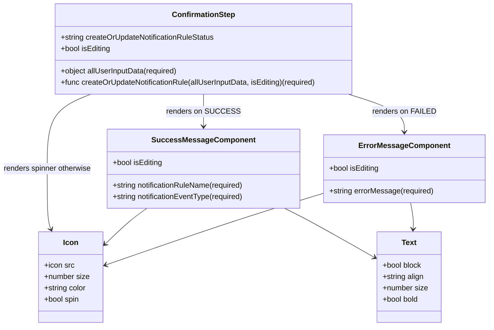

# Diagram: web/portal/src/pages/administration/notification-management/components/organisms/wizard-steps/ConfirmationStep.organism.js


> Auto-generated by Obscura crawlers

## Diagram 1

```mermaid
flowchart TD
  Start([Start])
  Start --> UseEffect[/"useEffect: createOrUpdateNotificationRule(allUserInputData, isEditing)"/]
  UseEffect --> CheckStatus{createOrUpdateNotificationRuleStatus}
  CheckStatus -->|SUCCESS| SuccessComp[SuccessMessageComponent]
  CheckStatus -->|FAILED| ErrorComp[ErrorMessageComponent]
  CheckStatus -->|OTHER| Spinner[Icon (faSpinner) - loading]
  SuccessComp --> SuccessIcon[Icon (faCheckCircle)]
  SuccessComp --> SuccessText[Text (message with Trans)]
  ErrorComp --> ErrorIcon[Icon (faTimesCircle)]
  ErrorComp --> ErrorText[Text (errorMessage)]
  Spinner --> SpinnerIcon[Icon spinning]
  SuccessIcon --> End([End])
  SuccessText --> End
  ErrorIcon --> End
  ErrorText --> End
  SpinnerIcon --> End
```

> SVG rendering failed for this diagram.

## Diagram 2



### SVG

<svg id="container" width="1040.1328125" xmlns="http://www.w3.org/2000/svg" class="classDiagram" height="692" viewBox="0 0 1040.1328125 692" role="graphics-document document" aria-roledescription="class"><style>#container{font-family:"trebuchet ms",verdana,arial,sans-serif;font-size:16px;fill:#333;}@keyframes edge-animation-frame{from{stroke-dashoffset:0;}}@keyframes dash{to{stroke-dashoffset:0;}}#container .edge-animation-slow{stroke-dasharray:9,5!important;stroke-dashoffset:900;animation:dash 50s linear infinite;stroke-linecap:round;}#container .edge-animation-fast{stroke-dasharray:9,5!important;stroke-dashoffset:900;animation:dash 20s linear infinite;stroke-linecap:round;}#container .error-icon{fill:#552222;}#container .error-text{fill:#552222;stroke:#552222;}#container .edge-thickness-normal{stroke-width:1px;}#container .edge-thickness-thick{stroke-width:3.5px;}#container .edge-pattern-solid{stroke-dasharray:0;}#container .edge-thickness-invisible{stroke-width:0;fill:none;}#container .edge-pattern-dashed{stroke-dasharray:3;}#container .edge-pattern-dotted{stroke-dasharray:2;}#container .marker{fill:#333333;stroke:#333333;}#container .marker.cross{stroke:#333333;}#container svg{font-family:"trebuchet ms",verdana,arial,sans-serif;font-size:16px;}#container p{margin:0;}#container g.classGroup text{fill:#9370DB;stroke:none;font-family:"trebuchet ms",verdana,arial,sans-serif;font-size:10px;}#container g.classGroup text .title{font-weight:bolder;}#container .nodeLabel,#container .edgeLabel{color:#131300;}#container .edgeLabel .label rect{fill:#ECECFF;}#container .label text{fill:#131300;}#container .labelBkg{background:#ECECFF;}#container .edgeLabel .label span{background:#ECECFF;}#container .classTitle{font-weight:bolder;}#container .node rect,#container .node circle,#container .node ellipse,#container .node polygon,#container .node path{fill:#ECECFF;stroke:#9370DB;stroke-width:1px;}#container .divider{stroke:#9370DB;stroke-width:1;}#container g.clickable{cursor:pointer;}#container g.classGroup rect{fill:#ECECFF;stroke:#9370DB;}#container g.classGroup line{stroke:#9370DB;stroke-width:1;}#container .classLabel .box{stroke:none;stroke-width:0;fill:#ECECFF;opacity:0.5;}#container .classLabel .label{fill:#9370DB;font-size:10px;}#container .relation{stroke:#333333;stroke-width:1;fill:none;}#container .dashed-line{stroke-dasharray:3;}#container .dotted-line{stroke-dasharray:1 2;}#container #compositionStart,#container .composition{fill:#333333!important;stroke:#333333!important;stroke-width:1;}#container #compositionEnd,#container .composition{fill:#333333!important;stroke:#333333!important;stroke-width:1;}#container #dependencyStart,#container .dependency{fill:#333333!important;stroke:#333333!important;stroke-width:1;}#container #dependencyStart,#container .dependency{fill:#333333!important;stroke:#333333!important;stroke-width:1;}#container #extensionStart,#container .extension{fill:transparent!important;stroke:#333333!important;stroke-width:1;}#container #extensionEnd,#container .extension{fill:transparent!important;stroke:#333333!important;stroke-width:1;}#container #aggregationStart,#container .aggregation{fill:transparent!important;stroke:#333333!important;stroke-width:1;}#container #aggregationEnd,#container .aggregation{fill:transparent!important;stroke:#333333!important;stroke-width:1;}#container #lollipopStart,#container .lollipop{fill:#ECECFF!important;stroke:#333333!important;stroke-width:1;}#container #lollipopEnd,#container .lollipop{fill:#ECECFF!important;stroke:#333333!important;stroke-width:1;}#container .edgeTerminals{font-size:11px;line-height:initial;}#container .classTitleText{text-anchor:middle;font-size:18px;fill:#333;}#container .label-icon{display:inline-block;height:1em;overflow:visible;vertical-align:-0.125em;}#container .node .label-icon path{fill:currentColor;stroke:revert;stroke-width:revert;}#container :root{--mermaid-font-family:"trebuchet ms",verdana,arial,sans-serif;}</style><g><defs><marker id="container_class-aggregationStart" class="marker aggregation class" refX="18" refY="7" markerWidth="190" markerHeight="240" orient="auto"><path d="M 18,7 L9,13 L1,7 L9,1 Z"></path></marker></defs><defs><marker id="container_class-aggregationEnd" class="marker aggregation class" refX="1" refY="7" markerWidth="20" markerHeight="28" orient="auto"><path d="M 18,7 L9,13 L1,7 L9,1 Z"></path></marker></defs><defs><marker id="container_class-extensionStart" class="marker extension class" refX="18" refY="7" markerWidth="190" markerHeight="240" orient="auto"><path d="M 1,7 L18,13 V 1 Z"></path></marker></defs><defs><marker id="container_class-extensionEnd" class="marker extension class" refX="1" refY="7" markerWidth="20" markerHeight="28" orient="auto"><path d="M 1,1 V 13 L18,7 Z"></path></marker></defs><defs><marker id="container_class-compositionStart" class="marker composition class" refX="18" refY="7" markerWidth="190" markerHeight="240" orient="auto"><path d="M 18,7 L9,13 L1,7 L9,1 Z"></path></marker></defs><defs><marker id="container_class-compositionEnd" class="marker composition class" refX="1" refY="7" markerWidth="20" markerHeight="28" orient="auto"><path d="M 18,7 L9,13 L1,7 L9,1 Z"></path></marker></defs><defs><marker id="container_class-dependencyStart" class="marker dependency class" refX="6" refY="7" markerWidth="190" markerHeight="240" orient="auto"><path d="M 5,7 L9,13 L1,7 L9,1 Z"></path></marker></defs><defs><marker id="container_class-dependencyEnd" class="marker dependency class" refX="13" refY="7" markerWidth="20" markerHeight="28" orient="auto"><path d="M 18,7 L9,13 L14,7 L9,1 Z"></path></marker></defs><defs><marker id="container_class-lollipopStart" class="marker lollipop class" refX="13" refY="7" markerWidth="190" markerHeight="240" orient="auto"><circle stroke="black" fill="transparent" cx="7" cy="7" r="6"></circle></marker></defs><defs><marker id="container_class-lollipopEnd" class="marker lollipop class" refX="1" refY="7" markerWidth="190" markerHeight="240" orient="auto"><circle stroke="black" fill="transparent" cx="7" cy="7" r="6"></circle></marker></defs><g class="root"><g class="clusters"></g><g class="edgePaths"><path d="M438.539,200L438.539,206.167C438.539,212.333,438.539,224.667,438.539,236C438.539,247.333,438.539,257.667,438.539,262.833L438.539,268" id="id_ConfirmationStep_SuccessMessageComponent_1" class="edge-thickness-normal edge-pattern-solid relation" style=";;;" data-edge="true" data-et="edge" data-id="id_ConfirmationStep_SuccessMessageComponent_1" data-points="W3sieCI6NDM4LjUzOTA2MjUsInkiOjIwMH0seyJ4Ijo0MzguNTM5MDYyNSwieSI6MjM3fSx7IngiOjQzOC41MzkwNjI1LCJ5IjoyNzR9XQ==" marker-end="url(#container_class-dependencyEnd)"></path><path d="M744.745,200L764.414,206.167C784.084,212.333,823.423,224.667,843.092,238C862.762,251.333,862.762,265.667,862.762,272.833L862.762,280" id="id_ConfirmationStep_ErrorMessageComponent_2" class="edge-thickness-normal edge-pattern-solid relation" style=";;;" data-edge="true" data-et="edge" data-id="id_ConfirmationStep_ErrorMessageComponent_2" data-points="W3sieCI6NzQ0Ljc0NDg4OTU2NzY2OTEsInkiOjIwMH0seyJ4Ijo4NjIuNzYxNzE4NzUsInkiOjIzN30seyJ4Ijo4NjIuNzYxNzE4NzUsInkiOjI4Nn1d" marker-end="url(#container_class-dependencyEnd)"></path><path d="M196.594,200L181.052,206.167C165.51,212.333,134.427,224.667,118.885,251C103.344,277.333,103.344,317.667,103.344,356C103.344,394.333,103.344,430.667,104.684,452.076C106.023,473.485,108.703,479.97,110.043,483.212L111.383,486.455" id="id_ConfirmationStep_Icon_3" class="edge-thickness-normal edge-pattern-solid relation" style=";;;" data-edge="true" data-et="edge" data-id="id_ConfirmationStep_Icon_3" data-points="W3sieCI6MTk2LjU5MzU3Mzc3ODE5NTUsInkiOjIwMH0seyJ4IjoxMDMuMzQzNzUsInkiOjIzN30seyJ4IjoxMDMuMzQzNzUsInkiOjM1OH0seyJ4IjoxMDMuMzQzNzUsInkiOjQ2N30seyJ4IjoxMTMuNjc0MzI4NTEyMzk2NywieSI6NDkyfV0=" marker-end="url(#container_class-dependencyEnd)"></path><path d="M317.088,442L311.063,446.167C305.039,450.333,292.99,458.667,277.751,471.571C262.512,484.476,244.083,501.952,234.869,510.69L225.654,519.428" id="id_SuccessMessageComponent_Icon_4" class="edge-thickness-normal edge-pattern-solid relation" style=";;;" data-edge="true" data-et="edge" data-id="id_SuccessMessageComponent_Icon_4" data-points="W3sieCI6MzE3LjA4NzY1NzY4MzQ4NjIsInkiOjQ0Mn0seyJ4IjoyODAuOTQxNDA2MjUsInkiOjQ2N30seyJ4IjoyMjEuMzAwNzgxMjUsInkiOjUyMy41NTY4MDM5MTg1NjczfV0=" marker-end="url(#container_class-dependencyEnd)"></path><path d="M609.707,442L618.198,446.167C626.688,450.333,643.669,458.667,675.31,476.04C706.952,493.413,753.253,519.826,776.403,533.032L799.554,546.238" id="id_SuccessMessageComponent_Text_5" class="edge-thickness-normal edge-pattern-solid relation" style=";;;" data-edge="true" data-et="edge" data-id="id_SuccessMessageComponent_Text_5" data-points="W3sieCI6NjA5LjcwNzQyNTQ1ODcxNTUsInkiOjQ0Mn0seyJ4Ijo2NjAuNjUwMzkwNjI1LCJ5Ijo0Njd9LHsieCI6ODA0Ljc2NTYyNSwieSI6NTQ5LjIxMTI3Nzk4MDg2NTd9XQ==" marker-end="url(#container_class-dependencyEnd)"></path><path d="M693.391,409.323L661.668,418.936C629.945,428.549,566.499,447.774,488.762,473.308C411.025,498.842,318.998,530.683,272.985,546.604L226.971,562.525" id="id_ErrorMessageComponent_Icon_6" class="edge-thickness-normal edge-pattern-solid relation" style=";;;" data-edge="true" data-et="edge" data-id="id_ErrorMessageComponent_Icon_6" data-points="W3sieCI6NjkzLjM5MDYyNSwieSI6NDA5LjMyMzI5MTk0MDY0MjF9LHsieCI6NTAzLjA1MjczNDM3NSwieSI6NDY3fSx7IngiOjIyMS4zMDA3ODEyNSwieSI6NTY0LjQ4NjczMjgzMDMxMDl9XQ==" marker-end="url(#container_class-dependencyEnd)"></path><path d="M875.973,430L877.104,436.167C878.236,442.333,880.499,454.667,881.368,464.003C882.238,473.34,881.714,479.68,881.452,482.85L881.19,486.02" id="id_ErrorMessageComponent_Text_7" class="edge-thickness-normal edge-pattern-solid relation" style=";;;" data-edge="true" data-et="edge" data-id="id_ErrorMessageComponent_Text_7" data-points="W3sieCI6ODc1Ljk3MjcyNzkyNDMxMTksInkiOjQzMH0seyJ4Ijo4ODIuNzYxNzE4NzUsInkiOjQ2N30seyJ4Ijo4ODAuNjk1NjAzMDQ3NTIwNiwieSI6NDkyfV0=" marker-end="url(#container_class-dependencyEnd)"></path></g><g class="edgeLabels"><g class="edgeLabel" transform="translate(438.5390625, 237)"><g class="label" data-id="id_ConfirmationStep_SuccessMessageComponent_1" transform="translate(-72.625, -12)"><foreignObject width="145.25" height="24"><div xmlns="http://www.w3.org/1999/xhtml" class="labelBkg" style="display: table-cell; white-space: nowrap; line-height: 1.5; max-width: 200px; text-align: center;"><span class="edgeLabel"><p>renders on SUCCESS</p></span></div></foreignObject></g></g><g class="edgeLabel" transform="translate(862.76171875, 237)"><g class="label" data-id="id_ConfirmationStep_ErrorMessageComponent_2" transform="translate(-65.234375, -12)"><foreignObject width="130.46875" height="24"><div xmlns="http://www.w3.org/1999/xhtml" class="labelBkg" style="display: table-cell; white-space: nowrap; line-height: 1.5; max-width: 200px; text-align: center;"><span class="edgeLabel"><p>renders on FAILED</p></span></div></foreignObject></g></g><g class="edgeLabel" transform="translate(103.34375, 358)"><g class="label" data-id="id_ConfirmationStep_Icon_3" transform="translate(-95.34375, -12)"><foreignObject width="190.6875" height="24"><div xmlns="http://www.w3.org/1999/xhtml" class="labelBkg" style="display: table-cell; white-space: nowrap; line-height: 1.5; max-width: 200px; text-align: center;"><span class="edgeLabel"><p>renders spinner otherwise</p></span></div></foreignObject></g></g><g class="edgeLabel"><g class="label" data-id="id_SuccessMessageComponent_Icon_4" transform="translate(0, 0)"><foreignObject width="0" height="0"><div xmlns="http://www.w3.org/1999/xhtml" class="labelBkg" style="display: table-cell; white-space: nowrap; line-height: 1.5; max-width: 200px; text-align: center;"><span class="edgeLabel"></span></div></foreignObject></g></g><g class="edgeLabel"><g class="label" data-id="id_SuccessMessageComponent_Text_5" transform="translate(0, 0)"><foreignObject width="0" height="0"><div xmlns="http://www.w3.org/1999/xhtml" class="labelBkg" style="display: table-cell; white-space: nowrap; line-height: 1.5; max-width: 200px; text-align: center;"><span class="edgeLabel"></span></div></foreignObject></g></g><g class="edgeLabel"><g class="label" data-id="id_ErrorMessageComponent_Icon_6" transform="translate(0, 0)"><foreignObject width="0" height="0"><div xmlns="http://www.w3.org/1999/xhtml" class="labelBkg" style="display: table-cell; white-space: nowrap; line-height: 1.5; max-width: 200px; text-align: center;"><span class="edgeLabel"></span></div></foreignObject></g></g><g class="edgeLabel"><g class="label" data-id="id_ErrorMessageComponent_Text_7" transform="translate(0, 0)"><foreignObject width="0" height="0"><div xmlns="http://www.w3.org/1999/xhtml" class="labelBkg" style="display: table-cell; white-space: nowrap; line-height: 1.5; max-width: 200px; text-align: center;"><span class="edgeLabel"></span></div></foreignObject></g></g></g><g class="nodes"><g class="node default" id="classId-ConfirmationStep-0" transform="translate(438.5390625, 104)"><g class="basic label-container"><path d="M-319.765625 -96 L319.765625 -96 L319.765625 96 L-319.765625 96" stroke="none" stroke-width="0" fill="#ECECFF" style=""></path><path d="M-319.765625 -96 C-161.68539968397914 -96, -3.605174367958284 -96, 319.765625 -96 M-319.765625 -96 C-185.79790791531988 -96, -51.830190830639765 -96, 319.765625 -96 M319.765625 -96 C319.765625 -52.06122417819354, 319.765625 -8.122448356387082, 319.765625 96 M319.765625 -96 C319.765625 -21.356849247081996, 319.765625 53.28630150583601, 319.765625 96 M319.765625 96 C125.88471842769093 96, -67.99618814461815 96, -319.765625 96 M319.765625 96 C124.80712093995604 96, -70.15138312008793 96, -319.765625 96 M-319.765625 96 C-319.765625 24.430541261707177, -319.765625 -47.13891747658565, -319.765625 -96 M-319.765625 96 C-319.765625 21.90612910688685, -319.765625 -52.1877417862263, -319.765625 -96" stroke="#9370DB" stroke-width="1.3" fill="none" stroke-dasharray="0 0" style=""></path></g><g class="annotation-group text" transform="translate(0, -72)"></g><g class="label-group text" transform="translate(-64.21875, -72)"><g class="label" style="font-weight: bolder" transform="translate(0,-12)"><foreignObject width="128.4375" height="24"><div xmlns="http://www.w3.org/1999/xhtml" style="display: table-cell; white-space: nowrap; line-height: 1.5; max-width: 177px; text-align: center;"><span class="nodeLabel markdown-node-label" style=""><p>ConfirmationStep</p></span></div></foreignObject></g></g><g class="members-group text" transform="translate(-307.765625, -24)"><g class="label" style="" transform="translate(0,-12)"><foreignObject width="331.53125" height="24"><div xmlns="http://www.w3.org/1999/xhtml" style="display: table-cell; white-space: nowrap; line-height: 1.5; max-width: 389px; text-align: center;"><span class="nodeLabel markdown-node-label" style=""><p>+string createOrUpdateNotificationRuleStatus</p></span></div></foreignObject></g><g class="label" style="" transform="translate(0,12)"><foreignObject width="107.40625" height="24"><div xmlns="http://www.w3.org/1999/xhtml" style="display: table-cell; white-space: nowrap; line-height: 1.5; max-width: 165px; text-align: center;"><span class="nodeLabel markdown-node-label" style=""><p>+bool isEditing</p></span></div></foreignObject></g></g><g class="methods-group text" transform="translate(-307.765625, 48)"><g class="label" style="" transform="translate(0,-12)"><foreignObject width="252.5625" height="24"><div xmlns="http://www.w3.org/1999/xhtml" style="display: table-cell; white-space: nowrap; line-height: 1.5; max-width: 310px; text-align: center;"><span class="nodeLabel markdown-node-label" style=""><p>+object allUserInputData(required)</p></span></div></foreignObject></g><g class="label" style="" transform="translate(0,12)"><foreignObject width="551.3125" height="24"><div xmlns="http://www.w3.org/1999/xhtml" style="display: table-cell; white-space: nowrap; line-height: 1.5; max-width: 609px; text-align: center;"><span class="nodeLabel markdown-node-label" style=""><p>+func createOrUpdateNotificationRule(allUserInputData, isEditing)(required)</p></span></div></foreignObject></g></g><g class="divider" style=""><path d="M-319.765625 -48 C-133.0286755264623 -48, 53.708273947075384 -48, 319.765625 -48 M-319.765625 -48 C-155.5105166238058 -48, 8.744591752388374 -48, 319.765625 -48" stroke="#9370DB" stroke-width="1.3" fill="none" stroke-dasharray="0 0" style=""></path></g><g class="divider" style=""><path d="M-319.765625 24 C-179.74527523417407 24, -39.72492546834815 24, 319.765625 24 M-319.765625 24 C-67.9135131299985 24, 183.938598740003 24, 319.765625 24" stroke="#9370DB" stroke-width="1.3" fill="none" stroke-dasharray="0 0" style=""></path></g></g><g class="node default" id="classId-SuccessMessageComponent-1" transform="translate(438.5390625, 358)"><g class="basic label-container"><path d="M-204.8515625 -84 L204.8515625 -84 L204.8515625 84 L-204.8515625 84" stroke="none" stroke-width="0" fill="#ECECFF" style=""></path><path d="M-204.8515625 -84 C-99.82465788697078 -84, 5.2022467260584335 -84, 204.8515625 -84 M-204.8515625 -84 C-116.4799489788615 -84, -28.108335457723 -84, 204.8515625 -84 M204.8515625 -84 C204.8515625 -38.86562233993777, 204.8515625 6.2687553201244555, 204.8515625 84 M204.8515625 -84 C204.8515625 -27.67268681277627, 204.8515625 28.65462637444746, 204.8515625 84 M204.8515625 84 C51.24592271496533 84, -102.35971707006934 84, -204.8515625 84 M204.8515625 84 C58.177557209382655 84, -88.49644808123469 84, -204.8515625 84 M-204.8515625 84 C-204.8515625 38.37349606271541, -204.8515625 -7.253007874569178, -204.8515625 -84 M-204.8515625 84 C-204.8515625 46.06122100775346, -204.8515625 8.12244201550692, -204.8515625 -84" stroke="#9370DB" stroke-width="1.3" fill="none" stroke-dasharray="0 0" style=""></path></g><g class="annotation-group text" transform="translate(0, -60)"></g><g class="label-group text" transform="translate(-101.890625, -60)"><g class="label" style="font-weight: bolder" transform="translate(0,-12)"><foreignObject width="203.78125" height="24"><div xmlns="http://www.w3.org/1999/xhtml" style="display: table-cell; white-space: nowrap; line-height: 1.5; max-width: 251px; text-align: center;"><span class="nodeLabel markdown-node-label" style=""><p>SuccessMessageComponent</p></span></div></foreignObject></g></g><g class="members-group text" transform="translate(-192.8515625, -12)"><g class="label" style="" transform="translate(0,-12)"><foreignObject width="107.40625" height="24"><div xmlns="http://www.w3.org/1999/xhtml" style="display: table-cell; white-space: nowrap; line-height: 1.5; max-width: 165px; text-align: center;"><span class="nodeLabel markdown-node-label" style=""><p>+bool isEditing</p></span></div></foreignObject></g></g><g class="methods-group text" transform="translate(-192.8515625, 36)"><g class="label" style="" transform="translate(0,-12)"><foreignObject width="283.8125" height="24"><div xmlns="http://www.w3.org/1999/xhtml" style="display: table-cell; white-space: nowrap; line-height: 1.5; max-width: 341px; text-align: center;"><span class="nodeLabel markdown-node-label" style=""><p>+string notificationRuleName(required)</p></span></div></foreignObject></g><g class="label" style="" transform="translate(0,12)"><foreignObject width="283.078125" height="24"><div xmlns="http://www.w3.org/1999/xhtml" style="display: table-cell; white-space: nowrap; line-height: 1.5; max-width: 340px; text-align: center;"><span class="nodeLabel markdown-node-label" style=""><p>+string notificationEventType(required)</p></span></div></foreignObject></g></g><g class="divider" style=""><path d="M-204.8515625 -36 C-83.80418377679526 -36, 37.24319494640949 -36, 204.8515625 -36 M-204.8515625 -36 C-70.75051226239904 -36, 63.35053797520192 -36, 204.8515625 -36" stroke="#9370DB" stroke-width="1.3" fill="none" stroke-dasharray="0 0" style=""></path></g><g class="divider" style=""><path d="M-204.8515625 12 C-46.99767602615776 12, 110.85621044768448 12, 204.8515625 12 M-204.8515625 12 C-54.21620585927528 12, 96.41915078144945 12, 204.8515625 12" stroke="#9370DB" stroke-width="1.3" fill="none" stroke-dasharray="0 0" style=""></path></g></g><g class="node default" id="classId-ErrorMessageComponent-2" transform="translate(862.76171875, 358)"><g class="basic label-container"><path d="M-169.37109375 -72 L169.37109375 -72 L169.37109375 72 L-169.37109375 72" stroke="none" stroke-width="0" fill="#ECECFF" style=""></path><path d="M-169.37109375 -72 C-98.20226337768806 -72, -27.03343300537611 -72, 169.37109375 -72 M-169.37109375 -72 C-41.66236036668721 -72, 86.04637301662558 -72, 169.37109375 -72 M169.37109375 -72 C169.37109375 -17.60282427270323, 169.37109375 36.79435145459354, 169.37109375 72 M169.37109375 -72 C169.37109375 -26.71864353112955, 169.37109375 18.562712937740898, 169.37109375 72 M169.37109375 72 C73.1515463790514 72, -23.068000991897208 72, -169.37109375 72 M169.37109375 72 C69.78702869394851 72, -29.797036362102972 72, -169.37109375 72 M-169.37109375 72 C-169.37109375 36.525929133705404, -169.37109375 1.0518582674108075, -169.37109375 -72 M-169.37109375 72 C-169.37109375 26.344756170300215, -169.37109375 -19.31048765939957, -169.37109375 -72" stroke="#9370DB" stroke-width="1.3" fill="none" stroke-dasharray="0 0" style=""></path></g><g class="annotation-group text" transform="translate(0, -48)"></g><g class="label-group text" transform="translate(-91.4921875, -48)"><g class="label" style="font-weight: bolder" transform="translate(0,-12)"><foreignObject width="182.984375" height="24"><div xmlns="http://www.w3.org/1999/xhtml" style="display: table-cell; white-space: nowrap; line-height: 1.5; max-width: 231px; text-align: center;"><span class="nodeLabel markdown-node-label" style=""><p>ErrorMessageComponent</p></span></div></foreignObject></g></g><g class="members-group text" transform="translate(-157.37109375, 0)"><g class="label" style="" transform="translate(0,-12)"><foreignObject width="107.40625" height="24"><div xmlns="http://www.w3.org/1999/xhtml" style="display: table-cell; white-space: nowrap; line-height: 1.5; max-width: 165px; text-align: center;"><span class="nodeLabel markdown-node-label" style=""><p>+bool isEditing</p></span></div></foreignObject></g></g><g class="methods-group text" transform="translate(-157.37109375, 48)"><g class="label" style="" transform="translate(0,-12)"><foreignObject width="223.25" height="24"><div xmlns="http://www.w3.org/1999/xhtml" style="display: table-cell; white-space: nowrap; line-height: 1.5; max-width: 281px; text-align: center;"><span class="nodeLabel markdown-node-label" style=""><p>+string errorMessage(required)</p></span></div></foreignObject></g></g><g class="divider" style=""><path d="M-169.37109375 -24 C-57.01455639019821 -24, 55.34198096960358 -24, 169.37109375 -24 M-169.37109375 -24 C-41.44845236968533 -24, 86.47418901062935 -24, 169.37109375 -24" stroke="#9370DB" stroke-width="1.3" fill="none" stroke-dasharray="0 0" style=""></path></g><g class="divider" style=""><path d="M-169.37109375 24 C-60.30285883877829 24, 48.765376072443416 24, 169.37109375 24 M-169.37109375 24 C-70.39210068538796 24, 28.586892379224082 24, 169.37109375 24" stroke="#9370DB" stroke-width="1.3" fill="none" stroke-dasharray="0 0" style=""></path></g></g><g class="node default" id="classId-Icon-3" transform="translate(153.34375, 588)"><g class="basic label-container"><path d="M-67.95703125 -96 L67.95703125 -96 L67.95703125 96 L-67.95703125 96" stroke="none" stroke-width="0" fill="#ECECFF" style=""></path><path d="M-67.95703125 -96 C-17.306669132696214 -96, 33.34369298460757 -96, 67.95703125 -96 M-67.95703125 -96 C-26.65332526606776 -96, 14.65038071786448 -96, 67.95703125 -96 M67.95703125 -96 C67.95703125 -25.45646047232465, 67.95703125 45.0870790553507, 67.95703125 96 M67.95703125 -96 C67.95703125 -51.47508646295483, 67.95703125 -6.950172925909655, 67.95703125 96 M67.95703125 96 C27.547100396429727 96, -12.862830457140547 96, -67.95703125 96 M67.95703125 96 C16.94380821598216 96, -34.06941481803568 96, -67.95703125 96 M-67.95703125 96 C-67.95703125 54.33295695746391, -67.95703125 12.665913914927813, -67.95703125 -96 M-67.95703125 96 C-67.95703125 48.910571181223716, -67.95703125 1.821142362447432, -67.95703125 -96" stroke="#9370DB" stroke-width="1.3" fill="none" stroke-dasharray="0 0" style=""></path></g><g class="annotation-group text" transform="translate(0, -72)"></g><g class="label-group text" transform="translate(-15.3046875, -72)"><g class="label" style="font-weight: bolder" transform="translate(0,-12)"><foreignObject width="30.609375" height="24"><div xmlns="http://www.w3.org/1999/xhtml" style="display: table-cell; white-space: nowrap; line-height: 1.5; max-width: 81px; text-align: center;"><span class="nodeLabel markdown-node-label" style=""><p>Icon</p></span></div></foreignObject></g></g><g class="members-group text" transform="translate(-55.95703125, -24)"><g class="label" style="" transform="translate(0,-12)"><foreignObject width="63.609375" height="24"><div xmlns="http://www.w3.org/1999/xhtml" style="display: table-cell; white-space: nowrap; line-height: 1.5; max-width: 121px; text-align: center;"><span class="nodeLabel markdown-node-label" style=""><p>+icon src</p></span></div></foreignObject></g><g class="label" style="" transform="translate(0,12)"><foreignObject width="96.609375" height="24"><div xmlns="http://www.w3.org/1999/xhtml" style="display: table-cell; white-space: nowrap; line-height: 1.5; max-width: 154px; text-align: center;"><span class="nodeLabel markdown-node-label" style=""><p>+number size</p></span></div></foreignObject></g><g class="label" style="" transform="translate(0,36)"><foreignObject width="90.65625" height="24"><div xmlns="http://www.w3.org/1999/xhtml" style="display: table-cell; white-space: nowrap; line-height: 1.5; max-width: 149px; text-align: center;"><span class="nodeLabel markdown-node-label" style=""><p>+string color</p></span></div></foreignObject></g><g class="label" style="" transform="translate(0,60)"><foreignObject width="75.96875" height="24"><div xmlns="http://www.w3.org/1999/xhtml" style="display: table-cell; white-space: nowrap; line-height: 1.5; max-width: 133px; text-align: center;"><span class="nodeLabel markdown-node-label" style=""><p>+bool spin</p></span></div></foreignObject></g></g><g class="methods-group text" transform="translate(-55.95703125, 96)"></g><g class="divider" style=""><path d="M-67.95703125 -48 C-33.170750854568496 -48, 1.6155295408630082 -48, 67.95703125 -48 M-67.95703125 -48 C-29.950656371643525 -48, 8.05571850671295 -48, 67.95703125 -48" stroke="#9370DB" stroke-width="1.3" fill="none" stroke-dasharray="0 0" style=""></path></g><g class="divider" style=""><path d="M-67.95703125 72 C-14.400563380343392 72, 39.155904489313215 72, 67.95703125 72 M-67.95703125 72 C-34.4602944669587 72, -0.9635576839174007 72, 67.95703125 72" stroke="#9370DB" stroke-width="1.3" fill="none" stroke-dasharray="0 0" style=""></path></g></g><g class="node default" id="classId-Text-4" transform="translate(872.76171875, 588)"><g class="basic label-container"><path d="M-67.99609375 -96 L67.99609375 -96 L67.99609375 96 L-67.99609375 96" stroke="none" stroke-width="0" fill="#ECECFF" style=""></path><path d="M-67.99609375 -96 C-13.91287117614371 -96, 40.17035139771258 -96, 67.99609375 -96 M-67.99609375 -96 C-20.564169139287678 -96, 26.867755471424644 -96, 67.99609375 -96 M67.99609375 -96 C67.99609375 -49.48219163588104, 67.99609375 -2.964383271762074, 67.99609375 96 M67.99609375 -96 C67.99609375 -44.34427665352069, 67.99609375 7.311446692958626, 67.99609375 96 M67.99609375 96 C23.55363206498253 96, -20.88882962003494 96, -67.99609375 96 M67.99609375 96 C21.81459216569675 96, -24.366909418606497 96, -67.99609375 96 M-67.99609375 96 C-67.99609375 23.966306578989048, -67.99609375 -48.067386842021904, -67.99609375 -96 M-67.99609375 96 C-67.99609375 52.513865470535684, -67.99609375 9.027730941071368, -67.99609375 -96" stroke="#9370DB" stroke-width="1.3" fill="none" stroke-dasharray="0 0" style=""></path></g><g class="annotation-group text" transform="translate(0, -72)"></g><g class="label-group text" transform="translate(-15.3828125, -72)"><g class="label" style="font-weight: bolder" transform="translate(0,-12)"><foreignObject width="30.765625" height="24"><div xmlns="http://www.w3.org/1999/xhtml" style="display: table-cell; white-space: nowrap; line-height: 1.5; max-width: 80px; text-align: center;"><span class="nodeLabel markdown-node-label" style=""><p>Text</p></span></div></foreignObject></g></g><g class="members-group text" transform="translate(-55.99609375, -24)"><g class="label" style="" transform="translate(0,-12)"><foreignObject width="84.40625" height="24"><div xmlns="http://www.w3.org/1999/xhtml" style="display: table-cell; white-space: nowrap; line-height: 1.5; max-width: 143px; text-align: center;"><span class="nodeLabel markdown-node-label" style=""><p>+bool block</p></span></div></foreignObject></g><g class="label" style="" transform="translate(0,12)"><foreignObject width="89.296875" height="24"><div xmlns="http://www.w3.org/1999/xhtml" style="display: table-cell; white-space: nowrap; line-height: 1.5; max-width: 147px; text-align: center;"><span class="nodeLabel markdown-node-label" style=""><p>+string align</p></span></div></foreignObject></g><g class="label" style="" transform="translate(0,36)"><foreignObject width="96.609375" height="24"><div xmlns="http://www.w3.org/1999/xhtml" style="display: table-cell; white-space: nowrap; line-height: 1.5; max-width: 154px; text-align: center;"><span class="nodeLabel markdown-node-label" style=""><p>+number size</p></span></div></foreignObject></g><g class="label" style="" transform="translate(0,60)"><foreignObject width="78.140625" height="24"><div xmlns="http://www.w3.org/1999/xhtml" style="display: table-cell; white-space: nowrap; line-height: 1.5; max-width: 136px; text-align: center;"><span class="nodeLabel markdown-node-label" style=""><p>+bool bold</p></span></div></foreignObject></g></g><g class="methods-group text" transform="translate(-55.99609375, 96)"></g><g class="divider" style=""><path d="M-67.99609375 -48 C-19.23439457776128 -48, 29.527304594477442 -48, 67.99609375 -48 M-67.99609375 -48 C-18.620023552722117 -48, 30.756046644555767 -48, 67.99609375 -48" stroke="#9370DB" stroke-width="1.3" fill="none" stroke-dasharray="0 0" style=""></path></g><g class="divider" style=""><path d="M-67.99609375 72 C-26.526538547642076 72, 14.943016654715848 72, 67.99609375 72 M-67.99609375 72 C-20.95482871798069 72, 26.08643631403862 72, 67.99609375 72" stroke="#9370DB" stroke-width="1.3" fill="none" stroke-dasharray="0 0" style=""></path></g></g></g></g></g></svg>
