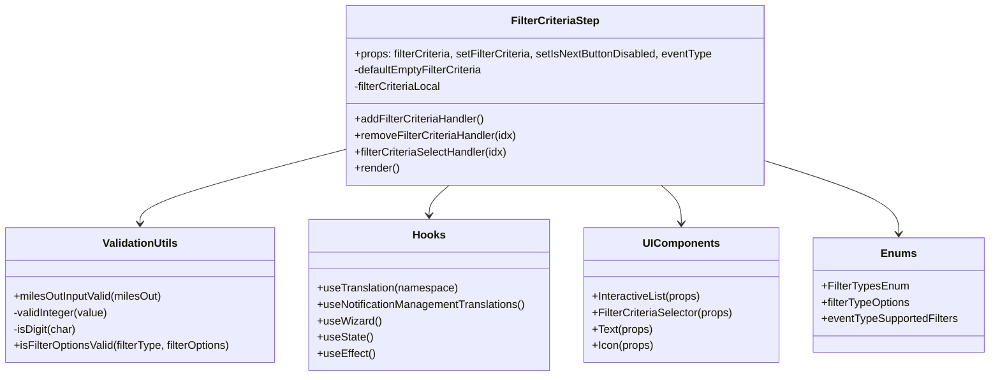

# Diagram: web/portal/src/pages/administration/notification-management/components/organisms/wizard-steps/FilterCriteriaStep.organism.js


> Auto-generated by Obscura crawlers

## Diagram 1

```mermaid
flowchart LR
  Props[Props: filterCriteria, setFilterCriteria, setIsNextButtonDisabled, eventType] --> FilterCriteriaStep[FilterCriteriaStep Component]
  FilterCriteriaStep -->|uses| useState[useState: filterCriteriaLocal]
  FilterCriteriaStep -->|uses| useEffect1[useEffect: enable Next button]
  FilterCriteriaStep -->|uses| useEffect2[useEffect: validate all filters]
  FilterCriteriaStep -->|uses| useTranslation[useTranslation("notification-management")]
  FilterCriteriaStep -->|uses| useNotificationManagementTranslations[useNotificationManagementTranslations]
  FilterCriteriaStep -->|uses| useWizard[useWizard.handleStep -> calls setFilterCriteria]
  FilterCriteriaStep -->|calls| addFilterCriteriaHandler[addFilterCriteriaHandler]
  FilterCriteriaStep -->|calls| removeFilterCriteriaHandler[removeFilterCriteriaHandler]
  FilterCriteriaStep -->|calls| filterCriteriaSelectHandler[filterCriteriaSelectHandler(idx)]
  filterCriteriaSelectHandler -->|calls| isFilterOptionsValid[isFilterOptionsValid(filterType, filterOptions)]
  isFilterOptionsValid -->|calls when MILES_OUT| milesOutInputValid[milesOutInputValid(milesOut)]
  milesOutInputValid -->|calls| validInteger[validInteger(value)]
  validInteger -->|calls| isDigit[isDigit(char)]
  FilterCriteriaStep -->|renders| InteractiveList[InteractiveList]
  InteractiveList -->|contains| FilterCriteriaSelector[FilterCriteriaSelector]
  FilterCriteriaStep -->|renders| Text[Text atoms]
  FilterCriteriaStep -->|renders| Icon[Icon atoms]
  FilterCriteriaStep -->|references| FilterTypesEnum[FilterTypesEnum & filterTypeOptions & eventTypeSupportedFilters]
  FilterCriteriaStep -->|computes| outdatedOptions[outdatedOptions: derived from filterCriteriaLocal]
  FilterCriteriaStep -->|sets| setIsNextButtonDisabled[setIsNextButtonDisabled]
```

> SVG rendering failed for this diagram.

## Diagram 2



### SVG

<svg id="container" width="1466.3125" xmlns="http://www.w3.org/2000/svg" class="classDiagram" height="552" viewBox="0 0 1466.3125 552" role="graphics-document document" aria-roledescription="class"><style>#container{font-family:"trebuchet ms",verdana,arial,sans-serif;font-size:16px;fill:#333;}@keyframes edge-animation-frame{from{stroke-dashoffset:0;}}@keyframes dash{to{stroke-dashoffset:0;}}#container .edge-animation-slow{stroke-dasharray:9,5!important;stroke-dashoffset:900;animation:dash 50s linear infinite;stroke-linecap:round;}#container .edge-animation-fast{stroke-dasharray:9,5!important;stroke-dashoffset:900;animation:dash 20s linear infinite;stroke-linecap:round;}#container .error-icon{fill:#552222;}#container .error-text{fill:#552222;stroke:#552222;}#container .edge-thickness-normal{stroke-width:1px;}#container .edge-thickness-thick{stroke-width:3.5px;}#container .edge-pattern-solid{stroke-dasharray:0;}#container .edge-thickness-invisible{stroke-width:0;fill:none;}#container .edge-pattern-dashed{stroke-dasharray:3;}#container .edge-pattern-dotted{stroke-dasharray:2;}#container .marker{fill:#333333;stroke:#333333;}#container .marker.cross{stroke:#333333;}#container svg{font-family:"trebuchet ms",verdana,arial,sans-serif;font-size:16px;}#container p{margin:0;}#container g.classGroup text{fill:#9370DB;stroke:none;font-family:"trebuchet ms",verdana,arial,sans-serif;font-size:10px;}#container g.classGroup text .title{font-weight:bolder;}#container .nodeLabel,#container .edgeLabel{color:#131300;}#container .edgeLabel .label rect{fill:#ECECFF;}#container .label text{fill:#131300;}#container .labelBkg{background:#ECECFF;}#container .edgeLabel .label span{background:#ECECFF;}#container .classTitle{font-weight:bolder;}#container .node rect,#container .node circle,#container .node ellipse,#container .node polygon,#container .node path{fill:#ECECFF;stroke:#9370DB;stroke-width:1px;}#container .divider{stroke:#9370DB;stroke-width:1;}#container g.clickable{cursor:pointer;}#container g.classGroup rect{fill:#ECECFF;stroke:#9370DB;}#container g.classGroup line{stroke:#9370DB;stroke-width:1;}#container .classLabel .box{stroke:none;stroke-width:0;fill:#ECECFF;opacity:0.5;}#container .classLabel .label{fill:#9370DB;font-size:10px;}#container .relation{stroke:#333333;stroke-width:1;fill:none;}#container .dashed-line{stroke-dasharray:3;}#container .dotted-line{stroke-dasharray:1 2;}#container #compositionStart,#container .composition{fill:#333333!important;stroke:#333333!important;stroke-width:1;}#container #compositionEnd,#container .composition{fill:#333333!important;stroke:#333333!important;stroke-width:1;}#container #dependencyStart,#container .dependency{fill:#333333!important;stroke:#333333!important;stroke-width:1;}#container #dependencyStart,#container .dependency{fill:#333333!important;stroke:#333333!important;stroke-width:1;}#container #extensionStart,#container .extension{fill:transparent!important;stroke:#333333!important;stroke-width:1;}#container #extensionEnd,#container .extension{fill:transparent!important;stroke:#333333!important;stroke-width:1;}#container #aggregationStart,#container .aggregation{fill:transparent!important;stroke:#333333!important;stroke-width:1;}#container #aggregationEnd,#container .aggregation{fill:transparent!important;stroke:#333333!important;stroke-width:1;}#container #lollipopStart,#container .lollipop{fill:#ECECFF!important;stroke:#333333!important;stroke-width:1;}#container #lollipopEnd,#container .lollipop{fill:#ECECFF!important;stroke:#333333!important;stroke-width:1;}#container .edgeTerminals{font-size:11px;line-height:initial;}#container .classTitleText{text-anchor:middle;font-size:18px;fill:#333;}#container .label-icon{display:inline-block;height:1em;overflow:visible;vertical-align:-0.125em;}#container .node .label-icon path{fill:currentColor;stroke:revert;stroke-width:revert;}#container :root{--mermaid-font-family:"trebuchet ms",verdana,arial,sans-serif;}</style><g><defs><marker id="container_class-aggregationStart" class="marker aggregation class" refX="18" refY="7" markerWidth="190" markerHeight="240" orient="auto"><path d="M 18,7 L9,13 L1,7 L9,1 Z"></path></marker></defs><defs><marker id="container_class-aggregationEnd" class="marker aggregation class" refX="1" refY="7" markerWidth="20" markerHeight="28" orient="auto"><path d="M 18,7 L9,13 L1,7 L9,1 Z"></path></marker></defs><defs><marker id="container_class-extensionStart" class="marker extension class" refX="18" refY="7" markerWidth="190" markerHeight="240" orient="auto"><path d="M 1,7 L18,13 V 1 Z"></path></marker></defs><defs><marker id="container_class-extensionEnd" class="marker extension class" refX="1" refY="7" markerWidth="20" markerHeight="28" orient="auto"><path d="M 1,1 V 13 L18,7 Z"></path></marker></defs><defs><marker id="container_class-compositionStart" class="marker composition class" refX="18" refY="7" markerWidth="190" markerHeight="240" orient="auto"><path d="M 18,7 L9,13 L1,7 L9,1 Z"></path></marker></defs><defs><marker id="container_class-compositionEnd" class="marker composition class" refX="1" refY="7" markerWidth="20" markerHeight="28" orient="auto"><path d="M 18,7 L9,13 L1,7 L9,1 Z"></path></marker></defs><defs><marker id="container_class-dependencyStart" class="marker dependency class" refX="6" refY="7" markerWidth="190" markerHeight="240" orient="auto"><path d="M 5,7 L9,13 L1,7 L9,1 Z"></path></marker></defs><defs><marker id="container_class-dependencyEnd" class="marker dependency class" refX="13" refY="7" markerWidth="20" markerHeight="28" orient="auto"><path d="M 18,7 L9,13 L14,7 L9,1 Z"></path></marker></defs><defs><marker id="container_class-lollipopStart" class="marker lollipop class" refX="13" refY="7" markerWidth="190" markerHeight="240" orient="auto"><circle stroke="black" fill="transparent" cx="7" cy="7" r="6"></circle></marker></defs><defs><marker id="container_class-lollipopEnd" class="marker lollipop class" refX="1" refY="7" markerWidth="190" markerHeight="240" orient="auto"><circle stroke="black" fill="transparent" cx="7" cy="7" r="6"></circle></marker></defs><g class="root"><g class="clusters"></g><g class="edgePaths"><path d="M517.43,218.987L466.277,231.989C415.124,244.991,312.818,270.996,261.665,289.164C210.512,307.333,210.512,317.667,210.512,322.833L210.512,328" id="id_FilterCriteriaStep_ValidationUtils_1" class="edge-thickness-normal edge-pattern-solid relation" style=";;;" data-edge="true" data-et="edge" data-id="id_FilterCriteriaStep_ValidationUtils_1" data-points="W3sieCI6NTE3LjQyOTY4NzUsInkiOjIxOC45ODY1MjMwNjQ0NjkyMn0seyJ4IjoyMTAuNTExNzE4NzUsInkiOjI5N30seyJ4IjoyMTAuNTExNzE4NzUsInkiOjMzNH1d" marker-end="url(#container_class-dependencyEnd)"></path><path d="M671.636,272L666.695,276.167C661.753,280.333,651.871,288.667,646.93,296C641.988,303.333,641.988,309.667,641.988,312.833L641.988,316" id="id_FilterCriteriaStep_Hooks_2" class="edge-thickness-normal edge-pattern-solid relation" style=";;;" data-edge="true" data-et="edge" data-id="id_FilterCriteriaStep_Hooks_2" data-points="W3sieCI6NjcxLjYzNTk3MjMzMjgwMjYsInkiOjI3Mn0seyJ4Ijo2NDEuOTg4MjgxMjUsInkiOjI5N30seyJ4Ijo2NDEuOTg4MjgxMjUsInkiOjMyMn1d" marker-end="url(#container_class-dependencyEnd)"></path><path d="M984.716,272L989.657,276.167C994.598,280.333,1004.481,288.667,1009.422,298C1014.363,307.333,1014.363,317.667,1014.363,322.833L1014.363,328" id="id_FilterCriteriaStep_UIComponents_3" class="edge-thickness-normal edge-pattern-solid relation" style=";;;" data-edge="true" data-et="edge" data-id="id_FilterCriteriaStep_UIComponents_3" data-points="W3sieCI6OTg0LjcxNTU5MDE2NzE5NzQsInkiOjI3Mn0seyJ4IjoxMDE0LjM2MzI4MTI1LCJ5IjoyOTd9LHsieCI6MTAxNC4zNjMyODEyNSwieSI6MzM0fV0=" marker-end="url(#container_class-dependencyEnd)"></path><path d="M1138.922,236.634L1171.275,246.695C1203.629,256.756,1268.336,276.878,1300.689,294.606C1333.043,312.333,1333.043,327.667,1333.043,335.333L1333.043,343" id="id_FilterCriteriaStep_Enums_4" class="edge-thickness-normal edge-pattern-solid relation" style=";;;" data-edge="true" data-et="edge" data-id="id_FilterCriteriaStep_Enums_4" data-points="W3sieCI6MTEzOC45MjE4NzUsInkiOjIzNi42MzM2MDU2ODIxODc0Nn0seyJ4IjoxMzMzLjA0Mjk2ODc1LCJ5IjoyOTd9LHsieCI6MTMzMy4wNDI5Njg3NSwieSI6MzQ5fV0=" marker-end="url(#container_class-dependencyEnd)"></path></g><g class="edgeLabels"><g class="edgeLabel"><g class="label" data-id="id_FilterCriteriaStep_ValidationUtils_1" transform="translate(0, 0)"><foreignObject width="0" height="0"><div xmlns="http://www.w3.org/1999/xhtml" class="labelBkg" style="display: table-cell; white-space: nowrap; line-height: 1.5; max-width: 200px; text-align: center;"><span class="edgeLabel"></span></div></foreignObject></g></g><g class="edgeLabel"><g class="label" data-id="id_FilterCriteriaStep_Hooks_2" transform="translate(0, 0)"><foreignObject width="0" height="0"><div xmlns="http://www.w3.org/1999/xhtml" class="labelBkg" style="display: table-cell; white-space: nowrap; line-height: 1.5; max-width: 200px; text-align: center;"><span class="edgeLabel"></span></div></foreignObject></g></g><g class="edgeLabel"><g class="label" data-id="id_FilterCriteriaStep_UIComponents_3" transform="translate(0, 0)"><foreignObject width="0" height="0"><div xmlns="http://www.w3.org/1999/xhtml" class="labelBkg" style="display: table-cell; white-space: nowrap; line-height: 1.5; max-width: 200px; text-align: center;"><span class="edgeLabel"></span></div></foreignObject></g></g><g class="edgeLabel"><g class="label" data-id="id_FilterCriteriaStep_Enums_4" transform="translate(0, 0)"><foreignObject width="0" height="0"><div xmlns="http://www.w3.org/1999/xhtml" class="labelBkg" style="display: table-cell; white-space: nowrap; line-height: 1.5; max-width: 200px; text-align: center;"><span class="edgeLabel"></span></div></foreignObject></g></g></g><g class="nodes"><g class="node default" id="classId-FilterCriteriaStep-0" transform="translate(828.17578125, 140)"><g class="basic label-container"><path d="M-310.74609375 -132 L310.74609375 -132 L310.74609375 132 L-310.74609375 132" stroke="none" stroke-width="0" fill="#ECECFF" style=""></path><path d="M-310.74609375 -132 C-180.93245029191687 -132, -51.11880683383373 -132, 310.74609375 -132 M-310.74609375 -132 C-151.8313595924628 -132, 7.083374565074394 -132, 310.74609375 -132 M310.74609375 -132 C310.74609375 -59.90452321671215, 310.74609375 12.1909535665757, 310.74609375 132 M310.74609375 -132 C310.74609375 -70.6259908817295, 310.74609375 -9.251981763459028, 310.74609375 132 M310.74609375 132 C81.04321309623526 132, -148.65966755752947 132, -310.74609375 132 M310.74609375 132 C128.87700932264218 132, -52.99207510471564 132, -310.74609375 132 M-310.74609375 132 C-310.74609375 43.224624218349874, -310.74609375 -45.55075156330025, -310.74609375 -132 M-310.74609375 132 C-310.74609375 64.75821047973066, -310.74609375 -2.4835790405386717, -310.74609375 -132" stroke="#9370DB" stroke-width="1.3" fill="none" stroke-dasharray="0 0" style=""></path></g><g class="annotation-group text" transform="translate(0, -108)"></g><g class="label-group text" transform="translate(-62.7578125, -108)"><g class="label" style="font-weight: bolder" transform="translate(0,-12)"><foreignObject width="125.515625" height="24"><div xmlns="http://www.w3.org/1999/xhtml" style="display: table-cell; white-space: nowrap; line-height: 1.5; max-width: 172px; text-align: center;"><span class="nodeLabel markdown-node-label" style=""><p>FilterCriteriaStep</p></span></div></foreignObject></g></g><g class="members-group text" transform="translate(-298.74609375, -60)"><g class="label" style="" transform="translate(0,-12)"><foreignObject width="534.734375" height="24"><div xmlns="http://www.w3.org/1999/xhtml" style="display: table-cell; white-space: nowrap; line-height: 1.5; max-width: 592px; text-align: center;"><span class="nodeLabel markdown-node-label" style=""><p>+props: filterCriteria, setFilterCriteria, setIsNextButtonDisabled, eventType</p></span></div></foreignObject></g><g class="label" style="" transform="translate(0,12)"><foreignObject width="193.40625" height="24"><div xmlns="http://www.w3.org/1999/xhtml" style="display: table-cell; white-space: nowrap; line-height: 1.5; max-width: 251px; text-align: center;"><span class="nodeLabel markdown-node-label" style=""><p>-defaultEmptyFilterCriteria</p></span></div></foreignObject></g><g class="label" style="" transform="translate(0,36)"><foreignObject width="131.21875" height="24"><div xmlns="http://www.w3.org/1999/xhtml" style="display: table-cell; white-space: nowrap; line-height: 1.5; max-width: 189px; text-align: center;"><span class="nodeLabel markdown-node-label" style=""><p>-filterCriteriaLocal</p></span></div></foreignObject></g></g><g class="methods-group text" transform="translate(-298.74609375, 36)"><g class="label" style="" transform="translate(0,-12)"><foreignObject width="193.96875" height="24"><div xmlns="http://www.w3.org/1999/xhtml" style="display: table-cell; white-space: nowrap; line-height: 1.5; max-width: 251px; text-align: center;"><span class="nodeLabel markdown-node-label" style=""><p>+addFilterCriteriaHandler()</p></span></div></foreignObject></g><g class="label" style="" transform="translate(0,12)"><foreignObject width="242.15625" height="24"><div xmlns="http://www.w3.org/1999/xhtml" style="display: table-cell; white-space: nowrap; line-height: 1.5; max-width: 300px; text-align: center;"><span class="nodeLabel markdown-node-label" style=""><p>+removeFilterCriteriaHandler(idx)</p></span></div></foreignObject></g><g class="label" style="" transform="translate(0,36)"><foreignObject width="229.5625" height="24"><div xmlns="http://www.w3.org/1999/xhtml" style="display: table-cell; white-space: nowrap; line-height: 1.5; max-width: 287px; text-align: center;"><span class="nodeLabel markdown-node-label" style=""><p>+filterCriteriaSelectHandler(idx)</p></span></div></foreignObject></g><g class="label" style="" transform="translate(0,60)"><foreignObject width="66.609375" height="24"><div xmlns="http://www.w3.org/1999/xhtml" style="display: table-cell; white-space: nowrap; line-height: 1.5; max-width: 124px; text-align: center;"><span class="nodeLabel markdown-node-label" style=""><p>+render()</p></span></div></foreignObject></g></g><g class="divider" style=""><path d="M-310.74609375 -84 C-81.68481517873266 -84, 147.37646339253467 -84, 310.74609375 -84 M-310.74609375 -84 C-72.58245886984292 -84, 165.58117601031415 -84, 310.74609375 -84" stroke="#9370DB" stroke-width="1.3" fill="none" stroke-dasharray="0 0" style=""></path></g><g class="divider" style=""><path d="M-310.74609375 12 C-184.39848387847962 12, -58.05087400695925 12, 310.74609375 12 M-310.74609375 12 C-136.7539639905344 12, 37.2381657689312 12, 310.74609375 12" stroke="#9370DB" stroke-width="1.3" fill="none" stroke-dasharray="0 0" style=""></path></g></g><g class="node default" id="classId-ValidationUtils-1" transform="translate(210.51171875, 433)"><g class="basic label-container"><path d="M-202.51171875 -99 L202.51171875 -99 L202.51171875 99 L-202.51171875 99" stroke="none" stroke-width="0" fill="#ECECFF" style=""></path><path d="M-202.51171875 -99 C-74.51975490435184 -99, 53.472208941296316 -99, 202.51171875 -99 M-202.51171875 -99 C-92.15114642188128 -99, 18.209425906237442 -99, 202.51171875 -99 M202.51171875 -99 C202.51171875 -56.56782451214947, 202.51171875 -14.135649024298942, 202.51171875 99 M202.51171875 -99 C202.51171875 -20.44870311009082, 202.51171875 58.10259377981836, 202.51171875 99 M202.51171875 99 C102.66087277101956 99, 2.8100267920391104 99, -202.51171875 99 M202.51171875 99 C116.27497936404474 99, 30.03823997808948 99, -202.51171875 99 M-202.51171875 99 C-202.51171875 23.43280586173671, -202.51171875 -52.13438827652658, -202.51171875 -99 M-202.51171875 99 C-202.51171875 38.114419358981884, -202.51171875 -22.771161282036232, -202.51171875 -99" stroke="#9370DB" stroke-width="1.3" fill="none" stroke-dasharray="0 0" style=""></path></g><g class="annotation-group text" transform="translate(0, -75)"></g><g class="label-group text" transform="translate(-53.7890625, -75)"><g class="label" style="font-weight: bolder" transform="translate(0,-12)"><foreignObject width="107.578125" height="24"><div xmlns="http://www.w3.org/1999/xhtml" style="display: table-cell; white-space: nowrap; line-height: 1.5; max-width: 156px; text-align: center;"><span class="nodeLabel markdown-node-label" style=""><p>ValidationUtils</p></span></div></foreignObject></g></g><g class="members-group text" transform="translate(-190.51171875, -27)"></g><g class="methods-group text" transform="translate(-190.51171875, 3)"><g class="label" style="" transform="translate(0,-12)"><foreignObject width="222.984375" height="24"><div xmlns="http://www.w3.org/1999/xhtml" style="display: table-cell; white-space: nowrap; line-height: 1.5; max-width: 280px; text-align: center;"><span class="nodeLabel markdown-node-label" style=""><p>+milesOutInputValid(milesOut)</p></span></div></foreignObject></g><g class="label" style="" transform="translate(0,12)"><foreignObject width="141.78125" height="24"><div xmlns="http://www.w3.org/1999/xhtml" style="display: table-cell; white-space: nowrap; line-height: 1.5; max-width: 199px; text-align: center;"><span class="nodeLabel markdown-node-label" style=""><p>-validInteger(value)</p></span></div></foreignObject></g><g class="label" style="" transform="translate(0,36)"><foreignObject width="94.140625" height="24"><div xmlns="http://www.w3.org/1999/xhtml" style="display: table-cell; white-space: nowrap; line-height: 1.5; max-width: 152px; text-align: center;"><span class="nodeLabel markdown-node-label" style=""><p>-isDigit(char)</p></span></div></foreignObject></g><g class="label" style="" transform="translate(0,60)"><foreignObject width="327.234375" height="24"><div xmlns="http://www.w3.org/1999/xhtml" style="display: table-cell; white-space: nowrap; line-height: 1.5; max-width: 385px; text-align: center;"><span class="nodeLabel markdown-node-label" style=""><p>+isFilterOptionsValid(filterType, filterOptions)</p></span></div></foreignObject></g></g><g class="divider" style=""><path d="M-202.51171875 -51 C-115.69186686553786 -51, -28.872014981075722 -51, 202.51171875 -51 M-202.51171875 -51 C-119.26885523729 -51, -36.025991724579995 -51, 202.51171875 -51" stroke="#9370DB" stroke-width="1.3" fill="none" stroke-dasharray="0 0" style=""></path></g><g class="divider" style=""><path d="M-202.51171875 -27 C-112.382292361928 -27, -22.25286597385599 -27, 202.51171875 -27 M-202.51171875 -27 C-75.18185614861477 -27, 52.14800645277046 -27, 202.51171875 -27" stroke="#9370DB" stroke-width="1.3" fill="none" stroke-dasharray="0 0" style=""></path></g></g><g class="node default" id="classId-Hooks-2" transform="translate(641.98828125, 433)"><g class="basic label-container"><path d="M-178.96484375 -111 L178.96484375 -111 L178.96484375 111 L-178.96484375 111" stroke="none" stroke-width="0" fill="#ECECFF" style=""></path><path d="M-178.96484375 -111 C-92.4651226492385 -111, -5.96540154847699 -111, 178.96484375 -111 M-178.96484375 -111 C-105.70478507213397 -111, -32.444726394267946 -111, 178.96484375 -111 M178.96484375 -111 C178.96484375 -30.244510764167543, 178.96484375 50.51097847166491, 178.96484375 111 M178.96484375 -111 C178.96484375 -52.97018527555749, 178.96484375 5.059629448885019, 178.96484375 111 M178.96484375 111 C36.82088188980441 111, -105.32307997039118 111, -178.96484375 111 M178.96484375 111 C72.78573088408646 111, -33.393381981827076 111, -178.96484375 111 M-178.96484375 111 C-178.96484375 42.7068183905332, -178.96484375 -25.5863632189336, -178.96484375 -111 M-178.96484375 111 C-178.96484375 54.956431515407026, -178.96484375 -1.0871369691859485, -178.96484375 -111" stroke="#9370DB" stroke-width="1.3" fill="none" stroke-dasharray="0 0" style=""></path></g><g class="annotation-group text" transform="translate(0, -87)"></g><g class="label-group text" transform="translate(-22.9140625, -87)"><g class="label" style="font-weight: bolder" transform="translate(0,-12)"><foreignObject width="45.828125" height="24"><div xmlns="http://www.w3.org/1999/xhtml" style="display: table-cell; white-space: nowrap; line-height: 1.5; max-width: 95px; text-align: center;"><span class="nodeLabel markdown-node-label" style=""><p>Hooks</p></span></div></foreignObject></g></g><g class="members-group text" transform="translate(-166.96484375, -39)"></g><g class="methods-group text" transform="translate(-166.96484375, -9)"><g class="label" style="" transform="translate(0,-12)"><foreignObject width="207.21875" height="24"><div xmlns="http://www.w3.org/1999/xhtml" style="display: table-cell; white-space: nowrap; line-height: 1.5; max-width: 265px; text-align: center;"><span class="nodeLabel markdown-node-label" style=""><p>+useTranslation(namespace)</p></span></div></foreignObject></g><g class="label" style="" transform="translate(0,12)"><foreignObject width="311.015625" height="24"><div xmlns="http://www.w3.org/1999/xhtml" style="display: table-cell; white-space: nowrap; line-height: 1.5; max-width: 368px; text-align: center;"><span class="nodeLabel markdown-node-label" style=""><p>+useNotificationManagementTranslations()</p></span></div></foreignObject></g><g class="label" style="" transform="translate(0,36)"><foreignObject width="92.3125" height="24"><div xmlns="http://www.w3.org/1999/xhtml" style="display: table-cell; white-space: nowrap; line-height: 1.5; max-width: 150px; text-align: center;"><span class="nodeLabel markdown-node-label" style=""><p>+useWizard()</p></span></div></foreignObject></g><g class="label" style="" transform="translate(0,60)"><foreignObject width="81.203125" height="24"><div xmlns="http://www.w3.org/1999/xhtml" style="display: table-cell; white-space: nowrap; line-height: 1.5; max-width: 139px; text-align: center;"><span class="nodeLabel markdown-node-label" style=""><p>+useState()</p></span></div></foreignObject></g><g class="label" style="" transform="translate(0,84)"><foreignObject width="84.8125" height="24"><div xmlns="http://www.w3.org/1999/xhtml" style="display: table-cell; white-space: nowrap; line-height: 1.5; max-width: 142px; text-align: center;"><span class="nodeLabel markdown-node-label" style=""><p>+useEffect()</p></span></div></foreignObject></g></g><g class="divider" style=""><path d="M-178.96484375 -63 C-92.213138793771 -63, -5.461433837541989 -63, 178.96484375 -63 M-178.96484375 -63 C-83.37066015747205 -63, 12.22352343505591 -63, 178.96484375 -63" stroke="#9370DB" stroke-width="1.3" fill="none" stroke-dasharray="0 0" style=""></path></g><g class="divider" style=""><path d="M-178.96484375 -39 C-44.34444777490896 -39, 90.27594820018209 -39, 178.96484375 -39 M-178.96484375 -39 C-97.38356377277601 -39, -15.802283795552029 -39, 178.96484375 -39" stroke="#9370DB" stroke-width="1.3" fill="none" stroke-dasharray="0 0" style=""></path></g></g><g class="node default" id="classId-UIComponents-3" transform="translate(1014.36328125, 433)"><g class="basic label-container"><path d="M-143.41015625 -99 L143.41015625 -99 L143.41015625 99 L-143.41015625 99" stroke="none" stroke-width="0" fill="#ECECFF" style=""></path><path d="M-143.41015625 -99 C-45.69383768685627 -99, 52.02248087628746 -99, 143.41015625 -99 M-143.41015625 -99 C-84.59001018697893 -99, -25.76986412395786 -99, 143.41015625 -99 M143.41015625 -99 C143.41015625 -54.067876421488215, 143.41015625 -9.13575284297643, 143.41015625 99 M143.41015625 -99 C143.41015625 -46.854549185859604, 143.41015625 5.290901628280793, 143.41015625 99 M143.41015625 99 C32.3047186383624 99, -78.8007189732752 99, -143.41015625 99 M143.41015625 99 C41.040782719487 99, -61.328590811026004 99, -143.41015625 99 M-143.41015625 99 C-143.41015625 56.330784972667026, -143.41015625 13.661569945334051, -143.41015625 -99 M-143.41015625 99 C-143.41015625 33.255233733219, -143.41015625 -32.489532533562, -143.41015625 -99" stroke="#9370DB" stroke-width="1.3" fill="none" stroke-dasharray="0 0" style=""></path></g><g class="annotation-group text" transform="translate(0, -75)"></g><g class="label-group text" transform="translate(-53.4765625, -75)"><g class="label" style="font-weight: bolder" transform="translate(0,-12)"><foreignObject width="106.953125" height="24"><div xmlns="http://www.w3.org/1999/xhtml" style="display: table-cell; white-space: nowrap; line-height: 1.5; max-width: 157px; text-align: center;"><span class="nodeLabel markdown-node-label" style=""><p>UIComponents</p></span></div></foreignObject></g></g><g class="members-group text" transform="translate(-131.41015625, -27)"></g><g class="methods-group text" transform="translate(-131.41015625, 3)"><g class="label" style="" transform="translate(0,-12)"><foreignObject width="162.75" height="24"><div xmlns="http://www.w3.org/1999/xhtml" style="display: table-cell; white-space: nowrap; line-height: 1.5; max-width: 220px; text-align: center;"><span class="nodeLabel markdown-node-label" style=""><p>+InteractiveList(props)</p></span></div></foreignObject></g><g class="label" style="" transform="translate(0,12)"><foreignObject width="209.34375" height="24"><div xmlns="http://www.w3.org/1999/xhtml" style="display: table-cell; white-space: nowrap; line-height: 1.5; max-width: 267px; text-align: center;"><span class="nodeLabel markdown-node-label" style=""><p>+FilterCriteriaSelector(props)</p></span></div></foreignObject></g><g class="label" style="" transform="translate(0,36)"><foreignObject width="88.578125" height="24"><div xmlns="http://www.w3.org/1999/xhtml" style="display: table-cell; white-space: nowrap; line-height: 1.5; max-width: 146px; text-align: center;"><span class="nodeLabel markdown-node-label" style=""><p>+Text(props)</p></span></div></foreignObject></g><g class="label" style="" transform="translate(0,60)"><foreignObject width="90.640625" height="24"><div xmlns="http://www.w3.org/1999/xhtml" style="display: table-cell; white-space: nowrap; line-height: 1.5; max-width: 148px; text-align: center;"><span class="nodeLabel markdown-node-label" style=""><p>+Icon(props)</p></span></div></foreignObject></g></g><g class="divider" style=""><path d="M-143.41015625 -51 C-28.750101347719266 -51, 85.90995355456147 -51, 143.41015625 -51 M-143.41015625 -51 C-39.80109933317365 -51, 63.807957583652694 -51, 143.41015625 -51" stroke="#9370DB" stroke-width="1.3" fill="none" stroke-dasharray="0 0" style=""></path></g><g class="divider" style=""><path d="M-143.41015625 -27 C-45.608929888047214 -27, 52.19229647390557 -27, 143.41015625 -27 M-143.41015625 -27 C-60.71156685179726 -27, 21.987022546405484 -27, 143.41015625 -27" stroke="#9370DB" stroke-width="1.3" fill="none" stroke-dasharray="0 0" style=""></path></g></g><g class="node default" id="classId-Enums-4" transform="translate(1333.04296875, 433)"><g class="basic label-container"><path d="M-125.26953125 -84 L125.26953125 -84 L125.26953125 84 L-125.26953125 84" stroke="none" stroke-width="0" fill="#ECECFF" style=""></path><path d="M-125.26953125 -84 C-39.63352595432505 -84, 46.0024793413499 -84, 125.26953125 -84 M-125.26953125 -84 C-44.74428546581251 -84, 35.78096031837498 -84, 125.26953125 -84 M125.26953125 -84 C125.26953125 -22.63734655428368, 125.26953125 38.72530689143264, 125.26953125 84 M125.26953125 -84 C125.26953125 -21.450768545068485, 125.26953125 41.09846290986303, 125.26953125 84 M125.26953125 84 C25.562474673990423 84, -74.14458190201915 84, -125.26953125 84 M125.26953125 84 C74.76142953103337 84, 24.253327812066743 84, -125.26953125 84 M-125.26953125 84 C-125.26953125 27.38997977254718, -125.26953125 -29.220040454905643, -125.26953125 -84 M-125.26953125 84 C-125.26953125 24.779739423186385, -125.26953125 -34.44052115362723, -125.26953125 -84" stroke="#9370DB" stroke-width="1.3" fill="none" stroke-dasharray="0 0" style=""></path></g><g class="annotation-group text" transform="translate(0, -60)"></g><g class="label-group text" transform="translate(-23.9453125, -60)"><g class="label" style="font-weight: bolder" transform="translate(0,-12)"><foreignObject width="47.890625" height="24"><div xmlns="http://www.w3.org/1999/xhtml" style="display: table-cell; white-space: nowrap; line-height: 1.5; max-width: 98px; text-align: center;"><span class="nodeLabel markdown-node-label" style=""><p>Enums</p></span></div></foreignObject></g></g><g class="members-group text" transform="translate(-113.26953125, -12)"><g class="label" style="" transform="translate(0,-12)"><foreignObject width="126.921875" height="24"><div xmlns="http://www.w3.org/1999/xhtml" style="display: table-cell; white-space: nowrap; line-height: 1.5; max-width: 184px; text-align: center;"><span class="nodeLabel markdown-node-label" style=""><p>+FilterTypesEnum</p></span></div></foreignObject></g><g class="label" style="" transform="translate(0,12)"><foreignObject width="132.859375" height="24"><div xmlns="http://www.w3.org/1999/xhtml" style="display: table-cell; white-space: nowrap; line-height: 1.5; max-width: 190px; text-align: center;"><span class="nodeLabel markdown-node-label" style=""><p>+filterTypeOptions</p></span></div></foreignObject></g><g class="label" style="" transform="translate(0,36)"><foreignObject width="202.59375" height="24"><div xmlns="http://www.w3.org/1999/xhtml" style="display: table-cell; white-space: nowrap; line-height: 1.5; max-width: 260px; text-align: center;"><span class="nodeLabel markdown-node-label" style=""><p>+eventTypeSupportedFilters</p></span></div></foreignObject></g></g><g class="methods-group text" transform="translate(-113.26953125, 84)"></g><g class="divider" style=""><path d="M-125.26953125 -36 C-72.37092282605336 -36, -19.47231440210672 -36, 125.26953125 -36 M-125.26953125 -36 C-45.614271745381416 -36, 34.04098775923717 -36, 125.26953125 -36" stroke="#9370DB" stroke-width="1.3" fill="none" stroke-dasharray="0 0" style=""></path></g><g class="divider" style=""><path d="M-125.26953125 60 C-25.811692297176748 60, 73.6461466556465 60, 125.26953125 60 M-125.26953125 60 C-34.426434199179866 60, 56.41666285164027 60, 125.26953125 60" stroke="#9370DB" stroke-width="1.3" fill="none" stroke-dasharray="0 0" style=""></path></g></g></g></g></g></svg>
