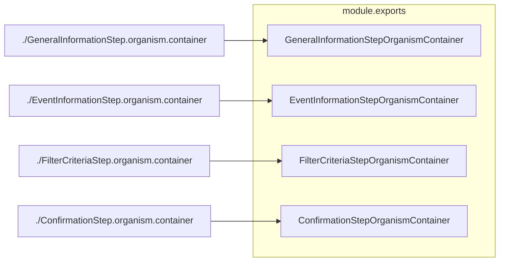

# Diagram: web/portal/src/pages/administration/notification-management/components/organisms/wizard-steps/index.js

> Auto-generated by Obscura crawlers

## Mermaid

### SVG

<svg id="container" width="879.59375" xmlns="http://www.w3.org/2000/svg" class="flowchart" height="452" viewBox="0 0 879.59375 452" role="graphics-document document" aria-roledescription="flowchart-v2"><g><marker id="container_flowchart-v2-pointEnd" class="marker flowchart-v2" viewBox="0 0 10 10" refX="5" refY="5" markerUnits="userSpaceOnUse" markerWidth="8" markerHeight="8" orient="auto"><path d="M 0 0 L 10 5 L 0 10 z" class="arrowMarkerPath" style="stroke-width: 1; stroke-dasharray: 1, 0;"></path></marker><marker id="container_flowchart-v2-pointStart" class="marker flowchart-v2" viewBox="0 0 10 10" refX="4.5" refY="5" markerUnits="userSpaceOnUse" markerWidth="8" markerHeight="8" orient="auto"><path d="M 0 5 L 10 10 L 10 0 z" class="arrowMarkerPath" style="stroke-width: 1; stroke-dasharray: 1, 0;"></path></marker><marker id="container_flowchart-v2-circleEnd" class="marker flowchart-v2" viewBox="0 0 10 10" refX="11" refY="5" markerUnits="userSpaceOnUse" markerWidth="11" markerHeight="11" orient="auto"><circle cx="5" cy="5" r="5" class="arrowMarkerPath" style="stroke-width: 1; stroke-dasharray: 1, 0;"></circle></marker><marker id="container_flowchart-v2-circleStart" class="marker flowchart-v2" viewBox="0 0 10 10" refX="-1" refY="5" markerUnits="userSpaceOnUse" markerWidth="11" markerHeight="11" orient="auto"><circle cx="5" cy="5" r="5" class="arrowMarkerPath" style="stroke-width: 1; stroke-dasharray: 1, 0;"></circle></marker><marker id="container_flowchart-v2-crossEnd" class="marker cross flowchart-v2" viewBox="0 0 11 11" refX="12" refY="5.2" markerUnits="userSpaceOnUse" markerWidth="11" markerHeight="11" orient="auto"><path d="M 1,1 l 9,9 M 10,1 l -9,9" class="arrowMarkerPath" style="stroke-width: 2; stroke-dasharray: 1, 0;"></path></marker><marker id="container_flowchart-v2-crossStart" class="marker cross flowchart-v2" viewBox="0 0 11 11" refX="-1" refY="5.2" markerUnits="userSpaceOnUse" markerWidth="11" markerHeight="11" orient="auto"><path d="M 1,1 l 9,9 M 10,1 l -9,9" class="arrowMarkerPath" style="stroke-width: 2; stroke-dasharray: 1, 0;"></path></marker><g class="root"><g class="clusters"><g class="cluster" id="module.exports" data-look="classic"><rect style="" x="447.796875" y="8" width="423.796875" height="436"></rect><g class="cluster-label" transform="translate(602.9921875, 8)"><foreignObject width="113.40625" height="24">

module.exports

</foreignObject></g></g></g><g class="edgePaths"><path d="M397.797,70L401.964,70C406.13,70,414.464,70,422.797,70C431.13,70,439.464,70,447.13,70C454.797,70,461.797,70,465.297,70L468.797,70" id="L_A_GI_0" class="edge-thickness-normal edge-pattern-solid edge-thickness-normal edge-pattern-solid flowchart-link" style=";" data-edge="true" data-et="edge" data-id="L_A_GI_0" data-points="W3sieCI6Mzk3Ljc5Njg3NSwieSI6NzB9LHsieCI6NDIyLjc5Njg3NSwieSI6NzB9LHsieCI6NDQ3Ljc5Njg3NSwieSI6NzB9LHsieCI6NDcyLjc5Njg3NSwieSI6NzB9XQ==" marker-end="url(#container_flowchart-v2-pointEnd)"></path><path d="M390.039,174L395.499,174C400.958,174,411.878,174,421.504,174C431.13,174,439.464,174,448.451,174C457.438,174,467.078,174,471.898,174L476.719,174" id="L_B_EI_0" class="edge-thickness-normal edge-pattern-solid edge-thickness-normal edge-pattern-solid flowchart-link" style=";" data-edge="true" data-et="edge" data-id="L_B_EI_0" data-points="W3sieCI6MzkwLjAzOTA2MjUsInkiOjE3NH0seyJ4Ijo0MjIuNzk2ODc1LCJ5IjoxNzR9LHsieCI6NDQ3Ljc5Njg3NSwieSI6MTc0fSx7IngiOjQ4MC43MTg3NSwieSI6MTc0fV0=" marker-end="url(#container_flowchart-v2-pointEnd)"></path><path d="M371.953,278L380.427,278C388.901,278,405.849,278,418.49,278C431.13,278,439.464,278,451.465,278C463.466,278,479.135,278,486.97,278L494.805,278" id="L_C_FC_0" class="edge-thickness-normal edge-pattern-solid edge-thickness-normal edge-pattern-solid flowchart-link" style=";" data-edge="true" data-et="edge" data-id="L_C_FC_0" data-points="W3sieCI6MzcxLjk1MzEyNSwieSI6Mjc4fSx7IngiOjQyMi43OTY4NzUsInkiOjI3OH0seyJ4Ijo0NDcuNzk2ODc1LCJ5IjoyNzh9LHsieCI6NDk4LjgwNDY4NzUsInkiOjI3OH1d" marker-end="url(#container_flowchart-v2-pointEnd)"></path><path d="M373.875,382L382.029,382C390.182,382,406.49,382,418.81,382C431.13,382,439.464,382,451.117,382C462.771,382,477.745,382,485.232,382L492.719,382" id="L_D_CN_0" class="edge-thickness-normal edge-pattern-solid edge-thickness-normal edge-pattern-solid flowchart-link" style=";" data-edge="true" data-et="edge" data-id="L_D_CN_0" data-points="W3sieCI6MzczLjg3NSwieSI6MzgyfSx7IngiOjQyMi43OTY4NzUsInkiOjM4Mn0seyJ4Ijo0NDcuNzk2ODc1LCJ5IjozODJ9LHsieCI6NDk2LjcxODc1LCJ5IjozODJ9XQ==" marker-end="url(#container_flowchart-v2-pointEnd)"></path></g><g class="edgeLabels"><g class="edgeLabel"><g class="label" data-id="L_A_GI_0" transform="translate(0, 0)"><foreignObject width="0" height="0">

</foreignObject></g></g><g class="edgeLabel"><g class="label" data-id="L_B_EI_0" transform="translate(0, 0)"><foreignObject width="0" height="0">

</foreignObject></g></g><g class="edgeLabel"><g class="label" data-id="L_C_FC_0" transform="translate(0, 0)"><foreignObject width="0" height="0">

</foreignObject></g></g><g class="edgeLabel"><g class="label" data-id="L_D_CN_0" transform="translate(0, 0)"><foreignObject width="0" height="0">

</foreignObject></g></g></g><g class="nodes"><g class="node default" id="flowchart-A-0" transform="translate(202.8984375, 70)"><rect class="basic label-container" style="" x="-194.8984375" y="-27" width="389.796875" height="54"></rect><g class="label" style="" transform="translate(-164.8984375, -12)"><rect></rect><foreignObject width="329.796875" height="24">

./GeneralInformationStep.organism.container

</foreignObject></g></g><g class="node default" id="flowchart-GI-1" transform="translate(659.6953125, 70)"><rect class="basic label-container" style="" x="-186.8984375" y="-27" width="373.796875" height="54"></rect><g class="label" style="" transform="translate(-156.8984375, -12)"><rect></rect><foreignObject width="313.796875" height="24">

GeneralInformationStepOrganismContainer

</foreignObject></g></g><g class="node default" id="flowchart-B-2" transform="translate(202.8984375, 174)"><rect class="basic label-container" style="" x="-187.140625" y="-27" width="374.28125" height="54"></rect><g class="label" style="" transform="translate(-157.140625, -12)"><rect></rect><foreignObject width="314.28125" height="24">

./EventInformationStep.organism.container

</foreignObject></g></g><g class="node default" id="flowchart-EI-3" transform="translate(659.6953125, 174)"><rect class="basic label-container" style="" x="-178.9765625" y="-27" width="357.953125" height="54"></rect><g class="label" style="" transform="translate(-148.9765625, -12)"><rect></rect><foreignObject width="297.953125" height="24">

EventInformationStepOrganismContainer

</foreignObject></g></g><g class="node default" id="flowchart-C-4" transform="translate(202.8984375, 278)"><rect class="basic label-container" style="" x="-169.0546875" y="-27" width="338.109375" height="54"></rect><g class="label" style="" transform="translate(-139.0546875, -12)"><rect></rect><foreignObject width="278.109375" height="24">

./FilterCriteriaStep.organism.container

</foreignObject></g></g><g class="node default" id="flowchart-FC-5" transform="translate(659.6953125, 278)"><rect class="basic label-container" style="" x="-160.890625" y="-27" width="321.78125" height="54"></rect><g class="label" style="" transform="translate(-130.890625, -12)"><rect></rect><foreignObject width="261.78125" height="24">

FilterCriteriaStepOrganismContainer

</foreignObject></g></g><g class="node default" id="flowchart-D-6" transform="translate(202.8984375, 382)"><rect class="basic label-container" style="" x="-170.9765625" y="-27" width="341.953125" height="54"></rect><g class="label" style="" transform="translate(-140.9765625, -12)"><rect></rect><foreignObject width="281.953125" height="24">

./ConfirmationStep.organism.container

</foreignObject></g></g><g class="node default" id="flowchart-CN-7" transform="translate(659.6953125, 382)"><rect class="basic label-container" style="" x="-162.9765625" y="-27" width="325.953125" height="54"></rect><g class="label" style="" transform="translate(-132.9765625, -12)"><rect></rect><foreignObject width="265.953125" height="24">

ConfirmationStepOrganismContainer

</foreignObject></g></g></g></g></g></svg>
