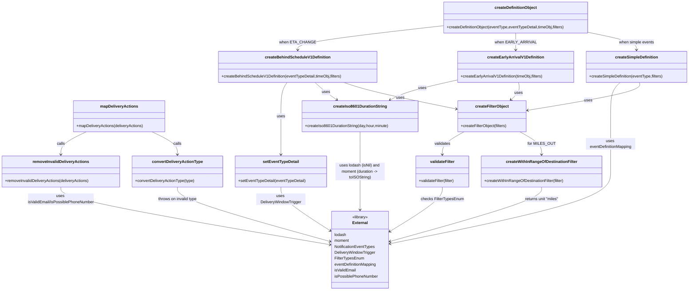

# Diagram: web/portal/src/pages/administration/notification-management/createPayload.util.js

> Auto-generated by Obscura crawlers

## Mermaid

### SVG

<svg id="container" width="2790.345703125" xmlns="http://www.w3.org/2000/svg" class="classDiagram" height="1176" viewBox="0 0 2790.345703125 1176" role="graphics-document document" aria-roledescription="class"><g><defs><marker id="container_class-aggregationStart" class="marker aggregation class" refX="18" refY="7" markerWidth="190" markerHeight="240" orient="auto"><path d="M 18,7 L9,13 L1,7 L9,1 Z"></path></marker></defs><defs><marker id="container_class-aggregationEnd" class="marker aggregation class" refX="1" refY="7" markerWidth="20" markerHeight="28" orient="auto"><path d="M 18,7 L9,13 L1,7 L9,1 Z"></path></marker></defs><defs><marker id="container_class-extensionStart" class="marker extension class" refX="18" refY="7" markerWidth="190" markerHeight="240" orient="auto"><path d="M 1,7 L18,13 V 1 Z"></path></marker></defs><defs><marker id="container_class-extensionEnd" class="marker extension class" refX="1" refY="7" markerWidth="20" markerHeight="28" orient="auto"><path d="M 1,1 V 13 L18,7 Z"></path></marker></defs><defs><marker id="container_class-compositionStart" class="marker composition class" refX="18" refY="7" markerWidth="190" markerHeight="240" orient="auto"><path d="M 18,7 L9,13 L1,7 L9,1 Z"></path></marker></defs><defs><marker id="container_class-compositionEnd" class="marker composition class" refX="1" refY="7" markerWidth="20" markerHeight="28" orient="auto"><path d="M 18,7 L9,13 L1,7 L9,1 Z"></path></marker></defs><defs><marker id="container_class-dependencyStart" class="marker dependency class" refX="6" refY="7" markerWidth="190" markerHeight="240" orient="auto"><path d="M 5,7 L9,13 L1,7 L9,1 Z"></path></marker></defs><defs><marker id="container_class-dependencyEnd" class="marker dependency class" refX="13" refY="7" markerWidth="20" markerHeight="28" orient="auto"><path d="M 18,7 L9,13 L14,7 L9,1 Z"></path></marker></defs><defs><marker id="container_class-lollipopStart" class="marker lollipop class" refX="13" refY="7" markerWidth="190" markerHeight="240" orient="auto"><circle stroke="black" fill="transparent" cx="7" cy="7" r="6"></circle></marker></defs><defs><marker id="container_class-lollipopEnd" class="marker lollipop class" refX="1" refY="7" markerWidth="190" markerHeight="240" orient="auto"><circle stroke="black" fill="transparent" cx="7" cy="7" r="6"></circle></marker></defs><g class="root"><g class="clusters"></g><g class="edgePaths"><path d="M349.898,534L332.712,542.167C315.527,550.333,281.156,566.667,263.971,582C246.785,597.333,246.785,611.667,246.785,618.833L246.785,626" id="id_mapDeliveryActions_removeInvalidDeliveryActions_1" class="edge-thickness-normal edge-pattern-solid relation" style=";;;" data-edge="true" data-et="edge" data-id="id_mapDeliveryActions_removeInvalidDeliveryActions_1" data-points="W3sieCI6MzQ5Ljg5NzU4MzAwNzgxMjUsInkiOjUzNH0seyJ4IjoyNDYuNzg1MTU2MjUsInkiOjU4M30seyJ4IjoyNDYuNzg1MTU2MjUsInkiOjYzMn1d" marker-end="url(#container_class-dependencyEnd)"></path><path d="M615.044,534L632.229,542.167C649.415,550.333,683.785,566.667,700.971,582C718.156,597.333,718.156,611.667,718.156,618.833L718.156,626" id="id_mapDeliveryActions_convertDeliveryActionType_2" class="edge-thickness-normal edge-pattern-solid relation" style=";;;" data-edge="true" data-et="edge" data-id="id_mapDeliveryActions_convertDeliveryActionType_2" data-points="W3sieCI6NjE1LjA0MzgyMzI0MjE4NzUsInkiOjUzNH0seyJ4Ijo3MTguMTU2MjUsInkiOjU4M30seyJ4Ijo3MTguMTU2MjUsInkiOjYzMn1d" marker-end="url(#container_class-dependencyEnd)"></path><path d="M246.785,758L246.785,766.167C246.785,774.333,246.785,790.667,427.496,829.533C608.207,868.399,969.628,929.798,1150.339,960.497L1331.05,991.197" id="id_removeInvalidDeliveryActions_External_3" class="edge-thickness-normal edge-pattern-solid relation" style=";;;" data-edge="true" data-et="edge" data-id="id_removeInvalidDeliveryActions_External_3" data-points="W3sieCI6MjQ2Ljc4NTE1NjI1LCJ5Ijo3NTh9LHsieCI6MjQ2Ljc4NTE1NjI1LCJ5Ijo4MDd9LHsieCI6MTMzNi45NjQ4NDM3NSwieSI6OTkyLjIwMTQ5MTY0MzQ5NDZ9XQ==" marker-end="url(#container_class-dependencyEnd)"></path><path d="M718.156,758L718.156,766.167C718.156,774.333,718.156,790.667,820.328,827.317C922.499,863.966,1126.842,920.933,1229.014,949.416L1331.185,977.899" id="id_convertDeliveryActionType_External_4" class="edge-thickness-normal edge-pattern-solid relation" style=";;;" data-edge="true" data-et="edge" data-id="id_convertDeliveryActionType_External_4" data-points="W3sieCI6NzE4LjE1NjI1LCJ5Ijo3NTh9LHsieCI6NzE4LjE1NjI1LCJ5Ijo4MDd9LHsieCI6MTMzNi45NjQ4NDM3NSwieSI6OTc5LjUxMDM1ODU2NTczNzF9XQ==" marker-end="url(#container_class-dependencyEnd)"></path><path d="M1792.611,104.203L1693.893,115.336C1595.175,126.469,1397.739,148.734,1299.021,165.034C1200.303,181.333,1200.303,191.667,1200.303,196.833L1200.303,202" id="id_createDefinitionObject_createBehindScheduleV1Definition_5" class="edge-thickness-normal edge-pattern-solid relation" style=";;;" data-edge="true" data-et="edge" data-id="id_createDefinitionObject_createBehindScheduleV1Definition_5" data-points="W3sieCI6MTc5Mi42MTEzMjgxMjUsInkiOjEwNC4yMDMzNzk2NzYxMjkwNn0seyJ4IjoxMjAwLjMwMjczNDM3NSwieSI6MTcxfSx7IngiOjEyMDAuMzAyNzM0Mzc1LCJ5IjoyMDh9XQ==" marker-end="url(#container_class-dependencyEnd)"></path><path d="M2087.037,134L2087.037,140.167C2087.037,146.333,2087.037,158.667,2087.037,170C2087.037,181.333,2087.037,191.667,2087.037,196.833L2087.037,202" id="id_createDefinitionObject_createEarlyArrivalV1Definition_6" class="edge-thickness-normal edge-pattern-solid relation" style=";;;" data-edge="true" data-et="edge" data-id="id_createDefinitionObject_createEarlyArrivalV1Definition_6" data-points="W3sieCI6MjA4Ny4wMzcxMDkzNzUsInkiOjEzNH0seyJ4IjoyMDg3LjAzNzEwOTM3NSwieSI6MTcxfSx7IngiOjIwODcuMDM3MTA5Mzc1LCJ5IjoyMDh9XQ==" marker-end="url(#container_class-dependencyEnd)"></path><path d="M2381.463,131.117L2414.018,137.764C2446.572,144.411,2511.682,157.706,2544.236,169.52C2576.791,181.333,2576.791,191.667,2576.791,196.833L2576.791,202" id="id_createDefinitionObject_createSimpleDefinition_7" class="edge-thickness-normal edge-pattern-solid relation" style=";;;" data-edge="true" data-et="edge" data-id="id_createDefinitionObject_createSimpleDefinition_7" data-points="W3sieCI6MjM4MS40NjI4OTA2MjUsInkiOjEzMS4xMTcwODY4NjYwMTIxfSx7IngiOjI1NzYuNzkxMDE1NjI1LCJ5IjoxNzF9LHsieCI6MjU3Ni43OTEwMTU2MjUsInkiOjIwOH1d" marker-end="url(#container_class-dependencyEnd)"></path><path d="M1158.926,334L1154.876,340.167C1150.826,346.333,1142.725,358.667,1138.675,381.5C1134.625,404.333,1134.625,437.667,1134.625,473C1134.625,508.333,1134.625,545.667,1134.625,571.5C1134.625,597.333,1134.625,611.667,1134.625,618.833L1134.625,626" id="id_createBehindScheduleV1Definition_setEventTypeDetail_8" class="edge-thickness-normal edge-pattern-solid relation" style=";;;" data-edge="true" data-et="edge" data-id="id_createBehindScheduleV1Definition_setEventTypeDetail_8" data-points="W3sieCI6MTE1OC45MjU3NjE3MTg3NSwieSI6MzM0fSx7IngiOjExMzQuNjI1LCJ5IjozNzF9LHsieCI6MTEzNC42MjUsInkiOjQ3MX0seyJ4IjoxMTM0LjYyNSwieSI6NTgzfSx7IngiOjExMzQuNjI1LCJ5Ijo2MzJ9XQ==" marker-end="url(#container_class-dependencyEnd)"></path><path d="M1270.869,334L1277.776,340.167C1284.683,346.333,1298.498,358.667,1313.296,370.422C1328.094,382.177,1343.876,393.355,1351.767,398.944L1359.658,404.532" id="id_createBehindScheduleV1Definition_createIso8601DurationString_9" class="edge-thickness-normal edge-pattern-solid relation" style=";;;" data-edge="true" data-et="edge" data-id="id_createBehindScheduleV1Definition_createIso8601DurationString_9" data-points="W3sieCI6MTI3MC44Njg4ODY3MTg3NSwieSI6MzM0fSx7IngiOjEzMTIuMzEyNSwieSI6MzcxfSx7IngiOjEzNjQuNTU0NzY1NjI1LCJ5Ijo0MDh9XQ==" marker-end="url(#container_class-dependencyEnd)"></path><path d="M1387.736,334L1406.083,340.167C1424.43,346.333,1461.123,358.667,1537.316,376.585C1613.509,394.504,1729.202,418.008,1787.049,429.76L1844.896,441.512" id="id_createBehindScheduleV1Definition_createFilterObject_10" class="edge-thickness-normal edge-pattern-solid relation" style=";;;" data-edge="true" data-et="edge" data-id="id_createBehindScheduleV1Definition_createFilterObject_10" data-points="W3sieCI6MTM4Ny43MzYzNDc2NTYyNSwieSI6MzM0fSx7IngiOjE0OTcuODE2NDA2MjUsInkiOjM3MX0seyJ4IjoxODUwLjc3NTM5MDYyNSwieSI6NDQyLjcwNjMyNjA2MDEyOTl9XQ==" marker-end="url(#container_class-dependencyEnd)"></path><path d="M1852.838,323.274L1817.2,331.228C1781.563,339.182,1710.287,355.091,1664.09,368.738C1617.893,382.384,1596.775,393.769,1586.216,399.461L1575.657,405.153" id="id_createEarlyArrivalV1Definition_createIso8601DurationString_11" class="edge-thickness-normal edge-pattern-solid relation" style=";;;" data-edge="true" data-et="edge" data-id="id_createEarlyArrivalV1Definition_createIso8601DurationString_11" data-points="W3sieCI6MTg1Mi44Mzc4OTA2MjUsInkiOjMyMy4yNzM2NDg2OTI4MzE4NH0seyJ4IjoxNjM5LjAxMTcxODc1LCJ5IjozNzF9LHsieCI6MTU3MC4zNzUyNzM0Mzc1LCJ5Ijo0MDh9XQ==" marker-end="url(#container_class-dependencyEnd)"></path><path d="M2098.532,334L2099.657,340.167C2100.783,346.333,2103.033,358.667,2097.807,370.345C2092.581,382.023,2079.879,393.045,2073.528,398.556L2067.177,404.068" id="id_createEarlyArrivalV1Definition_createFilterObject_12" class="edge-thickness-normal edge-pattern-solid relation" style=";;;" data-edge="true" data-et="edge" data-id="id_createEarlyArrivalV1Definition_createFilterObject_12" data-points="W3sieCI6MjA5OC41MzIxNDg0Mzc1LCJ5IjozMzR9LHsieCI6MjEwNS4yODMyMDMxMjUsInkiOjM3MX0seyJ4IjoyMDYyLjY0NTAzOTA2MjUsInkiOjQwOH1d" marker-end="url(#container_class-dependencyEnd)"></path><path d="M2510.55,334L2504.066,340.167C2497.582,346.333,2484.614,358.667,2478.13,381.5C2471.646,404.333,2471.646,437.667,2471.646,473C2471.646,508.333,2471.646,545.667,2471.646,583C2471.646,620.333,2471.646,657.667,2471.646,695C2471.646,732.333,2471.646,769.667,2322.361,818.392C2173.075,867.117,1874.504,927.233,1725.218,957.292L1575.933,987.35" id="id_createSimpleDefinition_External_13" class="edge-thickness-normal edge-pattern-solid relation" style=";;;" data-edge="true" data-et="edge" data-id="id_createSimpleDefinition_External_13" data-points="W3sieCI6MjUxMC41NDk5NjA5Mzc1LCJ5IjozMzR9LHsieCI6MjQ3MS42NDY0ODQzNzUsInkiOjM3MX0seyJ4IjoyNDcxLjY0NjQ4NDM3NSwieSI6NDcxfSx7IngiOjI0NzEuNjQ2NDg0Mzc1LCJ5Ijo1ODN9LHsieCI6MjQ3MS42NDY0ODQzNzUsInkiOjY5NX0seyJ4IjoyNDcxLjY0NjQ4NDM3NSwieSI6ODA3fSx7IngiOjE1NzAuMDUwNzgxMjUsInkiOjk4OC41MzQzMjc1MzkzNDAxfV0=" marker-end="url(#container_class-dependencyEnd)"></path><path d="M2588.286,334L2589.411,340.167C2590.536,346.333,2592.787,358.667,2517.278,377.5C2441.769,396.334,2288.502,421.668,2211.868,434.335L2135.234,447.001" id="id_createSimpleDefinition_createFilterObject_14" class="edge-thickness-normal edge-pattern-solid relation" style=";;;" data-edge="true" data-et="edge" data-id="id_createSimpleDefinition_createFilterObject_14" data-points="W3sieCI6MjU4OC4yODYwNTQ2ODc1LCJ5IjozMzR9LHsieCI6MjU5NS4wMzcxMDkzNzUsInkiOjM3MX0seyJ4IjoyMTI5LjMxNDQ1MzEyNSwieSI6NDQ3Ljk3OTk0NTUwNTQ5NDY0fV0=" marker-end="url(#container_class-dependencyEnd)"></path><path d="M1876.343,534L1861.604,542.167C1846.865,550.333,1817.386,566.667,1802.647,582C1787.908,597.333,1787.908,611.667,1787.908,618.833L1787.908,626" id="id_createFilterObject_validateFilter_15" class="edge-thickness-normal edge-pattern-solid relation" style=";;;" data-edge="true" data-et="edge" data-id="id_createFilterObject_validateFilter_15" data-points="W3sieCI6MTg3Ni4zNDMwMTc1NzgxMjUsInkiOjUzNH0seyJ4IjoxNzg3LjkwODIwMzEyNSwieSI6NTgzfSx7IngiOjE3ODcuOTA4MjAzMTI1LCJ5Ijo2MzJ9XQ==" marker-end="url(#container_class-dependencyEnd)"></path><path d="M2103.747,534L2118.486,542.167C2133.225,550.333,2162.703,566.667,2177.443,582C2192.182,597.333,2192.182,611.667,2192.182,618.833L2192.182,626" id="id_createFilterObject_createWithInRangeOfDestinationFilter_16" class="edge-thickness-normal edge-pattern-solid relation" style=";;;" data-edge="true" data-et="edge" data-id="id_createFilterObject_createWithInRangeOfDestinationFilter_16" data-points="W3sieCI6MjEwMy43NDY4MjYxNzE4NzUsInkiOjUzNH0seyJ4IjoyMTkyLjE4MTY0MDYyNSwieSI6NTgzfSx7IngiOjIxOTIuMTgxNjQwNjI1LCJ5Ijo2MzJ9XQ==" marker-end="url(#container_class-dependencyEnd)"></path><path d="M2192.182,758L2192.182,766.167C2192.182,774.333,2192.182,790.667,2089.457,827.342C1986.732,864.017,1781.282,921.035,1678.557,949.543L1575.832,978.052" id="id_createWithInRangeOfDestinationFilter_External_17" class="edge-thickness-normal edge-pattern-solid relation" style=";;;" data-edge="true" data-et="edge" data-id="id_createWithInRangeOfDestinationFilter_External_17" data-points="W3sieCI6MjE5Mi4xODE2NDA2MjUsInkiOjc1OH0seyJ4IjoyMTkyLjE4MTY0MDYyNSwieSI6ODA3fSx7IngiOjE1NzAuMDUwNzgxMjUsInkiOjk3OS42NTY0ODQyNTA0MzgyfV0=" marker-end="url(#container_class-dependencyEnd)"></path><path d="M1787.908,758L1787.908,766.167C1787.908,774.333,1787.908,790.667,1752.451,820.57C1716.994,850.473,1646.08,893.946,1610.623,915.682L1575.166,937.419" id="id_validateFilter_External_18" class="edge-thickness-normal edge-pattern-solid relation" style=";;;" data-edge="true" data-et="edge" data-id="id_validateFilter_External_18" data-points="W3sieCI6MTc4Ny45MDgyMDMxMjUsInkiOjc1OH0seyJ4IjoxNzg3LjkwODIwMzEyNSwieSI6ODA3fSx7IngiOjE1NzAuMDUwNzgxMjUsInkiOjk0MC41NTQ3ODI2MzkxNjg3fV0=" marker-end="url(#container_class-dependencyEnd)"></path><path d="M1453.508,534L1453.508,542.167C1453.508,550.333,1453.508,566.667,1453.508,593.5C1453.508,620.333,1453.508,657.667,1453.508,695C1453.508,732.333,1453.508,769.667,1453.508,795.5C1453.508,821.333,1453.508,835.667,1453.508,842.833L1453.508,850" id="id_createIso8601DurationString_External_19" class="edge-thickness-normal edge-pattern-solid relation" style=";;;" data-edge="true" data-et="edge" data-id="id_createIso8601DurationString_External_19" data-points="W3sieCI6MTQ1My41MDc4MTI1LCJ5Ijo1MzR9LHsieCI6MTQ1My41MDc4MTI1LCJ5Ijo1ODN9LHsieCI6MTQ1My41MDc4MTI1LCJ5Ijo2OTV9LHsieCI6MTQ1My41MDc4MTI1LCJ5Ijo4MDd9LHsieCI6MTQ1My41MDc4MTI1LCJ5Ijo4NTZ9XQ==" marker-end="url(#container_class-dependencyEnd)"></path><path d="M1134.625,758L1134.625,766.167C1134.625,774.333,1134.625,790.667,1167.507,819.972C1200.389,849.278,1266.154,891.556,1299.036,912.695L1331.918,933.834" id="id_setEventTypeDetail_External_20" class="edge-thickness-normal edge-pattern-solid relation" style=";;;" data-edge="true" data-et="edge" data-id="id_setEventTypeDetail_External_20" data-points="W3sieCI6MTEzNC42MjUsInkiOjc1OH0seyJ4IjoxMTM0LjYyNSwieSI6ODA3fSx7IngiOjEzMzYuOTY0ODQzNzUsInkiOjkzNy4wNzgwOTI0NjE0NzQ0fV0=" marker-end="url(#container_class-dependencyEnd)"></path></g><g class="edgeLabels"><g class="edgeLabel" transform="translate(246.78515625, 583)"><g class="label" data-id="id_mapDeliveryActions_removeInvalidDeliveryActions_1" transform="translate(-16.4453125, -12)"><foreignObject width="32.890625" height="24">

calls

</foreignObject></g></g><g class="edgeLabel" transform="translate(718.15625, 583)"><g class="label" data-id="id_mapDeliveryActions_convertDeliveryActionType_2" transform="translate(-16.4453125, -12)"><foreignObject width="32.890625" height="24">

calls

</foreignObject></g></g><g class="edgeLabel" transform="translate(246.78515625, 807)"><g class="label" data-id="id_removeInvalidDeliveryActions_External_3" transform="translate(-136.15625, -24)"><foreignObject width="272.3125" height="48">

uses isValidEmail/isPossiblePhoneNumber

</foreignObject></g></g><g class="edgeLabel" transform="translate(718.15625, 807)"><g class="label" data-id="id_convertDeliveryActionType_External_4" transform="translate(-80.5390625, -12)"><foreignObject width="161.078125" height="24">

throws on invalid type

</foreignObject></g></g><g class="edgeLabel" transform="translate(1200.302734375, 171)"><g class="label" data-id="id_createDefinitionObject_createBehindScheduleV1Definition_5" transform="translate(-67.3359375, -12)"><foreignObject width="134.671875" height="24">

when ETA_CHANGE

</foreignObject></g></g><g class="edgeLabel" transform="translate(2087.037109375, 171)"><g class="label" data-id="id_createDefinitionObject_createEarlyArrivalV1Definition_6" transform="translate(-76.015625, -12)"><foreignObject width="152.03125" height="24">

when EARLY_ARRIVAL

</foreignObject></g></g><g class="edgeLabel" transform="translate(2576.791015625, 171)"><g class="label" data-id="id_createDefinitionObject_createSimpleDefinition_7" transform="translate(-71.8828125, -12)"><foreignObject width="143.765625" height="24">

when simple events

</foreignObject></g></g><g class="edgeLabel" transform="translate(1134.625, 471)"><g class="label" data-id="id_createBehindScheduleV1Definition_setEventTypeDetail_8" transform="translate(-16.4921875, -12)"><foreignObject width="32.984375" height="24">

uses

</foreignObject></g></g><g class="edgeLabel" transform="translate(1315.76471, 373.44499)"><g class="label" data-id="id_createBehindScheduleV1Definition_createIso8601DurationString_9" transform="translate(-16.4921875, -12)"><foreignObject width="32.984375" height="24">

uses

</foreignObject></g></g><g class="edgeLabel" transform="translate(1617.39236, 395.29277)"><g class="label" data-id="id_createBehindScheduleV1Definition_createFilterObject_10" transform="translate(-16.4921875, -12)"><foreignObject width="32.984375" height="24">

uses

</foreignObject></g></g><g class="edgeLabel" transform="translate(1707.87406, 355.62981)"><g class="label" data-id="id_createEarlyArrivalV1Definition_createIso8601DurationString_11" transform="translate(-16.4921875, -12)"><foreignObject width="32.984375" height="24">

uses

</foreignObject></g></g><g class="edgeLabel" transform="translate(2098.16744, 377.17483)"><g class="label" data-id="id_createEarlyArrivalV1Definition_createFilterObject_12" transform="translate(-16.4921875, -12)"><foreignObject width="32.984375" height="24">

uses

</foreignObject></g></g><g class="edgeLabel" transform="translate(2471.646484375, 583)"><g class="label" data-id="id_createSimpleDefinition_External_13" transform="translate(-100, -24)"><foreignObject width="200" height="48">

uses eventDefinitionMapping

</foreignObject></g></g><g class="edgeLabel" transform="translate(2380.72946, 406.42321)"><g class="label" data-id="id_createSimpleDefinition_createFilterObject_14" transform="translate(-16.4921875, -12)"><foreignObject width="32.984375" height="24">

uses

</foreignObject></g></g><g class="edgeLabel" transform="translate(1787.908203125, 583)"><g class="label" data-id="id_createFilterObject_validateFilter_15" transform="translate(-32.6875, -12)"><foreignObject width="65.375" height="24">

validates

</foreignObject></g></g><g class="edgeLabel" transform="translate(2192.181640625, 583)"><g class="label" data-id="id_createFilterObject_createWithInRangeOfDestinationFilter_16" transform="translate(-52.1796875, -12)"><foreignObject width="104.359375" height="24">

for MILES_OUT

</foreignObject></g></g><g class="edgeLabel" transform="translate(2192.181640625, 807)"><g class="label" data-id="id_createWithInRangeOfDestinationFilter_External_17" transform="translate(-70.7734375, -12)"><foreignObject width="141.546875" height="24">

returns unit "miles"

</foreignObject></g></g><g class="edgeLabel" transform="translate(1787.908203125, 807)"><g class="label" data-id="id_validateFilter_External_18" transform="translate(-86.078125, -12)"><foreignObject width="172.15625" height="24">

checks FilterTypesEnum

</foreignObject></g></g><g class="edgeLabel" transform="translate(1453.5078125, 695)"><g class="label" data-id="id_createIso8601DurationString_External_19" transform="translate(-100, -36)"><foreignObject width="200" height="72">

uses lodash (isNil) and moment (duration -&gt; toISOString)

</foreignObject></g></g><g class="edgeLabel" transform="translate(1134.625, 807)"><g class="label" data-id="id_setEventTypeDetail_External_20" transform="translate(-100, -24)"><foreignObject width="200" height="48">

uses DeliveryWindowTrigger

</foreignObject></g></g></g><g class="nodes"><g class="node default" id="classId-mapDeliveryActions-0" transform="translate(482.470703125, 471)"><g class="basic label-container"><path d="M-185.38671875 -63 L185.38671875 -63 L185.38671875 63 L-185.38671875 63" stroke="none" stroke-width="0" fill="#ECECFF" style=""></path><path d="M-185.38671875 -63 C-82.05419183078166 -63, 21.278335088436677 -63, 185.38671875 -63 M-185.38671875 -63 C-72.429246215999 -63, 40.528226318002 -63, 185.38671875 -63 M185.38671875 -63 C185.38671875 -29.458229992947885, 185.38671875 4.08354001410423, 185.38671875 63 M185.38671875 -63 C185.38671875 -34.889145089376825, 185.38671875 -6.778290178753643, 185.38671875 63 M185.38671875 63 C37.48865802598485 63, -110.4094026980303 63, -185.38671875 63 M185.38671875 63 C73.95201405646819 63, -37.48269063706363 63, -185.38671875 63 M-185.38671875 63 C-185.38671875 24.62307891062082, -185.38671875 -13.753842178758362, -185.38671875 -63 M-185.38671875 63 C-185.38671875 18.89319869353134, -185.38671875 -25.213602612937322, -185.38671875 -63" stroke="#9370DB" stroke-width="1.3" fill="none" stroke-dasharray="0 0" style=""></path></g><g class="annotation-group text" transform="translate(0, -39)"></g><g class="label-group text" transform="translate(-73.0390625, -39)"><g class="label" style="font-weight: bolder" transform="translate(0,-12)"><foreignObject width="146.078125" height="24">

mapDeliveryActions

</foreignObject></g></g><g class="members-group text" transform="translate(-173.38671875, 9)"></g><g class="methods-group text" transform="translate(-173.38671875, 39)"><g class="label" style="" transform="translate(0,-12)"><foreignObject width="273.734375" height="24">

+mapDeliveryActions(deliveryActions)

</foreignObject></g></g><g class="divider" style=""><path d="M-185.38671875 -15 C-84.35107611967743 -15, 16.68456651064514 -15, 185.38671875 -15 M-185.38671875 -15 C-50.090773595476435 -15, 85.20517155904713 -15, 185.38671875 -15" stroke="#9370DB" stroke-width="1.3" fill="none" stroke-dasharray="0 0" style=""></path></g><g class="divider" style=""><path d="M-185.38671875 9 C-81.08886961423339 9, 23.208979521533223 9, 185.38671875 9 M-185.38671875 9 C-105.6811524766132 9, -25.975586203226413 9, 185.38671875 9" stroke="#9370DB" stroke-width="1.3" fill="none" stroke-dasharray="0 0" style=""></path></g></g><g class="node default" id="classId-removeInvalidDeliveryActions-1" transform="translate(246.78515625, 695)"><g class="basic label-container"><path d="M-238.78515625 -63 L238.78515625 -63 L238.78515625 63 L-238.78515625 63" stroke="none" stroke-width="0" fill="#ECECFF" style=""></path><path d="M-238.78515625 -63 C-115.9775943151979 -63, 6.82996761960419 -63, 238.78515625 -63 M-238.78515625 -63 C-70.39053849295573 -63, 98.00407926408855 -63, 238.78515625 -63 M238.78515625 -63 C238.78515625 -22.671768827216773, 238.78515625 17.656462345566453, 238.78515625 63 M238.78515625 -63 C238.78515625 -21.35316219290234, 238.78515625 20.293675614195323, 238.78515625 63 M238.78515625 63 C137.4557856181293 63, 36.126414986258624 63, -238.78515625 63 M238.78515625 63 C72.58639546667263 63, -93.61236531665475 63, -238.78515625 63 M-238.78515625 63 C-238.78515625 15.74896511774078, -238.78515625 -31.50206976451844, -238.78515625 -63 M-238.78515625 63 C-238.78515625 35.16316644079245, -238.78515625 7.326332881584911, -238.78515625 -63" stroke="#9370DB" stroke-width="1.3" fill="none" stroke-dasharray="0 0" style=""></path></g><g class="annotation-group text" transform="translate(0, -39)"></g><g class="label-group text" transform="translate(-108.8984375, -39)"><g class="label" style="font-weight: bolder" transform="translate(0,-12)"><foreignObject width="217.796875" height="24">

removeInvalidDeliveryActions

</foreignObject></g></g><g class="members-group text" transform="translate(-226.78515625, 9)"></g><g class="methods-group text" transform="translate(-226.78515625, 39)"><g class="label" style="" transform="translate(0,-12)"><foreignObject width="344.671875" height="24">

+removeInvalidDeliveryActions(deliveryActions)

</foreignObject></g></g><g class="divider" style=""><path d="M-238.78515625 -15 C-70.70886784829045 -15, 97.3674205534191 -15, 238.78515625 -15 M-238.78515625 -15 C-119.87017630853936 -15, -0.9551963670787131 -15, 238.78515625 -15" stroke="#9370DB" stroke-width="1.3" fill="none" stroke-dasharray="0 0" style=""></path></g><g class="divider" style=""><path d="M-238.78515625 9 C-63.671681322399166 9, 111.44179360520167 9, 238.78515625 9 M-238.78515625 9 C-56.69257777655761 9, 125.40000069688477 9, 238.78515625 9" stroke="#9370DB" stroke-width="1.3" fill="none" stroke-dasharray="0 0" style=""></path></g></g><g class="node default" id="classId-convertDeliveryActionType-2" transform="translate(718.15625, 695)"><g class="basic label-container"><path d="M-182.5859375 -63 L182.5859375 -63 L182.5859375 63 L-182.5859375 63" stroke="none" stroke-width="0" fill="#ECECFF" style=""></path><path d="M-182.5859375 -63 C-61.46264206307845 -63, 59.660653373843104 -63, 182.5859375 -63 M-182.5859375 -63 C-97.69773960654445 -63, -12.80954171308889 -63, 182.5859375 -63 M182.5859375 -63 C182.5859375 -24.504778098022378, 182.5859375 13.990443803955245, 182.5859375 63 M182.5859375 -63 C182.5859375 -26.472533674067023, 182.5859375 10.054932651865954, 182.5859375 63 M182.5859375 63 C50.198459244295606 63, -82.18901901140879 63, -182.5859375 63 M182.5859375 63 C76.45064073484926 63, -29.684656030301483 63, -182.5859375 63 M-182.5859375 63 C-182.5859375 23.856423945051958, -182.5859375 -15.287152109896084, -182.5859375 -63 M-182.5859375 63 C-182.5859375 22.049114726469178, -182.5859375 -18.901770547061645, -182.5859375 -63" stroke="#9370DB" stroke-width="1.3" fill="none" stroke-dasharray="0 0" style=""></path></g><g class="annotation-group text" transform="translate(0, -39)"></g><g class="label-group text" transform="translate(-98.25, -39)"><g class="label" style="font-weight: bolder" transform="translate(0,-12)"><foreignObject width="196.5" height="24">

convertDeliveryActionType

</foreignObject></g></g><g class="members-group text" transform="translate(-170.5859375, 9)"></g><g class="methods-group text" transform="translate(-170.5859375, 39)"><g class="label" style="" transform="translate(0,-12)"><foreignObject width="242.921875" height="24">

+convertDeliveryActionType(type)

</foreignObject></g></g><g class="divider" style=""><path d="M-182.5859375 -15 C-59.15353598977147 -15, 64.27886552045706 -15, 182.5859375 -15 M-182.5859375 -15 C-76.06188633899554 -15, 30.46216482200893 -15, 182.5859375 -15" stroke="#9370DB" stroke-width="1.3" fill="none" stroke-dasharray="0 0" style=""></path></g><g class="divider" style=""><path d="M-182.5859375 9 C-61.26974476513763 9, 60.04644796972474 9, 182.5859375 9 M-182.5859375 9 C-57.13112094691381 9, 68.32369560617238 9, 182.5859375 9" stroke="#9370DB" stroke-width="1.3" fill="none" stroke-dasharray="0 0" style=""></path></g></g><g class="node default" id="classId-createDefinitionObject-3" transform="translate(2087.037109375, 71)"><g class="basic label-container"><path d="M-294.42578125 -63 L294.42578125 -63 L294.42578125 63 L-294.42578125 63" stroke="none" stroke-width="0" fill="#ECECFF" style=""></path><path d="M-294.42578125 -63 C-96.37209005350812 -63, 101.68160114298377 -63, 294.42578125 -63 M-294.42578125 -63 C-94.5916388858237 -63, 105.2425034783526 -63, 294.42578125 -63 M294.42578125 -63 C294.42578125 -15.552860211622075, 294.42578125 31.89427957675585, 294.42578125 63 M294.42578125 -63 C294.42578125 -13.57451151924247, 294.42578125 35.85097696151506, 294.42578125 63 M294.42578125 63 C153.09724672110121 63, 11.768712192202429 63, -294.42578125 63 M294.42578125 63 C97.59974160043265 63, -99.2262980491347 63, -294.42578125 63 M-294.42578125 63 C-294.42578125 36.53878757541313, -294.42578125 10.077575150826263, -294.42578125 -63 M-294.42578125 63 C-294.42578125 23.89676443161312, -294.42578125 -15.206471136773757, -294.42578125 -63" stroke="#9370DB" stroke-width="1.3" fill="none" stroke-dasharray="0 0" style=""></path></g><g class="annotation-group text" transform="translate(0, -39)"></g><g class="label-group text" transform="translate(-82.6953125, -39)"><g class="label" style="font-weight: bolder" transform="translate(0,-12)"><foreignObject width="165.390625" height="24">

createDefinitionObject

</foreignObject></g></g><g class="members-group text" transform="translate(-282.42578125, 9)"></g><g class="methods-group text" transform="translate(-282.42578125, 39)"><g class="label" style="" transform="translate(0,-12)"><foreignObject width="482.15625" height="24">

+createDefinitionObject(eventType,eventTypeDetail,timeObj,filters)

</foreignObject></g></g><g class="divider" style=""><path d="M-294.42578125 -15 C-127.77180073420143 -15, 38.88217978159713 -15, 294.42578125 -15 M-294.42578125 -15 C-85.99201455616071 -15, 122.44175213767858 -15, 294.42578125 -15" stroke="#9370DB" stroke-width="1.3" fill="none" stroke-dasharray="0 0" style=""></path></g><g class="divider" style=""><path d="M-294.42578125 9 C-169.43565304688724 9, -44.44552484377448 9, 294.42578125 9 M-294.42578125 9 C-103.2524138693835 9, 87.920953511233 9, 294.42578125 9" stroke="#9370DB" stroke-width="1.3" fill="none" stroke-dasharray="0 0" style=""></path></g></g><g class="node default" id="classId-createBehindScheduleV1Definition-4" transform="translate(1200.302734375, 271)"><g class="basic label-container"><path d="M-320.4765625 -63 L320.4765625 -63 L320.4765625 63 L-320.4765625 63" stroke="none" stroke-width="0" fill="#ECECFF" style=""></path><path d="M-320.4765625 -63 C-170.44411161764833 -63, -20.411660735296664 -63, 320.4765625 -63 M-320.4765625 -63 C-71.27348085217218 -63, 177.92960079565563 -63, 320.4765625 -63 M320.4765625 -63 C320.4765625 -25.905830313224, 320.4765625 11.188339373551997, 320.4765625 63 M320.4765625 -63 C320.4765625 -15.398269601140498, 320.4765625 32.203460797719, 320.4765625 63 M320.4765625 63 C88.85459621734731 63, -142.76737006530539 63, -320.4765625 63 M320.4765625 63 C165.9543213710754 63, 11.43208024215079 63, -320.4765625 63 M-320.4765625 63 C-320.4765625 19.51159482151568, -320.4765625 -23.97681035696864, -320.4765625 -63 M-320.4765625 63 C-320.4765625 29.976797327739718, -320.4765625 -3.046405344520565, -320.4765625 -63" stroke="#9370DB" stroke-width="1.3" fill="none" stroke-dasharray="0 0" style=""></path></g><g class="annotation-group text" transform="translate(0, -39)"></g><g class="label-group text" transform="translate(-126.125, -39)"><g class="label" style="font-weight: bolder" transform="translate(0,-12)"><foreignObject width="252.25" height="24">

createBehindScheduleV1Definition

</foreignObject></g></g><g class="members-group text" transform="translate(-308.4765625, 9)"></g><g class="methods-group text" transform="translate(-308.4765625, 39)"><g class="label" style="" transform="translate(0,-12)"><foreignObject width="490.828125" height="24">

+createBehindScheduleV1Definition(eventTypeDetail,timeObj,filters)

</foreignObject></g></g><g class="divider" style=""><path d="M-320.4765625 -15 C-91.52549086861507 -15, 137.42558076276987 -15, 320.4765625 -15 M-320.4765625 -15 C-93.93831889368062 -15, 132.59992471263877 -15, 320.4765625 -15" stroke="#9370DB" stroke-width="1.3" fill="none" stroke-dasharray="0 0" style=""></path></g><g class="divider" style=""><path d="M-320.4765625 9 C-115.90871663670302 9, 88.65912922659396 9, 320.4765625 9 M-320.4765625 9 C-107.62283352767452 9, 105.23089544465097 9, 320.4765625 9" stroke="#9370DB" stroke-width="1.3" fill="none" stroke-dasharray="0 0" style=""></path></g></g><g class="node default" id="classId-createEarlyArrivalV1Definition-5" transform="translate(2087.037109375, 271)"><g class="basic label-container"><path d="M-234.19921875 -63 L234.19921875 -63 L234.19921875 63 L-234.19921875 63" stroke="none" stroke-width="0" fill="#ECECFF" style=""></path><path d="M-234.19921875 -63 C-140.2331729796775 -63, -46.26712720935501 -63, 234.19921875 -63 M-234.19921875 -63 C-86.87456882657355 -63, 60.4500810968529 -63, 234.19921875 -63 M234.19921875 -63 C234.19921875 -21.366377144109215, 234.19921875 20.26724571178157, 234.19921875 63 M234.19921875 -63 C234.19921875 -16.449137403559313, 234.19921875 30.101725192881375, 234.19921875 63 M234.19921875 63 C137.9981266180895 63, 41.79703448617897 63, -234.19921875 63 M234.19921875 63 C120.3427857842034 63, 6.4863528184068 63, -234.19921875 63 M-234.19921875 63 C-234.19921875 35.13102872132315, -234.19921875 7.262057442646288, -234.19921875 -63 M-234.19921875 63 C-234.19921875 25.018722068802, -234.19921875 -12.962555862396002, -234.19921875 -63" stroke="#9370DB" stroke-width="1.3" fill="none" stroke-dasharray="0 0" style=""></path></g><g class="annotation-group text" transform="translate(0, -39)"></g><g class="label-group text" transform="translate(-109.0703125, -39)"><g class="label" style="font-weight: bolder" transform="translate(0,-12)"><foreignObject width="218.140625" height="24">

createEarlyArrivalV1Definition

</foreignObject></g></g><g class="members-group text" transform="translate(-222.19921875, 9)"></g><g class="methods-group text" transform="translate(-222.19921875, 39)"><g class="label" style="" transform="translate(0,-12)"><foreignObject width="335.328125" height="24">

+createEarlyArrivalV1Definition(timeObj,filters)

</foreignObject></g></g><g class="divider" style=""><path d="M-234.19921875 -15 C-81.6505506841695 -15, 70.898117381661 -15, 234.19921875 -15 M-234.19921875 -15 C-115.17659052050809 -15, 3.846037708983829 -15, 234.19921875 -15" stroke="#9370DB" stroke-width="1.3" fill="none" stroke-dasharray="0 0" style=""></path></g><g class="divider" style=""><path d="M-234.19921875 9 C-140.16431061161592 9, -46.129402473231835 9, 234.19921875 9 M-234.19921875 9 C-79.37268343623899 9, 75.45385187752203 9, 234.19921875 9" stroke="#9370DB" stroke-width="1.3" fill="none" stroke-dasharray="0 0" style=""></path></g></g><g class="node default" id="classId-createSimpleDefinition-6" transform="translate(2576.791015625, 271)"><g class="basic label-container"><path d="M-205.5546875 -63 L205.5546875 -63 L205.5546875 63 L-205.5546875 63" stroke="none" stroke-width="0" fill="#ECECFF" style=""></path><path d="M-205.5546875 -63 C-121.29951590521648 -63, -37.04434431043296 -63, 205.5546875 -63 M-205.5546875 -63 C-54.95783976631665 -63, 95.6390079673667 -63, 205.5546875 -63 M205.5546875 -63 C205.5546875 -31.163527729702963, 205.5546875 0.6729445405940737, 205.5546875 63 M205.5546875 -63 C205.5546875 -31.204023241507212, 205.5546875 0.5919535169855763, 205.5546875 63 M205.5546875 63 C109.17016600790492 63, 12.78564451580985 63, -205.5546875 63 M205.5546875 63 C63.65742625605057 63, -78.23983498789886 63, -205.5546875 63 M-205.5546875 63 C-205.5546875 37.20061253019149, -205.5546875 11.401225060382977, -205.5546875 -63 M-205.5546875 63 C-205.5546875 21.786753519307048, -205.5546875 -19.426492961385904, -205.5546875 -63" stroke="#9370DB" stroke-width="1.3" fill="none" stroke-dasharray="0 0" style=""></path></g><g class="annotation-group text" transform="translate(0, -39)"></g><g class="label-group text" transform="translate(-83.921875, -39)"><g class="label" style="font-weight: bolder" transform="translate(0,-12)"><foreignObject width="167.84375" height="24">

createSimpleDefinition

</foreignObject></g></g><g class="members-group text" transform="translate(-193.5546875, 9)"></g><g class="methods-group text" transform="translate(-193.5546875, 39)"><g class="label" style="" transform="translate(0,-12)"><foreignObject width="303.1875" height="24">

+createSimpleDefinition(eventType,filters)

</foreignObject></g></g><g class="divider" style=""><path d="M-205.5546875 -15 C-98.0999602916132 -15, 9.354766916773599 -15, 205.5546875 -15 M-205.5546875 -15 C-77.01811443633835 -15, 51.5184586273233 -15, 205.5546875 -15" stroke="#9370DB" stroke-width="1.3" fill="none" stroke-dasharray="0 0" style=""></path></g><g class="divider" style=""><path d="M-205.5546875 9 C-122.6976730681554 9, -39.84065863631079 9, 205.5546875 9 M-205.5546875 9 C-51.17284679315446 9, 103.20899391369107 9, 205.5546875 9" stroke="#9370DB" stroke-width="1.3" fill="none" stroke-dasharray="0 0" style=""></path></g></g><g class="node default" id="classId-createFilterObject-7" transform="translate(1990.044921875, 471)"><g class="basic label-container"><path d="M-139.26953125 -63 L139.26953125 -63 L139.26953125 63 L-139.26953125 63" stroke="none" stroke-width="0" fill="#ECECFF" style=""></path><path d="M-139.26953125 -63 C-53.15949885818863 -63, 32.950533533622746 -63, 139.26953125 -63 M-139.26953125 -63 C-71.8818998828957 -63, -4.49426851579139 -63, 139.26953125 -63 M139.26953125 -63 C139.26953125 -25.29064261199673, 139.26953125 12.418714776006539, 139.26953125 63 M139.26953125 -63 C139.26953125 -14.074129784923372, 139.26953125 34.85174043015326, 139.26953125 63 M139.26953125 63 C47.25508103402457 63, -44.75936918195086 63, -139.26953125 63 M139.26953125 63 C50.09179373450087 63, -39.085943780998264 63, -139.26953125 63 M-139.26953125 63 C-139.26953125 35.9148180300424, -139.26953125 8.829636060084795, -139.26953125 -63 M-139.26953125 63 C-139.26953125 34.73326842224488, -139.26953125 6.466536844489767, -139.26953125 -63" stroke="#9370DB" stroke-width="1.3" fill="none" stroke-dasharray="0 0" style=""></path></g><g class="annotation-group text" transform="translate(0, -39)"></g><g class="label-group text" transform="translate(-65.6328125, -39)"><g class="label" style="font-weight: bolder" transform="translate(0,-12)"><foreignObject width="131.265625" height="24">

createFilterObject

</foreignObject></g></g><g class="members-group text" transform="translate(-127.26953125, 9)"></g><g class="methods-group text" transform="translate(-127.26953125, 39)"><g class="label" style="" transform="translate(0,-12)"><foreignObject width="188.90625" height="24">

+createFilterObject(filters)

</foreignObject></g></g><g class="divider" style=""><path d="M-139.26953125 -15 C-58.65026257308536 -15, 21.969006103829287 -15, 139.26953125 -15 M-139.26953125 -15 C-79.82428796056159 -15, -20.379044671123182 -15, 139.26953125 -15" stroke="#9370DB" stroke-width="1.3" fill="none" stroke-dasharray="0 0" style=""></path></g><g class="divider" style=""><path d="M-139.26953125 9 C-31.00208591374502 9, 77.26535942250996 9, 139.26953125 9 M-139.26953125 9 C-44.93669540234188 9, 49.396140445316234 9, 139.26953125 9" stroke="#9370DB" stroke-width="1.3" fill="none" stroke-dasharray="0 0" style=""></path></g></g><g class="node default" id="classId-validateFilter-8" transform="translate(1787.908203125, 695)"><g class="basic label-container"><path d="M-109.80859375 -63 L109.80859375 -63 L109.80859375 63 L-109.80859375 63" stroke="none" stroke-width="0" fill="#ECECFF" style=""></path><path d="M-109.80859375 -63 C-61.571402861572004 -63, -13.334211973144008 -63, 109.80859375 -63 M-109.80859375 -63 C-53.91093222162487 -63, 1.986729306750263 -63, 109.80859375 -63 M109.80859375 -63 C109.80859375 -24.076173215383875, 109.80859375 14.84765356923225, 109.80859375 63 M109.80859375 -63 C109.80859375 -32.77428158587075, 109.80859375 -2.548563171741506, 109.80859375 63 M109.80859375 63 C48.98867965180349 63, -11.831234446393026 63, -109.80859375 63 M109.80859375 63 C58.95293113129478 63, 8.097268512589565 63, -109.80859375 63 M-109.80859375 63 C-109.80859375 29.37600043334003, -109.80859375 -4.2479991333199365, -109.80859375 -63 M-109.80859375 63 C-109.80859375 14.933507432879473, -109.80859375 -33.13298513424105, -109.80859375 -63" stroke="#9370DB" stroke-width="1.3" fill="none" stroke-dasharray="0 0" style=""></path></g><g class="annotation-group text" transform="translate(0, -39)"></g><g class="label-group text" transform="translate(-48.2734375, -39)"><g class="label" style="font-weight: bolder" transform="translate(0,-12)"><foreignObject width="96.546875" height="24">

validateFilter

</foreignObject></g></g><g class="members-group text" transform="translate(-97.80859375, 9)"></g><g class="methods-group text" transform="translate(-97.80859375, 39)"><g class="label" style="" transform="translate(0,-12)"><foreignObject width="147.34375" height="24">

+validateFilter(filter)

</foreignObject></g></g><g class="divider" style=""><path d="M-109.80859375 -15 C-29.807988073583147 -15, 50.19261760283371 -15, 109.80859375 -15 M-109.80859375 -15 C-45.50531799183291 -15, 18.79795776633418 -15, 109.80859375 -15" stroke="#9370DB" stroke-width="1.3" fill="none" stroke-dasharray="0 0" style=""></path></g><g class="divider" style=""><path d="M-109.80859375 9 C-49.976160949575196 9, 9.856271850849609 9, 109.80859375 9 M-109.80859375 9 C-25.002811826172362 9, 59.802970097655276 9, 109.80859375 9" stroke="#9370DB" stroke-width="1.3" fill="none" stroke-dasharray="0 0" style=""></path></g></g><g class="node default" id="classId-createWithInRangeOfDestinationFilter-9" transform="translate(2192.181640625, 695)"><g class="basic label-container"><path d="M-244.46484375 -63 L244.46484375 -63 L244.46484375 63 L-244.46484375 63" stroke="none" stroke-width="0" fill="#ECECFF" style=""></path><path d="M-244.46484375 -63 C-130.99972110115607 -63, -17.534598452312167 -63, 244.46484375 -63 M-244.46484375 -63 C-71.25848019116597 -63, 101.94788336766806 -63, 244.46484375 -63 M244.46484375 -63 C244.46484375 -14.166685548021299, 244.46484375 34.6666289039574, 244.46484375 63 M244.46484375 -63 C244.46484375 -32.06181922149389, 244.46484375 -1.123638442987776, 244.46484375 63 M244.46484375 63 C122.62556850417714 63, 0.7862932583542772 63, -244.46484375 63 M244.46484375 63 C107.61184103519284 63, -29.241161679614322 63, -244.46484375 63 M-244.46484375 63 C-244.46484375 27.40102633254257, -244.46484375 -8.197947334914858, -244.46484375 -63 M-244.46484375 63 C-244.46484375 32.104094108236204, -244.46484375 1.2081882164724078, -244.46484375 -63" stroke="#9370DB" stroke-width="1.3" fill="none" stroke-dasharray="0 0" style=""></path></g><g class="annotation-group text" transform="translate(0, -39)"></g><g class="label-group text" transform="translate(-138.7890625, -39)"><g class="label" style="font-weight: bolder" transform="translate(0,-12)"><foreignObject width="277.578125" height="24">

createWithInRangeOfDestinationFilter

</foreignObject></g></g><g class="members-group text" transform="translate(-232.46484375, 9)"></g><g class="methods-group text" transform="translate(-232.46484375, 39)"><g class="label" style="" transform="translate(0,-12)"><foreignObject width="326.140625" height="24">

+createWithInRangeOfDestinationFilter(filter)

</foreignObject></g></g><g class="divider" style=""><path d="M-244.46484375 -15 C-93.1727157845556 -15, 58.11941218088879 -15, 244.46484375 -15 M-244.46484375 -15 C-101.68709137089047 -15, 41.09066100821906 -15, 244.46484375 -15" stroke="#9370DB" stroke-width="1.3" fill="none" stroke-dasharray="0 0" style=""></path></g><g class="divider" style=""><path d="M-244.46484375 9 C-50.20784297574065 9, 144.0491577985187 9, 244.46484375 9 M-244.46484375 9 C-138.05971338026802 9, -31.654583010536015 9, 244.46484375 9" stroke="#9370DB" stroke-width="1.3" fill="none" stroke-dasharray="0 0" style=""></path></g></g><g class="node default" id="classId-setEventTypeDetail-10" transform="translate(1134.625, 695)"><g class="basic label-container"><path d="M-183.8828125 -63 L183.8828125 -63 L183.8828125 63 L-183.8828125 63" stroke="none" stroke-width="0" fill="#ECECFF" style=""></path><path d="M-183.8828125 -63 C-61.92397169758412 -63, 60.034869104831756 -63, 183.8828125 -63 M-183.8828125 -63 C-73.84186178822809 -63, 36.199088923543826 -63, 183.8828125 -63 M183.8828125 -63 C183.8828125 -36.57996186687356, 183.8828125 -10.15992373374712, 183.8828125 63 M183.8828125 -63 C183.8828125 -31.392109620226353, 183.8828125 0.21578075954729314, 183.8828125 63 M183.8828125 63 C38.58718163574983 63, -106.70844922850034 63, -183.8828125 63 M183.8828125 63 C81.13712890500193 63, -21.60855468999614 63, -183.8828125 63 M-183.8828125 63 C-183.8828125 27.44588603761673, -183.8828125 -8.108227924766538, -183.8828125 -63 M-183.8828125 63 C-183.8828125 37.41461088593118, -183.8828125 11.829221771862358, -183.8828125 -63" stroke="#9370DB" stroke-width="1.3" fill="none" stroke-dasharray="0 0" style=""></path></g><g class="annotation-group text" transform="translate(0, -39)"></g><g class="label-group text" transform="translate(-70.546875, -39)"><g class="label" style="font-weight: bolder" transform="translate(0,-12)"><foreignObject width="141.09375" height="24">

setEventTypeDetail

</foreignObject></g></g><g class="members-group text" transform="translate(-171.8828125, 9)"></g><g class="methods-group text" transform="translate(-171.8828125, 39)"><g class="label" style="" transform="translate(0,-12)"><foreignObject width="273.21875" height="24">

+setEventTypeDetail(eventTypeDetail)

</foreignObject></g></g><g class="divider" style=""><path d="M-183.8828125 -15 C-54.90506451950918 -15, 74.07268346098164 -15, 183.8828125 -15 M-183.8828125 -15 C-74.3785282266688 -15, 35.12575604666239 -15, 183.8828125 -15" stroke="#9370DB" stroke-width="1.3" fill="none" stroke-dasharray="0 0" style=""></path></g><g class="divider" style=""><path d="M-183.8828125 9 C-100.6707798336398 9, -17.458747167279597 9, 183.8828125 9 M-183.8828125 9 C-55.71616608727177 9, 72.45048032545645 9, 183.8828125 9" stroke="#9370DB" stroke-width="1.3" fill="none" stroke-dasharray="0 0" style=""></path></g></g><g class="node default" id="classId-createIso8601DurationString-11" transform="translate(1453.5078125, 471)"><g class="basic label-container"><path d="M-234.72265625 -63 L234.72265625 -63 L234.72265625 63 L-234.72265625 63" stroke="none" stroke-width="0" fill="#ECECFF" style=""></path><path d="M-234.72265625 -63 C-68.00263427988784 -63, 98.71738769022431 -63, 234.72265625 -63 M-234.72265625 -63 C-76.77124547807284 -63, 81.18016529385432 -63, 234.72265625 -63 M234.72265625 -63 C234.72265625 -19.478727373937446, 234.72265625 24.04254525212511, 234.72265625 63 M234.72265625 -63 C234.72265625 -33.568617660522236, 234.72265625 -4.137235321044464, 234.72265625 63 M234.72265625 63 C100.2659619504297 63, -34.1907323491406 63, -234.72265625 63 M234.72265625 63 C117.93634972515179 63, 1.1500432003035712 63, -234.72265625 63 M-234.72265625 63 C-234.72265625 33.65651073329733, -234.72265625 4.3130214665946625, -234.72265625 -63 M-234.72265625 63 C-234.72265625 36.93927372017846, -234.72265625 10.878547440356925, -234.72265625 -63" stroke="#9370DB" stroke-width="1.3" fill="none" stroke-dasharray="0 0" style=""></path></g><g class="annotation-group text" transform="translate(0, -39)"></g><g class="label-group text" transform="translate(-105.0234375, -39)"><g class="label" style="font-weight: bolder" transform="translate(0,-12)"><foreignObject width="210.046875" height="24">

createIso8601DurationString

</foreignObject></g></g><g class="members-group text" transform="translate(-222.72265625, 9)"></g><g class="methods-group text" transform="translate(-222.72265625, 39)"><g class="label" style="" transform="translate(0,-12)"><foreignObject width="340.421875" height="24">

+createIso8601DurationString(day,hour,minute)

</foreignObject></g></g><g class="divider" style=""><path d="M-234.72265625 -15 C-107.38905469923927 -15, 19.944546851521466 -15, 234.72265625 -15 M-234.72265625 -15 C-130.64200180647248 -15, -26.561347362944986 -15, 234.72265625 -15" stroke="#9370DB" stroke-width="1.3" fill="none" stroke-dasharray="0 0" style=""></path></g><g class="divider" style=""><path d="M-234.72265625 9 C-68.08824286249919 9, 98.54617052500163 9, 234.72265625 9 M-234.72265625 9 C-96.21331620863558 9, 42.29602383272885 9, 234.72265625 9" stroke="#9370DB" stroke-width="1.3" fill="none" stroke-dasharray="0 0" style=""></path></g></g><g class="node default" id="classId-External-12" transform="translate(1453.5078125, 1012)"><g class="basic label-container"><path d="M-116.54296875 -156 L116.54296875 -156 L116.54296875 156 L-116.54296875 156" stroke="none" stroke-width="0" fill="#ECECFF" style=""></path><path d="M-116.54296875 -156 C-60.26625925561247 -156, -3.9895497612249358 -156, 116.54296875 -156 M-116.54296875 -156 C-61.95577365463459 -156, -7.3685785592691815 -156, 116.54296875 -156 M116.54296875 -156 C116.54296875 -71.92342209003591, 116.54296875 12.153155819928173, 116.54296875 156 M116.54296875 -156 C116.54296875 -53.274558593036986, 116.54296875 49.45088281392603, 116.54296875 156 M116.54296875 156 C55.817170305593955 156, -4.908628138812091 156, -116.54296875 156 M116.54296875 156 C38.37917836111366 156, -39.78461202777268 156, -116.54296875 156 M-116.54296875 156 C-116.54296875 46.24944603979283, -116.54296875 -63.50110792041434, -116.54296875 -156 M-116.54296875 156 C-116.54296875 56.00954445701201, -116.54296875 -43.980911085975976, -116.54296875 -156" stroke="#9370DB" stroke-width="1.3" fill="none" stroke-dasharray="0 0" style=""></path></g><g class="annotation-group text" transform="translate(-32.6640625, -132)"><g class="label" style="" transform="translate(0,-12)"><foreignObject width="65.328125" height="24">

«library»

</foreignObject></g></g><g class="label-group text" transform="translate(-30.171875, -108)"><g class="label" style="font-weight: bolder" transform="translate(0,-12)"><foreignObject width="60.34375" height="24">

External

</foreignObject></g></g><g class="members-group text" transform="translate(-104.54296875, -60)"><g class="label" style="" transform="translate(0,-12)"><foreignObject width="48.921875" height="24">

lodash

</foreignObject></g><g class="label" style="" transform="translate(0,12)"><foreignObject width="60.640625" height="24">

moment

</foreignObject></g><g class="label" style="" transform="translate(0,36)"><foreignObject width="166.09375" height="24">

NotificationEventTypes

</foreignObject></g><g class="label" style="" transform="translate(0,60)"><foreignObject width="166.0625" height="24">

DeliveryWindowTrigger

</foreignObject></g><g class="label" style="" transform="translate(0,84)"><foreignObject width="118.9375" height="24">

FilterTypesEnum

</foreignObject></g><g class="label" style="" transform="translate(0,108)"><foreignObject width="173.828125" height="24">

eventDefinitionMapping

</foreignObject></g><g class="label" style="" transform="translate(0,132)"><foreignObject width="87.578125" height="24">

isValidEmail

</foreignObject></g><g class="label" style="" transform="translate(0,156)"><foreignObject width="176.421875" height="24">

isPossiblePhoneNumber

</foreignObject></g></g><g class="methods-group text" transform="translate(-104.54296875, 156)"></g><g class="divider" style=""><path d="M-116.54296875 -84 C-68.49702762710567 -84, -20.451086504211318 -84, 116.54296875 -84 M-116.54296875 -84 C-51.694419946386304 -84, 13.154128857227391 -84, 116.54296875 -84" stroke="#9370DB" stroke-width="1.3" fill="none" stroke-dasharray="0 0" style=""></path></g><g class="divider" style=""><path d="M-116.54296875 132 C-25.498150839029577 132, 65.54666707194085 132, 116.54296875 132 M-116.54296875 132 C-56.853112802512385 132, 2.8367431449752303 132, 116.54296875 132" stroke="#9370DB" stroke-width="1.3" fill="none" stroke-dasharray="0 0" style=""></path></g></g></g></g></g></svg>
