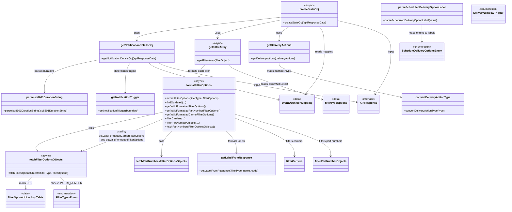

# Diagram: web/portal/src/pages/administration/notification-management/createUIStateFromApi.util.js

> Auto-generated by Obscura crawlers

## Mermaid

```mermaid
classDiagram
    class createStateObj {
        <<async>>
        +createStateObj(apiResponseData)
    }
    class getNotificationDetailsObj {
        +getNotificationDetailsObj(apiResponseData)
    }
    class parseIso8601DurationString {
        +parseIso8601DurationString(iso8601DurationString)
    }
    class getNotificationTrigger {
        +getNotificationTrigger(boundary)
    }
    class getDeliveryActions {
        +getDeliveryActions(deliveryActions)
    }
    class convertDeliveryActionType {
        +convertDeliveryActionType(type)
    }
    class formatFilterOptions {
        <<async>>
        +formatFilterOptions(filterType, filterOptions)
        +findOutdated(...)
        +getValidFormattedFilterOptions()
        +getValidFormattedPartNumberFilterOptions()
        +getValidFormattedCarrierFilterOptions()
        +filterCarriers(...)
        +filterPartNumberObjects(...)
        +fetchPartNumbersFilterOptionsObjects()
    }
    class fetchFilterOptionsObjects {
        <<async>>
        +fetchFilterOptionsObjects(filterType, filterOptions)
    }
    class getFilterArray {
        <<async>>
        +getFilterArray(filterObject)
    }
    class parseScheduledDeliveryOptionLabel {
        +parseScheduledDeliveryOptionLabel(value)
    }
    class getLabelFromResponse {
        +getLabelFromResponse(filterType, name, code)
    }

    %% External constants / enums
    class DeliveryWindowTrigger <<enumeration>>
    class FilterTypesEnum <<enumeration>>
    class ScheduleDeliveryOptionsEnum <<enumeration>>
    class filterOptionUrlLookupTable <<data>>
    class filterTypeOptions <<data>>
    class eventDefinitionMapping <<data>>

    %% Relationships
    createStateObj --> getNotificationDetailsObj : uses
    createStateObj --> getFilterArray : uses
    createStateObj --> getDeliveryActions : uses

    getNotificationDetailsObj --> parseIso8601DurationString : parses durations
    getNotificationDetailsObj --> getNotificationTrigger : determines trigger

    getDeliveryActions --> convertDeliveryActionType : maps method->type

    formatFilterOptions --> fetchFilterOptionsObjects : calls
    formatFilterOptions --> fetchFilterOptionsObjects : used by getValidFormattedCarrierFilterOptions and getValidFormattedFilterOptions
    formatFilterOptions --> fetchPartNumbersFilterOptionsObjects : calls
    formatFilterOptions --> getLabelFromResponse : formats labels
    formatFilterOptions --> filterCarriers : filters carriers
    formatFilterOptions --> filterPartNumberObjects : filters part numbers

    fetchFilterOptionsObjects --> filterOptionUrlLookupTable : reads URL
    fetchFilterOptionsObjects --> FilterTypesEnum : checks PARTS_NUMBER

    getFilterArray --> formatFilterOptions : formats each filter
    getFilterArray --> filterTypeOptions : reads allowMultiSelect

    parseScheduledDeliveryOptionLabel --> ScheduleDeliveryOptionsEnum : maps enums to labels

    getNotificationDetailsObj --> eventDefinitionMapping : reads mapping
    createStateObj --> eventDefinitionMapping : reads mapping

    %% Notes as classes to keep syntactic validity
    class APIResponse <<interface>>
    createStateObj --> APIResponse : input
    getNotificationDetailsObj --> APIResponse : input
```

> SVG rendering failed for this diagram.
