# Diagram: web/portal/src/pages/administration/notification-management/hooks/useFilterOptionListLoadOptions.ts

> Auto-generated by Obscura crawlers

## Mermaid

```mermaid
classDiagram
    class useFilterOptionListLoadOptions {
        +getFilterOptionListLoadOptions(query, filterType, loadedOptions, eventType)
    }
    class useHardCodedScheduledDeliveryOptions {
        +getScheduledDeliveryOptions(query)
    }
    class useHardCodedModeOptions {
        +getModeOptions(query, eventType)
        +getEventTypeModes(eventType)
    }
    class getUserQueriedFilterOptions {
        +(availableOptions, userQuery)
    }
    class debouncePromise <<external>> {
    }
    class axios <<external>> {
        +get(url, config)
    }
    class filterOptionUrlLookupTable <<external>>
    class useTranslateModeOptionType <<external>>
    class useTranslateScheduledDeliveryOptionType <<external>>

    %% Enums and types
    class FilterTypesEnum <<enum>> {
        SCHEDULED_DELIVERY
        MODE
        ORIGIN
        DESTINATION
        PARTS_NUMBER
        CARRIER
    }
    class ScheduleDeliveryOptionsEnum <<enum>> {
        TODAY
        TOMORROW
        THIS_WEEK
        THIS_MONTH
    }
    class ModeOptionsEnum <<enum>> {
        LTL
        OCEAN
        PARCEL
        RAIL
        TRUCK
        AIR
        INTERMODAL
    }
    class NotificationEventTypes <<enum>> {
        CARRIER_DELAY_CLEARED
        CARRIER_DELAY
        EXCESSIVE_DWELL
    }

    class LoadedOptionsType <<interface>> {
        +value: string
        +label: string
    }
    class RequestParamsType <<interface>> {
        +verbose: boolean
        +pageNumber: number
        +pageSize: number
        +query?: string
        +everything?: string
        +everythingRestrict?: string
    }
    class APIResponseType <<interface>> {
        +data: LocationAPIResponseType | CarrierAPIResponseType[] | PartsNumberAPIResponseType
    }
    class LocationAPIResponseType <<interface>> {
        +data: LocationAPIResponseDataType[]
        +meta: APIResponseMetaType
    }
    class LocationAPIResponseDataType <<interface>> {
        +code: string
        +name: string
    }
    class CarrierAPIResponseType <<interface>> {
        +fv_id: string
        +id: number
        +name: string
        +scac: string
    }
    class PartsNumberAPIResponseDataType <<interface>> {
        +id: string
        +label: string
        +value: string
    }
    class PartsNumberAPIResponseType <<interface>> {
        +data: PartsNumberAPIResponseDataType[]
        +meta: APIResponseMetaType
    }
    class APIResponseMetaType <<interface>> {
        +currentPage: number
        +totalCount: number
        +totalPages: number
    }

    %% relationships
    useFilterOptionListLoadOptions ..> debouncePromise : wraps
    useFilterOptionListLoadOptions ..> axios : requests
    useFilterOptionListLoadOptions --> FilterTypesEnum : checks
    useFilterOptionListLoadOptions --> filterOptionUrlLookupTable : reads
    useFilterOptionListLoadOptions --> getUserQueriedFilterOptions : uses
    useFilterOptionListLoadOptions --> RequestParamsType : constructs
    useFilterOptionListLoadOptions --> APIResponseType : parses
    useFilterOptionListLoadOptions --> LocationAPIResponseType : parses ORIGIN/DESTINATION
    useFilterOptionListLoadOptions --> CarrierAPIResponseType : parses CARRIER
    useFilterOptionListLoadOptions --> PartsNumberAPIResponseType : parses PARTS_NUMBER

    useHardCodedScheduledDeliveryOptions --> ScheduleDeliveryOptionsEnum : lists
    useHardCodedScheduledDeliveryOptions --> useTranslateScheduledDeliveryOptionType : translates
    useHardCodedScheduledDeliveryOptions --> getUserQueriedFilterOptions : filters

    useHardCodedModeOptions --> ModeOptionsEnum : lists
    useHardCodedModeOptions --> NotificationEventTypes : filters by event
    useHardCodedModeOptions --> useTranslateModeOptionType : translates
    useHardCodedModeOptions --> getUserQueriedFilterOptions : filters

    getUserQueriedFilterOptions --> LoadedOptionsType : input
    getUserQueriedFilterOptions --> LoadedOptionsType : output

    %% utility arrows
    debouncePromise ..> useFilterOptionListLoadOptions : debounce
    axios ..> useFilterOptionListLoadOptions : http client
    useTranslateModeOptionType ..> useHardCodedModeOptions : provided to
    useTranslateScheduledDeliveryOptionType ..> useHardCodedScheduledDeliveryOptions : provided to
```

> SVG rendering failed for this diagram.
