# Diagram: web/portal/src/pages/administration/notification-management/notificationmanagement.const.ts

> Auto-generated by Obscura crawlers

## Mermaid

```mermaid
classDiagram
    class Products {
        +SHIPMENTS: "Shipments"
    }
    class NotificationEventTypes {
        +ETA_CHANGE = "BEHIND_SCHEDULE"
        +EARLY_ARRIVAL = "EARLY_ARRIVAL"
        +CARRIER_DELAY = "CARRIER_DELAY"
        +EXCESSIVE_DWELL = "EXCESSIVE_DWELL"
        +CARRIER_DELAY_CLEARED = "CARRIER_DELAY_CLEARED"
        +OFF_ROUTE_RAIL = "OFF_ROUTE_RAIL"
    }
    class EventDefinitionMapping {
        +behindScheduleV1
        +earlyArrivalV1
        +carrierDelayV1
        +excessiveDwellV1
        +carrierDelayClearedV1
        +offRouteRailV1
    }
    class DeliveryWindowTrigger {
        +AFTER_DELIVERY_WINDOW_OPEN: "After Delivery Window Open"
        +AFTER_DELIVERY_WINDOW_CLOSE: "After Delivery Window Close"
    }
    class ApiOptions {
        +pageSize: 20
        +pageNumber: 0
        +verbose: false
    }
    class ApiRequestStatus {
        +IN_PROGRESS: "IN_PROGRESS"
        +SUCCESS: "SUCCESS"
        +FAILED: "FAILED"
    }
    class FilterTypesEnum {
        +ORIGIN = "originCodes"
        +DESTINATION = "destinationCodes"
        +PARTS_NUMBER = "partNumbers"
        +SCHEDULED_DELIVERY = "scheduledArrival"
        +CARRIER = "carrierFvIds"
        +MILES_OUT = "withinRangeOfDestination"
        +MODE = "mode"
    }
    class ScheduleDeliveryOptionsEnum {
        +TODAY
        +TOMORROW
        +THIS_WEEK
        +THIS_MONTH
    }
    class ModeOptionsEnum {
        +TRUCK
        +OCEAN
        +LTL
        +PARCEL
        +RAIL
        +AIR
        +INTERMODAL
        +MULTIMODAL
    }
    class DefaultNotificationEventInformation {
        +ETA_CHANGE: object
        +EARLY_ARRIVAL: object
        +CARRIER_DELAY: object
        +EXCESSIVE_DWELL: object
        +CARRIER_DELAY_CLEARED: object
        +OFF_ROUTE_RAIL: object
    }
    class EventTypeSupportedFilters {
        +ETA_CHANGE: FilterTypesEnum[]
        +EARLY_ARRIVAL: FilterTypesEnum[]
        +CARRIER_DELAY: FilterTypesEnum[]
        +EXCESSIVE_DWELL: FilterTypesEnum[]
        +CARRIER_DELAY_CLEARED: FilterTypesEnum[]
        +OFF_ROUTE_RAIL: FilterTypesEnum[]
    }
    class FilterTypeOptions {
        +key
        +label
        +value
        +allowMultiSelect
    }
    class FilterOptionUrlLookupTable {
        +originCodes: "/location/locations"
        +destinationCodes: "/location/locations"
        +partNumbers: "/partview/app/list/parts"
        +carrierFvIds: "/shipping-ng/carriers"
    }

    NotificationEventTypes --> EventDefinitionMapping : maps to
    NotificationEventTypes --> DefaultNotificationEventInformation : default info for
    NotificationEventTypes --> EventTypeSupportedFilters : supported filters for
    FilterTypesEnum <-- EventTypeSupportedFilters : uses
    FilterTypesEnum --> FilterOptionUrlLookupTable : url lookup for
    FilterTypeOptions --> FilterTypesEnum : option value
    ApiOptions -- ApiRequestStatus : uses
    Products --> NotificationEventTypes : relates to
    DeliveryWindowTrigger <-- DefaultNotificationEventInformation : uses trigger
    ScheduleDeliveryOptionsEnum <-- DefaultNotificationEventInformation : possible schedule
    ModeOptionsEnum <-- EventTypeSupportedFilters : mode filter option
```

### SVG

<svg id="container" width="2887.056640625" xmlns="http://www.w3.org/2000/svg" class="classDiagram" height="884" viewBox="0 0 2887.056640625 884" role="graphics-document document" aria-roledescription="class"><g><defs><marker id="container_class-aggregationStart" class="marker aggregation class" refX="18" refY="7" markerWidth="190" markerHeight="240" orient="auto"><path d="M 18,7 L9,13 L1,7 L9,1 Z"></path></marker></defs><defs><marker id="container_class-aggregationEnd" class="marker aggregation class" refX="1" refY="7" markerWidth="20" markerHeight="28" orient="auto"><path d="M 18,7 L9,13 L1,7 L9,1 Z"></path></marker></defs><defs><marker id="container_class-extensionStart" class="marker extension class" refX="18" refY="7" markerWidth="190" markerHeight="240" orient="auto"><path d="M 1,7 L18,13 V 1 Z"></path></marker></defs><defs><marker id="container_class-extensionEnd" class="marker extension class" refX="1" refY="7" markerWidth="20" markerHeight="28" orient="auto"><path d="M 1,1 V 13 L18,7 Z"></path></marker></defs><defs><marker id="container_class-compositionStart" class="marker composition class" refX="18" refY="7" markerWidth="190" markerHeight="240" orient="auto"><path d="M 18,7 L9,13 L1,7 L9,1 Z"></path></marker></defs><defs><marker id="container_class-compositionEnd" class="marker composition class" refX="1" refY="7" markerWidth="20" markerHeight="28" orient="auto"><path d="M 18,7 L9,13 L1,7 L9,1 Z"></path></marker></defs><defs><marker id="container_class-dependencyStart" class="marker dependency class" refX="6" refY="7" markerWidth="190" markerHeight="240" orient="auto"><path d="M 5,7 L9,13 L1,7 L9,1 Z"></path></marker></defs><defs><marker id="container_class-dependencyEnd" class="marker dependency class" refX="13" refY="7" markerWidth="20" markerHeight="28" orient="auto"><path d="M 18,7 L9,13 L14,7 L9,1 Z"></path></marker></defs><defs><marker id="container_class-lollipopStart" class="marker lollipop class" refX="13" refY="7" markerWidth="190" markerHeight="240" orient="auto"><circle stroke="black" fill="transparent" cx="7" cy="7" r="6"></circle></marker></defs><defs><marker id="container_class-lollipopEnd" class="marker lollipop class" refX="1" refY="7" markerWidth="190" markerHeight="240" orient="auto"><circle stroke="black" fill="transparent" cx="7" cy="7" r="6"></circle></marker></defs><g class="root"><g class="clusters"></g><g class="edgePaths"><path d="M246.963,538L230.278,548.167C213.594,558.333,180.224,578.667,163.54,594C146.855,609.333,146.855,619.667,146.855,624.833L146.855,630" id="id_NotificationEventTypes_EventDefinitionMapping_1" class="edge-thickness-normal edge-pattern-solid relation" style=";;;" data-edge="true" data-et="edge" data-id="id_NotificationEventTypes_EventDefinitionMapping_1" data-points="W3sieCI6MjQ2Ljk2MjU1NjExMTg3ODQ2LCJ5Ijo1Mzh9LHsieCI6MTQ2Ljg1NTQ2ODc1LCJ5Ijo1OTl9LHsieCI6MTQ2Ljg1NTQ2ODc1LCJ5Ijo2MzZ9XQ==" marker-end="url(#container_class-dependencyEnd)"></path><path d="M410.512,538L407.684,548.167C404.856,558.333,399.199,578.667,440.588,603.555C481.976,628.444,570.409,657.888,614.626,672.609L658.842,687.331" id="id_NotificationEventTypes_DefaultNotificationEventInformation_2" class="edge-thickness-normal edge-pattern-solid relation" style=";;;" data-edge="true" data-et="edge" data-id="id_NotificationEventTypes_DefaultNotificationEventInformation_2" data-points="W3sieCI6NDEwLjUxMjI3OTg2ODc4NDUsInkiOjUzOH0seyJ4IjozOTMuNTQyOTY4NzUsInkiOjU5OX0seyJ4Ijo2NjQuNTM1MTU2MjUsInkiOjY4OS4yMjY3MTU4MTgyNDk3fV0=" marker-end="url(#container_class-dependencyEnd)"></path><path d="M699.047,451.156L888.672,475.796C1078.298,500.437,1457.548,549.719,1664.94,582.628C1872.332,615.537,1907.865,632.074,1925.632,640.343L1943.398,648.611" id="id_NotificationEventTypes_EventTypeSupportedFilters_3" class="edge-thickness-normal edge-pattern-solid relation" style=";;;" data-edge="true" data-et="edge" data-id="id_NotificationEventTypes_EventTypeSupportedFilters_3" data-points="W3sieCI6Njk5LjA0Njg3NSwieSI6NDUxLjE1NTU5NzQ5Njc5OTV9LHsieCI6MTgzNi43OTg4MjgxMjUsInkiOjU5OX0seyJ4IjoxOTQ4LjgzNzg5MDYyNSwieSI6NjUxLjE0MzA1MjMzOTA0NTl9XQ==" marker-end="url(#container_class-dependencyEnd)"></path><path d="M2061.612,553.565L2051.36,561.137C2041.107,568.71,2020.602,583.855,2017.186,597.594C2013.77,611.333,2027.442,623.667,2034.278,629.833L2041.115,636" id="id_FilterTypesEnum_EventTypeSupportedFilters_4" class="edge-thickness-normal edge-pattern-solid relation" style=";;;" data-edge="true" data-et="edge" data-id="id_FilterTypesEnum_EventTypeSupportedFilters_4" data-points="W3sieCI6MjA2Ni40Mzg0MjgwMDQxNDM2LCJ5Ijo1NTB9LHsieCI6MjAwMC4wOTc2NTYyNSwieSI6NTk5fSx7IngiOjIwNDEuMTE0NjEyMzYwNjY4OCwieSI6NjM2fV0=" marker-start="url(#container_class-dependencyStart)"></path><path d="M2446.063,504.769L2482.427,520.474C2518.792,536.179,2591.522,567.59,2627.887,592.461C2664.252,617.333,2664.252,635.667,2664.252,644.833L2664.252,654" id="id_FilterTypesEnum_FilterOptionUrlLookupTable_5" class="edge-thickness-normal edge-pattern-solid relation" style=";;;" data-edge="true" data-et="edge" data-id="id_FilterTypesEnum_FilterOptionUrlLookupTable_5" data-points="W3sieCI6MjQ0Ni4wNjI1LCJ5Ijo1MDQuNzY4NzIzODczMjU4OH0seyJ4IjoyNjY0LjI1MTk1MzEyNSwieSI6NTk5fSx7IngiOjI2NjQuMjUxOTUzMTI1LCJ5Ijo2NjB9XQ==" marker-end="url(#container_class-dependencyEnd)"></path><path d="M2245.152,200L2245.152,206.167C2245.152,212.333,2245.152,224.667,2245.152,238C2245.152,251.333,2245.152,265.667,2245.152,272.833L2245.152,280" id="id_FilterTypeOptions_FilterTypesEnum_6" class="edge-thickness-normal edge-pattern-solid relation" style=";;;" data-edge="true" data-et="edge" data-id="id_FilterTypeOptions_FilterTypesEnum_6" data-points="W3sieCI6MjI0NS4xNTIzNDM3NSwieSI6MjAwfSx7IngiOjIyNDUuMTUyMzQzNzUsInkiOjIzN30seyJ4IjoyMjQ1LjE1MjM0Mzc1LCJ5IjoyODZ9XQ==" marker-end="url(#container_class-dependencyEnd)"></path><path d="M1536.973,188L1536.973,196.167C1536.973,204.333,1536.973,220.667,1536.973,245C1536.973,269.333,1536.973,301.667,1536.973,317.833L1536.973,334" id="id_ApiOptions_ApiRequestStatus_7" class="edge-thickness-normal edge-pattern-solid relation" style=";;;" data-edge="true" data-et="edge" data-id="id_ApiOptions_ApiRequestStatus_7" data-points="W3sieCI6MTUzNi45NzI2NTYyNSwieSI6MTg4fSx7IngiOjE1MzYuOTcyNjU2MjUsInkiOjIzN30seyJ4IjoxNTM2Ljk3MjY1NjI1LCJ5IjozMzR9XQ=="></path><path d="M443.895,164L443.895,176.167C443.895,188.333,443.895,212.667,443.895,234C443.895,255.333,443.895,273.667,443.895,282.833L443.895,292" id="id_Products_NotificationEventTypes_8" class="edge-thickness-normal edge-pattern-solid relation" style=";;;" data-edge="true" data-et="edge" data-id="id_Products_NotificationEventTypes_8" data-points="W3sieCI6NDQzLjg5NDUzMTI1LCJ5IjoxNjR9LHsieCI6NDQzLjg5NDUzMTI1LCJ5IjoyMzd9LHsieCI6NDQzLjg5NDUzMTI1LCJ5IjoyOTh9XQ==" marker-end="url(#container_class-dependencyEnd)"></path><path d="M936.584,493.565L912.793,511.137C889.001,528.71,841.419,563.855,820.426,587.594C799.433,611.333,805.03,623.667,807.829,629.833L810.627,636" id="id_DeliveryWindowTrigger_DefaultNotificationEventInformation_9" class="edge-thickness-normal edge-pattern-solid relation" style=";;;" data-edge="true" data-et="edge" data-id="id_DeliveryWindowTrigger_DefaultNotificationEventInformation_9" data-points="W3sieCI6OTQxLjQxMDMwNzMyMDQ0MiwieSI6NDkwfSx7IngiOjc5My44MzU5Mzc1LCJ5Ijo1OTl9LHsieCI6ODEwLjYyNzMzODc3Mzg4NTMsInkiOjYzNn1d" marker-start="url(#container_class-dependencyStart)"></path><path d="M1740.385,513.533L1721.099,527.778C1701.814,542.022,1663.243,570.511,1550.785,604.014C1438.327,637.516,1251.982,676.032,1158.809,695.29L1065.637,714.548" id="id_ScheduleDeliveryOptionsEnum_DefaultNotificationEventInformation_10" class="edge-thickness-normal edge-pattern-solid relation" style=";;;" data-edge="true" data-et="edge" data-id="id_ScheduleDeliveryOptionsEnum_DefaultNotificationEventInformation_10" data-points="W3sieCI6MTc0NS4yMTA5Mzc1LCJ5Ijo1MDkuOTY4NTY1NjkwMDU2NDR9LHsieCI6MTYyNC42NzE4NzUsInkiOjU5OX0seyJ4IjoxMDY1LjYzNjcxODc1LCJ5Ijo3MTQuNTQ3ODQ2NzkxNTI5MX1d" marker-start="url(#container_class-dependencyStart)"></path><path d="M2494.348,493.343L2470.506,510.952C2446.665,528.562,2398.982,563.781,2368.182,587.557C2337.382,611.333,2323.465,623.667,2316.507,629.833L2309.549,636" id="id_ModeOptionsEnum_EventTypeSupportedFilters_11" class="edge-thickness-normal edge-pattern-solid relation" style=";;;" data-edge="true" data-et="edge" data-id="id_ModeOptionsEnum_EventTypeSupportedFilters_11" data-points="W3sieCI6MjQ5OS4xNzM4MjgxMjUsInkiOjQ4OS43Nzc5NTEzNTAxNDUwM30seyJ4IjoyMzUxLjI5ODgyODEyNSwieSI6NTk5fSx7IngiOjIzMDkuNTQ4NjI5MDgwNDE0LCJ5Ijo2MzZ9XQ==" marker-start="url(#container_class-dependencyStart)"></path></g><g class="edgeLabels"><g class="edgeLabel" transform="translate(146.85546875, 599)"><g class="label" data-id="id_NotificationEventTypes_EventDefinitionMapping_1" transform="translate(-29.2578125, -12)"><foreignObject width="58.515625" height="24">

maps to

</foreignObject></g></g><g class="edgeLabel" transform="translate(499.00203, 634.11254)"><g class="label" data-id="id_NotificationEventTypes_DefaultNotificationEventInformation_2" transform="translate(-54.7109375, -12)"><foreignObject width="109.421875" height="24">

default info for

</foreignObject></g></g><g class="edgeLabel" transform="translate(1329.19695, 533.04002)"><g class="label" data-id="id_NotificationEventTypes_EventTypeSupportedFilters_3" transform="translate(-72.9453125, -12)"><foreignObject width="145.890625" height="24">

supported filters for

</foreignObject></g></g><g class="edgeLabel" transform="translate(2011.05142, 590.90943)"><g class="label" data-id="id_FilterTypesEnum_EventTypeSupportedFilters_4" transform="translate(-16.4921875, -12)"><foreignObject width="32.984375" height="24">

uses

</foreignObject></g></g><g class="edgeLabel" transform="translate(2664.251953125, 599)"><g class="label" data-id="id_FilterTypesEnum_FilterOptionUrlLookupTable_5" transform="translate(-49.7890625, -12)"><foreignObject width="99.578125" height="24">

url lookup for

</foreignObject></g></g><g class="edgeLabel" transform="translate(2245.15234375, 237)"><g class="label" data-id="id_FilterTypeOptions_FilterTypesEnum_6" transform="translate(-45.4921875, -12)"><foreignObject width="90.984375" height="24">

option value

</foreignObject></g></g><g class="edgeLabel" transform="translate(1536.97265625, 237)"><g class="label" data-id="id_ApiOptions_ApiRequestStatus_7" transform="translate(-16.4921875, -12)"><foreignObject width="32.984375" height="24">

uses

</foreignObject></g></g><g class="edgeLabel" transform="translate(443.89453125, 237)"><g class="label" data-id="id_Products_NotificationEventTypes_8" transform="translate(-34.2890625, -12)"><foreignObject width="68.578125" height="24">

relates to

</foreignObject></g></g><g class="edgeLabel" transform="translate(851.28146, 556.57012)"><g class="label" data-id="id_DeliveryWindowTrigger_DefaultNotificationEventInformation_9" transform="translate(-42.484375, -12)"><foreignObject width="84.96875" height="24">

uses trigger

</foreignObject></g></g><g class="edgeLabel" transform="translate(1418.53039, 641.6077)"><g class="label" data-id="id_ScheduleDeliveryOptionsEnum_DefaultNotificationEventInformation_10" transform="translate(-65.3203125, -12)"><foreignObject width="130.640625" height="24">

possible schedule

</foreignObject></g></g><g class="edgeLabel" transform="translate(2402.79986, 560.96079)"><g class="label" data-id="id_ModeOptionsEnum_EventTypeSupportedFilters_11" transform="translate(-66.0078125, -12)"><foreignObject width="132.015625" height="24">

mode filter option

</foreignObject></g></g></g><g class="nodes"><g class="node default" id="classId-Products-0" transform="translate(443.89453125, 104)"><g class="basic label-container"><path d="M-121.66015625 -60 L121.66015625 -60 L121.66015625 60 L-121.66015625 60" stroke="none" stroke-width="0" fill="#ECECFF" style=""></path><path d="M-121.66015625 -60 C-34.50464973460616 -60, 52.65085678078768 -60, 121.66015625 -60 M-121.66015625 -60 C-63.74608415711332 -60, -5.832012064226646 -60, 121.66015625 -60 M121.66015625 -60 C121.66015625 -19.922676154860014, 121.66015625 20.154647690279972, 121.66015625 60 M121.66015625 -60 C121.66015625 -19.850076247133742, 121.66015625 20.299847505732515, 121.66015625 60 M121.66015625 60 C29.114004436229237 60, -63.432147377541526 60, -121.66015625 60 M121.66015625 60 C35.27300902747733 60, -51.11413819504534 60, -121.66015625 60 M-121.66015625 60 C-121.66015625 35.45623915903835, -121.66015625 10.912478318076694, -121.66015625 -60 M-121.66015625 60 C-121.66015625 28.35539886747942, -121.66015625 -3.289202265041162, -121.66015625 -60" stroke="#9370DB" stroke-width="1.3" fill="none" stroke-dasharray="0 0" style=""></path></g><g class="annotation-group text" transform="translate(0, -36)"></g><g class="label-group text" transform="translate(-32.4453125, -36)"><g class="label" style="font-weight: bolder" transform="translate(0,-12)"><foreignObject width="64.890625" height="24">

Products

</foreignObject></g></g><g class="members-group text" transform="translate(-109.66015625, 12)"><g class="label" style="" transform="translate(0,-12)"><foreignObject width="186.875" height="24">

+SHIPMENTS: "Shipments"

</foreignObject></g></g><g class="methods-group text" transform="translate(-109.66015625, 60)"></g><g class="divider" style=""><path d="M-121.66015625 -12 C-28.864809907304235 -12, 63.93053643539153 -12, 121.66015625 -12 M-121.66015625 -12 C-28.542380050466335 -12, 64.57539614906733 -12, 121.66015625 -12" stroke="#9370DB" stroke-width="1.3" fill="none" stroke-dasharray="0 0" style=""></path></g><g class="divider" style=""><path d="M-121.66015625 36 C-66.62569101398577 36, -11.591225777971545 36, 121.66015625 36 M-121.66015625 36 C-26.16379470046944 36, 69.33256684906112 36, 121.66015625 36" stroke="#9370DB" stroke-width="1.3" fill="none" stroke-dasharray="0 0" style=""></path></g></g><g class="node default" id="classId-NotificationEventTypes-1" transform="translate(443.89453125, 418)"><g class="basic label-container"><path d="M-255.15234375 -120 L255.15234375 -120 L255.15234375 120 L-255.15234375 120" stroke="none" stroke-width="0" fill="#ECECFF" style=""></path><path d="M-255.15234375 -120 C-60.920057115177485 -120, 133.31222951964503 -120, 255.15234375 -120 M-255.15234375 -120 C-126.45472363172459 -120, 2.242896486550819 -120, 255.15234375 -120 M255.15234375 -120 C255.15234375 -37.067077488365186, 255.15234375 45.86584502326963, 255.15234375 120 M255.15234375 -120 C255.15234375 -55.22705852738723, 255.15234375 9.545882945225543, 255.15234375 120 M255.15234375 120 C127.78004982776991 120, 0.40775590553982966 120, -255.15234375 120 M255.15234375 120 C144.66717813322452 120, 34.18201251644908 120, -255.15234375 120 M-255.15234375 120 C-255.15234375 57.84449523549536, -255.15234375 -4.311009529009283, -255.15234375 -120 M-255.15234375 120 C-255.15234375 47.963797065302515, -255.15234375 -24.07240586939497, -255.15234375 -120" stroke="#9370DB" stroke-width="1.3" fill="none" stroke-dasharray="0 0" style=""></path></g><g class="annotation-group text" transform="translate(0, -96)"></g><g class="label-group text" transform="translate(-84.2890625, -96)"><g class="label" style="font-weight: bolder" transform="translate(0,-12)"><foreignObject width="168.578125" height="24">

NotificationEventTypes

</foreignObject></g></g><g class="members-group text" transform="translate(-243.15234375, -48)"><g class="label" style="" transform="translate(0,-12)"><foreignObject width="265.734375" height="24">

+ETA_CHANGE = "BEHIND_SCHEDULE"

</foreignObject></g><g class="label" style="" transform="translate(0,12)"><foreignObject width="253.296875" height="24">

+EARLY_ARRIVAL = "EARLY_ARRIVAL"

</foreignObject></g><g class="label" style="" transform="translate(0,36)"><foreignObject width="262.96875" height="24">

+CARRIER_DELAY = "CARRIER_DELAY"

</foreignObject></g><g class="label" style="" transform="translate(0,60)"><foreignObject width="295.828125" height="24">

+EXCESSIVE_DWELL = "EXCESSIVE_DWELL"

</foreignObject></g><g class="label" style="" transform="translate(0,84)"><foreignObject width="402.015625" height="24">

+CARRIER_DELAY_CLEARED = "CARRIER_DELAY_CLEARED"

</foreignObject></g><g class="label" style="" transform="translate(0,108)"><foreignObject width="278.421875" height="24">

+OFF_ROUTE_RAIL = "OFF_ROUTE_RAIL"

</foreignObject></g></g><g class="methods-group text" transform="translate(-243.15234375, 120)"></g><g class="divider" style=""><path d="M-255.15234375 -72 C-131.76026011611452 -72, -8.368176482229075 -72, 255.15234375 -72 M-255.15234375 -72 C-55.90861196180268 -72, 143.33511982639465 -72, 255.15234375 -72" stroke="#9370DB" stroke-width="1.3" fill="none" stroke-dasharray="0 0" style=""></path></g><g class="divider" style=""><path d="M-255.15234375 96 C-75.75924050181993 96, 103.63386274636014 96, 255.15234375 96 M-255.15234375 96 C-70.38715101321151 96, 114.37804172357698 96, 255.15234375 96" stroke="#9370DB" stroke-width="1.3" fill="none" stroke-dasharray="0 0" style=""></path></g></g><g class="node default" id="classId-EventDefinitionMapping-2" transform="translate(146.85546875, 756)"><g class="basic label-container"><path d="M-138.85546875 -120 L138.85546875 -120 L138.85546875 120 L-138.85546875 120" stroke="none" stroke-width="0" fill="#ECECFF" style=""></path><path d="M-138.85546875 -120 C-31.096380912505936 -120, 76.66270692498813 -120, 138.85546875 -120 M-138.85546875 -120 C-33.16035582156755 -120, 72.5347571068649 -120, 138.85546875 -120 M138.85546875 -120 C138.85546875 -67.81008569196166, 138.85546875 -15.62017138392332, 138.85546875 120 M138.85546875 -120 C138.85546875 -64.05349704033003, 138.85546875 -8.106994080660044, 138.85546875 120 M138.85546875 120 C41.19761704461611 120, -56.46023466076778 120, -138.85546875 120 M138.85546875 120 C52.26711963783413 120, -34.321229474331744 120, -138.85546875 120 M-138.85546875 120 C-138.85546875 66.2963957486325, -138.85546875 12.592791497265026, -138.85546875 -120 M-138.85546875 120 C-138.85546875 28.333391949181433, -138.85546875 -63.333216101637134, -138.85546875 -120" stroke="#9370DB" stroke-width="1.3" fill="none" stroke-dasharray="0 0" style=""></path></g><g class="annotation-group text" transform="translate(0, -96)"></g><g class="label-group text" transform="translate(-87.6328125, -96)"><g class="label" style="font-weight: bolder" transform="translate(0,-12)"><foreignObject width="175.265625" height="24">

EventDefinitionMapping

</foreignObject></g></g><g class="members-group text" transform="translate(-126.85546875, -48)"><g class="label" style="" transform="translate(0,-12)"><foreignObject width="141.21875" height="24">

+behindScheduleV1

</foreignObject></g><g class="label" style="" transform="translate(0,12)"><foreignObject width="106.21875" height="24">

+earlyArrivalV1

</foreignObject></g><g class="label" style="" transform="translate(0,36)"><foreignObject width="111.421875" height="24">

+carrierDelayV1

</foreignObject></g><g class="label" style="" transform="translate(0,60)"><foreignObject width="131.4375" height="24">

+excessiveDwellV1

</foreignObject></g><g class="label" style="" transform="translate(0,84)"><foreignObject width="166.078125" height="24">

+carrierDelayClearedV1

</foreignObject></g><g class="label" style="" transform="translate(0,108)"><foreignObject width="113.34375" height="24">

+offRouteRailV1

</foreignObject></g></g><g class="methods-group text" transform="translate(-126.85546875, 120)"></g><g class="divider" style=""><path d="M-138.85546875 -72 C-33.4219053623457 -72, 72.0116580253086 -72, 138.85546875 -72 M-138.85546875 -72 C-33.90260414815069 -72, 71.05026045369863 -72, 138.85546875 -72" stroke="#9370DB" stroke-width="1.3" fill="none" stroke-dasharray="0 0" style=""></path></g><g class="divider" style=""><path d="M-138.85546875 96 C-67.19802163281841 96, 4.45942548436318 96, 138.85546875 96 M-138.85546875 96 C-30.381878643741402 96, 78.0917114625172 96, 138.85546875 96" stroke="#9370DB" stroke-width="1.3" fill="none" stroke-dasharray="0 0" style=""></path></g></g><g class="node default" id="classId-DeliveryWindowTrigger-3" transform="translate(1038.890625, 418)"><g class="basic label-container"><path d="M-289.84375 -72 L289.84375 -72 L289.84375 72 L-289.84375 72" stroke="none" stroke-width="0" fill="#ECECFF" style=""></path><path d="M-289.84375 -72 C-101.0806445700384 -72, 87.6824608599232 -72, 289.84375 -72 M-289.84375 -72 C-133.5963777340897 -72, 22.650994531820572 -72, 289.84375 -72 M289.84375 -72 C289.84375 -24.054636175276116, 289.84375 23.89072764944777, 289.84375 72 M289.84375 -72 C289.84375 -42.93746712927512, 289.84375 -13.874934258550248, 289.84375 72 M289.84375 72 C74.22973198313076 72, -141.38428603373848 72, -289.84375 72 M289.84375 72 C61.604574995871985 72, -166.63460000825603 72, -289.84375 72 M-289.84375 72 C-289.84375 14.647280802773167, -289.84375 -42.705438394453665, -289.84375 -72 M-289.84375 72 C-289.84375 38.380510073185974, -289.84375 4.761020146371948, -289.84375 -72" stroke="#9370DB" stroke-width="1.3" fill="none" stroke-dasharray="0 0" style=""></path></g><g class="annotation-group text" transform="translate(0, -48)"></g><g class="label-group text" transform="translate(-84.984375, -48)"><g class="label" style="font-weight: bolder" transform="translate(0,-12)"><foreignObject width="169.96875" height="24">

DeliveryWindowTrigger

</foreignObject></g></g><g class="members-group text" transform="translate(-277.84375, 0)"><g class="label" style="" transform="translate(0,-12)"><foreignObject width="465.71875" height="24">

+AFTER_DELIVERY_WINDOW_OPEN: "After Delivery Window Open"

</foreignObject></g><g class="label" style="" transform="translate(0,12)"><foreignObject width="470.703125" height="24">

+AFTER_DELIVERY_WINDOW_CLOSE: "After Delivery Window Close"

</foreignObject></g></g><g class="methods-group text" transform="translate(-277.84375, 72)"></g><g class="divider" style=""><path d="M-289.84375 -24 C-109.31962414554019 -24, 71.20450170891962 -24, 289.84375 -24 M-289.84375 -24 C-59.24643949480773 -24, 171.35087101038454 -24, 289.84375 -24" stroke="#9370DB" stroke-width="1.3" fill="none" stroke-dasharray="0 0" style=""></path></g><g class="divider" style=""><path d="M-289.84375 48 C-169.74374578111622 48, -49.643741562232435 48, 289.84375 48 M-289.84375 48 C-86.86200744332314 48, 116.11973511335373 48, 289.84375 48" stroke="#9370DB" stroke-width="1.3" fill="none" stroke-dasharray="0 0" style=""></path></g></g><g class="node default" id="classId-ApiOptions-4" transform="translate(1536.97265625, 104)"><g class="basic label-container"><path d="M-91.37109375 -84 L91.37109375 -84 L91.37109375 84 L-91.37109375 84" stroke="none" stroke-width="0" fill="#ECECFF" style=""></path><path d="M-91.37109375 -84 C-26.867087950673536 -84, 37.63691784865293 -84, 91.37109375 -84 M-91.37109375 -84 C-44.09467122315906 -84, 3.181751303681878 -84, 91.37109375 -84 M91.37109375 -84 C91.37109375 -21.062948033971317, 91.37109375 41.874103932057366, 91.37109375 84 M91.37109375 -84 C91.37109375 -19.97645279639174, 91.37109375 44.04709440721652, 91.37109375 84 M91.37109375 84 C37.21224892781115 84, -16.946595894377694 84, -91.37109375 84 M91.37109375 84 C21.94930369612875 84, -47.4724863577425 84, -91.37109375 84 M-91.37109375 84 C-91.37109375 32.03717149075726, -91.37109375 -19.92565701848548, -91.37109375 -84 M-91.37109375 84 C-91.37109375 34.42198847156307, -91.37109375 -15.156023056873863, -91.37109375 -84" stroke="#9370DB" stroke-width="1.3" fill="none" stroke-dasharray="0 0" style=""></path></g><g class="annotation-group text" transform="translate(0, -60)"></g><g class="label-group text" transform="translate(-40.5546875, -60)"><g class="label" style="font-weight: bolder" transform="translate(0,-12)"><foreignObject width="81.109375" height="24">

ApiOptions

</foreignObject></g></g><g class="members-group text" transform="translate(-79.37109375, -12)"><g class="label" style="" transform="translate(0,-12)"><foreignObject width="96.421875" height="24">

+pageSize: 20

</foreignObject></g><g class="label" style="" transform="translate(0,12)"><foreignObject width="118.1875" height="24">

+pageNumber: 0

</foreignObject></g><g class="label" style="" transform="translate(0,36)"><foreignObject width="108.09375" height="24">

+verbose: false

</foreignObject></g></g><g class="methods-group text" transform="translate(-79.37109375, 84)"></g><g class="divider" style=""><path d="M-91.37109375 -36 C-39.73865381166831 -36, 11.893786126663386 -36, 91.37109375 -36 M-91.37109375 -36 C-36.77699771814519 -36, 17.81709831370962 -36, 91.37109375 -36" stroke="#9370DB" stroke-width="1.3" fill="none" stroke-dasharray="0 0" style=""></path></g><g class="divider" style=""><path d="M-91.37109375 60 C-38.511565800190844 60, 14.347962149618311 60, 91.37109375 60 M-91.37109375 60 C-48.57656594970678 60, -5.782038149413566 60, 91.37109375 60" stroke="#9370DB" stroke-width="1.3" fill="none" stroke-dasharray="0 0" style=""></path></g></g><g class="node default" id="classId-ApiRequestStatus-5" transform="translate(1536.97265625, 418)"><g class="basic label-container"><path d="M-158.23828125 -84 L158.23828125 -84 L158.23828125 84 L-158.23828125 84" stroke="none" stroke-width="0" fill="#ECECFF" style=""></path><path d="M-158.23828125 -84 C-90.3844004623628 -84, -22.53051967472561 -84, 158.23828125 -84 M-158.23828125 -84 C-68.53643065558383 -84, 21.165419938832343 -84, 158.23828125 -84 M158.23828125 -84 C158.23828125 -36.30450027093227, 158.23828125 11.390999458135454, 158.23828125 84 M158.23828125 -84 C158.23828125 -35.92943538474774, 158.23828125 12.141129230504518, 158.23828125 84 M158.23828125 84 C54.624266762098145 84, -48.98974772580371 84, -158.23828125 84 M158.23828125 84 C88.18708734383688 84, 18.135893437673758 84, -158.23828125 84 M-158.23828125 84 C-158.23828125 30.92194623333601, -158.23828125 -22.156107533327983, -158.23828125 -84 M-158.23828125 84 C-158.23828125 45.888950308656646, -158.23828125 7.777900617313293, -158.23828125 -84" stroke="#9370DB" stroke-width="1.3" fill="none" stroke-dasharray="0 0" style=""></path></g><g class="annotation-group text" transform="translate(0, -60)"></g><g class="label-group text" transform="translate(-65.2109375, -60)"><g class="label" style="font-weight: bolder" transform="translate(0,-12)"><foreignObject width="130.421875" height="24">

ApiRequestStatus

</foreignObject></g></g><g class="members-group text" transform="translate(-146.23828125, -12)"><g class="label" style="" transform="translate(0,-12)"><foreignObject width="227.265625" height="24">

+IN_PROGRESS: "IN_PROGRESS"

</foreignObject></g><g class="label" style="" transform="translate(0,12)"><foreignObject width="153.15625" height="24">

+SUCCESS: "SUCCESS"

</foreignObject></g><g class="label" style="" transform="translate(0,36)"><foreignObject width="124.390625" height="24">

+FAILED: "FAILED"

</foreignObject></g></g><g class="methods-group text" transform="translate(-146.23828125, 84)"></g><g class="divider" style=""><path d="M-158.23828125 -36 C-66.04886560417016 -36, 26.14055004165968 -36, 158.23828125 -36 M-158.23828125 -36 C-60.998873649649 -36, 36.240533950702 -36, 158.23828125 -36" stroke="#9370DB" stroke-width="1.3" fill="none" stroke-dasharray="0 0" style=""></path></g><g class="divider" style=""><path d="M-158.23828125 60 C-33.22795333700802 60, 91.78237457598397 60, 158.23828125 60 M-158.23828125 60 C-46.93662615430526 60, 64.36502894138948 60, 158.23828125 60" stroke="#9370DB" stroke-width="1.3" fill="none" stroke-dasharray="0 0" style=""></path></g></g><g class="node default" id="classId-FilterTypesEnum-6" transform="translate(2245.15234375, 418)"><g class="basic label-container"><path d="M-200.91015625 -132 L200.91015625 -132 L200.91015625 132 L-200.91015625 132" stroke="none" stroke-width="0" fill="#ECECFF" style=""></path><path d="M-200.91015625 -132 C-96.79460342295555 -132, 7.320949404088907 -132, 200.91015625 -132 M-200.91015625 -132 C-60.96932745896851 -132, 78.97150133206299 -132, 200.91015625 -132 M200.91015625 -132 C200.91015625 -40.33776364434337, 200.91015625 51.32447271131326, 200.91015625 132 M200.91015625 -132 C200.91015625 -48.64555379752473, 200.91015625 34.70889240495055, 200.91015625 132 M200.91015625 132 C64.70732836582803 132, -71.49549951834393 132, -200.91015625 132 M200.91015625 132 C107.00685160618858 132, 13.103546962377152 132, -200.91015625 132 M-200.91015625 132 C-200.91015625 77.71539118655585, -200.91015625 23.43078237311171, -200.91015625 -132 M-200.91015625 132 C-200.91015625 34.268329214076985, -200.91015625 -63.46334157184603, -200.91015625 -132" stroke="#9370DB" stroke-width="1.3" fill="none" stroke-dasharray="0 0" style=""></path></g><g class="annotation-group text" transform="translate(0, -108)"></g><g class="label-group text" transform="translate(-60.1484375, -108)"><g class="label" style="font-weight: bolder" transform="translate(0,-12)"><foreignObject width="120.296875" height="24">

FilterTypesEnum

</foreignObject></g></g><g class="members-group text" transform="translate(-188.91015625, -60)"><g class="label" style="" transform="translate(0,-12)"><foreignObject width="174.046875" height="24">

+ORIGIN = "originCodes"

</foreignObject></g><g class="label" style="" transform="translate(0,12)"><foreignObject width="258.078125" height="24">

+DESTINATION = "destinationCodes"

</foreignObject></g><g class="label" style="" transform="translate(0,36)"><foreignObject width="245.890625" height="24">

+PARTS_NUMBER = "partNumbers"

</foreignObject></g><g class="label" style="" transform="translate(0,60)"><foreignObject width="317.671875" height="24">

+SCHEDULED_DELIVERY = "scheduledArrival"

</foreignObject></g><g class="label" style="" transform="translate(0,84)"><foreignObject width="182.171875" height="24">

+CARRIER = "carrierFvIds"

</foreignObject></g><g class="label" style="" transform="translate(0,108)"><foreignObject width="306.1875" height="24">

+MILES_OUT = "withinRangeOfDestination"

</foreignObject></g><g class="label" style="" transform="translate(0,132)"><foreignObject width="120.640625" height="24">

+MODE = "mode"

</foreignObject></g></g><g class="methods-group text" transform="translate(-188.91015625, 132)"></g><g class="divider" style=""><path d="M-200.91015625 -84 C-104.48965256229434 -84, -8.069148874588677 -84, 200.91015625 -84 M-200.91015625 -84 C-104.42388879693115 -84, -7.937621343862304 -84, 200.91015625 -84" stroke="#9370DB" stroke-width="1.3" fill="none" stroke-dasharray="0 0" style=""></path></g><g class="divider" style=""><path d="M-200.91015625 108 C-102.20604105878522 108, -3.501925867570435 108, 200.91015625 108 M-200.91015625 108 C-67.17102655307895 108, 66.56810314384211 108, 200.91015625 108" stroke="#9370DB" stroke-width="1.3" fill="none" stroke-dasharray="0 0" style=""></path></g></g><g class="node default" id="classId-ScheduleDeliveryOptionsEnum-7" transform="translate(1869.7265625, 418)"><g class="basic label-container"><path d="M-124.515625 -96 L124.515625 -96 L124.515625 96 L-124.515625 96" stroke="none" stroke-width="0" fill="#ECECFF" style=""></path><path d="M-124.515625 -96 C-53.17609452515704 -96, 18.16343594968592 -96, 124.515625 -96 M-124.515625 -96 C-62.60310375475927 -96, -0.690582509518535 -96, 124.515625 -96 M124.515625 -96 C124.515625 -22.146403716998833, 124.515625 51.707192566002334, 124.515625 96 M124.515625 -96 C124.515625 -40.58564390459803, 124.515625 14.828712190803941, 124.515625 96 M124.515625 96 C72.25553284177123 96, 19.995440683542455 96, -124.515625 96 M124.515625 96 C63.412763235061064 96, 2.309901470122128 96, -124.515625 96 M-124.515625 96 C-124.515625 48.57402010599923, -124.515625 1.1480402119984632, -124.515625 -96 M-124.515625 96 C-124.515625 41.350604832575286, -124.515625 -13.298790334849429, -124.515625 -96" stroke="#9370DB" stroke-width="1.3" fill="none" stroke-dasharray="0 0" style=""></path></g><g class="annotation-group text" transform="translate(0, -72)"></g><g class="label-group text" transform="translate(-112.515625, -72)"><g class="label" style="font-weight: bolder" transform="translate(0,-12)"><foreignObject width="225.03125" height="24">

ScheduleDeliveryOptionsEnum

</foreignObject></g></g><g class="members-group text" transform="translate(-112.515625, -24)"><g class="label" style="" transform="translate(0,-12)"><foreignObject width="53.296875" height="24">

+TODAY

</foreignObject></g><g class="label" style="" transform="translate(0,12)"><foreignObject width="92.734375" height="24">

+TOMORROW

</foreignObject></g><g class="label" style="" transform="translate(0,36)"><foreignObject width="86.421875" height="24">

+THIS_WEEK

</foreignObject></g><g class="label" style="" transform="translate(0,60)"><foreignObject width="101.0625" height="24">

+THIS_MONTH

</foreignObject></g></g><g class="methods-group text" transform="translate(-112.515625, 96)"></g><g class="divider" style=""><path d="M-124.515625 -48 C-70.05809081519169 -48, -15.600556630383366 -48, 124.515625 -48 M-124.515625 -48 C-30.345918892403716 -48, 63.82378721519257 -48, 124.515625 -48" stroke="#9370DB" stroke-width="1.3" fill="none" stroke-dasharray="0 0" style=""></path></g><g class="divider" style=""><path d="M-124.515625 72 C-58.909147538426055 72, 6.69732992314789 72, 124.515625 72 M-124.515625 72 C-39.094778975509385 72, 46.32606704898123 72, 124.515625 72" stroke="#9370DB" stroke-width="1.3" fill="none" stroke-dasharray="0 0" style=""></path></g></g><g class="node default" id="classId-ModeOptionsEnum-8" transform="translate(2596.353515625, 418)"><g class="basic label-container"><path d="M-97.1796875 -144 L97.1796875 -144 L97.1796875 144 L-97.1796875 144" stroke="none" stroke-width="0" fill="#ECECFF" style=""></path><path d="M-97.1796875 -144 C-42.18726607757027 -144, 12.805155344859458 -144, 97.1796875 -144 M-97.1796875 -144 C-54.26201775959169 -144, -11.344348019183386 -144, 97.1796875 -144 M97.1796875 -144 C97.1796875 -56.988564153951415, 97.1796875 30.02287169209717, 97.1796875 144 M97.1796875 -144 C97.1796875 -37.988111617809494, 97.1796875 68.02377676438101, 97.1796875 144 M97.1796875 144 C54.84171518883781 144, 12.50374287767562 144, -97.1796875 144 M97.1796875 144 C44.66686026034478 144, -7.845966979310447 144, -97.1796875 144 M-97.1796875 144 C-97.1796875 55.136826807953796, -97.1796875 -33.72634638409241, -97.1796875 -144 M-97.1796875 144 C-97.1796875 59.78910833532882, -97.1796875 -24.42178332934236, -97.1796875 -144" stroke="#9370DB" stroke-width="1.3" fill="none" stroke-dasharray="0 0" style=""></path></g><g class="annotation-group text" transform="translate(0, -120)"></g><g class="label-group text" transform="translate(-69.0625, -120)"><g class="label" style="font-weight: bolder" transform="translate(0,-12)"><foreignObject width="138.125" height="24">

ModeOptionsEnum

</foreignObject></g></g><g class="members-group text" transform="translate(-85.1796875, -72)"><g class="label" style="" transform="translate(0,-12)"><foreignObject width="54.015625" height="24">

+TRUCK

</foreignObject></g><g class="label" style="" transform="translate(0,12)"><foreignObject width="56.6875" height="24">

+OCEAN

</foreignObject></g><g class="label" style="" transform="translate(0,36)"><foreignObject width="30.875" height="24">

+LTL

</foreignObject></g><g class="label" style="" transform="translate(0,60)"><foreignObject width="60.515625" height="24">

+PARCEL

</foreignObject></g><g class="label" style="" transform="translate(0,84)"><foreignObject width="39.53125" height="24">

+RAIL

</foreignObject></g><g class="label" style="" transform="translate(0,108)"><foreignObject width="31.40625" height="24">

+AIR

</foreignObject></g><g class="label" style="" transform="translate(0,132)"><foreignObject width="100.796875" height="24">

+INTERMODAL

</foreignObject></g><g class="label" style="" transform="translate(0,156)"><foreignObject width="101.296875" height="24">

+MULTIMODAL

</foreignObject></g></g><g class="methods-group text" transform="translate(-85.1796875, 144)"></g><g class="divider" style=""><path d="M-97.1796875 -96 C-29.31238056882036 -96, 38.55492636235928 -96, 97.1796875 -96 M-97.1796875 -96 C-20.83927727090689 -96, 55.50113295818622 -96, 97.1796875 -96" stroke="#9370DB" stroke-width="1.3" fill="none" stroke-dasharray="0 0" style=""></path></g><g class="divider" style=""><path d="M-97.1796875 120 C-49.401967719262075 120, -1.6242479385241495 120, 97.1796875 120 M-97.1796875 120 C-19.436045702212596 120, 58.30759609557481 120, 97.1796875 120" stroke="#9370DB" stroke-width="1.3" fill="none" stroke-dasharray="0 0" style=""></path></g></g><g class="node default" id="classId-DefaultNotificationEventInformation-9" transform="translate(865.0859375, 756)"><g class="basic label-container"><path d="M-200.55078125 -120 L200.55078125 -120 L200.55078125 120 L-200.55078125 120" stroke="none" stroke-width="0" fill="#ECECFF" style=""></path><path d="M-200.55078125 -120 C-41.70826470170809 -120, 117.13425184658382 -120, 200.55078125 -120 M-200.55078125 -120 C-108.48828790287277 -120, -16.42579455574554 -120, 200.55078125 -120 M200.55078125 -120 C200.55078125 -32.044507564463345, 200.55078125 55.91098487107331, 200.55078125 120 M200.55078125 -120 C200.55078125 -60.50586594049143, 200.55078125 -1.0117318809828646, 200.55078125 120 M200.55078125 120 C89.2060177106242 120, -22.13874582875161 120, -200.55078125 120 M200.55078125 120 C103.25637860774648 120, 5.961975965492968 120, -200.55078125 120 M-200.55078125 120 C-200.55078125 58.16237339251536, -200.55078125 -3.675253214969274, -200.55078125 -120 M-200.55078125 120 C-200.55078125 66.9820514870151, -200.55078125 13.964102974030212, -200.55078125 -120" stroke="#9370DB" stroke-width="1.3" fill="none" stroke-dasharray="0 0" style=""></path></g><g class="annotation-group text" transform="translate(0, -96)"></g><g class="label-group text" transform="translate(-133.1796875, -96)"><g class="label" style="font-weight: bolder" transform="translate(0,-12)"><foreignObject width="266.359375" height="24">

DefaultNotificationEventInformation

</foreignObject></g></g><g class="members-group text" transform="translate(-188.55078125, -48)"><g class="label" style="" transform="translate(0,-12)"><foreignObject width="153.015625" height="24">

+ETA_CHANGE: object

</foreignObject></g><g class="label" style="" transform="translate(0,12)"><foreignObject width="170.375" height="24">

+EARLY_ARRIVAL: object

</foreignObject></g><g class="label" style="" transform="translate(0,36)"><foreignObject width="173.46875" height="24">

+CARRIER_DELAY: object

</foreignObject></g><g class="label" style="" transform="translate(0,60)"><foreignObject width="191.640625" height="24">

+EXCESSIVE_DWELL: object

</foreignObject></g><g class="label" style="" transform="translate(0,84)"><foreignObject width="243.921875" height="24">

+CARRIER_DELAY_CLEARED: object

</foreignObject></g><g class="label" style="" transform="translate(0,108)"><foreignObject width="182.9375" height="24">

+OFF_ROUTE_RAIL: object

</foreignObject></g></g><g class="methods-group text" transform="translate(-188.55078125, 120)"></g><g class="divider" style=""><path d="M-200.55078125 -72 C-76.78510455126067 -72, 46.980572147478654 -72, 200.55078125 -72 M-200.55078125 -72 C-103.60188148500607 -72, -6.65298172001215 -72, 200.55078125 -72" stroke="#9370DB" stroke-width="1.3" fill="none" stroke-dasharray="0 0" style=""></path></g><g class="divider" style=""><path d="M-200.55078125 96 C-63.91195377874621 96, 72.72687369250758 96, 200.55078125 96 M-200.55078125 96 C-62.72596913299529 96, 75.09884298400942 96, 200.55078125 96" stroke="#9370DB" stroke-width="1.3" fill="none" stroke-dasharray="0 0" style=""></path></g></g><g class="node default" id="classId-EventTypeSupportedFilters-10" transform="translate(2174.142578125, 756)"><g class="basic label-container"><path d="M-225.3046875 -120 L225.3046875 -120 L225.3046875 120 L-225.3046875 120" stroke="none" stroke-width="0" fill="#ECECFF" style=""></path><path d="M-225.3046875 -120 C-107.38331151519861 -120, 10.538064469602773 -120, 225.3046875 -120 M-225.3046875 -120 C-81.50394674211282 -120, 62.29679401577437 -120, 225.3046875 -120 M225.3046875 -120 C225.3046875 -43.30514786423592, 225.3046875 33.38970427152816, 225.3046875 120 M225.3046875 -120 C225.3046875 -70.38188614115421, 225.3046875 -20.763772282308423, 225.3046875 120 M225.3046875 120 C55.068512487326274 120, -115.16766252534745 120, -225.3046875 120 M225.3046875 120 C64.9064351692385 120, -95.49181716152299 120, -225.3046875 120 M-225.3046875 120 C-225.3046875 67.58288501932631, -225.3046875 15.165770038652639, -225.3046875 -120 M-225.3046875 120 C-225.3046875 55.25330643110286, -225.3046875 -9.493387137794286, -225.3046875 -120" stroke="#9370DB" stroke-width="1.3" fill="none" stroke-dasharray="0 0" style=""></path></g><g class="annotation-group text" transform="translate(0, -96)"></g><g class="label-group text" transform="translate(-98.921875, -96)"><g class="label" style="font-weight: bolder" transform="translate(0,-12)"><foreignObject width="197.84375" height="24">

EventTypeSupportedFilters

</foreignObject></g></g><g class="members-group text" transform="translate(-213.3046875, -48)"><g class="label" style="" transform="translate(0,-12)"><foreignObject width="236.78125" height="24">

+ETA_CHANGE: FilterTypesEnum[]

</foreignObject></g><g class="label" style="" transform="translate(0,12)"><foreignObject width="254.140625" height="24">

+EARLY_ARRIVAL: FilterTypesEnum[]

</foreignObject></g><g class="label" style="" transform="translate(0,36)"><foreignObject width="257.21875" height="24">

+CARRIER_DELAY: FilterTypesEnum[]

</foreignObject></g><g class="label" style="" transform="translate(0,60)"><foreignObject width="275.40625" height="24">

+EXCESSIVE_DWELL: FilterTypesEnum[]

</foreignObject></g><g class="label" style="" transform="translate(0,84)"><foreignObject width="327.6875" height="24">

+CARRIER_DELAY_CLEARED: FilterTypesEnum[]

</foreignObject></g><g class="label" style="" transform="translate(0,108)"><foreignObject width="266.703125" height="24">

+OFF_ROUTE_RAIL: FilterTypesEnum[]

</foreignObject></g></g><g class="methods-group text" transform="translate(-213.3046875, 120)"></g><g class="divider" style=""><path d="M-225.3046875 -72 C-49.91875673465481 -72, 125.46717403069039 -72, 225.3046875 -72 M-225.3046875 -72 C-88.1723600176716 -72, 48.95996746465681 -72, 225.3046875 -72" stroke="#9370DB" stroke-width="1.3" fill="none" stroke-dasharray="0 0" style=""></path></g><g class="divider" style=""><path d="M-225.3046875 96 C-45.77378159433741 96, 133.75712431132519 96, 225.3046875 96 M-225.3046875 96 C-127.78369260878034 96, -30.262697717560684 96, 225.3046875 96" stroke="#9370DB" stroke-width="1.3" fill="none" stroke-dasharray="0 0" style=""></path></g></g><g class="node default" id="classId-FilterTypeOptions-11" transform="translate(2245.15234375, 104)"><g class="basic label-container"><path d="M-108.17578125 -96 L108.17578125 -96 L108.17578125 96 L-108.17578125 96" stroke="none" stroke-width="0" fill="#ECECFF" style=""></path><path d="M-108.17578125 -96 C-55.01790882210272 -96, -1.8600363942054372 -96, 108.17578125 -96 M-108.17578125 -96 C-25.396880183804697 -96, 57.382020882390606 -96, 108.17578125 -96 M108.17578125 -96 C108.17578125 -55.09495970940802, 108.17578125 -14.189919418816046, 108.17578125 96 M108.17578125 -96 C108.17578125 -33.62925068923186, 108.17578125 28.74149862153628, 108.17578125 96 M108.17578125 96 C40.32308767601438 96, -27.529605897971237 96, -108.17578125 96 M108.17578125 96 C32.46632554583756 96, -43.243130158324874 96, -108.17578125 96 M-108.17578125 96 C-108.17578125 25.99741058629968, -108.17578125 -44.00517882740064, -108.17578125 -96 M-108.17578125 96 C-108.17578125 23.111821371137722, -108.17578125 -49.776357257724555, -108.17578125 -96" stroke="#9370DB" stroke-width="1.3" fill="none" stroke-dasharray="0 0" style=""></path></g><g class="annotation-group text" transform="translate(0, -72)"></g><g class="label-group text" transform="translate(-65.0078125, -72)"><g class="label" style="font-weight: bolder" transform="translate(0,-12)"><foreignObject width="130.015625" height="24">

FilterTypeOptions

</foreignObject></g></g><g class="members-group text" transform="translate(-96.17578125, -24)"><g class="label" style="" transform="translate(0,-12)"><foreignObject width="32.5625" height="24">

+key

</foreignObject></g><g class="label" style="" transform="translate(0,12)"><foreignObject width="44.21875" height="24">

+label

</foreignObject></g><g class="label" style="" transform="translate(0,36)"><foreignObject width="46.71875" height="24">

+value

</foreignObject></g><g class="label" style="" transform="translate(0,60)"><foreignObject width="127.34375" height="24">

+allowMultiSelect

</foreignObject></g></g><g class="methods-group text" transform="translate(-96.17578125, 96)"></g><g class="divider" style=""><path d="M-108.17578125 -48 C-48.78382013875073 -48, 10.608140972498546 -48, 108.17578125 -48 M-108.17578125 -48 C-56.44076538936263 -48, -4.7057495287252635 -48, 108.17578125 -48" stroke="#9370DB" stroke-width="1.3" fill="none" stroke-dasharray="0 0" style=""></path></g><g class="divider" style=""><path d="M-108.17578125 72 C-36.33523781588217 72, 35.50530561823567 72, 108.17578125 72 M-108.17578125 72 C-61.34995642613449 72, -14.52413160226898 72, 108.17578125 72" stroke="#9370DB" stroke-width="1.3" fill="none" stroke-dasharray="0 0" style=""></path></g></g><g class="node default" id="classId-FilterOptionUrlLookupTable-12" transform="translate(2664.251953125, 756)"><g class="basic label-container"><path d="M-214.8046875 -96 L214.8046875 -96 L214.8046875 96 L-214.8046875 96" stroke="none" stroke-width="0" fill="#ECECFF" style=""></path><path d="M-214.8046875 -96 C-111.67689957896712 -96, -8.549111657934247 -96, 214.8046875 -96 M-214.8046875 -96 C-47.42689130186528 -96, 119.95090489626944 -96, 214.8046875 -96 M214.8046875 -96 C214.8046875 -55.662927131473495, 214.8046875 -15.32585426294699, 214.8046875 96 M214.8046875 -96 C214.8046875 -29.671772049436186, 214.8046875 36.65645590112763, 214.8046875 96 M214.8046875 96 C51.50652731640574 96, -111.79163286718853 96, -214.8046875 96 M214.8046875 96 C114.21867099592303 96, 13.632654491846068 96, -214.8046875 96 M-214.8046875 96 C-214.8046875 37.47053054088195, -214.8046875 -21.058938918236095, -214.8046875 -96 M-214.8046875 96 C-214.8046875 36.28755440669894, -214.8046875 -23.424891186602125, -214.8046875 -96" stroke="#9370DB" stroke-width="1.3" fill="none" stroke-dasharray="0 0" style=""></path></g><g class="annotation-group text" transform="translate(0, -72)"></g><g class="label-group text" transform="translate(-101.375, -72)"><g class="label" style="font-weight: bolder" transform="translate(0,-12)"><foreignObject width="202.75" height="24">

FilterOptionUrlLookupTable

</foreignObject></g></g><g class="members-group text" transform="translate(-202.8046875, -24)"><g class="label" style="" transform="translate(0,-12)"><foreignObject width="255.40625" height="24">

+originCodes: "/location/locations"

</foreignObject></g><g class="label" style="" transform="translate(0,12)"><foreignObject width="296.296875" height="24">

+destinationCodes: "/location/locations"

</foreignObject></g><g class="label" style="" transform="translate(0,36)"><foreignObject width="304.234375" height="24">

+partNumbers: "/partview/app/list/parts"

</foreignObject></g><g class="label" style="" transform="translate(0,60)"><foreignObject width="268.984375" height="24">

+carrierFvIds: "/shipping-ng/carriers"

</foreignObject></g></g><g class="methods-group text" transform="translate(-202.8046875, 96)"></g><g class="divider" style=""><path d="M-214.8046875 -48 C-103.6405669798197 -48, 7.523553540360609 -48, 214.8046875 -48 M-214.8046875 -48 C-78.80417988833017 -48, 57.196327723339664 -48, 214.8046875 -48" stroke="#9370DB" stroke-width="1.3" fill="none" stroke-dasharray="0 0" style=""></path></g><g class="divider" style=""><path d="M-214.8046875 72 C-58.49360902513132 72, 97.81746944973736 72, 214.8046875 72 M-214.8046875 72 C-125.42959886071985 72, -36.0545102214397 72, 214.8046875 72" stroke="#9370DB" stroke-width="1.3" fill="none" stroke-dasharray="0 0" style=""></path></g></g></g></g></g></svg>
