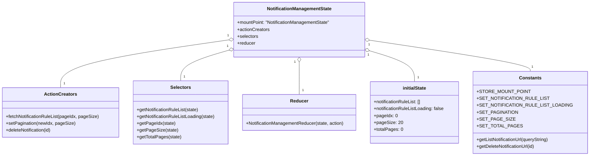

# Diagram: web/portal/src/pages/administration/notification-management/redux/NotificationManagementState.js


> Auto-generated by Obscura crawlers

## Diagram 1



### SVG

<svg id="container" width="2022.1640625" xmlns="http://www.w3.org/2000/svg" class="classDiagram" height="546" viewBox="0 0 2022.1640625 546" role="graphics-document document" aria-roledescription="class"><style>#container{font-family:"trebuchet ms",verdana,arial,sans-serif;font-size:16px;fill:#333;}@keyframes edge-animation-frame{from{stroke-dashoffset:0;}}@keyframes dash{to{stroke-dashoffset:0;}}#container .edge-animation-slow{stroke-dasharray:9,5!important;stroke-dashoffset:900;animation:dash 50s linear infinite;stroke-linecap:round;}#container .edge-animation-fast{stroke-dasharray:9,5!important;stroke-dashoffset:900;animation:dash 20s linear infinite;stroke-linecap:round;}#container .error-icon{fill:#552222;}#container .error-text{fill:#552222;stroke:#552222;}#container .edge-thickness-normal{stroke-width:1px;}#container .edge-thickness-thick{stroke-width:3.5px;}#container .edge-pattern-solid{stroke-dasharray:0;}#container .edge-thickness-invisible{stroke-width:0;fill:none;}#container .edge-pattern-dashed{stroke-dasharray:3;}#container .edge-pattern-dotted{stroke-dasharray:2;}#container .marker{fill:#333333;stroke:#333333;}#container .marker.cross{stroke:#333333;}#container svg{font-family:"trebuchet ms",verdana,arial,sans-serif;font-size:16px;}#container p{margin:0;}#container g.classGroup text{fill:#9370DB;stroke:none;font-family:"trebuchet ms",verdana,arial,sans-serif;font-size:10px;}#container g.classGroup text .title{font-weight:bolder;}#container .nodeLabel,#container .edgeLabel{color:#131300;}#container .edgeLabel .label rect{fill:#ECECFF;}#container .label text{fill:#131300;}#container .labelBkg{background:#ECECFF;}#container .edgeLabel .label span{background:#ECECFF;}#container .classTitle{font-weight:bolder;}#container .node rect,#container .node circle,#container .node ellipse,#container .node polygon,#container .node path{fill:#ECECFF;stroke:#9370DB;stroke-width:1px;}#container .divider{stroke:#9370DB;stroke-width:1;}#container g.clickable{cursor:pointer;}#container g.classGroup rect{fill:#ECECFF;stroke:#9370DB;}#container g.classGroup line{stroke:#9370DB;stroke-width:1;}#container .classLabel .box{stroke:none;stroke-width:0;fill:#ECECFF;opacity:0.5;}#container .classLabel .label{fill:#9370DB;font-size:10px;}#container .relation{stroke:#333333;stroke-width:1;fill:none;}#container .dashed-line{stroke-dasharray:3;}#container .dotted-line{stroke-dasharray:1 2;}#container #compositionStart,#container .composition{fill:#333333!important;stroke:#333333!important;stroke-width:1;}#container #compositionEnd,#container .composition{fill:#333333!important;stroke:#333333!important;stroke-width:1;}#container #dependencyStart,#container .dependency{fill:#333333!important;stroke:#333333!important;stroke-width:1;}#container #dependencyStart,#container .dependency{fill:#333333!important;stroke:#333333!important;stroke-width:1;}#container #extensionStart,#container .extension{fill:transparent!important;stroke:#333333!important;stroke-width:1;}#container #extensionEnd,#container .extension{fill:transparent!important;stroke:#333333!important;stroke-width:1;}#container #aggregationStart,#container .aggregation{fill:transparent!important;stroke:#333333!important;stroke-width:1;}#container #aggregationEnd,#container .aggregation{fill:transparent!important;stroke:#333333!important;stroke-width:1;}#container #lollipopStart,#container .lollipop{fill:#ECECFF!important;stroke:#333333!important;stroke-width:1;}#container #lollipopEnd,#container .lollipop{fill:#ECECFF!important;stroke:#333333!important;stroke-width:1;}#container .edgeTerminals{font-size:11px;line-height:initial;}#container .classTitleText{text-anchor:middle;font-size:18px;fill:#333;}#container .label-icon{display:inline-block;height:1em;overflow:visible;vertical-align:-0.125em;}#container .node .label-icon path{fill:currentColor;stroke:revert;stroke-width:revert;}#container :root{--mermaid-font-family:"trebuchet ms",verdana,arial,sans-serif;}</style><g><defs><marker id="container_class-aggregationStart" class="marker aggregation class" refX="18" refY="7" markerWidth="190" markerHeight="240" orient="auto"><path d="M 18,7 L9,13 L1,7 L9,1 Z"></path></marker></defs><defs><marker id="container_class-aggregationEnd" class="marker aggregation class" refX="1" refY="7" markerWidth="20" markerHeight="28" orient="auto"><path d="M 18,7 L9,13 L1,7 L9,1 Z"></path></marker></defs><defs><marker id="container_class-extensionStart" class="marker extension class" refX="18" refY="7" markerWidth="190" markerHeight="240" orient="auto"><path d="M 1,7 L18,13 V 1 Z"></path></marker></defs><defs><marker id="container_class-extensionEnd" class="marker extension class" refX="1" refY="7" markerWidth="20" markerHeight="28" orient="auto"><path d="M 1,1 V 13 L18,7 Z"></path></marker></defs><defs><marker id="container_class-compositionStart" class="marker composition class" refX="18" refY="7" markerWidth="190" markerHeight="240" orient="auto"><path d="M 18,7 L9,13 L1,7 L9,1 Z"></path></marker></defs><defs><marker id="container_class-compositionEnd" class="marker composition class" refX="1" refY="7" markerWidth="20" markerHeight="28" orient="auto"><path d="M 18,7 L9,13 L1,7 L9,1 Z"></path></marker></defs><defs><marker id="container_class-dependencyStart" class="marker dependency class" refX="6" refY="7" markerWidth="190" markerHeight="240" orient="auto"><path d="M 5,7 L9,13 L1,7 L9,1 Z"></path></marker></defs><defs><marker id="container_class-dependencyEnd" class="marker dependency class" refX="13" refY="7" markerWidth="20" markerHeight="28" orient="auto"><path d="M 18,7 L9,13 L14,7 L9,1 Z"></path></marker></defs><defs><marker id="container_class-lollipopStart" class="marker lollipop class" refX="13" refY="7" markerWidth="190" markerHeight="240" orient="auto"><circle stroke="black" fill="transparent" cx="7" cy="7" r="6"></circle></marker></defs><defs><marker id="container_class-lollipopEnd" class="marker lollipop class" refX="1" refY="7" markerWidth="190" markerHeight="240" orient="auto"><circle stroke="black" fill="transparent" cx="7" cy="7" r="6"></circle></marker></defs><g class="root"><g class="clusters"></g><g class="edgePaths"><path d="M798.373,139.943L700.305,154.119C602.238,168.295,406.103,196.648,308.036,224.49C209.969,252.333,209.969,279.667,209.969,293.333L209.969,307" id="id_NotificationManagementState_ActionCreators_1" class="edge-thickness-normal edge-pattern-solid relation" style=";;;" data-edge="true" data-et="edge" data-id="id_NotificationManagementState_ActionCreators_1" data-points="W3sieCI6ODE1LjQ0NTMxMjUsInkiOjEzNy40NzQ4MzcxMzIwMzA0fSx7IngiOjIwOS45Njg3NSwieSI6MjI1fSx7IngiOjIwOS45Njg3NSwieSI6MzA3fV0=" marker-start="url(#container_class-aggregationStart)"></path><path d="M798.878,175.938L770.673,184.115C742.468,192.292,686.058,208.646,657.853,226.49C629.648,244.333,629.648,263.667,629.648,273.333L629.648,283" id="id_NotificationManagementState_Selectors_2" class="edge-thickness-normal edge-pattern-solid relation" style=";;;" data-edge="true" data-et="edge" data-id="id_NotificationManagementState_Selectors_2" data-points="W3sieCI6ODE1LjQ0NTMxMjUsInkiOjE3MS4xMzUxNDc3ODI3OTAxN30seyJ4Ijo2MjkuNjQ4NDM3NSwieSI6MjI1fSx7IngiOjYyOS42NDg0Mzc1LCJ5IjoyODN9XQ==" marker-start="url(#container_class-aggregationStart)"></path><path d="M1047.016,217.25L1047.016,218.542C1047.016,219.833,1047.016,222.417,1047.016,241.375C1047.016,260.333,1047.016,295.667,1047.016,313.333L1047.016,331" id="id_NotificationManagementState_Reducer_3" class="edge-thickness-normal edge-pattern-solid relation" style=";;;" data-edge="true" data-et="edge" data-id="id_NotificationManagementState_Reducer_3" data-points="W3sieCI6MTA0Ny4wMTU2MjUsInkiOjIwMH0seyJ4IjoxMDQ3LjAxNTYyNSwieSI6MjI1fSx7IngiOjEwNDcuMDE1NjI1LCJ5IjozMzF9XQ==" marker-start="url(#container_class-aggregationStart)"></path><path d="M1295.119,177.854L1321.516,185.712C1347.913,193.569,1400.706,209.285,1427.103,227.309C1453.5,245.333,1453.5,265.667,1453.5,275.833L1453.5,286" id="id_NotificationManagementState_initialState_4" class="edge-thickness-normal edge-pattern-solid relation" style=";;;" data-edge="true" data-et="edge" data-id="id_NotificationManagementState_initialState_4" data-points="W3sieCI6MTI3OC41ODU5Mzc1LCJ5IjoxNzIuOTMyNTU4MTM5NTM0ODh9LHsieCI6MTQ1My41LCJ5IjoyMjV9LHsieCI6MTQ1My41LCJ5IjoyODZ9XQ==" marker-start="url(#container_class-aggregationStart)"></path><path d="M1295.637,142.069L1385.905,155.891C1476.174,169.713,1656.71,197.356,1746.978,215.345C1837.246,233.333,1837.246,241.667,1837.246,245.833L1837.246,250" id="id_NotificationManagementState_Constants_5" class="edge-thickness-normal edge-pattern-solid relation" style=";;;" data-edge="true" data-et="edge" data-id="id_NotificationManagementState_Constants_5" data-points="W3sieCI6MTI3OC41ODU5Mzc1LCJ5IjoxMzkuNDU4MDIwMDU5NDE3fSx7IngiOjE4MzcuMjQ2MDkzNzUsInkiOjIyNX0seyJ4IjoxODM3LjI0NjA5Mzc1LCJ5IjoyNTB9XQ==" marker-start="url(#container_class-aggregationStart)"></path></g><g class="edgeLabels"><g class="edgeLabel"><g class="label" data-id="id_NotificationManagementState_ActionCreators_1" transform="translate(0, 0)"><foreignObject width="0" height="0"><div xmlns="http://www.w3.org/1999/xhtml" class="labelBkg" style="display: table-cell; white-space: nowrap; line-height: 1.5; max-width: 200px; text-align: center;"><span class="edgeLabel"></span></div></foreignObject></g></g><g class="edgeLabel"><g class="label" data-id="id_NotificationManagementState_Selectors_2" transform="translate(0, 0)"><foreignObject width="0" height="0"><div xmlns="http://www.w3.org/1999/xhtml" class="labelBkg" style="display: table-cell; white-space: nowrap; line-height: 1.5; max-width: 200px; text-align: center;"><span class="edgeLabel"></span></div></foreignObject></g></g><g class="edgeLabel"><g class="label" data-id="id_NotificationManagementState_Reducer_3" transform="translate(0, 0)"><foreignObject width="0" height="0"><div xmlns="http://www.w3.org/1999/xhtml" class="labelBkg" style="display: table-cell; white-space: nowrap; line-height: 1.5; max-width: 200px; text-align: center;"><span class="edgeLabel"></span></div></foreignObject></g></g><g class="edgeLabel"><g class="label" data-id="id_NotificationManagementState_initialState_4" transform="translate(0, 0)"><foreignObject width="0" height="0"><div xmlns="http://www.w3.org/1999/xhtml" class="labelBkg" style="display: table-cell; white-space: nowrap; line-height: 1.5; max-width: 200px; text-align: center;"><span class="edgeLabel"></span></div></foreignObject></g></g><g class="edgeLabel"><g class="label" data-id="id_NotificationManagementState_Constants_5" transform="translate(0, 0)"><foreignObject width="0" height="0"><div xmlns="http://www.w3.org/1999/xhtml" class="labelBkg" style="display: table-cell; white-space: nowrap; line-height: 1.5; max-width: 200px; text-align: center;"><span class="edgeLabel"></span></div></foreignObject></g></g><g class="edgeTerminals" transform="translate(795.9793111865621, 125.13284710462408)"><g class="inner" transform="translate(0, 0)"><foreignObject style="width: 9px; height: 12px;"><div xmlns="http://www.w3.org/1999/xhtml" style="display: inline-block; padding-right: 1px; white-space: nowrap;"><span class="edgeLabel">1</span></div></foreignObject></g></g><g class="edgeTerminals" transform="translate(794.4607069651927, 161.60119474458233)"><g class="inner" transform="translate(0, 0)"><foreignObject style="width: 9px; height: 12px;"><div xmlns="http://www.w3.org/1999/xhtml" style="display: inline-block; padding-right: 1px; white-space: nowrap;"><span class="edgeLabel">1</span></div></foreignObject></g></g><g class="edgeTerminals" transform="translate(1032.0156275000002, 217.5000021428572)"><g class="inner" transform="translate(0, 0)"><foreignObject style="width: 9px; height: 12px;"><div xmlns="http://www.w3.org/1999/xhtml" style="display: inline-block; padding-right: 1px; white-space: nowrap;"><span class="edgeLabel">1</span></div></foreignObject></g></g><g class="edgeTerminals" transform="translate(1291.079058380153, 192.30191253320433)"><g class="inner" transform="translate(0, 0)"><foreignObject style="width: 9px; height: 12px;"><div xmlns="http://www.w3.org/1999/xhtml" style="display: inline-block; padding-right: 1px; white-space: nowrap;"><span class="edgeLabel">1</span></div></foreignObject></g></g><g class="edgeTerminals" transform="translate(1293.6139877306268, 156.93393540277438)"><g class="inner" transform="translate(0, 0)"><foreignObject style="width: 9px; height: 12px;"><div xmlns="http://www.w3.org/1999/xhtml" style="display: inline-block; padding-right: 1px; white-space: nowrap;"><span class="edgeLabel">1</span></div></foreignObject></g></g><g class="edgeTerminals" transform="translate(219.96875, 284.5)"><g class="inner" transform="translate(0, 0)"></g><foreignObject style="width: 9px; height: 12px;"><div xmlns="http://www.w3.org/1999/xhtml" style="display: inline-block; padding-right: 1px; white-space: nowrap;"><span class="edgeLabel">1</span></div></foreignObject></g><g class="edgeTerminals" transform="translate(639.64843875, 260.5000010714286)"><g class="inner" transform="translate(0, 0)"></g><foreignObject style="width: 9px; height: 12px;"><div xmlns="http://www.w3.org/1999/xhtml" style="display: inline-block; padding-right: 1px; white-space: nowrap;"><span class="edgeLabel">1</span></div></foreignObject></g><g class="edgeTerminals" transform="translate(1057.0156274999997, 308.50000214285717)"><g class="inner" transform="translate(0, 0)"></g><foreignObject style="width: 9px; height: 12px;"><div xmlns="http://www.w3.org/1999/xhtml" style="display: inline-block; padding-right: 1px; white-space: nowrap;"><span class="edgeLabel">1</span></div></foreignObject></g><g class="edgeTerminals" transform="translate(1463.5, 263.5)"><g class="inner" transform="translate(0, 0)"></g><foreignObject style="width: 9px; height: 12px;"><div xmlns="http://www.w3.org/1999/xhtml" style="display: inline-block; padding-right: 1px; white-space: nowrap;"><span class="edgeLabel">1</span></div></foreignObject></g><g class="edgeTerminals" transform="translate(1841.3586807892718, 226.5032364914804)"><g class="inner" transform="translate(0, 0)"></g><foreignObject style="width: 9px; height: 12px;"><div xmlns="http://www.w3.org/1999/xhtml" style="display: inline-block; padding-right: 1px; white-space: nowrap;"><span class="edgeLabel">1</span></div></foreignObject></g></g><g class="nodes"><g class="node default" id="classId-NotificationManagementState-0" transform="translate(1047.015625, 104)"><g class="basic label-container"><path d="M-231.5703125 -96 L231.5703125 -96 L231.5703125 96 L-231.5703125 96" stroke="none" stroke-width="0" fill="#ECECFF" style=""></path><path d="M-231.5703125 -96 C-55.65247522632981 -96, 120.26536204734037 -96, 231.5703125 -96 M-231.5703125 -96 C-99.18101014805723 -96, 33.20829220388555 -96, 231.5703125 -96 M231.5703125 -96 C231.5703125 -39.96637268675547, 231.5703125 16.06725462648906, 231.5703125 96 M231.5703125 -96 C231.5703125 -22.60945615252041, 231.5703125 50.78108769495918, 231.5703125 96 M231.5703125 96 C66.56466360871744 96, -98.44098528256512 96, -231.5703125 96 M231.5703125 96 C102.26697117882503 96, -27.036370142349938 96, -231.5703125 96 M-231.5703125 96 C-231.5703125 36.79137443329019, -231.5703125 -22.417251133419626, -231.5703125 -96 M-231.5703125 96 C-231.5703125 53.24420807463375, -231.5703125 10.488416149267493, -231.5703125 -96" stroke="#9370DB" stroke-width="1.3" fill="none" stroke-dasharray="0 0" style=""></path></g><g class="annotation-group text" transform="translate(0, -72)"></g><g class="label-group text" transform="translate(-109.3125, -72)"><g class="label" style="font-weight: bolder" transform="translate(0,-12)"><foreignObject width="218.625" height="24"><div xmlns="http://www.w3.org/1999/xhtml" style="display: table-cell; white-space: nowrap; line-height: 1.5; max-width: 266px; text-align: center;"><span class="nodeLabel markdown-node-label" style=""><p>NotificationManagementState</p></span></div></foreignObject></g></g><g class="members-group text" transform="translate(-219.5703125, -24)"><g class="label" style="" transform="translate(0,-12)"><foreignObject width="329.828125" height="24"><div xmlns="http://www.w3.org/1999/xhtml" style="display: table-cell; white-space: nowrap; line-height: 1.5; max-width: 387px; text-align: center;"><span class="nodeLabel markdown-node-label" style=""><p>+mountPoint: "NotificationManagementState"</p></span></div></foreignObject></g><g class="label" style="" transform="translate(0,12)"><foreignObject width="113.078125" height="24"><div xmlns="http://www.w3.org/1999/xhtml" style="display: table-cell; white-space: nowrap; line-height: 1.5; max-width: 170px; text-align: center;"><span class="nodeLabel markdown-node-label" style=""><p>+actionCreators</p></span></div></foreignObject></g><g class="label" style="" transform="translate(0,36)"><foreignObject width="73.453125" height="24"><div xmlns="http://www.w3.org/1999/xhtml" style="display: table-cell; white-space: nowrap; line-height: 1.5; max-width: 131px; text-align: center;"><span class="nodeLabel markdown-node-label" style=""><p>+selectors</p></span></div></foreignObject></g><g class="label" style="" transform="translate(0,60)"><foreignObject width="63.515625" height="24"><div xmlns="http://www.w3.org/1999/xhtml" style="display: table-cell; white-space: nowrap; line-height: 1.5; max-width: 122px; text-align: center;"><span class="nodeLabel markdown-node-label" style=""><p>+reducer</p></span></div></foreignObject></g></g><g class="methods-group text" transform="translate(-219.5703125, 96)"></g><g class="divider" style=""><path d="M-231.5703125 -48 C-100.01906727851642 -48, 31.532177942967166 -48, 231.5703125 -48 M-231.5703125 -48 C-104.5616280861329 -48, 22.447056327734202 -48, 231.5703125 -48" stroke="#9370DB" stroke-width="1.3" fill="none" stroke-dasharray="0 0" style=""></path></g><g class="divider" style=""><path d="M-231.5703125 72 C-59.62759462637584 72, 112.31512324724832 72, 231.5703125 72 M-231.5703125 72 C-124.22142530409394 72, -16.872538108187882 72, 231.5703125 72" stroke="#9370DB" stroke-width="1.3" fill="none" stroke-dasharray="0 0" style=""></path></g></g><g class="node default" id="classId-ActionCreators-1" transform="translate(209.96875, 394)"><g class="basic label-container"><path d="M-201.96875 -87 L201.96875 -87 L201.96875 87 L-201.96875 87" stroke="none" stroke-width="0" fill="#ECECFF" style=""></path><path d="M-201.96875 -87 C-49.35189793362815 -87, 103.2649541327437 -87, 201.96875 -87 M-201.96875 -87 C-60.144962134012445 -87, 81.67882573197511 -87, 201.96875 -87 M201.96875 -87 C201.96875 -31.16231700932188, 201.96875 24.675365981356236, 201.96875 87 M201.96875 -87 C201.96875 -22.803789001813314, 201.96875 41.39242199637337, 201.96875 87 M201.96875 87 C68.8754597713133 87, -64.2178304573734 87, -201.96875 87 M201.96875 87 C78.16395710342427 87, -45.64083579315147 87, -201.96875 87 M-201.96875 87 C-201.96875 52.06582253581974, -201.96875 17.131645071639483, -201.96875 -87 M-201.96875 87 C-201.96875 38.306618469561634, -201.96875 -10.386763060876731, -201.96875 -87" stroke="#9370DB" stroke-width="1.3" fill="none" stroke-dasharray="0 0" style=""></path></g><g class="annotation-group text" transform="translate(0, -63)"></g><g class="label-group text" transform="translate(-53.96875, -63)"><g class="label" style="font-weight: bolder" transform="translate(0,-12)"><foreignObject width="107.9375" height="24"><div xmlns="http://www.w3.org/1999/xhtml" style="display: table-cell; white-space: nowrap; line-height: 1.5; max-width: 156px; text-align: center;"><span class="nodeLabel markdown-node-label" style=""><p>ActionCreators</p></span></div></foreignObject></g></g><g class="members-group text" transform="translate(-189.96875, -15)"></g><g class="methods-group text" transform="translate(-189.96875, 15)"><g class="label" style="" transform="translate(0,-12)"><foreignObject width="325.96875" height="24"><div xmlns="http://www.w3.org/1999/xhtml" style="display: table-cell; white-space: nowrap; line-height: 1.5; max-width: 383px; text-align: center;"><span class="nodeLabel markdown-node-label" style=""><p>+fetchNotificationRuleList(pageIdx, pageSize)</p></span></div></foreignObject></g><g class="label" style="" transform="translate(0,12)"><foreignObject width="240.46875" height="24"><div xmlns="http://www.w3.org/1999/xhtml" style="display: table-cell; white-space: nowrap; line-height: 1.5; max-width: 298px; text-align: center;"><span class="nodeLabel markdown-node-label" style=""><p>+setPagination(newIdx, pageSize)</p></span></div></foreignObject></g><g class="label" style="" transform="translate(0,36)"><foreignObject width="163.265625" height="24"><div xmlns="http://www.w3.org/1999/xhtml" style="display: table-cell; white-space: nowrap; line-height: 1.5; max-width: 221px; text-align: center;"><span class="nodeLabel markdown-node-label" style=""><p>+deleteNotification(id)</p></span></div></foreignObject></g></g><g class="divider" style=""><path d="M-201.96875 -39 C-111.65202039008393 -39, -21.335290780167867 -39, 201.96875 -39 M-201.96875 -39 C-118.14158120273096 -39, -34.31441240546192 -39, 201.96875 -39" stroke="#9370DB" stroke-width="1.3" fill="none" stroke-dasharray="0 0" style=""></path></g><g class="divider" style=""><path d="M-201.96875 -15 C-109.79144943038962 -15, -17.61414886077924 -15, 201.96875 -15 M-201.96875 -15 C-70.10831268103183 -15, 61.75212463793633 -15, 201.96875 -15" stroke="#9370DB" stroke-width="1.3" fill="none" stroke-dasharray="0 0" style=""></path></g></g><g class="node default" id="classId-Selectors-2" transform="translate(629.6484375, 394)"><g class="basic label-container"><path d="M-167.7109375 -111 L167.7109375 -111 L167.7109375 111 L-167.7109375 111" stroke="none" stroke-width="0" fill="#ECECFF" style=""></path><path d="M-167.7109375 -111 C-85.30319812056986 -111, -2.89545874113972 -111, 167.7109375 -111 M-167.7109375 -111 C-42.16830646216518 -111, 83.37432457566965 -111, 167.7109375 -111 M167.7109375 -111 C167.7109375 -30.999640133673722, 167.7109375 49.000719732652556, 167.7109375 111 M167.7109375 -111 C167.7109375 -62.85214029565211, 167.7109375 -14.704280591304226, 167.7109375 111 M167.7109375 111 C63.51275781682139 111, -40.68542186635722 111, -167.7109375 111 M167.7109375 111 C80.05856794929589 111, -7.593801601408217 111, -167.7109375 111 M-167.7109375 111 C-167.7109375 38.757520790522165, -167.7109375 -33.48495841895567, -167.7109375 -111 M-167.7109375 111 C-167.7109375 38.634032626411056, -167.7109375 -33.73193474717789, -167.7109375 -111" stroke="#9370DB" stroke-width="1.3" fill="none" stroke-dasharray="0 0" style=""></path></g><g class="annotation-group text" transform="translate(0, -87)"></g><g class="label-group text" transform="translate(-34.171875, -87)"><g class="label" style="font-weight: bolder" transform="translate(0,-12)"><foreignObject width="68.34375" height="24"><div xmlns="http://www.w3.org/1999/xhtml" style="display: table-cell; white-space: nowrap; line-height: 1.5; max-width: 117px; text-align: center;"><span class="nodeLabel markdown-node-label" style=""><p>Selectors</p></span></div></foreignObject></g></g><g class="members-group text" transform="translate(-155.7109375, -39)"></g><g class="methods-group text" transform="translate(-155.7109375, -9)"><g class="label" style="" transform="translate(0,-12)"><foreignObject width="220.03125" height="24"><div xmlns="http://www.w3.org/1999/xhtml" style="display: table-cell; white-space: nowrap; line-height: 1.5; max-width: 277px; text-align: center;"><span class="nodeLabel markdown-node-label" style=""><p>+getNotificationRuleList(state)</p></span></div></foreignObject></g><g class="label" style="" transform="translate(0,12)"><foreignObject width="277.25" height="24"><div xmlns="http://www.w3.org/1999/xhtml" style="display: table-cell; white-space: nowrap; line-height: 1.5; max-width: 335px; text-align: center;"><span class="nodeLabel markdown-node-label" style=""><p>+getNotificationRuleListLoading(state)</p></span></div></foreignObject></g><g class="label" style="" transform="translate(0,36)"><foreignObject width="132.8125" height="24"><div xmlns="http://www.w3.org/1999/xhtml" style="display: table-cell; white-space: nowrap; line-height: 1.5; max-width: 190px; text-align: center;"><span class="nodeLabel markdown-node-label" style=""><p>+getPageIdx(state)</p></span></div></foreignObject></g><g class="label" style="" transform="translate(0,60)"><foreignObject width="139.59375" height="24"><div xmlns="http://www.w3.org/1999/xhtml" style="display: table-cell; white-space: nowrap; line-height: 1.5; max-width: 197px; text-align: center;"><span class="nodeLabel markdown-node-label" style=""><p>+getPageSize(state)</p></span></div></foreignObject></g><g class="label" style="" transform="translate(0,84)"><foreignObject width="153.859375" height="24"><div xmlns="http://www.w3.org/1999/xhtml" style="display: table-cell; white-space: nowrap; line-height: 1.5; max-width: 211px; text-align: center;"><span class="nodeLabel markdown-node-label" style=""><p>+getTotalPages(state)</p></span></div></foreignObject></g></g><g class="divider" style=""><path d="M-167.7109375 -63 C-81.95361615595526 -63, 3.8037051880894808 -63, 167.7109375 -63 M-167.7109375 -63 C-89.63258976419817 -63, -11.554242028396345 -63, 167.7109375 -63" stroke="#9370DB" stroke-width="1.3" fill="none" stroke-dasharray="0 0" style=""></path></g><g class="divider" style=""><path d="M-167.7109375 -39 C-77.0155350675129 -39, 13.6798673649742 -39, 167.7109375 -39 M-167.7109375 -39 C-83.7839577921952 -39, 0.14302191560960864 -39, 167.7109375 -39" stroke="#9370DB" stroke-width="1.3" fill="none" stroke-dasharray="0 0" style=""></path></g></g><g class="node default" id="classId-Reducer-3" transform="translate(1047.015625, 394)"><g class="basic label-container"><path d="M-199.65625 -63 L199.65625 -63 L199.65625 63 L-199.65625 63" stroke="none" stroke-width="0" fill="#ECECFF" style=""></path><path d="M-199.65625 -63 C-88.28020477828744 -63, 23.095840443425118 -63, 199.65625 -63 M-199.65625 -63 C-91.75668374927324 -63, 16.142882501453528 -63, 199.65625 -63 M199.65625 -63 C199.65625 -16.001044508406494, 199.65625 30.997910983187012, 199.65625 63 M199.65625 -63 C199.65625 -17.548700769062407, 199.65625 27.902598461875186, 199.65625 63 M199.65625 63 C59.93244784479822 63, -79.79135431040356 63, -199.65625 63 M199.65625 63 C91.50095241372928 63, -16.65434517254144 63, -199.65625 63 M-199.65625 63 C-199.65625 30.67433507962012, -199.65625 -1.6513298407597574, -199.65625 -63 M-199.65625 63 C-199.65625 37.54001684914972, -199.65625 12.080033698299438, -199.65625 -63" stroke="#9370DB" stroke-width="1.3" fill="none" stroke-dasharray="0 0" style=""></path></g><g class="annotation-group text" transform="translate(0, -39)"></g><g class="label-group text" transform="translate(-29.90625, -39)"><g class="label" style="font-weight: bolder" transform="translate(0,-12)"><foreignObject width="59.8125" height="24"><div xmlns="http://www.w3.org/1999/xhtml" style="display: table-cell; white-space: nowrap; line-height: 1.5; max-width: 110px; text-align: center;"><span class="nodeLabel markdown-node-label" style=""><p>Reducer</p></span></div></foreignObject></g></g><g class="members-group text" transform="translate(-187.65625, 9)"></g><g class="methods-group text" transform="translate(-187.65625, 39)"><g class="label" style="" transform="translate(0,-12)"><foreignObject width="345.40625" height="24"><div xmlns="http://www.w3.org/1999/xhtml" style="display: table-cell; white-space: nowrap; line-height: 1.5; max-width: 403px; text-align: center;"><span class="nodeLabel markdown-node-label" style=""><p>+NotificationManagementReducer(state, action)</p></span></div></foreignObject></g></g><g class="divider" style=""><path d="M-199.65625 -15 C-87.65639913558694 -15, 24.343451728826125 -15, 199.65625 -15 M-199.65625 -15 C-85.31435039740138 -15, 29.027549205197232 -15, 199.65625 -15" stroke="#9370DB" stroke-width="1.3" fill="none" stroke-dasharray="0 0" style=""></path></g><g class="divider" style=""><path d="M-199.65625 9 C-46.113165426198634 9, 107.42991914760273 9, 199.65625 9 M-199.65625 9 C-44.275157179693 9, 111.105935640614 9, 199.65625 9" stroke="#9370DB" stroke-width="1.3" fill="none" stroke-dasharray="0 0" style=""></path></g></g><g class="node default" id="classId-initialState-4" transform="translate(1453.5, 394)"><g class="basic label-container"><path d="M-156.828125 -108 L156.828125 -108 L156.828125 108 L-156.828125 108" stroke="none" stroke-width="0" fill="#ECECFF" style=""></path><path d="M-156.828125 -108 C-51.92830426992617 -108, 52.971516460147654 -108, 156.828125 -108 M-156.828125 -108 C-40.96528904998428 -108, 74.89754690003144 -108, 156.828125 -108 M156.828125 -108 C156.828125 -27.83872844989945, 156.828125 52.3225431002011, 156.828125 108 M156.828125 -108 C156.828125 -56.275543322014656, 156.828125 -4.551086644029311, 156.828125 108 M156.828125 108 C93.83616759804862 108, 30.844210196097237 108, -156.828125 108 M156.828125 108 C38.92418633497462 108, -78.97975233005076 108, -156.828125 108 M-156.828125 108 C-156.828125 40.97789996189405, -156.828125 -26.044200076211894, -156.828125 -108 M-156.828125 108 C-156.828125 41.03421403560856, -156.828125 -25.931571928782887, -156.828125 -108" stroke="#9370DB" stroke-width="1.3" fill="none" stroke-dasharray="0 0" style=""></path></g><g class="annotation-group text" transform="translate(0, -84)"></g><g class="label-group text" transform="translate(-40.46875, -84)"><g class="label" style="font-weight: bolder" transform="translate(0,-12)"><foreignObject width="80.9375" height="24"><div xmlns="http://www.w3.org/1999/xhtml" style="display: table-cell; white-space: nowrap; line-height: 1.5; max-width: 129px; text-align: center;"><span class="nodeLabel markdown-node-label" style=""><p>initialState</p></span></div></foreignObject></g></g><g class="members-group text" transform="translate(-144.828125, -36)"><g class="label" style="" transform="translate(0,-12)"><foreignObject width="167.890625" height="24"><div xmlns="http://www.w3.org/1999/xhtml" style="display: table-cell; white-space: nowrap; line-height: 1.5; max-width: 225px; text-align: center;"><span class="nodeLabel markdown-node-label" style=""><p>+notificationRuleList: []</p></span></div></foreignObject></g><g class="label" style="" transform="translate(0,12)"><foreignObject width="249.1875" height="24"><div xmlns="http://www.w3.org/1999/xhtml" style="display: table-cell; white-space: nowrap; line-height: 1.5; max-width: 307px; text-align: center;"><span class="nodeLabel markdown-node-label" style=""><p>+notificationRuleListLoading: false</p></span></div></foreignObject></g><g class="label" style="" transform="translate(0,36)"><foreignObject width="81.78125" height="24"><div xmlns="http://www.w3.org/1999/xhtml" style="display: table-cell; white-space: nowrap; line-height: 1.5; max-width: 139px; text-align: center;"><span class="nodeLabel markdown-node-label" style=""><p>+pageIdx: 0</p></span></div></foreignObject></g><g class="label" style="" transform="translate(0,60)"><foreignObject width="96.421875" height="24"><div xmlns="http://www.w3.org/1999/xhtml" style="display: table-cell; white-space: nowrap; line-height: 1.5; max-width: 154px; text-align: center;"><span class="nodeLabel markdown-node-label" style=""><p>+pageSize: 20</p></span></div></foreignObject></g><g class="label" style="" transform="translate(0,84)"><foreignObject width="99.90625" height="24"><div xmlns="http://www.w3.org/1999/xhtml" style="display: table-cell; white-space: nowrap; line-height: 1.5; max-width: 157px; text-align: center;"><span class="nodeLabel markdown-node-label" style=""><p>+totalPages: 0</p></span></div></foreignObject></g></g><g class="methods-group text" transform="translate(-144.828125, 108)"></g><g class="divider" style=""><path d="M-156.828125 -60 C-33.453741573174014 -60, 89.92064185365197 -60, 156.828125 -60 M-156.828125 -60 C-75.49877750712648 -60, 5.830569985747047 -60, 156.828125 -60" stroke="#9370DB" stroke-width="1.3" fill="none" stroke-dasharray="0 0" style=""></path></g><g class="divider" style=""><path d="M-156.828125 84 C-89.66490260319765 84, -22.501680206395292 84, 156.828125 84 M-156.828125 84 C-88.03566304008191 84, -19.24320108016383 84, 156.828125 84" stroke="#9370DB" stroke-width="1.3" fill="none" stroke-dasharray="0 0" style=""></path></g></g><g class="node default" id="classId-Constants-5" transform="translate(1837.24609375, 394)"><g class="basic label-container"><path d="M-176.91796875 -144 L176.91796875 -144 L176.91796875 144 L-176.91796875 144" stroke="none" stroke-width="0" fill="#ECECFF" style=""></path><path d="M-176.91796875 -144 C-56.037896546059756 -144, 64.84217565788049 -144, 176.91796875 -144 M-176.91796875 -144 C-67.40856693579232 -144, 42.100834878415355 -144, 176.91796875 -144 M176.91796875 -144 C176.91796875 -36.52037193977438, 176.91796875 70.95925612045124, 176.91796875 144 M176.91796875 -144 C176.91796875 -62.47242596521332, 176.91796875 19.055148069573363, 176.91796875 144 M176.91796875 144 C54.83729946650429 144, -67.24336981699142 144, -176.91796875 144 M176.91796875 144 C45.31225884967108 144, -86.29345105065784 144, -176.91796875 144 M-176.91796875 144 C-176.91796875 77.59051584029262, -176.91796875 11.18103168058525, -176.91796875 -144 M-176.91796875 144 C-176.91796875 72.75694000146925, -176.91796875 1.5138800029384925, -176.91796875 -144" stroke="#9370DB" stroke-width="1.3" fill="none" stroke-dasharray="0 0" style=""></path></g><g class="annotation-group text" transform="translate(0, -120)"></g><g class="label-group text" transform="translate(-36.5390625, -120)"><g class="label" style="font-weight: bolder" transform="translate(0,-12)"><foreignObject width="73.078125" height="24"><div xmlns="http://www.w3.org/1999/xhtml" style="display: table-cell; white-space: nowrap; line-height: 1.5; max-width: 122px; text-align: center;"><span class="nodeLabel markdown-node-label" style=""><p>Constants</p></span></div></foreignObject></g></g><g class="members-group text" transform="translate(-164.91796875, -72)"><g class="label" style="" transform="translate(0,-12)"><foreignObject width="166.03125" height="24"><div xmlns="http://www.w3.org/1999/xhtml" style="display: table-cell; white-space: nowrap; line-height: 1.5; max-width: 224px; text-align: center;"><span class="nodeLabel markdown-node-label" style=""><p>+STORE_MOUNT_POINT</p></span></div></foreignObject></g><g class="label" style="" transform="translate(0,12)"><foreignObject width="222.40625" height="24"><div xmlns="http://www.w3.org/1999/xhtml" style="display: table-cell; white-space: nowrap; line-height: 1.5; max-width: 280px; text-align: center;"><span class="nodeLabel markdown-node-label" style=""><p>+SET_NOTIFICATION_RULE_LIST</p></span></div></foreignObject></g><g class="label" style="" transform="translate(0,36)"><foreignObject width="293.296875" height="24"><div xmlns="http://www.w3.org/1999/xhtml" style="display: table-cell; white-space: nowrap; line-height: 1.5; max-width: 351px; text-align: center;"><span class="nodeLabel markdown-node-label" style=""><p>+SET_NOTIFICATION_RULE_LIST_LOADING</p></span></div></foreignObject></g><g class="label" style="" transform="translate(0,60)"><foreignObject width="126.875" height="24"><div xmlns="http://www.w3.org/1999/xhtml" style="display: table-cell; white-space: nowrap; line-height: 1.5; max-width: 184px; text-align: center;"><span class="nodeLabel markdown-node-label" style=""><p>+SET_PAGINATION</p></span></div></foreignObject></g><g class="label" style="" transform="translate(0,84)"><foreignObject width="114.78125" height="24"><div xmlns="http://www.w3.org/1999/xhtml" style="display: table-cell; white-space: nowrap; line-height: 1.5; max-width: 172px; text-align: center;"><span class="nodeLabel markdown-node-label" style=""><p>+SET_PAGE_SIZE</p></span></div></foreignObject></g><g class="label" style="" transform="translate(0,108)"><foreignObject width="135.34375" height="24"><div xmlns="http://www.w3.org/1999/xhtml" style="display: table-cell; white-space: nowrap; line-height: 1.5; max-width: 193px; text-align: center;"><span class="nodeLabel markdown-node-label" style=""><p>+SET_TOTAL_PAGES</p></span></div></foreignObject></g></g><g class="methods-group text" transform="translate(-164.91796875, 96)"><g class="label" style="" transform="translate(0,-12)"><foreignObject width="257.59375" height="24"><div xmlns="http://www.w3.org/1999/xhtml" style="display: table-cell; white-space: nowrap; line-height: 1.5; max-width: 315px; text-align: center;"><span class="nodeLabel markdown-node-label" style=""><p>+getListNotificationUrl(queryString)</p></span></div></foreignObject></g><g class="label" style="" transform="translate(0,12)"><foreignObject width="208.03125" height="24"><div xmlns="http://www.w3.org/1999/xhtml" style="display: table-cell; white-space: nowrap; line-height: 1.5; max-width: 265px; text-align: center;"><span class="nodeLabel markdown-node-label" style=""><p>+getDeleteNotificationUrl(id)</p></span></div></foreignObject></g></g><g class="divider" style=""><path d="M-176.91796875 -96 C-54.84280755100167 -96, 67.23235364799666 -96, 176.91796875 -96 M-176.91796875 -96 C-37.9638916960443 -96, 100.9901853579114 -96, 176.91796875 -96" stroke="#9370DB" stroke-width="1.3" fill="none" stroke-dasharray="0 0" style=""></path></g><g class="divider" style=""><path d="M-176.91796875 72 C-60.91171845495056 72, 55.09453184009888 72, 176.91796875 72 M-176.91796875 72 C-36.361148476087806 72, 104.19567179782439 72, 176.91796875 72" stroke="#9370DB" stroke-width="1.3" fill="none" stroke-dasharray="0 0" style=""></path></g></g></g></g></g></svg>

## Diagram 2

```mermaid
flowchart TD
  subgraph API["API Layer"]
    A[getListNotificationUrl(queryString)] -->|returns URL| AX[apiUrl(...)]
    B[getDeleteNotificationUrl(id)] -->|returns URL| AX
  end
  subgraph Actions["Action creators"]
    F1[fetchNotificationRuleList(pageIdx, pageSize)]
    F2[setPagination(newIdx, pageSize)]
    F3[deleteNotification(id)]
  end
  subgraph HTTP["HTTP Requests"]
    H1[axios.get(URL)]
    H2[axios.delete(URL)]
  end
  subgraph Dispatcher["Redux dispatch"]
    D1[dispatch SET_NOTIFICATION_RULE_LIST_LOADING]
    D2[dispatch SET_NOTIFICATION_RULE_LIST(payload)]
    D3[dispatch SET_TOTAL_PAGES(payload)]
    D4[dispatch SET_PAGINATION(payload)]
  end
  subgraph Reducer["NotificationManagementReducer"]
    R[handles actions and updates state]
  end
  F1 --> D1
  F1 --> A
  A --> H1
  H1 -->|response| D2
  H1 -->|response| D3
  F3 --> D1
  F3 --> B
  B --> H2
  H2 -->|response| F1
  F2 --> D4
  D1 --> R
  D2 --> R
  D3 --> R
  D4 --> R
```

> SVG rendering failed for this diagram.
