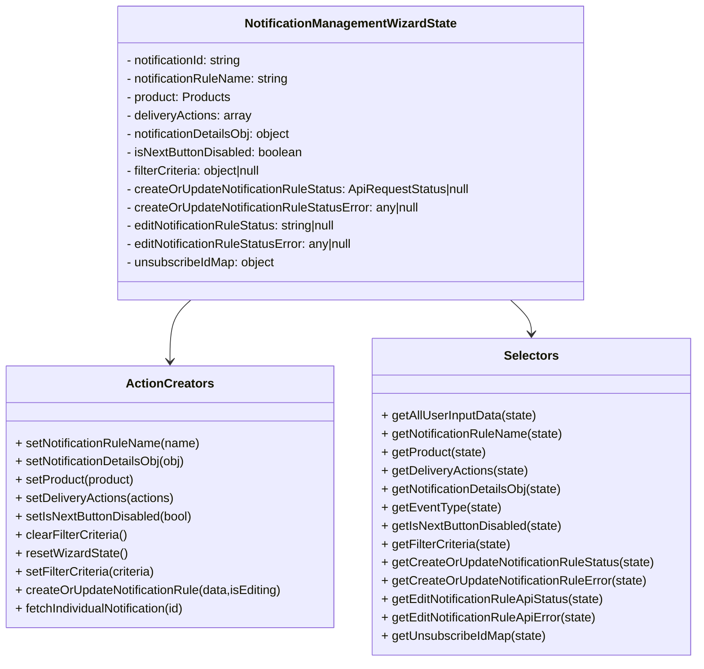
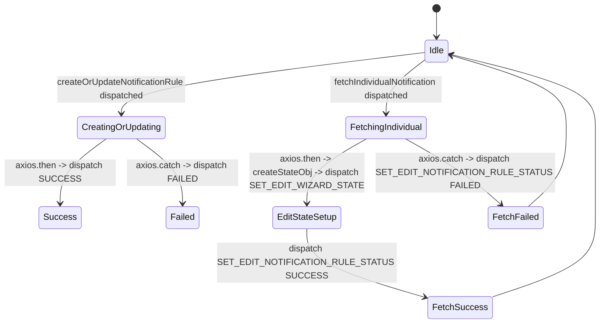

# Diagram: web/portal/src/pages/administration/notification-management/redux/NotificationManagementWizardState.js


> Auto-generated by Obscura crawlers

## Diagram 1

```mermaid
flowchart LR
  A[createOrUpdateNotificationRule(data,isEditing)] --> B[build definition via createDefinitionObject]
  B --> C[construct payload {name,product,deliveryActions,eventType,definition}]
  C --> D[dispatch SET_CREATE_OR_UPDATE_NOTIFICATION_RULE_STATE IN_PROGRESS]
  D --> E[axios.request POST or PATCH to NOTIFICATION_MANAGEMENT_URL or /subscription/v2/{id}]
  E -->|then| F[dispatch SET_CREATE_OR_UPDATE_NOTIFICATION_RULE_STATE SUCCESS]
  E -->|catch| G[dispatch SET_CREATE_OR_UPDATE_NOTIFICATION_RULE_STATE FAILED with error]
  H[fetchIndividualNotification(notificationRuleId)] --> I[dispatch SET_EDIT_NOTIFICATION_RULE_STATUS IN_PROGRESS]
  I --> J[axios.get /subscription/v2/{id}]
  J -->|then| K[createStateObj(response.data) -> notificationRuleStateObject]
  K --> L[dispatch SET_EDIT_WIZARD_STATE with payload notificationRuleStateObject]
  L --> M[dispatch SET_EDIT_NOTIFICATION_RULE_STATUS SUCCESS]
  L --> N[dispatch SET_UNSUBSCRIBE_ID_MAP createUnsubscribeIdMap(deliveryActions)]
  J -->|catch| O[dispatch SET_EDIT_NOTIFICATION_RULE_STATUS FAILED and console.log error]
```

> SVG rendering failed for this diagram.

## Diagram 2



### SVG

<svg id="container" width="915.53125" xmlns="http://www.w3.org/2000/svg" class="classDiagram" height="864" viewBox="0 0 915.53125 864" role="graphics-document document" aria-roledescription="class"><style>#container{font-family:"trebuchet ms",verdana,arial,sans-serif;font-size:16px;fill:#333;}@keyframes edge-animation-frame{from{stroke-dashoffset:0;}}@keyframes dash{to{stroke-dashoffset:0;}}#container .edge-animation-slow{stroke-dasharray:9,5!important;stroke-dashoffset:900;animation:dash 50s linear infinite;stroke-linecap:round;}#container .edge-animation-fast{stroke-dasharray:9,5!important;stroke-dashoffset:900;animation:dash 20s linear infinite;stroke-linecap:round;}#container .error-icon{fill:#552222;}#container .error-text{fill:#552222;stroke:#552222;}#container .edge-thickness-normal{stroke-width:1px;}#container .edge-thickness-thick{stroke-width:3.5px;}#container .edge-pattern-solid{stroke-dasharray:0;}#container .edge-thickness-invisible{stroke-width:0;fill:none;}#container .edge-pattern-dashed{stroke-dasharray:3;}#container .edge-pattern-dotted{stroke-dasharray:2;}#container .marker{fill:#333333;stroke:#333333;}#container .marker.cross{stroke:#333333;}#container svg{font-family:"trebuchet ms",verdana,arial,sans-serif;font-size:16px;}#container p{margin:0;}#container g.classGroup text{fill:#9370DB;stroke:none;font-family:"trebuchet ms",verdana,arial,sans-serif;font-size:10px;}#container g.classGroup text .title{font-weight:bolder;}#container .nodeLabel,#container .edgeLabel{color:#131300;}#container .edgeLabel .label rect{fill:#ECECFF;}#container .label text{fill:#131300;}#container .labelBkg{background:#ECECFF;}#container .edgeLabel .label span{background:#ECECFF;}#container .classTitle{font-weight:bolder;}#container .node rect,#container .node circle,#container .node ellipse,#container .node polygon,#container .node path{fill:#ECECFF;stroke:#9370DB;stroke-width:1px;}#container .divider{stroke:#9370DB;stroke-width:1;}#container g.clickable{cursor:pointer;}#container g.classGroup rect{fill:#ECECFF;stroke:#9370DB;}#container g.classGroup line{stroke:#9370DB;stroke-width:1;}#container .classLabel .box{stroke:none;stroke-width:0;fill:#ECECFF;opacity:0.5;}#container .classLabel .label{fill:#9370DB;font-size:10px;}#container .relation{stroke:#333333;stroke-width:1;fill:none;}#container .dashed-line{stroke-dasharray:3;}#container .dotted-line{stroke-dasharray:1 2;}#container #compositionStart,#container .composition{fill:#333333!important;stroke:#333333!important;stroke-width:1;}#container #compositionEnd,#container .composition{fill:#333333!important;stroke:#333333!important;stroke-width:1;}#container #dependencyStart,#container .dependency{fill:#333333!important;stroke:#333333!important;stroke-width:1;}#container #dependencyStart,#container .dependency{fill:#333333!important;stroke:#333333!important;stroke-width:1;}#container #extensionStart,#container .extension{fill:transparent!important;stroke:#333333!important;stroke-width:1;}#container #extensionEnd,#container .extension{fill:transparent!important;stroke:#333333!important;stroke-width:1;}#container #aggregationStart,#container .aggregation{fill:transparent!important;stroke:#333333!important;stroke-width:1;}#container #aggregationEnd,#container .aggregation{fill:transparent!important;stroke:#333333!important;stroke-width:1;}#container #lollipopStart,#container .lollipop{fill:#ECECFF!important;stroke:#333333!important;stroke-width:1;}#container #lollipopEnd,#container .lollipop{fill:#ECECFF!important;stroke:#333333!important;stroke-width:1;}#container .edgeTerminals{font-size:11px;line-height:initial;}#container .classTitleText{text-anchor:middle;font-size:18px;fill:#333;}#container .label-icon{display:inline-block;height:1em;overflow:visible;vertical-align:-0.125em;}#container .node .label-icon path{fill:currentColor;stroke:revert;stroke-width:revert;}#container :root{--mermaid-font-family:"trebuchet ms",verdana,arial,sans-serif;}</style><g><defs><marker id="container_class-aggregationStart" class="marker aggregation class" refX="18" refY="7" markerWidth="190" markerHeight="240" orient="auto"><path d="M 18,7 L9,13 L1,7 L9,1 Z"></path></marker></defs><defs><marker id="container_class-aggregationEnd" class="marker aggregation class" refX="1" refY="7" markerWidth="20" markerHeight="28" orient="auto"><path d="M 18,7 L9,13 L1,7 L9,1 Z"></path></marker></defs><defs><marker id="container_class-extensionStart" class="marker extension class" refX="18" refY="7" markerWidth="190" markerHeight="240" orient="auto"><path d="M 1,7 L18,13 V 1 Z"></path></marker></defs><defs><marker id="container_class-extensionEnd" class="marker extension class" refX="1" refY="7" markerWidth="20" markerHeight="28" orient="auto"><path d="M 1,1 V 13 L18,7 Z"></path></marker></defs><defs><marker id="container_class-compositionStart" class="marker composition class" refX="18" refY="7" markerWidth="190" markerHeight="240" orient="auto"><path d="M 18,7 L9,13 L1,7 L9,1 Z"></path></marker></defs><defs><marker id="container_class-compositionEnd" class="marker composition class" refX="1" refY="7" markerWidth="20" markerHeight="28" orient="auto"><path d="M 18,7 L9,13 L1,7 L9,1 Z"></path></marker></defs><defs><marker id="container_class-dependencyStart" class="marker dependency class" refX="6" refY="7" markerWidth="190" markerHeight="240" orient="auto"><path d="M 5,7 L9,13 L1,7 L9,1 Z"></path></marker></defs><defs><marker id="container_class-dependencyEnd" class="marker dependency class" refX="13" refY="7" markerWidth="20" markerHeight="28" orient="auto"><path d="M 18,7 L9,13 L14,7 L9,1 Z"></path></marker></defs><defs><marker id="container_class-lollipopStart" class="marker lollipop class" refX="13" refY="7" markerWidth="190" markerHeight="240" orient="auto"><circle stroke="black" fill="transparent" cx="7" cy="7" r="6"></circle></marker></defs><defs><marker id="container_class-lollipopEnd" class="marker lollipop class" refX="1" refY="7" markerWidth="190" markerHeight="240" orient="auto"><circle stroke="black" fill="transparent" cx="7" cy="7" r="6"></circle></marker></defs><g class="root"><g class="clusters"></g><g class="edgePaths"><path d="M251.028,392L246.47,396.167C241.912,400.333,232.796,408.667,228.238,422C223.68,435.333,223.68,453.667,223.68,462.833L223.68,472" id="id_NotificationManagementWizardState_ActionCreators_1" class="edge-thickness-normal edge-pattern-solid relation" style=";;;" data-edge="true" data-et="edge" data-id="id_NotificationManagementWizardState_ActionCreators_1" data-points="W3sieCI6MjUxLjAyNzkzNzc4ODAxODQyLCJ5IjozOTJ9LHsieCI6MjIzLjY3OTY4NzUsInkiOjQxN30seyJ4IjoyMjMuNjc5Njg3NSwieSI6NDc4fV0=" marker-end="url(#container_class-dependencyEnd)"></path><path d="M671.097,392L675.655,396.167C680.213,400.333,689.329,408.667,693.887,416C698.445,423.333,698.445,429.667,698.445,432.833L698.445,436" id="id_NotificationManagementWizardState_Selectors_2" class="edge-thickness-normal edge-pattern-solid relation" style=";;;" data-edge="true" data-et="edge" data-id="id_NotificationManagementWizardState_Selectors_2" data-points="W3sieCI6NjcxLjA5NzA2MjIxMTk4MTYsInkiOjM5Mn0seyJ4Ijo2OTguNDQ1MzEyNSwieSI6NDE3fSx7IngiOjY5OC40NDUzMTI1LCJ5Ijo0NDJ9XQ==" marker-end="url(#container_class-dependencyEnd)"></path></g><g class="edgeLabels"><g class="edgeLabel"><g class="label" data-id="id_NotificationManagementWizardState_ActionCreators_1" transform="translate(0, 0)"><foreignObject width="0" height="0"><div xmlns="http://www.w3.org/1999/xhtml" class="labelBkg" style="display: table-cell; white-space: nowrap; line-height: 1.5; max-width: 200px; text-align: center;"><span class="edgeLabel"></span></div></foreignObject></g></g><g class="edgeLabel"><g class="label" data-id="id_NotificationManagementWizardState_Selectors_2" transform="translate(0, 0)"><foreignObject width="0" height="0"><div xmlns="http://www.w3.org/1999/xhtml" class="labelBkg" style="display: table-cell; white-space: nowrap; line-height: 1.5; max-width: 200px; text-align: center;"><span class="edgeLabel"></span></div></foreignObject></g></g></g><g class="nodes"><g class="node default" id="classId-NotificationManagementWizardState-0" transform="translate(461.0625, 200)"><g class="basic label-container"><path d="M-308.42578125 -192 L308.42578125 -192 L308.42578125 192 L-308.42578125 192" stroke="none" stroke-width="0" fill="#ECECFF" style=""></path><path d="M-308.42578125 -192 C-106.4524848766344 -192, 95.5208114967312 -192, 308.42578125 -192 M-308.42578125 -192 C-184.66502360167334 -192, -60.90426595334671 -192, 308.42578125 -192 M308.42578125 -192 C308.42578125 -61.09760180804429, 308.42578125 69.80479638391142, 308.42578125 192 M308.42578125 -192 C308.42578125 -77.07202757936588, 308.42578125 37.85594484126824, 308.42578125 192 M308.42578125 192 C137.7344942909023 192, -32.95679266819542 192, -308.42578125 192 M308.42578125 192 C71.39749827473707 192, -165.63078470052585 192, -308.42578125 192 M-308.42578125 192 C-308.42578125 84.22816191179831, -308.42578125 -23.54367617640338, -308.42578125 -192 M-308.42578125 192 C-308.42578125 88.43668621375424, -308.42578125 -15.126627572491515, -308.42578125 -192" stroke="#9370DB" stroke-width="1.3" fill="none" stroke-dasharray="0 0" style=""></path></g><g class="annotation-group text" transform="translate(0, -168)"></g><g class="label-group text" transform="translate(-134.0546875, -168)"><g class="label" style="font-weight: bolder" transform="translate(0,-12)"><foreignObject width="268.109375" height="24"><div xmlns="http://www.w3.org/1999/xhtml" style="display: table-cell; white-space: nowrap; line-height: 1.5; max-width: 314px; text-align: center;"><span class="nodeLabel markdown-node-label" style=""><p>NotificationManagementWizardState</p></span></div></foreignObject></g></g><g class="members-group text" transform="translate(-296.42578125, -120)"><g class="label" style="" transform="translate(0,-12)"><foreignObject width="158.109375" height="24"><div xmlns="http://www.w3.org/1999/xhtml" style="display: table-cell; white-space: nowrap; line-height: 1.5; max-width: 216px; text-align: center;"><span class="nodeLabel markdown-node-label" style=""><p>- notificationId: string</p></span></div></foreignObject></g><g class="label" style="" transform="translate(0,12)"><foreignObject width="218.203125" height="24"><div xmlns="http://www.w3.org/1999/xhtml" style="display: table-cell; white-space: nowrap; line-height: 1.5; max-width: 276px; text-align: center;"><span class="nodeLabel markdown-node-label" style=""><p>- notificationRuleName: string</p></span></div></foreignObject></g><g class="label" style="" transform="translate(0,36)"><foreignObject width="139.484375" height="24"><div xmlns="http://www.w3.org/1999/xhtml" style="display: table-cell; white-space: nowrap; line-height: 1.5; max-width: 197px; text-align: center;"><span class="nodeLabel markdown-node-label" style=""><p>- product: Products</p></span></div></foreignObject></g><g class="label" style="" transform="translate(0,60)"><foreignObject width="166.96875" height="24"><div xmlns="http://www.w3.org/1999/xhtml" style="display: table-cell; white-space: nowrap; line-height: 1.5; max-width: 224px; text-align: center;"><span class="nodeLabel markdown-node-label" style=""><p>- deliveryActions: array</p></span></div></foreignObject></g><g class="label" style="" transform="translate(0,84)"><foreignObject width="222.78125" height="24"><div xmlns="http://www.w3.org/1999/xhtml" style="display: table-cell; white-space: nowrap; line-height: 1.5; max-width: 280px; text-align: center;"><span class="nodeLabel markdown-node-label" style=""><p>- notificationDetailsObj: object</p></span></div></foreignObject></g><g class="label" style="" transform="translate(0,108)"><foreignObject width="235.546875" height="24"><div xmlns="http://www.w3.org/1999/xhtml" style="display: table-cell; white-space: nowrap; line-height: 1.5; max-width: 293px; text-align: center;"><span class="nodeLabel markdown-node-label" style=""><p>- isNextButtonDisabled: boolean</p></span></div></foreignObject></g><g class="label" style="" transform="translate(0,132)"><foreignObject width="186.140625" height="24"><div xmlns="http://www.w3.org/1999/xhtml" style="display: table-cell; white-space: nowrap; line-height: 1.5; max-width: 244px; text-align: center;"><span class="nodeLabel markdown-node-label" style=""><p>- filterCriteria: object|null</p></span></div></foreignObject></g><g class="label" style="" transform="translate(0,156)"><foreignObject width="458.796875" height="24"><div xmlns="http://www.w3.org/1999/xhtml" style="display: table-cell; white-space: nowrap; line-height: 1.5; max-width: 516px; text-align: center;"><span class="nodeLabel markdown-node-label" style=""><p>- createOrUpdateNotificationRuleStatus: ApiRequestStatus|null</p></span></div></foreignObject></g><g class="label" style="" transform="translate(0,180)"><foreignObject width="392.75" height="24"><div xmlns="http://www.w3.org/1999/xhtml" style="display: table-cell; white-space: nowrap; line-height: 1.5; max-width: 450px; text-align: center;"><span class="nodeLabel markdown-node-label" style=""><p>- createOrUpdateNotificationRuleStatusError: any|null</p></span></div></foreignObject></g><g class="label" style="" transform="translate(0,204)"><foreignObject width="286.421875" height="24"><div xmlns="http://www.w3.org/1999/xhtml" style="display: table-cell; white-space: nowrap; line-height: 1.5; max-width: 344px; text-align: center;"><span class="nodeLabel markdown-node-label" style=""><p>- editNotificationRuleStatus: string|null</p></span></div></foreignObject></g><g class="label" style="" transform="translate(0,228)"><foreignObject width="306.578125" height="24"><div xmlns="http://www.w3.org/1999/xhtml" style="display: table-cell; white-space: nowrap; line-height: 1.5; max-width: 364px; text-align: center;"><span class="nodeLabel markdown-node-label" style=""><p>- editNotificationRuleStatusError: any|null</p></span></div></foreignObject></g><g class="label" style="" transform="translate(0,252)"><foreignObject width="198.203125" height="24"><div xmlns="http://www.w3.org/1999/xhtml" style="display: table-cell; white-space: nowrap; line-height: 1.5; max-width: 256px; text-align: center;"><span class="nodeLabel markdown-node-label" style=""><p>- unsubscribeIdMap: object</p></span></div></foreignObject></g></g><g class="methods-group text" transform="translate(-296.42578125, 192)"></g><g class="divider" style=""><path d="M-308.42578125 -144 C-132.1620196526236 -144, 44.1017419447528 -144, 308.42578125 -144 M-308.42578125 -144 C-86.31681303583841 -144, 135.79215517832318 -144, 308.42578125 -144" stroke="#9370DB" stroke-width="1.3" fill="none" stroke-dasharray="0 0" style=""></path></g><g class="divider" style=""><path d="M-308.42578125 168 C-125.87384182213907 168, 56.67809760572186 168, 308.42578125 168 M-308.42578125 168 C-90.22717639261376 168, 127.97142846477249 168, 308.42578125 168" stroke="#9370DB" stroke-width="1.3" fill="none" stroke-dasharray="0 0" style=""></path></g></g><g class="node default" id="classId-ActionCreators-1" transform="translate(223.6796875, 649)"><g class="basic label-container"><path d="M-215.6796875 -171 L215.6796875 -171 L215.6796875 171 L-215.6796875 171" stroke="none" stroke-width="0" fill="#ECECFF" style=""></path><path d="M-215.6796875 -171 C-90.33265749175777 -171, 35.01437251648446 -171, 215.6796875 -171 M-215.6796875 -171 C-107.56271106134486 -171, 0.554265377310287 -171, 215.6796875 -171 M215.6796875 -171 C215.6796875 -75.90505428469095, 215.6796875 19.189891430618104, 215.6796875 171 M215.6796875 -171 C215.6796875 -90.15279099553864, 215.6796875 -9.305581991077275, 215.6796875 171 M215.6796875 171 C71.89248475813775 171, -71.89471798372449 171, -215.6796875 171 M215.6796875 171 C45.443897990450125 171, -124.79189151909975 171, -215.6796875 171 M-215.6796875 171 C-215.6796875 55.41280607723796, -215.6796875 -60.17438784552408, -215.6796875 -171 M-215.6796875 171 C-215.6796875 72.39317516277352, -215.6796875 -26.213649674452967, -215.6796875 -171" stroke="#9370DB" stroke-width="1.3" fill="none" stroke-dasharray="0 0" style=""></path></g><g class="annotation-group text" transform="translate(0, -147)"></g><g class="label-group text" transform="translate(-53.96875, -147)"><g class="label" style="font-weight: bolder" transform="translate(0,-12)"><foreignObject width="107.9375" height="24"><div xmlns="http://www.w3.org/1999/xhtml" style="display: table-cell; white-space: nowrap; line-height: 1.5; max-width: 156px; text-align: center;"><span class="nodeLabel markdown-node-label" style=""><p>ActionCreators</p></span></div></foreignObject></g></g><g class="members-group text" transform="translate(-203.6796875, -99)"></g><g class="methods-group text" transform="translate(-203.6796875, -69)"><g class="label" style="" transform="translate(0,-12)"><foreignObject width="244.421875" height="24"><div xmlns="http://www.w3.org/1999/xhtml" style="display: table-cell; white-space: nowrap; line-height: 1.5; max-width: 302px; text-align: center;"><span class="nodeLabel markdown-node-label" style=""><p>+ setNotificationRuleName(name)</p></span></div></foreignObject></g><g class="label" style="" transform="translate(0,12)"><foreignObject width="227.96875" height="24"><div xmlns="http://www.w3.org/1999/xhtml" style="display: table-cell; white-space: nowrap; line-height: 1.5; max-width: 285px; text-align: center;"><span class="nodeLabel markdown-node-label" style=""><p>+ setNotificationDetailsObj(obj)</p></span></div></foreignObject></g><g class="label" style="" transform="translate(0,36)"><foreignObject width="157.734375" height="24"><div xmlns="http://www.w3.org/1999/xhtml" style="display: table-cell; white-space: nowrap; line-height: 1.5; max-width: 215px; text-align: center;"><span class="nodeLabel markdown-node-label" style=""><p>+ setProduct(product)</p></span></div></foreignObject></g><g class="label" style="" transform="translate(0,60)"><foreignObject width="209.5" height="24"><div xmlns="http://www.w3.org/1999/xhtml" style="display: table-cell; white-space: nowrap; line-height: 1.5; max-width: 267px; text-align: center;"><span class="nodeLabel markdown-node-label" style=""><p>+ setDeliveryActions(actions)</p></span></div></foreignObject></g><g class="label" style="" transform="translate(0,84)"><foreignObject width="234.984375" height="24"><div xmlns="http://www.w3.org/1999/xhtml" style="display: table-cell; white-space: nowrap; line-height: 1.5; max-width: 292px; text-align: center;"><span class="nodeLabel markdown-node-label" style=""><p>+ setIsNextButtonDisabled(bool)</p></span></div></foreignObject></g><g class="label" style="" transform="translate(0,108)"><foreignObject width="148.28125" height="24"><div xmlns="http://www.w3.org/1999/xhtml" style="display: table-cell; white-space: nowrap; line-height: 1.5; max-width: 206px; text-align: center;"><span class="nodeLabel markdown-node-label" style=""><p>+ clearFilterCriteria()</p></span></div></foreignObject></g><g class="label" style="" transform="translate(0,132)"><foreignObject width="144.78125" height="24"><div xmlns="http://www.w3.org/1999/xhtml" style="display: table-cell; white-space: nowrap; line-height: 1.5; max-width: 202px; text-align: center;"><span class="nodeLabel markdown-node-label" style=""><p>+ resetWizardState()</p></span></div></foreignObject></g><g class="label" style="" transform="translate(0,156)"><foreignObject width="186.53125" height="24"><div xmlns="http://www.w3.org/1999/xhtml" style="display: table-cell; white-space: nowrap; line-height: 1.5; max-width: 244px; text-align: center;"><span class="nodeLabel markdown-node-label" style=""><p>+ setFilterCriteria(criteria)</p></span></div></foreignObject></g><g class="label" style="" transform="translate(0,180)"><foreignObject width="353.390625" height="24"><div xmlns="http://www.w3.org/1999/xhtml" style="display: table-cell; white-space: nowrap; line-height: 1.5; max-width: 411px; text-align: center;"><span class="nodeLabel markdown-node-label" style=""><p>+ createOrUpdateNotificationRule(data,isEditing)</p></span></div></foreignObject></g><g class="label" style="" transform="translate(0,204)"><foreignObject width="230.796875" height="24"><div xmlns="http://www.w3.org/1999/xhtml" style="display: table-cell; white-space: nowrap; line-height: 1.5; max-width: 288px; text-align: center;"><span class="nodeLabel markdown-node-label" style=""><p>+ fetchIndividualNotification(id)</p></span></div></foreignObject></g></g><g class="divider" style=""><path d="M-215.6796875 -123 C-83.13583573149688 -123, 49.408016037006234 -123, 215.6796875 -123 M-215.6796875 -123 C-116.96276409552665 -123, -18.245840691053303 -123, 215.6796875 -123" stroke="#9370DB" stroke-width="1.3" fill="none" stroke-dasharray="0 0" style=""></path></g><g class="divider" style=""><path d="M-215.6796875 -99 C-67.83402904770384 -99, 80.01162940459233 -99, 215.6796875 -99 M-215.6796875 -99 C-64.24272176047523 -99, 87.19424397904953 -99, 215.6796875 -99" stroke="#9370DB" stroke-width="1.3" fill="none" stroke-dasharray="0 0" style=""></path></g></g><g class="node default" id="classId-Selectors-2" transform="translate(698.4453125, 649)"><g class="basic label-container"><path d="M-209.0859375 -207 L209.0859375 -207 L209.0859375 207 L-209.0859375 207" stroke="none" stroke-width="0" fill="#ECECFF" style=""></path><path d="M-209.0859375 -207 C-47.687792049227596 -207, 113.71035340154481 -207, 209.0859375 -207 M-209.0859375 -207 C-100.38215536146363 -207, 8.321626777072737 -207, 209.0859375 -207 M209.0859375 -207 C209.0859375 -110.15401822936515, 209.0859375 -13.3080364587303, 209.0859375 207 M209.0859375 -207 C209.0859375 -45.59983180425019, 209.0859375 115.80033639149963, 209.0859375 207 M209.0859375 207 C64.06324360391972 207, -80.95945029216057 207, -209.0859375 207 M209.0859375 207 C88.16466725948634 207, -32.75660298102733 207, -209.0859375 207 M-209.0859375 207 C-209.0859375 96.87500334298302, -209.0859375 -13.249993314033958, -209.0859375 -207 M-209.0859375 207 C-209.0859375 102.57891303881838, -209.0859375 -1.84217392236323, -209.0859375 -207" stroke="#9370DB" stroke-width="1.3" fill="none" stroke-dasharray="0 0" style=""></path></g><g class="annotation-group text" transform="translate(0, -183)"></g><g class="label-group text" transform="translate(-34.171875, -183)"><g class="label" style="font-weight: bolder" transform="translate(0,-12)"><foreignObject width="68.34375" height="24"><div xmlns="http://www.w3.org/1999/xhtml" style="display: table-cell; white-space: nowrap; line-height: 1.5; max-width: 117px; text-align: center;"><span class="nodeLabel markdown-node-label" style=""><p>Selectors</p></span></div></foreignObject></g></g><g class="members-group text" transform="translate(-197.0859375, -135)"></g><g class="methods-group text" transform="translate(-197.0859375, -105)"><g class="label" style="" transform="translate(0,-12)"><foreignObject width="204.578125" height="24"><div xmlns="http://www.w3.org/1999/xhtml" style="display: table-cell; white-space: nowrap; line-height: 1.5; max-width: 262px; text-align: center;"><span class="nodeLabel markdown-node-label" style=""><p>+ getAllUserInputData(state)</p></span></div></foreignObject></g><g class="label" style="" transform="translate(0,12)"><foreignObject width="240.59375" height="24"><div xmlns="http://www.w3.org/1999/xhtml" style="display: table-cell; white-space: nowrap; line-height: 1.5; max-width: 298px; text-align: center;"><span class="nodeLabel markdown-node-label" style=""><p>+ getNotificationRuleName(state)</p></span></div></foreignObject></g><g class="label" style="" transform="translate(0,36)"><foreignObject width="137.578125" height="24"><div xmlns="http://www.w3.org/1999/xhtml" style="display: table-cell; white-space: nowrap; line-height: 1.5; max-width: 195px; text-align: center;"><span class="nodeLabel markdown-node-label" style=""><p>+ getProduct(state)</p></span></div></foreignObject></g><g class="label" style="" transform="translate(0,60)"><foreignObject width="193.359375" height="24"><div xmlns="http://www.w3.org/1999/xhtml" style="display: table-cell; white-space: nowrap; line-height: 1.5; max-width: 251px; text-align: center;"><span class="nodeLabel markdown-node-label" style=""><p>+ getDeliveryActions(state)</p></span></div></foreignObject></g><g class="label" style="" transform="translate(0,84)"><foreignObject width="241.34375" height="24"><div xmlns="http://www.w3.org/1999/xhtml" style="display: table-cell; white-space: nowrap; line-height: 1.5; max-width: 299px; text-align: center;"><span class="nodeLabel markdown-node-label" style=""><p>+ getNotificationDetailsObj(state)</p></span></div></foreignObject></g><g class="label" style="" transform="translate(0,108)"><foreignObject width="154.90625" height="24"><div xmlns="http://www.w3.org/1999/xhtml" style="display: table-cell; white-space: nowrap; line-height: 1.5; max-width: 212px; text-align: center;"><span class="nodeLabel markdown-node-label" style=""><p>+ getEventType(state)</p></span></div></foreignObject></g><g class="label" style="" transform="translate(0,132)"><foreignObject width="238.796875" height="24"><div xmlns="http://www.w3.org/1999/xhtml" style="display: table-cell; white-space: nowrap; line-height: 1.5; max-width: 296px; text-align: center;"><span class="nodeLabel markdown-node-label" style=""><p>+ getIsNextButtonDisabled(state)</p></span></div></foreignObject></g><g class="label" style="" transform="translate(0,156)"><foreignObject width="171.234375" height="24"><div xmlns="http://www.w3.org/1999/xhtml" style="display: table-cell; white-space: nowrap; line-height: 1.5; max-width: 229px; text-align: center;"><span class="nodeLabel markdown-node-label" style=""><p>+ getFilterCriteria(state)</p></span></div></foreignObject></g><g class="label" style="" transform="translate(0,180)"><foreignObject width="360" height="24"><div xmlns="http://www.w3.org/1999/xhtml" style="display: table-cell; white-space: nowrap; line-height: 1.5; max-width: 417px; text-align: center;"><span class="nodeLabel markdown-node-label" style=""><p>+ getCreateOrUpdateNotificationRuleStatus(state)</p></span></div></foreignObject></g><g class="label" style="" transform="translate(0,204)"><foreignObject width="350.140625" height="24"><div xmlns="http://www.w3.org/1999/xhtml" style="display: table-cell; white-space: nowrap; line-height: 1.5; max-width: 408px; text-align: center;"><span class="nodeLabel markdown-node-label" style=""><p>+ getCreateOrUpdateNotificationRuleError(state)</p></span></div></foreignObject></g><g class="label" style="" transform="translate(0,228)"><foreignObject width="295.46875" height="24"><div xmlns="http://www.w3.org/1999/xhtml" style="display: table-cell; white-space: nowrap; line-height: 1.5; max-width: 353px; text-align: center;"><span class="nodeLabel markdown-node-label" style=""><p>+ getEditNotificationRuleApiStatus(state)</p></span></div></foreignObject></g><g class="label" style="" transform="translate(0,252)"><foreignObject width="285.609375" height="24"><div xmlns="http://www.w3.org/1999/xhtml" style="display: table-cell; white-space: nowrap; line-height: 1.5; max-width: 343px; text-align: center;"><span class="nodeLabel markdown-node-label" style=""><p>+ getEditNotificationRuleApiError(state)</p></span></div></foreignObject></g><g class="label" style="" transform="translate(0,276)"><foreignObject width="216.484375" height="24"><div xmlns="http://www.w3.org/1999/xhtml" style="display: table-cell; white-space: nowrap; line-height: 1.5; max-width: 274px; text-align: center;"><span class="nodeLabel markdown-node-label" style=""><p>+ getUnsubscribeIdMap(state)</p></span></div></foreignObject></g></g><g class="divider" style=""><path d="M-209.0859375 -159 C-71.17006473503025 -159, 66.7458080299395 -159, 209.0859375 -159 M-209.0859375 -159 C-91.46703732918263 -159, 26.15186284163474 -159, 209.0859375 -159" stroke="#9370DB" stroke-width="1.3" fill="none" stroke-dasharray="0 0" style=""></path></g><g class="divider" style=""><path d="M-209.0859375 -135 C-115.65847814292658 -135, -22.231018785853166 -135, 209.0859375 -135 M-209.0859375 -135 C-83.6249311539193 -135, 41.83607519216139 -135, 209.0859375 -135" stroke="#9370DB" stroke-width="1.3" fill="none" stroke-dasharray="0 0" style=""></path></g></g></g></g></g></svg>

## Diagram 3



### SVG

<svg id="container" width="1028.6019897460938" xmlns="http://www.w3.org/2000/svg" class="statediagram" height="582" viewBox="0 0 1028.6019897460938 582" role="graphics-document document" aria-roledescription="stateDiagram"><style>#container{font-family:"trebuchet ms",verdana,arial,sans-serif;font-size:16px;fill:#333;}@keyframes edge-animation-frame{from{stroke-dashoffset:0;}}@keyframes dash{to{stroke-dashoffset:0;}}#container .edge-animation-slow{stroke-dasharray:9,5!important;stroke-dashoffset:900;animation:dash 50s linear infinite;stroke-linecap:round;}#container .edge-animation-fast{stroke-dasharray:9,5!important;stroke-dashoffset:900;animation:dash 20s linear infinite;stroke-linecap:round;}#container .error-icon{fill:#552222;}#container .error-text{fill:#552222;stroke:#552222;}#container .edge-thickness-normal{stroke-width:1px;}#container .edge-thickness-thick{stroke-width:3.5px;}#container .edge-pattern-solid{stroke-dasharray:0;}#container .edge-thickness-invisible{stroke-width:0;fill:none;}#container .edge-pattern-dashed{stroke-dasharray:3;}#container .edge-pattern-dotted{stroke-dasharray:2;}#container .marker{fill:#333333;stroke:#333333;}#container .marker.cross{stroke:#333333;}#container svg{font-family:"trebuchet ms",verdana,arial,sans-serif;font-size:16px;}#container p{margin:0;}#container defs #statediagram-barbEnd{fill:#333333;stroke:#333333;}#container g.stateGroup text{fill:#9370DB;stroke:none;font-size:10px;}#container g.stateGroup text{fill:#333;stroke:none;font-size:10px;}#container g.stateGroup .state-title{font-weight:bolder;fill:#131300;}#container g.stateGroup rect{fill:#ECECFF;stroke:#9370DB;}#container g.stateGroup line{stroke:#333333;stroke-width:1;}#container .transition{stroke:#333333;stroke-width:1;fill:none;}#container .stateGroup .composit{fill:white;border-bottom:1px;}#container .stateGroup .alt-composit{fill:#e0e0e0;border-bottom:1px;}#container .state-note{stroke:#aaaa33;fill:#fff5ad;}#container .state-note text{fill:black;stroke:none;font-size:10px;}#container .stateLabel .box{stroke:none;stroke-width:0;fill:#ECECFF;opacity:0.5;}#container .edgeLabel .label rect{fill:#ECECFF;opacity:0.5;}#container .edgeLabel{background-color:rgba(232,232,232, 0.8);text-align:center;}#container .edgeLabel p{background-color:rgba(232,232,232, 0.8);}#container .edgeLabel rect{opacity:0.5;background-color:rgba(232,232,232, 0.8);fill:rgba(232,232,232, 0.8);}#container .edgeLabel .label text{fill:#333;}#container .label div .edgeLabel{color:#333;}#container .stateLabel text{fill:#131300;font-size:10px;font-weight:bold;}#container .node circle.state-start{fill:#333333;stroke:#333333;}#container .node .fork-join{fill:#333333;stroke:#333333;}#container .node circle.state-end{fill:#9370DB;stroke:white;stroke-width:1.5;}#container .end-state-inner{fill:white;stroke-width:1.5;}#container .node rect{fill:#ECECFF;stroke:#9370DB;stroke-width:1px;}#container .node polygon{fill:#ECECFF;stroke:#9370DB;stroke-width:1px;}#container #statediagram-barbEnd{fill:#333333;}#container .statediagram-cluster rect{fill:#ECECFF;stroke:#9370DB;stroke-width:1px;}#container .cluster-label,#container .nodeLabel{color:#131300;}#container .statediagram-cluster rect.outer{rx:5px;ry:5px;}#container .statediagram-state .divider{stroke:#9370DB;}#container .statediagram-state .title-state{rx:5px;ry:5px;}#container .statediagram-cluster.statediagram-cluster .inner{fill:white;}#container .statediagram-cluster.statediagram-cluster-alt .inner{fill:#f0f0f0;}#container .statediagram-cluster .inner{rx:0;ry:0;}#container .statediagram-state rect.basic{rx:5px;ry:5px;}#container .statediagram-state rect.divider{stroke-dasharray:10,10;fill:#f0f0f0;}#container .note-edge{stroke-dasharray:5;}#container .statediagram-note rect{fill:#fff5ad;stroke:#aaaa33;stroke-width:1px;rx:0;ry:0;}#container .statediagram-note rect{fill:#fff5ad;stroke:#aaaa33;stroke-width:1px;rx:0;ry:0;}#container .statediagram-note text{fill:black;}#container .statediagram-note .nodeLabel{color:black;}#container .statediagram .edgeLabel{color:red;}#container #dependencyStart,#container #dependencyEnd{fill:#333333;stroke:#333333;stroke-width:1;}#container .statediagramTitleText{text-anchor:middle;font-size:18px;fill:#333;}#container :root{--mermaid-font-family:"trebuchet ms",verdana,arial,sans-serif;}</style><g><defs><marker id="container_stateDiagram-barbEnd" refX="19" refY="7" markerWidth="20" markerHeight="14" markerUnits="userSpaceOnUse" orient="auto"><path d="M 19,7 L9,13 L14,7 L9,1 Z"></path></marker></defs><g class="root"><g class="clusters"></g><g class="edgePaths"><path d="M758.352,22L758.352,26.167C758.352,30.333,758.352,38.667,758.435,47.083C758.518,55.5,758.685,64,758.768,68.25L758.852,72.5" id="edge0" class="edge-thickness-normal edge-pattern-solid transition" style="fill:none;;;fill:none" data-edge="true" data-et="edge" data-id="edge0" data-points="W3sieCI6NzU4LjM1MTU2MjUsInkiOjIyfSx7IngiOjc1OC4zNTE1NjI1LCJ5Ijo0N30seyJ4Ijo3NTguODUxNTYyNSwieSI6NzIuNX1d" marker-end="url(#container_stateDiagram-barbEnd)"></path><path d="M737.039,95.285L650.533,106.238C564.026,117.19,391.013,139.095,304.59,158.298C218.167,177.5,218.333,194,218.417,202.25L218.5,210.5" id="edge1" class="edge-thickness-normal edge-pattern-solid transition" style="fill:none;;;fill:none" data-edge="true" data-et="edge" data-id="edge1" data-points="W3sieCI6NzM3LjAzOTA2MjUsInkiOjk1LjI4NTMzOTQwNTc2ODgxfSx7IngiOjIxOCwieSI6MTYxfSx7IngiOjIxOC41LCJ5IjoyMTAuNX1d" marker-end="url(#container_stateDiagram-barbEnd)"></path><path d="M191.34,250.5L177.45,260.583C163.56,270.667,135.78,290.833,121.973,311.167C108.167,331.5,108.333,352,108.417,362.25L108.5,372.5" id="edge2" class="edge-thickness-normal edge-pattern-solid transition" style="fill:none;;;fill:none" data-edge="true" data-et="edge" data-id="edge2" data-points="W3sieCI6MTkxLjMzOTUwNjE3MjgzOTUsInkiOjI1MC41fSx7IngiOjEwOCwieSI6MzExfSx7IngiOjEwOC41LCJ5IjozNzIuNX1d" marker-end="url(#container_stateDiagram-barbEnd)"></path><path d="M245.66,250.5L259.384,260.583C273.107,270.667,300.553,290.833,314.36,311.167C328.167,331.5,328.333,352,328.417,362.25L328.5,372.5" id="edge3" class="edge-thickness-normal edge-pattern-solid transition" style="fill:none;;;fill:none" data-edge="true" data-et="edge" data-id="edge3" data-points="W3sieCI6MjQ1LjY2MDQ5MzgyNzE2MDUsInkiOjI1MC41fSx7IngiOjMyOCwieSI6MzExfSx7IngiOjMyOC41LCJ5IjozNzIuNX1d" marker-end="url(#container_stateDiagram-barbEnd)"></path><path d="M738.002,110.443L728.031,118.869C718.06,127.295,698.118,144.148,688.23,160.824C678.342,177.5,678.509,194,678.592,202.25L678.676,210.5" id="edge4" class="edge-thickness-normal edge-pattern-solid transition" style="fill:none;;;fill:none" data-edge="true" data-et="edge" data-id="edge4" data-points="W3sieCI6NzM4LjAwMjA5NTI3MDQzMywieSI6MTEwLjQ0MzIzOTQyMjMxNzgyfSx7IngiOjY3OC4xNzU3ODEyNSwieSI6MTYxfSx7IngiOjY3OC42NzU3ODEyNSwieSI6MjEwLjV9XQ==" marker-end="url(#container_stateDiagram-barbEnd)"></path><path d="M646.534,250.5L630.111,260.583C613.689,270.667,580.845,290.833,564.506,311.167C548.167,331.5,548.333,352,548.417,362.25L548.5,372.5" id="edge5" class="edge-thickness-normal edge-pattern-solid transition" style="fill:none;;;fill:none" data-edge="true" data-et="edge" data-id="edge5" data-points="W3sieCI6NjQ2LjUzMzYxMzA0MDEyMzQsInkiOjI1MC41fSx7IngiOjU0OCwieSI6MzExfSx7IngiOjU0OC41LCJ5IjozNzIuNX1d" marker-end="url(#container_stateDiagram-barbEnd)"></path><path d="M548.5,412.5L548.417,422.583C548.333,432.667,548.167,452.833,581.095,473.574C614.023,494.314,680.046,515.628,713.057,526.284L746.069,536.941" id="edge6" class="edge-thickness-normal edge-pattern-solid transition" style="fill:none;;;fill:none" data-edge="true" data-et="edge" data-id="edge6" data-points="W3sieCI6NTQ4LjUsInkiOjQxMi41fSx7IngiOjU0OCwieSI6NDczfSx7IngiOjc0Ni4wNjg2NjAyODM1ODg3LCJ5Ijo1MzYuOTQxMjc0NDYxNzI3M31d" marker-end="url(#container_stateDiagram-barbEnd)"></path><path d="M710.818,250.5L727.074,260.583C743.329,270.667,775.84,290.833,802.243,311.167C828.645,331.5,848.938,352,859.084,362.25L869.231,372.5" id="edge7" class="edge-thickness-normal edge-pattern-solid transition" style="fill:none;;;fill:none" data-edge="true" data-et="edge" data-id="edge7" data-points="W3sieCI6NzEwLjgxNzk0OTQ1OTg3NjYsInkiOjI1MC41fSx7IngiOjgwOC4zNTE1NjI1LCJ5IjozMTF9LHsieCI6ODY5LjIzMDg1NDU1MjQ2OTIsInkiOjM3Mi41fV0=" marker-end="url(#container_stateDiagram-barbEnd)"></path><path d="M853.52,535.102L881.367,524.752C909.214,514.401,964.908,493.701,992.755,469.85C1020.602,446,1020.602,419,1020.602,392C1020.602,365,1020.602,338,1020.602,311C1020.602,284,1020.602,257,1020.602,232C1020.602,207,1020.602,184,980.612,162.04C940.622,140.08,860.643,119.159,820.654,108.699L780.664,98.239" id="edge8" class="edge-thickness-normal edge-pattern-solid transition" style="fill:none;;;fill:none" data-edge="true" data-et="edge" data-id="edge8" data-points="W3sieCI6ODUzLjUxOTUyMDQ5MzIzMzYsInkiOjUzNS4xMDIyMTk4NzMyOTAzfSx7IngiOjEwMjAuNjAxNTYyNSwieSI6NDczfSx7IngiOjEwMjAuNjAxNTYyNSwieSI6MzkyfSx7IngiOjEwMjAuNjAxNTYyNSwieSI6MzExfSx7IngiOjEwMjAuNjAxNTYyNSwieSI6MjMwfSx7IngiOjEwMjAuNjAxNTYyNSwieSI6MTYxfSx7IngiOjc4MC42NjQwNjI1LCJ5Ijo5OC4yMzkwMzcxNzgyNjUwMX1d" marker-end="url(#container_stateDiagram-barbEnd)"></path><path d="M908.824,372.5L918.804,362.25C928.784,352,948.743,331.5,958.723,307.75C968.703,284,968.703,257,968.703,232C968.703,207,968.703,184,937.363,162.276C906.023,140.552,843.344,120.103,812.004,109.879L780.664,99.655" id="edge9" class="edge-thickness-normal edge-pattern-solid transition" style="fill:none;;;fill:none" data-edge="true" data-et="edge" data-id="edge9" data-points="W3sieCI6OTA4LjgyMzgzMjk0NzUzMDgsInkiOjM3Mi41fSx7IngiOjk2OC43MDMxMjUsInkiOjMxMX0seyJ4Ijo5NjguNzAzMTI1LCJ5IjoyMzB9LHsieCI6OTY4LjcwMzEyNSwieSI6MTYxfSx7IngiOjc4MC42NjQwNjI1LCJ5Ijo5OS42NTQ5ODYwNzI0MjM0fV0=" marker-end="url(#container_stateDiagram-barbEnd)"></path></g><g class="edgeLabels"><g class="edgeLabel"><g class="label" data-id="edge0" transform="translate(0, 0)"><foreignObject width="0" height="0"><div xmlns="http://www.w3.org/1999/xhtml" class="labelBkg" style="display: table-cell; white-space: nowrap; line-height: 1.5; max-width: 200px; text-align: center;"><span class="edgeLabel"></span></div></foreignObject></g></g><g class="edgeLabel" transform="translate(218, 161)"><g class="label" data-id="edge1" transform="translate(-118.1328125, -24)"><foreignObject width="236.265625" height="48"><div xmlns="http://www.w3.org/1999/xhtml" class="labelBkg" style="display: table; white-space: break-spaces; line-height: 1.5; max-width: 200px; text-align: center; width: 200px;"><span class="edgeLabel"><p>createOrUpdateNotificationRule dispatched</p></span></div></foreignObject></g></g><g class="edgeLabel" transform="translate(108, 311)"><g class="label" data-id="edge2" transform="translate(-100, -24)"><foreignObject width="200" height="48"><div xmlns="http://www.w3.org/1999/xhtml" class="labelBkg" style="display: table; white-space: break-spaces; line-height: 1.5; max-width: 200px; text-align: center; width: 200px;"><span class="edgeLabel"><p>axios.then -&gt; dispatch SUCCESS</p></span></div></foreignObject></g></g><g class="edgeLabel" transform="translate(328, 311)"><g class="label" data-id="edge3" transform="translate(-100, -24)"><foreignObject width="200" height="48"><div xmlns="http://www.w3.org/1999/xhtml" class="labelBkg" style="display: table; white-space: break-spaces; line-height: 1.5; max-width: 200px; text-align: center; width: 200px;"><span class="edgeLabel"><p>axios.catch -&gt; dispatch FAILED</p></span></div></foreignObject></g></g><g class="edgeLabel" transform="translate(678.17578125, 161)"><g class="label" data-id="edge4" transform="translate(-100, -24)"><foreignObject width="200" height="48"><div xmlns="http://www.w3.org/1999/xhtml" class="labelBkg" style="display: table; white-space: break-spaces; line-height: 1.5; max-width: 200px; text-align: center; width: 200px;"><span class="edgeLabel"><p>fetchIndividualNotification dispatched</p></span></div></foreignObject></g></g><g class="edgeLabel" transform="translate(548, 311)"><g class="label" data-id="edge5" transform="translate(-100, -36)"><foreignObject width="200" height="72"><div xmlns="http://www.w3.org/1999/xhtml" class="labelBkg" style="display: table; white-space: break-spaces; line-height: 1.5; max-width: 200px; text-align: center; width: 200px;"><span class="edgeLabel"><p>axios.then -&gt; createStateObj -&gt; dispatch SET_EDIT_WIZARD_STATE</p></span></div></foreignObject></g></g><g class="edgeLabel" transform="translate(548, 473)"><g class="label" data-id="edge6" transform="translate(-140.3515625, -36)"><foreignObject width="280.703125" height="72"><div xmlns="http://www.w3.org/1999/xhtml" class="labelBkg" style="display: table; white-space: break-spaces; line-height: 1.5; max-width: 200px; text-align: center; width: 200px;"><span class="edgeLabel"><p>dispatch SET_EDIT_NOTIFICATION_RULE_STATUS SUCCESS</p></span></div></foreignObject></g></g><g class="edgeLabel" transform="translate(808.3515625, 311)"><g class="label" data-id="edge7" transform="translate(-140.3515625, -36)"><foreignObject width="280.703125" height="72"><div xmlns="http://www.w3.org/1999/xhtml" class="labelBkg" style="display: table; white-space: break-spaces; line-height: 1.5; max-width: 200px; text-align: center; width: 200px;"><span class="edgeLabel"><p>axios.catch -&gt; dispatch SET_EDIT_NOTIFICATION_RULE_STATUS FAILED</p></span></div></foreignObject></g></g><g class="edgeLabel"><g class="label" data-id="edge8" transform="translate(0, 0)"><foreignObject width="0" height="0"><div xmlns="http://www.w3.org/1999/xhtml" class="labelBkg" style="display: table-cell; white-space: nowrap; line-height: 1.5; max-width: 200px; text-align: center;"><span class="edgeLabel"></span></div></foreignObject></g></g><g class="edgeLabel"><g class="label" data-id="edge9" transform="translate(0, 0)"><foreignObject width="0" height="0"><div xmlns="http://www.w3.org/1999/xhtml" class="labelBkg" style="display: table-cell; white-space: nowrap; line-height: 1.5; max-width: 200px; text-align: center;"><span class="edgeLabel"></span></div></foreignObject></g></g></g><g class="nodes"><g class="node default" id="state-root_start-0" transform="translate(758.3515625, 15)"><circle class="state-start" r="7" width="14" height="14"></circle></g><g class="node  statediagram-state" id="state-Idle-9" transform="translate(758.3515625, 92)"><g class="basic label-container outer-path"><path d="M-16.8125 -20 C-9.96282714002011 -20, -3.113154280040222 -20, 16.8125 -20 C16.8125 -20, 16.8125 -20, 16.8125 -20 C16.90219956184419 -19.996289998679146, 16.991899123688373 -19.992579997358295, 17.225396727361662 -19.982922465033347 C17.32890735209441 -19.970019879116084, 17.432417976827164 -19.957117293198817, 17.63547295140367 -19.931806517013612 C17.764433087193925 -19.904766420051818, 17.893393222984184 -19.877726323090023, 18.039927435703998 -19.847001329696653 C18.188448992658444 -19.802784546417143, 18.33697054961289 -19.758567763137638, 18.435997346023417 -19.729086208503173 C18.568398680731974 -19.67742304738328, 18.70080001544053 -19.625759886263385, 18.820977123264846 -19.578866633275286 C18.95869491083499 -19.511540509412118, 19.096412698405132 -19.44421438554895, 19.19223696518537 -19.397368756032446 C19.27204978083666 -19.349810640677973, 19.351862596487955 -19.302252525323496, 19.547240790612136 -19.185832391312644 C19.67361755137798 -19.095601118438072, 19.799994312143824 -19.005369845563497, 19.88356356344834 -18.94570254698197 C19.967799476521673 -18.87435836789532, 20.05203538959501 -18.803014188808667, 20.198907858128706 -18.678619553365657 C20.28957881979217 -18.587948591702194, 20.380249781455635 -18.497277630038727, 20.491119553365657 -18.386407858128706 C20.572677908220133 -18.2901120905149, 20.654236263074612 -18.193816322901096, 20.75820254698197 -18.07106356344834 C20.81607160169806 -17.990012909383353, 20.873940656414145 -17.908962255318364, 20.998332391312644 -17.734740790612136 C21.054453264612608 -17.64055781297532, 21.11057413791257 -17.546374835338504, 21.209868756032446 -17.37973696518537 C21.280962819968213 -17.234311733005022, 21.352056883903977 -17.088886500824675, 21.391366633275286 -17.008477123264846 C21.423145855922044 -16.92703395557585, 21.4549250785688 -16.845590787886856, 21.541586208503173 -16.623497346023417 C21.56859525508945 -16.53277555774923, 21.595604301675728 -16.44205376947504, 21.659501329696653 -16.227427435703994 C21.685220807908856 -16.10476561953571, 21.71094028612106 -15.982103803367425, 21.744306517013612 -15.82297295140367 C21.762403762084226 -15.677788322894887, 21.780501007154836 -15.532603694386104, 21.795422465033347 -15.412896727361662 C21.798863690952142 -15.329695555602527, 21.80230491687094 -15.24649438384339, 21.8125 -15 C21.8125 -15, 21.8125 -15, 21.8125 -15 C21.8125 -4.814830460650507, 21.8125 5.370339078698986, 21.8125 15 C21.8125 15, 21.8125 15, 21.8125 15 C21.805908876515428 15.159358673352493, 21.799317753030856 15.318717346704988, 21.795422465033347 15.412896727361662 C21.77800241009466 15.552648617497828, 21.76058235515598 15.692400507633993, 21.744306517013612 15.822972951403669 C21.721876281808598 15.929947648348465, 21.699446046603587 16.036922345293263, 21.659501329696653 16.227427435703994 C21.632169697174195 16.319232771037456, 21.604838064651737 16.41103810637092, 21.541586208503173 16.623497346023417 C21.505371553792234 16.716307551899334, 21.46915689908129 16.809117757775255, 21.391366633275286 17.008477123264846 C21.350563319594755 17.09194163545084, 21.309760005914224 17.175406147636835, 21.209868756032446 17.379736965185366 C21.13851643294817 17.499481613731053, 21.067164109863892 17.61922626227674, 20.998332391312644 17.734740790612133 C20.919494924995462 17.845159532393616, 20.840657458678276 17.955578274175096, 20.75820254698197 18.07106356344834 C20.651472685271703 18.197079273047237, 20.544742823561435 18.323094982646133, 20.491119553365657 18.386407858128706 C20.3936008287408 18.48392658275356, 20.296082104115943 18.58144530737842, 20.198907858128706 18.678619553365657 C20.10838665911506 18.755287098097387, 20.01786546010141 18.831954642829118, 19.88356356344834 18.94570254698197 C19.801893389917154 19.00401393009504, 19.720223216385968 19.062325313208117, 19.547240790612136 19.185832391312644 C19.442797252184256 19.248067231770904, 19.338353713756376 19.310302072229163, 19.19223696518537 19.397368756032446 C19.076372875249916 19.45401125812256, 18.96050878531446 19.510653760212673, 18.820977123264846 19.578866633275286 C18.700991408200043 19.62568520457688, 18.58100569313524 19.67250377587847, 18.435997346023417 19.729086208503173 C18.331065917641904 19.760325648239032, 18.226134489260392 19.79156508797489, 18.039927435703998 19.847001329696653 C17.929173434495265 19.87022400167384, 17.818419433286532 19.893446673651027, 17.63547295140367 19.931806517013612 C17.491766910289012 19.94971945635775, 17.348060869174354 19.967632395701894, 17.225396727361662 19.982922465033347 C17.137583264553893 19.986554456721013, 17.049769801746123 19.990186448408682, 16.8125 20 C16.8125 20, 16.8125 20, 16.8125 20 C8.23727504114526 20, -0.33794991770948 20, -16.8125 20 C-16.8125 20, -16.8125 20, -16.8125 20 C-16.897598703795147 19.996480291575658, -16.982697407590294 19.992960583151316, -17.225396727361662 19.982922465033347 C-17.348113438626026 19.967625842926576, -17.470830149890386 19.952329220819806, -17.63547295140367 19.931806517013612 C-17.780161555564174 19.90146850704028, -17.92485015972468 19.871130497066954, -18.039927435703994 19.847001329696653 C-18.147822896397454 19.81487945930858, -18.25571835709091 19.78275758892051, -18.435997346023417 19.729086208503173 C-18.573704189843344 19.675352831303908, -18.71141103366327 19.621619454104646, -18.820977123264846 19.578866633275286 C-18.969193356760016 19.506408131937935, -19.11740959025519 19.433949630600587, -19.19223696518537 19.397368756032446 C-19.32777309148428 19.316606754634268, -19.463309217783184 19.23584475323609, -19.547240790612133 19.185832391312644 C-19.653221479054544 19.110163634174608, -19.759202167496955 19.034494877036572, -19.88356356344834 18.94570254698197 C-20.00577223187639 18.8421970846659, -20.127980900304433 18.738691622349833, -20.198907858128706 18.67861955336566 C-20.295951753854176 18.58157565764019, -20.392995649579646 18.48453176191472, -20.491119553365657 18.386407858128706 C-20.547490365498753 18.319850966010716, -20.60386117763185 18.253294073892725, -20.758202546981966 18.07106356344834 C-20.819043575858625 17.985850400582056, -20.879884604735285 17.900637237715767, -20.998332391312644 17.734740790612133 C-21.048747814347795 17.650132793960143, -21.099163237382943 17.565524797308157, -21.209868756032446 17.37973696518537 C-21.26680385978224 17.263274348988514, -21.323738963532033 17.14681173279166, -21.391366633275286 17.00847712326485 C-21.4218650811996 16.930316299881486, -21.452363529123907 16.852155476498123, -21.541586208503173 16.623497346023417 C-21.580484422992967 16.492840546720476, -21.61938263748276 16.362183747417536, -21.659501329696653 16.227427435703994 C-21.683996230655996 16.110605896256523, -21.708491131615336 15.993784356809053, -21.744306517013612 15.82297295140367 C-21.759848445796365 15.698288274380738, -21.77539037457912 15.573603597357804, -21.795422465033347 15.412896727361664 C-21.79903963673381 15.325441578808725, -21.802656808434275 15.237986430255788, -21.8125 15 C-21.8125 15, -21.8125 15, -21.8125 15 C-21.8125 3.6116686749571976, -21.8125 -7.776662650085605, -21.8125 -15 C-21.8125 -15, -21.8125 -15, -21.8125 -15 C-21.808460759587394 -15.09765982916438, -21.804421519174788 -15.195319658328762, -21.795422465033347 -15.41289672736166 C-21.78418834872341 -15.503022102617326, -21.772954232413472 -15.593147477872993, -21.744306517013612 -15.822972951403669 C-21.71155551700152 -15.979169632754088, -21.678804516989434 -16.135366314104505, -21.659501329696653 -16.227427435703994 C-21.61546796833688 -16.375332889290494, -21.571434606977103 -16.52323834287699, -21.541586208503173 -16.623497346023417 C-21.488542057156195 -16.759437855364766, -21.435497905809218 -16.89537836470612, -21.39136663327529 -17.008477123264846 C-21.32496664313304 -17.144300474029176, -21.258566652990787 -17.280123824793506, -21.209868756032446 -17.379736965185366 C-21.128651904565093 -17.516036428392173, -21.047435053097736 -17.65233589159898, -20.998332391312644 -17.734740790612133 C-20.911180980312484 -17.856803936431685, -20.824029569312323 -17.978867082251238, -20.75820254698197 -18.07106356344834 C-20.659062055377667 -18.18811852069559, -20.55992156377336 -18.305173477942834, -20.49111955336566 -18.386407858128706 C-20.380730510635676 -18.49679690085869, -20.270341467905688 -18.607185943588675, -20.198907858128706 -18.678619553365657 C-20.11392660312291 -18.750595004867723, -20.028945348117112 -18.822570456369785, -19.88356356344834 -18.945702546981966 C-19.765479936233614 -19.0300126363106, -19.647396309018884 -19.114322725639234, -19.547240790612136 -19.185832391312644 C-19.47355168832544 -19.229741565526343, -19.399862586038743 -19.27365073974004, -19.192236965185366 -19.397368756032446 C-19.0548959446793 -19.464510689701516, -18.917554924173235 -19.531652623370583, -18.82097712326485 -19.578866633275286 C-18.682637819452815 -19.63284679712928, -18.544298515640776 -19.68682696098327, -18.43599734602342 -19.729086208503173 C-18.336622336201128 -19.75867143076191, -18.237247326378835 -19.78825665302065, -18.039927435703994 -19.847001329696653 C-17.916945841650453 -19.872787858280436, -17.793964247596914 -19.898574386864215, -17.635472951403674 -19.931806517013612 C-17.520878661495143 -19.94609068035424, -17.406284371586608 -19.96037484369486, -17.225396727361662 -19.982922465033347 C-17.13256293392926 -19.986762099131585, -17.03972914049686 -19.990601733229823, -16.8125 -20 C-16.8125 -20, -16.8125 -20, -16.8125 -20" stroke="none" stroke-width="0" fill="#ECECFF" style=""></path><path d="M-16.8125 -20 C-3.7636732952139997 -20, 9.285153409572 -20, 16.8125 -20 M-16.8125 -20 C-7.734896782888391 -20, 1.3427064342232171 -20, 16.8125 -20 M16.8125 -20 C16.8125 -20, 16.8125 -20, 16.8125 -20 M16.8125 -20 C16.8125 -20, 16.8125 -20, 16.8125 -20 M16.8125 -20 C16.926922899691974 -19.995267433861823, 17.041345799383947 -19.99053486772365, 17.225396727361662 -19.982922465033347 M16.8125 -20 C16.926986358576507 -19.995264809182945, 17.04147271715301 -19.99052961836589, 17.225396727361662 -19.982922465033347 M17.225396727361662 -19.982922465033347 C17.35686247737328 -19.966535276384047, 17.488328227384898 -19.950148087734746, 17.63547295140367 -19.931806517013612 M17.225396727361662 -19.982922465033347 C17.31508770757824 -19.971742496008563, 17.404778687794817 -19.960562526983782, 17.63547295140367 -19.931806517013612 M17.63547295140367 -19.931806517013612 C17.752192972414495 -19.907332902232, 17.868912993425315 -19.882859287450387, 18.039927435703998 -19.847001329696653 M17.63547295140367 -19.931806517013612 C17.79546944947932 -19.898258779218505, 17.95546594755497 -19.864711041423398, 18.039927435703998 -19.847001329696653 M18.039927435703998 -19.847001329696653 C18.16201714055141 -19.81065364973291, 18.28410684539882 -19.774305969769166, 18.435997346023417 -19.729086208503173 M18.039927435703998 -19.847001329696653 C18.16713150539444 -19.809131037349132, 18.294335575084883 -19.771260745001612, 18.435997346023417 -19.729086208503173 M18.435997346023417 -19.729086208503173 C18.550982756993807 -19.68421876191378, 18.6659681679642 -19.639351315324387, 18.820977123264846 -19.578866633275286 M18.435997346023417 -19.729086208503173 C18.51664155737927 -19.697618739585014, 18.597285768735127 -19.666151270666855, 18.820977123264846 -19.578866633275286 M18.820977123264846 -19.578866633275286 C18.910660465269338 -19.535023118949425, 19.00034380727383 -19.491179604623568, 19.19223696518537 -19.397368756032446 M18.820977123264846 -19.578866633275286 C18.934433480755267 -19.523401199853527, 19.047889838245684 -19.467935766431765, 19.19223696518537 -19.397368756032446 M19.19223696518537 -19.397368756032446 C19.295246231713207 -19.335988556121762, 19.398255498241042 -19.274608356211083, 19.547240790612136 -19.185832391312644 M19.19223696518537 -19.397368756032446 C19.273741569719824 -19.348802553315004, 19.35524617425428 -19.30023635059756, 19.547240790612136 -19.185832391312644 M19.547240790612136 -19.185832391312644 C19.62708626929692 -19.12882381527898, 19.706931747981702 -19.071815239245318, 19.88356356344834 -18.94570254698197 M19.547240790612136 -19.185832391312644 C19.617127352886115 -19.13593434492662, 19.687013915160097 -19.0860362985406, 19.88356356344834 -18.94570254698197 M19.88356356344834 -18.94570254698197 C20.009389860461436 -18.83913310954859, 20.13521615747453 -18.73256367211521, 20.198907858128706 -18.678619553365657 M19.88356356344834 -18.94570254698197 C19.961225566124952 -18.87992618598539, 20.038887568801567 -18.81414982498881, 20.198907858128706 -18.678619553365657 M20.198907858128706 -18.678619553365657 C20.283683721412615 -18.593843690081748, 20.368459584696524 -18.50906782679784, 20.491119553365657 -18.386407858128706 M20.198907858128706 -18.678619553365657 C20.26924570350565 -18.608281707988713, 20.339583548882597 -18.537943862611765, 20.491119553365657 -18.386407858128706 M20.491119553365657 -18.386407858128706 C20.56203459237401 -18.302678629788375, 20.632949631382363 -18.21894940144804, 20.75820254698197 -18.07106356344834 M20.491119553365657 -18.386407858128706 C20.591032299091967 -18.268441102162562, 20.69094504481828 -18.15047434619642, 20.75820254698197 -18.07106356344834 M20.75820254698197 -18.07106356344834 C20.83036076904659 -17.96999968529797, 20.902518991111204 -17.868935807147597, 20.998332391312644 -17.734740790612136 M20.75820254698197 -18.07106356344834 C20.824451516002533 -17.97827610914152, 20.890700485023096 -17.885488654834703, 20.998332391312644 -17.734740790612136 M20.998332391312644 -17.734740790612136 C21.059573151348303 -17.631965534388467, 21.12081391138396 -17.529190278164798, 21.209868756032446 -17.37973696518537 M20.998332391312644 -17.734740790612136 C21.049173309434913 -17.64941872106858, 21.10001422755718 -17.564096651525023, 21.209868756032446 -17.37973696518537 M21.209868756032446 -17.37973696518537 C21.26588977512935 -17.26514413903173, 21.321910794226255 -17.15055131287809, 21.391366633275286 -17.008477123264846 M21.209868756032446 -17.37973696518537 C21.2469606232335 -17.303864338117805, 21.284052490434554 -17.22799171105024, 21.391366633275286 -17.008477123264846 M21.391366633275286 -17.008477123264846 C21.435704364174587 -16.894849257261967, 21.48004209507389 -16.781221391259088, 21.541586208503173 -16.623497346023417 M21.391366633275286 -17.008477123264846 C21.445062215677236 -16.870867139209224, 21.498757798079186 -16.733257155153602, 21.541586208503173 -16.623497346023417 M21.541586208503173 -16.623497346023417 C21.586312114070413 -16.473265677449668, 21.631038019637657 -16.323034008875915, 21.659501329696653 -16.227427435703994 M21.541586208503173 -16.623497346023417 C21.585580906023477 -16.47572176198441, 21.629575603543778 -16.327946177945407, 21.659501329696653 -16.227427435703994 M21.659501329696653 -16.227427435703994 C21.688641281890256 -16.088452631097397, 21.717781234083862 -15.949477826490801, 21.744306517013612 -15.82297295140367 M21.659501329696653 -16.227427435703994 C21.689813217736052 -16.082863412758982, 21.720125105775455 -15.938299389813967, 21.744306517013612 -15.82297295140367 M21.744306517013612 -15.82297295140367 C21.762462127965346 -15.677320084290875, 21.78061773891708 -15.531667217178077, 21.795422465033347 -15.412896727361662 M21.744306517013612 -15.82297295140367 C21.762846529719173 -15.67423623226755, 21.781386542424737 -15.525499513131429, 21.795422465033347 -15.412896727361662 M21.795422465033347 -15.412896727361662 C21.801188873807426 -15.273477817308414, 21.806955282581505 -15.134058907255167, 21.8125 -15 M21.795422465033347 -15.412896727361662 C21.801418323757392 -15.267930228993157, 21.807414182481438 -15.122963730624651, 21.8125 -15 M21.8125 -15 C21.8125 -15, 21.8125 -15, 21.8125 -15 M21.8125 -15 C21.8125 -15, 21.8125 -15, 21.8125 -15 M21.8125 -15 C21.8125 -8.36392603988258, 21.8125 -1.7278520797651602, 21.8125 15 M21.8125 -15 C21.8125 -5.856998131233965, 21.8125 3.28600373753207, 21.8125 15 M21.8125 15 C21.8125 15, 21.8125 15, 21.8125 15 M21.8125 15 C21.8125 15, 21.8125 15, 21.8125 15 M21.8125 15 C21.80838638961981 15.099457929199886, 21.804272779239618 15.19891585839977, 21.795422465033347 15.412896727361662 M21.8125 15 C21.80676818774467 15.138582443350208, 21.80103637548934 15.277164886700415, 21.795422465033347 15.412896727361662 M21.795422465033347 15.412896727361662 C21.780287443525204 15.534317002467532, 21.765152422017064 15.655737277573403, 21.744306517013612 15.822972951403669 M21.795422465033347 15.412896727361662 C21.777451776627597 15.557066058663517, 21.759481088221847 15.701235389965374, 21.744306517013612 15.822972951403669 M21.744306517013612 15.822972951403669 C21.712522810227938 15.974556399820656, 21.68073910344226 16.126139848237642, 21.659501329696653 16.227427435703994 M21.744306517013612 15.822972951403669 C21.721720356021592 15.930691292526005, 21.699134195029572 16.038409633648342, 21.659501329696653 16.227427435703994 M21.659501329696653 16.227427435703994 C21.614308895680683 16.379226145713808, 21.569116461664716 16.53102485572362, 21.541586208503173 16.623497346023417 M21.659501329696653 16.227427435703994 C21.627881151320686 16.333637742634043, 21.59626097294472 16.439848049564088, 21.541586208503173 16.623497346023417 M21.541586208503173 16.623497346023417 C21.502204000309547 16.724425295757385, 21.462821792115918 16.825353245491353, 21.391366633275286 17.008477123264846 M21.541586208503173 16.623497346023417 C21.500342175225637 16.729196744518163, 21.4590981419481 16.834896143012905, 21.391366633275286 17.008477123264846 M21.391366633275286 17.008477123264846 C21.353356380535637 17.08622833797795, 21.31534612779599 17.163979552691053, 21.209868756032446 17.379736965185366 M21.391366633275286 17.008477123264846 C21.338959545230978 17.115677535293976, 21.28655245718667 17.222877947323102, 21.209868756032446 17.379736965185366 M21.209868756032446 17.379736965185366 C21.160178431709554 17.463128089187563, 21.11048810738666 17.546519213189764, 20.998332391312644 17.734740790612133 M21.209868756032446 17.379736965185366 C21.1404860334427 17.49617619761006, 21.071103310852955 17.612615430034754, 20.998332391312644 17.734740790612133 M20.998332391312644 17.734740790612133 C20.942124697542027 17.813464563895515, 20.88591700377141 17.892188337178897, 20.75820254698197 18.07106356344834 M20.998332391312644 17.734740790612133 C20.919972658064143 17.8444904255994, 20.841612924815646 17.954240060586667, 20.75820254698197 18.07106356344834 M20.75820254698197 18.07106356344834 C20.679609548834883 18.163858141013666, 20.6010165506878 18.25665271857899, 20.491119553365657 18.386407858128706 M20.75820254698197 18.07106356344834 C20.66315785689894 18.18328261697746, 20.568113166815913 18.29550167050658, 20.491119553365657 18.386407858128706 M20.491119553365657 18.386407858128706 C20.41607896406846 18.4614484474259, 20.341038374771266 18.536489036723097, 20.198907858128706 18.678619553365657 M20.491119553365657 18.386407858128706 C20.391475481694517 18.486051929799846, 20.291831410023374 18.58569600147099, 20.198907858128706 18.678619553365657 M20.198907858128706 18.678619553365657 C20.085027366473035 18.775071409761928, 19.971146874817364 18.8715232661582, 19.88356356344834 18.94570254698197 M20.198907858128706 18.678619553365657 C20.099657141248233 18.762680622584842, 20.00040642436776 18.84674169180403, 19.88356356344834 18.94570254698197 M19.88356356344834 18.94570254698197 C19.774926422170587 19.023267974989015, 19.66628928089283 19.100833402996063, 19.547240790612136 19.185832391312644 M19.88356356344834 18.94570254698197 C19.76643338966413 19.029331883645785, 19.64930321587992 19.112961220309604, 19.547240790612136 19.185832391312644 M19.547240790612136 19.185832391312644 C19.429574700721425 19.25594616227371, 19.311908610830717 19.326059933234774, 19.19223696518537 19.397368756032446 M19.547240790612136 19.185832391312644 C19.45989006357955 19.237882126917302, 19.37253933654696 19.28993186252196, 19.19223696518537 19.397368756032446 M19.19223696518537 19.397368756032446 C19.054580344838225 19.4646649770624, 18.916923724491078 19.53196119809236, 18.820977123264846 19.578866633275286 M19.19223696518537 19.397368756032446 C19.0544724093036 19.464717743529985, 18.916707853421826 19.532066731027527, 18.820977123264846 19.578866633275286 M18.820977123264846 19.578866633275286 C18.685189571384033 19.631851100435956, 18.549402019503223 19.684835567596625, 18.435997346023417 19.729086208503173 M18.820977123264846 19.578866633275286 C18.737347478849614 19.61149902178809, 18.653717834434385 19.644131410300893, 18.435997346023417 19.729086208503173 M18.435997346023417 19.729086208503173 C18.30159350119886 19.769099966777755, 18.167189656374298 19.80911372505234, 18.039927435703998 19.847001329696653 M18.435997346023417 19.729086208503173 C18.311735696550965 19.766080504397625, 18.18747404707851 19.803074800292077, 18.039927435703998 19.847001329696653 M18.039927435703998 19.847001329696653 C17.88361297704324 19.879777025013784, 17.727298518382483 19.912552720330915, 17.63547295140367 19.931806517013612 M18.039927435703998 19.847001329696653 C17.958125754741438 19.864153338503954, 17.876324073778882 19.881305347311255, 17.63547295140367 19.931806517013612 M17.63547295140367 19.931806517013612 C17.5511801161985 19.942313607964444, 17.46688728099333 19.95282069891528, 17.225396727361662 19.982922465033347 M17.63547295140367 19.931806517013612 C17.494298396640765 19.949403906913084, 17.353123841877856 19.967001296812555, 17.225396727361662 19.982922465033347 M17.225396727361662 19.982922465033347 C17.109105244737325 19.987732316333286, 16.992813762112988 19.992542167633225, 16.8125 20 M17.225396727361662 19.982922465033347 C17.06092511559844 19.989725061214855, 16.896453503835218 19.996527657396367, 16.8125 20 M16.8125 20 C16.8125 20, 16.8125 20, 16.8125 20 M16.8125 20 C16.8125 20, 16.8125 20, 16.8125 20 M16.8125 20 C4.640788457662273 20, -7.530923084675454 20, -16.8125 20 M16.8125 20 C6.787395870447829 20, -3.237708259104341 20, -16.8125 20 M-16.8125 20 C-16.8125 20, -16.8125 20, -16.8125 20 M-16.8125 20 C-16.8125 20, -16.8125 20, -16.8125 20 M-16.8125 20 C-16.89740947365933 19.99648811819197, -16.982318947318657 19.992976236383935, -17.225396727361662 19.982922465033347 M-16.8125 20 C-16.970666935255267 19.993458167167734, -17.12883387051053 19.986916334335465, -17.225396727361662 19.982922465033347 M-17.225396727361662 19.982922465033347 C-17.345224091471536 19.96798599967379, -17.465051455581406 19.95304953431423, -17.63547295140367 19.931806517013612 M-17.225396727361662 19.982922465033347 C-17.372958865600513 19.96452886368394, -17.520521003839363 19.946135262334536, -17.63547295140367 19.931806517013612 M-17.63547295140367 19.931806517013612 C-17.737075955603363 19.91050260733382, -17.83867895980305 19.88919869765403, -18.039927435703994 19.847001329696653 M-17.63547295140367 19.931806517013612 C-17.722786541882463 19.9134987823159, -17.810100132361256 19.895191047618187, -18.039927435703994 19.847001329696653 M-18.039927435703994 19.847001329696653 C-18.170922936402697 19.808002279432444, -18.301918437101403 19.769003229168234, -18.435997346023417 19.729086208503173 M-18.039927435703994 19.847001329696653 C-18.16403142028902 19.8100539726729, -18.288135404874044 19.773106615649148, -18.435997346023417 19.729086208503173 M-18.435997346023417 19.729086208503173 C-18.574918858433993 19.674878866149072, -18.71384037084457 19.620671523794968, -18.820977123264846 19.578866633275286 M-18.435997346023417 19.729086208503173 C-18.55112547584372 19.684163072845735, -18.666253605664018 19.6392399371883, -18.820977123264846 19.578866633275286 M-18.820977123264846 19.578866633275286 C-18.967180943424108 19.50739194087001, -19.11338476358337 19.43591724846474, -19.19223696518537 19.397368756032446 M-18.820977123264846 19.578866633275286 C-18.94569999122587 19.517893338502912, -19.07042285918689 19.45692004373054, -19.19223696518537 19.397368756032446 M-19.19223696518537 19.397368756032446 C-19.27103592798367 19.350414765849365, -19.349834890781977 19.303460775666288, -19.547240790612133 19.185832391312644 M-19.19223696518537 19.397368756032446 C-19.32848311103203 19.316183674815818, -19.464729256878684 19.234998593599187, -19.547240790612133 19.185832391312644 M-19.547240790612133 19.185832391312644 C-19.647948544967004 19.113928436750804, -19.748656299321873 19.042024482188964, -19.88356356344834 18.94570254698197 M-19.547240790612133 19.185832391312644 C-19.65550251979841 19.108535002387, -19.763764248984693 19.031237613461357, -19.88356356344834 18.94570254698197 M-19.88356356344834 18.94570254698197 C-19.958311176508722 18.882394548078498, -20.033058789569104 18.81908654917503, -20.198907858128706 18.67861955336566 M-19.88356356344834 18.94570254698197 C-20.004787156989273 18.843031400536603, -20.126010750530206 18.740360254091236, -20.198907858128706 18.67861955336566 M-20.198907858128706 18.67861955336566 C-20.314284752810014 18.56324265868435, -20.429661647491326 18.447865764003037, -20.491119553365657 18.386407858128706 M-20.198907858128706 18.67861955336566 C-20.286962080036542 18.590565331457825, -20.375016301944378 18.50251110954999, -20.491119553365657 18.386407858128706 M-20.491119553365657 18.386407858128706 C-20.56863185095953 18.294889261295435, -20.6461441485534 18.203370664462163, -20.758202546981966 18.07106356344834 M-20.491119553365657 18.386407858128706 C-20.561489919383064 18.303321723973575, -20.63186028540047 18.220235589818447, -20.758202546981966 18.07106356344834 M-20.758202546981966 18.07106356344834 C-20.814613551261285 17.992055036080252, -20.871024555540604 17.91304650871216, -20.998332391312644 17.734740790612133 M-20.758202546981966 18.07106356344834 C-20.842439398706805 17.953082511879938, -20.926676250431644 17.835101460311535, -20.998332391312644 17.734740790612133 M-20.998332391312644 17.734740790612133 C-21.053263778561195 17.642554028137205, -21.108195165809743 17.550367265662278, -21.209868756032446 17.37973696518537 M-20.998332391312644 17.734740790612133 C-21.077791411173003 17.601391349477257, -21.15725043103336 17.468041908342382, -21.209868756032446 17.37973696518537 M-21.209868756032446 17.37973696518537 C-21.251164006798607 17.29526617960698, -21.29245925756477 17.210795394028587, -21.391366633275286 17.00847712326485 M-21.209868756032446 17.37973696518537 C-21.248955276545672 17.299784209553152, -21.288041797058895 17.219831453920932, -21.391366633275286 17.00847712326485 M-21.391366633275286 17.00847712326485 C-21.43009081470315 16.90923555160324, -21.468814996131012 16.809993979941623, -21.541586208503173 16.623497346023417 M-21.391366633275286 17.00847712326485 C-21.423157130398554 16.927005061568874, -21.45494762752182 16.845532999872898, -21.541586208503173 16.623497346023417 M-21.541586208503173 16.623497346023417 C-21.57572840683878 16.508815723378056, -21.609870605174393 16.394134100732693, -21.659501329696653 16.227427435703994 M-21.541586208503173 16.623497346023417 C-21.586966865372776 16.471066406592936, -21.632347522242384 16.318635467162455, -21.659501329696653 16.227427435703994 M-21.659501329696653 16.227427435703994 C-21.684871538431146 16.1064313620564, -21.710241747165636 15.98543528840881, -21.744306517013612 15.82297295140367 M-21.659501329696653 16.227427435703994 C-21.686753973370013 16.097453618164593, -21.714006617043374 15.967479800625188, -21.744306517013612 15.82297295140367 M-21.744306517013612 15.82297295140367 C-21.762237300916212 15.679123752831599, -21.780168084818808 15.535274554259528, -21.795422465033347 15.412896727361664 M-21.744306517013612 15.82297295140367 C-21.75751512356541 15.717007284924685, -21.7707237301172 15.6110416184457, -21.795422465033347 15.412896727361664 M-21.795422465033347 15.412896727361664 C-21.80020092299646 15.297364265641814, -21.804979380959573 15.181831803921964, -21.8125 15 M-21.795422465033347 15.412896727361664 C-21.802058236204985 15.252458572461697, -21.80869400737662 15.092020417561729, -21.8125 15 M-21.8125 15 C-21.8125 15, -21.8125 15, -21.8125 15 M-21.8125 15 C-21.8125 15, -21.8125 15, -21.8125 15 M-21.8125 15 C-21.8125 3.925362817999641, -21.8125 -7.149274364000718, -21.8125 -15 M-21.8125 15 C-21.8125 8.099062918010734, -21.8125 1.1981258360214664, -21.8125 -15 M-21.8125 -15 C-21.8125 -15, -21.8125 -15, -21.8125 -15 M-21.8125 -15 C-21.8125 -15, -21.8125 -15, -21.8125 -15 M-21.8125 -15 C-21.80595342501807 -15.158281589863225, -21.79940685003614 -15.31656317972645, -21.795422465033347 -15.41289672736166 M-21.8125 -15 C-21.80670018402799 -15.140226621630113, -21.800900368055974 -15.280453243260226, -21.795422465033347 -15.41289672736166 M-21.795422465033347 -15.41289672736166 C-21.776969278516816 -15.560936885891447, -21.758516092000285 -15.708977044421236, -21.744306517013612 -15.822972951403669 M-21.795422465033347 -15.41289672736166 C-21.778182552739654 -15.551203428305246, -21.76094264044596 -15.68951012924883, -21.744306517013612 -15.822972951403669 M-21.744306517013612 -15.822972951403669 C-21.720105935170324 -15.93839081862224, -21.695905353327035 -16.05380868584081, -21.659501329696653 -16.227427435703994 M-21.744306517013612 -15.822972951403669 C-21.719314612825627 -15.942164807937818, -21.694322708637642 -16.061356664471965, -21.659501329696653 -16.227427435703994 M-21.659501329696653 -16.227427435703994 C-21.622444601206908 -16.351898792567397, -21.58538787271716 -16.4763701494308, -21.541586208503173 -16.623497346023417 M-21.659501329696653 -16.227427435703994 C-21.61701189703424 -16.37014692421227, -21.574522464371828 -16.51286641272055, -21.541586208503173 -16.623497346023417 M-21.541586208503173 -16.623497346023417 C-21.491326725043482 -16.75230136319114, -21.441067241583795 -16.881105380358864, -21.39136663327529 -17.008477123264846 M-21.541586208503173 -16.623497346023417 C-21.486869510830047 -16.763724224242395, -21.432152813156918 -16.90395110246137, -21.39136663327529 -17.008477123264846 M-21.39136663327529 -17.008477123264846 C-21.353408382279046 -17.086121966711634, -21.3154501312828 -17.163766810158425, -21.209868756032446 -17.379736965185366 M-21.39136663327529 -17.008477123264846 C-21.335031376720007 -17.123712732413498, -21.278696120164724 -17.23894834156215, -21.209868756032446 -17.379736965185366 M-21.209868756032446 -17.379736965185366 C-21.12831962339846 -17.516594068140908, -21.046770490764477 -17.653451171096453, -20.998332391312644 -17.734740790612133 M-21.209868756032446 -17.379736965185366 C-21.150116703515216 -17.480013847833014, -21.090364650997987 -17.580290730480662, -20.998332391312644 -17.734740790612133 M-20.998332391312644 -17.734740790612133 C-20.912337316547607 -17.855184386766748, -20.826342241782566 -17.975627982921367, -20.75820254698197 -18.07106356344834 M-20.998332391312644 -17.734740790612133 C-20.927461276384182 -17.83400196305478, -20.856590161455724 -17.93326313549743, -20.75820254698197 -18.07106356344834 M-20.75820254698197 -18.07106356344834 C-20.67777486870672 -18.16602434374768, -20.597347190431474 -18.260985124047014, -20.49111955336566 -18.386407858128706 M-20.75820254698197 -18.07106356344834 C-20.654046445353686 -18.194040440260693, -20.5498903437254 -18.31701731707305, -20.49111955336566 -18.386407858128706 M-20.49111955336566 -18.386407858128706 C-20.415666992236254 -18.46186041925811, -20.34021443110685 -18.537312980387515, -20.198907858128706 -18.678619553365657 M-20.49111955336566 -18.386407858128706 C-20.401169637254522 -18.476357774239844, -20.311219721143384 -18.566307690350982, -20.198907858128706 -18.678619553365657 M-20.198907858128706 -18.678619553365657 C-20.13529270322672 -18.73249884117015, -20.071677548324732 -18.78637812897464, -19.88356356344834 -18.945702546981966 M-20.198907858128706 -18.678619553365657 C-20.089743446913914 -18.77107709337969, -19.980579035699126 -18.86353463339373, -19.88356356344834 -18.945702546981966 M-19.88356356344834 -18.945702546981966 C-19.810358854648133 -18.997969704451638, -19.737154145847924 -19.05023686192131, -19.547240790612136 -19.185832391312644 M-19.88356356344834 -18.945702546981966 C-19.774894928152207 -19.023290461285935, -19.66622629285607 -19.1008783755899, -19.547240790612136 -19.185832391312644 M-19.547240790612136 -19.185832391312644 C-19.449712725281515 -19.243946504233524, -19.35218465995089 -19.3020606171544, -19.192236965185366 -19.397368756032446 M-19.547240790612136 -19.185832391312644 C-19.471544669345842 -19.230937489255776, -19.395848548079545 -19.27604258719891, -19.192236965185366 -19.397368756032446 M-19.192236965185366 -19.397368756032446 C-19.05470824180341 -19.464602452046048, -18.917179518421456 -19.531836148059654, -18.82097712326485 -19.578866633275286 M-19.192236965185366 -19.397368756032446 C-19.093382542554526 -19.445695738478893, -18.99452811992369 -19.49402272092534, -18.82097712326485 -19.578866633275286 M-18.82097712326485 -19.578866633275286 C-18.682050525836395 -19.633075959809524, -18.543123928407937 -19.68728528634376, -18.43599734602342 -19.729086208503173 M-18.82097712326485 -19.578866633275286 C-18.716309493311243 -19.619708069218763, -18.611641863357633 -19.660549505162244, -18.43599734602342 -19.729086208503173 M-18.43599734602342 -19.729086208503173 C-18.353224738314886 -19.753728681498863, -18.270452130606348 -19.778371154494554, -18.039927435703994 -19.847001329696653 M-18.43599734602342 -19.729086208503173 C-18.281577925728733 -19.775058861775396, -18.12715850543405 -19.821031515047615, -18.039927435703994 -19.847001329696653 M-18.039927435703994 -19.847001329696653 C-17.887324733108255 -19.878998751609515, -17.73472203051252 -19.910996173522374, -17.635472951403674 -19.931806517013612 M-18.039927435703994 -19.847001329696653 C-17.948646674729307 -19.866140892573014, -17.85736591375462 -19.88528045544938, -17.635472951403674 -19.931806517013612 M-17.635472951403674 -19.931806517013612 C-17.521720221284152 -19.945985780035933, -17.40796749116463 -19.960165043058257, -17.225396727361662 -19.982922465033347 M-17.635472951403674 -19.931806517013612 C-17.535570675721193 -19.944259322690822, -17.435668400038715 -19.956712128368032, -17.225396727361662 -19.982922465033347 M-17.225396727361662 -19.982922465033347 C-17.125095816357327 -19.987070941398876, -17.024794905352987 -19.991219417764402, -16.8125 -20 M-17.225396727361662 -19.982922465033347 C-17.107655523653776 -19.987792277240835, -16.989914319945893 -19.99266208944832, -16.8125 -20 M-16.8125 -20 C-16.8125 -20, -16.8125 -20, -16.8125 -20 M-16.8125 -20 C-16.8125 -20, -16.8125 -20, -16.8125 -20" stroke="#9370DB" stroke-width="1.3" fill="none" stroke-dasharray="0 0" style=""></path></g><g class="label" style="" transform="translate(-13.8125, -12)"><rect></rect><foreignObject width="27.625" height="24"><div xmlns="http://www.w3.org/1999/xhtml" style="display: table-cell; white-space: nowrap; line-height: 1.5; max-width: 200px; text-align: center;"><span class="nodeLabel"><p>Idle</p></span></div></foreignObject></g></g><g class="node  statediagram-state" id="state-CreatingOrUpdating-3" transform="translate(218, 230)"><g class="basic label-container outer-path"><path d="M-74.6328125 -20 C-36.21458514686179 -20, 2.203642206276413 -20, 74.6328125 -20 C74.6328125 -20, 74.6328125 -20, 74.6328125 -20 C74.77169806852724 -19.99425565039461, 74.91058363705447 -19.988511300789217, 75.04570922736166 -19.982922465033347 C75.15126691936534 -19.969764712446864, 75.25682461136903 -19.956606959860384, 75.45578545140367 -19.931806517013612 C75.6161549892494 -19.898180561004082, 75.7765245270951 -19.86455460499455, 75.860239935704 -19.847001329696653 C75.99013532516764 -19.808329796737414, 76.1200307146313 -19.769658263778172, 76.25630984602341 -19.729086208503173 C76.36214270875438 -19.687790097319063, 76.46797557148534 -19.646493986134953, 76.64128962326485 -19.578866633275286 C76.76320941945622 -19.519263676790302, 76.88512921564757 -19.459660720305315, 77.01254946518537 -19.397368756032446 C77.13534314707267 -19.324199603430287, 77.25813682895999 -19.251030450828132, 77.36755329061214 -19.185832391312644 C77.45449260102669 -19.12375891677505, 77.54143191144122 -19.061685442237454, 77.70387606344833 -18.94570254698197 C77.80637695078612 -18.858888723804185, 77.90887783812391 -18.772074900626404, 78.0192203581287 -18.678619553365657 C78.1086158025099 -18.589224108984457, 78.19801124689111 -18.499828664603257, 78.31143205336566 -18.386407858128706 C78.39858059239783 -18.28351177252841, 78.48572913143002 -18.180615686928114, 78.57851504698196 -18.07106356344834 C78.63696870891519 -17.9891941160308, 78.69542237084842 -17.907324668613253, 78.81864489131264 -17.734740790612136 C78.87625102314115 -17.638065227551166, 78.93385715496966 -17.541389664490197, 79.03018125603245 -17.37973696518537 C79.09731506614823 -17.242412561673138, 79.16444887626402 -17.10508815816091, 79.21167913327528 -17.008477123264846 C79.24360538576018 -16.92665715039418, 79.27553163824507 -16.844837177523516, 79.36189870850318 -16.623497346023417 C79.38726390845073 -16.53829714127632, 79.41262910839829 -16.45309693652922, 79.47981382969665 -16.227427435703994 C79.4983134074563 -16.139198903708806, 79.51681298521595 -16.05097037171362, 79.56461901701361 -15.82297295140367 C79.57883381976903 -15.70893510479673, 79.59304862252445 -15.594897258189791, 79.61573496503335 -15.412896727361662 C79.62054867772302 -15.296511884941337, 79.62536239041268 -15.180127042521011, 79.6328125 -15 C79.6328125 -15, 79.6328125 -15, 79.6328125 -15 C79.6328125 -4.759465513237858, 79.6328125 5.481068973524284, 79.6328125 15 C79.6328125 15, 79.6328125 15, 79.6328125 15 C79.62774770552853 15.122455440209004, 79.62268291105708 15.244910880418008, 79.61573496503335 15.412896727361662 C79.6000130132987 15.5390256333427, 79.58429106156406 15.665154539323735, 79.56461901701361 15.822972951403669 C79.54013894035633 15.939723790512721, 79.51565886369904 16.056474629621775, 79.47981382969665 16.227427435703994 C79.43777594311436 16.36863020766527, 79.39573805653205 16.509832979626548, 79.36189870850318 16.623497346023417 C79.31111063106144 16.753656033467312, 79.26032255361969 16.883814720911207, 79.21167913327528 17.008477123264846 C79.15510454517953 17.124202292904418, 79.09852995708377 17.23992746254399, 79.03018125603245 17.379736965185366 C78.97455041844151 17.47309755679162, 78.91891958085058 17.56645814839787, 78.81864489131264 17.734740790612133 C78.76914593006894 17.80406839936645, 78.71964696882524 17.87339600812077, 78.57851504698196 18.07106356344834 C78.49750230615216 18.166715125800536, 78.41648956532234 18.262366688152728, 78.31143205336566 18.386407858128706 C78.24488019569053 18.452959715803836, 78.1783283380154 18.519511573478965, 78.0192203581287 18.678619553365657 C77.92976543764495 18.75438400624953, 77.8403105171612 18.830148459133408, 77.70387606344833 18.94570254698197 C77.626717453033 19.000792735944078, 77.54955884261766 19.055882924906186, 77.36755329061214 19.185832391312644 C77.23303797509317 19.26598612151488, 77.0985226595742 19.34613985171712, 77.01254946518537 19.397368756032446 C76.92265277640703 19.44131656924064, 76.83275608762871 19.48526438244884, 76.64128962326485 19.578866633275286 C76.48736441116185 19.63892843741643, 76.33343919905883 19.69899024155757, 76.25630984602341 19.729086208503173 C76.13497022633476 19.765210578439834, 76.0136306066461 19.801334948376493, 75.860239935704 19.847001329696653 C75.70607972064283 19.879325327631058, 75.55191950558167 19.911649325565463, 75.45578545140367 19.931806517013612 C75.31902472719219 19.948853723508616, 75.1822640029807 19.96590093000362, 75.04570922736166 19.982922465033347 C74.89531672491543 19.989142744946097, 74.74492422246922 19.995363024858847, 74.6328125 20 C74.6328125 20, 74.6328125 20, 74.6328125 20 C40.877554488224526 20, 7.122296476449051 20, -74.6328125 20 C-74.6328125 20, -74.6328125 20, -74.6328125 20 C-74.7183263060143 19.996463122820874, -74.8038401120286 19.99292624564175, -75.04570922736166 19.982922465033347 C-75.16982721475085 19.967451174039773, -75.29394520214005 19.9519798830462, -75.45578545140367 19.931806517013612 C-75.54032840960879 19.914079722812485, -75.62487136781391 19.896352928611357, -75.860239935704 19.847001329696653 C-76.00309392765895 19.80447185362321, -76.1459479196139 19.76194237754976, -76.25630984602341 19.729086208503173 C-76.3871697419305 19.678024518670046, -76.5180296378376 19.626962828836916, -76.64128962326485 19.578866633275286 C-76.78887118905797 19.506718402071332, -76.93645275485109 19.434570170867378, -77.01254946518537 19.397368756032446 C-77.12744291563585 19.328907119572072, -77.24233636608633 19.2604454831117, -77.36755329061214 19.185832391312644 C-77.48704410022714 19.10051759306147, -77.60653490984214 19.015202794810293, -77.70387606344833 18.94570254698197 C-77.81454851062388 18.85196776566161, -77.92522095779944 18.758232984341245, -78.0192203581287 18.67861955336566 C-78.10480651567065 18.593033395823728, -78.19039267321257 18.50744723828179, -78.31143205336566 18.386407858128706 C-78.39824585034665 18.283907001721417, -78.48505964732763 18.181406145314128, -78.57851504698196 18.07106356344834 C-78.65373335165964 17.96571377293085, -78.72895165633732 17.86036398241336, -78.81864489131264 17.734740790612133 C-78.87626969944748 17.63803388466503, -78.93389450758231 17.54132697871793, -79.03018125603245 17.37973696518537 C-79.07538113800202 17.287279128819616, -79.1205810199716 17.194821292453863, -79.21167913327528 17.00847712326485 C-79.24210397433203 16.930504938116147, -79.27252881538875 16.852532752967445, -79.36189870850318 16.623497346023417 C-79.40746710129706 16.47043581273915, -79.45303549409094 16.31737427945489, -79.47981382969665 16.227427435703994 C-79.51201149195437 16.073869743113196, -79.5442091542121 15.9203120505224, -79.56461901701361 15.82297295140367 C-79.58160903632539 15.686671009726247, -79.59859905563717 15.550369068048823, -79.61573496503335 15.412896727361664 C-79.61992390159476 15.311617579012175, -79.62411283815617 15.210338430662688, -79.6328125 15 C-79.6328125 15, -79.6328125 15, -79.6328125 15 C-79.6328125 3.1549119553325102, -79.6328125 -8.69017608933498, -79.6328125 -15 C-79.6328125 -15, -79.6328125 -15, -79.6328125 -15 C-79.62628099691798 -15.157917184920827, -79.61974949383595 -15.315834369841653, -79.61573496503335 -15.41289672736166 C-79.59602482552063 -15.571020755181657, -79.5763146860079 -15.72914478300165, -79.56461901701361 -15.822972951403669 C-79.54422463266486 -15.920238230396158, -79.52383024831612 -16.01750350938865, -79.47981382969665 -16.227427435703994 C-79.43306525712869 -16.38445312297079, -79.38631668456074 -16.54147881023758, -79.36189870850318 -16.623497346023417 C-79.32454138302391 -16.719235966103533, -79.28718405754466 -16.814974586183652, -79.21167913327528 -17.008477123264846 C-79.15585897347724 -17.12265908515564, -79.10003881367919 -17.236841047046433, -79.03018125603245 -17.379736965185366 C-78.94925391252424 -17.515550571347564, -78.86832656901603 -17.651364177509762, -78.81864489131264 -17.734740790612133 C-78.72392426576465 -17.867405281016794, -78.62920364021666 -18.000069771421455, -78.57851504698196 -18.07106356344834 C-78.49617329411839 -18.168284287343674, -78.41383154125481 -18.265505011239007, -78.31143205336566 -18.386407858128706 C-78.23292897489478 -18.46491093659959, -78.15442589642389 -18.543414015070475, -78.0192203581287 -18.678619553365657 C-77.9260987805077 -18.75748950643235, -77.8329772028867 -18.836359459499047, -77.70387606344833 -18.945702546981966 C-77.63322514937725 -18.996146330061656, -77.56257423530617 -19.046590113141345, -77.36755329061214 -19.185832391312644 C-77.28876063366144 -19.232782624026132, -77.20996797671074 -19.27973285673962, -77.01254946518537 -19.397368756032446 C-76.93201359867054 -19.436740342085873, -76.8514777321557 -19.4761119281393, -76.64128962326485 -19.578866633275286 C-76.5228606713872 -19.62507775369626, -76.40443171950956 -19.671288874117234, -76.25630984602341 -19.729086208503173 C-76.11637971331659 -19.770745213963696, -75.97644958060975 -19.81240421942422, -75.860239935704 -19.847001329696653 C-75.754957560706 -19.869076722304367, -75.64967518570799 -19.891152114912078, -75.45578545140367 -19.931806517013612 C-75.30356683421063 -19.95078054785935, -75.15134821701758 -19.969754578705082, -75.04570922736167 -19.982922465033347 C-74.96085771397728 -19.986431949586674, -74.87600620059288 -19.989941434140004, -74.6328125 -20 C-74.6328125 -20, -74.6328125 -20, -74.6328125 -20" stroke="none" stroke-width="0" fill="#ECECFF" style=""></path><path d="M-74.6328125 -20 C-39.577876064766066 -20, -4.522939629532132 -20, 74.6328125 -20 M-74.6328125 -20 C-18.274350424908725 -20, 38.08411165018255 -20, 74.6328125 -20 M74.6328125 -20 C74.6328125 -20, 74.6328125 -20, 74.6328125 -20 M74.6328125 -20 C74.6328125 -20, 74.6328125 -20, 74.6328125 -20 M74.6328125 -20 C74.72074229614576 -19.99636319672988, 74.80867209229152 -19.992726393459765, 75.04570922736166 -19.982922465033347 M74.6328125 -20 C74.7294983808894 -19.99600104238602, 74.8261842617788 -19.99200208477204, 75.04570922736166 -19.982922465033347 M75.04570922736166 -19.982922465033347 C75.209289923137 -19.96253215256932, 75.37287061891236 -19.942141840105293, 75.45578545140367 -19.931806517013612 M75.04570922736166 -19.982922465033347 C75.19694424021992 -19.96407104034008, 75.34817925307817 -19.945219615646817, 75.45578545140367 -19.931806517013612 M75.45578545140367 -19.931806517013612 C75.61110518692605 -19.8992393932054, 75.76642492244844 -19.866672269397185, 75.860239935704 -19.847001329696653 M75.45578545140367 -19.931806517013612 C75.55858743363918 -19.910251208076645, 75.66138941587467 -19.888695899139673, 75.860239935704 -19.847001329696653 M75.860239935704 -19.847001329696653 C75.99864803521675 -19.805795453150658, 76.1370561347295 -19.764589576604664, 76.25630984602341 -19.729086208503173 M75.860239935704 -19.847001329696653 C75.99994104270017 -19.805410508144387, 76.13964214969634 -19.763819686592118, 76.25630984602341 -19.729086208503173 M76.25630984602341 -19.729086208503173 C76.35508289206963 -19.690544846337747, 76.45385593811585 -19.652003484172322, 76.64128962326485 -19.578866633275286 M76.25630984602341 -19.729086208503173 C76.4036253379261 -19.671603525187496, 76.55094082982879 -19.61412084187182, 76.64128962326485 -19.578866633275286 M76.64128962326485 -19.578866633275286 C76.73008248413623 -19.535458448648832, 76.81887534500761 -19.492050264022378, 77.01254946518537 -19.397368756032446 M76.64128962326485 -19.578866633275286 C76.72777663917813 -19.536585707559954, 76.81426365509141 -19.49430478184462, 77.01254946518537 -19.397368756032446 M77.01254946518537 -19.397368756032446 C77.09919297691992 -19.345740429276102, 77.18583648865447 -19.29411210251976, 77.36755329061214 -19.185832391312644 M77.01254946518537 -19.397368756032446 C77.10208448611785 -19.34401746377412, 77.19161950705033 -19.290666171515788, 77.36755329061214 -19.185832391312644 M77.36755329061214 -19.185832391312644 C77.44780705152759 -19.128532307369277, 77.52806081244306 -19.07123222342591, 77.70387606344833 -18.94570254698197 M77.36755329061214 -19.185832391312644 C77.44695634852476 -19.129139697638806, 77.5263594064374 -19.072447003964967, 77.70387606344833 -18.94570254698197 M77.70387606344833 -18.94570254698197 C77.7839313000459 -18.87789922025044, 77.86398653664344 -18.810095893518916, 78.0192203581287 -18.678619553365657 M77.70387606344833 -18.94570254698197 C77.77714999401768 -18.883642693480162, 77.85042392458702 -18.821582839978355, 78.0192203581287 -18.678619553365657 M78.0192203581287 -18.678619553365657 C78.10743454855161 -18.590405362942754, 78.19564873897451 -18.50219117251985, 78.31143205336566 -18.386407858128706 M78.0192203581287 -18.678619553365657 C78.08067058712142 -18.617169324372945, 78.14212081611413 -18.555719095380237, 78.31143205336566 -18.386407858128706 M78.31143205336566 -18.386407858128706 C78.3883717465212 -18.29556533407824, 78.46531143967675 -18.20472281002778, 78.57851504698196 -18.07106356344834 M78.31143205336566 -18.386407858128706 C78.41514468608013 -18.26395458407348, 78.51885731879459 -18.141501310018256, 78.57851504698196 -18.07106356344834 M78.57851504698196 -18.07106356344834 C78.66039716370068 -17.956380523456808, 78.7422792804194 -17.841697483465275, 78.81864489131264 -17.734740790612136 M78.57851504698196 -18.07106356344834 C78.64407909524014 -17.9792354003559, 78.70964314349834 -17.887407237263464, 78.81864489131264 -17.734740790612136 M78.81864489131264 -17.734740790612136 C78.89150192194336 -17.612470916978825, 78.96435895257409 -17.49020104334551, 79.03018125603245 -17.37973696518537 M78.81864489131264 -17.734740790612136 C78.89438573460616 -17.607631254878818, 78.97012657789968 -17.480521719145496, 79.03018125603245 -17.37973696518537 M79.03018125603245 -17.37973696518537 C79.09635454105558 -17.244377347154266, 79.16252782607869 -17.109017729123163, 79.21167913327528 -17.008477123264846 M79.03018125603245 -17.37973696518537 C79.07288276989473 -17.292389622466498, 79.11558428375702 -17.205042279747623, 79.21167913327528 -17.008477123264846 M79.21167913327528 -17.008477123264846 C79.2514384823404 -16.906582644312056, 79.29119783140553 -16.804688165359266, 79.36189870850318 -16.623497346023417 M79.21167913327528 -17.008477123264846 C79.2579609077498 -16.88986710056634, 79.30424268222433 -16.771257077867837, 79.36189870850318 -16.623497346023417 M79.36189870850318 -16.623497346023417 C79.39681385941348 -16.50621942144627, 79.43172901032378 -16.38894149686913, 79.47981382969665 -16.227427435703994 M79.36189870850318 -16.623497346023417 C79.39559828802982 -16.51030245374984, 79.42929786755647 -16.39710756147626, 79.47981382969665 -16.227427435703994 M79.47981382969665 -16.227427435703994 C79.50829925792675 -16.091574199016705, 79.53678468615686 -15.955720962329412, 79.56461901701361 -15.82297295140367 M79.47981382969665 -16.227427435703994 C79.49680263146672 -16.146404124793666, 79.51379143323678 -16.065380813883337, 79.56461901701361 -15.82297295140367 M79.56461901701361 -15.82297295140367 C79.57886590370322 -15.70867771235671, 79.59311279039282 -15.594382473309748, 79.61573496503335 -15.412896727361662 M79.56461901701361 -15.82297295140367 C79.58344291784901 -15.671958747904238, 79.6022668186844 -15.520944544404808, 79.61573496503335 -15.412896727361662 M79.61573496503335 -15.412896727361662 C79.62124538376094 -15.279667085996232, 79.62675580248852 -15.146437444630804, 79.6328125 -15 M79.61573496503335 -15.412896727361662 C79.62253726935788 -15.248432172049785, 79.6293395736824 -15.083967616737906, 79.6328125 -15 M79.6328125 -15 C79.6328125 -15, 79.6328125 -15, 79.6328125 -15 M79.6328125 -15 C79.6328125 -15, 79.6328125 -15, 79.6328125 -15 M79.6328125 -15 C79.6328125 -5.466553503453827, 79.6328125 4.066892993092345, 79.6328125 15 M79.6328125 -15 C79.6328125 -6.922425356320067, 79.6328125 1.1551492873598654, 79.6328125 15 M79.6328125 15 C79.6328125 15, 79.6328125 15, 79.6328125 15 M79.6328125 15 C79.6328125 15, 79.6328125 15, 79.6328125 15 M79.6328125 15 C79.62604268437963 15.163679050867481, 79.61927286875924 15.327358101734962, 79.61573496503335 15.412896727361662 M79.6328125 15 C79.62849942931963 15.104280434634413, 79.62418635863925 15.208560869268826, 79.61573496503335 15.412896727361662 M79.61573496503335 15.412896727361662 C79.5970194520761 15.563041392223585, 79.57830393911883 15.713186057085508, 79.56461901701361 15.822972951403669 M79.61573496503335 15.412896727361662 C79.60449430025785 15.503074637494054, 79.59325363548237 15.593252547626445, 79.56461901701361 15.822972951403669 M79.56461901701361 15.822972951403669 C79.53250531297849 15.976130228870174, 79.50039160894335 16.129287506336677, 79.47981382969665 16.227427435703994 M79.56461901701361 15.822972951403669 C79.54306952272931 15.925747202288974, 79.52152002844501 16.02852145317428, 79.47981382969665 16.227427435703994 M79.47981382969665 16.227427435703994 C79.44800880715113 16.334258623254954, 79.4162037846056 16.44108981080591, 79.36189870850318 16.623497346023417 M79.47981382969665 16.227427435703994 C79.44841359122664 16.332898977512627, 79.41701335275663 16.438370519321257, 79.36189870850318 16.623497346023417 M79.36189870850318 16.623497346023417 C79.30601808806522 16.766707102645892, 79.25013746762725 16.90991685926837, 79.21167913327528 17.008477123264846 M79.36189870850318 16.623497346023417 C79.3112493084789 16.753300633705305, 79.26059990845462 16.883103921387193, 79.21167913327528 17.008477123264846 M79.21167913327528 17.008477123264846 C79.17371347365686 17.086137121290538, 79.13574781403842 17.16379711931623, 79.03018125603245 17.379736965185366 M79.21167913327528 17.008477123264846 C79.14665170733768 17.141492849072986, 79.08162428140008 17.274508574881125, 79.03018125603245 17.379736965185366 M79.03018125603245 17.379736965185366 C78.97021375748201 17.480375412928733, 78.9102462589316 17.5810138606721, 78.81864489131264 17.734740790612133 M79.03018125603245 17.379736965185366 C78.98072506983598 17.462735154711886, 78.9312688836395 17.54573334423841, 78.81864489131264 17.734740790612133 M78.81864489131264 17.734740790612133 C78.73077864459998 17.85780512614062, 78.64291239788732 17.98086946166911, 78.57851504698196 18.07106356344834 M78.81864489131264 17.734740790612133 C78.76359351909518 17.81184503479395, 78.70854214687772 17.88894927897577, 78.57851504698196 18.07106356344834 M78.57851504698196 18.07106356344834 C78.47360209847028 18.194934047687354, 78.36868914995858 18.318804531926364, 78.31143205336566 18.386407858128706 M78.57851504698196 18.07106356344834 C78.52060658358651 18.139435956981185, 78.46269812019105 18.20780835051403, 78.31143205336566 18.386407858128706 M78.31143205336566 18.386407858128706 C78.22500972508487 18.472830186409496, 78.13858739680408 18.559252514690286, 78.0192203581287 18.678619553365657 M78.31143205336566 18.386407858128706 C78.23602879003917 18.46181112145519, 78.16062552671269 18.537214384781677, 78.0192203581287 18.678619553365657 M78.0192203581287 18.678619553365657 C77.92565410902067 18.757866123970505, 77.83208785991263 18.83711269457535, 77.70387606344833 18.94570254698197 M78.0192203581287 18.678619553365657 C77.91167532300695 18.769705551791617, 77.80413028788519 18.860791550217577, 77.70387606344833 18.94570254698197 M77.70387606344833 18.94570254698197 C77.59180972872461 19.025716372049427, 77.47974339400088 19.105730197116888, 77.36755329061214 19.185832391312644 M77.70387606344833 18.94570254698197 C77.59654912374643 19.02233250904421, 77.48922218404452 19.098962471106454, 77.36755329061214 19.185832391312644 M77.36755329061214 19.185832391312644 C77.28910171079251 19.23257938617001, 77.21065013097288 19.27932638102737, 77.01254946518537 19.397368756032446 M77.36755329061214 19.185832391312644 C77.24000390231214 19.26183532984656, 77.11245451401214 19.337838268380477, 77.01254946518537 19.397368756032446 M77.01254946518537 19.397368756032446 C76.92461249809294 19.44035851968662, 76.83667553100052 19.483348283340792, 76.64128962326485 19.578866633275286 M77.01254946518537 19.397368756032446 C76.86775180370832 19.4681560193461, 76.72295414223126 19.538943282659755, 76.64128962326485 19.578866633275286 M76.64128962326485 19.578866633275286 C76.54956842324579 19.614656356582273, 76.45784722322671 19.65044607988926, 76.25630984602341 19.729086208503173 M76.64128962326485 19.578866633275286 C76.4921152989679 19.637074635241948, 76.34294097467095 19.69528263720861, 76.25630984602341 19.729086208503173 M76.25630984602341 19.729086208503173 C76.12564172556971 19.76798779344558, 75.994973605116 19.80688937838799, 75.860239935704 19.847001329696653 M76.25630984602341 19.729086208503173 C76.1504676905912 19.760596783429463, 76.04462553515897 19.792107358355757, 75.860239935704 19.847001329696653 M75.860239935704 19.847001329696653 C75.73556452165327 19.87314301498587, 75.61088910760255 19.899284700275086, 75.45578545140367 19.931806517013612 M75.860239935704 19.847001329696653 C75.75545048062394 19.86897336786624, 75.65066102554385 19.89094540603583, 75.45578545140367 19.931806517013612 M75.45578545140367 19.931806517013612 C75.29197588696475 19.952225357926803, 75.12816632252581 19.972644198839994, 75.04570922736166 19.982922465033347 M75.45578545140367 19.931806517013612 C75.32636841724405 19.94793833349828, 75.19695138308444 19.96407014998295, 75.04570922736166 19.982922465033347 M75.04570922736166 19.982922465033347 C74.9071749440417 19.988652285375093, 74.76864066072176 19.994382105716838, 74.6328125 20 M75.04570922736166 19.982922465033347 C74.90285240026473 19.988831067108162, 74.75999557316783 19.994739669182973, 74.6328125 20 M74.6328125 20 C74.6328125 20, 74.6328125 20, 74.6328125 20 M74.6328125 20 C74.6328125 20, 74.6328125 20, 74.6328125 20 M74.6328125 20 C17.799237126011214 20, -39.03433824797757 20, -74.6328125 20 M74.6328125 20 C39.51937195314148 20, 4.40593140628296 20, -74.6328125 20 M-74.6328125 20 C-74.6328125 20, -74.6328125 20, -74.6328125 20 M-74.6328125 20 C-74.6328125 20, -74.6328125 20, -74.6328125 20 M-74.6328125 20 C-74.71655025716636 19.996536580744596, -74.80028801433271 19.993073161489193, -75.04570922736166 19.982922465033347 M-74.6328125 20 C-74.7386595666103 19.9956221329418, -74.84450663322059 19.9912442658836, -75.04570922736166 19.982922465033347 M-75.04570922736166 19.982922465033347 C-75.19977483296844 19.963718207321936, -75.35384043857523 19.94451394961052, -75.45578545140367 19.931806517013612 M-75.04570922736166 19.982922465033347 C-75.1423285317727 19.970878881298358, -75.23894783618374 19.958835297563372, -75.45578545140367 19.931806517013612 M-75.45578545140367 19.931806517013612 C-75.53808113263882 19.914550927241635, -75.62037681387397 19.897295337469654, -75.860239935704 19.847001329696653 M-75.45578545140367 19.931806517013612 C-75.58728625671462 19.90423369767396, -75.71878706202557 19.876660878334306, -75.860239935704 19.847001329696653 M-75.860239935704 19.847001329696653 C-75.98694713268736 19.809278962763173, -76.11365432967072 19.771556595829693, -76.25630984602341 19.729086208503173 M-75.860239935704 19.847001329696653 C-75.9925994630272 19.807596191111795, -76.12495899035042 19.76819105252694, -76.25630984602341 19.729086208503173 M-76.25630984602341 19.729086208503173 C-76.35253267949571 19.691539942371985, -76.448755512968 19.6539936762408, -76.64128962326485 19.578866633275286 M-76.25630984602341 19.729086208503173 C-76.3391971481444 19.69674348285244, -76.42208445026539 19.664400757201708, -76.64128962326485 19.578866633275286 M-76.64128962326485 19.578866633275286 C-76.74448375418233 19.52841809672322, -76.84767788509978 19.47796956017116, -77.01254946518537 19.397368756032446 M-76.64128962326485 19.578866633275286 C-76.73247713499106 19.534287775180246, -76.82366464671725 19.48970891708521, -77.01254946518537 19.397368756032446 M-77.01254946518537 19.397368756032446 C-77.09471859280399 19.348406583504463, -77.1768877204226 19.299444410976477, -77.36755329061214 19.185832391312644 M-77.01254946518537 19.397368756032446 C-77.10636706065836 19.341465603244586, -77.20018465613133 19.285562450456727, -77.36755329061214 19.185832391312644 M-77.36755329061214 19.185832391312644 C-77.47876504104964 19.106428727697786, -77.58997679148716 19.02702506408293, -77.70387606344833 18.94570254698197 M-77.36755329061214 19.185832391312644 C-77.47282704249166 19.110668377178968, -77.5781007943712 19.03550436304529, -77.70387606344833 18.94570254698197 M-77.70387606344833 18.94570254698197 C-77.79969367434873 18.864549170205702, -77.89551128524914 18.783395793429438, -78.0192203581287 18.67861955336566 M-77.70387606344833 18.94570254698197 C-77.82681874314218 18.84157540883563, -77.94976142283602 18.73744827068929, -78.0192203581287 18.67861955336566 M-78.0192203581287 18.67861955336566 C-78.12751635684332 18.570323554651054, -78.23581235555793 18.462027555936444, -78.31143205336566 18.386407858128706 M-78.0192203581287 18.67861955336566 C-78.08180588543489 18.61603402605948, -78.14439141274106 18.553448498753305, -78.31143205336566 18.386407858128706 M-78.31143205336566 18.386407858128706 C-78.37056826461726 18.31658586544131, -78.42970447586886 18.246763872753913, -78.57851504698196 18.07106356344834 M-78.31143205336566 18.386407858128706 C-78.36678894446555 18.321048100312478, -78.42214583556546 18.25568834249625, -78.57851504698196 18.07106356344834 M-78.57851504698196 18.07106356344834 C-78.67276948918368 17.939052003445163, -78.76702393138541 17.807040443441984, -78.81864489131264 17.734740790612133 M-78.57851504698196 18.07106356344834 C-78.67043190211896 17.94232599783575, -78.76234875725598 17.81358843222316, -78.81864489131264 17.734740790612133 M-78.81864489131264 17.734740790612133 C-78.88058919651608 17.630784833253436, -78.94253350171954 17.526828875894743, -79.03018125603245 17.37973696518537 M-78.81864489131264 17.734740790612133 C-78.87312255953373 17.643315466912203, -78.92760022775481 17.551890143212272, -79.03018125603245 17.37973696518537 M-79.03018125603245 17.37973696518537 C-79.09593204882154 17.24524156883224, -79.16168284161063 17.110746172479107, -79.21167913327528 17.00847712326485 M-79.03018125603245 17.37973696518537 C-79.0725796271415 17.29300971087941, -79.11497799825054 17.20628245657345, -79.21167913327528 17.00847712326485 M-79.21167913327528 17.00847712326485 C-79.2667006077222 16.867469169115502, -79.32172208216912 16.72646121496615, -79.36189870850318 16.623497346023417 M-79.21167913327528 17.00847712326485 C-79.26657530300746 16.867790297577596, -79.32147147273963 16.72710347189034, -79.36189870850318 16.623497346023417 M-79.36189870850318 16.623497346023417 C-79.40039974424027 16.49417464663376, -79.43890077997739 16.3648519472441, -79.47981382969665 16.227427435703994 M-79.36189870850318 16.623497346023417 C-79.3874990025559 16.537507474097023, -79.41309929660862 16.451517602170625, -79.47981382969665 16.227427435703994 M-79.47981382969665 16.227427435703994 C-79.50574345618531 16.103763376448125, -79.53167308267396 15.980099317192254, -79.56461901701361 15.82297295140367 M-79.47981382969665 16.227427435703994 C-79.49911774178939 16.135362857375025, -79.51842165388211 16.04329827904606, -79.56461901701361 15.82297295140367 M-79.56461901701361 15.82297295140367 C-79.58134193934491 15.688813787576379, -79.59806486167622 15.554654623749089, -79.61573496503335 15.412896727361664 M-79.56461901701361 15.82297295140367 C-79.57616523000219 15.730343789512567, -79.58771144299075 15.637714627621463, -79.61573496503335 15.412896727361664 M-79.61573496503335 15.412896727361664 C-79.62243601675324 15.250880234324166, -79.62913706847313 15.088863741286668, -79.6328125 15 M-79.61573496503335 15.412896727361664 C-79.62174878343808 15.267496003948933, -79.62776260184279 15.1220952805362, -79.6328125 15 M-79.6328125 15 C-79.6328125 15, -79.6328125 15, -79.6328125 15 M-79.6328125 15 C-79.6328125 15, -79.6328125 15, -79.6328125 15 M-79.6328125 15 C-79.6328125 6.9895456988976505, -79.6328125 -1.020908602204699, -79.6328125 -15 M-79.6328125 15 C-79.6328125 4.831772421467262, -79.6328125 -5.336455157065476, -79.6328125 -15 M-79.6328125 -15 C-79.6328125 -15, -79.6328125 -15, -79.6328125 -15 M-79.6328125 -15 C-79.6328125 -15, -79.6328125 -15, -79.6328125 -15 M-79.6328125 -15 C-79.62726605785603 -15.134100607272401, -79.62171961571208 -15.268201214544805, -79.61573496503335 -15.41289672736166 M-79.6328125 -15 C-79.62632274530124 -15.15690780207623, -79.61983299060249 -15.31381560415246, -79.61573496503335 -15.41289672736166 M-79.61573496503335 -15.41289672736166 C-79.60220494673834 -15.521440910313995, -79.58867492844334 -15.62998509326633, -79.56461901701361 -15.822972951403669 M-79.61573496503335 -15.41289672736166 C-79.60043854639946 -15.535611806270762, -79.58514212776555 -15.658326885179864, -79.56461901701361 -15.822972951403669 M-79.56461901701361 -15.822972951403669 C-79.53827734057347 -15.948602166989089, -79.51193566413333 -16.074231382574506, -79.47981382969665 -16.227427435703994 M-79.56461901701361 -15.822972951403669 C-79.53754565302555 -15.952091744917343, -79.51047228903748 -16.081210538431016, -79.47981382969665 -16.227427435703994 M-79.47981382969665 -16.227427435703994 C-79.44357537661284 -16.349150253929075, -79.40733692352902 -16.47087307215416, -79.36189870850318 -16.623497346023417 M-79.47981382969665 -16.227427435703994 C-79.44708390659565 -16.337365309457326, -79.41435398349464 -16.44730318321066, -79.36189870850318 -16.623497346023417 M-79.36189870850318 -16.623497346023417 C-79.32035133398563 -16.729974141490764, -79.27880395946808 -16.836450936958116, -79.21167913327528 -17.008477123264846 M-79.36189870850318 -16.623497346023417 C-79.30636699545569 -16.765812929637747, -79.25083528240822 -16.908128513252077, -79.21167913327528 -17.008477123264846 M-79.21167913327528 -17.008477123264846 C-79.16631533597658 -17.1012702537955, -79.12095153867787 -17.194063384326157, -79.03018125603245 -17.379736965185366 M-79.21167913327528 -17.008477123264846 C-79.17490351970248 -17.083702843196004, -79.13812790612968 -17.158928563127162, -79.03018125603245 -17.379736965185366 M-79.03018125603245 -17.379736965185366 C-78.95586392604181 -17.504457537353304, -78.88154659605118 -17.629178109521238, -78.81864489131264 -17.734740790612133 M-79.03018125603245 -17.379736965185366 C-78.97037461048502 -17.480105466759085, -78.9105679649376 -17.580473968332804, -78.81864489131264 -17.734740790612133 M-78.81864489131264 -17.734740790612133 C-78.72739989622626 -17.862537357675322, -78.63615490113988 -17.99033392473851, -78.57851504698196 -18.07106356344834 M-78.81864489131264 -17.734740790612133 C-78.77025478963137 -17.802515344918938, -78.72186468795009 -17.870289899225742, -78.57851504698196 -18.07106356344834 M-78.57851504698196 -18.07106356344834 C-78.52378650323867 -18.135681432942512, -78.46905795949539 -18.200299302436683, -78.31143205336566 -18.386407858128706 M-78.57851504698196 -18.07106356344834 C-78.49147195065665 -18.173835153079892, -78.40442885433134 -18.27660674271144, -78.31143205336566 -18.386407858128706 M-78.31143205336566 -18.386407858128706 C-78.22700545090947 -18.470834460584886, -78.1425788484533 -18.55526106304107, -78.0192203581287 -18.678619553365657 M-78.31143205336566 -18.386407858128706 C-78.2368137324469 -18.46102617904747, -78.16219541152813 -18.53564449996623, -78.0192203581287 -18.678619553365657 M-78.0192203581287 -18.678619553365657 C-77.93297875928597 -18.751662461646337, -77.84673716044324 -18.824705369927017, -77.70387606344833 -18.945702546981966 M-78.0192203581287 -18.678619553365657 C-77.94031876956235 -18.745445790056394, -77.861417180996 -18.81227202674713, -77.70387606344833 -18.945702546981966 M-77.70387606344833 -18.945702546981966 C-77.57987201508875 -19.034239735760035, -77.45586796672916 -19.1227769245381, -77.36755329061214 -19.185832391312644 M-77.70387606344833 -18.945702546981966 C-77.62324219994709 -19.00327401895531, -77.54260833644584 -19.060845490928653, -77.36755329061214 -19.185832391312644 M-77.36755329061214 -19.185832391312644 C-77.27939514405621 -19.238363244523757, -77.19123699750027 -19.290894097734874, -77.01254946518537 -19.397368756032446 M-77.36755329061214 -19.185832391312644 C-77.2727851253985 -19.242301960721818, -77.17801696018486 -19.298771530130992, -77.01254946518537 -19.397368756032446 M-77.01254946518537 -19.397368756032446 C-76.89146022989014 -19.45656567603692, -76.77037099459491 -19.515762596041398, -76.64128962326485 -19.578866633275286 M-77.01254946518537 -19.397368756032446 C-76.9220809712739 -19.44159610773671, -76.83161247736243 -19.485823459440976, -76.64128962326485 -19.578866633275286 M-76.64128962326485 -19.578866633275286 C-76.53814275488307 -19.61911466621204, -76.43499588650128 -19.6593626991488, -76.25630984602341 -19.729086208503173 M-76.64128962326485 -19.578866633275286 C-76.50672685427989 -19.631373188666977, -76.37216408529493 -19.68387974405867, -76.25630984602341 -19.729086208503173 M-76.25630984602341 -19.729086208503173 C-76.1763814868341 -19.752881912026833, -76.09645312764479 -19.776677615550494, -75.860239935704 -19.847001329696653 M-76.25630984602341 -19.729086208503173 C-76.12054773227638 -19.769504340956242, -75.98478561852933 -19.809922473409312, -75.860239935704 -19.847001329696653 M-75.860239935704 -19.847001329696653 C-75.71763313775502 -19.876902830810327, -75.57502633980602 -19.906804331923997, -75.45578545140367 -19.931806517013612 M-75.860239935704 -19.847001329696653 C-75.7358477530402 -19.873083627609155, -75.6114555703764 -19.899165925521658, -75.45578545140367 -19.931806517013612 M-75.45578545140367 -19.931806517013612 C-75.33133435743915 -19.9473193296985, -75.20688326347462 -19.96283214238339, -75.04570922736167 -19.982922465033347 M-75.45578545140367 -19.931806517013612 C-75.3238019515899 -19.948258243108448, -75.19181845177614 -19.96470996920328, -75.04570922736167 -19.982922465033347 M-75.04570922736167 -19.982922465033347 C-74.92638062700009 -19.987857932452084, -74.8070520266385 -19.99279339987082, -74.6328125 -20 M-75.04570922736167 -19.982922465033347 C-74.89927807361106 -19.9889789023521, -74.75284691986045 -19.99503533967085, -74.6328125 -20 M-74.6328125 -20 C-74.6328125 -20, -74.6328125 -20, -74.6328125 -20 M-74.6328125 -20 C-74.6328125 -20, -74.6328125 -20, -74.6328125 -20" stroke="#9370DB" stroke-width="1.3" fill="none" stroke-dasharray="0 0" style=""></path></g><g class="label" style="" transform="translate(-71.6328125, -12)"><rect></rect><foreignObject width="143.265625" height="24"><div xmlns="http://www.w3.org/1999/xhtml" style="display: table-cell; white-space: nowrap; line-height: 1.5; max-width: 200px; text-align: center;"><span class="nodeLabel"><p>CreatingOrUpdating</p></span></div></foreignObject></g></g><g class="node  statediagram-state" id="state-Success-2" transform="translate(108, 392)"><g class="basic label-container outer-path"><path d="M-31.1015625 -20 C-13.031037181329875 -20, 5.03948813734025 -20, 31.1015625 -20 C31.1015625 -20, 31.1015625 -20, 31.1015625 -20 C31.205279108042774 -19.995710249359952, 31.308995716085548 -19.991420498719904, 31.514459227361662 -19.982922465033347 C31.669425877508253 -19.96360589223718, 31.824392527654844 -19.94428931944101, 31.92453545140367 -19.931806517013612 C32.06627904768571 -19.902086010256287, 32.208022643967745 -19.872365503498965, 32.328989935703994 -19.847001329696653 C32.45672533044934 -19.80897285502675, 32.584460725194674 -19.77094438035684, 32.72505984602342 -19.729086208503173 C32.85231307632416 -19.67943184395673, 32.9795663066249 -19.62977747941029, 33.110039623264846 -19.578866633275286 C33.20752239506611 -19.531210210059267, 33.30500516686737 -19.483553786843245, 33.481299465185366 -19.397368756032446 C33.581299919013894 -19.337781419338853, 33.68130037284243 -19.278194082645264, 33.836303290612136 -19.185832391312644 C33.95478453292644 -19.101238410259523, 34.07326577524074 -19.016644429206405, 34.17262606344834 -18.94570254698197 C34.25994514779372 -18.871747055031694, 34.3472642321391 -18.797791563081415, 34.487970358128706 -18.678619553365657 C34.57616278553531 -18.590427125959053, 34.66435521294191 -18.50223469855245, 34.78018205336566 -18.386407858128706 C34.872359948653106 -18.277573622818693, 34.964537843940555 -18.168739387508676, 35.04726504698197 -18.07106356344834 C35.137947896793754 -17.944054329829758, 35.22863074660554 -17.817045096211178, 35.287394891312644 -17.734740790612136 C35.351263255497564 -17.627555845652775, 35.41513161968248 -17.52037090069342, 35.49893125603245 -17.37973696518537 C35.560413085712604 -17.253973872444075, 35.62189491539276 -17.128210779702783, 35.68042913327529 -17.008477123264846 C35.72435246233337 -16.895911278162245, 35.768275791391446 -16.78334543305964, 35.830648708503176 -16.623497346023417 C35.86388572391534 -16.511856179221915, 35.8971227393275 -16.400215012420418, 35.94856382969665 -16.227427435703994 C35.97968398664683 -16.079008601563732, 36.010804143597014 -15.93058976742347, 36.03336901701361 -15.82297295140367 C36.050460372821306 -15.685858040599863, 36.067551728629006 -15.548743129796055, 36.08448496503335 -15.412896727361662 C36.090006287024416 -15.2794034693901, 36.095527609015484 -15.145910211418537, 36.1015625 -15 C36.1015625 -15, 36.1015625 -15, 36.1015625 -15 C36.1015625 -5.136951536730933, 36.1015625 4.726096926538133, 36.1015625 15 C36.1015625 15, 36.1015625 15, 36.1015625 15 C36.09791559069783 15.088174137473095, 36.09426868139566 15.176348274946188, 36.08448496503335 15.412896727361662 C36.07275166649833 15.50702677767279, 36.06101836796331 15.60115682798392, 36.03336901701361 15.822972951403669 C36.01542264566673 15.908563121036048, 35.99747627431985 15.994153290668427, 35.94856382969665 16.227427435703994 C35.909485244481345 16.358690089594155, 35.870406659266045 16.489952743484316, 35.830648708503176 16.623497346023417 C35.77527037542941 16.76541985045334, 35.71989204235564 16.907342354883266, 35.68042913327529 17.008477123264846 C35.6134417231207 17.14550206086994, 35.54645431296611 17.282526998475035, 35.49893125603245 17.379736965185366 C35.437158487248226 17.48340504728865, 35.375385718464 17.58707312939193, 35.287394891312644 17.734740790612133 C35.21550753222188 17.835425301563575, 35.143620173131104 17.936109812515017, 35.04726504698197 18.07106356344834 C34.97530463892376 18.15602705669354, 34.90334423086556 18.240990549938736, 34.78018205336566 18.386407858128706 C34.66362340065776 18.5029665108366, 34.54706474794987 18.61952516354449, 34.487970358128706 18.678619553365657 C34.37938804498107 18.77058408146549, 34.270805731833434 18.862548609565323, 34.17262606344834 18.94570254698197 C34.08920734269292 19.005262368817224, 34.005788621937505 19.064822190652475, 33.836303290612136 19.185832391312644 C33.74108186317453 19.242572046383593, 33.645860435736914 19.299311701454542, 33.481299465185366 19.397368756032446 C33.377450950207 19.44813720145841, 33.27360243522863 19.498905646884378, 33.110039623264846 19.578866633275286 C32.968844223771875 19.633961249122247, 32.82764882427891 19.689055864969212, 32.72505984602342 19.729086208503173 C32.63662398400558 19.755414705356856, 32.54818812198775 19.781743202210535, 32.328989935703994 19.847001329696653 C32.24501529270505 19.86460896073014, 32.161040649706095 19.882216591763633, 31.92453545140367 19.931806517013612 C31.793216507521475 19.948175406297963, 31.661897563639283 19.964544295582318, 31.514459227361662 19.982922465033347 C31.427833489533537 19.98650533205248, 31.341207751705408 19.990088199071614, 31.1015625 20 C31.1015625 20, 31.1015625 20, 31.1015625 20 C9.708598843353222 20, -11.684364813293556 20, -31.1015625 20 C-31.1015625 20, -31.1015625 20, -31.1015625 20 C-31.232352019089998 19.994590505476264, -31.363141538179992 19.989181010952528, -31.514459227361662 19.982922465033347 C-31.616015340340553 19.97026350875213, -31.717571453319447 19.957604552470908, -31.92453545140367 19.931806517013612 C-32.04313243403819 19.906939344765675, -32.161729416672706 19.882072172517738, -32.328989935703994 19.847001329696653 C-32.475456477644734 19.80339635089429, -32.62192301958547 19.75979137209193, -32.72505984602342 19.729086208503173 C-32.81725794623436 19.693110398163867, -32.909456046445314 19.657134587824558, -33.110039623264846 19.578866633275286 C-33.24804413061343 19.51140034065354, -33.38604863796201 19.4439340480318, -33.481299465185366 19.397368756032446 C-33.557099991565444 19.352201446144974, -33.63290051794552 19.3070341362575, -33.836303290612136 19.185832391312644 C-33.916280622248316 19.128729674081146, -33.996257953884495 19.071626956849652, -34.17262606344834 18.94570254698197 C-34.24954797384018 18.880553012176012, -34.326469884232026 18.815403477370054, -34.487970358128706 18.67861955336566 C-34.60326066574671 18.563329245747656, -34.71855097336471 18.448038938129656, -34.78018205336566 18.386407858128706 C-34.8495551728258 18.304499170758803, -34.91892829228595 18.2225904833889, -35.04726504698197 18.07106356344834 C-35.112862765023706 17.979188242889922, -35.178460483065436 17.887312922331503, -35.287394891312644 17.734740790612133 C-35.36925357115108 17.597364200419133, -35.45111225098951 17.459987610226136, -35.49893125603244 17.37973696518537 C-35.56889379774531 17.23662629870675, -35.63885633945818 17.093515632228126, -35.68042913327528 17.00847712326485 C-35.72442241097702 16.895732015151996, -35.76841568867876 16.78298690703914, -35.830648708503176 16.623497346023417 C-35.861433819585635 16.520091980687827, -35.892218930668086 16.416686615352237, -35.94856382969665 16.227427435703994 C-35.97788894123902 16.087569565670762, -36.00721405278139 15.947711695637532, -36.03336901701361 15.82297295140367 C-36.05286688219491 15.666551888307287, -36.072364747376206 15.510130825210904, -36.08448496503335 15.412896727361664 C-36.08854022623478 15.314849551236064, -36.092595487436206 15.216802375110463, -36.1015625 15 C-36.1015625 15, -36.1015625 15, -36.1015625 15 C-36.1015625 6.614626847441812, -36.1015625 -1.7707463051163757, -36.1015625 -15 C-36.1015625 -15, -36.1015625 -15, -36.1015625 -15 C-36.09747329241681 -15.098867923965495, -36.09338408483362 -15.197735847930987, -36.08448496503335 -15.41289672736166 C-36.06451960551236 -15.573068250363555, -36.04455424599138 -15.733239773365451, -36.03336901701361 -15.822972951403669 C-36.00074734657222 -15.978552831748454, -35.968125676130825 -16.13413271209324, -35.94856382969665 -16.227427435703994 C-35.90359406524382 -16.378478211835525, -35.85862430079099 -16.529528987967055, -35.830648708503176 -16.623497346023417 C-35.77950140744911 -16.754576644686217, -35.728354106395045 -16.88565594334902, -35.68042913327529 -17.008477123264846 C-35.63596259377928 -17.099434883624504, -35.59149605428327 -17.190392643984165, -35.49893125603245 -17.379736965185366 C-35.45069126696616 -17.460694112575897, -35.402451277899864 -17.54165125996643, -35.287394891312644 -17.734740790612133 C-35.20686117376194 -17.847535280064104, -35.12632745621124 -17.960329769516072, -35.04726504698197 -18.07106356344834 C-34.98416855614145 -18.14556144941069, -34.921072065300926 -18.22005933537304, -34.78018205336566 -18.386407858128706 C-34.71605376977819 -18.450536141716167, -34.651925486190734 -18.51466442530363, -34.487970358128706 -18.678619553365657 C-34.41783466589344 -18.73802145458139, -34.34769897365817 -18.797423355797118, -34.17262606344834 -18.945702546981966 C-34.0405344920157 -19.0400141162463, -33.908442920583056 -19.134325685510635, -33.836303290612136 -19.185832391312644 C-33.70623268951816 -19.26333764658493, -33.576162088424184 -19.34084290185721, -33.481299465185366 -19.397368756032446 C-33.350830821111224 -19.461150989585402, -33.22036217703708 -19.52493322313836, -33.110039623264846 -19.578866633275286 C-33.022781267828435 -19.612914949222336, -32.93552291239203 -19.646963265169386, -32.72505984602342 -19.729086208503173 C-32.5852641688197 -19.770705184826085, -32.445468491615976 -19.812324161148993, -32.328989935703994 -19.847001329696653 C-32.18339538719569 -19.877529296224047, -32.03780083868738 -19.908057262751445, -31.924535451403674 -19.931806517013612 C-31.761985708937274 -19.952068321281693, -31.599435966470878 -19.972330125549778, -31.514459227361662 -19.982922465033347 C-31.405166421473485 -19.98744284892228, -31.295873615585304 -19.991963232811212, -31.1015625 -20 C-31.1015625 -20, -31.1015625 -20, -31.1015625 -20" stroke="none" stroke-width="0" fill="#ECECFF" style=""></path><path d="M-31.1015625 -20 C-15.511578499467975 -20, 0.07840550106405075 -20, 31.1015625 -20 M-31.1015625 -20 C-11.302902727742563 -20, 8.495757044514875 -20, 31.1015625 -20 M31.1015625 -20 C31.1015625 -20, 31.1015625 -20, 31.1015625 -20 M31.1015625 -20 C31.1015625 -20, 31.1015625 -20, 31.1015625 -20 M31.1015625 -20 C31.185835617129662 -19.996514438092724, 31.27010873425932 -19.99302887618545, 31.514459227361662 -19.982922465033347 M31.1015625 -20 C31.237610382237765 -19.994373017967714, 31.37365826447553 -19.988746035935424, 31.514459227361662 -19.982922465033347 M31.514459227361662 -19.982922465033347 C31.604477161399064 -19.9717017412573, 31.694495095436466 -19.960481017481253, 31.92453545140367 -19.931806517013612 M31.514459227361662 -19.982922465033347 C31.660086831738777 -19.964770003078332, 31.80571443611589 -19.946617541123317, 31.92453545140367 -19.931806517013612 M31.92453545140367 -19.931806517013612 C32.057593446651225 -19.903907189279593, 32.19065144189878 -19.876007861545578, 32.328989935703994 -19.847001329696653 M31.92453545140367 -19.931806517013612 C32.0425857301565 -19.90705397651509, 32.16063600890933 -19.882301436016565, 32.328989935703994 -19.847001329696653 M32.328989935703994 -19.847001329696653 C32.44452350716703 -19.812605495208768, 32.56005707863006 -19.77820966072088, 32.72505984602342 -19.729086208503173 M32.328989935703994 -19.847001329696653 C32.45567924265414 -19.809284288856826, 32.58236854960428 -19.771567248017, 32.72505984602342 -19.729086208503173 M32.72505984602342 -19.729086208503173 C32.86721554294713 -19.673616883435972, 33.00937123987084 -19.61814755836877, 33.110039623264846 -19.578866633275286 M32.72505984602342 -19.729086208503173 C32.82945064388405 -19.68835279277757, 32.93384144174468 -19.64761937705197, 33.110039623264846 -19.578866633275286 M33.110039623264846 -19.578866633275286 C33.199783417782264 -19.53499356551668, 33.28952721229968 -19.49112049775807, 33.481299465185366 -19.397368756032446 M33.110039623264846 -19.578866633275286 C33.18793358127452 -19.54078659759013, 33.265827539284196 -19.502706561904972, 33.481299465185366 -19.397368756032446 M33.481299465185366 -19.397368756032446 C33.5723256425836 -19.343128927382672, 33.66335181998184 -19.288889098732895, 33.836303290612136 -19.185832391312644 M33.481299465185366 -19.397368756032446 C33.59191973629639 -19.33145338177693, 33.702540007407414 -19.265538007521414, 33.836303290612136 -19.185832391312644 M33.836303290612136 -19.185832391312644 C33.92660581073606 -19.121357631197046, 34.01690833086 -19.05688287108145, 34.17262606344834 -18.94570254698197 M33.836303290612136 -19.185832391312644 C33.942447578790976 -19.11004682620793, 34.04859186696982 -19.034261261103218, 34.17262606344834 -18.94570254698197 M34.17262606344834 -18.94570254698197 C34.25714864018462 -18.87411557615768, 34.34167121692089 -18.802528605333393, 34.487970358128706 -18.678619553365657 M34.17262606344834 -18.94570254698197 C34.26864298947216 -18.864380358907276, 34.364659915495984 -18.78305817083258, 34.487970358128706 -18.678619553365657 M34.487970358128706 -18.678619553365657 C34.56958865818197 -18.59700125331239, 34.65120695823524 -18.51538295325912, 34.78018205336566 -18.386407858128706 M34.487970358128706 -18.678619553365657 C34.54697471868308 -18.61961519281128, 34.60597907923746 -18.560610832256902, 34.78018205336566 -18.386407858128706 M34.78018205336566 -18.386407858128706 C34.880953375374546 -18.267427383061275, 34.981724697383434 -18.148446907993844, 35.04726504698197 -18.07106356344834 M34.78018205336566 -18.386407858128706 C34.88012611099054 -18.268404132273783, 34.98007016861542 -18.15040040641886, 35.04726504698197 -18.07106356344834 M35.04726504698197 -18.07106356344834 C35.13382954956299 -17.949822434015278, 35.220394052144016 -17.828581304582215, 35.287394891312644 -17.734740790612136 M35.04726504698197 -18.07106356344834 C35.124988186768526 -17.962205533079764, 35.202711326555075 -17.85334750271119, 35.287394891312644 -17.734740790612136 M35.287394891312644 -17.734740790612136 C35.353817355055305 -17.6232695135381, 35.42023981879797 -17.511798236464067, 35.49893125603245 -17.37973696518537 M35.287394891312644 -17.734740790612136 C35.35245535684699 -17.62555524145452, 35.417515822381326 -17.51636969229691, 35.49893125603245 -17.37973696518537 M35.49893125603245 -17.37973696518537 C35.551024301340995 -17.273178937839774, 35.60311734664955 -17.166620910494178, 35.68042913327529 -17.008477123264846 M35.49893125603245 -17.37973696518537 C35.55289839725328 -17.269345413378183, 35.60686553847411 -17.158953861570996, 35.68042913327529 -17.008477123264846 M35.68042913327529 -17.008477123264846 C35.733009635014916 -16.873724846031635, 35.78559013675454 -16.73897256879842, 35.830648708503176 -16.623497346023417 M35.68042913327529 -17.008477123264846 C35.7210463591206 -16.904384094547574, 35.76166358496591 -16.800291065830304, 35.830648708503176 -16.623497346023417 M35.830648708503176 -16.623497346023417 C35.875032812037176 -16.474413770241185, 35.919416915571176 -16.325330194458953, 35.94856382969665 -16.227427435703994 M35.830648708503176 -16.623497346023417 C35.86325264828601 -16.513982642776337, 35.895856588068845 -16.40446793952926, 35.94856382969665 -16.227427435703994 M35.94856382969665 -16.227427435703994 C35.966043893803 -16.144061187278115, 35.98352395790935 -16.060694938852233, 36.03336901701361 -15.82297295140367 M35.94856382969665 -16.227427435703994 C35.97464555016883 -16.103038006979382, 36.00072727064101 -15.97864857825477, 36.03336901701361 -15.82297295140367 M36.03336901701361 -15.82297295140367 C36.05188874130967 -15.674398995449785, 36.07040846560572 -15.5258250394959, 36.08448496503335 -15.412896727361662 M36.03336901701361 -15.82297295140367 C36.047911302755494 -15.706307881948867, 36.06245358849738 -15.589642812494061, 36.08448496503335 -15.412896727361662 M36.08448496503335 -15.412896727361662 C36.08968883601207 -15.287078727227321, 36.0948927069908 -15.16126072709298, 36.1015625 -15 M36.08448496503335 -15.412896727361662 C36.088503796350565 -15.31573034462915, 36.09252262766778 -15.218563961896637, 36.1015625 -15 M36.1015625 -15 C36.1015625 -15, 36.1015625 -15, 36.1015625 -15 M36.1015625 -15 C36.1015625 -15, 36.1015625 -15, 36.1015625 -15 M36.1015625 -15 C36.1015625 -8.692181288198395, 36.1015625 -2.3843625763967893, 36.1015625 15 M36.1015625 -15 C36.1015625 -5.689667530160094, 36.1015625 3.6206649396798127, 36.1015625 15 M36.1015625 15 C36.1015625 15, 36.1015625 15, 36.1015625 15 M36.1015625 15 C36.1015625 15, 36.1015625 15, 36.1015625 15 M36.1015625 15 C36.09645641137092 15.123453840889882, 36.091350322741846 15.246907681779764, 36.08448496503335 15.412896727361662 M36.1015625 15 C36.09807195170492 15.084393676871526, 36.09458140340983 15.168787353743054, 36.08448496503335 15.412896727361662 M36.08448496503335 15.412896727361662 C36.073944609920204 15.497456423353038, 36.06340425480706 15.582016119344411, 36.03336901701361 15.822972951403669 M36.08448496503335 15.412896727361662 C36.067705045143235 15.547513152466532, 36.05092512525313 15.682129577571404, 36.03336901701361 15.822972951403669 M36.03336901701361 15.822972951403669 C36.00572781033268 15.954799910900753, 35.97808660365175 16.086626870397836, 35.94856382969665 16.227427435703994 M36.03336901701361 15.822972951403669 C36.01261275769619 15.921964091259959, 35.991856498378766 16.020955231116247, 35.94856382969665 16.227427435703994 M35.94856382969665 16.227427435703994 C35.91014960470386 16.35645854294359, 35.87173537971107 16.485489650183187, 35.830648708503176 16.623497346023417 M35.94856382969665 16.227427435703994 C35.92013788932157 16.322908486320305, 35.891711948946494 16.418389536936616, 35.830648708503176 16.623497346023417 M35.830648708503176 16.623497346023417 C35.774763121699834 16.766719830349576, 35.718877534896485 16.909942314675735, 35.68042913327529 17.008477123264846 M35.830648708503176 16.623497346023417 C35.770868765058246 16.77670021106961, 35.711088821613316 16.929903076115803, 35.68042913327529 17.008477123264846 M35.68042913327529 17.008477123264846 C35.62537401718184 17.121094163244994, 35.5703189010884 17.23371120322514, 35.49893125603245 17.379736965185366 M35.68042913327529 17.008477123264846 C35.64228388039118 17.086504485187223, 35.60413862750708 17.1645318471096, 35.49893125603245 17.379736965185366 M35.49893125603245 17.379736965185366 C35.42293071527821 17.507282329491854, 35.34693017452397 17.634827693798346, 35.287394891312644 17.734740790612133 M35.49893125603245 17.379736965185366 C35.438791207605824 17.480664988984408, 35.3786511591792 17.581593012783447, 35.287394891312644 17.734740790612133 M35.287394891312644 17.734740790612133 C35.23633626781186 17.80625284227256, 35.185277644311064 17.877764893932984, 35.04726504698197 18.07106356344834 M35.287394891312644 17.734740790612133 C35.22279547325066 17.825217905053155, 35.158196055188675 17.91569501949418, 35.04726504698197 18.07106356344834 M35.04726504698197 18.07106356344834 C34.95009159706469 18.185796038964334, 34.85291814714741 18.300528514480323, 34.78018205336566 18.386407858128706 M35.04726504698197 18.07106356344834 C34.97679151314806 18.154271507614244, 34.906317979314146 18.237479451780146, 34.78018205336566 18.386407858128706 M34.78018205336566 18.386407858128706 C34.711698210002766 18.454891701491597, 34.643214366639874 18.52337554485449, 34.487970358128706 18.678619553365657 M34.78018205336566 18.386407858128706 C34.669201222432264 18.4973886890621, 34.55822039149887 18.60836951999549, 34.487970358128706 18.678619553365657 M34.487970358128706 18.678619553365657 C34.39174691232027 18.760116654775537, 34.295523466511845 18.841613756185417, 34.17262606344834 18.94570254698197 M34.487970358128706 18.678619553365657 C34.388052573328146 18.763245600293487, 34.28813478852759 18.847871647221314, 34.17262606344834 18.94570254698197 M34.17262606344834 18.94570254698197 C34.06430764125325 19.02304041393789, 33.95598921905816 19.100378280893803, 33.836303290612136 19.185832391312644 M34.17262606344834 18.94570254698197 C34.08213714818326 19.010310390670384, 33.99164823291817 19.074918234358798, 33.836303290612136 19.185832391312644 M33.836303290612136 19.185832391312644 C33.760278758232104 19.23113317980376, 33.684254225852065 19.276433968294878, 33.481299465185366 19.397368756032446 M33.836303290612136 19.185832391312644 C33.71124751299731 19.26034946039506, 33.586191735382485 19.334866529477473, 33.481299465185366 19.397368756032446 M33.481299465185366 19.397368756032446 C33.33673766177361 19.46804071536396, 33.19217585836186 19.538712674695468, 33.110039623264846 19.578866633275286 M33.481299465185366 19.397368756032446 C33.3535189584688 19.459836839308302, 33.22573845175223 19.522304922584155, 33.110039623264846 19.578866633275286 M33.110039623264846 19.578866633275286 C33.023473277873926 19.612644926064675, 32.936906932483005 19.646423218854064, 32.72505984602342 19.729086208503173 M33.110039623264846 19.578866633275286 C32.995362811369105 19.623613664132087, 32.880685999473364 19.668360694988888, 32.72505984602342 19.729086208503173 M32.72505984602342 19.729086208503173 C32.60517744186008 19.764776746581376, 32.48529503769674 19.80046728465958, 32.328989935703994 19.847001329696653 M32.72505984602342 19.729086208503173 C32.64296419271293 19.753527143442554, 32.56086853940244 19.77796807838194, 32.328989935703994 19.847001329696653 M32.328989935703994 19.847001329696653 C32.19529675001615 19.875033842860333, 32.06160356432831 19.903066356024016, 31.92453545140367 19.931806517013612 M32.328989935703994 19.847001329696653 C32.23413126993397 19.866891100317396, 32.13927260416394 19.886780870938136, 31.92453545140367 19.931806517013612 M31.92453545140367 19.931806517013612 C31.805241320812065 19.946676514884434, 31.685947190220464 19.96154651275526, 31.514459227361662 19.982922465033347 M31.92453545140367 19.931806517013612 C31.791679783630254 19.948366958731242, 31.658824115856838 19.96492740044887, 31.514459227361662 19.982922465033347 M31.514459227361662 19.982922465033347 C31.371360163966987 19.988841086075546, 31.228261100572315 19.994759707117744, 31.1015625 20 M31.514459227361662 19.982922465033347 C31.41881527091298 19.986878328333688, 31.323171314464293 19.990834191634033, 31.1015625 20 M31.1015625 20 C31.1015625 20, 31.1015625 20, 31.1015625 20 M31.1015625 20 C31.1015625 20, 31.1015625 20, 31.1015625 20 M31.1015625 20 C9.940327389296506 20, -11.220907721406988 20, -31.1015625 20 M31.1015625 20 C7.9166221576092966 20, -15.268318184781407 20, -31.1015625 20 M-31.1015625 20 C-31.1015625 20, -31.1015625 20, -31.1015625 20 M-31.1015625 20 C-31.1015625 20, -31.1015625 20, -31.1015625 20 M-31.1015625 20 C-31.207839207672055 19.99560436285604, -31.31411591534411 19.99120872571208, -31.514459227361662 19.982922465033347 M-31.1015625 20 C-31.19161708045115 19.996275315000947, -31.281671660902298 19.992550630001894, -31.514459227361662 19.982922465033347 M-31.514459227361662 19.982922465033347 C-31.61529342877017 19.970353494935534, -31.71612763017868 19.957784524837717, -31.92453545140367 19.931806517013612 M-31.514459227361662 19.982922465033347 C-31.624247728138638 19.96923734268325, -31.734036228915613 19.955552220333153, -31.92453545140367 19.931806517013612 M-31.92453545140367 19.931806517013612 C-32.05986032220734 19.90343187545907, -32.19518519301101 19.87505723390453, -32.328989935703994 19.847001329696653 M-31.92453545140367 19.931806517013612 C-32.0230936927675 19.911141026964838, -32.12165193413133 19.890475536916068, -32.328989935703994 19.847001329696653 M-32.328989935703994 19.847001329696653 C-32.46331763195749 19.80701024183391, -32.59764532821098 19.767019153971173, -32.72505984602342 19.729086208503173 M-32.328989935703994 19.847001329696653 C-32.43653548537979 19.81498363233203, -32.54408103505559 19.782965934967404, -32.72505984602342 19.729086208503173 M-32.72505984602342 19.729086208503173 C-32.836210268995146 19.685715178874407, -32.94736069196688 19.642344149245645, -33.110039623264846 19.578866633275286 M-32.72505984602342 19.729086208503173 C-32.87726010748989 19.66969748218904, -33.02946036895636 19.61030875587491, -33.110039623264846 19.578866633275286 M-33.110039623264846 19.578866633275286 C-33.20538352312324 19.532255840837205, -33.30072742298162 19.485645048399128, -33.481299465185366 19.397368756032446 M-33.110039623264846 19.578866633275286 C-33.23406061144928 19.518236466617367, -33.358081599633714 19.457606299959444, -33.481299465185366 19.397368756032446 M-33.481299465185366 19.397368756032446 C-33.563513636889084 19.34837974305562, -33.64572780859281 19.299390730078795, -33.836303290612136 19.185832391312644 M-33.481299465185366 19.397368756032446 C-33.59447813698273 19.329928905864495, -33.7076568087801 19.262489055696545, -33.836303290612136 19.185832391312644 M-33.836303290612136 19.185832391312644 C-33.93152072847835 19.117848447378183, -34.026738166344565 19.049864503443718, -34.17262606344834 18.94570254698197 M-33.836303290612136 19.185832391312644 C-33.967916490982375 19.091862372422014, -34.099529691352615 18.99789235353138, -34.17262606344834 18.94570254698197 M-34.17262606344834 18.94570254698197 C-34.27932597127551 18.855332334862066, -34.38602587910269 18.764962122742162, -34.487970358128706 18.67861955336566 M-34.17262606344834 18.94570254698197 C-34.25765477483461 18.873686901975926, -34.342683486220885 18.801671256969883, -34.487970358128706 18.67861955336566 M-34.487970358128706 18.67861955336566 C-34.57899673774449 18.587593173749877, -34.67002311736027 18.496566794134093, -34.78018205336566 18.386407858128706 M-34.487970358128706 18.67861955336566 C-34.56128106345613 18.605308848038234, -34.63459176878356 18.53199814271081, -34.78018205336566 18.386407858128706 M-34.78018205336566 18.386407858128706 C-34.877714590257376 18.271251409423144, -34.97524712714909 18.15609496071758, -35.04726504698197 18.07106356344834 M-34.78018205336566 18.386407858128706 C-34.83968280465401 18.316155453833233, -34.899183555942365 18.245903049537763, -35.04726504698197 18.07106356344834 M-35.04726504698197 18.07106356344834 C-35.11189804241345 17.98053942097527, -35.17653103784494 17.890015278502197, -35.287394891312644 17.734740790612133 M-35.04726504698197 18.07106356344834 C-35.14176410174148 17.938709402241486, -35.23626315650099 17.80635524103463, -35.287394891312644 17.734740790612133 M-35.287394891312644 17.734740790612133 C-35.33463363884774 17.655463943316672, -35.38187238638284 17.57618709602121, -35.49893125603244 17.37973696518537 M-35.287394891312644 17.734740790612133 C-35.35271694687622 17.62511623674157, -35.41803900243979 17.51549168287101, -35.49893125603244 17.37973696518537 M-35.49893125603244 17.37973696518537 C-35.56634025876981 17.241849646168344, -35.633749261507184 17.10396232715132, -35.68042913327528 17.00847712326485 M-35.49893125603244 17.37973696518537 C-35.56727474752356 17.23993811886972, -35.635618239014676 17.10013927255407, -35.68042913327528 17.00847712326485 M-35.68042913327528 17.00847712326485 C-35.730941590813934 16.87902478909572, -35.78145404835258 16.749572454926586, -35.830648708503176 16.623497346023417 M-35.68042913327528 17.00847712326485 C-35.724585366878664 16.895314394967546, -35.768741600482045 16.782151666670245, -35.830648708503176 16.623497346023417 M-35.830648708503176 16.623497346023417 C-35.874796418922635 16.475207800716063, -35.91894412934209 16.32691825540871, -35.94856382969665 16.227427435703994 M-35.830648708503176 16.623497346023417 C-35.87727375003214 16.46688659220233, -35.9238987915611 16.310275838381244, -35.94856382969665 16.227427435703994 M-35.94856382969665 16.227427435703994 C-35.96661106821663 16.141356208464543, -35.984658306736605 16.055284981225093, -36.03336901701361 15.82297295140367 M-35.94856382969665 16.227427435703994 C-35.96590778021668 16.14471034273783, -35.98325173073672 16.061993249771664, -36.03336901701361 15.82297295140367 M-36.03336901701361 15.82297295140367 C-36.045608639949634 15.724780928136038, -36.05784826288565 15.626588904868406, -36.08448496503335 15.412896727361664 M-36.03336901701361 15.82297295140367 C-36.04578806561969 15.723341490854251, -36.058207114225766 15.623710030304833, -36.08448496503335 15.412896727361664 M-36.08448496503335 15.412896727361664 C-36.09049078294769 15.267689437972207, -36.096496600862025 15.122482148582748, -36.1015625 15 M-36.08448496503335 15.412896727361664 C-36.09003553237655 15.27869638196735, -36.095586099719746 15.144496036573036, -36.1015625 15 M-36.1015625 15 C-36.1015625 15, -36.1015625 15, -36.1015625 15 M-36.1015625 15 C-36.1015625 15, -36.1015625 15, -36.1015625 15 M-36.1015625 15 C-36.1015625 3.521065118545314, -36.1015625 -7.957869762909372, -36.1015625 -15 M-36.1015625 15 C-36.1015625 5.297164795291156, -36.1015625 -4.405670409417688, -36.1015625 -15 M-36.1015625 -15 C-36.1015625 -15, -36.1015625 -15, -36.1015625 -15 M-36.1015625 -15 C-36.1015625 -15, -36.1015625 -15, -36.1015625 -15 M-36.1015625 -15 C-36.09590296412553 -15.136834961574847, -36.09024342825106 -15.273669923149695, -36.08448496503335 -15.41289672736166 M-36.1015625 -15 C-36.09562686046532 -15.143510532606307, -36.089691220930646 -15.287021065212613, -36.08448496503335 -15.41289672736166 M-36.08448496503335 -15.41289672736166 C-36.065625959961814 -15.564192553586746, -36.04676695489027 -15.71548837981183, -36.03336901701361 -15.822972951403669 M-36.08448496503335 -15.41289672736166 C-36.07345495848074 -15.501384637954787, -36.06242495192813 -15.589872548547914, -36.03336901701361 -15.822972951403669 M-36.03336901701361 -15.822972951403669 C-36.003189662771675 -15.966904891684845, -35.973010308529744 -16.110836831966022, -35.94856382969665 -16.227427435703994 M-36.03336901701361 -15.822972951403669 C-36.00629099191909 -15.952113974753397, -35.97921296682456 -16.081254998103123, -35.94856382969665 -16.227427435703994 M-35.94856382969665 -16.227427435703994 C-35.91266317839834 -16.348015597732843, -35.876762527100034 -16.468603759761695, -35.830648708503176 -16.623497346023417 M-35.94856382969665 -16.227427435703994 C-35.92401311171422 -16.309891843755842, -35.899462393731774 -16.39235625180769, -35.830648708503176 -16.623497346023417 M-35.830648708503176 -16.623497346023417 C-35.79128129846638 -16.724387371331684, -35.75191388842958 -16.82527739663995, -35.68042913327529 -17.008477123264846 M-35.830648708503176 -16.623497346023417 C-35.78224893211176 -16.747535342439235, -35.73384915572034 -16.871573338855058, -35.68042913327529 -17.008477123264846 M-35.68042913327529 -17.008477123264846 C-35.621952790577254 -17.128092394120692, -35.56347644787922 -17.24770766497654, -35.49893125603245 -17.379736965185366 M-35.68042913327529 -17.008477123264846 C-35.62828420245782 -17.115141284115325, -35.57613927164035 -17.221805444965803, -35.49893125603245 -17.379736965185366 M-35.49893125603245 -17.379736965185366 C-35.44237564407878 -17.474649528420052, -35.38582003212511 -17.569562091654735, -35.287394891312644 -17.734740790612133 M-35.49893125603245 -17.379736965185366 C-35.41832103142183 -17.515018377169472, -35.33771080681122 -17.650299789153575, -35.287394891312644 -17.734740790612133 M-35.287394891312644 -17.734740790612133 C-35.222048557020656 -17.82626402632247, -35.15670222272867 -17.917787262032803, -35.04726504698197 -18.07106356344834 M-35.287394891312644 -17.734740790612133 C-35.234596760661056 -17.808689173624693, -35.18179863000946 -17.882637556637256, -35.04726504698197 -18.07106356344834 M-35.04726504698197 -18.07106356344834 C-34.95018787127628 -18.18568236821751, -34.853110695570585 -18.300301172986682, -34.78018205336566 -18.386407858128706 M-35.04726504698197 -18.07106356344834 C-34.987767470264515 -18.14131221953504, -34.92826989354705 -18.211560875621732, -34.78018205336566 -18.386407858128706 M-34.78018205336566 -18.386407858128706 C-34.673263518493435 -18.493326393000924, -34.56634498362122 -18.600244927873145, -34.487970358128706 -18.678619553365657 M-34.78018205336566 -18.386407858128706 C-34.6987355338287 -18.467854377665663, -34.61728901429174 -18.549300897202617, -34.487970358128706 -18.678619553365657 M-34.487970358128706 -18.678619553365657 C-34.4127480013956 -18.742329639649334, -34.33752564466249 -18.806039725933015, -34.17262606344834 -18.945702546981966 M-34.487970358128706 -18.678619553365657 C-34.390058150909 -18.76154696273048, -34.29214594368929 -18.844474372095306, -34.17262606344834 -18.945702546981966 M-34.17262606344834 -18.945702546981966 C-34.07425351111204 -19.01593919934934, -33.97588095877574 -19.08617585171671, -33.836303290612136 -19.185832391312644 M-34.17262606344834 -18.945702546981966 C-34.09927516572838 -18.99807408133414, -34.02592426800842 -19.050445615686314, -33.836303290612136 -19.185832391312644 M-33.836303290612136 -19.185832391312644 C-33.762707621995325 -19.22968589114355, -33.689111953378514 -19.273539390974452, -33.481299465185366 -19.397368756032446 M-33.836303290612136 -19.185832391312644 C-33.74031759422095 -19.24302745183145, -33.64433189782976 -19.30022251235025, -33.481299465185366 -19.397368756032446 M-33.481299465185366 -19.397368756032446 C-33.341177145376946 -19.465870384078215, -33.20105482556852 -19.53437201212399, -33.110039623264846 -19.578866633275286 M-33.481299465185366 -19.397368756032446 C-33.380576764306305 -19.446609084060242, -33.27985406342725 -19.49584941208804, -33.110039623264846 -19.578866633275286 M-33.110039623264846 -19.578866633275286 C-33.01415904107841 -19.61627935254032, -32.91827845889197 -19.653692071805356, -32.72505984602342 -19.729086208503173 M-33.110039623264846 -19.578866633275286 C-33.01915517845053 -19.614329853688204, -32.92827073363622 -19.649793074101122, -32.72505984602342 -19.729086208503173 M-32.72505984602342 -19.729086208503173 C-32.60280915262545 -19.765481816835003, -32.480558459227474 -19.801877425166833, -32.328989935703994 -19.847001329696653 M-32.72505984602342 -19.729086208503173 C-32.59588689180947 -19.767542663169912, -32.466713937595514 -19.80599911783665, -32.328989935703994 -19.847001329696653 M-32.328989935703994 -19.847001329696653 C-32.17936318976768 -19.878374759116546, -32.02973644383137 -19.909748188536444, -31.924535451403674 -19.931806517013612 M-32.328989935703994 -19.847001329696653 C-32.169173714758344 -19.88051126735263, -32.009357493812686 -19.91402120500861, -31.924535451403674 -19.931806517013612 M-31.924535451403674 -19.931806517013612 C-31.78406997141928 -19.949315520834116, -31.64360449143489 -19.96682452465462, -31.514459227361662 -19.982922465033347 M-31.924535451403674 -19.931806517013612 C-31.804641836758627 -19.946751240493768, -31.68474822211358 -19.961695963973924, -31.514459227361662 -19.982922465033347 M-31.514459227361662 -19.982922465033347 C-31.398578760853017 -19.987715316580992, -31.282698294344375 -19.99250816812864, -31.1015625 -20 M-31.514459227361662 -19.982922465033347 C-31.353592550492003 -19.989575960004753, -31.192725873622344 -19.99622945497616, -31.1015625 -20 M-31.1015625 -20 C-31.1015625 -20, -31.1015625 -20, -31.1015625 -20 M-31.1015625 -20 C-31.1015625 -20, -31.1015625 -20, -31.1015625 -20" stroke="#9370DB" stroke-width="1.3" fill="none" stroke-dasharray="0 0" style=""></path></g><g class="label" style="" transform="translate(-28.1015625, -12)"><rect></rect><foreignObject width="56.203125" height="24"><div xmlns="http://www.w3.org/1999/xhtml" style="display: table-cell; white-space: nowrap; line-height: 1.5; max-width: 200px; text-align: center;"><span class="nodeLabel"><p>Success</p></span></div></foreignObject></g></g><g class="node  statediagram-state" id="state-Failed-3" transform="translate(328, 392)"><g class="basic label-container outer-path"><path d="M-24.5078125 -20 C-5.900524547486761 -20, 12.706763405026479 -20, 24.5078125 -20 C24.5078125 -20, 24.5078125 -20, 24.5078125 -20 C24.662868455100938 -19.9935868382587, 24.817924410201872 -19.9871736765174, 24.920709227361662 -19.982922465033347 C25.01661166703644 -19.970968238394548, 25.112514106711217 -19.959014011755748, 25.33078545140367 -19.931806517013612 C25.447059200430374 -19.90742647562697, 25.56333294945708 -19.883046434240327, 25.735239935703998 -19.847001329696653 C25.82603534344269 -19.819970365646178, 25.916830751181383 -19.7929394015957, 26.131309846023417 -19.729086208503173 C26.237725726303054 -19.687562603165627, 26.344141606582692 -19.646038997828086, 26.516289623264846 -19.578866633275286 C26.609393067447993 -19.533351132875822, 26.70249651163114 -19.48783563247636, 26.88754946518537 -19.397368756032446 C26.985358929840547 -19.33908696550956, 27.083168394495722 -19.280805174986675, 27.242553290612136 -19.185832391312644 C27.36169243475927 -19.1007686773795, 27.480831578906404 -19.015704963446353, 27.57887606344834 -18.94570254698197 C27.664264525504286 -18.873382208701198, 27.749652987560232 -18.80106187042043, 27.894220358128706 -18.678619553365657 C28.00299167496122 -18.569848236533144, 28.111762991793732 -18.46107691970063, 28.186432053365657 -18.386407858128706 C28.288148660270927 -18.266311287293117, 28.389865267176198 -18.14621471645753, 28.45351504698197 -18.07106356344834 C28.502404007264804 -18.002590314197572, 28.551292967547642 -17.934117064946804, 28.693644891312644 -17.734740790612136 C28.742815656023033 -17.652221600143537, 28.791986420733426 -17.56970240967494, 28.905181256032446 -17.37973696518537 C28.97010612704982 -17.24693101881956, 29.0350309980672 -17.114125072453746, 29.086679133275286 -17.008477123264846 C29.132254688214523 -16.89167698612197, 29.17783024315376 -16.77487684897909, 29.236898708503173 -16.623497346023417 C29.26672131359415 -16.523324981323103, 29.296543918685128 -16.423152616622787, 29.354813829696653 -16.227427435703994 C29.380335917587367 -16.10570701714604, 29.405858005478077 -15.983986598588091, 29.439619017013612 -15.82297295140367 C29.451750570076058 -15.725647915591113, 29.463882123138507 -15.628322879778553, 29.490734965033347 -15.412896727361662 C29.49640202282632 -15.275879902564782, 29.502069080619297 -15.138863077767901, 29.5078125 -15 C29.5078125 -15, 29.5078125 -15, 29.5078125 -15 C29.5078125 -6.499559221533136, 29.5078125 2.0008815569337273, 29.5078125 15 C29.5078125 15, 29.5078125 15, 29.5078125 15 C29.501464794716167 15.153473363870685, 29.49511708943233 15.306946727741371, 29.490734965033347 15.412896727361662 C29.478326258267415 15.512445220795712, 29.465917551501484 15.61199371422976, 29.439619017013612 15.822972951403669 C29.41923877263456 15.920170793788433, 29.398858528255506 16.0173686361732, 29.354813829696653 16.227427435703994 C29.328399409283872 16.3161519098693, 29.301984988871087 16.404876384034612, 29.236898708503173 16.623497346023417 C29.19606479530563 16.72814569683148, 29.155230882108086 16.832794047639542, 29.086679133275286 17.008477123264846 C29.03848196503897 17.107066006684622, 28.990284796802655 17.205654890104398, 28.905181256032446 17.379736965185366 C28.82059855154168 17.521685058596812, 28.73601584705091 17.66363315200826, 28.693644891312644 17.734740790612133 C28.643685963371084 17.8047126228101, 28.593727035429524 17.87468445500807, 28.45351504698197 18.07106356344834 C28.35096261752703 18.192146988103538, 28.248410188072093 18.313230412758738, 28.186432053365657 18.386407858128706 C28.105106394768722 18.46773351672564, 28.023780736171787 18.549059175322576, 27.894220358128706 18.678619553365657 C27.77632899144705 18.77846844762509, 27.65843762476539 18.878317341884525, 27.57887606344834 18.94570254698197 C27.47504627502115 19.019835591026688, 27.371216486593955 19.09396863507141, 27.242553290612136 19.185832391312644 C27.136919234318203 19.248776626440712, 27.03128517802427 19.311720861568777, 26.88754946518537 19.397368756032446 C26.77367518165293 19.453038501046535, 26.65980089812049 19.50870824606063, 26.516289623264846 19.578866633275286 C26.39532701770615 19.626066388430452, 26.274364412147456 19.673266143585618, 26.131309846023417 19.729086208503173 C26.027036502578245 19.76012972786487, 25.922763159133073 19.79117324722657, 25.735239935703998 19.847001329696653 C25.593983852535832 19.876619615703444, 25.452727769367666 19.906237901710234, 25.33078545140367 19.931806517013612 C25.224028354509628 19.945113775263764, 25.117271257615588 19.958421033513915, 24.920709227361662 19.982922465033347 C24.830954912903223 19.986634730939077, 24.741200598444784 19.990346996844806, 24.5078125 20 C24.5078125 20, 24.5078125 20, 24.5078125 20 C9.80632972359783 20, -4.895153052804339 20, -24.5078125 20 C-24.5078125 20, -24.5078125 20, -24.5078125 20 C-24.653679735652403 19.993966886506318, -24.799546971304807 19.987933773012635, -24.920709227361662 19.982922465033347 C-25.037105302217842 19.968413709433218, -25.153501377074026 19.953904953833085, -25.33078545140367 19.931806517013612 C-25.427809300611386 19.911462755167314, -25.524833149819102 19.89111899332102, -25.735239935703994 19.847001329696653 C-25.893289268268646 19.799948004719557, -26.0513386008333 19.752894679742457, -26.131309846023417 19.729086208503173 C-26.221408324772245 19.693929673000685, -26.311506803521073 19.6587731374982, -26.516289623264846 19.578866633275286 C-26.601621226386868 19.537150554454968, -26.68695282950889 19.49543447563465, -26.88754946518537 19.397368756032446 C-26.98831245109004 19.33732704884531, -27.089075436994705 19.277285341658178, -27.242553290612133 19.185832391312644 C-27.31293934235822 19.135577716298204, -27.383325394104308 19.085323041283765, -27.57887606344834 18.94570254698197 C-27.650898625372932 18.884702548658762, -27.722921187297523 18.82370255033555, -27.894220358128706 18.67861955336566 C-27.982283559432044 18.590556352062322, -28.070346760735383 18.502493150758983, -28.186432053365657 18.386407858128706 C-28.255778903361687 18.30453018705647, -28.32512575335772 18.22265251598424, -28.453515046981966 18.07106356344834 C-28.51036451478571 17.991440929704872, -28.56721398258945 17.911818295961407, -28.693644891312644 17.734740790612133 C-28.765298068627494 17.614491243521503, -28.83695124594235 17.494241696430873, -28.905181256032446 17.37973696518537 C-28.96641034252601 17.254490866895612, -29.02763942901958 17.12924476860585, -29.086679133275286 17.00847712326485 C-29.134655872715687 16.8855232776391, -29.182632612156088 16.762569432013347, -29.236898708503173 16.623497346023417 C-29.275819168947077 16.49276582387781, -29.314739629390978 16.362034301732205, -29.354813829696653 16.227427435703994 C-29.38670349556258 16.075338645261187, -29.4185931614285 15.92324985481838, -29.439619017013612 15.82297295140367 C-29.456279962585462 15.689310994348007, -29.47294090815731 15.555649037292346, -29.490734965033347 15.412896727361664 C-29.496971045333268 15.262122206774855, -29.50320712563319 15.111347686188044, -29.5078125 15 C-29.5078125 15, -29.5078125 15, -29.5078125 15 C-29.5078125 8.310866623506568, -29.5078125 1.621733247013136, -29.5078125 -15 C-29.5078125 -15, -29.5078125 -15, -29.5078125 -15 C-29.50209649374519 -15.138200289491383, -29.496380487490377 -15.276400578982765, -29.490734965033347 -15.41289672736166 C-29.471399177621464 -15.568017526210625, -29.452063390209585 -15.723138325059587, -29.439619017013612 -15.822972951403669 C-29.415218181860062 -15.939345870452136, -29.39081734670651 -16.055718789500606, -29.354813829696653 -16.227427435703994 C-29.323030463989383 -16.334185879217543, -29.291247098282113 -16.440944322731095, -29.236898708503173 -16.623497346023417 C-29.198934282735006 -16.720791830801158, -29.160969856966837 -16.8180863155789, -29.08667913327529 -17.008477123264846 C-29.040100238903083 -17.103755774586595, -28.993521344530876 -17.19903442590834, -28.905181256032446 -17.379736965185366 C-28.861367452482696 -17.45326601484669, -28.817553648932947 -17.52679506450801, -28.693644891312644 -17.734740790612133 C-28.63456740177684 -17.817483962949854, -28.57548991224104 -17.900227135287576, -28.45351504698197 -18.07106356344834 C-28.399021934718398 -18.135403459519676, -28.344528822454826 -18.19974335559101, -28.18643205336566 -18.386407858128706 C-28.094285649331283 -18.478554262163083, -28.002139245296906 -18.570700666197457, -27.894220358128706 -18.678619553365657 C-27.77365770722146 -18.780730909955327, -27.653095056314218 -18.882842266544998, -27.57887606344834 -18.945702546981966 C-27.503828978481593 -18.99928513575098, -27.42878189351484 -19.05286772451999, -27.242553290612136 -19.185832391312644 C-27.133938280544527 -19.25055288934132, -27.02532327047692 -19.31527338737, -26.887549465185366 -19.397368756032446 C-26.780745506871675 -19.44958202966525, -26.67394154855798 -19.501795303298056, -26.51628962326485 -19.578866633275286 C-26.40176099606191 -19.62355584228553, -26.287232368858966 -19.66824505129577, -26.13130984602342 -19.729086208503173 C-25.992496860500797 -19.770412624836915, -25.853683874978174 -19.811739041170657, -25.735239935703994 -19.847001329696653 C-25.602062095329924 -19.87492578631117, -25.46888425495585 -19.902850242925687, -25.330785451403674 -19.931806517013612 C-25.244721378970144 -19.94253439245471, -25.15865730653661 -19.953262267895813, -24.920709227361662 -19.982922465033347 C-24.78130221423151 -19.988688381747046, -24.641895201101356 -19.99445429846075, -24.5078125 -20 C-24.5078125 -20, -24.5078125 -20, -24.5078125 -20" stroke="none" stroke-width="0" fill="#ECECFF" style=""></path><path d="M-24.5078125 -20 C-8.102311612159017 -20, 8.303189275681966 -20, 24.5078125 -20 M-24.5078125 -20 C-8.442679370699693 -20, 7.622453758600614 -20, 24.5078125 -20 M24.5078125 -20 C24.5078125 -20, 24.5078125 -20, 24.5078125 -20 M24.5078125 -20 C24.5078125 -20, 24.5078125 -20, 24.5078125 -20 M24.5078125 -20 C24.63135165702624 -19.99489038266942, 24.754890814052477 -19.989780765338843, 24.920709227361662 -19.982922465033347 M24.5078125 -20 C24.62816464942338 -19.995022198278917, 24.748516798846758 -19.99004439655784, 24.920709227361662 -19.982922465033347 M24.920709227361662 -19.982922465033347 C25.053757496602593 -19.96633801556783, 25.186805765843523 -19.949753566102313, 25.33078545140367 -19.931806517013612 M24.920709227361662 -19.982922465033347 C25.05542825652357 -19.966129755560868, 25.190147285685477 -19.949337046088388, 25.33078545140367 -19.931806517013612 M25.33078545140367 -19.931806517013612 C25.420448961763874 -19.913006055931454, 25.510112472124078 -19.894205594849293, 25.735239935703998 -19.847001329696653 M25.33078545140367 -19.931806517013612 C25.4724619404225 -19.9021000811697, 25.614138429441333 -19.872393645325783, 25.735239935703998 -19.847001329696653 M25.735239935703998 -19.847001329696653 C25.86808130362743 -19.807452740949866, 26.000922671550864 -19.76790415220308, 26.131309846023417 -19.729086208503173 M25.735239935703998 -19.847001329696653 C25.845638900248865 -19.81413413391941, 25.956037864793736 -19.78126693814217, 26.131309846023417 -19.729086208503173 M26.131309846023417 -19.729086208503173 C26.265139043624732 -19.676865893553614, 26.398968241226044 -19.624645578604056, 26.516289623264846 -19.578866633275286 M26.131309846023417 -19.729086208503173 C26.20926158576095 -19.69866934527063, 26.287213325498485 -19.66825248203809, 26.516289623264846 -19.578866633275286 M26.516289623264846 -19.578866633275286 C26.616283422535602 -19.529982643530513, 26.716277221806354 -19.481098653785743, 26.88754946518537 -19.397368756032446 M26.516289623264846 -19.578866633275286 C26.658345367028446 -19.509419811852663, 26.800401110792045 -19.43997299043004, 26.88754946518537 -19.397368756032446 M26.88754946518537 -19.397368756032446 C26.98277652375912 -19.340625745532673, 27.078003582332872 -19.283882735032897, 27.242553290612136 -19.185832391312644 M26.88754946518537 -19.397368756032446 C27.015153014737642 -19.32133354439724, 27.142756564289915 -19.24529833276204, 27.242553290612136 -19.185832391312644 M27.242553290612136 -19.185832391312644 C27.31920688298753 -19.13110277830052, 27.395860475362923 -19.076373165288395, 27.57887606344834 -18.94570254698197 M27.242553290612136 -19.185832391312644 C27.315781726357407 -19.13354829312981, 27.38901016210268 -19.08126419494698, 27.57887606344834 -18.94570254698197 M27.57887606344834 -18.94570254698197 C27.64771996482268 -18.887394736815555, 27.71656386619702 -18.829086926649136, 27.894220358128706 -18.678619553365657 M27.57887606344834 -18.94570254698197 C27.642352889454678 -18.8919404177758, 27.70582971546101 -18.838178288569633, 27.894220358128706 -18.678619553365657 M27.894220358128706 -18.678619553365657 C27.97923927611264 -18.593600635381723, 28.06425819409657 -18.508581717397792, 28.186432053365657 -18.386407858128706 M27.894220358128706 -18.678619553365657 C27.971423242654883 -18.60141666883948, 28.04862612718106 -18.524213784313304, 28.186432053365657 -18.386407858128706 M28.186432053365657 -18.386407858128706 C28.288355168044635 -18.266067464025433, 28.390278282723617 -18.14572706992216, 28.45351504698197 -18.07106356344834 M28.186432053365657 -18.386407858128706 C28.287795595806056 -18.26672814971908, 28.389159138246455 -18.147048441309447, 28.45351504698197 -18.07106356344834 M28.45351504698197 -18.07106356344834 C28.51149446279627 -17.98985833904801, 28.569473878610573 -17.908653114647677, 28.693644891312644 -17.734740790612136 M28.45351504698197 -18.07106356344834 C28.506873060895025 -17.99633101513769, 28.560231074808076 -17.921598466827042, 28.693644891312644 -17.734740790612136 M28.693644891312644 -17.734740790612136 C28.766952404031308 -17.611714910489262, 28.84025991674997 -17.488689030366388, 28.905181256032446 -17.37973696518537 M28.693644891312644 -17.734740790612136 C28.746510758994756 -17.64602041723088, 28.799376626676864 -17.557300043849626, 28.905181256032446 -17.37973696518537 M28.905181256032446 -17.37973696518537 C28.94423968443956 -17.299841672874667, 28.983298112846672 -17.219946380563965, 29.086679133275286 -17.008477123264846 M28.905181256032446 -17.37973696518537 C28.964754482142915 -17.257877983447106, 29.024327708253388 -17.136019001708842, 29.086679133275286 -17.008477123264846 M29.086679133275286 -17.008477123264846 C29.143871181758342 -16.861906464603443, 29.201063230241395 -16.71533580594204, 29.236898708503173 -16.623497346023417 M29.086679133275286 -17.008477123264846 C29.142854963926933 -16.86451080770434, 29.19903079457858 -16.720544492143834, 29.236898708503173 -16.623497346023417 M29.236898708503173 -16.623497346023417 C29.266833492121524 -16.522948180291763, 29.296768275739872 -16.42239901456011, 29.354813829696653 -16.227427435703994 M29.236898708503173 -16.623497346023417 C29.26489240372927 -16.52946818126925, 29.292886098955364 -16.435439016515083, 29.354813829696653 -16.227427435703994 M29.354813829696653 -16.227427435703994 C29.380275372489244 -16.105995769959552, 29.40573691528183 -15.984564104215112, 29.439619017013612 -15.82297295140367 M29.354813829696653 -16.227427435703994 C29.37549775027609 -16.12878129510887, 29.396181670855526 -16.03013515451374, 29.439619017013612 -15.82297295140367 M29.439619017013612 -15.82297295140367 C29.45131622050535 -15.729132472539987, 29.46301342399709 -15.635291993676306, 29.490734965033347 -15.412896727361662 M29.439619017013612 -15.82297295140367 C29.456035597021703 -15.691271410060807, 29.47245217702979 -15.559569868717942, 29.490734965033347 -15.412896727361662 M29.490734965033347 -15.412896727361662 C29.49457248220848 -15.320114116411055, 29.49840999938361 -15.227331505460448, 29.5078125 -15 M29.490734965033347 -15.412896727361662 C29.495349273653716 -15.301333030838299, 29.499963582274084 -15.189769334314935, 29.5078125 -15 M29.5078125 -15 C29.5078125 -15, 29.5078125 -15, 29.5078125 -15 M29.5078125 -15 C29.5078125 -15, 29.5078125 -15, 29.5078125 -15 M29.5078125 -15 C29.5078125 -7.274888345764559, 29.5078125 0.450223308470882, 29.5078125 15 M29.5078125 -15 C29.5078125 -5.809011301800599, 29.5078125 3.3819773963988027, 29.5078125 15 M29.5078125 15 C29.5078125 15, 29.5078125 15, 29.5078125 15 M29.5078125 15 C29.5078125 15, 29.5078125 15, 29.5078125 15 M29.5078125 15 C29.50377664033537 15.097578090214471, 29.499740780670738 15.195156180428942, 29.490734965033347 15.412896727361662 M29.5078125 15 C29.50102416085046 15.164126908511085, 29.49423582170092 15.328253817022171, 29.490734965033347 15.412896727361662 M29.490734965033347 15.412896727361662 C29.47772717252551 15.517251368943912, 29.46471938001767 15.62160601052616, 29.439619017013612 15.822972951403669 M29.490734965033347 15.412896727361662 C29.471547385105758 15.566828535926998, 29.452359805178173 15.720760344492334, 29.439619017013612 15.822972951403669 M29.439619017013612 15.822972951403669 C29.41424776086146 15.943974020415137, 29.38887650470931 16.064975089426603, 29.354813829696653 16.227427435703994 M29.439619017013612 15.822972951403669 C29.417477373885855 15.92857128962004, 29.3953357307581 16.03416962783641, 29.354813829696653 16.227427435703994 M29.354813829696653 16.227427435703994 C29.327218585364662 16.320118227497186, 29.29962334103267 16.412809019290382, 29.236898708503173 16.623497346023417 M29.354813829696653 16.227427435703994 C29.313665498716578 16.365642243068105, 29.2725171677365 16.503857050432217, 29.236898708503173 16.623497346023417 M29.236898708503173 16.623497346023417 C29.188416918714978 16.747745524761843, 29.139935128926783 16.871993703500273, 29.086679133275286 17.008477123264846 M29.236898708503173 16.623497346023417 C29.199103385986373 16.72035845630956, 29.16130806346957 16.817219566595707, 29.086679133275286 17.008477123264846 M29.086679133275286 17.008477123264846 C29.039535635462947 17.10491068938293, 28.992392137650608 17.201344255501013, 28.905181256032446 17.379736965185366 M29.086679133275286 17.008477123264846 C29.02544949440223 17.13372435146491, 28.964219855529173 17.258971579664973, 28.905181256032446 17.379736965185366 M28.905181256032446 17.379736965185366 C28.82564844062557 17.513210251226756, 28.746115625218696 17.646683537268142, 28.693644891312644 17.734740790612133 M28.905181256032446 17.379736965185366 C28.82136661336961 17.52039608453582, 28.737551970706775 17.661055203886278, 28.693644891312644 17.734740790612133 M28.693644891312644 17.734740790612133 C28.612060786872007 17.84900643843827, 28.530476682431367 17.963272086264407, 28.45351504698197 18.07106356344834 M28.693644891312644 17.734740790612133 C28.63451992371451 17.817550460113573, 28.575394956116373 17.900360129615017, 28.45351504698197 18.07106356344834 M28.45351504698197 18.07106356344834 C28.360367242974494 18.18104296782015, 28.26721943896702 18.29102237219196, 28.186432053365657 18.386407858128706 M28.45351504698197 18.07106356344834 C28.352596896120293 18.190217399014674, 28.251678745258612 18.30937123458101, 28.186432053365657 18.386407858128706 M28.186432053365657 18.386407858128706 C28.115479001793332 18.45736090970103, 28.04452595022101 18.52831396127335, 27.894220358128706 18.678619553365657 M28.186432053365657 18.386407858128706 C28.101095144820125 18.471744766674238, 28.015758236274593 18.55708167521977, 27.894220358128706 18.678619553365657 M27.894220358128706 18.678619553365657 C27.824974144076535 18.73726810498888, 27.755727930024364 18.7959166566121, 27.57887606344834 18.94570254698197 M27.894220358128706 18.678619553365657 C27.81039470193219 18.749616262602178, 27.726569045735676 18.820612971838695, 27.57887606344834 18.94570254698197 M27.57887606344834 18.94570254698197 C27.464045164287597 19.027690233118374, 27.349214265126857 19.109677919254782, 27.242553290612136 19.185832391312644 M27.57887606344834 18.94570254698197 C27.51018134200003 18.994749635374507, 27.441486620551725 19.04379672376705, 27.242553290612136 19.185832391312644 M27.242553290612136 19.185832391312644 C27.146484258443 19.243077109176678, 27.050415226273866 19.300321827040715, 26.88754946518537 19.397368756032446 M27.242553290612136 19.185832391312644 C27.140691481402797 19.246528855070526, 27.038829672193458 19.30722531882841, 26.88754946518537 19.397368756032446 M26.88754946518537 19.397368756032446 C26.788002601093446 19.446034252482054, 26.688455737001526 19.494699748931662, 26.516289623264846 19.578866633275286 M26.88754946518537 19.397368756032446 C26.81268518365705 19.433967673137005, 26.73782090212873 19.47056659024156, 26.516289623264846 19.578866633275286 M26.516289623264846 19.578866633275286 C26.4376258123136 19.609561347557623, 26.358962001362354 19.64025606183996, 26.131309846023417 19.729086208503173 M26.516289623264846 19.578866633275286 C26.389926221964227 19.62817378546844, 26.26356282066361 19.677480937661596, 26.131309846023417 19.729086208503173 M26.131309846023417 19.729086208503173 C26.02928914246106 19.759459087915037, 25.927268438898704 19.7898319673269, 25.735239935703998 19.847001329696653 M26.131309846023417 19.729086208503173 C26.031237740341567 19.758878965191116, 25.931165634659717 19.78867172187906, 25.735239935703998 19.847001329696653 M25.735239935703998 19.847001329696653 C25.61090287425871 19.87307206990503, 25.486565812813424 19.89914281011341, 25.33078545140367 19.931806517013612 M25.735239935703998 19.847001329696653 C25.6467296100601 19.86555999337101, 25.5582192844162 19.88411865704537, 25.33078545140367 19.931806517013612 M25.33078545140367 19.931806517013612 C25.194169630983236 19.948835661269896, 25.0575538105628 19.965864805526184, 24.920709227361662 19.982922465033347 M25.33078545140367 19.931806517013612 C25.19558337295211 19.948659438517254, 25.060381294500555 19.965512360020895, 24.920709227361662 19.982922465033347 M24.920709227361662 19.982922465033347 C24.811032247718668 19.987458738466316, 24.701355268075673 19.991995011899284, 24.5078125 20 M24.920709227361662 19.982922465033347 C24.78020451209809 19.98873378304312, 24.639699796834524 19.994545101052893, 24.5078125 20 M24.5078125 20 C24.5078125 20, 24.5078125 20, 24.5078125 20 M24.5078125 20 C24.5078125 20, 24.5078125 20, 24.5078125 20 M24.5078125 20 C13.180924355742215 20, 1.8540362114844307 20, -24.5078125 20 M24.5078125 20 C10.612622899745693 20, -3.282566700508614 20, -24.5078125 20 M-24.5078125 20 C-24.5078125 20, -24.5078125 20, -24.5078125 20 M-24.5078125 20 C-24.5078125 20, -24.5078125 20, -24.5078125 20 M-24.5078125 20 C-24.639542940589596 19.994551588675172, -24.771273381179192 19.989103177350344, -24.920709227361662 19.982922465033347 M-24.5078125 20 C-24.615482779787673 19.995546724286985, -24.723153059575342 19.99109344857397, -24.920709227361662 19.982922465033347 M-24.920709227361662 19.982922465033347 C-25.059444615945765 19.96562911688099, -25.198180004529863 19.948335768728633, -25.33078545140367 19.931806517013612 M-24.920709227361662 19.982922465033347 C-25.053469432272195 19.966373922749167, -25.186229637182727 19.949825380464986, -25.33078545140367 19.931806517013612 M-25.33078545140367 19.931806517013612 C-25.437832507764885 19.90936110963447, -25.5448795641261 19.886915702255326, -25.735239935703994 19.847001329696653 M-25.33078545140367 19.931806517013612 C-25.434021604959582 19.910160171924037, -25.537257758515494 19.88851382683446, -25.735239935703994 19.847001329696653 M-25.735239935703994 19.847001329696653 C-25.852709717302865 19.812029060476224, -25.970179498901732 19.77705679125579, -26.131309846023417 19.729086208503173 M-25.735239935703994 19.847001329696653 C-25.851193418033343 19.812480482327448, -25.967146900362692 19.777959634958243, -26.131309846023417 19.729086208503173 M-26.131309846023417 19.729086208503173 C-26.229655130416223 19.690711759452856, -26.328000414809026 19.652337310402544, -26.516289623264846 19.578866633275286 M-26.131309846023417 19.729086208503173 C-26.25841521698277 19.679489538850774, -26.385520587942125 19.629892869198375, -26.516289623264846 19.578866633275286 M-26.516289623264846 19.578866633275286 C-26.657738398124984 19.509716540868546, -26.79918717298512 19.44056644846181, -26.88754946518537 19.397368756032446 M-26.516289623264846 19.578866633275286 C-26.653021711872437 19.51202238827189, -26.789753800480028 19.445178143268492, -26.88754946518537 19.397368756032446 M-26.88754946518537 19.397368756032446 C-26.99525109199955 19.333192516288292, -27.102952718813725 19.269016276544136, -27.242553290612133 19.185832391312644 M-26.88754946518537 19.397368756032446 C-26.987154956869638 19.3380167656935, -27.086760448553903 19.278664775354553, -27.242553290612133 19.185832391312644 M-27.242553290612133 19.185832391312644 C-27.341190913012337 19.115406482557294, -27.439828535412538 19.044980573801947, -27.57887606344834 18.94570254698197 M-27.242553290612133 19.185832391312644 C-27.35101164244439 19.108394616516094, -27.459469994276645 19.030956841719544, -27.57887606344834 18.94570254698197 M-27.57887606344834 18.94570254698197 C-27.67298178490805 18.86599906660235, -27.767087506367762 18.786295586222728, -27.894220358128706 18.67861955336566 M-27.57887606344834 18.94570254698197 C-27.704222457876828 18.839539566304282, -27.829568852305314 18.733376585626594, -27.894220358128706 18.67861955336566 M-27.894220358128706 18.67861955336566 C-27.96697730731209 18.605862604182278, -28.03973425649547 18.533105654998895, -28.186432053365657 18.386407858128706 M-27.894220358128706 18.67861955336566 C-27.963766892099414 18.60907301939495, -28.033313426070126 18.53952648542424, -28.186432053365657 18.386407858128706 M-28.186432053365657 18.386407858128706 C-28.27574141806795 18.280960490480677, -28.365050782770236 18.175513122832648, -28.453515046981966 18.07106356344834 M-28.186432053365657 18.386407858128706 C-28.275415652563908 18.281345121084488, -28.364399251762162 18.176282384040267, -28.453515046981966 18.07106356344834 M-28.453515046981966 18.07106356344834 C-28.523594383960145 17.972911345023682, -28.593673720938323 17.87475912659902, -28.693644891312644 17.734740790612133 M-28.453515046981966 18.07106356344834 C-28.517744671347366 17.98110437730465, -28.58197429571276 17.89114519116096, -28.693644891312644 17.734740790612133 M-28.693644891312644 17.734740790612133 C-28.73868041867447 17.65916142384587, -28.783715946036295 17.583582057079607, -28.905181256032446 17.37973696518537 M-28.693644891312644 17.734740790612133 C-28.759719615258444 17.623853096215726, -28.825794339204243 17.512965401819322, -28.905181256032446 17.37973696518537 M-28.905181256032446 17.37973696518537 C-28.966532808022176 17.25424035971923, -29.02788436001191 17.12874375425309, -29.086679133275286 17.00847712326485 M-28.905181256032446 17.37973696518537 C-28.951011687339534 17.285989319534107, -28.99684211864662 17.19224167388284, -29.086679133275286 17.00847712326485 M-29.086679133275286 17.00847712326485 C-29.14214264425802 16.866336326562635, -29.197606155240752 16.724195529860417, -29.236898708503173 16.623497346023417 M-29.086679133275286 17.00847712326485 C-29.117731216027845 16.92889745541645, -29.148783298780405 16.84931778756805, -29.236898708503173 16.623497346023417 M-29.236898708503173 16.623497346023417 C-29.27616655665783 16.491598969126255, -29.31543440481249 16.35970059222909, -29.354813829696653 16.227427435703994 M-29.236898708503173 16.623497346023417 C-29.28114763860981 16.474867809780058, -29.325396568716446 16.326238273536703, -29.354813829696653 16.227427435703994 M-29.354813829696653 16.227427435703994 C-29.386901063094157 16.074396402497175, -29.418988296491662 15.921365369290358, -29.439619017013612 15.82297295140367 M-29.354813829696653 16.227427435703994 C-29.38758762975366 16.071122015953232, -29.420361429810672 15.914816596202467, -29.439619017013612 15.82297295140367 M-29.439619017013612 15.82297295140367 C-29.457632526908487 15.678460085935914, -29.475646036803358 15.533947220468157, -29.490734965033347 15.412896727361664 M-29.439619017013612 15.82297295140367 C-29.458554388449596 15.671064478214372, -29.477489759885582 15.519156005025074, -29.490734965033347 15.412896727361664 M-29.490734965033347 15.412896727361664 C-29.494175123072193 15.32972137455933, -29.497615281111035 15.246546021756995, -29.5078125 15 M-29.490734965033347 15.412896727361664 C-29.49648688962327 15.273828012594105, -29.502238814213193 15.134759297826546, -29.5078125 15 M-29.5078125 15 C-29.5078125 15, -29.5078125 15, -29.5078125 15 M-29.5078125 15 C-29.5078125 15, -29.5078125 15, -29.5078125 15 M-29.5078125 15 C-29.5078125 4.433908012835547, -29.5078125 -6.132183974328907, -29.5078125 -15 M-29.5078125 15 C-29.5078125 3.178296846596913, -29.5078125 -8.643406306806174, -29.5078125 -15 M-29.5078125 -15 C-29.5078125 -15, -29.5078125 -15, -29.5078125 -15 M-29.5078125 -15 C-29.5078125 -15, -29.5078125 -15, -29.5078125 -15 M-29.5078125 -15 C-29.503411803404397 -15.106399033934554, -29.499011106808798 -15.212798067869109, -29.490734965033347 -15.41289672736166 M-29.5078125 -15 C-29.501574132192207 -15.150829827428048, -29.49533576438441 -15.301659654856095, -29.490734965033347 -15.41289672736166 M-29.490734965033347 -15.41289672736166 C-29.47839474165505 -15.511895814786469, -29.46605451827675 -15.610894902211278, -29.439619017013612 -15.822972951403669 M-29.490734965033347 -15.41289672736166 C-29.47468684695495 -15.541642293462257, -29.458638728876554 -15.670387859562853, -29.439619017013612 -15.822972951403669 M-29.439619017013612 -15.822972951403669 C-29.422220980435196 -15.90594799261031, -29.40482294385678 -15.98892303381695, -29.354813829696653 -16.227427435703994 M-29.439619017013612 -15.822972951403669 C-29.41311935173444 -15.949355650312873, -29.386619686455273 -16.075738349222075, -29.354813829696653 -16.227427435703994 M-29.354813829696653 -16.227427435703994 C-29.330820924526435 -16.30801818354776, -29.306828019356217 -16.38860893139152, -29.236898708503173 -16.623497346023417 M-29.354813829696653 -16.227427435703994 C-29.330614223819122 -16.308712478984848, -29.30641461794159 -16.389997522265702, -29.236898708503173 -16.623497346023417 M-29.236898708503173 -16.623497346023417 C-29.189735849457815 -16.7443653949565, -29.142572990412457 -16.865233443889583, -29.08667913327529 -17.008477123264846 M-29.236898708503173 -16.623497346023417 C-29.187373410656843 -16.75041980671985, -29.137848112810513 -16.87734226741628, -29.08667913327529 -17.008477123264846 M-29.08667913327529 -17.008477123264846 C-29.03049294811911 -17.123407801992787, -28.97430676296293 -17.238338480720728, -28.905181256032446 -17.379736965185366 M-29.08667913327529 -17.008477123264846 C-29.040149661535523 -17.103654678976074, -28.99362018979576 -17.198832234687305, -28.905181256032446 -17.379736965185366 M-28.905181256032446 -17.379736965185366 C-28.843386990684287 -17.48344112317773, -28.781592725336132 -17.58714528117009, -28.693644891312644 -17.734740790612133 M-28.905181256032446 -17.379736965185366 C-28.845609388117207 -17.47971145905426, -28.786037520201965 -17.579685952923153, -28.693644891312644 -17.734740790612133 M-28.693644891312644 -17.734740790612133 C-28.620181652534338 -17.83763245839427, -28.546718413756032 -17.940524126176406, -28.45351504698197 -18.07106356344834 M-28.693644891312644 -17.734740790612133 C-28.63176184918788 -17.82141338383749, -28.569878807063112 -17.90808597706285, -28.45351504698197 -18.07106356344834 M-28.45351504698197 -18.07106356344834 C-28.383642256437792 -18.15356221135236, -28.31376946589361 -18.236060859256376, -28.18643205336566 -18.386407858128706 M-28.45351504698197 -18.07106356344834 C-28.398497126615133 -18.13602309927631, -28.343479206248297 -18.200982635104282, -28.18643205336566 -18.386407858128706 M-28.18643205336566 -18.386407858128706 C-28.110841575678833 -18.461998335815533, -28.035251097992006 -18.537588813502357, -27.894220358128706 -18.678619553365657 M-28.18643205336566 -18.386407858128706 C-28.079257633721525 -18.49358227777284, -27.97208321407739 -18.600756697416973, -27.894220358128706 -18.678619553365657 M-27.894220358128706 -18.678619553365657 C-27.805640759752595 -18.75364264624134, -27.717061161376485 -18.828665739117024, -27.57887606344834 -18.945702546981966 M-27.894220358128706 -18.678619553365657 C-27.802820230391475 -18.756031512753463, -27.711420102654248 -18.833443472141266, -27.57887606344834 -18.945702546981966 M-27.57887606344834 -18.945702546981966 C-27.457757838477757 -19.03217929746344, -27.336639613507177 -19.118656047944913, -27.242553290612136 -19.185832391312644 M-27.57887606344834 -18.945702546981966 C-27.474214864760878 -19.020429206542786, -27.36955366607342 -19.095155866103607, -27.242553290612136 -19.185832391312644 M-27.242553290612136 -19.185832391312644 C-27.138927945024097 -19.247579694661205, -27.035302599436058 -19.30932699800977, -26.887549465185366 -19.397368756032446 M-27.242553290612136 -19.185832391312644 C-27.13165042323791 -19.25191615639079, -27.020747555863686 -19.317999921468935, -26.887549465185366 -19.397368756032446 M-26.887549465185366 -19.397368756032446 C-26.776932491478707 -19.451446099304828, -26.66631551777205 -19.505523442577207, -26.51628962326485 -19.578866633275286 M-26.887549465185366 -19.397368756032446 C-26.77672710941234 -19.451546504478937, -26.665904753639317 -19.505724252925432, -26.51628962326485 -19.578866633275286 M-26.51628962326485 -19.578866633275286 C-26.37549162043938 -19.633806184461406, -26.234693617613914 -19.688745735647526, -26.13130984602342 -19.729086208503173 M-26.51628962326485 -19.578866633275286 C-26.404437342157877 -19.62251152879826, -26.2925850610509 -19.666156424321233, -26.13130984602342 -19.729086208503173 M-26.13130984602342 -19.729086208503173 C-26.02162669421012 -19.761740297596983, -25.911943542396816 -19.794394386690794, -25.735239935703994 -19.847001329696653 M-26.13130984602342 -19.729086208503173 C-26.03295987196785 -19.758366264392258, -25.934609897912285 -19.787646320281343, -25.735239935703994 -19.847001329696653 M-25.735239935703994 -19.847001329696653 C-25.65139342556737 -19.864582094094185, -25.56754691543075 -19.882162858491718, -25.330785451403674 -19.931806517013612 M-25.735239935703994 -19.847001329696653 C-25.620678494369514 -19.871022337915857, -25.506117053035037 -19.895043346135058, -25.330785451403674 -19.931806517013612 M-25.330785451403674 -19.931806517013612 C-25.18983993796553 -19.949375356941726, -25.04889442452739 -19.966944196869836, -24.920709227361662 -19.982922465033347 M-25.330785451403674 -19.931806517013612 C-25.188441001699427 -19.949549734165444, -25.046096551995177 -19.967292951317273, -24.920709227361662 -19.982922465033347 M-24.920709227361662 -19.982922465033347 C-24.779214129223586 -19.98877474558181, -24.637719031085513 -19.994627026130274, -24.5078125 -20 M-24.920709227361662 -19.982922465033347 C-24.81045023056143 -19.987482810874003, -24.700191233761196 -19.992043156714658, -24.5078125 -20 M-24.5078125 -20 C-24.5078125 -20, -24.5078125 -20, -24.5078125 -20 M-24.5078125 -20 C-24.5078125 -20, -24.5078125 -20, -24.5078125 -20" stroke="#9370DB" stroke-width="1.3" fill="none" stroke-dasharray="0 0" style=""></path></g><g class="label" style="" transform="translate(-21.5078125, -12)"><rect></rect><foreignObject width="43.015625" height="24"><div xmlns="http://www.w3.org/1999/xhtml" style="display: table-cell; white-space: nowrap; line-height: 1.5; max-width: 200px; text-align: center;"><span class="nodeLabel"><p>Failed</p></span></div></foreignObject></g></g><g class="node  statediagram-state" id="state-FetchingIndividual-7" transform="translate(678.17578125, 230)"><g class="basic label-container outer-path"><path d="M-69.734375 -20 C-34.61903234303047 -20, 0.49631031393906255 -20, 69.734375 -20 C69.734375 -20, 69.734375 -20, 69.734375 -20 C69.87533384539223 -19.994169899029167, 70.01629269078447 -19.988339798058334, 70.14727172736166 -19.982922465033347 C70.26146896367952 -19.968687794371185, 70.37566619999738 -19.954453123709023, 70.55734795140367 -19.931806517013612 C70.64776634922903 -19.91284777267494, 70.7381847470544 -19.893889028336268, 70.961802435704 -19.847001329696653 C71.04197312666192 -19.823133480879648, 71.12214381761984 -19.799265632062646, 71.35787234602341 -19.729086208503173 C71.50949078422481 -19.669924510331565, 71.66110922242622 -19.61076281215996, 71.74285212326485 -19.578866633275286 C71.8824694516023 -19.510611880516464, 72.02208677993976 -19.442357127757642, 72.11411196518537 -19.397368756032446 C72.19976565956254 -19.346330232400803, 72.28541935393972 -19.29529170876916, 72.46911579061214 -19.185832391312644 C72.54864482804051 -19.129049749993428, 72.62817386546887 -19.07226710867421, 72.80543856344833 -18.94570254698197 C72.90481037644172 -18.861538914586923, 73.00418218943511 -18.777375282191876, 73.1207828581287 -18.678619553365657 C73.23294877928147 -18.566453632212895, 73.34511470043424 -18.454287711060132, 73.41299455336566 -18.386407858128706 C73.48572708171007 -18.300532724184258, 73.55845961005446 -18.21465759023981, 73.68007754698196 -18.07106356344834 C73.77451240298619 -17.938799318192796, 73.86894725899042 -17.80653507293725, 73.92020739131264 -17.734740790612136 C73.9743124413184 -17.643940800963108, 74.02841749132416 -17.55314081131408, 74.13174375603245 -17.37973696518537 C74.17130650296176 -17.298810072848962, 74.21086924989106 -17.21788318051256, 74.31324163327528 -17.008477123264846 C74.35249878248149 -16.907869672247823, 74.3917559316877 -16.8072622212308, 74.46346120850318 -16.623497346023417 C74.49606915272456 -16.513969192104366, 74.52867709694594 -16.40444103818531, 74.58137632969665 -16.227427435703994 C74.61448407288675 -16.069529368121742, 74.64759181607685 -15.911631300539492, 74.66618151701361 -15.82297295140367 C74.68108166384214 -15.703436951665328, 74.69598181067066 -15.583900951926985, 74.71729746503335 -15.412896727361662 C74.72315827066527 -15.27119551170923, 74.72901907629719 -15.129494296056798, 74.734375 -15 C74.734375 -15, 74.734375 -15, 74.734375 -15 C74.734375 -6.844920950610907, 74.734375 1.3101580987781851, 74.734375 15 C74.734375 15, 74.734375 15, 74.734375 15 C74.72935744709876 15.121313244348922, 74.72433989419753 15.242626488697846, 74.71729746503335 15.412896727361662 C74.70659291157742 15.498773699839445, 74.69588835812148 15.584650672317228, 74.66618151701361 15.822972951403669 C74.64503495891796 15.92382551148746, 74.62388840082232 16.02467807157125, 74.58137632969665 16.227427435703994 C74.53936453518736 16.368542565936963, 74.49735274067807 16.50965769616993, 74.46346120850318 16.623497346023417 C74.41696015430844 16.742669334482446, 74.37045910011372 16.861841322941476, 74.31324163327528 17.008477123264846 C74.25906817253926 17.11929070838593, 74.20489471180323 17.23010429350701, 74.13174375603245 17.379736965185366 C74.0748397932117 17.47523413660584, 74.01793583039094 17.570731308026318, 73.92020739131264 17.734740790612133 C73.84782949514924 17.836112341481112, 73.77545159898582 17.937483892350095, 73.68007754698196 18.07106356344834 C73.60905364650526 18.154921324281485, 73.53802974602856 18.238779085114626, 73.41299455336566 18.386407858128706 C73.31421371003498 18.48518870145939, 73.21543286670429 18.583969544790072, 73.1207828581287 18.678619553365657 C73.04682899850665 18.741255277399787, 72.9728751388846 18.803891001433918, 72.80543856344833 18.94570254698197 C72.6921574162219 19.02658373150506, 72.57887626899549 19.10746491602815, 72.46911579061214 19.185832391312644 C72.33930315530675 19.263183932339526, 72.20949052000137 19.340535473366405, 72.11411196518537 19.397368756032446 C72.02418084558045 19.441333401446105, 71.93424972597552 19.48529804685976, 71.74285212326485 19.578866633275286 C71.62366485802588 19.625373648488043, 71.50447759278691 19.6718806637008, 71.35787234602341 19.729086208503173 C71.22338148566564 19.769125872424404, 71.08889062530787 19.80916553634564, 70.961802435704 19.847001329696653 C70.82361738163245 19.875975688616705, 70.6854323275609 19.904950047536754, 70.55734795140367 19.931806517013612 C70.42079878556625 19.94882735278479, 70.28424961972883 19.965848188555967, 70.14727172736166 19.982922465033347 C70.00930315112487 19.98862888755706, 69.87133457488808 19.994335310080768, 69.734375 20 C69.734375 20, 69.734375 20, 69.734375 20 C20.56470662321545 20, -28.6049617535691 20, -69.734375 20 C-69.734375 20, -69.734375 20, -69.734375 20 C-69.85669063011575 19.99494098811677, -69.9790062602315 19.989881976233537, -70.14727172736166 19.982922465033347 C-70.23592282353289 19.97187211741964, -70.32457391970414 19.96082176980593, -70.55734795140367 19.931806517013612 C-70.64917918692171 19.912551531763224, -70.74101042243976 19.89329654651284, -70.961802435704 19.847001329696653 C-71.04772246657353 19.821421828227436, -71.13364249744306 19.79584232675822, -71.35787234602341 19.729086208503173 C-71.44034529025461 19.696905165802757, -71.52281823448581 19.66472412310234, -71.74285212326485 19.578866633275286 C-71.82249034864539 19.539933877232556, -71.90212857402592 19.501001121189827, -72.11411196518537 19.397368756032446 C-72.2226728787418 19.33268049252773, -72.33123379229825 19.26799222902301, -72.46911579061214 19.185832391312644 C-72.58134646247959 19.10570123177983, -72.69357713434702 19.02557007224701, -72.80543856344833 18.94570254698197 C-72.9122351041282 18.85525049101071, -73.01903164480808 18.764798435039452, -73.1207828581287 18.67861955336566 C-73.18444429638362 18.614958115110742, -73.24810573463854 18.551296676855827, -73.41299455336566 18.386407858128706 C-73.4676207627243 18.321910814614185, -73.52224697208293 18.25741377109966, -73.68007754698196 18.07106356344834 C-73.77056885440689 17.944322601634305, -73.86106016183182 17.81758163982027, -73.92020739131264 17.734740790612133 C-73.97283043782295 17.646427923736898, -74.02545348433327 17.558115056861666, -74.13174375603245 17.37973696518537 C-74.19485291461436 17.250645117970482, -74.25796207319628 17.121553270755594, -74.31324163327528 17.00847712326485 C-74.34745224179359 16.920802847614095, -74.38166285031188 16.83312857196334, -74.46346120850318 16.623497346023417 C-74.50376067826369 16.488133813234626, -74.5440601480242 16.35277028044583, -74.58137632969665 16.227427435703994 C-74.60105969209147 16.13355317590266, -74.6207430544863 16.039678916101323, -74.66618151701361 15.82297295140367 C-74.67724481785002 15.73421793837559, -74.68830811868642 15.645462925347509, -74.71729746503335 15.412896727361664 C-74.72164874269575 15.307692533070606, -74.72600002035814 15.202488338779546, -74.734375 15 C-74.734375 15, -74.734375 15, -74.734375 15 C-74.734375 3.9616597591478904, -74.734375 -7.076680481704219, -74.734375 -15 C-74.734375 -15, -74.734375 -15, -74.734375 -15 C-74.73018310897173 -15.101350580772232, -74.72599121794347 -15.202701161544462, -74.71729746503335 -15.41289672736166 C-74.69887205913894 -15.560714016648843, -74.68044665324453 -15.708531305936026, -74.66618151701361 -15.822972951403669 C-74.64899460361458 -15.904941099997469, -74.63180769021554 -15.98690924859127, -74.58137632969665 -16.227427435703994 C-74.54201990679798 -16.359623329921813, -74.50266348389928 -16.49181922413963, -74.46346120850318 -16.623497346023417 C-74.40413737656479 -16.775531297458183, -74.3448135446264 -16.927565248892954, -74.31324163327528 -17.008477123264846 C-74.24794892971033 -17.142035483132904, -74.18265622614538 -17.275593843000966, -74.13174375603245 -17.379736965185366 C-74.04820315891621 -17.519936176767654, -73.96466256179998 -17.660135388349943, -73.92020739131264 -17.734740790612133 C-73.83840403711487 -17.849313516829422, -73.75660068291708 -17.963886243046716, -73.68007754698196 -18.07106356344834 C-73.58747083060152 -18.180404106866124, -73.49486411422109 -18.28974465028391, -73.41299455336566 -18.386407858128706 C-73.34337064346461 -18.456031768029753, -73.27374673356357 -18.5256556779308, -73.1207828581287 -18.678619553365657 C-73.01949309246017 -18.764407608814285, -72.91820332679163 -18.850195664262916, -72.80543856344833 -18.945702546981966 C-72.67827723436788 -19.036493990866266, -72.55111590528745 -19.127285434750565, -72.46911579061214 -19.185832391312644 C-72.36966754445945 -19.24509068365248, -72.27021929830676 -19.30434897599232, -72.11411196518537 -19.397368756032446 C-71.9797572012674 -19.463050797813292, -71.84540243734943 -19.52873283959414, -71.74285212326485 -19.578866633275286 C-71.61573810348474 -19.628466677708015, -71.48862408370462 -19.67806672214075, -71.35787234602341 -19.729086208503173 C-71.24195443419126 -19.76359646607654, -71.12603652235912 -19.798106723649905, -70.961802435704 -19.847001329696653 C-70.87858279201852 -19.864450654021507, -70.79536314833304 -19.88189997834636, -70.55734795140367 -19.931806517013612 C-70.42887925510624 -19.947820123307036, -70.3004105588088 -19.963833729600463, -70.14727172736167 -19.982922465033347 C-69.98946475989646 -19.989449409487687, -69.83165779243126 -19.995976353942027, -69.734375 -20 C-69.734375 -20, -69.734375 -20, -69.734375 -20" stroke="none" stroke-width="0" fill="#ECECFF" style=""></path><path d="M-69.734375 -20 C-23.387425436802722 -20, 22.959524126394555 -20, 69.734375 -20 M-69.734375 -20 C-27.17565688987007 -20, 15.383061220259862 -20, 69.734375 -20 M69.734375 -20 C69.734375 -20, 69.734375 -20, 69.734375 -20 M69.734375 -20 C69.734375 -20, 69.734375 -20, 69.734375 -20 M69.734375 -20 C69.83603382660596 -19.995795359829742, 69.93769265321193 -19.991590719659488, 70.14727172736166 -19.982922465033347 M69.734375 -20 C69.86227957492281 -19.99470982764965, 69.99018414984562 -19.989419655299297, 70.14727172736166 -19.982922465033347 M70.14727172736166 -19.982922465033347 C70.30212518606398 -19.963620001535993, 70.4569786447663 -19.94431753803864, 70.55734795140367 -19.931806517013612 M70.14727172736166 -19.982922465033347 C70.29431688523204 -19.96459330521967, 70.44136204310243 -19.946264145405987, 70.55734795140367 -19.931806517013612 M70.55734795140367 -19.931806517013612 C70.67417249921677 -19.907310985266335, 70.79099704702985 -19.882815453519054, 70.961802435704 -19.847001329696653 M70.55734795140367 -19.931806517013612 C70.69450916615554 -19.903046834623698, 70.83167038090743 -19.874287152233784, 70.961802435704 -19.847001329696653 M70.961802435704 -19.847001329696653 C71.08399896997206 -19.810621845236398, 71.2061955042401 -19.77424236077614, 71.35787234602341 -19.729086208503173 M70.961802435704 -19.847001329696653 C71.05779378168496 -19.818423467809236, 71.15378512766593 -19.789845605921816, 71.35787234602341 -19.729086208503173 M71.35787234602341 -19.729086208503173 C71.46413310152181 -19.6876231330431, 71.57039385702022 -19.646160057583025, 71.74285212326485 -19.578866633275286 M71.35787234602341 -19.729086208503173 C71.46365498381303 -19.687809695151987, 71.56943762160266 -19.6465331818008, 71.74285212326485 -19.578866633275286 M71.74285212326485 -19.578866633275286 C71.85914786142084 -19.52201311122854, 71.97544359957682 -19.46515958918179, 72.11411196518537 -19.397368756032446 M71.74285212326485 -19.578866633275286 C71.82980292605517 -19.53635897597153, 71.91675372884549 -19.493851318667776, 72.11411196518537 -19.397368756032446 M72.11411196518537 -19.397368756032446 C72.21217934355043 -19.33893328229633, 72.31024672191549 -19.280497808560217, 72.46911579061214 -19.185832391312644 M72.11411196518537 -19.397368756032446 C72.2305059613071 -19.328012988428526, 72.34689995742883 -19.25865722082461, 72.46911579061214 -19.185832391312644 M72.46911579061214 -19.185832391312644 C72.56129327686841 -19.12001893110936, 72.65347076312469 -19.054205470906076, 72.80543856344833 -18.94570254698197 M72.46911579061214 -19.185832391312644 C72.56908644039297 -19.11445471930113, 72.66905709017378 -19.04307704728961, 72.80543856344833 -18.94570254698197 M72.80543856344833 -18.94570254698197 C72.90604182319602 -18.860495932388847, 73.0066450829437 -18.775289317795725, 73.1207828581287 -18.678619553365657 M72.80543856344833 -18.94570254698197 C72.87630554359593 -18.885681276498694, 72.94717252374353 -18.82566000601542, 73.1207828581287 -18.678619553365657 M73.1207828581287 -18.678619553365657 C73.18926539216284 -18.61013701933152, 73.25774792619698 -18.54165448529739, 73.41299455336566 -18.386407858128706 M73.1207828581287 -18.678619553365657 C73.19300154379245 -18.606400867701918, 73.26522022945619 -18.53418218203818, 73.41299455336566 -18.386407858128706 M73.41299455336566 -18.386407858128706 C73.49610279084722 -18.28828214755502, 73.57921102832876 -18.190156436981333, 73.68007754698196 -18.07106356344834 M73.41299455336566 -18.386407858128706 C73.47023666607163 -18.318822223368258, 73.5274787787776 -18.25123658860781, 73.68007754698196 -18.07106356344834 M73.68007754698196 -18.07106356344834 C73.74521741869172 -17.979829496576375, 73.81035729040148 -17.888595429704406, 73.92020739131264 -17.734740790612136 M73.68007754698196 -18.07106356344834 C73.75184645745946 -17.97054495010186, 73.82361536793697 -17.870026336755377, 73.92020739131264 -17.734740790612136 M73.92020739131264 -17.734740790612136 C74.00205946540702 -17.597375286288067, 74.08391153950139 -17.460009781963997, 74.13174375603245 -17.37973696518537 M73.92020739131264 -17.734740790612136 C73.98783926070641 -17.62123986897461, 74.05547113010017 -17.50773894733708, 74.13174375603245 -17.37973696518537 M74.13174375603245 -17.37973696518537 C74.19014865594372 -17.26026783288567, 74.24855355585497 -17.140798700585968, 74.31324163327528 -17.008477123264846 M74.13174375603245 -17.37973696518537 C74.17682864183755 -17.287514357233825, 74.22191352764264 -17.19529174928228, 74.31324163327528 -17.008477123264846 M74.31324163327528 -17.008477123264846 C74.36524475217564 -16.875204551432937, 74.417247871076 -16.741931979601027, 74.46346120850318 -16.623497346023417 M74.31324163327528 -17.008477123264846 C74.3667850162923 -16.87125719280392, 74.4203283993093 -16.734037262342994, 74.46346120850318 -16.623497346023417 M74.46346120850318 -16.623497346023417 C74.48796336584172 -16.541196050299114, 74.51246552318027 -16.458894754574807, 74.58137632969665 -16.227427435703994 M74.46346120850318 -16.623497346023417 C74.48775282264742 -16.541903252422497, 74.51204443679165 -16.46030915882158, 74.58137632969665 -16.227427435703994 M74.58137632969665 -16.227427435703994 C74.61155799484277 -16.08348447421538, 74.6417396599889 -15.939541512726764, 74.66618151701361 -15.82297295140367 M74.58137632969665 -16.227427435703994 C74.60590857479599 -16.110427793886124, 74.63044081989533 -15.993428152068255, 74.66618151701361 -15.82297295140367 M74.66618151701361 -15.82297295140367 C74.68153596923887 -15.69979229967575, 74.6968904214641 -15.576611647947828, 74.71729746503335 -15.412896727361662 M74.66618151701361 -15.82297295140367 C74.6831685527249 -15.686694945575464, 74.70015558843617 -15.550416939747256, 74.71729746503335 -15.412896727361662 M74.71729746503335 -15.412896727361662 C74.7236704149841 -15.258813003718938, 74.73004336493483 -15.104729280076214, 74.734375 -15 M74.71729746503335 -15.412896727361662 C74.7232756383888 -15.26835782178294, 74.72925381174423 -15.123818916204218, 74.734375 -15 M74.734375 -15 C74.734375 -15, 74.734375 -15, 74.734375 -15 M74.734375 -15 C74.734375 -15, 74.734375 -15, 74.734375 -15 M74.734375 -15 C74.734375 -4.214496263992926, 74.734375 6.5710074720141485, 74.734375 15 M74.734375 -15 C74.734375 -7.659183423946361, 74.734375 -0.3183668478927224, 74.734375 15 M74.734375 15 C74.734375 15, 74.734375 15, 74.734375 15 M74.734375 15 C74.734375 15, 74.734375 15, 74.734375 15 M74.734375 15 C74.72819256677431 15.149477453918534, 74.72201013354862 15.298954907837068, 74.71729746503335 15.412896727361662 M74.734375 15 C74.73083320179215 15.085632785519358, 74.72729140358429 15.171265571038719, 74.71729746503335 15.412896727361662 M74.71729746503335 15.412896727361662 C74.69777506789376 15.569514597388528, 74.67825267075415 15.726132467415393, 74.66618151701361 15.822972951403669 M74.71729746503335 15.412896727361662 C74.70110580011475 15.542793893862594, 74.68491413519615 15.672691060363526, 74.66618151701361 15.822972951403669 M74.66618151701361 15.822972951403669 C74.63421114632227 15.975446640808137, 74.60224077563095 16.127920330212604, 74.58137632969665 16.227427435703994 M74.66618151701361 15.822972951403669 C74.63267404014562 15.98277743631332, 74.5991665632776 16.14258192122297, 74.58137632969665 16.227427435703994 M74.58137632969665 16.227427435703994 C74.53853017765775 16.371345123476516, 74.49568402561884 16.515262811249038, 74.46346120850318 16.623497346023417 M74.58137632969665 16.227427435703994 C74.5380781881557 16.37286332945156, 74.49478004661474 16.51829922319913, 74.46346120850318 16.623497346023417 M74.46346120850318 16.623497346023417 C74.43175669466092 16.70474905145545, 74.40005218081865 16.786000756887482, 74.31324163327528 17.008477123264846 M74.46346120850318 16.623497346023417 C74.42968057768276 16.71006968327432, 74.39589994686236 16.796642020525226, 74.31324163327528 17.008477123264846 M74.31324163327528 17.008477123264846 C74.2468556715388 17.144271778466553, 74.1804697098023 17.28006643366826, 74.13174375603245 17.379736965185366 M74.31324163327528 17.008477123264846 C74.24287576349379 17.152412810494535, 74.1725098937123 17.296348497724225, 74.13174375603245 17.379736965185366 M74.13174375603245 17.379736965185366 C74.07973209152097 17.467023800679797, 74.0277204270095 17.55431063617423, 73.92020739131264 17.734740790612133 M74.13174375603245 17.379736965185366 C74.06868172989175 17.4855687003046, 74.00561970375104 17.59140043542384, 73.92020739131264 17.734740790612133 M73.92020739131264 17.734740790612133 C73.8654705376701 17.811404524121386, 73.81073368402758 17.88806825763064, 73.68007754698196 18.07106356344834 M73.92020739131264 17.734740790612133 C73.82722772436718 17.864966916780034, 73.73424805742171 17.99519304294794, 73.68007754698196 18.07106356344834 M73.68007754698196 18.07106356344834 C73.62583319299571 18.135109751176646, 73.57158883900945 18.199155938904948, 73.41299455336566 18.386407858128706 M73.68007754698196 18.07106356344834 C73.61810720305016 18.14423181026809, 73.55613685911835 18.217400057087836, 73.41299455336566 18.386407858128706 M73.41299455336566 18.386407858128706 C73.33119473473428 18.468207676760088, 73.2493949161029 18.55000749539147, 73.1207828581287 18.678619553365657 M73.41299455336566 18.386407858128706 C73.33658859165403 18.462813819840328, 73.26018262994242 18.53921978155195, 73.1207828581287 18.678619553365657 M73.1207828581287 18.678619553365657 C72.9956734553477 18.784581812356798, 72.87056405256669 18.89054407134794, 72.80543856344833 18.94570254698197 M73.1207828581287 18.678619553365657 C73.02819143967044 18.757040484526257, 72.93560002121215 18.835461415686854, 72.80543856344833 18.94570254698197 M72.80543856344833 18.94570254698197 C72.72873796168598 19.000465724051264, 72.65203735992361 19.055228901120557, 72.46911579061214 19.185832391312644 M72.80543856344833 18.94570254698197 C72.7108596864695 19.013230567206037, 72.61628080949068 19.0807585874301, 72.46911579061214 19.185832391312644 M72.46911579061214 19.185832391312644 C72.33995006357209 19.26279845868275, 72.21078433653204 19.339764526052857, 72.11411196518537 19.397368756032446 M72.46911579061214 19.185832391312644 C72.34847581869201 19.25771821132939, 72.22783584677187 19.329604031346133, 72.11411196518537 19.397368756032446 M72.11411196518537 19.397368756032446 C72.00950392182617 19.44850851225819, 71.90489587846695 19.499648268483938, 71.74285212326485 19.578866633275286 M72.11411196518537 19.397368756032446 C71.96728373326775 19.46914870474576, 71.82045550135012 19.540928653459073, 71.74285212326485 19.578866633275286 M71.74285212326485 19.578866633275286 C71.6358438922823 19.620621374574352, 71.52883566129974 19.662376115873414, 71.35787234602341 19.729086208503173 M71.74285212326485 19.578866633275286 C71.66298094905612 19.610032462162614, 71.5831097748474 19.64119829104994, 71.35787234602341 19.729086208503173 M71.35787234602341 19.729086208503173 C71.21557728437092 19.77144928381595, 71.07328222271845 19.81381235912873, 70.961802435704 19.847001329696653 M71.35787234602341 19.729086208503173 C71.27417625129006 19.75400361549818, 71.1904801565567 19.778921022493186, 70.961802435704 19.847001329696653 M70.961802435704 19.847001329696653 C70.8586344815861 19.868633374867844, 70.75546652746819 19.89026542003904, 70.55734795140367 19.931806517013612 M70.961802435704 19.847001329696653 C70.87220467365458 19.86578800480776, 70.78260691160516 19.88457467991887, 70.55734795140367 19.931806517013612 M70.55734795140367 19.931806517013612 C70.45030431165527 19.94514949279331, 70.34326067190686 19.95849246857301, 70.14727172736166 19.982922465033347 M70.55734795140367 19.931806517013612 C70.4536051061664 19.94473804918658, 70.34986226092913 19.957669581359543, 70.14727172736166 19.982922465033347 M70.14727172736166 19.982922465033347 C70.05013594264159 19.986940030807407, 69.95300015792154 19.99095759658147, 69.734375 20 M70.14727172736166 19.982922465033347 C69.99637692331281 19.989163520294056, 69.84548211926395 19.99540457555477, 69.734375 20 M69.734375 20 C69.734375 20, 69.734375 20, 69.734375 20 M69.734375 20 C69.734375 20, 69.734375 20, 69.734375 20 M69.734375 20 C29.543763635580184 20, -10.646847728839631 20, -69.734375 20 M69.734375 20 C33.26439865565483 20, -3.20557768869034 20, -69.734375 20 M-69.734375 20 C-69.734375 20, -69.734375 20, -69.734375 20 M-69.734375 20 C-69.734375 20, -69.734375 20, -69.734375 20 M-69.734375 20 C-69.87553261194566 19.994161677983705, -70.01669022389132 19.988323355967413, -70.14727172736166 19.982922465033347 M-69.734375 20 C-69.82404713973982 19.996291132865775, -69.91371927947964 19.992582265731546, -70.14727172736166 19.982922465033347 M-70.14727172736166 19.982922465033347 C-70.23638332881872 19.971814715495622, -70.32549493027577 19.9607069659579, -70.55734795140367 19.931806517013612 M-70.14727172736166 19.982922465033347 C-70.23277908868383 19.97226398355991, -70.31828645000598 19.961605502086474, -70.55734795140367 19.931806517013612 M-70.55734795140367 19.931806517013612 C-70.6560538677517 19.91111006277682, -70.75475978409972 19.89041360854003, -70.961802435704 19.847001329696653 M-70.55734795140367 19.931806517013612 C-70.69983956148951 19.901929168255002, -70.84233117157535 19.87205181949639, -70.961802435704 19.847001329696653 M-70.961802435704 19.847001329696653 C-71.05364733596699 19.81965791818433, -71.14549223622997 19.792314506672003, -71.35787234602341 19.729086208503173 M-70.961802435704 19.847001329696653 C-71.09559653074999 19.80716910179629, -71.22939062579597 19.767336873895925, -71.35787234602341 19.729086208503173 M-71.35787234602341 19.729086208503173 C-71.47477961229885 19.6834688516467, -71.59168687857427 19.637851494790226, -71.74285212326485 19.578866633275286 M-71.35787234602341 19.729086208503173 C-71.45482080664846 19.691256801778366, -71.55176926727351 19.653427395053555, -71.74285212326485 19.578866633275286 M-71.74285212326485 19.578866633275286 C-71.88307495982527 19.510315865583763, -72.02329779638569 19.441765097892237, -72.11411196518537 19.397368756032446 M-71.74285212326485 19.578866633275286 C-71.83676157910806 19.53295709778553, -71.93067103495126 19.487047562295775, -72.11411196518537 19.397368756032446 M-72.11411196518537 19.397368756032446 C-72.24079882163934 19.32187977492122, -72.36748567809333 19.246390793809997, -72.46911579061214 19.185832391312644 M-72.11411196518537 19.397368756032446 C-72.23761046694885 19.32377962194359, -72.36110896871232 19.250190487854734, -72.46911579061214 19.185832391312644 M-72.46911579061214 19.185832391312644 C-72.56465198405243 19.117620860272673, -72.66018817749274 19.049409329232706, -72.80543856344833 18.94570254698197 M-72.46911579061214 19.185832391312644 C-72.53912567881233 19.135846291907757, -72.6091355670125 19.085860192502867, -72.80543856344833 18.94570254698197 M-72.80543856344833 18.94570254698197 C-72.90975135927503 18.857354115594873, -73.01406415510172 18.76900568420778, -73.1207828581287 18.67861955336566 M-72.80543856344833 18.94570254698197 C-72.90787540199364 18.85894297036429, -73.01031224053894 18.77218339374661, -73.1207828581287 18.67861955336566 M-73.1207828581287 18.67861955336566 C-73.23259411606851 18.566808295425854, -73.34440537400832 18.454997037486045, -73.41299455336566 18.386407858128706 M-73.1207828581287 18.67861955336566 C-73.235657396857 18.563745014637373, -73.35053193558528 18.44887047590909, -73.41299455336566 18.386407858128706 M-73.41299455336566 18.386407858128706 C-73.50066035818986 18.282901037961835, -73.58832616301405 18.179394217794965, -73.68007754698196 18.07106356344834 M-73.41299455336566 18.386407858128706 C-73.48767660443694 18.29823092705016, -73.56235865550823 18.210053995971613, -73.68007754698196 18.07106356344834 M-73.68007754698196 18.07106356344834 C-73.74556624920874 17.97934092903884, -73.81105495143551 17.887618294629338, -73.92020739131264 17.734740790612133 M-73.68007754698196 18.07106356344834 C-73.7654192735371 17.951535038396994, -73.85076100009225 17.83200651334565, -73.92020739131264 17.734740790612133 M-73.92020739131264 17.734740790612133 C-73.97245287729206 17.647061552063526, -74.02469836327148 17.559382313514917, -74.13174375603245 17.37973696518537 M-73.92020739131264 17.734740790612133 C-73.99714527192302 17.6056223670584, -74.07408315253339 17.47650394350466, -74.13174375603245 17.37973696518537 M-74.13174375603245 17.37973696518537 C-74.16806797757577 17.305434582408633, -74.20439219911911 17.231132199631894, -74.31324163327528 17.00847712326485 M-74.13174375603245 17.37973696518537 C-74.19615781927133 17.247975892831153, -74.26057188251023 17.116214820476937, -74.31324163327528 17.00847712326485 M-74.31324163327528 17.00847712326485 C-74.35584063313694 16.89930524301843, -74.39843963299859 16.790133362772007, -74.46346120850318 16.623497346023417 M-74.31324163327528 17.00847712326485 C-74.3698360821444 16.86343798115782, -74.42643053101352 16.718398839050792, -74.46346120850318 16.623497346023417 M-74.46346120850318 16.623497346023417 C-74.49549950015368 16.51588262136073, -74.52753779180419 16.408267896698046, -74.58137632969665 16.227427435703994 M-74.46346120850318 16.623497346023417 C-74.48741325190706 16.54304385043333, -74.51136529531095 16.462590354843247, -74.58137632969665 16.227427435703994 M-74.58137632969665 16.227427435703994 C-74.60035239265514 16.136926441593335, -74.61932845561363 16.046425447482672, -74.66618151701361 15.82297295140367 M-74.58137632969665 16.227427435703994 C-74.60181693224283 16.129941732020534, -74.622257534789 16.032456028337077, -74.66618151701361 15.82297295140367 M-74.66618151701361 15.82297295140367 C-74.68513134935736 15.670948465997379, -74.70408118170113 15.518923980591087, -74.71729746503335 15.412896727361664 M-74.66618151701361 15.82297295140367 C-74.67847887172296 15.724317776643643, -74.69077622643229 15.625662601883615, -74.71729746503335 15.412896727361664 M-74.71729746503335 15.412896727361664 C-74.72166813670442 15.307223629172798, -74.72603880837548 15.201550530983932, -74.734375 15 M-74.71729746503335 15.412896727361664 C-74.72083478429933 15.32737223267272, -74.7243721035653 15.241847737983775, -74.734375 15 M-74.734375 15 C-74.734375 15, -74.734375 15, -74.734375 15 M-74.734375 15 C-74.734375 15, -74.734375 15, -74.734375 15 M-74.734375 15 C-74.734375 6.444043136173203, -74.734375 -2.1119137276535938, -74.734375 -15 M-74.734375 15 C-74.734375 5.934774680821436, -74.734375 -3.1304506383571287, -74.734375 -15 M-74.734375 -15 C-74.734375 -15, -74.734375 -15, -74.734375 -15 M-74.734375 -15 C-74.734375 -15, -74.734375 -15, -74.734375 -15 M-74.734375 -15 C-74.72952394988218 -15.117287578203149, -74.72467289976434 -15.234575156406297, -74.71729746503335 -15.41289672736166 M-74.734375 -15 C-74.72924799911391 -15.12395945264818, -74.72412099822783 -15.247918905296357, -74.71729746503335 -15.41289672736166 M-74.71729746503335 -15.41289672736166 C-74.70222834557133 -15.533788305196358, -74.68715922610932 -15.654679883031054, -74.66618151701361 -15.822972951403669 M-74.71729746503335 -15.41289672736166 C-74.70055226009909 -15.547234652730909, -74.68380705516482 -15.681572578100157, -74.66618151701361 -15.822972951403669 M-74.66618151701361 -15.822972951403669 C-74.63321395247051 -15.98020247636284, -74.6002463879274 -16.13743200132201, -74.58137632969665 -16.227427435703994 M-74.66618151701361 -15.822972951403669 C-74.6397271392013 -15.949139664479576, -74.61327276138897 -16.075306377555485, -74.58137632969665 -16.227427435703994 M-74.58137632969665 -16.227427435703994 C-74.54104940524613 -16.36288318717093, -74.5007224807956 -16.498338938637865, -74.46346120850318 -16.623497346023417 M-74.58137632969665 -16.227427435703994 C-74.53875926685218 -16.37057562643682, -74.4961422040077 -16.513723817169648, -74.46346120850318 -16.623497346023417 M-74.46346120850318 -16.623497346023417 C-74.41213013939793 -16.755047601838758, -74.36079907029269 -16.886597857654102, -74.31324163327528 -17.008477123264846 M-74.46346120850318 -16.623497346023417 C-74.41652941533957 -16.743773223852635, -74.36959762217596 -16.86404910168185, -74.31324163327528 -17.008477123264846 M-74.31324163327528 -17.008477123264846 C-74.26723553447086 -17.102584102525313, -74.22122943566643 -17.196691081785776, -74.13174375603245 -17.379736965185366 M-74.31324163327528 -17.008477123264846 C-74.25865972761595 -17.12012619583054, -74.20407782195662 -17.231775268396234, -74.13174375603245 -17.379736965185366 M-74.13174375603245 -17.379736965185366 C-74.07894527805506 -17.468344244049735, -74.02614680007768 -17.5569515229141, -73.92020739131264 -17.734740790612133 M-74.13174375603245 -17.379736965185366 C-74.07120570205507 -17.48133292848146, -74.01066764807769 -17.58292889177756, -73.92020739131264 -17.734740790612133 M-73.92020739131264 -17.734740790612133 C-73.8383067406791 -17.849449788966492, -73.75640609004557 -17.96415878732085, -73.68007754698196 -18.07106356344834 M-73.92020739131264 -17.734740790612133 C-73.86251505852358 -17.815543930218087, -73.80482272573451 -17.896347069824042, -73.68007754698196 -18.07106356344834 M-73.68007754698196 -18.07106356344834 C-73.57905151720173 -18.19034477141313, -73.4780254874215 -18.30962597937792, -73.41299455336566 -18.386407858128706 M-73.68007754698196 -18.07106356344834 C-73.62459306570652 -18.13657396670018, -73.56910858443106 -18.202084369952015, -73.41299455336566 -18.386407858128706 M-73.41299455336566 -18.386407858128706 C-73.29748205884376 -18.501920352650608, -73.18196956432186 -18.617432847172505, -73.1207828581287 -18.678619553365657 M-73.41299455336566 -18.386407858128706 C-73.31370081480192 -18.485701596692454, -73.21440707623816 -18.584995335256203, -73.1207828581287 -18.678619553365657 M-73.1207828581287 -18.678619553365657 C-73.0507811706837 -18.73790795831351, -72.98077948323869 -18.797196363261364, -72.80543856344833 -18.945702546981966 M-73.1207828581287 -18.678619553365657 C-73.00192365265822 -18.779288165265196, -72.88306444718775 -18.879956777164733, -72.80543856344833 -18.945702546981966 M-72.80543856344833 -18.945702546981966 C-72.68703053054593 -19.030244257519673, -72.56862249764353 -19.114785968057376, -72.46911579061214 -19.185832391312644 M-72.80543856344833 -18.945702546981966 C-72.72024613999385 -19.00652876820322, -72.63505371653935 -19.067354989424476, -72.46911579061214 -19.185832391312644 M-72.46911579061214 -19.185832391312644 C-72.38795182363086 -19.23419561810553, -72.30678785664959 -19.282558844898418, -72.11411196518537 -19.397368756032446 M-72.46911579061214 -19.185832391312644 C-72.34355250045607 -19.260651872229335, -72.21798921030002 -19.33547135314603, -72.11411196518537 -19.397368756032446 M-72.11411196518537 -19.397368756032446 C-71.99122797966457 -19.45744307595833, -71.86834399414376 -19.517517395884216, -71.74285212326485 -19.578866633275286 M-72.11411196518537 -19.397368756032446 C-72.00942784500481 -19.448545703949893, -71.90474372482426 -19.49972265186734, -71.74285212326485 -19.578866633275286 M-71.74285212326485 -19.578866633275286 C-71.59915054120354 -19.634939164594996, -71.45544895914222 -19.691011695914707, -71.35787234602341 -19.729086208503173 M-71.74285212326485 -19.578866633275286 C-71.62941446646026 -19.623130144315102, -71.51597680965567 -19.667393655354918, -71.35787234602341 -19.729086208503173 M-71.35787234602341 -19.729086208503173 C-71.23473481908081 -19.765745838620475, -71.1115972921382 -19.802405468737778, -70.961802435704 -19.847001329696653 M-71.35787234602341 -19.729086208503173 C-71.26800661857204 -19.7558403947402, -71.17814089112068 -19.78259458097723, -70.961802435704 -19.847001329696653 M-70.961802435704 -19.847001329696653 C-70.810304109404 -19.8787671882513, -70.65880578310401 -19.91053304680595, -70.55734795140367 -19.931806517013612 M-70.961802435704 -19.847001329696653 C-70.84940118371323 -19.87056939384169, -70.73699993172245 -19.89413745798673, -70.55734795140367 -19.931806517013612 M-70.55734795140367 -19.931806517013612 C-70.46862111165476 -19.942866306054434, -70.37989427190584 -19.953926095095255, -70.14727172736167 -19.982922465033347 M-70.55734795140367 -19.931806517013612 C-70.43014726185821 -19.947662066430237, -70.30294657231276 -19.963517615846857, -70.14727172736167 -19.982922465033347 M-70.14727172736167 -19.982922465033347 C-70.04965248779331 -19.986960026647843, -69.95203324822495 -19.99099758826234, -69.734375 -20 M-70.14727172736167 -19.982922465033347 C-69.9942330184054 -19.98925219285694, -69.84119430944911 -19.995581920680536, -69.734375 -20 M-69.734375 -20 C-69.734375 -20, -69.734375 -20, -69.734375 -20 M-69.734375 -20 C-69.734375 -20, -69.734375 -20, -69.734375 -20" stroke="#9370DB" stroke-width="1.3" fill="none" stroke-dasharray="0 0" style=""></path></g><g class="label" style="" transform="translate(-66.734375, -12)"><rect></rect><foreignObject width="133.46875" height="24"><div xmlns="http://www.w3.org/1999/xhtml" style="display: table-cell; white-space: nowrap; line-height: 1.5; max-width: 200px; text-align: center;"><span class="nodeLabel"><p>FetchingIndividual</p></span></div></foreignObject></g></g><g class="node  statediagram-state" id="state-EditStateSetup-6" transform="translate(548, 392)"><g class="basic label-container outer-path"><path d="M-56.7421875 -20 C-33.11333239798074 -20, -9.484477295961476 -20, 56.7421875 -20 C56.7421875 -20, 56.7421875 -20, 56.7421875 -20 C56.862668827340954 -19.995016855440728, 56.9831501546819 -19.990033710881455, 57.15508422736166 -19.982922465033347 C57.26116321785738 -19.9696997326576, 57.3672422083531 -19.95647700028185, 57.56516045140367 -19.931806517013612 C57.722730857226246 -19.898767477269722, 57.88030126304883 -19.86572843752583, 57.969614935703994 -19.847001329696653 C58.05055234632017 -19.8229052185475, 58.13148975693633 -19.798809107398345, 58.36568484602342 -19.729086208503173 C58.46522868519246 -19.690244081927915, 58.564772524361494 -19.651401955352657, 58.750664623264846 -19.578866633275286 C58.8875505883696 -19.51194716263626, 59.024436553474345 -19.445027691997232, 59.121924465185366 -19.397368756032446 C59.21523704117603 -19.341766529538194, 59.3085496171667 -19.28616430304394, 59.476928290612136 -19.185832391312644 C59.58251598564883 -19.110444226073103, 59.68810368068553 -19.035056060833558, 59.81325106344834 -18.94570254698197 C59.88260788222189 -18.88696031793825, 59.95196470099545 -18.82821808889453, 60.128595358128706 -18.678619553365657 C60.23428606891753 -18.572928842576836, 60.33997677970635 -18.467238131788015, 60.42080705336566 -18.386407858128706 C60.483578900167 -18.31229327865912, 60.54635074696833 -18.238178699189532, 60.68789004698197 -18.07106356344834 C60.77743060535501 -17.945654208533455, 60.866971163728046 -17.82024485361857, 60.928019891312644 -17.734740790612136 C60.971664021119096 -17.66149649023269, 61.01530815092555 -17.588252189853247, 61.13955625603245 -17.37973696518537 C61.186086212795644 -17.28455841734285, 61.232616169558845 -17.189379869500332, 61.32105413327529 -17.008477123264846 C61.36318600461773 -16.900502390813546, 61.40531787596018 -16.79252765836225, 61.471273708503176 -16.623497346023417 C61.50854487427671 -16.498305707020638, 61.545816040050234 -16.373114068017863, 61.58918882969665 -16.227427435703994 C61.60816772969106 -16.136912911148606, 61.62714662968546 -16.04639838659322, 61.67399401701361 -15.82297295140367 C61.69210691979802 -15.677662709335939, 61.710219822582424 -15.532352467268208, 61.72510996503335 -15.412896727361662 C61.73086996975504 -15.273632653019641, 61.736629974476735 -15.13436857867762, 61.7421875 -15 C61.7421875 -15, 61.7421875 -15, 61.7421875 -15 C61.7421875 -3.3937964758960284, 61.7421875 8.212407048207943, 61.7421875 15 C61.7421875 15, 61.7421875 15, 61.7421875 15 C61.736922004027974 15.127307955101816, 61.731656508055956 15.254615910203633, 61.72510996503335 15.412896727361662 C61.70838436268158 15.547077391576162, 61.69165876032981 15.681258055790662, 61.67399401701361 15.822972951403669 C61.64815265129785 15.946216075731929, 61.622311285582086 16.06945920006019, 61.58918882969665 16.227427435703994 C61.562502658553456 16.317064704482366, 61.535816487410266 16.40670197326074, 61.471273708503176 16.623497346023417 C61.43796574963339 16.708858328882027, 61.404657790763615 16.794219311740637, 61.32105413327529 17.008477123264846 C61.28273860986638 17.086852779112668, 61.244423086457466 17.16522843496049, 61.13955625603245 17.379736965185366 C61.05508093182013 17.521504851237786, 60.97060560760781 17.663272737290207, 60.928019891312644 17.734740790612133 C60.873398426429496 17.81124291210845, 60.81877696154634 17.887745033604766, 60.68789004698197 18.07106356344834 C60.58899329347427 18.187830739668726, 60.49009653996657 18.304597915889108, 60.42080705336566 18.386407858128706 C60.3250296933723 18.482185218122062, 60.229252333378945 18.577962578115415, 60.128595358128706 18.678619553365657 C60.048298355860624 18.746627645175, 59.96800135359254 18.814635736984346, 59.81325106344834 18.94570254698197 C59.70618115381704 19.022148993101112, 59.599111244185735 19.098595439220258, 59.476928290612136 19.185832391312644 C59.358599568545195 19.25634100534769, 59.24027084647825 19.32684961938273, 59.121924465185366 19.397368756032446 C59.03174993537151 19.441452397446294, 58.94157540555765 19.485536038860143, 58.750664623264846 19.578866633275286 C58.6372893300721 19.62310580995825, 58.523914036879354 19.66734498664121, 58.36568484602342 19.729086208503173 C58.25032834988662 19.76342932538235, 58.134971853749825 19.79777244226153, 57.969614935703994 19.847001329696653 C57.81492301032944 19.879436815559803, 57.66023108495488 19.91187230142295, 57.56516045140367 19.931806517013612 C57.44272161237766 19.947068502381995, 57.32028277335164 19.962330487750375, 57.15508422736166 19.982922465033347 C57.000190405759234 19.989328920883548, 56.8452965841568 19.995735376733744, 56.7421875 20 C56.7421875 20, 56.7421875 20, 56.7421875 20 C12.263905644488595 20, -32.21437621102281 20, -56.7421875 20 C-56.7421875 20, -56.7421875 20, -56.7421875 20 C-56.89080013890422 19.993853335787886, -57.03941277780844 19.98770667157577, -57.15508422736166 19.982922465033347 C-57.30597219440986 19.96411429955519, -57.45686016145807 19.945306134077036, -57.56516045140367 19.931806517013612 C-57.64961060177671 19.914099182568503, -57.73406075214974 19.89639184812339, -57.969614935703994 19.847001329696653 C-58.127604608769694 19.79996576612194, -58.285594281835394 19.752930202547226, -58.36568484602342 19.729086208503173 C-58.458150973950076 19.69300581342466, -58.550617101876725 19.656925418346145, -58.750664623264846 19.578866633275286 C-58.84223548184002 19.534100368325316, -58.93380634041519 19.489334103375345, -59.121924465185366 19.397368756032446 C-59.201122249320264 19.35017711991523, -59.280320033455155 19.302985483798015, -59.476928290612136 19.185832391312644 C-59.557399555827125 19.1283770122843, -59.637870821042114 19.070921633255956, -59.81325106344834 18.94570254698197 C-59.91053437344813 18.863307786391857, -60.00781768344791 18.78091302580175, -60.128595358128706 18.67861955336566 C-60.18729347968699 18.619921431807374, -60.24599160124528 18.561223310249087, -60.42080705336566 18.386407858128706 C-60.50832208982232 18.283079049837003, -60.595837126278994 18.1797502415453, -60.68789004698197 18.07106356344834 C-60.73918510502613 17.999220364606092, -60.7904801630703 17.92737716576384, -60.928019891312644 17.734740790612133 C-60.97793897165154 17.650965764480965, -61.02785805199043 17.5671907383498, -61.13955625603244 17.37973696518537 C-61.19647326986434 17.263311352507017, -61.253390283696234 17.14688573982867, -61.32105413327528 17.00847712326485 C-61.35692019256115 16.91656029089828, -61.392786251847006 16.824643458531707, -61.471273708503176 16.623497346023417 C-61.496791997754315 16.537782923370024, -61.52231028700545 16.45206850071663, -61.58918882969665 16.227427435703994 C-61.614519684561365 16.106619049267646, -61.63985053942608 15.9858106628313, -61.67399401701361 15.82297295140367 C-61.688510587342705 15.70651418310895, -61.7030271576718 15.590055414814232, -61.72510996503335 15.412896727361664 C-61.72864508344423 15.327425444443055, -61.7321802018551 15.241954161524445, -61.7421875 15 C-61.7421875 15, -61.7421875 15, -61.7421875 15 C-61.7421875 4.7483402775857915, -61.7421875 -5.503319444828417, -61.7421875 -15 C-61.7421875 -15, -61.7421875 -15, -61.7421875 -15 C-61.737557405992824 -15.111945351988538, -61.732927311985655 -15.223890703977078, -61.72510996503335 -15.41289672736166 C-61.70608119432026 -15.565554493567438, -61.68705242360718 -15.718212259773217, -61.67399401701361 -15.822972951403669 C-61.65682445100481 -15.904858366499749, -61.63965488499601 -15.986743781595829, -61.58918882969665 -16.227427435703994 C-61.542902754778986 -16.382899620748002, -61.49661667986132 -16.53837180579201, -61.471273708503176 -16.623497346023417 C-61.43158473463924 -16.725211468792704, -61.391895760775306 -16.826925591561988, -61.32105413327529 -17.008477123264846 C-61.26588485159351 -17.12132769268853, -61.21071556991174 -17.234178262112216, -61.13955625603245 -17.379736965185366 C-61.06734015072948 -17.500931227334732, -60.995124045426515 -17.622125489484095, -60.928019891312644 -17.734740790612133 C-60.87537985420169 -17.80846774984414, -60.82273981709074 -17.88219470907615, -60.68789004698197 -18.07106356344834 C-60.63368148588351 -18.135067490593883, -60.579472924785044 -18.19907141773943, -60.42080705336566 -18.386407858128706 C-60.32170042613185 -18.485514485362515, -60.22259379889804 -18.584621112596324, -60.128595358128706 -18.678619553365657 C-60.01392589959328 -18.775739630622944, -59.89925644105786 -18.872859707880234, -59.81325106344834 -18.945702546981966 C-59.703315620126794 -19.02419494483123, -59.59338017680525 -19.102687342680497, -59.476928290612136 -19.185832391312644 C-59.370087396233906 -19.249495745849778, -59.263246501855676 -19.31315910038691, -59.121924465185366 -19.397368756032446 C-59.01991382882685 -19.447238717349794, -58.91790319246834 -19.497108678667146, -58.750664623264846 -19.578866633275286 C-58.665018613280075 -19.612285810074816, -58.579372603295305 -19.64570498687435, -58.36568484602342 -19.729086208503173 C-58.25860482524167 -19.7609653119112, -58.15152480445992 -19.792844415319223, -57.969614935703994 -19.847001329696653 C-57.81542056845455 -19.8793324885919, -57.6612262012051 -19.91166364748715, -57.56516045140367 -19.931806517013612 C-57.45629334087691 -19.945376788188796, -57.347426230350145 -19.958947059363975, -57.15508422736166 -19.982922465033347 C-57.04707097606322 -19.98738992615298, -56.939057724764766 -19.99185738727261, -56.7421875 -20 C-56.7421875 -20, -56.7421875 -20, -56.7421875 -20" stroke="none" stroke-width="0" fill="#ECECFF" style=""></path><path d="M-56.7421875 -20 C-11.72974599036764 -20, 33.28269551926472 -20, 56.7421875 -20 M-56.7421875 -20 C-20.45100681729518 -20, 15.84017386540964 -20, 56.7421875 -20 M56.7421875 -20 C56.7421875 -20, 56.7421875 -20, 56.7421875 -20 M56.7421875 -20 C56.7421875 -20, 56.7421875 -20, 56.7421875 -20 M56.7421875 -20 C56.84677531721672 -19.995674215881976, 56.95136313443343 -19.991348431763956, 57.15508422736166 -19.982922465033347 M56.7421875 -20 C56.88227817136724 -19.994205806972452, 57.02236884273448 -19.988411613944905, 57.15508422736166 -19.982922465033347 M57.15508422736166 -19.982922465033347 C57.273430023795655 -19.968170676891994, 57.39177582022965 -19.95341888875064, 57.56516045140367 -19.931806517013612 M57.15508422736166 -19.982922465033347 C57.248089069276936 -19.971329423578602, 57.34109391119221 -19.959736382123854, 57.56516045140367 -19.931806517013612 M57.56516045140367 -19.931806517013612 C57.67563317614536 -19.90864282250954, 57.78610590088705 -19.88547912800547, 57.969614935703994 -19.847001329696653 M57.56516045140367 -19.931806517013612 C57.69949875299369 -19.903638737269763, 57.83383705458371 -19.875470957525913, 57.969614935703994 -19.847001329696653 M57.969614935703994 -19.847001329696653 C58.074072217835386 -19.81590304941545, 58.17852949996677 -19.784804769134247, 58.36568484602342 -19.729086208503173 M57.969614935703994 -19.847001329696653 C58.115021014058705 -19.803712064582733, 58.26042709241342 -19.76042279946881, 58.36568484602342 -19.729086208503173 M58.36568484602342 -19.729086208503173 C58.487028726704565 -19.681737679333565, 58.60837260738571 -19.63438915016396, 58.750664623264846 -19.578866633275286 M58.36568484602342 -19.729086208503173 C58.47818937762568 -19.68518680404717, 58.59069390922794 -19.641287399591164, 58.750664623264846 -19.578866633275286 M58.750664623264846 -19.578866633275286 C58.87082277929841 -19.520124890185887, 58.990980935331976 -19.46138314709649, 59.121924465185366 -19.397368756032446 M58.750664623264846 -19.578866633275286 C58.833038971402694 -19.538596268322962, 58.91541331954054 -19.498325903370635, 59.121924465185366 -19.397368756032446 M59.121924465185366 -19.397368756032446 C59.23210531641701 -19.33171521919166, 59.34228616764866 -19.266061682350877, 59.476928290612136 -19.185832391312644 M59.121924465185366 -19.397368756032446 C59.20351166638414 -19.3487533363859, 59.28509886758291 -19.300137916739352, 59.476928290612136 -19.185832391312644 M59.476928290612136 -19.185832391312644 C59.60641132443827 -19.093383282101488, 59.7358943582644 -19.000934172890332, 59.81325106344834 -18.94570254698197 M59.476928290612136 -19.185832391312644 C59.544516690787184 -19.13757520112678, 59.61210509096224 -19.089318010940914, 59.81325106344834 -18.94570254698197 M59.81325106344834 -18.94570254698197 C59.88564054807373 -18.884391780983528, 59.95803003269912 -18.82308101498509, 60.128595358128706 -18.678619553365657 M59.81325106344834 -18.94570254698197 C59.887197149234396 -18.88307340705107, 59.961143235020444 -18.82044426712017, 60.128595358128706 -18.678619553365657 M60.128595358128706 -18.678619553365657 C60.21790327915765 -18.58931163233671, 60.3072112001866 -18.500003711307766, 60.42080705336566 -18.386407858128706 M60.128595358128706 -18.678619553365657 C60.19633344109315 -18.61088147040121, 60.2640715240576 -18.543143387436764, 60.42080705336566 -18.386407858128706 M60.42080705336566 -18.386407858128706 C60.47453244802564 -18.322974404519094, 60.528257842685626 -18.259540950909482, 60.68789004698197 -18.07106356344834 M60.42080705336566 -18.386407858128706 C60.49015347533353 -18.30453069242837, 60.5594998973014 -18.22265352672803, 60.68789004698197 -18.07106356344834 M60.68789004698197 -18.07106356344834 C60.74693019241295 -17.988372694783738, 60.805970337843924 -17.905681826119135, 60.928019891312644 -17.734740790612136 M60.68789004698197 -18.07106356344834 C60.768994444626195 -17.957469786794107, 60.85009884227041 -17.84387601013987, 60.928019891312644 -17.734740790612136 M60.928019891312644 -17.734740790612136 C61.012465884880854 -17.5930221277317, 61.09691187844906 -17.451303464851264, 61.13955625603245 -17.37973696518537 M60.928019891312644 -17.734740790612136 C60.99837690149446 -17.61666649263874, 61.06873391167628 -17.49859219466534, 61.13955625603245 -17.37973696518537 M61.13955625603245 -17.37973696518537 C61.17887044685621 -17.299318502489342, 61.21818463767996 -17.218900039793315, 61.32105413327529 -17.008477123264846 M61.13955625603245 -17.37973696518537 C61.182291538015775 -17.292320548670865, 61.2250268199991 -17.204904132156358, 61.32105413327529 -17.008477123264846 M61.32105413327529 -17.008477123264846 C61.369700498720526 -16.883807173264643, 61.41834686416576 -16.759137223264442, 61.471273708503176 -16.623497346023417 M61.32105413327529 -17.008477123264846 C61.37430707285957 -16.8720015355293, 61.42756001244386 -16.735525947793757, 61.471273708503176 -16.623497346023417 M61.471273708503176 -16.623497346023417 C61.506660906344536 -16.50463384375482, 61.542048104185895 -16.38577034148622, 61.58918882969665 -16.227427435703994 M61.471273708503176 -16.623497346023417 C61.50757170267865 -16.501574532796894, 61.543869696854124 -16.37965171957037, 61.58918882969665 -16.227427435703994 M61.58918882969665 -16.227427435703994 C61.618242565006696 -16.088863818269807, 61.64729630031674 -15.95030020083562, 61.67399401701361 -15.82297295140367 M61.58918882969665 -16.227427435703994 C61.618454855692015 -16.08785135756583, 61.64772088168738 -15.948275279427666, 61.67399401701361 -15.82297295140367 M61.67399401701361 -15.82297295140367 C61.692694993958625 -15.672944901282284, 61.71139597090364 -15.522916851160897, 61.72510996503335 -15.412896727361662 M61.67399401701361 -15.82297295140367 C61.69039116403552 -15.691427310634023, 61.70678831105742 -15.559881669864376, 61.72510996503335 -15.412896727361662 M61.72510996503335 -15.412896727361662 C61.73084455156111 -15.27424720828828, 61.73657913808887 -15.135597689214896, 61.7421875 -15 M61.72510996503335 -15.412896727361662 C61.73074526561132 -15.276647721232417, 61.73638056618929 -15.140398715103169, 61.7421875 -15 M61.7421875 -15 C61.7421875 -15, 61.7421875 -15, 61.7421875 -15 M61.7421875 -15 C61.7421875 -15, 61.7421875 -15, 61.7421875 -15 M61.7421875 -15 C61.7421875 -7.45092240252408, 61.7421875 0.09815519495183977, 61.7421875 15 M61.7421875 -15 C61.7421875 -7.86063170948788, 61.7421875 -0.7212634189757594, 61.7421875 15 M61.7421875 15 C61.7421875 15, 61.7421875 15, 61.7421875 15 M61.7421875 15 C61.7421875 15, 61.7421875 15, 61.7421875 15 M61.7421875 15 C61.738192478261645 15.0965907201903, 61.7341974565233 15.193181440380597, 61.72510996503335 15.412896727361662 M61.7421875 15 C61.73752670176332 15.11268771181403, 61.73286590352665 15.225375423628057, 61.72510996503335 15.412896727361662 M61.72510996503335 15.412896727361662 C61.709442956774424 15.538584850887656, 61.69377594851551 15.664272974413649, 61.67399401701361 15.822972951403669 M61.72510996503335 15.412896727361662 C61.70907156954672 15.541564294249184, 61.69303317406009 15.670231861136704, 61.67399401701361 15.822972951403669 M61.67399401701361 15.822972951403669 C61.645366086197505 15.959505814087382, 61.616738155381405 16.096038676771094, 61.58918882969665 16.227427435703994 M61.67399401701361 15.822972951403669 C61.65303799429207 15.922916806620334, 61.63208197157052 16.022860661837, 61.58918882969665 16.227427435703994 M61.58918882969665 16.227427435703994 C61.545807842632925 16.373141602657235, 61.502426855569205 16.518855769610475, 61.471273708503176 16.623497346023417 M61.58918882969665 16.227427435703994 C61.55938658292206 16.327531418024996, 61.529584336147465 16.427635400346002, 61.471273708503176 16.623497346023417 M61.471273708503176 16.623497346023417 C61.42235408816074 16.748867588307736, 61.3734344678183 16.874237830592055, 61.32105413327529 17.008477123264846 M61.471273708503176 16.623497346023417 C61.43567833075077 16.714720481071943, 61.40008295299836 16.805943616120473, 61.32105413327529 17.008477123264846 M61.32105413327529 17.008477123264846 C61.266060427235594 17.120968546972257, 61.211066721195905 17.233459970679665, 61.13955625603245 17.379736965185366 M61.32105413327529 17.008477123264846 C61.250116910594414 17.15358153153044, 61.17917968791353 17.29868593979603, 61.13955625603245 17.379736965185366 M61.13955625603245 17.379736965185366 C61.06795354061792 17.499901826280386, 60.99635082520339 17.620066687375406, 60.928019891312644 17.734740790612133 M61.13955625603245 17.379736965185366 C61.06586423422106 17.50340813482624, 60.99217221240966 17.627079304467113, 60.928019891312644 17.734740790612133 M60.928019891312644 17.734740790612133 C60.84057026259546 17.857221616332225, 60.75312063387828 17.97970244205232, 60.68789004698197 18.07106356344834 M60.928019891312644 17.734740790612133 C60.84382785358469 17.852659076272626, 60.75963581585675 17.97057736193312, 60.68789004698197 18.07106356344834 M60.68789004698197 18.07106356344834 C60.60503605264663 18.168889089706532, 60.52218205831129 18.26671461596472, 60.42080705336566 18.386407858128706 M60.68789004698197 18.07106356344834 C60.59985047525102 18.175011689368112, 60.511810903520065 18.278959815287887, 60.42080705336566 18.386407858128706 M60.42080705336566 18.386407858128706 C60.33338826336498 18.473826648129386, 60.2459694733643 18.56124543813006, 60.128595358128706 18.678619553365657 M60.42080705336566 18.386407858128706 C60.30769537706653 18.499519534427833, 60.1945837007674 18.61263121072696, 60.128595358128706 18.678619553365657 M60.128595358128706 18.678619553365657 C60.018704706800996 18.77169218737922, 59.908814055473286 18.864764821392782, 59.81325106344834 18.94570254698197 M60.128595358128706 18.678619553365657 C60.02672287025424 18.764901149347068, 59.924850382379766 18.851182745328483, 59.81325106344834 18.94570254698197 M59.81325106344834 18.94570254698197 C59.70199521374814 19.025137696865194, 59.59073936404794 19.104572846748418, 59.476928290612136 19.185832391312644 M59.81325106344834 18.94570254698197 C59.68022566810623 19.040680853702472, 59.54720027276413 19.13565916042297, 59.476928290612136 19.185832391312644 M59.476928290612136 19.185832391312644 C59.33963487599029 19.267641509268373, 59.20234146136845 19.3494506272241, 59.121924465185366 19.397368756032446 M59.476928290612136 19.185832391312644 C59.34133993475621 19.266625514771572, 59.20575157890029 19.3474186382305, 59.121924465185366 19.397368756032446 M59.121924465185366 19.397368756032446 C58.98271935322087 19.465421988486053, 58.84351424125638 19.533475220939664, 58.750664623264846 19.578866633275286 M59.121924465185366 19.397368756032446 C58.978850881450036 19.46731316909678, 58.835777297714706 19.537257582161114, 58.750664623264846 19.578866633275286 M58.750664623264846 19.578866633275286 C58.60897851107457 19.634152725810914, 58.46729239888429 19.689438818346538, 58.36568484602342 19.729086208503173 M58.750664623264846 19.578866633275286 C58.59866478330799 19.638177154873688, 58.44666494335113 19.69748767647209, 58.36568484602342 19.729086208503173 M58.36568484602342 19.729086208503173 C58.23525949634238 19.767915517455066, 58.10483414666133 19.806744826406963, 57.969614935703994 19.847001329696653 M58.36568484602342 19.729086208503173 C58.23473325862429 19.768072185211665, 58.10378167122515 19.807058161920157, 57.969614935703994 19.847001329696653 M57.969614935703994 19.847001329696653 C57.84899612252839 19.872292435228594, 57.72837730935278 19.897583540760536, 57.56516045140367 19.931806517013612 M57.969614935703994 19.847001329696653 C57.815995605906245 19.879211915917598, 57.662376276108496 19.911422502138546, 57.56516045140367 19.931806517013612 M57.56516045140367 19.931806517013612 C57.48152844092476 19.94223123624822, 57.397896430445854 19.952655955482825, 57.15508422736166 19.982922465033347 M57.56516045140367 19.931806517013612 C57.45115301699321 19.94601752889269, 57.33714558258276 19.960228540771766, 57.15508422736166 19.982922465033347 M57.15508422736166 19.982922465033347 C56.991943464028566 19.989670016916623, 56.82880270069547 19.9964175687999, 56.7421875 20 M57.15508422736166 19.982922465033347 C57.020521324519805 19.9884880278635, 56.885958421677955 19.994053590693653, 56.7421875 20 M56.7421875 20 C56.7421875 20, 56.7421875 20, 56.7421875 20 M56.7421875 20 C56.7421875 20, 56.7421875 20, 56.7421875 20 M56.7421875 20 C29.910793932448957 20, 3.0794003648979142 20, -56.7421875 20 M56.7421875 20 C29.95464250711048 20, 3.1670975142209628 20, -56.7421875 20 M-56.7421875 20 C-56.7421875 20, -56.7421875 20, -56.7421875 20 M-56.7421875 20 C-56.7421875 20, -56.7421875 20, -56.7421875 20 M-56.7421875 20 C-56.84823039274194 19.995614033513085, -56.95427328548388 19.991228067026167, -57.15508422736166 19.982922465033347 M-56.7421875 20 C-56.85389792771846 19.99537962253251, -56.96560835543691 19.99075924506502, -57.15508422736166 19.982922465033347 M-57.15508422736166 19.982922465033347 C-57.26645720824495 19.96903983744397, -57.37783018912825 19.955157209854594, -57.56516045140367 19.931806517013612 M-57.15508422736166 19.982922465033347 C-57.28108812235913 19.967216095901556, -57.4070920173566 19.951509726769764, -57.56516045140367 19.931806517013612 M-57.56516045140367 19.931806517013612 C-57.66462563225393 19.91095086175215, -57.76409081310418 19.89009520649068, -57.969614935703994 19.847001329696653 M-57.56516045140367 19.931806517013612 C-57.65801634591782 19.912336683365016, -57.750872240431974 19.892866849716416, -57.969614935703994 19.847001329696653 M-57.969614935703994 19.847001329696653 C-58.1013293722296 19.807788242963248, -58.233043808755205 19.768575156229844, -58.36568484602342 19.729086208503173 M-57.969614935703994 19.847001329696653 C-58.06621090390088 19.818243463976554, -58.162806872097775 19.789485598256455, -58.36568484602342 19.729086208503173 M-58.36568484602342 19.729086208503173 C-58.48847551635724 19.68117314025926, -58.61126618669106 19.63326007201535, -58.750664623264846 19.578866633275286 M-58.36568484602342 19.729086208503173 C-58.47915715617568 19.684809175685135, -58.59262946632795 19.640532142867094, -58.750664623264846 19.578866633275286 M-58.750664623264846 19.578866633275286 C-58.890372742625495 19.5105674954898, -59.03008086198614 19.442268357704314, -59.121924465185366 19.397368756032446 M-58.750664623264846 19.578866633275286 C-58.84585087022495 19.53233291264285, -58.941037117185054 19.485799192010415, -59.121924465185366 19.397368756032446 M-59.121924465185366 19.397368756032446 C-59.20103979245365 19.35022625354298, -59.28015511972194 19.303083751053517, -59.476928290612136 19.185832391312644 M-59.121924465185366 19.397368756032446 C-59.25638544176873 19.31724740480778, -59.39084641835208 19.23712605358311, -59.476928290612136 19.185832391312644 M-59.476928290612136 19.185832391312644 C-59.60709143369005 19.092897693429094, -59.73725457676796 18.999962995545545, -59.81325106344834 18.94570254698197 M-59.476928290612136 19.185832391312644 C-59.603211646767896 19.095667808047846, -59.729495002923656 19.005503224783048, -59.81325106344834 18.94570254698197 M-59.81325106344834 18.94570254698197 C-59.899397077939426 18.872740594517555, -59.98554309243051 18.799778642053145, -60.128595358128706 18.67861955336566 M-59.81325106344834 18.94570254698197 C-59.930990634205585 18.845982217312404, -60.04873020496282 18.746261887642834, -60.128595358128706 18.67861955336566 M-60.128595358128706 18.67861955336566 C-60.23304051920431 18.574174392290058, -60.33748568027991 18.46972923121445, -60.42080705336566 18.386407858128706 M-60.128595358128706 18.67861955336566 C-60.20975326150834 18.597461649986027, -60.290911164887966 18.516303746606397, -60.42080705336566 18.386407858128706 M-60.42080705336566 18.386407858128706 C-60.51908348133914 18.270373098882583, -60.61735990931262 18.15433833963646, -60.68789004698197 18.07106356344834 M-60.42080705336566 18.386407858128706 C-60.48232906602029 18.31376895504765, -60.54385107867493 18.241130051966596, -60.68789004698197 18.07106356344834 M-60.68789004698197 18.07106356344834 C-60.78040195503851 17.941492574366702, -60.87291386309506 17.811921585285067, -60.928019891312644 17.734740790612133 M-60.68789004698197 18.07106356344834 C-60.76297674571297 17.965898098527827, -60.83806344444396 17.860732633607316, -60.928019891312644 17.734740790612133 M-60.928019891312644 17.734740790612133 C-60.980812666207285 17.646143082755533, -61.033605441101926 17.55754537489893, -61.13955625603244 17.37973696518537 M-60.928019891312644 17.734740790612133 C-61.004989728149695 17.605568737590325, -61.08195956498675 17.476396684568513, -61.13955625603244 17.37973696518537 M-61.13955625603244 17.37973696518537 C-61.18931360563136 17.277956679778708, -61.23907095523028 17.176176394372046, -61.32105413327528 17.00847712326485 M-61.13955625603244 17.37973696518537 C-61.20570098265092 17.244435764304683, -61.27184570926939 17.109134563424, -61.32105413327528 17.00847712326485 M-61.32105413327528 17.00847712326485 C-61.37747671289246 16.86387844430137, -61.43389929250964 16.719279765337888, -61.471273708503176 16.623497346023417 M-61.32105413327528 17.00847712326485 C-61.37628546766797 16.866931344167902, -61.43151680206066 16.725385565070955, -61.471273708503176 16.623497346023417 M-61.471273708503176 16.623497346023417 C-61.496247723866084 16.53961110713407, -61.52122173922899 16.455724868244722, -61.58918882969665 16.227427435703994 M-61.471273708503176 16.623497346023417 C-61.49840996116713 16.53234828006621, -61.52554621383108 16.441199214109, -61.58918882969665 16.227427435703994 M-61.58918882969665 16.227427435703994 C-61.619194973881704 16.084321572063274, -61.649201118066756 15.941215708422558, -61.67399401701361 15.82297295140367 M-61.58918882969665 16.227427435703994 C-61.606624854039715 16.144271222540247, -61.62406087838277 16.0611150093765, -61.67399401701361 15.82297295140367 M-61.67399401701361 15.82297295140367 C-61.69200415883835 15.678487106181773, -61.71001430066309 15.534001260959876, -61.72510996503335 15.412896727361664 M-61.67399401701361 15.82297295140367 C-61.6876779335219 15.713194124457981, -61.70136185003018 15.60341529751229, -61.72510996503335 15.412896727361664 M-61.72510996503335 15.412896727361664 C-61.729899715800435 15.297091230814791, -61.73468946656753 15.181285734267917, -61.7421875 15 M-61.72510996503335 15.412896727361664 C-61.73024435857877 15.288758536689876, -61.735378752124205 15.164620346018088, -61.7421875 15 M-61.7421875 15 C-61.7421875 15, -61.7421875 15, -61.7421875 15 M-61.7421875 15 C-61.7421875 15, -61.7421875 15, -61.7421875 15 M-61.7421875 15 C-61.7421875 8.897567718766151, -61.7421875 2.795135437532302, -61.7421875 -15 M-61.7421875 15 C-61.7421875 8.289644004070517, -61.7421875 1.5792880081410363, -61.7421875 -15 M-61.7421875 -15 C-61.7421875 -15, -61.7421875 -15, -61.7421875 -15 M-61.7421875 -15 C-61.7421875 -15, -61.7421875 -15, -61.7421875 -15 M-61.7421875 -15 C-61.73792121613373 -15.103149233763467, -61.733654932267456 -15.206298467526933, -61.72510996503335 -15.41289672736166 M-61.7421875 -15 C-61.73797444839374 -15.1018621963782, -61.733761396787486 -15.203724392756401, -61.72510996503335 -15.41289672736166 M-61.72510996503335 -15.41289672736166 C-61.71388922458601 -15.502914795144013, -61.70266848413867 -15.592932862926366, -61.67399401701361 -15.822972951403669 M-61.72510996503335 -15.41289672736166 C-61.712242837361984 -15.516122889335623, -61.69937570969063 -15.619349051309586, -61.67399401701361 -15.822972951403669 M-61.67399401701361 -15.822972951403669 C-61.6413551809534 -15.978634698338553, -61.608716344893175 -16.134296445273435, -61.58918882969665 -16.227427435703994 M-61.67399401701361 -15.822972951403669 C-61.64166335387129 -15.977164954299026, -61.609332690728955 -16.13135695719438, -61.58918882969665 -16.227427435703994 M-61.58918882969665 -16.227427435703994 C-61.56522738108056 -16.307912522844994, -61.54126593246447 -16.38839760998599, -61.471273708503176 -16.623497346023417 M-61.58918882969665 -16.227427435703994 C-61.5451211683752 -16.375448100830848, -61.50105350705376 -16.523468765957702, -61.471273708503176 -16.623497346023417 M-61.471273708503176 -16.623497346023417 C-61.425690709755806 -16.740316560011596, -61.38010771100843 -16.85713577399978, -61.32105413327529 -17.008477123264846 M-61.471273708503176 -16.623497346023417 C-61.43376950853569 -16.719612373157517, -61.3962653085682 -16.815727400291617, -61.32105413327529 -17.008477123264846 M-61.32105413327529 -17.008477123264846 C-61.257440653981284 -17.138600574984928, -61.19382717468728 -17.268724026705012, -61.13955625603245 -17.379736965185366 M-61.32105413327529 -17.008477123264846 C-61.271115962143426 -17.11062728502905, -61.22117779101156 -17.21277744679325, -61.13955625603245 -17.379736965185366 M-61.13955625603245 -17.379736965185366 C-61.06956810881037 -17.49719223123988, -60.999579961588296 -17.614647497294392, -60.928019891312644 -17.734740790612133 M-61.13955625603245 -17.379736965185366 C-61.05740297026847 -17.517607967914476, -60.9752496845045 -17.655478970643586, -60.928019891312644 -17.734740790612133 M-60.928019891312644 -17.734740790612133 C-60.861721561903884 -17.82759737844407, -60.79542323249513 -17.92045396627601, -60.68789004698197 -18.07106356344834 M-60.928019891312644 -17.734740790612133 C-60.83746873910759 -17.861565570255845, -60.74691758690254 -17.988390349899554, -60.68789004698197 -18.07106356344834 M-60.68789004698197 -18.07106356344834 C-60.614604397938564 -18.15759176576805, -60.54131874889516 -18.244119968087762, -60.42080705336566 -18.386407858128706 M-60.68789004698197 -18.07106356344834 C-60.58320920413215 -18.194660001050217, -60.478528361282336 -18.318256438652096, -60.42080705336566 -18.386407858128706 M-60.42080705336566 -18.386407858128706 C-60.31599071596506 -18.491224195529302, -60.211174378564465 -18.5960405329299, -60.128595358128706 -18.678619553365657 M-60.42080705336566 -18.386407858128706 C-60.34731389471173 -18.45990101678263, -60.27382073605781 -18.53339417543656, -60.128595358128706 -18.678619553365657 M-60.128595358128706 -18.678619553365657 C-60.021747947586 -18.76911469391298, -59.914900537043295 -18.859609834460304, -59.81325106344834 -18.945702546981966 M-60.128595358128706 -18.678619553365657 C-60.03413347253253 -18.758624689381325, -59.939671586936356 -18.838629825396996, -59.81325106344834 -18.945702546981966 M-59.81325106344834 -18.945702546981966 C-59.69051000530583 -19.03333797807749, -59.56776894716332 -19.12097340917302, -59.476928290612136 -19.185832391312644 M-59.81325106344834 -18.945702546981966 C-59.69986239186933 -19.026660502417204, -59.58647372029033 -19.107618457852443, -59.476928290612136 -19.185832391312644 M-59.476928290612136 -19.185832391312644 C-59.37312280105616 -19.24768703716676, -59.269317311500195 -19.309541683020875, -59.121924465185366 -19.397368756032446 M-59.476928290612136 -19.185832391312644 C-59.37588762731172 -19.2460395583136, -59.2748469640113 -19.30624672531456, -59.121924465185366 -19.397368756032446 M-59.121924465185366 -19.397368756032446 C-59.030475784518984 -19.44207529184237, -58.939027103852595 -19.486781827652297, -58.750664623264846 -19.578866633275286 M-59.121924465185366 -19.397368756032446 C-59.04319727848361 -19.435856132404083, -58.964470091781855 -19.47434350877572, -58.750664623264846 -19.578866633275286 M-58.750664623264846 -19.578866633275286 C-58.651249943526594 -19.61765836168426, -58.55183526378834 -19.656450090093234, -58.36568484602342 -19.729086208503173 M-58.750664623264846 -19.578866633275286 C-58.642522774667604 -19.621063713540227, -58.53438092607037 -19.66326079380517, -58.36568484602342 -19.729086208503173 M-58.36568484602342 -19.729086208503173 C-58.213614540871994 -19.774359499896093, -58.06154423572057 -19.819632791289017, -57.969614935703994 -19.847001329696653 M-58.36568484602342 -19.729086208503173 C-58.251250574295604 -19.763154767280056, -58.13681630256779 -19.797223326056944, -57.969614935703994 -19.847001329696653 M-57.969614935703994 -19.847001329696653 C-57.84451164400791 -19.87323273149359, -57.719408352311824 -19.899464133290525, -57.56516045140367 -19.931806517013612 M-57.969614935703994 -19.847001329696653 C-57.855519926095596 -19.87092453746751, -57.74142491648719 -19.894847745238362, -57.56516045140367 -19.931806517013612 M-57.56516045140367 -19.931806517013612 C-57.461737298931574 -19.944698199524957, -57.358314146459485 -19.957589882036302, -57.15508422736166 -19.982922465033347 M-57.56516045140367 -19.931806517013612 C-57.45178729569952 -19.9459384661344, -57.33841413999537 -19.96007041525519, -57.15508422736166 -19.982922465033347 M-57.15508422736166 -19.982922465033347 C-57.025962943554525 -19.9882629608354, -56.89684165974738 -19.993603456637448, -56.7421875 -20 M-57.15508422736166 -19.982922465033347 C-57.02580113976759 -19.988269653089528, -56.89651805217351 -19.99361684114571, -56.7421875 -20 M-56.7421875 -20 C-56.7421875 -20, -56.7421875 -20, -56.7421875 -20 M-56.7421875 -20 C-56.7421875 -20, -56.7421875 -20, -56.7421875 -20" stroke="#9370DB" stroke-width="1.3" fill="none" stroke-dasharray="0 0" style=""></path></g><g class="label" style="" transform="translate(-53.7421875, -12)"><rect></rect><foreignObject width="107.484375" height="24"><div xmlns="http://www.w3.org/1999/xhtml" style="display: table-cell; white-space: nowrap; line-height: 1.5; max-width: 200px; text-align: center;"><span class="nodeLabel"><p>EditStateSetup</p></span></div></foreignObject></g></g><g class="node  statediagram-state" id="state-FetchSuccess-8" transform="translate(800.25, 554)"><g class="basic label-container outer-path"><path d="M-50.390625 -20 C-11.644424482301275 -20, 27.10177603539745 -20, 50.390625 -20 C50.390625 -20, 50.390625 -20, 50.390625 -20 C50.51327078464731 -19.994927332824336, 50.63591656929462 -19.98985466564867, 50.80352172736166 -19.982922465033347 C50.88895017453784 -19.972273820197948, 50.97437862171402 -19.961625175362553, 51.21359795140367 -19.931806517013612 C51.355240623634984 -19.902107171804396, 51.4968832958663 -19.87240782659518, 51.618052435703994 -19.847001329696653 C51.74776476753133 -19.808384295356998, 51.877477099358664 -19.769767261017343, 52.01412234602342 -19.729086208503173 C52.14365398440801 -19.67854280636363, 52.273185622792596 -19.627999404224088, 52.399102123264846 -19.578866633275286 C52.50057632711835 -19.52925891782983, 52.60205053097186 -19.47965120238437, 52.770361965185366 -19.397368756032446 C52.85717139337423 -19.34564156452852, 52.94398082156309 -19.293914373024595, 53.125365790612136 -19.185832391312644 C53.21581167904684 -19.121255268190648, 53.306257567481545 -19.056678145068652, 53.46168856344834 -18.94570254698197 C53.5571016773946 -18.864891761650178, 53.65251479134085 -18.78408097631839, 53.777032858128706 -18.678619553365657 C53.88092524942387 -18.574727162070495, 53.98481764071903 -18.470834770775333, 54.06924455336566 -18.386407858128706 C54.16456654068795 -18.273861400367853, 54.25988852801025 -18.161314942607003, 54.33632754698197 -18.07106356344834 C54.403717075008764 -17.97667865686054, 54.47110660303555 -17.882293750272737, 54.576457391312644 -17.734740790612136 C54.64526085922949 -17.619273672958574, 54.71406432714634 -17.503806555305015, 54.78799375603245 -17.37973696518537 C54.84964665783978 -17.253623938814787, 54.91129955964711 -17.1275109124442, 54.96949163327529 -17.008477123264846 C55.02442141947537 -16.86770414595384, 55.07935120567544 -16.726931168642835, 55.119711208503176 -16.623497346023417 C55.143881902039496 -16.542309417584796, 55.16805259557581 -16.461121489146176, 55.23762632969665 -16.227427435703994 C55.26131599573994 -16.11444623766744, 55.285005661783224 -16.001465039630887, 55.32243151701361 -15.82297295140367 C55.338610281036914 -15.693179281964545, 55.35478904506021 -15.56338561252542, 55.37354746503335 -15.412896727361662 C55.37944903826147 -15.27020984210942, 55.3853506114896 -15.127522956857177, 55.390625 -15 C55.390625 -15, 55.390625 -15, 55.390625 -15 C55.390625 -7.319821957041675, 55.390625 0.36035608591664925, 55.390625 15 C55.390625 15, 55.390625 15, 55.390625 15 C55.38393771805479 15.161683570580538, 55.37725043610958 15.323367141161077, 55.37354746503335 15.412896727361662 C55.35862749508292 15.532591757525813, 55.343707525132494 15.652286787689965, 55.32243151701361 15.822972951403669 C55.294379262724846 15.956760286834234, 55.26632700843607 16.0905476222648, 55.23762632969665 16.227427435703994 C55.19521913117985 16.36987070458628, 55.15281193266304 16.512313973468565, 55.119711208503176 16.623497346023417 C55.089136463791725 16.701853701314477, 55.058561719080274 16.780210056605537, 54.96949163327529 17.008477123264846 C54.924057507972186 17.101414112027847, 54.87862338266909 17.194351100790847, 54.78799375603245 17.379736965185366 C54.71599036027713 17.50057425465431, 54.643986964521815 17.621411544123255, 54.576457391312644 17.734740790612133 C54.49023629098959 17.85550095525749, 54.40401519066655 17.97626111990285, 54.33632754698197 18.07106356344834 C54.24165862982974 18.18283894271644, 54.14698971267752 18.29461432198454, 54.06924455336566 18.386407858128706 C53.962093313375156 18.493559098119203, 53.85494207338466 18.600710338109703, 53.777032858128706 18.678619553365657 C53.68655648066224 18.755249136183373, 53.59608010319577 18.831878719001093, 53.46168856344834 18.94570254698197 C53.37951072179135 19.00437639816996, 53.29733288013436 19.06305024935795, 53.125365790612136 19.185832391312644 C52.99663946498875 19.262536632269406, 52.86791313936538 19.339240873226167, 52.770361965185366 19.397368756032446 C52.66894238871551 19.446949765777337, 52.56752281224565 19.496530775522224, 52.399102123264846 19.578866633275286 C52.28951985186911 19.621625768260323, 52.179937580473364 19.664384903245356, 52.01412234602342 19.729086208503173 C51.88403349788902 19.76781533660411, 51.75394464975462 19.80654446470505, 51.618052435703994 19.847001329696653 C51.45660930979254 19.88085239345143, 51.29516618388109 19.91470345720621, 51.21359795140367 19.931806517013612 C51.094965345780885 19.946594055883068, 50.97633274015809 19.96138159475252, 50.80352172736166 19.982922465033347 C50.71527926379245 19.986572200323756, 50.627036800223244 19.99022193561417, 50.390625 20 C50.390625 20, 50.390625 20, 50.390625 20 C25.443151777527834 20, 0.4956785550556688 20, -50.390625 20 C-50.390625 20, -50.390625 20, -50.390625 20 C-50.546604962509804 19.993548621029575, -50.70258492501961 19.98709724205915, -50.80352172736166 19.982922465033347 C-50.915715977445906 19.96893746634483, -51.02791022753015 19.954952467656312, -51.21359795140367 19.931806517013612 C-51.32891399101386 19.90762728617455, -51.44423003062405 19.883448055335485, -51.618052435703994 19.847001329696653 C-51.72133263775641 19.816253481338073, -51.82461283980882 19.785505632979493, -52.01412234602342 19.729086208503173 C-52.15639279219365 19.673572108141038, -52.29866323836387 19.6180580077789, -52.399102123264846 19.578866633275286 C-52.50302928776594 19.52805973844055, -52.606956452267035 19.477252843605815, -52.770361965185366 19.397368756032446 C-52.860797925343824 19.343480620520477, -52.951233885502276 19.289592485008512, -53.125365790612136 19.185832391312644 C-53.25012568450373 19.09675553919746, -53.37488557839532 19.007678687082276, -53.46168856344834 18.94570254698197 C-53.52566978573052 18.891513215921844, -53.58965100801271 18.83732388486172, -53.777032858128706 18.67861955336566 C-53.855197169876455 18.60045524161791, -53.9333614816242 18.52229092987016, -54.06924455336566 18.386407858128706 C-54.148159106642154 18.293233621139503, -54.227073659918645 18.2000593841503, -54.33632754698197 18.07106356344834 C-54.39085634251546 17.994691233451793, -54.44538513804895 17.918318903455244, -54.576457391312644 17.734740790612133 C-54.64575425485915 17.61844564825364, -54.71505111840566 17.50215050589515, -54.78799375603244 17.37973696518537 C-54.85007479000879 17.252748180465407, -54.91215582398514 17.125759395745444, -54.96949163327528 17.00847712326485 C-55.013441989501544 16.895842013466414, -55.057392345727806 16.783206903667978, -55.119711208503176 16.623497346023417 C-55.149581766647344 16.523163909856727, -55.17945232479152 16.42283047369004, -55.23762632969665 16.227427435703994 C-55.26095773130467 16.116154879107842, -55.28428913291268 16.004882322511687, -55.32243151701361 15.82297295140367 C-55.34250351314218 15.661945939281965, -55.362575509270734 15.500918927160262, -55.37354746503335 15.412896727361664 C-55.38006590862017 15.255295291923527, -55.38658435220699 15.097693856485389, -55.390625 15 C-55.390625 15, -55.390625 15, -55.390625 15 C-55.390625 4.821868036233431, -55.390625 -5.3562639275331385, -55.390625 -15 C-55.390625 -15, -55.390625 -15, -55.390625 -15 C-55.38709976712412 -15.085232272718603, -55.38357453424824 -15.170464545437204, -55.37354746503335 -15.41289672736166 C-55.36153609284539 -15.50925761556233, -55.349524720657435 -15.605618503762999, -55.32243151701361 -15.822972951403669 C-55.29057771760023 -15.974890686890712, -55.25872391818684 -16.126808422377756, -55.23762632969665 -16.227427435703994 C-55.20195325643417 -16.347251176585427, -55.166280183171686 -16.467074917466856, -55.119711208503176 -16.623497346023417 C-55.087806874577645 -16.705261146440606, -55.05590254065211 -16.787024946857795, -54.96949163327529 -17.008477123264846 C-54.89751544883779 -17.155706761772162, -54.82553926440029 -17.30293640027948, -54.78799375603245 -17.379736965185366 C-54.74474031491308 -17.452325605349376, -54.701486873793705 -17.524914245513383, -54.576457391312644 -17.734740790612133 C-54.4855306748089 -17.862091580784302, -54.394603958305154 -17.989442370956475, -54.33632754698197 -18.07106356344834 C-54.237783291636966 -18.187414545874482, -54.139239036291954 -18.303765528300623, -54.06924455336566 -18.386407858128706 C-53.978116918572944 -18.47753549292142, -53.88698928378023 -18.56866312771413, -53.777032858128706 -18.678619553365657 C-53.67264865593062 -18.767028462864317, -53.56826445373253 -18.855437372362974, -53.46168856344834 -18.945702546981966 C-53.37842628500295 -19.005150671154773, -53.295164006557556 -19.06459879532758, -53.125365790612136 -19.185832391312644 C-53.04840236007162 -19.231692641672858, -52.971438929531104 -19.277552892033075, -52.770361965185366 -19.397368756032446 C-52.63196072730726 -19.46502899839185, -52.49355948942916 -19.53268924075126, -52.399102123264846 -19.578866633275286 C-52.29284670196071 -19.6203276273263, -52.18659128065657 -19.661788621377315, -52.01412234602342 -19.729086208503173 C-51.89889022042958 -19.763392298667462, -51.783658094835744 -19.797698388831748, -51.618052435703994 -19.847001329696653 C-51.49994657456809 -19.87176552459534, -51.3818407134322 -19.896529719494026, -51.21359795140367 -19.931806517013612 C-51.11807809441165 -19.94371305477074, -51.022558237419624 -19.955619592527867, -50.80352172736166 -19.982922465033347 C-50.6460699899806 -19.98943471706273, -50.488618252599544 -19.995946969092106, -50.390625 -20 C-50.390625 -20, -50.390625 -20, -50.390625 -20" stroke="none" stroke-width="0" fill="#ECECFF" style=""></path><path d="M-50.390625 -20 C-23.981580340497786 -20, 2.4274643190044287 -20, 50.390625 -20 M-50.390625 -20 C-24.362601737381443 -20, 1.6654215252371145 -20, 50.390625 -20 M50.390625 -20 C50.390625 -20, 50.390625 -20, 50.390625 -20 M50.390625 -20 C50.390625 -20, 50.390625 -20, 50.390625 -20 M50.390625 -20 C50.54067507918336 -19.993793882818164, 50.69072515836672 -19.98758776563633, 50.80352172736166 -19.982922465033347 M50.390625 -20 C50.478544382416814 -19.996363627444897, 50.566463764833635 -19.992727254889793, 50.80352172736166 -19.982922465033347 M50.80352172736166 -19.982922465033347 C50.90604190075368 -19.970143338746954, 51.00856207414569 -19.957364212460558, 51.21359795140367 -19.931806517013612 M50.80352172736166 -19.982922465033347 C50.91362913651303 -19.969197590795837, 51.023736545664406 -19.95547271655833, 51.21359795140367 -19.931806517013612 M51.21359795140367 -19.931806517013612 C51.29811428080329 -19.914085306285845, 51.38263061020291 -19.896364095558077, 51.618052435703994 -19.847001329696653 M51.21359795140367 -19.931806517013612 C51.373735983234 -19.898229102710904, 51.53387401506432 -19.864651688408195, 51.618052435703994 -19.847001329696653 M51.618052435703994 -19.847001329696653 C51.77464868041757 -19.80038060771615, 51.93124492513114 -19.753759885735647, 52.01412234602342 -19.729086208503173 M51.618052435703994 -19.847001329696653 C51.74254304112949 -19.809938870661686, 51.86703364655499 -19.77287641162672, 52.01412234602342 -19.729086208503173 M52.01412234602342 -19.729086208503173 C52.16698919055082 -19.669437380671543, 52.31985603507822 -19.609788552839913, 52.399102123264846 -19.578866633275286 M52.01412234602342 -19.729086208503173 C52.13477846007895 -19.682006046703655, 52.25543457413447 -19.63492588490414, 52.399102123264846 -19.578866633275286 M52.399102123264846 -19.578866633275286 C52.48772848234883 -19.53553984641276, 52.57635484143282 -19.492213059550238, 52.770361965185366 -19.397368756032446 M52.399102123264846 -19.578866633275286 C52.50690956572846 -19.526162786134407, 52.61471700819208 -19.473458938993527, 52.770361965185366 -19.397368756032446 M52.770361965185366 -19.397368756032446 C52.84763597278675 -19.351323441913152, 52.924909980388136 -19.305278127793855, 53.125365790612136 -19.185832391312644 M52.770361965185366 -19.397368756032446 C52.90273485158882 -19.318491636487067, 53.03510773799228 -19.23961451694169, 53.125365790612136 -19.185832391312644 M53.125365790612136 -19.185832391312644 C53.20910069629011 -19.126046817781802, 53.292835601968086 -19.06626124425096, 53.46168856344834 -18.94570254698197 M53.125365790612136 -19.185832391312644 C53.21738687390661 -19.12013060067772, 53.30940795720108 -19.054428810042793, 53.46168856344834 -18.94570254698197 M53.46168856344834 -18.94570254698197 C53.5616963668383 -18.86100025819804, 53.661704170228255 -18.77629796941411, 53.777032858128706 -18.678619553365657 M53.46168856344834 -18.94570254698197 C53.557503554706216 -18.864551388929744, 53.65331854596408 -18.783400230877522, 53.777032858128706 -18.678619553365657 M53.777032858128706 -18.678619553365657 C53.855279560178666 -18.600372851315697, 53.933526262228625 -18.522126149265738, 54.06924455336566 -18.386407858128706 M53.777032858128706 -18.678619553365657 C53.86201116403032 -18.593641247464042, 53.946989469931935 -18.508662941562424, 54.06924455336566 -18.386407858128706 M54.06924455336566 -18.386407858128706 C54.17410593034611 -18.26259826428157, 54.27896730732656 -18.13878867043444, 54.33632754698197 -18.07106356344834 M54.06924455336566 -18.386407858128706 C54.139946871094786 -18.302929789328157, 54.210649188823915 -18.21945172052761, 54.33632754698197 -18.07106356344834 M54.33632754698197 -18.07106356344834 C54.41954125981893 -17.954515507052726, 54.502754972655886 -17.83796745065711, 54.576457391312644 -17.734740790612136 M54.33632754698197 -18.07106356344834 C54.42163051356028 -17.95158932512224, 54.5069334801386 -17.832115086796136, 54.576457391312644 -17.734740790612136 M54.576457391312644 -17.734740790612136 C54.622932671983946 -17.656745206032866, 54.66940795265525 -17.578749621453593, 54.78799375603245 -17.37973696518537 M54.576457391312644 -17.734740790612136 C54.65656550980104 -17.60030202142561, 54.736673628289445 -17.465863252239085, 54.78799375603245 -17.37973696518537 M54.78799375603245 -17.37973696518537 C54.84905524448045 -17.254833694177382, 54.91011673292845 -17.129930423169395, 54.96949163327529 -17.008477123264846 M54.78799375603245 -17.37973696518537 C54.82910037946364 -17.29565202298777, 54.87020700289484 -17.21156708079017, 54.96949163327529 -17.008477123264846 M54.96949163327529 -17.008477123264846 C55.02904003688561 -16.8558676439596, 55.088588440495926 -16.703258164654347, 55.119711208503176 -16.623497346023417 M54.96949163327529 -17.008477123264846 C55.020102891528325 -16.878771584565218, 55.07071414978136 -16.74906604586559, 55.119711208503176 -16.623497346023417 M55.119711208503176 -16.623497346023417 C55.16378893499251 -16.475442872593586, 55.207866661481845 -16.327388399163755, 55.23762632969665 -16.227427435703994 M55.119711208503176 -16.623497346023417 C55.160262142202825 -16.487289160752276, 55.20081307590248 -16.351080975481135, 55.23762632969665 -16.227427435703994 M55.23762632969665 -16.227427435703994 C55.25991923339165 -16.121107702763382, 55.28221213708665 -16.01478796982277, 55.32243151701361 -15.82297295140367 M55.23762632969665 -16.227427435703994 C55.26288596738398 -16.106958699561027, 55.288145605071314 -15.986489963418062, 55.32243151701361 -15.82297295140367 M55.32243151701361 -15.82297295140367 C55.336472117837275 -15.710332634788065, 55.350512718660944 -15.59769231817246, 55.37354746503335 -15.412896727361662 M55.32243151701361 -15.82297295140367 C55.34261638783407 -15.661040405309965, 55.36280125865453 -15.499107859216258, 55.37354746503335 -15.412896727361662 M55.37354746503335 -15.412896727361662 C55.378485957722056 -15.293494982715861, 55.383424450410764 -15.17409323807006, 55.390625 -15 M55.37354746503335 -15.412896727361662 C55.37821652888193 -15.300009171476914, 55.38288559273051 -15.187121615592163, 55.390625 -15 M55.390625 -15 C55.390625 -15, 55.390625 -15, 55.390625 -15 M55.390625 -15 C55.390625 -15, 55.390625 -15, 55.390625 -15 M55.390625 -15 C55.390625 -4.454041569997958, 55.390625 6.091916860004083, 55.390625 15 M55.390625 -15 C55.390625 -3.021445313929579, 55.390625 8.957109372140842, 55.390625 15 M55.390625 15 C55.390625 15, 55.390625 15, 55.390625 15 M55.390625 15 C55.390625 15, 55.390625 15, 55.390625 15 M55.390625 15 C55.38690963200862 15.089829315974496, 55.38319426401724 15.179658631948993, 55.37354746503335 15.412896727361662 M55.390625 15 C55.38479333330645 15.140996701077386, 55.378961666612895 15.281993402154773, 55.37354746503335 15.412896727361662 M55.37354746503335 15.412896727361662 C55.36127995338554 15.511312487018172, 55.34901244173773 15.609728246674683, 55.32243151701361 15.822972951403669 M55.37354746503335 15.412896727361662 C55.35726430813747 15.54352788562109, 55.340981151241586 15.674159043880518, 55.32243151701361 15.822972951403669 M55.32243151701361 15.822972951403669 C55.29559869539402 15.950944545758082, 55.26876587377442 16.078916140112494, 55.23762632969665 16.227427435703994 M55.32243151701361 15.822972951403669 C55.29721597672156 15.943231377424938, 55.27200043642951 16.06348980344621, 55.23762632969665 16.227427435703994 M55.23762632969665 16.227427435703994 C55.19306603124383 16.377102839786037, 55.148505732791 16.52677824386808, 55.119711208503176 16.623497346023417 M55.23762632969665 16.227427435703994 C55.209015374091514 16.323529941523294, 55.18040441848638 16.419632447342593, 55.119711208503176 16.623497346023417 M55.119711208503176 16.623497346023417 C55.07729660027869 16.732196671003347, 55.03488199205422 16.840895995983274, 54.96949163327529 17.008477123264846 M55.119711208503176 16.623497346023417 C55.08517215128393 16.71201336355457, 55.050633094064686 16.800529381085724, 54.96949163327529 17.008477123264846 M54.96949163327529 17.008477123264846 C54.90315419997568 17.14417251196228, 54.836816766676066 17.279867900659717, 54.78799375603245 17.379736965185366 M54.96949163327529 17.008477123264846 C54.90701473517446 17.13627566099411, 54.84453783707362 17.264074198723375, 54.78799375603245 17.379736965185366 M54.78799375603245 17.379736965185366 C54.734955252308275 17.468747059227283, 54.681916748584094 17.557757153269197, 54.576457391312644 17.734740790612133 M54.78799375603245 17.379736965185366 C54.70935599868246 17.511708149994206, 54.630718241332474 17.643679334803043, 54.576457391312644 17.734740790612133 M54.576457391312644 17.734740790612133 C54.51367838168117 17.82266826440874, 54.45089937204969 17.91059573820535, 54.33632754698197 18.07106356344834 M54.576457391312644 17.734740790612133 C54.49690522654426 17.84616052985613, 54.41735306177588 17.95758026910013, 54.33632754698197 18.07106356344834 M54.33632754698197 18.07106356344834 C54.259339876386164 18.161962734355477, 54.18235220579035 18.252861905262616, 54.06924455336566 18.386407858128706 M54.33632754698197 18.07106356344834 C54.24783721191765 18.17554390463014, 54.15934687685333 18.280024245811934, 54.06924455336566 18.386407858128706 M54.06924455336566 18.386407858128706 C53.98938376988589 18.46626864160847, 53.90952298640613 18.546129425088232, 53.777032858128706 18.678619553365657 M54.06924455336566 18.386407858128706 C53.97016043291878 18.48549197857558, 53.87107631247191 18.58457609902246, 53.777032858128706 18.678619553365657 M53.777032858128706 18.678619553365657 C53.67578908917876 18.764368651580863, 53.5745453202288 18.85011774979607, 53.46168856344834 18.94570254698197 M53.777032858128706 18.678619553365657 C53.67766192915066 18.762782437037906, 53.57829100017261 18.846945320710155, 53.46168856344834 18.94570254698197 M53.46168856344834 18.94570254698197 C53.33544975865728 19.035835321183768, 53.20921095386622 19.125968095385563, 53.125365790612136 19.185832391312644 M53.46168856344834 18.94570254698197 C53.3768742670025 19.006258790708216, 53.29205997055665 19.066815034434462, 53.125365790612136 19.185832391312644 M53.125365790612136 19.185832391312644 C53.00116726750825 19.259838647581518, 52.876968744404365 19.333844903850395, 52.770361965185366 19.397368756032446 M53.125365790612136 19.185832391312644 C52.9991649753459 19.26103175473923, 52.872964160079654 19.336231118165813, 52.770361965185366 19.397368756032446 M52.770361965185366 19.397368756032446 C52.682967597919664 19.44009325879486, 52.59557323065396 19.48281776155727, 52.399102123264846 19.578866633275286 M52.770361965185366 19.397368756032446 C52.64314917797055 19.45955929815571, 52.515936390755726 19.521749840278975, 52.399102123264846 19.578866633275286 M52.399102123264846 19.578866633275286 C52.31846562326739 19.610331093212057, 52.23782912326995 19.64179555314883, 52.01412234602342 19.729086208503173 M52.399102123264846 19.578866633275286 C52.25725079888066 19.634217191809018, 52.11539947449648 19.689567750342754, 52.01412234602342 19.729086208503173 M52.01412234602342 19.729086208503173 C51.86670686732948 19.772973698017264, 51.71929138863554 19.816861187531355, 51.618052435703994 19.847001329696653 M52.01412234602342 19.729086208503173 C51.88186166341353 19.768461919741878, 51.749600980803635 19.807837630980583, 51.618052435703994 19.847001329696653 M51.618052435703994 19.847001329696653 C51.52015396944504 19.86752847945368, 51.422255503186086 19.888055629210704, 51.21359795140367 19.931806517013612 M51.618052435703994 19.847001329696653 C51.524252039707704 19.866669204480218, 51.430451643711415 19.886337079263786, 51.21359795140367 19.931806517013612 M51.21359795140367 19.931806517013612 C51.05213257757279 19.95193315487224, 50.890667203741906 19.972059792730864, 50.80352172736166 19.982922465033347 M51.21359795140367 19.931806517013612 C51.087587888919735 19.94751365492179, 50.96157782643581 19.963220792829965, 50.80352172736166 19.982922465033347 M50.80352172736166 19.982922465033347 C50.702541991435986 19.987099017805303, 50.6015622555103 19.991275570577262, 50.390625 20 M50.80352172736166 19.982922465033347 C50.691863139099496 19.987540698405063, 50.58020455083733 19.992158931776782, 50.390625 20 M50.390625 20 C50.390625 20, 50.390625 20, 50.390625 20 M50.390625 20 C50.390625 20, 50.390625 20, 50.390625 20 M50.390625 20 C25.44172593402744 20, 0.49282686805487685 20, -50.390625 20 M50.390625 20 C23.651405294943064 20, -3.0878144101138716 20, -50.390625 20 M-50.390625 20 C-50.390625 20, -50.390625 20, -50.390625 20 M-50.390625 20 C-50.390625 20, -50.390625 20, -50.390625 20 M-50.390625 20 C-50.51595096974562 19.994816479548685, -50.64127693949124 19.989632959097367, -50.80352172736166 19.982922465033347 M-50.390625 20 C-50.474929886355596 19.99651312410782, -50.55923477271119 19.99302624821564, -50.80352172736166 19.982922465033347 M-50.80352172736166 19.982922465033347 C-50.928353107247766 19.96736224975777, -51.05318448713387 19.951802034482192, -51.21359795140367 19.931806517013612 M-50.80352172736166 19.982922465033347 C-50.92621649986551 19.967628577590222, -51.04891127236935 19.9523346901471, -51.21359795140367 19.931806517013612 M-51.21359795140367 19.931806517013612 C-51.347349886715094 19.90376168534927, -51.481101822026524 19.875716853684928, -51.618052435703994 19.847001329696653 M-51.21359795140367 19.931806517013612 C-51.33480024502857 19.90639306849694, -51.456002538653465 19.880979619980263, -51.618052435703994 19.847001329696653 M-51.618052435703994 19.847001329696653 C-51.70620570913131 19.82075696311147, -51.79435898255862 19.794512596526285, -52.01412234602342 19.729086208503173 M-51.618052435703994 19.847001329696653 C-51.73106089717324 19.813357253025217, -51.84406935864249 19.77971317635378, -52.01412234602342 19.729086208503173 M-52.01412234602342 19.729086208503173 C-52.10067773438873 19.695312191158443, -52.18723312275405 19.66153817381371, -52.399102123264846 19.578866633275286 M-52.01412234602342 19.729086208503173 C-52.13269513058756 19.68281896439377, -52.25126791515169 19.63655172028437, -52.399102123264846 19.578866633275286 M-52.399102123264846 19.578866633275286 C-52.52085065339292 19.51934740366679, -52.642599183521 19.45982817405829, -52.770361965185366 19.397368756032446 M-52.399102123264846 19.578866633275286 C-52.52157553205593 19.51899303208188, -52.644048940847014 19.459119430888475, -52.770361965185366 19.397368756032446 M-52.770361965185366 19.397368756032446 C-52.8766947383809 19.334008176001177, -52.98302751157644 19.270647595969912, -53.125365790612136 19.185832391312644 M-52.770361965185366 19.397368756032446 C-52.899630266806845 19.32034156747853, -53.02889856842832 19.24331437892461, -53.125365790612136 19.185832391312644 M-53.125365790612136 19.185832391312644 C-53.22480808094694 19.114831960694726, -53.32425037128175 19.043831530076808, -53.46168856344834 18.94570254698197 M-53.125365790612136 19.185832391312644 C-53.203677707242726 19.129918757540068, -53.28198962387332 19.074005123767492, -53.46168856344834 18.94570254698197 M-53.46168856344834 18.94570254698197 C-53.5469848917806 18.87346024198466, -53.632281220112866 18.80121793698735, -53.777032858128706 18.67861955336566 M-53.46168856344834 18.94570254698197 C-53.55709903838538 18.86489399677697, -53.65250951332242 18.784085446571968, -53.777032858128706 18.67861955336566 M-53.777032858128706 18.67861955336566 C-53.84178318763027 18.613869223864096, -53.906533517131834 18.54911889436253, -54.06924455336566 18.386407858128706 M-53.777032858128706 18.67861955336566 C-53.886773047877725 18.56887936361664, -53.996513237626736 18.459139173867626, -54.06924455336566 18.386407858128706 M-54.06924455336566 18.386407858128706 C-54.14761765653868 18.293872910068654, -54.225990759711706 18.2013379620086, -54.33632754698197 18.07106356344834 M-54.06924455336566 18.386407858128706 C-54.154754208685674 18.28544679887089, -54.24026386400569 18.184485739613073, -54.33632754698197 18.07106356344834 M-54.33632754698197 18.07106356344834 C-54.40099444522554 17.98049193713252, -54.46566134346911 17.8899203108167, -54.576457391312644 17.734740790612133 M-54.33632754698197 18.07106356344834 C-54.38463191707139 18.00340908370692, -54.43293628716081 17.935754603965503, -54.576457391312644 17.734740790612133 M-54.576457391312644 17.734740790612133 C-54.646026787701956 17.617988279130007, -54.71559618409126 17.501235767647877, -54.78799375603244 17.37973696518537 M-54.576457391312644 17.734740790612133 C-54.62606821623509 17.651483083818437, -54.67567904115754 17.56822537702474, -54.78799375603244 17.37973696518537 M-54.78799375603244 17.37973696518537 C-54.84827565259823 17.25642837486097, -54.90855754916403 17.13311978453657, -54.96949163327528 17.00847712326485 M-54.78799375603244 17.37973696518537 C-54.83463507134966 17.284330629779767, -54.881276386666876 17.188924294374164, -54.96949163327528 17.00847712326485 M-54.96949163327528 17.00847712326485 C-55.00450283193825 16.91875111091409, -55.03951403060121 16.82902509856333, -55.119711208503176 16.623497346023417 M-54.96949163327528 17.00847712326485 C-55.01810226776443 16.883898743857216, -55.06671290225356 16.75932036444958, -55.119711208503176 16.623497346023417 M-55.119711208503176 16.623497346023417 C-55.16310829936773 16.47772908735671, -55.20650539023228 16.331960828690004, -55.23762632969665 16.227427435703994 M-55.119711208503176 16.623497346023417 C-55.15409913582874 16.50799033425045, -55.1884870631543 16.39248332247748, -55.23762632969665 16.227427435703994 M-55.23762632969665 16.227427435703994 C-55.26981734877649 16.073901425881306, -55.30200836785633 15.920375416058622, -55.32243151701361 15.82297295140367 M-55.23762632969665 16.227427435703994 C-55.26530494998563 16.095422042528217, -55.2929835702746 15.963416649352437, -55.32243151701361 15.82297295140367 M-55.32243151701361 15.82297295140367 C-55.34085770144599 15.675149416318003, -55.35928388587838 15.527325881232336, -55.37354746503335 15.412896727361664 M-55.32243151701361 15.82297295140367 C-55.341163898753855 15.672692957215064, -55.35989628049409 15.52241296302646, -55.37354746503335 15.412896727361664 M-55.37354746503335 15.412896727361664 C-55.38037126225674 15.24791252166571, -55.38719505948013 15.082928315969754, -55.390625 15 M-55.37354746503335 15.412896727361664 C-55.37841382622864 15.295238961435908, -55.38328018742393 15.177581195510154, -55.390625 15 M-55.390625 15 C-55.390625 15, -55.390625 15, -55.390625 15 M-55.390625 15 C-55.390625 15, -55.390625 15, -55.390625 15 M-55.390625 15 C-55.390625 3.7875456793308047, -55.390625 -7.424908641338391, -55.390625 -15 M-55.390625 15 C-55.390625 3.640983430600567, -55.390625 -7.718033138798866, -55.390625 -15 M-55.390625 -15 C-55.390625 -15, -55.390625 -15, -55.390625 -15 M-55.390625 -15 C-55.390625 -15, -55.390625 -15, -55.390625 -15 M-55.390625 -15 C-55.386309830374174 -15.104331182456626, -55.38199466074834 -15.208662364913252, -55.37354746503335 -15.41289672736166 M-55.390625 -15 C-55.38661417674057 -15.096972765746258, -55.38260335348114 -15.193945531492515, -55.37354746503335 -15.41289672736166 M-55.37354746503335 -15.41289672736166 C-55.36046604412987 -15.517842050632028, -55.34738462322639 -15.622787373902398, -55.32243151701361 -15.822972951403669 M-55.37354746503335 -15.41289672736166 C-55.35790340534106 -15.538400746671327, -55.34225934564877 -15.663904765980993, -55.32243151701361 -15.822972951403669 M-55.32243151701361 -15.822972951403669 C-55.293291681811404 -15.96194719805273, -55.26415184660919 -16.10092144470179, -55.23762632969665 -16.227427435703994 M-55.32243151701361 -15.822972951403669 C-55.29047867121882 -15.975363060744007, -55.25852582542403 -16.127753170084347, -55.23762632969665 -16.227427435703994 M-55.23762632969665 -16.227427435703994 C-55.20905678142467 -16.323390856742964, -55.18048723315269 -16.419354277781935, -55.119711208503176 -16.623497346023417 M-55.23762632969665 -16.227427435703994 C-55.19459579717167 -16.371964446612058, -55.151565264646685 -16.51650145752012, -55.119711208503176 -16.623497346023417 M-55.119711208503176 -16.623497346023417 C-55.083115052001965 -16.71728525719515, -55.04651889550075 -16.81107316836688, -54.96949163327529 -17.008477123264846 M-55.119711208503176 -16.623497346023417 C-55.08628595798333 -16.70915892161933, -55.05286070746348 -16.79482049721524, -54.96949163327529 -17.008477123264846 M-54.96949163327529 -17.008477123264846 C-54.91972273722304 -17.110281027319296, -54.86995384117079 -17.212084931373745, -54.78799375603245 -17.379736965185366 M-54.96949163327529 -17.008477123264846 C-54.916925003023586 -17.11600388409539, -54.864358372771875 -17.223530644925937, -54.78799375603245 -17.379736965185366 M-54.78799375603245 -17.379736965185366 C-54.70343993783304 -17.52163658114497, -54.61888611963362 -17.663536197104573, -54.576457391312644 -17.734740790612133 M-54.78799375603245 -17.379736965185366 C-54.71780098119027 -17.49753564069583, -54.6476082063481 -17.615334316206294, -54.576457391312644 -17.734740790612133 M-54.576457391312644 -17.734740790612133 C-54.48240887207342 -17.866463937561402, -54.3883603528342 -17.998187084510672, -54.33632754698197 -18.07106356344834 M-54.576457391312644 -17.734740790612133 C-54.52710439150226 -17.803863967659442, -54.47775139169188 -17.87298714470675, -54.33632754698197 -18.07106356344834 M-54.33632754698197 -18.07106356344834 C-54.27343415474959 -18.14532165133719, -54.2105407625172 -18.219579739226038, -54.06924455336566 -18.386407858128706 M-54.33632754698197 -18.07106356344834 C-54.230386716006834 -18.196147666218653, -54.124445885031705 -18.321231768988962, -54.06924455336566 -18.386407858128706 M-54.06924455336566 -18.386407858128706 C-53.96004387193221 -18.495608539562156, -53.85084319049876 -18.6048092209956, -53.777032858128706 -18.678619553365657 M-54.06924455336566 -18.386407858128706 C-53.9629047841379 -18.49274762735647, -53.85656501491013 -18.59908739658423, -53.777032858128706 -18.678619553365657 M-53.777032858128706 -18.678619553365657 C-53.65967751437858 -18.778014459360154, -53.542322170628445 -18.877409365354648, -53.46168856344834 -18.945702546981966 M-53.777032858128706 -18.678619553365657 C-53.685033816758526 -18.756538766725402, -53.59303477538835 -18.83445798008515, -53.46168856344834 -18.945702546981966 M-53.46168856344834 -18.945702546981966 C-53.333436338590516 -19.037272875480568, -53.20518411373269 -19.128843203979173, -53.125365790612136 -19.185832391312644 M-53.46168856344834 -18.945702546981966 C-53.3326587838206 -19.037828038915634, -53.20362900419286 -19.129953530849306, -53.125365790612136 -19.185832391312644 M-53.125365790612136 -19.185832391312644 C-53.05349830404186 -19.228656118162206, -52.98163081747158 -19.27147984501177, -52.770361965185366 -19.397368756032446 M-53.125365790612136 -19.185832391312644 C-53.054258944659914 -19.228202874733046, -52.98315209870769 -19.27057335815345, -52.770361965185366 -19.397368756032446 M-52.770361965185366 -19.397368756032446 C-52.673582049455284 -19.444681573852673, -52.576802133725195 -19.491994391672897, -52.399102123264846 -19.578866633275286 M-52.770361965185366 -19.397368756032446 C-52.680021720287186 -19.441533410614525, -52.589681475389014 -19.485698065196605, -52.399102123264846 -19.578866633275286 M-52.399102123264846 -19.578866633275286 C-52.262964320396655 -19.631987768795327, -52.12682651752847 -19.68510890431537, -52.01412234602342 -19.729086208503173 M-52.399102123264846 -19.578866633275286 C-52.29476609565887 -19.619578677581202, -52.190430068052905 -19.660290721887115, -52.01412234602342 -19.729086208503173 M-52.01412234602342 -19.729086208503173 C-51.894393784486645 -19.764730945647035, -51.77466522294988 -19.8003756827909, -51.618052435703994 -19.847001329696653 M-52.01412234602342 -19.729086208503173 C-51.9151226962284 -19.758559681240037, -51.81612304643338 -19.7880331539769, -51.618052435703994 -19.847001329696653 M-51.618052435703994 -19.847001329696653 C-51.49927208649681 -19.871906949871725, -51.380491737289624 -19.8968125700468, -51.21359795140367 -19.931806517013612 M-51.618052435703994 -19.847001329696653 C-51.48173481047893 -19.875584129963567, -51.34541718525387 -19.904166930230485, -51.21359795140367 -19.931806517013612 M-51.21359795140367 -19.931806517013612 C-51.11218099469152 -19.94444812748427, -51.01076403797937 -19.95708973795493, -50.80352172736166 -19.982922465033347 M-51.21359795140367 -19.931806517013612 C-51.07696757906212 -19.948837475164975, -50.94033720672057 -19.965868433316334, -50.80352172736166 -19.982922465033347 M-50.80352172736166 -19.982922465033347 C-50.64311789310474 -19.989556816692687, -50.48271405884781 -19.996191168352027, -50.390625 -20 M-50.80352172736166 -19.982922465033347 C-50.67624462661752 -19.9881866848597, -50.548967525873366 -19.993450904686046, -50.390625 -20 M-50.390625 -20 C-50.390625 -20, -50.390625 -20, -50.390625 -20 M-50.390625 -20 C-50.390625 -20, -50.390625 -20, -50.390625 -20" stroke="#9370DB" stroke-width="1.3" fill="none" stroke-dasharray="0 0" style=""></path></g><g class="label" style="" transform="translate(-47.390625, -12)"><rect></rect><foreignObject width="94.78125" height="24"><div xmlns="http://www.w3.org/1999/xhtml" style="display: table-cell; white-space: nowrap; line-height: 1.5; max-width: 200px; text-align: center;"><span class="nodeLabel"><p>FetchSuccess</p></span></div></foreignObject></g></g><g class="node  statediagram-state" id="state-FetchFailed-9" transform="translate(888.52734375, 392)"><g class="basic label-container outer-path"><path d="M-43.796875 -20 C-15.600820826078984 -20, 12.595233347842033 -20, 43.796875 -20 C43.796875 -20, 43.796875 -20, 43.796875 -20 C43.907873459409046 -19.99540906975961, 44.01887191881809 -19.99081813951922, 44.20977172736166 -19.982922465033347 C44.30499767169759 -19.971052563450595, 44.400223616033514 -19.959182661867843, 44.61984795140367 -19.931806517013612 C44.76177594669364 -19.902047345850242, 44.903703941983615 -19.87228817468687, 45.024302435703994 -19.847001329696653 C45.11271967376198 -19.82067837743605, 45.20113691181996 -19.794355425175446, 45.42037234602342 -19.729086208503173 C45.515962235043496 -19.691786918063634, 45.611552124063564 -19.6544876276241, 45.805352123264846 -19.578866633275286 C45.90508987745277 -19.530107816344177, 46.00482763164068 -19.481348999413065, 46.176611965185366 -19.397368756032446 C46.29931175369238 -19.324255551741025, 46.4220115421994 -19.25114234744961, 46.531615790612136 -19.185832391312644 C46.646094834721225 -19.10409592485449, 46.760573878830314 -19.022359458396334, 46.86793856344834 -18.94570254698197 C46.96822865616918 -18.86076117133067, 47.06851874889002 -18.775819795679368, 47.183282858128706 -18.678619553365657 C47.298197932840154 -18.56370447865421, 47.4131130075516 -18.448789403942758, 47.47549455336566 -18.386407858128706 C47.56145050416128 -18.284919858798563, 47.647406454956894 -18.18343185946842, 47.74257754698197 -18.07106356344834 C47.82054232122874 -17.961867102961264, 47.89850709547551 -17.852670642474187, 47.982707391312644 -17.734740790612136 C48.027292718026665 -17.659916958017934, 48.07187804474069 -17.585093125423732, 48.19424375603245 -17.37973696518537 C48.233304955878914 -17.29983600380486, 48.27236615572538 -17.21993504242435, 48.37574163327529 -17.008477123264846 C48.43576005912504 -16.854663080195124, 48.495778484974785 -16.7008490371254, 48.525961208503176 -16.623497346023417 C48.55811835768381 -16.5154833859546, 48.590275506864444 -16.407469425885786, 48.64387632969665 -16.227427435703994 C48.66348510563607 -16.13390889501973, 48.68309388157549 -16.040390354335468, 48.72868151701361 -15.82297295140367 C48.74898092856598 -15.660121505579843, 48.76928034011835 -15.497270059756014, 48.77979746503335 -15.412896727361662 C48.78413667279961 -15.307984356253497, 48.78847588056588 -15.203071985145334, 48.796875 -15 C48.796875 -15, 48.796875 -15, 48.796875 -15 C48.796875 -3.5193665472350677, 48.796875 7.961266905529865, 48.796875 15 C48.796875 15, 48.796875 15, 48.796875 15 C48.79185997983342 15.121252008470655, 48.78684495966684 15.24250401694131, 48.77979746503335 15.412896727361662 C48.76609375940443 15.52283431195895, 48.75239005377551 15.632771896556239, 48.72868151701361 15.822972951403669 C48.69507419326614 15.98325362791698, 48.661466869518655 16.143534304430293, 48.64387632969665 16.227427435703994 C48.613101594505444 16.330797949035237, 48.58232685931424 16.434168462366475, 48.525961208503176 16.623497346023417 C48.48629146558602 16.725162184099972, 48.44662172266886 16.826827022176527, 48.37574163327529 17.008477123264846 C48.306548920060784 17.150013080380745, 48.23735620684628 17.291549037496644, 48.19424375603245 17.379736965185366 C48.125579101754894 17.494971123493922, 48.05691444747734 17.610205281802482, 47.982707391312644 17.734740790612133 C47.906758032124216 17.841114486678876, 47.83080867293579 17.94748818274562, 47.74257754698197 18.07106356344834 C47.644454515239026 18.186917208107307, 47.54633148349608 18.302770852766276, 47.47549455336566 18.386407858128706 C47.40372371388657 18.45817869760779, 47.33195287440749 18.52994953708687, 47.183282858128706 18.678619553365657 C47.118308384891314 18.733650125072923, 47.05333391165392 18.788680696780194, 46.86793856344834 18.94570254698197 C46.76904142844452 19.016313744174923, 46.67014429344069 19.086924941367876, 46.531615790612136 19.185832391312644 C46.449459633088104 19.234786835341772, 46.36730347556407 19.283741279370897, 46.176611965185366 19.397368756032446 C46.067478604015335 19.450720805331052, 45.958345242845304 19.504072854629662, 45.805352123264846 19.578866633275286 C45.687384936449654 19.624897572409772, 45.569417749634454 19.670928511544254, 45.42037234602342 19.729086208503173 C45.26372534113296 19.77572204244309, 45.1070783362425 19.822357876383006, 45.024302435703994 19.847001329696653 C44.88263998816319 19.87670482135223, 44.740977540622396 19.906408313007812, 44.61984795140367 19.931806517013612 C44.50230760262398 19.94645790620956, 44.384767253844295 19.961109295405507, 44.20977172736166 19.982922465033347 C44.07779303852362 19.98838114398168, 43.94581434968558 19.993839822930013, 43.796875 20 C43.796875 20, 43.796875 20, 43.796875 20 C22.78757329497141 20, 1.7782715899428183 20, -43.796875 20 C-43.796875 20, -43.796875 20, -43.796875 20 C-43.93859838245895 19.994138277542184, -44.0803217649179 19.988276555084365, -44.20977172736166 19.982922465033347 C-44.36552242979745 19.963508160221252, -44.52127313223323 19.944093855409154, -44.61984795140367 19.931806517013612 C-44.7260157307445 19.90954547463798, -44.83218351008532 19.887284432262344, -45.024302435703994 19.847001329696653 C-45.18026510219348 19.800569232125962, -45.33622776868297 19.754137134555272, -45.42037234602342 19.729086208503173 C-45.54432934965846 19.680718035592886, -45.668286353293496 19.6323498626826, -45.805352123264846 19.578866633275286 C-45.944089901755376 19.511041866235686, -46.082827680245906 19.443217099196083, -46.176611965185366 19.397368756032446 C-46.25166562222518 19.35264648367371, -46.32671927926499 19.307924211314976, -46.531615790612136 19.185832391312644 C-46.63718458321044 19.110457722154706, -46.74275337580875 19.03508305299677, -46.86793856344834 18.94570254698197 C-46.951348421412646 18.875058000884195, -47.034758279376945 18.804413454786424, -47.183282858128706 18.67861955336566 C-47.25150031432324 18.61040209717113, -47.31971777051777 18.542184640976597, -47.47549455336566 18.386407858128706 C-47.57126806686857 18.273328284413786, -47.66704158037149 18.160248710698866, -47.74257754698197 18.07106356344834 C-47.83308142193437 17.94430499971689, -47.92358529688677 17.817546435985445, -47.982707391312644 17.734740790612133 C-48.04449017179093 17.6310559067183, -48.10627295226923 17.527371022824465, -48.19424375603244 17.37973696518537 C-48.26310081490513 17.238887599999778, -48.331957873777824 17.098038234814183, -48.37574163327528 17.00847712326485 C-48.406264764120436 16.930253042976705, -48.43678789496558 16.85202896268856, -48.525961208503176 16.623497346023417 C-48.552036721070124 16.535911243245476, -48.57811223363708 16.44832514046754, -48.64387632969665 16.227427435703994 C-48.67367041237584 16.08533293976032, -48.70346449505503 15.943238443816647, -48.72868151701361 15.82297295140367 C-48.74336035986754 15.705212356441812, -48.75803920272146 15.587451761479954, -48.77979746503335 15.412896727361664 C-48.78463876224172 15.295844952768569, -48.78948005945009 15.178793178175475, -48.796875 15 C-48.796875 15, -48.796875 15, -48.796875 15 C-48.796875 6.906272125223431, -48.796875 -1.1874557495531377, -48.796875 -15 C-48.796875 -15, -48.796875 -15, -48.796875 -15 C-48.792481209118435 -15.106232069162898, -48.78808741823687 -15.212464138325796, -48.77979746503335 -15.41289672736166 C-48.76935219778855 -15.496693583661823, -48.75890693054375 -15.580490439961984, -48.72868151701361 -15.822972951403669 C-48.70967098883198 -15.913638317700693, -48.69066046065034 -16.00430368399772, -48.64387632969665 -16.227427435703994 C-48.59905033107211 -16.377995310930718, -48.55422433244755 -16.528563186157438, -48.525961208503176 -16.623497346023417 C-48.48852578706699 -16.71943610888823, -48.451090365630805 -16.81537487175305, -48.37574163327529 -17.008477123264846 C-48.3330309830797 -17.095843154652204, -48.290320332884114 -17.183209186039562, -48.19424375603245 -17.379736965185366 C-48.11195459636302 -17.517835993749536, -48.02966543669359 -17.655935022313702, -47.982707391312644 -17.734740790612133 C-47.91670153091416 -17.82718775010829, -47.850695670515684 -17.91963470960445, -47.74257754698197 -18.07106356344834 C-47.67379993242033 -18.15226913951319, -47.6050223178587 -18.23347471557804, -47.47549455336566 -18.386407858128706 C-47.36950347335787 -18.492398938136493, -47.263512393350084 -18.59839001814428, -47.183282858128706 -18.678619553365657 C-47.1072318051411 -18.743031509574315, -47.031180752153496 -18.807443465782974, -46.86793856344834 -18.945702546981966 C-46.772316814741615 -19.01397516330806, -46.67669506603488 -19.082247779634155, -46.531615790612136 -19.185832391312644 C-46.44217781947553 -19.23912585444479, -46.35273984833893 -19.292419317576936, -46.176611965185366 -19.397368756032446 C-46.094864051110086 -19.437332876032446, -46.01311613703481 -19.477296996032447, -45.805352123264846 -19.578866633275286 C-45.65733519561782 -19.63662301766773, -45.50931826797079 -19.694379402060175, -45.42037234602342 -19.729086208503173 C-45.30025820284124 -19.764845738276478, -45.180144059659064 -19.800605268049782, -45.024302435703994 -19.847001329696653 C-44.91433427575998 -19.87005922808808, -44.80436611581596 -19.893117126479506, -44.61984795140367 -19.931806517013612 C-44.46670190961817 -19.950896151214238, -44.313555867832676 -19.969985785414863, -44.20977172736166 -19.982922465033347 C-44.053009901486696 -19.98940618211176, -43.89624807561173 -19.995889899190175, -43.796875 -20 C-43.796875 -20, -43.796875 -20, -43.796875 -20" stroke="none" stroke-width="0" fill="#ECECFF" style=""></path><path d="M-43.796875 -20 C-17.331256148345453 -20, 9.134362703309094 -20, 43.796875 -20 M-43.796875 -20 C-17.763504469970666 -20, 8.269866060058668 -20, 43.796875 -20 M43.796875 -20 C43.796875 -20, 43.796875 -20, 43.796875 -20 M43.796875 -20 C43.796875 -20, 43.796875 -20, 43.796875 -20 M43.796875 -20 C43.89947782309196 -19.995756315846272, 44.00208064618391 -19.991512631692547, 44.20977172736166 -19.982922465033347 M43.796875 -20 C43.93907610708126 -19.994118518705648, 44.08127721416253 -19.988237037411295, 44.20977172736166 -19.982922465033347 M44.20977172736166 -19.982922465033347 C44.29327233149031 -19.972514125583217, 44.37677293561895 -19.96210578613309, 44.61984795140367 -19.931806517013612 M44.20977172736166 -19.982922465033347 C44.31731776269141 -19.969516865709743, 44.42486379802116 -19.956111266386138, 44.61984795140367 -19.931806517013612 M44.61984795140367 -19.931806517013612 C44.70841860812059 -19.913235203243516, 44.79698926483751 -19.894663889473417, 45.024302435703994 -19.847001329696653 M44.61984795140367 -19.931806517013612 C44.780538800783404 -19.898113189060172, 44.94122965016314 -19.864419861106736, 45.024302435703994 -19.847001329696653 M45.024302435703994 -19.847001329696653 C45.15484648355076 -19.80813668276974, 45.28539053139754 -19.76927203584282, 45.42037234602342 -19.729086208503173 M45.024302435703994 -19.847001329696653 C45.11069965691169 -19.821279762508503, 45.19709687811938 -19.795558195320357, 45.42037234602342 -19.729086208503173 M45.42037234602342 -19.729086208503173 C45.570992453699674 -19.670314060111295, 45.72161256137592 -19.611541911719417, 45.805352123264846 -19.578866633275286 M45.42037234602342 -19.729086208503173 C45.5325087511972 -19.685330447425304, 45.64464515637097 -19.641574686347436, 45.805352123264846 -19.578866633275286 M45.805352123264846 -19.578866633275286 C45.95037713565348 -19.507968224873522, 46.095402148042126 -19.437069816471762, 46.176611965185366 -19.397368756032446 M45.805352123264846 -19.578866633275286 C45.93786321694785 -19.51408590695116, 46.07037431063085 -19.449305180627032, 46.176611965185366 -19.397368756032446 M46.176611965185366 -19.397368756032446 C46.29937532680712 -19.324217670387018, 46.42213868842888 -19.251066584741586, 46.531615790612136 -19.185832391312644 M46.176611965185366 -19.397368756032446 C46.3030094933683 -19.322052177149825, 46.42940702155124 -19.246735598267204, 46.531615790612136 -19.185832391312644 M46.531615790612136 -19.185832391312644 C46.630573674496915 -19.115177820252367, 46.729531558381694 -19.04452324919209, 46.86793856344834 -18.94570254698197 M46.531615790612136 -19.185832391312644 C46.60211921557807 -19.135493913429986, 46.672622640544006 -19.08515543554733, 46.86793856344834 -18.94570254698197 M46.86793856344834 -18.94570254698197 C46.931999314659414 -18.891445858355002, 46.99606006587049 -18.83718916972804, 47.183282858128706 -18.678619553365657 M46.86793856344834 -18.94570254698197 C46.94296239808733 -18.88216060033516, 47.017986232726315 -18.818618653688347, 47.183282858128706 -18.678619553365657 M47.183282858128706 -18.678619553365657 C47.292198705026415 -18.569703706467948, 47.401114551924124 -18.460787859570242, 47.47549455336566 -18.386407858128706 M47.183282858128706 -18.678619553365657 C47.25497195504593 -18.60693045644843, 47.32666105196316 -18.535241359531202, 47.47549455336566 -18.386407858128706 M47.47549455336566 -18.386407858128706 C47.552198766940556 -18.29584336429374, 47.628902980515456 -18.205278870458773, 47.74257754698197 -18.07106356344834 M47.47549455336566 -18.386407858128706 C47.57209171515633 -18.272355804718046, 47.668688876947016 -18.158303751307386, 47.74257754698197 -18.07106356344834 M47.74257754698197 -18.07106356344834 C47.827323163090966 -17.952369943024213, 47.91206877919996 -17.83367632260008, 47.982707391312644 -17.734740790612136 M47.74257754698197 -18.07106356344834 C47.83431830538683 -17.942572636654877, 47.92605906379169 -17.814081709861412, 47.982707391312644 -17.734740790612136 M47.982707391312644 -17.734740790612136 C48.046301814553544 -17.62801557787516, 48.10989623779444 -17.521290365138185, 48.19424375603245 -17.37973696518537 M47.982707391312644 -17.734740790612136 C48.040482398706104 -17.63778181778539, 48.098257406099556 -17.54082284495864, 48.19424375603245 -17.37973696518537 M48.19424375603245 -17.37973696518537 C48.264000932621826 -17.237046379781205, 48.3337581092112 -17.094355794377044, 48.37574163327529 -17.008477123264846 M48.19424375603245 -17.37973696518537 C48.25235694839419 -17.260864530215514, 48.31047014075593 -17.141992095245655, 48.37574163327529 -17.008477123264846 M48.37574163327529 -17.008477123264846 C48.434257447706266 -16.85851394322946, 48.49277326213724 -16.708550763194076, 48.525961208503176 -16.623497346023417 M48.37574163327529 -17.008477123264846 C48.42785212504561 -16.874929378350473, 48.47996261681593 -16.741381633436095, 48.525961208503176 -16.623497346023417 M48.525961208503176 -16.623497346023417 C48.561695312181755 -16.50346860758793, 48.59742941586034 -16.383439869152443, 48.64387632969665 -16.227427435703994 M48.525961208503176 -16.623497346023417 C48.572355005464004 -16.46766332901468, 48.618748802424825 -16.31182931200594, 48.64387632969665 -16.227427435703994 M48.64387632969665 -16.227427435703994 C48.666470966200755 -16.119668673011034, 48.68906560270486 -16.011909910318078, 48.72868151701361 -15.82297295140367 M48.64387632969665 -16.227427435703994 C48.661537160849534 -16.143199069701364, 48.67919799200242 -16.05897070369873, 48.72868151701361 -15.82297295140367 M48.72868151701361 -15.82297295140367 C48.74296226755707 -15.708406040562352, 48.757243018100525 -15.593839129721035, 48.77979746503335 -15.412896727361662 M48.72868151701361 -15.82297295140367 C48.74239410186808 -15.712964133474586, 48.756106686722546 -15.602955315545502, 48.77979746503335 -15.412896727361662 M48.77979746503335 -15.412896727361662 C48.784357333650746 -15.302649268756065, 48.78891720226814 -15.19240181015047, 48.796875 -15 M48.77979746503335 -15.412896727361662 C48.78419800500473 -15.306501480251526, 48.78859854497612 -15.200106233141389, 48.796875 -15 M48.796875 -15 C48.796875 -15, 48.796875 -15, 48.796875 -15 M48.796875 -15 C48.796875 -15, 48.796875 -15, 48.796875 -15 M48.796875 -15 C48.796875 -5.363919937050202, 48.796875 4.272160125899596, 48.796875 15 M48.796875 -15 C48.796875 -8.483250529656445, 48.796875 -1.9665010593128898, 48.796875 15 M48.796875 15 C48.796875 15, 48.796875 15, 48.796875 15 M48.796875 15 C48.796875 15, 48.796875 15, 48.796875 15 M48.796875 15 C48.79273968598226 15.099982674775475, 48.78860437196452 15.19996534955095, 48.77979746503335 15.412896727361662 M48.796875 15 C48.792313947788536 15.110276075271752, 48.78775289557707 15.220552150543504, 48.77979746503335 15.412896727361662 M48.77979746503335 15.412896727361662 C48.76698145947682 15.515712763638534, 48.75416545392029 15.618528799915408, 48.72868151701361 15.822972951403669 M48.77979746503335 15.412896727361662 C48.7599389668371 15.572210958456775, 48.740080468640855 15.731525189551887, 48.72868151701361 15.822972951403669 M48.72868151701361 15.822972951403669 C48.69540339710832 15.98168358280023, 48.66212527720303 16.140394214196792, 48.64387632969665 16.227427435703994 M48.72868151701361 15.822972951403669 C48.70575135645033 15.93233190171039, 48.68282119588704 16.04169085201711, 48.64387632969665 16.227427435703994 M48.64387632969665 16.227427435703994 C48.59916152145204 16.377621829028104, 48.55444671320743 16.527816222352214, 48.525961208503176 16.623497346023417 M48.64387632969665 16.227427435703994 C48.60811747917881 16.347539297307307, 48.572358628660965 16.46765115891062, 48.525961208503176 16.623497346023417 M48.525961208503176 16.623497346023417 C48.470943268586225 16.764496241948784, 48.415925328669275 16.90549513787415, 48.37574163327529 17.008477123264846 M48.525961208503176 16.623497346023417 C48.49361326965106 16.70639800843453, 48.46126533079894 16.789298670845643, 48.37574163327529 17.008477123264846 M48.37574163327529 17.008477123264846 C48.33023286232955 17.10156680213037, 48.28472409138382 17.194656480995896, 48.19424375603245 17.379736965185366 M48.37574163327529 17.008477123264846 C48.311766635047235 17.139340073784282, 48.24779163681919 17.27020302430372, 48.19424375603245 17.379736965185366 M48.19424375603245 17.379736965185366 C48.1215626249699 17.501711641254552, 48.04888149390734 17.623686317323735, 47.982707391312644 17.734740790612133 M48.19424375603245 17.379736965185366 C48.136945528942725 17.475895797421927, 48.079647301853 17.572054629658492, 47.982707391312644 17.734740790612133 M47.982707391312644 17.734740790612133 C47.92650419076113 17.813458270750605, 47.87030099020962 17.892175750889074, 47.74257754698197 18.07106356344834 M47.982707391312644 17.734740790612133 C47.90226230709469 17.84741114135774, 47.82181722287673 17.960081492103345, 47.74257754698197 18.07106356344834 M47.74257754698197 18.07106356344834 C47.68307342419612 18.141319948463384, 47.62356930141027 18.211576333478426, 47.47549455336566 18.386407858128706 M47.74257754698197 18.07106356344834 C47.678751994921235 18.146422250366804, 47.614926442860494 18.22178093728527, 47.47549455336566 18.386407858128706 M47.47549455336566 18.386407858128706 C47.414786023144465 18.4471163883499, 47.35407749292327 18.507824918571096, 47.183282858128706 18.678619553365657 M47.47549455336566 18.386407858128706 C47.40624981210584 18.45565259938852, 47.337005070846025 18.524897340648337, 47.183282858128706 18.678619553365657 M47.183282858128706 18.678619553365657 C47.09267744933045 18.755358420146788, 47.002072040532205 18.832097286927922, 46.86793856344834 18.94570254698197 M47.183282858128706 18.678619553365657 C47.10822146515162 18.742193310302184, 47.03316007217453 18.805767067238715, 46.86793856344834 18.94570254698197 M46.86793856344834 18.94570254698197 C46.736809337176126 19.039327015008357, 46.605680110903904 19.132951483034745, 46.531615790612136 19.185832391312644 M46.86793856344834 18.94570254698197 C46.74302127961124 19.03489177335833, 46.61810399577415 19.124080999734687, 46.531615790612136 19.185832391312644 M46.531615790612136 19.185832391312644 C46.45060117541021 19.234106623761793, 46.36958656020828 19.282380856210942, 46.176611965185366 19.397368756032446 M46.531615790612136 19.185832391312644 C46.45142993325969 19.233612791272805, 46.37124407590724 19.28139319123296, 46.176611965185366 19.397368756032446 M46.176611965185366 19.397368756032446 C46.04576330283813 19.461336769198738, 45.914914640490906 19.52530478236503, 45.805352123264846 19.578866633275286 M46.176611965185366 19.397368756032446 C46.02827306590702 19.469887225017093, 45.879934166628686 19.54240569400174, 45.805352123264846 19.578866633275286 M45.805352123264846 19.578866633275286 C45.66214093909146 19.634747810745335, 45.51892975491808 19.690628988215387, 45.42037234602342 19.729086208503173 M45.805352123264846 19.578866633275286 C45.70855336290269 19.616637626776253, 45.611754602540536 19.654408620277216, 45.42037234602342 19.729086208503173 M45.42037234602342 19.729086208503173 C45.31399641720796 19.76075569465078, 45.2076204883925 19.792425180798382, 45.024302435703994 19.847001329696653 M45.42037234602342 19.729086208503173 C45.30379210296817 19.763793650625043, 45.187211859912914 19.79850109274691, 45.024302435703994 19.847001329696653 M45.024302435703994 19.847001329696653 C44.91256464700377 19.870430280218734, 44.80082685830354 19.893859230740812, 44.61984795140367 19.931806517013612 M45.024302435703994 19.847001329696653 C44.93323027414565 19.866097153874932, 44.842158112587306 19.88519297805321, 44.61984795140367 19.931806517013612 M44.61984795140367 19.931806517013612 C44.50157719449331 19.9465489514881, 44.38330643758294 19.96129138596259, 44.20977172736166 19.982922465033347 M44.61984795140367 19.931806517013612 C44.51001990157146 19.945496569148304, 44.400191851739244 19.959186621282992, 44.20977172736166 19.982922465033347 M44.20977172736166 19.982922465033347 C44.11226395228572 19.986955416442335, 44.01475617720978 19.990988367851322, 43.796875 20 M44.20977172736166 19.982922465033347 C44.09300918067593 19.987751799686986, 43.97624663399019 19.99258113434062, 43.796875 20 M43.796875 20 C43.796875 20, 43.796875 20, 43.796875 20 M43.796875 20 C43.796875 20, 43.796875 20, 43.796875 20 M43.796875 20 C19.065782501417456 20, -5.665309997165089 20, -43.796875 20 M43.796875 20 C15.291188119291252 20, -13.214498761417495 20, -43.796875 20 M-43.796875 20 C-43.796875 20, -43.796875 20, -43.796875 20 M-43.796875 20 C-43.796875 20, -43.796875 20, -43.796875 20 M-43.796875 20 C-43.89716498261647 19.995851975635937, -43.997454965232926 19.991703951271877, -44.20977172736166 19.982922465033347 M-43.796875 20 C-43.92654207388138 19.994636930153497, -44.05620914776275 19.989273860306994, -44.20977172736166 19.982922465033347 M-44.20977172736166 19.982922465033347 C-44.34028693867054 19.96665376090978, -44.47080214997941 19.950385056786214, -44.61984795140367 19.931806517013612 M-44.20977172736166 19.982922465033347 C-44.32965641802182 19.96797885392675, -44.449541108681984 19.953035242820146, -44.61984795140367 19.931806517013612 M-44.61984795140367 19.931806517013612 C-44.727349622505386 19.90926578694744, -44.8348512936071 19.886725056881264, -45.024302435703994 19.847001329696653 M-44.61984795140367 19.931806517013612 C-44.75083552234331 19.904341311605034, -44.88182309328294 19.876876106196455, -45.024302435703994 19.847001329696653 M-45.024302435703994 19.847001329696653 C-45.1495591875405 19.809710778992635, -45.274815939377 19.772420228288613, -45.42037234602342 19.729086208503173 M-45.024302435703994 19.847001329696653 C-45.13515658586702 19.813998619289464, -45.24601073603005 19.78099590888227, -45.42037234602342 19.729086208503173 M-45.42037234602342 19.729086208503173 C-45.515268250537424 19.692057711658208, -45.61016415505142 19.655029214813243, -45.805352123264846 19.578866633275286 M-45.42037234602342 19.729086208503173 C-45.51835898885513 19.690851701824254, -45.61634563168684 19.652617195145336, -45.805352123264846 19.578866633275286 M-45.805352123264846 19.578866633275286 C-45.88018331866187 19.542283890994714, -45.955014514058895 19.50570114871414, -46.176611965185366 19.397368756032446 M-45.805352123264846 19.578866633275286 C-45.914727761758805 19.525396141810216, -46.02410340025277 19.471925650345145, -46.176611965185366 19.397368756032446 M-46.176611965185366 19.397368756032446 C-46.31565321843805 19.314518152313457, -46.45469447169073 19.231667548594473, -46.531615790612136 19.185832391312644 M-46.176611965185366 19.397368756032446 C-46.26301206730766 19.345885469923065, -46.34941216942996 19.294402183813688, -46.531615790612136 19.185832391312644 M-46.531615790612136 19.185832391312644 C-46.60722860829199 19.13184587715022, -46.682841425971844 19.077859362987798, -46.86793856344834 18.94570254698197 M-46.531615790612136 19.185832391312644 C-46.60610189633909 19.132650334022333, -46.68058800206604 19.079468276732023, -46.86793856344834 18.94570254698197 M-46.86793856344834 18.94570254698197 C-46.97203330116381 18.85753880139421, -47.076128038879276 18.76937505580645, -47.183282858128706 18.67861955336566 M-46.86793856344834 18.94570254698197 C-46.9642716462855 18.86411258774546, -47.060604729122666 18.78252262850895, -47.183282858128706 18.67861955336566 M-47.183282858128706 18.67861955336566 C-47.289642483086574 18.572259928407796, -47.396002108044435 18.465900303449928, -47.47549455336566 18.386407858128706 M-47.183282858128706 18.67861955336566 C-47.260832568704494 18.60106984278987, -47.33838227928028 18.52352013221408, -47.47549455336566 18.386407858128706 M-47.47549455336566 18.386407858128706 C-47.56631705851207 18.279173928934238, -47.657139563658475 18.171939999739767, -47.74257754698197 18.07106356344834 M-47.47549455336566 18.386407858128706 C-47.55384566899964 18.293898870706943, -47.63219678463363 18.201389883285177, -47.74257754698197 18.07106356344834 M-47.74257754698197 18.07106356344834 C-47.79069101004808 18.003676465629447, -47.83880447311419 17.936289367810556, -47.982707391312644 17.734740790612133 M-47.74257754698197 18.07106356344834 C-47.83369595029416 17.943444299196617, -47.92481435360634 17.815825034944893, -47.982707391312644 17.734740790612133 M-47.982707391312644 17.734740790612133 C-48.04575560147495 17.628932241696308, -48.108803811637266 17.523123692780484, -48.19424375603244 17.37973696518537 M-47.982707391312644 17.734740790612133 C-48.050809279889634 17.620451075008653, -48.11891116846663 17.506161359405176, -48.19424375603244 17.37973696518537 M-48.19424375603244 17.37973696518537 C-48.26275571290437 17.239593517425345, -48.331267669776295 17.09945006966532, -48.37574163327528 17.00847712326485 M-48.19424375603244 17.37973696518537 C-48.23221957501995 17.302056185838072, -48.27019539400745 17.22437540649078, -48.37574163327528 17.00847712326485 M-48.37574163327528 17.00847712326485 C-48.409954811875515 16.920796261058594, -48.44416799047575 16.83311539885234, -48.525961208503176 16.623497346023417 M-48.37574163327528 17.00847712326485 C-48.42267811618362 16.888189226649946, -48.469614599091955 16.767901330035038, -48.525961208503176 16.623497346023417 M-48.525961208503176 16.623497346023417 C-48.57225805456608 16.467988981340337, -48.61855490062897 16.312480616657258, -48.64387632969665 16.227427435703994 M-48.525961208503176 16.623497346023417 C-48.55758697634843 16.517268264396975, -48.58921274419369 16.41103918277053, -48.64387632969665 16.227427435703994 M-48.64387632969665 16.227427435703994 C-48.66196008598017 16.141182047264166, -48.68004384226369 16.05493665882434, -48.72868151701361 15.82297295140367 M-48.64387632969665 16.227427435703994 C-48.672199838945005 16.092346426050636, -48.70052334819336 15.957265416397277, -48.72868151701361 15.82297295140367 M-48.72868151701361 15.82297295140367 C-48.74343237577222 15.704634610916026, -48.75818323453083 15.58629627042838, -48.77979746503335 15.412896727361664 M-48.72868151701361 15.82297295140367 C-48.74356536305026 15.70356772429971, -48.758449209086905 15.584162497195749, -48.77979746503335 15.412896727361664 M-48.77979746503335 15.412896727361664 C-48.78359617700426 15.321052339746894, -48.787394888975186 15.229207952132121, -48.796875 15 M-48.77979746503335 15.412896727361664 C-48.78488521216127 15.289886343084051, -48.78997295928919 15.16687595880644, -48.796875 15 M-48.796875 15 C-48.796875 15, -48.796875 15, -48.796875 15 M-48.796875 15 C-48.796875 15, -48.796875 15, -48.796875 15 M-48.796875 15 C-48.796875 6.874779649852535, -48.796875 -1.2504407002949307, -48.796875 -15 M-48.796875 15 C-48.796875 8.060196635913318, -48.796875 1.1203932718266358, -48.796875 -15 M-48.796875 -15 C-48.796875 -15, -48.796875 -15, -48.796875 -15 M-48.796875 -15 C-48.796875 -15, -48.796875 -15, -48.796875 -15 M-48.796875 -15 C-48.79133854894417 -15.133859045032825, -48.785802097888336 -15.26771809006565, -48.77979746503335 -15.41289672736166 M-48.796875 -15 C-48.79013605503134 -15.162932667323599, -48.78339711006269 -15.3258653346472, -48.77979746503335 -15.41289672736166 M-48.77979746503335 -15.41289672736166 C-48.760499290766944 -15.567715775831916, -48.74120111650055 -15.722534824302171, -48.72868151701361 -15.822972951403669 M-48.77979746503335 -15.41289672736166 C-48.76941261397007 -15.496208896581782, -48.7590277629068 -15.579521065801906, -48.72868151701361 -15.822972951403669 M-48.72868151701361 -15.822972951403669 C-48.69753456357007 -15.971519583880887, -48.66638761012653 -16.120066216358108, -48.64387632969665 -16.227427435703994 M-48.72868151701361 -15.822972951403669 C-48.69722972651647 -15.972973418454107, -48.665777936019325 -16.122973885504543, -48.64387632969665 -16.227427435703994 M-48.64387632969665 -16.227427435703994 C-48.61971499372341 -16.308583932642307, -48.59555365775017 -16.38974042958062, -48.525961208503176 -16.623497346023417 M-48.64387632969665 -16.227427435703994 C-48.59831251110893 -16.38047360450061, -48.552748692521206 -16.533519773297233, -48.525961208503176 -16.623497346023417 M-48.525961208503176 -16.623497346023417 C-48.48841426770079 -16.719721908529813, -48.450867326898404 -16.815946471036206, -48.37574163327529 -17.008477123264846 M-48.525961208503176 -16.623497346023417 C-48.48554492343302 -16.727075407668387, -48.44512863836286 -16.830653469313358, -48.37574163327529 -17.008477123264846 M-48.37574163327529 -17.008477123264846 C-48.31395332689779 -17.13486712411073, -48.25216502052028 -17.26125712495661, -48.19424375603245 -17.379736965185366 M-48.37574163327529 -17.008477123264846 C-48.33234493328867 -17.097246491929965, -48.288948233302044 -17.186015860595084, -48.19424375603245 -17.379736965185366 M-48.19424375603245 -17.379736965185366 C-48.13868220899194 -17.472981272244045, -48.08312066195143 -17.566225579302724, -47.982707391312644 -17.734740790612133 M-48.19424375603245 -17.379736965185366 C-48.13480226218746 -17.47949266313358, -48.07536076834248 -17.579248361081795, -47.982707391312644 -17.734740790612133 M-47.982707391312644 -17.734740790612133 C-47.93219061516226 -17.805493937839625, -47.881673839011874 -17.876247085067117, -47.74257754698197 -18.07106356344834 M-47.982707391312644 -17.734740790612133 C-47.9189235799581 -17.824075576784242, -47.85513976860355 -17.91341036295635, -47.74257754698197 -18.07106356344834 M-47.74257754698197 -18.07106356344834 C-47.65767291082604 -18.171310277928967, -47.5727682746701 -18.271556992409593, -47.47549455336566 -18.386407858128706 M-47.74257754698197 -18.07106356344834 C-47.65708142101365 -18.172008648630793, -47.57158529504533 -18.272953733813242, -47.47549455336566 -18.386407858128706 M-47.47549455336566 -18.386407858128706 C-47.390700248600695 -18.471202162893665, -47.30590594383574 -18.555996467658627, -47.183282858128706 -18.678619553365657 M-47.47549455336566 -18.386407858128706 C-47.38269072357524 -18.479211687919125, -47.28988689378482 -18.572015517709545, -47.183282858128706 -18.678619553365657 M-47.183282858128706 -18.678619553365657 C-47.108937931972235 -18.741586493859, -47.034593005815765 -18.804553434352343, -46.86793856344834 -18.945702546981966 M-47.183282858128706 -18.678619553365657 C-47.08355454508927 -18.763085125897657, -46.98382623204983 -18.84755069842966, -46.86793856344834 -18.945702546981966 M-46.86793856344834 -18.945702546981966 C-46.7538353031612 -19.027170708948262, -46.63973204287406 -19.10863887091456, -46.531615790612136 -19.185832391312644 M-46.86793856344834 -18.945702546981966 C-46.735552619068066 -19.04022429449113, -46.60316667468779 -19.13474604200029, -46.531615790612136 -19.185832391312644 M-46.531615790612136 -19.185832391312644 C-46.44359154578276 -19.238283456413217, -46.35556730095338 -19.29073452151379, -46.176611965185366 -19.397368756032446 M-46.531615790612136 -19.185832391312644 C-46.429118253990744 -19.246907666384846, -46.32662071736936 -19.307982941457045, -46.176611965185366 -19.397368756032446 M-46.176611965185366 -19.397368756032446 C-46.05047256668631 -19.459034550387788, -45.92433316818725 -19.52070034474313, -45.805352123264846 -19.578866633275286 M-46.176611965185366 -19.397368756032446 C-46.07906076520364 -19.445058631747482, -45.98150956522193 -19.492748507462522, -45.805352123264846 -19.578866633275286 M-45.805352123264846 -19.578866633275286 C-45.6961055495853 -19.621494778604987, -45.58685897590575 -19.66412292393469, -45.42037234602342 -19.729086208503173 M-45.805352123264846 -19.578866633275286 C-45.656034994062935 -19.63713035788878, -45.506717864861024 -19.695394082502272, -45.42037234602342 -19.729086208503173 M-45.42037234602342 -19.729086208503173 C-45.3246860983202 -19.757573238697855, -45.22899985061697 -19.786060268892538, -45.024302435703994 -19.847001329696653 M-45.42037234602342 -19.729086208503173 C-45.31716805629676 -19.759811456783183, -45.213963766570096 -19.790536705063197, -45.024302435703994 -19.847001329696653 M-45.024302435703994 -19.847001329696653 C-44.89767793159413 -19.873551696194703, -44.77105342748427 -19.900102062692756, -44.61984795140367 -19.931806517013612 M-45.024302435703994 -19.847001329696653 C-44.89523165162544 -19.87406462716476, -44.76616086754688 -19.901127924632863, -44.61984795140367 -19.931806517013612 M-44.61984795140367 -19.931806517013612 C-44.47955722262817 -19.949293738118644, -44.33926649385267 -19.966780959223676, -44.20977172736166 -19.982922465033347 M-44.61984795140367 -19.931806517013612 C-44.49862566333692 -19.946916859463066, -44.37740337527016 -19.96202720191252, -44.20977172736166 -19.982922465033347 M-44.20977172736166 -19.982922465033347 C-44.04718573828224 -19.989647071283763, -43.88459974920281 -19.996371677534174, -43.796875 -20 M-44.20977172736166 -19.982922465033347 C-44.09090954394209 -19.987838641304666, -43.97204736052252 -19.992754817575985, -43.796875 -20 M-43.796875 -20 C-43.796875 -20, -43.796875 -20, -43.796875 -20 M-43.796875 -20 C-43.796875 -20, -43.796875 -20, -43.796875 -20" stroke="#9370DB" stroke-width="1.3" fill="none" stroke-dasharray="0 0" style=""></path></g><g class="label" style="" transform="translate(-40.796875, -12)"><rect></rect><foreignObject width="81.59375" height="24"><div xmlns="http://www.w3.org/1999/xhtml" style="display: table-cell; white-space: nowrap; line-height: 1.5; max-width: 200px; text-align: center;"><span class="nodeLabel"><p>FetchFailed</p></span></div></foreignObject></g></g></g></g></g></svg>
