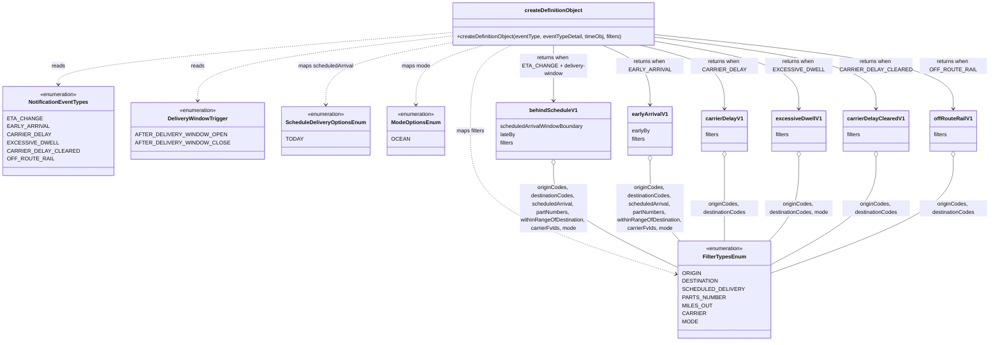

# Diagram: web/portal/src/pages/administration/notification-management/tests/testCreateDefinitionPayload.test.js

> Auto-generated by Obscura crawlers

## Mermaid

### SVG

<svg id="container" width="2806.34375" xmlns="http://www.w3.org/2000/svg" class="classDiagram" height="986" viewBox="0 0 2806.34375 986" role="graphics-document document" aria-roledescription="class"><g><defs><marker id="container_class-aggregationStart" class="marker aggregation class" refX="18" refY="7" markerWidth="190" markerHeight="240" orient="auto"><path d="M 18,7 L9,13 L1,7 L9,1 Z"></path></marker></defs><defs><marker id="container_class-aggregationEnd" class="marker aggregation class" refX="1" refY="7" markerWidth="20" markerHeight="28" orient="auto"><path d="M 18,7 L9,13 L1,7 L9,1 Z"></path></marker></defs><defs><marker id="container_class-extensionStart" class="marker extension class" refX="18" refY="7" markerWidth="190" markerHeight="240" orient="auto"><path d="M 1,7 L18,13 V 1 Z"></path></marker></defs><defs><marker id="container_class-extensionEnd" class="marker extension class" refX="1" refY="7" markerWidth="20" markerHeight="28" orient="auto"><path d="M 1,1 V 13 L18,7 Z"></path></marker></defs><defs><marker id="container_class-compositionStart" class="marker composition class" refX="18" refY="7" markerWidth="190" markerHeight="240" orient="auto"><path d="M 18,7 L9,13 L1,7 L9,1 Z"></path></marker></defs><defs><marker id="container_class-compositionEnd" class="marker composition class" refX="1" refY="7" markerWidth="20" markerHeight="28" orient="auto"><path d="M 18,7 L9,13 L1,7 L9,1 Z"></path></marker></defs><defs><marker id="container_class-dependencyStart" class="marker dependency class" refX="6" refY="7" markerWidth="190" markerHeight="240" orient="auto"><path d="M 5,7 L9,13 L1,7 L9,1 Z"></path></marker></defs><defs><marker id="container_class-dependencyEnd" class="marker dependency class" refX="13" refY="7" markerWidth="20" markerHeight="28" orient="auto"><path d="M 18,7 L9,13 L14,7 L9,1 Z"></path></marker></defs><defs><marker id="container_class-lollipopStart" class="marker lollipop class" refX="13" refY="7" markerWidth="190" markerHeight="240" orient="auto"><circle stroke="black" fill="transparent" cx="7" cy="7" r="6"></circle></marker></defs><defs><marker id="container_class-lollipopEnd" class="marker lollipop class" refX="1" refY="7" markerWidth="190" markerHeight="240" orient="auto"><circle stroke="black" fill="transparent" cx="7" cy="7" r="6"></circle></marker></defs><g class="root"><g class="clusters"></g><g class="edgePaths"><path d="M1232.852,95.434L1052.933,110.028C873.014,124.622,513.177,153.811,333.258,175.572C153.34,197.333,153.34,211.667,153.34,218.833L153.34,226" id="id_createDefinitionObject_NotificationEventTypes_1" class="edge-thickness-normal edge-pattern-dashed relation" style=";;;" data-edge="true" data-et="edge" data-id="id_createDefinitionObject_NotificationEventTypes_1" data-points="W3sieCI6MTIzMi44NTE1NjI1LCJ5Ijo5NS40MzM1NTc5NjU5NzEyNn0seyJ4IjoxNTMuMzM5ODQzNzUsInkiOjE4M30seyJ4IjoxNTMuMzM5ODQzNzUsInkiOjIzMn1d" marker-end="url(#container_class-dependencyEnd)"></path><path d="M1232.852,104.368L1114.551,117.474C996.25,130.579,759.648,156.789,641.348,185.061C523.047,213.333,523.047,243.667,523.047,258.833L523.047,274" id="id_createDefinitionObject_DeliveryWindowTrigger_2" class="edge-thickness-normal edge-pattern-dashed relation" style=";;;" data-edge="true" data-et="edge" data-id="id_createDefinitionObject_DeliveryWindowTrigger_2" data-points="W3sieCI6MTIzMi44NTE1NjI1LCJ5IjoxMDQuMzY4MzU4ODI3MTQzMDh9LHsieCI6NTIzLjA0Njg3NSwieSI6MTgzfSx7IngiOjUyMy4wNDY4NzUsInkiOjI4MH1d" marker-end="url(#container_class-dependencyEnd)"></path><path d="M1394.621,134L1376.545,142.167C1358.469,150.333,1322.316,166.667,1304.24,205C1286.164,243.333,1286.164,303.667,1286.164,372C1286.164,440.333,1286.164,516.667,1390.262,588.186C1494.36,659.706,1702.555,726.413,1806.653,759.766L1910.751,793.119" id="id_createDefinitionObject_FilterTypesEnum_3" class="edge-thickness-normal edge-pattern-dashed relation" style=";;;" data-edge="true" data-et="edge" data-id="id_createDefinitionObject_FilterTypesEnum_3" data-points="W3sieCI6MTM5NC42MjEzMzc4OTA2MjUsInkiOjEzNH0seyJ4IjoxMjg2LjE2NDA2MjUsInkiOjE4M30seyJ4IjoxMjg2LjE2NDA2MjUsInkiOjM2NH0seyJ4IjoxMjg2LjE2NDA2MjUsInkiOjU5M30seyJ4IjoxOTE2LjQ2NDg0Mzc1LCJ5Ijo3OTQuOTQ5NzM0NjI1NDExNn1d" marker-end="url(#container_class-dependencyEnd)"></path><path d="M1232.852,121.95L1172.698,132.125C1112.544,142.3,992.237,162.65,932.083,189.992C871.93,217.333,871.93,251.667,871.93,268.833L871.93,286" id="id_createDefinitionObject_ScheduleDeliveryOptionsEnum_4" class="edge-thickness-normal edge-pattern-dashed relation" style=";;;" data-edge="true" data-et="edge" data-id="id_createDefinitionObject_ScheduleDeliveryOptionsEnum_4" data-points="W3sieCI6MTIzMi44NTE1NjI1LCJ5IjoxMjEuOTUwMjk3MDM3ODgwNDN9LHsieCI6ODcxLjkyOTY4NzUsInkiOjE4M30seyJ4Ijo4NzEuOTI5Njg3NSwieSI6MjkyfV0=" marker-end="url(#container_class-dependencyEnd)"></path><path d="M1305.377,134L1275.732,142.167C1246.087,150.333,1186.798,166.667,1157.153,192C1127.508,217.333,1127.508,251.667,1127.508,268.833L1127.508,286" id="id_createDefinitionObject_ModeOptionsEnum_5" class="edge-thickness-normal edge-pattern-dashed relation" style=";;;" data-edge="true" data-et="edge" data-id="id_createDefinitionObject_ModeOptionsEnum_5" data-points="W3sieCI6MTMwNS4zNzcxOTcyNjU2MjUsInkiOjEzNH0seyJ4IjoxMTI3LjUwNzgxMjUsInkiOjE4M30seyJ4IjoxMTI3LjUwNzgxMjUsInkiOjI5Mn1d" marker-end="url(#container_class-dependencyEnd)"></path><path d="M1534.066,134L1534.066,142.167C1534.066,150.333,1534.066,166.667,1534.066,190C1534.066,213.333,1534.066,243.667,1534.066,258.833L1534.066,274" id="id_createDefinitionObject_behindScheduleV1_6" class="edge-thickness-normal edge-pattern-solid relation" style=";;;" data-edge="true" data-et="edge" data-id="id_createDefinitionObject_behindScheduleV1_6" data-points="W3sieCI6MTUzNC4wNjY0MDYyNSwieSI6MTM0fSx7IngiOjE1MzQuMDY2NDA2MjUsInkiOjE4M30seyJ4IjoxNTM0LjA2NjQwNjI1LCJ5IjoyODB9XQ==" marker-end="url(#container_class-dependencyEnd)"></path><path d="M1693.972,134L1714.701,142.167C1735.43,150.333,1776.887,166.667,1797.615,192C1818.344,217.333,1818.344,251.667,1818.344,268.833L1818.344,286" id="id_createDefinitionObject_earlyArrivalV1_7" class="edge-thickness-normal edge-pattern-solid relation" style=";;;" data-edge="true" data-et="edge" data-id="id_createDefinitionObject_earlyArrivalV1_7" data-points="W3sieCI6MTY5My45NzI0MTIxMDkzNzUsInkiOjEzNH0seyJ4IjoxODE4LjM0Mzc1LCJ5IjoxODN9LHsieCI6MTgxOC4zNDM3NSwieSI6MjkyfV0=" marker-end="url(#container_class-dependencyEnd)"></path><path d="M1817.722,134L1854.493,142.167C1891.263,150.333,1964.803,166.667,2001.574,194C2038.344,221.333,2038.344,259.667,2038.344,278.833L2038.344,298" id="id_createDefinitionObject_carrierDelayV1_8" class="edge-thickness-normal edge-pattern-solid relation" style=";;;" data-edge="true" data-et="edge" data-id="id_createDefinitionObject_carrierDelayV1_8" data-points="W3sieCI6MTgxNy43MjI0MTIxMDkzNzUsInkiOjEzNH0seyJ4IjoyMDM4LjM0Mzc1LCJ5IjoxODN9LHsieCI6MjAzOC4zNDM3NSwieSI6MzA0fV0=" marker-end="url(#container_class-dependencyEnd)"></path><path d="M1835.281,117.579L1905.792,128.482C1976.302,139.386,2117.323,161.193,2187.833,191.263C2258.344,221.333,2258.344,259.667,2258.344,278.833L2258.344,298" id="id_createDefinitionObject_excessiveDwellV1_9" class="edge-thickness-normal edge-pattern-solid relation" style=";;;" data-edge="true" data-et="edge" data-id="id_createDefinitionObject_excessiveDwellV1_9" data-points="W3sieCI6MTgzNS4yODEyNSwieSI6MTE3LjU3ODkyODM0OTkxNzc2fSx7IngiOjIyNTguMzQzNzUsInkiOjE4M30seyJ4IjoyMjU4LjM0Mzc1LCJ5IjozMDR9XQ==" marker-end="url(#container_class-dependencyEnd)"></path><path d="M1835.281,106.727L1942.458,119.439C2049.635,132.151,2263.99,157.576,2371.167,189.454C2478.344,221.333,2478.344,259.667,2478.344,278.833L2478.344,298" id="id_createDefinitionObject_carrierDelayClearedV1_10" class="edge-thickness-normal edge-pattern-solid relation" style=";;;" data-edge="true" data-et="edge" data-id="id_createDefinitionObject_carrierDelayClearedV1_10" data-points="W3sieCI6MTgzNS4yODEyNSwieSI6MTA2LjcyNjg1NzkyMjkzMjE0fSx7IngiOjI0NzguMzQzNzUsInkiOjE4M30seyJ4IjoyNDc4LjM0Mzc1LCJ5IjozMDR9XQ==" marker-end="url(#container_class-dependencyEnd)"></path><path d="M1835.281,99.976L1979.125,113.813C2122.969,127.651,2410.656,155.325,2554.5,188.329C2698.344,221.333,2698.344,259.667,2698.344,278.833L2698.344,298" id="id_createDefinitionObject_offRouteRailV1_11" class="edge-thickness-normal edge-pattern-solid relation" style=";;;" data-edge="true" data-et="edge" data-id="id_createDefinitionObject_offRouteRailV1_11" data-points="W3sieCI6MTgzNS4yODEyNSwieSI6OTkuOTc1OTY3NTIyNzcyNjN9LHsieCI6MjY5OC4zNDM3NSwieSI6MTgzfSx7IngiOjI2OTguMzQzNzUsInkiOjMwNH1d" marker-end="url(#container_class-dependencyEnd)"></path><path d="M1534.066,465.25L1534.066,486.542C1534.066,507.833,1534.066,550.417,1597.799,602.167C1661.533,653.918,1788.999,714.835,1852.732,745.294L1916.465,775.753" id="id_behindScheduleV1_FilterTypesEnum_12" class="edge-thickness-normal edge-pattern-solid relation" style=";;;" data-edge="true" data-et="edge" data-id="id_behindScheduleV1_FilterTypesEnum_12" data-points="W3sieCI6MTUzNC4wNjY0MDYyNSwieSI6NDQ4fSx7IngiOjE1MzQuMDY2NDA2MjUsInkiOjU5M30seyJ4IjoxOTE2LjQ2NDg0Mzc1LCJ5Ijo3NzUuNzUyNjU1MDIxNDk1OH1d" marker-start="url(#container_class-aggregationStart)"></path><path d="M1818.344,453.25L1818.344,476.542C1818.344,499.833,1818.344,546.417,1834.697,587.623C1851.051,628.829,1883.758,664.658,1900.111,682.573L1916.465,700.487" id="id_earlyArrivalV1_FilterTypesEnum_13" class="edge-thickness-normal edge-pattern-solid relation" style=";;;" data-edge="true" data-et="edge" data-id="id_earlyArrivalV1_FilterTypesEnum_13" data-points="W3sieCI6MTgxOC4zNDM3NSwieSI6NDM2fSx7IngiOjE4MTguMzQzNzUsInkiOjU5M30seyJ4IjoxOTE2LjQ2NDg0Mzc1LCJ5Ijo3MDAuNDg3MTk4MTUzNDA5fV0=" marker-start="url(#container_class-aggregationStart)"></path><path d="M2038.344,441.25L2038.344,466.542C2038.344,491.833,2038.344,542.417,2038.344,583.875C2038.344,625.333,2038.344,657.667,2038.344,673.833L2038.344,690" id="id_carrierDelayV1_FilterTypesEnum_14" class="edge-thickness-normal edge-pattern-solid relation" style=";;;" data-edge="true" data-et="edge" data-id="id_carrierDelayV1_FilterTypesEnum_14" data-points="W3sieCI6MjAzOC4zNDM3NSwieSI6NDI0fSx7IngiOjIwMzguMzQzNzUsInkiOjU5M30seyJ4IjoyMDM4LjM0Mzc1LCJ5Ijo2OTB9XQ==" marker-start="url(#container_class-aggregationStart)"></path><path d="M2258.344,441.25L2258.344,466.542C2258.344,491.833,2258.344,542.417,2241.99,585.623C2225.637,628.829,2192.93,664.658,2176.576,682.573L2160.223,700.487" id="id_excessiveDwellV1_FilterTypesEnum_15" class="edge-thickness-normal edge-pattern-solid relation" style=";;;" data-edge="true" data-et="edge" data-id="id_excessiveDwellV1_FilterTypesEnum_15" data-points="W3sieCI6MjI1OC4zNDM3NSwieSI6NDI0fSx7IngiOjIyNTguMzQzNzUsInkiOjU5M30seyJ4IjoyMTYwLjIyMjY1NjI1LCJ5Ijo3MDAuNDg3MTk4MTUzNDA5fV0=" marker-start="url(#container_class-aggregationStart)"></path><path d="M2478.344,441.25L2478.344,466.542C2478.344,491.833,2478.344,542.417,2425.324,596.749C2372.303,651.081,2266.263,709.162,2213.243,738.203L2160.223,767.244" id="id_carrierDelayClearedV1_FilterTypesEnum_16" class="edge-thickness-normal edge-pattern-solid relation" style=";;;" data-edge="true" data-et="edge" data-id="id_carrierDelayClearedV1_FilterTypesEnum_16" data-points="W3sieCI6MjQ3OC4zNDM3NSwieSI6NDI0fSx7IngiOjI0NzguMzQzNzUsInkiOjU5M30seyJ4IjoyMTYwLjIyMjY1NjI1LCJ5Ijo3NjcuMjQzNTk5MDc2NzA0NX1d" marker-start="url(#container_class-aggregationStart)"></path><path d="M2698.344,441.25L2698.344,466.542C2698.344,491.833,2698.344,542.417,2608.657,600.458C2518.97,658.499,2339.596,723.997,2249.91,756.746L2160.223,789.496" id="id_offRouteRailV1_FilterTypesEnum_17" class="edge-thickness-normal edge-pattern-solid relation" style=";;;" data-edge="true" data-et="edge" data-id="id_offRouteRailV1_FilterTypesEnum_17" data-points="W3sieCI6MjY5OC4zNDM3NSwieSI6NDI0fSx7IngiOjI2OTguMzQzNzUsInkiOjU5M30seyJ4IjoyMTYwLjIyMjY1NjI1LCJ5Ijo3ODkuNDk1NzMyNzE3ODAzfV0=" marker-start="url(#container_class-aggregationStart)"></path></g><g class="edgeLabels"><g class="edgeLabel" transform="translate(153.33984375, 183)"><g class="label" data-id="id_createDefinitionObject_NotificationEventTypes_1" transform="translate(-20.0078125, -12)"><foreignObject width="40.015625" height="24">

reads

</foreignObject></g></g><g class="edgeLabel" transform="translate(523.046875, 183)"><g class="label" data-id="id_createDefinitionObject_DeliveryWindowTrigger_2" transform="translate(-20.0078125, -12)"><foreignObject width="40.015625" height="24">

reads

</foreignObject></g></g><g class="edgeLabel" transform="translate(1286.1640625, 364)"><g class="label" data-id="id_createDefinitionObject_FilterTypesEnum_3" transform="translate(-42.59375, -12)"><foreignObject width="85.1875" height="24">

maps filters

</foreignObject></g></g><g class="edgeLabel" transform="translate(871.9296875, 183)"><g class="label" data-id="id_createDefinitionObject_ScheduleDeliveryOptionsEnum_4" transform="translate(-82.7578125, -12)"><foreignObject width="165.515625" height="24">

maps scheduledArrival

</foreignObject></g></g><g class="edgeLabel" transform="translate(1127.5078125, 183)"><g class="label" data-id="id_createDefinitionObject_ModeOptionsEnum_5" transform="translate(-42.4921875, -12)"><foreignObject width="84.984375" height="24">

maps mode

</foreignObject></g></g><g class="edgeLabel" transform="translate(1534.06640625, 183)"><g class="label" data-id="id_createDefinitionObject_behindScheduleV1_6" transform="translate(-100, -24)"><foreignObject width="200" height="48">

returns when ETA_CHANGE + delivery-window

</foreignObject></g></g><g class="edgeLabel" transform="translate(1818.34375, 183)"><g class="label" data-id="id_createDefinitionObject_earlyArrivalV1_7" transform="translate(-100, -24)"><foreignObject width="200" height="48">

returns when EARLY_ARRIVAL

</foreignObject></g></g><g class="edgeLabel" transform="translate(2038.34375, 183)"><g class="label" data-id="id_createDefinitionObject_carrierDelayV1_8" transform="translate(-100, -24)"><foreignObject width="200" height="48">

returns when CARRIER_DELAY

</foreignObject></g></g><g class="edgeLabel" transform="translate(2258.34375, 183)"><g class="label" data-id="id_createDefinitionObject_excessiveDwellV1_9" transform="translate(-100, -24)"><foreignObject width="200" height="48">

returns when EXCESSIVE_DWELL

</foreignObject></g></g><g class="edgeLabel" transform="translate(2478.34375, 183)"><g class="label" data-id="id_createDefinitionObject_carrierDelayClearedV1_10" transform="translate(-100, -24)"><foreignObject width="200" height="48">

returns when CARRIER_DELAY_CLEARED

</foreignObject></g></g><g class="edgeLabel" transform="translate(2698.34375, 183)"><g class="label" data-id="id_createDefinitionObject_offRouteRailV1_11" transform="translate(-100, -24)"><foreignObject width="200" height="48">

returns when OFF_ROUTE_RAIL

</foreignObject></g></g><g class="edgeLabel" transform="translate(1534.06640625, 593)"><g class="label" data-id="id_behindScheduleV1_FilterTypesEnum_12" transform="translate(-100, -72)"><foreignObject width="200" height="144">

originCodes, destinationCodes, scheduledArrival, partNumbers, withinRangeOfDestination, carrierFvIds, mode

</foreignObject></g></g><g class="edgeLabel" transform="translate(1818.34375, 593)"><g class="label" data-id="id_earlyArrivalV1_FilterTypesEnum_13" transform="translate(-100, -72)"><foreignObject width="200" height="144">

originCodes, destinationCodes, scheduledArrival, partNumbers, withinRangeOfDestination, carrierFvIds, mode

</foreignObject></g></g><g class="edgeLabel" transform="translate(2038.34375, 593)"><g class="label" data-id="id_carrierDelayV1_FilterTypesEnum_14" transform="translate(-100, -24)"><foreignObject width="200" height="48">

originCodes, destinationCodes

</foreignObject></g></g><g class="edgeLabel" transform="translate(2258.34375, 593)"><g class="label" data-id="id_excessiveDwellV1_FilterTypesEnum_15" transform="translate(-100, -24)"><foreignObject width="200" height="48">

originCodes, destinationCodes, mode

</foreignObject></g></g><g class="edgeLabel" transform="translate(2478.34375, 593)"><g class="label" data-id="id_carrierDelayClearedV1_FilterTypesEnum_16" transform="translate(-100, -24)"><foreignObject width="200" height="48">

originCodes, destinationCodes

</foreignObject></g></g><g class="edgeLabel" transform="translate(2698.34375, 593)"><g class="label" data-id="id_offRouteRailV1_FilterTypesEnum_17" transform="translate(-100, -24)"><foreignObject width="200" height="48">

originCodes, destinationCodes

</foreignObject></g></g></g><g class="nodes"><g class="node default" id="classId-createDefinitionObject-0" transform="translate(1534.06640625, 71)"><g class="basic label-container"><path d="M-301.21484375 -63 L301.21484375 -63 L301.21484375 63 L-301.21484375 63" stroke="none" stroke-width="0" fill="#ECECFF" style=""></path><path d="M-301.21484375 -63 C-140.5189071717356 -63, 20.17702940652879 -63, 301.21484375 -63 M-301.21484375 -63 C-163.78376568536282 -63, -26.352687620725646 -63, 301.21484375 -63 M301.21484375 -63 C301.21484375 -14.214075312367974, 301.21484375 34.57184937526405, 301.21484375 63 M301.21484375 -63 C301.21484375 -25.240056749452606, 301.21484375 12.519886501094788, 301.21484375 63 M301.21484375 63 C84.31240940134822 63, -132.59002494730356 63, -301.21484375 63 M301.21484375 63 C116.78930456172745 63, -67.6362346265451 63, -301.21484375 63 M-301.21484375 63 C-301.21484375 26.221307419978878, -301.21484375 -10.557385160042244, -301.21484375 -63 M-301.21484375 63 C-301.21484375 15.044940485363206, -301.21484375 -32.91011902927359, -301.21484375 -63" stroke="#9370DB" stroke-width="1.3" fill="none" stroke-dasharray="0 0" style=""></path></g><g class="annotation-group text" transform="translate(0, -39)"></g><g class="label-group text" transform="translate(-82.6953125, -39)"><g class="label" style="font-weight: bolder" transform="translate(0,-12)"><foreignObject width="165.390625" height="24">

createDefinitionObject

</foreignObject></g></g><g class="members-group text" transform="translate(-289.21484375, 9)"></g><g class="methods-group text" transform="translate(-289.21484375, 39)"><g class="label" style="" transform="translate(0,-12)"><foreignObject width="495.734375" height="24">

+createDefinitionObject(eventType, eventTypeDetail, timeObj, filters)

</foreignObject></g></g><g class="divider" style=""><path d="M-301.21484375 -15 C-114.4103346567889 -15, 72.39417443642219 -15, 301.21484375 -15 M-301.21484375 -15 C-118.89997475812763 -15, 63.41489423374475 -15, 301.21484375 -15" stroke="#9370DB" stroke-width="1.3" fill="none" stroke-dasharray="0 0" style=""></path></g><g class="divider" style=""><path d="M-301.21484375 9 C-115.30589335463736 9, 70.60305704072528 9, 301.21484375 9 M-301.21484375 9 C-64.22883322914629 9, 172.75717729170742 9, 301.21484375 9" stroke="#9370DB" stroke-width="1.3" fill="none" stroke-dasharray="0 0" style=""></path></g></g><g class="node default" id="classId-NotificationEventTypes-1" transform="translate(153.33984375, 364)"><g class="basic label-container"><path d="M-145.33984375 -132 L145.33984375 -132 L145.33984375 132 L-145.33984375 132" stroke="none" stroke-width="0" fill="#ECECFF" style=""></path><path d="M-145.33984375 -132 C-76.9607576367382 -132, -8.581671523476388 -132, 145.33984375 -132 M-145.33984375 -132 C-67.1251090458061 -132, 11.089625658387803 -132, 145.33984375 -132 M145.33984375 -132 C145.33984375 -34.24273443043046, 145.33984375 63.51453113913908, 145.33984375 132 M145.33984375 -132 C145.33984375 -26.4312871374145, 145.33984375 79.137425725171, 145.33984375 132 M145.33984375 132 C31.057564992433527 132, -83.22471376513295 132, -145.33984375 132 M145.33984375 132 C40.706706869702316 132, -63.92643001059537 132, -145.33984375 132 M-145.33984375 132 C-145.33984375 36.677855625141206, -145.33984375 -58.64428874971759, -145.33984375 -132 M-145.33984375 132 C-145.33984375 34.79175220309685, -145.33984375 -62.4164955938063, -145.33984375 -132" stroke="#9370DB" stroke-width="1.3" fill="none" stroke-dasharray="0 0" style=""></path></g><g class="annotation-group text" transform="translate(-55.5546875, -108)"><g class="label" style="" transform="translate(0,-12)"><foreignObject width="111.109375" height="24">

«enumeration»

</foreignObject></g></g><g class="label-group text" transform="translate(-84.2890625, -84)"><g class="label" style="font-weight: bolder" transform="translate(0,-12)"><foreignObject width="168.578125" height="24">

NotificationEventTypes

</foreignObject></g></g><g class="members-group text" transform="translate(-133.33984375, -36)"><g class="label" style="" transform="translate(0,-12)"><foreignObject width="91.484375" height="24">

ETA_CHANGE

</foreignObject></g><g class="label" style="" transform="translate(0,12)"><foreignObject width="108.84375" height="24">

EARLY_ARRIVAL

</foreignObject></g><g class="label" style="" transform="translate(0,36)"><foreignObject width="112.796875" height="24">

CARRIER_DELAY

</foreignObject></g><g class="label" style="" transform="translate(0,60)"><foreignObject width="130.109375" height="24">

EXCESSIVE_DWELL

</foreignObject></g><g class="label" style="" transform="translate(0,84)"><foreignObject width="182.390625" height="24">

CARRIER_DELAY_CLEARED

</foreignObject></g><g class="label" style="" transform="translate(0,108)"><foreignObject width="121.40625" height="24">

OFF_ROUTE_RAIL

</foreignObject></g></g><g class="methods-group text" transform="translate(-133.33984375, 132)"></g><g class="divider" style=""><path d="M-145.33984375 -60 C-87.09128908217005 -60, -28.8427344143401 -60, 145.33984375 -60 M-145.33984375 -60 C-78.46095553224953 -60, -11.582067314499056 -60, 145.33984375 -60" stroke="#9370DB" stroke-width="1.3" fill="none" stroke-dasharray="0 0" style=""></path></g><g class="divider" style=""><path d="M-145.33984375 108 C-45.04024244781557 108, 55.259358854368855 108, 145.33984375 108 M-145.33984375 108 C-83.51326798020565 108, -21.68669221041131 108, 145.33984375 108" stroke="#9370DB" stroke-width="1.3" fill="none" stroke-dasharray="0 0" style=""></path></g></g><g class="node default" id="classId-DeliveryWindowTrigger-2" transform="translate(523.046875, 364)"><g class="basic label-container"><path d="M-174.3671875 -84 L174.3671875 -84 L174.3671875 84 L-174.3671875 84" stroke="none" stroke-width="0" fill="#ECECFF" style=""></path><path d="M-174.3671875 -84 C-35.65931410840764 -84, 103.04855928318472 -84, 174.3671875 -84 M-174.3671875 -84 C-62.847084433744584 -84, 48.67301863251083 -84, 174.3671875 -84 M174.3671875 -84 C174.3671875 -45.32013291638709, 174.3671875 -6.640265832774176, 174.3671875 84 M174.3671875 -84 C174.3671875 -18.362956162011415, 174.3671875 47.27408767597717, 174.3671875 84 M174.3671875 84 C70.83793130772631 84, -32.691324884547384 84, -174.3671875 84 M174.3671875 84 C84.000443329176 84, -6.3663008416480125 84, -174.3671875 84 M-174.3671875 84 C-174.3671875 24.150709083468193, -174.3671875 -35.69858183306361, -174.3671875 -84 M-174.3671875 84 C-174.3671875 22.417434826860998, -174.3671875 -39.165130346278005, -174.3671875 -84" stroke="#9370DB" stroke-width="1.3" fill="none" stroke-dasharray="0 0" style=""></path></g><g class="annotation-group text" transform="translate(-55.5546875, -60)"><g class="label" style="" transform="translate(0,-12)"><foreignObject width="111.109375" height="24">

«enumeration»

</foreignObject></g></g><g class="label-group text" transform="translate(-84.984375, -36)"><g class="label" style="font-weight: bolder" transform="translate(0,-12)"><foreignObject width="169.96875" height="24">

DeliveryWindowTrigger

</foreignObject></g></g><g class="members-group text" transform="translate(-162.3671875, 12)"><g class="label" style="" transform="translate(0,-12)"><foreignObject width="235.046875" height="24">

AFTER_DELIVERY_WINDOW_OPEN

</foreignObject></g><g class="label" style="" transform="translate(0,12)"><foreignObject width="239.75" height="24">

AFTER_DELIVERY_WINDOW_CLOSE

</foreignObject></g></g><g class="methods-group text" transform="translate(-162.3671875, 84)"></g><g class="divider" style=""><path d="M-174.3671875 -12 C-40.36069843739298 -12, 93.64579062521403 -12, 174.3671875 -12 M-174.3671875 -12 C-49.84289577917387 -12, 74.68139594165226 -12, 174.3671875 -12" stroke="#9370DB" stroke-width="1.3" fill="none" stroke-dasharray="0 0" style=""></path></g><g class="divider" style=""><path d="M-174.3671875 60 C-78.0113343230279 60, 18.34451885394421 60, 174.3671875 60 M-174.3671875 60 C-91.45182615346214 60, -8.536464806924272 60, 174.3671875 60" stroke="#9370DB" stroke-width="1.3" fill="none" stroke-dasharray="0 0" style=""></path></g></g><g class="node default" id="classId-FilterTypesEnum-3" transform="translate(2038.34375, 834)"><g class="basic label-container"><path d="M-121.87890625 -144 L121.87890625 -144 L121.87890625 144 L-121.87890625 144" stroke="none" stroke-width="0" fill="#ECECFF" style=""></path><path d="M-121.87890625 -144 C-42.55359752106837 -144, 36.77171120786326 -144, 121.87890625 -144 M-121.87890625 -144 C-26.338384131273443 -144, 69.20213798745311 -144, 121.87890625 -144 M121.87890625 -144 C121.87890625 -70.45190682310542, 121.87890625 3.0961863537891645, 121.87890625 144 M121.87890625 -144 C121.87890625 -59.34534133638101, 121.87890625 25.309317327237977, 121.87890625 144 M121.87890625 144 C48.610229077767656 144, -24.65844809446469 144, -121.87890625 144 M121.87890625 144 C37.21799824369545 144, -47.442909762609105 144, -121.87890625 144 M-121.87890625 144 C-121.87890625 68.52245078651836, -121.87890625 -6.955098426963275, -121.87890625 -144 M-121.87890625 144 C-121.87890625 85.49630223964851, -121.87890625 26.992604479297015, -121.87890625 -144" stroke="#9370DB" stroke-width="1.3" fill="none" stroke-dasharray="0 0" style=""></path></g><g class="annotation-group text" transform="translate(-55.5546875, -120)"><g class="label" style="" transform="translate(0,-12)"><foreignObject width="111.109375" height="24">

«enumeration»

</foreignObject></g></g><g class="label-group text" transform="translate(-60.1484375, -96)"><g class="label" style="font-weight: bolder" transform="translate(0,-12)"><foreignObject width="120.296875" height="24">

FilterTypesEnum

</foreignObject></g></g><g class="members-group text" transform="translate(-109.87890625, -48)"><g class="label" style="" transform="translate(0,-12)"><foreignObject width="51.21875" height="24">

ORIGIN

</foreignObject></g><g class="label" style="" transform="translate(0,12)"><foreignObject width="94.359375" height="24">

DESTINATION

</foreignObject></g><g class="label" style="" transform="translate(0,36)"><foreignObject width="159.609375" height="24">

SCHEDULED_DELIVERY

</foreignObject></g><g class="label" style="" transform="translate(0,60)"><foreignObject width="113.3125" height="24">

PARTS_NUMBER

</foreignObject></g><g class="label" style="" transform="translate(0,84)"><foreignObject width="79.40625" height="24">

MILES_OUT

</foreignObject></g><g class="label" style="" transform="translate(0,108)"><foreignObject width="60.453125" height="24">

CARRIER

</foreignObject></g><g class="label" style="" transform="translate(0,132)"><foreignObject width="42.234375" height="24">

MODE

</foreignObject></g></g><g class="methods-group text" transform="translate(-109.87890625, 144)"></g><g class="divider" style=""><path d="M-121.87890625 -72 C-46.68555185636147 -72, 28.50780253727706 -72, 121.87890625 -72 M-121.87890625 -72 C-62.017410567938484 -72, -2.1559148858769674 -72, 121.87890625 -72" stroke="#9370DB" stroke-width="1.3" fill="none" stroke-dasharray="0 0" style=""></path></g><g class="divider" style=""><path d="M-121.87890625 120 C-37.24264672623568 120, 47.39361279752865 120, 121.87890625 120 M-121.87890625 120 C-71.72789677913288 120, -21.576887308265754 120, 121.87890625 120" stroke="#9370DB" stroke-width="1.3" fill="none" stroke-dasharray="0 0" style=""></path></g></g><g class="node default" id="classId-ScheduleDeliveryOptionsEnum-4" transform="translate(871.9296875, 364)"><g class="basic label-container"><path d="M-124.515625 -72 L124.515625 -72 L124.515625 72 L-124.515625 72" stroke="none" stroke-width="0" fill="#ECECFF" style=""></path><path d="M-124.515625 -72 C-37.43982656765266 -72, 49.63597186469468 -72, 124.515625 -72 M-124.515625 -72 C-36.99751146847828 -72, 50.52060206304344 -72, 124.515625 -72 M124.515625 -72 C124.515625 -31.281997774214368, 124.515625 9.436004451571264, 124.515625 72 M124.515625 -72 C124.515625 -42.15970008472961, 124.515625 -12.319400169459215, 124.515625 72 M124.515625 72 C68.65621924050407 72, 12.796813481008158 72, -124.515625 72 M124.515625 72 C37.759619674005265 72, -48.99638565198947 72, -124.515625 72 M-124.515625 72 C-124.515625 18.55471412871671, -124.515625 -34.89057174256658, -124.515625 -72 M-124.515625 72 C-124.515625 34.47771644345966, -124.515625 -3.0445671130806744, -124.515625 -72" stroke="#9370DB" stroke-width="1.3" fill="none" stroke-dasharray="0 0" style=""></path></g><g class="annotation-group text" transform="translate(-55.5546875, -48)"><g class="label" style="" transform="translate(0,-12)"><foreignObject width="111.109375" height="24">

«enumeration»

</foreignObject></g></g><g class="label-group text" transform="translate(-112.515625, -24)"><g class="label" style="font-weight: bolder" transform="translate(0,-12)"><foreignObject width="225.03125" height="24">

ScheduleDeliveryOptionsEnum

</foreignObject></g></g><g class="members-group text" transform="translate(-112.515625, 24)"><g class="label" style="" transform="translate(0,-12)"><foreignObject width="46.125" height="24">

TODAY

</foreignObject></g></g><g class="methods-group text" transform="translate(-112.515625, 72)"></g><g class="divider" style=""><path d="M-124.515625 0 C-61.087087718162806 0, 2.341449563674388 0, 124.515625 0 M-124.515625 0 C-44.594741110370705 0, 35.32614277925859 0, 124.515625 0" stroke="#9370DB" stroke-width="1.3" fill="none" stroke-dasharray="0 0" style=""></path></g><g class="divider" style=""><path d="M-124.515625 48 C-30.06377703918578 48, 64.38807092162844 48, 124.515625 48 M-124.515625 48 C-68.96526421614362 48, -13.414903432287232 48, 124.515625 48" stroke="#9370DB" stroke-width="1.3" fill="none" stroke-dasharray="0 0" style=""></path></g></g><g class="node default" id="classId-ModeOptionsEnum-5" transform="translate(1127.5078125, 364)"><g class="basic label-container"><path d="M-81.0625 -72 L81.0625 -72 L81.0625 72 L-81.0625 72" stroke="none" stroke-width="0" fill="#ECECFF" style=""></path><path d="M-81.0625 -72 C-24.09170999598699 -72, 32.87908000802602 -72, 81.0625 -72 M-81.0625 -72 C-22.86840912599856 -72, 35.32568174800288 -72, 81.0625 -72 M81.0625 -72 C81.0625 -36.12459461063871, 81.0625 -0.24918922127741894, 81.0625 72 M81.0625 -72 C81.0625 -38.145412381447215, 81.0625 -4.290824762894431, 81.0625 72 M81.0625 72 C29.40823347182736 72, -22.246033056345283 72, -81.0625 72 M81.0625 72 C27.2861800604354 72, -26.490139879129202 72, -81.0625 72 M-81.0625 72 C-81.0625 36.59584634213078, -81.0625 1.1916926842615538, -81.0625 -72 M-81.0625 72 C-81.0625 23.42656612844643, -81.0625 -25.146867743107137, -81.0625 -72" stroke="#9370DB" stroke-width="1.3" fill="none" stroke-dasharray="0 0" style=""></path></g><g class="annotation-group text" transform="translate(-55.5546875, -48)"><g class="label" style="" transform="translate(0,-12)"><foreignObject width="111.109375" height="24">

«enumeration»

</foreignObject></g></g><g class="label-group text" transform="translate(-69.0625, -24)"><g class="label" style="font-weight: bolder" transform="translate(0,-12)"><foreignObject width="138.125" height="24">

ModeOptionsEnum

</foreignObject></g></g><g class="members-group text" transform="translate(-69.0625, 24)"><g class="label" style="" transform="translate(0,-12)"><foreignObject width="48.703125" height="24">

OCEAN

</foreignObject></g></g><g class="methods-group text" transform="translate(-69.0625, 72)"></g><g class="divider" style=""><path d="M-81.0625 0 C-33.1115238619124 0, 14.839452276175194 0, 81.0625 0 M-81.0625 0 C-38.13986648335325 0, 4.782767033293496 0, 81.0625 0" stroke="#9370DB" stroke-width="1.3" fill="none" stroke-dasharray="0 0" style=""></path></g><g class="divider" style=""><path d="M-81.0625 48 C-33.19954327952885 48, 14.663413440942307 48, 81.0625 48 M-81.0625 48 C-26.47134984307693 48, 28.11980031384614 48, 81.0625 48" stroke="#9370DB" stroke-width="1.3" fill="none" stroke-dasharray="0 0" style=""></path></g></g><g class="node default" id="classId-behindScheduleV1-6" transform="translate(1534.06640625, 364)"><g class="basic label-container"><path d="M-170.30859375 -84 L170.30859375 -84 L170.30859375 84 L-170.30859375 84" stroke="none" stroke-width="0" fill="#ECECFF" style=""></path><path d="M-170.30859375 -84 C-40.835087872708755 -84, 88.63841800458249 -84, 170.30859375 -84 M-170.30859375 -84 C-47.939086032953725 -84, 74.43042168409255 -84, 170.30859375 -84 M170.30859375 -84 C170.30859375 -38.82356759972426, 170.30859375 6.352864800551487, 170.30859375 84 M170.30859375 -84 C170.30859375 -38.83452283187243, 170.30859375 6.330954336255147, 170.30859375 84 M170.30859375 84 C43.83063241098239 84, -82.64732892803522 84, -170.30859375 84 M170.30859375 84 C43.609997965068956 84, -83.08859781986209 84, -170.30859375 84 M-170.30859375 84 C-170.30859375 45.35247556283298, -170.30859375 6.704951125665957, -170.30859375 -84 M-170.30859375 84 C-170.30859375 24.133875543440404, -170.30859375 -35.73224891311919, -170.30859375 -84" stroke="#9370DB" stroke-width="1.3" fill="none" stroke-dasharray="0 0" style=""></path></g><g class="annotation-group text" transform="translate(0, -60)"></g><g class="label-group text" transform="translate(-67.1640625, -60)"><g class="label" style="font-weight: bolder" transform="translate(0,-12)"><foreignObject width="134.328125" height="24">

behindScheduleV1

</foreignObject></g></g><g class="members-group text" transform="translate(-158.30859375, -12)"><g class="label" style="" transform="translate(0,-12)"><foreignObject width="249.453125" height="24">

scheduledArrivalWindowBoundary

</foreignObject></g><g class="label" style="" transform="translate(0,12)"><foreignObject width="45.171875" height="24">

lateBy

</foreignObject></g><g class="label" style="" transform="translate(0,36)"><foreignObject width="41.5625" height="24">

filters

</foreignObject></g></g><g class="methods-group text" transform="translate(-158.30859375, 84)"></g><g class="divider" style=""><path d="M-170.30859375 -36 C-54.28220053330391 -36, 61.744192683392185 -36, 170.30859375 -36 M-170.30859375 -36 C-50.36979867291544 -36, 69.56899640416913 -36, 170.30859375 -36" stroke="#9370DB" stroke-width="1.3" fill="none" stroke-dasharray="0 0" style=""></path></g><g class="divider" style=""><path d="M-170.30859375 60 C-91.62071595445185 60, -12.932838158903706 60, 170.30859375 60 M-170.30859375 60 C-84.95411987110512 60, 0.40035400778975827 60, 170.30859375 60" stroke="#9370DB" stroke-width="1.3" fill="none" stroke-dasharray="0 0" style=""></path></g></g><g class="node default" id="classId-earlyArrivalV1-7" transform="translate(1818.34375, 364)"><g class="basic label-container"><path d="M-63.96875 -72 L63.96875 -72 L63.96875 72 L-63.96875 72" stroke="none" stroke-width="0" fill="#ECECFF" style=""></path><path d="M-63.96875 -72 C-29.654167747431515 -72, 4.66041450513697 -72, 63.96875 -72 M-63.96875 -72 C-35.31555216088951 -72, -6.662354321779027 -72, 63.96875 -72 M63.96875 -72 C63.96875 -27.405886759884766, 63.96875 17.18822648023047, 63.96875 72 M63.96875 -72 C63.96875 -15.757569885800969, 63.96875 40.48486022839806, 63.96875 72 M63.96875 72 C29.14142426888221 72, -5.685901462235577 72, -63.96875 72 M63.96875 72 C22.627397613489386 72, -18.71395477302123 72, -63.96875 72 M-63.96875 72 C-63.96875 40.814004680406896, -63.96875 9.628009360813792, -63.96875 -72 M-63.96875 72 C-63.96875 30.95733282066101, -63.96875 -10.085334358677983, -63.96875 -72" stroke="#9370DB" stroke-width="1.3" fill="none" stroke-dasharray="0 0" style=""></path></g><g class="annotation-group text" transform="translate(0, -48)"></g><g class="label-group text" transform="translate(-50.484375, -48)"><g class="label" style="font-weight: bolder" transform="translate(0,-12)"><foreignObject width="100.96875" height="24">

earlyArrivalV1

</foreignObject></g></g><g class="members-group text" transform="translate(-51.96875, 0)"><g class="label" style="" transform="translate(0,-12)"><foreignObject width="53.453125" height="24">

earlyBy

</foreignObject></g><g class="label" style="" transform="translate(0,12)"><foreignObject width="41.5625" height="24">

filters

</foreignObject></g></g><g class="methods-group text" transform="translate(-51.96875, 72)"></g><g class="divider" style=""><path d="M-63.96875 -24 C-27.077228619456882 -24, 9.814292761086236 -24, 63.96875 -24 M-63.96875 -24 C-37.11299757501796 -24, -10.257245150035907 -24, 63.96875 -24" stroke="#9370DB" stroke-width="1.3" fill="none" stroke-dasharray="0 0" style=""></path></g><g class="divider" style=""><path d="M-63.96875 48 C-29.824431356348832 48, 4.319887287302336 48, 63.96875 48 M-63.96875 48 C-25.868975736385387 48, 12.230798527229226 48, 63.96875 48" stroke="#9370DB" stroke-width="1.3" fill="none" stroke-dasharray="0 0" style=""></path></g></g><g class="node default" id="classId-carrierDelayV1-8" transform="translate(2038.34375, 364)"><g class="basic label-container"><path d="M-64.9140625 -60 L64.9140625 -60 L64.9140625 60 L-64.9140625 60" stroke="none" stroke-width="0" fill="#ECECFF" style=""></path><path d="M-64.9140625 -60 C-22.681158058750995 -60, 19.55174638249801 -60, 64.9140625 -60 M-64.9140625 -60 C-26.409551595960764 -60, 12.094959308078472 -60, 64.9140625 -60 M64.9140625 -60 C64.9140625 -35.589377815978914, 64.9140625 -11.178755631957827, 64.9140625 60 M64.9140625 -60 C64.9140625 -28.384654980016748, 64.9140625 3.230690039966504, 64.9140625 60 M64.9140625 60 C37.19227421087952 60, 9.470485921759028 60, -64.9140625 60 M64.9140625 60 C14.296817548437993 60, -36.320427403124015 60, -64.9140625 60 M-64.9140625 60 C-64.9140625 34.723475875225354, -64.9140625 9.446951750450708, -64.9140625 -60 M-64.9140625 60 C-64.9140625 12.276026260229848, -64.9140625 -35.447947479540304, -64.9140625 -60" stroke="#9370DB" stroke-width="1.3" fill="none" stroke-dasharray="0 0" style=""></path></g><g class="annotation-group text" transform="translate(0, -36)"></g><g class="label-group text" transform="translate(-52.9140625, -36)"><g class="label" style="font-weight: bolder" transform="translate(0,-12)"><foreignObject width="105.828125" height="24">

carrierDelayV1

</foreignObject></g></g><g class="members-group text" transform="translate(-52.9140625, 12)"><g class="label" style="" transform="translate(0,-12)"><foreignObject width="41.5625" height="24">

filters

</foreignObject></g></g><g class="methods-group text" transform="translate(-52.9140625, 60)"></g><g class="divider" style=""><path d="M-64.9140625 -12 C-21.34148975063352 -12, 22.23108299873296 -12, 64.9140625 -12 M-64.9140625 -12 C-37.379326831949285 -12, -9.84459116389857 -12, 64.9140625 -12" stroke="#9370DB" stroke-width="1.3" fill="none" stroke-dasharray="0 0" style=""></path></g><g class="divider" style=""><path d="M-64.9140625 36 C-19.804316337388528 36, 25.305429825222944 36, 64.9140625 36 M-64.9140625 36 C-21.34065813828783 36, 22.232746223424343 36, 64.9140625 36" stroke="#9370DB" stroke-width="1.3" fill="none" stroke-dasharray="0 0" style=""></path></g></g><g class="node default" id="classId-excessiveDwellV1-9" transform="translate(2258.34375, 364)"><g class="basic label-container"><path d="M-75.2578125 -60 L75.2578125 -60 L75.2578125 60 L-75.2578125 60" stroke="none" stroke-width="0" fill="#ECECFF" style=""></path><path d="M-75.2578125 -60 C-22.60329081826427 -60, 30.05123086347146 -60, 75.2578125 -60 M-75.2578125 -60 C-25.504102349454982 -60, 24.249607801090036 -60, 75.2578125 -60 M75.2578125 -60 C75.2578125 -22.588704288036908, 75.2578125 14.822591423926184, 75.2578125 60 M75.2578125 -60 C75.2578125 -24.63289977770679, 75.2578125 10.73420044458642, 75.2578125 60 M75.2578125 60 C15.846450723001979 60, -43.56491105399604 60, -75.2578125 60 M75.2578125 60 C20.35844981944887 60, -34.54091286110226 60, -75.2578125 60 M-75.2578125 60 C-75.2578125 26.76509150217938, -75.2578125 -6.469816995641239, -75.2578125 -60 M-75.2578125 60 C-75.2578125 14.813120476033177, -75.2578125 -30.373759047933646, -75.2578125 -60" stroke="#9370DB" stroke-width="1.3" fill="none" stroke-dasharray="0 0" style=""></path></g><g class="annotation-group text" transform="translate(0, -36)"></g><g class="label-group text" transform="translate(-63.2578125, -36)"><g class="label" style="font-weight: bolder" transform="translate(0,-12)"><foreignObject width="126.515625" height="24">

excessiveDwellV1

</foreignObject></g></g><g class="members-group text" transform="translate(-63.2578125, 12)"><g class="label" style="" transform="translate(0,-12)"><foreignObject width="41.5625" height="24">

filters

</foreignObject></g></g><g class="methods-group text" transform="translate(-63.2578125, 60)"></g><g class="divider" style=""><path d="M-75.2578125 -12 C-28.202777984714956 -12, 18.852256530570088 -12, 75.2578125 -12 M-75.2578125 -12 C-40.51087790238069 -12, -5.7639433047613835 -12, 75.2578125 -12" stroke="#9370DB" stroke-width="1.3" fill="none" stroke-dasharray="0 0" style=""></path></g><g class="divider" style=""><path d="M-75.2578125 36 C-19.790538669290292 36, 35.676735161419415 36, 75.2578125 36 M-75.2578125 36 C-16.061127090622158 36, 43.135558318755685 36, 75.2578125 36" stroke="#9370DB" stroke-width="1.3" fill="none" stroke-dasharray="0 0" style=""></path></g></g><g class="node default" id="classId-carrierDelayClearedV1-10" transform="translate(2478.34375, 364)"><g class="basic label-container"><path d="M-92.6796875 -60 L92.6796875 -60 L92.6796875 60 L-92.6796875 60" stroke="none" stroke-width="0" fill="#ECECFF" style=""></path><path d="M-92.6796875 -60 C-21.739332446263234 -60, 49.20102260747353 -60, 92.6796875 -60 M-92.6796875 -60 C-29.418938963656515 -60, 33.84180957268697 -60, 92.6796875 -60 M92.6796875 -60 C92.6796875 -24.697720582376625, 92.6796875 10.604558835246749, 92.6796875 60 M92.6796875 -60 C92.6796875 -17.48985918230403, 92.6796875 25.02028163539194, 92.6796875 60 M92.6796875 60 C40.71366959586381 60, -11.252348308272374 60, -92.6796875 60 M92.6796875 60 C20.272699818561733 60, -52.13428786287653 60, -92.6796875 60 M-92.6796875 60 C-92.6796875 16.446086230448046, -92.6796875 -27.10782753910391, -92.6796875 -60 M-92.6796875 60 C-92.6796875 26.241571518628355, -92.6796875 -7.51685696274329, -92.6796875 -60" stroke="#9370DB" stroke-width="1.3" fill="none" stroke-dasharray="0 0" style=""></path></g><g class="annotation-group text" transform="translate(0, -36)"></g><g class="label-group text" transform="translate(-80.6796875, -36)"><g class="label" style="font-weight: bolder" transform="translate(0,-12)"><foreignObject width="161.359375" height="24">

carrierDelayClearedV1

</foreignObject></g></g><g class="members-group text" transform="translate(-80.6796875, 12)"><g class="label" style="" transform="translate(0,-12)"><foreignObject width="41.5625" height="24">

filters

</foreignObject></g></g><g class="methods-group text" transform="translate(-80.6796875, 60)"></g><g class="divider" style=""><path d="M-92.6796875 -12 C-22.639497834924015 -12, 47.40069183015197 -12, 92.6796875 -12 M-92.6796875 -12 C-39.87670400978978 -12, 12.926279480420433 -12, 92.6796875 -12" stroke="#9370DB" stroke-width="1.3" fill="none" stroke-dasharray="0 0" style=""></path></g><g class="divider" style=""><path d="M-92.6796875 36 C-51.190497309481465 36, -9.70130711896293 36, 92.6796875 36 M-92.6796875 36 C-26.526370824370915 36, 39.62694585125817 36, 92.6796875 36" stroke="#9370DB" stroke-width="1.3" fill="none" stroke-dasharray="0 0" style=""></path></g></g><g class="node default" id="classId-offRouteRailV1-11" transform="translate(2698.34375, 364)"><g class="basic label-container"><path d="M-65.78125 -60 L65.78125 -60 L65.78125 60 L-65.78125 60" stroke="none" stroke-width="0" fill="#ECECFF" style=""></path><path d="M-65.78125 -60 C-33.12092976846201 -60, -0.46060953692402506 -60, 65.78125 -60 M-65.78125 -60 C-21.21876303938037 -60, 23.34372392123926 -60, 65.78125 -60 M65.78125 -60 C65.78125 -16.668486760912792, 65.78125 26.663026478174416, 65.78125 60 M65.78125 -60 C65.78125 -17.32716603267368, 65.78125 25.34566793465264, 65.78125 60 M65.78125 60 C15.493662223900422 60, -34.793925552199156 60, -65.78125 60 M65.78125 60 C15.0432355307628 60, -35.6947789384744 60, -65.78125 60 M-65.78125 60 C-65.78125 12.261863459491892, -65.78125 -35.47627308101622, -65.78125 -60 M-65.78125 60 C-65.78125 35.63642611947966, -65.78125 11.272852238959317, -65.78125 -60" stroke="#9370DB" stroke-width="1.3" fill="none" stroke-dasharray="0 0" style=""></path></g><g class="annotation-group text" transform="translate(0, -36)"></g><g class="label-group text" transform="translate(-53.78125, -36)"><g class="label" style="font-weight: bolder" transform="translate(0,-12)"><foreignObject width="107.5625" height="24">

offRouteRailV1

</foreignObject></g></g><g class="members-group text" transform="translate(-53.78125, 12)"><g class="label" style="" transform="translate(0,-12)"><foreignObject width="41.5625" height="24">

filters

</foreignObject></g></g><g class="methods-group text" transform="translate(-53.78125, 60)"></g><g class="divider" style=""><path d="M-65.78125 -12 C-18.62145031374913 -12, 28.53834937250174 -12, 65.78125 -12 M-65.78125 -12 C-27.263867454551594 -12, 11.253515090896812 -12, 65.78125 -12" stroke="#9370DB" stroke-width="1.3" fill="none" stroke-dasharray="0 0" style=""></path></g><g class="divider" style=""><path d="M-65.78125 36 C-28.43979152928155 36, 8.9016669414369 36, 65.78125 36 M-65.78125 36 C-38.951368650449375 36, -12.12148730089875 36, 65.78125 36" stroke="#9370DB" stroke-width="1.3" fill="none" stroke-dasharray="0 0" style=""></path></g></g></g></g></g></svg>
