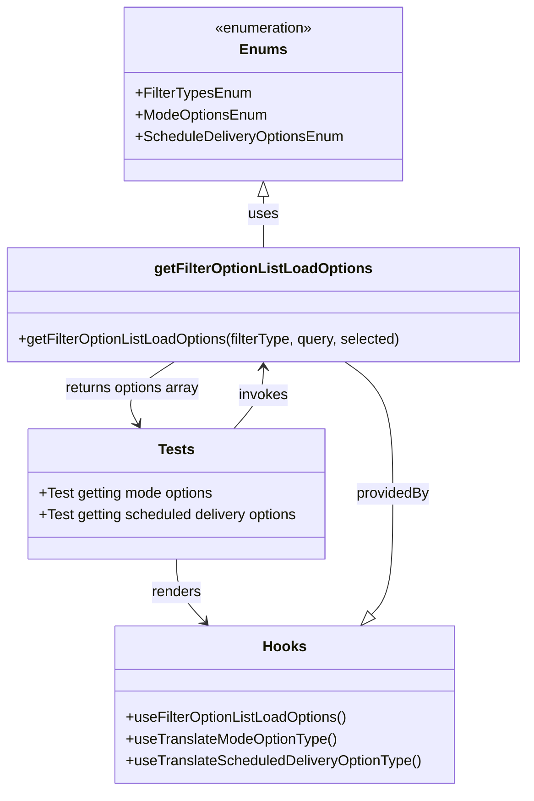

# Diagram: web/portal/src/pages/administration/notification-management/tests/testUseFilterOptionListLoadOptions.test.js


> Auto-generated by Obscura crawlers

## Diagram 1

```mermaid
sequenceDiagram
    participant TestSuite as Test File
    participant RenderHook as renderHook
    participant TranslateHook as useTranslate* hooks
    participant FilterHook as useFilterOptionListLoadOptions
    participant Func as getFilterOptionListLoadOptions
    participant Expect as expect

    TestSuite->>RenderHook: call renderHook(useTranslateModeOptionType / useTranslateScheduledDeliveryOptionType)
    RenderHook-->>TranslateHook: returns translate function
    TestSuite->>RenderHook: call renderHook(useFilterOptionListLoadOptions)
    RenderHook-->>FilterHook: returns hook object
    TestSuite->>FilterHook: call getFilterOptionListLoadOptions(selectedFilterType, userQuery, [])
    FilterHook->>Func: execute getFilterOptionListLoadOptions
    Func-->>FilterHook: returns { hasMore, options[] }
    FilterHook-->>TestSuite: actualResults
    TestSuite->>Expect: expect(actualResults).toEqual(expectedResults)
    Note over TestSuite,Expect: Scenarios: all modes, filtered modes, none matched; all scheduled, filtered scheduled, none matched
```

> SVG rendering failed for this diagram.

## Diagram 2



### SVG

<svg id="container" width="586.6171875" xmlns="http://www.w3.org/2000/svg" class="classDiagram" height="874" viewBox="0 0 586.6171875 874" role="graphics-document document" aria-roledescription="class"><style>#container{font-family:"trebuchet ms",verdana,arial,sans-serif;font-size:16px;fill:#333;}@keyframes edge-animation-frame{from{stroke-dashoffset:0;}}@keyframes dash{to{stroke-dashoffset:0;}}#container .edge-animation-slow{stroke-dasharray:9,5!important;stroke-dashoffset:900;animation:dash 50s linear infinite;stroke-linecap:round;}#container .edge-animation-fast{stroke-dasharray:9,5!important;stroke-dashoffset:900;animation:dash 20s linear infinite;stroke-linecap:round;}#container .error-icon{fill:#552222;}#container .error-text{fill:#552222;stroke:#552222;}#container .edge-thickness-normal{stroke-width:1px;}#container .edge-thickness-thick{stroke-width:3.5px;}#container .edge-pattern-solid{stroke-dasharray:0;}#container .edge-thickness-invisible{stroke-width:0;fill:none;}#container .edge-pattern-dashed{stroke-dasharray:3;}#container .edge-pattern-dotted{stroke-dasharray:2;}#container .marker{fill:#333333;stroke:#333333;}#container .marker.cross{stroke:#333333;}#container svg{font-family:"trebuchet ms",verdana,arial,sans-serif;font-size:16px;}#container p{margin:0;}#container g.classGroup text{fill:#9370DB;stroke:none;font-family:"trebuchet ms",verdana,arial,sans-serif;font-size:10px;}#container g.classGroup text .title{font-weight:bolder;}#container .nodeLabel,#container .edgeLabel{color:#131300;}#container .edgeLabel .label rect{fill:#ECECFF;}#container .label text{fill:#131300;}#container .labelBkg{background:#ECECFF;}#container .edgeLabel .label span{background:#ECECFF;}#container .classTitle{font-weight:bolder;}#container .node rect,#container .node circle,#container .node ellipse,#container .node polygon,#container .node path{fill:#ECECFF;stroke:#9370DB;stroke-width:1px;}#container .divider{stroke:#9370DB;stroke-width:1;}#container g.clickable{cursor:pointer;}#container g.classGroup rect{fill:#ECECFF;stroke:#9370DB;}#container g.classGroup line{stroke:#9370DB;stroke-width:1;}#container .classLabel .box{stroke:none;stroke-width:0;fill:#ECECFF;opacity:0.5;}#container .classLabel .label{fill:#9370DB;font-size:10px;}#container .relation{stroke:#333333;stroke-width:1;fill:none;}#container .dashed-line{stroke-dasharray:3;}#container .dotted-line{stroke-dasharray:1 2;}#container #compositionStart,#container .composition{fill:#333333!important;stroke:#333333!important;stroke-width:1;}#container #compositionEnd,#container .composition{fill:#333333!important;stroke:#333333!important;stroke-width:1;}#container #dependencyStart,#container .dependency{fill:#333333!important;stroke:#333333!important;stroke-width:1;}#container #dependencyStart,#container .dependency{fill:#333333!important;stroke:#333333!important;stroke-width:1;}#container #extensionStart,#container .extension{fill:transparent!important;stroke:#333333!important;stroke-width:1;}#container #extensionEnd,#container .extension{fill:transparent!important;stroke:#333333!important;stroke-width:1;}#container #aggregationStart,#container .aggregation{fill:transparent!important;stroke:#333333!important;stroke-width:1;}#container #aggregationEnd,#container .aggregation{fill:transparent!important;stroke:#333333!important;stroke-width:1;}#container #lollipopStart,#container .lollipop{fill:#ECECFF!important;stroke:#333333!important;stroke-width:1;}#container #lollipopEnd,#container .lollipop{fill:#ECECFF!important;stroke:#333333!important;stroke-width:1;}#container .edgeTerminals{font-size:11px;line-height:initial;}#container .classTitleText{text-anchor:middle;font-size:18px;fill:#333;}#container .label-icon{display:inline-block;height:1em;overflow:visible;vertical-align:-0.125em;}#container .node .label-icon path{fill:currentColor;stroke:revert;stroke-width:revert;}#container :root{--mermaid-font-family:"trebuchet ms",verdana,arial,sans-serif;}</style><g><defs><marker id="container_class-aggregationStart" class="marker aggregation class" refX="18" refY="7" markerWidth="190" markerHeight="240" orient="auto"><path d="M 18,7 L9,13 L1,7 L9,1 Z"></path></marker></defs><defs><marker id="container_class-aggregationEnd" class="marker aggregation class" refX="1" refY="7" markerWidth="20" markerHeight="28" orient="auto"><path d="M 18,7 L9,13 L1,7 L9,1 Z"></path></marker></defs><defs><marker id="container_class-extensionStart" class="marker extension class" refX="18" refY="7" markerWidth="190" markerHeight="240" orient="auto"><path d="M 1,7 L18,13 V 1 Z"></path></marker></defs><defs><marker id="container_class-extensionEnd" class="marker extension class" refX="1" refY="7" markerWidth="20" markerHeight="28" orient="auto"><path d="M 1,1 V 13 L18,7 Z"></path></marker></defs><defs><marker id="container_class-compositionStart" class="marker composition class" refX="18" refY="7" markerWidth="190" markerHeight="240" orient="auto"><path d="M 18,7 L9,13 L1,7 L9,1 Z"></path></marker></defs><defs><marker id="container_class-compositionEnd" class="marker composition class" refX="1" refY="7" markerWidth="20" markerHeight="28" orient="auto"><path d="M 18,7 L9,13 L1,7 L9,1 Z"></path></marker></defs><defs><marker id="container_class-dependencyStart" class="marker dependency class" refX="6" refY="7" markerWidth="190" markerHeight="240" orient="auto"><path d="M 5,7 L9,13 L1,7 L9,1 Z"></path></marker></defs><defs><marker id="container_class-dependencyEnd" class="marker dependency class" refX="13" refY="7" markerWidth="20" markerHeight="28" orient="auto"><path d="M 18,7 L9,13 L14,7 L9,1 Z"></path></marker></defs><defs><marker id="container_class-lollipopStart" class="marker lollipop class" refX="13" refY="7" markerWidth="190" markerHeight="240" orient="auto"><circle stroke="black" fill="transparent" cx="7" cy="7" r="6"></circle></marker></defs><defs><marker id="container_class-lollipopEnd" class="marker lollipop class" refX="1" refY="7" markerWidth="190" markerHeight="240" orient="auto"><circle stroke="black" fill="transparent" cx="7" cy="7" r="6"></circle></marker></defs><g class="root"><g class="clusters"></g><g class="edgePaths"><path d="M293.309,217.25L293.309,220.542C293.309,223.833,293.309,230.417,293.309,239.875C293.309,249.333,293.309,261.667,293.309,267.833L293.309,274" id="id_Enums_getFilterOptionListLoadOptions_1" class="edge-thickness-normal edge-pattern-solid relation" style=";;;" data-edge="true" data-et="edge" data-id="id_Enums_getFilterOptionListLoadOptions_1" data-points="W3sieCI6MjkzLjMwODU5Mzc1LCJ5IjoyMDB9LHsieCI6MjkzLjMwODU5Mzc1LCJ5IjoyMzd9LHsieCI6MjkzLjMwODU5Mzc1LCJ5IjoyNzR9XQ==" marker-start="url(#container_class-extensionStart)"></path><path d="M414.774,679.702L418.824,675.585C422.874,671.468,430.973,663.234,435.023,640.95C439.072,618.667,439.072,582.333,439.072,546C439.072,509.667,439.072,473.333,430.084,449C421.095,424.667,403.117,412.333,394.128,406.167L385.14,400" id="id_Hooks_getFilterOptionListLoadOptions_2" class="edge-thickness-normal edge-pattern-solid relation" style=";;;" data-edge="true" data-et="edge" data-id="id_Hooks_getFilterOptionListLoadOptions_2" data-points="W3sieCI6NDAyLjY3Nzc4MTYyODAyNDIsInkiOjY5Mn0seyJ4Ijo0MzkuMDcyMjY1NjI1LCJ5Ijo2NTV9LHsieCI6NDM5LjA3MjI2NTYyNSwieSI6NTQ2fSx7IngiOjQzOS4wNzIyNjU2MjUsInkiOjQzN30seyJ4IjozODUuMTM5NzA3MDMxMjUsInkiOjQwMH1d" marker-start="url(#container_class-extensionStart)"></path><path d="M195.131,618L195.131,624.167C195.131,630.333,195.131,642.667,200.495,654.287C205.86,665.908,216.589,676.815,221.953,682.269L227.318,687.723" id="id_Tests_Hooks_3" class="edge-thickness-normal edge-pattern-solid relation" style=";;;" data-edge="true" data-et="edge" data-id="id_Tests_Hooks_3" data-points="W3sieCI6MTk1LjEzMDg1OTM3NSwieSI6NjE4fSx7IngiOjE5NS4xMzA4NTkzNzUsInkiOjY1NX0seyJ4IjoyMzEuNTI1MzQzMzcxOTc1OCwieSI6NjkyfV0=" marker-end="url(#container_class-dependencyEnd)"></path><path d="M259.982,474L265.537,467.833C271.091,461.667,282.2,449.333,287.754,438C293.309,426.667,293.309,416.333,293.309,411.167L293.309,406" id="id_Tests_getFilterOptionListLoadOptions_4" class="edge-thickness-normal edge-pattern-solid relation" style=";;;" data-edge="true" data-et="edge" data-id="id_Tests_getFilterOptionListLoadOptions_4" data-points="W3sieCI6MjU5Ljk4MjIwNjg1MjA2NDIsInkiOjQ3NH0seyJ4IjoyOTMuMzA4NTkzNzUsInkiOjQzN30seyJ4IjoyOTMuMzA4NTkzNzUsInkiOjQwMH1d" marker-end="url(#container_class-dependencyEnd)"></path><path d="M192.342,400L182.46,406.167C172.577,412.333,152.811,424.667,145.945,436.131C139.08,447.595,145.115,458.191,148.133,463.489L151.15,468.786" id="id_getFilterOptionListLoadOptions_Tests_5" class="edge-thickness-normal edge-pattern-solid relation" style=";;;" data-edge="true" data-et="edge" data-id="id_getFilterOptionListLoadOptions_Tests_5" data-points="W3sieCI6MTkyLjM0MjQ4MDQ2ODc1LCJ5Ijo0MDB9LHsieCI6MTMzLjA0NDkyMTg3NSwieSI6NDM3fSx7IngiOjE1NC4xMTk5NjQ4Nzk1ODcxNCwieSI6NDc0fV0=" marker-end="url(#container_class-dependencyEnd)"></path></g><g class="edgeLabels"><g class="edgeLabel" transform="translate(293.30859375, 237)"><g class="label" data-id="id_Enums_getFilterOptionListLoadOptions_1" transform="translate(-16.4921875, -12)"><foreignObject width="32.984375" height="24"><div xmlns="http://www.w3.org/1999/xhtml" class="labelBkg" style="display: table-cell; white-space: nowrap; line-height: 1.5; max-width: 200px; text-align: center;"><span class="edgeLabel"><p>uses</p></span></div></foreignObject></g></g><g class="edgeLabel" transform="translate(439.072265625, 546)"><g class="label" data-id="id_Hooks_getFilterOptionListLoadOptions_2" transform="translate(-41.1640625, -12)"><foreignObject width="82.328125" height="24"><div xmlns="http://www.w3.org/1999/xhtml" class="labelBkg" style="display: table-cell; white-space: nowrap; line-height: 1.5; max-width: 200px; text-align: center;"><span class="edgeLabel"><p>providedBy</p></span></div></foreignObject></g></g><g class="edgeLabel" transform="translate(195.130859375, 655)"><g class="label" data-id="id_Tests_Hooks_3" transform="translate(-27.75, -12)"><foreignObject width="55.5" height="24"><div xmlns="http://www.w3.org/1999/xhtml" class="labelBkg" style="display: table-cell; white-space: nowrap; line-height: 1.5; max-width: 200px; text-align: center;"><span class="edgeLabel"><p>renders</p></span></div></foreignObject></g></g><g class="edgeLabel" transform="translate(293.30859375, 437)"><g class="label" data-id="id_Tests_getFilterOptionListLoadOptions_4" transform="translate(-27.5859375, -12)"><foreignObject width="55.171875" height="24"><div xmlns="http://www.w3.org/1999/xhtml" class="labelBkg" style="display: table-cell; white-space: nowrap; line-height: 1.5; max-width: 200px; text-align: center;"><span class="edgeLabel"><p>invokes</p></span></div></foreignObject></g></g><g class="edgeLabel" transform="translate(144.63097, 429.77063)"><g class="label" data-id="id_getFilterOptionListLoadOptions_Tests_5" transform="translate(-76.5859375, -12)"><foreignObject width="153.171875" height="24"><div xmlns="http://www.w3.org/1999/xhtml" class="labelBkg" style="display: table-cell; white-space: nowrap; line-height: 1.5; max-width: 200px; text-align: center;"><span class="edgeLabel"><p>returns options array</p></span></div></foreignObject></g></g></g><g class="nodes"><g class="node default" id="classId-Enums-0" transform="translate(293.30859375, 104)"><g class="basic label-container"><path d="M-155.12109375 -96 L155.12109375 -96 L155.12109375 96 L-155.12109375 96" stroke="none" stroke-width="0" fill="#ECECFF" style=""></path><path d="M-155.12109375 -96 C-67.78174351860942 -96, 19.557606712781165 -96, 155.12109375 -96 M-155.12109375 -96 C-89.06743104520945 -96, -23.013768340418892 -96, 155.12109375 -96 M155.12109375 -96 C155.12109375 -21.357959732487302, 155.12109375 53.284080535025396, 155.12109375 96 M155.12109375 -96 C155.12109375 -46.68657144786376, 155.12109375 2.6268571042724744, 155.12109375 96 M155.12109375 96 C31.7496867453101 96, -91.6217202593798 96, -155.12109375 96 M155.12109375 96 C77.47148083537603 96, -0.17813207924794483 96, -155.12109375 96 M-155.12109375 96 C-155.12109375 36.829172109050724, -155.12109375 -22.341655781898552, -155.12109375 -96 M-155.12109375 96 C-155.12109375 47.04321007523396, -155.12109375 -1.9135798495320842, -155.12109375 -96" stroke="#9370DB" stroke-width="1.3" fill="none" stroke-dasharray="0 0" style=""></path></g><g class="annotation-group text" transform="translate(-55.5546875, -72)"><g class="label" style="" transform="translate(0,-12)"><foreignObject width="111.109375" height="24"><div xmlns="http://www.w3.org/1999/xhtml" style="display: table-cell; white-space: nowrap; line-height: 1.5; max-width: 161px; text-align: center;"><span class="nodeLabel markdown-node-label" style=""><p>«enumeration»</p></span></div></foreignObject></g></g><g class="label-group text" transform="translate(-23.9453125, -48)"><g class="label" style="font-weight: bolder" transform="translate(0,-12)"><foreignObject width="47.890625" height="24"><div xmlns="http://www.w3.org/1999/xhtml" style="display: table-cell; white-space: nowrap; line-height: 1.5; max-width: 98px; text-align: center;"><span class="nodeLabel markdown-node-label" style=""><p>Enums</p></span></div></foreignObject></g></g><g class="members-group text" transform="translate(-143.12109375, 0)"><g class="label" style="" transform="translate(0,-12)"><foreignObject width="126.921875" height="24"><div xmlns="http://www.w3.org/1999/xhtml" style="display: table-cell; white-space: nowrap; line-height: 1.5; max-width: 184px; text-align: center;"><span class="nodeLabel markdown-node-label" style=""><p>+FilterTypesEnum</p></span></div></foreignObject></g><g class="label" style="" transform="translate(0,12)"><foreignObject width="145.921875" height="24"><div xmlns="http://www.w3.org/1999/xhtml" style="display: table-cell; white-space: nowrap; line-height: 1.5; max-width: 203px; text-align: center;"><span class="nodeLabel markdown-node-label" style=""><p>+ModeOptionsEnum</p></span></div></foreignObject></g><g class="label" style="" transform="translate(0,36)"><foreignObject width="230.6875" height="24"><div xmlns="http://www.w3.org/1999/xhtml" style="display: table-cell; white-space: nowrap; line-height: 1.5; max-width: 288px; text-align: center;"><span class="nodeLabel markdown-node-label" style=""><p>+ScheduleDeliveryOptionsEnum</p></span></div></foreignObject></g></g><g class="methods-group text" transform="translate(-143.12109375, 96)"></g><g class="divider" style=""><path d="M-155.12109375 -24 C-49.46464725405815 -24, 56.1917992418837 -24, 155.12109375 -24 M-155.12109375 -24 C-68.47379594553482 -24, 18.173501858930365 -24, 155.12109375 -24" stroke="#9370DB" stroke-width="1.3" fill="none" stroke-dasharray="0 0" style=""></path></g><g class="divider" style=""><path d="M-155.12109375 72 C-46.00332907943472 72, 63.11443559113056 72, 155.12109375 72 M-155.12109375 72 C-52.03237866121195 72, 51.0563364275761 72, 155.12109375 72" stroke="#9370DB" stroke-width="1.3" fill="none" stroke-dasharray="0 0" style=""></path></g></g><g class="node default" id="classId-Hooks-1" transform="translate(317.1015625, 779)"><g class="basic label-container"><path d="M-187.83203125 -87 L187.83203125 -87 L187.83203125 87 L-187.83203125 87" stroke="none" stroke-width="0" fill="#ECECFF" style=""></path><path d="M-187.83203125 -87 C-79.02831230312658 -87, 29.775406643746834 -87, 187.83203125 -87 M-187.83203125 -87 C-41.168863623217334 -87, 105.49430400356533 -87, 187.83203125 -87 M187.83203125 -87 C187.83203125 -30.532577469462872, 187.83203125 25.934845061074256, 187.83203125 87 M187.83203125 -87 C187.83203125 -47.24330570485094, 187.83203125 -7.486611409701879, 187.83203125 87 M187.83203125 87 C46.41150058129904 87, -95.00903008740192 87, -187.83203125 87 M187.83203125 87 C71.58201967049975 87, -44.667991909000506 87, -187.83203125 87 M-187.83203125 87 C-187.83203125 34.406157129315915, -187.83203125 -18.18768574136817, -187.83203125 -87 M-187.83203125 87 C-187.83203125 30.961017582836334, -187.83203125 -25.077964834327332, -187.83203125 -87" stroke="#9370DB" stroke-width="1.3" fill="none" stroke-dasharray="0 0" style=""></path></g><g class="annotation-group text" transform="translate(0, -63)"></g><g class="label-group text" transform="translate(-22.9140625, -63)"><g class="label" style="font-weight: bolder" transform="translate(0,-12)"><foreignObject width="45.828125" height="24"><div xmlns="http://www.w3.org/1999/xhtml" style="display: table-cell; white-space: nowrap; line-height: 1.5; max-width: 95px; text-align: center;"><span class="nodeLabel markdown-node-label" style=""><p>Hooks</p></span></div></foreignObject></g></g><g class="members-group text" transform="translate(-175.83203125, -15)"></g><g class="methods-group text" transform="translate(-175.83203125, 15)"><g class="label" style="" transform="translate(0,-12)"><foreignObject width="248.1875" height="24"><div xmlns="http://www.w3.org/1999/xhtml" style="display: table-cell; white-space: nowrap; line-height: 1.5; max-width: 306px; text-align: center;"><span class="nodeLabel markdown-node-label" style=""><p>+useFilterOptionListLoadOptions()</p></span></div></foreignObject></g><g class="label" style="" transform="translate(0,12)"><foreignObject width="233.78125" height="24"><div xmlns="http://www.w3.org/1999/xhtml" style="display: table-cell; white-space: nowrap; line-height: 1.5; max-width: 291px; text-align: center;"><span class="nodeLabel markdown-node-label" style=""><p>+useTranslateModeOptionType()</p></span></div></foreignObject></g><g class="label" style="" transform="translate(0,36)"><foreignObject width="328.75" height="24"><div xmlns="http://www.w3.org/1999/xhtml" style="display: table-cell; white-space: nowrap; line-height: 1.5; max-width: 386px; text-align: center;"><span class="nodeLabel markdown-node-label" style=""><p>+useTranslateScheduledDeliveryOptionType()</p></span></div></foreignObject></g></g><g class="divider" style=""><path d="M-187.83203125 -39 C-108.86215456304586 -39, -29.892277876091725 -39, 187.83203125 -39 M-187.83203125 -39 C-98.39962235831204 -39, -8.967213466624088 -39, 187.83203125 -39" stroke="#9370DB" stroke-width="1.3" fill="none" stroke-dasharray="0 0" style=""></path></g><g class="divider" style=""><path d="M-187.83203125 -15 C-76.68231367269071 -15, 34.46740390461858 -15, 187.83203125 -15 M-187.83203125 -15 C-43.58426113527872 -15, 100.66350897944255 -15, 187.83203125 -15" stroke="#9370DB" stroke-width="1.3" fill="none" stroke-dasharray="0 0" style=""></path></g></g><g class="node default" id="classId-getFilterOptionListLoadOptions-2" transform="translate(293.30859375, 337)"><g class="basic label-container"><path d="M-285.30859375 -63 L285.30859375 -63 L285.30859375 63 L-285.30859375 63" stroke="none" stroke-width="0" fill="#ECECFF" style=""></path><path d="M-285.30859375 -63 C-116.9052879340835 -63, 51.49801788183299 -63, 285.30859375 -63 M-285.30859375 -63 C-93.82601209179168 -63, 97.65656956641664 -63, 285.30859375 -63 M285.30859375 -63 C285.30859375 -28.370961097011822, 285.30859375 6.258077805976356, 285.30859375 63 M285.30859375 -63 C285.30859375 -33.03724405557692, 285.30859375 -3.0744881111538334, 285.30859375 63 M285.30859375 63 C60.839062272622925 63, -163.63046920475415 63, -285.30859375 63 M285.30859375 63 C163.2142215926226 63, 41.119849435245214 63, -285.30859375 63 M-285.30859375 63 C-285.30859375 20.38913356900838, -285.30859375 -22.22173286198324, -285.30859375 -63 M-285.30859375 63 C-285.30859375 28.83764289635868, -285.30859375 -5.324714207282639, -285.30859375 -63" stroke="#9370DB" stroke-width="1.3" fill="none" stroke-dasharray="0 0" style=""></path></g><g class="annotation-group text" transform="translate(0, -39)"></g><g class="label-group text" transform="translate(-115.3359375, -39)"><g class="label" style="font-weight: bolder" transform="translate(0,-12)"><foreignObject width="230.671875" height="24"><div xmlns="http://www.w3.org/1999/xhtml" style="display: table-cell; white-space: nowrap; line-height: 1.5; max-width: 277px; text-align: center;"><span class="nodeLabel markdown-node-label" style=""><p>getFilterOptionListLoadOptions</p></span></div></foreignObject></g></g><g class="members-group text" transform="translate(-273.30859375, 9)"></g><g class="methods-group text" transform="translate(-273.30859375, 39)"><g class="label" style="" transform="translate(0,-12)"><foreignObject width="431.28125" height="24"><div xmlns="http://www.w3.org/1999/xhtml" style="display: table-cell; white-space: nowrap; line-height: 1.5; max-width: 489px; text-align: center;"><span class="nodeLabel markdown-node-label" style=""><p>+getFilterOptionListLoadOptions(filterType, query, selected)</p></span></div></foreignObject></g></g><g class="divider" style=""><path d="M-285.30859375 -15 C-78.50216996723023 -15, 128.30425381553954 -15, 285.30859375 -15 M-285.30859375 -15 C-121.20567818816414 -15, 42.897237373671715 -15, 285.30859375 -15" stroke="#9370DB" stroke-width="1.3" fill="none" stroke-dasharray="0 0" style=""></path></g><g class="divider" style=""><path d="M-285.30859375 9 C-83.60053353775115 9, 118.1075266744977 9, 285.30859375 9 M-285.30859375 9 C-138.5404788164235 9, 8.227636117152997 9, 285.30859375 9" stroke="#9370DB" stroke-width="1.3" fill="none" stroke-dasharray="0 0" style=""></path></g></g><g class="node default" id="classId-Tests-3" transform="translate(195.130859375, 546)"><g class="basic label-container"><path d="M-167.77734375 -72 L167.77734375 -72 L167.77734375 72 L-167.77734375 72" stroke="none" stroke-width="0" fill="#ECECFF" style=""></path><path d="M-167.77734375 -72 C-93.9419492533123 -72, -20.106554756624604 -72, 167.77734375 -72 M-167.77734375 -72 C-38.9846471667922 -72, 89.8080494164156 -72, 167.77734375 -72 M167.77734375 -72 C167.77734375 -41.09704119580574, 167.77734375 -10.194082391611474, 167.77734375 72 M167.77734375 -72 C167.77734375 -34.56402056519191, 167.77734375 2.8719588696161793, 167.77734375 72 M167.77734375 72 C54.02615386396667 72, -59.72503602206666 72, -167.77734375 72 M167.77734375 72 C46.46491308457371 72, -74.84751758085258 72, -167.77734375 72 M-167.77734375 72 C-167.77734375 39.62918491471584, -167.77734375 7.258369829431686, -167.77734375 -72 M-167.77734375 72 C-167.77734375 38.312371818137414, -167.77734375 4.624743636274829, -167.77734375 -72" stroke="#9370DB" stroke-width="1.3" fill="none" stroke-dasharray="0 0" style=""></path></g><g class="annotation-group text" transform="translate(0, -48)"></g><g class="label-group text" transform="translate(-19.1171875, -48)"><g class="label" style="font-weight: bolder" transform="translate(0,-12)"><foreignObject width="38.234375" height="24"><div xmlns="http://www.w3.org/1999/xhtml" style="display: table-cell; white-space: nowrap; line-height: 1.5; max-width: 87px; text-align: center;"><span class="nodeLabel markdown-node-label" style=""><p>Tests</p></span></div></foreignObject></g></g><g class="members-group text" transform="translate(-155.77734375, 0)"><g class="label" style="" transform="translate(0,-12)"><foreignObject width="196.484375" height="24"><div xmlns="http://www.w3.org/1999/xhtml" style="display: table-cell; white-space: nowrap; line-height: 1.5; max-width: 254px; text-align: center;"><span class="nodeLabel markdown-node-label" style=""><p>+Test getting mode options</p></span></div></foreignObject></g><g class="label" style="" transform="translate(0,12)"><foreignObject width="292.4375" height="24"><div xmlns="http://www.w3.org/1999/xhtml" style="display: table-cell; white-space: nowrap; line-height: 1.5; max-width: 350px; text-align: center;"><span class="nodeLabel markdown-node-label" style=""><p>+Test getting scheduled delivery options</p></span></div></foreignObject></g></g><g class="methods-group text" transform="translate(-155.77734375, 72)"></g><g class="divider" style=""><path d="M-167.77734375 -24 C-86.39489446696372 -24, -5.01244518392744 -24, 167.77734375 -24 M-167.77734375 -24 C-87.18188427696495 -24, -6.586424803929901 -24, 167.77734375 -24" stroke="#9370DB" stroke-width="1.3" fill="none" stroke-dasharray="0 0" style=""></path></g><g class="divider" style=""><path d="M-167.77734375 48 C-61.4365703614972 48, 44.90420302700559 48, 167.77734375 48 M-167.77734375 48 C-94.21345850551525 48, -20.649573261030497 48, 167.77734375 48" stroke="#9370DB" stroke-width="1.3" fill="none" stroke-dasharray="0 0" style=""></path></g></g></g></g></g></svg>

## Diagram 3

```mermaid
flowchart LR
    A[Start Test] --> B{Selected FilterType}
    B -->|MODE| C[renderHook: useTranslateModeOptionType]
    B -->|MODE| D[renderHook: useFilterOptionListLoadOptions]
    D --> E[getFilterOptionListLoadOptions("MODE", userQuery, [])]
    E --> F[Filter ModeOptionsEnum by query]
    F --> G{Results}
    G -->|non-empty| H[Return options for modes]
    G -->|empty| I[Return empty options]
    B -->|SCHEDULED_DELIVERY| J[renderHook: useTranslateScheduledDeliveryOptionType]
    B -->|SCHEDULED_DELIVERY| D
    D --> K[getFilterOptionListLoadOptions("SCHEDULED_DELIVERY", userQuery, [])]
    K --> L[Filter ScheduleDeliveryOptionsEnum by query]
    L --> G
    H --> M[assert equals expectedResults]
    I --> M
    M --> N[End]
```

> SVG rendering failed for this diagram.
