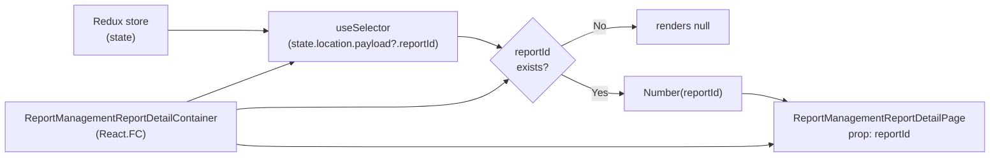

# Diagram: web/portal/src/pages/administration/report-management/ReportManagement.ReportDetail.page.container.tsx

> Auto-generated by Obscura crawlers

## Mermaid

### SVG

<svg id="container" width="1848.828125" xmlns="http://www.w3.org/2000/svg" class="flowchart" height="259.23046875" viewBox="0 0 1848.828125 259.23046875" role="graphics-document document" aria-roledescription="flowchart-v2"><g><marker id="container_flowchart-v2-pointEnd" class="marker flowchart-v2" viewBox="0 0 10 10" refX="5" refY="5" markerUnits="userSpaceOnUse" markerWidth="8" markerHeight="8" orient="auto"><path d="M 0 0 L 10 5 L 0 10 z" class="arrowMarkerPath" style="stroke-width: 1; stroke-dasharray: 1, 0;"></path></marker><marker id="container_flowchart-v2-pointStart" class="marker flowchart-v2" viewBox="0 0 10 10" refX="4.5" refY="5" markerUnits="userSpaceOnUse" markerWidth="8" markerHeight="8" orient="auto"><path d="M 0 5 L 10 10 L 10 0 z" class="arrowMarkerPath" style="stroke-width: 1; stroke-dasharray: 1, 0;"></path></marker><marker id="container_flowchart-v2-circleEnd" class="marker flowchart-v2" viewBox="0 0 10 10" refX="11" refY="5" markerUnits="userSpaceOnUse" markerWidth="11" markerHeight="11" orient="auto"><circle cx="5" cy="5" r="5" class="arrowMarkerPath" style="stroke-width: 1; stroke-dasharray: 1, 0;"></circle></marker><marker id="container_flowchart-v2-circleStart" class="marker flowchart-v2" viewBox="0 0 10 10" refX="-1" refY="5" markerUnits="userSpaceOnUse" markerWidth="11" markerHeight="11" orient="auto"><circle cx="5" cy="5" r="5" class="arrowMarkerPath" style="stroke-width: 1; stroke-dasharray: 1, 0;"></circle></marker><marker id="container_flowchart-v2-crossEnd" class="marker cross flowchart-v2" viewBox="0 0 11 11" refX="12" refY="5.2" markerUnits="userSpaceOnUse" markerWidth="11" markerHeight="11" orient="auto"><path d="M 1,1 l 9,9 M 10,1 l -9,9" class="arrowMarkerPath" style="stroke-width: 2; stroke-dasharray: 1, 0;"></path></marker><marker id="container_flowchart-v2-crossStart" class="marker cross flowchart-v2" viewBox="0 0 11 11" refX="-1" refY="5.2" markerUnits="userSpaceOnUse" markerWidth="11" markerHeight="11" orient="auto"><path d="M 1,1 l 9,9 M 10,1 l -9,9" class="arrowMarkerPath" style="stroke-width: 2; stroke-dasharray: 1, 0;"></path></marker><g class="root"><g class="clusters"></g><g class="edgePaths"><path d="M338.742,56.82L363.171,56.82C387.599,56.82,436.456,56.82,464.385,56.975C492.314,57.13,499.315,57.44,502.816,57.595L506.316,57.75" id="L_Store_Selector_0" class="edge-thickness-normal edge-pattern-solid edge-thickness-normal edge-pattern-solid flowchart-link" style=";" data-edge="true" data-et="edge" data-id="L_Store_Selector_0" data-points="W3sieCI6MzM4Ljc0MjE4NzUsInkiOjU2LjgyMDMxMjV9LHsieCI6NDg1LjMxMjUsInkiOjU2LjgyMDMxMjV9LHsieCI6NTEwLjMxMjUsInkiOjU3LjkyNjg4OTcxODM0MTUxfV0=" marker-end="url(#container_flowchart-v2-pointEnd)"></path><path d="M912.156,66.82L916.323,66.82C920.49,66.82,928.823,66.82,939.695,68.631C950.567,70.441,963.978,74.062,970.684,75.872L977.389,77.683" id="L_Selector_Condition_0" class="edge-thickness-normal edge-pattern-solid edge-thickness-normal edge-pattern-solid flowchart-link" style=";" data-edge="true" data-et="edge" data-id="L_Selector_Condition_0" data-points="W3sieCI6OTEyLjE1NjI1LCJ5Ijo2Ni44MjAzMTI1fSx7IngiOjkzNy4xNTYyNSwieSI6NjYuODIwMzEyNX0seyJ4Ijo5ODEuMjUxMTg3MDQ3OTUwNywieSI6NzguNzI1Mzc1NDUyMDQ5Mjl9XQ==" marker-end="url(#container_flowchart-v2-pointEnd)"></path><path d="M1115.682,71.706L1126.206,67.391C1136.731,63.077,1157.779,54.449,1177.179,50.135C1196.578,45.82,1214.328,45.82,1223.203,45.82L1232.078,45.82" id="L_Condition_Null_0" class="edge-thickness-normal edge-pattern-solid edge-thickness-normal edge-pattern-solid flowchart-link" style=";" data-edge="true" data-et="edge" data-id="L_Condition_Null_0" data-points="W3sieCI6MTExNS42ODIxNjc0NDc0NzMsInkiOjcxLjcwNTYwNDk0NzQ3MzAyfSx7IngiOjExNzguODI4MTI1LCJ5Ijo0NS44MjAzMTI1fSx7IngiOjEyMzYuMDc4MTI1LCJ5Ijo0NS44MjAzMTI1fV0=" marker-end="url(#container_flowchart-v2-pointEnd)"></path><path d="M1115.682,123.935L1126.206,128.249C1136.731,132.563,1157.779,141.192,1173.809,145.506C1189.839,149.82,1200.849,149.82,1206.354,149.82L1211.859,149.82" id="L_Condition_Convert_0" class="edge-thickness-normal edge-pattern-solid edge-thickness-normal edge-pattern-solid flowchart-link" style=";" data-edge="true" data-et="edge" data-id="L_Condition_Convert_0" data-points="W3sieCI6MTExNS42ODIxNjc0NDc0NzMsInkiOjEyMy45MzUwMjAwNTI1MjY5OH0seyJ4IjoxMTc4LjgyODEyNSwieSI6MTQ5LjgyMDMxMjV9LHsieCI6MTIxNS44NTkzNzUsInkiOjE0OS44MjAzMTI1fV0=" marker-end="url(#container_flowchart-v2-pointEnd)"></path><path d="M1404.094,149.82L1408.26,149.82C1412.427,149.82,1420.76,149.82,1437.938,153.539C1455.115,157.257,1481.136,164.694,1494.147,168.413L1507.158,172.131" id="L_Convert_Page_0" class="edge-thickness-normal edge-pattern-solid edge-thickness-normal edge-pattern-solid flowchart-link" style=";" data-edge="true" data-et="edge" data-id="L_Convert_Page_0" data-points="W3sieCI6MTQwNC4wOTM3NSwieSI6MTQ5LjgyMDMxMjV9LHsieCI6MTQyOS4wOTM3NSwieSI6MTQ5LjgyMDMxMjV9LHsieCI6MTUxMS4wMDM2NTUxNTY2MzEzLCJ5IjoxNzMuMjMwNDY4NzV9XQ==" marker-end="url(#container_flowchart-v2-pointEnd)"></path><path d="M315.456,186.23L343.765,176.829C372.075,167.427,428.694,148.624,477.877,133.401C527.061,118.178,568.809,106.537,589.684,100.716L610.558,94.895" id="L_Container_Selector_0" class="edge-thickness-normal edge-pattern-solid edge-thickness-normal edge-pattern-solid flowchart-link" style=";" data-edge="true" data-et="edge" data-id="L_Container_Selector_0" data-points="W3sieCI6MzE1LjQ1NTkyNjg2MDM5NDM2LCJ5IjoxODYuMjMwNDY4NzV9LHsieCI6NDg1LjMxMjUsInkiOjEyOS44MjAzMTI1fSx7IngiOjYxNC40MTA3MTQyODU3MTQzLCJ5Ijo5My44MjAzMTI1fV0=" marker-end="url(#container_flowchart-v2-pointEnd)"></path><path d="M394.052,186.23L409.262,183.662C424.472,181.094,454.892,175.957,507.756,173.389C560.62,170.82,635.927,170.82,711.234,170.82C786.542,170.82,861.849,170.82,908.925,164.83C956.001,158.839,974.846,146.858,984.269,140.867L993.691,134.877" id="L_Container_Condition_0" class="edge-thickness-normal edge-pattern-solid edge-thickness-normal edge-pattern-solid flowchart-link" style=";" data-edge="true" data-et="edge" data-id="L_Container_Condition_0" data-points="W3sieCI6Mzk0LjA1MjM1Mzg5NjEwMzksInkiOjE4Ni4yMzA0Njg3NX0seyJ4Ijo0ODUuMzEyNSwieSI6MTcwLjgyMDMxMjV9LHsieCI6NzExLjIzNDM3NSwieSI6MTcwLjgyMDMxMjV9LHsieCI6OTM3LjE1NjI1LCJ5IjoxNzAuODIwMzEyNX0seyJ4Ijo5OTcuMDY2NjUzMDYxNDM2NywieSI6MTMyLjczMDcxNTU2MTQzNjd9XQ==" marker-end="url(#container_flowchart-v2-pointEnd)"></path><path d="M460.197,240.23L464.383,240.73C468.569,241.23,476.941,242.23,518.78,242.73C560.62,243.23,635.927,243.23,711.234,243.23C786.542,243.23,861.849,243.23,918.639,243.23C975.43,243.23,1013.703,243.23,1053.982,243.23C1094.26,243.23,1136.544,243.23,1179.544,243.23C1222.544,243.23,1266.26,243.23,1307.971,243.23C1349.682,243.23,1389.388,243.23,1412.748,242.733C1436.107,242.235,1443.12,241.239,1446.627,240.741L1450.133,240.244" id="L_Container_Page_0" class="edge-thickness-normal edge-pattern-solid edge-thickness-normal edge-pattern-solid flowchart-link" style=";" data-edge="true" data-et="edge" data-id="L_Container_Page_0" data-points="W3sieCI6NDYwLjE5Njg3NSwieSI6MjQwLjIzMDQ2ODc1fSx7IngiOjQ4NS4zMTI1LCJ5IjoyNDMuMjMwNDY4NzV9LHsieCI6NzExLjIzNDM3NSwieSI6MjQzLjIzMDQ2ODc1fSx7IngiOjkzNy4xNTYyNSwieSI6MjQzLjIzMDQ2ODc1fSx7IngiOjEwNTEuOTc2NTYyNSwieSI6MjQzLjIzMDQ2ODc1fSx7IngiOjExNzguODI4MTI1LCJ5IjoyNDMuMjMwNDY4NzV9LHsieCI6MTMwOS45NzY1NjI1LCJ5IjoyNDMuMjMwNDY4NzV9LHsieCI6MTQyOS4wOTM3NSwieSI6MjQzLjIzMDQ2ODc1fSx7IngiOjE0NTQuMDkzNzUsInkiOjIzOS42ODE0MDA3MzgxMjIwOH1d" marker-end="url(#container_flowchart-v2-pointEnd)"></path></g><g class="edgeLabels"><g class="edgeLabel"><g class="label" data-id="L_Store_Selector_0" transform="translate(0, 0)"><foreignObject width="0" height="0">

</foreignObject></g></g><g class="edgeLabel"><g class="label" data-id="L_Selector_Condition_0" transform="translate(0, 0)"><foreignObject width="0" height="0">

</foreignObject></g></g><g class="edgeLabel" transform="translate(1178.828125, 45.8203125)"><g class="label" data-id="L_Condition_Null_0" transform="translate(-10.140625, -12)"><foreignObject width="20.28125" height="24">

No

</foreignObject></g></g><g class="edgeLabel" transform="translate(1178.828125, 149.8203125)"><g class="label" data-id="L_Condition_Convert_0" transform="translate(-12.03125, -12)"><foreignObject width="24.0625" height="24">

Yes

</foreignObject></g></g><g class="edgeLabel"><g class="label" data-id="L_Convert_Page_0" transform="translate(0, 0)"><foreignObject width="0" height="0">

</foreignObject></g></g><g class="edgeLabel"><g class="label" data-id="L_Container_Selector_0" transform="translate(0, 0)"><foreignObject width="0" height="0">

</foreignObject></g></g><g class="edgeLabel"><g class="label" data-id="L_Container_Condition_0" transform="translate(0, 0)"><foreignObject width="0" height="0">

</foreignObject></g></g><g class="edgeLabel"><g class="label" data-id="L_Container_Page_0" transform="translate(0, 0)"><foreignObject width="0" height="0">

</foreignObject></g></g></g><g class="nodes"><g class="node default" id="flowchart-Store-0" transform="translate(234.15625, 56.8203125)"><rect class="basic label-container" style="" x="-104.5859375" y="-27" width="209.171875" height="54"></rect><g class="label" style="" transform="translate(-74.5859375, -12)"><rect></rect><foreignObject width="149.171875" height="24">

Redux store\n(state)

</foreignObject></g></g><g class="node default" id="flowchart-Selector-1" transform="translate(711.234375, 66.8203125)"><rect class="basic label-container" style="" x="-200.921875" y="-27" width="401.84375" height="54"></rect><g class="label" style="" transform="translate(-170.921875, -12)"><rect></rect><foreignObject width="341.84375" height="24">

useSelector\n(state.location.payload?.reportId)

</foreignObject></g></g><g class="node default" id="flowchart-Condition-3" transform="translate(1051.9765625, 97.8203125)"><polygon points="89.8203125,0 179.640625,-89.8203125 89.8203125,-179.640625 0,-89.8203125" class="label-container" transform="translate(-89.3203125, 89.8203125)"></polygon><g class="label" style="" transform="translate(-62.8203125, -12)"><rect></rect><foreignObject width="125.640625" height="24">

reportId\nexists?

</foreignObject></g></g><g class="node default" id="flowchart-Null-5" transform="translate(1309.9765625, 45.8203125)"><rect class="basic label-container" style="" x="-73.8984375" y="-27" width="147.796875" height="54"></rect><g class="label" style="" transform="translate(-43.8984375, -12)"><rect></rect><foreignObject width="87.796875" height="24">

renders null

</foreignObject></g></g><g class="node default" id="flowchart-Convert-7" transform="translate(1309.9765625, 149.8203125)"><rect class="basic label-container" style="" x="-94.1171875" y="-27" width="188.234375" height="54"></rect><g class="label" style="" transform="translate(-64.1171875, -12)"><rect></rect><foreignObject width="128.234375" height="24">

Number(reportId)

</foreignObject></g></g><g class="node default" id="flowchart-Page-9" transform="translate(1647.4609375, 212.23046875)"><rect class="basic label-container" style="" x="-193.3671875" y="-39" width="386.734375" height="78"></rect><g class="label" style="" transform="translate(-163.3671875, -24)"><rect></rect><foreignObject width="326.734375" height="48">

ReportManagementReportDetailPage\nprop: reportId

</foreignObject></g></g><g class="node default" id="flowchart-Container-10" transform="translate(234.15625, 213.23046875)"><rect class="basic label-container" style="" x="-226.15625" y="-27" width="452.3125" height="54"></rect><g class="label" style="" transform="translate(-196.15625, -12)"><rect></rect><foreignObject width="392.3125" height="24">

ReportManagementReportDetailContainer\n(React.FC)

</foreignObject></g></g></g></g></g></svg>
