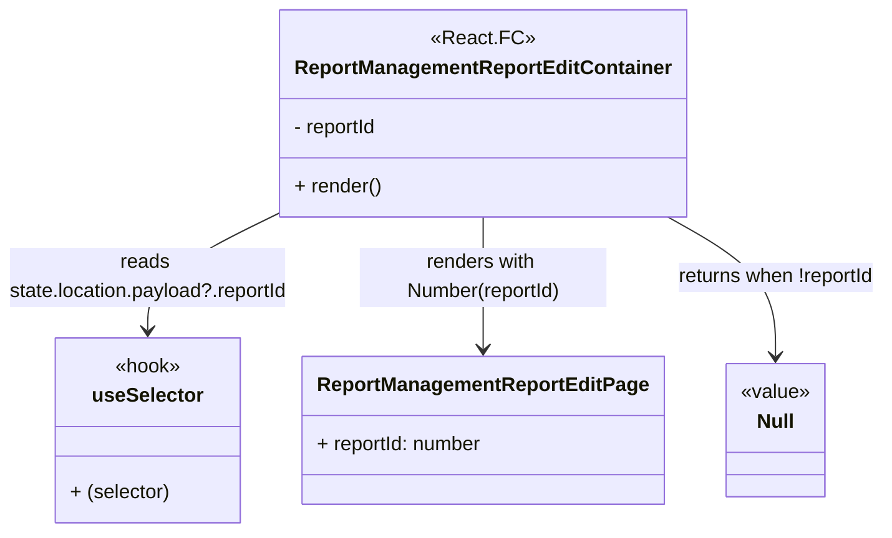

# Diagram: web/portal/src/pages/administration/report-management/ReportManagement.ReportEdit.page.container.tsx

> Auto-generated by Obscura crawlers

## Mermaid

### SVG

<svg id="container" width="716.12109375" xmlns="http://www.w3.org/2000/svg" class="classDiagram" height="432" viewBox="0 0 716.12109375 432" role="graphics-document document" aria-roledescription="class"><g><defs><marker id="container_class-aggregationStart" class="marker aggregation class" refX="18" refY="7" markerWidth="190" markerHeight="240" orient="auto"><path d="M 18,7 L9,13 L1,7 L9,1 Z"></path></marker></defs><defs><marker id="container_class-aggregationEnd" class="marker aggregation class" refX="1" refY="7" markerWidth="20" markerHeight="28" orient="auto"><path d="M 18,7 L9,13 L1,7 L9,1 Z"></path></marker></defs><defs><marker id="container_class-extensionStart" class="marker extension class" refX="18" refY="7" markerWidth="190" markerHeight="240" orient="auto"><path d="M 1,7 L18,13 V 1 Z"></path></marker></defs><defs><marker id="container_class-extensionEnd" class="marker extension class" refX="1" refY="7" markerWidth="20" markerHeight="28" orient="auto"><path d="M 1,1 V 13 L18,7 Z"></path></marker></defs><defs><marker id="container_class-compositionStart" class="marker composition class" refX="18" refY="7" markerWidth="190" markerHeight="240" orient="auto"><path d="M 18,7 L9,13 L1,7 L9,1 Z"></path></marker></defs><defs><marker id="container_class-compositionEnd" class="marker composition class" refX="1" refY="7" markerWidth="20" markerHeight="28" orient="auto"><path d="M 18,7 L9,13 L1,7 L9,1 Z"></path></marker></defs><defs><marker id="container_class-dependencyStart" class="marker dependency class" refX="6" refY="7" markerWidth="190" markerHeight="240" orient="auto"><path d="M 5,7 L9,13 L1,7 L9,1 Z"></path></marker></defs><defs><marker id="container_class-dependencyEnd" class="marker dependency class" refX="13" refY="7" markerWidth="20" markerHeight="28" orient="auto"><path d="M 18,7 L9,13 L14,7 L9,1 Z"></path></marker></defs><defs><marker id="container_class-lollipopStart" class="marker lollipop class" refX="13" refY="7" markerWidth="190" markerHeight="240" orient="auto"><circle stroke="black" fill="transparent" cx="7" cy="7" r="6"></circle></marker></defs><defs><marker id="container_class-lollipopEnd" class="marker lollipop class" refX="1" refY="7" markerWidth="190" markerHeight="240" orient="auto"><circle stroke="black" fill="transparent" cx="7" cy="7" r="6"></circle></marker></defs><g class="root"><g class="clusters"></g><g class="edgePaths"><path d="M232.578,170.651L214.281,179.709C195.984,188.767,159.391,206.884,141.094,223.108C122.797,239.333,122.797,253.667,122.797,260.833L122.797,268" id="id_ReportManagementReportEditContainer_useSelector_1" class="edge-thickness-normal edge-pattern-solid relation" style=";;;" data-edge="true" data-et="edge" data-id="id_ReportManagementReportEditContainer_useSelector_1" data-points="W3sieCI6MjMyLjU3ODEyNSwieSI6MTcwLjY1MDUwNzQ1OTIxNDIzfSx7IngiOjEyMi43OTY4NzUsInkiOjIyNX0seyJ4IjoxMjIuNzk2ODc1LCJ5IjoyNzR9XQ==" marker-end="url(#container_class-dependencyEnd)"></path><path d="M391.445,176L391.445,184.167C391.445,192.333,391.445,208.667,391.445,226.5C391.445,244.333,391.445,263.667,391.445,273.333L391.445,283" id="id_ReportManagementReportEditContainer_ReportManagementReportEditPage_2" class="edge-thickness-normal edge-pattern-solid relation" style=";;;" data-edge="true" data-et="edge" data-id="id_ReportManagementReportEditContainer_ReportManagementReportEditPage_2" data-points="W3sieCI6MzkxLjQ0NTMxMjUsInkiOjE3Nn0seyJ4IjozOTEuNDQ1MzEyNSwieSI6MjI1fSx7IngiOjM5MS40NDUzMTI1LCJ5IjoyODl9XQ==" marker-end="url(#container_class-dependencyEnd)"></path><path d="M539.879,176L554.31,184.167C568.741,192.333,597.603,208.667,612.034,227.5C626.465,246.333,626.465,267.667,626.465,278.333L626.465,289" id="id_ReportManagementReportEditContainer_Null_3" class="edge-thickness-normal edge-pattern-solid relation" style=";;;" data-edge="true" data-et="edge" data-id="id_ReportManagementReportEditContainer_Null_3" data-points="W3sieCI6NTM5Ljg3ODcwMDY1Nzg5NDgsInkiOjE3Nn0seyJ4Ijo2MjYuNDY0ODQzNzUsInkiOjIyNX0seyJ4Ijo2MjYuNDY0ODQzNzUsInkiOjI5NX1d" marker-end="url(#container_class-dependencyEnd)"></path></g><g class="edgeLabels"><g class="edgeLabel" transform="translate(122.796875, 225)"><g class="label" data-id="id_ReportManagementReportEditContainer_useSelector_1" transform="translate(-114.796875, -24)"><foreignObject width="229.59375" height="48">

reads state.location.payload?.reportId

</foreignObject></g></g><g class="edgeLabel" transform="translate(391.4453125, 225)"><g class="label" data-id="id_ReportManagementReportEditContainer_ReportManagementReportEditPage_2" transform="translate(-100, -24)"><foreignObject width="200" height="48">

renders with Number(reportId)

</foreignObject></g></g><g class="edgeLabel" transform="translate(626.46484375, 225)"><g class="label" data-id="id_ReportManagementReportEditContainer_Null_3" transform="translate(-81.65625, -12)"><foreignObject width="163.3125" height="24">

returns when !reportId

</foreignObject></g></g></g><g class="nodes"><g class="node default" id="classId-ReportManagementReportEditContainer-0" transform="translate(391.4453125, 92)"><g class="basic label-container"><path d="M-158.8671875 -84 L158.8671875 -84 L158.8671875 84 L-158.8671875 84" stroke="none" stroke-width="0" fill="#ECECFF" style=""></path><path d="M-158.8671875 -84 C-52.54388846622656 -84, 53.779410567546876 -84, 158.8671875 -84 M-158.8671875 -84 C-60.72951221895174 -84, 37.40816306209652 -84, 158.8671875 -84 M158.8671875 -84 C158.8671875 -28.330705981929874, 158.8671875 27.33858803614025, 158.8671875 84 M158.8671875 -84 C158.8671875 -43.203184798241594, 158.8671875 -2.406369596483188, 158.8671875 84 M158.8671875 84 C94.85969548923964 84, 30.852203478479282 84, -158.8671875 84 M158.8671875 84 C49.50417292423644 84, -59.858841651527115 84, -158.8671875 84 M-158.8671875 84 C-158.8671875 48.877131676558776, -158.8671875 13.754263353117551, -158.8671875 -84 M-158.8671875 84 C-158.8671875 17.97262315130709, -158.8671875 -48.05475369738582, -158.8671875 -84" stroke="#9370DB" stroke-width="1.3" fill="none" stroke-dasharray="0 0" style=""></path></g><g class="annotation-group text" transform="translate(-39.2578125, -60)"><g class="label" style="" transform="translate(0,-12)"><foreignObject width="78.515625" height="24">

«React.FC»

</foreignObject></g></g><g class="label-group text" transform="translate(-146.8671875, -36)"><g class="label" style="font-weight: bolder" transform="translate(0,-12)"><foreignObject width="293.734375" height="24">

ReportManagementReportEditContainer

</foreignObject></g></g><g class="members-group text" transform="translate(-146.8671875, 12)"><g class="label" style="" transform="translate(0,-12)"><foreignObject width="70.203125" height="24">

- reportId

</foreignObject></g></g><g class="methods-group text" transform="translate(-146.8671875, 60)"><g class="label" style="" transform="translate(0,-12)"><foreignObject width="70.859375" height="24">

+ render()

</foreignObject></g></g><g class="divider" style=""><path d="M-158.8671875 -12 C-39.81652631397175 -12, 79.2341348720565 -12, 158.8671875 -12 M-158.8671875 -12 C-79.67040612809878 -12, -0.47362475619755173 -12, 158.8671875 -12" stroke="#9370DB" stroke-width="1.3" fill="none" stroke-dasharray="0 0" style=""></path></g><g class="divider" style=""><path d="M-158.8671875 36 C-79.68055039738567 36, -0.49391329477134605 36, 158.8671875 36 M-158.8671875 36 C-70.97165549551194 36, 16.92387650897612 36, 158.8671875 36" stroke="#9370DB" stroke-width="1.3" fill="none" stroke-dasharray="0 0" style=""></path></g></g><g class="node default" id="classId-useSelector-1" transform="translate(122.796875, 349)"><g class="basic label-container"><path d="M-74.04296875 -75 L74.04296875 -75 L74.04296875 75 L-74.04296875 75" stroke="none" stroke-width="0" fill="#ECECFF" style=""></path><path d="M-74.04296875 -75 C-15.570905221988816 -75, 42.90115830602237 -75, 74.04296875 -75 M-74.04296875 -75 C-42.337354564617 -75, -10.631740379233996 -75, 74.04296875 -75 M74.04296875 -75 C74.04296875 -21.070192459226227, 74.04296875 32.859615081547545, 74.04296875 75 M74.04296875 -75 C74.04296875 -18.83608312491245, 74.04296875 37.3278337501751, 74.04296875 75 M74.04296875 75 C36.387747812158196 75, -1.2674731256836083 75, -74.04296875 75 M74.04296875 75 C29.51994284876757 75, -15.00308305246486 75, -74.04296875 75 M-74.04296875 75 C-74.04296875 22.927040158662017, -74.04296875 -29.145919682675967, -74.04296875 -75 M-74.04296875 75 C-74.04296875 42.74466224294537, -74.04296875 10.489324485890734, -74.04296875 -75" stroke="#9370DB" stroke-width="1.3" fill="none" stroke-dasharray="0 0" style=""></path></g><g class="annotation-group text" transform="translate(-27.2578125, -51)"><g class="label" style="" transform="translate(0,-12)"><foreignObject width="54.515625" height="24">

«hook»

</foreignObject></g></g><g class="label-group text" transform="translate(-43.2578125, -27)"><g class="label" style="font-weight: bolder" transform="translate(0,-12)"><foreignObject width="86.515625" height="24">

useSelector

</foreignObject></g></g><g class="members-group text" transform="translate(-62.04296875, 21)"></g><g class="methods-group text" transform="translate(-62.04296875, 51)"><g class="label" style="" transform="translate(0,-12)"><foreignObject width="80.828125" height="24">

+ (selector)

</foreignObject></g></g><g class="divider" style=""><path d="M-74.04296875 -3 C-27.380389962654647 -3, 19.282188824690706 -3, 74.04296875 -3 M-74.04296875 -3 C-35.78408623903845 -3, 2.474796271923097 -3, 74.04296875 -3" stroke="#9370DB" stroke-width="1.3" fill="none" stroke-dasharray="0 0" style=""></path></g><g class="divider" style=""><path d="M-74.04296875 21 C-38.917696324895466 21, -3.7924238997909328 21, 74.04296875 21 M-74.04296875 21 C-28.80455106468486 21, 16.433866620630283 21, 74.04296875 21" stroke="#9370DB" stroke-width="1.3" fill="none" stroke-dasharray="0 0" style=""></path></g></g><g class="node default" id="classId-ReportManagementReportEditPage-2" transform="translate(391.4453125, 349)"><g class="basic label-container"><path d="M-144.60546875 -60 L144.60546875 -60 L144.60546875 60 L-144.60546875 60" stroke="none" stroke-width="0" fill="#ECECFF" style=""></path><path d="M-144.60546875 -60 C-71.16774399429306 -60, 2.2699807614138763 -60, 144.60546875 -60 M-144.60546875 -60 C-63.078528364553534 -60, 18.44841202089293 -60, 144.60546875 -60 M144.60546875 -60 C144.60546875 -33.912573915501106, 144.60546875 -7.825147831002212, 144.60546875 60 M144.60546875 -60 C144.60546875 -35.198945638805746, 144.60546875 -10.397891277611492, 144.60546875 60 M144.60546875 60 C66.15956998291172 60, -12.286328784176561 60, -144.60546875 60 M144.60546875 60 C79.93167503959916 60, 15.257881329198312 60, -144.60546875 60 M-144.60546875 60 C-144.60546875 21.976940836866902, -144.60546875 -16.046118326266196, -144.60546875 -60 M-144.60546875 60 C-144.60546875 24.000883732740952, -144.60546875 -11.998232534518095, -144.60546875 -60" stroke="#9370DB" stroke-width="1.3" fill="none" stroke-dasharray="0 0" style=""></path></g><g class="annotation-group text" transform="translate(0, -36)"></g><g class="label-group text" transform="translate(-128.6015625, -36)"><g class="label" style="font-weight: bolder" transform="translate(0,-12)"><foreignObject width="257.203125" height="24">

ReportManagementReportEditPage

</foreignObject></g></g><g class="members-group text" transform="translate(-132.60546875, 12)"><g class="label" style="" transform="translate(0,-12)"><foreignObject width="136.609375" height="24">

+ reportId: number

</foreignObject></g></g><g class="methods-group text" transform="translate(-132.60546875, 60)"></g><g class="divider" style=""><path d="M-144.60546875 -12 C-40.142493168373335 -12, 64.32048241325333 -12, 144.60546875 -12 M-144.60546875 -12 C-48.5558909187381 -12, 47.4936869125238 -12, 144.60546875 -12" stroke="#9370DB" stroke-width="1.3" fill="none" stroke-dasharray="0 0" style=""></path></g><g class="divider" style=""><path d="M-144.60546875 36 C-33.76052530886989 36, 77.08441813226023 36, 144.60546875 36 M-144.60546875 36 C-69.71299058647818 36, 5.179487577043631 36, 144.60546875 36" stroke="#9370DB" stroke-width="1.3" fill="none" stroke-dasharray="0 0" style=""></path></g></g><g class="node default" id="classId-Null-3" transform="translate(626.46484375, 349)"><g class="basic label-container"><path d="M-40.4140625 -54 L40.4140625 -54 L40.4140625 54 L-40.4140625 54" stroke="none" stroke-width="0" fill="#ECECFF" style=""></path><path d="M-40.4140625 -54 C-23.112025866167002 -54, -5.809989232334004 -54, 40.4140625 -54 M-40.4140625 -54 C-10.580943460372776 -54, 19.252175579254448 -54, 40.4140625 -54 M40.4140625 -54 C40.4140625 -20.981178276051423, 40.4140625 12.037643447897153, 40.4140625 54 M40.4140625 -54 C40.4140625 -26.620590720676134, 40.4140625 0.7588185586477323, 40.4140625 54 M40.4140625 54 C17.69030034096278 54, -5.033461818074443 54, -40.4140625 54 M40.4140625 54 C15.121434285091368 54, -10.171193929817264 54, -40.4140625 54 M-40.4140625 54 C-40.4140625 23.91919652203875, -40.4140625 -6.161606955922501, -40.4140625 -54 M-40.4140625 54 C-40.4140625 29.313155645984033, -40.4140625 4.626311291968065, -40.4140625 -54" stroke="#9370DB" stroke-width="1.3" fill="none" stroke-dasharray="0 0" style=""></path></g><g class="annotation-group text" transform="translate(-28.4140625, -30)"><g class="label" style="" transform="translate(0,-12)"><foreignObject width="56.828125" height="24">

«value»

</foreignObject></g></g><g class="label-group text" transform="translate(-14.6328125, -6)"><g class="label" style="font-weight: bolder" transform="translate(0,-12)"><foreignObject width="29.265625" height="24">

Null

</foreignObject></g></g><g class="members-group text" transform="translate(-28.4140625, 42)"></g><g class="methods-group text" transform="translate(-28.4140625, 72)"></g><g class="divider" style=""><path d="M-40.4140625 18 C-11.525914324678226 18, 17.36223385064355 18, 40.4140625 18 M-40.4140625 18 C-8.101756432080279 18, 24.210549635839442 18, 40.4140625 18" stroke="#9370DB" stroke-width="1.3" fill="none" stroke-dasharray="0 0" style=""></path></g><g class="divider" style=""><path d="M-40.4140625 36 C-18.688389524880733 36, 3.037283450238533 36, 40.4140625 36 M-40.4140625 36 C-23.607776812164968 36, -6.801491124329935 36, 40.4140625 36" stroke="#9370DB" stroke-width="1.3" fill="none" stroke-dasharray="0 0" style=""></path></g></g></g></g></g></svg>
