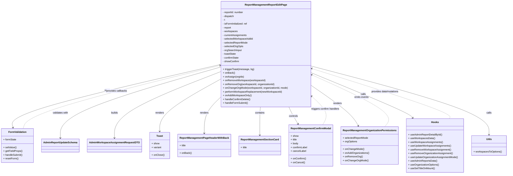

# Diagram: web/portal/src/pages/administration/report-management/ReportManagement.ReportEdit.page.tsx

> Auto-generated by Obscura crawlers

## Mermaid

### SVG

<svg id="container" width="3140.59375" xmlns="http://www.w3.org/2000/svg" class="classDiagram" height="1104" viewBox="0 0 3140.59375 1104" role="graphics-document document" aria-roledescription="class"><g><defs><marker id="container_class-aggregationStart" class="marker aggregation class" refX="18" refY="7" markerWidth="190" markerHeight="240" orient="auto"><path d="M 18,7 L9,13 L1,7 L9,1 Z"></path></marker></defs><defs><marker id="container_class-aggregationEnd" class="marker aggregation class" refX="1" refY="7" markerWidth="20" markerHeight="28" orient="auto"><path d="M 18,7 L9,13 L1,7 L9,1 Z"></path></marker></defs><defs><marker id="container_class-extensionStart" class="marker extension class" refX="18" refY="7" markerWidth="190" markerHeight="240" orient="auto"><path d="M 1,7 L18,13 V 1 Z"></path></marker></defs><defs><marker id="container_class-extensionEnd" class="marker extension class" refX="1" refY="7" markerWidth="20" markerHeight="28" orient="auto"><path d="M 1,1 V 13 L18,7 Z"></path></marker></defs><defs><marker id="container_class-compositionStart" class="marker composition class" refX="18" refY="7" markerWidth="190" markerHeight="240" orient="auto"><path d="M 18,7 L9,13 L1,7 L9,1 Z"></path></marker></defs><defs><marker id="container_class-compositionEnd" class="marker composition class" refX="1" refY="7" markerWidth="20" markerHeight="28" orient="auto"><path d="M 18,7 L9,13 L1,7 L9,1 Z"></path></marker></defs><defs><marker id="container_class-dependencyStart" class="marker dependency class" refX="6" refY="7" markerWidth="190" markerHeight="240" orient="auto"><path d="M 5,7 L9,13 L1,7 L9,1 Z"></path></marker></defs><defs><marker id="container_class-dependencyEnd" class="marker dependency class" refX="13" refY="7" markerWidth="20" markerHeight="28" orient="auto"><path d="M 18,7 L9,13 L14,7 L9,1 Z"></path></marker></defs><defs><marker id="container_class-lollipopStart" class="marker lollipop class" refX="13" refY="7" markerWidth="190" markerHeight="240" orient="auto"><circle stroke="black" fill="transparent" cx="7" cy="7" r="6"></circle></marker></defs><defs><marker id="container_class-lollipopEnd" class="marker lollipop class" refX="1" refY="7" markerWidth="190" markerHeight="240" orient="auto"><circle stroke="black" fill="transparent" cx="7" cy="7" r="6"></circle></marker></defs><g class="root"><g class="clusters"></g><g class="edgePaths"><path d="M1350.66,410.952L1135.255,461.96C919.85,512.968,489.04,614.984,277.532,681.688C66.024,748.392,73.817,779.785,77.714,795.481L81.61,811.177" id="id_ReportManagementReportEditPage_FormValidation_1" class="edge-thickness-normal edge-pattern-solid relation" style=";;;" data-edge="true" data-et="edge" data-id="id_ReportManagementReportEditPage_FormValidation_1" data-points="W3sieCI6MTM1MC42NjAxNTYyNSwieSI6NDEwLjk1MjQ2NTM4Njg3NTkzfSx7IngiOjU4LjIzMDQ2ODc1LCJ5Ijo3MTd9LHsieCI6ODMuMDU1ODE0MzAyODg0NjEsInkiOjgxN31d" marker-end="url(#container_class-dependencyEnd)"></path><path d="M1350.66,427.938L1188.38,476.115C1026.099,524.292,701.538,620.646,539.257,695.49C376.977,770.333,376.977,823.667,376.977,850.333L376.977,877" id="id_ReportManagementReportEditPage_AdminReportUpdateSchema_2" class="edge-thickness-normal edge-pattern-solid relation" style=";;;" data-edge="true" data-et="edge" data-id="id_ReportManagementReportEditPage_AdminReportUpdateSchema_2" data-points="W3sieCI6MTM1MC42NjAxNTYyNSwieSI6NDI3LjkzNzg3MjMwNjAyNzc3fSx7IngiOjM3Ni45NzY1NjI1LCJ5Ijo3MTd9LHsieCI6Mzc2Ljk3NjU2MjUsInkiOjg4M31d" marker-end="url(#container_class-dependencyEnd)"></path><path d="M1350.66,457.519L1242.947,500.766C1135.234,544.013,919.809,630.506,812.096,700.42C704.383,770.333,704.383,823.667,704.383,850.333L704.383,877" id="id_ReportManagementReportEditPage_AdminWorkspaceAssignmentRequestDTO_3" class="edge-thickness-normal edge-pattern-solid relation" style=";;;" data-edge="true" data-et="edge" data-id="id_ReportManagementReportEditPage_AdminWorkspaceAssignmentRequestDTO_3" data-points="W3sieCI6MTM1MC42NjAxNTYyNSwieSI6NDU3LjUxOTQ4ODg3NDMxMjV9LHsieCI6NzA0LjM4MjgxMjUsInkiOjcxN30seyJ4Ijo3MDQuMzgyODEyNSwieSI6ODgzfV0=" marker-end="url(#container_class-dependencyEnd)"></path><path d="M1350.66,505.046L1288.641,540.372C1226.622,575.697,1102.585,646.349,1040.566,701.341C978.547,756.333,978.547,795.667,978.547,815.333L978.547,835" id="id_ReportManagementReportEditPage_Toast_4" class="edge-thickness-normal edge-pattern-solid relation" style=";;;" data-edge="true" data-et="edge" data-id="id_ReportManagementReportEditPage_Toast_4" data-points="W3sieCI6MTM1MC42NjAxNTYyNSwieSI6NTA1LjA0NjIzNTQzMDI2MjF9LHsieCI6OTc4LjU0Njg3NSwieSI6NzE3fSx7IngiOjk3OC41NDY4NzUsInkiOjg0MX1d" marker-end="url(#container_class-dependencyEnd)"></path><path d="M1350.66,621.063L1334.343,637.052C1318.026,653.042,1285.392,685.021,1269.075,722.677C1252.758,760.333,1252.758,803.667,1252.758,825.333L1252.758,847" id="id_ReportManagementReportEditPage_ReportManagementPageHeaderWithBack_5" class="edge-thickness-normal edge-pattern-solid relation" style=";;;" data-edge="true" data-et="edge" data-id="id_ReportManagementReportEditPage_ReportManagementPageHeaderWithBack_5" data-points="W3sieCI6MTM1MC42NjAxNTYyNSwieSI6NjIxLjA2Mjg1NjYxNTA4MTV9LHsieCI6MTI1Mi43NTc4MTI1LCJ5Ijo3MTd9LHsieCI6MTI1Mi43NTc4MTI1LCJ5Ijo4NTN9XQ==" marker-end="url(#container_class-dependencyEnd)"></path><path d="M1597.183,680L1596.519,686.167C1595.854,692.333,1594.525,704.667,1593.86,734.5C1593.195,764.333,1593.195,811.667,1593.195,835.333L1593.195,859" id="id_ReportManagementReportEditPage_ReportManagementSectionCard_6" class="edge-thickness-normal edge-pattern-solid relation" style=";;;" data-edge="true" data-et="edge" data-id="id_ReportManagementReportEditPage_ReportManagementSectionCard_6" data-points="W3sieCI6MTU5Ny4xODMyOTAwNDY5MTcsInkiOjY4MH0seyJ4IjoxNTkzLjE5NTMxMjUsInkiOjcxN30seyJ4IjoxNTkzLjE5NTMxMjUsInkiOjg2NX1d" marker-end="url(#container_class-dependencyEnd)"></path><path d="M1774.49,680L1777.08,686.167C1779.669,692.333,1784.848,704.667,1794.039,722.627C1803.231,740.588,1816.434,764.176,1823.035,775.97L1829.637,787.764" id="id_ReportManagementReportEditPage_ReportManagementConfirmModal_7" class="edge-thickness-normal edge-pattern-solid relation" style=";;;" data-edge="true" data-et="edge" data-id="id_ReportManagementReportEditPage_ReportManagementConfirmModal_7" data-points="W3sieCI6MTc3NC40OTA0MjgxMTY2MjIsInkiOjY4MH0seyJ4IjoxNzkwLjAyNzM0Mzc1LCJ5Ijo3MTd9LHsieCI6MTgzMi41Njc1MzMwNTI4ODQ1LCJ5Ijo3OTN9XQ==" marker-end="url(#container_class-dependencyEnd)"></path><path d="M1916.137,545.225L1956.363,573.855C1996.589,602.484,2077.042,659.742,2124.699,702.157C2172.356,744.573,2187.217,772.146,2194.648,785.932L2202.079,799.718" id="id_ReportManagementReportEditPage_ReportManagementOrganizationPermissions_8" class="edge-thickness-normal edge-pattern-solid relation" style=";;;" data-edge="true" data-et="edge" data-id="id_ReportManagementReportEditPage_ReportManagementOrganizationPermissions_8" data-points="W3sieCI6MTkxNi4xMzY3MTg3NSwieSI6NTQ1LjIyNTQyMTc2NDQyMzF9LHsieCI6MjE1Ny40OTQxNDA2MjUsInkiOjcxN30seyJ4IjoyMjA0LjkyNTg1NjM3MDE5MjQsInkiOjgwNX1d" marker-end="url(#container_class-dependencyEnd)"></path><path d="M1916.137,463.511L2016.087,505.76C2116.036,548.008,2315.936,632.504,2420.12,680.133C2524.303,727.762,2532.771,738.523,2537.005,743.904L2541.238,749.285" id="id_ReportManagementReportEditPage_Hooks_9" class="edge-thickness-normal edge-pattern-solid relation" style=";;;" data-edge="true" data-et="edge" data-id="id_ReportManagementReportEditPage_Hooks_9" data-points="W3sieCI6MTkxNi4xMzY3MTg3NSwieSI6NDYzLjUxMTQ0MjkxMzgwNDF9LHsieCI6MjUxNS44MzU5Mzc1LCJ5Ijo3MTd9LHsieCI6MjU0NC45NDg1NjE0NDgzMTc0LCJ5Ijo3NTR9XQ==" marker-end="url(#container_class-dependencyEnd)"></path><path d="M1916.137,419.952L2100.436,469.46C2284.734,518.968,2653.332,617.984,2837.631,690.659C3021.93,763.333,3021.93,809.667,3021.93,832.833L3021.93,856" id="id_ReportManagementReportEditPage_Utils_10" class="edge-thickness-normal edge-pattern-solid relation" style=";;;" data-edge="true" data-et="edge" data-id="id_ReportManagementReportEditPage_Utils_10" data-points="W3sieCI6MTkxNi4xMzY3MTg3NSwieSI6NDE5Ljk1MTc1MDM4ODIyNX0seyJ4IjozMDIxLjkyOTY4NzUsInkiOjcxN30seyJ4IjozMDIxLjkyOTY4NzUsInkiOjg2Mn1d" marker-end="url(#container_class-dependencyEnd)"></path><path d="M143.605,817L148.811,800.333C154.018,783.667,164.431,750.333,364.638,683.799C564.845,617.264,954.846,517.528,1149.847,467.66L1344.847,417.792" id="id_FormValidation_ReportManagementReportEditPage_11" class="edge-thickness-normal edge-pattern-dashed relation" style=";;;" data-edge="true" data-et="edge" data-id="id_FormValidation_ReportManagementReportEditPage_11" data-points="W3sieCI6MTQzLjYwNTAxODAyODg0NjE2LCJ5Ijo4MTd9LHsieCI6MTc0Ljg0Mzc1LCJ5Ijo3MTd9LHsieCI6MTM1MC42NjAxNTYyNSwieSI6NDE2LjMwNTM5OTE4MDQ4MTV9XQ==" marker-end="url(#container_class-dependencyEnd)"></path><path d="M2768.029,754L2771.222,747.833C2774.415,741.667,2780.8,729.333,2639.77,676.542C2498.739,623.75,2210.292,530.5,2066.069,483.875L1921.846,437.25" id="id_Hooks_ReportManagementReportEditPage_12" class="edge-thickness-normal edge-pattern-dashed relation" style=";;;" data-edge="true" data-et="edge" data-id="id_Hooks_ReportManagementReportEditPage_12" data-points="W3sieCI6Mjc2OC4wMjkyNDk5MjQ4OCwieSI6NzU0fSx7IngiOjI3ODcuMTg1NTQ2ODc1LCJ5Ijo3MTd9LHsieCI6MTkxNi4xMzY3MTg3NSwieSI6NDM1LjQwNDUzOTA2MDM5NzJ9XQ==" marker-end="url(#container_class-dependencyEnd)"></path><path d="M2364.025,805L2375.565,790.333C2387.105,775.667,2410.185,746.333,2336.444,691.897C2262.702,637.461,2092.138,557.923,2006.856,518.154L1921.575,478.384" id="id_ReportManagementOrganizationPermissions_ReportManagementReportEditPage_13" class="edge-thickness-normal edge-pattern-dashed relation" style=";;;" data-edge="true" data-et="edge" data-id="id_ReportManagementOrganizationPermissions_ReportManagementReportEditPage_13" data-points="W3sieCI6MjM2NC4wMjQ3ODk2NjM0NjE0LCJ5Ijo4MDV9LHsieCI6MjQzMy4yNjU2MjUsInkiOjcxN30seyJ4IjoxOTE2LjEzNjcxODc1LCJ5Ijo0NzUuODQ4NjEyNTYyNjMyNDd9XQ==" marker-end="url(#container_class-dependencyEnd)"></path><path d="M1977.601,793L1984.428,780.333C1991.255,767.667,2004.91,742.333,1995.384,713.83C1985.859,685.327,1953.153,653.654,1936.8,637.818L1920.447,621.982" id="id_ReportManagementConfirmModal_ReportManagementReportEditPage_14" class="edge-thickness-normal edge-pattern-dashed relation" style=";;;" data-edge="true" data-et="edge" data-id="id_ReportManagementConfirmModal_ReportManagementReportEditPage_14" data-points="W3sieCI6MTk3Ny42MDA2OTg2MTc3ODg2LCJ5Ijo3OTN9LHsieCI6MjAxOC41NjQ0NTMxMjUsInkiOjcxN30seyJ4IjoxOTE2LjEzNjcxODc1LCJ5Ijo2MTcuODA3NTkxMDg1NDE4N31d" marker-end="url(#container_class-dependencyEnd)"></path></g><g class="edgeLabels"><g class="edgeLabel" transform="translate(654.31397, 575.84734)"><g class="label" data-id="id_ReportManagementReportEditPage_FormValidation_1" transform="translate(-16.4921875, -12)"><foreignObject width="32.984375" height="24">

uses

</foreignObject></g></g><g class="edgeLabel" transform="translate(376.9765625, 717)"><g class="label" data-id="id_ReportManagementReportEditPage_AdminReportUpdateSchema_2" transform="translate(-50.375, -12)"><foreignObject width="100.75" height="24">

validates with

</foreignObject></g></g><g class="edgeLabel" transform="translate(704.3828125, 717)"><g class="label" data-id="id_ReportManagementReportEditPage_AdminWorkspaceAssignmentRequestDTO_3" transform="translate(-22.4921875, -12)"><foreignObject width="44.984375" height="24">

builds

</foreignObject></g></g><g class="edgeLabel" transform="translate(978.546875, 717)"><g class="label" data-id="id_ReportManagementReportEditPage_Toast_4" transform="translate(-27.75, -12)"><foreignObject width="55.5" height="24">

renders

</foreignObject></g></g><g class="edgeLabel" transform="translate(1252.7578125, 717)"><g class="label" data-id="id_ReportManagementReportEditPage_ReportManagementPageHeaderWithBack_5" transform="translate(-27.75, -12)"><foreignObject width="55.5" height="24">

renders

</foreignObject></g></g><g class="edgeLabel" transform="translate(1593.1953125, 717)"><g class="label" data-id="id_ReportManagementReportEditPage_ReportManagementSectionCard_6" transform="translate(-30.890625, -12)"><foreignObject width="61.78125" height="24">

contains

</foreignObject></g></g><g class="edgeLabel" transform="translate(1801.49715, 737.49134)"><g class="label" data-id="id_ReportManagementReportEditPage_ReportManagementConfirmModal_7" transform="translate(-29.515625, -12)"><foreignObject width="59.03125" height="24">

controls

</foreignObject></g></g><g class="edgeLabel" transform="translate(2077.53913, 660.09585)"><g class="label" data-id="id_ReportManagementReportEditPage_ReportManagementOrganizationPermissions_8" transform="translate(-27.75, -12)"><foreignObject width="55.5" height="24">

renders

</foreignObject></g></g><g class="edgeLabel" transform="translate(2237.66897, 599.42082)"><g class="label" data-id="id_ReportManagementReportEditPage_Hooks_9" transform="translate(-16.4453125, -12)"><foreignObject width="32.890625" height="24">

calls

</foreignObject></g></g><g class="edgeLabel" transform="translate(3021.9296875, 717)"><g class="label" data-id="id_ReportManagementReportEditPage_Utils_10" transform="translate(-16.4453125, -12)"><foreignObject width="32.890625" height="24">

calls

</foreignObject></g></g><g class="edgeLabel" transform="translate(712.0023, 579.63104)"><g class="label" data-id="id_FormValidation_ReportManagementReportEditPage_11" transform="translate(-66.78125, -12)"><foreignObject width="133.5625" height="24">

provides callbacks

</foreignObject></g></g><g class="edgeLabel" transform="translate(2371.48348, 582.6105)"><g class="label" data-id="id_Hooks_ReportManagementReportEditPage_12" transform="translate(-90.609375, -12)"><foreignObject width="181.21875" height="24">

provides data/mutations

</foreignObject></g></g><g class="edgeLabel" transform="translate(2225.44248, 620.08637)"><g class="label" data-id="id_ReportManagementOrganizationPermissions_ReportManagementReportEditPage_13" transform="translate(-46.125, -12)"><foreignObject width="92.25" height="24">

emits events

</foreignObject></g></g><g class="edgeLabel" transform="translate(1998.36105, 697.43475)"><g class="label" data-id="id_ReportManagementConfirmModal_ReportManagementReportEditPage_14" transform="translate(-91.1796875, -12)"><foreignObject width="182.359375" height="24">

triggers confirm handlers

</foreignObject></g></g></g><g class="nodes"><g class="node default" id="classId-ReportManagementReportEditPage-0" transform="translate(1633.3984375, 344)"><g class="basic label-container"><path d="M-282.73828125 -336 L282.73828125 -336 L282.73828125 336 L-282.73828125 336" stroke="none" stroke-width="0" fill="#ECECFF" style=""></path><path d="M-282.73828125 -336 C-142.28489605936713 -336, -1.8315108687342558 -336, 282.73828125 -336 M-282.73828125 -336 C-143.8938850119915 -336, -5.0494887739830006 -336, 282.73828125 -336 M282.73828125 -336 C282.73828125 -116.43192809864175, 282.73828125 103.1361438027165, 282.73828125 336 M282.73828125 -336 C282.73828125 -150.36042042058338, 282.73828125 35.27915915883324, 282.73828125 336 M282.73828125 336 C78.83863167833022 336, -125.06101789333957 336, -282.73828125 336 M282.73828125 336 C107.31123998941877 336, -68.11580127116247 336, -282.73828125 336 M-282.73828125 336 C-282.73828125 129.14979673323552, -282.73828125 -77.70040653352896, -282.73828125 -336 M-282.73828125 336 C-282.73828125 107.55648878443571, -282.73828125 -120.88702243112857, -282.73828125 -336" stroke="#9370DB" stroke-width="1.3" fill="none" stroke-dasharray="0 0" style=""></path></g><g class="annotation-group text" transform="translate(0, -312)"></g><g class="label-group text" transform="translate(-128.6015625, -312)"><g class="label" style="font-weight: bolder" transform="translate(0,-12)"><foreignObject width="257.203125" height="24">

ReportManagementReportEditPage

</foreignObject></g></g><g class="members-group text" transform="translate(-270.73828125, -264)"><g class="label" style="" transform="translate(0,-12)"><foreignObject width="135.078125" height="24">

- reportId: number

</foreignObject></g><g class="label" style="" transform="translate(0,12)"><foreignObject width="72.859375" height="24">

- dispatch

</foreignObject></g><g class="label" style="" transform="translate(0,36)"><foreignObject width="16.46875" height="24">

- t

</foreignObject></g><g class="label" style="" transform="translate(0,60)"><foreignObject width="158.875" height="24">

- isFormInitialized: ref

</foreignObject></g><g class="label" style="" transform="translate(0,84)"><foreignObject width="55.90625" height="24">

- report

</foreignObject></g><g class="label" style="" transform="translate(0,108)"><foreignObject width="94.84375" height="24">

- workspaces

</foreignObject></g><g class="label" style="" transform="translate(0,132)"><foreignObject width="154.453125" height="24">

- currentAssignments

</foreignObject></g><g class="label" style="" transform="translate(0,156)"><foreignObject width="192.53125" height="24">

- selectedWorkspaceAddId

</foreignObject></g><g class="label" style="" transform="translate(0,180)"><foreignObject width="160.734375" height="24">

- selectedReportMode

</foreignObject></g><g class="label" style="" transform="translate(0,204)"><foreignObject width="130.84375" height="24">

- selectedOrgOpts

</foreignObject></g><g class="label" style="" transform="translate(0,228)"><foreignObject width="121.6875" height="24">

- orgSearchInput

</foreignObject></g><g class="label" style="" transform="translate(0,252)"><foreignObject width="84.546875" height="24">

- toastState

</foreignObject></g><g class="label" style="" transform="translate(0,276)"><foreignObject width="103.171875" height="24">

- confirmState

</foreignObject></g><g class="label" style="" transform="translate(0,300)"><foreignObject width="104.8125" height="24">

- showConfirm

</foreignObject></g></g><g class="methods-group text" transform="translate(-270.73828125, 96)"><g class="label" style="" transform="translate(0,-12)"><foreignObject width="196.84375" height="24">

+ triggerToast(message, bg)

</foreignObject></g><g class="label" style="" transform="translate(0,12)"><foreignObject width="75.59375" height="24">

+ onBack()

</foreignObject></g><g class="label" style="" transform="translate(0,36)"><foreignObject width="132.84375" height="24">

+ onAssign(orgIds)

</foreignObject></g><g class="label" style="" transform="translate(0,60)"><foreignObject width="268.21875" height="24">

+ onRemoveWorkspace(workspaceId)

</foreignObject></g><g class="label" style="" transform="translate(0,84)"><foreignObject width="328.015625" height="24">

+ onRemoveOrg(workspaceId, organizationId)

</foreignObject></g><g class="label" style="" transform="translate(0,108)"><foreignObject width="412.875" height="24">

+ onChangeOrgMode(workspaceId, organizationId, mode)

</foreignObject></g><g class="label" style="" transform="translate(0,132)"><foreignObject width="376.40625" height="24">

+ performWorkspaceReplacement(newWorkspaceId)

</foreignObject></g><g class="label" style="" transform="translate(0,156)"><foreignObject width="180.734375" height="24">

+ onAddWorkspaceOnly()

</foreignObject></g><g class="label" style="" transform="translate(0,180)"><foreignObject width="176.015625" height="24">

+ handleConfirmDelete()

</foreignObject></g><g class="label" style="" transform="translate(0,204)"><foreignObject width="161.015625" height="24">

+ handleFormSubmit()

</foreignObject></g></g><g class="divider" style=""><path d="M-282.73828125 -288 C-132.3456771877817 -288, 18.046926874436622 -288, 282.73828125 -288 M-282.73828125 -288 C-72.3586304457846 -288, 138.0210203584308 -288, 282.73828125 -288" stroke="#9370DB" stroke-width="1.3" fill="none" stroke-dasharray="0 0" style=""></path></g><g class="divider" style=""><path d="M-282.73828125 72 C-104.79372391338163 72, 73.15083342323675 72, 282.73828125 72 M-282.73828125 72 C-91.02261785478947 72, 100.69304554042105 72, 282.73828125 72" stroke="#9370DB" stroke-width="1.3" fill="none" stroke-dasharray="0 0" style=""></path></g></g><g class="node default" id="classId-FormValidation-1" transform="translate(109.8671875, 925)"><g class="basic label-container"><path d="M-101.8671875 -108 L101.8671875 -108 L101.8671875 108 L-101.8671875 108" stroke="none" stroke-width="0" fill="#ECECFF" style=""></path><path d="M-101.8671875 -108 C-28.50051037541185 -108, 44.8661667491763 -108, 101.8671875 -108 M-101.8671875 -108 C-21.084045952310433 -108, 59.699095595379134 -108, 101.8671875 -108 M101.8671875 -108 C101.8671875 -22.300064736696456, 101.8671875 63.39987052660709, 101.8671875 108 M101.8671875 -108 C101.8671875 -47.189796760272465, 101.8671875 13.62040647945507, 101.8671875 108 M101.8671875 108 C58.43955187984377 108, 15.011916259687538 108, -101.8671875 108 M101.8671875 108 C52.29445550176654 108, 2.7217235035330845 108, -101.8671875 108 M-101.8671875 108 C-101.8671875 50.27974527792635, -101.8671875 -7.440509444147295, -101.8671875 -108 M-101.8671875 108 C-101.8671875 60.86913382931108, -101.8671875 13.738267658622163, -101.8671875 -108" stroke="#9370DB" stroke-width="1.3" fill="none" stroke-dasharray="0 0" style=""></path></g><g class="annotation-group text" transform="translate(0, -84)"></g><g class="label-group text" transform="translate(-55.25, -84)"><g class="label" style="font-weight: bolder" transform="translate(0,-12)"><foreignObject width="110.5" height="24">

FormValidation

</foreignObject></g></g><g class="members-group text" transform="translate(-89.8671875, -36)"><g class="label" style="" transform="translate(0,-12)"><foreignObject width="84.015625" height="24">

+ formState

</foreignObject></g></g><g class="methods-group text" transform="translate(-89.8671875, 12)"><g class="label" style="" transform="translate(0,-12)"><foreignObject width="84.09375" height="24">

+ setValue()

</foreignObject></g><g class="label" style="" transform="translate(0,12)"><foreignObject width="120.859375" height="24">

+ getFieldProps()

</foreignObject></g><g class="label" style="" transform="translate(0,36)"><foreignObject width="124.484375" height="24">

+ handleSubmit()

</foreignObject></g><g class="label" style="" transform="translate(0,60)"><foreignObject width="95.515625" height="24">

+ resetForm()

</foreignObject></g></g><g class="divider" style=""><path d="M-101.8671875 -60 C-53.43524161156906 -60, -5.003295723138123 -60, 101.8671875 -60 M-101.8671875 -60 C-42.38587147326138 -60, 17.095444553477236 -60, 101.8671875 -60" stroke="#9370DB" stroke-width="1.3" fill="none" stroke-dasharray="0 0" style=""></path></g><g class="divider" style=""><path d="M-101.8671875 -12 C-59.80326127480354 -12, -17.739335049607078 -12, 101.8671875 -12 M-101.8671875 -12 C-55.436218886978985 -12, -9.00525027395797 -12, 101.8671875 -12" stroke="#9370DB" stroke-width="1.3" fill="none" stroke-dasharray="0 0" style=""></path></g></g><g class="node default" id="classId-AdminReportUpdateSchema-2" transform="translate(376.9765625, 925)"><g class="basic label-container"><path d="M-115.2421875 -42 L115.2421875 -42 L115.2421875 42 L-115.2421875 42" stroke="none" stroke-width="0" fill="#ECECFF" style=""></path><path d="M-115.2421875 -42 C-66.1075908806329 -42, -16.97299426126581 -42, 115.2421875 -42 M-115.2421875 -42 C-28.73227737000103 -42, 57.77763275999794 -42, 115.2421875 -42 M115.2421875 -42 C115.2421875 -10.784285845783337, 115.2421875 20.431428308433325, 115.2421875 42 M115.2421875 -42 C115.2421875 -19.77639809005369, 115.2421875 2.4472038198926214, 115.2421875 42 M115.2421875 42 C27.676664153603554 42, -59.88885919279289 42, -115.2421875 42 M115.2421875 42 C30.096899871056124 42, -55.04838775788775 42, -115.2421875 42 M-115.2421875 42 C-115.2421875 14.763075660315742, -115.2421875 -12.473848679368515, -115.2421875 -42 M-115.2421875 42 C-115.2421875 16.193927291845878, -115.2421875 -9.612145416308245, -115.2421875 -42" stroke="#9370DB" stroke-width="1.3" fill="none" stroke-dasharray="0 0" style=""></path></g><g class="annotation-group text" transform="translate(0, -18)"></g><g class="label-group text" transform="translate(-103.2421875, -18)"><g class="label" style="font-weight: bolder" transform="translate(0,-12)"><foreignObject width="206.484375" height="24">

AdminReportUpdateSchema

</foreignObject></g></g><g class="members-group text" transform="translate(-103.2421875, 30)"></g><g class="methods-group text" transform="translate(-103.2421875, 60)"></g><g class="divider" style=""><path d="M-115.2421875 6 C-33.33282500403381 6, 48.576537491932385 6, 115.2421875 6 M-115.2421875 6 C-61.05019419869247 6, -6.858200897384947 6, 115.2421875 6" stroke="#9370DB" stroke-width="1.3" fill="none" stroke-dasharray="0 0" style=""></path></g><g class="divider" style=""><path d="M-115.2421875 24 C-49.62480942492087 24, 15.992568650158262 24, 115.2421875 24 M-115.2421875 24 C-23.307780603836477 24, 68.62662629232705 24, 115.2421875 24" stroke="#9370DB" stroke-width="1.3" fill="none" stroke-dasharray="0 0" style=""></path></g></g><g class="node default" id="classId-AdminWorkspaceAssignmentRequestDTO-3" transform="translate(704.3828125, 925)"><g class="basic label-container"><path d="M-162.1640625 -42 L162.1640625 -42 L162.1640625 42 L-162.1640625 42" stroke="none" stroke-width="0" fill="#ECECFF" style=""></path><path d="M-162.1640625 -42 C-38.853386437062014 -42, 84.45728962587597 -42, 162.1640625 -42 M-162.1640625 -42 C-44.03212459852658 -42, 74.09981330294684 -42, 162.1640625 -42 M162.1640625 -42 C162.1640625 -13.944225366236935, 162.1640625 14.11154926752613, 162.1640625 42 M162.1640625 -42 C162.1640625 -18.161904168133134, 162.1640625 5.676191663733732, 162.1640625 42 M162.1640625 42 C87.91989400831272 42, 13.675725516625448 42, -162.1640625 42 M162.1640625 42 C64.27781628904238 42, -33.608429921915246 42, -162.1640625 42 M-162.1640625 42 C-162.1640625 10.857698429570558, -162.1640625 -20.284603140858884, -162.1640625 -42 M-162.1640625 42 C-162.1640625 21.231363739062456, -162.1640625 0.46272747812491133, -162.1640625 -42" stroke="#9370DB" stroke-width="1.3" fill="none" stroke-dasharray="0 0" style=""></path></g><g class="annotation-group text" transform="translate(0, -18)"></g><g class="label-group text" transform="translate(-150.1640625, -18)"><g class="label" style="font-weight: bolder" transform="translate(0,-12)"><foreignObject width="300.328125" height="24">

AdminWorkspaceAssignmentRequestDTO

</foreignObject></g></g><g class="members-group text" transform="translate(-150.1640625, 30)"></g><g class="methods-group text" transform="translate(-150.1640625, 60)"></g><g class="divider" style=""><path d="M-162.1640625 6 C-71.542354217837 6, 19.079354064325997 6, 162.1640625 6 M-162.1640625 6 C-49.1796081561715 6, 63.804846187657006 6, 162.1640625 6" stroke="#9370DB" stroke-width="1.3" fill="none" stroke-dasharray="0 0" style=""></path></g><g class="divider" style=""><path d="M-162.1640625 24 C-75.88316200285588 24, 10.397738494288234 24, 162.1640625 24 M-162.1640625 24 C-74.8767405498814 24, 12.410581400237191 24, 162.1640625 24" stroke="#9370DB" stroke-width="1.3" fill="none" stroke-dasharray="0 0" style=""></path></g></g><g class="node default" id="classId-Toast-4" transform="translate(978.546875, 925)"><g class="basic label-container"><path d="M-62 -84 L62 -84 L62 84 L-62 84" stroke="none" stroke-width="0" fill="#ECECFF" style=""></path><path d="M-62 -84 C-17.844073616299802 -84, 26.311852767400396 -84, 62 -84 M-62 -84 C-29.39525749611623 -84, 3.2094850077675403 -84, 62 -84 M62 -84 C62 -33.728634391552355, 62 16.54273121689529, 62 84 M62 -84 C62 -21.74183656508177, 62 40.51632686983646, 62 84 M62 84 C18.622090965982373 84, -24.755818068035254 84, -62 84 M62 84 C25.473462561915703 84, -11.053074876168594 84, -62 84 M-62 84 C-62 49.69946326379422, -62 15.398926527588443, -62 -84 M-62 84 C-62 41.45944391820392, -62 -1.0811121635921666, -62 -84" stroke="#9370DB" stroke-width="1.3" fill="none" stroke-dasharray="0 0" style=""></path></g><g class="annotation-group text" transform="translate(0, -60)"></g><g class="label-group text" transform="translate(-19.734375, -60)"><g class="label" style="font-weight: bolder" transform="translate(0,-12)"><foreignObject width="39.46875" height="24">

Toast

</foreignObject></g></g><g class="members-group text" transform="translate(-50, -12)"><g class="label" style="" transform="translate(0,-12)"><foreignObject width="49.890625" height="24">

+ show

</foreignObject></g><g class="label" style="" transform="translate(0,12)"><foreignObject width="63.09375" height="24">

+ variant

</foreignObject></g></g><g class="methods-group text" transform="translate(-50, 60)"><g class="label" style="" transform="translate(0,-12)"><foreignObject width="80.265625" height="24">

+ onClose()

</foreignObject></g></g><g class="divider" style=""><path d="M-62 -36 C-35.19547004737791 -36, -8.390940094755827 -36, 62 -36 M-62 -36 C-34.79444491732394 -36, -7.588889834647894 -36, 62 -36" stroke="#9370DB" stroke-width="1.3" fill="none" stroke-dasharray="0 0" style=""></path></g><g class="divider" style=""><path d="M-62 36 C-18.622415001243155 36, 24.75516999751369 36, 62 36 M-62 36 C-28.301046458132355 36, 5.397907083735291 36, 62 36" stroke="#9370DB" stroke-width="1.3" fill="none" stroke-dasharray="0 0" style=""></path></g></g><g class="node default" id="classId-ReportManagementPageHeaderWithBack-5" transform="translate(1252.7578125, 925)"><g class="basic label-container"><path d="M-162.2109375 -72 L162.2109375 -72 L162.2109375 72 L-162.2109375 72" stroke="none" stroke-width="0" fill="#ECECFF" style=""></path><path d="M-162.2109375 -72 C-87.6969458488468 -72, -13.18295419769359 -72, 162.2109375 -72 M-162.2109375 -72 C-88.34795613497805 -72, -14.484974769956096 -72, 162.2109375 -72 M162.2109375 -72 C162.2109375 -16.061826825470874, 162.2109375 39.87634634905825, 162.2109375 72 M162.2109375 -72 C162.2109375 -20.443647370413963, 162.2109375 31.112705259172074, 162.2109375 72 M162.2109375 72 C66.55329977333106 72, -29.104337953337875 72, -162.2109375 72 M162.2109375 72 C40.88728851256562 72, -80.43636047486876 72, -162.2109375 72 M-162.2109375 72 C-162.2109375 38.7409984478178, -162.2109375 5.4819968956356036, -162.2109375 -72 M-162.2109375 72 C-162.2109375 18.497554142998993, -162.2109375 -35.004891714002014, -162.2109375 -72" stroke="#9370DB" stroke-width="1.3" fill="none" stroke-dasharray="0 0" style=""></path></g><g class="annotation-group text" transform="translate(0, -48)"></g><g class="label-group text" transform="translate(-150.2109375, -48)"><g class="label" style="font-weight: bolder" transform="translate(0,-12)"><foreignObject width="300.421875" height="24">

ReportManagementPageHeaderWithBack

</foreignObject></g></g><g class="members-group text" transform="translate(-150.2109375, 0)"><g class="label" style="" transform="translate(0,-12)"><foreignObject width="41.46875" height="24">

+ title

</foreignObject></g></g><g class="methods-group text" transform="translate(-150.2109375, 48)"><g class="label" style="" transform="translate(0,-12)"><foreignObject width="75.59375" height="24">

+ onBack()

</foreignObject></g></g><g class="divider" style=""><path d="M-162.2109375 -24 C-79.64352242303814 -24, 2.9238926539237298 -24, 162.2109375 -24 M-162.2109375 -24 C-44.337617182117185 -24, 73.53570313576563 -24, 162.2109375 -24" stroke="#9370DB" stroke-width="1.3" fill="none" stroke-dasharray="0 0" style=""></path></g><g class="divider" style=""><path d="M-162.2109375 24 C-94.09805682347485 24, -25.985176146949698 24, 162.2109375 24 M-162.2109375 24 C-50.175477804985135 24, 61.85998189002973 24, 162.2109375 24" stroke="#9370DB" stroke-width="1.3" fill="none" stroke-dasharray="0 0" style=""></path></g></g><g class="node default" id="classId-ReportManagementSectionCard-6" transform="translate(1593.1953125, 925)"><g class="basic label-container"><path d="M-128.2265625 -60 L128.2265625 -60 L128.2265625 60 L-128.2265625 60" stroke="none" stroke-width="0" fill="#ECECFF" style=""></path><path d="M-128.2265625 -60 C-50.00668778199993 -60, 28.21318693600014 -60, 128.2265625 -60 M-128.2265625 -60 C-29.909722228061668 -60, 68.40711804387666 -60, 128.2265625 -60 M128.2265625 -60 C128.2265625 -22.17575703687455, 128.2265625 15.648485926250899, 128.2265625 60 M128.2265625 -60 C128.2265625 -18.10738271549613, 128.2265625 23.78523456900774, 128.2265625 60 M128.2265625 60 C56.70282965647584 60, -14.820903187048316 60, -128.2265625 60 M128.2265625 60 C37.00782714503728 60, -54.210908209925435 60, -128.2265625 60 M-128.2265625 60 C-128.2265625 26.85021618706297, -128.2265625 -6.299567625874062, -128.2265625 -60 M-128.2265625 60 C-128.2265625 27.17595290236749, -128.2265625 -5.648094195265017, -128.2265625 -60" stroke="#9370DB" stroke-width="1.3" fill="none" stroke-dasharray="0 0" style=""></path></g><g class="annotation-group text" transform="translate(0, -36)"></g><g class="label-group text" transform="translate(-116.2265625, -36)"><g class="label" style="font-weight: bolder" transform="translate(0,-12)"><foreignObject width="232.453125" height="24">

ReportManagementSectionCard

</foreignObject></g></g><g class="members-group text" transform="translate(-116.2265625, 12)"><g class="label" style="" transform="translate(0,-12)"><foreignObject width="41.46875" height="24">

+ title

</foreignObject></g></g><g class="methods-group text" transform="translate(-116.2265625, 60)"></g><g class="divider" style=""><path d="M-128.2265625 -12 C-58.020480931426206 -12, 12.185600637147587 -12, 128.2265625 -12 M-128.2265625 -12 C-62.38765252781745 -12, 3.4512574443650976 -12, 128.2265625 -12" stroke="#9370DB" stroke-width="1.3" fill="none" stroke-dasharray="0 0" style=""></path></g><g class="divider" style=""><path d="M-128.2265625 36 C-62.8829474477091 36, 2.4606676045818006 36, 128.2265625 36 M-128.2265625 36 C-37.231497014983404 36, 53.76356847003319 36, 128.2265625 36" stroke="#9370DB" stroke-width="1.3" fill="none" stroke-dasharray="0 0" style=""></path></g></g><g class="node default" id="classId-ReportManagementConfirmModal-7" transform="translate(1906.453125, 925)"><g class="basic label-container"><path d="M-135.03125 -132 L135.03125 -132 L135.03125 132 L-135.03125 132" stroke="none" stroke-width="0" fill="#ECECFF" style=""></path><path d="M-135.03125 -132 C-27.71780124758365 -132, 79.5956475048327 -132, 135.03125 -132 M-135.03125 -132 C-43.16908118814551 -132, 48.693087623708976 -132, 135.03125 -132 M135.03125 -132 C135.03125 -40.91731320550265, 135.03125 50.1653735889947, 135.03125 132 M135.03125 -132 C135.03125 -36.83279754966017, 135.03125 58.33440490067966, 135.03125 132 M135.03125 132 C61.09341102143763 132, -12.844427957124736 132, -135.03125 132 M135.03125 132 C63.996807880495794 132, -7.037634239008412 132, -135.03125 132 M-135.03125 132 C-135.03125 39.741588067113966, -135.03125 -52.51682386577207, -135.03125 -132 M-135.03125 132 C-135.03125 65.47332664560444, -135.03125 -1.0533467087911106, -135.03125 -132" stroke="#9370DB" stroke-width="1.3" fill="none" stroke-dasharray="0 0" style=""></path></g><g class="annotation-group text" transform="translate(0, -108)"></g><g class="label-group text" transform="translate(-123.03125, -108)"><g class="label" style="font-weight: bolder" transform="translate(0,-12)"><foreignObject width="246.0625" height="24">

ReportManagementConfirmModal

</foreignObject></g></g><g class="members-group text" transform="translate(-123.03125, -60)"><g class="label" style="" transform="translate(0,-12)"><foreignObject width="49.890625" height="24">

+ show

</foreignObject></g><g class="label" style="" transform="translate(0,12)"><foreignObject width="41.46875" height="24">

+ title

</foreignObject></g><g class="label" style="" transform="translate(0,36)"><foreignObject width="48.515625" height="24">

+ body

</foreignObject></g><g class="label" style="" transform="translate(0,60)"><foreignObject width="106.796875" height="24">

+ confirmLabel

</foreignObject></g><g class="label" style="" transform="translate(0,84)"><foreignObject width="97.953125" height="24">

+ cancelLabel

</foreignObject></g></g><g class="methods-group text" transform="translate(-123.03125, 84)"><g class="label" style="" transform="translate(0,-12)"><foreignObject width="97.765625" height="24">

+ onConfirm()

</foreignObject></g><g class="label" style="" transform="translate(0,12)"><foreignObject width="88.9375" height="24">

+ onCancel()

</foreignObject></g></g><g class="divider" style=""><path d="M-135.03125 -84 C-68.22616396469564 -84, -1.4210779293912879 -84, 135.03125 -84 M-135.03125 -84 C-78.7024377202629 -84, -22.373625440525814 -84, 135.03125 -84" stroke="#9370DB" stroke-width="1.3" fill="none" stroke-dasharray="0 0" style=""></path></g><g class="divider" style=""><path d="M-135.03125 60 C-63.191843041020846 60, 8.647563917958308 60, 135.03125 60 M-135.03125 60 C-61.31335683149409 60, 12.40453633701182 60, 135.03125 60" stroke="#9370DB" stroke-width="1.3" fill="none" stroke-dasharray="0 0" style=""></path></g></g><g class="node default" id="classId-ReportManagementOrganizationPermissions-8" transform="translate(2269.60546875, 925)"><g class="basic label-container"><path d="M-178.12109375 -120 L178.12109375 -120 L178.12109375 120 L-178.12109375 120" stroke="none" stroke-width="0" fill="#ECECFF" style=""></path><path d="M-178.12109375 -120 C-67.85019697457257 -120, 42.42069980085486 -120, 178.12109375 -120 M-178.12109375 -120 C-93.24874204173113 -120, -8.376390333462268 -120, 178.12109375 -120 M178.12109375 -120 C178.12109375 -34.439125012426885, 178.12109375 51.12174997514623, 178.12109375 120 M178.12109375 -120 C178.12109375 -45.19952423777009, 178.12109375 29.600951524459816, 178.12109375 120 M178.12109375 120 C90.0438600062218 120, 1.9666262624436115 120, -178.12109375 120 M178.12109375 120 C38.01789241967495 120, -102.0853089106501 120, -178.12109375 120 M-178.12109375 120 C-178.12109375 55.41328924065468, -178.12109375 -9.173421518690645, -178.12109375 -120 M-178.12109375 120 C-178.12109375 35.09456786988369, -178.12109375 -49.81086426023262, -178.12109375 -120" stroke="#9370DB" stroke-width="1.3" fill="none" stroke-dasharray="0 0" style=""></path></g><g class="annotation-group text" transform="translate(0, -96)"></g><g class="label-group text" transform="translate(-163.0703125, -96)"><g class="label" style="font-weight: bolder" transform="translate(0,-12)"><foreignObject width="326.140625" height="24">

ReportManagementOrganizationPermissions

</foreignObject></g></g><g class="members-group text" transform="translate(-166.12109375, -48)"><g class="label" style="" transform="translate(0,-12)"><foreignObject width="162.265625" height="24">

+ selectedReportMode

</foreignObject></g><g class="label" style="" transform="translate(0,12)"><foreignObject width="92.890625" height="24">

+ orgOptions

</foreignObject></g></g><g class="methods-group text" transform="translate(-166.12109375, 24)"><g class="label" style="" transform="translate(0,-12)"><foreignObject width="134.4375" height="24">

+ onChangeMode()

</foreignObject></g><g class="label" style="" transform="translate(0,12)"><foreignObject width="169.171875" height="24">

+ onAddOrganizations()

</foreignObject></g><g class="label" style="" transform="translate(0,36)"><foreignObject width="124.328125" height="24">

+ onRemoveOrg()

</foreignObject></g><g class="label" style="" transform="translate(0,60)"><foreignObject width="159.765625" height="24">

+ onChangeOrgMode()

</foreignObject></g></g><g class="divider" style=""><path d="M-178.12109375 -72 C-51.64237469700299 -72, 74.83634435599402 -72, 178.12109375 -72 M-178.12109375 -72 C-90.22645904205928 -72, -2.3318243341185507 -72, 178.12109375 -72" stroke="#9370DB" stroke-width="1.3" fill="none" stroke-dasharray="0 0" style=""></path></g><g class="divider" style=""><path d="M-178.12109375 0 C-68.65743844607307 0, 40.806216857853855 0, 178.12109375 0 M-178.12109375 0 C-62.04017644490416 0, 54.040740860191676 0, 178.12109375 0" stroke="#9370DB" stroke-width="1.3" fill="none" stroke-dasharray="0 0" style=""></path></g></g><g class="node default" id="classId-Hooks-9" transform="translate(2679.49609375, 925)"><g class="basic label-container"><path d="M-181.76953125 -171 L181.76953125 -171 L181.76953125 171 L-181.76953125 171" stroke="none" stroke-width="0" fill="#ECECFF" style=""></path><path d="M-181.76953125 -171 C-47.37095832785977 -171, 87.02761459428046 -171, 181.76953125 -171 M-181.76953125 -171 C-37.02699311582242 -171, 107.71554501835516 -171, 181.76953125 -171 M181.76953125 -171 C181.76953125 -98.88272629710873, 181.76953125 -26.765452594217464, 181.76953125 171 M181.76953125 -171 C181.76953125 -87.69662082397967, 181.76953125 -4.393241647959343, 181.76953125 171 M181.76953125 171 C74.1706056549997 171, -33.42831994000059 171, -181.76953125 171 M181.76953125 171 C100.89158516865571 171, 20.013639087311418 171, -181.76953125 171 M-181.76953125 171 C-181.76953125 90.01523823057966, -181.76953125 9.03047646115931, -181.76953125 -171 M-181.76953125 171 C-181.76953125 40.180666283662106, -181.76953125 -90.63866743267579, -181.76953125 -171" stroke="#9370DB" stroke-width="1.3" fill="none" stroke-dasharray="0 0" style=""></path></g><g class="annotation-group text" transform="translate(0, -147)"></g><g class="label-group text" transform="translate(-22.9140625, -147)"><g class="label" style="font-weight: bolder" transform="translate(0,-12)"><foreignObject width="45.828125" height="24">

Hooks

</foreignObject></g></g><g class="members-group text" transform="translate(-169.76953125, -99)"></g><g class="methods-group text" transform="translate(-169.76953125, -69)"><g class="label" style="" transform="translate(0,-12)"><foreignObject width="217.875" height="24">

+ useAdminReportDetailById()

</foreignObject></g><g class="label" style="" transform="translate(0,12)"><foreignObject width="167.046875" height="24">

+ useWorkspacesData()

</foreignObject></g><g class="label" style="" transform="translate(0,36)"><foreignObject width="217.578125" height="24">

+ useWorkspaceAssignments()

</foreignObject></g><g class="label" style="" transform="translate(0,60)"><foreignObject width="270.203125" height="24">

+ useUpdateWorkspaceAssignments()

</foreignObject></g><g class="label" style="" transform="translate(0,84)"><foreignObject width="267.78125" height="24">

+ useRemoveWorkspaceAssignment()

</foreignObject></g><g class="label" style="" transform="translate(0,108)"><foreignObject width="281.609375" height="24">

+ useRemoveOrganizationAssignment()

</foreignObject></g><g class="label" style="" transform="translate(0,132)"><foreignObject width="316.625" height="24">

+ useUpdateOrganizationAssignmentMode()

</foreignObject></g><g class="label" style="" transform="translate(0,156)"><foreignObject width="184.09375" height="24">

+ useAdminReportsData()

</foreignObject></g><g class="label" style="" transform="translate(0,180)"><foreignObject width="197.234375" height="24">

+ useOrganizationOptions()

</foreignObject></g><g class="label" style="" transform="translate(0,204)"><foreignObject width="169.75" height="24">

+ useSetTitleOnMount()

</foreignObject></g></g><g class="divider" style=""><path d="M-181.76953125 -123 C-49.6833166328787 -123, 82.4028979842426 -123, 181.76953125 -123 M-181.76953125 -123 C-42.85216314813505 -123, 96.0652049537299 -123, 181.76953125 -123" stroke="#9370DB" stroke-width="1.3" fill="none" stroke-dasharray="0 0" style=""></path></g><g class="divider" style=""><path d="M-181.76953125 -99 C-57.40105694693716 -99, 66.96741735612568 -99, 181.76953125 -99 M-181.76953125 -99 C-103.39914586588738 -99, -25.028760481774754 -99, 181.76953125 -99" stroke="#9370DB" stroke-width="1.3" fill="none" stroke-dasharray="0 0" style=""></path></g></g><g class="node default" id="classId-Utils-10" transform="translate(3021.9296875, 925)"><g class="basic label-container"><path d="M-110.6640625 -63 L110.6640625 -63 L110.6640625 63 L-110.6640625 63" stroke="none" stroke-width="0" fill="#ECECFF" style=""></path><path d="M-110.6640625 -63 C-63.99242976057147 -63, -17.320797021142937 -63, 110.6640625 -63 M-110.6640625 -63 C-29.327325431687697 -63, 52.009411636624606 -63, 110.6640625 -63 M110.6640625 -63 C110.6640625 -30.41434167005454, 110.6640625 2.1713166598909197, 110.6640625 63 M110.6640625 -63 C110.6640625 -15.443334764937347, 110.6640625 32.113330470125305, 110.6640625 63 M110.6640625 63 C39.190381460233155 63, -32.28329957953369 63, -110.6640625 63 M110.6640625 63 C26.925283101337698 63, -56.813496297324605 63, -110.6640625 63 M-110.6640625 63 C-110.6640625 37.15328534619107, -110.6640625 11.306570692382145, -110.6640625 -63 M-110.6640625 63 C-110.6640625 16.96401827860634, -110.6640625 -29.07196344278732, -110.6640625 -63" stroke="#9370DB" stroke-width="1.3" fill="none" stroke-dasharray="0 0" style=""></path></g><g class="annotation-group text" transform="translate(0, -39)"></g><g class="label-group text" transform="translate(-16.796875, -39)"><g class="label" style="font-weight: bolder" transform="translate(0,-12)"><foreignObject width="33.59375" height="24">

Utils

</foreignObject></g></g><g class="members-group text" transform="translate(-98.6640625, 9)"></g><g class="methods-group text" transform="translate(-98.6640625, 39)"><g class="label" style="" transform="translate(0,-12)"><foreignObject width="180.53125" height="24">

+ workspacesToOptions()

</foreignObject></g></g><g class="divider" style=""><path d="M-110.6640625 -15 C-37.323428261931326 -15, 36.01720597613735 -15, 110.6640625 -15 M-110.6640625 -15 C-61.98046604226522 -15, -13.296869584530441 -15, 110.6640625 -15" stroke="#9370DB" stroke-width="1.3" fill="none" stroke-dasharray="0 0" style=""></path></g><g class="divider" style=""><path d="M-110.6640625 9 C-47.488325926891235 9, 15.68741064621753 9, 110.6640625 9 M-110.6640625 9 C-57.91080659403759 9, -5.157550688075176 9, 110.6640625 9" stroke="#9370DB" stroke-width="1.3" fill="none" stroke-dasharray="0 0" style=""></path></g></g></g></g></g></svg>
