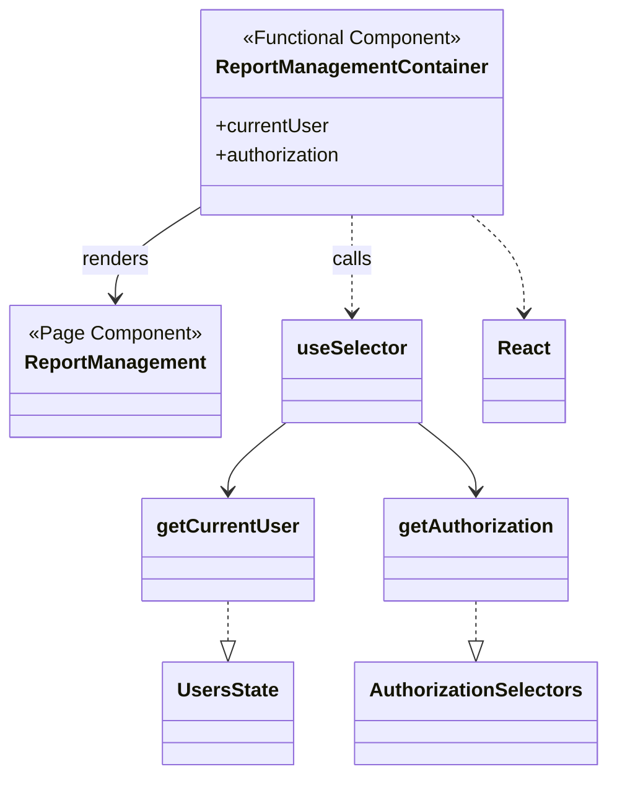

# Diagram: web/portal/src/pages/administration/report-management/ReportManagement.page.container.tsx

> Auto-generated by Obscura crawlers

## Mermaid

### SVG

<svg id="container" width="484.14453125" xmlns="http://www.w3.org/2000/svg" class="classDiagram" height="634" viewBox="0 0 484.14453125 634" role="graphics-document document" aria-roledescription="class"><g><defs><marker id="container_class-aggregationStart" class="marker aggregation class" refX="18" refY="7" markerWidth="190" markerHeight="240" orient="auto"><path d="M 18,7 L9,13 L1,7 L9,1 Z"></path></marker></defs><defs><marker id="container_class-aggregationEnd" class="marker aggregation class" refX="1" refY="7" markerWidth="20" markerHeight="28" orient="auto"><path d="M 18,7 L9,13 L1,7 L9,1 Z"></path></marker></defs><defs><marker id="container_class-extensionStart" class="marker extension class" refX="18" refY="7" markerWidth="190" markerHeight="240" orient="auto"><path d="M 1,7 L18,13 V 1 Z"></path></marker></defs><defs><marker id="container_class-extensionEnd" class="marker extension class" refX="1" refY="7" markerWidth="20" markerHeight="28" orient="auto"><path d="M 1,1 V 13 L18,7 Z"></path></marker></defs><defs><marker id="container_class-compositionStart" class="marker composition class" refX="18" refY="7" markerWidth="190" markerHeight="240" orient="auto"><path d="M 18,7 L9,13 L1,7 L9,1 Z"></path></marker></defs><defs><marker id="container_class-compositionEnd" class="marker composition class" refX="1" refY="7" markerWidth="20" markerHeight="28" orient="auto"><path d="M 18,7 L9,13 L1,7 L9,1 Z"></path></marker></defs><defs><marker id="container_class-dependencyStart" class="marker dependency class" refX="6" refY="7" markerWidth="190" markerHeight="240" orient="auto"><path d="M 5,7 L9,13 L1,7 L9,1 Z"></path></marker></defs><defs><marker id="container_class-dependencyEnd" class="marker dependency class" refX="13" refY="7" markerWidth="20" markerHeight="28" orient="auto"><path d="M 18,7 L9,13 L14,7 L9,1 Z"></path></marker></defs><defs><marker id="container_class-lollipopStart" class="marker lollipop class" refX="13" refY="7" markerWidth="190" markerHeight="240" orient="auto"><circle stroke="black" fill="transparent" cx="7" cy="7" r="6"></circle></marker></defs><defs><marker id="container_class-lollipopEnd" class="marker lollipop class" refX="1" refY="7" markerWidth="190" markerHeight="240" orient="auto"><circle stroke="black" fill="transparent" cx="7" cy="7" r="6"></circle></marker></defs><g class="root"><g class="clusters"></g><g class="edgePaths"><path d="M161.758,168.49L150.148,175.908C138.539,183.327,115.32,198.163,103.711,210.748C92.102,223.333,92.102,233.667,92.102,238.833L92.102,244" id="id_ReportManagementContainer_ReportManagement_1" class="edge-thickness-normal edge-pattern-solid relation" style=";;;" data-edge="true" data-et="edge" data-id="id_ReportManagementContainer_ReportManagement_1" data-points="W3sieCI6MTYxLjc1NzgxMjUsInkiOjE2OC40ODk4OTE5MDUyNzI3fSx7IngiOjkyLjEwMTU2MjUsInkiOjIxM30seyJ4Ijo5Mi4xMDE1NjI1LCJ5IjoyNTB9XQ==" marker-end="url(#container_class-dependencyEnd)"></path><path d="M281.461,176L281.461,182.167C281.461,188.333,281.461,200.667,281.461,214C281.461,227.333,281.461,241.667,281.461,248.833L281.461,256" id="id_ReportManagementContainer_useSelector_2" class="edge-thickness-normal edge-pattern-dashed relation" style=";;;" data-edge="true" data-et="edge" data-id="id_ReportManagementContainer_useSelector_2" data-points="W3sieCI6MjgxLjQ2MDkzNzUsInkiOjE3Nn0seyJ4IjoyODEuNDYwOTM3NSwieSI6MjEzfSx7IngiOjI4MS40NjA5Mzc1LCJ5IjoyNjJ9XQ==" marker-end="url(#container_class-dependencyEnd)"></path><path d="M228.93,346L221.217,352.167C213.504,358.333,198.078,370.667,190.365,380C182.652,389.333,182.652,395.667,182.652,398.833L182.652,402" id="id_useSelector_getCurrentUser_3" class="edge-thickness-normal edge-pattern-solid relation" style=";;;" data-edge="true" data-et="edge" data-id="id_useSelector_getCurrentUser_3" data-points="W3sieCI6MjI4LjkyOTc4NjM5MjQwNTA1LCJ5IjozNDZ9LHsieCI6MTgyLjY1MjM0Mzc1LCJ5IjozODN9LHsieCI6MTgyLjY1MjM0Mzc1LCJ5Ijo0MDh9XQ==" marker-end="url(#container_class-dependencyEnd)"></path><path d="M333.992,346L341.705,352.167C349.418,358.333,364.844,370.667,372.557,380C380.27,389.333,380.27,395.667,380.27,398.833L380.27,402" id="id_useSelector_getAuthorization_4" class="edge-thickness-normal edge-pattern-solid relation" style=";;;" data-edge="true" data-et="edge" data-id="id_useSelector_getAuthorization_4" data-points="W3sieCI6MzMzLjk5MjA4ODYwNzU5NDk1LCJ5IjozNDZ9LHsieCI6MzgwLjI2OTUzMTI1LCJ5IjozODN9LHsieCI6MzgwLjI2OTUzMTI1LCJ5Ijo0MDh9XQ==" marker-end="url(#container_class-dependencyEnd)"></path><path d="M182.652,492L182.652,496.167C182.652,500.333,182.652,508.667,182.652,514.125C182.652,519.583,182.652,522.167,182.652,523.458L182.652,524.75" id="id_getCurrentUser_UsersState_5" class="edge-thickness-normal edge-pattern-dashed relation" style=";;;" data-edge="true" data-et="edge" data-id="id_getCurrentUser_UsersState_5" data-points="W3sieCI6MTgyLjY1MjM0Mzc1LCJ5Ijo0OTJ9LHsieCI6MTgyLjY1MjM0Mzc1LCJ5Ijo1MTd9LHsieCI6MTgyLjY1MjM0Mzc1LCJ5Ijo1NDJ9XQ==" marker-end="url(#container_class-extensionEnd)"></path><path d="M380.27,492L380.27,496.167C380.27,500.333,380.27,508.667,380.27,514.125C380.27,519.583,380.27,522.167,380.27,523.458L380.27,524.75" id="id_getAuthorization_AuthorizationSelectors_6" class="edge-thickness-normal edge-pattern-dashed relation" style=";;;" data-edge="true" data-et="edge" data-id="id_getAuthorization_AuthorizationSelectors_6" data-points="W3sieCI6MzgwLjI2OTUzMTI1LCJ5Ijo0OTJ9LHsieCI6MzgwLjI2OTUzMTI1LCJ5Ijo1MTd9LHsieCI6MzgwLjI2OTUzMTI1LCJ5Ijo1NDJ9XQ==" marker-end="url(#container_class-extensionEnd)"></path><path d="M377.067,176L384.086,182.167C391.105,188.333,405.142,200.667,412.161,214C419.18,227.333,419.18,241.667,419.18,248.833L419.18,256" id="id_ReportManagementContainer_React_7" class="edge-thickness-normal edge-pattern-dashed relation" style=";;;" data-edge="true" data-et="edge" data-id="id_ReportManagementContainer_React_7" data-points="W3sieCI6Mzc3LjA2NzM0MjQ1ODY3NzcsInkiOjE3Nn0seyJ4Ijo0MTkuMTc5Njg3NSwieSI6MjEzfSx7IngiOjQxOS4xNzk2ODc1LCJ5IjoyNjJ9XQ==" marker-end="url(#container_class-dependencyEnd)"></path></g><g class="edgeLabels"><g class="edgeLabel" transform="translate(92.1015625, 213)"><g class="label" data-id="id_ReportManagementContainer_ReportManagement_1" transform="translate(-27.75, -12)"><foreignObject width="55.5" height="24">

renders

</foreignObject></g></g><g class="edgeLabel" transform="translate(281.4609375, 213)"><g class="label" data-id="id_ReportManagementContainer_useSelector_2" transform="translate(-16.4453125, -12)"><foreignObject width="32.890625" height="24">

calls

</foreignObject></g></g><g class="edgeLabel"><g class="label" data-id="id_useSelector_getCurrentUser_3" transform="translate(0, 0)"><foreignObject width="0" height="0">

</foreignObject></g></g><g class="edgeLabel"><g class="label" data-id="id_useSelector_getAuthorization_4" transform="translate(0, 0)"><foreignObject width="0" height="0">

</foreignObject></g></g><g class="edgeLabel"><g class="label" data-id="id_getCurrentUser_UsersState_5" transform="translate(0, 0)"><foreignObject width="0" height="0">

</foreignObject></g></g><g class="edgeLabel"><g class="label" data-id="id_getAuthorization_AuthorizationSelectors_6" transform="translate(0, 0)"><foreignObject width="0" height="0">

</foreignObject></g></g><g class="edgeLabel"><g class="label" data-id="id_ReportManagementContainer_React_7" transform="translate(0, 0)"><foreignObject width="0" height="0">

</foreignObject></g></g></g><g class="nodes"><g class="node default" id="classId-ReportManagementContainer-0" transform="translate(281.4609375, 92)"><g class="basic label-container"><path d="M-119.703125 -84 L119.703125 -84 L119.703125 84 L-119.703125 84" stroke="none" stroke-width="0" fill="#ECECFF" style=""></path><path d="M-119.703125 -84 C-66.46148543729015 -84, -13.219845874580287 -84, 119.703125 -84 M-119.703125 -84 C-56.209194900429715 -84, 7.28473519914057 -84, 119.703125 -84 M119.703125 -84 C119.703125 -20.176655176664653, 119.703125 43.646689646670694, 119.703125 84 M119.703125 -84 C119.703125 -21.383281951601482, 119.703125 41.233436096797035, 119.703125 84 M119.703125 84 C49.80908993690167 84, -20.084945126196658 84, -119.703125 84 M119.703125 84 C70.80831719956086 84, 21.913509399121708 84, -119.703125 84 M-119.703125 84 C-119.703125 43.10852784250631, -119.703125 2.2170556850126246, -119.703125 -84 M-119.703125 84 C-119.703125 32.03940754834922, -119.703125 -19.921184903301565, -119.703125 -84" stroke="#9370DB" stroke-width="1.3" fill="none" stroke-dasharray="0 0" style=""></path></g><g class="annotation-group text" transform="translate(-91.0703125, -60)"><g class="label" style="" transform="translate(0,-12)"><foreignObject width="182.140625" height="24">

«Functional Component»

</foreignObject></g></g><g class="label-group text" transform="translate(-107.703125, -36)"><g class="label" style="font-weight: bolder" transform="translate(0,-12)"><foreignObject width="215.40625" height="24">

ReportManagementContainer

</foreignObject></g></g><g class="members-group text" transform="translate(-107.703125, 12)"><g class="label" style="" transform="translate(0,-12)"><foreignObject width="93.421875" height="24">

+currentUser

</foreignObject></g><g class="label" style="" transform="translate(0,12)"><foreignObject width="105.421875" height="24">

+authorization

</foreignObject></g></g><g class="methods-group text" transform="translate(-107.703125, 84)"></g><g class="divider" style=""><path d="M-119.703125 -12 C-49.8747109845755 -12, 19.953703030849 -12, 119.703125 -12 M-119.703125 -12 C-39.135931841363174 -12, 41.43126131727365 -12, 119.703125 -12" stroke="#9370DB" stroke-width="1.3" fill="none" stroke-dasharray="0 0" style=""></path></g><g class="divider" style=""><path d="M-119.703125 60 C-25.826334198678865 60, 68.05045660264227 60, 119.703125 60 M-119.703125 60 C-27.06792850996881 60, 65.56726798006238 60, 119.703125 60" stroke="#9370DB" stroke-width="1.3" fill="none" stroke-dasharray="0 0" style=""></path></g></g><g class="node default" id="classId-ReportManagement-1" transform="translate(92.1015625, 304)"><g class="basic label-container"><path d="M-84.1015625 -54 L84.1015625 -54 L84.1015625 54 L-84.1015625 54" stroke="none" stroke-width="0" fill="#ECECFF" style=""></path><path d="M-84.1015625 -54 C-19.92821937706904 -54, 44.24512374586192 -54, 84.1015625 -54 M-84.1015625 -54 C-37.55461441858791 -54, 8.99233366282418 -54, 84.1015625 -54 M84.1015625 -54 C84.1015625 -26.355575505775054, 84.1015625 1.2888489884498924, 84.1015625 54 M84.1015625 -54 C84.1015625 -14.183777669627815, 84.1015625 25.63244466074437, 84.1015625 54 M84.1015625 54 C33.653192775098915 54, -16.79517694980217 54, -84.1015625 54 M84.1015625 54 C19.765649482375565 54, -44.57026353524887 54, -84.1015625 54 M-84.1015625 54 C-84.1015625 24.731159443772093, -84.1015625 -4.5376811124558145, -84.1015625 -54 M-84.1015625 54 C-84.1015625 17.040701158475173, -84.1015625 -19.918597683049654, -84.1015625 -54" stroke="#9370DB" stroke-width="1.3" fill="none" stroke-dasharray="0 0" style=""></path></g><g class="annotation-group text" transform="translate(-70.0234375, -30)"><g class="label" style="" transform="translate(0,-12)"><foreignObject width="140.046875" height="24">

«Page Component»

</foreignObject></g></g><g class="label-group text" transform="translate(-72.1015625, -6)"><g class="label" style="font-weight: bolder" transform="translate(0,-12)"><foreignObject width="144.203125" height="24">

ReportManagement

</foreignObject></g></g><g class="members-group text" transform="translate(-72.1015625, 42)"></g><g class="methods-group text" transform="translate(-72.1015625, 72)"></g><g class="divider" style=""><path d="M-84.1015625 18 C-38.16793849763081 18, 7.765685504738386 18, 84.1015625 18 M-84.1015625 18 C-19.98542276932777 18, 44.13071696134446 18, 84.1015625 18" stroke="#9370DB" stroke-width="1.3" fill="none" stroke-dasharray="0 0" style=""></path></g><g class="divider" style=""><path d="M-84.1015625 36 C-30.99334718414581 36, 22.114868131708377 36, 84.1015625 36 M-84.1015625 36 C-34.151315733498635 36, 15.79893103300273 36, 84.1015625 36" stroke="#9370DB" stroke-width="1.3" fill="none" stroke-dasharray="0 0" style=""></path></g></g><g class="node default" id="classId-useSelector-2" transform="translate(281.4609375, 304)"><g class="basic label-container"><path d="M-55.2578125 -42 L55.2578125 -42 L55.2578125 42 L-55.2578125 42" stroke="none" stroke-width="0" fill="#ECECFF" style=""></path><path d="M-55.2578125 -42 C-12.86785562655298 -42, 29.52210124689404 -42, 55.2578125 -42 M-55.2578125 -42 C-24.51453503007666 -42, 6.228742439846677 -42, 55.2578125 -42 M55.2578125 -42 C55.2578125 -16.967016407997637, 55.2578125 8.065967184004727, 55.2578125 42 M55.2578125 -42 C55.2578125 -24.45521047688902, 55.2578125 -6.910420953778043, 55.2578125 42 M55.2578125 42 C24.511765388325063 42, -6.2342817233498735 42, -55.2578125 42 M55.2578125 42 C30.62417223502828 42, 5.9905319700565585 42, -55.2578125 42 M-55.2578125 42 C-55.2578125 9.885882191893437, -55.2578125 -22.228235616213126, -55.2578125 -42 M-55.2578125 42 C-55.2578125 18.89149758803347, -55.2578125 -4.21700482393306, -55.2578125 -42" stroke="#9370DB" stroke-width="1.3" fill="none" stroke-dasharray="0 0" style=""></path></g><g class="annotation-group text" transform="translate(0, -18)"></g><g class="label-group text" transform="translate(-43.2578125, -18)"><g class="label" style="font-weight: bolder" transform="translate(0,-12)"><foreignObject width="86.515625" height="24">

useSelector

</foreignObject></g></g><g class="members-group text" transform="translate(-43.2578125, 30)"></g><g class="methods-group text" transform="translate(-43.2578125, 60)"></g><g class="divider" style=""><path d="M-55.2578125 6 C-15.951667444074644 6, 23.35447761185071 6, 55.2578125 6 M-55.2578125 6 C-28.750528579233148 6, -2.2432446584662955 6, 55.2578125 6" stroke="#9370DB" stroke-width="1.3" fill="none" stroke-dasharray="0 0" style=""></path></g><g class="divider" style=""><path d="M-55.2578125 24 C-26.139084178082346 24, 2.9796441438353085 24, 55.2578125 24 M-55.2578125 24 C-31.185679260809096 24, -7.113546021618191 24, 55.2578125 24" stroke="#9370DB" stroke-width="1.3" fill="none" stroke-dasharray="0 0" style=""></path></g></g><g class="node default" id="classId-getCurrentUser-3" transform="translate(182.65234375, 450)"><g class="basic label-container"><path d="M-67.7421875 -42 L67.7421875 -42 L67.7421875 42 L-67.7421875 42" stroke="none" stroke-width="0" fill="#ECECFF" style=""></path><path d="M-67.7421875 -42 C-37.341445073564216 -42, -6.940702647128425 -42, 67.7421875 -42 M-67.7421875 -42 C-32.78252863757948 -42, 2.1771302248410365 -42, 67.7421875 -42 M67.7421875 -42 C67.7421875 -17.963417575807437, 67.7421875 6.073164848385126, 67.7421875 42 M67.7421875 -42 C67.7421875 -17.095724286712496, 67.7421875 7.808551426575008, 67.7421875 42 M67.7421875 42 C33.327527268019985 42, -1.0871329639600305 42, -67.7421875 42 M67.7421875 42 C23.133486719995588 42, -21.475214060008824 42, -67.7421875 42 M-67.7421875 42 C-67.7421875 18.470056095044654, -67.7421875 -5.059887809910691, -67.7421875 -42 M-67.7421875 42 C-67.7421875 21.827275987677258, -67.7421875 1.654551975354515, -67.7421875 -42" stroke="#9370DB" stroke-width="1.3" fill="none" stroke-dasharray="0 0" style=""></path></g><g class="annotation-group text" transform="translate(0, -18)"></g><g class="label-group text" transform="translate(-55.7421875, -18)"><g class="label" style="font-weight: bolder" transform="translate(0,-12)"><foreignObject width="111.484375" height="24">

getCurrentUser

</foreignObject></g></g><g class="members-group text" transform="translate(-55.7421875, 30)"></g><g class="methods-group text" transform="translate(-55.7421875, 60)"></g><g class="divider" style=""><path d="M-67.7421875 6 C-21.37346518079049 6, 24.99525713841902 6, 67.7421875 6 M-67.7421875 6 C-32.48061787874794 6, 2.780951742504115 6, 67.7421875 6" stroke="#9370DB" stroke-width="1.3" fill="none" stroke-dasharray="0 0" style=""></path></g><g class="divider" style=""><path d="M-67.7421875 24 C-40.04367138637062 24, -12.345155272741238 24, 67.7421875 24 M-67.7421875 24 C-33.04500040465678 24, 1.6521866906864346 24, 67.7421875 24" stroke="#9370DB" stroke-width="1.3" fill="none" stroke-dasharray="0 0" style=""></path></g></g><g class="node default" id="classId-getAuthorization-4" transform="translate(380.26953125, 450)"><g class="basic label-container"><path d="M-73.4453125 -42 L73.4453125 -42 L73.4453125 42 L-73.4453125 42" stroke="none" stroke-width="0" fill="#ECECFF" style=""></path><path d="M-73.4453125 -42 C-28.883039594943668 -42, 15.679233310112664 -42, 73.4453125 -42 M-73.4453125 -42 C-37.006185569099806 -42, -0.5670586381996117 -42, 73.4453125 -42 M73.4453125 -42 C73.4453125 -19.42337953454707, 73.4453125 3.1532409309058593, 73.4453125 42 M73.4453125 -42 C73.4453125 -13.76804968737159, 73.4453125 14.46390062525682, 73.4453125 42 M73.4453125 42 C36.74014943070624 42, 0.03498636141247857 42, -73.4453125 42 M73.4453125 42 C33.62742039120309 42, -6.190471717593823 42, -73.4453125 42 M-73.4453125 42 C-73.4453125 11.240927477931919, -73.4453125 -19.518145044136162, -73.4453125 -42 M-73.4453125 42 C-73.4453125 22.815832362090486, -73.4453125 3.631664724180972, -73.4453125 -42" stroke="#9370DB" stroke-width="1.3" fill="none" stroke-dasharray="0 0" style=""></path></g><g class="annotation-group text" transform="translate(0, -18)"></g><g class="label-group text" transform="translate(-61.4453125, -18)"><g class="label" style="font-weight: bolder" transform="translate(0,-12)"><foreignObject width="122.890625" height="24">

getAuthorization

</foreignObject></g></g><g class="members-group text" transform="translate(-61.4453125, 30)"></g><g class="methods-group text" transform="translate(-61.4453125, 60)"></g><g class="divider" style=""><path d="M-73.4453125 6 C-18.17020737406392 6, 37.10489775187216 6, 73.4453125 6 M-73.4453125 6 C-22.668343557872923 6, 28.108625384254154 6, 73.4453125 6" stroke="#9370DB" stroke-width="1.3" fill="none" stroke-dasharray="0 0" style=""></path></g><g class="divider" style=""><path d="M-73.4453125 24 C-41.802965402007686 24, -10.16061830401538 24, 73.4453125 24 M-73.4453125 24 C-21.127414784851197 24, 31.190482930297605 24, 73.4453125 24" stroke="#9370DB" stroke-width="1.3" fill="none" stroke-dasharray="0 0" style=""></path></g></g><g class="node default" id="classId-UsersState-5" transform="translate(182.65234375, 584)"><g class="basic label-container"><path d="M-51.7421875 -42 L51.7421875 -42 L51.7421875 42 L-51.7421875 42" stroke="none" stroke-width="0" fill="#ECECFF" style=""></path><path d="M-51.7421875 -42 C-17.831502457147344 -42, 16.07918258570531 -42, 51.7421875 -42 M-51.7421875 -42 C-23.014510927623437 -42, 5.713165644753126 -42, 51.7421875 -42 M51.7421875 -42 C51.7421875 -18.344417212249905, 51.7421875 5.3111655755001905, 51.7421875 42 M51.7421875 -42 C51.7421875 -12.273886224007363, 51.7421875 17.452227551985274, 51.7421875 42 M51.7421875 42 C30.19187075272713 42, 8.64155400545426 42, -51.7421875 42 M51.7421875 42 C19.365844788067733 42, -13.010497923864534 42, -51.7421875 42 M-51.7421875 42 C-51.7421875 9.949914433717566, -51.7421875 -22.100171132564867, -51.7421875 -42 M-51.7421875 42 C-51.7421875 20.65162099231526, -51.7421875 -0.6967580153694826, -51.7421875 -42" stroke="#9370DB" stroke-width="1.3" fill="none" stroke-dasharray="0 0" style=""></path></g><g class="annotation-group text" transform="translate(0, -18)"></g><g class="label-group text" transform="translate(-39.7421875, -18)"><g class="label" style="font-weight: bolder" transform="translate(0,-12)"><foreignObject width="79.484375" height="24">

UsersState

</foreignObject></g></g><g class="members-group text" transform="translate(-39.7421875, 30)"></g><g class="methods-group text" transform="translate(-39.7421875, 60)"></g><g class="divider" style=""><path d="M-51.7421875 6 C-11.048454717289928 6, 29.645278065420143 6, 51.7421875 6 M-51.7421875 6 C-16.832558121843007 6, 18.077071256313985 6, 51.7421875 6" stroke="#9370DB" stroke-width="1.3" fill="none" stroke-dasharray="0 0" style=""></path></g><g class="divider" style=""><path d="M-51.7421875 24 C-17.245438793338096 24, 17.25130991332381 24, 51.7421875 24 M-51.7421875 24 C-12.926642857593656 24, 25.88890178481269 24, 51.7421875 24" stroke="#9370DB" stroke-width="1.3" fill="none" stroke-dasharray="0 0" style=""></path></g></g><g class="node default" id="classId-AuthorizationSelectors-6" transform="translate(380.26953125, 584)"><g class="basic label-container"><path d="M-95.875 -42 L95.875 -42 L95.875 42 L-95.875 42" stroke="none" stroke-width="0" fill="#ECECFF" style=""></path><path d="M-95.875 -42 C-39.99784556489615 -42, 15.879308870207694 -42, 95.875 -42 M-95.875 -42 C-48.370827321514525 -42, -0.8666546430290509 -42, 95.875 -42 M95.875 -42 C95.875 -22.162158441976043, 95.875 -2.3243168839520862, 95.875 42 M95.875 -42 C95.875 -11.761729251490102, 95.875 18.476541497019795, 95.875 42 M95.875 42 C37.78394762522171 42, -20.307104749556586 42, -95.875 42 M95.875 42 C33.071880081293266 42, -29.73123983741347 42, -95.875 42 M-95.875 42 C-95.875 13.350399701299292, -95.875 -15.299200597401416, -95.875 -42 M-95.875 42 C-95.875 15.396164051726448, -95.875 -11.207671896547104, -95.875 -42" stroke="#9370DB" stroke-width="1.3" fill="none" stroke-dasharray="0 0" style=""></path></g><g class="annotation-group text" transform="translate(0, -18)"></g><g class="label-group text" transform="translate(-83.875, -18)"><g class="label" style="font-weight: bolder" transform="translate(0,-12)"><foreignObject width="167.75" height="24">

AuthorizationSelectors

</foreignObject></g></g><g class="members-group text" transform="translate(-83.875, 30)"></g><g class="methods-group text" transform="translate(-83.875, 60)"></g><g class="divider" style=""><path d="M-95.875 6 C-53.42823150094681 6, -10.981463001893616 6, 95.875 6 M-95.875 6 C-33.620918468895724 6, 28.633163062208553 6, 95.875 6" stroke="#9370DB" stroke-width="1.3" fill="none" stroke-dasharray="0 0" style=""></path></g><g class="divider" style=""><path d="M-95.875 24 C-53.05654773152966 24, -10.238095463059324 24, 95.875 24 M-95.875 24 C-24.448419160461597 24, 46.978161679076806 24, 95.875 24" stroke="#9370DB" stroke-width="1.3" fill="none" stroke-dasharray="0 0" style=""></path></g></g><g class="node default" id="classId-React-7" transform="translate(419.1796875, 304)"><g class="basic label-container"><path d="M-32.4609375 -42 L32.4609375 -42 L32.4609375 42 L-32.4609375 42" stroke="none" stroke-width="0" fill="#ECECFF" style=""></path><path d="M-32.4609375 -42 C-6.700928013754893 -42, 19.059081472490213 -42, 32.4609375 -42 M-32.4609375 -42 C-11.552848220753592 -42, 9.355241058492815 -42, 32.4609375 -42 M32.4609375 -42 C32.4609375 -20.605746705729565, 32.4609375 0.7885065885408693, 32.4609375 42 M32.4609375 -42 C32.4609375 -21.540663932609817, 32.4609375 -1.0813278652196345, 32.4609375 42 M32.4609375 42 C6.675377073106233 42, -19.110183353787534 42, -32.4609375 42 M32.4609375 42 C15.787159000747675 42, -0.8866194985046505 42, -32.4609375 42 M-32.4609375 42 C-32.4609375 11.506358680200314, -32.4609375 -18.98728263959937, -32.4609375 -42 M-32.4609375 42 C-32.4609375 17.620562219239297, -32.4609375 -6.758875561521407, -32.4609375 -42" stroke="#9370DB" stroke-width="1.3" fill="none" stroke-dasharray="0 0" style=""></path></g><g class="annotation-group text" transform="translate(0, -18)"></g><g class="label-group text" transform="translate(-20.4609375, -18)"><g class="label" style="font-weight: bolder" transform="translate(0,-12)"><foreignObject width="40.921875" height="24">

React

</foreignObject></g></g><g class="members-group text" transform="translate(-20.4609375, 30)"></g><g class="methods-group text" transform="translate(-20.4609375, 60)"></g><g class="divider" style=""><path d="M-32.4609375 6 C-15.593463038841538 6, 1.2740114223169243 6, 32.4609375 6 M-32.4609375 6 C-14.609844159986316 6, 3.241249180027367 6, 32.4609375 6" stroke="#9370DB" stroke-width="1.3" fill="none" stroke-dasharray="0 0" style=""></path></g><g class="divider" style=""><path d="M-32.4609375 24 C-10.054517317029216 24, 12.351902865941568 24, 32.4609375 24 M-32.4609375 24 C-9.374036216920949 24, 13.712865066158102 24, 32.4609375 24" stroke="#9370DB" stroke-width="1.3" fill="none" stroke-dasharray="0 0" style=""></path></g></g></g></g></g></svg>
