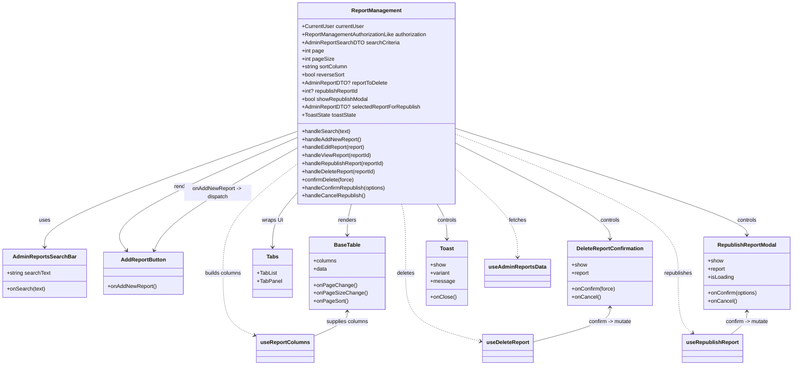

# Diagram: web/portal/src/pages/administration/report-management/ReportManagement.page.tsx


> Auto-generated by Obscura crawlers

## Diagram 1



### SVG

<svg id="container" width="2324.642578125" xmlns="http://www.w3.org/2000/svg" class="classDiagram" height="1088" viewBox="0 0 2324.642578125 1088" role="graphics-document document" aria-roledescription="class"><style>#container{font-family:"trebuchet ms",verdana,arial,sans-serif;font-size:16px;fill:#333;}@keyframes edge-animation-frame{from{stroke-dashoffset:0;}}@keyframes dash{to{stroke-dashoffset:0;}}#container .edge-animation-slow{stroke-dasharray:9,5!important;stroke-dashoffset:900;animation:dash 50s linear infinite;stroke-linecap:round;}#container .edge-animation-fast{stroke-dasharray:9,5!important;stroke-dashoffset:900;animation:dash 20s linear infinite;stroke-linecap:round;}#container .error-icon{fill:#552222;}#container .error-text{fill:#552222;stroke:#552222;}#container .edge-thickness-normal{stroke-width:1px;}#container .edge-thickness-thick{stroke-width:3.5px;}#container .edge-pattern-solid{stroke-dasharray:0;}#container .edge-thickness-invisible{stroke-width:0;fill:none;}#container .edge-pattern-dashed{stroke-dasharray:3;}#container .edge-pattern-dotted{stroke-dasharray:2;}#container .marker{fill:#333333;stroke:#333333;}#container .marker.cross{stroke:#333333;}#container svg{font-family:"trebuchet ms",verdana,arial,sans-serif;font-size:16px;}#container p{margin:0;}#container g.classGroup text{fill:#9370DB;stroke:none;font-family:"trebuchet ms",verdana,arial,sans-serif;font-size:10px;}#container g.classGroup text .title{font-weight:bolder;}#container .nodeLabel,#container .edgeLabel{color:#131300;}#container .edgeLabel .label rect{fill:#ECECFF;}#container .label text{fill:#131300;}#container .labelBkg{background:#ECECFF;}#container .edgeLabel .label span{background:#ECECFF;}#container .classTitle{font-weight:bolder;}#container .node rect,#container .node circle,#container .node ellipse,#container .node polygon,#container .node path{fill:#ECECFF;stroke:#9370DB;stroke-width:1px;}#container .divider{stroke:#9370DB;stroke-width:1;}#container g.clickable{cursor:pointer;}#container g.classGroup rect{fill:#ECECFF;stroke:#9370DB;}#container g.classGroup line{stroke:#9370DB;stroke-width:1;}#container .classLabel .box{stroke:none;stroke-width:0;fill:#ECECFF;opacity:0.5;}#container .classLabel .label{fill:#9370DB;font-size:10px;}#container .relation{stroke:#333333;stroke-width:1;fill:none;}#container .dashed-line{stroke-dasharray:3;}#container .dotted-line{stroke-dasharray:1 2;}#container #compositionStart,#container .composition{fill:#333333!important;stroke:#333333!important;stroke-width:1;}#container #compositionEnd,#container .composition{fill:#333333!important;stroke:#333333!important;stroke-width:1;}#container #dependencyStart,#container .dependency{fill:#333333!important;stroke:#333333!important;stroke-width:1;}#container #dependencyStart,#container .dependency{fill:#333333!important;stroke:#333333!important;stroke-width:1;}#container #extensionStart,#container .extension{fill:transparent!important;stroke:#333333!important;stroke-width:1;}#container #extensionEnd,#container .extension{fill:transparent!important;stroke:#333333!important;stroke-width:1;}#container #aggregationStart,#container .aggregation{fill:transparent!important;stroke:#333333!important;stroke-width:1;}#container #aggregationEnd,#container .aggregation{fill:transparent!important;stroke:#333333!important;stroke-width:1;}#container #lollipopStart,#container .lollipop{fill:#ECECFF!important;stroke:#333333!important;stroke-width:1;}#container #lollipopEnd,#container .lollipop{fill:#ECECFF!important;stroke:#333333!important;stroke-width:1;}#container .edgeTerminals{font-size:11px;line-height:initial;}#container .classTitleText{text-anchor:middle;font-size:18px;fill:#333;}#container .label-icon{display:inline-block;height:1em;overflow:visible;vertical-align:-0.125em;}#container .node .label-icon path{fill:currentColor;stroke:revert;stroke-width:revert;}#container :root{--mermaid-font-family:"trebuchet ms",verdana,arial,sans-serif;}</style><g><defs><marker id="container_class-aggregationStart" class="marker aggregation class" refX="18" refY="7" markerWidth="190" markerHeight="240" orient="auto"><path d="M 18,7 L9,13 L1,7 L9,1 Z"></path></marker></defs><defs><marker id="container_class-aggregationEnd" class="marker aggregation class" refX="1" refY="7" markerWidth="20" markerHeight="28" orient="auto"><path d="M 18,7 L9,13 L1,7 L9,1 Z"></path></marker></defs><defs><marker id="container_class-extensionStart" class="marker extension class" refX="18" refY="7" markerWidth="190" markerHeight="240" orient="auto"><path d="M 1,7 L18,13 V 1 Z"></path></marker></defs><defs><marker id="container_class-extensionEnd" class="marker extension class" refX="1" refY="7" markerWidth="20" markerHeight="28" orient="auto"><path d="M 1,1 V 13 L18,7 Z"></path></marker></defs><defs><marker id="container_class-compositionStart" class="marker composition class" refX="18" refY="7" markerWidth="190" markerHeight="240" orient="auto"><path d="M 18,7 L9,13 L1,7 L9,1 Z"></path></marker></defs><defs><marker id="container_class-compositionEnd" class="marker composition class" refX="1" refY="7" markerWidth="20" markerHeight="28" orient="auto"><path d="M 18,7 L9,13 L1,7 L9,1 Z"></path></marker></defs><defs><marker id="container_class-dependencyStart" class="marker dependency class" refX="6" refY="7" markerWidth="190" markerHeight="240" orient="auto"><path d="M 5,7 L9,13 L1,7 L9,1 Z"></path></marker></defs><defs><marker id="container_class-dependencyEnd" class="marker dependency class" refX="13" refY="7" markerWidth="20" markerHeight="28" orient="auto"><path d="M 18,7 L9,13 L14,7 L9,1 Z"></path></marker></defs><defs><marker id="container_class-lollipopStart" class="marker lollipop class" refX="13" refY="7" markerWidth="190" markerHeight="240" orient="auto"><circle stroke="black" fill="transparent" cx="7" cy="7" r="6"></circle></marker></defs><defs><marker id="container_class-lollipopEnd" class="marker lollipop class" refX="1" refY="7" markerWidth="190" markerHeight="240" orient="auto"><circle stroke="black" fill="transparent" cx="7" cy="7" r="6"></circle></marker></defs><g class="root"><g class="clusters"></g><g class="edgePaths"><path d="M863.705,393.453L741.426,437.377C619.147,481.302,374.589,569.151,252.31,626.242C130.031,683.333,130.031,709.667,130.031,722.833L130.031,736" id="id_ReportManagement_AdminReportsSearchBar_1" class="edge-thickness-normal edge-pattern-solid relation" style=";;;" data-edge="true" data-et="edge" data-id="id_ReportManagement_AdminReportsSearchBar_1" data-points="W3sieCI6ODYzLjcwNTA3ODEyNSwieSI6MzkzLjQ1MjY5MjY5MTk2ODI1fSx7IngiOjEzMC4wMzEyNSwieSI6NjU3fSx7IngiOjEzMC4wMzEyNSwieSI6NzQyfV0=" marker-end="url(#container_class-dependencyEnd)"></path><path d="M863.705,412.428L770.849,453.19C677.993,493.952,492.281,575.476,410.048,631.091C327.816,686.707,349.064,716.413,359.688,731.267L370.312,746.12" id="id_ReportManagement_AddReportButton_2" class="edge-thickness-normal edge-pattern-solid relation" style=";;;" data-edge="true" data-et="edge" data-id="id_ReportManagement_AddReportButton_2" data-points="W3sieCI6ODYzLjcwNTA3ODEyNSwieSI6NDEyLjQyNzY5NDc0MTcwMzc2fSx7IngiOjMwNi41NjgzNTkzNzUsInkiOjY1N30seyJ4IjozNzMuODAyMjYxNjQ0MTA4MywieSI6NzUxfV0=" marker-end="url(#container_class-dependencyEnd)"></path><path d="M1029.08,608L1027.106,616.167C1025.132,624.333,1021.184,640.667,1019.21,656C1017.236,671.333,1017.236,685.667,1017.236,692.833L1017.236,700" id="id_ReportManagement_BaseTable_3" class="edge-thickness-normal edge-pattern-solid relation" style=";;;" data-edge="true" data-et="edge" data-id="id_ReportManagement_BaseTable_3" data-points="W3sieCI6MTAyOS4wNzk5MzI2MTk5ODU2LCJ5Ijo2MDh9LHsieCI6MTAxNy4yMzYzMjgxMjUsInkiOjY1N30seyJ4IjoxMDE3LjIzNjMyODEyNSwieSI6NzA2fV0=" marker-end="url(#container_class-dependencyEnd)"></path><path d="M863.705,586.365L853.645,598.138C843.584,609.91,823.463,633.455,813.402,658.394C803.342,683.333,803.342,709.667,803.342,722.833L803.342,736" id="id_ReportManagement_Tabs_4" class="edge-thickness-normal edge-pattern-solid relation" style=";;;" data-edge="true" data-et="edge" data-id="id_ReportManagement_Tabs_4" data-points="W3sieCI6ODYzLjcwNTA3ODEyNSwieSI6NTg2LjM2NTM0NzMzODY0MjF9LHsieCI6ODAzLjM0MTc5Njg3NSwieSI6NjU3fSx7IngiOjgwMy4zNDE3OTY4NzUsInkiOjc0Mn1d" marker-end="url(#container_class-dependencyEnd)"></path><path d="M1339.479,430.398L1412.881,468.165C1486.283,505.932,1633.088,581.466,1706.49,628.4C1779.893,675.333,1779.893,693.667,1779.893,702.833L1779.893,712" id="id_ReportManagement_DeleteReportConfirmation_5" class="edge-thickness-normal edge-pattern-solid relation" style=";;;" data-edge="true" data-et="edge" data-id="id_ReportManagement_DeleteReportConfirmation_5" data-points="W3sieCI6MTMzOS40Nzg1MTU2MjUsInkiOjQzMC4zOTc3MTM3MjYyODA2NH0seyJ4IjoxNzc5Ljg5MjU3ODEyNSwieSI6NjU3fSx7IngiOjE3NzkuODkyNTc4MTI1LCJ5Ijo3MTh9XQ==" marker-end="url(#container_class-dependencyEnd)"></path><path d="M1339.479,384.4L1480.943,429.834C1622.408,475.267,1905.338,566.133,2046.803,618.733C2188.268,671.333,2188.268,685.667,2188.268,692.833L2188.268,700" id="id_ReportManagement_RepublishReportModal_6" class="edge-thickness-normal edge-pattern-solid relation" style=";;;" data-edge="true" data-et="edge" data-id="id_ReportManagement_RepublishReportModal_6" data-points="W3sieCI6MTMzOS40Nzg1MTU2MjUsInkiOjM4NC40MDA0MDA0NDcxNzh9LHsieCI6MjE4OC4yNjc1NzgxMjUsInkiOjY1N30seyJ4IjoyMTg4LjI2NzU3ODEyNSwieSI6NzA2fV0=" marker-end="url(#container_class-dependencyEnd)"></path><path d="M1278.599,608L1283.417,616.167C1288.236,624.333,1297.873,640.667,1302.691,658C1307.51,675.333,1307.51,693.667,1307.51,702.833L1307.51,712" id="id_ReportManagement_Toast_7" class="edge-thickness-normal edge-pattern-solid relation" style=";;;" data-edge="true" data-et="edge" data-id="id_ReportManagement_Toast_7" data-points="W3sieCI6MTI3OC41OTg2NDY4MDMzNjY4LCJ5Ijo2MDh9LHsieCI6MTMwNy41MDk3NjU2MjUsInkiOjY1N30seyJ4IjoxMzA3LjUwOTc2NTYyNSwieSI6NzE4fV0=" marker-end="url(#container_class-dependencyEnd)"></path><path d="M1339.479,510.72L1368.088,535.1C1396.697,559.48,1453.916,608.24,1482.525,650.787C1511.135,693.333,1511.135,729.667,1511.135,747.833L1511.135,766" id="id_ReportManagement_useAdminReportsData_8" class="edge-thickness-normal edge-pattern-dashed relation" style=";;;" data-edge="true" data-et="edge" data-id="id_ReportManagement_useAdminReportsData_8" data-points="W3sieCI6MTMzOS40Nzg1MTU2MjUsInkiOjUxMC43MTk3OTA1NDM5NTYyfSx7IngiOjE1MTEuMTM0NzY1NjI1LCJ5Ijo2NTd9LHsieCI6MTUxMS4xMzQ3NjU2MjUsInkiOjc3Mn1d" marker-end="url(#container_class-dependencyEnd)"></path><path d="M1174.104,608L1176.078,616.167C1178.052,624.333,1181.999,640.667,1183.973,675C1185.947,709.333,1185.947,761.667,1185.947,812C1185.947,862.333,1185.947,910.667,1222.215,944.481C1258.482,978.296,1331.017,997.591,1367.284,1007.239L1403.551,1016.887" id="id_ReportManagement_useDeleteReport_9" class="edge-thickness-normal edge-pattern-dashed relation" style=";;;" data-edge="true" data-et="edge" data-id="id_ReportManagement_useDeleteReport_9" data-points="W3sieCI6MTE3NC4xMDM2NjExMzAwMTQ0LCJ5Ijo2MDh9LHsieCI6MTE4NS45NDcyNjU2MjUsInkiOjY1N30seyJ4IjoxMTg1Ljk0NzI2NTYyNSwieSI6ODE0fSx7IngiOjExODUuOTQ3MjY1NjI1LCJ5Ijo5NTl9LHsieCI6MTQwOS4zNDk2MDkzNzUsInkiOjEwMTguNDI4OTkwNDYzNjYzMn1d" marker-end="url(#container_class-dependencyEnd)"></path><path d="M1339.479,402.257L1446.632,444.714C1553.786,487.171,1768.093,572.086,1875.247,640.71C1982.4,709.333,1982.4,761.667,1982.4,812C1982.4,862.333,1982.4,910.667,1989.642,940.391C1996.884,970.116,2011.367,981.231,2018.608,986.789L2025.85,992.347" id="id_ReportManagement_useRepublishReport_10" class="edge-thickness-normal edge-pattern-dashed relation" style=";;;" data-edge="true" data-et="edge" data-id="id_ReportManagement_useRepublishReport_10" data-points="W3sieCI6MTMzOS40Nzg1MTU2MjUsInkiOjQwMi4yNTcxMDEyOTYzMDUzNH0seyJ4IjoxOTgyLjQwMDM5MDYyNSwieSI6NjU3fSx7IngiOjE5ODIuNDAwMzkwNjI1LCJ5Ijo4MTR9LHsieCI6MTk4Mi40MDAzOTA2MjUsInkiOjk1OX0seyJ4IjoyMDMwLjYwOTc5NTI5MjcyMTYsInkiOjk5Nn1d" marker-end="url(#container_class-dependencyEnd)"></path><path d="M863.705,494.425L829.13,521.521C794.554,548.617,725.403,602.808,690.827,656.071C656.252,709.333,656.252,761.667,656.252,812C656.252,862.333,656.252,910.667,671.894,941.68C687.537,972.693,718.822,986.386,734.464,993.233L750.107,1000.08" id="id_ReportManagement_useReportColumns_11" class="edge-thickness-normal edge-pattern-dashed relation" style=";;;" data-edge="true" data-et="edge" data-id="id_ReportManagement_useReportColumns_11" data-points="W3sieCI6ODYzLjcwNTA3ODEyNSwieSI6NDk0LjQyNDk2NTEzMzcxOTg3fSx7IngiOjY1Ni4yNTE5NTMxMjUsInkiOjY1N30seyJ4Ijo2NTYuMjUxOTUzMTI1LCJ5Ijo4MTR9LHsieCI6NjU2LjI1MTk1MzEyNSwieSI6OTU5fSx7IngiOjc1NS42MDM1MTU2MjUsInkiOjEwMDIuNDg1MzkxNTA3NTk2NH1d" marker-end="url(#container_class-dependencyEnd)"></path><path d="M1017.236,928L1017.236,933.167C1017.236,938.333,1017.236,948.667,1000.678,961.081C984.119,973.495,951.002,987.99,934.443,995.238L917.885,1002.485" id="id_BaseTable_useReportColumns_12" class="edge-thickness-normal edge-pattern-solid relation" style=";;;" data-edge="true" data-et="edge" data-id="id_BaseTable_useReportColumns_12" data-points="W3sieCI6MTAxNy4yMzYzMjgxMjUsInkiOjkyMn0seyJ4IjoxMDE3LjIzNjMyODEyNSwieSI6OTU5fSx7IngiOjkxNy44ODQ3NjU2MjUsInkiOjEwMDIuNDg1MzkxNTA3NTk2NH1d" marker-start="url(#container_class-dependencyStart)"></path><path d="M451.062,745.571L458.008,730.809C464.954,716.047,478.846,686.524,547.62,636.322C616.394,586.12,740.049,515.239,801.877,479.799L863.705,444.359" id="id_AddReportButton_ReportManagement_13" class="edge-thickness-normal edge-pattern-solid relation" style=";;;" data-edge="true" data-et="edge" data-id="id_AddReportButton_ReportManagement_13" data-points="W3sieCI6NDQ4LjUwNzM4OTUzMDI1NDgsInkiOjc1MX0seyJ4Ijo0OTIuNzM4MjgxMjUsInkiOjY1N30seyJ4Ijo4NjMuNzA1MDc4MTI1LCJ5Ijo0NDQuMzU4Njg1MTU2ODQ5fV0=" marker-start="url(#container_class-dependencyStart)"></path><path d="M1779.893,916L1779.893,923.167C1779.893,930.333,1779.893,944.667,1742.659,961.738C1705.425,978.81,1630.958,998.619,1593.724,1008.524L1556.49,1018.429" id="id_DeleteReportConfirmation_useDeleteReport_14" class="edge-thickness-normal edge-pattern-solid relation" style=";;;" data-edge="true" data-et="edge" data-id="id_DeleteReportConfirmation_useDeleteReport_14" data-points="W3sieCI6MTc3OS44OTI1NzgxMjUsInkiOjkxMH0seyJ4IjoxNzc5Ljg5MjU3ODEyNSwieSI6OTU5fSx7IngiOjE1NTYuNDkwMjM0Mzc1LCJ5IjoxMDE4LjQyODk5MDQ2MzY2MzJ9XQ==" marker-start="url(#container_class-dependencyStart)"></path><path d="M2188.268,928L2188.268,933.167C2188.268,938.333,2188.268,948.667,2180.233,960C2172.198,971.333,2156.128,983.667,2148.093,989.833L2140.058,996" id="id_RepublishReportModal_useRepublishReport_15" class="edge-thickness-normal edge-pattern-solid relation" style=";;;" data-edge="true" data-et="edge" data-id="id_RepublishReportModal_useRepublishReport_15" data-points="W3sieCI6MjE4OC4yNjc1NzgxMjUsInkiOjkyMn0seyJ4IjoyMTg4LjI2NzU3ODEyNSwieSI6OTU5fSx7IngiOjIxNDAuMDU4MTczNDU3Mjc4NCwieSI6OTk2fV0=" marker-start="url(#container_class-dependencyStart)"></path></g><g class="edgeLabels"><g class="edgeLabel" transform="translate(130.03125, 657)"><g class="label" data-id="id_ReportManagement_AdminReportsSearchBar_1" transform="translate(-16.4921875, -12)"><foreignObject width="32.984375" height="24"><div xmlns="http://www.w3.org/1999/xhtml" class="labelBkg" style="display: table-cell; white-space: nowrap; line-height: 1.5; max-width: 200px; text-align: center;"><span class="edgeLabel"><p>uses</p></span></div></foreignObject></g></g><g class="edgeLabel" transform="translate(532.22543, 557.94088)"><g class="label" data-id="id_ReportManagement_AddReportButton_2" transform="translate(-27.75, -12)"><foreignObject width="55.5" height="24"><div xmlns="http://www.w3.org/1999/xhtml" class="labelBkg" style="display: table-cell; white-space: nowrap; line-height: 1.5; max-width: 200px; text-align: center;"><span class="edgeLabel"><p>renders</p></span></div></foreignObject></g></g><g class="edgeLabel" transform="translate(1017.236328125, 657)"><g class="label" data-id="id_ReportManagement_BaseTable_3" transform="translate(-27.75, -12)"><foreignObject width="55.5" height="24"><div xmlns="http://www.w3.org/1999/xhtml" class="labelBkg" style="display: table-cell; white-space: nowrap; line-height: 1.5; max-width: 200px; text-align: center;"><span class="edgeLabel"><p>renders</p></span></div></foreignObject></g></g><g class="edgeLabel" transform="translate(803.341796875, 657)"><g class="label" data-id="id_ReportManagement_Tabs_4" transform="translate(-31.1640625, -12)"><foreignObject width="62.328125" height="24"><div xmlns="http://www.w3.org/1999/xhtml" class="labelBkg" style="display: table-cell; white-space: nowrap; line-height: 1.5; max-width: 200px; text-align: center;"><span class="edgeLabel"><p>wraps UI</p></span></div></foreignObject></g></g><g class="edgeLabel" transform="translate(1779.892578125, 657)"><g class="label" data-id="id_ReportManagement_DeleteReportConfirmation_5" transform="translate(-29.515625, -12)"><foreignObject width="59.03125" height="24"><div xmlns="http://www.w3.org/1999/xhtml" class="labelBkg" style="display: table-cell; white-space: nowrap; line-height: 1.5; max-width: 200px; text-align: center;"><span class="edgeLabel"><p>controls</p></span></div></foreignObject></g></g><g class="edgeLabel" transform="translate(2188.267578125, 657)"><g class="label" data-id="id_ReportManagement_RepublishReportModal_6" transform="translate(-29.515625, -12)"><foreignObject width="59.03125" height="24"><div xmlns="http://www.w3.org/1999/xhtml" class="labelBkg" style="display: table-cell; white-space: nowrap; line-height: 1.5; max-width: 200px; text-align: center;"><span class="edgeLabel"><p>controls</p></span></div></foreignObject></g></g><g class="edgeLabel" transform="translate(1307.509765625, 657)"><g class="label" data-id="id_ReportManagement_Toast_7" transform="translate(-29.515625, -12)"><foreignObject width="59.03125" height="24"><div xmlns="http://www.w3.org/1999/xhtml" class="labelBkg" style="display: table-cell; white-space: nowrap; line-height: 1.5; max-width: 200px; text-align: center;"><span class="edgeLabel"><p>controls</p></span></div></foreignObject></g></g><g class="edgeLabel" transform="translate(1511.134765625, 657)"><g class="label" data-id="id_ReportManagement_useAdminReportsData_8" transform="translate(-26.34375, -12)"><foreignObject width="52.6875" height="24"><div xmlns="http://www.w3.org/1999/xhtml" class="labelBkg" style="display: table-cell; white-space: nowrap; line-height: 1.5; max-width: 200px; text-align: center;"><span class="edgeLabel"><p>fetches</p></span></div></foreignObject></g></g><g class="edgeLabel" transform="translate(1185.947265625, 814)"><g class="label" data-id="id_ReportManagement_useDeleteReport_9" transform="translate(-26.6796875, -12)"><foreignObject width="53.359375" height="24"><div xmlns="http://www.w3.org/1999/xhtml" class="labelBkg" style="display: table-cell; white-space: nowrap; line-height: 1.5; max-width: 200px; text-align: center;"><span class="edgeLabel"><p>deletes</p></span></div></foreignObject></g></g><g class="edgeLabel" transform="translate(1982.400390625, 814)"><g class="label" data-id="id_ReportManagement_useRepublishReport_10" transform="translate(-42.4921875, -12)"><foreignObject width="84.984375" height="24"><div xmlns="http://www.w3.org/1999/xhtml" class="labelBkg" style="display: table-cell; white-space: nowrap; line-height: 1.5; max-width: 200px; text-align: center;"><span class="edgeLabel"><p>republishes</p></span></div></foreignObject></g></g><g class="edgeLabel" transform="translate(656.251953125, 814)"><g class="label" data-id="id_ReportManagement_useReportColumns_11" transform="translate(-55.2265625, -12)"><foreignObject width="110.453125" height="24"><div xmlns="http://www.w3.org/1999/xhtml" class="labelBkg" style="display: table-cell; white-space: nowrap; line-height: 1.5; max-width: 200px; text-align: center;"><span class="edgeLabel"><p>builds columns</p></span></div></foreignObject></g></g><g class="edgeLabel" transform="translate(1017.236328125, 959)"><g class="label" data-id="id_BaseTable_useReportColumns_12" transform="translate(-63.328125, -12)"><foreignObject width="126.65625" height="24"><div xmlns="http://www.w3.org/1999/xhtml" class="labelBkg" style="display: table-cell; white-space: nowrap; line-height: 1.5; max-width: 200px; text-align: center;"><span class="edgeLabel"><p>supplies columns</p></span></div></foreignObject></g></g><g class="edgeLabel" transform="translate(633.15697, 576.51082)"><g class="label" data-id="id_AddReportButton_ReportManagement_13" transform="translate(-100, -24)"><foreignObject width="200" height="48"><div xmlns="http://www.w3.org/1999/xhtml" class="labelBkg" style="display: table; white-space: break-spaces; line-height: 1.5; max-width: 200px; text-align: center; width: 200px;"><span class="edgeLabel"><p>onAddNewReport -&gt; dispatch</p></span></div></foreignObject></g></g><g class="edgeLabel" transform="translate(1779.892578125, 959)"><g class="label" data-id="id_DeleteReportConfirmation_useDeleteReport_14" transform="translate(-64.859375, -12)"><foreignObject width="129.71875" height="24"><div xmlns="http://www.w3.org/1999/xhtml" class="labelBkg" style="display: table-cell; white-space: nowrap; line-height: 1.5; max-width: 200px; text-align: center;"><span class="edgeLabel"><p>confirm -&gt; mutate</p></span></div></foreignObject></g></g><g class="edgeLabel" transform="translate(2188.267578125, 959)"><g class="label" data-id="id_RepublishReportModal_useRepublishReport_15" transform="translate(-64.859375, -12)"><foreignObject width="129.71875" height="24"><div xmlns="http://www.w3.org/1999/xhtml" class="labelBkg" style="display: table-cell; white-space: nowrap; line-height: 1.5; max-width: 200px; text-align: center;"><span class="edgeLabel"><p>confirm -&gt; mutate</p></span></div></foreignObject></g></g></g><g class="nodes"><g class="node default" id="classId-ReportManagement-0" transform="translate(1101.591796875, 308)"><g class="basic label-container"><path d="M-237.88671875 -300 L237.88671875 -300 L237.88671875 300 L-237.88671875 300" stroke="none" stroke-width="0" fill="#ECECFF" style=""></path><path d="M-237.88671875 -300 C-118.18360487470625 -300, 1.5195090005875045 -300, 237.88671875 -300 M-237.88671875 -300 C-82.1861907708344 -300, 73.5143372083312 -300, 237.88671875 -300 M237.88671875 -300 C237.88671875 -175.6124274481391, 237.88671875 -51.224854896278174, 237.88671875 300 M237.88671875 -300 C237.88671875 -135.45675491189388, 237.88671875 29.086490176212237, 237.88671875 300 M237.88671875 300 C71.00714174900475 300, -95.87243525199051 300, -237.88671875 300 M237.88671875 300 C136.62370791599895 300, 35.3606970819979 300, -237.88671875 300 M-237.88671875 300 C-237.88671875 84.98296808975641, -237.88671875 -130.03406382048718, -237.88671875 -300 M-237.88671875 300 C-237.88671875 123.32178131168124, -237.88671875 -53.35643737663753, -237.88671875 -300" stroke="#9370DB" stroke-width="1.3" fill="none" stroke-dasharray="0 0" style=""></path></g><g class="annotation-group text" transform="translate(0, -276)"></g><g class="label-group text" transform="translate(-72.1015625, -276)"><g class="label" style="font-weight: bolder" transform="translate(0,-12)"><foreignObject width="144.203125" height="24"><div xmlns="http://www.w3.org/1999/xhtml" style="display: table-cell; white-space: nowrap; line-height: 1.5; max-width: 193px; text-align: center;"><span class="nodeLabel markdown-node-label" style=""><p>ReportManagement</p></span></div></foreignObject></g></g><g class="members-group text" transform="translate(-225.88671875, -228)"><g class="label" style="" transform="translate(0,-12)"><foreignObject width="184.28125" height="24"><div xmlns="http://www.w3.org/1999/xhtml" style="display: table-cell; white-space: nowrap; line-height: 1.5; max-width: 242px; text-align: center;"><span class="nodeLabel markdown-node-label" style=""><p>+CurrentUser currentUser</p></span></div></foreignObject></g><g class="label" style="" transform="translate(0,12)"><foreignObject width="379.671875" height="24"><div xmlns="http://www.w3.org/1999/xhtml" style="display: table-cell; white-space: nowrap; line-height: 1.5; max-width: 437px; text-align: center;"><span class="nodeLabel markdown-node-label" style=""><p>+ReportManagementAuthorizationLike authorization</p></span></div></foreignObject></g><g class="label" style="" transform="translate(0,36)"><foreignObject width="285.109375" height="24"><div xmlns="http://www.w3.org/1999/xhtml" style="display: table-cell; white-space: nowrap; line-height: 1.5; max-width: 342px; text-align: center;"><span class="nodeLabel markdown-node-label" style=""><p>+AdminReportSearchDTO searchCriteria</p></span></div></foreignObject></g><g class="label" style="" transform="translate(0,60)"><foreignObject width="66.5625" height="24"><div xmlns="http://www.w3.org/1999/xhtml" style="display: table-cell; white-space: nowrap; line-height: 1.5; max-width: 124px; text-align: center;"><span class="nodeLabel markdown-node-label" style=""><p>+int page</p></span></div></foreignObject></g><g class="label" style="" transform="translate(0,84)"><foreignObject width="95.40625" height="24"><div xmlns="http://www.w3.org/1999/xhtml" style="display: table-cell; white-space: nowrap; line-height: 1.5; max-width: 153px; text-align: center;"><span class="nodeLabel markdown-node-label" style=""><p>+int pageSize</p></span></div></foreignObject></g><g class="label" style="" transform="translate(0,108)"><foreignObject width="137.703125" height="24"><div xmlns="http://www.w3.org/1999/xhtml" style="display: table-cell; white-space: nowrap; line-height: 1.5; max-width: 195px; text-align: center;"><span class="nodeLabel markdown-node-label" style=""><p>+string sortColumn</p></span></div></foreignObject></g><g class="label" style="" transform="translate(0,132)"><foreignObject width="128.140625" height="24"><div xmlns="http://www.w3.org/1999/xhtml" style="display: table-cell; white-space: nowrap; line-height: 1.5; max-width: 186px; text-align: center;"><span class="nodeLabel markdown-node-label" style=""><p>+bool reverseSort</p></span></div></foreignObject></g><g class="label" style="" transform="translate(0,156)"><foreignObject width="251.484375" height="24"><div xmlns="http://www.w3.org/1999/xhtml" style="display: table-cell; white-space: nowrap; line-height: 1.5; max-width: 309px; text-align: center;"><span class="nodeLabel markdown-node-label" style=""><p>+AdminReportDTO? reportToDelete</p></span></div></foreignObject></g><g class="label" style="" transform="translate(0,180)"><foreignObject width="170.796875" height="24"><div xmlns="http://www.w3.org/1999/xhtml" style="display: table-cell; white-space: nowrap; line-height: 1.5; max-width: 228px; text-align: center;"><span class="nodeLabel markdown-node-label" style=""><p>+int? republishReportId</p></span></div></foreignObject></g><g class="label" style="" transform="translate(0,204)"><foreignObject width="199.890625" height="24"><div xmlns="http://www.w3.org/1999/xhtml" style="display: table-cell; white-space: nowrap; line-height: 1.5; max-width: 258px; text-align: center;"><span class="nodeLabel markdown-node-label" style=""><p>+bool showRepublishModal</p></span></div></foreignObject></g><g class="label" style="" transform="translate(0,228)"><foreignObject width="348.21875" height="24"><div xmlns="http://www.w3.org/1999/xhtml" style="display: table-cell; white-space: nowrap; line-height: 1.5; max-width: 406px; text-align: center;"><span class="nodeLabel markdown-node-label" style=""><p>+AdminReportDTO? selectedReportForRepublish</p></span></div></foreignObject></g><g class="label" style="" transform="translate(0,252)"><foreignObject width="161" height="24"><div xmlns="http://www.w3.org/1999/xhtml" style="display: table-cell; white-space: nowrap; line-height: 1.5; max-width: 218px; text-align: center;"><span class="nodeLabel markdown-node-label" style=""><p>+ToastState toastState</p></span></div></foreignObject></g></g><g class="methods-group text" transform="translate(-225.88671875, 84)"><g class="label" style="" transform="translate(0,-12)"><foreignObject width="145.0625" height="24"><div xmlns="http://www.w3.org/1999/xhtml" style="display: table-cell; white-space: nowrap; line-height: 1.5; max-width: 202px; text-align: center;"><span class="nodeLabel markdown-node-label" style=""><p>+handleSearch(text)</p></span></div></foreignObject></g><g class="label" style="" transform="translate(0,12)"><foreignObject width="177.09375" height="24"><div xmlns="http://www.w3.org/1999/xhtml" style="display: table-cell; white-space: nowrap; line-height: 1.5; max-width: 234px; text-align: center;"><span class="nodeLabel markdown-node-label" style=""><p>+handleAddNewReport()</p></span></div></foreignObject></g><g class="label" style="" transform="translate(0,36)"><foreignObject width="190.984375" height="24"><div xmlns="http://www.w3.org/1999/xhtml" style="display: table-cell; white-space: nowrap; line-height: 1.5; max-width: 248px; text-align: center;"><span class="nodeLabel markdown-node-label" style=""><p>+handleEditReport(report)</p></span></div></foreignObject></g><g class="label" style="" transform="translate(0,60)"><foreignObject width="210.78125" height="24"><div xmlns="http://www.w3.org/1999/xhtml" style="display: table-cell; white-space: nowrap; line-height: 1.5; max-width: 268px; text-align: center;"><span class="nodeLabel markdown-node-label" style=""><p>+handleViewReport(reportId)</p></span></div></foreignObject></g><g class="label" style="" transform="translate(0,84)"><foreignObject width="249.703125" height="24"><div xmlns="http://www.w3.org/1999/xhtml" style="display: table-cell; white-space: nowrap; line-height: 1.5; max-width: 307px; text-align: center;"><span class="nodeLabel markdown-node-label" style=""><p>+handleRepublishReport(reportId)</p></span></div></foreignObject></g><g class="label" style="" transform="translate(0,108)"><foreignObject width="223.78125" height="24"><div xmlns="http://www.w3.org/1999/xhtml" style="display: table-cell; white-space: nowrap; line-height: 1.5; max-width: 281px; text-align: center;"><span class="nodeLabel markdown-node-label" style=""><p>+handleDeleteReport(reportId)</p></span></div></foreignObject></g><g class="label" style="" transform="translate(0,132)"><foreignObject width="156.390625" height="24"><div xmlns="http://www.w3.org/1999/xhtml" style="display: table-cell; white-space: nowrap; line-height: 1.5; max-width: 214px; text-align: center;"><span class="nodeLabel markdown-node-label" style=""><p>+confirmDelete(force)</p></span></div></foreignObject></g><g class="label" style="" transform="translate(0,156)"><foreignObject width="253.015625" height="24"><div xmlns="http://www.w3.org/1999/xhtml" style="display: table-cell; white-space: nowrap; line-height: 1.5; max-width: 310px; text-align: center;"><span class="nodeLabel markdown-node-label" style=""><p>+handleConfirmRepublish(options)</p></span></div></foreignObject></g><g class="label" style="" transform="translate(0,180)"><foreignObject width="188.859375" height="24"><div xmlns="http://www.w3.org/1999/xhtml" style="display: table-cell; white-space: nowrap; line-height: 1.5; max-width: 246px; text-align: center;"><span class="nodeLabel markdown-node-label" style=""><p>+handleCancelRepublish()</p></span></div></foreignObject></g></g><g class="divider" style=""><path d="M-237.88671875 -252 C-68.03406227139641 -252, 101.81859420720718 -252, 237.88671875 -252 M-237.88671875 -252 C-137.87362849840252 -252, -37.86053824680508 -252, 237.88671875 -252" stroke="#9370DB" stroke-width="1.3" fill="none" stroke-dasharray="0 0" style=""></path></g><g class="divider" style=""><path d="M-237.88671875 60 C-113.94553853846519 60, 9.995641673069628 60, 237.88671875 60 M-237.88671875 60 C-89.0691622069584 60, 59.74839433608321 60, 237.88671875 60" stroke="#9370DB" stroke-width="1.3" fill="none" stroke-dasharray="0 0" style=""></path></g></g><g class="node default" id="classId-AdminReportsSearchBar-1" transform="translate(130.03125, 814)"><g class="basic label-container"><path d="M-122.03125 -72 L122.03125 -72 L122.03125 72 L-122.03125 72" stroke="none" stroke-width="0" fill="#ECECFF" style=""></path><path d="M-122.03125 -72 C-38.79359543355507 -72, 44.44405913288986 -72, 122.03125 -72 M-122.03125 -72 C-57.08976366928391 -72, 7.851722661432177 -72, 122.03125 -72 M122.03125 -72 C122.03125 -20.636578572168787, 122.03125 30.726842855662426, 122.03125 72 M122.03125 -72 C122.03125 -32.03475536931792, 122.03125 7.930489261364158, 122.03125 72 M122.03125 72 C40.78843902926906 72, -40.454371941461886 72, -122.03125 72 M122.03125 72 C43.968892770445095 72, -34.09346445910981 72, -122.03125 72 M-122.03125 72 C-122.03125 22.79001404230153, -122.03125 -26.419971915396943, -122.03125 -72 M-122.03125 72 C-122.03125 29.530090770015796, -122.03125 -12.939818459968407, -122.03125 -72" stroke="#9370DB" stroke-width="1.3" fill="none" stroke-dasharray="0 0" style=""></path></g><g class="annotation-group text" transform="translate(0, -48)"></g><g class="label-group text" transform="translate(-89.234375, -48)"><g class="label" style="font-weight: bolder" transform="translate(0,-12)"><foreignObject width="178.46875" height="24"><div xmlns="http://www.w3.org/1999/xhtml" style="display: table-cell; white-space: nowrap; line-height: 1.5; max-width: 227px; text-align: center;"><span class="nodeLabel markdown-node-label" style=""><p>AdminReportsSearchBar</p></span></div></foreignObject></g></g><g class="members-group text" transform="translate(-110.03125, 0)"><g class="label" style="" transform="translate(0,-12)"><foreignObject width="130.828125" height="24"><div xmlns="http://www.w3.org/1999/xhtml" style="display: table-cell; white-space: nowrap; line-height: 1.5; max-width: 188px; text-align: center;"><span class="nodeLabel markdown-node-label" style=""><p>+string searchText</p></span></div></foreignObject></g></g><g class="methods-group text" transform="translate(-110.03125, 48)"><g class="label" style="" transform="translate(0,-12)"><foreignObject width="113.4375" height="24"><div xmlns="http://www.w3.org/1999/xhtml" style="display: table-cell; white-space: nowrap; line-height: 1.5; max-width: 171px; text-align: center;"><span class="nodeLabel markdown-node-label" style=""><p>+onSearch(text)</p></span></div></foreignObject></g></g><g class="divider" style=""><path d="M-122.03125 -24 C-34.303268291412735 -24, 53.42471341717453 -24, 122.03125 -24 M-122.03125 -24 C-37.110918456245955 -24, 47.80941308750809 -24, 122.03125 -24" stroke="#9370DB" stroke-width="1.3" fill="none" stroke-dasharray="0 0" style=""></path></g><g class="divider" style=""><path d="M-122.03125 24 C-25.6992852969574 24, 70.6326794060852 24, 122.03125 24 M-122.03125 24 C-60.67387121583256 24, 0.6835075683348748 24, 122.03125 24" stroke="#9370DB" stroke-width="1.3" fill="none" stroke-dasharray="0 0" style=""></path></g></g><g class="node default" id="classId-AddReportButton-2" transform="translate(418.86328125, 814)"><g class="basic label-container"><path d="M-116.80078125 -63 L116.80078125 -63 L116.80078125 63 L-116.80078125 63" stroke="none" stroke-width="0" fill="#ECECFF" style=""></path><path d="M-116.80078125 -63 C-55.77584465947241 -63, 5.249091931055176 -63, 116.80078125 -63 M-116.80078125 -63 C-48.116039339634426 -63, 20.568702570731148 -63, 116.80078125 -63 M116.80078125 -63 C116.80078125 -33.12124067655135, 116.80078125 -3.242481353102697, 116.80078125 63 M116.80078125 -63 C116.80078125 -36.11324993534538, 116.80078125 -9.226499870690759, 116.80078125 63 M116.80078125 63 C42.27020459411493 63, -32.26037206177014 63, -116.80078125 63 M116.80078125 63 C35.83304385581462 63, -45.134693538370755 63, -116.80078125 63 M-116.80078125 63 C-116.80078125 28.49620722768227, -116.80078125 -6.007585544635461, -116.80078125 -63 M-116.80078125 63 C-116.80078125 29.266636069549143, -116.80078125 -4.466727860901713, -116.80078125 -63" stroke="#9370DB" stroke-width="1.3" fill="none" stroke-dasharray="0 0" style=""></path></g><g class="annotation-group text" transform="translate(0, -39)"></g><g class="label-group text" transform="translate(-64.1328125, -39)"><g class="label" style="font-weight: bolder" transform="translate(0,-12)"><foreignObject width="128.265625" height="24"><div xmlns="http://www.w3.org/1999/xhtml" style="display: table-cell; white-space: nowrap; line-height: 1.5; max-width: 176px; text-align: center;"><span class="nodeLabel markdown-node-label" style=""><p>AddReportButton</p></span></div></foreignObject></g></g><g class="members-group text" transform="translate(-104.80078125, 9)"></g><g class="methods-group text" transform="translate(-104.80078125, 39)"><g class="label" style="" transform="translate(0,-12)"><foreignObject width="145.46875" height="24"><div xmlns="http://www.w3.org/1999/xhtml" style="display: table-cell; white-space: nowrap; line-height: 1.5; max-width: 203px; text-align: center;"><span class="nodeLabel markdown-node-label" style=""><p>+onAddNewReport()</p></span></div></foreignObject></g></g><g class="divider" style=""><path d="M-116.80078125 -15 C-53.323388866611246 -15, 10.154003516777507 -15, 116.80078125 -15 M-116.80078125 -15 C-46.14765694954227 -15, 24.505467350915467 -15, 116.80078125 -15" stroke="#9370DB" stroke-width="1.3" fill="none" stroke-dasharray="0 0" style=""></path></g><g class="divider" style=""><path d="M-116.80078125 9 C-68.03921744883866 9, -19.277653647677326 9, 116.80078125 9 M-116.80078125 9 C-30.26611325297324 9, 56.26855474405352 9, 116.80078125 9" stroke="#9370DB" stroke-width="1.3" fill="none" stroke-dasharray="0 0" style=""></path></g></g><g class="node default" id="classId-BaseTable-3" transform="translate(1017.236328125, 814)"><g class="basic label-container"><path d="M-107.03125 -108 L107.03125 -108 L107.03125 108 L-107.03125 108" stroke="none" stroke-width="0" fill="#ECECFF" style=""></path><path d="M-107.03125 -108 C-27.917188898137 -108, 51.196872203726 -108, 107.03125 -108 M-107.03125 -108 C-30.008634699698888 -108, 47.013980600602224 -108, 107.03125 -108 M107.03125 -108 C107.03125 -45.0154890942807, 107.03125 17.969021811438594, 107.03125 108 M107.03125 -108 C107.03125 -30.198933140310075, 107.03125 47.60213371937985, 107.03125 108 M107.03125 108 C30.480392596649708 108, -46.070464806700585 108, -107.03125 108 M107.03125 108 C57.57213128637684 108, 8.113012572753675 108, -107.03125 108 M-107.03125 108 C-107.03125 62.620100773444044, -107.03125 17.240201546888088, -107.03125 -108 M-107.03125 108 C-107.03125 43.17921905159022, -107.03125 -21.641561896819553, -107.03125 -108" stroke="#9370DB" stroke-width="1.3" fill="none" stroke-dasharray="0 0" style=""></path></g><g class="annotation-group text" transform="translate(0, -84)"></g><g class="label-group text" transform="translate(-37.359375, -84)"><g class="label" style="font-weight: bolder" transform="translate(0,-12)"><foreignObject width="74.71875" height="24"><div xmlns="http://www.w3.org/1999/xhtml" style="display: table-cell; white-space: nowrap; line-height: 1.5; max-width: 123px; text-align: center;"><span class="nodeLabel markdown-node-label" style=""><p>BaseTable</p></span></div></foreignObject></g></g><g class="members-group text" transform="translate(-95.03125, -36)"><g class="label" style="" transform="translate(0,-12)"><foreignObject width="69.21875" height="24"><div xmlns="http://www.w3.org/1999/xhtml" style="display: table-cell; white-space: nowrap; line-height: 1.5; max-width: 127px; text-align: center;"><span class="nodeLabel markdown-node-label" style=""><p>+columns</p></span></div></foreignObject></g><g class="label" style="" transform="translate(0,12)"><foreignObject width="40.625" height="24"><div xmlns="http://www.w3.org/1999/xhtml" style="display: table-cell; white-space: nowrap; line-height: 1.5; max-width: 98px; text-align: center;"><span class="nodeLabel markdown-node-label" style=""><p>+data</p></span></div></foreignObject></g></g><g class="methods-group text" transform="translate(-95.03125, 36)"><g class="label" style="" transform="translate(0,-12)"><foreignObject width="123.859375" height="24"><div xmlns="http://www.w3.org/1999/xhtml" style="display: table-cell; white-space: nowrap; line-height: 1.5; max-width: 181px; text-align: center;"><span class="nodeLabel markdown-node-label" style=""><p>+onPageChange()</p></span></div></foreignObject></g><g class="label" style="" transform="translate(0,12)"><foreignObject width="152.703125" height="24"><div xmlns="http://www.w3.org/1999/xhtml" style="display: table-cell; white-space: nowrap; line-height: 1.5; max-width: 210px; text-align: center;"><span class="nodeLabel markdown-node-label" style=""><p>+onPageSizeChange()</p></span></div></foreignObject></g><g class="label" style="" transform="translate(0,36)"><foreignObject width="100.84375" height="24"><div xmlns="http://www.w3.org/1999/xhtml" style="display: table-cell; white-space: nowrap; line-height: 1.5; max-width: 158px; text-align: center;"><span class="nodeLabel markdown-node-label" style=""><p>+onPageSort()</p></span></div></foreignObject></g></g><g class="divider" style=""><path d="M-107.03125 -60 C-48.03964568291792 -60, 10.951958634164157 -60, 107.03125 -60 M-107.03125 -60 C-51.58691630815941 -60, 3.857417383681181 -60, 107.03125 -60" stroke="#9370DB" stroke-width="1.3" fill="none" stroke-dasharray="0 0" style=""></path></g><g class="divider" style=""><path d="M-107.03125 12 C-51.06976654389678 12, 4.891716912206434 12, 107.03125 12 M-107.03125 12 C-24.119189838897825 12, 58.79287032220435 12, 107.03125 12" stroke="#9370DB" stroke-width="1.3" fill="none" stroke-dasharray="0 0" style=""></path></g></g><g class="node default" id="classId-Tabs-4" transform="translate(803.341796875, 814)"><g class="basic label-container"><path d="M-56.86328125 -72 L56.86328125 -72 L56.86328125 72 L-56.86328125 72" stroke="none" stroke-width="0" fill="#ECECFF" style=""></path><path d="M-56.86328125 -72 C-28.37599977982234 -72, 0.11128169035531954 -72, 56.86328125 -72 M-56.86328125 -72 C-17.32467317954253 -72, 22.213934890914942 -72, 56.86328125 -72 M56.86328125 -72 C56.86328125 -20.934871618012643, 56.86328125 30.130256763974714, 56.86328125 72 M56.86328125 -72 C56.86328125 -31.382688648232666, 56.86328125 9.234622703534669, 56.86328125 72 M56.86328125 72 C14.815436328646783 72, -27.232408592706435 72, -56.86328125 72 M56.86328125 72 C23.328742167231816 72, -10.205796915536368 72, -56.86328125 72 M-56.86328125 72 C-56.86328125 31.20126422903595, -56.86328125 -9.597471541928101, -56.86328125 -72 M-56.86328125 72 C-56.86328125 28.40311204136212, -56.86328125 -15.193775917275758, -56.86328125 -72" stroke="#9370DB" stroke-width="1.3" fill="none" stroke-dasharray="0 0" style=""></path></g><g class="annotation-group text" transform="translate(0, -48)"></g><g class="label-group text" transform="translate(-16.9453125, -48)"><g class="label" style="font-weight: bolder" transform="translate(0,-12)"><foreignObject width="33.890625" height="24"><div xmlns="http://www.w3.org/1999/xhtml" style="display: table-cell; white-space: nowrap; line-height: 1.5; max-width: 83px; text-align: center;"><span class="nodeLabel markdown-node-label" style=""><p>Tabs</p></span></div></foreignObject></g></g><g class="members-group text" transform="translate(-44.86328125, 0)"><g class="label" style="" transform="translate(0,-12)"><foreignObject width="58.59375" height="24"><div xmlns="http://www.w3.org/1999/xhtml" style="display: table-cell; white-space: nowrap; line-height: 1.5; max-width: 116px; text-align: center;"><span class="nodeLabel markdown-node-label" style=""><p>+TabList</p></span></div></foreignObject></g><g class="label" style="" transform="translate(0,12)"><foreignObject width="72.78125" height="24"><div xmlns="http://www.w3.org/1999/xhtml" style="display: table-cell; white-space: nowrap; line-height: 1.5; max-width: 130px; text-align: center;"><span class="nodeLabel markdown-node-label" style=""><p>+TabPanel</p></span></div></foreignObject></g></g><g class="methods-group text" transform="translate(-44.86328125, 72)"></g><g class="divider" style=""><path d="M-56.86328125 -24 C-14.903868929119625 -24, 27.05554339176075 -24, 56.86328125 -24 M-56.86328125 -24 C-32.41546767022453 -24, -7.967654090449059 -24, 56.86328125 -24" stroke="#9370DB" stroke-width="1.3" fill="none" stroke-dasharray="0 0" style=""></path></g><g class="divider" style=""><path d="M-56.86328125 48 C-14.596813046132418 48, 27.669655157735164 48, 56.86328125 48 M-56.86328125 48 C-22.638637072669603 48, 11.586007104660794 48, 56.86328125 48" stroke="#9370DB" stroke-width="1.3" fill="none" stroke-dasharray="0 0" style=""></path></g></g><g class="node default" id="classId-DeleteReportConfirmation-5" transform="translate(1779.892578125, 814)"><g class="basic label-container"><path d="M-125.015625 -96 L125.015625 -96 L125.015625 96 L-125.015625 96" stroke="none" stroke-width="0" fill="#ECECFF" style=""></path><path d="M-125.015625 -96 C-25.89337755285841 -96, 73.22886989428318 -96, 125.015625 -96 M-125.015625 -96 C-39.05776431601821 -96, 46.900096367963584 -96, 125.015625 -96 M125.015625 -96 C125.015625 -30.368396497810167, 125.015625 35.263207004379666, 125.015625 96 M125.015625 -96 C125.015625 -35.77579003303459, 125.015625 24.448419933930822, 125.015625 96 M125.015625 96 C54.7462638697486 96, -15.523097260502794 96, -125.015625 96 M125.015625 96 C28.175705874049925 96, -68.66421325190015 96, -125.015625 96 M-125.015625 96 C-125.015625 30.647679804743916, -125.015625 -34.70464039051217, -125.015625 -96 M-125.015625 96 C-125.015625 51.82475250756423, -125.015625 7.6495050151284545, -125.015625 -96" stroke="#9370DB" stroke-width="1.3" fill="none" stroke-dasharray="0 0" style=""></path></g><g class="annotation-group text" transform="translate(0, -72)"></g><g class="label-group text" transform="translate(-96.21875, -72)"><g class="label" style="font-weight: bolder" transform="translate(0,-12)"><foreignObject width="192.4375" height="24"><div xmlns="http://www.w3.org/1999/xhtml" style="display: table-cell; white-space: nowrap; line-height: 1.5; max-width: 240px; text-align: center;"><span class="nodeLabel markdown-node-label" style=""><p>DeleteReportConfirmation</p></span></div></foreignObject></g></g><g class="members-group text" transform="translate(-113.015625, -24)"><g class="label" style="" transform="translate(0,-12)"><foreignObject width="45.65625" height="24"><div xmlns="http://www.w3.org/1999/xhtml" style="display: table-cell; white-space: nowrap; line-height: 1.5; max-width: 104px; text-align: center;"><span class="nodeLabel markdown-node-label" style=""><p>+show</p></span></div></foreignObject></g><g class="label" style="" transform="translate(0,12)"><foreignObject width="53.203125" height="24"><div xmlns="http://www.w3.org/1999/xhtml" style="display: table-cell; white-space: nowrap; line-height: 1.5; max-width: 111px; text-align: center;"><span class="nodeLabel markdown-node-label" style=""><p>+report</p></span></div></foreignObject></g></g><g class="methods-group text" transform="translate(-113.015625, 48)"><g class="label" style="" transform="translate(0,-12)"><foreignObject width="129.8125" height="24"><div xmlns="http://www.w3.org/1999/xhtml" style="display: table-cell; white-space: nowrap; line-height: 1.5; max-width: 187px; text-align: center;"><span class="nodeLabel markdown-node-label" style=""><p>+onConfirm(force)</p></span></div></foreignObject></g><g class="label" style="" transform="translate(0,12)"><foreignObject width="84.703125" height="24"><div xmlns="http://www.w3.org/1999/xhtml" style="display: table-cell; white-space: nowrap; line-height: 1.5; max-width: 142px; text-align: center;"><span class="nodeLabel markdown-node-label" style=""><p>+onCancel()</p></span></div></foreignObject></g></g><g class="divider" style=""><path d="M-125.015625 -48 C-47.87662919250194 -48, 29.262366614996125 -48, 125.015625 -48 M-125.015625 -48 C-69.72687904444913 -48, -14.438133088898255 -48, 125.015625 -48" stroke="#9370DB" stroke-width="1.3" fill="none" stroke-dasharray="0 0" style=""></path></g><g class="divider" style=""><path d="M-125.015625 24 C-72.60602168966275 24, -20.196418379325493 24, 125.015625 24 M-125.015625 24 C-65.98839032368545 24, -6.9611556473709015 24, 125.015625 24" stroke="#9370DB" stroke-width="1.3" fill="none" stroke-dasharray="0 0" style=""></path></g></g><g class="node default" id="classId-RepublishReportModal-6" transform="translate(2188.267578125, 814)"><g class="basic label-container"><path d="M-128.375 -108 L128.375 -108 L128.375 108 L-128.375 108" stroke="none" stroke-width="0" fill="#ECECFF" style=""></path><path d="M-128.375 -108 C-54.71463264162436 -108, 18.945734716751275 -108, 128.375 -108 M-128.375 -108 C-28.162447735613966 -108, 72.05010452877207 -108, 128.375 -108 M128.375 -108 C128.375 -51.459746537779964, 128.375 5.080506924440073, 128.375 108 M128.375 -108 C128.375 -48.492386322312164, 128.375 11.015227355375671, 128.375 108 M128.375 108 C35.35687978090559 108, -57.66124043818883 108, -128.375 108 M128.375 108 C34.296786612046546 108, -59.78142677590691 108, -128.375 108 M-128.375 108 C-128.375 52.31740243655131, -128.375 -3.365195126897376, -128.375 -108 M-128.375 108 C-128.375 26.33641979191968, -128.375 -55.32716041616064, -128.375 -108" stroke="#9370DB" stroke-width="1.3" fill="none" stroke-dasharray="0 0" style=""></path></g><g class="annotation-group text" transform="translate(0, -84)"></g><g class="label-group text" transform="translate(-83.890625, -84)"><g class="label" style="font-weight: bolder" transform="translate(0,-12)"><foreignObject width="167.78125" height="24"><div xmlns="http://www.w3.org/1999/xhtml" style="display: table-cell; white-space: nowrap; line-height: 1.5; max-width: 216px; text-align: center;"><span class="nodeLabel markdown-node-label" style=""><p>RepublishReportModal</p></span></div></foreignObject></g></g><g class="members-group text" transform="translate(-116.375, -36)"><g class="label" style="" transform="translate(0,-12)"><foreignObject width="45.65625" height="24"><div xmlns="http://www.w3.org/1999/xhtml" style="display: table-cell; white-space: nowrap; line-height: 1.5; max-width: 104px; text-align: center;"><span class="nodeLabel markdown-node-label" style=""><p>+show</p></span></div></foreignObject></g><g class="label" style="" transform="translate(0,12)"><foreignObject width="53.203125" height="24"><div xmlns="http://www.w3.org/1999/xhtml" style="display: table-cell; white-space: nowrap; line-height: 1.5; max-width: 111px; text-align: center;"><span class="nodeLabel markdown-node-label" style=""><p>+report</p></span></div></foreignObject></g><g class="label" style="" transform="translate(0,36)"><foreignObject width="77.203125" height="24"><div xmlns="http://www.w3.org/1999/xhtml" style="display: table-cell; white-space: nowrap; line-height: 1.5; max-width: 135px; text-align: center;"><span class="nodeLabel markdown-node-label" style=""><p>+isLoading</p></span></div></foreignObject></g></g><g class="methods-group text" transform="translate(-116.375, 60)"><g class="label" style="" transform="translate(0,-12)"><foreignObject width="148.859375" height="24"><div xmlns="http://www.w3.org/1999/xhtml" style="display: table-cell; white-space: nowrap; line-height: 1.5; max-width: 206px; text-align: center;"><span class="nodeLabel markdown-node-label" style=""><p>+onConfirm(options)</p></span></div></foreignObject></g><g class="label" style="" transform="translate(0,12)"><foreignObject width="84.703125" height="24"><div xmlns="http://www.w3.org/1999/xhtml" style="display: table-cell; white-space: nowrap; line-height: 1.5; max-width: 142px; text-align: center;"><span class="nodeLabel markdown-node-label" style=""><p>+onCancel()</p></span></div></foreignObject></g></g><g class="divider" style=""><path d="M-128.375 -60 C-58.83782527398826 -60, 10.699349452023483 -60, 128.375 -60 M-128.375 -60 C-61.741267185286674 -60, 4.892465629426653 -60, 128.375 -60" stroke="#9370DB" stroke-width="1.3" fill="none" stroke-dasharray="0 0" style=""></path></g><g class="divider" style=""><path d="M-128.375 36 C-75.54209443904008 36, -22.709188878080184 36, 128.375 36 M-128.375 36 C-45.81558774582949 36, 36.74382450834102 36, 128.375 36" stroke="#9370DB" stroke-width="1.3" fill="none" stroke-dasharray="0 0" style=""></path></g></g><g class="node default" id="classId-Toast-7" transform="translate(1307.509765625, 814)"><g class="basic label-container"><path d="M-59.8828125 -96 L59.8828125 -96 L59.8828125 96 L-59.8828125 96" stroke="none" stroke-width="0" fill="#ECECFF" style=""></path><path d="M-59.8828125 -96 C-25.08372169104456 -96, 9.715369117910882 -96, 59.8828125 -96 M-59.8828125 -96 C-19.63827252498259 -96, 20.60626745003482 -96, 59.8828125 -96 M59.8828125 -96 C59.8828125 -22.22199526363316, 59.8828125 51.55600947273368, 59.8828125 96 M59.8828125 -96 C59.8828125 -57.365548335123506, 59.8828125 -18.731096670247013, 59.8828125 96 M59.8828125 96 C21.185629973969085 96, -17.51155255206183 96, -59.8828125 96 M59.8828125 96 C25.5867098672718 96, -8.7093927654564 96, -59.8828125 96 M-59.8828125 96 C-59.8828125 49.51440964638162, -59.8828125 3.028819292763245, -59.8828125 -96 M-59.8828125 96 C-59.8828125 32.592188053599926, -59.8828125 -30.815623892800147, -59.8828125 -96" stroke="#9370DB" stroke-width="1.3" fill="none" stroke-dasharray="0 0" style=""></path></g><g class="annotation-group text" transform="translate(0, -72)"></g><g class="label-group text" transform="translate(-19.734375, -72)"><g class="label" style="font-weight: bolder" transform="translate(0,-12)"><foreignObject width="39.46875" height="24"><div xmlns="http://www.w3.org/1999/xhtml" style="display: table-cell; white-space: nowrap; line-height: 1.5; max-width: 89px; text-align: center;"><span class="nodeLabel markdown-node-label" style=""><p>Toast</p></span></div></foreignObject></g></g><g class="members-group text" transform="translate(-47.8828125, -24)"><g class="label" style="" transform="translate(0,-12)"><foreignObject width="45.65625" height="24"><div xmlns="http://www.w3.org/1999/xhtml" style="display: table-cell; white-space: nowrap; line-height: 1.5; max-width: 104px; text-align: center;"><span class="nodeLabel markdown-node-label" style=""><p>+show</p></span></div></foreignObject></g><g class="label" style="" transform="translate(0,12)"><foreignObject width="58.703125" height="24"><div xmlns="http://www.w3.org/1999/xhtml" style="display: table-cell; white-space: nowrap; line-height: 1.5; max-width: 116px; text-align: center;"><span class="nodeLabel markdown-node-label" style=""><p>+variant</p></span></div></foreignObject></g><g class="label" style="" transform="translate(0,36)"><foreignObject width="70.375" height="24"><div xmlns="http://www.w3.org/1999/xhtml" style="display: table-cell; white-space: nowrap; line-height: 1.5; max-width: 128px; text-align: center;"><span class="nodeLabel markdown-node-label" style=""><p>+message</p></span></div></foreignObject></g></g><g class="methods-group text" transform="translate(-47.8828125, 72)"><g class="label" style="" transform="translate(0,-12)"><foreignObject width="76.03125" height="24"><div xmlns="http://www.w3.org/1999/xhtml" style="display: table-cell; white-space: nowrap; line-height: 1.5; max-width: 133px; text-align: center;"><span class="nodeLabel markdown-node-label" style=""><p>+onClose()</p></span></div></foreignObject></g></g><g class="divider" style=""><path d="M-59.8828125 -48 C-14.143543391748388 -48, 31.595725716503225 -48, 59.8828125 -48 M-59.8828125 -48 C-23.647440882337072 -48, 12.587930735325855 -48, 59.8828125 -48" stroke="#9370DB" stroke-width="1.3" fill="none" stroke-dasharray="0 0" style=""></path></g><g class="divider" style=""><path d="M-59.8828125 48 C-14.713469776356256 48, 30.45587294728749 48, 59.8828125 48 M-59.8828125 48 C-35.74436456019669 48, -11.605916620393387 48, 59.8828125 48" stroke="#9370DB" stroke-width="1.3" fill="none" stroke-dasharray="0 0" style=""></path></g></g><g class="node default" id="classId-useAdminReportsData-8" transform="translate(1511.134765625, 814)"><g class="basic label-container"><path d="M-93.7421875 -42 L93.7421875 -42 L93.7421875 42 L-93.7421875 42" stroke="none" stroke-width="0" fill="#ECECFF" style=""></path><path d="M-93.7421875 -42 C-35.153605476304904 -42, 23.434976547390193 -42, 93.7421875 -42 M-93.7421875 -42 C-28.546269610120177 -42, 36.649648279759646 -42, 93.7421875 -42 M93.7421875 -42 C93.7421875 -24.138319860682586, 93.7421875 -6.2766397213651715, 93.7421875 42 M93.7421875 -42 C93.7421875 -20.543518895220032, 93.7421875 0.9129622095599359, 93.7421875 42 M93.7421875 42 C40.22467637069437 42, -13.292834758611264 42, -93.7421875 42 M93.7421875 42 C19.947319955128535 42, -53.84754758974293 42, -93.7421875 42 M-93.7421875 42 C-93.7421875 18.065259968994553, -93.7421875 -5.869480062010894, -93.7421875 -42 M-93.7421875 42 C-93.7421875 24.985783480313263, -93.7421875 7.971566960626525, -93.7421875 -42" stroke="#9370DB" stroke-width="1.3" fill="none" stroke-dasharray="0 0" style=""></path></g><g class="annotation-group text" transform="translate(0, -18)"></g><g class="label-group text" transform="translate(-81.7421875, -18)"><g class="label" style="font-weight: bolder" transform="translate(0,-12)"><foreignObject width="163.484375" height="24"><div xmlns="http://www.w3.org/1999/xhtml" style="display: table-cell; white-space: nowrap; line-height: 1.5; max-width: 212px; text-align: center;"><span class="nodeLabel markdown-node-label" style=""><p>useAdminReportsData</p></span></div></foreignObject></g></g><g class="members-group text" transform="translate(-81.7421875, 30)"></g><g class="methods-group text" transform="translate(-81.7421875, 60)"></g><g class="divider" style=""><path d="M-93.7421875 6 C-22.77516994088431 6, 48.19184761823138 6, 93.7421875 6 M-93.7421875 6 C-24.09592640644044 6, 45.55033468711912 6, 93.7421875 6" stroke="#9370DB" stroke-width="1.3" fill="none" stroke-dasharray="0 0" style=""></path></g><g class="divider" style=""><path d="M-93.7421875 24 C-24.321722020582712 24, 45.098743458834576 24, 93.7421875 24 M-93.7421875 24 C-49.71931919352738 24, -5.696450887054766 24, 93.7421875 24" stroke="#9370DB" stroke-width="1.3" fill="none" stroke-dasharray="0 0" style=""></path></g></g><g class="node default" id="classId-useDeleteReport-9" transform="translate(1482.919921875, 1038)"><g class="basic label-container"><path d="M-73.5703125 -42 L73.5703125 -42 L73.5703125 42 L-73.5703125 42" stroke="none" stroke-width="0" fill="#ECECFF" style=""></path><path d="M-73.5703125 -42 C-36.0891029200718 -42, 1.3921066598563954 -42, 73.5703125 -42 M-73.5703125 -42 C-18.154279407103616 -42, 37.26175368579277 -42, 73.5703125 -42 M73.5703125 -42 C73.5703125 -19.77437577389848, 73.5703125 2.451248452203039, 73.5703125 42 M73.5703125 -42 C73.5703125 -19.973907382974915, 73.5703125 2.052185234050171, 73.5703125 42 M73.5703125 42 C22.48525331962147 42, -28.59980586075706 42, -73.5703125 42 M73.5703125 42 C32.317593777474315 42, -8.93512494505137 42, -73.5703125 42 M-73.5703125 42 C-73.5703125 12.991141551532188, -73.5703125 -16.017716896935625, -73.5703125 -42 M-73.5703125 42 C-73.5703125 9.50785253551539, -73.5703125 -22.98429492896922, -73.5703125 -42" stroke="#9370DB" stroke-width="1.3" fill="none" stroke-dasharray="0 0" style=""></path></g><g class="annotation-group text" transform="translate(0, -18)"></g><g class="label-group text" transform="translate(-61.5703125, -18)"><g class="label" style="font-weight: bolder" transform="translate(0,-12)"><foreignObject width="123.140625" height="24"><div xmlns="http://www.w3.org/1999/xhtml" style="display: table-cell; white-space: nowrap; line-height: 1.5; max-width: 171px; text-align: center;"><span class="nodeLabel markdown-node-label" style=""><p>useDeleteReport</p></span></div></foreignObject></g></g><g class="members-group text" transform="translate(-61.5703125, 30)"></g><g class="methods-group text" transform="translate(-61.5703125, 60)"></g><g class="divider" style=""><path d="M-73.5703125 6 C-23.5598152813904 6, 26.4506819372192 6, 73.5703125 6 M-73.5703125 6 C-20.64916614341943 6, 32.27198021316114 6, 73.5703125 6" stroke="#9370DB" stroke-width="1.3" fill="none" stroke-dasharray="0 0" style=""></path></g><g class="divider" style=""><path d="M-73.5703125 24 C-19.360629639900964 24, 34.84905322019807 24, 73.5703125 24 M-73.5703125 24 C-21.271648526704432 24, 31.027015446591136 24, 73.5703125 24" stroke="#9370DB" stroke-width="1.3" fill="none" stroke-dasharray="0 0" style=""></path></g></g><g class="node default" id="classId-useRepublishReport-10" transform="translate(2085.333984375, 1038)"><g class="basic label-container"><path d="M-86.3046875 -42 L86.3046875 -42 L86.3046875 42 L-86.3046875 42" stroke="none" stroke-width="0" fill="#ECECFF" style=""></path><path d="M-86.3046875 -42 C-18.99459022943087 -42, 48.31550704113826 -42, 86.3046875 -42 M-86.3046875 -42 C-28.78635972983534 -42, 28.73196804032932 -42, 86.3046875 -42 M86.3046875 -42 C86.3046875 -11.254297529577002, 86.3046875 19.491404940845996, 86.3046875 42 M86.3046875 -42 C86.3046875 -23.108464643534976, 86.3046875 -4.216929287069952, 86.3046875 42 M86.3046875 42 C35.505290200802044 42, -15.294107098395912 42, -86.3046875 42 M86.3046875 42 C45.09742547023418 42, 3.8901634404683563 42, -86.3046875 42 M-86.3046875 42 C-86.3046875 22.0625585147828, -86.3046875 2.125117029565601, -86.3046875 -42 M-86.3046875 42 C-86.3046875 14.895986056196971, -86.3046875 -12.208027887606058, -86.3046875 -42" stroke="#9370DB" stroke-width="1.3" fill="none" stroke-dasharray="0 0" style=""></path></g><g class="annotation-group text" transform="translate(0, -18)"></g><g class="label-group text" transform="translate(-74.3046875, -18)"><g class="label" style="font-weight: bolder" transform="translate(0,-12)"><foreignObject width="148.609375" height="24"><div xmlns="http://www.w3.org/1999/xhtml" style="display: table-cell; white-space: nowrap; line-height: 1.5; max-width: 197px; text-align: center;"><span class="nodeLabel markdown-node-label" style=""><p>useRepublishReport</p></span></div></foreignObject></g></g><g class="members-group text" transform="translate(-74.3046875, 30)"></g><g class="methods-group text" transform="translate(-74.3046875, 60)"></g><g class="divider" style=""><path d="M-86.3046875 6 C-34.884343765850666 6, 16.53599996829867 6, 86.3046875 6 M-86.3046875 6 C-20.247394840499865 6, 45.80989781900027 6, 86.3046875 6" stroke="#9370DB" stroke-width="1.3" fill="none" stroke-dasharray="0 0" style=""></path></g><g class="divider" style=""><path d="M-86.3046875 24 C-17.550304119614438 24, 51.204079260771124 24, 86.3046875 24 M-86.3046875 24 C-49.596252490478804 24, -12.887817480957608 24, 86.3046875 24" stroke="#9370DB" stroke-width="1.3" fill="none" stroke-dasharray="0 0" style=""></path></g></g><g class="node default" id="classId-useReportColumns-11" transform="translate(836.744140625, 1038)"><g class="basic label-container"><path d="M-81.140625 -42 L81.140625 -42 L81.140625 42 L-81.140625 42" stroke="none" stroke-width="0" fill="#ECECFF" style=""></path><path d="M-81.140625 -42 C-43.217828432452535 -42, -5.29503186490507 -42, 81.140625 -42 M-81.140625 -42 C-39.44906136434129 -42, 2.24250227131742 -42, 81.140625 -42 M81.140625 -42 C81.140625 -13.166174974144358, 81.140625 15.667650051711284, 81.140625 42 M81.140625 -42 C81.140625 -16.846571010870967, 81.140625 8.306857978258066, 81.140625 42 M81.140625 42 C42.27107465755752 42, 3.40152431511504 42, -81.140625 42 M81.140625 42 C28.37803466311692 42, -24.384555673766158 42, -81.140625 42 M-81.140625 42 C-81.140625 24.004293219846797, -81.140625 6.008586439693595, -81.140625 -42 M-81.140625 42 C-81.140625 24.853221267360595, -81.140625 7.706442534721191, -81.140625 -42" stroke="#9370DB" stroke-width="1.3" fill="none" stroke-dasharray="0 0" style=""></path></g><g class="annotation-group text" transform="translate(0, -18)"></g><g class="label-group text" transform="translate(-69.140625, -18)"><g class="label" style="font-weight: bolder" transform="translate(0,-12)"><foreignObject width="138.28125" height="24"><div xmlns="http://www.w3.org/1999/xhtml" style="display: table-cell; white-space: nowrap; line-height: 1.5; max-width: 187px; text-align: center;"><span class="nodeLabel markdown-node-label" style=""><p>useReportColumns</p></span></div></foreignObject></g></g><g class="members-group text" transform="translate(-69.140625, 30)"></g><g class="methods-group text" transform="translate(-69.140625, 60)"></g><g class="divider" style=""><path d="M-81.140625 6 C-19.911247314558246 6, 41.31813037088351 6, 81.140625 6 M-81.140625 6 C-18.12763418769343 6, 44.88535662461314 6, 81.140625 6" stroke="#9370DB" stroke-width="1.3" fill="none" stroke-dasharray="0 0" style=""></path></g><g class="divider" style=""><path d="M-81.140625 24 C-24.5895240580517 24, 31.961576883896598 24, 81.140625 24 M-81.140625 24 C-32.39110139845779 24, 16.358422203084416 24, 81.140625 24" stroke="#9370DB" stroke-width="1.3" fill="none" stroke-dasharray="0 0" style=""></path></g></g></g></g></g></svg>

## Diagram 2

```mermaid
flowchart LR
    User((User))
    SearchBox[AdminReportsSearchBar]
    DispatchCreate[Dispatch: REPORT_MANAGEMENT_CREATE]
    DispatchEdit[Dispatch: REPORT_MANAGEMENT_EDIT]
    DispatchDetail[Dispatch: REPORT_MANAGEMENT_DETAIL]
    ReportManagementComponent[ReportManagement]
    API_fetch[useAdminReportsData]
    Table[BaseTable]
    AddButton[AddReportButton]
    DeleteConfirm[DeleteReportConfirmation]
    RepublishModal[RepublishReportModal]
    DeleteMutation[useDeleteReport.mutateAsync]
    RepublishMutation[useRepublishReport.mutateAsync]
    ToastBox[Toast]

    User -->|type search| SearchBox
    SearchBox -->|onSearch(text)| ReportManagementComponent
    ReportManagementComponent -->|setSearchCriteria| API_fetch
    API_fetch -->|pageData| Table
    User -->|click add| AddButton
    AddButton -->|onAddNewReport| DispatchCreate
    User -->|click edit| Table
    Table -->|onEditReport(report)| DispatchEdit
    User -->|click view| Table
    Table -->|onViewReport(reportId)| DispatchDetail
    User -->|click delete| Table
    Table -->|onDeleteReport(reportId)| ReportManagementComponent
    ReportManagementComponent --> DeleteConfirm
    DeleteConfirm -->|confirm(force)| DeleteMutation
    DeleteMutation -->|success/failure| ToastBox
    User -->|click republish| Table
    Table -->|onRepublishReport(reportId)| ReportManagementComponent
    ReportManagementComponent --> RepublishModal
    RepublishModal -->|confirm(options)| RepublishMutation
    RepublishMutation -->|success/failure| ToastBox
```

> SVG rendering failed for this diagram.
