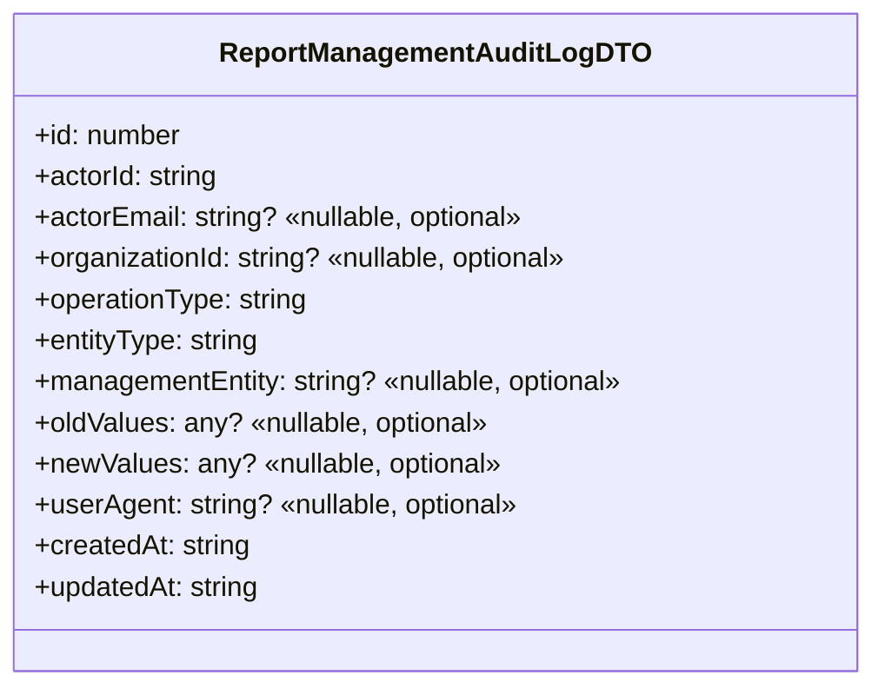

# Diagram: web/portal/src/pages/administration/report-management/audit/models/ReportManagementAuditLogDTO.ts

> Auto-generated by Obscura crawlers

## Mermaid

### SVG

<svg id="container" width="511.1796875" xmlns="http://www.w3.org/2000/svg" class="classDiagram" height="400" viewBox="0 0 511.1796875 400" role="graphics-document document" aria-roledescription="class"><g><defs><marker id="container_class-aggregationStart" class="marker aggregation class" refX="18" refY="7" markerWidth="190" markerHeight="240" orient="auto"><path d="M 18,7 L9,13 L1,7 L9,1 Z"></path></marker></defs><defs><marker id="container_class-aggregationEnd" class="marker aggregation class" refX="1" refY="7" markerWidth="20" markerHeight="28" orient="auto"><path d="M 18,7 L9,13 L1,7 L9,1 Z"></path></marker></defs><defs><marker id="container_class-extensionStart" class="marker extension class" refX="18" refY="7" markerWidth="190" markerHeight="240" orient="auto"><path d="M 1,7 L18,13 V 1 Z"></path></marker></defs><defs><marker id="container_class-extensionEnd" class="marker extension class" refX="1" refY="7" markerWidth="20" markerHeight="28" orient="auto"><path d="M 1,1 V 13 L18,7 Z"></path></marker></defs><defs><marker id="container_class-compositionStart" class="marker composition class" refX="18" refY="7" markerWidth="190" markerHeight="240" orient="auto"><path d="M 18,7 L9,13 L1,7 L9,1 Z"></path></marker></defs><defs><marker id="container_class-compositionEnd" class="marker composition class" refX="1" refY="7" markerWidth="20" markerHeight="28" orient="auto"><path d="M 18,7 L9,13 L1,7 L9,1 Z"></path></marker></defs><defs><marker id="container_class-dependencyStart" class="marker dependency class" refX="6" refY="7" markerWidth="190" markerHeight="240" orient="auto"><path d="M 5,7 L9,13 L1,7 L9,1 Z"></path></marker></defs><defs><marker id="container_class-dependencyEnd" class="marker dependency class" refX="13" refY="7" markerWidth="20" markerHeight="28" orient="auto"><path d="M 18,7 L9,13 L14,7 L9,1 Z"></path></marker></defs><defs><marker id="container_class-lollipopStart" class="marker lollipop class" refX="13" refY="7" markerWidth="190" markerHeight="240" orient="auto"><circle stroke="black" fill="transparent" cx="7" cy="7" r="6"></circle></marker></defs><defs><marker id="container_class-lollipopEnd" class="marker lollipop class" refX="1" refY="7" markerWidth="190" markerHeight="240" orient="auto"><circle stroke="black" fill="transparent" cx="7" cy="7" r="6"></circle></marker></defs><g class="root"><g class="clusters"></g><g class="edgePaths"></g><g class="edgeLabels"></g><g class="nodes"><g class="node default" id="classId-ReportManagementAuditLogDTO-0" transform="translate(255.58984375, 200)"><g class="basic label-container"><path d="M-247.58984375 -192 L247.58984375 -192 L247.58984375 192 L-247.58984375 192" stroke="none" stroke-width="0" fill="#ECECFF" style=""></path><path d="M-247.58984375 -192 C-147.68022571654865 -192, -47.77060768309727 -192, 247.58984375 -192 M-247.58984375 -192 C-53.405057857950595 -192, 140.7797280340988 -192, 247.58984375 -192 M247.58984375 -192 C247.58984375 -67.25494192153081, 247.58984375 57.49011615693837, 247.58984375 192 M247.58984375 -192 C247.58984375 -102.34380743445054, 247.58984375 -12.687614868901079, 247.58984375 192 M247.58984375 192 C133.92625684542077 192, 20.262669940841505 192, -247.58984375 192 M247.58984375 192 C99.46450533367769 192, -48.660833082644615 192, -247.58984375 192 M-247.58984375 192 C-247.58984375 111.80000415060948, -247.58984375 31.600008301218963, -247.58984375 -192 M-247.58984375 192 C-247.58984375 100.45395288052893, -247.58984375 8.907905761057862, -247.58984375 -192" stroke="#9370DB" stroke-width="1.3" fill="none" stroke-dasharray="0 0" style=""></path></g><g class="annotation-group text" transform="translate(0, -168)"></g><g class="label-group text" transform="translate(-119.0234375, -168)"><g class="label" style="font-weight: bolder" transform="translate(0,-12)"><foreignObject width="238.046875" height="24">

ReportManagementAuditLogDTO

</foreignObject></g></g><g class="members-group text" transform="translate(-235.58984375, -120)"><g class="label" style="" transform="translate(0,-12)"><foreignObject width="86.953125" height="24">

+id: number

</foreignObject></g><g class="label" style="" transform="translate(0,12)"><foreignObject width="109.15625" height="24">

+actorId: string

</foreignObject></g><g class="label" style="" transform="translate(0,36)"><foreignObject width="293.09375" height="24">

+actorEmail: string? «nullable, optional»

</foreignObject></g><g class="label" style="" transform="translate(0,60)"><foreignObject width="320.390625" height="24">

+organizationId: string? «nullable, optional»

</foreignObject></g><g class="label" style="" transform="translate(0,84)"><foreignObject width="162.328125" height="24">

+operationType: string

</foreignObject></g><g class="label" style="" transform="translate(0,108)"><foreignObject width="133.390625" height="24">

+entityType: string

</foreignObject></g><g class="label" style="" transform="translate(0,132)"><foreignObject width="352.15625" height="24">

+managementEntity: string? «nullable, optional»

</foreignObject></g><g class="label" style="" transform="translate(0,156)"><foreignObject width="270.3125" height="24">

+oldValues: any? «nullable, optional»

</foreignObject></g><g class="label" style="" transform="translate(0,180)"><foreignObject width="276.359375" height="24">

+newValues: any? «nullable, optional»

</foreignObject></g><g class="label" style="" transform="translate(0,204)"><foreignObject width="288.59375" height="24">

+userAgent: string? «nullable, optional»

</foreignObject></g><g class="label" style="" transform="translate(0,228)"><foreignObject width="127.140625" height="24">

+createdAt: string

</foreignObject></g><g class="label" style="" transform="translate(0,252)"><foreignObject width="133.625" height="24">

+updatedAt: string

</foreignObject></g></g><g class="methods-group text" transform="translate(-235.58984375, 192)"></g><g class="divider" style=""><path d="M-247.58984375 -144 C-83.19591649747494 -144, 81.19801075505012 -144, 247.58984375 -144 M-247.58984375 -144 C-139.42952488536082 -144, -31.26920602072164 -144, 247.58984375 -144" stroke="#9370DB" stroke-width="1.3" fill="none" stroke-dasharray="0 0" style=""></path></g><g class="divider" style=""><path d="M-247.58984375 168 C-78.43913677385433 168, 90.71157020229134 168, 247.58984375 168 M-247.58984375 168 C-85.47310131940816 168, 76.64364111118368 168, 247.58984375 168" stroke="#9370DB" stroke-width="1.3" fill="none" stroke-dasharray="0 0" style=""></path></g></g></g></g></g></svg>
