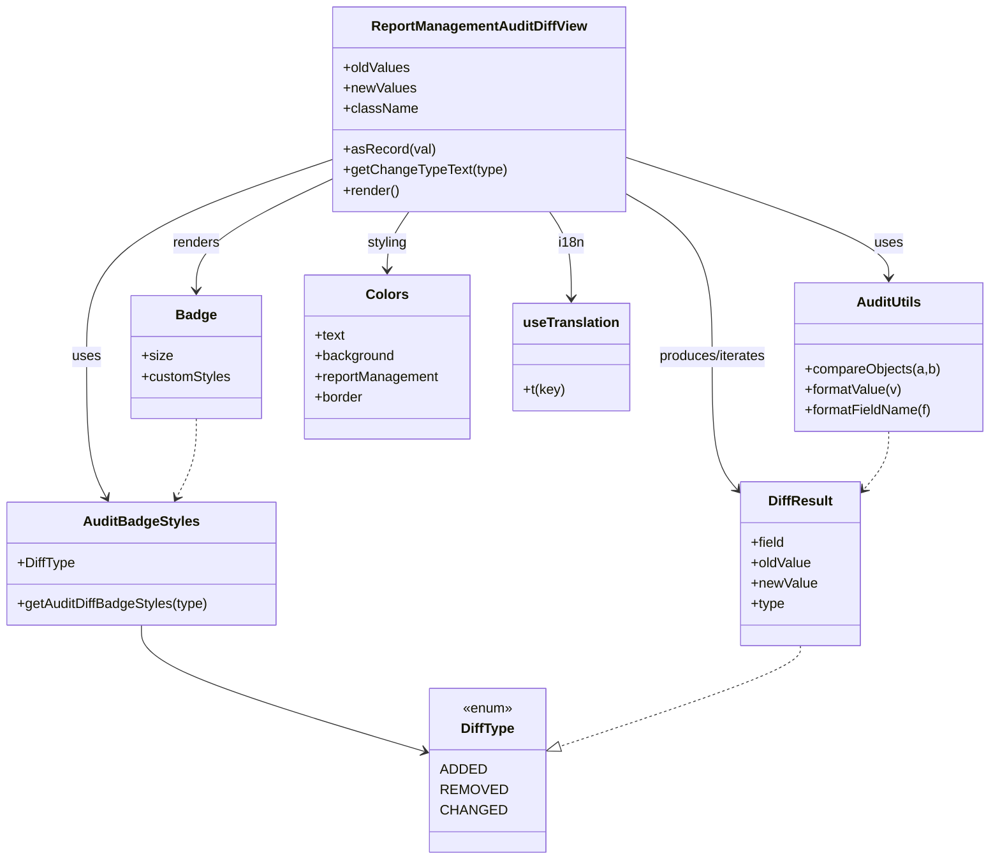

# Diagram: web/portal/src/pages/administration/report-management/components/atoms/ReportManagement.AuditDiffView.atom.tsx

> Auto-generated by Obscura crawlers

## Mermaid

### SVG

<svg id="container" width="1155.466796875" xmlns="http://www.w3.org/2000/svg" class="classDiagram" height="1006" viewBox="0 0 1155.466796875 1006" role="graphics-document document" aria-roledescription="class"><g><defs><marker id="container_class-aggregationStart" class="marker aggregation class" refX="18" refY="7" markerWidth="190" markerHeight="240" orient="auto"><path d="M 18,7 L9,13 L1,7 L9,1 Z"></path></marker></defs><defs><marker id="container_class-aggregationEnd" class="marker aggregation class" refX="1" refY="7" markerWidth="20" markerHeight="28" orient="auto"><path d="M 18,7 L9,13 L1,7 L9,1 Z"></path></marker></defs><defs><marker id="container_class-extensionStart" class="marker extension class" refX="18" refY="7" markerWidth="190" markerHeight="240" orient="auto"><path d="M 1,7 L18,13 V 1 Z"></path></marker></defs><defs><marker id="container_class-extensionEnd" class="marker extension class" refX="1" refY="7" markerWidth="20" markerHeight="28" orient="auto"><path d="M 1,1 V 13 L18,7 Z"></path></marker></defs><defs><marker id="container_class-compositionStart" class="marker composition class" refX="18" refY="7" markerWidth="190" markerHeight="240" orient="auto"><path d="M 18,7 L9,13 L1,7 L9,1 Z"></path></marker></defs><defs><marker id="container_class-compositionEnd" class="marker composition class" refX="1" refY="7" markerWidth="20" markerHeight="28" orient="auto"><path d="M 18,7 L9,13 L1,7 L9,1 Z"></path></marker></defs><defs><marker id="container_class-dependencyStart" class="marker dependency class" refX="6" refY="7" markerWidth="190" markerHeight="240" orient="auto"><path d="M 5,7 L9,13 L1,7 L9,1 Z"></path></marker></defs><defs><marker id="container_class-dependencyEnd" class="marker dependency class" refX="13" refY="7" markerWidth="20" markerHeight="28" orient="auto"><path d="M 18,7 L9,13 L14,7 L9,1 Z"></path></marker></defs><defs><marker id="container_class-lollipopStart" class="marker lollipop class" refX="13" refY="7" markerWidth="190" markerHeight="240" orient="auto"><circle stroke="black" fill="transparent" cx="7" cy="7" r="6"></circle></marker></defs><defs><marker id="container_class-lollipopEnd" class="marker lollipop class" refX="1" refY="7" markerWidth="190" markerHeight="240" orient="auto"><circle stroke="black" fill="transparent" cx="7" cy="7" r="6"></circle></marker></defs><g class="root"><g class="clusters"></g><g class="edgePaths"><path d="M724.105,224.438L741.632,234.532C759.158,244.625,794.211,264.813,811.737,297.073C829.264,329.333,829.264,373.667,829.264,416C829.264,458.333,829.264,498.667,834.589,524.996C839.914,551.325,850.565,563.65,855.89,569.812L861.216,575.975" id="id_ReportManagementAuditDiffView_DiffResult_1" class="edge-thickness-normal edge-pattern-solid relation" style=";;;" data-edge="true" data-et="edge" data-id="id_ReportManagementAuditDiffView_DiffResult_1" data-points="W3sieCI6NzI0LjEwNTQ2ODc1LCJ5IjoyMjQuNDM4MTgxMDc1Njc4NjR9LHsieCI6ODI5LjI2MzY3MTg3NSwieSI6Mjg1fSx7IngiOjgyOS4yNjM2NzE4NzUsInkiOjQxOH0seyJ4Ijo4MjkuMjYzNjcxODc1LCJ5Ijo1Mzl9LHsieCI6ODY1LjEzODY3MTg3NSwieSI6NTgwLjUxNDY0NDM1MTQ2NDR9XQ==" marker-end="url(#container_class-dependencyEnd)"></path><path d="M724.105,182.574L776.486,199.645C828.867,216.716,933.628,250.858,986.008,274.596C1038.389,298.333,1038.389,311.667,1038.389,318.333L1038.389,325" id="id_ReportManagementAuditDiffView_AuditUtils_2" class="edge-thickness-normal edge-pattern-solid relation" style=";;;" data-edge="true" data-et="edge" data-id="id_ReportManagementAuditDiffView_AuditUtils_2" data-points="W3sieCI6NzI0LjEwNTQ2ODc1LCJ5IjoxODIuNTczNzE0MDYzMzA0NTJ9LHsieCI6MTAzOC4zODg2NzE4NzUsInkiOjI4NX0seyJ4IjoxMDM4LjM4ODY3MTg3NSwieSI6MzMxfV0=" marker-end="url(#container_class-dependencyEnd)"></path><path d="M389.199,185.71L341.183,202.259C293.166,218.807,197.133,251.903,149.116,290.618C101.1,329.333,101.1,373.667,101.1,416C101.1,458.333,101.1,498.667,104.916,526.114C108.732,553.562,116.365,568.124,120.182,575.405L123.998,582.686" id="id_ReportManagementAuditDiffView_AuditBadgeStyles_3" class="edge-thickness-normal edge-pattern-solid relation" style=";;;" data-edge="true" data-et="edge" data-id="id_ReportManagementAuditDiffView_AuditBadgeStyles_3" data-points="W3sieCI6Mzg5LjE5OTIxODc1LCJ5IjoxODUuNzEwNDIyMTc3NzI4ODJ9LHsieCI6MTAxLjA5OTYwOTM3NSwieSI6Mjg1fSx7IngiOjEwMS4wOTk2MDkzNzUsInkiOjQxOH0seyJ4IjoxMDEuMDk5NjA5Mzc1LCJ5Ijo1Mzl9LHsieCI6MTI2Ljc4MzYzODk0NjI4MSwieSI6NTg4fV0=" marker-end="url(#container_class-dependencyEnd)"></path><path d="M389.199,207.981L362.324,220.817C335.449,233.654,281.698,259.327,254.823,281.33C227.947,303.333,227.947,321.667,227.947,330.833L227.947,340" id="id_ReportManagementAuditDiffView_Badge_4" class="edge-thickness-normal edge-pattern-solid relation" style=";;;" data-edge="true" data-et="edge" data-id="id_ReportManagementAuditDiffView_Badge_4" data-points="W3sieCI6Mzg5LjE5OTIxODc1LCJ5IjoyMDcuOTgwOTM4NDU5OTg0NDN9LHsieCI6MjI3Ljk0NzI2NTYyNSwieSI6Mjg1fSx7IngiOjIyNy45NDcyNjU2MjUsInkiOjM0Nn1d" marker-end="url(#container_class-dependencyEnd)"></path><path d="M475.267,248L471.085,254.167C466.903,260.333,458.538,272.667,454.356,284C450.174,295.333,450.174,305.667,450.174,310.833L450.174,316" id="id_ReportManagementAuditDiffView_Colors_5" class="edge-thickness-normal edge-pattern-solid relation" style=";;;" data-edge="true" data-et="edge" data-id="id_ReportManagementAuditDiffView_Colors_5" data-points="W3sieCI6NDc1LjI2NzQ5MTA0Mjk5MzY0LCJ5IjoyNDh9LHsieCI6NDUwLjE3MzgyODEyNSwieSI6Mjg1fSx7IngiOjQ1MC4xNzM4MjgxMjUsInkiOjMyMn1d" marker-end="url(#container_class-dependencyEnd)"></path><path d="M638.037,248L642.219,254.167C646.402,260.333,654.766,272.667,658.949,289.5C663.131,306.333,663.131,327.667,663.131,338.333L663.131,349" id="id_ReportManagementAuditDiffView_useTranslation_6" class="edge-thickness-normal edge-pattern-solid relation" style=";;;" data-edge="true" data-et="edge" data-id="id_ReportManagementAuditDiffView_useTranslation_6" data-points="W3sieCI6NjM4LjAzNzE5NjQ1NzAwNjQsInkiOjI0OH0seyJ4Ijo2NjMuMTMwODU5Mzc1LCJ5IjoyODV9LHsieCI6NjYzLjEzMDg1OTM3NSwieSI6MzU1fV0=" marker-end="url(#container_class-dependencyEnd)"></path><path d="M164.523,732L164.523,740.167C164.523,748.333,164.523,764.667,220.787,789.634C277.05,814.601,389.577,848.202,445.841,865.002L502.104,881.803" id="id_AuditBadgeStyles_DiffType_7" class="edge-thickness-normal edge-pattern-solid relation" style=";;;" data-edge="true" data-et="edge" data-id="id_AuditBadgeStyles_DiffType_7" data-points="W3sieCI6MTY0LjUyMzQzNzUsInkiOjczMn0seyJ4IjoxNjQuNTIzNDM3NSwieSI6NzgxfSx7IngiOjUwNy44NTM1MTU2MjUsInkiOjg4My41MTkyOTE2NjY4Njc1fV0=" marker-end="url(#container_class-dependencyEnd)"></path><path d="M1038.389,505L1038.389,510.667C1038.389,516.333,1038.389,527.667,1033.063,539.496C1027.738,551.325,1017.087,563.65,1011.762,569.812L1006.437,575.975" id="id_AuditUtils_DiffResult_8" class="edge-thickness-normal edge-pattern-dashed relation" style=";;;" data-edge="true" data-et="edge" data-id="id_AuditUtils_DiffResult_8" data-points="W3sieCI6MTAzOC4zODg2NzE4NzUsInkiOjUwNX0seyJ4IjoxMDM4LjM4ODY3MTg3NSwieSI6NTM5fSx7IngiOjEwMDIuNTEzNjcxODc1LCJ5Ijo1ODAuNTE0NjQ0MzUxNDY0NH1d" marker-end="url(#container_class-dependencyEnd)"></path><path d="M227.947,490L227.947,498.167C227.947,506.333,227.947,522.667,224.131,538.114C220.314,553.562,212.682,568.124,208.865,575.405L205.049,582.686" id="id_Badge_AuditBadgeStyles_9" class="edge-thickness-normal edge-pattern-dashed relation" style=";;;" data-edge="true" data-et="edge" data-id="id_Badge_AuditBadgeStyles_9" data-points="W3sieCI6MjI3Ljk0NzI2NTYyNSwieSI6NDkwfSx7IngiOjIyNy45NDcyNjU2MjUsInkiOjUzOX0seyJ4IjoyMDIuMjYzMjM2MDUzNzE5LCJ5Ijo1ODh9XQ==" marker-end="url(#container_class-dependencyEnd)"></path><path d="M933.826,756L933.826,760.167C933.826,764.333,933.826,772.667,886.189,792.665C838.552,812.664,743.278,844.327,695.641,860.159L648.004,875.991" id="id_DiffResult_DiffType_10" class="edge-thickness-normal edge-pattern-dashed relation" style=";;;" data-edge="true" data-et="edge" data-id="id_DiffResult_DiffType_10" data-points="W3sieCI6OTMzLjgyNjE3MTg3NSwieSI6NzU2fSx7IngiOjkzMy44MjYxNzE4NzUsInkiOjc4MX0seyJ4Ijo2MzEuNjM0NzY1NjI1LCJ5Ijo4ODEuNDMxMTAzNDgxNTcyOX1d" marker-end="url(#container_class-extensionEnd)"></path></g><g class="edgeLabels"><g class="edgeLabel" transform="translate(829.263671875, 418)"><g class="label" data-id="id_ReportManagementAuditDiffView_DiffResult_1" transform="translate(-65.046875, -12)"><foreignObject width="130.09375" height="24">

produces/iterates

</foreignObject></g></g><g class="edgeLabel" transform="translate(1038.388671875, 285)"><g class="label" data-id="id_ReportManagementAuditDiffView_AuditUtils_2" transform="translate(-16.4921875, -12)"><foreignObject width="32.984375" height="24">

uses

</foreignObject></g></g><g class="edgeLabel" transform="translate(101.099609375, 418)"><g class="label" data-id="id_ReportManagementAuditDiffView_AuditBadgeStyles_3" transform="translate(-16.4921875, -12)"><foreignObject width="32.984375" height="24">

uses

</foreignObject></g></g><g class="edgeLabel" transform="translate(227.947265625, 285)"><g class="label" data-id="id_ReportManagementAuditDiffView_Badge_4" transform="translate(-27.75, -12)"><foreignObject width="55.5" height="24">

renders

</foreignObject></g></g><g class="edgeLabel" transform="translate(450.173828125, 285)"><g class="label" data-id="id_ReportManagementAuditDiffView_Colors_5" transform="translate(-23.96875, -12)"><foreignObject width="47.9375" height="24">

styling

</foreignObject></g></g><g class="edgeLabel" transform="translate(663.130859375, 285)"><g class="label" data-id="id_ReportManagementAuditDiffView_useTranslation_6" transform="translate(-14.8203125, -12)"><foreignObject width="29.640625" height="24">

i18n

</foreignObject></g></g><g class="edgeLabel"><g class="label" data-id="id_AuditBadgeStyles_DiffType_7" transform="translate(0, 0)"><foreignObject width="0" height="0">

</foreignObject></g></g><g class="edgeLabel"><g class="label" data-id="id_AuditUtils_DiffResult_8" transform="translate(0, 0)"><foreignObject width="0" height="0">

</foreignObject></g></g><g class="edgeLabel"><g class="label" data-id="id_Badge_AuditBadgeStyles_9" transform="translate(0, 0)"><foreignObject width="0" height="0">

</foreignObject></g></g><g class="edgeLabel"><g class="label" data-id="id_DiffResult_DiffType_10" transform="translate(0, 0)"><foreignObject width="0" height="0">

</foreignObject></g></g></g><g class="nodes"><g class="node default" id="classId-ReportManagementAuditDiffView-0" transform="translate(556.65234375, 128)"><g class="basic label-container"><path d="M-167.453125 -120 L167.453125 -120 L167.453125 120 L-167.453125 120" stroke="none" stroke-width="0" fill="#ECECFF" style=""></path><path d="M-167.453125 -120 C-39.05966584680283 -120, 89.33379330639434 -120, 167.453125 -120 M-167.453125 -120 C-42.24222407371511 -120, 82.96867685256979 -120, 167.453125 -120 M167.453125 -120 C167.453125 -25.548945369573758, 167.453125 68.90210926085248, 167.453125 120 M167.453125 -120 C167.453125 -60.42119440842793, 167.453125 -0.8423888168558591, 167.453125 120 M167.453125 120 C34.330430932731474 120, -98.79226313453705 120, -167.453125 120 M167.453125 120 C57.060640255006135 120, -53.33184448998773 120, -167.453125 120 M-167.453125 120 C-167.453125 28.551994502656086, -167.453125 -62.89601099468783, -167.453125 -120 M-167.453125 120 C-167.453125 68.47045734814526, -167.453125 16.94091469629052, -167.453125 -120" stroke="#9370DB" stroke-width="1.3" fill="none" stroke-dasharray="0 0" style=""></path></g><g class="annotation-group text" transform="translate(0, -96)"></g><g class="label-group text" transform="translate(-121.921875, -96)"><g class="label" style="font-weight: bolder" transform="translate(0,-12)"><foreignObject width="243.84375" height="24">

ReportManagementAuditDiffView

</foreignObject></g></g><g class="members-group text" transform="translate(-155.453125, -48)"><g class="label" style="" transform="translate(0,-12)"><foreignObject width="78.5" height="24">

+oldValues

</foreignObject></g><g class="label" style="" transform="translate(0,12)"><foreignObject width="84.546875" height="24">

+newValues

</foreignObject></g><g class="label" style="" transform="translate(0,36)"><foreignObject width="85.640625" height="24">

+className

</foreignObject></g></g><g class="methods-group text" transform="translate(-155.453125, 48)"><g class="label" style="" transform="translate(0,-12)"><foreignObject width="105.078125" height="24">

+asRecord(val)

</foreignObject></g><g class="label" style="" transform="translate(0,12)"><foreignObject width="188.984375" height="24">

+getChangeTypeText(type)

</foreignObject></g><g class="label" style="" transform="translate(0,36)"><foreignObject width="66.609375" height="24">

+render()

</foreignObject></g></g><g class="divider" style=""><path d="M-167.453125 -72 C-41.76347644819832 -72, 83.92617210360336 -72, 167.453125 -72 M-167.453125 -72 C-47.62492715818141 -72, 72.20327068363719 -72, 167.453125 -72" stroke="#9370DB" stroke-width="1.3" fill="none" stroke-dasharray="0 0" style=""></path></g><g class="divider" style=""><path d="M-167.453125 24 C-46.093428644454235 24, 75.26626771109153 24, 167.453125 24 M-167.453125 24 C-94.26712433220779 24, -21.08112366441557 24, 167.453125 24" stroke="#9370DB" stroke-width="1.3" fill="none" stroke-dasharray="0 0" style=""></path></g></g><g class="node default" id="classId-DiffResult-1" transform="translate(933.826171875, 660)"><g class="basic label-container"><path d="M-68.6875 -96 L68.6875 -96 L68.6875 96 L-68.6875 96" stroke="none" stroke-width="0" fill="#ECECFF" style=""></path><path d="M-68.6875 -96 C-23.909132650021988 -96, 20.869234699956024 -96, 68.6875 -96 M-68.6875 -96 C-23.23206120754012 -96, 22.22337758491976 -96, 68.6875 -96 M68.6875 -96 C68.6875 -25.72064297436583, 68.6875 44.55871405126834, 68.6875 96 M68.6875 -96 C68.6875 -55.48203170126691, 68.6875 -14.964063402533824, 68.6875 96 M68.6875 96 C18.172944175242648 96, -32.341611649514704 96, -68.6875 96 M68.6875 96 C39.83694092258007 96, 10.986381845160132 96, -68.6875 96 M-68.6875 96 C-68.6875 24.16624948319003, -68.6875 -47.66750103361994, -68.6875 -96 M-68.6875 96 C-68.6875 36.49892317027114, -68.6875 -23.00215365945772, -68.6875 -96" stroke="#9370DB" stroke-width="1.3" fill="none" stroke-dasharray="0 0" style=""></path></g><g class="annotation-group text" transform="translate(0, -72)"></g><g class="label-group text" transform="translate(-36.296875, -72)"><g class="label" style="font-weight: bolder" transform="translate(0,-12)"><foreignObject width="72.59375" height="24">

DiffResult

</foreignObject></g></g><g class="members-group text" transform="translate(-56.6875, -24)"><g class="label" style="" transform="translate(0,-12)"><foreignObject width="39.84375" height="24">

+field

</foreignObject></g><g class="label" style="" transform="translate(0,12)"><foreignObject width="71.03125" height="24">

+oldValue

</foreignObject></g><g class="label" style="" transform="translate(0,36)"><foreignObject width="77.078125" height="24">

+newValue

</foreignObject></g><g class="label" style="" transform="translate(0,60)"><foreignObject width="39.703125" height="24">

+type

</foreignObject></g></g><g class="methods-group text" transform="translate(-56.6875, 96)"></g><g class="divider" style=""><path d="M-68.6875 -48 C-18.01465917474865 -48, 32.6581816505027 -48, 68.6875 -48 M-68.6875 -48 C-15.236738959918718 -48, 38.214022080162565 -48, 68.6875 -48" stroke="#9370DB" stroke-width="1.3" fill="none" stroke-dasharray="0 0" style=""></path></g><g class="divider" style=""><path d="M-68.6875 72 C-27.277525257629584 72, 14.132449484740832 72, 68.6875 72 M-68.6875 72 C-15.152639735609633 72, 38.382220528780735 72, 68.6875 72" stroke="#9370DB" stroke-width="1.3" fill="none" stroke-dasharray="0 0" style=""></path></g></g><g class="node default" id="classId-DiffType-2" transform="translate(569.744140625, 902)"><g class="basic label-container"><path d="M-61.890625 -96 L61.890625 -96 L61.890625 96 L-61.890625 96" stroke="none" stroke-width="0" fill="#ECECFF" style=""></path><path d="M-61.890625 -96 C-34.75408676834826 -96, -7.617548536696525 -96, 61.890625 -96 M-61.890625 -96 C-17.29997799278174 -96, 27.290669014436517 -96, 61.890625 -96 M61.890625 -96 C61.890625 -21.0732858122838, 61.890625 53.8534283754324, 61.890625 96 M61.890625 -96 C61.890625 -41.48324611213869, 61.890625 13.033507775722626, 61.890625 96 M61.890625 96 C17.51770012213658 96, -26.855224755726837 96, -61.890625 96 M61.890625 96 C27.105217393968395 96, -7.680190212063209 96, -61.890625 96 M-61.890625 96 C-61.890625 47.23408789658846, -61.890625 -1.5318242068230745, -61.890625 -96 M-61.890625 96 C-61.890625 57.46767775607597, -61.890625 18.935355512151943, -61.890625 -96" stroke="#9370DB" stroke-width="1.3" fill="none" stroke-dasharray="0 0" style=""></path></g><g class="annotation-group text" transform="translate(-29.53125, -72)"><g class="label" style="" transform="translate(0,-12)"><foreignObject width="59.0625" height="24">

«enum»

</foreignObject></g></g><g class="label-group text" transform="translate(-30.5, -48)"><g class="label" style="font-weight: bolder" transform="translate(0,-12)"><foreignObject width="61" height="24">

DiffType

</foreignObject></g></g><g class="members-group text" transform="translate(-49.890625, 0)"><g class="label" style="" transform="translate(0,-12)"><foreignObject width="48.640625" height="24">

ADDED

</foreignObject></g><g class="label" style="" transform="translate(0,12)"><foreignObject width="69.28125" height="24">

REMOVED

</foreignObject></g><g class="label" style="" transform="translate(0,36)"><foreignObject width="68.90625" height="24">

CHANGED

</foreignObject></g></g><g class="methods-group text" transform="translate(-49.890625, 96)"></g><g class="divider" style=""><path d="M-61.890625 -24 C-34.01031512287639 -24, -6.130005245752784 -24, 61.890625 -24 M-61.890625 -24 C-18.51853699311249 -24, 24.853551013775018 -24, 61.890625 -24" stroke="#9370DB" stroke-width="1.3" fill="none" stroke-dasharray="0 0" style=""></path></g><g class="divider" style=""><path d="M-61.890625 72 C-27.18643558849569 72, 7.5177538230086185 72, 61.890625 72 M-61.890625 72 C-37.03517315593945 72, -12.179721311878893 72, 61.890625 72" stroke="#9370DB" stroke-width="1.3" fill="none" stroke-dasharray="0 0" style=""></path></g></g><g class="node default" id="classId-AuditUtils-3" transform="translate(1038.388671875, 418)"><g class="basic label-container"><path d="M-109.078125 -87 L109.078125 -87 L109.078125 87 L-109.078125 87" stroke="none" stroke-width="0" fill="#ECECFF" style=""></path><path d="M-109.078125 -87 C-52.259729702783964 -87, 4.558665594432071 -87, 109.078125 -87 M-109.078125 -87 C-29.269067415888813 -87, 50.539990168222374 -87, 109.078125 -87 M109.078125 -87 C109.078125 -20.32312450382021, 109.078125 46.35375099235958, 109.078125 87 M109.078125 -87 C109.078125 -24.185147826192072, 109.078125 38.629704347615856, 109.078125 87 M109.078125 87 C53.616955581542186 87, -1.8442138369156282 87, -109.078125 87 M109.078125 87 C59.84623010004345 87, 10.614335200086899 87, -109.078125 87 M-109.078125 87 C-109.078125 33.63118383120658, -109.078125 -19.737632337586845, -109.078125 -87 M-109.078125 87 C-109.078125 48.45159681924732, -109.078125 9.903193638494642, -109.078125 -87" stroke="#9370DB" stroke-width="1.3" fill="none" stroke-dasharray="0 0" style=""></path></g><g class="annotation-group text" transform="translate(0, -63)"></g><g class="label-group text" transform="translate(-36.234375, -63)"><g class="label" style="font-weight: bolder" transform="translate(0,-12)"><foreignObject width="72.46875" height="24">

AuditUtils

</foreignObject></g></g><g class="members-group text" transform="translate(-97.078125, -15)"></g><g class="methods-group text" transform="translate(-97.078125, 15)"><g class="label" style="" transform="translate(0,-12)"><foreignObject width="157.921875" height="24">

+compareObjects(a,b)

</foreignObject></g><g class="label" style="" transform="translate(0,12)"><foreignObject width="114.421875" height="24">

+formatValue(v)

</foreignObject></g><g class="label" style="" transform="translate(0,36)"><foreignObject width="150.4375" height="24">

+formatFieldName(f)

</foreignObject></g></g><g class="divider" style=""><path d="M-109.078125 -39 C-34.665615020578414 -39, 39.74689495884317 -39, 109.078125 -39 M-109.078125 -39 C-60.435067075293574 -39, -11.792009150587148 -39, 109.078125 -39" stroke="#9370DB" stroke-width="1.3" fill="none" stroke-dasharray="0 0" style=""></path></g><g class="divider" style=""><path d="M-109.078125 -15 C-55.56621491636654 -15, -2.054304832733081 -15, 109.078125 -15 M-109.078125 -15 C-59.28688262005631 -15, -9.495640240112621 -15, 109.078125 -15" stroke="#9370DB" stroke-width="1.3" fill="none" stroke-dasharray="0 0" style=""></path></g></g><g class="node default" id="classId-AuditBadgeStyles-4" transform="translate(164.5234375, 660)"><g class="basic label-container"><path d="M-156.5234375 -72 L156.5234375 -72 L156.5234375 72 L-156.5234375 72" stroke="none" stroke-width="0" fill="#ECECFF" style=""></path><path d="M-156.5234375 -72 C-37.332215060250306 -72, 81.85900737949939 -72, 156.5234375 -72 M-156.5234375 -72 C-85.19733381996613 -72, -13.871230139932266 -72, 156.5234375 -72 M156.5234375 -72 C156.5234375 -39.28961116344078, 156.5234375 -6.579222326881563, 156.5234375 72 M156.5234375 -72 C156.5234375 -29.72505895029667, 156.5234375 12.549882099406659, 156.5234375 72 M156.5234375 72 C72.28000152642784 72, -11.963434447144323 72, -156.5234375 72 M156.5234375 72 C75.43057154515422 72, -5.662294409691555 72, -156.5234375 72 M-156.5234375 72 C-156.5234375 17.44966261945244, -156.5234375 -37.10067476109512, -156.5234375 -72 M-156.5234375 72 C-156.5234375 30.47417791526886, -156.5234375 -11.051644169462278, -156.5234375 -72" stroke="#9370DB" stroke-width="1.3" fill="none" stroke-dasharray="0 0" style=""></path></g><g class="annotation-group text" transform="translate(0, -48)"></g><g class="label-group text" transform="translate(-64.59375, -48)"><g class="label" style="font-weight: bolder" transform="translate(0,-12)"><foreignObject width="129.1875" height="24">

AuditBadgeStyles

</foreignObject></g></g><g class="members-group text" transform="translate(-144.5234375, 0)"><g class="label" style="" transform="translate(0,-12)"><foreignObject width="67.25" height="24">

+DiffType

</foreignObject></g></g><g class="methods-group text" transform="translate(-144.5234375, 48)"><g class="label" style="" transform="translate(0,-12)"><foreignObject width="224.453125" height="24">

+getAuditDiffBadgeStyles(type)

</foreignObject></g></g><g class="divider" style=""><path d="M-156.5234375 -24 C-78.10930651746489 -24, 0.30482446507022587 -24, 156.5234375 -24 M-156.5234375 -24 C-85.23526460780657 -24, -13.94709171561314 -24, 156.5234375 -24" stroke="#9370DB" stroke-width="1.3" fill="none" stroke-dasharray="0 0" style=""></path></g><g class="divider" style=""><path d="M-156.5234375 24 C-72.9225805421637 24, 10.678276415672599 24, 156.5234375 24 M-156.5234375 24 C-44.061482566256615 24, 68.40047236748677 24, 156.5234375 24" stroke="#9370DB" stroke-width="1.3" fill="none" stroke-dasharray="0 0" style=""></path></g></g><g class="node default" id="classId-Badge-5" transform="translate(227.947265625, 418)"><g class="basic label-container"><path d="M-75.35546875 -72 L75.35546875 -72 L75.35546875 72 L-75.35546875 72" stroke="none" stroke-width="0" fill="#ECECFF" style=""></path><path d="M-75.35546875 -72 C-25.980750330249442 -72, 23.393968089501115 -72, 75.35546875 -72 M-75.35546875 -72 C-23.26420250071996 -72, 28.82706374856008 -72, 75.35546875 -72 M75.35546875 -72 C75.35546875 -41.302658487815116, 75.35546875 -10.605316975630231, 75.35546875 72 M75.35546875 -72 C75.35546875 -30.06199632333383, 75.35546875 11.87600735333234, 75.35546875 72 M75.35546875 72 C35.82036537932947 72, -3.714737991341053 72, -75.35546875 72 M75.35546875 72 C32.29651658376101 72, -10.762435582477977 72, -75.35546875 72 M-75.35546875 72 C-75.35546875 26.764956518408695, -75.35546875 -18.47008696318261, -75.35546875 -72 M-75.35546875 72 C-75.35546875 26.148068937133743, -75.35546875 -19.703862125732513, -75.35546875 -72" stroke="#9370DB" stroke-width="1.3" fill="none" stroke-dasharray="0 0" style=""></path></g><g class="annotation-group text" transform="translate(0, -48)"></g><g class="label-group text" transform="translate(-22.7734375, -48)"><g class="label" style="font-weight: bolder" transform="translate(0,-12)"><foreignObject width="45.546875" height="24">

Badge

</foreignObject></g></g><g class="members-group text" transform="translate(-63.35546875, 0)"><g class="label" style="" transform="translate(0,-12)"><foreignObject width="35.578125" height="24">

+size

</foreignObject></g><g class="label" style="" transform="translate(0,12)"><foreignObject width="103.9375" height="24">

+customStyles

</foreignObject></g></g><g class="methods-group text" transform="translate(-63.35546875, 72)"></g><g class="divider" style=""><path d="M-75.35546875 -24 C-29.629646712734477 -24, 16.096175324531046 -24, 75.35546875 -24 M-75.35546875 -24 C-34.31817941506931 -24, 6.719109919861381 -24, 75.35546875 -24" stroke="#9370DB" stroke-width="1.3" fill="none" stroke-dasharray="0 0" style=""></path></g><g class="divider" style=""><path d="M-75.35546875 48 C-17.55626345000529 48, 40.24294184998942 48, 75.35546875 48 M-75.35546875 48 C-42.22115112267944 48, -9.086833495358874 48, 75.35546875 48" stroke="#9370DB" stroke-width="1.3" fill="none" stroke-dasharray="0 0" style=""></path></g></g><g class="node default" id="classId-Colors-6" transform="translate(450.173828125, 418)"><g class="basic label-container"><path d="M-96.87109375 -96 L96.87109375 -96 L96.87109375 96 L-96.87109375 96" stroke="none" stroke-width="0" fill="#ECECFF" style=""></path><path d="M-96.87109375 -96 C-44.53886780826228 -96, 7.7933581334754365 -96, 96.87109375 -96 M-96.87109375 -96 C-51.02657965791911 -96, -5.182065565838215 -96, 96.87109375 -96 M96.87109375 -96 C96.87109375 -32.28928731142896, 96.87109375 31.421425377142086, 96.87109375 96 M96.87109375 -96 C96.87109375 -52.83593526672274, 96.87109375 -9.671870533445485, 96.87109375 96 M96.87109375 96 C32.034209354901606 96, -32.80267504019679 96, -96.87109375 96 M96.87109375 96 C51.8599253606327 96, 6.848756971265402 96, -96.87109375 96 M-96.87109375 96 C-96.87109375 42.84620411380352, -96.87109375 -10.307591772392954, -96.87109375 -96 M-96.87109375 96 C-96.87109375 33.38951387234452, -96.87109375 -29.220972255310954, -96.87109375 -96" stroke="#9370DB" stroke-width="1.3" fill="none" stroke-dasharray="0 0" style=""></path></g><g class="annotation-group text" transform="translate(0, -72)"></g><g class="label-group text" transform="translate(-23.1015625, -72)"><g class="label" style="font-weight: bolder" transform="translate(0,-12)"><foreignObject width="46.203125" height="24">

Colors

</foreignObject></g></g><g class="members-group text" transform="translate(-84.87109375, -24)"><g class="label" style="" transform="translate(0,-12)"><foreignObject width="35.5625" height="24">

+text

</foreignObject></g><g class="label" style="" transform="translate(0,12)"><foreignObject width="93.390625" height="24">

+background

</foreignObject></g><g class="label" style="" transform="translate(0,36)"><foreignObject width="146.640625" height="24">

+reportManagement

</foreignObject></g><g class="label" style="" transform="translate(0,60)"><foreignObject width="57" height="24">

+border

</foreignObject></g></g><g class="methods-group text" transform="translate(-84.87109375, 96)"></g><g class="divider" style=""><path d="M-96.87109375 -48 C-43.64574942111475 -48, 9.579594907770499 -48, 96.87109375 -48 M-96.87109375 -48 C-39.20717318617809 -48, 18.456747377643822 -48, 96.87109375 -48" stroke="#9370DB" stroke-width="1.3" fill="none" stroke-dasharray="0 0" style=""></path></g><g class="divider" style=""><path d="M-96.87109375 72 C-44.47780242801489 72, 7.91548889397022 72, 96.87109375 72 M-96.87109375 72 C-36.39368480593424 72, 24.083724138131515 72, 96.87109375 72" stroke="#9370DB" stroke-width="1.3" fill="none" stroke-dasharray="0 0" style=""></path></g></g><g class="node default" id="classId-useTranslation-7" transform="translate(663.130859375, 418)"><g class="basic label-container"><path d="M-66.0859375 -63 L66.0859375 -63 L66.0859375 63 L-66.0859375 63" stroke="none" stroke-width="0" fill="#ECECFF" style=""></path><path d="M-66.0859375 -63 C-15.599072004715147 -63, 34.887793490569706 -63, 66.0859375 -63 M-66.0859375 -63 C-37.13623462114599 -63, -8.186531742291969 -63, 66.0859375 -63 M66.0859375 -63 C66.0859375 -31.47959374375099, 66.0859375 0.04081251249802165, 66.0859375 63 M66.0859375 -63 C66.0859375 -30.269788057538754, 66.0859375 2.4604238849224913, 66.0859375 63 M66.0859375 63 C19.798093808102948 63, -26.489749883794104 63, -66.0859375 63 M66.0859375 63 C39.25103390992274 63, 12.416130319845472 63, -66.0859375 63 M-66.0859375 63 C-66.0859375 33.3536210808436, -66.0859375 3.707242161687205, -66.0859375 -63 M-66.0859375 63 C-66.0859375 21.50645835664512, -66.0859375 -19.987083286709762, -66.0859375 -63" stroke="#9370DB" stroke-width="1.3" fill="none" stroke-dasharray="0 0" style=""></path></g><g class="annotation-group text" transform="translate(0, -39)"></g><g class="label-group text" transform="translate(-54.0859375, -39)"><g class="label" style="font-weight: bolder" transform="translate(0,-12)"><foreignObject width="108.171875" height="24">

useTranslation

</foreignObject></g></g><g class="members-group text" transform="translate(-54.0859375, 9)"></g><g class="methods-group text" transform="translate(-54.0859375, 39)"><g class="label" style="" transform="translate(0,-12)"><foreignObject width="48.625" height="24">

+t(key)

</foreignObject></g></g><g class="divider" style=""><path d="M-66.0859375 -15 C-31.268451446635908 -15, 3.549034606728185 -15, 66.0859375 -15 M-66.0859375 -15 C-16.562140718034698 -15, 32.961656063930604 -15, 66.0859375 -15" stroke="#9370DB" stroke-width="1.3" fill="none" stroke-dasharray="0 0" style=""></path></g><g class="divider" style=""><path d="M-66.0859375 9 C-36.14518463755089 9, -6.2044317751017815 9, 66.0859375 9 M-66.0859375 9 C-38.89479904021416 9, -11.70366058042832 9, 66.0859375 9" stroke="#9370DB" stroke-width="1.3" fill="none" stroke-dasharray="0 0" style=""></path></g></g></g></g></g></svg>
