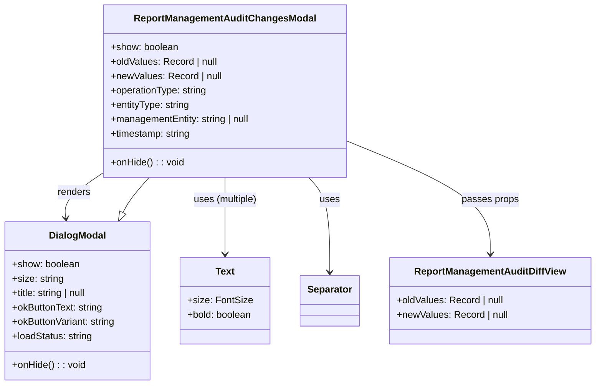

# Diagram: web/portal/src/pages/administration/report-management/components/molecules/ReportManagement.AuditChangesModal.molecule.tsx


> Auto-generated by Obscura crawlers

## Diagram 1



### SVG

<svg id="container" width="987.4765625" xmlns="http://www.w3.org/2000/svg" class="classDiagram" height="642" viewBox="0 0 987.4765625 642" role="graphics-document document" aria-roledescription="class"><style>#container{font-family:"trebuchet ms",verdana,arial,sans-serif;font-size:16px;fill:#333;}@keyframes edge-animation-frame{from{stroke-dashoffset:0;}}@keyframes dash{to{stroke-dashoffset:0;}}#container .edge-animation-slow{stroke-dasharray:9,5!important;stroke-dashoffset:900;animation:dash 50s linear infinite;stroke-linecap:round;}#container .edge-animation-fast{stroke-dasharray:9,5!important;stroke-dashoffset:900;animation:dash 20s linear infinite;stroke-linecap:round;}#container .error-icon{fill:#552222;}#container .error-text{fill:#552222;stroke:#552222;}#container .edge-thickness-normal{stroke-width:1px;}#container .edge-thickness-thick{stroke-width:3.5px;}#container .edge-pattern-solid{stroke-dasharray:0;}#container .edge-thickness-invisible{stroke-width:0;fill:none;}#container .edge-pattern-dashed{stroke-dasharray:3;}#container .edge-pattern-dotted{stroke-dasharray:2;}#container .marker{fill:#333333;stroke:#333333;}#container .marker.cross{stroke:#333333;}#container svg{font-family:"trebuchet ms",verdana,arial,sans-serif;font-size:16px;}#container p{margin:0;}#container g.classGroup text{fill:#9370DB;stroke:none;font-family:"trebuchet ms",verdana,arial,sans-serif;font-size:10px;}#container g.classGroup text .title{font-weight:bolder;}#container .nodeLabel,#container .edgeLabel{color:#131300;}#container .edgeLabel .label rect{fill:#ECECFF;}#container .label text{fill:#131300;}#container .labelBkg{background:#ECECFF;}#container .edgeLabel .label span{background:#ECECFF;}#container .classTitle{font-weight:bolder;}#container .node rect,#container .node circle,#container .node ellipse,#container .node polygon,#container .node path{fill:#ECECFF;stroke:#9370DB;stroke-width:1px;}#container .divider{stroke:#9370DB;stroke-width:1;}#container g.clickable{cursor:pointer;}#container g.classGroup rect{fill:#ECECFF;stroke:#9370DB;}#container g.classGroup line{stroke:#9370DB;stroke-width:1;}#container .classLabel .box{stroke:none;stroke-width:0;fill:#ECECFF;opacity:0.5;}#container .classLabel .label{fill:#9370DB;font-size:10px;}#container .relation{stroke:#333333;stroke-width:1;fill:none;}#container .dashed-line{stroke-dasharray:3;}#container .dotted-line{stroke-dasharray:1 2;}#container #compositionStart,#container .composition{fill:#333333!important;stroke:#333333!important;stroke-width:1;}#container #compositionEnd,#container .composition{fill:#333333!important;stroke:#333333!important;stroke-width:1;}#container #dependencyStart,#container .dependency{fill:#333333!important;stroke:#333333!important;stroke-width:1;}#container #dependencyStart,#container .dependency{fill:#333333!important;stroke:#333333!important;stroke-width:1;}#container #extensionStart,#container .extension{fill:transparent!important;stroke:#333333!important;stroke-width:1;}#container #extensionEnd,#container .extension{fill:transparent!important;stroke:#333333!important;stroke-width:1;}#container #aggregationStart,#container .aggregation{fill:transparent!important;stroke:#333333!important;stroke-width:1;}#container #aggregationEnd,#container .aggregation{fill:transparent!important;stroke:#333333!important;stroke-width:1;}#container #lollipopStart,#container .lollipop{fill:#ECECFF!important;stroke:#333333!important;stroke-width:1;}#container #lollipopEnd,#container .lollipop{fill:#ECECFF!important;stroke:#333333!important;stroke-width:1;}#container .edgeTerminals{font-size:11px;line-height:initial;}#container .classTitleText{text-anchor:middle;font-size:18px;fill:#333;}#container .label-icon{display:inline-block;height:1em;overflow:visible;vertical-align:-0.125em;}#container .node .label-icon path{fill:currentColor;stroke:revert;stroke-width:revert;}#container :root{--mermaid-font-family:"trebuchet ms",verdana,arial,sans-serif;}</style><g><defs><marker id="container_class-aggregationStart" class="marker aggregation class" refX="18" refY="7" markerWidth="190" markerHeight="240" orient="auto"><path d="M 18,7 L9,13 L1,7 L9,1 Z"></path></marker></defs><defs><marker id="container_class-aggregationEnd" class="marker aggregation class" refX="1" refY="7" markerWidth="20" markerHeight="28" orient="auto"><path d="M 18,7 L9,13 L1,7 L9,1 Z"></path></marker></defs><defs><marker id="container_class-extensionStart" class="marker extension class" refX="18" refY="7" markerWidth="190" markerHeight="240" orient="auto"><path d="M 1,7 L18,13 V 1 Z"></path></marker></defs><defs><marker id="container_class-extensionEnd" class="marker extension class" refX="1" refY="7" markerWidth="20" markerHeight="28" orient="auto"><path d="M 1,1 V 13 L18,7 Z"></path></marker></defs><defs><marker id="container_class-compositionStart" class="marker composition class" refX="18" refY="7" markerWidth="190" markerHeight="240" orient="auto"><path d="M 18,7 L9,13 L1,7 L9,1 Z"></path></marker></defs><defs><marker id="container_class-compositionEnd" class="marker composition class" refX="1" refY="7" markerWidth="20" markerHeight="28" orient="auto"><path d="M 18,7 L9,13 L1,7 L9,1 Z"></path></marker></defs><defs><marker id="container_class-dependencyStart" class="marker dependency class" refX="6" refY="7" markerWidth="190" markerHeight="240" orient="auto"><path d="M 5,7 L9,13 L1,7 L9,1 Z"></path></marker></defs><defs><marker id="container_class-dependencyEnd" class="marker dependency class" refX="13" refY="7" markerWidth="20" markerHeight="28" orient="auto"><path d="M 18,7 L9,13 L14,7 L9,1 Z"></path></marker></defs><defs><marker id="container_class-lollipopStart" class="marker lollipop class" refX="13" refY="7" markerWidth="190" markerHeight="240" orient="auto"><circle stroke="black" fill="transparent" cx="7" cy="7" r="6"></circle></marker></defs><defs><marker id="container_class-lollipopEnd" class="marker lollipop class" refX="1" refY="7" markerWidth="190" markerHeight="240" orient="auto"><circle stroke="black" fill="transparent" cx="7" cy="7" r="6"></circle></marker></defs><g class="root"><g class="clusters"></g><g class="edgePaths"><path d="M174.598,287.698L163.311,295.249C152.023,302.799,129.449,317.899,118.893,330.626C108.338,343.353,109.8,353.706,110.531,358.882L111.263,364.059" id="id_ReportManagementAuditChangesModal_DialogModal_1" class="edge-thickness-normal edge-pattern-solid relation" style=";;;" data-edge="true" data-et="edge" data-id="id_ReportManagementAuditChangesModal_DialogModal_1" data-points="W3sieCI6MTc0LjU5NzY1NjI1LCJ5IjoyODcuNjk4MzkzMjIwNjMyNn0seyJ4IjoxMDYuODc1LCJ5IjozMzN9LHsieCI6MTEyLjEwMjA3MTAwNTkxNzE3LCJ5IjozNzB9XQ==" marker-end="url(#container_class-dependencyEnd)"></path><path d="M377.457,296L377.457,302.167C377.457,308.333,377.457,320.667,377.457,342C377.457,363.333,377.457,393.667,377.457,408.833L377.457,424" id="id_ReportManagementAuditChangesModal_Text_2" class="edge-thickness-normal edge-pattern-solid relation" style=";;;" data-edge="true" data-et="edge" data-id="id_ReportManagementAuditChangesModal_Text_2" data-points="W3sieCI6Mzc3LjQ1NzAzMTI1LCJ5IjoyOTZ9LHsieCI6Mzc3LjQ1NzAzMTI1LCJ5IjozMzN9LHsieCI6Mzc3LjQ1NzAzMTI1LCJ5Ijo0MzB9XQ==" marker-end="url(#container_class-dependencyEnd)"></path><path d="M514.43,296L520.296,302.167C526.162,308.333,537.893,320.667,543.759,347C549.625,373.333,549.625,413.667,549.625,433.833L549.625,454" id="id_ReportManagementAuditChangesModal_Separator_3" class="edge-thickness-normal edge-pattern-solid relation" style=";;;" data-edge="true" data-et="edge" data-id="id_ReportManagementAuditChangesModal_Separator_3" data-points="W3sieCI6NTE0LjQzMDQ0Mjg1MjIwOTksInkiOjI5Nn0seyJ4Ijo1NDkuNjI1LCJ5IjozMzN9LHsieCI6NTQ5LjYyNSwieSI6NDYwfV0=" marker-end="url(#container_class-dependencyEnd)"></path><path d="M580.316,236.176L619.206,252.313C658.096,268.451,735.876,300.725,774.766,332.029C813.656,363.333,813.656,393.667,813.656,408.833L813.656,424" id="id_ReportManagementAuditChangesModal_ReportManagementAuditDiffView_4" class="edge-thickness-normal edge-pattern-solid relation" style=";;;" data-edge="true" data-et="edge" data-id="id_ReportManagementAuditChangesModal_ReportManagementAuditDiffView_4" data-points="W3sieCI6NTgwLjMxNjQwNjI1LCJ5IjoyMzYuMTc2MDk0OTk2NzMxMzZ9LHsieCI6ODEzLjY1NjI1LCJ5IjozMzN9LHsieCI6ODEzLjY1NjI1LCJ5Ijo0MzB9XQ==" marker-end="url(#container_class-dependencyEnd)"></path><path d="M205.957,354.635L207.797,351.029C209.637,347.423,213.318,340.212,220.625,330.439C227.932,320.667,238.865,308.333,244.332,302.167L249.799,296" id="id_DialogModal_ReportManagementAuditChangesModal_5" class="edge-thickness-normal edge-pattern-solid relation" style=";;;" data-edge="true" data-et="edge" data-id="id_DialogModal_ReportManagementAuditChangesModal_5" data-points="W3sieCI6MTk4LjExNTMzODM4NzU3Mzk2LCJ5IjozNzB9LHsieCI6MjE2Ljk5ODA0Njg3NSwieSI6MzMzfSx7IngiOjI0OS43OTkwNTQ3MzA2NjMsInkiOjI5Nn1d" marker-start="url(#container_class-extensionStart)"></path></g><g class="edgeLabels"><g class="edgeLabel" transform="translate(125.20678, 320.73735)"><g class="label" data-id="id_ReportManagementAuditChangesModal_DialogModal_1" transform="translate(-27.75, -12)"><foreignObject width="55.5" height="24"><div xmlns="http://www.w3.org/1999/xhtml" class="labelBkg" style="display: table-cell; white-space: nowrap; line-height: 1.5; max-width: 200px; text-align: center;"><span class="edgeLabel"><p>renders</p></span></div></foreignObject></g></g><g class="edgeLabel" transform="translate(377.45703125, 333)"><g class="label" data-id="id_ReportManagementAuditChangesModal_Text_2" transform="translate(-54.2109375, -12)"><foreignObject width="108.421875" height="24"><div xmlns="http://www.w3.org/1999/xhtml" class="labelBkg" style="display: table-cell; white-space: nowrap; line-height: 1.5; max-width: 200px; text-align: center;"><span class="edgeLabel"><p>uses (multiple)</p></span></div></foreignObject></g></g><g class="edgeLabel" transform="translate(549.625, 333)"><g class="label" data-id="id_ReportManagementAuditChangesModal_Separator_3" transform="translate(-16.4921875, -12)"><foreignObject width="32.984375" height="24"><div xmlns="http://www.w3.org/1999/xhtml" class="labelBkg" style="display: table-cell; white-space: nowrap; line-height: 1.5; max-width: 200px; text-align: center;"><span class="edgeLabel"><p>uses</p></span></div></foreignObject></g></g><g class="edgeLabel" transform="translate(813.65625, 333)"><g class="label" data-id="id_ReportManagementAuditChangesModal_ReportManagementAuditDiffView_4" transform="translate(-47.3125, -12)"><foreignObject width="94.625" height="24"><div xmlns="http://www.w3.org/1999/xhtml" class="labelBkg" style="display: table-cell; white-space: nowrap; line-height: 1.5; max-width: 200px; text-align: center;"><span class="edgeLabel"><p>passes props</p></span></div></foreignObject></g></g><g class="edgeLabel"><g class="label" data-id="id_DialogModal_ReportManagementAuditChangesModal_5" transform="translate(0, 0)"><foreignObject width="0" height="0"><div xmlns="http://www.w3.org/1999/xhtml" class="labelBkg" style="display: table-cell; white-space: nowrap; line-height: 1.5; max-width: 200px; text-align: center;"><span class="edgeLabel"></span></div></foreignObject></g></g></g><g class="nodes"><g class="node default" id="classId-ReportManagementAuditChangesModal-0" transform="translate(377.45703125, 152)"><g class="basic label-container"><path d="M-202.859375 -144 L202.859375 -144 L202.859375 144 L-202.859375 144" stroke="none" stroke-width="0" fill="#ECECFF" style=""></path><path d="M-202.859375 -144 C-83.57061838671635 -144, 35.718138226567305 -144, 202.859375 -144 M-202.859375 -144 C-55.240549718383875 -144, 92.37827556323225 -144, 202.859375 -144 M202.859375 -144 C202.859375 -60.98406738763596, 202.859375 22.03186522472808, 202.859375 144 M202.859375 -144 C202.859375 -42.15821409441388, 202.859375 59.68357181117224, 202.859375 144 M202.859375 144 C89.62685623618762 144, -23.60566252762476 144, -202.859375 144 M202.859375 144 C59.632722296526936 144, -83.59393040694613 144, -202.859375 144 M-202.859375 144 C-202.859375 63.61495793484937, -202.859375 -16.770084130301257, -202.859375 -144 M-202.859375 144 C-202.859375 53.27831737437013, -202.859375 -37.443365251259735, -202.859375 -144" stroke="#9370DB" stroke-width="1.3" fill="none" stroke-dasharray="0 0" style=""></path></g><g class="annotation-group text" transform="translate(0, -120)"></g><g class="label-group text" transform="translate(-144.625, -120)"><g class="label" style="font-weight: bolder" transform="translate(0,-12)"><foreignObject width="289.25" height="24"><div xmlns="http://www.w3.org/1999/xhtml" style="display: table-cell; white-space: nowrap; line-height: 1.5; max-width: 336px; text-align: center;"><span class="nodeLabel markdown-node-label" style=""><p>ReportManagementAuditChangesModal</p></span></div></foreignObject></g></g><g class="members-group text" transform="translate(-190.859375, -72)"><g class="label" style="" transform="translate(0,-12)"><foreignObject width="113.234375" height="24"><div xmlns="http://www.w3.org/1999/xhtml" style="display: table-cell; white-space: nowrap; line-height: 1.5; max-width: 171px; text-align: center;"><span class="nodeLabel markdown-node-label" style=""><p>+show: boolean</p></span></div></foreignObject></g><g class="label" style="" transform="translate(0,12)"><foreignObject width="179.671875" height="24"><div xmlns="http://www.w3.org/1999/xhtml" style="display: table-cell; white-space: nowrap; line-height: 1.5; max-width: 237px; text-align: center;"><span class="nodeLabel markdown-node-label" style=""><p>+oldValues: Record | null</p></span></div></foreignObject></g><g class="label" style="" transform="translate(0,36)"><foreignObject width="185.71875" height="24"><div xmlns="http://www.w3.org/1999/xhtml" style="display: table-cell; white-space: nowrap; line-height: 1.5; max-width: 243px; text-align: center;"><span class="nodeLabel markdown-node-label" style=""><p>+newValues: Record | null</p></span></div></foreignObject></g><g class="label" style="" transform="translate(0,60)"><foreignObject width="162.328125" height="24"><div xmlns="http://www.w3.org/1999/xhtml" style="display: table-cell; white-space: nowrap; line-height: 1.5; max-width: 220px; text-align: center;"><span class="nodeLabel markdown-node-label" style=""><p>+operationType: string</p></span></div></foreignObject></g><g class="label" style="" transform="translate(0,84)"><foreignObject width="133.390625" height="24"><div xmlns="http://www.w3.org/1999/xhtml" style="display: table-cell; white-space: nowrap; line-height: 1.5; max-width: 191px; text-align: center;"><span class="nodeLabel markdown-node-label" style=""><p>+entityType: string</p></span></div></foreignObject></g><g class="label" style="" transform="translate(0,108)"><foreignObject width="237.09375" height="24"><div xmlns="http://www.w3.org/1999/xhtml" style="display: table-cell; white-space: nowrap; line-height: 1.5; max-width: 295px; text-align: center;"><span class="nodeLabel markdown-node-label" style=""><p>+managementEntity: string | null</p></span></div></foreignObject></g><g class="label" style="" transform="translate(0,132)"><foreignObject width="135.40625" height="24"><div xmlns="http://www.w3.org/1999/xhtml" style="display: table-cell; white-space: nowrap; line-height: 1.5; max-width: 193px; text-align: center;"><span class="nodeLabel markdown-node-label" style=""><p>+timestamp: string</p></span></div></foreignObject></g></g><g class="methods-group text" transform="translate(-190.859375, 120)"><g class="label" style="" transform="translate(0,-12)"><foreignObject width="122.390625" height="24"><div xmlns="http://www.w3.org/1999/xhtml" style="display: table-cell; white-space: nowrap; line-height: 1.5; max-width: 180px; text-align: center;"><span class="nodeLabel markdown-node-label" style=""><p>+onHide() : : void</p></span></div></foreignObject></g></g><g class="divider" style=""><path d="M-202.859375 -96 C-82.34995299964721 -96, 38.15946900070557 -96, 202.859375 -96 M-202.859375 -96 C-61.211645564171306 -96, 80.43608387165739 -96, 202.859375 -96" stroke="#9370DB" stroke-width="1.3" fill="none" stroke-dasharray="0 0" style=""></path></g><g class="divider" style=""><path d="M-202.859375 96 C-70.35609113068114 96, 62.14719273863773 96, 202.859375 96 M-202.859375 96 C-109.22441776686188 96, -15.589460533723752 96, 202.859375 96" stroke="#9370DB" stroke-width="1.3" fill="none" stroke-dasharray="0 0" style=""></path></g></g><g class="node default" id="classId-DialogModal-1" transform="translate(130.75, 502)"><g class="basic label-container"><path d="M-122.75 -132 L122.75 -132 L122.75 132 L-122.75 132" stroke="none" stroke-width="0" fill="#ECECFF" style=""></path><path d="M-122.75 -132 C-59.29322830662308 -132, 4.163543386753844 -132, 122.75 -132 M-122.75 -132 C-35.72284787654887 -132, 51.30430424690226 -132, 122.75 -132 M122.75 -132 C122.75 -50.69945637188614, 122.75 30.601087256227714, 122.75 132 M122.75 -132 C122.75 -37.49366573684313, 122.75 57.012668526313746, 122.75 132 M122.75 132 C58.12572374333236 132, -6.498552513335284 132, -122.75 132 M122.75 132 C46.31643428919246 132, -30.117131421615085 132, -122.75 132 M-122.75 132 C-122.75 49.35808443669278, -122.75 -33.283831126614444, -122.75 -132 M-122.75 132 C-122.75 38.32092600480499, -122.75 -55.35814799039002, -122.75 -132" stroke="#9370DB" stroke-width="1.3" fill="none" stroke-dasharray="0 0" style=""></path></g><g class="annotation-group text" transform="translate(0, -108)"></g><g class="label-group text" transform="translate(-45.625, -108)"><g class="label" style="font-weight: bolder" transform="translate(0,-12)"><foreignObject width="91.25" height="24"><div xmlns="http://www.w3.org/1999/xhtml" style="display: table-cell; white-space: nowrap; line-height: 1.5; max-width: 141px; text-align: center;"><span class="nodeLabel markdown-node-label" style=""><p>DialogModal</p></span></div></foreignObject></g></g><g class="members-group text" transform="translate(-110.75, -60)"><g class="label" style="" transform="translate(0,-12)"><foreignObject width="113.234375" height="24"><div xmlns="http://www.w3.org/1999/xhtml" style="display: table-cell; white-space: nowrap; line-height: 1.5; max-width: 171px; text-align: center;"><span class="nodeLabel markdown-node-label" style=""><p>+show: boolean</p></span></div></foreignObject></g><g class="label" style="" transform="translate(0,12)"><foreignObject width="85.28125" height="24"><div xmlns="http://www.w3.org/1999/xhtml" style="display: table-cell; white-space: nowrap; line-height: 1.5; max-width: 143px; text-align: center;"><span class="nodeLabel markdown-node-label" style=""><p>+size: string</p></span></div></foreignObject></g><g class="label" style="" transform="translate(0,36)"><foreignObject width="129.84375" height="24"><div xmlns="http://www.w3.org/1999/xhtml" style="display: table-cell; white-space: nowrap; line-height: 1.5; max-width: 188px; text-align: center;"><span class="nodeLabel markdown-node-label" style=""><p>+title: string | null</p></span></div></foreignObject></g><g class="label" style="" transform="translate(0,60)"><foreignObject width="153.875" height="24"><div xmlns="http://www.w3.org/1999/xhtml" style="display: table-cell; white-space: nowrap; line-height: 1.5; max-width: 212px; text-align: center;"><span class="nodeLabel markdown-node-label" style=""><p>+okButtonText: string</p></span></div></foreignObject></g><g class="label" style="" transform="translate(0,84)"><foreignObject width="175.875" height="24"><div xmlns="http://www.w3.org/1999/xhtml" style="display: table-cell; white-space: nowrap; line-height: 1.5; max-width: 234px; text-align: center;"><span class="nodeLabel markdown-node-label" style=""><p>+okButtonVariant: string</p></span></div></foreignObject></g><g class="label" style="" transform="translate(0,108)"><foreignObject width="135.421875" height="24"><div xmlns="http://www.w3.org/1999/xhtml" style="display: table-cell; white-space: nowrap; line-height: 1.5; max-width: 193px; text-align: center;"><span class="nodeLabel markdown-node-label" style=""><p>+loadStatus: string</p></span></div></foreignObject></g></g><g class="methods-group text" transform="translate(-110.75, 108)"><g class="label" style="" transform="translate(0,-12)"><foreignObject width="122.390625" height="24"><div xmlns="http://www.w3.org/1999/xhtml" style="display: table-cell; white-space: nowrap; line-height: 1.5; max-width: 180px; text-align: center;"><span class="nodeLabel markdown-node-label" style=""><p>+onHide() : : void</p></span></div></foreignObject></g></g><g class="divider" style=""><path d="M-122.75 -84 C-64.66354409094455 -84, -6.577088181889096 -84, 122.75 -84 M-122.75 -84 C-33.48848555740257 -84, 55.77302888519486 -84, 122.75 -84" stroke="#9370DB" stroke-width="1.3" fill="none" stroke-dasharray="0 0" style=""></path></g><g class="divider" style=""><path d="M-122.75 84 C-56.73918991207381 84, 9.271620175852377 84, 122.75 84 M-122.75 84 C-66.61600802356743 84, -10.482016047134863 84, 122.75 84" stroke="#9370DB" stroke-width="1.3" fill="none" stroke-dasharray="0 0" style=""></path></g></g><g class="node default" id="classId-Text-2" transform="translate(377.45703125, 502)"><g class="basic label-container"><path d="M-73.95703125 -72 L73.95703125 -72 L73.95703125 72 L-73.95703125 72" stroke="none" stroke-width="0" fill="#ECECFF" style=""></path><path d="M-73.95703125 -72 C-31.88762366611501 -72, 10.181783917769977 -72, 73.95703125 -72 M-73.95703125 -72 C-21.488044030465808 -72, 30.980943189068384 -72, 73.95703125 -72 M73.95703125 -72 C73.95703125 -18.91642982742391, 73.95703125 34.16714034515218, 73.95703125 72 M73.95703125 -72 C73.95703125 -41.77445143410006, 73.95703125 -11.548902868200123, 73.95703125 72 M73.95703125 72 C16.725579003893706 72, -40.50587324221259 72, -73.95703125 72 M73.95703125 72 C21.96888535631976 72, -30.01926053736048 72, -73.95703125 72 M-73.95703125 72 C-73.95703125 22.656524032766633, -73.95703125 -26.686951934466734, -73.95703125 -72 M-73.95703125 72 C-73.95703125 16.942250753726057, -73.95703125 -38.115498492547886, -73.95703125 -72" stroke="#9370DB" stroke-width="1.3" fill="none" stroke-dasharray="0 0" style=""></path></g><g class="annotation-group text" transform="translate(0, -48)"></g><g class="label-group text" transform="translate(-15.3828125, -48)"><g class="label" style="font-weight: bolder" transform="translate(0,-12)"><foreignObject width="30.765625" height="24"><div xmlns="http://www.w3.org/1999/xhtml" style="display: table-cell; white-space: nowrap; line-height: 1.5; max-width: 80px; text-align: center;"><span class="nodeLabel markdown-node-label" style=""><p>Text</p></span></div></foreignObject></g></g><g class="members-group text" transform="translate(-61.95703125, 0)"><g class="label" style="" transform="translate(0,-12)"><foreignObject width="104.28125" height="24"><div xmlns="http://www.w3.org/1999/xhtml" style="display: table-cell; white-space: nowrap; line-height: 1.5; max-width: 162px; text-align: center;"><span class="nodeLabel markdown-node-label" style=""><p>+size: FontSize</p></span></div></foreignObject></g><g class="label" style="" transform="translate(0,12)"><foreignObject width="108.53125" height="24"><div xmlns="http://www.w3.org/1999/xhtml" style="display: table-cell; white-space: nowrap; line-height: 1.5; max-width: 166px; text-align: center;"><span class="nodeLabel markdown-node-label" style=""><p>+bold: boolean</p></span></div></foreignObject></g></g><g class="methods-group text" transform="translate(-61.95703125, 72)"></g><g class="divider" style=""><path d="M-73.95703125 -24 C-24.329822185900603 -24, 25.297386878198793 -24, 73.95703125 -24 M-73.95703125 -24 C-25.329466113570774 -24, 23.29809902285845 -24, 73.95703125 -24" stroke="#9370DB" stroke-width="1.3" fill="none" stroke-dasharray="0 0" style=""></path></g><g class="divider" style=""><path d="M-73.95703125 48 C-29.63154995539788 48, 14.69393133920424 48, 73.95703125 48 M-73.95703125 48 C-34.285974008864954 48, 5.385083232270091 48, 73.95703125 48" stroke="#9370DB" stroke-width="1.3" fill="none" stroke-dasharray="0 0" style=""></path></g></g><g class="node default" id="classId-Separator-3" transform="translate(549.625, 502)"><g class="basic label-container"><path d="M-48.2109375 -42 L48.2109375 -42 L48.2109375 42 L-48.2109375 42" stroke="none" stroke-width="0" fill="#ECECFF" style=""></path><path d="M-48.2109375 -42 C-9.6766040250684 -42, 28.8577294498632 -42, 48.2109375 -42 M-48.2109375 -42 C-23.601048445663327 -42, 1.0088406086733457 -42, 48.2109375 -42 M48.2109375 -42 C48.2109375 -12.827626474071188, 48.2109375 16.344747051857624, 48.2109375 42 M48.2109375 -42 C48.2109375 -12.484672330250149, 48.2109375 17.030655339499702, 48.2109375 42 M48.2109375 42 C22.798971058318966 42, -2.612995383362069 42, -48.2109375 42 M48.2109375 42 C25.743131130281174 42, 3.2753247605623486 42, -48.2109375 42 M-48.2109375 42 C-48.2109375 24.03065104342572, -48.2109375 6.061302086851441, -48.2109375 -42 M-48.2109375 42 C-48.2109375 16.192245195973708, -48.2109375 -9.615509608052584, -48.2109375 -42" stroke="#9370DB" stroke-width="1.3" fill="none" stroke-dasharray="0 0" style=""></path></g><g class="annotation-group text" transform="translate(0, -18)"></g><g class="label-group text" transform="translate(-36.2109375, -18)"><g class="label" style="font-weight: bolder" transform="translate(0,-12)"><foreignObject width="72.421875" height="24"><div xmlns="http://www.w3.org/1999/xhtml" style="display: table-cell; white-space: nowrap; line-height: 1.5; max-width: 122px; text-align: center;"><span class="nodeLabel markdown-node-label" style=""><p>Separator</p></span></div></foreignObject></g></g><g class="members-group text" transform="translate(-36.2109375, 30)"></g><g class="methods-group text" transform="translate(-36.2109375, 60)"></g><g class="divider" style=""><path d="M-48.2109375 6 C-15.769047482196093 6, 16.672842535607813 6, 48.2109375 6 M-48.2109375 6 C-10.812096713453947 6, 26.586744073092106 6, 48.2109375 6" stroke="#9370DB" stroke-width="1.3" fill="none" stroke-dasharray="0 0" style=""></path></g><g class="divider" style=""><path d="M-48.2109375 24 C-11.808265091785884 24, 24.59440731642823 24, 48.2109375 24 M-48.2109375 24 C-25.675233280630035 24, -3.1395290612600704 24, 48.2109375 24" stroke="#9370DB" stroke-width="1.3" fill="none" stroke-dasharray="0 0" style=""></path></g></g><g class="node default" id="classId-ReportManagementAuditDiffView-4" transform="translate(813.65625, 502)"><g class="basic label-container"><path d="M-165.8203125 -72 L165.8203125 -72 L165.8203125 72 L-165.8203125 72" stroke="none" stroke-width="0" fill="#ECECFF" style=""></path><path d="M-165.8203125 -72 C-81.59783571463649 -72, 2.624641070727023 -72, 165.8203125 -72 M-165.8203125 -72 C-65.80282230535761 -72, 34.21466788928478 -72, 165.8203125 -72 M165.8203125 -72 C165.8203125 -23.527231548270045, 165.8203125 24.94553690345991, 165.8203125 72 M165.8203125 -72 C165.8203125 -28.221192977027876, 165.8203125 15.557614045944248, 165.8203125 72 M165.8203125 72 C52.3047010800077 72, -61.21091033998459 72, -165.8203125 72 M165.8203125 72 C77.63828585863892 72, -10.543740782722153 72, -165.8203125 72 M-165.8203125 72 C-165.8203125 26.468804442484732, -165.8203125 -19.062391115030536, -165.8203125 -72 M-165.8203125 72 C-165.8203125 36.67989119572233, -165.8203125 1.3597823914446536, -165.8203125 -72" stroke="#9370DB" stroke-width="1.3" fill="none" stroke-dasharray="0 0" style=""></path></g><g class="annotation-group text" transform="translate(0, -48)"></g><g class="label-group text" transform="translate(-121.921875, -48)"><g class="label" style="font-weight: bolder" transform="translate(0,-12)"><foreignObject width="243.84375" height="24"><div xmlns="http://www.w3.org/1999/xhtml" style="display: table-cell; white-space: nowrap; line-height: 1.5; max-width: 290px; text-align: center;"><span class="nodeLabel markdown-node-label" style=""><p>ReportManagementAuditDiffView</p></span></div></foreignObject></g></g><g class="members-group text" transform="translate(-153.8203125, 0)"><g class="label" style="" transform="translate(0,-12)"><foreignObject width="179.671875" height="24"><div xmlns="http://www.w3.org/1999/xhtml" style="display: table-cell; white-space: nowrap; line-height: 1.5; max-width: 237px; text-align: center;"><span class="nodeLabel markdown-node-label" style=""><p>+oldValues: Record | null</p></span></div></foreignObject></g><g class="label" style="" transform="translate(0,12)"><foreignObject width="185.71875" height="24"><div xmlns="http://www.w3.org/1999/xhtml" style="display: table-cell; white-space: nowrap; line-height: 1.5; max-width: 243px; text-align: center;"><span class="nodeLabel markdown-node-label" style=""><p>+newValues: Record | null</p></span></div></foreignObject></g></g><g class="methods-group text" transform="translate(-153.8203125, 72)"></g><g class="divider" style=""><path d="M-165.8203125 -24 C-95.29845162965539 -24, -24.77659075931078 -24, 165.8203125 -24 M-165.8203125 -24 C-94.54842037238839 -24, -23.276528244776785 -24, 165.8203125 -24" stroke="#9370DB" stroke-width="1.3" fill="none" stroke-dasharray="0 0" style=""></path></g><g class="divider" style=""><path d="M-165.8203125 48 C-90.07435004300822 48, -14.328387586016447 48, 165.8203125 48 M-165.8203125 48 C-77.19011001108733 48, 11.440092477825345 48, 165.8203125 48" stroke="#9370DB" stroke-width="1.3" fill="none" stroke-dasharray="0 0" style=""></path></g></g></g></g></g></svg>

## Diagram 2

```mermaid
flowchart LR
  A[ReportManagementAuditChangesModal] --> B[DialogModal]
  B --> C{Modal Content}
  C --> D[Header Text (Audit Log Changes - operationType entityType)]
  C --> E[Entity ID, Timestamp, Operation, Entity Type lines]
  C --> F[Separator]
  C --> G[ReportManagementAuditDiffView]
  G --> H[Compare oldValues ↔ newValues]
  A --> I[useTranslation("admin-reports")]
  B ---|props| A
  D -->|uses| I
  E -->|uses| I
```

> SVG rendering failed for this diagram.
