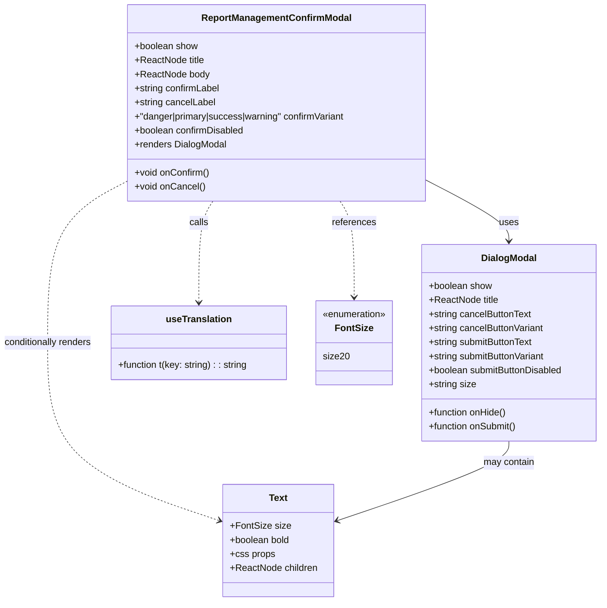

# Diagram: web/portal/src/pages/administration/report-management/components/molecules/ReportManagement.ConfirmModal.molecule.tsx

> Auto-generated by Obscura crawlers

## Mermaid

### SVG

<svg id="container" width="1047.8046875" xmlns="http://www.w3.org/2000/svg" class="classDiagram" height="1028" viewBox="0 0 1047.8046875 1028" role="graphics-document document" aria-roledescription="class"><g><defs><marker id="container_class-aggregationStart" class="marker aggregation class" refX="18" refY="7" markerWidth="190" markerHeight="240" orient="auto"><path d="M 18,7 L9,13 L1,7 L9,1 Z"></path></marker></defs><defs><marker id="container_class-aggregationEnd" class="marker aggregation class" refX="1" refY="7" markerWidth="20" markerHeight="28" orient="auto"><path d="M 18,7 L9,13 L1,7 L9,1 Z"></path></marker></defs><defs><marker id="container_class-extensionStart" class="marker extension class" refX="18" refY="7" markerWidth="190" markerHeight="240" orient="auto"><path d="M 1,7 L18,13 V 1 Z"></path></marker></defs><defs><marker id="container_class-extensionEnd" class="marker extension class" refX="1" refY="7" markerWidth="20" markerHeight="28" orient="auto"><path d="M 1,1 V 13 L18,7 Z"></path></marker></defs><defs><marker id="container_class-compositionStart" class="marker composition class" refX="18" refY="7" markerWidth="190" markerHeight="240" orient="auto"><path d="M 18,7 L9,13 L1,7 L9,1 Z"></path></marker></defs><defs><marker id="container_class-compositionEnd" class="marker composition class" refX="1" refY="7" markerWidth="20" markerHeight="28" orient="auto"><path d="M 18,7 L9,13 L1,7 L9,1 Z"></path></marker></defs><defs><marker id="container_class-dependencyStart" class="marker dependency class" refX="6" refY="7" markerWidth="190" markerHeight="240" orient="auto"><path d="M 5,7 L9,13 L1,7 L9,1 Z"></path></marker></defs><defs><marker id="container_class-dependencyEnd" class="marker dependency class" refX="13" refY="7" markerWidth="20" markerHeight="28" orient="auto"><path d="M 18,7 L9,13 L14,7 L9,1 Z"></path></marker></defs><defs><marker id="container_class-lollipopStart" class="marker lollipop class" refX="13" refY="7" markerWidth="190" markerHeight="240" orient="auto"><circle stroke="black" fill="transparent" cx="7" cy="7" r="6"></circle></marker></defs><defs><marker id="container_class-lollipopEnd" class="marker lollipop class" refX="1" refY="7" markerWidth="190" markerHeight="240" orient="auto"><circle stroke="black" fill="transparent" cx="7" cy="7" r="6"></circle></marker></defs><g class="root"><g class="clusters"></g><g class="edgePaths"><path d="M742.662,307.342L766.862,319.618C791.061,331.895,839.46,356.447,863.66,373.89C887.859,391.333,887.859,401.667,887.859,406.833L887.859,412" id="id_ReportManagementConfirmModal_DialogModal_1" class="edge-thickness-normal edge-pattern-solid relation" style=";;;" data-edge="true" data-et="edge" data-id="id_ReportManagementConfirmModal_DialogModal_1" data-points="W3sieCI6NzQyLjY2MjEwOTM3NSwieSI6MzA3LjM0MjA0MjgxMjc0NjJ9LHsieCI6ODg3Ljg1OTM3NSwieSI6MzgxfSx7IngiOjg4Ny44NTkzNzUsInkiOjQxOH1d" marker-end="url(#container_class-dependencyEnd)"></path><path d="M224.85,309.187L201.583,321.156C178.316,333.125,131.783,357.062,108.517,403.198C85.25,449.333,85.25,517.667,85.25,586C85.25,654.333,85.25,722.667,135.368,773.443C185.486,824.22,285.721,857.44,335.839,874.05L385.957,890.66" id="id_ReportManagementConfirmModal_Text_2" class="edge-thickness-normal edge-pattern-dashed relation" style=";;;" data-edge="true" data-et="edge" data-id="id_ReportManagementConfirmModal_Text_2" data-points="W3sieCI6MjI0Ljg0OTYwOTM3NSwieSI6MzA5LjE4Njk1MzIxODgxMDQ2fSx7IngiOjg1LjI1LCJ5IjozODF9LHsieCI6ODUuMjUsInkiOjU4Nn0seyJ4Ijo4NS4yNSwieSI6NzkxfSx7IngiOjM5MS42NTIzNDM3NSwieSI6ODkyLjU0NzU1OTcxNzMyODJ9XQ==" marker-end="url(#container_class-dependencyEnd)"></path><path d="M373.447,344L369.398,350.167C365.349,356.333,357.25,368.667,353.201,397.5C349.152,426.333,349.152,471.667,349.152,494.333L349.152,517" id="id_ReportManagementConfirmModal_useTranslation_3" class="edge-thickness-normal edge-pattern-dashed relation" style=";;;" data-edge="true" data-et="edge" data-id="id_ReportManagementConfirmModal_useTranslation_3" data-points="W3sieCI6MzczLjQ0NjYzNjgxNDAyNDQsInkiOjM0NH0seyJ4IjozNDkuMTUyMzQzNzUsInkiOjM4MX0seyJ4IjozNDkuMTUyMzQzNzUsInkiOjUyM31d" marker-end="url(#container_class-dependencyEnd)"></path><path d="M594.065,344L598.114,350.167C602.163,356.333,610.261,368.667,614.31,396C618.359,423.333,618.359,465.667,618.359,486.833L618.359,508" id="id_ReportManagementConfirmModal_FontSize_4" class="edge-thickness-normal edge-pattern-dashed relation" style=";;;" data-edge="true" data-et="edge" data-id="id_ReportManagementConfirmModal_FontSize_4" data-points="W3sieCI6NTk0LjA2NTA4MTkzNTk3NTYsInkiOjM0NH0seyJ4Ijo2MTguMzU5Mzc1LCJ5IjozODF9LHsieCI6NjE4LjM1OTM3NSwieSI6NTE0fV0=" marker-end="url(#container_class-dependencyEnd)"></path><path d="M887.859,754L887.859,760.167C887.859,766.333,887.859,778.667,837.742,801.443C787.624,824.22,687.388,857.44,637.27,874.05L587.152,890.66" id="id_DialogModal_Text_5" class="edge-thickness-normal edge-pattern-solid relation" style=";;;" data-edge="true" data-et="edge" data-id="id_DialogModal_Text_5" data-points="W3sieCI6ODg3Ljg1OTM3NSwieSI6NzU0fSx7IngiOjg4Ny44NTkzNzUsInkiOjc5MX0seyJ4Ijo1ODEuNDU3MDMxMjUsInkiOjg5Mi41NDc1NTk3MTczMjgyfV0=" marker-end="url(#container_class-dependencyEnd)"></path></g><g class="edgeLabels"><g class="edgeLabel" transform="translate(887.859375, 381)"><g class="label" data-id="id_ReportManagementConfirmModal_DialogModal_1" transform="translate(-16.4921875, -12)"><foreignObject width="32.984375" height="24">

uses

</foreignObject></g></g><g class="edgeLabel" transform="translate(85.25, 586)"><g class="label" data-id="id_ReportManagementConfirmModal_Text_2" transform="translate(-77.25, -12)"><foreignObject width="154.5" height="24">

conditionally renders

</foreignObject></g></g><g class="edgeLabel" transform="translate(349.15234375, 381)"><g class="label" data-id="id_ReportManagementConfirmModal_useTranslation_3" transform="translate(-16.4453125, -12)"><foreignObject width="32.890625" height="24">

calls

</foreignObject></g></g><g class="edgeLabel" transform="translate(618.359375, 381)"><g class="label" data-id="id_ReportManagementConfirmModal_FontSize_4" transform="translate(-37.828125, -12)"><foreignObject width="75.65625" height="24">

references

</foreignObject></g></g><g class="edgeLabel" transform="translate(887.859375, 791)"><g class="label" data-id="id_DialogModal_Text_5" transform="translate(-44.296875, -12)"><foreignObject width="88.59375" height="24">

may contain

</foreignObject></g></g></g><g class="nodes"><g class="node default" id="classId-ReportManagementConfirmModal-0" transform="translate(483.755859375, 176)"><g class="basic label-container"><path d="M-258.90625 -168 L258.90625 -168 L258.90625 168 L-258.90625 168" stroke="none" stroke-width="0" fill="#ECECFF" style=""></path><path d="M-258.90625 -168 C-128.24140155988266 -168, 2.4234468802346782 -168, 258.90625 -168 M-258.90625 -168 C-101.70022660944102 -168, 55.505796781117965 -168, 258.90625 -168 M258.90625 -168 C258.90625 -46.984367870526285, 258.90625 74.03126425894743, 258.90625 168 M258.90625 -168 C258.90625 -37.46174076901622, 258.90625 93.07651846196757, 258.90625 168 M258.90625 168 C102.2762163231586 168, -54.353817353682814 168, -258.90625 168 M258.90625 168 C67.32834947506751 168, -124.24955104986498 168, -258.90625 168 M-258.90625 168 C-258.90625 36.2919521568065, -258.90625 -95.416095686387, -258.90625 -168 M-258.90625 168 C-258.90625 88.2869089235055, -258.90625 8.573817847010986, -258.90625 -168" stroke="#9370DB" stroke-width="1.3" fill="none" stroke-dasharray="0 0" style=""></path></g><g class="annotation-group text" transform="translate(0, -144)"></g><g class="label-group text" transform="translate(-123.03125, -144)"><g class="label" style="font-weight: bolder" transform="translate(0,-12)"><foreignObject width="246.0625" height="24">

ReportManagementConfirmModal

</foreignObject></g></g><g class="members-group text" transform="translate(-246.90625, -96)"><g class="label" style="" transform="translate(0,-12)"><foreignObject width="109.34375" height="24">

+boolean show

</foreignObject></g><g class="label" style="" transform="translate(0,12)"><foreignObject width="120.15625" height="24">

+ReactNode title

</foreignObject></g><g class="label" style="" transform="translate(0,36)"><foreignObject width="127.203125" height="24">

+ReactNode body

</foreignObject></g><g class="label" style="" transform="translate(0,60)"><foreignObject width="148.421875" height="24">

+string confirmLabel

</foreignObject></g><g class="label" style="" transform="translate(0,84)"><foreignObject width="139.59375" height="24">

+string cancelLabel

</foreignObject></g><g class="label" style="" transform="translate(0,108)"><foreignObject width="370.78125" height="24">

+"danger|primary|success|warning" confirmVariant

</foreignObject></g><g class="label" style="" transform="translate(0,132)"><foreignObject width="190.046875" height="24">

+boolean confirmDisabled

</foreignObject></g><g class="label" style="" transform="translate(0,156)"><foreignObject width="157.9375" height="24">

+renders DialogModal

</foreignObject></g></g><g class="methods-group text" transform="translate(-246.90625, 120)"><g class="label" style="" transform="translate(0,-12)"><foreignObject width="128.84375" height="24">

+void onConfirm()

</foreignObject></g><g class="label" style="" transform="translate(0,12)"><foreignObject width="120.015625" height="24">

+void onCancel()

</foreignObject></g></g><g class="divider" style=""><path d="M-258.90625 -120 C-82.28391129502498 -120, 94.33842740995004 -120, 258.90625 -120 M-258.90625 -120 C-131.86817468231393 -120, -4.83009936462787 -120, 258.90625 -120" stroke="#9370DB" stroke-width="1.3" fill="none" stroke-dasharray="0 0" style=""></path></g><g class="divider" style=""><path d="M-258.90625 96 C-98.55819803368303 96, 61.789853932633946 96, 258.90625 96 M-258.90625 96 C-54.09154627630744 96, 150.72315744738512 96, 258.90625 96" stroke="#9370DB" stroke-width="1.3" fill="none" stroke-dasharray="0 0" style=""></path></g></g><g class="node default" id="classId-DialogModal-1" transform="translate(887.859375, 586)"><g class="basic label-container"><path d="M-151.9453125 -168 L151.9453125 -168 L151.9453125 168 L-151.9453125 168" stroke="none" stroke-width="0" fill="#ECECFF" style=""></path><path d="M-151.9453125 -168 C-60.59914462477667 -168, 30.74702325044666 -168, 151.9453125 -168 M-151.9453125 -168 C-59.140922280895964 -168, 33.66346793820807 -168, 151.9453125 -168 M151.9453125 -168 C151.9453125 -95.94951939119919, 151.9453125 -23.899038782398378, 151.9453125 168 M151.9453125 -168 C151.9453125 -73.74076084378662, 151.9453125 20.518478312426765, 151.9453125 168 M151.9453125 168 C70.10901978043616 168, -11.727272939127687 168, -151.9453125 168 M151.9453125 168 C61.68306043975643 168, -28.579191620487137 168, -151.9453125 168 M-151.9453125 168 C-151.9453125 46.624859243811414, -151.9453125 -74.75028151237717, -151.9453125 -168 M-151.9453125 168 C-151.9453125 84.18359515055236, -151.9453125 0.3671903011047277, -151.9453125 -168" stroke="#9370DB" stroke-width="1.3" fill="none" stroke-dasharray="0 0" style=""></path></g><g class="annotation-group text" transform="translate(0, -144)"></g><g class="label-group text" transform="translate(-45.625, -144)"><g class="label" style="font-weight: bolder" transform="translate(0,-12)"><foreignObject width="91.25" height="24">

DialogModal

</foreignObject></g></g><g class="members-group text" transform="translate(-139.9453125, -96)"><g class="label" style="" transform="translate(0,-12)"><foreignObject width="109.34375" height="24">

+boolean show

</foreignObject></g><g class="label" style="" transform="translate(0,12)"><foreignObject width="120.15625" height="24">

+ReactNode title

</foreignObject></g><g class="label" style="" transform="translate(0,36)"><foreignObject width="178.75" height="24">

+string cancelButtonText

</foreignObject></g><g class="label" style="" transform="translate(0,60)"><foreignObject width="200.75" height="24">

+string cancelButtonVariant

</foreignObject></g><g class="label" style="" transform="translate(0,84)"><foreignObject width="182.734375" height="24">

+string submitButtonText

</foreignObject></g><g class="label" style="" transform="translate(0,108)"><foreignObject width="204.734375" height="24">

+string submitButtonVariant

</foreignObject></g><g class="label" style="" transform="translate(0,132)"><foreignObject width="234.265625" height="24">

+boolean submitButtonDisabled

</foreignObject></g><g class="label" style="" transform="translate(0,156)"><foreignObject width="81.453125" height="24">

+string size

</foreignObject></g></g><g class="methods-group text" transform="translate(-139.9453125, 120)"><g class="label" style="" transform="translate(0,-12)"><foreignObject width="135.46875" height="24">

+function onHide()

</foreignObject></g><g class="label" style="" transform="translate(0,12)"><foreignObject width="153.3125" height="24">

+function onSubmit()

</foreignObject></g></g><g class="divider" style=""><path d="M-151.9453125 -120 C-75.88748342310622 -120, 0.17034565378756383 -120, 151.9453125 -120 M-151.9453125 -120 C-55.52597606113838 -120, 40.89336037772324 -120, 151.9453125 -120" stroke="#9370DB" stroke-width="1.3" fill="none" stroke-dasharray="0 0" style=""></path></g><g class="divider" style=""><path d="M-151.9453125 96 C-83.20178652252534 96, -14.458260545050678 96, 151.9453125 96 M-151.9453125 96 C-87.19508164667023 96, -22.444850793340464 96, 151.9453125 96" stroke="#9370DB" stroke-width="1.3" fill="none" stroke-dasharray="0 0" style=""></path></g></g><g class="node default" id="classId-Text-2" transform="translate(486.5546875, 924)"><g class="basic label-container"><path d="M-94.90234375 -96 L94.90234375 -96 L94.90234375 96 L-94.90234375 96" stroke="none" stroke-width="0" fill="#ECECFF" style=""></path><path d="M-94.90234375 -96 C-27.717814136484293 -96, 39.466715477031414 -96, 94.90234375 -96 M-94.90234375 -96 C-23.34122974487829 -96, 48.21988426024342 -96, 94.90234375 -96 M94.90234375 -96 C94.90234375 -23.979947824291884, 94.90234375 48.04010435141623, 94.90234375 96 M94.90234375 -96 C94.90234375 -56.51769906699439, 94.90234375 -17.035398133988778, 94.90234375 96 M94.90234375 96 C23.006616374808587 96, -48.889111000382826 96, -94.90234375 96 M94.90234375 96 C24.26119779641587 96, -46.37994815716826 96, -94.90234375 96 M-94.90234375 96 C-94.90234375 29.72353506410721, -94.90234375 -36.55292987178558, -94.90234375 -96 M-94.90234375 96 C-94.90234375 31.43547249704733, -94.90234375 -33.12905500590534, -94.90234375 -96" stroke="#9370DB" stroke-width="1.3" fill="none" stroke-dasharray="0 0" style=""></path></g><g class="annotation-group text" transform="translate(0, -72)"></g><g class="label-group text" transform="translate(-15.3828125, -72)"><g class="label" style="font-weight: bolder" transform="translate(0,-12)"><foreignObject width="30.765625" height="24">

Text

</foreignObject></g></g><g class="members-group text" transform="translate(-82.90234375, -24)"><g class="label" style="" transform="translate(0,-12)"><foreignObject width="100.4375" height="24">

+FontSize size

</foreignObject></g><g class="label" style="" transform="translate(0,12)"><foreignObject width="104.703125" height="24">

+boolean bold

</foreignObject></g><g class="label" style="" transform="translate(0,36)"><foreignObject width="76.1875" height="24">

+css props

</foreignObject></g><g class="label" style="" transform="translate(0,60)"><foreignObject width="150.421875" height="24">

+ReactNode children

</foreignObject></g></g><g class="methods-group text" transform="translate(-82.90234375, 96)"></g><g class="divider" style=""><path d="M-94.90234375 -48 C-32.16747801749883 -48, 30.56738771500234 -48, 94.90234375 -48 M-94.90234375 -48 C-53.22426013239369 -48, -11.546176514787376 -48, 94.90234375 -48" stroke="#9370DB" stroke-width="1.3" fill="none" stroke-dasharray="0 0" style=""></path></g><g class="divider" style=""><path d="M-94.90234375 72 C-33.00871402679523 72, 28.884915696409536 72, 94.90234375 72 M-94.90234375 72 C-46.74917071446197 72, 1.4040023210760637 72, 94.90234375 72" stroke="#9370DB" stroke-width="1.3" fill="none" stroke-dasharray="0 0" style=""></path></g></g><g class="node default" id="classId-useTranslation-3" transform="translate(349.15234375, 586)"><g class="basic label-container"><path d="M-151.65234375 -63 L151.65234375 -63 L151.65234375 63 L-151.65234375 63" stroke="none" stroke-width="0" fill="#ECECFF" style=""></path><path d="M-151.65234375 -63 C-50.36180147073492 -63, 50.928740808530165 -63, 151.65234375 -63 M-151.65234375 -63 C-82.92782294090183 -63, -14.203302131803667 -63, 151.65234375 -63 M151.65234375 -63 C151.65234375 -12.96430834232504, 151.65234375 37.07138331534992, 151.65234375 63 M151.65234375 -63 C151.65234375 -37.0435445775008, 151.65234375 -11.087089155001607, 151.65234375 63 M151.65234375 63 C56.07454899097799 63, -39.503245768044025 63, -151.65234375 63 M151.65234375 63 C37.08358581678607 63, -77.48517211642786 63, -151.65234375 63 M-151.65234375 63 C-151.65234375 35.75657582347378, -151.65234375 8.51315164694757, -151.65234375 -63 M-151.65234375 63 C-151.65234375 35.414501115269786, -151.65234375 7.829002230539565, -151.65234375 -63" stroke="#9370DB" stroke-width="1.3" fill="none" stroke-dasharray="0 0" style=""></path></g><g class="annotation-group text" transform="translate(0, -39)"></g><g class="label-group text" transform="translate(-54.0859375, -39)"><g class="label" style="font-weight: bolder" transform="translate(0,-12)"><foreignObject width="108.171875" height="24">

useTranslation

</foreignObject></g></g><g class="members-group text" transform="translate(-139.65234375, 9)"></g><g class="methods-group text" transform="translate(-139.65234375, 39)"><g class="label" style="" transform="translate(0,-12)"><foreignObject width="225.21875" height="24">

+function t(key: string) : : string

</foreignObject></g></g><g class="divider" style=""><path d="M-151.65234375 -15 C-72.65427696911414 -15, 6.343789811771728 -15, 151.65234375 -15 M-151.65234375 -15 C-41.66904524559784 -15, 68.31425325880431 -15, 151.65234375 -15" stroke="#9370DB" stroke-width="1.3" fill="none" stroke-dasharray="0 0" style=""></path></g><g class="divider" style=""><path d="M-151.65234375 9 C-73.51760478812396 9, 4.617134173752078 9, 151.65234375 9 M-151.65234375 9 C-62.6223074914261 9, 26.407728767147802 9, 151.65234375 9" stroke="#9370DB" stroke-width="1.3" fill="none" stroke-dasharray="0 0" style=""></path></g></g><g class="node default" id="classId-FontSize-4" transform="translate(618.359375, 586)"><g class="basic label-container"><path d="M-67.5546875 -72 L67.5546875 -72 L67.5546875 72 L-67.5546875 72" stroke="none" stroke-width="0" fill="#ECECFF" style=""></path><path d="M-67.5546875 -72 C-24.547775579230773 -72, 18.459136341538454 -72, 67.5546875 -72 M-67.5546875 -72 C-29.347815574913966 -72, 8.859056350172068 -72, 67.5546875 -72 M67.5546875 -72 C67.5546875 -20.320185752457718, 67.5546875 31.359628495084564, 67.5546875 72 M67.5546875 -72 C67.5546875 -25.40598364186627, 67.5546875 21.188032716267458, 67.5546875 72 M67.5546875 72 C32.77202264683173 72, -2.0106422063365414 72, -67.5546875 72 M67.5546875 72 C24.514382614974274 72, -18.525922270051453 72, -67.5546875 72 M-67.5546875 72 C-67.5546875 31.225988382545268, -67.5546875 -9.548023234909465, -67.5546875 -72 M-67.5546875 72 C-67.5546875 22.20967965545062, -67.5546875 -27.580640689098757, -67.5546875 -72" stroke="#9370DB" stroke-width="1.3" fill="none" stroke-dasharray="0 0" style=""></path></g><g class="annotation-group text" transform="translate(-55.5546875, -48)"><g class="label" style="" transform="translate(0,-12)"><foreignObject width="111.109375" height="24">

«enumeration»

</foreignObject></g></g><g class="label-group text" transform="translate(-30.84375, -24)"><g class="label" style="font-weight: bolder" transform="translate(0,-12)"><foreignObject width="61.6875" height="24">

FontSize

</foreignObject></g></g><g class="members-group text" transform="translate(-55.5546875, 24)"><g class="label" style="" transform="translate(0,-12)"><foreignObject width="44.125" height="24">

size20

</foreignObject></g></g><g class="methods-group text" transform="translate(-55.5546875, 72)"></g><g class="divider" style=""><path d="M-67.5546875 0 C-22.97840677303911 0, 21.597873953921777 0, 67.5546875 0 M-67.5546875 0 C-36.29774071642282 0, -5.040793932845638 0, 67.5546875 0" stroke="#9370DB" stroke-width="1.3" fill="none" stroke-dasharray="0 0" style=""></path></g><g class="divider" style=""><path d="M-67.5546875 48 C-36.80790078245762 48, -6.061114064915245 48, 67.5546875 48 M-67.5546875 48 C-15.070229968046867 48, 37.414227563906266 48, 67.5546875 48" stroke="#9370DB" stroke-width="1.3" fill="none" stroke-dasharray="0 0" style=""></path></g></g></g></g></g></svg>
