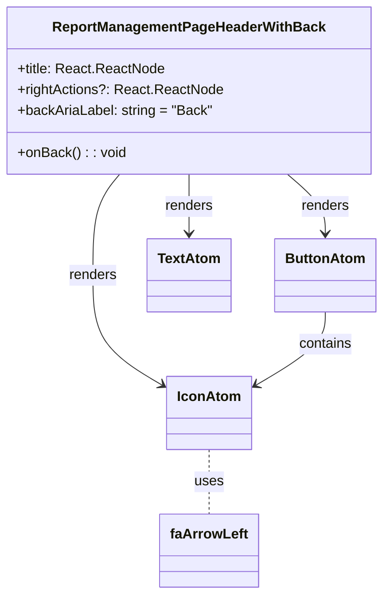

# Diagram: web/portal/src/pages/administration/report-management/components/molecules/ReportManagement.PageHeaderWithBack.molecule.tsx

> Auto-generated by Obscura crawlers

## Mermaid

### SVG

<svg id="container" width="427.99609375" xmlns="http://www.w3.org/2000/svg" class="classDiagram" height="682" viewBox="0 0 427.99609375 682" role="graphics-document document" aria-roledescription="class"><g><defs><marker id="container_class-aggregationStart" class="marker aggregation class" refX="18" refY="7" markerWidth="190" markerHeight="240" orient="auto"><path d="M 18,7 L9,13 L1,7 L9,1 Z"></path></marker></defs><defs><marker id="container_class-aggregationEnd" class="marker aggregation class" refX="1" refY="7" markerWidth="20" markerHeight="28" orient="auto"><path d="M 18,7 L9,13 L1,7 L9,1 Z"></path></marker></defs><defs><marker id="container_class-extensionStart" class="marker extension class" refX="18" refY="7" markerWidth="190" markerHeight="240" orient="auto"><path d="M 1,7 L18,13 V 1 Z"></path></marker></defs><defs><marker id="container_class-extensionEnd" class="marker extension class" refX="1" refY="7" markerWidth="20" markerHeight="28" orient="auto"><path d="M 1,1 V 13 L18,7 Z"></path></marker></defs><defs><marker id="container_class-compositionStart" class="marker composition class" refX="18" refY="7" markerWidth="190" markerHeight="240" orient="auto"><path d="M 18,7 L9,13 L1,7 L9,1 Z"></path></marker></defs><defs><marker id="container_class-compositionEnd" class="marker composition class" refX="1" refY="7" markerWidth="20" markerHeight="28" orient="auto"><path d="M 18,7 L9,13 L1,7 L9,1 Z"></path></marker></defs><defs><marker id="container_class-dependencyStart" class="marker dependency class" refX="6" refY="7" markerWidth="190" markerHeight="240" orient="auto"><path d="M 5,7 L9,13 L1,7 L9,1 Z"></path></marker></defs><defs><marker id="container_class-dependencyEnd" class="marker dependency class" refX="13" refY="7" markerWidth="20" markerHeight="28" orient="auto"><path d="M 18,7 L9,13 L14,7 L9,1 Z"></path></marker></defs><defs><marker id="container_class-lollipopStart" class="marker lollipop class" refX="13" refY="7" markerWidth="190" markerHeight="240" orient="auto"><circle stroke="black" fill="transparent" cx="7" cy="7" r="6"></circle></marker></defs><defs><marker id="container_class-lollipopEnd" class="marker lollipop class" refX="1" refY="7" markerWidth="190" markerHeight="240" orient="auto"><circle stroke="black" fill="transparent" cx="7" cy="7" r="6"></circle></marker></defs><g class="root"><g class="clusters"></g><g class="edgePaths"><path d="M321.668,200L328.734,206.167C335.801,212.333,349.933,224.667,357,236C364.066,247.333,364.066,257.667,364.066,262.833L364.066,268" id="id_ReportManagementPageHeaderWithBack_ButtonAtom_1" class="edge-thickness-normal edge-pattern-solid relation" style=";;;" data-edge="true" data-et="edge" data-id="id_ReportManagementPageHeaderWithBack_ButtonAtom_1" data-points="W3sieCI6MzIxLjY2NzY3NTA0Njk5MjUsInkiOjIwMH0seyJ4IjozNjQuMDY2NDA2MjUsInkiOjIzN30seyJ4IjozNjQuMDY2NDA2MjUsInkiOjI3NH1d" marker-end="url(#container_class-dependencyEnd)"></path><path d="M132.82,200L127.756,206.167C122.691,212.333,112.562,224.667,107.498,244C102.434,263.333,102.434,289.667,102.434,316C102.434,342.333,102.434,368.667,115.646,389.812C128.858,410.958,155.283,426.916,168.495,434.895L181.708,442.874" id="id_ReportManagementPageHeaderWithBack_IconAtom_2" class="edge-thickness-normal edge-pattern-solid relation" style=";;;" data-edge="true" data-et="edge" data-id="id_ReportManagementPageHeaderWithBack_IconAtom_2" data-points="W3sieCI6MTMyLjgxOTkzMDY4NjA5MDIzLCJ5IjoyMDB9LHsieCI6MTAyLjQzMzU5Mzc1LCJ5IjoyMzd9LHsieCI6MTAyLjQzMzU5Mzc1LCJ5IjozMTZ9LHsieCI6MTAyLjQzMzU5Mzc1LCJ5IjozOTV9LHsieCI6MTg2Ljg0Mzc1LCJ5Ijo0NDUuOTc1Mjc1NDYzNTg1MDR9XQ==" marker-end="url(#container_class-dependencyEnd)"></path><path d="M211.66,200L211.66,206.167C211.66,212.333,211.66,224.667,211.66,236C211.66,247.333,211.66,257.667,211.66,262.833L211.66,268" id="id_ReportManagementPageHeaderWithBack_TextAtom_3" class="edge-thickness-normal edge-pattern-solid relation" style=";;;" data-edge="true" data-et="edge" data-id="id_ReportManagementPageHeaderWithBack_TextAtom_3" data-points="W3sieCI6MjExLjY2MDE1NjI1LCJ5IjoyMDB9LHsieCI6MjExLjY2MDE1NjI1LCJ5IjoyMzd9LHsieCI6MjExLjY2MDE1NjI1LCJ5IjoyNzR9XQ==" marker-end="url(#container_class-dependencyEnd)"></path><path d="M364.066,358L364.066,364.167C364.066,370.333,364.066,382.667,350.854,396.812C337.642,410.958,311.217,426.916,298.005,434.895L284.792,442.874" id="id_ButtonAtom_IconAtom_4" class="edge-thickness-normal edge-pattern-solid relation" style=";;;" data-edge="true" data-et="edge" data-id="id_ButtonAtom_IconAtom_4" data-points="W3sieCI6MzY0LjA2NjQwNjI1LCJ5IjozNTh9LHsieCI6MzY0LjA2NjQwNjI1LCJ5IjozOTV9LHsieCI6Mjc5LjY1NjI1LCJ5Ijo0NDUuOTc1Mjc1NDYzNTg1MDR9XQ==" marker-end="url(#container_class-dependencyEnd)"></path><path d="M233.25,516L233.25,522.167C233.25,528.333,233.25,540.667,233.25,553C233.25,565.333,233.25,577.667,233.25,583.833L233.25,590" id="id_IconAtom_faArrowLeft_5" class="edge-thickness-normal edge-pattern-dashed relation" style=";;;" data-edge="true" data-et="edge" data-id="id_IconAtom_faArrowLeft_5" data-points="W3sieCI6MjMzLjI1LCJ5Ijo1MTZ9LHsieCI6MjMzLjI1LCJ5Ijo1NTN9LHsieCI6MjMzLjI1LCJ5Ijo1OTB9XQ=="></path></g><g class="edgeLabels"><g class="edgeLabel" transform="translate(364.06640625, 237)"><g class="label" data-id="id_ReportManagementPageHeaderWithBack_ButtonAtom_1" transform="translate(-27.75, -12)"><foreignObject width="55.5" height="24">

renders

</foreignObject></g></g><g class="edgeLabel" transform="translate(102.43359375, 316)"><g class="label" data-id="id_ReportManagementPageHeaderWithBack_IconAtom_2" transform="translate(-27.75, -12)"><foreignObject width="55.5" height="24">

renders

</foreignObject></g></g><g class="edgeLabel" transform="translate(211.66015625, 237)"><g class="label" data-id="id_ReportManagementPageHeaderWithBack_TextAtom_3" transform="translate(-27.75, -12)"><foreignObject width="55.5" height="24">

renders

</foreignObject></g></g><g class="edgeLabel" transform="translate(364.06640625, 395)"><g class="label" data-id="id_ButtonAtom_IconAtom_4" transform="translate(-30.890625, -12)"><foreignObject width="61.78125" height="24">

contains

</foreignObject></g></g><g class="edgeLabel" transform="translate(233.25, 553)"><g class="label" data-id="id_IconAtom_faArrowLeft_5" transform="translate(-16.4921875, -12)"><foreignObject width="32.984375" height="24">

uses

</foreignObject></g></g></g><g class="nodes"><g class="node default" id="classId-ReportManagementPageHeaderWithBack-0" transform="translate(211.66015625, 104)"><g class="basic label-container"><path d="M-203.66015625 -96 L203.66015625 -96 L203.66015625 96 L-203.66015625 96" stroke="none" stroke-width="0" fill="#ECECFF" style=""></path><path d="M-203.66015625 -96 C-62.11700003370541 -96, 79.42615618258918 -96, 203.66015625 -96 M-203.66015625 -96 C-48.71984508036286 -96, 106.22046608927428 -96, 203.66015625 -96 M203.66015625 -96 C203.66015625 -43.29007652723622, 203.66015625 9.419846945527567, 203.66015625 96 M203.66015625 -96 C203.66015625 -41.04957452810598, 203.66015625 13.900850943788043, 203.66015625 96 M203.66015625 96 C70.30510779051295 96, -63.0499406689741 96, -203.66015625 96 M203.66015625 96 C91.43143364335744 96, -20.797288963285126 96, -203.66015625 96 M-203.66015625 96 C-203.66015625 45.08332463106384, -203.66015625 -5.833350737872323, -203.66015625 -96 M-203.66015625 96 C-203.66015625 29.357717699954392, -203.66015625 -37.284564600091215, -203.66015625 -96" stroke="#9370DB" stroke-width="1.3" fill="none" stroke-dasharray="0 0" style=""></path></g><g class="annotation-group text" transform="translate(0, -72)"></g><g class="label-group text" transform="translate(-150.2109375, -72)"><g class="label" style="font-weight: bolder" transform="translate(0,-12)"><foreignObject width="300.421875" height="24">

ReportManagementPageHeaderWithBack

</foreignObject></g></g><g class="members-group text" transform="translate(-191.66015625, -24)"><g class="label" style="" transform="translate(0,-12)"><foreignObject width="167.9375" height="24">

+title: React.ReactNode

</foreignObject></g><g class="label" style="" transform="translate(0,12)"><foreignObject width="233.109375" height="24">

+rightActions?: React.ReactNode

</foreignObject></g><g class="label" style="" transform="translate(0,36)"><foreignObject width="223.25" height="24">

+backAriaLabel: string = "Back"

</foreignObject></g></g><g class="methods-group text" transform="translate(-191.66015625, 72)"><g class="label" style="" transform="translate(0,-12)"><foreignObject width="122.984375" height="24">

+onBack() : : void

</foreignObject></g></g><g class="divider" style=""><path d="M-203.66015625 -48 C-47.01837491466162 -48, 109.62340642067676 -48, 203.66015625 -48 M-203.66015625 -48 C-88.13262186909056 -48, 27.394912511818887 -48, 203.66015625 -48" stroke="#9370DB" stroke-width="1.3" fill="none" stroke-dasharray="0 0" style=""></path></g><g class="divider" style=""><path d="M-203.66015625 48 C-55.40203964901451 48, 92.85607695197098 48, 203.66015625 48 M-203.66015625 48 C-64.15288367994853 48, 75.35438889010294 48, 203.66015625 48" stroke="#9370DB" stroke-width="1.3" fill="none" stroke-dasharray="0 0" style=""></path></g></g><g class="node default" id="classId-ButtonAtom-1" transform="translate(364.06640625, 316)"><g class="basic label-container"><path d="M-55.9296875 -42 L55.9296875 -42 L55.9296875 42 L-55.9296875 42" stroke="none" stroke-width="0" fill="#ECECFF" style=""></path><path d="M-55.9296875 -42 C-26.47348277281076 -42, 2.9827219543784835 -42, 55.9296875 -42 M-55.9296875 -42 C-12.054564306934274 -42, 31.82055888613145 -42, 55.9296875 -42 M55.9296875 -42 C55.9296875 -14.108008856433042, 55.9296875 13.783982287133917, 55.9296875 42 M55.9296875 -42 C55.9296875 -8.505304905846437, 55.9296875 24.989390188307127, 55.9296875 42 M55.9296875 42 C17.270646102574915 42, -21.38839529485017 42, -55.9296875 42 M55.9296875 42 C20.05536905997448 42, -15.818949380051038 42, -55.9296875 42 M-55.9296875 42 C-55.9296875 23.385777691359262, -55.9296875 4.771555382718525, -55.9296875 -42 M-55.9296875 42 C-55.9296875 11.072948677576392, -55.9296875 -19.854102644847217, -55.9296875 -42" stroke="#9370DB" stroke-width="1.3" fill="none" stroke-dasharray="0 0" style=""></path></g><g class="annotation-group text" transform="translate(0, -18)"></g><g class="label-group text" transform="translate(-43.9296875, -18)"><g class="label" style="font-weight: bolder" transform="translate(0,-12)"><foreignObject width="87.859375" height="24">

ButtonAtom

</foreignObject></g></g><g class="members-group text" transform="translate(-43.9296875, 30)"></g><g class="methods-group text" transform="translate(-43.9296875, 60)"></g><g class="divider" style=""><path d="M-55.9296875 6 C-15.19505438318562 6, 25.53957873362876 6, 55.9296875 6 M-55.9296875 6 C-24.81012332078089 6, 6.309440858438222 6, 55.9296875 6" stroke="#9370DB" stroke-width="1.3" fill="none" stroke-dasharray="0 0" style=""></path></g><g class="divider" style=""><path d="M-55.9296875 24 C-17.65283826818459 24, 20.624010963630823 24, 55.9296875 24 M-55.9296875 24 C-19.012166060616487 24, 17.905355378767027 24, 55.9296875 24" stroke="#9370DB" stroke-width="1.3" fill="none" stroke-dasharray="0 0" style=""></path></g></g><g class="node default" id="classId-IconAtom-2" transform="translate(233.25, 474)"><g class="basic label-container"><path d="M-46.40625 -42 L46.40625 -42 L46.40625 42 L-46.40625 42" stroke="none" stroke-width="0" fill="#ECECFF" style=""></path><path d="M-46.40625 -42 C-9.419471420650723 -42, 27.567307158698554 -42, 46.40625 -42 M-46.40625 -42 C-16.77319068660015 -42, 12.859868626799702 -42, 46.40625 -42 M46.40625 -42 C46.40625 -15.529233222360126, 46.40625 10.941533555279747, 46.40625 42 M46.40625 -42 C46.40625 -13.221726958448087, 46.40625 15.556546083103825, 46.40625 42 M46.40625 42 C22.075123859637916 42, -2.256002280724168 42, -46.40625 42 M46.40625 42 C14.883894804447575 42, -16.63846039110485 42, -46.40625 42 M-46.40625 42 C-46.40625 16.976236152030957, -46.40625 -8.047527695938086, -46.40625 -42 M-46.40625 42 C-46.40625 11.256089741220372, -46.40625 -19.487820517559257, -46.40625 -42" stroke="#9370DB" stroke-width="1.3" fill="none" stroke-dasharray="0 0" style=""></path></g><g class="annotation-group text" transform="translate(0, -18)"></g><g class="label-group text" transform="translate(-34.40625, -18)"><g class="label" style="font-weight: bolder" transform="translate(0,-12)"><foreignObject width="68.8125" height="24">

IconAtom

</foreignObject></g></g><g class="members-group text" transform="translate(-34.40625, 30)"></g><g class="methods-group text" transform="translate(-34.40625, 60)"></g><g class="divider" style=""><path d="M-46.40625 6 C-18.974319335362217 6, 8.457611329275565 6, 46.40625 6 M-46.40625 6 C-17.613625257148094 6, 11.178999485703812 6, 46.40625 6" stroke="#9370DB" stroke-width="1.3" fill="none" stroke-dasharray="0 0" style=""></path></g><g class="divider" style=""><path d="M-46.40625 24 C-17.445842512557363 24, 11.514564974885275 24, 46.40625 24 M-46.40625 24 C-26.466463316015723 24, -6.526676632031446 24, 46.40625 24" stroke="#9370DB" stroke-width="1.3" fill="none" stroke-dasharray="0 0" style=""></path></g></g><g class="node default" id="classId-TextAtom-3" transform="translate(211.66015625, 316)"><g class="basic label-container"><path d="M-46.4765625 -42 L46.4765625 -42 L46.4765625 42 L-46.4765625 42" stroke="none" stroke-width="0" fill="#ECECFF" style=""></path><path d="M-46.4765625 -42 C-17.47409975910806 -42, 11.528362981783879 -42, 46.4765625 -42 M-46.4765625 -42 C-11.44429965070698 -42, 23.58796319858604 -42, 46.4765625 -42 M46.4765625 -42 C46.4765625 -8.894982602282738, 46.4765625 24.210034795434524, 46.4765625 42 M46.4765625 -42 C46.4765625 -15.850813316331795, 46.4765625 10.29837336733641, 46.4765625 42 M46.4765625 42 C14.846572075092134 42, -16.783418349815733 42, -46.4765625 42 M46.4765625 42 C14.928546393683149 42, -16.619469712633702 42, -46.4765625 42 M-46.4765625 42 C-46.4765625 8.607008458638028, -46.4765625 -24.785983082723945, -46.4765625 -42 M-46.4765625 42 C-46.4765625 10.475860981304809, -46.4765625 -21.048278037390382, -46.4765625 -42" stroke="#9370DB" stroke-width="1.3" fill="none" stroke-dasharray="0 0" style=""></path></g><g class="annotation-group text" transform="translate(0, -18)"></g><g class="label-group text" transform="translate(-34.4765625, -18)"><g class="label" style="font-weight: bolder" transform="translate(0,-12)"><foreignObject width="68.953125" height="24">

TextAtom

</foreignObject></g></g><g class="members-group text" transform="translate(-34.4765625, 30)"></g><g class="methods-group text" transform="translate(-34.4765625, 60)"></g><g class="divider" style=""><path d="M-46.4765625 6 C-24.595128559858956 6, -2.713694619717913 6, 46.4765625 6 M-46.4765625 6 C-21.846634871132235 6, 2.7832927577355306 6, 46.4765625 6" stroke="#9370DB" stroke-width="1.3" fill="none" stroke-dasharray="0 0" style=""></path></g><g class="divider" style=""><path d="M-46.4765625 24 C-27.209502712096523 24, -7.942442924193045 24, 46.4765625 24 M-46.4765625 24 C-12.472424515374989 24, 21.531713469250022 24, 46.4765625 24" stroke="#9370DB" stroke-width="1.3" fill="none" stroke-dasharray="0 0" style=""></path></g></g><g class="node default" id="classId-faArrowLeft-4" transform="translate(233.25, 632)"><g class="basic label-container"><path d="M-54.859375 -42 L54.859375 -42 L54.859375 42 L-54.859375 42" stroke="none" stroke-width="0" fill="#ECECFF" style=""></path><path d="M-54.859375 -42 C-19.249350407208212 -42, 16.360674185583576 -42, 54.859375 -42 M-54.859375 -42 C-31.220034717461587 -42, -7.580694434923174 -42, 54.859375 -42 M54.859375 -42 C54.859375 -19.134464257729636, 54.859375 3.7310714845407276, 54.859375 42 M54.859375 -42 C54.859375 -18.417883369995625, 54.859375 5.16423326000875, 54.859375 42 M54.859375 42 C17.575724141434343 42, -19.707926717131315 42, -54.859375 42 M54.859375 42 C17.603007759192835 42, -19.65335948161433 42, -54.859375 42 M-54.859375 42 C-54.859375 16.949342714595474, -54.859375 -8.101314570809052, -54.859375 -42 M-54.859375 42 C-54.859375 14.571439515326475, -54.859375 -12.85712096934705, -54.859375 -42" stroke="#9370DB" stroke-width="1.3" fill="none" stroke-dasharray="0 0" style=""></path></g><g class="annotation-group text" transform="translate(0, -18)"></g><g class="label-group text" transform="translate(-42.859375, -18)"><g class="label" style="font-weight: bolder" transform="translate(0,-12)"><foreignObject width="85.71875" height="24">

faArrowLeft

</foreignObject></g></g><g class="members-group text" transform="translate(-42.859375, 30)"></g><g class="methods-group text" transform="translate(-42.859375, 60)"></g><g class="divider" style=""><path d="M-54.859375 6 C-17.408920072339036 6, 20.041534855321927 6, 54.859375 6 M-54.859375 6 C-24.729782985081947 6, 5.399809029836106 6, 54.859375 6" stroke="#9370DB" stroke-width="1.3" fill="none" stroke-dasharray="0 0" style=""></path></g><g class="divider" style=""><path d="M-54.859375 24 C-16.57908611804408 24, 21.701202763911837 24, 54.859375 24 M-54.859375 24 C-32.542064784563635 24, -10.224754569127263 24, 54.859375 24" stroke="#9370DB" stroke-width="1.3" fill="none" stroke-dasharray="0 0" style=""></path></g></g></g></g></g></svg>
