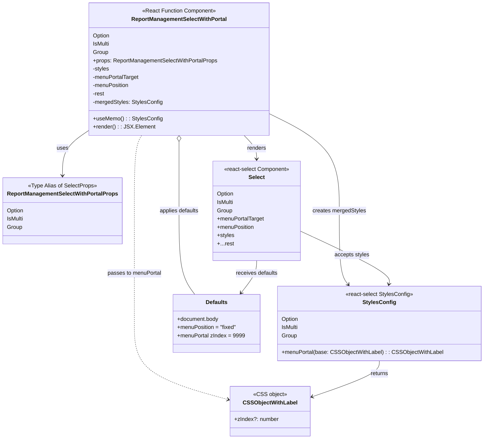

# Diagram: web/portal/src/pages/administration/report-management/components/molecules/ReportManagement.SelectWithPortal.molecule.tsx

> Auto-generated by Obscura crawlers

## Mermaid

### SVG

<svg id="container" width="1375.888671875" xmlns="http://www.w3.org/2000/svg" class="classDiagram" height="1270" viewBox="0 0 1375.888671875 1270" role="graphics-document document" aria-roledescription="class"><g><defs><marker id="container_class-aggregationStart" class="marker aggregation class" refX="18" refY="7" markerWidth="190" markerHeight="240" orient="auto"><path d="M 18,7 L9,13 L1,7 L9,1 Z"></path></marker></defs><defs><marker id="container_class-aggregationEnd" class="marker aggregation class" refX="1" refY="7" markerWidth="20" markerHeight="28" orient="auto"><path d="M 18,7 L9,13 L1,7 L9,1 Z"></path></marker></defs><defs><marker id="container_class-extensionStart" class="marker extension class" refX="18" refY="7" markerWidth="190" markerHeight="240" orient="auto"><path d="M 1,7 L18,13 V 1 Z"></path></marker></defs><defs><marker id="container_class-extensionEnd" class="marker extension class" refX="1" refY="7" markerWidth="20" markerHeight="28" orient="auto"><path d="M 1,1 V 13 L18,7 Z"></path></marker></defs><defs><marker id="container_class-compositionStart" class="marker composition class" refX="18" refY="7" markerWidth="190" markerHeight="240" orient="auto"><path d="M 18,7 L9,13 L1,7 L9,1 Z"></path></marker></defs><defs><marker id="container_class-compositionEnd" class="marker composition class" refX="1" refY="7" markerWidth="20" markerHeight="28" orient="auto"><path d="M 18,7 L9,13 L1,7 L9,1 Z"></path></marker></defs><defs><marker id="container_class-dependencyStart" class="marker dependency class" refX="6" refY="7" markerWidth="190" markerHeight="240" orient="auto"><path d="M 5,7 L9,13 L1,7 L9,1 Z"></path></marker></defs><defs><marker id="container_class-dependencyEnd" class="marker dependency class" refX="13" refY="7" markerWidth="20" markerHeight="28" orient="auto"><path d="M 18,7 L9,13 L14,7 L9,1 Z"></path></marker></defs><defs><marker id="container_class-lollipopStart" class="marker lollipop class" refX="13" refY="7" markerWidth="190" markerHeight="240" orient="auto"><circle stroke="black" fill="transparent" cx="7" cy="7" r="6"></circle></marker></defs><defs><marker id="container_class-lollipopEnd" class="marker lollipop class" refX="1" refY="7" markerWidth="190" markerHeight="240" orient="auto"><circle stroke="black" fill="transparent" cx="7" cy="7" r="6"></circle></marker></defs><g class="root"><g class="clusters"></g><g class="edgePaths"><path d="M245.318,379.913L233.521,388.094C221.723,396.275,198.127,412.638,186.329,433.985C174.531,455.333,174.531,481.667,174.531,494.833L174.531,508" id="id_ReportManagementSelectWithPortal_ReportManagementSelectWithPortalProps_1" class="edge-thickness-normal edge-pattern-solid relation" style=";;;" data-edge="true" data-et="edge" data-id="id_ReportManagementSelectWithPortal_ReportManagementSelectWithPortalProps_1" data-points="W3sieCI6MjQ1LjMxODM1OTM3NSwieSI6Mzc5LjkxMjYwODg5ODc5ODh9LHsieCI6MTc0LjUzMTI1LCJ5Ijo0Mjl9LHsieCI6MTc0LjUzMTI1LCJ5Ijo1MTR9XQ==" marker-end="url(#container_class-dependencyEnd)"></path><path d="M764.209,328.401L798.087,345.167C831.965,361.934,899.722,395.467,933.6,442.4C967.479,489.333,967.479,549.667,967.479,610C967.479,670.333,967.479,730.667,971.604,766.207C975.729,801.747,983.98,812.494,988.105,817.867L992.231,823.241" id="id_ReportManagementSelectWithPortal_StylesConfig_2" class="edge-thickness-normal edge-pattern-solid relation" style=";;;" data-edge="true" data-et="edge" data-id="id_ReportManagementSelectWithPortal_StylesConfig_2" data-points="W3sieCI6NzY0LjIwODk4NDM3NSwieSI6MzI4LjQwMDg0NDIwMjQzOTc3fSx7IngiOjk2Ny40Nzg1MTU2MjUsInkiOjQyOX0seyJ4Ijo5NjcuNDc4NTE1NjI1LCJ5Ijo2MTB9LHsieCI6OTY3LjQ3ODUxNTYyNSwieSI6NzkxfSx7IngiOjk5NS44ODQzODg0Njk4Mjc2LCJ5Ijo4Mjh9XQ==" marker-end="url(#container_class-dependencyEnd)"></path><path d="M396.857,392L393.391,398.167C389.926,404.333,382.994,416.667,379.528,453C376.063,489.333,376.063,549.667,376.063,610C376.063,670.333,376.063,730.667,376.063,785C376.063,839.333,376.063,887.667,376.063,936C376.063,984.333,376.063,1032.667,421.653,1069.524C467.243,1106.381,558.423,1131.762,604.013,1144.452L649.603,1157.143" id="id_ReportManagementSelectWithPortal_CSSObjectWithLabel_3" class="edge-thickness-normal edge-pattern-dashed relation" style=";;;" data-edge="true" data-et="edge" data-id="id_ReportManagementSelectWithPortal_CSSObjectWithLabel_3" data-points="W3sieCI6Mzk2Ljg1NzAxMjQ4NjM1MzcsInkiOjM5Mn0seyJ4IjozNzYuMDYyNSwieSI6NDI5fSx7IngiOjM3Ni4wNjI1LCJ5Ijo2MTB9LHsieCI6Mzc2LjA2MjUsInkiOjc5MX0seyJ4IjozNzYuMDYyNSwieSI6OTM2fSx7IngiOjM3Ni4wNjI1LCJ5IjoxMDgxfSx7IngiOjY1NS4zODI4MTI1LCJ5IjoxMTU4Ljc1MTgyNTU0NTY2ODd9XQ==" marker-end="url(#container_class-dependencyEnd)"></path><path d="M691.022,392L697.005,398.167C702.987,404.333,714.951,416.667,720.934,428C726.916,439.333,726.916,449.667,726.916,454.833L726.916,460" id="id_ReportManagementSelectWithPortal_Select_4" class="edge-thickness-normal edge-pattern-solid relation" style=";;;" data-edge="true" data-et="edge" data-id="id_ReportManagementSelectWithPortal_Select_4" data-points="W3sieCI6NjkxLjAyMjQwNTQ5OTQ1NDIsInkiOjM5Mn0seyJ4Ijo3MjYuOTE2MDE1NjI1LCJ5Ijo0Mjl9LHsieCI6NzI2LjkxNjAxNTYyNSwieSI6NDY2fV0=" marker-end="url(#container_class-dependencyEnd)"></path><path d="M504.764,409.25L504.764,412.542C504.764,415.833,504.764,422.417,504.764,455.875C504.764,489.333,504.764,549.667,504.764,610C504.764,670.333,504.764,730.667,512.535,771C520.306,811.333,535.848,831.667,543.619,841.833L551.39,852" id="id_ReportManagementSelectWithPortal_Defaults_5" class="edge-thickness-normal edge-pattern-solid relation" style=";;;" data-edge="true" data-et="edge" data-id="id_ReportManagementSelectWithPortal_Defaults_5" data-points="W3sieCI6NTA0Ljc2MzY3MTg3NSwieSI6MzkyfSx7IngiOjUwNC43NjM2NzE4NzUsInkiOjQyOX0seyJ4Ijo1MDQuNzYzNjcxODc1LCJ5Ijo2MTB9LHsieCI6NTA0Ljc2MzY3MTg3NSwieSI6NzkxfSx7IngiOjU1MS4zODk1NjA4ODM2MjA3LCJ5Ijo4NTJ9XQ==" marker-start="url(#container_class-aggregationStart)"></path><path d="M1078.799,1044L1078.799,1050.167C1078.799,1056.333,1078.799,1068.667,1046.593,1086.115C1014.386,1103.564,949.974,1126.128,917.767,1137.41L885.561,1148.692" id="id_StylesConfig_CSSObjectWithLabel_6" class="edge-thickness-normal edge-pattern-solid relation" style=";;;" data-edge="true" data-et="edge" data-id="id_StylesConfig_CSSObjectWithLabel_6" data-points="W3sieCI6MTA3OC43OTg4MjgxMjUsInkiOjEwNDR9LHsieCI6MTA3OC43OTg4MjgxMjUsInkiOjEwODF9LHsieCI6ODc5Ljg5ODQzNzUsInkiOjExNTAuNjc1NjI1OTY5MDA0NH1d" marker-end="url(#container_class-dependencyEnd)"></path><path d="M855.283,670.02L898.408,690.183C941.532,710.347,1027.781,750.673,1069.643,776.032C1111.505,801.39,1108.98,811.78,1107.718,816.975L1106.456,822.17" id="id_Select_StylesConfig_7" class="edge-thickness-normal edge-pattern-solid relation" style=";;;" data-edge="true" data-et="edge" data-id="id_Select_StylesConfig_7" data-points="W3sieCI6ODU1LjI4MzIwMzEyNSwieSI6NjcwLjAxOTc5Nzk4Mzg3NX0seyJ4IjoxMTE0LjAyOTI5Njg3NSwieSI6NzkxfSx7IngiOjExMDUuMDM5NDUzMTI1LCJ5Ijo4Mjh9XQ==" marker-end="url(#container_class-dependencyEnd)"></path><path d="M726.916,754L726.916,760.167C726.916,766.333,726.916,778.667,719.72,794.207C712.524,809.747,698.131,828.494,690.935,837.867L683.738,847.241" id="id_Select_Defaults_8" class="edge-thickness-normal edge-pattern-solid relation" style=";;;" data-edge="true" data-et="edge" data-id="id_Select_Defaults_8" data-points="W3sieCI6NzI2LjkxNjAxNTYyNSwieSI6NzU0fSx7IngiOjcyNi45MTYwMTU2MjUsInkiOjc5MX0seyJ4Ijo2ODAuMDg0NzExNzQ1Njg5NywieSI6ODUyfV0=" marker-end="url(#container_class-dependencyEnd)"></path></g><g class="edgeLabels"><g class="edgeLabel" transform="translate(174.53125, 429)"><g class="label" data-id="id_ReportManagementSelectWithPortal_ReportManagementSelectWithPortalProps_1" transform="translate(-16.4921875, -12)"><foreignObject width="32.984375" height="24">

uses

</foreignObject></g></g><g class="edgeLabel" transform="translate(967.478515625, 610)"><g class="label" data-id="id_ReportManagementSelectWithPortal_StylesConfig_2" transform="translate(-77.1953125, -12)"><foreignObject width="154.390625" height="24">

creates mergedStyles

</foreignObject></g></g><g class="edgeLabel" transform="translate(376.0625, 791)"><g class="label" data-id="id_ReportManagementSelectWithPortal_CSSObjectWithLabel_3" transform="translate(-78.2890625, -12)"><foreignObject width="156.578125" height="24">

passes to menuPortal

</foreignObject></g></g><g class="edgeLabel" transform="translate(726.916015625, 429)"><g class="label" data-id="id_ReportManagementSelectWithPortal_Select_4" transform="translate(-27.75, -12)"><foreignObject width="55.5" height="24">

renders

</foreignObject></g></g><g class="edgeLabel" transform="translate(504.763671875, 610)"><g class="label" data-id="id_ReportManagementSelectWithPortal_Defaults_5" transform="translate(-58.296875, -12)"><foreignObject width="116.59375" height="24">

applies defaults

</foreignObject></g></g><g class="edgeLabel" transform="translate(1078.798828125, 1081)"><g class="label" data-id="id_StylesConfig_CSSObjectWithLabel_6" transform="translate(-26.265625, -12)"><foreignObject width="52.53125" height="24">

returns

</foreignObject></g></g><g class="edgeLabel" transform="translate(1001.90244, 738.57359)"><g class="label" data-id="id_Select_StylesConfig_7" transform="translate(-50.4609375, -12)"><foreignObject width="100.921875" height="24">

accepts styles

</foreignObject></g></g><g class="edgeLabel" transform="translate(726.916015625, 791)"><g class="label" data-id="id_Select_Defaults_8" transform="translate(-61.234375, -12)"><foreignObject width="122.46875" height="24">

receives defaults

</foreignObject></g></g></g><g class="nodes"><g class="node default" id="classId-ReportManagementSelectWithPortal-0" transform="translate(504.763671875, 200)"><g class="basic label-container"><path d="M-259.4453125 -192 L259.4453125 -192 L259.4453125 192 L-259.4453125 192" stroke="none" stroke-width="0" fill="#ECECFF" style=""></path><path d="M-259.4453125 -192 C-56.98244380348618 -192, 145.48042489302765 -192, 259.4453125 -192 M-259.4453125 -192 C-113.35117115411151 -192, 32.742970191776976 -192, 259.4453125 -192 M259.4453125 -192 C259.4453125 -56.127691503473045, 259.4453125 79.74461699305391, 259.4453125 192 M259.4453125 -192 C259.4453125 -103.58918594886535, 259.4453125 -15.178371897730699, 259.4453125 192 M259.4453125 192 C105.28823638857324 192, -48.86883972285352 192, -259.4453125 192 M259.4453125 192 C95.29776737606255 192, -68.8497777478749 192, -259.4453125 192 M-259.4453125 192 C-259.4453125 94.82015285893964, -259.4453125 -2.359694282120728, -259.4453125 -192 M-259.4453125 192 C-259.4453125 85.64750143230033, -259.4453125 -20.70499713539934, -259.4453125 -192" stroke="#9370DB" stroke-width="1.3" fill="none" stroke-dasharray="0 0" style=""></path></g><g class="annotation-group text" transform="translate(-106.6328125, -168)"><g class="label" style="" transform="translate(0,-12)"><foreignObject width="213.265625" height="24">

«React Function Component»

</foreignObject></g></g><g class="label-group text" transform="translate(-133.609375, -144)"><g class="label" style="font-weight: bolder" transform="translate(0,-12)"><foreignObject width="267.21875" height="24">

ReportManagementSelectWithPortal

</foreignObject></g></g><g class="members-group text" transform="translate(-247.4453125, -96)"><g class="label" style="" transform="translate(0,-12)"><foreignObject width="49.59375" height="24">

Option

</foreignObject></g><g class="label" style="" transform="translate(0,12)"><foreignObject width="48.9375" height="24">

IsMulti

</foreignObject></g><g class="label" style="" transform="translate(0,36)"><foreignObject width="43.953125" height="24">

Group

</foreignObject></g><g class="label" style="" transform="translate(0,60)"><foreignObject width="361.28125" height="24">

+props: ReportManagementSelectWithPortalProps

</foreignObject></g><g class="label" style="" transform="translate(0,84)"><foreignObject width="48.296875" height="24">

-styles

</foreignObject></g><g class="label" style="" transform="translate(0,108)"><foreignObject width="135.484375" height="24">

-menuPortalTarget

</foreignObject></g><g class="label" style="" transform="translate(0,132)"><foreignObject width="106.734375" height="24">

-menuPosition

</foreignObject></g><g class="label" style="" transform="translate(0,156)"><foreignObject width="34.125" height="24">

-rest

</foreignObject></g><g class="label" style="" transform="translate(0,180)"><foreignObject width="200.3125" height="24">

-mergedStyles: StylesConfig

</foreignObject></g></g><g class="methods-group text" transform="translate(-247.4453125, 144)"><g class="label" style="" transform="translate(0,-12)"><foreignObject width="196.453125" height="24">

+useMemo() : : StylesConfig

</foreignObject></g><g class="label" style="" transform="translate(0,12)"><foreignObject width="172.34375" height="24">

+render() : : JSX.Element

</foreignObject></g></g><g class="divider" style=""><path d="M-259.4453125 -120 C-153.87459832280913 -120, -48.30388414561827 -120, 259.4453125 -120 M-259.4453125 -120 C-149.35009818602987 -120, -39.254883872059736 -120, 259.4453125 -120" stroke="#9370DB" stroke-width="1.3" fill="none" stroke-dasharray="0 0" style=""></path></g><g class="divider" style=""><path d="M-259.4453125 120 C-106.09932623391916 120, 47.246660032161685 120, 259.4453125 120 M-259.4453125 120 C-103.21347894900026 120, 53.01835460199948 120, 259.4453125 120" stroke="#9370DB" stroke-width="1.3" fill="none" stroke-dasharray="0 0" style=""></path></g></g><g class="node default" id="classId-ReportManagementSelectWithPortalProps-1" transform="translate(174.53125, 610)"><g class="basic label-container"><path d="M-166.53125 -96 L166.53125 -96 L166.53125 96 L-166.53125 96" stroke="none" stroke-width="0" fill="#ECECFF" style=""></path><path d="M-166.53125 -96 C-50.33998337254708 -96, 65.85128325490584 -96, 166.53125 -96 M-166.53125 -96 C-71.5165416442499 -96, 23.498166711500204 -96, 166.53125 -96 M166.53125 -96 C166.53125 -20.758976460504584, 166.53125 54.48204707899083, 166.53125 96 M166.53125 -96 C166.53125 -38.24466558905728, 166.53125 19.510668821885446, 166.53125 96 M166.53125 96 C90.80928189651675 96, 15.087313793033502 96, -166.53125 96 M166.53125 96 C41.5195574988295 96, -83.492135002341 96, -166.53125 96 M-166.53125 96 C-166.53125 42.12509530184329, -166.53125 -11.749809396313424, -166.53125 -96 M-166.53125 96 C-166.53125 29.039716975092745, -166.53125 -37.92056604981451, -166.53125 -96" stroke="#9370DB" stroke-width="1.3" fill="none" stroke-dasharray="0 0" style=""></path></g><g class="annotation-group text" transform="translate(-99.3359375, -72)"><g class="label" style="" transform="translate(0,-12)"><foreignObject width="198.671875" height="24">

«Type Alias of SelectProps»

</foreignObject></g></g><g class="label-group text" transform="translate(-154.53125, -48)"><g class="label" style="font-weight: bolder" transform="translate(0,-12)"><foreignObject width="309.0625" height="24">

ReportManagementSelectWithPortalProps

</foreignObject></g></g><g class="members-group text" transform="translate(-154.53125, 0)"><g class="label" style="" transform="translate(0,-12)"><foreignObject width="49.59375" height="24">

Option

</foreignObject></g><g class="label" style="" transform="translate(0,12)"><foreignObject width="48.9375" height="24">

IsMulti

</foreignObject></g><g class="label" style="" transform="translate(0,36)"><foreignObject width="43.953125" height="24">

Group

</foreignObject></g></g><g class="methods-group text" transform="translate(-154.53125, 96)"></g><g class="divider" style=""><path d="M-166.53125 -24 C-96.17713956112566 -24, -25.823029122251313 -24, 166.53125 -24 M-166.53125 -24 C-97.18908469442464 -24, -27.846919388849273 -24, 166.53125 -24" stroke="#9370DB" stroke-width="1.3" fill="none" stroke-dasharray="0 0" style=""></path></g><g class="divider" style=""><path d="M-166.53125 72 C-88.81409372095474 72, -11.096937441909489 72, 166.53125 72 M-166.53125 72 C-66.0297476795895 72, 34.47175464082099 72, 166.53125 72" stroke="#9370DB" stroke-width="1.3" fill="none" stroke-dasharray="0 0" style=""></path></g></g><g class="node default" id="classId-StylesConfig-2" transform="translate(1078.798828125, 936)"><g class="basic label-container"><path d="M-289.08984375 -108 L289.08984375 -108 L289.08984375 108 L-289.08984375 108" stroke="none" stroke-width="0" fill="#ECECFF" style=""></path><path d="M-289.08984375 -108 C-164.6765774766808 -108, -40.26331120336158 -108, 289.08984375 -108 M-289.08984375 -108 C-142.2056182103181 -108, 4.6786073293637855 -108, 289.08984375 -108 M289.08984375 -108 C289.08984375 -61.963530691840106, 289.08984375 -15.927061383680211, 289.08984375 108 M289.08984375 -108 C289.08984375 -42.75551862388397, 289.08984375 22.488962752232055, 289.08984375 108 M289.08984375 108 C159.55212228504743 108, 30.014400820094863 108, -289.08984375 108 M289.08984375 108 C80.82684314007622 108, -127.43615746984756 108, -289.08984375 108 M-289.08984375 108 C-289.08984375 40.424299521732436, -289.08984375 -27.151400956535127, -289.08984375 -108 M-289.08984375 108 C-289.08984375 37.32853000382353, -289.08984375 -33.34293999235294, -289.08984375 -108" stroke="#9370DB" stroke-width="1.3" fill="none" stroke-dasharray="0 0" style=""></path></g><g class="annotation-group text" transform="translate(-97.8046875, -84)"><g class="label" style="" transform="translate(0,-12)"><foreignObject width="195.609375" height="24">

«react-select StylesConfig»

</foreignObject></g></g><g class="label-group text" transform="translate(-45.3125, -60)"><g class="label" style="font-weight: bolder" transform="translate(0,-12)"><foreignObject width="90.625" height="24">

StylesConfig

</foreignObject></g></g><g class="members-group text" transform="translate(-277.08984375, -12)"><g class="label" style="" transform="translate(0,-12)"><foreignObject width="49.59375" height="24">

Option

</foreignObject></g><g class="label" style="" transform="translate(0,12)"><foreignObject width="48.9375" height="24">

IsMulti

</foreignObject></g><g class="label" style="" transform="translate(0,36)"><foreignObject width="43.953125" height="24">

Group

</foreignObject></g></g><g class="methods-group text" transform="translate(-277.08984375, 84)"><g class="label" style="" transform="translate(0,-12)"><foreignObject width="456.375" height="24">

+menuPortal(base: CSSObjectWithLabel) : : CSSObjectWithLabel

</foreignObject></g></g><g class="divider" style=""><path d="M-289.08984375 -36 C-142.3437066272746 -36, 4.402430495450801 -36, 289.08984375 -36 M-289.08984375 -36 C-77.68938859707674 -36, 133.71106655584651 -36, 289.08984375 -36" stroke="#9370DB" stroke-width="1.3" fill="none" stroke-dasharray="0 0" style=""></path></g><g class="divider" style=""><path d="M-289.08984375 60 C-101.70406726968602 60, 85.68170921062796 60, 289.08984375 60 M-289.08984375 60 C-126.65590232391307 60, 35.778039102173864 60, 289.08984375 60" stroke="#9370DB" stroke-width="1.3" fill="none" stroke-dasharray="0 0" style=""></path></g></g><g class="node default" id="classId-CSSObjectWithLabel-3" transform="translate(767.640625, 1190)"><g class="basic label-container"><path d="M-112.2578125 -72 L112.2578125 -72 L112.2578125 72 L-112.2578125 72" stroke="none" stroke-width="0" fill="#ECECFF" style=""></path><path d="M-112.2578125 -72 C-65.90809294861671 -72, -19.558373397233424 -72, 112.2578125 -72 M-112.2578125 -72 C-61.493120755122526 -72, -10.728429010245051 -72, 112.2578125 -72 M112.2578125 -72 C112.2578125 -26.94774651980463, 112.2578125 18.104506960390736, 112.2578125 72 M112.2578125 -72 C112.2578125 -19.125330755202803, 112.2578125 33.74933848959439, 112.2578125 72 M112.2578125 72 C43.96377154271279 72, -24.330269414574417 72, -112.2578125 72 M112.2578125 72 C28.576711899610146 72, -55.10438870077971 72, -112.2578125 72 M-112.2578125 72 C-112.2578125 39.76121193636458, -112.2578125 7.5224238727291635, -112.2578125 -72 M-112.2578125 72 C-112.2578125 36.20674307838343, -112.2578125 0.41348615676686507, -112.2578125 -72" stroke="#9370DB" stroke-width="1.3" fill="none" stroke-dasharray="0 0" style=""></path></g><g class="annotation-group text" transform="translate(-47.015625, -48)"><g class="label" style="" transform="translate(0,-12)"><foreignObject width="94.03125" height="24">

«CSS object»

</foreignObject></g></g><g class="label-group text" transform="translate(-74.1875, -24)"><g class="label" style="font-weight: bolder" transform="translate(0,-12)"><foreignObject width="148.375" height="24">

CSSObjectWithLabel

</foreignObject></g></g><g class="members-group text" transform="translate(-100.2578125, 24)"><g class="label" style="" transform="translate(0,-12)"><foreignObject width="126.328125" height="24">

+zIndex?: number

</foreignObject></g></g><g class="methods-group text" transform="translate(-100.2578125, 72)"></g><g class="divider" style=""><path d="M-112.2578125 0 C-37.22814906408968 0, 37.801514371820645 0, 112.2578125 0 M-112.2578125 0 C-66.98983602127274 0, -21.721859542545474 0, 112.2578125 0" stroke="#9370DB" stroke-width="1.3" fill="none" stroke-dasharray="0 0" style=""></path></g><g class="divider" style=""><path d="M-112.2578125 48 C-33.4898075595854 48, 45.2781973808292 48, 112.2578125 48 M-112.2578125 48 C-62.83960652956943 48, -13.42140055913886 48, 112.2578125 48" stroke="#9370DB" stroke-width="1.3" fill="none" stroke-dasharray="0 0" style=""></path></g></g><g class="node default" id="classId-Select-4" transform="translate(726.916015625, 610)"><g class="basic label-container"><path d="M-128.3671875 -144 L128.3671875 -144 L128.3671875 144 L-128.3671875 144" stroke="none" stroke-width="0" fill="#ECECFF" style=""></path><path d="M-128.3671875 -144 C-39.55656047332893 -144, 49.25406655334214 -144, 128.3671875 -144 M-128.3671875 -144 C-47.864711264813764 -144, 32.63776497037247 -144, 128.3671875 -144 M128.3671875 -144 C128.3671875 -35.90784970153264, 128.3671875 72.18430059693472, 128.3671875 144 M128.3671875 -144 C128.3671875 -70.94408258906246, 128.3671875 2.111834821875078, 128.3671875 144 M128.3671875 144 C66.43509598286803 144, 4.503004465736083 144, -128.3671875 144 M128.3671875 144 C75.4400810782568 144, 22.51297465651359 144, -128.3671875 144 M-128.3671875 144 C-128.3671875 65.53818847722266, -128.3671875 -12.923623045554677, -128.3671875 -144 M-128.3671875 144 C-128.3671875 80.42403699010242, -128.3671875 16.84807398020486, -128.3671875 -144" stroke="#9370DB" stroke-width="1.3" fill="none" stroke-dasharray="0 0" style=""></path></g><g class="annotation-group text" transform="translate(-95.71875, -120)"><g class="label" style="" transform="translate(0,-12)"><foreignObject width="191.4375" height="24">

«react-select Component»

</foreignObject></g></g><g class="label-group text" transform="translate(-22.6640625, -96)"><g class="label" style="font-weight: bolder" transform="translate(0,-12)"><foreignObject width="45.328125" height="24">

Select

</foreignObject></g></g><g class="members-group text" transform="translate(-116.3671875, -48)"><g class="label" style="" transform="translate(0,-12)"><foreignObject width="49.59375" height="24">

Option

</foreignObject></g><g class="label" style="" transform="translate(0,12)"><foreignObject width="48.9375" height="24">

IsMulti

</foreignObject></g><g class="label" style="" transform="translate(0,36)"><foreignObject width="43.953125" height="24">

Group

</foreignObject></g><g class="label" style="" transform="translate(0,60)"><foreignObject width="137.015625" height="24">

+menuPortalTarget

</foreignObject></g><g class="label" style="" transform="translate(0,84)"><foreignObject width="108.265625" height="24">

+menuPosition

</foreignObject></g><g class="label" style="" transform="translate(0,108)"><foreignObject width="49.828125" height="24">

+styles

</foreignObject></g><g class="label" style="" transform="translate(0,132)"><foreignObject width="46.375" height="24">

+...rest

</foreignObject></g></g><g class="methods-group text" transform="translate(-116.3671875, 144)"></g><g class="divider" style=""><path d="M-128.3671875 -72 C-41.962438836023736 -72, 44.44230982795253 -72, 128.3671875 -72 M-128.3671875 -72 C-53.100708009298515 -72, 22.16577148140297 -72, 128.3671875 -72" stroke="#9370DB" stroke-width="1.3" fill="none" stroke-dasharray="0 0" style=""></path></g><g class="divider" style=""><path d="M-128.3671875 120 C-58.87950945969344 120, 10.608168580613125 120, 128.3671875 120 M-128.3671875 120 C-62.90086832046303 120, 2.565450859073934 120, 128.3671875 120" stroke="#9370DB" stroke-width="1.3" fill="none" stroke-dasharray="0 0" style=""></path></g></g><g class="node default" id="classId-Defaults-5" transform="translate(615.595703125, 936)"><g class="basic label-container"><path d="M-124.11328125 -84 L124.11328125 -84 L124.11328125 84 L-124.11328125 84" stroke="none" stroke-width="0" fill="#ECECFF" style=""></path><path d="M-124.11328125 -84 C-30.333764831388322 -84, 63.445751587223356 -84, 124.11328125 -84 M-124.11328125 -84 C-73.76538984180661 -84, -23.41749843361322 -84, 124.11328125 -84 M124.11328125 -84 C124.11328125 -26.233033876318345, 124.11328125 31.53393224736331, 124.11328125 84 M124.11328125 -84 C124.11328125 -24.29490073696512, 124.11328125 35.41019852606976, 124.11328125 84 M124.11328125 84 C45.32549248381309 84, -33.46229628237381 84, -124.11328125 84 M124.11328125 84 C36.89362763404587 84, -50.32602598190826 84, -124.11328125 84 M-124.11328125 84 C-124.11328125 29.195159554211827, -124.11328125 -25.609680891576346, -124.11328125 -84 M-124.11328125 84 C-124.11328125 45.471302614001075, -124.11328125 6.942605228002151, -124.11328125 -84" stroke="#9370DB" stroke-width="1.3" fill="none" stroke-dasharray="0 0" style=""></path></g><g class="annotation-group text" transform="translate(0, -60)"></g><g class="label-group text" transform="translate(-30.5703125, -60)"><g class="label" style="font-weight: bolder" transform="translate(0,-12)"><foreignObject width="61.140625" height="24">

Defaults

</foreignObject></g></g><g class="members-group text" transform="translate(-112.11328125, -12)"><g class="label" style="" transform="translate(0,-12)"><foreignObject width="121.484375" height="24">

+document.body

</foreignObject></g><g class="label" style="" transform="translate(0,12)"><foreignObject width="172.609375" height="24">

+menuPosition = "fixed"

</foreignObject></g><g class="label" style="" transform="translate(0,36)"><foreignObject width="193.65625" height="24">

+menuPortal zIndex = 9999

</foreignObject></g></g><g class="methods-group text" transform="translate(-112.11328125, 84)"></g><g class="divider" style=""><path d="M-124.11328125 -36 C-49.950589687030714 -36, 24.212101875938572 -36, 124.11328125 -36 M-124.11328125 -36 C-34.02725679216199 -36, 56.058767665676015 -36, 124.11328125 -36" stroke="#9370DB" stroke-width="1.3" fill="none" stroke-dasharray="0 0" style=""></path></g><g class="divider" style=""><path d="M-124.11328125 60 C-59.05548161141522 60, 6.002318027169565 60, 124.11328125 60 M-124.11328125 60 C-44.88803235665543 60, 34.33721653668914 60, 124.11328125 60" stroke="#9370DB" stroke-width="1.3" fill="none" stroke-dasharray="0 0" style=""></path></g></g></g></g></g></svg>
