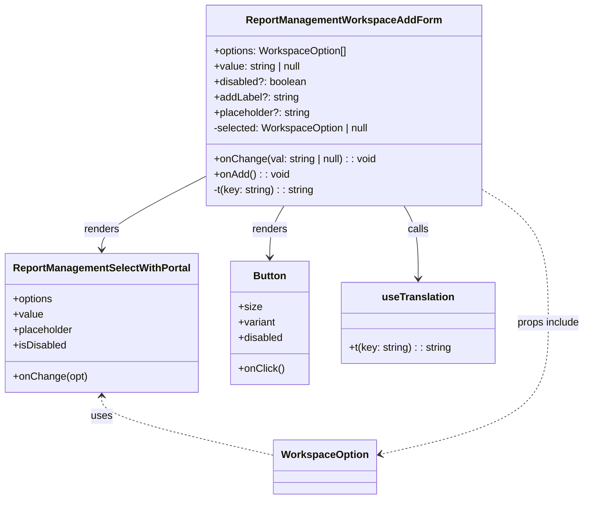

# Diagram: web/portal/src/pages/administration/report-management/components/molecules/ReportManagement.WorkspaceAddForm.molecule.tsx


> Auto-generated by Obscura crawlers

## Diagram 1



### SVG

<svg id="container" width="900.09375" xmlns="http://www.w3.org/2000/svg" class="classDiagram" height="776" viewBox="0 0 900.09375 776" role="graphics-document document" aria-roledescription="class"><style>#container{font-family:"trebuchet ms",verdana,arial,sans-serif;font-size:16px;fill:#333;}@keyframes edge-animation-frame{from{stroke-dashoffset:0;}}@keyframes dash{to{stroke-dashoffset:0;}}#container .edge-animation-slow{stroke-dasharray:9,5!important;stroke-dashoffset:900;animation:dash 50s linear infinite;stroke-linecap:round;}#container .edge-animation-fast{stroke-dasharray:9,5!important;stroke-dashoffset:900;animation:dash 20s linear infinite;stroke-linecap:round;}#container .error-icon{fill:#552222;}#container .error-text{fill:#552222;stroke:#552222;}#container .edge-thickness-normal{stroke-width:1px;}#container .edge-thickness-thick{stroke-width:3.5px;}#container .edge-pattern-solid{stroke-dasharray:0;}#container .edge-thickness-invisible{stroke-width:0;fill:none;}#container .edge-pattern-dashed{stroke-dasharray:3;}#container .edge-pattern-dotted{stroke-dasharray:2;}#container .marker{fill:#333333;stroke:#333333;}#container .marker.cross{stroke:#333333;}#container svg{font-family:"trebuchet ms",verdana,arial,sans-serif;font-size:16px;}#container p{margin:0;}#container g.classGroup text{fill:#9370DB;stroke:none;font-family:"trebuchet ms",verdana,arial,sans-serif;font-size:10px;}#container g.classGroup text .title{font-weight:bolder;}#container .nodeLabel,#container .edgeLabel{color:#131300;}#container .edgeLabel .label rect{fill:#ECECFF;}#container .label text{fill:#131300;}#container .labelBkg{background:#ECECFF;}#container .edgeLabel .label span{background:#ECECFF;}#container .classTitle{font-weight:bolder;}#container .node rect,#container .node circle,#container .node ellipse,#container .node polygon,#container .node path{fill:#ECECFF;stroke:#9370DB;stroke-width:1px;}#container .divider{stroke:#9370DB;stroke-width:1;}#container g.clickable{cursor:pointer;}#container g.classGroup rect{fill:#ECECFF;stroke:#9370DB;}#container g.classGroup line{stroke:#9370DB;stroke-width:1;}#container .classLabel .box{stroke:none;stroke-width:0;fill:#ECECFF;opacity:0.5;}#container .classLabel .label{fill:#9370DB;font-size:10px;}#container .relation{stroke:#333333;stroke-width:1;fill:none;}#container .dashed-line{stroke-dasharray:3;}#container .dotted-line{stroke-dasharray:1 2;}#container #compositionStart,#container .composition{fill:#333333!important;stroke:#333333!important;stroke-width:1;}#container #compositionEnd,#container .composition{fill:#333333!important;stroke:#333333!important;stroke-width:1;}#container #dependencyStart,#container .dependency{fill:#333333!important;stroke:#333333!important;stroke-width:1;}#container #dependencyStart,#container .dependency{fill:#333333!important;stroke:#333333!important;stroke-width:1;}#container #extensionStart,#container .extension{fill:transparent!important;stroke:#333333!important;stroke-width:1;}#container #extensionEnd,#container .extension{fill:transparent!important;stroke:#333333!important;stroke-width:1;}#container #aggregationStart,#container .aggregation{fill:transparent!important;stroke:#333333!important;stroke-width:1;}#container #aggregationEnd,#container .aggregation{fill:transparent!important;stroke:#333333!important;stroke-width:1;}#container #lollipopStart,#container .lollipop{fill:#ECECFF!important;stroke:#333333!important;stroke-width:1;}#container #lollipopEnd,#container .lollipop{fill:#ECECFF!important;stroke:#333333!important;stroke-width:1;}#container .edgeTerminals{font-size:11px;line-height:initial;}#container .classTitleText{text-anchor:middle;font-size:18px;fill:#333;}#container .label-icon{display:inline-block;height:1em;overflow:visible;vertical-align:-0.125em;}#container .node .label-icon path{fill:currentColor;stroke:revert;stroke-width:revert;}#container :root{--mermaid-font-family:"trebuchet ms",verdana,arial,sans-serif;}</style><g><defs><marker id="container_class-aggregationStart" class="marker aggregation class" refX="18" refY="7" markerWidth="190" markerHeight="240" orient="auto"><path d="M 18,7 L9,13 L1,7 L9,1 Z"></path></marker></defs><defs><marker id="container_class-aggregationEnd" class="marker aggregation class" refX="1" refY="7" markerWidth="20" markerHeight="28" orient="auto"><path d="M 18,7 L9,13 L1,7 L9,1 Z"></path></marker></defs><defs><marker id="container_class-extensionStart" class="marker extension class" refX="18" refY="7" markerWidth="190" markerHeight="240" orient="auto"><path d="M 1,7 L18,13 V 1 Z"></path></marker></defs><defs><marker id="container_class-extensionEnd" class="marker extension class" refX="1" refY="7" markerWidth="20" markerHeight="28" orient="auto"><path d="M 1,1 V 13 L18,7 Z"></path></marker></defs><defs><marker id="container_class-compositionStart" class="marker composition class" refX="18" refY="7" markerWidth="190" markerHeight="240" orient="auto"><path d="M 18,7 L9,13 L1,7 L9,1 Z"></path></marker></defs><defs><marker id="container_class-compositionEnd" class="marker composition class" refX="1" refY="7" markerWidth="20" markerHeight="28" orient="auto"><path d="M 18,7 L9,13 L1,7 L9,1 Z"></path></marker></defs><defs><marker id="container_class-dependencyStart" class="marker dependency class" refX="6" refY="7" markerWidth="190" markerHeight="240" orient="auto"><path d="M 5,7 L9,13 L1,7 L9,1 Z"></path></marker></defs><defs><marker id="container_class-dependencyEnd" class="marker dependency class" refX="13" refY="7" markerWidth="20" markerHeight="28" orient="auto"><path d="M 18,7 L9,13 L14,7 L9,1 Z"></path></marker></defs><defs><marker id="container_class-lollipopStart" class="marker lollipop class" refX="13" refY="7" markerWidth="190" markerHeight="240" orient="auto"><circle stroke="black" fill="transparent" cx="7" cy="7" r="6"></circle></marker></defs><defs><marker id="container_class-lollipopEnd" class="marker lollipop class" refX="1" refY="7" markerWidth="190" markerHeight="240" orient="auto"><circle stroke="black" fill="transparent" cx="7" cy="7" r="6"></circle></marker></defs><g class="root"><g class="clusters"></g><g class="edgePaths"><path d="M311.602,274.601L285.27,288.334C258.938,302.067,206.273,329.534,179.941,348.433C153.609,367.333,153.609,377.667,153.609,382.833L153.609,388" id="id_ReportManagementWorkspaceAddForm_ReportManagementSelectWithPortal_1" class="edge-thickness-normal edge-pattern-solid relation" style=";;;" data-edge="true" data-et="edge" data-id="id_ReportManagementWorkspaceAddForm_ReportManagementSelectWithPortal_1" data-points="W3sieCI6MzExLjYwMTU2MjUsInkiOjI3NC42MDA5MDc3OTU0MjkzNX0seyJ4IjoxNTMuNjA5Mzc1LCJ5IjozNTd9LHsieCI6MTUzLjYwOTM3NSwieSI6Mzk0fV0=" marker-end="url(#container_class-dependencyEnd)"></path><path d="M431.062,320L427.401,326.167C423.74,332.333,416.419,344.667,412.758,358C409.098,371.333,409.098,385.667,409.098,392.833L409.098,400" id="id_ReportManagementWorkspaceAddForm_Button_2" class="edge-thickness-normal edge-pattern-solid relation" style=";;;" data-edge="true" data-et="edge" data-id="id_ReportManagementWorkspaceAddForm_Button_2" data-points="W3sieCI6NDMxLjA2MTkxMzA1MDUxODEsInkiOjMyMH0seyJ4Ijo0MDkuMDk3NjU2MjUsInkiOjM1N30seyJ4Ijo0MDkuMDk3NjU2MjUsInkiOjQwNn1d" marker-end="url(#container_class-dependencyEnd)"></path><path d="M616.274,320L619.935,326.167C623.595,332.333,630.917,344.667,634.578,363.5C638.238,382.333,638.238,407.667,638.238,420.333L638.238,433" id="id_ReportManagementWorkspaceAddForm_useTranslation_3" class="edge-thickness-normal edge-pattern-solid relation" style=";;;" data-edge="true" data-et="edge" data-id="id_ReportManagementWorkspaceAddForm_useTranslation_3" data-points="W3sieCI6NjE2LjI3NDAyNDQ0OTQ4MTksInkiOjMyMH0seyJ4Ijo2MzguMjM4MjgxMjUsInkiOjM1N30seyJ4Ijo2MzguMjM4MjgxMjUsInkiOjQzOX1d" marker-end="url(#container_class-dependencyEnd)"></path><path d="M153.609,616L153.609,621.167C153.609,626.333,153.609,636.667,198.18,652.059C242.75,667.451,331.891,687.902,376.461,698.127L421.031,708.352" id="id_ReportManagementSelectWithPortal_WorkspaceOption_4" class="edge-thickness-normal edge-pattern-dashed relation" style=";;;" data-edge="true" data-et="edge" data-id="id_ReportManagementSelectWithPortal_WorkspaceOption_4" data-points="W3sieCI6MTUzLjYwOTM3NSwieSI6NjEwfSx7IngiOjE1My42MDkzNzUsInkiOjY0N30seyJ4Ijo0MjEuMDMxMjUsInkiOjcwOC4zNTI0MzY3MDAyNDV9XQ==" marker-start="url(#container_class-dependencyStart)"></path><path d="M735.734,292.453L753.495,303.211C771.255,313.969,806.776,335.484,824.536,370.409C842.297,405.333,842.297,453.667,842.297,502C842.297,550.333,842.297,598.667,798.701,632.835C755.106,667.004,667.914,687.007,624.319,697.009L580.723,707.011" id="id_ReportManagementWorkspaceAddForm_WorkspaceOption_5" class="edge-thickness-normal edge-pattern-dashed relation" style=";;;" data-edge="true" data-et="edge" data-id="id_ReportManagementWorkspaceAddForm_WorkspaceOption_5" data-points="W3sieCI6NzM1LjczNDM3NSwieSI6MjkyLjQ1MjkyOTQyMTcxNjZ9LHsieCI6ODQyLjI5Njg3NSwieSI6MzU3fSx7IngiOjg0Mi4yOTY4NzUsInkiOjUwMn0seyJ4Ijo4NDIuMjk2ODc1LCJ5Ijo2NDd9LHsieCI6NTc0Ljg3NSwieSI6NzA4LjM1MjQzNjcwMDI0NX1d" marker-end="url(#container_class-dependencyEnd)"></path></g><g class="edgeLabels"><g class="edgeLabel" transform="translate(153.609375, 357)"><g class="label" data-id="id_ReportManagementWorkspaceAddForm_ReportManagementSelectWithPortal_1" transform="translate(-27.75, -12)"><foreignObject width="55.5" height="24"><div xmlns="http://www.w3.org/1999/xhtml" class="labelBkg" style="display: table-cell; white-space: nowrap; line-height: 1.5; max-width: 200px; text-align: center;"><span class="edgeLabel"><p>renders</p></span></div></foreignObject></g></g><g class="edgeLabel" transform="translate(409.09765625, 357)"><g class="label" data-id="id_ReportManagementWorkspaceAddForm_Button_2" transform="translate(-27.75, -12)"><foreignObject width="55.5" height="24"><div xmlns="http://www.w3.org/1999/xhtml" class="labelBkg" style="display: table-cell; white-space: nowrap; line-height: 1.5; max-width: 200px; text-align: center;"><span class="edgeLabel"><p>renders</p></span></div></foreignObject></g></g><g class="edgeLabel" transform="translate(638.23828125, 357)"><g class="label" data-id="id_ReportManagementWorkspaceAddForm_useTranslation_3" transform="translate(-16.4453125, -12)"><foreignObject width="32.890625" height="24"><div xmlns="http://www.w3.org/1999/xhtml" class="labelBkg" style="display: table-cell; white-space: nowrap; line-height: 1.5; max-width: 200px; text-align: center;"><span class="edgeLabel"><p>calls</p></span></div></foreignObject></g></g><g class="edgeLabel" transform="translate(153.609375, 647)"><g class="label" data-id="id_ReportManagementSelectWithPortal_WorkspaceOption_4" transform="translate(-16.4921875, -12)"><foreignObject width="32.984375" height="24"><div xmlns="http://www.w3.org/1999/xhtml" class="labelBkg" style="display: table-cell; white-space: nowrap; line-height: 1.5; max-width: 200px; text-align: center;"><span class="edgeLabel"><p>uses</p></span></div></foreignObject></g></g><g class="edgeLabel" transform="translate(842.296875, 502)"><g class="label" data-id="id_ReportManagementWorkspaceAddForm_WorkspaceOption_5" transform="translate(-49.796875, -12)"><foreignObject width="99.59375" height="24"><div xmlns="http://www.w3.org/1999/xhtml" class="labelBkg" style="display: table-cell; white-space: nowrap; line-height: 1.5; max-width: 200px; text-align: center;"><span class="edgeLabel"><p>props include</p></span></div></foreignObject></g></g></g><g class="nodes"><g class="node default" id="classId-ReportManagementWorkspaceAddForm-0" transform="translate(523.66796875, 164)"><g class="basic label-container"><path d="M-212.06640625 -156 L212.06640625 -156 L212.06640625 156 L-212.06640625 156" stroke="none" stroke-width="0" fill="#ECECFF" style=""></path><path d="M-212.06640625 -156 C-47.556245008181946 -156, 116.95391623363611 -156, 212.06640625 -156 M-212.06640625 -156 C-102.31665797239357 -156, 7.433090305212858 -156, 212.06640625 -156 M212.06640625 -156 C212.06640625 -88.52885611472895, 212.06640625 -21.057712229457906, 212.06640625 156 M212.06640625 -156 C212.06640625 -51.40063884478555, 212.06640625 53.198722310428906, 212.06640625 156 M212.06640625 156 C67.92317068948486 156, -76.22006487103027 156, -212.06640625 156 M212.06640625 156 C119.06100392427908 156, 26.055601598558155 156, -212.06640625 156 M-212.06640625 156 C-212.06640625 87.77974534942304, -212.06640625 19.559490698846076, -212.06640625 -156 M-212.06640625 156 C-212.06640625 45.635369473472906, -212.06640625 -64.72926105305419, -212.06640625 -156" stroke="#9370DB" stroke-width="1.3" fill="none" stroke-dasharray="0 0" style=""></path></g><g class="annotation-group text" transform="translate(0, -132)"></g><g class="label-group text" transform="translate(-144.6640625, -132)"><g class="label" style="font-weight: bolder" transform="translate(0,-12)"><foreignObject width="289.328125" height="24"><div xmlns="http://www.w3.org/1999/xhtml" style="display: table-cell; white-space: nowrap; line-height: 1.5; max-width: 336px; text-align: center;"><span class="nodeLabel markdown-node-label" style=""><p>ReportManagementWorkspaceAddForm</p></span></div></foreignObject></g></g><g class="members-group text" transform="translate(-200.06640625, -84)"><g class="label" style="" transform="translate(0,-12)"><foreignObject width="209.546875" height="24"><div xmlns="http://www.w3.org/1999/xhtml" style="display: table-cell; white-space: nowrap; line-height: 1.5; max-width: 267px; text-align: center;"><span class="nodeLabel markdown-node-label" style=""><p>+options: WorkspaceOption[]</p></span></div></foreignObject></g><g class="label" style="" transform="translate(0,12)"><foreignObject width="139.421875" height="24"><div xmlns="http://www.w3.org/1999/xhtml" style="display: table-cell; white-space: nowrap; line-height: 1.5; max-width: 197px; text-align: center;"><span class="nodeLabel markdown-node-label" style=""><p>+value: string | null</p></span></div></foreignObject></g><g class="label" style="" transform="translate(0,36)"><foreignObject width="145.359375" height="24"><div xmlns="http://www.w3.org/1999/xhtml" style="display: table-cell; white-space: nowrap; line-height: 1.5; max-width: 203px; text-align: center;"><span class="nodeLabel markdown-node-label" style=""><p>+disabled?: boolean</p></span></div></foreignObject></g><g class="label" style="" transform="translate(0,60)"><foreignObject width="131.828125" height="24"><div xmlns="http://www.w3.org/1999/xhtml" style="display: table-cell; white-space: nowrap; line-height: 1.5; max-width: 190px; text-align: center;"><span class="nodeLabel markdown-node-label" style=""><p>+addLabel?: string</p></span></div></foreignObject></g><g class="label" style="" transform="translate(0,84)"><foreignObject width="151.21875" height="24"><div xmlns="http://www.w3.org/1999/xhtml" style="display: table-cell; white-space: nowrap; line-height: 1.5; max-width: 209px; text-align: center;"><span class="nodeLabel markdown-node-label" style=""><p>+placeholder?: string</p></span></div></foreignObject></g><g class="label" style="" transform="translate(0,108)"><foreignObject width="246.359375" height="24"><div xmlns="http://www.w3.org/1999/xhtml" style="display: table-cell; white-space: nowrap; line-height: 1.5; max-width: 304px; text-align: center;"><span class="nodeLabel markdown-node-label" style=""><p>-selected: WorkspaceOption | null</p></span></div></foreignObject></g></g><g class="methods-group text" transform="translate(-200.06640625, 84)"><g class="label" style="" transform="translate(0,-12)"><foreignObject width="255.46875" height="24"><div xmlns="http://www.w3.org/1999/xhtml" style="display: table-cell; white-space: nowrap; line-height: 1.5; max-width: 313px; text-align: center;"><span class="nodeLabel markdown-node-label" style=""><p>+onChange(val: string | null) : : void</p></span></div></foreignObject></g><g class="label" style="" transform="translate(0,12)"><foreignObject width="117.015625" height="24"><div xmlns="http://www.w3.org/1999/xhtml" style="display: table-cell; white-space: nowrap; line-height: 1.5; max-width: 174px; text-align: center;"><span class="nodeLabel markdown-node-label" style=""><p>+onAdd() : : void</p></span></div></foreignObject></g><g class="label" style="" transform="translate(0,36)"><foreignObject width="158.90625" height="24"><div xmlns="http://www.w3.org/1999/xhtml" style="display: table-cell; white-space: nowrap; line-height: 1.5; max-width: 217px; text-align: center;"><span class="nodeLabel markdown-node-label" style=""><p>-t(key: string) : : string</p></span></div></foreignObject></g></g><g class="divider" style=""><path d="M-212.06640625 -108 C-100.8660525755412 -108, 10.334301098917592 -108, 212.06640625 -108 M-212.06640625 -108 C-108.19087272992907 -108, -4.315339209858138 -108, 212.06640625 -108" stroke="#9370DB" stroke-width="1.3" fill="none" stroke-dasharray="0 0" style=""></path></g><g class="divider" style=""><path d="M-212.06640625 60 C-120.77932803109383 60, -29.49224981218765 60, 212.06640625 60 M-212.06640625 60 C-104.43835937262814 60, 3.1896875047437163 60, 212.06640625 60" stroke="#9370DB" stroke-width="1.3" fill="none" stroke-dasharray="0 0" style=""></path></g></g><g class="node default" id="classId-ReportManagementSelectWithPortal-1" transform="translate(153.609375, 502)"><g class="basic label-container"><path d="M-145.609375 -108 L145.609375 -108 L145.609375 108 L-145.609375 108" stroke="none" stroke-width="0" fill="#ECECFF" style=""></path><path d="M-145.609375 -108 C-29.25834255826092 -108, 87.09268988347816 -108, 145.609375 -108 M-145.609375 -108 C-69.08839463280398 -108, 7.432585734392035 -108, 145.609375 -108 M145.609375 -108 C145.609375 -49.85631775077044, 145.609375 8.287364498459127, 145.609375 108 M145.609375 -108 C145.609375 -62.11674042380587, 145.609375 -16.233480847611744, 145.609375 108 M145.609375 108 C55.09276770622324 108, -35.423839587553516 108, -145.609375 108 M145.609375 108 C54.24040024751767 108, -37.12857450496466 108, -145.609375 108 M-145.609375 108 C-145.609375 43.47637330567025, -145.609375 -21.0472533886595, -145.609375 -108 M-145.609375 108 C-145.609375 38.80104286260246, -145.609375 -30.397914274795085, -145.609375 -108" stroke="#9370DB" stroke-width="1.3" fill="none" stroke-dasharray="0 0" style=""></path></g><g class="annotation-group text" transform="translate(0, -84)"></g><g class="label-group text" transform="translate(-133.609375, -84)"><g class="label" style="font-weight: bolder" transform="translate(0,-12)"><foreignObject width="267.21875" height="24"><div xmlns="http://www.w3.org/1999/xhtml" style="display: table-cell; white-space: nowrap; line-height: 1.5; max-width: 313px; text-align: center;"><span class="nodeLabel markdown-node-label" style=""><p>ReportManagementSelectWithPortal</p></span></div></foreignObject></g></g><g class="members-group text" transform="translate(-133.609375, -36)"><g class="label" style="" transform="translate(0,-12)"><foreignObject width="63.3125" height="24"><div xmlns="http://www.w3.org/1999/xhtml" style="display: table-cell; white-space: nowrap; line-height: 1.5; max-width: 121px; text-align: center;"><span class="nodeLabel markdown-node-label" style=""><p>+options</p></span></div></foreignObject></g><g class="label" style="" transform="translate(0,12)"><foreignObject width="46.71875" height="24"><div xmlns="http://www.w3.org/1999/xhtml" style="display: table-cell; white-space: nowrap; line-height: 1.5; max-width: 104px; text-align: center;"><span class="nodeLabel markdown-node-label" style=""><p>+value</p></span></div></foreignObject></g><g class="label" style="" transform="translate(0,36)"><foreignObject width="94.640625" height="24"><div xmlns="http://www.w3.org/1999/xhtml" style="display: table-cell; white-space: nowrap; line-height: 1.5; max-width: 153px; text-align: center;"><span class="nodeLabel markdown-node-label" style=""><p>+placeholder</p></span></div></foreignObject></g><g class="label" style="" transform="translate(0,60)"><foreignObject width="83.203125" height="24"><div xmlns="http://www.w3.org/1999/xhtml" style="display: table-cell; white-space: nowrap; line-height: 1.5; max-width: 141px; text-align: center;"><span class="nodeLabel markdown-node-label" style=""><p>+isDisabled</p></span></div></foreignObject></g></g><g class="methods-group text" transform="translate(-133.609375, 84)"><g class="label" style="" transform="translate(0,-12)"><foreignObject width="114.75" height="24"><div xmlns="http://www.w3.org/1999/xhtml" style="display: table-cell; white-space: nowrap; line-height: 1.5; max-width: 172px; text-align: center;"><span class="nodeLabel markdown-node-label" style=""><p>+onChange(opt)</p></span></div></foreignObject></g></g><g class="divider" style=""><path d="M-145.609375 -60 C-68.45929995740669 -60, 8.69077508518663 -60, 145.609375 -60 M-145.609375 -60 C-68.46310376188784 -60, 8.683167476224327 -60, 145.609375 -60" stroke="#9370DB" stroke-width="1.3" fill="none" stroke-dasharray="0 0" style=""></path></g><g class="divider" style=""><path d="M-145.609375 60 C-59.44704482462673 60, 26.71528535074654 60, 145.609375 60 M-145.609375 60 C-41.65188541303304 60, 62.305604173933915 60, 145.609375 60" stroke="#9370DB" stroke-width="1.3" fill="none" stroke-dasharray="0 0" style=""></path></g></g><g class="node default" id="classId-Button-2" transform="translate(409.09765625, 502)"><g class="basic label-container"><path d="M-59.87890625 -96 L59.87890625 -96 L59.87890625 96 L-59.87890625 96" stroke="none" stroke-width="0" fill="#ECECFF" style=""></path><path d="M-59.87890625 -96 C-34.45858717555261 -96, -9.038268101105224 -96, 59.87890625 -96 M-59.87890625 -96 C-18.251534647038923 -96, 23.375836955922153 -96, 59.87890625 -96 M59.87890625 -96 C59.87890625 -41.11038614292928, 59.87890625 13.779227714141442, 59.87890625 96 M59.87890625 -96 C59.87890625 -32.02391814626881, 59.87890625 31.952163707462375, 59.87890625 96 M59.87890625 96 C35.56814865849957 96, 11.257391066999133 96, -59.87890625 96 M59.87890625 96 C15.354276207457247 96, -29.170353835085507 96, -59.87890625 96 M-59.87890625 96 C-59.87890625 53.70843485357494, -59.87890625 11.416869707149885, -59.87890625 -96 M-59.87890625 96 C-59.87890625 26.624178659909546, -59.87890625 -42.75164268018091, -59.87890625 -96" stroke="#9370DB" stroke-width="1.3" fill="none" stroke-dasharray="0 0" style=""></path></g><g class="annotation-group text" transform="translate(0, -72)"></g><g class="label-group text" transform="translate(-24.8359375, -72)"><g class="label" style="font-weight: bolder" transform="translate(0,-12)"><foreignObject width="49.671875" height="24"><div xmlns="http://www.w3.org/1999/xhtml" style="display: table-cell; white-space: nowrap; line-height: 1.5; max-width: 99px; text-align: center;"><span class="nodeLabel markdown-node-label" style=""><p>Button</p></span></div></foreignObject></g></g><g class="members-group text" transform="translate(-47.87890625, -24)"><g class="label" style="" transform="translate(0,-12)"><foreignObject width="35.578125" height="24"><div xmlns="http://www.w3.org/1999/xhtml" style="display: table-cell; white-space: nowrap; line-height: 1.5; max-width: 93px; text-align: center;"><span class="nodeLabel markdown-node-label" style=""><p>+size</p></span></div></foreignObject></g><g class="label" style="" transform="translate(0,12)"><foreignObject width="58.703125" height="24"><div xmlns="http://www.w3.org/1999/xhtml" style="display: table-cell; white-space: nowrap; line-height: 1.5; max-width: 116px; text-align: center;"><span class="nodeLabel markdown-node-label" style=""><p>+variant</p></span></div></foreignObject></g><g class="label" style="" transform="translate(0,36)"><foreignObject width="70.484375" height="24"><div xmlns="http://www.w3.org/1999/xhtml" style="display: table-cell; white-space: nowrap; line-height: 1.5; max-width: 128px; text-align: center;"><span class="nodeLabel markdown-node-label" style=""><p>+disabled</p></span></div></foreignObject></g></g><g class="methods-group text" transform="translate(-47.87890625, 72)"><g class="label" style="" transform="translate(0,-12)"><foreignObject width="70.921875" height="24"><div xmlns="http://www.w3.org/1999/xhtml" style="display: table-cell; white-space: nowrap; line-height: 1.5; max-width: 128px; text-align: center;"><span class="nodeLabel markdown-node-label" style=""><p>+onClick()</p></span></div></foreignObject></g></g><g class="divider" style=""><path d="M-59.87890625 -48 C-34.08034905281132 -48, -8.281791855622643 -48, 59.87890625 -48 M-59.87890625 -48 C-26.992120234172212 -48, 5.894665781655576 -48, 59.87890625 -48" stroke="#9370DB" stroke-width="1.3" fill="none" stroke-dasharray="0 0" style=""></path></g><g class="divider" style=""><path d="M-59.87890625 48 C-14.903501698618278 48, 30.071902852763444 48, 59.87890625 48 M-59.87890625 48 C-27.767993221455534 48, 4.342919807088933 48, 59.87890625 48" stroke="#9370DB" stroke-width="1.3" fill="none" stroke-dasharray="0 0" style=""></path></g></g><g class="node default" id="classId-useTranslation-3" transform="translate(638.23828125, 502)"><g class="basic label-container"><path d="M-119.26171875 -63 L119.26171875 -63 L119.26171875 63 L-119.26171875 63" stroke="none" stroke-width="0" fill="#ECECFF" style=""></path><path d="M-119.26171875 -63 C-26.494247111204515 -63, 66.27322452759097 -63, 119.26171875 -63 M-119.26171875 -63 C-46.13097019877486 -63, 26.999778352450278 -63, 119.26171875 -63 M119.26171875 -63 C119.26171875 -30.284924195267415, 119.26171875 2.4301516094651703, 119.26171875 63 M119.26171875 -63 C119.26171875 -34.26489919728891, 119.26171875 -5.529798394577817, 119.26171875 63 M119.26171875 63 C49.575692136829275 63, -20.11033447634145 63, -119.26171875 63 M119.26171875 63 C50.97783892033658 63, -17.30604090932684 63, -119.26171875 63 M-119.26171875 63 C-119.26171875 17.421346341895507, -119.26171875 -28.157307316208986, -119.26171875 -63 M-119.26171875 63 C-119.26171875 21.708460124719686, -119.26171875 -19.58307975056063, -119.26171875 -63" stroke="#9370DB" stroke-width="1.3" fill="none" stroke-dasharray="0 0" style=""></path></g><g class="annotation-group text" transform="translate(0, -39)"></g><g class="label-group text" transform="translate(-54.0859375, -39)"><g class="label" style="font-weight: bolder" transform="translate(0,-12)"><foreignObject width="108.171875" height="24"><div xmlns="http://www.w3.org/1999/xhtml" style="display: table-cell; white-space: nowrap; line-height: 1.5; max-width: 157px; text-align: center;"><span class="nodeLabel markdown-node-label" style=""><p>useTranslation</p></span></div></foreignObject></g></g><g class="members-group text" transform="translate(-107.26171875, 9)"></g><g class="methods-group text" transform="translate(-107.26171875, 39)"><g class="label" style="" transform="translate(0,-12)"><foreignObject width="160.4375" height="24"><div xmlns="http://www.w3.org/1999/xhtml" style="display: table-cell; white-space: nowrap; line-height: 1.5; max-width: 218px; text-align: center;"><span class="nodeLabel markdown-node-label" style=""><p>+t(key: string) : : string</p></span></div></foreignObject></g></g><g class="divider" style=""><path d="M-119.26171875 -15 C-64.230272271046 -15, -9.198825792092023 -15, 119.26171875 -15 M-119.26171875 -15 C-26.11909263567314 -15, 67.02353347865372 -15, 119.26171875 -15" stroke="#9370DB" stroke-width="1.3" fill="none" stroke-dasharray="0 0" style=""></path></g><g class="divider" style=""><path d="M-119.26171875 9 C-33.13122826289454 9, 52.99926222421092 9, 119.26171875 9 M-119.26171875 9 C-42.501649119872965 9, 34.25842051025407 9, 119.26171875 9" stroke="#9370DB" stroke-width="1.3" fill="none" stroke-dasharray="0 0" style=""></path></g></g><g class="node default" id="classId-WorkspaceOption-4" transform="translate(497.953125, 726)"><g class="basic label-container"><path d="M-76.921875 -42 L76.921875 -42 L76.921875 42 L-76.921875 42" stroke="none" stroke-width="0" fill="#ECECFF" style=""></path><path d="M-76.921875 -42 C-42.062092314641525 -42, -7.20230962928305 -42, 76.921875 -42 M-76.921875 -42 C-33.38274916838334 -42, 10.156376663233317 -42, 76.921875 -42 M76.921875 -42 C76.921875 -14.253034340483552, 76.921875 13.493931319032896, 76.921875 42 M76.921875 -42 C76.921875 -8.45702902163054, 76.921875 25.08594195673892, 76.921875 42 M76.921875 42 C41.4946947240193 42, 6.067514448038594 42, -76.921875 42 M76.921875 42 C36.28184944147855 42, -4.358176117042902 42, -76.921875 42 M-76.921875 42 C-76.921875 11.346685872307827, -76.921875 -19.306628255384346, -76.921875 -42 M-76.921875 42 C-76.921875 11.119848652782018, -76.921875 -19.760302694435964, -76.921875 -42" stroke="#9370DB" stroke-width="1.3" fill="none" stroke-dasharray="0 0" style=""></path></g><g class="annotation-group text" transform="translate(0, -18)"></g><g class="label-group text" transform="translate(-64.921875, -18)"><g class="label" style="font-weight: bolder" transform="translate(0,-12)"><foreignObject width="129.84375" height="24"><div xmlns="http://www.w3.org/1999/xhtml" style="display: table-cell; white-space: nowrap; line-height: 1.5; max-width: 178px; text-align: center;"><span class="nodeLabel markdown-node-label" style=""><p>WorkspaceOption</p></span></div></foreignObject></g></g><g class="members-group text" transform="translate(-64.921875, 30)"></g><g class="methods-group text" transform="translate(-64.921875, 60)"></g><g class="divider" style=""><path d="M-76.921875 6 C-24.91171658821559 6, 27.09844182356882 6, 76.921875 6 M-76.921875 6 C-23.71956388080887 6, 29.48274723838226 6, 76.921875 6" stroke="#9370DB" stroke-width="1.3" fill="none" stroke-dasharray="0 0" style=""></path></g><g class="divider" style=""><path d="M-76.921875 24 C-31.73093417976102 24, 13.460006640477957 24, 76.921875 24 M-76.921875 24 C-18.290581896277374 24, 40.34071120744525 24, 76.921875 24" stroke="#9370DB" stroke-width="1.3" fill="none" stroke-dasharray="0 0" style=""></path></g></g></g></g></g></svg>

## Diagram 2

```mermaid
flowchart TD
  subgraph Component
    A[props: options, value, onChange, onAdd, disabled?, addLabel?, placeholder?]
    B[useTranslation("admin-reports") -> t]
    C[Compute selected = find option by value]
    D[ReportManagementSelectWithPortal]
    E[Button (Add)]
  end
  A --> C
  C --> D
  A --> D
  D -->|onChange(opt) -> onChange(opt?.value ?? null)| A
  A --> E
  E -->|onClick -> onAdd()| A
  B --> E
  B --> D
```

> SVG rendering failed for this diagram.
