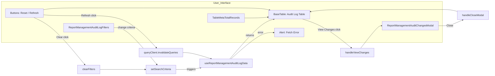

# Diagram: web/portal/src/pages/administration/report-management/components/organisms/ReportManagement.AuditLogTable.organism.tsx


> Auto-generated by Obscura crawlers

## Diagram 1

```mermaid
classDiagram
    class ReportManagementAuditLogTable {
        +useTranslation()
        +useQueryClient()
        +useAuditLogFormatters()
        -searchCriteria
        -selectedAuditLog
        -showModal
        -auditData
        -isLoading
        -fetchError
        -refetch()
        +handleViewChanges(auditLog)
        +handleCloseModal()
        +handleRefresh()
        +handleClearFilters()
        +handlePageChange(newPage)
        +handlePageSizeChange(newPageSize)
        +handleSortChange(col, reverse)
    }
    class ReportManagementAuditLogFilters
    class BaseTable
    class ReportManagementAuditChangesModal
    class TableMetaTotalRecords
    class Button
    class Alert
    class Icon
    class useReportManagementAuditLogData
    class useAuditLogColumns
    class queryClient

    ReportManagementAuditLogTable --> ReportManagementAuditLogFilters : renders
    ReportManagementAuditLogTable --> TableMetaTotalRecords : renders
    ReportManagementAuditLogTable --> Button : uses
    ReportManagementAuditLogTable --> Alert : uses
    ReportManagementAuditLogTable --> Icon : uses
    ReportManagementAuditLogTable --> BaseTable : renders
    ReportManagementAuditLogTable --> ReportManagementAuditChangesModal : conditionally renders
    ReportManagementAuditLogTable --> useReportManagementAuditLogData : calls
    ReportManagementAuditLogTable --> useAuditLogColumns : calls
    ReportManagementAuditLogTable --> queryClient : uses
    BaseTable --> "1..*" : columns
    ReportManagementAuditChangesModal --> ReportManagementAuditLogTable : receives selectedAuditLog
    useReportManagementAuditLogData ..> ReportManagementAuditLogTable : provides auditData, isLoading, error, refetch
    useAuditLogColumns ..> ReportManagementAuditLogTable : provides columns
```

> SVG rendering failed for this diagram.

## Diagram 2



### SVG

<svg id="container" width="3022.71875" xmlns="http://www.w3.org/2000/svg" class="flowchart" height="464" viewBox="0 0 3022.71875 464" role="graphics-document document" aria-roledescription="flowchart-v2"><style>#container{font-family:"trebuchet ms",verdana,arial,sans-serif;font-size:16px;fill:#333;}@keyframes edge-animation-frame{from{stroke-dashoffset:0;}}@keyframes dash{to{stroke-dashoffset:0;}}#container .edge-animation-slow{stroke-dasharray:9,5!important;stroke-dashoffset:900;animation:dash 50s linear infinite;stroke-linecap:round;}#container .edge-animation-fast{stroke-dasharray:9,5!important;stroke-dashoffset:900;animation:dash 20s linear infinite;stroke-linecap:round;}#container .error-icon{fill:#552222;}#container .error-text{fill:#552222;stroke:#552222;}#container .edge-thickness-normal{stroke-width:1px;}#container .edge-thickness-thick{stroke-width:3.5px;}#container .edge-pattern-solid{stroke-dasharray:0;}#container .edge-thickness-invisible{stroke-width:0;fill:none;}#container .edge-pattern-dashed{stroke-dasharray:3;}#container .edge-pattern-dotted{stroke-dasharray:2;}#container .marker{fill:#333333;stroke:#333333;}#container .marker.cross{stroke:#333333;}#container svg{font-family:"trebuchet ms",verdana,arial,sans-serif;font-size:16px;}#container p{margin:0;}#container .label{font-family:"trebuchet ms",verdana,arial,sans-serif;color:#333;}#container .cluster-label text{fill:#333;}#container .cluster-label span{color:#333;}#container .cluster-label span p{background-color:transparent;}#container .label text,#container span{fill:#333;color:#333;}#container .node rect,#container .node circle,#container .node ellipse,#container .node polygon,#container .node path{fill:#ECECFF;stroke:#9370DB;stroke-width:1px;}#container .rough-node .label text,#container .node .label text,#container .image-shape .label,#container .icon-shape .label{text-anchor:middle;}#container .node .katex path{fill:#000;stroke:#000;stroke-width:1px;}#container .rough-node .label,#container .node .label,#container .image-shape .label,#container .icon-shape .label{text-align:center;}#container .node.clickable{cursor:pointer;}#container .root .anchor path{fill:#333333!important;stroke-width:0;stroke:#333333;}#container .arrowheadPath{fill:#333333;}#container .edgePath .path{stroke:#333333;stroke-width:2.0px;}#container .flowchart-link{stroke:#333333;fill:none;}#container .edgeLabel{background-color:rgba(232,232,232, 0.8);text-align:center;}#container .edgeLabel p{background-color:rgba(232,232,232, 0.8);}#container .edgeLabel rect{opacity:0.5;background-color:rgba(232,232,232, 0.8);fill:rgba(232,232,232, 0.8);}#container .labelBkg{background-color:rgba(232, 232, 232, 0.5);}#container .cluster rect{fill:#ffffde;stroke:#aaaa33;stroke-width:1px;}#container .cluster text{fill:#333;}#container .cluster span{color:#333;}#container div.mermaidTooltip{position:absolute;text-align:center;max-width:200px;padding:2px;font-family:"trebuchet ms",verdana,arial,sans-serif;font-size:12px;background:hsl(80, 100%, 96.2745098039%);border:1px solid #aaaa33;border-radius:2px;pointer-events:none;z-index:100;}#container .flowchartTitleText{text-anchor:middle;font-size:18px;fill:#333;}#container rect.text{fill:none;stroke-width:0;}#container .icon-shape,#container .image-shape{background-color:rgba(232,232,232, 0.8);text-align:center;}#container .icon-shape p,#container .image-shape p{background-color:rgba(232,232,232, 0.8);padding:2px;}#container .icon-shape rect,#container .image-shape rect{opacity:0.5;background-color:rgba(232,232,232, 0.8);fill:rgba(232,232,232, 0.8);}#container .label-icon{display:inline-block;height:1em;overflow:visible;vertical-align:-0.125em;}#container .node .label-icon path{fill:currentColor;stroke:revert;stroke-width:revert;}#container :root{--mermaid-font-family:"trebuchet ms",verdana,arial,sans-serif;}</style><g><marker id="container_flowchart-v2-pointEnd" class="marker flowchart-v2" viewBox="0 0 10 10" refX="5" refY="5" markerUnits="userSpaceOnUse" markerWidth="8" markerHeight="8" orient="auto"><path d="M 0 0 L 10 5 L 0 10 z" class="arrowMarkerPath" style="stroke-width: 1; stroke-dasharray: 1, 0;"></path></marker><marker id="container_flowchart-v2-pointStart" class="marker flowchart-v2" viewBox="0 0 10 10" refX="4.5" refY="5" markerUnits="userSpaceOnUse" markerWidth="8" markerHeight="8" orient="auto"><path d="M 0 5 L 10 10 L 10 0 z" class="arrowMarkerPath" style="stroke-width: 1; stroke-dasharray: 1, 0;"></path></marker><marker id="container_flowchart-v2-circleEnd" class="marker flowchart-v2" viewBox="0 0 10 10" refX="11" refY="5" markerUnits="userSpaceOnUse" markerWidth="11" markerHeight="11" orient="auto"><circle cx="5" cy="5" r="5" class="arrowMarkerPath" style="stroke-width: 1; stroke-dasharray: 1, 0;"></circle></marker><marker id="container_flowchart-v2-circleStart" class="marker flowchart-v2" viewBox="0 0 10 10" refX="-1" refY="5" markerUnits="userSpaceOnUse" markerWidth="11" markerHeight="11" orient="auto"><circle cx="5" cy="5" r="5" class="arrowMarkerPath" style="stroke-width: 1; stroke-dasharray: 1, 0;"></circle></marker><marker id="container_flowchart-v2-crossEnd" class="marker cross flowchart-v2" viewBox="0 0 11 11" refX="12" refY="5.2" markerUnits="userSpaceOnUse" markerWidth="11" markerHeight="11" orient="auto"><path d="M 1,1 l 9,9 M 10,1 l -9,9" class="arrowMarkerPath" style="stroke-width: 2; stroke-dasharray: 1, 0;"></path></marker><marker id="container_flowchart-v2-crossStart" class="marker cross flowchart-v2" viewBox="0 0 11 11" refX="-1" refY="5.2" markerUnits="userSpaceOnUse" markerWidth="11" markerHeight="11" orient="auto"><path d="M 1,1 l 9,9 M 10,1 l -9,9" class="arrowMarkerPath" style="stroke-width: 2; stroke-dasharray: 1, 0;"></path></marker><g class="root"><g class="clusters"><g class="cluster" id="User_Interface" data-look="classic"><rect style="" x="8" y="8" width="2723.875" height="255"></rect><g class="cluster-label" transform="translate(1317.828125, 8)"><foreignObject width="104.21875" height="24"><div xmlns="http://www.w3.org/1999/xhtml" style="display: table-cell; white-space: nowrap; line-height: 1.5; max-width: 200px; text-align: center;"><span class="nodeLabel"><p>User_Interface</p></span></div></foreignObject></g></g></g><g class="edgePaths"><path d="M703.266,171L716.443,171C729.62,171,755.974,171,801.044,208.989C846.113,246.979,909.898,322.958,941.791,360.947L973.683,398.936" id="L_Filters_SetCriteria_0" class="edge-thickness-normal edge-pattern-solid edge-thickness-normal edge-pattern-solid flowchart-link" style=";" data-edge="true" data-et="edge" data-id="L_Filters_SetCriteria_0" data-points="W3sieCI6NzAzLjI2NTYyNSwieSI6MTcxfSx7IngiOjc4Mi4zMjgxMjUsInkiOjE3MX0seyJ4Ijo5NzYuMjU1MDg3MjA5MzAyNCwieSI6NDAyfV0=" marker-end="url(#container_flowchart-v2-pointEnd)"></path><path d="M1090.789,429L1107.148,429C1123.508,429,1156.227,429,1182.295,427.283C1208.363,425.566,1227.78,422.131,1237.489,420.414L1247.198,418.697" id="L_SetCriteria_FetchData_0" class="edge-thickness-normal edge-pattern-solid edge-thickness-normal edge-pattern-solid flowchart-link" style=";" data-edge="true" data-et="edge" data-id="L_SetCriteria_FetchData_0" data-points="W3sieCI6MTA5MC43ODkwNjI1LCJ5Ijo0Mjl9LHsieCI6MTE4OC45NDUzMTI1LCJ5Ijo0Mjl9LHsieCI6MTI1MS4xMzY5MjQzNDIxMDUyLCJ5Ijo0MTh9XQ==" marker-end="url(#container_flowchart-v2-pointEnd)"></path><path d="M269.344,91.501L279.659,92.417C289.974,93.334,310.604,95.167,357.079,96.083C403.555,97,475.875,97,551.057,97C626.24,97,704.284,97,774.671,130.017C845.058,163.033,907.788,229.067,939.153,262.083L970.518,295.1" id="L_Controls_Invalidate_0" class="edge-thickness-normal edge-pattern-solid edge-thickness-normal edge-pattern-solid flowchart-link" style=";" data-edge="true" data-et="edge" data-id="L_Controls_Invalidate_0" data-points="W3sieCI6MjY5LjM0Mzc1LCJ5Ijo5MS41MDA1MjA2NTI1NTEyfSx7IngiOjMzMS4yMzQzNzUsInkiOjk3fSx7IngiOjU0OC4xOTUzMTI1LCJ5Ijo5N30seyJ4Ijo3ODIuMzI4MTI1LCJ5Ijo5N30seyJ4Ijo5NzMuMjcyNjE1MTMxNTc5LCJ5IjoyOTh9XQ==" marker-end="url(#container_flowchart-v2-pointEnd)"></path><path d="M1136.453,325L1145.202,325C1153.951,325,1171.448,325,1200.718,331.304C1229.988,337.608,1271.032,350.217,1291.553,356.521L1312.075,362.825" id="L_Invalidate_FetchData_0" class="edge-thickness-normal edge-pattern-solid edge-thickness-normal edge-pattern-solid flowchart-link" style=";" data-edge="true" data-et="edge" data-id="L_Invalidate_FetchData_0" data-points="W3sieCI6MTEzNi40NTMxMjUsInkiOjMyNX0seyJ4IjoxMTg4Ljk0NTMxMjUsInkiOjMyNX0seyJ4IjoxMzE1Ljg5ODQzNzUsInkiOjM2NH1d" marker-end="url(#container_flowchart-v2-pointEnd)"></path><path d="M209.049,108L229.413,117.5C249.778,127,290.506,146,342.909,194.485C395.312,242.97,459.389,320.94,491.428,359.925L523.466,398.91" id="L_Controls_Clear_0" class="edge-thickness-normal edge-pattern-solid edge-thickness-normal edge-pattern-solid flowchart-link" style=";" data-edge="true" data-et="edge" data-id="L_Controls_Clear_0" data-points="W3sieCI6MjA5LjA0OTEwNzE0Mjg1NzE0LCJ5IjoxMDh9LHsieCI6MzMxLjIzNDM3NSwieSI6MTY1fSx7IngiOjUyNi4wMDYxMjU3MTAyMjczLCJ5Ijo0MDJ9XQ==" marker-end="url(#container_flowchart-v2-pointEnd)"></path><path d="M618.125,429L645.492,429C672.859,429,727.594,429,775.082,429C822.57,429,862.813,429,882.934,429L903.055,429" id="L_Clear_SetCriteria_0" class="edge-thickness-normal edge-pattern-solid edge-thickness-normal edge-pattern-solid flowchart-link" style=";" data-edge="true" data-et="edge" data-id="L_Clear_SetCriteria_0" data-points="W3sieCI6NjE4LjEyNSwieSI6NDI5fSx7IngiOjc4Mi4zMjgxMjUsInkiOjQyOX0seyJ4Ijo5MDcuMDU0Njg3NSwieSI6NDI5fV0=" marker-end="url(#container_flowchart-v2-pointEnd)"></path><path d="M1427.046,364L1458.773,327.167C1490.499,290.333,1553.953,216.667,1599.559,175.691C1645.165,134.715,1672.924,126.429,1686.804,122.287L1700.683,118.144" id="L_FetchData_Table_0" class="edge-thickness-normal edge-pattern-solid edge-thickness-normal edge-pattern-solid flowchart-link" style=";" data-edge="true" data-et="edge" data-id="L_FetchData_Table_0" data-points="W3sieCI6MTQyNy4wNDU3NzI0Mjk0MzU0LCJ5IjozNjR9LHsieCI6MTYxNy40MDYyNSwieSI6MTQzfSx7IngiOjE3MDQuNTE2MjE0NjIyNjQxNCwieSI6MTE3fV0=" marker-end="url(#container_flowchart-v2-pointEnd)"></path><path d="M1434.145,364L1464.689,336.833C1495.232,309.667,1556.319,255.333,1600.691,228.167C1645.063,201,1672.719,201,1686.547,201L1700.375,201" id="L_FetchData_Error_0" class="edge-thickness-normal edge-pattern-solid edge-thickness-normal edge-pattern-solid flowchart-link" style=";" data-edge="true" data-et="edge" data-id="L_FetchData_Error_0" data-points="W3sieCI6MTQzNC4xNDUxODkxNDQ3MzY4LCJ5IjozNjR9LHsieCI6MTYxNy40MDYyNSwieSI6MjAxfSx7IngiOjE3MDQuMzc1LCJ5IjoyMDF9XQ==" marker-end="url(#container_flowchart-v2-pointEnd)"></path><path d="M1874.862,117L1898.039,124.833C1921.215,132.667,1967.569,148.333,2017.264,178.075C2066.959,207.817,2119.995,251.635,2146.514,273.544L2173.032,295.452" id="L_Table_Select_0" class="edge-thickness-normal edge-pattern-solid edge-thickness-normal edge-pattern-solid flowchart-link" style=";" data-edge="true" data-et="edge" data-id="L_Table_Select_0" data-points="W3sieCI6MTg3NC44NjIwMTQzNTgxMDgxLCJ5IjoxMTd9LHsieCI6MjAxMy45MjE4NzUsInkiOjE2NH0seyJ4IjoyMTc2LjExNTk3NDM3ODg4MiwieSI6Mjk4fV0=" marker-end="url(#container_flowchart-v2-pointEnd)"></path><path d="M2229.492,298L2247.248,274.833C2265.005,251.667,2300.518,205.333,2321.775,182.167C2343.031,159,2350.031,159,2353.531,159L2357.031,159" id="L_Select_Modal_0" class="edge-thickness-normal edge-pattern-solid edge-thickness-normal edge-pattern-solid flowchart-link" style=";" data-edge="true" data-et="edge" data-id="L_Select_Modal_0" data-points="W3sieCI6MjIyOS40OTE2MjI3NDA5NjQsInkiOjI5OH0seyJ4IjoyMzM2LjAzMTI1LCJ5IjoxNTl9LHsieCI6MjM2MS4wMzEyNSwieSI6MTU5fV0=" marker-end="url(#container_flowchart-v2-pointEnd)"></path><path d="M2706.875,159L2711.042,159C2715.208,159,2723.542,159,2735.121,159C2746.701,159,2761.526,159,2782.113,152.945C2802.699,146.89,2829.047,134.78,2842.221,128.725L2855.394,122.67" id="L_Modal_Close_0" class="edge-thickness-normal edge-pattern-solid edge-thickness-normal edge-pattern-solid flowchart-link" style=";" data-edge="true" data-et="edge" data-id="L_Modal_Close_0" data-points="W3sieCI6MjcwNi44NzUsInkiOjE1OX0seyJ4IjoyNzMxLjg3NSwieSI6MTU5fSx7IngiOjI3NzYuMzUxNTYyNSwieSI6MTU5fSx7IngiOjI4NTkuMDI4OTY2MzQ2MTU0LCJ5IjoxMjF9XQ==" marker-end="url(#container_flowchart-v2-pointEnd)"></path><path d="M2820.828,70.007L2813.415,68.173C2806.003,66.338,2791.177,62.669,2776.352,60.835C2761.526,59,2746.701,59,2706.301,59C2665.901,59,2599.927,59,2533.953,59C2467.979,59,2402.005,59,2347.813,59C2293.62,59,2251.208,59,2197.523,59C2143.839,59,2078.88,59,2031.621,61.093C1984.362,63.185,1954.802,67.371,1940.022,69.463L1925.242,71.556" id="L_Close_Table_0" class="edge-thickness-normal edge-pattern-solid edge-thickness-normal edge-pattern-solid flowchart-link" style=";" data-edge="true" data-et="edge" data-id="L_Close_Table_0" data-points="W3sieCI6MjgyMC44MjgxMjUsInkiOjcwLjAwNzM0NzI1NDQ0NzAzfSx7IngiOjI3NzYuMzUxNTYyNSwieSI6NTl9LHsieCI6MjczMS44NzUsInkiOjU5fSx7IngiOjI1MzMuOTUzMTI1LCJ5Ijo1OX0seyJ4IjoyMzM2LjAzMTI1LCJ5Ijo1OX0seyJ4IjoyMjA4Ljc5Njg3NSwieSI6NTl9LHsieCI6MjAxMy45MjE4NzUsInkiOjU5fSx7IngiOjE5MjEuMjgxMjUsInkiOjcyLjExNjc4ODU4MTYyMzU1fV0=" marker-end="url(#container_flowchart-v2-pointEnd)"></path><path d="M1517.664,111L1534.288,111C1550.911,111,1584.159,111,1608.665,110.068C1633.171,109.136,1648.935,107.271,1656.817,106.339L1664.7,105.407" id="L_Meta_Table_0" class="edge-thickness-normal edge-pattern-solid edge-thickness-normal edge-pattern-solid flowchart-link" style=";" data-edge="true" data-et="edge" data-id="L_Meta_Table_0" data-points="W3sieCI6MTUxNy42NjQwNjI1LCJ5IjoxMTF9LHsieCI6MTYxNy40MDYyNSwieSI6MTExfSx7IngiOjE2NjguNjcxODc1LCJ5IjoxMDQuOTM3MTcyNzc0ODY5MTF9XQ==" marker-end="url(#container_flowchart-v2-pointEnd)"></path><path d="M269.344,59.999L279.659,58.166C289.974,56.333,310.604,52.666,357.079,50.833C403.555,49,475.875,49,551.057,49C626.24,49,704.284,49,779.405,49C854.526,49,926.724,49,994.493,49C1062.263,49,1125.604,49,1193.082,49C1260.56,49,1332.174,49,1403.585,49C1474.995,49,1546.201,49,1591.259,51.183C1636.318,53.367,1655.23,57.733,1664.687,59.917L1674.143,62.1" id="L_Controls_Table_0" class="edge-thickness-normal edge-pattern-solid edge-thickness-normal edge-pattern-solid flowchart-link" style=";" data-edge="true" data-et="edge" data-id="L_Controls_Table_0" data-points="W3sieCI6MjY5LjM0Mzc1LCJ5Ijo1OS45OTg5NTg2OTQ4OTc2MX0seyJ4IjozMzEuMjM0Mzc1LCJ5Ijo0OX0seyJ4Ijo1NDguMTk1MzEyNSwieSI6NDl9LHsieCI6NzgyLjMyODEyNSwieSI6NDl9LHsieCI6OTk4LjkyMTg3NSwieSI6NDl9LHsieCI6MTE4OC45NDUzMTI1LCJ5Ijo0OX0seyJ4IjoxNDAzLjc4OTA2MjUsInkiOjQ5fSx7IngiOjE2MTcuNDA2MjUsInkiOjQ5fSx7IngiOjE2NzguMDQwMDE1MjQzOTAyNCwieSI6NjN9XQ==" marker-end="url(#container_flowchart-v2-pointEnd)"></path></g><g class="edgeLabels"><g class="edgeLabel" transform="translate(782.328125, 171)"><g class="label" data-id="L_Filters_SetCriteria_0" transform="translate(-54.0625, -12)"><foreignObject width="108.125" height="24"><div xmlns="http://www.w3.org/1999/xhtml" class="labelBkg" style="display: table-cell; white-space: nowrap; line-height: 1.5; max-width: 200px; text-align: center;"><span class="edgeLabel"><p>change criteria</p></span></div></foreignObject></g></g><g class="edgeLabel" transform="translate(1188.9453125, 429)"><g class="label" data-id="L_SetCriteria_FetchData_0" transform="translate(-27.4921875, -12)"><foreignObject width="54.984375" height="24"><div xmlns="http://www.w3.org/1999/xhtml" class="labelBkg" style="display: table-cell; white-space: nowrap; line-height: 1.5; max-width: 200px; text-align: center;"><span class="edgeLabel"><p>triggers</p></span></div></foreignObject></g></g><g class="edgeLabel" transform="translate(548.1953125, 97)"><g class="label" data-id="L_Controls_Invalidate_0" transform="translate(-45.859375, -12)"><foreignObject width="91.71875" height="24"><div xmlns="http://www.w3.org/1999/xhtml" class="labelBkg" style="display: table-cell; white-space: nowrap; line-height: 1.5; max-width: 200px; text-align: center;"><span class="edgeLabel"><p>Refresh click</p></span></div></foreignObject></g></g><g class="edgeLabel"><g class="label" data-id="L_Invalidate_FetchData_0" transform="translate(0, 0)"><foreignObject width="0" height="0"><div xmlns="http://www.w3.org/1999/xhtml" class="labelBkg" style="display: table-cell; white-space: nowrap; line-height: 1.5; max-width: 200px; text-align: center;"><span class="edgeLabel"></span></div></foreignObject></g></g><g class="edgeLabel" transform="translate(385.81811, 231.41798)"><g class="label" data-id="L_Controls_Clear_0" transform="translate(-36.890625, -12)"><foreignObject width="73.78125" height="24"><div xmlns="http://www.w3.org/1999/xhtml" class="labelBkg" style="display: table-cell; white-space: nowrap; line-height: 1.5; max-width: 200px; text-align: center;"><span class="edgeLabel"><p>Clear click</p></span></div></foreignObject></g></g><g class="edgeLabel"><g class="label" data-id="L_Clear_SetCriteria_0" transform="translate(0, 0)"><foreignObject width="0" height="0"><div xmlns="http://www.w3.org/1999/xhtml" class="labelBkg" style="display: table-cell; white-space: nowrap; line-height: 1.5; max-width: 200px; text-align: center;"><span class="edgeLabel"></span></div></foreignObject></g></g><g class="edgeLabel" transform="translate(1551.8905, 219.06086)"><g class="label" data-id="L_FetchData_Table_0" transform="translate(-26.265625, -12)"><foreignObject width="52.53125" height="24"><div xmlns="http://www.w3.org/1999/xhtml" class="labelBkg" style="display: table-cell; white-space: nowrap; line-height: 1.5; max-width: 200px; text-align: center;"><span class="edgeLabel"><p>returns</p></span></div></foreignObject></g></g><g class="edgeLabel" transform="translate(1617.40625, 201)"><g class="label" data-id="L_FetchData_Error_0" transform="translate(-18.0625, -12)"><foreignObject width="36.125" height="24"><div xmlns="http://www.w3.org/1999/xhtml" class="labelBkg" style="display: table-cell; white-space: nowrap; line-height: 1.5; max-width: 200px; text-align: center;"><span class="edgeLabel"><p>error</p></span></div></foreignObject></g></g><g class="edgeLabel" transform="translate(2038.43738, 184.25399)"><g class="label" data-id="L_Table_Select_0" transform="translate(-67.640625, -12)"><foreignObject width="135.28125" height="24"><div xmlns="http://www.w3.org/1999/xhtml" class="labelBkg" style="display: table-cell; white-space: nowrap; line-height: 1.5; max-width: 200px; text-align: center;"><span class="edgeLabel"><p>View Changes click</p></span></div></foreignObject></g></g><g class="edgeLabel"><g class="label" data-id="L_Select_Modal_0" transform="translate(0, 0)"><foreignObject width="0" height="0"><div xmlns="http://www.w3.org/1999/xhtml" class="labelBkg" style="display: table-cell; white-space: nowrap; line-height: 1.5; max-width: 200px; text-align: center;"><span class="edgeLabel"></span></div></foreignObject></g></g><g class="edgeLabel" transform="translate(2776.3515625, 159)"><g class="label" data-id="L_Modal_Close_0" transform="translate(-19.4765625, -12)"><foreignObject width="38.953125" height="24"><div xmlns="http://www.w3.org/1999/xhtml" class="labelBkg" style="display: table-cell; white-space: nowrap; line-height: 1.5; max-width: 200px; text-align: center;"><span class="edgeLabel"><p>Close</p></span></div></foreignObject></g></g><g class="edgeLabel"><g class="label" data-id="L_Close_Table_0" transform="translate(0, 0)"><foreignObject width="0" height="0"><div xmlns="http://www.w3.org/1999/xhtml" class="labelBkg" style="display: table-cell; white-space: nowrap; line-height: 1.5; max-width: 200px; text-align: center;"><span class="edgeLabel"></span></div></foreignObject></g></g><g class="edgeLabel"><g class="label" data-id="L_Meta_Table_0" transform="translate(0, 0)"><foreignObject width="0" height="0"><div xmlns="http://www.w3.org/1999/xhtml" class="labelBkg" style="display: table-cell; white-space: nowrap; line-height: 1.5; max-width: 200px; text-align: center;"><span class="edgeLabel"></span></div></foreignObject></g></g><g class="edgeLabel"><g class="label" data-id="L_Controls_Table_0" transform="translate(0, 0)"><foreignObject width="0" height="0"><div xmlns="http://www.w3.org/1999/xhtml" class="labelBkg" style="display: table-cell; white-space: nowrap; line-height: 1.5; max-width: 200px; text-align: center;"><span class="edgeLabel"></span></div></foreignObject></g></g></g><g class="nodes"><g class="node default" id="flowchart-Filters-0" transform="translate(548.1953125, 171)"><rect class="basic label-container" style="" x="-155.0703125" y="-27" width="310.140625" height="54"></rect><g class="label" style="" transform="translate(-125.0703125, -12)"><rect></rect><foreignObject width="250.140625" height="24"><div xmlns="http://www.w3.org/1999/xhtml" style="display: table; white-space: break-spaces; line-height: 1.5; max-width: 200px; text-align: center; width: 200px;"><span class="nodeLabel"><p>ReportManagementAuditLogFilters</p></span></div></foreignObject></g></g><g class="node default" id="flowchart-Meta-1" transform="translate(1403.7890625, 111)"><rect class="basic label-container" style="" x="-113.875" y="-27" width="227.75" height="54"></rect><g class="label" style="" transform="translate(-83.875, -12)"><rect></rect><foreignObject width="167.75" height="24"><div xmlns="http://www.w3.org/1999/xhtml" style="display: table-cell; white-space: nowrap; line-height: 1.5; max-width: 200px; text-align: center;"><span class="nodeLabel"><p>TableMetaTotalRecords</p></span></div></foreignObject></g></g><g class="node default" id="flowchart-Table-2" transform="translate(1794.9765625, 90)"><rect class="basic label-container" style="" x="-126.3046875" y="-27" width="252.609375" height="54"></rect><g class="label" style="" transform="translate(-96.3046875, -12)"><rect></rect><foreignObject width="192.609375" height="24"><div xmlns="http://www.w3.org/1999/xhtml" style="display: table-cell; white-space: nowrap; line-height: 1.5; max-width: 200px; text-align: center;"><span class="nodeLabel"><p>BaseTable: Audit Log Table</p></span></div></foreignObject></g></g><g class="node default" id="flowchart-Controls-3" transform="translate(151.171875, 81)"><rect class="basic label-container" style="" x="-118.171875" y="-27" width="236.34375" height="54"></rect><g class="label" style="" transform="translate(-88.171875, -12)"><rect></rect><foreignObject width="176.34375" height="24"><div xmlns="http://www.w3.org/1999/xhtml" style="display: table-cell; white-space: nowrap; line-height: 1.5; max-width: 200px; text-align: center;"><span class="nodeLabel"><p>Buttons: Reset / Refresh</p></span></div></foreignObject></g></g><g class="node default" id="flowchart-Error-4" transform="translate(1794.9765625, 201)"><rect class="basic label-container" style="" x="-90.6015625" y="-27" width="181.203125" height="54"></rect><g class="label" style="" transform="translate(-60.6015625, -12)"><rect></rect><foreignObject width="121.203125" height="24"><div xmlns="http://www.w3.org/1999/xhtml" style="display: table-cell; white-space: nowrap; line-height: 1.5; max-width: 200px; text-align: center;"><span class="nodeLabel"><p>Alert: Fetch Error</p></span></div></foreignObject></g></g><g class="node default" id="flowchart-Modal-5" transform="translate(2533.953125, 159)"><rect class="basic label-container" style="" x="-172.921875" y="-27" width="345.84375" height="54"></rect><g class="label" style="" transform="translate(-142.921875, -12)"><rect></rect><foreignObject width="285.84375" height="24"><div xmlns="http://www.w3.org/1999/xhtml" style="display: table; white-space: break-spaces; line-height: 1.5; max-width: 200px; text-align: center; width: 200px;"><span class="nodeLabel"><p>ReportManagementAuditChangesModal</p></span></div></foreignObject></g></g><g class="node default" id="flowchart-SetCriteria-7" transform="translate(998.921875, 429)"><rect class="basic label-container" style="" x="-91.8671875" y="-27" width="183.734375" height="54"></rect><g class="label" style="" transform="translate(-61.8671875, -12)"><rect></rect><foreignObject width="123.734375" height="24"><div xmlns="http://www.w3.org/1999/xhtml" style="display: table-cell; white-space: nowrap; line-height: 1.5; max-width: 200px; text-align: center;"><span class="nodeLabel"><p>setSearchCriteria</p></span></div></foreignObject></g></g><g class="node default" id="flowchart-FetchData-9" transform="translate(1403.7890625, 391)"><rect class="basic label-container" style="" x="-162.3515625" y="-27" width="324.703125" height="54"></rect><g class="label" style="" transform="translate(-132.3515625, -12)"><rect></rect><foreignObject width="264.703125" height="24"><div xmlns="http://www.w3.org/1999/xhtml" style="display: table; white-space: break-spaces; line-height: 1.5; max-width: 200px; text-align: center; width: 200px;"><span class="nodeLabel"><p>useReportManagementAuditLogData</p></span></div></foreignObject></g></g><g class="node default" id="flowchart-Invalidate-11" transform="translate(998.921875, 325)"><rect class="basic label-container" style="" x="-137.53125" y="-27" width="275.0625" height="54"></rect><g class="label" style="" transform="translate(-107.53125, -12)"><rect></rect><foreignObject width="215.0625" height="24"><div xmlns="http://www.w3.org/1999/xhtml" style="display: table; white-space: break-spaces; line-height: 1.5; max-width: 200px; text-align: center; width: 200px;"><span class="nodeLabel"><p>queryClient.invalidateQueries</p></span></div></foreignObject></g></g><g class="node default" id="flowchart-Clear-14" transform="translate(548.1953125, 429)"><rect class="basic label-container" style="" x="-69.9296875" y="-27" width="139.859375" height="54"></rect><g class="label" style="" transform="translate(-39.9296875, -12)"><rect></rect><foreignObject width="79.859375" height="24"><div xmlns="http://www.w3.org/1999/xhtml" style="display: table-cell; white-space: nowrap; line-height: 1.5; max-width: 200px; text-align: center;"><span class="nodeLabel"><p>clearFilters</p></span></div></foreignObject></g></g><g class="node default" id="flowchart-Select-21" transform="translate(2208.796875, 325)"><rect class="basic label-container" style="" x="-102.234375" y="-27" width="204.46875" height="54"></rect><g class="label" style="" transform="translate(-72.234375, -12)"><rect></rect><foreignObject width="144.46875" height="24"><div xmlns="http://www.w3.org/1999/xhtml" style="display: table-cell; white-space: nowrap; line-height: 1.5; max-width: 200px; text-align: center;"><span class="nodeLabel"><p>handleViewChanges</p></span></div></foreignObject></g></g><g class="node default" id="flowchart-Close-24" transform="translate(2917.7734375, 94)"><rect class="basic label-container" style="" x="-96.9453125" y="-27" width="193.890625" height="54"></rect><g class="label" style="" transform="translate(-66.9453125, -12)"><rect></rect><foreignObject width="133.890625" height="24"><div xmlns="http://www.w3.org/1999/xhtml" style="display: table-cell; white-space: nowrap; line-height: 1.5; max-width: 200px; text-align: center;"><span class="nodeLabel"><p>handleCloseModal</p></span></div></foreignObject></g></g></g></g></g></svg>
