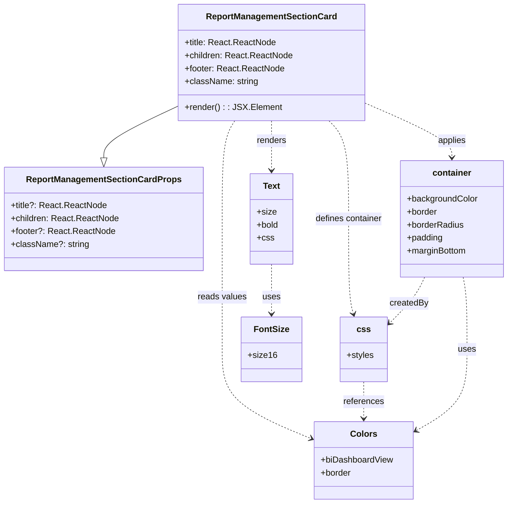

# Diagram: web/portal/src/pages/administration/report-management/components/organisms/ReportManagement.SectionCard.organism.tsx

> Auto-generated by Obscura crawlers

## Mermaid

### SVG

<svg id="container" width="928.3984375" xmlns="http://www.w3.org/2000/svg" class="classDiagram" height="934" viewBox="0 0 928.3984375 934" role="graphics-document document" aria-roledescription="class"><g><defs><marker id="container_class-aggregationStart" class="marker aggregation class" refX="18" refY="7" markerWidth="190" markerHeight="240" orient="auto"><path d="M 18,7 L9,13 L1,7 L9,1 Z"></path></marker></defs><defs><marker id="container_class-aggregationEnd" class="marker aggregation class" refX="1" refY="7" markerWidth="20" markerHeight="28" orient="auto"><path d="M 18,7 L9,13 L1,7 L9,1 Z"></path></marker></defs><defs><marker id="container_class-extensionStart" class="marker extension class" refX="18" refY="7" markerWidth="190" markerHeight="240" orient="auto"><path d="M 1,7 L18,13 V 1 Z"></path></marker></defs><defs><marker id="container_class-extensionEnd" class="marker extension class" refX="1" refY="7" markerWidth="20" markerHeight="28" orient="auto"><path d="M 1,1 V 13 L18,7 Z"></path></marker></defs><defs><marker id="container_class-compositionStart" class="marker composition class" refX="18" refY="7" markerWidth="190" markerHeight="240" orient="auto"><path d="M 18,7 L9,13 L1,7 L9,1 Z"></path></marker></defs><defs><marker id="container_class-compositionEnd" class="marker composition class" refX="1" refY="7" markerWidth="20" markerHeight="28" orient="auto"><path d="M 18,7 L9,13 L1,7 L9,1 Z"></path></marker></defs><defs><marker id="container_class-dependencyStart" class="marker dependency class" refX="6" refY="7" markerWidth="190" markerHeight="240" orient="auto"><path d="M 5,7 L9,13 L1,7 L9,1 Z"></path></marker></defs><defs><marker id="container_class-dependencyEnd" class="marker dependency class" refX="13" refY="7" markerWidth="20" markerHeight="28" orient="auto"><path d="M 18,7 L9,13 L14,7 L9,1 Z"></path></marker></defs><defs><marker id="container_class-lollipopStart" class="marker lollipop class" refX="13" refY="7" markerWidth="190" markerHeight="240" orient="auto"><circle stroke="black" fill="transparent" cx="7" cy="7" r="6"></circle></marker></defs><defs><marker id="container_class-lollipopEnd" class="marker lollipop class" refX="1" refY="7" markerWidth="190" markerHeight="240" orient="auto"><circle stroke="black" fill="transparent" cx="7" cy="7" r="6"></circle></marker></defs><g class="root"><g class="clusters"></g><g class="edgePaths"><path d="M320.723,197.198L298.556,207.831C276.389,218.465,232.056,239.733,209.889,255.658C187.723,271.583,187.723,282.167,187.723,287.458L187.723,292.75" id="id_ReportManagementSectionCard_ReportManagementSectionCardProps_1" class="edge-thickness-normal edge-pattern-solid relation" style=";;;" data-edge="true" data-et="edge" data-id="id_ReportManagementSectionCard_ReportManagementSectionCardProps_1" data-points="W3sieCI6MzIwLjcyMjY1NjI1LCJ5IjoxOTcuMTk3Njc2MzcyMTQyMzN9LHsieCI6MTg3LjcyMjY1NjI1LCJ5IjoyNjF9LHsieCI6MTg3LjcyMjY1NjI1LCJ5IjozMTB9XQ==" marker-end="url(#container_class-extensionEnd)"></path><path d="M489.984,224L489.984,230.167C489.984,236.333,489.984,248.667,489.984,264C489.984,279.333,489.984,297.667,489.984,306.833L489.984,316" id="id_ReportManagementSectionCard_Text_2" class="edge-thickness-normal edge-pattern-dashed relation" style=";;;" data-edge="true" data-et="edge" data-id="id_ReportManagementSectionCard_Text_2" data-points="W3sieCI6NDg5Ljk4NDM3NSwieSI6MjI0fSx7IngiOjQ4OS45ODQzNzUsInkiOjI2MX0seyJ4Ijo0ODkuOTg0Mzc1LCJ5IjozMjJ9XQ==" marker-end="url(#container_class-dependencyEnd)"></path><path d="M659.246,189.209L686.91,201.174C714.574,213.139,769.902,237.07,797.566,254.201C825.23,271.333,825.23,281.667,825.23,286.833L825.23,292" id="id_ReportManagementSectionCard_container_3" class="edge-thickness-normal edge-pattern-dashed relation" style=";;;" data-edge="true" data-et="edge" data-id="id_ReportManagementSectionCard_container_3" data-points="W3sieCI6NjU5LjI0NjA5Mzc1LCJ5IjoxODkuMjA4NzU1MjI4Nzg0OH0seyJ4Ijo4MjUuMjMwNDY4NzUsInkiOjI2MX0seyJ4Ijo4MjUuMjMwNDY4NzUsInkiOjI5OH1d" marker-end="url(#container_class-dependencyEnd)"></path><path d="M595.622,224L601.654,230.167C607.685,236.333,619.749,248.667,625.781,279C631.813,309.333,631.813,357.667,631.813,406C631.813,454.333,631.813,502.667,633.316,532.039C634.819,561.412,637.826,571.824,639.329,577.03L640.833,582.236" id="id_ReportManagementSectionCard_css_4" class="edge-thickness-normal edge-pattern-dashed relation" style=";;;" data-edge="true" data-et="edge" data-id="id_ReportManagementSectionCard_css_4" data-points="W3sieCI6NTk1LjYyMTg3NSwieSI6MjI0fSx7IngiOjYzMS44MTI1LCJ5IjoyNjF9LHsieCI6NjMxLjgxMjUsInkiOjQwNn0seyJ4Ijo2MzEuODEyNSwieSI6NTUxfSx7IngiOjY0Mi40OTczODI0MDk3OTM4LCJ5Ijo1ODh9XQ==" marker-end="url(#container_class-dependencyEnd)"></path><path d="M424.783,224L421.06,230.167C417.337,236.333,409.891,248.667,406.168,279C402.445,309.333,402.445,357.667,402.445,406C402.445,454.333,402.445,502.667,402.445,543C402.445,583.333,402.445,615.667,402.445,648C402.445,680.333,402.445,712.667,429.346,740.226C456.247,767.785,510.048,790.57,536.949,801.962L563.85,813.355" id="id_ReportManagementSectionCard_Colors_5" class="edge-thickness-normal edge-pattern-dashed relation" style=";;;" data-edge="true" data-et="edge" data-id="id_ReportManagementSectionCard_Colors_5" data-points="W3sieCI6NDI0Ljc4Mjg2NjM3OTMxMDM1LCJ5IjoyMjR9LHsieCI6NDAyLjQ0NTMxMjUsInkiOjI2MX0seyJ4Ijo0MDIuNDQ1MzEyNSwieSI6NDA2fSx7IngiOjQwMi40NDUzMTI1LCJ5Ijo1NTF9LHsieCI6NDAyLjQ0NTMxMjUsInkiOjY0OH0seyJ4Ijo0MDIuNDQ1MzEyNSwieSI6NzQ1fSx7IngiOjU2OS4zNzUsInkiOjgxNS42OTQ3NDQxOTA5ODc5fV0=" marker-end="url(#container_class-dependencyEnd)"></path><path d="M489.984,490L489.984,500.167C489.984,510.333,489.984,530.667,489.984,546C489.984,561.333,489.984,571.667,489.984,576.833L489.984,582" id="id_Text_FontSize_6" class="edge-thickness-normal edge-pattern-dashed relation" style=";;;" data-edge="true" data-et="edge" data-id="id_Text_FontSize_6" data-points="W3sieCI6NDg5Ljk4NDM3NSwieSI6NDkwfSx7IngiOjQ4OS45ODQzNzUsInkiOjU1MX0seyJ4Ijo0ODkuOTg0Mzc1LCJ5Ijo1ODh9XQ==" marker-end="url(#container_class-dependencyEnd)"></path><path d="M659.824,708L659.824,714.167C659.824,720.333,659.824,732.667,659.824,744C659.824,755.333,659.824,765.667,659.824,770.833L659.824,776" id="id_css_Colors_7" class="edge-thickness-normal edge-pattern-dashed relation" style=";;;" data-edge="true" data-et="edge" data-id="id_css_Colors_7" data-points="W3sieCI6NjU5LjgyNDIxODc1LCJ5Ijo3MDh9LHsieCI6NjU5LjgyNDIxODc1LCJ5Ijo3NDV9LHsieCI6NjU5LjgyNDIxODc1LCJ5Ijo3ODJ9XQ==" marker-end="url(#container_class-dependencyEnd)"></path><path d="M774.063,514L771.141,520.167C768.22,526.333,762.376,538.667,751.154,553.159C739.932,567.652,723.33,584.303,715.029,592.629L706.728,600.955" id="id_container_css_8" class="edge-thickness-normal edge-pattern-dashed relation" style=";;;" data-edge="true" data-et="edge" data-id="id_container_css_8" data-points="W3sieCI6Nzc0LjA2Mjg1MDIxNTUxNzMsInkiOjUxNH0seyJ4Ijo3NTYuNTMzMjAzMTI1LCJ5Ijo1NTF9LHsieCI6NzAyLjQ5MjE4NzUsInkiOjYwNS4yMDM2MzUyNjIwNDE4fV0=" marker-end="url(#container_class-dependencyEnd)"></path><path d="M846.094,514L847.286,520.167C848.477,526.333,850.86,538.667,852.051,561C853.242,583.333,853.242,615.667,853.242,648C853.242,680.333,853.242,712.667,836.952,738.014C820.662,763.361,788.081,781.721,771.791,790.902L755.501,800.082" id="id_container_Colors_9" class="edge-thickness-normal edge-pattern-dashed relation" style=";;;" data-edge="true" data-et="edge" data-id="id_container_Colors_9" data-points="W3sieCI6ODQ2LjA5NDM2OTYxMjA2ODksInkiOjUxNH0seyJ4Ijo4NTMuMjQyMTg3NSwieSI6NTUxfSx7IngiOjg1My4yNDIxODc1LCJ5Ijo2NDh9LHsieCI6ODUzLjI0MjE4NzUsInkiOjc0NX0seyJ4Ijo3NTAuMjczNDM3NSwieSI6ODAzLjAyNzY2ODM4MzMxODJ9XQ==" marker-end="url(#container_class-dependencyEnd)"></path></g><g class="edgeLabels"><g class="edgeLabel"><g class="label" data-id="id_ReportManagementSectionCard_ReportManagementSectionCardProps_1" transform="translate(0, 0)"><foreignObject width="0" height="0">

</foreignObject></g></g><g class="edgeLabel" transform="translate(489.984375, 261)"><g class="label" data-id="id_ReportManagementSectionCard_Text_2" transform="translate(-27.75, -12)"><foreignObject width="55.5" height="24">

renders

</foreignObject></g></g><g class="edgeLabel" transform="translate(825.23046875, 261)"><g class="label" data-id="id_ReportManagementSectionCard_container_3" transform="translate(-26.5546875, -12)"><foreignObject width="53.109375" height="24">

applies

</foreignObject></g></g><g class="edgeLabel" transform="translate(631.8125, 406)"><g class="label" data-id="id_ReportManagementSectionCard_css_4" transform="translate(-63.25, -12)"><foreignObject width="126.5" height="24">

defines container

</foreignObject></g></g><g class="edgeLabel" transform="translate(402.4453125, 551)"><g class="label" data-id="id_ReportManagementSectionCard_Colors_5" transform="translate(-45.296875, -12)"><foreignObject width="90.59375" height="24">

reads values

</foreignObject></g></g><g class="edgeLabel" transform="translate(489.984375, 551)"><g class="label" data-id="id_Text_FontSize_6" transform="translate(-16.4921875, -12)"><foreignObject width="32.984375" height="24">

uses

</foreignObject></g></g><g class="edgeLabel" transform="translate(659.82421875, 745)"><g class="label" data-id="id_css_Colors_7" transform="translate(-37.828125, -12)"><foreignObject width="75.65625" height="24">

references

</foreignObject></g></g><g class="edgeLabel" transform="translate(743.96629, 563.60473)"><g class="label" data-id="id_container_css_8" transform="translate(-36.0234375, -12)"><foreignObject width="72.046875" height="24">

createdBy

</foreignObject></g></g><g class="edgeLabel" transform="translate(853.2421875, 648)"><g class="label" data-id="id_container_Colors_9" transform="translate(-16.4921875, -12)"><foreignObject width="32.984375" height="24">

uses

</foreignObject></g></g></g><g class="nodes"><g class="node default" id="classId-ReportManagementSectionCard-0" transform="translate(489.984375, 116)"><g class="basic label-container"><path d="M-169.26171875 -108 L169.26171875 -108 L169.26171875 108 L-169.26171875 108" stroke="none" stroke-width="0" fill="#ECECFF" style=""></path><path d="M-169.26171875 -108 C-87.68883942052372 -108, -6.115960091047441 -108, 169.26171875 -108 M-169.26171875 -108 C-33.98228383056744 -108, 101.29715108886512 -108, 169.26171875 -108 M169.26171875 -108 C169.26171875 -37.954073347317475, 169.26171875 32.09185330536505, 169.26171875 108 M169.26171875 -108 C169.26171875 -43.28583618461769, 169.26171875 21.428327630764613, 169.26171875 108 M169.26171875 108 C95.03262290022948 108, 20.803527050458968 108, -169.26171875 108 M169.26171875 108 C86.22092621724396 108, 3.180133684487913 108, -169.26171875 108 M-169.26171875 108 C-169.26171875 47.84056702183001, -169.26171875 -12.318865956339977, -169.26171875 -108 M-169.26171875 108 C-169.26171875 32.50139618918851, -169.26171875 -42.99720762162298, -169.26171875 -108" stroke="#9370DB" stroke-width="1.3" fill="none" stroke-dasharray="0 0" style=""></path></g><g class="annotation-group text" transform="translate(0, -84)"></g><g class="label-group text" transform="translate(-116.2265625, -84)"><g class="label" style="font-weight: bolder" transform="translate(0,-12)"><foreignObject width="232.453125" height="24">

ReportManagementSectionCard

</foreignObject></g></g><g class="members-group text" transform="translate(-157.26171875, -36)"><g class="label" style="" transform="translate(0,-12)"><foreignObject width="167.9375" height="24">

+title: React.ReactNode

</foreignObject></g><g class="label" style="" transform="translate(0,12)"><foreignObject width="198.296875" height="24">

+children: React.ReactNode

</foreignObject></g><g class="label" style="" transform="translate(0,36)"><foreignObject width="183.03125" height="24">

+footer: React.ReactNode

</foreignObject></g><g class="label" style="" transform="translate(0,60)"><foreignObject width="135.359375" height="24">

+className: string

</foreignObject></g></g><g class="methods-group text" transform="translate(-157.26171875, 84)"><g class="label" style="" transform="translate(0,-12)"><foreignObject width="172.34375" height="24">

+render() : : JSX.Element

</foreignObject></g></g><g class="divider" style=""><path d="M-169.26171875 -60 C-101.2291398904564 -60, -33.19656103091279 -60, 169.26171875 -60 M-169.26171875 -60 C-39.684299643559456 -60, 89.89311946288109 -60, 169.26171875 -60" stroke="#9370DB" stroke-width="1.3" fill="none" stroke-dasharray="0 0" style=""></path></g><g class="divider" style=""><path d="M-169.26171875 60 C-67.57359345730849 60, 34.11453183538302 60, 169.26171875 60 M-169.26171875 60 C-35.38818288549177 60, 98.48535297901645 60, 169.26171875 60" stroke="#9370DB" stroke-width="1.3" fill="none" stroke-dasharray="0 0" style=""></path></g></g><g class="node default" id="classId-ReportManagementSectionCardProps-1" transform="translate(187.72265625, 406)"><g class="basic label-container"><path d="M-179.72265625 -96 L179.72265625 -96 L179.72265625 96 L-179.72265625 96" stroke="none" stroke-width="0" fill="#ECECFF" style=""></path><path d="M-179.72265625 -96 C-48.0603693652383 -96, 83.6019175195234 -96, 179.72265625 -96 M-179.72265625 -96 C-60.23708715783481 -96, 59.248481934330385 -96, 179.72265625 -96 M179.72265625 -96 C179.72265625 -54.510041090608425, 179.72265625 -13.02008218121685, 179.72265625 96 M179.72265625 -96 C179.72265625 -35.97247298061677, 179.72265625 24.055054038766457, 179.72265625 96 M179.72265625 96 C62.35417737174916 96, -55.01430150650168 96, -179.72265625 96 M179.72265625 96 C50.587305221745 96, -78.54804580651 96, -179.72265625 96 M-179.72265625 96 C-179.72265625 35.1327846064557, -179.72265625 -25.7344307870886, -179.72265625 -96 M-179.72265625 96 C-179.72265625 53.31400047679233, -179.72265625 10.62800095358466, -179.72265625 -96" stroke="#9370DB" stroke-width="1.3" fill="none" stroke-dasharray="0 0" style=""></path></g><g class="annotation-group text" transform="translate(0, -72)"></g><g class="label-group text" transform="translate(-137.1484375, -72)"><g class="label" style="font-weight: bolder" transform="translate(0,-12)"><foreignObject width="274.296875" height="24">

ReportManagementSectionCardProps

</foreignObject></g></g><g class="members-group text" transform="translate(-167.72265625, -24)"><g class="label" style="" transform="translate(0,-12)"><foreignObject width="174.640625" height="24">

+title?: React.ReactNode

</foreignObject></g><g class="label" style="" transform="translate(0,12)"><foreignObject width="198.296875" height="24">

+children: React.ReactNode

</foreignObject></g><g class="label" style="" transform="translate(0,36)"><foreignObject width="189.734375" height="24">

+footer?: React.ReactNode

</foreignObject></g><g class="label" style="" transform="translate(0,60)"><foreignObject width="142.0625" height="24">

+className?: string

</foreignObject></g></g><g class="methods-group text" transform="translate(-167.72265625, 96)"></g><g class="divider" style=""><path d="M-179.72265625 -48 C-84.1361608826169 -48, 11.450334484766188 -48, 179.72265625 -48 M-179.72265625 -48 C-39.314730785617485 -48, 101.09319467876503 -48, 179.72265625 -48" stroke="#9370DB" stroke-width="1.3" fill="none" stroke-dasharray="0 0" style=""></path></g><g class="divider" style=""><path d="M-179.72265625 72 C-50.11848338871718 72, 79.48568947256564 72, 179.72265625 72 M-179.72265625 72 C-74.05230323906629 72, 31.61804977186742 72, 179.72265625 72" stroke="#9370DB" stroke-width="1.3" fill="none" stroke-dasharray="0 0" style=""></path></g></g><g class="node default" id="classId-Text-2" transform="translate(489.984375, 406)"><g class="basic label-container"><path d="M-40.19921875 -84 L40.19921875 -84 L40.19921875 84 L-40.19921875 84" stroke="none" stroke-width="0" fill="#ECECFF" style=""></path><path d="M-40.19921875 -84 C-14.783380823194534 -84, 10.632457103610932 -84, 40.19921875 -84 M-40.19921875 -84 C-8.575612876369366 -84, 23.047992997261268 -84, 40.19921875 -84 M40.19921875 -84 C40.19921875 -35.79731385937583, 40.19921875 12.405372281248333, 40.19921875 84 M40.19921875 -84 C40.19921875 -36.09183800988755, 40.19921875 11.816323980224894, 40.19921875 84 M40.19921875 84 C16.971195187155367 84, -6.256828375689267 84, -40.19921875 84 M40.19921875 84 C9.828865318306736 84, -20.541488113386528 84, -40.19921875 84 M-40.19921875 84 C-40.19921875 40.293911673444, -40.19921875 -3.412176653111999, -40.19921875 -84 M-40.19921875 84 C-40.19921875 33.419964453328596, -40.19921875 -17.160071093342808, -40.19921875 -84" stroke="#9370DB" stroke-width="1.3" fill="none" stroke-dasharray="0 0" style=""></path></g><g class="annotation-group text" transform="translate(0, -60)"></g><g class="label-group text" transform="translate(-15.3828125, -60)"><g class="label" style="font-weight: bolder" transform="translate(0,-12)"><foreignObject width="30.765625" height="24">

Text

</foreignObject></g></g><g class="members-group text" transform="translate(-28.19921875, -12)"><g class="label" style="" transform="translate(0,-12)"><foreignObject width="35.578125" height="24">

+size

</foreignObject></g><g class="label" style="" transform="translate(0,12)"><foreignObject width="41.015625" height="24">

+bold

</foreignObject></g><g class="label" style="" transform="translate(0,36)"><foreignObject width="30.421875" height="24">

+css

</foreignObject></g></g><g class="methods-group text" transform="translate(-28.19921875, 84)"></g><g class="divider" style=""><path d="M-40.19921875 -36 C-21.508718766961074 -36, -2.8182187839221484 -36, 40.19921875 -36 M-40.19921875 -36 C-11.341754944616376 -36, 17.515708860767248 -36, 40.19921875 -36" stroke="#9370DB" stroke-width="1.3" fill="none" stroke-dasharray="0 0" style=""></path></g><g class="divider" style=""><path d="M-40.19921875 60 C-22.485042372261514 60, -4.770865994523028 60, 40.19921875 60 M-40.19921875 60 C-19.99055722570117 60, 0.2181042985976589 60, 40.19921875 60" stroke="#9370DB" stroke-width="1.3" fill="none" stroke-dasharray="0 0" style=""></path></g></g><g class="node default" id="classId-Colors-3" transform="translate(659.82421875, 854)"><g class="basic label-container"><path d="M-90.44921875 -72 L90.44921875 -72 L90.44921875 72 L-90.44921875 72" stroke="none" stroke-width="0" fill="#ECECFF" style=""></path><path d="M-90.44921875 -72 C-36.2989319795741 -72, 17.8513547908518 -72, 90.44921875 -72 M-90.44921875 -72 C-28.024327068508867 -72, 34.400564612982265 -72, 90.44921875 -72 M90.44921875 -72 C90.44921875 -21.44704454955876, 90.44921875 29.105910900882478, 90.44921875 72 M90.44921875 -72 C90.44921875 -37.3507988613239, 90.44921875 -2.7015977226478043, 90.44921875 72 M90.44921875 72 C35.998663858344734 72, -18.45189103331053 72, -90.44921875 72 M90.44921875 72 C22.294659641963193 72, -45.859899466073614 72, -90.44921875 72 M-90.44921875 72 C-90.44921875 36.25679240473635, -90.44921875 0.5135848094727038, -90.44921875 -72 M-90.44921875 72 C-90.44921875 41.33642562178406, -90.44921875 10.672851243568111, -90.44921875 -72" stroke="#9370DB" stroke-width="1.3" fill="none" stroke-dasharray="0 0" style=""></path></g><g class="annotation-group text" transform="translate(0, -48)"></g><g class="label-group text" transform="translate(-23.1015625, -48)"><g class="label" style="font-weight: bolder" transform="translate(0,-12)"><foreignObject width="46.203125" height="24">

Colors

</foreignObject></g></g><g class="members-group text" transform="translate(-78.44921875, 0)"><g class="label" style="" transform="translate(0,-12)"><foreignObject width="133.796875" height="24">

+biDashboardView

</foreignObject></g><g class="label" style="" transform="translate(0,12)"><foreignObject width="57" height="24">

+border

</foreignObject></g></g><g class="methods-group text" transform="translate(-78.44921875, 72)"></g><g class="divider" style=""><path d="M-90.44921875 -24 C-25.444202611697435 -24, 39.56081352660513 -24, 90.44921875 -24 M-90.44921875 -24 C-39.11950454155255 -24, 12.210209666894897 -24, 90.44921875 -24" stroke="#9370DB" stroke-width="1.3" fill="none" stroke-dasharray="0 0" style=""></path></g><g class="divider" style=""><path d="M-90.44921875 48 C-22.20226215028609 48, 46.04469444942782 48, 90.44921875 48 M-90.44921875 48 C-45.427242960692084 48, -0.40526717138416757 48, 90.44921875 48" stroke="#9370DB" stroke-width="1.3" fill="none" stroke-dasharray="0 0" style=""></path></g></g><g class="node default" id="classId-css-4" transform="translate(659.82421875, 648)"><g class="basic label-container"><path d="M-42.66796875 -60 L42.66796875 -60 L42.66796875 60 L-42.66796875 60" stroke="none" stroke-width="0" fill="#ECECFF" style=""></path><path d="M-42.66796875 -60 C-15.023387721045307 -60, 12.621193307909387 -60, 42.66796875 -60 M-42.66796875 -60 C-9.552689020617443 -60, 23.562590708765114 -60, 42.66796875 -60 M42.66796875 -60 C42.66796875 -28.890632980813315, 42.66796875 2.21873403837337, 42.66796875 60 M42.66796875 -60 C42.66796875 -27.50705702095709, 42.66796875 4.985885958085817, 42.66796875 60 M42.66796875 60 C8.639690515713752 60, -25.388587718572495 60, -42.66796875 60 M42.66796875 60 C13.779845385340884 60, -15.108277979318231 60, -42.66796875 60 M-42.66796875 60 C-42.66796875 33.16377487606842, -42.66796875 6.3275497521368465, -42.66796875 -60 M-42.66796875 60 C-42.66796875 26.500127795515972, -42.66796875 -6.999744408968056, -42.66796875 -60" stroke="#9370DB" stroke-width="1.3" fill="none" stroke-dasharray="0 0" style=""></path></g><g class="annotation-group text" transform="translate(0, -36)"></g><g class="label-group text" transform="translate(-11.5078125, -36)"><g class="label" style="font-weight: bolder" transform="translate(0,-12)"><foreignObject width="23.015625" height="24">

css

</foreignObject></g></g><g class="members-group text" transform="translate(-30.66796875, 12)"><g class="label" style="" transform="translate(0,-12)"><foreignObject width="49.828125" height="24">

+styles

</foreignObject></g></g><g class="methods-group text" transform="translate(-30.66796875, 60)"></g><g class="divider" style=""><path d="M-42.66796875 -12 C-21.49446216540552 -12, -0.32095558081103803 -12, 42.66796875 -12 M-42.66796875 -12 C-19.644379824262465 -12, 3.3792091014750696 -12, 42.66796875 -12" stroke="#9370DB" stroke-width="1.3" fill="none" stroke-dasharray="0 0" style=""></path></g><g class="divider" style=""><path d="M-42.66796875 36 C-17.035432677648824 36, 8.597103394702351 36, 42.66796875 36 M-42.66796875 36 C-22.434389828414947 36, -2.2008109068298936 36, 42.66796875 36" stroke="#9370DB" stroke-width="1.3" fill="none" stroke-dasharray="0 0" style=""></path></g></g><g class="node default" id="classId-FontSize-5" transform="translate(489.984375, 648)"><g class="basic label-container"><path d="M-52.5390625 -60 L52.5390625 -60 L52.5390625 60 L-52.5390625 60" stroke="none" stroke-width="0" fill="#ECECFF" style=""></path><path d="M-52.5390625 -60 C-16.48782597292451 -60, 19.563410554150977 -60, 52.5390625 -60 M-52.5390625 -60 C-11.903946194274631 -60, 28.731170111450737 -60, 52.5390625 -60 M52.5390625 -60 C52.5390625 -22.046661727395893, 52.5390625 15.906676545208214, 52.5390625 60 M52.5390625 -60 C52.5390625 -16.008682342567887, 52.5390625 27.982635314864226, 52.5390625 60 M52.5390625 60 C14.830619061322302 60, -22.877824377355395 60, -52.5390625 60 M52.5390625 60 C25.286156289510746 60, -1.9667499209785078 60, -52.5390625 60 M-52.5390625 60 C-52.5390625 21.30080028468008, -52.5390625 -17.39839943063984, -52.5390625 -60 M-52.5390625 60 C-52.5390625 31.806993954542683, -52.5390625 3.613987909085367, -52.5390625 -60" stroke="#9370DB" stroke-width="1.3" fill="none" stroke-dasharray="0 0" style=""></path></g><g class="annotation-group text" transform="translate(0, -36)"></g><g class="label-group text" transform="translate(-30.84375, -36)"><g class="label" style="font-weight: bolder" transform="translate(0,-12)"><foreignObject width="61.6875" height="24">

FontSize

</foreignObject></g></g><g class="members-group text" transform="translate(-40.5390625, 12)"><g class="label" style="" transform="translate(0,-12)"><foreignObject width="50.234375" height="24">

+size16

</foreignObject></g></g><g class="methods-group text" transform="translate(-40.5390625, 60)"></g><g class="divider" style=""><path d="M-52.5390625 -12 C-17.364790230324495 -12, 17.80948203935101 -12, 52.5390625 -12 M-52.5390625 -12 C-20.729977948555064 -12, 11.079106602889873 -12, 52.5390625 -12" stroke="#9370DB" stroke-width="1.3" fill="none" stroke-dasharray="0 0" style=""></path></g><g class="divider" style=""><path d="M-52.5390625 36 C-20.69355597542173 36, 11.151950549156538 36, 52.5390625 36 M-52.5390625 36 C-29.81741589087705 36, -7.095769281754102 36, 52.5390625 36" stroke="#9370DB" stroke-width="1.3" fill="none" stroke-dasharray="0 0" style=""></path></g></g><g class="node default" id="classId-container-6" transform="translate(825.23046875, 406)"><g class="basic label-container"><path d="M-95.16796875 -108 L95.16796875 -108 L95.16796875 108 L-95.16796875 108" stroke="none" stroke-width="0" fill="#ECECFF" style=""></path><path d="M-95.16796875 -108 C-28.989575830426134 -108, 37.18881708914773 -108, 95.16796875 -108 M-95.16796875 -108 C-29.879332758111133 -108, 35.409303233777734 -108, 95.16796875 -108 M95.16796875 -108 C95.16796875 -40.219606194291856, 95.16796875 27.560787611416288, 95.16796875 108 M95.16796875 -108 C95.16796875 -40.67671234667674, 95.16796875 26.646575306646525, 95.16796875 108 M95.16796875 108 C23.84425779154944 108, -47.47945316690112 108, -95.16796875 108 M95.16796875 108 C54.854279874081165 108, 14.54059099816233 108, -95.16796875 108 M-95.16796875 108 C-95.16796875 39.99228025739241, -95.16796875 -28.015439485215182, -95.16796875 -108 M-95.16796875 108 C-95.16796875 47.1529716744984, -95.16796875 -13.694056651003194, -95.16796875 -108" stroke="#9370DB" stroke-width="1.3" fill="none" stroke-dasharray="0 0" style=""></path></g><g class="annotation-group text" transform="translate(0, -84)"></g><g class="label-group text" transform="translate(-34.8359375, -84)"><g class="label" style="font-weight: bolder" transform="translate(0,-12)"><foreignObject width="69.671875" height="24">

container

</foreignObject></g></g><g class="members-group text" transform="translate(-83.16796875, -36)"><g class="label" style="" transform="translate(0,-12)"><foreignObject width="131.5" height="24">

+backgroundColor

</foreignObject></g><g class="label" style="" transform="translate(0,12)"><foreignObject width="57" height="24">

+border

</foreignObject></g><g class="label" style="" transform="translate(0,36)"><foreignObject width="106.09375" height="24">

+borderRadius

</foreignObject></g><g class="label" style="" transform="translate(0,60)"><foreignObject width="67.390625" height="24">

+padding

</foreignObject></g><g class="label" style="" transform="translate(0,84)"><foreignObject width="111.984375" height="24">

+marginBottom

</foreignObject></g></g><g class="methods-group text" transform="translate(-83.16796875, 108)"></g><g class="divider" style=""><path d="M-95.16796875 -60 C-30.817168585249107 -60, 33.53363157950179 -60, 95.16796875 -60 M-95.16796875 -60 C-36.35624212332725 -60, 22.455484503345502 -60, 95.16796875 -60" stroke="#9370DB" stroke-width="1.3" fill="none" stroke-dasharray="0 0" style=""></path></g><g class="divider" style=""><path d="M-95.16796875 84 C-35.52249327754821 84, 24.122982194903585 84, 95.16796875 84 M-95.16796875 84 C-51.73117541156798 84, -8.294382073135964 84, 95.16796875 84" stroke="#9370DB" stroke-width="1.3" fill="none" stroke-dasharray="0 0" style=""></path></g></g></g></g></g></svg>
