# Diagram: web/portal/src/pages/administration/report-management/hooks/useReportManagementAuditLogData.ts


> Auto-generated by Obscura crawlers

## Diagram 1

```mermaid
classDiagram
class ReportManagementAuditLogSearchDTO {
}
class PaginatedReportManagementAuditLogsDTO {
}
class reportManagementAuditLogSearchSchema {
  +parse(criteria)
}
class paginatedReportManagementAuditLogsSchema {
  +parse(data)
}
class getLocalApiUrl {
  +(path)
}
class axios {
  +get(url, options)
}
class fetchAuditLogs {
  +(criteria): PaginatedReportManagementAuditLogsDTO
}
class fetchAuditLogsByEntity {
  +(entityType, managementEntity, criteria): PaginatedReportManagementAuditLogsDTO
}
class fetchAuditLogsByOperation {
  +(operationType, criteria): PaginatedReportManagementAuditLogsDTO
}
class fetchAuditLogsByActor {
  +(actorId, criteria): PaginatedReportManagementAuditLogsDTO
}
class useReportManagementAuditLogData {
  +(criteria)
}
class useReportManagementAuditLogsByEntity {
  +(entityType, managementEntity, criteria)
}
class useReportManagementAuditLogsByOperation {
  +(operationType, criteria)
}
class useReportManagementAuditLogsByActor {
  +(actorId, criteria)
}

fetchAuditLogs --> reportManagementAuditLogSearchSchema : validates
fetchAuditLogs --> getLocalApiUrl : builds URL
fetchAuditLogs --> axios : performs GET
fetchAuditLogs --> paginatedReportManagementAuditLogsSchema : parses response
fetchAuditLogsByEntity --> reportManagementAuditLogSearchSchema : validates
fetchAuditLogsByEntity --> getLocalApiUrl : builds URL
fetchAuditLogsByEntity --> axios : performs GET
fetchAuditLogsByEntity --> paginatedReportManagementAuditLogsSchema : parses response
fetchAuditLogsByOperation --> reportManagementAuditLogSearchSchema : validates
fetchAuditLogsByOperation --> getLocalApiUrl : builds URL
fetchAuditLogsByOperation --> axios : performs GET
fetchAuditLogsByOperation --> paginatedReportManagementAuditLogsSchema : parses response
fetchAuditLogsByActor --> reportManagementAuditLogSearchSchema : validates
fetchAuditLogsByActor --> getLocalApiUrl : builds URL
fetchAuditLogsByActor --> axios : performs GET
fetchAuditLogsByActor --> paginatedReportManagementAuditLogsSchema : parses response

useReportManagementAuditLogData --> fetchAuditLogs : calls
useReportManagementAuditLogsByEntity --> fetchAuditLogsByEntity : calls
useReportManagementAuditLogsByOperation --> fetchAuditLogsByOperation : calls
useReportManagementAuditLogsByActor --> fetchAuditLogsByActor : calls
```



### SVG

<svg id="container" width="3696.9609375" xmlns="http://www.w3.org/2000/svg" class="classDiagram" height="542" viewBox="0 0 3696.9609375 542" role="graphics-document document" aria-roledescription="class"><style>#container{font-family:"trebuchet ms",verdana,arial,sans-serif;font-size:16px;fill:#333;}@keyframes edge-animation-frame{from{stroke-dashoffset:0;}}@keyframes dash{to{stroke-dashoffset:0;}}#container .edge-animation-slow{stroke-dasharray:9,5!important;stroke-dashoffset:900;animation:dash 50s linear infinite;stroke-linecap:round;}#container .edge-animation-fast{stroke-dasharray:9,5!important;stroke-dashoffset:900;animation:dash 20s linear infinite;stroke-linecap:round;}#container .error-icon{fill:#552222;}#container .error-text{fill:#552222;stroke:#552222;}#container .edge-thickness-normal{stroke-width:1px;}#container .edge-thickness-thick{stroke-width:3.5px;}#container .edge-pattern-solid{stroke-dasharray:0;}#container .edge-thickness-invisible{stroke-width:0;fill:none;}#container .edge-pattern-dashed{stroke-dasharray:3;}#container .edge-pattern-dotted{stroke-dasharray:2;}#container .marker{fill:#333333;stroke:#333333;}#container .marker.cross{stroke:#333333;}#container svg{font-family:"trebuchet ms",verdana,arial,sans-serif;font-size:16px;}#container p{margin:0;}#container g.classGroup text{fill:#9370DB;stroke:none;font-family:"trebuchet ms",verdana,arial,sans-serif;font-size:10px;}#container g.classGroup text .title{font-weight:bolder;}#container .nodeLabel,#container .edgeLabel{color:#131300;}#container .edgeLabel .label rect{fill:#ECECFF;}#container .label text{fill:#131300;}#container .labelBkg{background:#ECECFF;}#container .edgeLabel .label span{background:#ECECFF;}#container .classTitle{font-weight:bolder;}#container .node rect,#container .node circle,#container .node ellipse,#container .node polygon,#container .node path{fill:#ECECFF;stroke:#9370DB;stroke-width:1px;}#container .divider{stroke:#9370DB;stroke-width:1;}#container g.clickable{cursor:pointer;}#container g.classGroup rect{fill:#ECECFF;stroke:#9370DB;}#container g.classGroup line{stroke:#9370DB;stroke-width:1;}#container .classLabel .box{stroke:none;stroke-width:0;fill:#ECECFF;opacity:0.5;}#container .classLabel .label{fill:#9370DB;font-size:10px;}#container .relation{stroke:#333333;stroke-width:1;fill:none;}#container .dashed-line{stroke-dasharray:3;}#container .dotted-line{stroke-dasharray:1 2;}#container #compositionStart,#container .composition{fill:#333333!important;stroke:#333333!important;stroke-width:1;}#container #compositionEnd,#container .composition{fill:#333333!important;stroke:#333333!important;stroke-width:1;}#container #dependencyStart,#container .dependency{fill:#333333!important;stroke:#333333!important;stroke-width:1;}#container #dependencyStart,#container .dependency{fill:#333333!important;stroke:#333333!important;stroke-width:1;}#container #extensionStart,#container .extension{fill:transparent!important;stroke:#333333!important;stroke-width:1;}#container #extensionEnd,#container .extension{fill:transparent!important;stroke:#333333!important;stroke-width:1;}#container #aggregationStart,#container .aggregation{fill:transparent!important;stroke:#333333!important;stroke-width:1;}#container #aggregationEnd,#container .aggregation{fill:transparent!important;stroke:#333333!important;stroke-width:1;}#container #lollipopStart,#container .lollipop{fill:#ECECFF!important;stroke:#333333!important;stroke-width:1;}#container #lollipopEnd,#container .lollipop{fill:#ECECFF!important;stroke:#333333!important;stroke-width:1;}#container .edgeTerminals{font-size:11px;line-height:initial;}#container .classTitleText{text-anchor:middle;font-size:18px;fill:#333;}#container .label-icon{display:inline-block;height:1em;overflow:visible;vertical-align:-0.125em;}#container .node .label-icon path{fill:currentColor;stroke:revert;stroke-width:revert;}#container :root{--mermaid-font-family:"trebuchet ms",verdana,arial,sans-serif;}</style><g><defs><marker id="container_class-aggregationStart" class="marker aggregation class" refX="18" refY="7" markerWidth="190" markerHeight="240" orient="auto"><path d="M 18,7 L9,13 L1,7 L9,1 Z"></path></marker></defs><defs><marker id="container_class-aggregationEnd" class="marker aggregation class" refX="1" refY="7" markerWidth="20" markerHeight="28" orient="auto"><path d="M 18,7 L9,13 L1,7 L9,1 Z"></path></marker></defs><defs><marker id="container_class-extensionStart" class="marker extension class" refX="18" refY="7" markerWidth="190" markerHeight="240" orient="auto"><path d="M 1,7 L18,13 V 1 Z"></path></marker></defs><defs><marker id="container_class-extensionEnd" class="marker extension class" refX="1" refY="7" markerWidth="20" markerHeight="28" orient="auto"><path d="M 1,1 V 13 L18,7 Z"></path></marker></defs><defs><marker id="container_class-compositionStart" class="marker composition class" refX="18" refY="7" markerWidth="190" markerHeight="240" orient="auto"><path d="M 18,7 L9,13 L1,7 L9,1 Z"></path></marker></defs><defs><marker id="container_class-compositionEnd" class="marker composition class" refX="1" refY="7" markerWidth="20" markerHeight="28" orient="auto"><path d="M 18,7 L9,13 L1,7 L9,1 Z"></path></marker></defs><defs><marker id="container_class-dependencyStart" class="marker dependency class" refX="6" refY="7" markerWidth="190" markerHeight="240" orient="auto"><path d="M 5,7 L9,13 L1,7 L9,1 Z"></path></marker></defs><defs><marker id="container_class-dependencyEnd" class="marker dependency class" refX="13" refY="7" markerWidth="20" markerHeight="28" orient="auto"><path d="M 18,7 L9,13 L14,7 L9,1 Z"></path></marker></defs><defs><marker id="container_class-lollipopStart" class="marker lollipop class" refX="13" refY="7" markerWidth="190" markerHeight="240" orient="auto"><circle stroke="black" fill="transparent" cx="7" cy="7" r="6"></circle></marker></defs><defs><marker id="container_class-lollipopEnd" class="marker lollipop class" refX="1" refY="7" markerWidth="190" markerHeight="240" orient="auto"><circle stroke="black" fill="transparent" cx="7" cy="7" r="6"></circle></marker></defs><g class="root"><g class="clusters"></g><g class="edgePaths"><path d="M666.844,315.231L616.085,324.526C565.326,333.821,463.807,352.41,418.333,367.154C372.858,381.898,383.427,392.795,388.712,398.244L393.996,403.693" id="id_fetchAuditLogs_reportManagementAuditLogSearchSchema_1" class="edge-thickness-normal edge-pattern-solid relation" style=";;;" data-edge="true" data-et="edge" data-id="id_fetchAuditLogs_reportManagementAuditLogSearchSchema_1" data-points="W3sieCI6NjY2Ljg0Mzc1LCJ5IjozMTUuMjMxMTI2ODc5NDQzNzZ9LHsieCI6MzYyLjI4OTA2MjUsInkiOjM3MX0seyJ4IjozOTguMTczMjgxMjUsInkiOjQwOH1d" marker-end="url(#container_class-dependencyEnd)"></path><path d="M783.301,334L771.057,340.167C758.813,346.333,734.324,358.667,729.631,371.392C724.938,384.118,740.04,397.236,747.591,403.795L755.142,410.354" id="id_fetchAuditLogs_getLocalApiUrl_2" class="edge-thickness-normal edge-pattern-solid relation" style=";;;" data-edge="true" data-et="edge" data-id="id_fetchAuditLogs_getLocalApiUrl_2" data-points="W3sieCI6NzgzLjMwMTE3MTg3NSwieSI6MzM0fSx7IngiOjcwOS44MzU5Mzc1LCJ5IjozNzF9LHsieCI6NzU5LjY3MTg3NSwieSI6NDE0LjI4ODU0NTA1OTcxNzd9XQ==" marker-end="url(#container_class-dependencyEnd)"></path><path d="M1149.938,293.266L1290.486,306.221C1431.034,319.177,1712.13,345.089,2004.136,373.211C2296.141,401.333,2599.056,431.666,2750.514,446.832L2901.971,461.999" id="id_fetchAuditLogs_axios_3" class="edge-thickness-normal edge-pattern-solid relation" style=";;;" data-edge="true" data-et="edge" data-id="id_fetchAuditLogs_axios_3" data-points="W3sieCI6MTE0OS45Mzc1LCJ5IjoyOTMuMjY1NzUxNTg5NzQyMTR9LHsieCI6MTk5My4yMjY1NjI1LCJ5IjozNzF9LHsieCI6MjkwNy45NDE0MDYyNSwieSI6NDYyLjU5NjcxNDI1Nzc3NDN9XQ==" marker-end="url(#container_class-dependencyEnd)"></path><path d="M1149.938,281.117L1507.603,296.097C1865.268,311.078,2580.599,341.039,2950.147,361.752C3319.696,382.464,3343.462,393.929,3355.345,399.661L3367.228,405.393" id="id_fetchAuditLogs_paginatedReportManagementAuditLogsSchema_4" class="edge-thickness-normal edge-pattern-solid relation" style=";;;" data-edge="true" data-et="edge" data-id="id_fetchAuditLogs_paginatedReportManagementAuditLogsSchema_4" data-points="W3sieCI6MTE0OS45Mzc1LCJ5IjoyODEuMTE2OTgxMDcwMzM1OX0seyJ4IjozMjk1LjkyOTY4NzUsInkiOjM3MX0seyJ4IjozMzcyLjYzMjQyMTg3NSwieSI6NDA4fV0=" marker-end="url(#container_class-dependencyEnd)"></path><path d="M1199.938,303.994L1074.559,315.161C949.18,326.329,698.422,348.665,573.644,365.006C448.865,381.347,450.066,391.693,450.667,396.867L451.268,402.04" id="id_fetchAuditLogsByEntity_reportManagementAuditLogSearchSchema_5" class="edge-thickness-normal edge-pattern-solid relation" style=";;;" data-edge="true" data-et="edge" data-id="id_fetchAuditLogsByEntity_reportManagementAuditLogSearchSchema_5" data-points="W3sieCI6MTE5OS45Mzc1LCJ5IjozMDMuOTkzNTE0NDQ2MzYyfSx7IngiOjQ0Ny42NjQwNjI1LCJ5IjozNzF9LHsieCI6NDUxLjk1OTUzMTI1LCJ5Ijo0MDh9XQ==" marker-end="url(#container_class-dependencyEnd)"></path><path d="M1267.447,334L1237.798,340.167C1208.148,346.333,1148.85,358.667,1086.919,377.034C1024.988,395.401,960.425,419.802,928.144,432.003L895.863,444.203" id="id_fetchAuditLogsByEntity_getLocalApiUrl_6" class="edge-thickness-normal edge-pattern-solid relation" style=";;;" data-edge="true" data-et="edge" data-id="id_fetchAuditLogsByEntity_getLocalApiUrl_6" data-points="W3sieCI6MTI2Ny40NDcwNzAzMTI1LCJ5IjozMzR9LHsieCI6MTA4OS41NTA3ODEyNSwieSI6MzcxfSx7IngiOjg5MC4yNSwieSI6NDQ2LjMyNDQyNjA3MjE5MzF9XQ==" marker-end="url(#container_class-dependencyEnd)"></path><path d="M1940.766,318.397L2009.283,327.164C2077.801,335.931,2214.836,353.466,2375.044,376.56C2535.252,399.654,2718.633,428.308,2810.323,442.634L2902.013,456.961" id="id_fetchAuditLogsByEntity_axios_7" class="edge-thickness-normal edge-pattern-solid relation" style=";;;" data-edge="true" data-et="edge" data-id="id_fetchAuditLogsByEntity_axios_7" data-points="W3sieCI6MTk0MC43NjU2MjUsInkiOjMxOC4zOTY2NDgxNTYzODYwNX0seyJ4IjoyMzUxLjg3MTA5Mzc1LCJ5IjozNzF9LHsieCI6MjkwNy45NDE0MDYyNSwieSI6NDU3Ljg4NzU3NzI4NzE4MTh9XQ==" marker-end="url(#container_class-dependencyEnd)"></path><path d="M1940.766,290.874L2189.66,304.229C2438.555,317.583,2936.344,344.291,3188.931,362.99C3441.518,381.688,3448.904,392.376,3452.597,397.72L3456.289,403.064" id="id_fetchAuditLogsByEntity_paginatedReportManagementAuditLogsSchema_8" class="edge-thickness-normal edge-pattern-solid relation" style=";;;" data-edge="true" data-et="edge" data-id="id_fetchAuditLogsByEntity_paginatedReportManagementAuditLogsSchema_8" data-points="W3sieCI6MTk0MC43NjU2MjUsInkiOjI5MC44NzQzMzE0MTYzMDc2fSx7IngiOjM0MzQuMTMyODEyNSwieSI6MzcxfSx7IngiOjM0NTkuNzAwMzkwNjI1LCJ5Ijo0MDh9XQ==" marker-end="url(#container_class-dependencyEnd)"></path><path d="M1990.766,289.032L1747.811,302.694C1504.857,316.355,1018.948,343.677,772.038,362.701C525.129,381.724,517.218,392.448,513.263,397.81L509.308,403.172" id="id_fetchAuditLogsByOperation_reportManagementAuditLogSearchSchema_9" class="edge-thickness-normal edge-pattern-solid relation" style=";;;" data-edge="true" data-et="edge" data-id="id_fetchAuditLogsByOperation_reportManagementAuditLogSearchSchema_9" data-points="W3sieCI6MTk5MC43NjU2MjUsInkiOjI4OS4wMzIzOTgwMDEyMDgwNH0seyJ4Ijo1MzMuMDM5MDYyNSwieSI6MzcxfSx7IngiOjUwNS43NDU3ODEyNSwieSI6NDA4fV0=" marker-end="url(#container_class-dependencyEnd)"></path><path d="M1990.766,310.956L1910.444,320.963C1830.123,330.97,1669.48,350.985,1487.051,375.923C1304.621,400.862,1100.404,430.723,998.295,445.654L896.187,460.585" id="id_fetchAuditLogsByOperation_getLocalApiUrl_10" class="edge-thickness-normal edge-pattern-solid relation" style=";;;" data-edge="true" data-et="edge" data-id="id_fetchAuditLogsByOperation_getLocalApiUrl_10" data-points="W3sieCI6MTk5MC43NjU2MjUsInkiOjMxMC45NTU2MTQwNjYyNTI4fSx7IngiOjE1MDguODM3ODkwNjI1LCJ5IjozNzF9LHsieCI6ODkwLjI1LCJ5Ijo0NjEuNDUzMDk4MDAyMjU2Mn1d" marker-end="url(#container_class-dependencyEnd)"></path><path d="M2607.374,334L2636.339,340.167C2665.304,346.333,2723.235,358.667,2772.426,374.433C2821.618,390.199,2862.069,409.399,2882.295,418.998L2902.521,428.598" id="id_fetchAuditLogsByOperation_axios_11" class="edge-thickness-normal edge-pattern-solid relation" style=";;;" data-edge="true" data-et="edge" data-id="id_fetchAuditLogsByOperation_axios_11" data-points="W3sieCI6MjYwNy4zNzM2OTE0MDYyNSwieSI6MzM0fSx7IngiOjI3ODEuMTY2MDE1NjI1LCJ5IjozNzF9LHsieCI6MjkwNy45NDE0MDYyNSwieSI6NDMxLjE3MDU2Nzc4Njc5MDN9XQ==" marker-end="url(#container_class-dependencyEnd)"></path><path d="M2632.148,296.434L2788.846,308.862C2945.544,321.289,3258.94,346.145,3411.945,363.916C3564.95,381.688,3557.565,392.376,3553.872,397.72L3550.179,403.064" id="id_fetchAuditLogsByOperation_paginatedReportManagementAuditLogsSchema_12" class="edge-thickness-normal edge-pattern-solid relation" style=";;;" data-edge="true" data-et="edge" data-id="id_fetchAuditLogsByOperation_paginatedReportManagementAuditLogsSchema_12" data-points="W3sieCI6MjYzMi4xNDg0Mzc1LCJ5IjoyOTYuNDMzOTU3NTg3ODY4MDZ9LHsieCI6MzU3Mi4zMzU5Mzc1LCJ5IjozNzF9LHsieCI6MzU0Ni43NjgzNTkzNzUsInkiOjQwOH1d" marker-end="url(#container_class-dependencyEnd)"></path><path d="M2682.148,283.159L2338.193,297.799C1994.237,312.439,1306.326,341.72,953.403,361.994C600.48,382.269,582.546,393.538,573.579,399.173L564.612,404.808" id="id_fetchAuditLogsByActor_reportManagementAuditLogSearchSchema_13" class="edge-thickness-normal edge-pattern-solid relation" style=";;;" data-edge="true" data-et="edge" data-id="id_fetchAuditLogsByActor_reportManagementAuditLogSearchSchema_13" data-points="W3sieCI6MjY4Mi4xNDg0Mzc1LCJ5IjoyODMuMTU5MDMwMDcwODYyNTd9LHsieCI6NjE4LjQxNDA2MjUsInkiOjM3MX0seyJ4Ijo1NTkuNTMyMDMxMjUsInkiOjQwOH1d" marker-end="url(#container_class-dependencyEnd)"></path><path d="M2682.148,297.4L2549.415,309.667C2416.682,321.933,2151.216,346.467,1853.562,374.28C1555.908,402.094,1226.066,433.188,1061.145,448.735L896.224,464.282" id="id_fetchAuditLogsByActor_getLocalApiUrl_14" class="edge-thickness-normal edge-pattern-solid relation" style=";;;" data-edge="true" data-et="edge" data-id="id_fetchAuditLogsByActor_getLocalApiUrl_14" data-points="W3sieCI6MjY4Mi4xNDg0Mzc1LCJ5IjoyOTcuMzk5OTU5NTY3OTU0NzR9LHsieCI6MTg4NS43NSwieSI6MzcxfSx7IngiOjg5MC4yNSwieSI6NDY0Ljg0NTIzNjA3ODY4NTV9XQ==" marker-end="url(#container_class-dependencyEnd)"></path><path d="M3093.985,334L3106.335,340.167C3118.685,346.333,3143.386,358.667,3141.221,373.07C3139.056,387.473,3110.026,403.946,3095.511,412.183L3080.996,420.419" id="id_fetchAuditLogsByActor_axios_15" class="edge-thickness-normal edge-pattern-solid relation" style=";;;" data-edge="true" data-et="edge" data-id="id_fetchAuditLogsByActor_axios_15" data-points="W3sieCI6MzA5My45ODQ3NjU2MjUsInkiOjMzNH0seyJ4IjozMTY4LjA4NTkzNzUsInkiOjM3MX0seyJ4IjozMDc1Ljc3NzM0Mzc1LCJ5Ijo0MjMuMzgwNjM1NzIyODM1NX1d" marker-end="url(#container_class-dependencyEnd)"></path><path d="M3253.477,309.462L3329.654,319.718C3405.831,329.974,3558.185,350.487,3622.479,366.476C3686.773,382.464,3663.007,393.929,3651.124,399.661L3639.24,405.393" id="id_fetchAuditLogsByActor_paginatedReportManagementAuditLogsSchema_16" class="edge-thickness-normal edge-pattern-solid relation" style=";;;" data-edge="true" data-et="edge" data-id="id_fetchAuditLogsByActor_paginatedReportManagementAuditLogsSchema_16" data-points="W3sieCI6MzI1My40NzY1NjI1LCJ5IjozMDkuNDYxNTM4NDYxNTM4NDV9LHsieCI6MzcxMC41MzkwNjI1LCJ5IjozNzF9LHsieCI6MzYzMy44MzYzMjgxMjUsInkiOjQwOH1d" marker-end="url(#container_class-dependencyEnd)"></path><path d="M908.391,134L908.391,140.167C908.391,146.333,908.391,158.667,908.391,170C908.391,181.333,908.391,191.667,908.391,196.833L908.391,202" id="id_useReportManagementAuditLogData_fetchAuditLogs_17" class="edge-thickness-normal edge-pattern-solid relation" style=";;;" data-edge="true" data-et="edge" data-id="id_useReportManagementAuditLogData_fetchAuditLogs_17" data-points="W3sieCI6OTA4LjM5MDYyNSwieSI6MTM0fSx7IngiOjkwOC4zOTA2MjUsInkiOjE3MX0seyJ4Ijo5MDguMzkwNjI1LCJ5IjoyMDh9XQ==" marker-end="url(#container_class-dependencyEnd)"></path><path d="M1570.352,134L1570.352,140.167C1570.352,146.333,1570.352,158.667,1570.352,170C1570.352,181.333,1570.352,191.667,1570.352,196.833L1570.352,202" id="id_useReportManagementAuditLogsByEntity_fetchAuditLogsByEntity_18" class="edge-thickness-normal edge-pattern-solid relation" style=";;;" data-edge="true" data-et="edge" data-id="id_useReportManagementAuditLogsByEntity_fetchAuditLogsByEntity_18" data-points="W3sieCI6MTU3MC4zNTE1NjI1LCJ5IjoxMzR9LHsieCI6MTU3MC4zNTE1NjI1LCJ5IjoxNzF9LHsieCI6MTU3MC4zNTE1NjI1LCJ5IjoyMDh9XQ==" marker-end="url(#container_class-dependencyEnd)"></path><path d="M2311.457,134L2311.457,140.167C2311.457,146.333,2311.457,158.667,2311.457,170C2311.457,181.333,2311.457,191.667,2311.457,196.833L2311.457,202" id="id_useReportManagementAuditLogsByOperation_fetchAuditLogsByOperation_19" class="edge-thickness-normal edge-pattern-solid relation" style=";;;" data-edge="true" data-et="edge" data-id="id_useReportManagementAuditLogsByOperation_fetchAuditLogsByOperation_19" data-points="W3sieCI6MjMxMS40NTcwMzEyNSwieSI6MTM0fSx7IngiOjIzMTEuNDU3MDMxMjUsInkiOjE3MX0seyJ4IjoyMzExLjQ1NzAzMTI1LCJ5IjoyMDh9XQ==" marker-end="url(#container_class-dependencyEnd)"></path><path d="M2967.813,134L2967.813,140.167C2967.813,146.333,2967.813,158.667,2967.813,170C2967.813,181.333,2967.813,191.667,2967.813,196.833L2967.813,202" id="id_useReportManagementAuditLogsByActor_fetchAuditLogsByActor_20" class="edge-thickness-normal edge-pattern-solid relation" style=";;;" data-edge="true" data-et="edge" data-id="id_useReportManagementAuditLogsByActor_fetchAuditLogsByActor_20" data-points="W3sieCI6Mjk2Ny44MTI1LCJ5IjoxMzR9LHsieCI6Mjk2Ny44MTI1LCJ5IjoxNzF9LHsieCI6Mjk2Ny44MTI1LCJ5IjoyMDh9XQ==" marker-end="url(#container_class-dependencyEnd)"></path></g><g class="edgeLabels"><g class="edgeLabel" transform="translate(489.21643, 347.75755)"><g class="label" data-id="id_fetchAuditLogs_reportManagementAuditLogSearchSchema_1" transform="translate(-32.6875, -12)"><foreignObject width="65.375" height="24"><div xmlns="http://www.w3.org/1999/xhtml" class="labelBkg" style="display: table-cell; white-space: nowrap; line-height: 1.5; max-width: 200px; text-align: center;"><span class="edgeLabel"><p>validates</p></span></div></foreignObject></g></g><g class="edgeLabel" transform="translate(709.8359375, 371)"><g class="label" data-id="id_fetchAuditLogs_getLocalApiUrl_2" transform="translate(-38.734375, -12)"><foreignObject width="77.46875" height="24"><div xmlns="http://www.w3.org/1999/xhtml" class="labelBkg" style="display: table-cell; white-space: nowrap; line-height: 1.5; max-width: 200px; text-align: center;"><span class="edgeLabel"><p>builds URL</p></span></div></foreignObject></g></g><g class="edgeLabel" transform="translate(2029.25899, 374.60818)"><g class="label" data-id="id_fetchAuditLogs_axios_3" transform="translate(-48.7421875, -12)"><foreignObject width="97.484375" height="24"><div xmlns="http://www.w3.org/1999/xhtml" class="labelBkg" style="display: table-cell; white-space: nowrap; line-height: 1.5; max-width: 200px; text-align: center;"><span class="edgeLabel"><p>performs GET</p></span></div></foreignObject></g></g><g class="edgeLabel" transform="translate(2265.47654, 327.84036)"><g class="label" data-id="id_fetchAuditLogs_paginatedReportManagementAuditLogsSchema_4" transform="translate(-59.1015625, -12)"><foreignObject width="118.203125" height="24"><div xmlns="http://www.w3.org/1999/xhtml" class="labelBkg" style="display: table-cell; white-space: nowrap; line-height: 1.5; max-width: 200px; text-align: center;"><span class="edgeLabel"><p>parses response</p></span></div></foreignObject></g></g><g class="edgeLabel" transform="translate(805.24997, 339.14911)"><g class="label" data-id="id_fetchAuditLogsByEntity_reportManagementAuditLogSearchSchema_5" transform="translate(-32.6875, -12)"><foreignObject width="65.375" height="24"><div xmlns="http://www.w3.org/1999/xhtml" class="labelBkg" style="display: table-cell; white-space: nowrap; line-height: 1.5; max-width: 200px; text-align: center;"><span class="edgeLabel"><p>validates</p></span></div></foreignObject></g></g><g class="edgeLabel" transform="translate(1074.88492, 376.54287)"><g class="label" data-id="id_fetchAuditLogsByEntity_getLocalApiUrl_6" transform="translate(-38.734375, -12)"><foreignObject width="77.46875" height="24"><div xmlns="http://www.w3.org/1999/xhtml" class="labelBkg" style="display: table-cell; white-space: nowrap; line-height: 1.5; max-width: 200px; text-align: center;"><span class="edgeLabel"><p>builds URL</p></span></div></foreignObject></g></g><g class="edgeLabel" transform="translate(2425.16196, 382.45191)"><g class="label" data-id="id_fetchAuditLogsByEntity_axios_7" transform="translate(-48.7421875, -12)"><foreignObject width="97.484375" height="24"><div xmlns="http://www.w3.org/1999/xhtml" class="labelBkg" style="display: table-cell; white-space: nowrap; line-height: 1.5; max-width: 200px; text-align: center;"><span class="edgeLabel"><p>performs GET</p></span></div></foreignObject></g></g><g class="edgeLabel" transform="translate(2709.90414, 332.14197)"><g class="label" data-id="id_fetchAuditLogsByEntity_paginatedReportManagementAuditLogsSchema_8" transform="translate(-59.1015625, -12)"><foreignObject width="118.203125" height="24"><div xmlns="http://www.w3.org/1999/xhtml" class="labelBkg" style="display: table-cell; white-space: nowrap; line-height: 1.5; max-width: 200px; text-align: center;"><span class="edgeLabel"><p>parses response</p></span></div></foreignObject></g></g><g class="edgeLabel" transform="translate(1238.94989, 331.30681)"><g class="label" data-id="id_fetchAuditLogsByOperation_reportManagementAuditLogSearchSchema_9" transform="translate(-32.6875, -12)"><foreignObject width="65.375" height="24"><div xmlns="http://www.w3.org/1999/xhtml" class="labelBkg" style="display: table-cell; white-space: nowrap; line-height: 1.5; max-width: 200px; text-align: center;"><span class="edgeLabel"><p>validates</p></span></div></foreignObject></g></g><g class="edgeLabel" transform="translate(1439.81574, 381.09277)"><g class="label" data-id="id_fetchAuditLogsByOperation_getLocalApiUrl_10" transform="translate(-38.734375, -12)"><foreignObject width="77.46875" height="24"><div xmlns="http://www.w3.org/1999/xhtml" class="labelBkg" style="display: table-cell; white-space: nowrap; line-height: 1.5; max-width: 200px; text-align: center;"><span class="edgeLabel"><p>builds URL</p></span></div></foreignObject></g></g><g class="edgeLabel" transform="translate(2762.89679, 367.11052)"><g class="label" data-id="id_fetchAuditLogsByOperation_axios_11" transform="translate(-48.7421875, -12)"><foreignObject width="97.484375" height="24"><div xmlns="http://www.w3.org/1999/xhtml" class="labelBkg" style="display: table-cell; white-space: nowrap; line-height: 1.5; max-width: 200px; text-align: center;"><span class="edgeLabel"><p>performs GET</p></span></div></foreignObject></g></g><g class="edgeLabel" transform="translate(3124.65902, 335.49485)"><g class="label" data-id="id_fetchAuditLogsByOperation_paginatedReportManagementAuditLogsSchema_12" transform="translate(-59.1015625, -12)"><foreignObject width="118.203125" height="24"><div xmlns="http://www.w3.org/1999/xhtml" class="labelBkg" style="display: table-cell; white-space: nowrap; line-height: 1.5; max-width: 200px; text-align: center;"><span class="edgeLabel"><p>parses response</p></span></div></foreignObject></g></g><g class="edgeLabel" transform="translate(1615.54169, 328.55817)"><g class="label" data-id="id_fetchAuditLogsByActor_reportManagementAuditLogSearchSchema_13" transform="translate(-32.6875, -12)"><foreignObject width="65.375" height="24"><div xmlns="http://www.w3.org/1999/xhtml" class="labelBkg" style="display: table-cell; white-space: nowrap; line-height: 1.5; max-width: 200px; text-align: center;"><span class="edgeLabel"><p>validates</p></span></div></foreignObject></g></g><g class="edgeLabel" transform="translate(1786.13093, 380.39103)"><g class="label" data-id="id_fetchAuditLogsByActor_getLocalApiUrl_14" transform="translate(-38.734375, -12)"><foreignObject width="77.46875" height="24"><div xmlns="http://www.w3.org/1999/xhtml" class="labelBkg" style="display: table-cell; white-space: nowrap; line-height: 1.5; max-width: 200px; text-align: center;"><span class="edgeLabel"><p>builds URL</p></span></div></foreignObject></g></g><g class="edgeLabel" transform="translate(3157.94931, 376.75204)"><g class="label" data-id="id_fetchAuditLogsByActor_axios_15" transform="translate(-48.7421875, -12)"><foreignObject width="97.484375" height="24"><div xmlns="http://www.w3.org/1999/xhtml" class="labelBkg" style="display: table-cell; white-space: nowrap; line-height: 1.5; max-width: 200px; text-align: center;"><span class="edgeLabel"><p>performs GET</p></span></div></foreignObject></g></g><g class="edgeLabel" transform="translate(3524.20729, 345.91247)"><g class="label" data-id="id_fetchAuditLogsByActor_paginatedReportManagementAuditLogsSchema_16" transform="translate(-59.1015625, -12)"><foreignObject width="118.203125" height="24"><div xmlns="http://www.w3.org/1999/xhtml" class="labelBkg" style="display: table-cell; white-space: nowrap; line-height: 1.5; max-width: 200px; text-align: center;"><span class="edgeLabel"><p>parses response</p></span></div></foreignObject></g></g><g class="edgeLabel" transform="translate(908.390625, 171)"><g class="label" data-id="id_useReportManagementAuditLogData_fetchAuditLogs_17" transform="translate(-16.4453125, -12)"><foreignObject width="32.890625" height="24"><div xmlns="http://www.w3.org/1999/xhtml" class="labelBkg" style="display: table-cell; white-space: nowrap; line-height: 1.5; max-width: 200px; text-align: center;"><span class="edgeLabel"><p>calls</p></span></div></foreignObject></g></g><g class="edgeLabel" transform="translate(1570.3515625, 171)"><g class="label" data-id="id_useReportManagementAuditLogsByEntity_fetchAuditLogsByEntity_18" transform="translate(-16.4453125, -12)"><foreignObject width="32.890625" height="24"><div xmlns="http://www.w3.org/1999/xhtml" class="labelBkg" style="display: table-cell; white-space: nowrap; line-height: 1.5; max-width: 200px; text-align: center;"><span class="edgeLabel"><p>calls</p></span></div></foreignObject></g></g><g class="edgeLabel" transform="translate(2311.45703125, 171)"><g class="label" data-id="id_useReportManagementAuditLogsByOperation_fetchAuditLogsByOperation_19" transform="translate(-16.4453125, -12)"><foreignObject width="32.890625" height="24"><div xmlns="http://www.w3.org/1999/xhtml" class="labelBkg" style="display: table-cell; white-space: nowrap; line-height: 1.5; max-width: 200px; text-align: center;"><span class="edgeLabel"><p>calls</p></span></div></foreignObject></g></g><g class="edgeLabel" transform="translate(2967.8125, 171)"><g class="label" data-id="id_useReportManagementAuditLogsByActor_fetchAuditLogsByActor_20" transform="translate(-16.4453125, -12)"><foreignObject width="32.890625" height="24"><div xmlns="http://www.w3.org/1999/xhtml" class="labelBkg" style="display: table-cell; white-space: nowrap; line-height: 1.5; max-width: 200px; text-align: center;"><span class="edgeLabel"><p>calls</p></span></div></foreignObject></g></g></g><g class="nodes"><g class="node default" id="classId-ReportManagementAuditLogSearchDTO-0" transform="translate(163.734375, 71)"><g class="basic label-container"><path d="M-155.734375 -42 L155.734375 -42 L155.734375 42 L-155.734375 42" stroke="none" stroke-width="0" fill="#ECECFF" style=""></path><path d="M-155.734375 -42 C-50.54476024846264 -42, 54.644854503074725 -42, 155.734375 -42 M-155.734375 -42 C-50.710836548516426 -42, 54.31270190296715 -42, 155.734375 -42 M155.734375 -42 C155.734375 -12.808599936031715, 155.734375 16.38280012793657, 155.734375 42 M155.734375 -42 C155.734375 -17.280202568215028, 155.734375 7.439594863569944, 155.734375 42 M155.734375 42 C56.182557710343715 42, -43.36925957931257 42, -155.734375 42 M155.734375 42 C42.94828769992719 42, -69.83779960014562 42, -155.734375 42 M-155.734375 42 C-155.734375 9.017984570710524, -155.734375 -23.96403085857895, -155.734375 -42 M-155.734375 42 C-155.734375 15.043286548898763, -155.734375 -11.913426902202474, -155.734375 -42" stroke="#9370DB" stroke-width="1.3" fill="none" stroke-dasharray="0 0" style=""></path></g><g class="annotation-group text" transform="translate(0, -18)"></g><g class="label-group text" transform="translate(-143.734375, -18)"><g class="label" style="font-weight: bolder" transform="translate(0,-12)"><foreignObject width="287.46875" height="24"><div xmlns="http://www.w3.org/1999/xhtml" style="display: table-cell; white-space: nowrap; line-height: 1.5; max-width: 333px; text-align: center;"><span class="nodeLabel markdown-node-label" style=""><p>ReportManagementAuditLogSearchDTO</p></span></div></foreignObject></g></g><g class="members-group text" transform="translate(-143.734375, 30)"></g><g class="methods-group text" transform="translate(-143.734375, 60)"></g><g class="divider" style=""><path d="M-155.734375 6 C-83.26637222140451 6, -10.798369442809019 6, 155.734375 6 M-155.734375 6 C-64.59488146123299 6, 26.544612077534026 6, 155.734375 6" stroke="#9370DB" stroke-width="1.3" fill="none" stroke-dasharray="0 0" style=""></path></g><g class="divider" style=""><path d="M-155.734375 24 C-36.942543938180165 24, 81.84928712363967 24, 155.734375 24 M-155.734375 24 C-83.7250291999869 24, -11.715683399973813 24, 155.734375 24" stroke="#9370DB" stroke-width="1.3" fill="none" stroke-dasharray="0 0" style=""></path></g></g><g class="node default" id="classId-PaginatedReportManagementAuditLogsDTO-1" transform="translate(540.796875, 71)"><g class="basic label-container"><path d="M-171.328125 -42 L171.328125 -42 L171.328125 42 L-171.328125 42" stroke="none" stroke-width="0" fill="#ECECFF" style=""></path><path d="M-171.328125 -42 C-42.777012061637436 -42, 85.77410087672513 -42, 171.328125 -42 M-171.328125 -42 C-86.82626522619803 -42, -2.324405452396064 -42, 171.328125 -42 M171.328125 -42 C171.328125 -12.359629731483775, 171.328125 17.28074053703245, 171.328125 42 M171.328125 -42 C171.328125 -16.72580189349582, 171.328125 8.54839621300836, 171.328125 42 M171.328125 42 C85.9568123820526 42, 0.585499764105208 42, -171.328125 42 M171.328125 42 C79.65900046550713 42, -12.010124068985732 42, -171.328125 42 M-171.328125 42 C-171.328125 16.948542926228008, -171.328125 -8.102914147543984, -171.328125 -42 M-171.328125 42 C-171.328125 15.752316778312245, -171.328125 -10.49536644337551, -171.328125 -42" stroke="#9370DB" stroke-width="1.3" fill="none" stroke-dasharray="0 0" style=""></path></g><g class="annotation-group text" transform="translate(0, -18)"></g><g class="label-group text" transform="translate(-159.328125, -18)"><g class="label" style="font-weight: bolder" transform="translate(0,-12)"><foreignObject width="318.65625" height="24"><div xmlns="http://www.w3.org/1999/xhtml" style="display: table-cell; white-space: nowrap; line-height: 1.5; max-width: 364px; text-align: center;"><span class="nodeLabel markdown-node-label" style=""><p>PaginatedReportManagementAuditLogsDTO</p></span></div></foreignObject></g></g><g class="members-group text" transform="translate(-159.328125, 30)"></g><g class="methods-group text" transform="translate(-159.328125, 60)"></g><g class="divider" style=""><path d="M-171.328125 6 C-97.98053023809592 6, -24.632935476191847 6, 171.328125 6 M-171.328125 6 C-48.46443011286972 6, 74.39926477426056 6, 171.328125 6" stroke="#9370DB" stroke-width="1.3" fill="none" stroke-dasharray="0 0" style=""></path></g><g class="divider" style=""><path d="M-171.328125 24 C-58.114450906417304 24, 55.09922318716539 24, 171.328125 24 M-171.328125 24 C-56.010750582891504 24, 59.30662383421699 24, 171.328125 24" stroke="#9370DB" stroke-width="1.3" fill="none" stroke-dasharray="0 0" style=""></path></g></g><g class="node default" id="classId-reportManagementAuditLogSearchSchema-2" transform="translate(459.2734375, 471)"><g class="basic label-container"><path d="M-167.96875 -63 L167.96875 -63 L167.96875 63 L-167.96875 63" stroke="none" stroke-width="0" fill="#ECECFF" style=""></path><path d="M-167.96875 -63 C-100.56655058076451 -63, -33.16435116152903 -63, 167.96875 -63 M-167.96875 -63 C-57.449307562436005 -63, 53.07013487512799 -63, 167.96875 -63 M167.96875 -63 C167.96875 -31.793671618303836, 167.96875 -0.5873432366076727, 167.96875 63 M167.96875 -63 C167.96875 -16.632253862624424, 167.96875 29.735492274751152, 167.96875 63 M167.96875 63 C94.77148958530684 63, 21.574229170613677 63, -167.96875 63 M167.96875 63 C79.84597002323619 63, -8.276809953527618 63, -167.96875 63 M-167.96875 63 C-167.96875 14.025606139451348, -167.96875 -34.948787721097304, -167.96875 -63 M-167.96875 63 C-167.96875 19.837959016649975, -167.96875 -23.32408196670005, -167.96875 -63" stroke="#9370DB" stroke-width="1.3" fill="none" stroke-dasharray="0 0" style=""></path></g><g class="annotation-group text" transform="translate(0, -39)"></g><g class="label-group text" transform="translate(-155.96875, -39)"><g class="label" style="font-weight: bolder" transform="translate(0,-12)"><foreignObject width="311.9375" height="24"><div xmlns="http://www.w3.org/1999/xhtml" style="display: table-cell; white-space: nowrap; line-height: 1.5; max-width: 358px; text-align: center;"><span class="nodeLabel markdown-node-label" style=""><p>reportManagementAuditLogSearchSchema</p></span></div></foreignObject></g></g><g class="members-group text" transform="translate(-155.96875, 9)"></g><g class="methods-group text" transform="translate(-155.96875, 39)"><g class="label" style="" transform="translate(0,-12)"><foreignObject width="110.515625" height="24"><div xmlns="http://www.w3.org/1999/xhtml" style="display: table-cell; white-space: nowrap; line-height: 1.5; max-width: 168px; text-align: center;"><span class="nodeLabel markdown-node-label" style=""><p>+parse(criteria)</p></span></div></foreignObject></g></g><g class="divider" style=""><path d="M-167.96875 -15 C-68.78731969363956 -15, 30.39411061272088 -15, 167.96875 -15 M-167.96875 -15 C-60.684605608983674 -15, 46.59953878203265 -15, 167.96875 -15" stroke="#9370DB" stroke-width="1.3" fill="none" stroke-dasharray="0 0" style=""></path></g><g class="divider" style=""><path d="M-167.96875 9 C-37.71562796570126 9, 92.53749406859748 9, 167.96875 9 M-167.96875 9 C-82.57700759561858 9, 2.814734808762836 9, 167.96875 9" stroke="#9370DB" stroke-width="1.3" fill="none" stroke-dasharray="0 0" style=""></path></g></g><g class="node default" id="classId-paginatedReportManagementAuditLogsSchema-3" transform="translate(3503.234375, 471)"><g class="basic label-container"><path d="M-185.7265625 -63 L185.7265625 -63 L185.7265625 63 L-185.7265625 63" stroke="none" stroke-width="0" fill="#ECECFF" style=""></path><path d="M-185.7265625 -63 C-78.49118597922927 -63, 28.744190541541457 -63, 185.7265625 -63 M-185.7265625 -63 C-79.4941490075074 -63, 26.738264484985194 -63, 185.7265625 -63 M185.7265625 -63 C185.7265625 -26.394842684390447, 185.7265625 10.210314631219106, 185.7265625 63 M185.7265625 -63 C185.7265625 -15.747983686817705, 185.7265625 31.50403262636459, 185.7265625 63 M185.7265625 63 C109.63107671386952 63, 33.53559092773904 63, -185.7265625 63 M185.7265625 63 C95.97624632095999 63, 6.225930141919974 63, -185.7265625 63 M-185.7265625 63 C-185.7265625 17.13081261097789, -185.7265625 -28.738374778044218, -185.7265625 -63 M-185.7265625 63 C-185.7265625 25.527331586130664, -185.7265625 -11.945336827738672, -185.7265625 -63" stroke="#9370DB" stroke-width="1.3" fill="none" stroke-dasharray="0 0" style=""></path></g><g class="annotation-group text" transform="translate(0, -39)"></g><g class="label-group text" transform="translate(-173.7265625, -39)"><g class="label" style="font-weight: bolder" transform="translate(0,-12)"><foreignObject width="347.453125" height="24"><div xmlns="http://www.w3.org/1999/xhtml" style="display: table-cell; white-space: nowrap; line-height: 1.5; max-width: 393px; text-align: center;"><span class="nodeLabel markdown-node-label" style=""><p>paginatedReportManagementAuditLogsSchema</p></span></div></foreignObject></g></g><g class="members-group text" transform="translate(-173.7265625, 9)"></g><g class="methods-group text" transform="translate(-173.7265625, 39)"><g class="label" style="" transform="translate(0,-12)"><foreignObject width="91.171875" height="24"><div xmlns="http://www.w3.org/1999/xhtml" style="display: table-cell; white-space: nowrap; line-height: 1.5; max-width: 149px; text-align: center;"><span class="nodeLabel markdown-node-label" style=""><p>+parse(data)</p></span></div></foreignObject></g></g><g class="divider" style=""><path d="M-185.7265625 -15 C-101.45288576102627 -15, -17.179209022052532 -15, 185.7265625 -15 M-185.7265625 -15 C-61.05267061962674 -15, 63.62122126074652 -15, 185.7265625 -15" stroke="#9370DB" stroke-width="1.3" fill="none" stroke-dasharray="0 0" style=""></path></g><g class="divider" style=""><path d="M-185.7265625 9 C-108.46264005651079 9, -31.198717613021586 9, 185.7265625 9 M-185.7265625 9 C-60.815418103871025 9, 64.09572629225795 9, 185.7265625 9" stroke="#9370DB" stroke-width="1.3" fill="none" stroke-dasharray="0 0" style=""></path></g></g><g class="node default" id="classId-getLocalApiUrl-4" transform="translate(824.9609375, 471)"><g class="basic label-container"><path d="M-65.2890625 -63 L65.2890625 -63 L65.2890625 63 L-65.2890625 63" stroke="none" stroke-width="0" fill="#ECECFF" style=""></path><path d="M-65.2890625 -63 C-18.659607331112994 -63, 27.96984783777401 -63, 65.2890625 -63 M-65.2890625 -63 C-22.54536388571666 -63, 20.198334728566678 -63, 65.2890625 -63 M65.2890625 -63 C65.2890625 -29.559965629637254, 65.2890625 3.8800687407254912, 65.2890625 63 M65.2890625 -63 C65.2890625 -24.212055429316067, 65.2890625 14.575889141367867, 65.2890625 63 M65.2890625 63 C29.406036638226702 63, -6.476989223546596 63, -65.2890625 63 M65.2890625 63 C36.164263856778035 63, 7.0394652135560705 63, -65.2890625 63 M-65.2890625 63 C-65.2890625 20.85815555071055, -65.2890625 -21.2836888985789, -65.2890625 -63 M-65.2890625 63 C-65.2890625 26.351470403921383, -65.2890625 -10.297059192157235, -65.2890625 -63" stroke="#9370DB" stroke-width="1.3" fill="none" stroke-dasharray="0 0" style=""></path></g><g class="annotation-group text" transform="translate(0, -39)"></g><g class="label-group text" transform="translate(-53.2890625, -39)"><g class="label" style="font-weight: bolder" transform="translate(0,-12)"><foreignObject width="106.578125" height="24"><div xmlns="http://www.w3.org/1999/xhtml" style="display: table-cell; white-space: nowrap; line-height: 1.5; max-width: 155px; text-align: center;"><span class="nodeLabel markdown-node-label" style=""><p>getLocalApiUrl</p></span></div></foreignObject></g></g><g class="members-group text" transform="translate(-53.2890625, 9)"></g><g class="methods-group text" transform="translate(-53.2890625, 39)"><g class="label" style="" transform="translate(0,-12)"><foreignObject width="51.5625" height="24"><div xmlns="http://www.w3.org/1999/xhtml" style="display: table-cell; white-space: nowrap; line-height: 1.5; max-width: 102px; text-align: center;"><span class="nodeLabel markdown-node-label" style=""><p>+(path)</p></span></div></foreignObject></g></g><g class="divider" style=""><path d="M-65.2890625 -15 C-34.07608164660111 -15, -2.8631007932022143 -15, 65.2890625 -15 M-65.2890625 -15 C-26.88835820272657 -15, 11.512346094546857 -15, 65.2890625 -15" stroke="#9370DB" stroke-width="1.3" fill="none" stroke-dasharray="0 0" style=""></path></g><g class="divider" style=""><path d="M-65.2890625 9 C-28.746346652399218 9, 7.796369195201564 9, 65.2890625 9 M-65.2890625 9 C-16.41663648334518 9, 32.45578953330964 9, 65.2890625 9" stroke="#9370DB" stroke-width="1.3" fill="none" stroke-dasharray="0 0" style=""></path></g></g><g class="node default" id="classId-axios-5" transform="translate(2991.859375, 471)"><g class="basic label-container"><path d="M-83.91796875 -63 L83.91796875 -63 L83.91796875 63 L-83.91796875 63" stroke="none" stroke-width="0" fill="#ECECFF" style=""></path><path d="M-83.91796875 -63 C-47.72312801188686 -63, -11.528287273773714 -63, 83.91796875 -63 M-83.91796875 -63 C-37.35191463861374 -63, 9.214139472772516 -63, 83.91796875 -63 M83.91796875 -63 C83.91796875 -31.676697454265334, 83.91796875 -0.35339490853066735, 83.91796875 63 M83.91796875 -63 C83.91796875 -30.53933634779584, 83.91796875 1.9213273044083223, 83.91796875 63 M83.91796875 63 C44.021941782718486 63, 4.125914815436971 63, -83.91796875 63 M83.91796875 63 C25.814510189803322 63, -32.288948370393356 63, -83.91796875 63 M-83.91796875 63 C-83.91796875 16.495075766719836, -83.91796875 -30.009848466560328, -83.91796875 -63 M-83.91796875 63 C-83.91796875 36.444686116434134, -83.91796875 9.889372232868268, -83.91796875 -63" stroke="#9370DB" stroke-width="1.3" fill="none" stroke-dasharray="0 0" style=""></path></g><g class="annotation-group text" transform="translate(0, -39)"></g><g class="label-group text" transform="translate(-19.2734375, -39)"><g class="label" style="font-weight: bolder" transform="translate(0,-12)"><foreignObject width="38.546875" height="24"><div xmlns="http://www.w3.org/1999/xhtml" style="display: table-cell; white-space: nowrap; line-height: 1.5; max-width: 88px; text-align: center;"><span class="nodeLabel markdown-node-label" style=""><p>axios</p></span></div></foreignObject></g></g><g class="members-group text" transform="translate(-71.91796875, 9)"></g><g class="methods-group text" transform="translate(-71.91796875, 39)"><g class="label" style="" transform="translate(0,-12)"><foreignObject width="124.5625" height="24"><div xmlns="http://www.w3.org/1999/xhtml" style="display: table-cell; white-space: nowrap; line-height: 1.5; max-width: 182px; text-align: center;"><span class="nodeLabel markdown-node-label" style=""><p>+get(url, options)</p></span></div></foreignObject></g></g><g class="divider" style=""><path d="M-83.91796875 -15 C-46.34386255126314 -15, -8.769756352526286 -15, 83.91796875 -15 M-83.91796875 -15 C-48.804074869351915 -15, -13.69018098870383 -15, 83.91796875 -15" stroke="#9370DB" stroke-width="1.3" fill="none" stroke-dasharray="0 0" style=""></path></g><g class="divider" style=""><path d="M-83.91796875 9 C-31.606135966855476 9, 20.70569681628905 9, 83.91796875 9 M-83.91796875 9 C-17.18405879113884 9, 49.54985116772232 9, 83.91796875 9" stroke="#9370DB" stroke-width="1.3" fill="none" stroke-dasharray="0 0" style=""></path></g></g><g class="node default" id="classId-fetchAuditLogs-6" transform="translate(908.390625, 271)"><g class="basic label-container"><path d="M-241.546875 -63 L241.546875 -63 L241.546875 63 L-241.546875 63" stroke="none" stroke-width="0" fill="#ECECFF" style=""></path><path d="M-241.546875 -63 C-87.57578766927054 -63, 66.39529966145892 -63, 241.546875 -63 M-241.546875 -63 C-131.92859121278417 -63, -22.31030742556831 -63, 241.546875 -63 M241.546875 -63 C241.546875 -33.55489065185525, 241.546875 -4.1097813037105055, 241.546875 63 M241.546875 -63 C241.546875 -21.37336129020276, 241.546875 20.253277419594482, 241.546875 63 M241.546875 63 C61.32882581892014 63, -118.88922336215973 63, -241.546875 63 M241.546875 63 C76.03385497681168 63, -89.47916504637664 63, -241.546875 63 M-241.546875 63 C-241.546875 15.514216372271086, -241.546875 -31.971567255457828, -241.546875 -63 M-241.546875 63 C-241.546875 33.32642967989983, -241.546875 3.652859359799656, -241.546875 -63" stroke="#9370DB" stroke-width="1.3" fill="none" stroke-dasharray="0 0" style=""></path></g><g class="annotation-group text" transform="translate(0, -39)"></g><g class="label-group text" transform="translate(-54.796875, -39)"><g class="label" style="font-weight: bolder" transform="translate(0,-12)"><foreignObject width="109.59375" height="24"><div xmlns="http://www.w3.org/1999/xhtml" style="display: table-cell; white-space: nowrap; line-height: 1.5; max-width: 157px; text-align: center;"><span class="nodeLabel markdown-node-label" style=""><p>fetchAuditLogs</p></span></div></foreignObject></g></g><g class="members-group text" transform="translate(-229.546875, 9)"></g><g class="methods-group text" transform="translate(-229.546875, 39)"><g class="label" style="" transform="translate(0,-12)"><foreignObject width="404.296875" height="24"><div xmlns="http://www.w3.org/1999/xhtml" style="display: table-cell; white-space: nowrap; line-height: 1.5; max-width: 454px; text-align: center;"><span class="nodeLabel markdown-node-label" style=""><p>+(criteria) : : PaginatedReportManagementAuditLogsDTO</p></span></div></foreignObject></g></g><g class="divider" style=""><path d="M-241.546875 -15 C-87.09910071149596 -15, 67.34867357700807 -15, 241.546875 -15 M-241.546875 -15 C-119.92556297559578 -15, 1.6957490488084375 -15, 241.546875 -15" stroke="#9370DB" stroke-width="1.3" fill="none" stroke-dasharray="0 0" style=""></path></g><g class="divider" style=""><path d="M-241.546875 9 C-48.601657087177585 9, 144.34356082564483 9, 241.546875 9 M-241.546875 9 C-66.43686508847324 9, 108.67314482305352 9, 241.546875 9" stroke="#9370DB" stroke-width="1.3" fill="none" stroke-dasharray="0 0" style=""></path></g></g><g class="node default" id="classId-fetchAuditLogsByEntity-7" transform="translate(1570.3515625, 271)"><g class="basic label-container"><path d="M-370.4140625 -63 L370.4140625 -63 L370.4140625 63 L-370.4140625 63" stroke="none" stroke-width="0" fill="#ECECFF" style=""></path><path d="M-370.4140625 -63 C-191.36352439877774 -63, -12.312986297555483 -63, 370.4140625 -63 M-370.4140625 -63 C-85.9367612122108 -63, 198.5405400755784 -63, 370.4140625 -63 M370.4140625 -63 C370.4140625 -33.358086121315615, 370.4140625 -3.716172242631231, 370.4140625 63 M370.4140625 -63 C370.4140625 -20.614018467754583, 370.4140625 21.771963064490834, 370.4140625 63 M370.4140625 63 C216.5683617316364 63, 62.7226609632728 63, -370.4140625 63 M370.4140625 63 C207.361036776984 63, 44.308011053968016 63, -370.4140625 63 M-370.4140625 63 C-370.4140625 28.151018834935776, -370.4140625 -6.697962330128448, -370.4140625 -63 M-370.4140625 63 C-370.4140625 20.843046907991514, -370.4140625 -21.31390618401697, -370.4140625 -63" stroke="#9370DB" stroke-width="1.3" fill="none" stroke-dasharray="0 0" style=""></path></g><g class="annotation-group text" transform="translate(0, -39)"></g><g class="label-group text" transform="translate(-85.15625, -39)"><g class="label" style="font-weight: bolder" transform="translate(0,-12)"><foreignObject width="170.3125" height="24"><div xmlns="http://www.w3.org/1999/xhtml" style="display: table-cell; white-space: nowrap; line-height: 1.5; max-width: 217px; text-align: center;"><span class="nodeLabel markdown-node-label" style=""><p>fetchAuditLogsByEntity</p></span></div></foreignObject></g></g><g class="members-group text" transform="translate(-358.4140625, 9)"></g><g class="methods-group text" transform="translate(-358.4140625, 39)"><g class="label" style="" transform="translate(0,-12)"><foreignObject width="631.671875" height="24"><div xmlns="http://www.w3.org/1999/xhtml" style="display: table-cell; white-space: nowrap; line-height: 1.5; max-width: 682px; text-align: center;"><span class="nodeLabel markdown-node-label" style=""><p>+(entityType, managementEntity, criteria) : : PaginatedReportManagementAuditLogsDTO</p></span></div></foreignObject></g></g><g class="divider" style=""><path d="M-370.4140625 -15 C-153.6131095965175 -15, 63.18784330696502 -15, 370.4140625 -15 M-370.4140625 -15 C-218.0124599574667 -15, -65.61085741493338 -15, 370.4140625 -15" stroke="#9370DB" stroke-width="1.3" fill="none" stroke-dasharray="0 0" style=""></path></g><g class="divider" style=""><path d="M-370.4140625 9 C-77.38665115834232 9, 215.64076018331536 9, 370.4140625 9 M-370.4140625 9 C-93.28174175530569 9, 183.85057898938862 9, 370.4140625 9" stroke="#9370DB" stroke-width="1.3" fill="none" stroke-dasharray="0 0" style=""></path></g></g><g class="node default" id="classId-fetchAuditLogsByOperation-8" transform="translate(2311.45703125, 271)"><g class="basic label-container"><path d="M-320.69140625 -63 L320.69140625 -63 L320.69140625 63 L-320.69140625 63" stroke="none" stroke-width="0" fill="#ECECFF" style=""></path><path d="M-320.69140625 -63 C-119.89228309094847 -63, 80.90684006810307 -63, 320.69140625 -63 M-320.69140625 -63 C-184.12726741820052 -63, -47.563128586401035 -63, 320.69140625 -63 M320.69140625 -63 C320.69140625 -30.778828022163857, 320.69140625 1.4423439556722855, 320.69140625 63 M320.69140625 -63 C320.69140625 -24.4159971785162, 320.69140625 14.1680056429676, 320.69140625 63 M320.69140625 63 C105.12795671308331 63, -110.43549282383339 63, -320.69140625 63 M320.69140625 63 C178.6047997599684 63, 36.51819326993677 63, -320.69140625 63 M-320.69140625 63 C-320.69140625 22.59385519543661, -320.69140625 -17.81228960912678, -320.69140625 -63 M-320.69140625 63 C-320.69140625 28.48447145212709, -320.69140625 -6.0310570957458225, -320.69140625 -63" stroke="#9370DB" stroke-width="1.3" fill="none" stroke-dasharray="0 0" style=""></path></g><g class="annotation-group text" transform="translate(0, -39)"></g><g class="label-group text" transform="translate(-100.5390625, -39)"><g class="label" style="font-weight: bolder" transform="translate(0,-12)"><foreignObject width="201.078125" height="24"><div xmlns="http://www.w3.org/1999/xhtml" style="display: table-cell; white-space: nowrap; line-height: 1.5; max-width: 248px; text-align: center;"><span class="nodeLabel markdown-node-label" style=""><p>fetchAuditLogsByOperation</p></span></div></foreignObject></g></g><g class="members-group text" transform="translate(-308.69140625, 9)"></g><g class="methods-group text" transform="translate(-308.69140625, 39)"><g class="label" style="" transform="translate(0,-12)"><foreignObject width="516.84375" height="24"><div xmlns="http://www.w3.org/1999/xhtml" style="display: table-cell; white-space: nowrap; line-height: 1.5; max-width: 567px; text-align: center;"><span class="nodeLabel markdown-node-label" style=""><p>+(operationType, criteria) : : PaginatedReportManagementAuditLogsDTO</p></span></div></foreignObject></g></g><g class="divider" style=""><path d="M-320.69140625 -15 C-138.4409596376643 -15, 43.809486974671415 -15, 320.69140625 -15 M-320.69140625 -15 C-175.89606249448713 -15, -31.10071873897425 -15, 320.69140625 -15" stroke="#9370DB" stroke-width="1.3" fill="none" stroke-dasharray="0 0" style=""></path></g><g class="divider" style=""><path d="M-320.69140625 9 C-149.05999134846525 9, 22.571423553069508 9, 320.69140625 9 M-320.69140625 9 C-171.754119891656 9, -22.81683353331198 9, 320.69140625 9" stroke="#9370DB" stroke-width="1.3" fill="none" stroke-dasharray="0 0" style=""></path></g></g><g class="node default" id="classId-fetchAuditLogsByActor-9" transform="translate(2967.8125, 271)"><g class="basic label-container"><path d="M-285.6640625 -63 L285.6640625 -63 L285.6640625 63 L-285.6640625 63" stroke="none" stroke-width="0" fill="#ECECFF" style=""></path><path d="M-285.6640625 -63 C-161.74413722322043 -63, -37.8242119464409 -63, 285.6640625 -63 M-285.6640625 -63 C-72.67442113755186 -63, 140.31522022489628 -63, 285.6640625 -63 M285.6640625 -63 C285.6640625 -36.176422977562595, 285.6640625 -9.35284595512519, 285.6640625 63 M285.6640625 -63 C285.6640625 -31.411230366358243, 285.6640625 0.17753926728351388, 285.6640625 63 M285.6640625 63 C117.83997524253522 63, -49.984112014929565 63, -285.6640625 63 M285.6640625 63 C70.85146614867728 63, -143.96113020264545 63, -285.6640625 63 M-285.6640625 63 C-285.6640625 32.6595590060178, -285.6640625 2.319118012035595, -285.6640625 -63 M-285.6640625 63 C-285.6640625 15.753593322343136, -285.6640625 -31.49281335531373, -285.6640625 -63" stroke="#9370DB" stroke-width="1.3" fill="none" stroke-dasharray="0 0" style=""></path></g><g class="annotation-group text" transform="translate(0, -39)"></g><g class="label-group text" transform="translate(-83.25, -39)"><g class="label" style="font-weight: bolder" transform="translate(0,-12)"><foreignObject width="166.5" height="24"><div xmlns="http://www.w3.org/1999/xhtml" style="display: table-cell; white-space: nowrap; line-height: 1.5; max-width: 214px; text-align: center;"><span class="nodeLabel markdown-node-label" style=""><p>fetchAuditLogsByActor</p></span></div></foreignObject></g></g><g class="members-group text" transform="translate(-273.6640625, 9)"></g><g class="methods-group text" transform="translate(-273.6640625, 39)"><g class="label" style="" transform="translate(0,-12)"><foreignObject width="464.078125" height="24"><div xmlns="http://www.w3.org/1999/xhtml" style="display: table-cell; white-space: nowrap; line-height: 1.5; max-width: 514px; text-align: center;"><span class="nodeLabel markdown-node-label" style=""><p>+(actorId, criteria) : : PaginatedReportManagementAuditLogsDTO</p></span></div></foreignObject></g></g><g class="divider" style=""><path d="M-285.6640625 -15 C-66.9289521653314 -15, 151.8061581693372 -15, 285.6640625 -15 M-285.6640625 -15 C-106.29426669066004 -15, 73.07552911867992 -15, 285.6640625 -15" stroke="#9370DB" stroke-width="1.3" fill="none" stroke-dasharray="0 0" style=""></path></g><g class="divider" style=""><path d="M-285.6640625 9 C-156.18846428701684 9, -26.712866074033684 9, 285.6640625 9 M-285.6640625 9 C-88.89078500988097 9, 107.88249248023806 9, 285.6640625 9" stroke="#9370DB" stroke-width="1.3" fill="none" stroke-dasharray="0 0" style=""></path></g></g><g class="node default" id="classId-useReportManagementAuditLogData-10" transform="translate(908.390625, 71)"><g class="basic label-container"><path d="M-146.265625 -63 L146.265625 -63 L146.265625 63 L-146.265625 63" stroke="none" stroke-width="0" fill="#ECECFF" style=""></path><path d="M-146.265625 -63 C-34.72418937385855 -63, 76.8172462522829 -63, 146.265625 -63 M-146.265625 -63 C-77.03411320971412 -63, -7.8026014194282425 -63, 146.265625 -63 M146.265625 -63 C146.265625 -35.122061876848974, 146.265625 -7.244123753697949, 146.265625 63 M146.265625 -63 C146.265625 -30.785572276560977, 146.265625 1.428855446878046, 146.265625 63 M146.265625 63 C78.46537057723037 63, 10.665116154460748 63, -146.265625 63 M146.265625 63 C33.906658698434825 63, -78.45230760313035 63, -146.265625 63 M-146.265625 63 C-146.265625 18.150431732888947, -146.265625 -26.699136534222106, -146.265625 -63 M-146.265625 63 C-146.265625 37.1883718594861, -146.265625 11.376743718972193, -146.265625 -63" stroke="#9370DB" stroke-width="1.3" fill="none" stroke-dasharray="0 0" style=""></path></g><g class="annotation-group text" transform="translate(0, -39)"></g><g class="label-group text" transform="translate(-134.265625, -39)"><g class="label" style="font-weight: bolder" transform="translate(0,-12)"><foreignObject width="268.53125" height="24"><div xmlns="http://www.w3.org/1999/xhtml" style="display: table-cell; white-space: nowrap; line-height: 1.5; max-width: 315px; text-align: center;"><span class="nodeLabel markdown-node-label" style=""><p>useReportManagementAuditLogData</p></span></div></foreignObject></g></g><g class="members-group text" transform="translate(-134.265625, 9)"></g><g class="methods-group text" transform="translate(-134.265625, 39)"><g class="label" style="" transform="translate(0,-12)"><foreignObject width="70.34375" height="24"><div xmlns="http://www.w3.org/1999/xhtml" style="display: table-cell; white-space: nowrap; line-height: 1.5; max-width: 120px; text-align: center;"><span class="nodeLabel markdown-node-label" style=""><p>+(criteria)</p></span></div></foreignObject></g></g><g class="divider" style=""><path d="M-146.265625 -15 C-55.852324776095145 -15, 34.56097544780971 -15, 146.265625 -15 M-146.265625 -15 C-45.89774296834196 -15, 54.47013906331608 -15, 146.265625 -15" stroke="#9370DB" stroke-width="1.3" fill="none" stroke-dasharray="0 0" style=""></path></g><g class="divider" style=""><path d="M-146.265625 9 C-57.16689404578109 9, 31.931836908437816 9, 146.265625 9 M-146.265625 9 C-44.76880302318469 9, 56.728018953630624 9, 146.265625 9" stroke="#9370DB" stroke-width="1.3" fill="none" stroke-dasharray="0 0" style=""></path></g></g><g class="node default" id="classId-useReportManagementAuditLogsByEntity-11" transform="translate(1570.3515625, 71)"><g class="basic label-container"><path d="M-236.625 -63 L236.625 -63 L236.625 63 L-236.625 63" stroke="none" stroke-width="0" fill="#ECECFF" style=""></path><path d="M-236.625 -63 C-118.90424791513212 -63, -1.1834958302642349 -63, 236.625 -63 M-236.625 -63 C-124.17058709720439 -63, -11.71617419440878 -63, 236.625 -63 M236.625 -63 C236.625 -14.526258166201956, 236.625 33.94748366759609, 236.625 63 M236.625 -63 C236.625 -37.3336250967876, 236.625 -11.667250193575192, 236.625 63 M236.625 63 C126.40100426831924 63, 16.177008536638482 63, -236.625 63 M236.625 63 C121.86461362070241 63, 7.104227241404828 63, -236.625 63 M-236.625 63 C-236.625 19.171579860580202, -236.625 -24.656840278839596, -236.625 -63 M-236.625 63 C-236.625 37.01775888081836, -236.625 11.035517761636726, -236.625 -63" stroke="#9370DB" stroke-width="1.3" fill="none" stroke-dasharray="0 0" style=""></path></g><g class="annotation-group text" transform="translate(0, -39)"></g><g class="label-group text" transform="translate(-151.53125, -39)"><g class="label" style="font-weight: bolder" transform="translate(0,-12)"><foreignObject width="303.0625" height="24"><div xmlns="http://www.w3.org/1999/xhtml" style="display: table-cell; white-space: nowrap; line-height: 1.5; max-width: 348px; text-align: center;"><span class="nodeLabel markdown-node-label" style=""><p>useReportManagementAuditLogsByEntity</p></span></div></foreignObject></g></g><g class="members-group text" transform="translate(-224.625, 9)"></g><g class="methods-group text" transform="translate(-224.625, 39)"><g class="label" style="" transform="translate(0,-12)"><foreignObject width="297.71875" height="24"><div xmlns="http://www.w3.org/1999/xhtml" style="display: table-cell; white-space: nowrap; line-height: 1.5; max-width: 348px; text-align: center;"><span class="nodeLabel markdown-node-label" style=""><p>+(entityType, managementEntity, criteria)</p></span></div></foreignObject></g></g><g class="divider" style=""><path d="M-236.625 -15 C-139.79080806087308 -15, -42.95661612174618 -15, 236.625 -15 M-236.625 -15 C-115.93240112670138 -15, 4.7601977465972425 -15, 236.625 -15" stroke="#9370DB" stroke-width="1.3" fill="none" stroke-dasharray="0 0" style=""></path></g><g class="divider" style=""><path d="M-236.625 9 C-70.08759948379367 9, 96.44980103241267 9, 236.625 9 M-236.625 9 C-93.76090333627045 9, 49.10319332745911 9, 236.625 9" stroke="#9370DB" stroke-width="1.3" fill="none" stroke-dasharray="0 0" style=""></path></g></g><g class="node default" id="classId-useReportManagementAuditLogsByOperation-12" transform="translate(2311.45703125, 71)"><g class="basic label-container"><path d="M-186.90234375 -63 L186.90234375 -63 L186.90234375 63 L-186.90234375 63" stroke="none" stroke-width="0" fill="#ECECFF" style=""></path><path d="M-186.90234375 -63 C-69.56625586316008 -63, 47.76983202367984 -63, 186.90234375 -63 M-186.90234375 -63 C-65.20651639116616 -63, 56.48931096766768 -63, 186.90234375 -63 M186.90234375 -63 C186.90234375 -22.00123432813872, 186.90234375 18.997531343722557, 186.90234375 63 M186.90234375 -63 C186.90234375 -30.189131670754847, 186.90234375 2.621736658490306, 186.90234375 63 M186.90234375 63 C80.4604152090676 63, -25.98151333186479 63, -186.90234375 63 M186.90234375 63 C59.72094572361409 63, -67.46045230277181 63, -186.90234375 63 M-186.90234375 63 C-186.90234375 23.068498494904674, -186.90234375 -16.863003010190653, -186.90234375 -63 M-186.90234375 63 C-186.90234375 27.85727319019992, -186.90234375 -7.285453619600162, -186.90234375 -63" stroke="#9370DB" stroke-width="1.3" fill="none" stroke-dasharray="0 0" style=""></path></g><g class="annotation-group text" transform="translate(0, -39)"></g><g class="label-group text" transform="translate(-166.9140625, -39)"><g class="label" style="font-weight: bolder" transform="translate(0,-12)"><foreignObject width="333.828125" height="24"><div xmlns="http://www.w3.org/1999/xhtml" style="display: table-cell; white-space: nowrap; line-height: 1.5; max-width: 379px; text-align: center;"><span class="nodeLabel markdown-node-label" style=""><p>useReportManagementAuditLogsByOperation</p></span></div></foreignObject></g></g><g class="members-group text" transform="translate(-174.90234375, 9)"></g><g class="methods-group text" transform="translate(-174.90234375, 39)"><g class="label" style="" transform="translate(0,-12)"><foreignObject width="182.890625" height="24"><div xmlns="http://www.w3.org/1999/xhtml" style="display: table-cell; white-space: nowrap; line-height: 1.5; max-width: 233px; text-align: center;"><span class="nodeLabel markdown-node-label" style=""><p>+(operationType, criteria)</p></span></div></foreignObject></g></g><g class="divider" style=""><path d="M-186.90234375 -15 C-108.9398792158435 -15, -30.97741468168701 -15, 186.90234375 -15 M-186.90234375 -15 C-105.90987482541318 -15, -24.917405900826367 -15, 186.90234375 -15" stroke="#9370DB" stroke-width="1.3" fill="none" stroke-dasharray="0 0" style=""></path></g><g class="divider" style=""><path d="M-186.90234375 9 C-42.45873684967441 9, 101.98487005065118 9, 186.90234375 9 M-186.90234375 9 C-61.77845477212868 9, 63.345434205742635 9, 186.90234375 9" stroke="#9370DB" stroke-width="1.3" fill="none" stroke-dasharray="0 0" style=""></path></g></g><g class="node default" id="classId-useReportManagementAuditLogsByActor-13" transform="translate(2967.8125, 71)"><g class="basic label-container"><path d="M-161.625 -63 L161.625 -63 L161.625 63 L-161.625 63" stroke="none" stroke-width="0" fill="#ECECFF" style=""></path><path d="M-161.625 -63 C-44.217460739448114 -63, 73.19007852110377 -63, 161.625 -63 M-161.625 -63 C-72.83599778482802 -63, 15.953004430343952 -63, 161.625 -63 M161.625 -63 C161.625 -16.826672894455648, 161.625 29.346654211088705, 161.625 63 M161.625 -63 C161.625 -28.239522412718564, 161.625 6.5209551745628715, 161.625 63 M161.625 63 C38.03086222009172 63, -85.56327555981656 63, -161.625 63 M161.625 63 C37.98754711421854 63, -85.64990577156291 63, -161.625 63 M-161.625 63 C-161.625 37.7569229488674, -161.625 12.513845897734804, -161.625 -63 M-161.625 63 C-161.625 37.0796613195068, -161.625 11.159322639013588, -161.625 -63" stroke="#9370DB" stroke-width="1.3" fill="none" stroke-dasharray="0 0" style=""></path></g><g class="annotation-group text" transform="translate(0, -39)"></g><g class="label-group text" transform="translate(-149.625, -39)"><g class="label" style="font-weight: bolder" transform="translate(0,-12)"><foreignObject width="299.25" height="24"><div xmlns="http://www.w3.org/1999/xhtml" style="display: table-cell; white-space: nowrap; line-height: 1.5; max-width: 345px; text-align: center;"><span class="nodeLabel markdown-node-label" style=""><p>useReportManagementAuditLogsByActor</p></span></div></foreignObject></g></g><g class="members-group text" transform="translate(-149.625, 9)"></g><g class="methods-group text" transform="translate(-149.625, 39)"><g class="label" style="" transform="translate(0,-12)"><foreignObject width="130.125" height="24"><div xmlns="http://www.w3.org/1999/xhtml" style="display: table-cell; white-space: nowrap; line-height: 1.5; max-width: 180px; text-align: center;"><span class="nodeLabel markdown-node-label" style=""><p>+(actorId, criteria)</p></span></div></foreignObject></g></g><g class="divider" style=""><path d="M-161.625 -15 C-85.32031817003643 -15, -9.01563634007286 -15, 161.625 -15 M-161.625 -15 C-95.67340220216164 -15, -29.72180440432328 -15, 161.625 -15" stroke="#9370DB" stroke-width="1.3" fill="none" stroke-dasharray="0 0" style=""></path></g><g class="divider" style=""><path d="M-161.625 9 C-74.11403887180984 9, 13.396922256380321 9, 161.625 9 M-161.625 9 C-92.93096219880894 9, -24.236924397617884 9, 161.625 9" stroke="#9370DB" stroke-width="1.3" fill="none" stroke-dasharray="0 0" style=""></path></g></g></g></g></g></svg>

## Diagram 2

```mermaid
flowchart LR
  subgraph Fetch_Audit_Logs
    A[Input: criteria DTO] --> B[Validate with reportManagementAuditLogSearchSchema.parse]
    B --> C{Build URL}
    C --> C1[getLocalApiUrl("/reporting/admin/audit-log")]
    C1 --> D[axios.get(url, { params: validated, paramsSerializer })]
    D --> E[paginatedReportManagementAuditLogsSchema.parse(response.data)]
    E --> F[Return PaginatedReportManagementAuditLogsDTO]
  end

  subgraph Fetch_By_Entity
    A2[Input: entityType, managementEntity, criteria] --> B2[Validate with reportManagementAuditLogSearchSchema.parse]
    B2 --> C2[getLocalApiUrl("/reporting/admin/audit-log/entity/{entityType}/{managementEntity}")]
    C2 --> D2[axios.get(...)]
    D2 --> E2[paginatedReportManagementAuditLogsSchema.parse(response.data)]
    E2 --> F2[Return PaginatedReportManagementAuditLogsDTO]
  end

  subgraph Fetch_By_Operation
    A3[Input: operationType, criteria] --> B3[Validate schema]
    B3 --> C3[getLocalApiUrl("/reporting/admin/audit-log/operation/{operationType}")]
    C3 --> D3[axios.get(...)]
    D3 --> E3[parse response]
    E3 --> F3[Return DTO]
  end

  subgraph Fetch_By_Actor
    A4[Input: actorId, criteria] --> B4[Validate schema]
    B4 --> C4[getLocalApiUrl("/reporting/admin/audit-log/actor/{actorId}")]
    C4 --> D4[axios.get(...)]
    D4 --> E4[parse response]
    E4 --> F4[Return DTO]
  end

  F --> G[useQuery hook: useReportManagementAuditLogData]
  F2 --> G2[useQuery hook: useReportManagementAuditLogsByEntity]
  F3 --> G3[useQuery hook: useReportManagementAuditLogsByOperation]
  F4 --> G4[useQuery hook: useReportManagementAuditLogsByActor]
```

> SVG rendering failed for this diagram.
