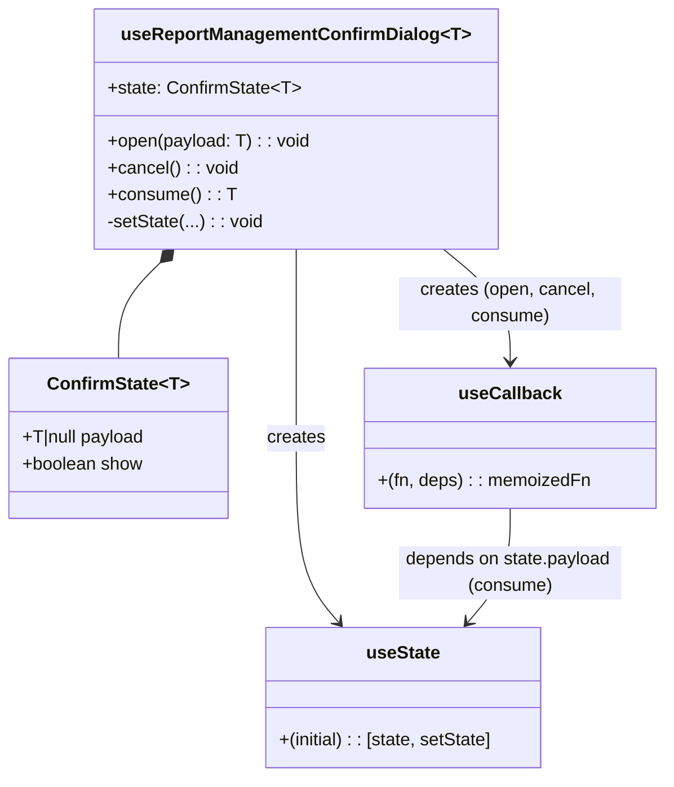

# Diagram: web/portal/src/pages/administration/report-management/hooks/useReportManagementConfirmDialog.ts

> Auto-generated by Obscura crawlers

## Mermaid

### SVG

<svg id="container" width="591.1796875" xmlns="http://www.w3.org/2000/svg" class="classDiagram" height="698" viewBox="0 0 591.1796875 698" role="graphics-document document" aria-roledescription="class"><g><defs><marker id="container_class-aggregationStart" class="marker aggregation class" refX="18" refY="7" markerWidth="190" markerHeight="240" orient="auto"><path d="M 18,7 L9,13 L1,7 L9,1 Z"></path></marker></defs><defs><marker id="container_class-aggregationEnd" class="marker aggregation class" refX="1" refY="7" markerWidth="20" markerHeight="28" orient="auto"><path d="M 18,7 L9,13 L1,7 L9,1 Z"></path></marker></defs><defs><marker id="container_class-extensionStart" class="marker extension class" refX="18" refY="7" markerWidth="190" markerHeight="240" orient="auto"><path d="M 1,7 L18,13 V 1 Z"></path></marker></defs><defs><marker id="container_class-extensionEnd" class="marker extension class" refX="1" refY="7" markerWidth="20" markerHeight="28" orient="auto"><path d="M 1,1 V 13 L18,7 Z"></path></marker></defs><defs><marker id="container_class-compositionStart" class="marker composition class" refX="18" refY="7" markerWidth="190" markerHeight="240" orient="auto"><path d="M 18,7 L9,13 L1,7 L9,1 Z"></path></marker></defs><defs><marker id="container_class-compositionEnd" class="marker composition class" refX="1" refY="7" markerWidth="20" markerHeight="28" orient="auto"><path d="M 18,7 L9,13 L1,7 L9,1 Z"></path></marker></defs><defs><marker id="container_class-dependencyStart" class="marker dependency class" refX="6" refY="7" markerWidth="190" markerHeight="240" orient="auto"><path d="M 5,7 L9,13 L1,7 L9,1 Z"></path></marker></defs><defs><marker id="container_class-dependencyEnd" class="marker dependency class" refX="13" refY="7" markerWidth="20" markerHeight="28" orient="auto"><path d="M 18,7 L9,13 L14,7 L9,1 Z"></path></marker></defs><defs><marker id="container_class-lollipopStart" class="marker lollipop class" refX="13" refY="7" markerWidth="190" markerHeight="240" orient="auto"><circle stroke="black" fill="transparent" cx="7" cy="7" r="6"></circle></marker></defs><defs><marker id="container_class-lollipopEnd" class="marker lollipop class" refX="1" refY="7" markerWidth="190" markerHeight="240" orient="auto"><circle stroke="black" fill="transparent" cx="7" cy="7" r="6"></circle></marker></defs><g class="root"><g class="clusters"></g><g class="edgePaths"><path d="M143.641,236.106L137.399,242.255C131.158,248.404,118.674,260.702,112.433,275.018C106.191,289.333,106.191,305.667,106.191,313.833L106.191,322" id="id_useReportManagementConfirmDialog_ConfirmState_1" class="edge-thickness-normal edge-pattern-solid relation" style=";;;" data-edge="true" data-et="edge" data-id="id_useReportManagementConfirmDialog_ConfirmState_1" data-points="W3sieCI6MTU1LjkyODk5MDg0Mzk0OTA0LCJ5IjoyMjR9LHsieCI6MTA2LjE5MTQwNjI1LCJ5IjoyNzN9LHsieCI6MTA2LjE5MTQwNjI1LCJ5IjozMjJ9XQ==" marker-start="url(#container_class-compositionStart)"></path><path d="M265.555,224L265.555,232.167C265.555,240.333,265.555,256.667,265.555,285C265.555,313.333,265.555,353.667,265.555,394C265.555,434.333,265.555,474.667,271.814,502.236C278.074,529.806,290.593,544.612,296.852,552.015L303.112,559.418" id="id_useReportManagementConfirmDialog_useState_2" class="edge-thickness-normal edge-pattern-solid relation" style=";;;" data-edge="true" data-et="edge" data-id="id_useReportManagementConfirmDialog_useState_2" data-points="W3sieCI6MjY1LjU1NDY4NzUsInkiOjIyNH0seyJ4IjoyNjUuNTU0Njg3NSwieSI6MjczfSx7IngiOjI2NS41NTQ2ODc1LCJ5IjozOTR9LHsieCI6MjY1LjU1NDY4NzUsInkiOjUxNX0seyJ4IjozMDYuOTg1NTk1NzAzMTI1LCJ5Ijo1NjR9XQ==" marker-end="url(#container_class-dependencyEnd)"></path><path d="M395.842,224L405.693,232.167C415.545,240.333,435.249,256.667,445.101,273.5C454.953,290.333,454.953,307.667,454.953,316.333L454.953,325" id="id_useReportManagementConfirmDialog_useCallback_3" class="edge-thickness-normal edge-pattern-solid relation" style=";;;" data-edge="true" data-et="edge" data-id="id_useReportManagementConfirmDialog_useCallback_3" data-points="W3sieCI6Mzk1Ljg0MTUxMDc0ODQwNzY0LCJ5IjoyMjR9LHsieCI6NDU0Ljk1MzEyNSwieSI6MjczfSx7IngiOjQ1NC45NTMxMjUsInkiOjMzMX1d" marker-end="url(#container_class-dependencyEnd)"></path><path d="M454.953,457L454.953,466.667C454.953,476.333,454.953,495.667,448.694,512.736C442.434,529.806,429.915,544.612,423.656,552.015L417.396,559.418" id="id_useCallback_useState_4" class="edge-thickness-normal edge-pattern-solid relation" style=";;;" data-edge="true" data-et="edge" data-id="id_useCallback_useState_4" data-points="W3sieCI6NDU0Ljk1MzEyNSwieSI6NDU3fSx7IngiOjQ1NC45NTMxMjUsInkiOjUxNX0seyJ4Ijo0MTMuNTIyMjE2Nzk2ODc1LCJ5Ijo1NjR9XQ==" marker-end="url(#container_class-dependencyEnd)"></path></g><g class="edgeLabels"><g class="edgeLabel"><g class="label" data-id="id_useReportManagementConfirmDialog_ConfirmState_1" transform="translate(0, 0)"><foreignObject width="0" height="0">

</foreignObject></g></g><g class="edgeLabel" transform="translate(265.5546875, 394)"><g class="label" data-id="id_useReportManagementConfirmDialog_useState_2" transform="translate(-26.171875, -12)"><foreignObject width="52.34375" height="24">

creates

</foreignObject></g></g><g class="edgeLabel" transform="translate(454.953125, 273)"><g class="label" data-id="id_useReportManagementConfirmDialog_useCallback_3" transform="translate(-100, -24)"><foreignObject width="200" height="48">

creates (open, cancel, consume)

</foreignObject></g></g><g class="edgeLabel" transform="translate(454.953125, 515)"><g class="label" data-id="id_useCallback_useState_4" transform="translate(-100, -24)"><foreignObject width="200" height="48">

depends on state.payload (consume)

</foreignObject></g></g></g><g class="nodes"><g class="node default" id="classId-ConfirmState-0" transform="translate(106.19140625, 394)"><g class="basic label-container"><path d="M-98.19140625 -72 L98.19140625 -72 L98.19140625 72 L-98.19140625 72" stroke="none" stroke-width="0" fill="#ECECFF" style=""></path><path d="M-98.19140625 -72 C-50.5652897315773 -72, -2.9391732131546036 -72, 98.19140625 -72 M-98.19140625 -72 C-40.71717175573716 -72, 16.757062738525676 -72, 98.19140625 -72 M98.19140625 -72 C98.19140625 -36.78449396417117, 98.19140625 -1.568987928342338, 98.19140625 72 M98.19140625 -72 C98.19140625 -29.42074426047435, 98.19140625 13.158511479051299, 98.19140625 72 M98.19140625 72 C44.459611100866674 72, -9.272184048266652 72, -98.19140625 72 M98.19140625 72 C30.585247257558663 72, -37.020911734882674 72, -98.19140625 72 M-98.19140625 72 C-98.19140625 18.42703169303489, -98.19140625 -35.14593661393022, -98.19140625 -72 M-98.19140625 72 C-98.19140625 32.53205422378352, -98.19140625 -6.935891552432963, -98.19140625 -72" stroke="#9370DB" stroke-width="1.3" fill="none" stroke-dasharray="0 0" style=""></path></g><g class="annotation-group text" transform="translate(0, -48)"></g><g class="label-group text" transform="translate(-60.4296875, -48)"><g class="label" style="font-weight: bolder" transform="translate(0,-12)"><foreignObject width="120.859375" height="24">

ConfirmState&lt;T&gt;

</foreignObject></g></g><g class="members-group text" transform="translate(-86.19140625, 0)"><g class="label" style="" transform="translate(0,-12)"><foreignObject width="111.953125" height="24">

+T|null payload

</foreignObject></g><g class="label" style="" transform="translate(0,12)"><foreignObject width="109.34375" height="24">

+boolean show

</foreignObject></g></g><g class="methods-group text" transform="translate(-86.19140625, 72)"></g><g class="divider" style=""><path d="M-98.19140625 -24 C-37.41154117036178 -24, 23.36832390927644 -24, 98.19140625 -24 M-98.19140625 -24 C-55.196627077425795 -24, -12.20184790485159 -24, 98.19140625 -24" stroke="#9370DB" stroke-width="1.3" fill="none" stroke-dasharray="0 0" style=""></path></g><g class="divider" style=""><path d="M-98.19140625 48 C-19.818111816788374 48, 58.55518261642325 48, 98.19140625 48 M-98.19140625 48 C-42.839133545449954 48, 12.513139159100092 48, 98.19140625 48" stroke="#9370DB" stroke-width="1.3" fill="none" stroke-dasharray="0 0" style=""></path></g></g><g class="node default" id="classId-useReportManagementConfirmDialog-1" transform="translate(265.5546875, 116)"><g class="basic label-container"><path d="M-177.140625 -108 L177.140625 -108 L177.140625 108 L-177.140625 108" stroke="none" stroke-width="0" fill="#ECECFF" style=""></path><path d="M-177.140625 -108 C-86.59332900128425 -108, 3.9539669974315075 -108, 177.140625 -108 M-177.140625 -108 C-99.57143494409881 -108, -22.002244888197623 -108, 177.140625 -108 M177.140625 -108 C177.140625 -63.20950914449706, 177.140625 -18.419018288994124, 177.140625 108 M177.140625 -108 C177.140625 -44.102645146259505, 177.140625 19.79470970748099, 177.140625 108 M177.140625 108 C103.5531498681262 108, 29.965674736252396 108, -177.140625 108 M177.140625 108 C49.95532116246383 108, -77.22998267507234 108, -177.140625 108 M-177.140625 108 C-177.140625 47.11082688347781, -177.140625 -13.778346233044374, -177.140625 -108 M-177.140625 108 C-177.140625 42.37760213533453, -177.140625 -23.244795729330946, -177.140625 -108" stroke="#9370DB" stroke-width="1.3" fill="none" stroke-dasharray="0 0" style=""></path></g><g class="annotation-group text" transform="translate(0, -84)"></g><g class="label-group text" transform="translate(-149.25, -84)"><g class="label" style="font-weight: bolder" transform="translate(0,-12)"><foreignObject width="298.5" height="24">

useReportManagementConfirmDialog&lt;T&gt;

</foreignObject></g></g><g class="members-group text" transform="translate(-165.140625, -36)"><g class="label" style="" transform="translate(0,-12)"><foreignObject width="170.234375" height="24">

+state: ConfirmState&lt;T&gt;

</foreignObject></g></g><g class="methods-group text" transform="translate(-165.140625, 12)"><g class="label" style="" transform="translate(0,-12)"><foreignObject width="181.03125" height="24">

+open(payload: T) : : void

</foreignObject></g><g class="label" style="" transform="translate(0,12)"><foreignObject width="116.296875" height="24">

+cancel() : : void

</foreignObject></g><g class="label" style="" transform="translate(0,36)"><foreignObject width="112.296875" height="24">

+consume() : : T

</foreignObject></g><g class="label" style="" transform="translate(0,60)"><foreignObject width="139.28125" height="24">

-setState(...) : : void

</foreignObject></g></g><g class="divider" style=""><path d="M-177.140625 -60 C-53.11520524487619 -60, 70.91021451024761 -60, 177.140625 -60 M-177.140625 -60 C-96.14134367907718 -60, -15.142062358154362 -60, 177.140625 -60" stroke="#9370DB" stroke-width="1.3" fill="none" stroke-dasharray="0 0" style=""></path></g><g class="divider" style=""><path d="M-177.140625 -12 C-96.95166909478702 -12, -16.762713189574043 -12, 177.140625 -12 M-177.140625 -12 C-36.44156105085057 -12, 104.25750289829887 -12, 177.140625 -12" stroke="#9370DB" stroke-width="1.3" fill="none" stroke-dasharray="0 0" style=""></path></g></g><g class="node default" id="classId-useState-2" transform="translate(360.25390625, 627)"><g class="basic label-container"><path d="M-125.2421875 -63 L125.2421875 -63 L125.2421875 63 L-125.2421875 63" stroke="none" stroke-width="0" fill="#ECECFF" style=""></path><path d="M-125.2421875 -63 C-30.54463873281422 -63, 64.15291003437156 -63, 125.2421875 -63 M-125.2421875 -63 C-35.66056957179042 -63, 53.92104835641916 -63, 125.2421875 -63 M125.2421875 -63 C125.2421875 -31.925587736851252, 125.2421875 -0.8511754737025043, 125.2421875 63 M125.2421875 -63 C125.2421875 -30.522070954438014, 125.2421875 1.9558580911239716, 125.2421875 63 M125.2421875 63 C63.96913685173116 63, 2.6960862034623148 63, -125.2421875 63 M125.2421875 63 C53.153363289927015 63, -18.93546092014597 63, -125.2421875 63 M-125.2421875 63 C-125.2421875 26.484189144379464, -125.2421875 -10.031621711241073, -125.2421875 -63 M-125.2421875 63 C-125.2421875 31.901730430755897, -125.2421875 0.8034608615117946, -125.2421875 -63" stroke="#9370DB" stroke-width="1.3" fill="none" stroke-dasharray="0 0" style=""></path></g><g class="annotation-group text" transform="translate(0, -39)"></g><g class="label-group text" transform="translate(-32.171875, -39)"><g class="label" style="font-weight: bolder" transform="translate(0,-12)"><foreignObject width="64.34375" height="24">

useState

</foreignObject></g></g><g class="members-group text" transform="translate(-113.2421875, 9)"></g><g class="methods-group text" transform="translate(-113.2421875, 39)"><g class="label" style="" transform="translate(0,-12)"><foreignObject width="194.3125" height="24">

+(initial) : : [state, setState]

</foreignObject></g></g><g class="divider" style=""><path d="M-125.2421875 -15 C-69.06476953458179 -15, -12.88735156916357 -15, 125.2421875 -15 M-125.2421875 -15 C-57.53021713464787 -15, 10.18175323070426 -15, 125.2421875 -15" stroke="#9370DB" stroke-width="1.3" fill="none" stroke-dasharray="0 0" style=""></path></g><g class="divider" style=""><path d="M-125.2421875 9 C-62.961082265840254 9, -0.679977031680508 9, 125.2421875 9 M-125.2421875 9 C-46.999257502270254 9, 31.243672495459492 9, 125.2421875 9" stroke="#9370DB" stroke-width="1.3" fill="none" stroke-dasharray="0 0" style=""></path></g></g><g class="node default" id="classId-useCallback-3" transform="translate(454.953125, 394)"><g class="basic label-container"><path d="M-128.2265625 -63 L128.2265625 -63 L128.2265625 63 L-128.2265625 63" stroke="none" stroke-width="0" fill="#ECECFF" style=""></path><path d="M-128.2265625 -63 C-74.47442503453487 -63, -20.722287569069763 -63, 128.2265625 -63 M-128.2265625 -63 C-61.67393873608191 -63, 4.878685027836184 -63, 128.2265625 -63 M128.2265625 -63 C128.2265625 -33.83475087019603, 128.2265625 -4.6695017403920716, 128.2265625 63 M128.2265625 -63 C128.2265625 -14.88634928514086, 128.2265625 33.22730142971828, 128.2265625 63 M128.2265625 63 C56.79625419391296 63, -14.634054112174084 63, -128.2265625 63 M128.2265625 63 C70.72266182196589 63, 13.218761143931758 63, -128.2265625 63 M-128.2265625 63 C-128.2265625 30.386984063412186, -128.2265625 -2.2260318731756286, -128.2265625 -63 M-128.2265625 63 C-128.2265625 36.65456252639258, -128.2265625 10.30912505278517, -128.2265625 -63" stroke="#9370DB" stroke-width="1.3" fill="none" stroke-dasharray="0 0" style=""></path></g><g class="annotation-group text" transform="translate(0, -39)"></g><g class="label-group text" transform="translate(-43.765625, -39)"><g class="label" style="font-weight: bolder" transform="translate(0,-12)"><foreignObject width="87.53125" height="24">

useCallback

</foreignObject></g></g><g class="members-group text" transform="translate(-116.2265625, 9)"></g><g class="methods-group text" transform="translate(-116.2265625, 39)"><g class="label" style="" transform="translate(0,-12)"><foreignObject width="188.6875" height="24">

+(fn, deps) : : memoizedFn

</foreignObject></g></g><g class="divider" style=""><path d="M-128.2265625 -15 C-75.65482711880219 -15, -23.083091737604363 -15, 128.2265625 -15 M-128.2265625 -15 C-40.49801958913359 -15, 47.23052332173282 -15, 128.2265625 -15" stroke="#9370DB" stroke-width="1.3" fill="none" stroke-dasharray="0 0" style=""></path></g><g class="divider" style=""><path d="M-128.2265625 9 C-28.610685614994495 9, 71.00519127001101 9, 128.2265625 9 M-128.2265625 9 C-64.14830833737497 9, -0.07005417474994147 9, 128.2265625 9" stroke="#9370DB" stroke-width="1.3" fill="none" stroke-dasharray="0 0" style=""></path></g></g></g></g></g></svg>
