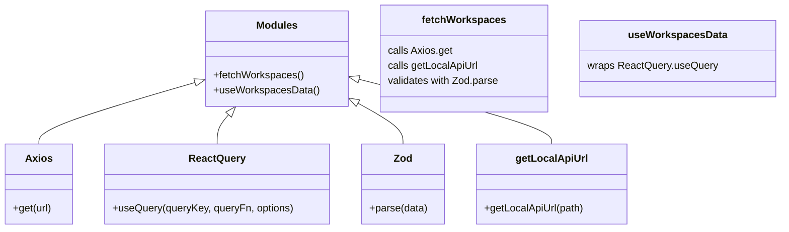

# Diagram: web/portal/src/pages/administration/report-management/hooks/useWorkspacesData.ts


> Auto-generated by Obscura crawlers

## Diagram 1



### SVG

<svg id="container" width="1210.880859375" xmlns="http://www.w3.org/2000/svg" class="classDiagram" height="360" viewBox="0 0 1210.880859375 360" role="graphics-document document" aria-roledescription="class"><style>#container{font-family:"trebuchet ms",verdana,arial,sans-serif;font-size:16px;fill:#333;}@keyframes edge-animation-frame{from{stroke-dashoffset:0;}}@keyframes dash{to{stroke-dashoffset:0;}}#container .edge-animation-slow{stroke-dasharray:9,5!important;stroke-dashoffset:900;animation:dash 50s linear infinite;stroke-linecap:round;}#container .edge-animation-fast{stroke-dasharray:9,5!important;stroke-dashoffset:900;animation:dash 20s linear infinite;stroke-linecap:round;}#container .error-icon{fill:#552222;}#container .error-text{fill:#552222;stroke:#552222;}#container .edge-thickness-normal{stroke-width:1px;}#container .edge-thickness-thick{stroke-width:3.5px;}#container .edge-pattern-solid{stroke-dasharray:0;}#container .edge-thickness-invisible{stroke-width:0;fill:none;}#container .edge-pattern-dashed{stroke-dasharray:3;}#container .edge-pattern-dotted{stroke-dasharray:2;}#container .marker{fill:#333333;stroke:#333333;}#container .marker.cross{stroke:#333333;}#container svg{font-family:"trebuchet ms",verdana,arial,sans-serif;font-size:16px;}#container p{margin:0;}#container g.classGroup text{fill:#9370DB;stroke:none;font-family:"trebuchet ms",verdana,arial,sans-serif;font-size:10px;}#container g.classGroup text .title{font-weight:bolder;}#container .nodeLabel,#container .edgeLabel{color:#131300;}#container .edgeLabel .label rect{fill:#ECECFF;}#container .label text{fill:#131300;}#container .labelBkg{background:#ECECFF;}#container .edgeLabel .label span{background:#ECECFF;}#container .classTitle{font-weight:bolder;}#container .node rect,#container .node circle,#container .node ellipse,#container .node polygon,#container .node path{fill:#ECECFF;stroke:#9370DB;stroke-width:1px;}#container .divider{stroke:#9370DB;stroke-width:1;}#container g.clickable{cursor:pointer;}#container g.classGroup rect{fill:#ECECFF;stroke:#9370DB;}#container g.classGroup line{stroke:#9370DB;stroke-width:1;}#container .classLabel .box{stroke:none;stroke-width:0;fill:#ECECFF;opacity:0.5;}#container .classLabel .label{fill:#9370DB;font-size:10px;}#container .relation{stroke:#333333;stroke-width:1;fill:none;}#container .dashed-line{stroke-dasharray:3;}#container .dotted-line{stroke-dasharray:1 2;}#container #compositionStart,#container .composition{fill:#333333!important;stroke:#333333!important;stroke-width:1;}#container #compositionEnd,#container .composition{fill:#333333!important;stroke:#333333!important;stroke-width:1;}#container #dependencyStart,#container .dependency{fill:#333333!important;stroke:#333333!important;stroke-width:1;}#container #dependencyStart,#container .dependency{fill:#333333!important;stroke:#333333!important;stroke-width:1;}#container #extensionStart,#container .extension{fill:transparent!important;stroke:#333333!important;stroke-width:1;}#container #extensionEnd,#container .extension{fill:transparent!important;stroke:#333333!important;stroke-width:1;}#container #aggregationStart,#container .aggregation{fill:transparent!important;stroke:#333333!important;stroke-width:1;}#container #aggregationEnd,#container .aggregation{fill:transparent!important;stroke:#333333!important;stroke-width:1;}#container #lollipopStart,#container .lollipop{fill:#ECECFF!important;stroke:#333333!important;stroke-width:1;}#container #lollipopEnd,#container .lollipop{fill:#ECECFF!important;stroke:#333333!important;stroke-width:1;}#container .edgeTerminals{font-size:11px;line-height:initial;}#container .classTitleText{text-anchor:middle;font-size:18px;fill:#333;}#container .label-icon{display:inline-block;height:1em;overflow:visible;vertical-align:-0.125em;}#container .node .label-icon path{fill:currentColor;stroke:revert;stroke-width:revert;}#container :root{--mermaid-font-family:"trebuchet ms",verdana,arial,sans-serif;}</style><g><defs><marker id="container_class-aggregationStart" class="marker aggregation class" refX="18" refY="7" markerWidth="190" markerHeight="240" orient="auto"><path d="M 18,7 L9,13 L1,7 L9,1 Z"></path></marker></defs><defs><marker id="container_class-aggregationEnd" class="marker aggregation class" refX="1" refY="7" markerWidth="20" markerHeight="28" orient="auto"><path d="M 18,7 L9,13 L1,7 L9,1 Z"></path></marker></defs><defs><marker id="container_class-extensionStart" class="marker extension class" refX="18" refY="7" markerWidth="190" markerHeight="240" orient="auto"><path d="M 1,7 L18,13 V 1 Z"></path></marker></defs><defs><marker id="container_class-extensionEnd" class="marker extension class" refX="1" refY="7" markerWidth="20" markerHeight="28" orient="auto"><path d="M 1,1 V 13 L18,7 Z"></path></marker></defs><defs><marker id="container_class-compositionStart" class="marker composition class" refX="18" refY="7" markerWidth="190" markerHeight="240" orient="auto"><path d="M 18,7 L9,13 L1,7 L9,1 Z"></path></marker></defs><defs><marker id="container_class-compositionEnd" class="marker composition class" refX="1" refY="7" markerWidth="20" markerHeight="28" orient="auto"><path d="M 18,7 L9,13 L1,7 L9,1 Z"></path></marker></defs><defs><marker id="container_class-dependencyStart" class="marker dependency class" refX="6" refY="7" markerWidth="190" markerHeight="240" orient="auto"><path d="M 5,7 L9,13 L1,7 L9,1 Z"></path></marker></defs><defs><marker id="container_class-dependencyEnd" class="marker dependency class" refX="13" refY="7" markerWidth="20" markerHeight="28" orient="auto"><path d="M 18,7 L9,13 L14,7 L9,1 Z"></path></marker></defs><defs><marker id="container_class-lollipopStart" class="marker lollipop class" refX="13" refY="7" markerWidth="190" markerHeight="240" orient="auto"><circle stroke="black" fill="transparent" cx="7" cy="7" r="6"></circle></marker></defs><defs><marker id="container_class-lollipopEnd" class="marker lollipop class" refX="1" refY="7" markerWidth="190" markerHeight="240" orient="auto"><circle stroke="black" fill="transparent" cx="7" cy="7" r="6"></circle></marker></defs><g class="root"><g class="clusters"></g><g class="edgePaths"><path d="M306.679,128.777L265.625,140.815C224.57,152.852,142.461,176.926,101.406,193.13C60.352,209.333,60.352,217.667,60.352,221.833L60.352,226" id="id_Modules_Axios_1" class="edge-thickness-normal edge-pattern-solid relation" style=";;;" data-edge="true" data-et="edge" data-id="id_Modules_Axios_1" data-points="W3sieCI6MzIzLjIzMjQyMTg3NSwieSI6MTIzLjkyNDExNTkzODA2OTY5fSx7IngiOjYwLjM1MTU2MjUsInkiOjIwMX0seyJ4Ijo2MC4zNTE1NjI1LCJ5IjoyMjZ9XQ==" marker-start="url(#container_class-extensionStart)"></path><path d="M355.809,180.035L352.78,183.529C349.751,187.023,343.694,194.012,340.665,201.672C337.637,209.333,337.637,217.667,337.637,221.833L337.637,226" id="id_Modules_ReactQuery_2" class="edge-thickness-normal edge-pattern-solid relation" style=";;;" data-edge="true" data-et="edge" data-id="id_Modules_ReactQuery_2" data-points="W3sieCI6MzY3LjEwNzA4MTQyMjAxODQsInkiOjE2N30seyJ4IjozMzcuNjM2NzE4NzUsInkiOjIwMX0seyJ4IjozMzcuNjM2NzE4NzUsInkiOjIyNn1d" marker-start="url(#container_class-extensionStart)"></path><path d="M556.053,161.325L567.875,167.937C579.697,174.55,603.341,187.775,615.162,198.554C626.984,209.333,626.984,217.667,626.984,221.833L626.984,226" id="id_Modules_Zod_3" class="edge-thickness-normal edge-pattern-solid relation" style=";;;" data-edge="true" data-et="edge" data-id="id_Modules_Zod_3" data-points="W3sieCI6NTQwLjk5ODA0Njg3NSwieSI6MTUyLjkwMzU3MTEwNjQxMTU2fSx7IngiOjYyNi45ODQzNzUsInkiOjIwMX0seyJ4Ijo2MjYuOTg0Mzc1LCJ5IjoyMjZ9XQ==" marker-start="url(#container_class-extensionStart)"></path><path d="M557.71,124.126L607.798,136.939C657.886,149.751,758.062,175.375,808.15,192.354C858.238,209.333,858.238,217.667,858.238,221.833L858.238,226" id="id_Modules_getLocalApiUrl_4" class="edge-thickness-normal edge-pattern-solid relation" style=";;;" data-edge="true" data-et="edge" data-id="id_Modules_getLocalApiUrl_4" data-points="W3sieCI6NTQwLjk5ODA0Njg3NSwieSI6MTE5Ljg1MTY0MjAzMDQ4MDEyfSx7IngiOjg1OC4yMzgyODEyNSwieSI6MjAxfSx7IngiOjg1OC4yMzgyODEyNSwieSI6MjI2fV0=" marker-start="url(#container_class-extensionStart)"></path></g><g class="edgeLabels"><g class="edgeLabel"><g class="label" data-id="id_Modules_Axios_1" transform="translate(0, 0)"><foreignObject width="0" height="0"><div xmlns="http://www.w3.org/1999/xhtml" class="labelBkg" style="display: table-cell; white-space: nowrap; line-height: 1.5; max-width: 200px; text-align: center;"><span class="edgeLabel"></span></div></foreignObject></g></g><g class="edgeLabel"><g class="label" data-id="id_Modules_ReactQuery_2" transform="translate(0, 0)"><foreignObject width="0" height="0"><div xmlns="http://www.w3.org/1999/xhtml" class="labelBkg" style="display: table-cell; white-space: nowrap; line-height: 1.5; max-width: 200px; text-align: center;"><span class="edgeLabel"></span></div></foreignObject></g></g><g class="edgeLabel"><g class="label" data-id="id_Modules_Zod_3" transform="translate(0, 0)"><foreignObject width="0" height="0"><div xmlns="http://www.w3.org/1999/xhtml" class="labelBkg" style="display: table-cell; white-space: nowrap; line-height: 1.5; max-width: 200px; text-align: center;"><span class="edgeLabel"></span></div></foreignObject></g></g><g class="edgeLabel"><g class="label" data-id="id_Modules_getLocalApiUrl_4" transform="translate(0, 0)"><foreignObject width="0" height="0"><div xmlns="http://www.w3.org/1999/xhtml" class="labelBkg" style="display: table-cell; white-space: nowrap; line-height: 1.5; max-width: 200px; text-align: center;"><span class="edgeLabel"></span></div></foreignObject></g></g></g><g class="nodes"><g class="node default" id="classId-Modules-0" transform="translate(432.115234375, 92)"><g class="basic label-container"><path d="M-108.8828125 -75 L108.8828125 -75 L108.8828125 75 L-108.8828125 75" stroke="none" stroke-width="0" fill="#ECECFF" style=""></path><path d="M-108.8828125 -75 C-61.958696429148105 -75, -15.03458035829621 -75, 108.8828125 -75 M-108.8828125 -75 C-41.63137883907713 -75, 25.62005482184574 -75, 108.8828125 -75 M108.8828125 -75 C108.8828125 -25.909462293068614, 108.8828125 23.18107541386277, 108.8828125 75 M108.8828125 -75 C108.8828125 -29.49547646883814, 108.8828125 16.009047062323717, 108.8828125 75 M108.8828125 75 C50.40496263603683 75, -8.072887227926344 75, -108.8828125 75 M108.8828125 75 C25.74625618362971 75, -57.39030013274058 75, -108.8828125 75 M-108.8828125 75 C-108.8828125 32.75159939057631, -108.8828125 -9.49680121884738, -108.8828125 -75 M-108.8828125 75 C-108.8828125 29.951629750928753, -108.8828125 -15.096740498142495, -108.8828125 -75" stroke="#9370DB" stroke-width="1.3" fill="none" stroke-dasharray="0 0" style=""></path></g><g class="annotation-group text" transform="translate(0, -51)"></g><g class="label-group text" transform="translate(-30.953125, -51)"><g class="label" style="font-weight: bolder" transform="translate(0,-12)"><foreignObject width="61.90625" height="24"><div xmlns="http://www.w3.org/1999/xhtml" style="display: table-cell; white-space: nowrap; line-height: 1.5; max-width: 111px; text-align: center;"><span class="nodeLabel markdown-node-label" style=""><p>Modules</p></span></div></foreignObject></g></g><g class="members-group text" transform="translate(-96.8828125, -3)"></g><g class="methods-group text" transform="translate(-96.8828125, 27)"><g class="label" style="" transform="translate(0,-12)"><foreignObject width="140.328125" height="24"><div xmlns="http://www.w3.org/1999/xhtml" style="display: table-cell; white-space: nowrap; line-height: 1.5; max-width: 198px; text-align: center;"><span class="nodeLabel markdown-node-label" style=""><p>+fetchWorkspaces()</p></span></div></foreignObject></g><g class="label" style="" transform="translate(0,12)"><foreignObject width="162.8125" height="24"><div xmlns="http://www.w3.org/1999/xhtml" style="display: table-cell; white-space: nowrap; line-height: 1.5; max-width: 220px; text-align: center;"><span class="nodeLabel markdown-node-label" style=""><p>+useWorkspacesData()</p></span></div></foreignObject></g></g><g class="divider" style=""><path d="M-108.8828125 -27 C-43.37668948825353 -27, 22.129433523492935 -27, 108.8828125 -27 M-108.8828125 -27 C-63.289935248501436 -27, -17.697057997002872 -27, 108.8828125 -27" stroke="#9370DB" stroke-width="1.3" fill="none" stroke-dasharray="0 0" style=""></path></g><g class="divider" style=""><path d="M-108.8828125 -3 C-39.0995935351592 -3, 30.683625429681598 -3, 108.8828125 -3 M-108.8828125 -3 C-61.56142223492202 -3, -14.24003196984404 -3, 108.8828125 -3" stroke="#9370DB" stroke-width="1.3" fill="none" stroke-dasharray="0 0" style=""></path></g></g><g class="node default" id="classId-Axios-1" transform="translate(60.3515625, 289)"><g class="basic label-container"><path d="M-52.3515625 -63 L52.3515625 -63 L52.3515625 63 L-52.3515625 63" stroke="none" stroke-width="0" fill="#ECECFF" style=""></path><path d="M-52.3515625 -63 C-18.161618135679056 -63, 16.028326228641887 -63, 52.3515625 -63 M-52.3515625 -63 C-19.333720735384553 -63, 13.684121029230894 -63, 52.3515625 -63 M52.3515625 -63 C52.3515625 -33.71779132346302, 52.3515625 -4.435582646926029, 52.3515625 63 M52.3515625 -63 C52.3515625 -35.500483055869964, 52.3515625 -8.000966111739928, 52.3515625 63 M52.3515625 63 C26.049483342965473 63, -0.2525958140690534 63, -52.3515625 63 M52.3515625 63 C28.37483557853498 63, 4.398108657069962 63, -52.3515625 63 M-52.3515625 63 C-52.3515625 32.81160235028213, -52.3515625 2.6232047005642514, -52.3515625 -63 M-52.3515625 63 C-52.3515625 15.948754176494006, -52.3515625 -31.102491647011988, -52.3515625 -63" stroke="#9370DB" stroke-width="1.3" fill="none" stroke-dasharray="0 0" style=""></path></g><g class="annotation-group text" transform="translate(0, -39)"></g><g class="label-group text" transform="translate(-19.609375, -39)"><g class="label" style="font-weight: bolder" transform="translate(0,-12)"><foreignObject width="39.21875" height="24"><div xmlns="http://www.w3.org/1999/xhtml" style="display: table-cell; white-space: nowrap; line-height: 1.5; max-width: 88px; text-align: center;"><span class="nodeLabel markdown-node-label" style=""><p>Axios</p></span></div></foreignObject></g></g><g class="members-group text" transform="translate(-40.3515625, 9)"></g><g class="methods-group text" transform="translate(-40.3515625, 39)"><g class="label" style="" transform="translate(0,-12)"><foreignObject width="61.09375" height="24"><div xmlns="http://www.w3.org/1999/xhtml" style="display: table-cell; white-space: nowrap; line-height: 1.5; max-width: 118px; text-align: center;"><span class="nodeLabel markdown-node-label" style=""><p>+get(url)</p></span></div></foreignObject></g></g><g class="divider" style=""><path d="M-52.3515625 -15 C-19.018885825682553 -15, 14.313790848634895 -15, 52.3515625 -15 M-52.3515625 -15 C-25.88279122438696 -15, 0.5859800512260804 -15, 52.3515625 -15" stroke="#9370DB" stroke-width="1.3" fill="none" stroke-dasharray="0 0" style=""></path></g><g class="divider" style=""><path d="M-52.3515625 9 C-19.444810322102974 9, 13.461941855794052 9, 52.3515625 9 M-52.3515625 9 C-18.89806389998933 9, 14.555434700021337 9, 52.3515625 9" stroke="#9370DB" stroke-width="1.3" fill="none" stroke-dasharray="0 0" style=""></path></g></g><g class="node default" id="classId-ReactQuery-2" transform="translate(337.63671875, 289)"><g class="basic label-container"><path d="M-174.93359375 -63 L174.93359375 -63 L174.93359375 63 L-174.93359375 63" stroke="none" stroke-width="0" fill="#ECECFF" style=""></path><path d="M-174.93359375 -63 C-40.3327925001432 -63, 94.2680087497136 -63, 174.93359375 -63 M-174.93359375 -63 C-83.94472292282423 -63, 7.044147904351547 -63, 174.93359375 -63 M174.93359375 -63 C174.93359375 -19.735795826344756, 174.93359375 23.52840834731049, 174.93359375 63 M174.93359375 -63 C174.93359375 -32.87145561180971, 174.93359375 -2.7429112236194158, 174.93359375 63 M174.93359375 63 C55.816483182981145 63, -63.30062738403771 63, -174.93359375 63 M174.93359375 63 C47.201466580990314 63, -80.53066058801937 63, -174.93359375 63 M-174.93359375 63 C-174.93359375 14.418673360373376, -174.93359375 -34.16265327925325, -174.93359375 -63 M-174.93359375 63 C-174.93359375 19.891990661823264, -174.93359375 -23.21601867635347, -174.93359375 -63" stroke="#9370DB" stroke-width="1.3" fill="none" stroke-dasharray="0 0" style=""></path></g><g class="annotation-group text" transform="translate(0, -39)"></g><g class="label-group text" transform="translate(-42.3203125, -39)"><g class="label" style="font-weight: bolder" transform="translate(0,-12)"><foreignObject width="84.640625" height="24"><div xmlns="http://www.w3.org/1999/xhtml" style="display: table-cell; white-space: nowrap; line-height: 1.5; max-width: 133px; text-align: center;"><span class="nodeLabel markdown-node-label" style=""><p>ReactQuery</p></span></div></foreignObject></g></g><g class="members-group text" transform="translate(-162.93359375, 9)"></g><g class="methods-group text" transform="translate(-162.93359375, 39)"><g class="label" style="" transform="translate(0,-12)"><foreignObject width="283.546875" height="24"><div xmlns="http://www.w3.org/1999/xhtml" style="display: table-cell; white-space: nowrap; line-height: 1.5; max-width: 341px; text-align: center;"><span class="nodeLabel markdown-node-label" style=""><p>+useQuery(queryKey, queryFn, options)</p></span></div></foreignObject></g></g><g class="divider" style=""><path d="M-174.93359375 -15 C-72.16990055766786 -15, 30.593792634664283 -15, 174.93359375 -15 M-174.93359375 -15 C-64.852380019746 -15, 45.22883371050801 -15, 174.93359375 -15" stroke="#9370DB" stroke-width="1.3" fill="none" stroke-dasharray="0 0" style=""></path></g><g class="divider" style=""><path d="M-174.93359375 9 C-52.20077509300805 9, 70.5320435639839 9, 174.93359375 9 M-174.93359375 9 C-94.55689483314842 9, -14.180195916296839 9, 174.93359375 9" stroke="#9370DB" stroke-width="1.3" fill="none" stroke-dasharray="0 0" style=""></path></g></g><g class="node default" id="classId-Zod-3" transform="translate(626.984375, 289)"><g class="basic label-container"><path d="M-64.4140625 -63 L64.4140625 -63 L64.4140625 63 L-64.4140625 63" stroke="none" stroke-width="0" fill="#ECECFF" style=""></path><path d="M-64.4140625 -63 C-37.19616386715455 -63, -9.978265234309106 -63, 64.4140625 -63 M-64.4140625 -63 C-28.818126888706246 -63, 6.777808722587508 -63, 64.4140625 -63 M64.4140625 -63 C64.4140625 -17.604127776763065, 64.4140625 27.79174444647387, 64.4140625 63 M64.4140625 -63 C64.4140625 -17.13415682448401, 64.4140625 28.731686351031982, 64.4140625 63 M64.4140625 63 C37.26848379319298 63, 10.122905086385956 63, -64.4140625 63 M64.4140625 63 C28.698227677797057 63, -7.017607144405886 63, -64.4140625 63 M-64.4140625 63 C-64.4140625 25.735714932050904, -64.4140625 -11.528570135898192, -64.4140625 -63 M-64.4140625 63 C-64.4140625 30.859003291069385, -64.4140625 -1.28199341786123, -64.4140625 -63" stroke="#9370DB" stroke-width="1.3" fill="none" stroke-dasharray="0 0" style=""></path></g><g class="annotation-group text" transform="translate(0, -39)"></g><g class="label-group text" transform="translate(-13.65625, -39)"><g class="label" style="font-weight: bolder" transform="translate(0,-12)"><foreignObject width="27.3125" height="24"><div xmlns="http://www.w3.org/1999/xhtml" style="display: table-cell; white-space: nowrap; line-height: 1.5; max-width: 77px; text-align: center;"><span class="nodeLabel markdown-node-label" style=""><p>Zod</p></span></div></foreignObject></g></g><g class="members-group text" transform="translate(-52.4140625, 9)"></g><g class="methods-group text" transform="translate(-52.4140625, 39)"><g class="label" style="" transform="translate(0,-12)"><foreignObject width="91.171875" height="24"><div xmlns="http://www.w3.org/1999/xhtml" style="display: table-cell; white-space: nowrap; line-height: 1.5; max-width: 149px; text-align: center;"><span class="nodeLabel markdown-node-label" style=""><p>+parse(data)</p></span></div></foreignObject></g></g><g class="divider" style=""><path d="M-64.4140625 -15 C-29.63795735045428 -15, 5.138147799091442 -15, 64.4140625 -15 M-64.4140625 -15 C-32.0521478734018 -15, 0.30976675319639924 -15, 64.4140625 -15" stroke="#9370DB" stroke-width="1.3" fill="none" stroke-dasharray="0 0" style=""></path></g><g class="divider" style=""><path d="M-64.4140625 9 C-32.946813609624115 9, -1.4795647192482306 9, 64.4140625 9 M-64.4140625 9 C-34.76454225392487 9, -5.115022007849738 9, 64.4140625 9" stroke="#9370DB" stroke-width="1.3" fill="none" stroke-dasharray="0 0" style=""></path></g></g><g class="node default" id="classId-getLocalApiUrl-4" transform="translate(858.23828125, 289)"><g class="basic label-container"><path d="M-116.83984375 -63 L116.83984375 -63 L116.83984375 63 L-116.83984375 63" stroke="none" stroke-width="0" fill="#ECECFF" style=""></path><path d="M-116.83984375 -63 C-41.26810009181601 -63, 34.30364356636798 -63, 116.83984375 -63 M-116.83984375 -63 C-25.503938343686983 -63, 65.83196706262603 -63, 116.83984375 -63 M116.83984375 -63 C116.83984375 -30.987531899673144, 116.83984375 1.0249362006537126, 116.83984375 63 M116.83984375 -63 C116.83984375 -37.73988632601554, 116.83984375 -12.47977265203108, 116.83984375 63 M116.83984375 63 C24.95189964944531 63, -66.93604445110938 63, -116.83984375 63 M116.83984375 63 C44.56643706273883 63, -27.706969624522344 63, -116.83984375 63 M-116.83984375 63 C-116.83984375 20.2873376547157, -116.83984375 -22.4253246905686, -116.83984375 -63 M-116.83984375 63 C-116.83984375 26.487912202887294, -116.83984375 -10.024175594225412, -116.83984375 -63" stroke="#9370DB" stroke-width="1.3" fill="none" stroke-dasharray="0 0" style=""></path></g><g class="annotation-group text" transform="translate(0, -39)"></g><g class="label-group text" transform="translate(-53.2890625, -39)"><g class="label" style="font-weight: bolder" transform="translate(0,-12)"><foreignObject width="106.578125" height="24"><div xmlns="http://www.w3.org/1999/xhtml" style="display: table-cell; white-space: nowrap; line-height: 1.5; max-width: 155px; text-align: center;"><span class="nodeLabel markdown-node-label" style=""><p>getLocalApiUrl</p></span></div></foreignObject></g></g><g class="members-group text" transform="translate(-104.83984375, 9)"></g><g class="methods-group text" transform="translate(-104.83984375, 39)"><g class="label" style="" transform="translate(0,-12)"><foreignObject width="156.390625" height="24"><div xmlns="http://www.w3.org/1999/xhtml" style="display: table-cell; white-space: nowrap; line-height: 1.5; max-width: 214px; text-align: center;"><span class="nodeLabel markdown-node-label" style=""><p>+getLocalApiUrl(path)</p></span></div></foreignObject></g></g><g class="divider" style=""><path d="M-116.83984375 -15 C-49.443619957048426 -15, 17.952603835903147 -15, 116.83984375 -15 M-116.83984375 -15 C-60.5880226147175 -15, -4.336201479435005 -15, 116.83984375 -15" stroke="#9370DB" stroke-width="1.3" fill="none" stroke-dasharray="0 0" style=""></path></g><g class="divider" style=""><path d="M-116.83984375 9 C-43.68511564723046 9, 29.469612455539078 9, 116.83984375 9 M-116.83984375 9 C-46.813264393431425 9, 23.21331496313715 9, 116.83984375 9" stroke="#9370DB" stroke-width="1.3" fill="none" stroke-dasharray="0 0" style=""></path></g></g><g class="node default" id="classId-fetchWorkspaces-5" transform="translate(722.166015625, 92)"><g class="basic label-container"><path d="M-131.16796875 -84 L131.16796875 -84 L131.16796875 84 L-131.16796875 84" stroke="none" stroke-width="0" fill="#ECECFF" style=""></path><path d="M-131.16796875 -84 C-76.7946151825003 -84, -22.42126161500059 -84, 131.16796875 -84 M-131.16796875 -84 C-36.44514284366727 -84, 58.27768306266546 -84, 131.16796875 -84 M131.16796875 -84 C131.16796875 -34.45722364745691, 131.16796875 15.085552705086187, 131.16796875 84 M131.16796875 -84 C131.16796875 -32.125171806300834, 131.16796875 19.749656387398332, 131.16796875 84 M131.16796875 84 C27.462164573530018 84, -76.24363960293996 84, -131.16796875 84 M131.16796875 84 C28.208653360094047 84, -74.7506620298119 84, -131.16796875 84 M-131.16796875 84 C-131.16796875 20.879702288172666, -131.16796875 -42.24059542365467, -131.16796875 -84 M-131.16796875 84 C-131.16796875 21.849041566703185, -131.16796875 -40.30191686659363, -131.16796875 -84" stroke="#9370DB" stroke-width="1.3" fill="none" stroke-dasharray="0 0" style=""></path></g><g class="annotation-group text" transform="translate(0, -60)"></g><g class="label-group text" transform="translate(-62.4296875, -60)"><g class="label" style="font-weight: bolder" transform="translate(0,-12)"><foreignObject width="124.859375" height="24"><div xmlns="http://www.w3.org/1999/xhtml" style="display: table-cell; white-space: nowrap; line-height: 1.5; max-width: 172px; text-align: center;"><span class="nodeLabel markdown-node-label" style=""><p>fetchWorkspaces</p></span></div></foreignObject></g></g><g class="members-group text" transform="translate(-119.16796875, -12)"><g class="label" style="" transform="translate(0,-12)"><foreignObject width="101.625" height="24"><div xmlns="http://www.w3.org/1999/xhtml" style="display: table-cell; white-space: nowrap; line-height: 1.5; max-width: 152px; text-align: center;"><span class="nodeLabel markdown-node-label" style=""><p>calls Axios.get</p></span></div></foreignObject></g><g class="label" style="" transform="translate(0,12)"><foreignObject width="141.953125" height="24"><div xmlns="http://www.w3.org/1999/xhtml" style="display: table-cell; white-space: nowrap; line-height: 1.5; max-width: 192px; text-align: center;"><span class="nodeLabel markdown-node-label" style=""><p>calls getLocalApiUrl</p></span></div></foreignObject></g><g class="label" style="" transform="translate(0,36)"><foreignObject width="175.90625" height="24"><div xmlns="http://www.w3.org/1999/xhtml" style="display: table-cell; white-space: nowrap; line-height: 1.5; max-width: 226px; text-align: center;"><span class="nodeLabel markdown-node-label" style=""><p>validates with Zod.parse</p></span></div></foreignObject></g></g><g class="methods-group text" transform="translate(-119.16796875, 84)"></g><g class="divider" style=""><path d="M-131.16796875 -36 C-38.74506904652205 -36, 53.677830656955905 -36, 131.16796875 -36 M-131.16796875 -36 C-35.50871289422369 -36, 60.15054296155262 -36, 131.16796875 -36" stroke="#9370DB" stroke-width="1.3" fill="none" stroke-dasharray="0 0" style=""></path></g><g class="divider" style=""><path d="M-131.16796875 60 C-72.32877764317459 60, -13.489586536349194 60, 131.16796875 60 M-131.16796875 60 C-53.66586045137133 60, 23.83624784725734 60, 131.16796875 60" stroke="#9370DB" stroke-width="1.3" fill="none" stroke-dasharray="0 0" style=""></path></g></g><g class="node default" id="classId-useWorkspacesData-6" transform="translate(1053.107421875, 92)"><g class="basic label-container"><path d="M-149.7734375 -60 L149.7734375 -60 L149.7734375 60 L-149.7734375 60" stroke="none" stroke-width="0" fill="#ECECFF" style=""></path><path d="M-149.7734375 -60 C-75.21351042799576 -60, -0.6535833559915147 -60, 149.7734375 -60 M-149.7734375 -60 C-72.91549320051388 -60, 3.942451098972242 -60, 149.7734375 -60 M149.7734375 -60 C149.7734375 -19.44267979350728, 149.7734375 21.114640412985437, 149.7734375 60 M149.7734375 -60 C149.7734375 -25.656864176949995, 149.7734375 8.68627164610001, 149.7734375 60 M149.7734375 60 C62.91216946917888 60, -23.949098561642245 60, -149.7734375 60 M149.7734375 60 C69.99374061545483 60, -9.785956269090349 60, -149.7734375 60 M-149.7734375 60 C-149.7734375 21.1869025795786, -149.7734375 -17.6261948408428, -149.7734375 -60 M-149.7734375 60 C-149.7734375 18.119424653428652, -149.7734375 -23.761150693142696, -149.7734375 -60" stroke="#9370DB" stroke-width="1.3" fill="none" stroke-dasharray="0 0" style=""></path></g><g class="annotation-group text" transform="translate(0, -36)"></g><g class="label-group text" transform="translate(-73.59375, -36)"><g class="label" style="font-weight: bolder" transform="translate(0,-12)"><foreignObject width="147.1875" height="24"><div xmlns="http://www.w3.org/1999/xhtml" style="display: table-cell; white-space: nowrap; line-height: 1.5; max-width: 194px; text-align: center;"><span class="nodeLabel markdown-node-label" style=""><p>useWorkspacesData</p></span></div></foreignObject></g></g><g class="members-group text" transform="translate(-137.7734375, 12)"><g class="label" style="" transform="translate(0,-12)"><foreignObject width="201.953125" height="24"><div xmlns="http://www.w3.org/1999/xhtml" style="display: table-cell; white-space: nowrap; line-height: 1.5; max-width: 252px; text-align: center;"><span class="nodeLabel markdown-node-label" style=""><p>wraps ReactQuery.useQuery</p></span></div></foreignObject></g></g><g class="methods-group text" transform="translate(-137.7734375, 60)"></g><g class="divider" style=""><path d="M-149.7734375 -12 C-46.76546417164481 -12, 56.24250915671038 -12, 149.7734375 -12 M-149.7734375 -12 C-73.78075428427152 -12, 2.211928931456953 -12, 149.7734375 -12" stroke="#9370DB" stroke-width="1.3" fill="none" stroke-dasharray="0 0" style=""></path></g><g class="divider" style=""><path d="M-149.7734375 36 C-88.85546612685451 36, -27.937494753709018 36, 149.7734375 36 M-149.7734375 36 C-43.22748579722692 36, 63.31846590554616 36, 149.7734375 36" stroke="#9370DB" stroke-width="1.3" fill="none" stroke-dasharray="0 0" style=""></path></g></g></g></g></g></svg>

## Diagram 2

```mermaid
flowchart TD
    U[useWorkspacesData] -->|calls| Q[useQuery]
    Q -->|queryFn| F[fetchWorkspaces]
    F -->|builds URL| L[getLocalApiUrl("/reporting/admin/reports/workspaces")]
    L -->|returns URL| A[axios.get(URL)]
    A -->|response| Z[z.array(adminWorkspaceSchema).parse(response.data)]
    Z -->|validated AdminWorkspaceDTO[]| Q
    Q -->|returns query object| U
    subgraph QueryOptions
        ST[staleTime = QUERY_STALE_TIME]
        GC[gcTime = QUERY_GC_TIME]
    end
    Q --> QueryOptions
```

> SVG rendering failed for this diagram.
