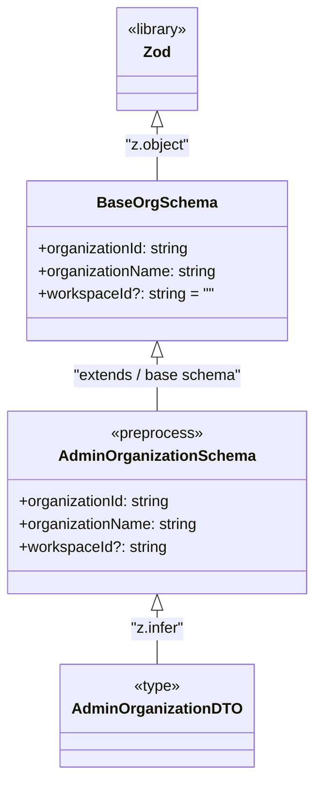

# Diagram: web/portal/src/pages/administration/report-management/models/AdminOrganizationDTO.ts

> Auto-generated by Obscura crawlers

## Mermaid

### SVG

<svg id="container" width="328.5546875" xmlns="http://www.w3.org/2000/svg" class="classDiagram" height="814" viewBox="0 0 328.5546875 814" role="graphics-document document" aria-roledescription="class"><g><defs><marker id="container_class-aggregationStart" class="marker aggregation class" refX="18" refY="7" markerWidth="190" markerHeight="240" orient="auto"><path d="M 18,7 L9,13 L1,7 L9,1 Z"></path></marker></defs><defs><marker id="container_class-aggregationEnd" class="marker aggregation class" refX="1" refY="7" markerWidth="20" markerHeight="28" orient="auto"><path d="M 18,7 L9,13 L1,7 L9,1 Z"></path></marker></defs><defs><marker id="container_class-extensionStart" class="marker extension class" refX="18" refY="7" markerWidth="190" markerHeight="240" orient="auto"><path d="M 1,7 L18,13 V 1 Z"></path></marker></defs><defs><marker id="container_class-extensionEnd" class="marker extension class" refX="1" refY="7" markerWidth="20" markerHeight="28" orient="auto"><path d="M 1,1 V 13 L18,7 Z"></path></marker></defs><defs><marker id="container_class-compositionStart" class="marker composition class" refX="18" refY="7" markerWidth="190" markerHeight="240" orient="auto"><path d="M 18,7 L9,13 L1,7 L9,1 Z"></path></marker></defs><defs><marker id="container_class-compositionEnd" class="marker composition class" refX="1" refY="7" markerWidth="20" markerHeight="28" orient="auto"><path d="M 18,7 L9,13 L1,7 L9,1 Z"></path></marker></defs><defs><marker id="container_class-dependencyStart" class="marker dependency class" refX="6" refY="7" markerWidth="190" markerHeight="240" orient="auto"><path d="M 5,7 L9,13 L1,7 L9,1 Z"></path></marker></defs><defs><marker id="container_class-dependencyEnd" class="marker dependency class" refX="13" refY="7" markerWidth="20" markerHeight="28" orient="auto"><path d="M 18,7 L9,13 L14,7 L9,1 Z"></path></marker></defs><defs><marker id="container_class-lollipopStart" class="marker lollipop class" refX="13" refY="7" markerWidth="190" markerHeight="240" orient="auto"><circle stroke="black" fill="transparent" cx="7" cy="7" r="6"></circle></marker></defs><defs><marker id="container_class-lollipopEnd" class="marker lollipop class" refX="1" refY="7" markerWidth="190" markerHeight="240" orient="auto"><circle stroke="black" fill="transparent" cx="7" cy="7" r="6"></circle></marker></defs><g class="root"><g class="clusters"></g><g class="edgePaths"><path d="M164.277,133.25L164.277,136.542C164.277,139.833,164.277,146.417,164.277,155.875C164.277,165.333,164.277,177.667,164.277,183.833L164.277,190" id="id_Zod_BaseOrgSchema_1" class="edge-thickness-normal edge-pattern-solid relation" style=";;;" data-edge="true" data-et="edge" data-id="id_Zod_BaseOrgSchema_1" data-points="W3sieCI6MTY0LjI3NzM0Mzc1LCJ5IjoxMTZ9LHsieCI6MTY0LjI3NzM0Mzc1LCJ5IjoxNTN9LHsieCI6MTY0LjI3NzM0Mzc1LCJ5IjoxOTB9XQ==" marker-start="url(#container_class-extensionStart)"></path><path d="M164.277,375.25L164.277,378.542C164.277,381.833,164.277,388.417,164.277,397.875C164.277,407.333,164.277,419.667,164.277,425.833L164.277,432" id="id_BaseOrgSchema_AdminOrganizationSchema_2" class="edge-thickness-normal edge-pattern-solid relation" style=";;;" data-edge="true" data-et="edge" data-id="id_BaseOrgSchema_AdminOrganizationSchema_2" data-points="W3sieCI6MTY0LjI3NzM0Mzc1LCJ5IjozNTh9LHsieCI6MTY0LjI3NzM0Mzc1LCJ5IjozOTV9LHsieCI6MTY0LjI3NzM0Mzc1LCJ5Ijo0MzJ9XQ==" marker-start="url(#container_class-extensionStart)"></path><path d="M164.277,641.25L164.277,644.542C164.277,647.833,164.277,654.417,164.277,663.875C164.277,673.333,164.277,685.667,164.277,691.833L164.277,698" id="id_AdminOrganizationSchema_AdminOrganizationDTO_3" class="edge-thickness-normal edge-pattern-solid relation" style=";;;" data-edge="true" data-et="edge" data-id="id_AdminOrganizationSchema_AdminOrganizationDTO_3" data-points="W3sieCI6MTY0LjI3NzM0Mzc1LCJ5Ijo2MjR9LHsieCI6MTY0LjI3NzM0Mzc1LCJ5Ijo2NjF9LHsieCI6MTY0LjI3NzM0Mzc1LCJ5Ijo2OTh9XQ==" marker-start="url(#container_class-extensionStart)"></path></g><g class="edgeLabels"><g class="edgeLabel" transform="translate(164.27734375, 153)"><g class="label" data-id="id_Zod_BaseOrgSchema_1" transform="translate(-34.2578125, -12)"><foreignObject width="68.515625" height="24">

"z.object"

</foreignObject></g></g><g class="edgeLabel" transform="translate(164.27734375, 395)"><g class="label" data-id="id_BaseOrgSchema_AdminOrganizationSchema_2" transform="translate(-90.109375, -12)"><foreignObject width="180.21875" height="24">

"extends / base schema"

</foreignObject></g></g><g class="edgeLabel" transform="translate(164.27734375, 661)"><g class="label" data-id="id_AdminOrganizationSchema_AdminOrganizationDTO_3" transform="translate(-28.75, -12)"><foreignObject width="57.5" height="24">

"z.infer"

</foreignObject></g></g></g><g class="nodes"><g class="node default" id="classId-Zod-0" transform="translate(164.27734375, 62)"><g class="basic label-container"><path d="M-44.6640625 -54 L44.6640625 -54 L44.6640625 54 L-44.6640625 54" stroke="none" stroke-width="0" fill="#ECECFF" style=""></path><path d="M-44.6640625 -54 C-19.20174316959095 -54, 6.260576160818097 -54, 44.6640625 -54 M-44.6640625 -54 C-15.182815626128157 -54, 14.298431247743686 -54, 44.6640625 -54 M44.6640625 -54 C44.6640625 -27.891432597127327, 44.6640625 -1.7828651942546543, 44.6640625 54 M44.6640625 -54 C44.6640625 -15.481532486738402, 44.6640625 23.036935026523196, 44.6640625 54 M44.6640625 54 C15.983990213591316 54, -12.696082072817369 54, -44.6640625 54 M44.6640625 54 C15.240313012492308 54, -14.183436475015384 54, -44.6640625 54 M-44.6640625 54 C-44.6640625 22.971920441939663, -44.6640625 -8.056159116120675, -44.6640625 -54 M-44.6640625 54 C-44.6640625 23.75685297281831, -44.6640625 -6.486294054363377, -44.6640625 -54" stroke="#9370DB" stroke-width="1.3" fill="none" stroke-dasharray="0 0" style=""></path></g><g class="annotation-group text" transform="translate(-32.6640625, -30)"><g class="label" style="" transform="translate(0,-12)"><foreignObject width="65.328125" height="24">

«library»

</foreignObject></g></g><g class="label-group text" transform="translate(-13.65625, -6)"><g class="label" style="font-weight: bolder" transform="translate(0,-12)"><foreignObject width="27.3125" height="24">

Zod

</foreignObject></g></g><g class="members-group text" transform="translate(-32.6640625, 42)"></g><g class="methods-group text" transform="translate(-32.6640625, 72)"></g><g class="divider" style=""><path d="M-44.6640625 18 C-16.999318334888645 18, 10.66542583022271 18, 44.6640625 18 M-44.6640625 18 C-18.525585650390795 18, 7.61289119921841 18, 44.6640625 18" stroke="#9370DB" stroke-width="1.3" fill="none" stroke-dasharray="0 0" style=""></path></g><g class="divider" style=""><path d="M-44.6640625 36 C-14.026211406404602 36, 16.611639687190795 36, 44.6640625 36 M-44.6640625 36 C-15.661598989744473 36, 13.340864520511055 36, 44.6640625 36" stroke="#9370DB" stroke-width="1.3" fill="none" stroke-dasharray="0 0" style=""></path></g></g><g class="node default" id="classId-BaseOrgSchema-1" transform="translate(164.27734375, 274)"><g class="basic label-container"><path d="M-136.640625 -84 L136.640625 -84 L136.640625 84 L-136.640625 84" stroke="none" stroke-width="0" fill="#ECECFF" style=""></path><path d="M-136.640625 -84 C-29.551447325936948 -84, 77.5377303481261 -84, 136.640625 -84 M-136.640625 -84 C-65.78626420600926 -84, 5.068096587981472 -84, 136.640625 -84 M136.640625 -84 C136.640625 -41.59002807034918, 136.640625 0.8199438593016453, 136.640625 84 M136.640625 -84 C136.640625 -42.377802794894784, 136.640625 -0.7556055897895675, 136.640625 84 M136.640625 84 C28.513448270355738 84, -79.61372845928852 84, -136.640625 84 M136.640625 84 C78.01620262183334 84, 19.391780243666673 84, -136.640625 84 M-136.640625 84 C-136.640625 38.553795036440334, -136.640625 -6.892409927119331, -136.640625 -84 M-136.640625 84 C-136.640625 43.605975646098024, -136.640625 3.211951292196048, -136.640625 -84" stroke="#9370DB" stroke-width="1.3" fill="none" stroke-dasharray="0 0" style=""></path></g><g class="annotation-group text" transform="translate(0, -60)"></g><g class="label-group text" transform="translate(-59.15625, -60)"><g class="label" style="font-weight: bolder" transform="translate(0,-12)"><foreignObject width="118.3125" height="24">

BaseOrgSchema

</foreignObject></g></g><g class="members-group text" transform="translate(-124.640625, -12)"><g class="label" style="" transform="translate(0,-12)"><foreignObject width="162.34375" height="24">

+organizationId: string

</foreignObject></g><g class="label" style="" transform="translate(0,12)"><foreignObject width="190.125" height="24">

+organizationName: string

</foreignObject></g><g class="label" style="" transform="translate(0,36)"><foreignObject width="185.25" height="24">

+workspaceId?: string = ""

</foreignObject></g></g><g class="methods-group text" transform="translate(-124.640625, 84)"></g><g class="divider" style=""><path d="M-136.640625 -36 C-74.58593741640793 -36, -12.53124983281586 -36, 136.640625 -36 M-136.640625 -36 C-77.51911082557014 -36, -18.397596651140276 -36, 136.640625 -36" stroke="#9370DB" stroke-width="1.3" fill="none" stroke-dasharray="0 0" style=""></path></g><g class="divider" style=""><path d="M-136.640625 60 C-48.75617885498521 60, 39.128267290029584 60, 136.640625 60 M-136.640625 60 C-42.47325146966659 60, 51.694122060666814 60, 136.640625 60" stroke="#9370DB" stroke-width="1.3" fill="none" stroke-dasharray="0 0" style=""></path></g></g><g class="node default" id="classId-AdminOrganizationSchema-2" transform="translate(164.27734375, 528)"><g class="basic label-container"><path d="M-156.27734375 -96 L156.27734375 -96 L156.27734375 96 L-156.27734375 96" stroke="none" stroke-width="0" fill="#ECECFF" style=""></path><path d="M-156.27734375 -96 C-47.97118627764772 -96, 60.334971194704565 -96, 156.27734375 -96 M-156.27734375 -96 C-68.04712785405452 -96, 20.183088041890954 -96, 156.27734375 -96 M156.27734375 -96 C156.27734375 -26.632528547547537, 156.27734375 42.734942904904926, 156.27734375 96 M156.27734375 -96 C156.27734375 -57.333076835356266, 156.27734375 -18.666153670712532, 156.27734375 96 M156.27734375 96 C59.796831708386534 96, -36.68368033322693 96, -156.27734375 96 M156.27734375 96 C58.881208407766124 96, -38.51492693446775 96, -156.27734375 96 M-156.27734375 96 C-156.27734375 20.88115562435965, -156.27734375 -54.2376887512807, -156.27734375 -96 M-156.27734375 96 C-156.27734375 35.074710383232684, -156.27734375 -25.85057923353463, -156.27734375 -96" stroke="#9370DB" stroke-width="1.3" fill="none" stroke-dasharray="0 0" style=""></path></g><g class="annotation-group text" transform="translate(-48.78125, -72)"><g class="label" style="" transform="translate(0,-12)"><foreignObject width="97.5625" height="24">

«preprocess»

</foreignObject></g></g><g class="label-group text" transform="translate(-98.4296875, -48)"><g class="label" style="font-weight: bolder" transform="translate(0,-12)"><foreignObject width="196.859375" height="24">

AdminOrganizationSchema

</foreignObject></g></g><g class="members-group text" transform="translate(-144.27734375, 0)"><g class="label" style="" transform="translate(0,-12)"><foreignObject width="162.34375" height="24">

+organizationId: string

</foreignObject></g><g class="label" style="" transform="translate(0,12)"><foreignObject width="190.125" height="24">

+organizationName: string

</foreignObject></g><g class="label" style="" transform="translate(0,36)"><foreignObject width="156.015625" height="24">

+workspaceId?: string

</foreignObject></g></g><g class="methods-group text" transform="translate(-144.27734375, 96)"></g><g class="divider" style=""><path d="M-156.27734375 -24 C-31.336797557852705 -24, 93.60374863429459 -24, 156.27734375 -24 M-156.27734375 -24 C-61.29381568867555 -24, 33.6897123726489 -24, 156.27734375 -24" stroke="#9370DB" stroke-width="1.3" fill="none" stroke-dasharray="0 0" style=""></path></g><g class="divider" style=""><path d="M-156.27734375 72 C-93.05060000909873 72, -29.823856268197474 72, 156.27734375 72 M-156.27734375 72 C-93.06145703584318 72, -29.845570321686353 72, 156.27734375 72" stroke="#9370DB" stroke-width="1.3" fill="none" stroke-dasharray="0 0" style=""></path></g></g><g class="node default" id="classId-AdminOrganizationDTO-3" transform="translate(164.27734375, 752)"><g class="basic label-container"><path d="M-96.34375 -54 L96.34375 -54 L96.34375 54 L-96.34375 54" stroke="none" stroke-width="0" fill="#ECECFF" style=""></path><path d="M-96.34375 -54 C-23.420514653206865 -54, 49.50272069358627 -54, 96.34375 -54 M-96.34375 -54 C-21.46995388091888 -54, 53.40384223816224 -54, 96.34375 -54 M96.34375 -54 C96.34375 -31.060957829994926, 96.34375 -8.121915659989853, 96.34375 54 M96.34375 -54 C96.34375 -12.782354641017605, 96.34375 28.43529071796479, 96.34375 54 M96.34375 54 C27.404364610973232 54, -41.535020778053536 54, -96.34375 54 M96.34375 54 C30.16154187714821 54, -36.02066624570358 54, -96.34375 54 M-96.34375 54 C-96.34375 12.325015123862222, -96.34375 -29.349969752275555, -96.34375 -54 M-96.34375 54 C-96.34375 18.536127148406464, -96.34375 -16.92774570318707, -96.34375 -54" stroke="#9370DB" stroke-width="1.3" fill="none" stroke-dasharray="0 0" style=""></path></g><g class="annotation-group text" transform="translate(-24.8671875, -30)"><g class="label" style="" transform="translate(0,-12)"><foreignObject width="49.734375" height="24">

«type»

</foreignObject></g></g><g class="label-group text" transform="translate(-84.34375, -6)"><g class="label" style="font-weight: bolder" transform="translate(0,-12)"><foreignObject width="168.6875" height="24">

AdminOrganizationDTO

</foreignObject></g></g><g class="members-group text" transform="translate(-84.34375, 42)"></g><g class="methods-group text" transform="translate(-84.34375, 72)"></g><g class="divider" style=""><path d="M-96.34375 18 C-52.82866059146866 18, -9.313571182937324 18, 96.34375 18 M-96.34375 18 C-40.01504363087417 18, 16.313662738251665 18, 96.34375 18" stroke="#9370DB" stroke-width="1.3" fill="none" stroke-dasharray="0 0" style=""></path></g><g class="divider" style=""><path d="M-96.34375 36 C-38.109115763796694 36, 20.12551847240661 36, 96.34375 36 M-96.34375 36 C-47.6411678606438 36, 1.0614142787124052 36, 96.34375 36" stroke="#9370DB" stroke-width="1.3" fill="none" stroke-dasharray="0 0" style=""></path></g></g></g></g></g></svg>
