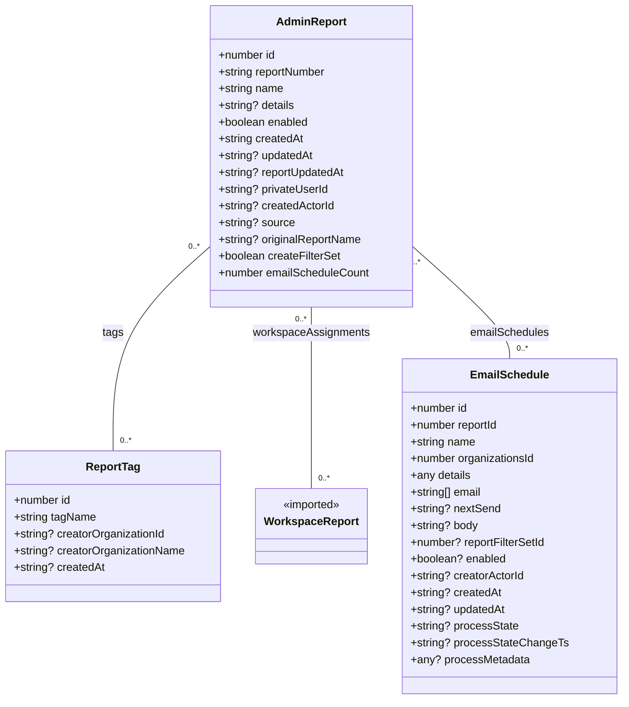

# Diagram: web/portal/src/pages/administration/report-management/models/AdminReportDTO.ts

> Auto-generated by Obscura crawlers

## Mermaid

### SVG

<svg id="container" width="877.3046875" xmlns="http://www.w3.org/2000/svg" class="classDiagram" height="1002" viewBox="0 0 877.3046875 1002" role="graphics-document document" aria-roledescription="class"><g><defs><marker id="container_class-aggregationStart" class="marker aggregation class" refX="18" refY="7" markerWidth="190" markerHeight="240" orient="auto"><path d="M 18,7 L9,13 L1,7 L9,1 Z"></path></marker></defs><defs><marker id="container_class-aggregationEnd" class="marker aggregation class" refX="1" refY="7" markerWidth="20" markerHeight="28" orient="auto"><path d="M 18,7 L9,13 L1,7 L9,1 Z"></path></marker></defs><defs><marker id="container_class-extensionStart" class="marker extension class" refX="18" refY="7" markerWidth="190" markerHeight="240" orient="auto"><path d="M 1,7 L18,13 V 1 Z"></path></marker></defs><defs><marker id="container_class-extensionEnd" class="marker extension class" refX="1" refY="7" markerWidth="20" markerHeight="28" orient="auto"><path d="M 1,1 V 13 L18,7 Z"></path></marker></defs><defs><marker id="container_class-compositionStart" class="marker composition class" refX="18" refY="7" markerWidth="190" markerHeight="240" orient="auto"><path d="M 18,7 L9,13 L1,7 L9,1 Z"></path></marker></defs><defs><marker id="container_class-compositionEnd" class="marker composition class" refX="1" refY="7" markerWidth="20" markerHeight="28" orient="auto"><path d="M 18,7 L9,13 L1,7 L9,1 Z"></path></marker></defs><defs><marker id="container_class-dependencyStart" class="marker dependency class" refX="6" refY="7" markerWidth="190" markerHeight="240" orient="auto"><path d="M 5,7 L9,13 L1,7 L9,1 Z"></path></marker></defs><defs><marker id="container_class-dependencyEnd" class="marker dependency class" refX="13" refY="7" markerWidth="20" markerHeight="28" orient="auto"><path d="M 18,7 L9,13 L14,7 L9,1 Z"></path></marker></defs><defs><marker id="container_class-lollipopStart" class="marker lollipop class" refX="13" refY="7" markerWidth="190" markerHeight="240" orient="auto"><circle stroke="black" fill="transparent" cx="7" cy="7" r="6"></circle></marker></defs><defs><marker id="container_class-lollipopEnd" class="marker lollipop class" refX="1" refY="7" markerWidth="190" markerHeight="240" orient="auto"><circle stroke="black" fill="transparent" cx="7" cy="7" r="6"></circle></marker></defs><g class="root"><g class="clusters"></g><g class="edgePaths"><path d="M297.965,354.775L275.33,375.146C252.695,395.517,207.426,436.258,184.791,484.796C162.156,533.333,162.156,589.667,162.156,617.833L162.156,646" id="id_AdminReport_ReportTag_1" class="edge-thickness-normal edge-pattern-solid relation" style=";;;" data-edge="true" data-et="edge" data-id="id_AdminReport_ReportTag_1" data-points="W3sieCI6Mjk3Ljk2NDg0Mzc1LCJ5IjozNTQuNzc0OTA3NTk1MjUzMzV9LHsieCI6MTYyLjE1NjI1LCJ5Ijo0Nzd9LHsieCI6MTYyLjE1NjI1LCJ5Ijo2NDZ9XQ=="></path><path d="M443.273,440L443.273,446.167C443.273,452.333,443.273,464.667,443.273,508C443.273,551.333,443.273,625.667,443.273,662.833L443.273,700" id="id_AdminReport_WorkspaceReport_2" class="edge-thickness-normal edge-pattern-solid relation" style=";;;" data-edge="true" data-et="edge" data-id="id_AdminReport_WorkspaceReport_2" data-points="W3sieCI6NDQzLjI3MzQzNzUsInkiOjQ0MH0seyJ4Ijo0NDMuMjczNDM3NSwieSI6NDc3fSx7IngiOjQ0My4yNzM0Mzc1LCJ5Ijo3MDB9XQ=="></path><path d="M588.582,356.961L610.447,376.967C632.311,396.974,676.04,436.987,697.905,463.16C719.77,489.333,719.77,501.667,719.77,507.833L719.77,514" id="id_AdminReport_EmailSchedule_3" class="edge-thickness-normal edge-pattern-solid relation" style=";;;" data-edge="true" data-et="edge" data-id="id_AdminReport_EmailSchedule_3" data-points="W3sieCI6NTg4LjU4MjAzMTI1LCJ5IjozNTYuOTYwNTU1NTAwNjE0NTN9LHsieCI6NzE5Ljc2OTUzMTI1LCJ5Ijo0Nzd9LHsieCI6NzE5Ljc2OTUzMTI1LCJ5Ijo1MTR9XQ=="></path></g><g class="edgeLabels"><g class="edgeLabel" transform="translate(162.15625, 477)"><g class="label" data-id="id_AdminReport_ReportTag_1" transform="translate(-14.9453125, -12)"><foreignObject width="29.890625" height="24">

tags

</foreignObject></g></g><g class="edgeLabel" transform="translate(443.2734375, 477)"><g class="label" data-id="id_AdminReport_WorkspaceReport_2" transform="translate(-83.9453125, -12)"><foreignObject width="167.890625" height="24">

workspaceAssignments

</foreignObject></g></g><g class="edgeLabel" transform="translate(719.76953125, 477)"><g class="label" data-id="id_AdminReport_EmailSchedule_3" transform="translate(-57.2421875, -12)"><foreignObject width="114.484375" height="24">

emailSchedules

</foreignObject></g></g><g class="edgeTerminals" transform="translate(274.9227209415733, 355.33212856826975)"><g class="inner" transform="translate(0, 0)"><foreignObject style="width: 36px; height: 12px;">
0..*
</foreignObject></g></g><g class="edgeTerminals" transform="translate(428.27343875, 457.5000010714286)"><g class="inner" transform="translate(0, 0)"><foreignObject style="width: 36px; height: 12px;">
0..*
</foreignObject></g></g><g class="edgeTerminals" transform="translate(591.3668256894658, 379.8405666643287)"><g class="inner" transform="translate(0, 0)"><foreignObject style="width: 36px; height: 12px;">
0..*
</foreignObject></g></g><g class="edgeTerminals" transform="translate(172.15625, 623.5)"><g class="inner" transform="translate(0, 0)"></g><foreignObject style="width: 36px; height: 12px;">
0..*
</foreignObject></g><g class="edgeTerminals" transform="translate(453.2734387499999, 677.5000010714285)"><g class="inner" transform="translate(0, 0)"></g><foreignObject style="width: 36px; height: 12px;">
0..*
</foreignObject></g><g class="edgeTerminals" transform="translate(729.769530625, 491.49999946428574)"><g class="inner" transform="translate(0, 0)"></g><foreignObject style="width: 36px; height: 12px;">
0..*
</foreignObject></g></g><g class="nodes"><g class="node default" id="classId-ReportTag-0" transform="translate(162.15625, 754)"><g class="basic label-container"><path d="M-154.15625 -108 L154.15625 -108 L154.15625 108 L-154.15625 108" stroke="none" stroke-width="0" fill="#ECECFF" style=""></path><path d="M-154.15625 -108 C-47.43460017908613 -108, 59.287049641827736 -108, 154.15625 -108 M-154.15625 -108 C-34.3008960855841 -108, 85.5544578288318 -108, 154.15625 -108 M154.15625 -108 C154.15625 -47.34938012586174, 154.15625 13.301239748276515, 154.15625 108 M154.15625 -108 C154.15625 -34.748708458642184, 154.15625 38.50258308271563, 154.15625 108 M154.15625 108 C72.7325594907884 108, -8.691131018423192 108, -154.15625 108 M154.15625 108 C37.707554221737496 108, -78.74114155652501 108, -154.15625 108 M-154.15625 108 C-154.15625 58.19965250223563, -154.15625 8.399305004471259, -154.15625 -108 M-154.15625 108 C-154.15625 51.36250388849296, -154.15625 -5.274992223014081, -154.15625 -108" stroke="#9370DB" stroke-width="1.3" fill="none" stroke-dasharray="0 0" style=""></path></g><g class="annotation-group text" transform="translate(0, -84)"></g><g class="label-group text" transform="translate(-37.609375, -84)"><g class="label" style="font-weight: bolder" transform="translate(0,-12)"><foreignObject width="75.21875" height="24">

ReportTag

</foreignObject></g></g><g class="members-group text" transform="translate(-142.15625, -36)"><g class="label" style="" transform="translate(0,-12)"><foreignObject width="83.109375" height="24">

+number id

</foreignObject></g><g class="label" style="" transform="translate(0,12)"><foreignObject width="118.453125" height="24">

+string tagName

</foreignObject></g><g class="label" style="" transform="translate(0,36)"><foreignObject width="218.921875" height="24">

+string? creatorOrganizationId

</foreignObject></g><g class="label" style="" transform="translate(0,60)"><foreignObject width="246.703125" height="24">

+string? creatorOrganizationName

</foreignObject></g><g class="label" style="" transform="translate(0,84)"><foreignObject width="130.265625" height="24">

+string? createdAt

</foreignObject></g></g><g class="methods-group text" transform="translate(-142.15625, 108)"></g><g class="divider" style=""><path d="M-154.15625 -60 C-78.95723413709976 -60, -3.758218274199521 -60, 154.15625 -60 M-154.15625 -60 C-60.17395470186493 -60, 33.80834059627014 -60, 154.15625 -60" stroke="#9370DB" stroke-width="1.3" fill="none" stroke-dasharray="0 0" style=""></path></g><g class="divider" style=""><path d="M-154.15625 84 C-33.37611059857275 84, 87.4040288028545 84, 154.15625 84 M-154.15625 84 C-78.64494204364924 84, -3.133634087298475 84, 154.15625 84" stroke="#9370DB" stroke-width="1.3" fill="none" stroke-dasharray="0 0" style=""></path></g></g><g class="node default" id="classId-EmailSchedule-1" transform="translate(719.76953125, 754)"><g class="basic label-container"><path d="M-149.53515625 -240 L149.53515625 -240 L149.53515625 240 L-149.53515625 240" stroke="none" stroke-width="0" fill="#ECECFF" style=""></path><path d="M-149.53515625 -240 C-53.978223774361695 -240, 41.57870870127661 -240, 149.53515625 -240 M-149.53515625 -240 C-86.4066920057289 -240, -23.278227761457813 -240, 149.53515625 -240 M149.53515625 -240 C149.53515625 -95.59668726260412, 149.53515625 48.80662547479176, 149.53515625 240 M149.53515625 -240 C149.53515625 -65.83390606063358, 149.53515625 108.33218787873284, 149.53515625 240 M149.53515625 240 C88.96188681217356 240, 28.38861737434712 240, -149.53515625 240 M149.53515625 240 C66.42529797122158 240, -16.684560307556836 240, -149.53515625 240 M-149.53515625 240 C-149.53515625 99.38865598649102, -149.53515625 -41.222688027017966, -149.53515625 -240 M-149.53515625 240 C-149.53515625 112.82545390604282, -149.53515625 -14.349092187914351, -149.53515625 -240" stroke="#9370DB" stroke-width="1.3" fill="none" stroke-dasharray="0 0" style=""></path></g><g class="annotation-group text" transform="translate(0, -216)"></g><g class="label-group text" transform="translate(-53.4765625, -216)"><g class="label" style="font-weight: bolder" transform="translate(0,-12)"><foreignObject width="106.953125" height="24">

EmailSchedule

</foreignObject></g></g><g class="members-group text" transform="translate(-137.53515625, -168)"><g class="label" style="" transform="translate(0,-12)"><foreignObject width="83.109375" height="24">

+number id

</foreignObject></g><g class="label" style="" transform="translate(0,12)"><foreignObject width="128.53125" height="24">

+number reportId

</foreignObject></g><g class="label" style="" transform="translate(0,36)"><foreignObject width="94.375" height="24">

+string name

</foreignObject></g><g class="label" style="" transform="translate(0,60)"><foreignObject width="181.140625" height="24">

+number organizationsId

</foreignObject></g><g class="label" style="" transform="translate(0,84)"><foreignObject width="87.15625" height="24">

+any details

</foreignObject></g><g class="label" style="" transform="translate(0,108)"><foreignObject width="104.5" height="24">

+string[] email

</foreignObject></g><g class="label" style="" transform="translate(0,132)"><foreignObject width="128.765625" height="24">

+string? nextSend

</foreignObject></g><g class="label" style="" transform="translate(0,156)"><foreignObject width="97.171875" height="24">

+string? body

</foreignObject></g><g class="label" style="" transform="translate(0,180)"><foreignObject width="195.546875" height="24">

+number? reportFilterSetId

</foreignObject></g><g class="label" style="" transform="translate(0,204)"><foreignObject width="137.734375" height="24">

+boolean? enabled

</foreignObject></g><g class="label" style="" transform="translate(0,228)"><foreignObject width="164.71875" height="24">

+string? creatorActorId

</foreignObject></g><g class="label" style="" transform="translate(0,252)"><foreignObject width="130.265625" height="24">

+string? createdAt

</foreignObject></g><g class="label" style="" transform="translate(0,276)"><foreignObject width="136.75" height="24">

+string? updatedAt

</foreignObject></g><g class="label" style="" transform="translate(0,300)"><foreignObject width="153.609375" height="24">

+string? processState

</foreignObject></g><g class="label" style="" transform="translate(0,324)"><foreignObject width="221.59375" height="24">

+string? processStateChangeTs

</foreignObject></g><g class="label" style="" transform="translate(0,348)"><foreignObject width="168.25" height="24">

+any? processMetadata

</foreignObject></g></g><g class="methods-group text" transform="translate(-137.53515625, 240)"></g><g class="divider" style=""><path d="M-149.53515625 -192 C-47.85200285191729 -192, 53.83115054616542 -192, 149.53515625 -192 M-149.53515625 -192 C-49.89252627794245 -192, 49.7501036941151 -192, 149.53515625 -192" stroke="#9370DB" stroke-width="1.3" fill="none" stroke-dasharray="0 0" style=""></path></g><g class="divider" style=""><path d="M-149.53515625 216 C-54.62646075922579 216, 40.282234731548414 216, 149.53515625 216 M-149.53515625 216 C-70.5521172001803 216, 8.43092184963939 216, 149.53515625 216" stroke="#9370DB" stroke-width="1.3" fill="none" stroke-dasharray="0 0" style=""></path></g></g><g class="node default" id="classId-WorkspaceReport-2" transform="translate(443.2734375, 754)"><g class="basic label-container"><path d="M-76.9609375 -54 L76.9609375 -54 L76.9609375 54 L-76.9609375 54" stroke="none" stroke-width="0" fill="#ECECFF" style=""></path><path d="M-76.9609375 -54 C-45.43245252622379 -54, -13.903967552447583 -54, 76.9609375 -54 M-76.9609375 -54 C-18.081467525714032 -54, 40.798002448571935 -54, 76.9609375 -54 M76.9609375 -54 C76.9609375 -14.463580257461253, 76.9609375 25.072839485077495, 76.9609375 54 M76.9609375 -54 C76.9609375 -24.02360806571855, 76.9609375 5.9527838685629035, 76.9609375 54 M76.9609375 54 C19.890540834205765 54, -37.17985583158847 54, -76.9609375 54 M76.9609375 54 C23.758765338166278 54, -29.443406823667445 54, -76.9609375 54 M-76.9609375 54 C-76.9609375 27.190461568744592, -76.9609375 0.3809231374891837, -76.9609375 -54 M-76.9609375 54 C-76.9609375 29.35192098192235, -76.9609375 4.703841963844702, -76.9609375 -54" stroke="#9370DB" stroke-width="1.3" fill="none" stroke-dasharray="0 0" style=""></path></g><g class="annotation-group text" transform="translate(-42.671875, -30)"><g class="label" style="" transform="translate(0,-12)"><foreignObject width="85.34375" height="24">

«imported»

</foreignObject></g></g><g class="label-group text" transform="translate(-64.9609375, -6)"><g class="label" style="font-weight: bolder" transform="translate(0,-12)"><foreignObject width="129.921875" height="24">

WorkspaceReport

</foreignObject></g></g><g class="members-group text" transform="translate(-64.9609375, 42)"></g><g class="methods-group text" transform="translate(-64.9609375, 72)"></g><g class="divider" style=""><path d="M-76.9609375 18 C-33.09611871593923 18, 10.768700068121547 18, 76.9609375 18 M-76.9609375 18 C-22.29831858040771 18, 32.36430033918458 18, 76.9609375 18" stroke="#9370DB" stroke-width="1.3" fill="none" stroke-dasharray="0 0" style=""></path></g><g class="divider" style=""><path d="M-76.9609375 36 C-31.985962772745886 36, 12.989011954508229 36, 76.9609375 36 M-76.9609375 36 C-29.397807901472653 36, 18.165321697054694 36, 76.9609375 36" stroke="#9370DB" stroke-width="1.3" fill="none" stroke-dasharray="0 0" style=""></path></g></g><g class="node default" id="classId-AdminReport-3" transform="translate(443.2734375, 224)"><g class="basic label-container"><path d="M-145.30859375 -216 L145.30859375 -216 L145.30859375 216 L-145.30859375 216" stroke="none" stroke-width="0" fill="#ECECFF" style=""></path><path d="M-145.30859375 -216 C-72.51503495844322 -216, 0.2785238331135531 -216, 145.30859375 -216 M-145.30859375 -216 C-38.78478962112288 -216, 67.73901450775423 -216, 145.30859375 -216 M145.30859375 -216 C145.30859375 -118.76454008527614, 145.30859375 -21.529080170552277, 145.30859375 216 M145.30859375 -216 C145.30859375 -102.68777458419913, 145.30859375 10.624450831601735, 145.30859375 216 M145.30859375 216 C52.55676796687486 216, -40.195057816250284 216, -145.30859375 216 M145.30859375 216 C86.43333128501214 216, 27.558068820024303 216, -145.30859375 216 M-145.30859375 216 C-145.30859375 74.8558310004195, -145.30859375 -66.288337999161, -145.30859375 -216 M-145.30859375 216 C-145.30859375 115.26319839978356, -145.30859375 14.526396799567124, -145.30859375 -216" stroke="#9370DB" stroke-width="1.3" fill="none" stroke-dasharray="0 0" style=""></path></g><g class="annotation-group text" transform="translate(0, -192)"></g><g class="label-group text" transform="translate(-48.1328125, -192)"><g class="label" style="font-weight: bolder" transform="translate(0,-12)"><foreignObject width="96.265625" height="24">

AdminReport

</foreignObject></g></g><g class="members-group text" transform="translate(-133.30859375, -144)"><g class="label" style="" transform="translate(0,-12)"><foreignObject width="83.109375" height="24">

+number id

</foreignObject></g><g class="label" style="" transform="translate(0,12)"><foreignObject width="157.4375" height="24">

+string reportNumber

</foreignObject></g><g class="label" style="" transform="translate(0,36)"><foreignObject width="94.375" height="24">

+string name

</foreignObject></g><g class="label" style="" transform="translate(0,60)"><foreignObject width="110.21875" height="24">

+string? details

</foreignObject></g><g class="label" style="" transform="translate(0,84)"><foreignObject width="130.875" height="24">

+boolean enabled

</foreignObject></g><g class="label" style="" transform="translate(0,108)"><foreignObject width="123.234375" height="24">

+string createdAt

</foreignObject></g><g class="label" style="" transform="translate(0,132)"><foreignObject width="136.75" height="24">

+string? updatedAt

</foreignObject></g><g class="label" style="" transform="translate(0,156)"><foreignObject width="183.234375" height="24">

+string? reportUpdatedAt

</foreignObject></g><g class="label" style="" transform="translate(0,180)"><foreignObject width="158.828125" height="24">

+string? privateUserId

</foreignObject></g><g class="label" style="" transform="translate(0,204)"><foreignObject width="167.484375" height="24">

+string? createdActorId

</foreignObject></g><g class="label" style="" transform="translate(0,228)"><foreignObject width="108.765625" height="24">

+string? source

</foreignObject></g><g class="label" style="" transform="translate(0,252)"><foreignObject width="207.390625" height="24">

+string? originalReportName

</foreignObject></g><g class="label" style="" transform="translate(0,276)"><foreignObject width="176.6875" height="24">

+boolean createFilterSet

</foreignObject></g><g class="label" style="" transform="translate(0,300)"><foreignObject width="218.484375" height="24">

+number emailScheduleCount

</foreignObject></g></g><g class="methods-group text" transform="translate(-133.30859375, 216)"></g><g class="divider" style=""><path d="M-145.30859375 -168 C-61.67365478382294 -168, 21.96128418235412 -168, 145.30859375 -168 M-145.30859375 -168 C-72.80946401457015 -168, -0.31033427914030653 -168, 145.30859375 -168" stroke="#9370DB" stroke-width="1.3" fill="none" stroke-dasharray="0 0" style=""></path></g><g class="divider" style=""><path d="M-145.30859375 192 C-41.663761980207596 192, 61.98106978958481 192, 145.30859375 192 M-145.30859375 192 C-49.624060683552415 192, 46.06047238289517 192, 145.30859375 192" stroke="#9370DB" stroke-width="1.3" fill="none" stroke-dasharray="0 0" style=""></path></g></g></g></g></g></svg>
