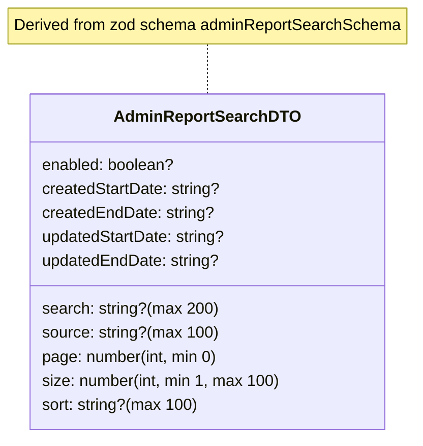

# Diagram: web/portal/src/pages/administration/report-management/models/AdminReportSearchDTO.ts

> Auto-generated by Obscura crawlers

## Mermaid

### SVG

<svg id="container" width="416.734375" xmlns="http://www.w3.org/2000/svg" class="classDiagram" height="438" viewBox="0 0 416.734375 438" role="graphics-document document" aria-roledescription="class"><g><defs><marker id="container_class-aggregationStart" class="marker aggregation class" refX="18" refY="7" markerWidth="190" markerHeight="240" orient="auto"><path d="M 18,7 L9,13 L1,7 L9,1 Z"></path></marker></defs><defs><marker id="container_class-aggregationEnd" class="marker aggregation class" refX="1" refY="7" markerWidth="20" markerHeight="28" orient="auto"><path d="M 18,7 L9,13 L1,7 L9,1 Z"></path></marker></defs><defs><marker id="container_class-extensionStart" class="marker extension class" refX="18" refY="7" markerWidth="190" markerHeight="240" orient="auto"><path d="M 1,7 L18,13 V 1 Z"></path></marker></defs><defs><marker id="container_class-extensionEnd" class="marker extension class" refX="1" refY="7" markerWidth="20" markerHeight="28" orient="auto"><path d="M 1,1 V 13 L18,7 Z"></path></marker></defs><defs><marker id="container_class-compositionStart" class="marker composition class" refX="18" refY="7" markerWidth="190" markerHeight="240" orient="auto"><path d="M 18,7 L9,13 L1,7 L9,1 Z"></path></marker></defs><defs><marker id="container_class-compositionEnd" class="marker composition class" refX="1" refY="7" markerWidth="20" markerHeight="28" orient="auto"><path d="M 18,7 L9,13 L1,7 L9,1 Z"></path></marker></defs><defs><marker id="container_class-dependencyStart" class="marker dependency class" refX="6" refY="7" markerWidth="190" markerHeight="240" orient="auto"><path d="M 5,7 L9,13 L1,7 L9,1 Z"></path></marker></defs><defs><marker id="container_class-dependencyEnd" class="marker dependency class" refX="13" refY="7" markerWidth="20" markerHeight="28" orient="auto"><path d="M 18,7 L9,13 L14,7 L9,1 Z"></path></marker></defs><defs><marker id="container_class-lollipopStart" class="marker lollipop class" refX="13" refY="7" markerWidth="190" markerHeight="240" orient="auto"><circle stroke="black" fill="transparent" cx="7" cy="7" r="6"></circle></marker></defs><defs><marker id="container_class-lollipopEnd" class="marker lollipop class" refX="1" refY="7" markerWidth="190" markerHeight="240" orient="auto"><circle stroke="black" fill="transparent" cx="7" cy="7" r="6"></circle></marker></defs><g class="root"><g class="clusters"></g><g class="edgePaths"><path d="M208.367,44L208.367,48.167C208.367,52.333,208.367,60.667,208.367,69C208.367,77.333,208.367,85.667,208.367,89.833L208.367,94" id="edgeNote1" class="edge-thickness-normal edge-pattern-dotted relation" style="fill: none;;;fill: none" data-edge="true" data-et="edge" data-id="edgeNote1" data-points="W3sieCI6MjA4LjM2NzE4NzUsInkiOjQ0fSx7IngiOjIwOC4zNjcxODc1LCJ5Ijo2OX0seyJ4IjoyMDguMzY3MTg3NSwieSI6OTR9XQ=="></path></g><g class="edgeLabels"><g class="edgeLabel"><g class="label" data-id="edgeNote1" transform="translate(0, 0)"><foreignObject width="0" height="0">

</foreignObject></g></g></g><g class="nodes"><g class="node default" id="classId-AdminReportSearchDTO-0" transform="translate(208.3671875, 262)"><g class="basic label-container"><path d="M-174.0234375 -168 L174.0234375 -168 L174.0234375 168 L-174.0234375 168" stroke="none" stroke-width="0" fill="#ECECFF" style=""></path><path d="M-174.0234375 -168 C-39.06315384511447 -168, 95.89712980977106 -168, 174.0234375 -168 M-174.0234375 -168 C-58.31713761546324 -168, 57.38916226907352 -168, 174.0234375 -168 M174.0234375 -168 C174.0234375 -43.08535104845686, 174.0234375 81.82929790308629, 174.0234375 168 M174.0234375 -168 C174.0234375 -42.62612700507404, 174.0234375 82.74774598985192, 174.0234375 168 M174.0234375 168 C92.25321111210519 168, 10.482984724210382 168, -174.0234375 168 M174.0234375 168 C86.55857565766492 168, -0.9062861846701651 168, -174.0234375 168 M-174.0234375 168 C-174.0234375 40.99510755929391, -174.0234375 -86.00978488141217, -174.0234375 -168 M-174.0234375 168 C-174.0234375 45.14321470444254, -174.0234375 -77.71357059111492, -174.0234375 -168" stroke="#9370DB" stroke-width="1.3" fill="none" stroke-dasharray="0 0" style=""></path></g><g class="annotation-group text" transform="translate(0, -144)"></g><g class="label-group text" transform="translate(-87.34375, -144)"><g class="label" style="font-weight: bolder" transform="translate(0,-12)"><foreignObject width="174.6875" height="24">

AdminReportSearchDTO

</foreignObject></g></g><g class="members-group text" transform="translate(-162.0234375, -96)"><g class="label" style="" transform="translate(0,-12)"><foreignObject width="133.59375" height="24">

enabled: boolean?

</foreignObject></g><g class="label" style="" transform="translate(0,12)"><foreignObject width="179.3125" height="24">

createdStartDate: string?

</foreignObject></g><g class="label" style="" transform="translate(0,36)"><foreignObject width="171.625" height="24">

createdEndDate: string?

</foreignObject></g><g class="label" style="" transform="translate(0,60)"><foreignObject width="185.796875" height="24">

updatedStartDate: string?

</foreignObject></g><g class="label" style="" transform="translate(0,84)"><foreignObject width="178.109375" height="24">

updatedEndDate: string?

</foreignObject></g></g><g class="methods-group text" transform="translate(-162.0234375, 48)"><g class="label" style="" transform="translate(0,-12)"><foreignObject width="174.765625" height="24">

search: string?(max 200)

</foreignObject></g><g class="label" style="" transform="translate(0,12)"><foreignObject width="174.1875" height="24">

source: string?(max 100)

</foreignObject></g><g class="label" style="" transform="translate(0,36)"><foreignObject width="178.5" height="24">

page: number(int, min 0)

</foreignObject></g><g class="label" style="" transform="translate(0,60)"><foreignObject width="236.703125" height="24">

size: number(int, min 1, max 100)

</foreignObject></g><g class="label" style="" transform="translate(0,84)"><foreignObject width="155.140625" height="24">

sort: string?(max 100)

</foreignObject></g></g><g class="divider" style=""><path d="M-174.0234375 -120 C-49.68490748916713 -120, 74.65362252166574 -120, 174.0234375 -120 M-174.0234375 -120 C-57.10474289206989 -120, 59.81395171586021 -120, 174.0234375 -120" stroke="#9370DB" stroke-width="1.3" fill="none" stroke-dasharray="0 0" style=""></path></g><g class="divider" style=""><path d="M-174.0234375 24 C-85.25647427182997 24, 3.5104889563400548 24, 174.0234375 24 M-174.0234375 24 C-98.55186804889136 24, -23.08029859778273 24, 174.0234375 24" stroke="#9370DB" stroke-width="1.3" fill="none" stroke-dasharray="0 0" style=""></path></g></g><g class="node undefined" id="note0" transform="translate(208.3671875, 26)"><g class="basic label-container"><path d="M-200.3671875 -18 L200.3671875 -18 L200.3671875 18 L-200.3671875 18" stroke="none" stroke-width="0" fill="#fff5ad" style="fill:#fff5ad !important;stroke:#aaaa33 !important"></path><path d="M-200.3671875 -18 C-77.34952128420252 -18, 45.66814493159495 -18, 200.3671875 -18 M-200.3671875 -18 C-98.84369215548848 -18, 2.6798031890230334 -18, 200.3671875 -18 M200.3671875 -18 C200.3671875 -7.5341040979161065, 200.3671875 2.931791804167787, 200.3671875 18 M200.3671875 -18 C200.3671875 -4.8979362393039985, 200.3671875 8.204127521392003, 200.3671875 18 M200.3671875 18 C92.29481253752591 18, -15.777562424948172 18, -200.3671875 18 M200.3671875 18 C97.62219724353508 18, -5.122793012929833 18, -200.3671875 18 M-200.3671875 18 C-200.3671875 8.190956399309577, -200.3671875 -1.6180872013808454, -200.3671875 -18 M-200.3671875 18 C-200.3671875 9.15957683376297, -200.3671875 0.31915366752593854, -200.3671875 -18" stroke="#aaaa33" stroke-width="1.3" fill="none" stroke-dasharray="0 0" style="fill:#fff5ad !important;stroke:#aaaa33 !important"></path></g><g class="label" style="text-align:left !important;white-space:nowrap !important" transform="translate(-194.3671875, -12)"><rect></rect><foreignObject width="388.734375" height="24">

Derived from zod schema adminReportSearchSchema

</foreignObject></g></g></g></g></g></svg>
