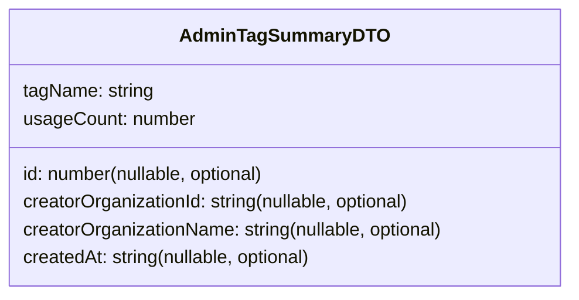

# Diagram: web/portal/src/pages/administration/report-management/models/AdminTagDTO.ts

> Auto-generated by Obscura crawlers

## Mermaid

### SVG

<svg id="container" width="499.1171875" xmlns="http://www.w3.org/2000/svg" class="classDiagram" height="256" viewBox="0 0 499.1171875 256" role="graphics-document document" aria-roledescription="class"><g><defs><marker id="container_class-aggregationStart" class="marker aggregation class" refX="18" refY="7" markerWidth="190" markerHeight="240" orient="auto"><path d="M 18,7 L9,13 L1,7 L9,1 Z"></path></marker></defs><defs><marker id="container_class-aggregationEnd" class="marker aggregation class" refX="1" refY="7" markerWidth="20" markerHeight="28" orient="auto"><path d="M 18,7 L9,13 L1,7 L9,1 Z"></path></marker></defs><defs><marker id="container_class-extensionStart" class="marker extension class" refX="18" refY="7" markerWidth="190" markerHeight="240" orient="auto"><path d="M 1,7 L18,13 V 1 Z"></path></marker></defs><defs><marker id="container_class-extensionEnd" class="marker extension class" refX="1" refY="7" markerWidth="20" markerHeight="28" orient="auto"><path d="M 1,1 V 13 L18,7 Z"></path></marker></defs><defs><marker id="container_class-compositionStart" class="marker composition class" refX="18" refY="7" markerWidth="190" markerHeight="240" orient="auto"><path d="M 18,7 L9,13 L1,7 L9,1 Z"></path></marker></defs><defs><marker id="container_class-compositionEnd" class="marker composition class" refX="1" refY="7" markerWidth="20" markerHeight="28" orient="auto"><path d="M 18,7 L9,13 L1,7 L9,1 Z"></path></marker></defs><defs><marker id="container_class-dependencyStart" class="marker dependency class" refX="6" refY="7" markerWidth="190" markerHeight="240" orient="auto"><path d="M 5,7 L9,13 L1,7 L9,1 Z"></path></marker></defs><defs><marker id="container_class-dependencyEnd" class="marker dependency class" refX="13" refY="7" markerWidth="20" markerHeight="28" orient="auto"><path d="M 18,7 L9,13 L14,7 L9,1 Z"></path></marker></defs><defs><marker id="container_class-lollipopStart" class="marker lollipop class" refX="13" refY="7" markerWidth="190" markerHeight="240" orient="auto"><circle stroke="black" fill="transparent" cx="7" cy="7" r="6"></circle></marker></defs><defs><marker id="container_class-lollipopEnd" class="marker lollipop class" refX="1" refY="7" markerWidth="190" markerHeight="240" orient="auto"><circle stroke="black" fill="transparent" cx="7" cy="7" r="6"></circle></marker></defs><g class="root"><g class="clusters"></g><g class="edgePaths"></g><g class="edgeLabels"></g><g class="nodes"><g class="node default" id="classId-AdminTagSummaryDTO-0" transform="translate(249.55859375, 128)"><g class="basic label-container"><path d="M-241.55859375 -120 L241.55859375 -120 L241.55859375 120 L-241.55859375 120" stroke="none" stroke-width="0" fill="#ECECFF" style=""></path><path d="M-241.55859375 -120 C-141.6423389197675 -120, -41.726084089534965 -120, 241.55859375 -120 M-241.55859375 -120 C-139.34872372973226 -120, -37.13885370946451 -120, 241.55859375 -120 M241.55859375 -120 C241.55859375 -57.22390675165798, 241.55859375 5.552186496684044, 241.55859375 120 M241.55859375 -120 C241.55859375 -29.315525970033107, 241.55859375 61.368948059933786, 241.55859375 120 M241.55859375 120 C114.34895236973198 120, -12.86068901053605 120, -241.55859375 120 M241.55859375 120 C136.52477116951025 120, 31.490948589020462 120, -241.55859375 120 M-241.55859375 120 C-241.55859375 62.69131812408421, -241.55859375 5.382636248168424, -241.55859375 -120 M-241.55859375 120 C-241.55859375 48.10880133341276, -241.55859375 -23.782397333174487, -241.55859375 -120" stroke="#9370DB" stroke-width="1.3" fill="none" stroke-dasharray="0 0" style=""></path></g><g class="annotation-group text" transform="translate(0, -96)"></g><g class="label-group text" transform="translate(-84.6953125, -96)"><g class="label" style="font-weight: bolder" transform="translate(0,-12)"><foreignObject width="169.390625" height="24">

AdminTagSummaryDTO

</foreignObject></g></g><g class="members-group text" transform="translate(-229.55859375, -48)"><g class="label" style="" transform="translate(0,-12)"><foreignObject width="114.3125" height="24">

tagName: string

</foreignObject></g><g class="label" style="" transform="translate(0,12)"><foreignObject width="149.359375" height="24">

usageCount: number

</foreignObject></g></g><g class="methods-group text" transform="translate(-229.55859375, 24)"><g class="label" style="" transform="translate(0,-12)"><foreignObject width="217.859375" height="24">

id: number(nullable, optional)

</foreignObject></g><g class="label" style="" transform="translate(0,12)"><foreignObject width="346.65625" height="24">

creatorOrganizationId: string(nullable, optional)

</foreignObject></g><g class="label" style="" transform="translate(0,36)"><foreignObject width="374.421875" height="24">

creatorOrganizationName: string(nullable, optional)

</foreignObject></g><g class="label" style="" transform="translate(0,60)"><foreignObject width="258.0625" height="24">

createdAt: string(nullable, optional)

</foreignObject></g></g><g class="divider" style=""><path d="M-241.55859375 -72 C-143.68762792566184 -72, -45.81666210132366 -72, 241.55859375 -72 M-241.55859375 -72 C-60.45522251476993 -72, 120.64814872046014 -72, 241.55859375 -72" stroke="#9370DB" stroke-width="1.3" fill="none" stroke-dasharray="0 0" style=""></path></g><g class="divider" style=""><path d="M-241.55859375 0 C-98.98406601578145 0, 43.5904617184371 0, 241.55859375 0 M-241.55859375 0 C-64.26943765303133 0, 113.01971844393734 0, 241.55859375 0" stroke="#9370DB" stroke-width="1.3" fill="none" stroke-dasharray="0 0" style=""></path></g></g></g></g></g></svg>
