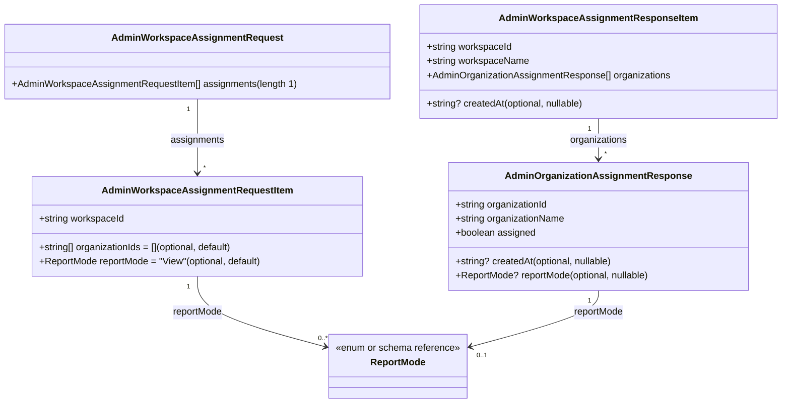

# Diagram: web/portal/src/pages/administration/report-management/models/AdminWorkspaceAssignmentDTO.ts

> Auto-generated by Obscura crawlers

## Mermaid

### SVG

<svg id="container" width="1300.390625" xmlns="http://www.w3.org/2000/svg" class="classDiagram" height="680" viewBox="0 0 1300.390625 680" role="graphics-document document" aria-roledescription="class"><g><defs><marker id="container_class-aggregationStart" class="marker aggregation class" refX="18" refY="7" markerWidth="190" markerHeight="240" orient="auto"><path d="M 18,7 L9,13 L1,7 L9,1 Z"></path></marker></defs><defs><marker id="container_class-aggregationEnd" class="marker aggregation class" refX="1" refY="7" markerWidth="20" markerHeight="28" orient="auto"><path d="M 18,7 L9,13 L1,7 L9,1 Z"></path></marker></defs><defs><marker id="container_class-extensionStart" class="marker extension class" refX="18" refY="7" markerWidth="190" markerHeight="240" orient="auto"><path d="M 1,7 L18,13 V 1 Z"></path></marker></defs><defs><marker id="container_class-extensionEnd" class="marker extension class" refX="1" refY="7" markerWidth="20" markerHeight="28" orient="auto"><path d="M 1,1 V 13 L18,7 Z"></path></marker></defs><defs><marker id="container_class-compositionStart" class="marker composition class" refX="18" refY="7" markerWidth="190" markerHeight="240" orient="auto"><path d="M 18,7 L9,13 L1,7 L9,1 Z"></path></marker></defs><defs><marker id="container_class-compositionEnd" class="marker composition class" refX="1" refY="7" markerWidth="20" markerHeight="28" orient="auto"><path d="M 18,7 L9,13 L1,7 L9,1 Z"></path></marker></defs><defs><marker id="container_class-dependencyStart" class="marker dependency class" refX="6" refY="7" markerWidth="190" markerHeight="240" orient="auto"><path d="M 5,7 L9,13 L1,7 L9,1 Z"></path></marker></defs><defs><marker id="container_class-dependencyEnd" class="marker dependency class" refX="13" refY="7" markerWidth="20" markerHeight="28" orient="auto"><path d="M 18,7 L9,13 L14,7 L9,1 Z"></path></marker></defs><defs><marker id="container_class-lollipopStart" class="marker lollipop class" refX="13" refY="7" markerWidth="190" markerHeight="240" orient="auto"><circle stroke="black" fill="transparent" cx="7" cy="7" r="6"></circle></marker></defs><defs><marker id="container_class-lollipopEnd" class="marker lollipop class" refX="1" refY="7" markerWidth="190" markerHeight="240" orient="auto"><circle stroke="black" fill="transparent" cx="7" cy="7" r="6"></circle></marker></defs><g class="root"><g class="clusters"></g><g class="edgePaths"><path d="M995.391,200L995.391,206.167C995.391,212.333,995.391,224.667,995.391,236C995.391,247.333,995.391,257.667,995.391,262.833L995.391,268" id="id_AdminWorkspaceAssignmentResponseItem_AdminOrganizationAssignmentResponse_1" class="edge-thickness-normal edge-pattern-solid relation" style=";;;" data-edge="true" data-et="edge" data-id="id_AdminWorkspaceAssignmentResponseItem_AdminOrganizationAssignmentResponse_1" data-points="W3sieCI6OTk1LjM5MDYyNSwieSI6MjAwfSx7IngiOjk5NS4zOTA2MjUsInkiOjIzN30seyJ4Ijo5OTUuMzkwNjI1LCJ5IjoyNzR9XQ==" marker-end="url(#container_class-dependencyEnd)"></path><path d="M328.195,167L328.195,178.667C328.195,190.333,328.195,213.667,328.195,234.5C328.195,255.333,328.195,273.667,328.195,282.833L328.195,292" id="id_AdminWorkspaceAssignmentRequest_AdminWorkspaceAssignmentRequestItem_2" class="edge-thickness-normal edge-pattern-solid relation" style=";;;" data-edge="true" data-et="edge" data-id="id_AdminWorkspaceAssignmentRequest_AdminWorkspaceAssignmentRequestItem_2" data-points="W3sieCI6MzI4LjE5NTMxMjUsInkiOjE2N30seyJ4IjozMjguMTk1MzEyNSwieSI6MjM3fSx7IngiOjMyOC4xOTUzMTI1LCJ5IjoyOTh9XQ==" marker-end="url(#container_class-dependencyEnd)"></path><path d="M328.195,466L328.195,476.167C328.195,486.333,328.195,506.667,363.264,526.399C398.332,546.132,468.469,565.264,503.538,574.831L538.606,584.397" id="id_AdminWorkspaceAssignmentRequestItem_ReportMode_3" class="edge-thickness-normal edge-pattern-solid relation" style=";;;" data-edge="true" data-et="edge" data-id="id_AdminWorkspaceAssignmentRequestItem_ReportMode_3" data-points="W3sieCI6MzI4LjE5NTMxMjUsInkiOjQ2Nn0seyJ4IjozMjguMTk1MzEyNSwieSI6NTI3fSx7IngiOjU0NC4zOTQ1MzEyNSwieSI6NTg1Ljk3NTYyMDg5NDM2OX1d" marker-end="url(#container_class-dependencyEnd)"></path><path d="M995.391,490L995.391,496.167C995.391,502.333,995.391,514.667,960.322,530.399C925.254,546.132,855.117,565.264,820.048,574.831L784.98,584.397" id="id_AdminOrganizationAssignmentResponse_ReportMode_4" class="edge-thickness-normal edge-pattern-solid relation" style=";;;" data-edge="true" data-et="edge" data-id="id_AdminOrganizationAssignmentResponse_ReportMode_4" data-points="W3sieCI6OTk1LjM5MDYyNSwieSI6NDkwfSx7IngiOjk5NS4zOTA2MjUsInkiOjUyN30seyJ4Ijo3NzkuMTkxNDA2MjUsInkiOjU4NS45NzU2MjA4OTQzNjl9XQ==" marker-end="url(#container_class-dependencyEnd)"></path></g><g class="edgeLabels"><g class="edgeLabel" transform="translate(995.390625, 237)"><g class="label" data-id="id_AdminWorkspaceAssignmentResponseItem_AdminOrganizationAssignmentResponse_1" transform="translate(-48.9140625, -12)"><foreignObject width="97.828125" height="24">

organizations

</foreignObject></g></g><g class="edgeLabel" transform="translate(328.1953125, 237)"><g class="label" data-id="id_AdminWorkspaceAssignmentRequest_AdminWorkspaceAssignmentRequestItem_2" transform="translate(-45.296875, -12)"><foreignObject width="90.59375" height="24">

assignments

</foreignObject></g></g><g class="edgeLabel" transform="translate(328.1953125, 527)"><g class="label" data-id="id_AdminWorkspaceAssignmentRequestItem_ReportMode_3" transform="translate(-42.6484375, -12)"><foreignObject width="85.296875" height="24">

reportMode

</foreignObject></g></g><g class="edgeLabel" transform="translate(995.390625, 527)"><g class="label" data-id="id_AdminOrganizationAssignmentResponse_ReportMode_4" transform="translate(-42.6484375, -12)"><foreignObject width="85.296875" height="24">

reportMode

</foreignObject></g></g><g class="edgeTerminals" transform="translate(980.3906275, 217.50000214285714)"><g class="inner" transform="translate(0, 0)"><foreignObject style="width: 9px; height: 12px;">
1
</foreignObject></g></g><g class="edgeTerminals" transform="translate(313.1953112500001, 184.49999892857144)"><g class="inner" transform="translate(0, 0)"><foreignObject style="width: 9px; height: 12px;">
1
</foreignObject></g></g><g class="edgeTerminals" transform="translate(313.1953112500001, 483.4999989285714)"><g class="inner" transform="translate(0, 0)"><foreignObject style="width: 9px; height: 12px;">
1
</foreignObject></g></g><g class="edgeTerminals" transform="translate(980.3906275, 507.5000021428571)"><g class="inner" transform="translate(0, 0)"><foreignObject style="width: 9px; height: 12px;">
1
</foreignObject></g></g><g class="edgeTerminals" transform="translate(1005.3906274999998, 251.5000021428571)"><g class="inner" transform="translate(0, 0)"></g><foreignObject style="width: 9px; height: 12px;">
*
</foreignObject></g><g class="edgeTerminals" transform="translate(338.19531125, 275.4999989285714)"><g class="inner" transform="translate(0, 0)"></g><foreignObject style="width: 9px; height: 12px;">
*
</foreignObject></g><g class="edgeTerminals" transform="translate(526.4589259272102, 561.8989302087414)"><g class="inner" transform="translate(0, 0)"></g><foreignObject style="width: 36px; height: 12px;">
0..*
</foreignObject></g><g class="edgeTerminals" transform="translate(795.0220531551838, 590.8414307598318)"><g class="inner" transform="translate(0, 0)"></g><foreignObject style="width: 36px; height: 12px;">
0..1
</foreignObject></g></g><g class="nodes"><g class="node default" id="classId-AdminOrganizationAssignmentResponse-0" transform="translate(995.390625, 382)"><g class="basic label-container"><path d="M-252.11328125 -108 L252.11328125 -108 L252.11328125 108 L-252.11328125 108" stroke="none" stroke-width="0" fill="#ECECFF" style=""></path><path d="M-252.11328125 -108 C-73.19970946214349 -108, 105.71386232571302 -108, 252.11328125 -108 M-252.11328125 -108 C-83.28882196334533 -108, 85.53563732330934 -108, 252.11328125 -108 M252.11328125 -108 C252.11328125 -25.272011390983153, 252.11328125 57.455977218033695, 252.11328125 108 M252.11328125 -108 C252.11328125 -39.69441637189966, 252.11328125 28.611167256200673, 252.11328125 108 M252.11328125 108 C91.62093842265386 108, -68.87140440469227 108, -252.11328125 108 M252.11328125 108 C114.37166665826419 108, -23.36994793347162 108, -252.11328125 108 M-252.11328125 108 C-252.11328125 36.187659616256994, -252.11328125 -35.62468076748601, -252.11328125 -108 M-252.11328125 108 C-252.11328125 58.495369667941745, -252.11328125 8.99073933588349, -252.11328125 -108" stroke="#9370DB" stroke-width="1.3" fill="none" stroke-dasharray="0 0" style=""></path></g><g class="annotation-group text" transform="translate(0, -84)"></g><g class="label-group text" transform="translate(-147.8359375, -84)"><g class="label" style="font-weight: bolder" transform="translate(0,-12)"><foreignObject width="295.671875" height="24">

AdminOrganizationAssignmentResponse

</foreignObject></g></g><g class="members-group text" transform="translate(-240.11328125, -36)"><g class="label" style="" transform="translate(0,-12)"><foreignObject width="158.5" height="24">

+string organizationId

</foreignObject></g><g class="label" style="" transform="translate(0,12)"><foreignObject width="186.28125" height="24">

+string organizationName

</foreignObject></g><g class="label" style="" transform="translate(0,36)"><foreignObject width="135.5" height="24">

+boolean assigned

</foreignObject></g></g><g class="methods-group text" transform="translate(-240.11328125, 60)"><g class="label" style="" transform="translate(0,-12)"><foreignObject width="269.390625" height="24">

+string? createdAt(optional, nullable)

</foreignObject></g><g class="label" style="" transform="translate(0,12)"><foreignObject width="332.390625" height="24">

+ReportMode? reportMode(optional, nullable)

</foreignObject></g></g><g class="divider" style=""><path d="M-252.11328125 -60 C-132.4577148726595 -60, -12.802148495319017 -60, 252.11328125 -60 M-252.11328125 -60 C-58.49185601462608 -60, 135.12956922074784 -60, 252.11328125 -60" stroke="#9370DB" stroke-width="1.3" fill="none" stroke-dasharray="0 0" style=""></path></g><g class="divider" style=""><path d="M-252.11328125 36 C-141.4093494472163 36, -30.70541764443263 36, 252.11328125 36 M-252.11328125 36 C-103.58252568532211 36, 44.94822987935578 36, 252.11328125 36" stroke="#9370DB" stroke-width="1.3" fill="none" stroke-dasharray="0 0" style=""></path></g></g><g class="node default" id="classId-AdminWorkspaceAssignmentResponseItem-1" transform="translate(995.390625, 104)"><g class="basic label-container"><path d="M-297 -96 L297 -96 L297 96 L-297 96" stroke="none" stroke-width="0" fill="#ECECFF" style=""></path><path d="M-297 -96 C-68.88639031289372 -96, 159.22721937421255 -96, 297 -96 M-297 -96 C-171.07724317437248 -96, -45.154486348744996 -96, 297 -96 M297 -96 C297 -22.74226471251761, 297 50.51547057496478, 297 96 M297 -96 C297 -44.42293081580133, 297 7.154138368397341, 297 96 M297 96 C65.47339221795363 96, -166.05321556409274 96, -297 96 M297 96 C177.57535007180093 96, 58.15070014360185 96, -297 96 M-297 96 C-297 28.915522291183066, -297 -38.16895541763387, -297 -96 M-297 96 C-297 34.46568221539002, -297 -27.068635569219964, -297 -96" stroke="#9370DB" stroke-width="1.3" fill="none" stroke-dasharray="0 0" style=""></path></g><g class="annotation-group text" transform="translate(0, -72)"></g><g class="label-group text" transform="translate(-157.59375, -72)"><g class="label" style="font-weight: bolder" transform="translate(0,-12)"><foreignObject width="315.1875" height="24">

AdminWorkspaceAssignmentResponseItem

</foreignObject></g></g><g class="members-group text" transform="translate(-285, -24)"><g class="label" style="" transform="translate(0,-12)"><foreignObject width="144.828125" height="24">

+string workspaceId

</foreignObject></g><g class="label" style="" transform="translate(0,12)"><foreignObject width="172.59375" height="24">

+string workspaceName

</foreignObject></g><g class="label" style="" transform="translate(0,36)"><foreignObject width="412.40625" height="24">

+AdminOrganizationAssignmentResponse[] organizations

</foreignObject></g></g><g class="methods-group text" transform="translate(-285, 72)"><g class="label" style="" transform="translate(0,-12)"><foreignObject width="269.390625" height="24">

+string? createdAt(optional, nullable)

</foreignObject></g></g><g class="divider" style=""><path d="M-297 -48 C-82.3077701792898 -48, 132.3844596414204 -48, 297 -48 M-297 -48 C-125.87018611923028 -48, 45.259627761539434 -48, 297 -48" stroke="#9370DB" stroke-width="1.3" fill="none" stroke-dasharray="0 0" style=""></path></g><g class="divider" style=""><path d="M-297 48 C-84.91129316293143 48, 127.17741367413714 48, 297 48 M-297 48 C-165.71714457394722 48, -34.43428914789445 48, 297 48" stroke="#9370DB" stroke-width="1.3" fill="none" stroke-dasharray="0 0" style=""></path></g></g><g class="node default" id="classId-AdminWorkspaceAssignmentRequestItem-2" transform="translate(328.1953125, 382)"><g class="basic label-container"><path d="M-278.54296875 -84 L278.54296875 -84 L278.54296875 84 L-278.54296875 84" stroke="none" stroke-width="0" fill="#ECECFF" style=""></path><path d="M-278.54296875 -84 C-154.95652163230665 -84, -31.370074514613293 -84, 278.54296875 -84 M-278.54296875 -84 C-89.47812786539598 -84, 99.58671301920805 -84, 278.54296875 -84 M278.54296875 -84 C278.54296875 -43.277155395724755, 278.54296875 -2.5543107914495096, 278.54296875 84 M278.54296875 -84 C278.54296875 -21.294113634762468, 278.54296875 41.411772730475064, 278.54296875 84 M278.54296875 84 C138.52964028383352 84, -1.483688182332969 84, -278.54296875 84 M278.54296875 84 C141.19449732805424 84, 3.84602590610848 84, -278.54296875 84 M-278.54296875 84 C-278.54296875 28.557819931251544, -278.54296875 -26.884360137496913, -278.54296875 -84 M-278.54296875 84 C-278.54296875 42.027127422601204, -278.54296875 0.054254845202407864, -278.54296875 -84" stroke="#9370DB" stroke-width="1.3" fill="none" stroke-dasharray="0 0" style=""></path></g><g class="annotation-group text" transform="translate(0, -60)"></g><g class="label-group text" transform="translate(-152.1328125, -60)"><g class="label" style="font-weight: bolder" transform="translate(0,-12)"><foreignObject width="304.265625" height="24">

AdminWorkspaceAssignmentRequestItem

</foreignObject></g></g><g class="members-group text" transform="translate(-266.54296875, -12)"><g class="label" style="" transform="translate(0,-12)"><foreignObject width="144.828125" height="24">

+string workspaceId

</foreignObject></g></g><g class="methods-group text" transform="translate(-266.54296875, 36)"><g class="label" style="" transform="translate(0,-12)"><foreignObject width="334.4375" height="24">

+string[] organizationIds = 

</foreignObject></g><g class="label" style="" transform="translate(0,12)"><foreignObject width="380.953125" height="24">

+ReportMode reportMode = "View"(optional, default)

</foreignObject></g></g><g class="divider" style=""><path d="M-278.54296875 -36 C-113.9347242453706 -36, 50.673520259258794 -36, 278.54296875 -36 M-278.54296875 -36 C-157.76219472276915 -36, -36.98142069553833 -36, 278.54296875 -36" stroke="#9370DB" stroke-width="1.3" fill="none" stroke-dasharray="0 0" style=""></path></g><g class="divider" style=""><path d="M-278.54296875 12 C-66.2204902097165 12, 146.101988330567 12, 278.54296875 12 M-278.54296875 12 C-94.80579891437185 12, 88.9313709212563 12, 278.54296875 12" stroke="#9370DB" stroke-width="1.3" fill="none" stroke-dasharray="0 0" style=""></path></g></g><g class="node default" id="classId-AdminWorkspaceAssignmentRequest-3" transform="translate(328.1953125, 104)"><g class="basic label-container"><path d="M-320.1953125 -63 L320.1953125 -63 L320.1953125 63 L-320.1953125 63" stroke="none" stroke-width="0" fill="#ECECFF" style=""></path><path d="M-320.1953125 -63 C-109.51043378230219 -63, 101.17444493539563 -63, 320.1953125 -63 M-320.1953125 -63 C-87.11853331489843 -63, 145.95824587020314 -63, 320.1953125 -63 M320.1953125 -63 C320.1953125 -29.36849046379794, 320.1953125 4.26301907240412, 320.1953125 63 M320.1953125 -63 C320.1953125 -25.806345958698778, 320.1953125 11.387308082602445, 320.1953125 63 M320.1953125 63 C73.40213381576348 63, -173.39104486847305 63, -320.1953125 63 M320.1953125 63 C140.94067737232265 63, -38.31395775535469 63, -320.1953125 63 M-320.1953125 63 C-320.1953125 34.70165637722916, -320.1953125 6.403312754458327, -320.1953125 -63 M-320.1953125 63 C-320.1953125 20.643263897036768, -320.1953125 -21.713472205926465, -320.1953125 -63" stroke="#9370DB" stroke-width="1.3" fill="none" stroke-dasharray="0 0" style=""></path></g><g class="annotation-group text" transform="translate(0, -39)"></g><g class="label-group text" transform="translate(-135.671875, -39)"><g class="label" style="font-weight: bolder" transform="translate(0,-12)"><foreignObject width="271.34375" height="24">

AdminWorkspaceAssignmentRequest

</foreignObject></g></g><g class="members-group text" transform="translate(-308.1953125, 9)"></g><g class="methods-group text" transform="translate(-308.1953125, 39)"><g class="label" style="" transform="translate(0,-12)"><foreignObject width="480.71875" height="24">

+AdminWorkspaceAssignmentRequestItem[] assignments(length 1)

</foreignObject></g></g><g class="divider" style=""><path d="M-320.1953125 -15 C-87.83754778399557 -15, 144.52021693200885 -15, 320.1953125 -15 M-320.1953125 -15 C-175.0509744941297 -15, -29.90663648825938 -15, 320.1953125 -15" stroke="#9370DB" stroke-width="1.3" fill="none" stroke-dasharray="0 0" style=""></path></g><g class="divider" style=""><path d="M-320.1953125 9 C-135.87666058407822 9, 48.44199133184355 9, 320.1953125 9 M-320.1953125 9 C-117.54830966762114 9, 85.09869316475772 9, 320.1953125 9" stroke="#9370DB" stroke-width="1.3" fill="none" stroke-dasharray="0 0" style=""></path></g></g><g class="node default" id="classId-ReportMode-4" transform="translate(661.79296875, 618)"><g class="basic label-container"><path d="M-117.3984375 -54 L117.3984375 -54 L117.3984375 54 L-117.3984375 54" stroke="none" stroke-width="0" fill="#ECECFF" style=""></path><path d="M-117.3984375 -54 C-42.45625670059975 -54, 32.485924098800496 -54, 117.3984375 -54 M-117.3984375 -54 C-66.73817094697355 -54, -16.077904393947108 -54, 117.3984375 -54 M117.3984375 -54 C117.3984375 -21.424881296632087, 117.3984375 11.150237406735826, 117.3984375 54 M117.3984375 -54 C117.3984375 -30.244077082907506, 117.3984375 -6.488154165815011, 117.3984375 54 M117.3984375 54 C63.88895944210891 54, 10.379481384217826 54, -117.3984375 54 M117.3984375 54 C56.740626093713864 54, -3.917185312572272 54, -117.3984375 54 M-117.3984375 54 C-117.3984375 18.505189523325846, -117.3984375 -16.989620953348307, -117.3984375 -54 M-117.3984375 54 C-117.3984375 16.758546486324732, -117.3984375 -20.482907027350535, -117.3984375 -54" stroke="#9370DB" stroke-width="1.3" fill="none" stroke-dasharray="0 0" style=""></path></g><g class="annotation-group text" transform="translate(-105.3984375, -30)"><g class="label" style="" transform="translate(0,-12)"><foreignObject width="210.796875" height="24">

«enum or schema reference»

</foreignObject></g></g><g class="label-group text" transform="translate(-45.15625, -6)"><g class="label" style="font-weight: bolder" transform="translate(0,-12)"><foreignObject width="90.3125" height="24">

ReportMode

</foreignObject></g></g><g class="members-group text" transform="translate(-105.3984375, 42)"></g><g class="methods-group text" transform="translate(-105.3984375, 72)"></g><g class="divider" style=""><path d="M-117.3984375 18 C-34.642815215351135 18, 48.11280706929773 18, 117.3984375 18 M-117.3984375 18 C-65.58339340612045 18, -13.7683493122409 18, 117.3984375 18" stroke="#9370DB" stroke-width="1.3" fill="none" stroke-dasharray="0 0" style=""></path></g><g class="divider" style=""><path d="M-117.3984375 36 C-60.54144998942584 36, -3.6844624788516853 36, 117.3984375 36 M-117.3984375 36 C-29.16453369899517 36, 59.06937010200966 36, 117.3984375 36" stroke="#9370DB" stroke-width="1.3" fill="none" stroke-dasharray="0 0" style=""></path></g></g></g></g></g></svg>
