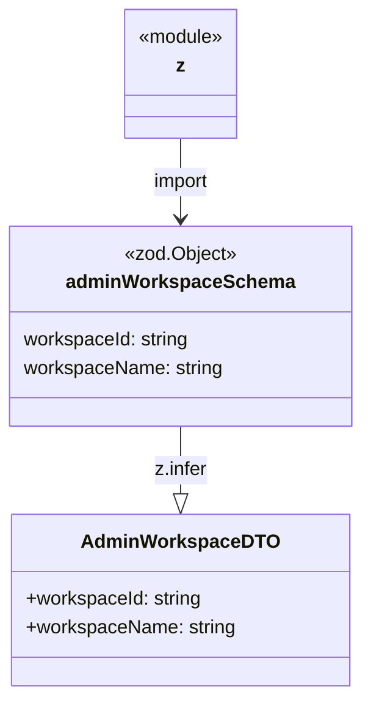

# Diagram: web/portal/src/pages/administration/report-management/models/AdminWorkspaceDTO.ts

> Auto-generated by Obscura crawlers

## Mermaid

### SVG

<svg id="container" width="299.84375" xmlns="http://www.w3.org/2000/svg" class="classDiagram" height="584" viewBox="0 0 299.84375 584" role="graphics-document document" aria-roledescription="class"><g><defs><marker id="container_class-aggregationStart" class="marker aggregation class" refX="18" refY="7" markerWidth="190" markerHeight="240" orient="auto"><path d="M 18,7 L9,13 L1,7 L9,1 Z"></path></marker></defs><defs><marker id="container_class-aggregationEnd" class="marker aggregation class" refX="1" refY="7" markerWidth="20" markerHeight="28" orient="auto"><path d="M 18,7 L9,13 L1,7 L9,1 Z"></path></marker></defs><defs><marker id="container_class-extensionStart" class="marker extension class" refX="18" refY="7" markerWidth="190" markerHeight="240" orient="auto"><path d="M 1,7 L18,13 V 1 Z"></path></marker></defs><defs><marker id="container_class-extensionEnd" class="marker extension class" refX="1" refY="7" markerWidth="20" markerHeight="28" orient="auto"><path d="M 1,1 V 13 L18,7 Z"></path></marker></defs><defs><marker id="container_class-compositionStart" class="marker composition class" refX="18" refY="7" markerWidth="190" markerHeight="240" orient="auto"><path d="M 18,7 L9,13 L1,7 L9,1 Z"></path></marker></defs><defs><marker id="container_class-compositionEnd" class="marker composition class" refX="1" refY="7" markerWidth="20" markerHeight="28" orient="auto"><path d="M 18,7 L9,13 L1,7 L9,1 Z"></path></marker></defs><defs><marker id="container_class-dependencyStart" class="marker dependency class" refX="6" refY="7" markerWidth="190" markerHeight="240" orient="auto"><path d="M 5,7 L9,13 L1,7 L9,1 Z"></path></marker></defs><defs><marker id="container_class-dependencyEnd" class="marker dependency class" refX="13" refY="7" markerWidth="20" markerHeight="28" orient="auto"><path d="M 18,7 L9,13 L14,7 L9,1 Z"></path></marker></defs><defs><marker id="container_class-lollipopStart" class="marker lollipop class" refX="13" refY="7" markerWidth="190" markerHeight="240" orient="auto"><circle stroke="black" fill="transparent" cx="7" cy="7" r="6"></circle></marker></defs><defs><marker id="container_class-lollipopEnd" class="marker lollipop class" refX="1" refY="7" markerWidth="190" markerHeight="240" orient="auto"><circle stroke="black" fill="transparent" cx="7" cy="7" r="6"></circle></marker></defs><g class="root"><g class="clusters"></g><g class="edgePaths"><path d="M149.922,116L149.922,122.167C149.922,128.333,149.922,140.667,149.922,152C149.922,163.333,149.922,173.667,149.922,178.833L149.922,184" id="id_z_adminWorkspaceSchema_1" class="edge-thickness-normal edge-pattern-solid relation" style=";;;" data-edge="true" data-et="edge" data-id="id_z_adminWorkspaceSchema_1" data-points="W3sieCI6MTQ5LjkyMTg3NSwieSI6MTE2fSx7IngiOjE0OS45MjE4NzUsInkiOjE1M30seyJ4IjoxNDkuOTIxODc1LCJ5IjoxOTB9XQ==" marker-end="url(#container_class-dependencyEnd)"></path><path d="M149.922,358L149.922,364.167C149.922,370.333,149.922,382.667,149.922,392.125C149.922,401.583,149.922,408.167,149.922,411.458L149.922,414.75" id="id_adminWorkspaceSchema_AdminWorkspaceDTO_2" class="edge-thickness-normal edge-pattern-solid relation" style=";;;" data-edge="true" data-et="edge" data-id="id_adminWorkspaceSchema_AdminWorkspaceDTO_2" data-points="W3sieCI6MTQ5LjkyMTg3NSwieSI6MzU4fSx7IngiOjE0OS45MjE4NzUsInkiOjM5NX0seyJ4IjoxNDkuOTIxODc1LCJ5Ijo0MzJ9XQ==" marker-end="url(#container_class-extensionEnd)"></path></g><g class="edgeLabels"><g class="edgeLabel" transform="translate(149.921875, 153)"><g class="label" data-id="id_z_adminWorkspaceSchema_1" transform="translate(-24.515625, -12)"><foreignObject width="49.03125" height="24">

import

</foreignObject></g></g><g class="edgeLabel" transform="translate(149.921875, 395)"><g class="label" data-id="id_adminWorkspaceSchema_AdminWorkspaceDTO_2" transform="translate(-22.4140625, -12)"><foreignObject width="44.828125" height="24">

z.infer

</foreignObject></g></g></g><g class="nodes"><g class="node default" id="classId-z-0" transform="translate(149.921875, 62)"><g class="basic label-container"><path d="M-48.6015625 -54 L48.6015625 -54 L48.6015625 54 L-48.6015625 54" stroke="none" stroke-width="0" fill="#ECECFF" style=""></path><path d="M-48.6015625 -54 C-24.20388290569892 -54, 0.1937966886021627 -54, 48.6015625 -54 M-48.6015625 -54 C-22.368791890873037 -54, 3.863978718253925 -54, 48.6015625 -54 M48.6015625 -54 C48.6015625 -30.750458107501885, 48.6015625 -7.50091621500377, 48.6015625 54 M48.6015625 -54 C48.6015625 -31.50563175087656, 48.6015625 -9.01126350175312, 48.6015625 54 M48.6015625 54 C27.35658843856537 54, 6.111614377130742 54, -48.6015625 54 M48.6015625 54 C14.690192425509444 54, -19.22117764898111 54, -48.6015625 54 M-48.6015625 54 C-48.6015625 31.157207505413087, -48.6015625 8.314415010826174, -48.6015625 -54 M-48.6015625 54 C-48.6015625 26.546313839916472, -48.6015625 -0.907372320167056, -48.6015625 -54" stroke="#9370DB" stroke-width="1.3" fill="none" stroke-dasharray="0 0" style=""></path></g><g class="annotation-group text" transform="translate(-36.6015625, -30)"><g class="label" style="" transform="translate(0,-12)"><foreignObject width="73.203125" height="24">

«module»

</foreignObject></g></g><g class="label-group text" transform="translate(-3.6796875, -6)"><g class="label" style="font-weight: bolder" transform="translate(0,-12)"><foreignObject width="7.359375" height="24">

z

</foreignObject></g></g><g class="members-group text" transform="translate(-36.6015625, 42)"></g><g class="methods-group text" transform="translate(-36.6015625, 72)"></g><g class="divider" style=""><path d="M-48.6015625 18 C-25.91762242607142 18, -3.233682352142843 18, 48.6015625 18 M-48.6015625 18 C-13.649979820434126 18, 21.301602859131748 18, 48.6015625 18" stroke="#9370DB" stroke-width="1.3" fill="none" stroke-dasharray="0 0" style=""></path></g><g class="divider" style=""><path d="M-48.6015625 36 C-27.27656329391722 36, -5.951564087834441 36, 48.6015625 36 M-48.6015625 36 C-28.35185719319766 36, -8.102151886395319 36, 48.6015625 36" stroke="#9370DB" stroke-width="1.3" fill="none" stroke-dasharray="0 0" style=""></path></g></g><g class="node default" id="classId-adminWorkspaceSchema-1" transform="translate(149.921875, 274)"><g class="basic label-container"><path d="M-141.921875 -84 L141.921875 -84 L141.921875 84 L-141.921875 84" stroke="none" stroke-width="0" fill="#ECECFF" style=""></path><path d="M-141.921875 -84 C-30.022552474713038 -84, 81.87677005057392 -84, 141.921875 -84 M-141.921875 -84 C-73.87945406071493 -84, -5.837033121429869 -84, 141.921875 -84 M141.921875 -84 C141.921875 -21.271475237395492, 141.921875 41.457049525209015, 141.921875 84 M141.921875 -84 C141.921875 -30.57196098627398, 141.921875 22.856078027452043, 141.921875 84 M141.921875 84 C71.46202118355464 84, 1.00216736710928 84, -141.921875 84 M141.921875 84 C34.82180590022588 84, -72.27826319954823 84, -141.921875 84 M-141.921875 84 C-141.921875 18.52700537520886, -141.921875 -46.94598924958228, -141.921875 -84 M-141.921875 84 C-141.921875 25.21928639877452, -141.921875 -33.56142720245096, -141.921875 -84" stroke="#9370DB" stroke-width="1.3" fill="none" stroke-dasharray="0 0" style=""></path></g><g class="annotation-group text" transform="translate(-47.390625, -60)"><g class="label" style="" transform="translate(0,-12)"><foreignObject width="94.78125" height="24">

«zod.Object»

</foreignObject></g></g><g class="label-group text" transform="translate(-91.390625, -36)"><g class="label" style="font-weight: bolder" transform="translate(0,-12)"><foreignObject width="182.78125" height="24">

adminWorkspaceSchema

</foreignObject></g></g><g class="members-group text" transform="translate(-129.921875, 12)"><g class="label" style="" transform="translate(0,-12)"><foreignObject width="140.6875" height="24">

workspaceId: string

</foreignObject></g><g class="label" style="" transform="translate(0,12)"><foreignObject width="168.453125" height="24">

workspaceName: string

</foreignObject></g></g><g class="methods-group text" transform="translate(-129.921875, 84)"></g><g class="divider" style=""><path d="M-141.921875 -12 C-84.4686715994323 -12, -27.015468198864596 -12, 141.921875 -12 M-141.921875 -12 C-29.237811560479685 -12, 83.44625187904063 -12, 141.921875 -12" stroke="#9370DB" stroke-width="1.3" fill="none" stroke-dasharray="0 0" style=""></path></g><g class="divider" style=""><path d="M-141.921875 60 C-54.62505475079405 60, 32.6717654984119 60, 141.921875 60 M-141.921875 60 C-67.69791806007242 60, 6.52603887985515 60, 141.921875 60" stroke="#9370DB" stroke-width="1.3" fill="none" stroke-dasharray="0 0" style=""></path></g></g><g class="node default" id="classId-AdminWorkspaceDTO-2" transform="translate(149.921875, 504)"><g class="basic label-container"><path d="M-139.03515625 -72 L139.03515625 -72 L139.03515625 72 L-139.03515625 72" stroke="none" stroke-width="0" fill="#ECECFF" style=""></path><path d="M-139.03515625 -72 C-51.63316537318356 -72, 35.76882550363288 -72, 139.03515625 -72 M-139.03515625 -72 C-40.28240597677129 -72, 58.47034429645743 -72, 139.03515625 -72 M139.03515625 -72 C139.03515625 -31.19713545451887, 139.03515625 9.605729090962257, 139.03515625 72 M139.03515625 -72 C139.03515625 -37.07333562405359, 139.03515625 -2.1466712481071824, 139.03515625 72 M139.03515625 72 C38.806361843136784 72, -61.42243256372643 72, -139.03515625 72 M139.03515625 72 C50.11180409923999 72, -38.81154805152002 72, -139.03515625 72 M-139.03515625 72 C-139.03515625 25.7037760934656, -139.03515625 -20.5924478130688, -139.03515625 -72 M-139.03515625 72 C-139.03515625 38.70101016884408, -139.03515625 5.402020337688157, -139.03515625 -72" stroke="#9370DB" stroke-width="1.3" fill="none" stroke-dasharray="0 0" style=""></path></g><g class="annotation-group text" transform="translate(0, -48)"></g><g class="label-group text" transform="translate(-77.6328125, -48)"><g class="label" style="font-weight: bolder" transform="translate(0,-12)"><foreignObject width="155.265625" height="24">

AdminWorkspaceDTO

</foreignObject></g></g><g class="members-group text" transform="translate(-127.03515625, 0)"><g class="label" style="" transform="translate(0,-12)"><foreignObject width="148.671875" height="24">

+workspaceId: string

</foreignObject></g><g class="label" style="" transform="translate(0,12)"><foreignObject width="176.4375" height="24">

+workspaceName: string

</foreignObject></g></g><g class="methods-group text" transform="translate(-127.03515625, 72)"></g><g class="divider" style=""><path d="M-139.03515625 -24 C-52.161806541164836 -24, 34.71154316767033 -24, 139.03515625 -24 M-139.03515625 -24 C-80.49840908735626 -24, -21.961661924712516 -24, 139.03515625 -24" stroke="#9370DB" stroke-width="1.3" fill="none" stroke-dasharray="0 0" style=""></path></g><g class="divider" style=""><path d="M-139.03515625 48 C-64.2920408971733 48, 10.451074455653412 48, 139.03515625 48 M-139.03515625 48 C-33.11141346006323 48, 72.81232932987353 48, 139.03515625 48" stroke="#9370DB" stroke-width="1.3" fill="none" stroke-dasharray="0 0" style=""></path></g></g></g></g></g></svg>
