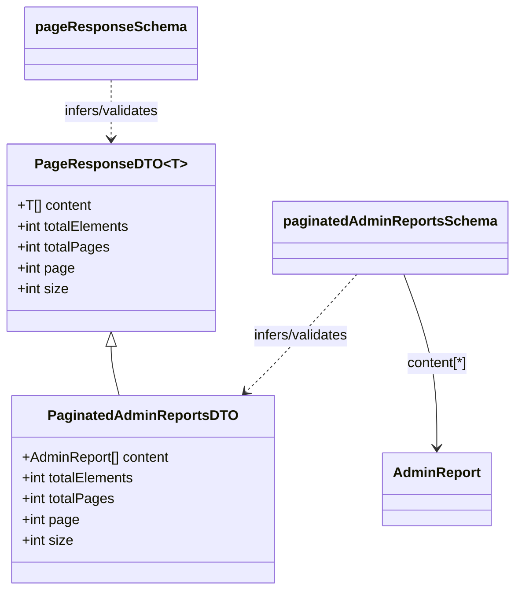

# Diagram: web/portal/src/pages/administration/report-management/models/PaginatedAdminReportsDTO.ts

> Auto-generated by Obscura crawlers

## Mermaid

### SVG

<svg id="container" width="581.15234375" xmlns="http://www.w3.org/2000/svg" class="classDiagram" height="680" viewBox="0 0 581.15234375 680" role="graphics-document document" aria-roledescription="class"><g><defs><marker id="container_class-aggregationStart" class="marker aggregation class" refX="18" refY="7" markerWidth="190" markerHeight="240" orient="auto"><path d="M 18,7 L9,13 L1,7 L9,1 Z"></path></marker></defs><defs><marker id="container_class-aggregationEnd" class="marker aggregation class" refX="1" refY="7" markerWidth="20" markerHeight="28" orient="auto"><path d="M 18,7 L9,13 L1,7 L9,1 Z"></path></marker></defs><defs><marker id="container_class-extensionStart" class="marker extension class" refX="18" refY="7" markerWidth="190" markerHeight="240" orient="auto"><path d="M 1,7 L18,13 V 1 Z"></path></marker></defs><defs><marker id="container_class-extensionEnd" class="marker extension class" refX="1" refY="7" markerWidth="20" markerHeight="28" orient="auto"><path d="M 1,1 V 13 L18,7 Z"></path></marker></defs><defs><marker id="container_class-compositionStart" class="marker composition class" refX="18" refY="7" markerWidth="190" markerHeight="240" orient="auto"><path d="M 18,7 L9,13 L1,7 L9,1 Z"></path></marker></defs><defs><marker id="container_class-compositionEnd" class="marker composition class" refX="1" refY="7" markerWidth="20" markerHeight="28" orient="auto"><path d="M 18,7 L9,13 L1,7 L9,1 Z"></path></marker></defs><defs><marker id="container_class-dependencyStart" class="marker dependency class" refX="6" refY="7" markerWidth="190" markerHeight="240" orient="auto"><path d="M 5,7 L9,13 L1,7 L9,1 Z"></path></marker></defs><defs><marker id="container_class-dependencyEnd" class="marker dependency class" refX="13" refY="7" markerWidth="20" markerHeight="28" orient="auto"><path d="M 18,7 L9,13 L14,7 L9,1 Z"></path></marker></defs><defs><marker id="container_class-lollipopStart" class="marker lollipop class" refX="13" refY="7" markerWidth="190" markerHeight="240" orient="auto"><circle stroke="black" fill="transparent" cx="7" cy="7" r="6"></circle></marker></defs><defs><marker id="container_class-lollipopEnd" class="marker lollipop class" refX="1" refY="7" markerWidth="190" markerHeight="240" orient="auto"><circle stroke="black" fill="transparent" cx="7" cy="7" r="6"></circle></marker></defs><g class="root"><g class="clusters"></g><g class="edgePaths"><path d="M126.199,399.25L126.199,402.542C126.199,405.833,126.199,412.417,127.843,421.875C129.486,431.333,132.773,443.667,134.417,449.833L136.06,456" id="id_PageResponseDTO_PaginatedAdminReportsDTO_1" class="edge-thickness-normal edge-pattern-solid relation" style=";;;" data-edge="true" data-et="edge" data-id="id_PageResponseDTO_PaginatedAdminReportsDTO_1" data-points="W3sieCI6MTI2LjE5OTIxODc1LCJ5IjozODJ9LHsieCI6MTI2LjE5OTIxODc1LCJ5Ijo0MTl9LHsieCI6MTM2LjA2MDIzNzA2ODk2NTUsInkiOjQ1Nn1d" marker-start="url(#container_class-extensionStart)"></path><path d="M406.062,316L390.659,333.167C375.257,350.333,344.452,384.667,323.437,407.302C302.422,429.938,291.198,440.875,285.586,446.344L279.973,451.813" id="id_paginatedAdminReportsSchema_PaginatedAdminReportsDTO_2" class="edge-thickness-normal edge-pattern-dashed relation" style=";;;" data-edge="true" data-et="edge" data-id="id_paginatedAdminReportsSchema_PaginatedAdminReportsDTO_2" data-points="W3sieCI6NDA2LjA2MjA2ODk2NTUxNzI2LCJ5IjozMTZ9LHsieCI6MzEzLjY0NjQ4NDM3NSwieSI6NDE5fSx7IngiOjI3NS42NzYxMzE0NjU1MTcyNCwieSI6NDU2fV0=" marker-end="url(#container_class-dependencyEnd)"></path><path d="M126.199,92L126.199,98.167C126.199,104.333,126.199,116.667,126.199,128C126.199,139.333,126.199,149.667,126.199,154.833L126.199,160" id="id_pageResponseSchema_PageResponseDTO_3" class="edge-thickness-normal edge-pattern-dashed relation" style=";;;" data-edge="true" data-et="edge" data-id="id_pageResponseSchema_PageResponseDTO_3" data-points="W3sieCI6MTI2LjE5OTIxODc1LCJ5Ijo5Mn0seyJ4IjoxMjYuMTk5MjE4NzUsInkiOjEyOX0seyJ4IjoxMjYuMTk5MjE4NzUsInkiOjE2Nn1d" marker-end="url(#container_class-dependencyEnd)"></path><path d="M460.211,316L466.941,333.167C473.671,350.333,487.13,384.667,493.86,418C500.59,451.333,500.59,483.667,500.59,499.833L500.59,516" id="id_paginatedAdminReportsSchema_AdminReport_4" class="edge-thickness-normal edge-pattern-solid relation" style=";;;" data-edge="true" data-et="edge" data-id="id_paginatedAdminReportsSchema_AdminReport_4" data-points="W3sieCI6NDYwLjIxMTE3OTk1Njg5NjU2LCJ5IjozMTZ9LHsieCI6NTAwLjU4OTg0Mzc1LCJ5Ijo0MTl9LHsieCI6NTAwLjU4OTg0Mzc1LCJ5Ijo1MjJ9XQ==" marker-end="url(#container_class-dependencyEnd)"></path></g><g class="edgeLabels"><g class="edgeLabel"><g class="label" data-id="id_PageResponseDTO_PaginatedAdminReportsDTO_1" transform="translate(0, 0)"><foreignObject width="0" height="0">

</foreignObject></g></g><g class="edgeLabel" transform="translate(342.15132, 387.23049)"><g class="label" data-id="id_paginatedAdminReportsSchema_PaginatedAdminReportsDTO_2" transform="translate(-57.2890625, -12)"><foreignObject width="114.578125" height="24">

infers/validates

</foreignObject></g></g><g class="edgeLabel" transform="translate(126.19921875, 129)"><g class="label" data-id="id_pageResponseSchema_PageResponseDTO_3" transform="translate(-57.2890625, -12)"><foreignObject width="114.578125" height="24">

infers/validates

</foreignObject></g></g><g class="edgeLabel" transform="translate(500.58984375, 419)"><g class="label" data-id="id_paginatedAdminReportsSchema_AdminReport_4" transform="translate(-36.3984375, -12)"><foreignObject width="72.796875" height="24">

content[*]

</foreignObject></g></g></g><g class="nodes"><g class="node default" id="classId-PageResponseDTO-0" transform="translate(126.19921875, 274)"><g class="basic label-container"><path d="M-118.19921875 -108 L118.19921875 -108 L118.19921875 108 L-118.19921875 108" stroke="none" stroke-width="0" fill="#ECECFF" style=""></path><path d="M-118.19921875 -108 C-37.515762624176915 -108, 43.16769350164617 -108, 118.19921875 -108 M-118.19921875 -108 C-24.842457698803315 -108, 68.51430335239337 -108, 118.19921875 -108 M118.19921875 -108 C118.19921875 -59.223010570199314, 118.19921875 -10.446021140398628, 118.19921875 108 M118.19921875 -108 C118.19921875 -36.24695459518243, 118.19921875 35.50609080963514, 118.19921875 108 M118.19921875 108 C33.31394616022003 108, -51.571326429559946 108, -118.19921875 108 M118.19921875 108 C43.34677091703435 108, -31.505676915931303 108, -118.19921875 108 M-118.19921875 108 C-118.19921875 53.030370106949086, -118.19921875 -1.9392597861018288, -118.19921875 -108 M-118.19921875 108 C-118.19921875 27.884936552281147, -118.19921875 -52.23012689543771, -118.19921875 -108" stroke="#9370DB" stroke-width="1.3" fill="none" stroke-dasharray="0 0" style=""></path></g><g class="annotation-group text" transform="translate(0, -84)"></g><g class="label-group text" transform="translate(-79.8984375, -84)"><g class="label" style="font-weight: bolder" transform="translate(0,-12)"><foreignObject width="159.796875" height="24">

PageResponseDTO&lt;T&gt;

</foreignObject></g></g><g class="members-group text" transform="translate(-106.19921875, -36)"><g class="label" style="" transform="translate(0,-12)"><foreignObject width="85.46875" height="24">

+T[] content

</foreignObject></g><g class="label" style="" transform="translate(0,12)"><foreignObject width="132.5" height="24">

+int totalElements

</foreignObject></g><g class="label" style="" transform="translate(0,36)"><foreignObject width="106.890625" height="24">

+int totalPages

</foreignObject></g><g class="label" style="" transform="translate(0,60)"><foreignObject width="66.5625" height="24">

+int page

</foreignObject></g><g class="label" style="" transform="translate(0,84)"><foreignObject width="59.484375" height="24">

+int size

</foreignObject></g></g><g class="methods-group text" transform="translate(-106.19921875, 108)"></g><g class="divider" style=""><path d="M-118.19921875 -60 C-40.903968086761964 -60, 36.39128257647607 -60, 118.19921875 -60 M-118.19921875 -60 C-62.621972541928095 -60, -7.04472633385619 -60, 118.19921875 -60" stroke="#9370DB" stroke-width="1.3" fill="none" stroke-dasharray="0 0" style=""></path></g><g class="divider" style=""><path d="M-118.19921875 84 C-33.86082753214011 84, 50.47756368571979 84, 118.19921875 84 M-118.19921875 84 C-28.118042087639907 84, 61.963134574720186 84, 118.19921875 84" stroke="#9370DB" stroke-width="1.3" fill="none" stroke-dasharray="0 0" style=""></path></g></g><g class="node default" id="classId-PaginatedAdminReportsDTO-1" transform="translate(164.84375, 564)"><g class="basic label-container"><path d="M-150.06640625 -108 L150.06640625 -108 L150.06640625 108 L-150.06640625 108" stroke="none" stroke-width="0" fill="#ECECFF" style=""></path><path d="M-150.06640625 -108 C-89.17059664284757 -108, -28.27478703569514 -108, 150.06640625 -108 M-150.06640625 -108 C-58.78803404868256 -108, 32.49033815263488 -108, 150.06640625 -108 M150.06640625 -108 C150.06640625 -62.67086370102544, 150.06640625 -17.34172740205088, 150.06640625 108 M150.06640625 -108 C150.06640625 -51.6308937575496, 150.06640625 4.738212484900799, 150.06640625 108 M150.06640625 108 C81.3340547961129 108, 12.60170334222579 108, -150.06640625 108 M150.06640625 108 C33.96610898684165 108, -82.1341882763167 108, -150.06640625 108 M-150.06640625 108 C-150.06640625 30.699083929716267, -150.06640625 -46.60183214056747, -150.06640625 -108 M-150.06640625 108 C-150.06640625 54.45107442025245, -150.06640625 0.902148840504907, -150.06640625 -108" stroke="#9370DB" stroke-width="1.3" fill="none" stroke-dasharray="0 0" style=""></path></g><g class="annotation-group text" transform="translate(0, -84)"></g><g class="label-group text" transform="translate(-103.0078125, -84)"><g class="label" style="font-weight: bolder" transform="translate(0,-12)"><foreignObject width="206.015625" height="24">

PaginatedAdminReportsDTO

</foreignObject></g></g><g class="members-group text" transform="translate(-138.06640625, -36)"><g class="label" style="" transform="translate(0,-12)"><foreignObject width="173.125" height="24">

+AdminReport[] content

</foreignObject></g><g class="label" style="" transform="translate(0,12)"><foreignObject width="132.5" height="24">

+int totalElements

</foreignObject></g><g class="label" style="" transform="translate(0,36)"><foreignObject width="106.890625" height="24">

+int totalPages

</foreignObject></g><g class="label" style="" transform="translate(0,60)"><foreignObject width="66.5625" height="24">

+int page

</foreignObject></g><g class="label" style="" transform="translate(0,84)"><foreignObject width="59.484375" height="24">

+int size

</foreignObject></g></g><g class="methods-group text" transform="translate(-138.06640625, 108)"></g><g class="divider" style=""><path d="M-150.06640625 -60 C-67.95731002717852 -60, 14.151786195642956 -60, 150.06640625 -60 M-150.06640625 -60 C-72.84334441289485 -60, 4.379717424210298 -60, 150.06640625 -60" stroke="#9370DB" stroke-width="1.3" fill="none" stroke-dasharray="0 0" style=""></path></g><g class="divider" style=""><path d="M-150.06640625 84 C-41.79687968119599 84, 66.47264688760802 84, 150.06640625 84 M-150.06640625 84 C-54.131728457644954 84, 41.80294933471009 84, 150.06640625 84" stroke="#9370DB" stroke-width="1.3" fill="none" stroke-dasharray="0 0" style=""></path></g></g><g class="node default" id="classId-AdminReport-2" transform="translate(500.58984375, 564)"><g class="basic label-container"><path d="M-60.1328125 -42 L60.1328125 -42 L60.1328125 42 L-60.1328125 42" stroke="none" stroke-width="0" fill="#ECECFF" style=""></path><path d="M-60.1328125 -42 C-22.02004411601216 -42, 16.092724267975683 -42, 60.1328125 -42 M-60.1328125 -42 C-25.282514386826847 -42, 9.567783726346306 -42, 60.1328125 -42 M60.1328125 -42 C60.1328125 -23.73610397271283, 60.1328125 -5.472207945425659, 60.1328125 42 M60.1328125 -42 C60.1328125 -23.784616094389005, 60.1328125 -5.56923218877801, 60.1328125 42 M60.1328125 42 C28.70565684612088 42, -2.7214988077582376 42, -60.1328125 42 M60.1328125 42 C32.828126783364326 42, 5.523441066728644 42, -60.1328125 42 M-60.1328125 42 C-60.1328125 10.480253081507293, -60.1328125 -21.039493836985415, -60.1328125 -42 M-60.1328125 42 C-60.1328125 23.79262546318237, -60.1328125 5.585250926364743, -60.1328125 -42" stroke="#9370DB" stroke-width="1.3" fill="none" stroke-dasharray="0 0" style=""></path></g><g class="annotation-group text" transform="translate(0, -18)"></g><g class="label-group text" transform="translate(-48.1328125, -18)"><g class="label" style="font-weight: bolder" transform="translate(0,-12)"><foreignObject width="96.265625" height="24">

AdminReport

</foreignObject></g></g><g class="members-group text" transform="translate(-48.1328125, 30)"></g><g class="methods-group text" transform="translate(-48.1328125, 60)"></g><g class="divider" style=""><path d="M-60.1328125 6 C-15.652258899318056 6, 28.828294701363887 6, 60.1328125 6 M-60.1328125 6 C-22.48136819445152 6, 15.17007611109696 6, 60.1328125 6" stroke="#9370DB" stroke-width="1.3" fill="none" stroke-dasharray="0 0" style=""></path></g><g class="divider" style=""><path d="M-60.1328125 24 C-17.649335565507315 24, 24.83414136898537 24, 60.1328125 24 M-60.1328125 24 C-22.49411203004164 24, 15.144588439916717 24, 60.1328125 24" stroke="#9370DB" stroke-width="1.3" fill="none" stroke-dasharray="0 0" style=""></path></g></g><g class="node default" id="classId-pageResponseSchema-3" transform="translate(126.19921875, 50)"><g class="basic label-container"><path d="M-93.6796875 -42 L93.6796875 -42 L93.6796875 42 L-93.6796875 42" stroke="none" stroke-width="0" fill="#ECECFF" style=""></path><path d="M-93.6796875 -42 C-54.30235245909281 -42, -14.925017418185618 -42, 93.6796875 -42 M-93.6796875 -42 C-49.16322760279167 -42, -4.646767705583343 -42, 93.6796875 -42 M93.6796875 -42 C93.6796875 -15.591317879731747, 93.6796875 10.817364240536506, 93.6796875 42 M93.6796875 -42 C93.6796875 -22.81200775888881, 93.6796875 -3.6240155177776217, 93.6796875 42 M93.6796875 42 C35.21586386273805 42, -23.247959774523906 42, -93.6796875 42 M93.6796875 42 C35.36957949178955 42, -22.940528516420898 42, -93.6796875 42 M-93.6796875 42 C-93.6796875 23.40430155690338, -93.6796875 4.808603113806761, -93.6796875 -42 M-93.6796875 42 C-93.6796875 21.948508470935074, -93.6796875 1.8970169418701488, -93.6796875 -42" stroke="#9370DB" stroke-width="1.3" fill="none" stroke-dasharray="0 0" style=""></path></g><g class="annotation-group text" transform="translate(0, -18)"></g><g class="label-group text" transform="translate(-81.6796875, -18)"><g class="label" style="font-weight: bolder" transform="translate(0,-12)"><foreignObject width="163.359375" height="24">

pageResponseSchema

</foreignObject></g></g><g class="members-group text" transform="translate(-81.6796875, 30)"></g><g class="methods-group text" transform="translate(-81.6796875, 60)"></g><g class="divider" style=""><path d="M-93.6796875 6 C-25.689521668760435 6, 42.30064416247913 6, 93.6796875 6 M-93.6796875 6 C-47.820311290701014 6, -1.9609350814020274 6, 93.6796875 6" stroke="#9370DB" stroke-width="1.3" fill="none" stroke-dasharray="0 0" style=""></path></g><g class="divider" style=""><path d="M-93.6796875 24 C-42.119839827456595 24, 9.44000784508681 24, 93.6796875 24 M-93.6796875 24 C-39.75958594203252 24, 14.160515615934955 24, 93.6796875 24" stroke="#9370DB" stroke-width="1.3" fill="none" stroke-dasharray="0 0" style=""></path></g></g><g class="node default" id="classId-paginatedAdminReportsSchema-4" transform="translate(443.74609375, 274)"><g class="basic label-container"><path d="M-129.40625 -42 L129.40625 -42 L129.40625 42 L-129.40625 42" stroke="none" stroke-width="0" fill="#ECECFF" style=""></path><path d="M-129.40625 -42 C-53.19999105661667 -42, 23.006267886766665 -42, 129.40625 -42 M-129.40625 -42 C-67.16566921164814 -42, -4.925088423296273 -42, 129.40625 -42 M129.40625 -42 C129.40625 -16.903052628652834, 129.40625 8.193894742694333, 129.40625 42 M129.40625 -42 C129.40625 -18.98626729642192, 129.40625 4.027465407156157, 129.40625 42 M129.40625 42 C62.14830832061429 42, -5.109633358771418 42, -129.40625 42 M129.40625 42 C34.96902562745055 42, -59.4681987450989 42, -129.40625 42 M-129.40625 42 C-129.40625 15.51717808077278, -129.40625 -10.96564383845444, -129.40625 -42 M-129.40625 42 C-129.40625 24.057521732411146, -129.40625 6.115043464822293, -129.40625 -42" stroke="#9370DB" stroke-width="1.3" fill="none" stroke-dasharray="0 0" style=""></path></g><g class="annotation-group text" transform="translate(0, -18)"></g><g class="label-group text" transform="translate(-117.40625, -18)"><g class="label" style="font-weight: bolder" transform="translate(0,-12)"><foreignObject width="234.8125" height="24">

paginatedAdminReportsSchema

</foreignObject></g></g><g class="members-group text" transform="translate(-117.40625, 30)"></g><g class="methods-group text" transform="translate(-117.40625, 60)"></g><g class="divider" style=""><path d="M-129.40625 6 C-77.25796456956047 6, -25.109679139120942 6, 129.40625 6 M-129.40625 6 C-66.5606286230676 6, -3.7150072461352153 6, 129.40625 6" stroke="#9370DB" stroke-width="1.3" fill="none" stroke-dasharray="0 0" style=""></path></g><g class="divider" style=""><path d="M-129.40625 24 C-38.92712582734771 24, 51.55199834530458 24, 129.40625 24 M-129.40625 24 C-31.101464135515485 24, 67.20332172896903 24, 129.40625 24" stroke="#9370DB" stroke-width="1.3" fill="none" stroke-dasharray="0 0" style=""></path></g></g></g></g></g></svg>
