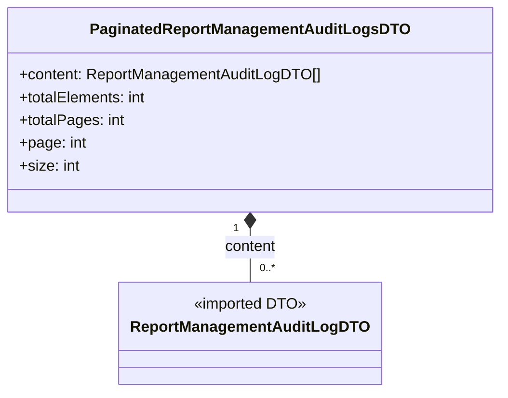

# Diagram: web/portal/src/pages/administration/report-management/models/PaginatedReportManagementAuditLogsDTO.ts

> Auto-generated by Obscura crawlers

## Mermaid

### SVG

<svg id="container" width="515.71875" xmlns="http://www.w3.org/2000/svg" class="classDiagram" height="414" viewBox="0 0 515.71875 414" role="graphics-document document" aria-roledescription="class"><g><defs><marker id="container_class-aggregationStart" class="marker aggregation class" refX="18" refY="7" markerWidth="190" markerHeight="240" orient="auto"><path d="M 18,7 L9,13 L1,7 L9,1 Z"></path></marker></defs><defs><marker id="container_class-aggregationEnd" class="marker aggregation class" refX="1" refY="7" markerWidth="20" markerHeight="28" orient="auto"><path d="M 18,7 L9,13 L1,7 L9,1 Z"></path></marker></defs><defs><marker id="container_class-extensionStart" class="marker extension class" refX="18" refY="7" markerWidth="190" markerHeight="240" orient="auto"><path d="M 1,7 L18,13 V 1 Z"></path></marker></defs><defs><marker id="container_class-extensionEnd" class="marker extension class" refX="1" refY="7" markerWidth="20" markerHeight="28" orient="auto"><path d="M 1,1 V 13 L18,7 Z"></path></marker></defs><defs><marker id="container_class-compositionStart" class="marker composition class" refX="18" refY="7" markerWidth="190" markerHeight="240" orient="auto"><path d="M 18,7 L9,13 L1,7 L9,1 Z"></path></marker></defs><defs><marker id="container_class-compositionEnd" class="marker composition class" refX="1" refY="7" markerWidth="20" markerHeight="28" orient="auto"><path d="M 18,7 L9,13 L1,7 L9,1 Z"></path></marker></defs><defs><marker id="container_class-dependencyStart" class="marker dependency class" refX="6" refY="7" markerWidth="190" markerHeight="240" orient="auto"><path d="M 5,7 L9,13 L1,7 L9,1 Z"></path></marker></defs><defs><marker id="container_class-dependencyEnd" class="marker dependency class" refX="13" refY="7" markerWidth="20" markerHeight="28" orient="auto"><path d="M 18,7 L9,13 L14,7 L9,1 Z"></path></marker></defs><defs><marker id="container_class-lollipopStart" class="marker lollipop class" refX="13" refY="7" markerWidth="190" markerHeight="240" orient="auto"><circle stroke="black" fill="transparent" cx="7" cy="7" r="6"></circle></marker></defs><defs><marker id="container_class-lollipopEnd" class="marker lollipop class" refX="1" refY="7" markerWidth="190" markerHeight="240" orient="auto"><circle stroke="black" fill="transparent" cx="7" cy="7" r="6"></circle></marker></defs><g class="root"><g class="clusters"></g><g class="edgePaths"><path d="M257.859,241.25L257.859,244.542C257.859,247.833,257.859,254.417,257.859,263.875C257.859,273.333,257.859,285.667,257.859,291.833L257.859,298" id="id_PaginatedReportManagementAuditLogsDTO_ReportManagementAuditLogDTO_1" class="edge-thickness-normal edge-pattern-solid relation" style=";;;" data-edge="true" data-et="edge" data-id="id_PaginatedReportManagementAuditLogsDTO_ReportManagementAuditLogDTO_1" data-points="W3sieCI6MjU3Ljg1OTM3NSwieSI6MjI0fSx7IngiOjI1Ny44NTkzNzUsInkiOjI2MX0seyJ4IjoyNTcuODU5Mzc1LCJ5IjoyOTh9XQ==" marker-start="url(#container_class-compositionStart)"></path></g><g class="edgeLabels"><g class="edgeLabel" transform="translate(257.859375, 261)"><g class="label" data-id="id_PaginatedReportManagementAuditLogsDTO_ReportManagementAuditLogDTO_1" transform="translate(-27.734375, -12)"><foreignObject width="55.46875" height="24">

content

</foreignObject></g></g><g class="edgeTerminals" transform="translate(242.85937750000014, 241.50000214285714)"><g class="inner" transform="translate(0, 0)"><foreignObject style="width: 9px; height: 12px;">
1
</foreignObject></g></g><g class="edgeTerminals" transform="translate(267.8593774999998, 275.5000021428571)"><g class="inner" transform="translate(0, 0)"></g><foreignObject style="width: 36px; height: 12px;">
0..*
</foreignObject></g></g><g class="nodes"><g class="node default" id="classId-PaginatedReportManagementAuditLogsDTO-0" transform="translate(257.859375, 116)"><g class="basic label-container"><path d="M-249.859375 -108 L249.859375 -108 L249.859375 108 L-249.859375 108" stroke="none" stroke-width="0" fill="#ECECFF" style=""></path><path d="M-249.859375 -108 C-105.08766447547734 -108, 39.68404604904532 -108, 249.859375 -108 M-249.859375 -108 C-68.69268014107436 -108, 112.47401471785128 -108, 249.859375 -108 M249.859375 -108 C249.859375 -44.32066556733934, 249.859375 19.35866886532132, 249.859375 108 M249.859375 -108 C249.859375 -27.156235672616816, 249.859375 53.68752865476637, 249.859375 108 M249.859375 108 C58.15099970278905 108, -133.5573755944219 108, -249.859375 108 M249.859375 108 C102.57899572186443 108, -44.70138355627114 108, -249.859375 108 M-249.859375 108 C-249.859375 42.70892830498899, -249.859375 -22.582143390022026, -249.859375 -108 M-249.859375 108 C-249.859375 42.62439469122715, -249.859375 -22.751210617545695, -249.859375 -108" stroke="#9370DB" stroke-width="1.3" fill="none" stroke-dasharray="0 0" style=""></path></g><g class="annotation-group text" transform="translate(0, -84)"></g><g class="label-group text" transform="translate(-159.328125, -84)"><g class="label" style="font-weight: bolder" transform="translate(0,-12)"><foreignObject width="318.65625" height="24">

PaginatedReportManagementAuditLogsDTO

</foreignObject></g></g><g class="members-group text" transform="translate(-237.859375, -36)"><g class="label" style="" transform="translate(0,-12)"><foreignObject width="316.390625" height="24">

+content: ReportManagementAuditLogDTO[]

</foreignObject></g><g class="label" style="" transform="translate(0,12)"><foreignObject width="136.265625" height="24">

+totalElements: int

</foreignObject></g><g class="label" style="" transform="translate(0,36)"><foreignObject width="110.640625" height="24">

+totalPages: int

</foreignObject></g><g class="label" style="" transform="translate(0,60)"><foreignObject width="70.40625" height="24">

+page: int

</foreignObject></g><g class="label" style="" transform="translate(0,84)"><foreignObject width="63.3125" height="24">

+size: int

</foreignObject></g></g><g class="methods-group text" transform="translate(-237.859375, 108)"></g><g class="divider" style=""><path d="M-249.859375 -60 C-126.4199406277556 -60, -2.9805062555111874 -60, 249.859375 -60 M-249.859375 -60 C-53.332573536202545 -60, 143.1942279275949 -60, 249.859375 -60" stroke="#9370DB" stroke-width="1.3" fill="none" stroke-dasharray="0 0" style=""></path></g><g class="divider" style=""><path d="M-249.859375 84 C-79.61987445336791 84, 90.61962609326417 84, 249.859375 84 M-249.859375 84 C-90.54290003058313 84, 68.77357493883375 84, 249.859375 84" stroke="#9370DB" stroke-width="1.3" fill="none" stroke-dasharray="0 0" style=""></path></g></g><g class="node default" id="classId-ReportManagementAuditLogDTO-1" transform="translate(257.859375, 352)"><g class="basic label-container"><path d="M-131.0234375 -54 L131.0234375 -54 L131.0234375 54 L-131.0234375 54" stroke="none" stroke-width="0" fill="#ECECFF" style=""></path><path d="M-131.0234375 -54 C-38.812052454004856 -54, 53.39933259199029 -54, 131.0234375 -54 M-131.0234375 -54 C-39.77518776746025 -54, 51.473061965079495 -54, 131.0234375 -54 M131.0234375 -54 C131.0234375 -16.711584206588043, 131.0234375 20.576831586823914, 131.0234375 54 M131.0234375 -54 C131.0234375 -27.374908665162813, 131.0234375 -0.7498173303256266, 131.0234375 54 M131.0234375 54 C34.58728768511166 54, -61.84886212977668 54, -131.0234375 54 M131.0234375 54 C37.886963058994425 54, -55.24951138201115 54, -131.0234375 54 M-131.0234375 54 C-131.0234375 24.342583960486444, -131.0234375 -5.314832079027113, -131.0234375 -54 M-131.0234375 54 C-131.0234375 12.354958943985402, -131.0234375 -29.290082112029197, -131.0234375 -54" stroke="#9370DB" stroke-width="1.3" fill="none" stroke-dasharray="0 0" style=""></path></g><g class="annotation-group text" transform="translate(-59.0546875, -30)"><g class="label" style="" transform="translate(0,-12)"><foreignObject width="118.109375" height="24">

«imported DTO»

</foreignObject></g></g><g class="label-group text" transform="translate(-119.0234375, -6)"><g class="label" style="font-weight: bolder" transform="translate(0,-12)"><foreignObject width="238.046875" height="24">

ReportManagementAuditLogDTO

</foreignObject></g></g><g class="members-group text" transform="translate(-119.0234375, 42)"></g><g class="methods-group text" transform="translate(-119.0234375, 72)"></g><g class="divider" style=""><path d="M-131.0234375 18 C-54.78284431001991 18, 21.457748879960178 18, 131.0234375 18 M-131.0234375 18 C-73.42715298347183 18, -15.830868466943656 18, 131.0234375 18" stroke="#9370DB" stroke-width="1.3" fill="none" stroke-dasharray="0 0" style=""></path></g><g class="divider" style=""><path d="M-131.0234375 36 C-29.663473604219007 36, 71.69649029156199 36, 131.0234375 36 M-131.0234375 36 C-41.31089556680328 36, 48.401646366393436 36, 131.0234375 36" stroke="#9370DB" stroke-width="1.3" fill="none" stroke-dasharray="0 0" style=""></path></g></g></g></g></g></svg>
