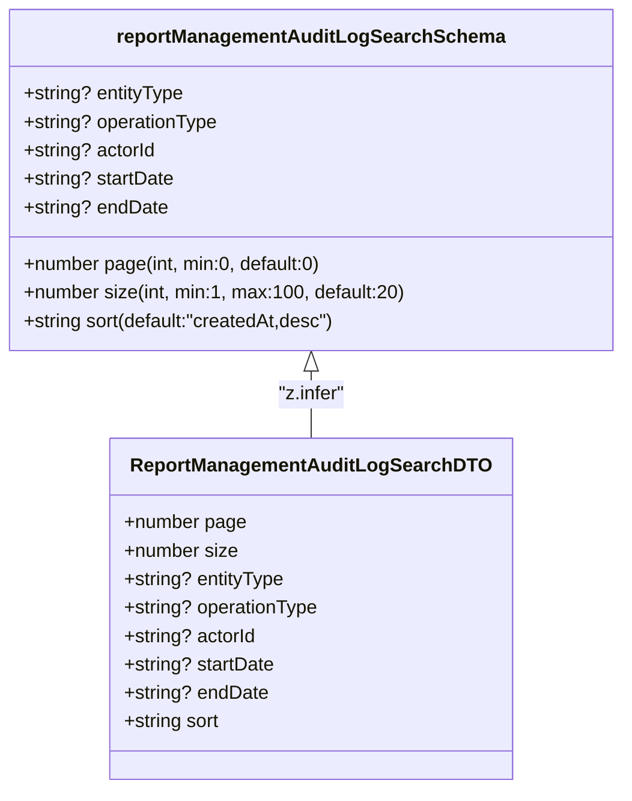

# Diagram: web/portal/src/pages/administration/report-management/models/ReportManagementAuditLogSearchDTO.ts

> Auto-generated by Obscura crawlers

## Mermaid

### SVG

<svg id="container" width="515.203125" xmlns="http://www.w3.org/2000/svg" class="classDiagram" height="666" viewBox="0 0 515.203125 666" role="graphics-document document" aria-roledescription="class"><g><defs><marker id="container_class-aggregationStart" class="marker aggregation class" refX="18" refY="7" markerWidth="190" markerHeight="240" orient="auto"><path d="M 18,7 L9,13 L1,7 L9,1 Z"></path></marker></defs><defs><marker id="container_class-aggregationEnd" class="marker aggregation class" refX="1" refY="7" markerWidth="20" markerHeight="28" orient="auto"><path d="M 18,7 L9,13 L1,7 L9,1 Z"></path></marker></defs><defs><marker id="container_class-extensionStart" class="marker extension class" refX="18" refY="7" markerWidth="190" markerHeight="240" orient="auto"><path d="M 1,7 L18,13 V 1 Z"></path></marker></defs><defs><marker id="container_class-extensionEnd" class="marker extension class" refX="1" refY="7" markerWidth="20" markerHeight="28" orient="auto"><path d="M 1,1 V 13 L18,7 Z"></path></marker></defs><defs><marker id="container_class-compositionStart" class="marker composition class" refX="18" refY="7" markerWidth="190" markerHeight="240" orient="auto"><path d="M 18,7 L9,13 L1,7 L9,1 Z"></path></marker></defs><defs><marker id="container_class-compositionEnd" class="marker composition class" refX="1" refY="7" markerWidth="20" markerHeight="28" orient="auto"><path d="M 18,7 L9,13 L1,7 L9,1 Z"></path></marker></defs><defs><marker id="container_class-dependencyStart" class="marker dependency class" refX="6" refY="7" markerWidth="190" markerHeight="240" orient="auto"><path d="M 5,7 L9,13 L1,7 L9,1 Z"></path></marker></defs><defs><marker id="container_class-dependencyEnd" class="marker dependency class" refX="13" refY="7" markerWidth="20" markerHeight="28" orient="auto"><path d="M 18,7 L9,13 L14,7 L9,1 Z"></path></marker></defs><defs><marker id="container_class-lollipopStart" class="marker lollipop class" refX="13" refY="7" markerWidth="190" markerHeight="240" orient="auto"><circle stroke="black" fill="transparent" cx="7" cy="7" r="6"></circle></marker></defs><defs><marker id="container_class-lollipopEnd" class="marker lollipop class" refX="1" refY="7" markerWidth="190" markerHeight="240" orient="auto"><circle stroke="black" fill="transparent" cx="7" cy="7" r="6"></circle></marker></defs><g class="root"><g class="clusters"></g><g class="edgePaths"><path d="M257.602,313.25L257.602,316.542C257.602,319.833,257.602,326.417,257.602,335.875C257.602,345.333,257.602,357.667,257.602,363.833L257.602,370" id="id_reportManagementAuditLogSearchSchema_ReportManagementAuditLogSearchDTO_1" class="edge-thickness-normal edge-pattern-solid relation" style=";;;" data-edge="true" data-et="edge" data-id="id_reportManagementAuditLogSearchSchema_ReportManagementAuditLogSearchDTO_1" data-points="W3sieCI6MjU3LjYwMTU2MjUsInkiOjI5Nn0seyJ4IjoyNTcuNjAxNTYyNSwieSI6MzMzfSx7IngiOjI1Ny42MDE1NjI1LCJ5IjozNzB9XQ==" marker-start="url(#container_class-extensionStart)"></path></g><g class="edgeLabels"><g class="edgeLabel" transform="translate(257.6015625, 333)"><g class="label" data-id="id_reportManagementAuditLogSearchSchema_ReportManagementAuditLogSearchDTO_1" transform="translate(-28.75, -12)"><foreignObject width="57.5" height="24">

"z.infer"

</foreignObject></g></g></g><g class="nodes"><g class="node default" id="classId-reportManagementAuditLogSearchSchema-0" transform="translate(257.6015625, 152)"><g class="basic label-container"><path d="M-249.6015625 -144 L249.6015625 -144 L249.6015625 144 L-249.6015625 144" stroke="none" stroke-width="0" fill="#ECECFF" style=""></path><path d="M-249.6015625 -144 C-68.7083556206272 -144, 112.1848512587456 -144, 249.6015625 -144 M-249.6015625 -144 C-133.85586249450517 -144, -18.11016248901035 -144, 249.6015625 -144 M249.6015625 -144 C249.6015625 -37.22531704649634, 249.6015625 69.54936590700731, 249.6015625 144 M249.6015625 -144 C249.6015625 -38.30229399444622, 249.6015625 67.39541201110757, 249.6015625 144 M249.6015625 144 C76.52099691227991 144, -96.55956867544018 144, -249.6015625 144 M249.6015625 144 C80.96332882461797 144, -87.67490485076405 144, -249.6015625 144 M-249.6015625 144 C-249.6015625 60.630184675541, -249.6015625 -22.739630648917995, -249.6015625 -144 M-249.6015625 144 C-249.6015625 30.230223365614094, -249.6015625 -83.53955326877181, -249.6015625 -144" stroke="#9370DB" stroke-width="1.3" fill="none" stroke-dasharray="0 0" style=""></path></g><g class="annotation-group text" transform="translate(0, -120)"></g><g class="label-group text" transform="translate(-155.96875, -120)"><g class="label" style="font-weight: bolder" transform="translate(0,-12)"><foreignObject width="311.9375" height="24">

reportManagementAuditLogSearchSchema

</foreignObject></g></g><g class="members-group text" transform="translate(-237.6015625, -72)"><g class="label" style="" transform="translate(0,-12)"><foreignObject width="136.5625" height="24">

+string? entityType

</foreignObject></g><g class="label" style="" transform="translate(0,12)"><foreignObject width="165.515625" height="24">

+string? operationType

</foreignObject></g><g class="label" style="" transform="translate(0,36)"><foreignObject width="112.578125" height="24">

+string? actorId

</foreignObject></g><g class="label" style="" transform="translate(0,60)"><foreignObject width="127.78125" height="24">

+string? startDate

</foreignObject></g><g class="label" style="" transform="translate(0,84)"><foreignObject width="121.65625" height="24">

+string? endDate

</foreignObject></g></g><g class="methods-group text" transform="translate(-237.6015625, 72)"><g class="label" style="" transform="translate(0,-12)"><foreignObject width="254.75" height="24">

+number page(int, min:0, default:0)

</foreignObject></g><g class="label" style="" transform="translate(0,12)"><foreignObject width="319.234375" height="24">

+number size(int, min:1, max:100, default:20)

</foreignObject></g><g class="label" style="" transform="translate(0,36)"><foreignObject width="267.8125" height="24">

+string sort(default:"createdAt,desc")

</foreignObject></g></g><g class="divider" style=""><path d="M-249.6015625 -96 C-86.5559001884948 -96, 76.4897621230104 -96, 249.6015625 -96 M-249.6015625 -96 C-89.66199806464888 -96, 70.27756637070223 -96, 249.6015625 -96" stroke="#9370DB" stroke-width="1.3" fill="none" stroke-dasharray="0 0" style=""></path></g><g class="divider" style=""><path d="M-249.6015625 48 C-126.86145203058041 48, -4.121341561160818 48, 249.6015625 48 M-249.6015625 48 C-123.62530405332349 48, 2.350954393353021 48, 249.6015625 48" stroke="#9370DB" stroke-width="1.3" fill="none" stroke-dasharray="0 0" style=""></path></g></g><g class="node default" id="classId-ReportManagementAuditLogSearchDTO-1" transform="translate(257.6015625, 514)"><g class="basic label-container"><path d="M-166.625 -144 L166.625 -144 L166.625 144 L-166.625 144" stroke="none" stroke-width="0" fill="#ECECFF" style=""></path><path d="M-166.625 -144 C-52.6526028962881 -144, 61.3197942074238 -144, 166.625 -144 M-166.625 -144 C-52.19247778455818 -144, 62.24004443088364 -144, 166.625 -144 M166.625 -144 C166.625 -77.44826130955337, 166.625 -10.896522619106747, 166.625 144 M166.625 -144 C166.625 -65.26532372027899, 166.625 13.46935255944203, 166.625 144 M166.625 144 C95.95386148458165 144, 25.282722969163302 144, -166.625 144 M166.625 144 C91.14152645346351 144, 15.658052906927026 144, -166.625 144 M-166.625 144 C-166.625 84.74690503024061, -166.625 25.493810060481223, -166.625 -144 M-166.625 144 C-166.625 32.816120282676366, -166.625 -78.36775943464727, -166.625 -144" stroke="#9370DB" stroke-width="1.3" fill="none" stroke-dasharray="0 0" style=""></path></g><g class="annotation-group text" transform="translate(0, -120)"></g><g class="label-group text" transform="translate(-143.734375, -120)"><g class="label" style="font-weight: bolder" transform="translate(0,-12)"><foreignObject width="287.46875" height="24">

ReportManagementAuditLogSearchDTO

</foreignObject></g></g><g class="members-group text" transform="translate(-154.625, -72)"><g class="label" style="" transform="translate(0,-12)"><foreignObject width="103.703125" height="24">

+number page

</foreignObject></g><g class="label" style="" transform="translate(0,12)"><foreignObject width="96.609375" height="24">

+number size

</foreignObject></g><g class="label" style="" transform="translate(0,36)"><foreignObject width="136.5625" height="24">

+string? entityType

</foreignObject></g><g class="label" style="" transform="translate(0,60)"><foreignObject width="165.515625" height="24">

+string? operationType

</foreignObject></g><g class="label" style="" transform="translate(0,84)"><foreignObject width="112.578125" height="24">

+string? actorId

</foreignObject></g><g class="label" style="" transform="translate(0,108)"><foreignObject width="127.78125" height="24">

+string? startDate

</foreignObject></g><g class="label" style="" transform="translate(0,132)"><foreignObject width="121.65625" height="24">

+string? endDate

</foreignObject></g><g class="label" style="" transform="translate(0,156)"><foreignObject width="82.625" height="24">

+string sort

</foreignObject></g></g><g class="methods-group text" transform="translate(-154.625, 144)"></g><g class="divider" style=""><path d="M-166.625 -96 C-93.91322710302964 -96, -21.20145420605928 -96, 166.625 -96 M-166.625 -96 C-52.27773166198406 -96, 62.06953667603187 -96, 166.625 -96" stroke="#9370DB" stroke-width="1.3" fill="none" stroke-dasharray="0 0" style=""></path></g><g class="divider" style=""><path d="M-166.625 120 C-67.27473504921463 120, 32.07552990157075 120, 166.625 120 M-166.625 120 C-47.31446252616284 120, 71.99607494767432 120, 166.625 120" stroke="#9370DB" stroke-width="1.3" fill="none" stroke-dasharray="0 0" style=""></path></g></g></g></g></g></svg>
