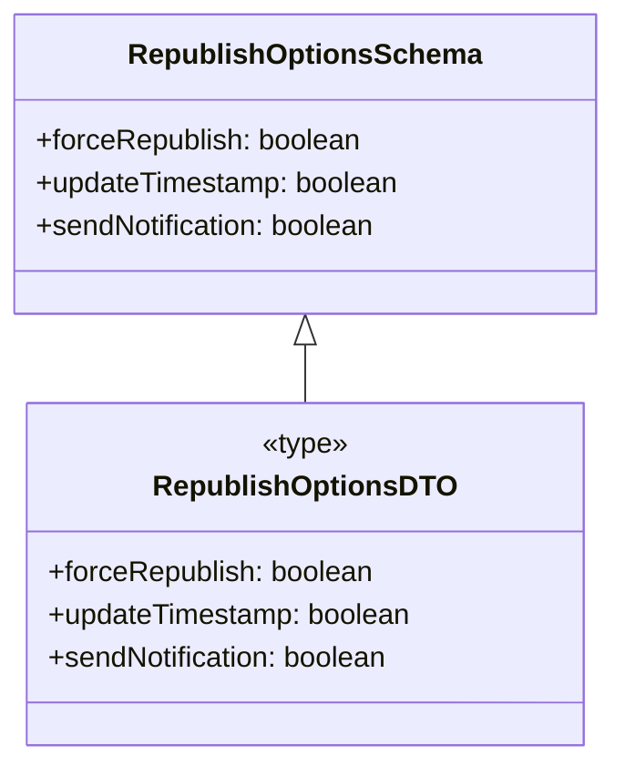

# Diagram: web/portal/src/pages/administration/report-management/models/RepublishOptionsDTO.ts

> Auto-generated by Obscura crawlers

## Mermaid

### SVG

<svg id="container" width="340.984375" xmlns="http://www.w3.org/2000/svg" class="classDiagram" height="426" viewBox="0 0 340.984375 426" role="graphics-document document" aria-roledescription="class"><g><defs><marker id="container_class-aggregationStart" class="marker aggregation class" refX="18" refY="7" markerWidth="190" markerHeight="240" orient="auto"><path d="M 18,7 L9,13 L1,7 L9,1 Z"></path></marker></defs><defs><marker id="container_class-aggregationEnd" class="marker aggregation class" refX="1" refY="7" markerWidth="20" markerHeight="28" orient="auto"><path d="M 18,7 L9,13 L1,7 L9,1 Z"></path></marker></defs><defs><marker id="container_class-extensionStart" class="marker extension class" refX="18" refY="7" markerWidth="190" markerHeight="240" orient="auto"><path d="M 1,7 L18,13 V 1 Z"></path></marker></defs><defs><marker id="container_class-extensionEnd" class="marker extension class" refX="1" refY="7" markerWidth="20" markerHeight="28" orient="auto"><path d="M 1,1 V 13 L18,7 Z"></path></marker></defs><defs><marker id="container_class-compositionStart" class="marker composition class" refX="18" refY="7" markerWidth="190" markerHeight="240" orient="auto"><path d="M 18,7 L9,13 L1,7 L9,1 Z"></path></marker></defs><defs><marker id="container_class-compositionEnd" class="marker composition class" refX="1" refY="7" markerWidth="20" markerHeight="28" orient="auto"><path d="M 18,7 L9,13 L1,7 L9,1 Z"></path></marker></defs><defs><marker id="container_class-dependencyStart" class="marker dependency class" refX="6" refY="7" markerWidth="190" markerHeight="240" orient="auto"><path d="M 5,7 L9,13 L1,7 L9,1 Z"></path></marker></defs><defs><marker id="container_class-dependencyEnd" class="marker dependency class" refX="13" refY="7" markerWidth="20" markerHeight="28" orient="auto"><path d="M 18,7 L9,13 L14,7 L9,1 Z"></path></marker></defs><defs><marker id="container_class-lollipopStart" class="marker lollipop class" refX="13" refY="7" markerWidth="190" markerHeight="240" orient="auto"><circle stroke="black" fill="transparent" cx="7" cy="7" r="6"></circle></marker></defs><defs><marker id="container_class-lollipopEnd" class="marker lollipop class" refX="1" refY="7" markerWidth="190" markerHeight="240" orient="auto"><circle stroke="black" fill="transparent" cx="7" cy="7" r="6"></circle></marker></defs><g class="root"><g class="clusters"></g><g class="edgePaths"><path d="M170.492,193.25L170.492,194.542C170.492,195.833,170.492,198.417,170.492,203.875C170.492,209.333,170.492,217.667,170.492,221.833L170.492,226" id="id_RepublishOptionsSchema_RepublishOptionsDTO_1" class="edge-thickness-normal edge-pattern-solid relation" style=";;;" data-edge="true" data-et="edge" data-id="id_RepublishOptionsSchema_RepublishOptionsDTO_1" data-points="W3sieCI6MTcwLjQ5MjE4NzUsInkiOjE3Nn0seyJ4IjoxNzAuNDkyMTg3NSwieSI6MjAxfSx7IngiOjE3MC40OTIxODc1LCJ5IjoyMjZ9XQ==" marker-start="url(#container_class-extensionStart)"></path></g><g class="edgeLabels"><g class="edgeLabel"><g class="label" data-id="id_RepublishOptionsSchema_RepublishOptionsDTO_1" transform="translate(0, 0)"><foreignObject width="0" height="0">

</foreignObject></g></g></g><g class="nodes"><g class="node default" id="classId-RepublishOptionsSchema-0" transform="translate(170.4921875, 92)"><g class="basic label-container"><path d="M-162.4921875 -84 L162.4921875 -84 L162.4921875 84 L-162.4921875 84" stroke="none" stroke-width="0" fill="#ECECFF" style=""></path><path d="M-162.4921875 -84 C-71.82873221708508 -84, 18.83472306582985 -84, 162.4921875 -84 M-162.4921875 -84 C-63.18632669545319 -84, 36.11953410909362 -84, 162.4921875 -84 M162.4921875 -84 C162.4921875 -32.71608870732676, 162.4921875 18.567822585346477, 162.4921875 84 M162.4921875 -84 C162.4921875 -46.44420515142092, 162.4921875 -8.888410302841834, 162.4921875 84 M162.4921875 84 C83.39809390942898 84, 4.304000318857959 84, -162.4921875 84 M162.4921875 84 C85.42244038829526 84, 8.352693276590514 84, -162.4921875 84 M-162.4921875 84 C-162.4921875 21.252429012139757, -162.4921875 -41.495141975720486, -162.4921875 -84 M-162.4921875 84 C-162.4921875 22.291533051853172, -162.4921875 -39.416933896293656, -162.4921875 -84" stroke="#9370DB" stroke-width="1.3" fill="none" stroke-dasharray="0 0" style=""></path></g><g class="annotation-group text" transform="translate(0, -60)"></g><g class="label-group text" transform="translate(-93.859375, -60)"><g class="label" style="font-weight: bolder" transform="translate(0,-12)"><foreignObject width="187.71875" height="24">

RepublishOptionsSchema

</foreignObject></g></g><g class="members-group text" transform="translate(-150.4921875, -12)"><g class="label" style="" transform="translate(0,-12)"><foreignObject width="184.09375" height="24">

+forceRepublish: boolean

</foreignObject></g><g class="label" style="" transform="translate(0,12)"><foreignObject width="207.125" height="24">

+updateTimestamp: boolean

</foreignObject></g><g class="label" style="" transform="translate(0,36)"><foreignObject width="195.609375" height="24">

+sendNotification: boolean

</foreignObject></g></g><g class="methods-group text" transform="translate(-150.4921875, 84)"></g><g class="divider" style=""><path d="M-162.4921875 -36 C-69.53473238682521 -36, 23.422722726349576 -36, 162.4921875 -36 M-162.4921875 -36 C-47.739738254272254 -36, 67.01271099145549 -36, 162.4921875 -36" stroke="#9370DB" stroke-width="1.3" fill="none" stroke-dasharray="0 0" style=""></path></g><g class="divider" style=""><path d="M-162.4921875 60 C-53.15022296141366 60, 56.19174157717268 60, 162.4921875 60 M-162.4921875 60 C-93.48567297298048 60, -24.479158445960962 60, 162.4921875 60" stroke="#9370DB" stroke-width="1.3" fill="none" stroke-dasharray="0 0" style=""></path></g></g><g class="node default" id="classId-RepublishOptionsDTO-1" transform="translate(170.4921875, 322)"><g class="basic label-container"><path d="M-155.44921875 -96 L155.44921875 -96 L155.44921875 96 L-155.44921875 96" stroke="none" stroke-width="0" fill="#ECECFF" style=""></path><path d="M-155.44921875 -96 C-42.12646443572454 -96, 71.19628987855091 -96, 155.44921875 -96 M-155.44921875 -96 C-92.68914041913969 -96, -29.92906208827938 -96, 155.44921875 -96 M155.44921875 -96 C155.44921875 -53.70127896641159, 155.44921875 -11.402557932823186, 155.44921875 96 M155.44921875 -96 C155.44921875 -22.638492991784517, 155.44921875 50.723014016430966, 155.44921875 96 M155.44921875 96 C87.96516847143717 96, 20.481118192874334 96, -155.44921875 96 M155.44921875 96 C56.434934243672586 96, -42.57935026265483 96, -155.44921875 96 M-155.44921875 96 C-155.44921875 53.516599224028866, -155.44921875 11.033198448057732, -155.44921875 -96 M-155.44921875 96 C-155.44921875 34.624289637205536, -155.44921875 -26.75142072558893, -155.44921875 -96" stroke="#9370DB" stroke-width="1.3" fill="none" stroke-dasharray="0 0" style=""></path></g><g class="annotation-group text" transform="translate(-24.8671875, -72)"><g class="label" style="" transform="translate(0,-12)"><foreignObject width="49.734375" height="24">

«type»

</foreignObject></g></g><g class="label-group text" transform="translate(-79.7734375, -48)"><g class="label" style="font-weight: bolder" transform="translate(0,-12)"><foreignObject width="159.546875" height="24">

RepublishOptionsDTO

</foreignObject></g></g><g class="members-group text" transform="translate(-143.44921875, 0)"><g class="label" style="" transform="translate(0,-12)"><foreignObject width="184.09375" height="24">

+forceRepublish: boolean

</foreignObject></g><g class="label" style="" transform="translate(0,12)"><foreignObject width="207.125" height="24">

+updateTimestamp: boolean

</foreignObject></g><g class="label" style="" transform="translate(0,36)"><foreignObject width="195.609375" height="24">

+sendNotification: boolean

</foreignObject></g></g><g class="methods-group text" transform="translate(-143.44921875, 96)"></g><g class="divider" style=""><path d="M-155.44921875 -24 C-35.79896277358907 -24, 83.85129320282186 -24, 155.44921875 -24 M-155.44921875 -24 C-45.53744782024809 -24, 64.37432310950382 -24, 155.44921875 -24" stroke="#9370DB" stroke-width="1.3" fill="none" stroke-dasharray="0 0" style=""></path></g><g class="divider" style=""><path d="M-155.44921875 72 C-84.65464512483933 72, -13.860071499678668 72, 155.44921875 72 M-155.44921875 72 C-84.55602573320797 72, -13.662832716415949 72, 155.44921875 72" stroke="#9370DB" stroke-width="1.3" fill="none" stroke-dasharray="0 0" style=""></path></g></g></g></g></g></svg>
