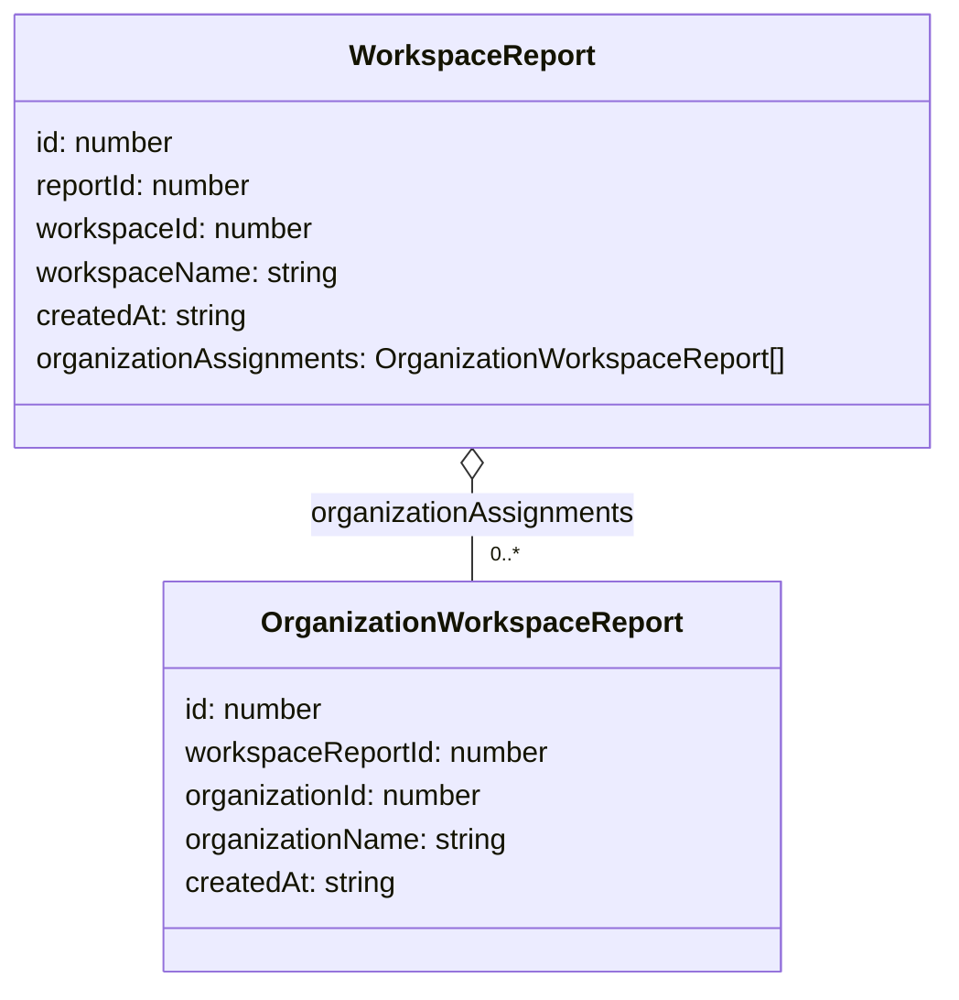

# Diagram: web/portal/src/pages/administration/report-management/models/WorkspaceReportDTO.ts

> Auto-generated by Obscura crawlers

## Mermaid

### SVG

<svg id="container" width="524.2109375" xmlns="http://www.w3.org/2000/svg" class="classDiagram" height="546" viewBox="0 0 524.2109375 546" role="graphics-document document" aria-roledescription="class"><g><defs><marker id="container_class-aggregationStart" class="marker aggregation class" refX="18" refY="7" markerWidth="190" markerHeight="240" orient="auto"><path d="M 18,7 L9,13 L1,7 L9,1 Z"></path></marker></defs><defs><marker id="container_class-aggregationEnd" class="marker aggregation class" refX="1" refY="7" markerWidth="20" markerHeight="28" orient="auto"><path d="M 18,7 L9,13 L1,7 L9,1 Z"></path></marker></defs><defs><marker id="container_class-extensionStart" class="marker extension class" refX="18" refY="7" markerWidth="190" markerHeight="240" orient="auto"><path d="M 1,7 L18,13 V 1 Z"></path></marker></defs><defs><marker id="container_class-extensionEnd" class="marker extension class" refX="1" refY="7" markerWidth="20" markerHeight="28" orient="auto"><path d="M 1,1 V 13 L18,7 Z"></path></marker></defs><defs><marker id="container_class-compositionStart" class="marker composition class" refX="18" refY="7" markerWidth="190" markerHeight="240" orient="auto"><path d="M 18,7 L9,13 L1,7 L9,1 Z"></path></marker></defs><defs><marker id="container_class-compositionEnd" class="marker composition class" refX="1" refY="7" markerWidth="20" markerHeight="28" orient="auto"><path d="M 18,7 L9,13 L1,7 L9,1 Z"></path></marker></defs><defs><marker id="container_class-dependencyStart" class="marker dependency class" refX="6" refY="7" markerWidth="190" markerHeight="240" orient="auto"><path d="M 5,7 L9,13 L1,7 L9,1 Z"></path></marker></defs><defs><marker id="container_class-dependencyEnd" class="marker dependency class" refX="13" refY="7" markerWidth="20" markerHeight="28" orient="auto"><path d="M 18,7 L9,13 L14,7 L9,1 Z"></path></marker></defs><defs><marker id="container_class-lollipopStart" class="marker lollipop class" refX="13" refY="7" markerWidth="190" markerHeight="240" orient="auto"><circle stroke="black" fill="transparent" cx="7" cy="7" r="6"></circle></marker></defs><defs><marker id="container_class-lollipopEnd" class="marker lollipop class" refX="1" refY="7" markerWidth="190" markerHeight="240" orient="auto"><circle stroke="black" fill="transparent" cx="7" cy="7" r="6"></circle></marker></defs><g class="root"><g class="clusters"></g><g class="edgePaths"><path d="M262.105,265.25L262.105,268.542C262.105,271.833,262.105,278.417,262.105,287.875C262.105,297.333,262.105,309.667,262.105,315.833L262.105,322" id="id_WorkspaceReport_OrganizationWorkspaceReport_1" class="edge-thickness-normal edge-pattern-solid relation" style=";;;" data-edge="true" data-et="edge" data-id="id_WorkspaceReport_OrganizationWorkspaceReport_1" data-points="W3sieCI6MjYyLjEwNTQ2ODc1LCJ5IjoyNDh9LHsieCI6MjYyLjEwNTQ2ODc1LCJ5IjoyODV9LHsieCI6MjYyLjEwNTQ2ODc1LCJ5IjozMjJ9XQ==" marker-start="url(#container_class-aggregationStart)"></path></g><g class="edgeLabels"><g class="edgeLabel" transform="translate(262.10546875, 285)"><g class="label" data-id="id_WorkspaceReport_OrganizationWorkspaceReport_1" transform="translate(-90.7890625, -12)"><foreignObject width="181.578125" height="24">

organizationAssignments

</foreignObject></g></g><g class="edgeTerminals" transform="translate(272.105469375, 299.5000005357143)"><g class="inner" transform="translate(0, 0)"></g><foreignObject style="width: 36px; height: 12px;">
0..*
</foreignObject></g></g><g class="nodes"><g class="node default" id="classId-OrganizationWorkspaceReport-0" transform="translate(262.10546875, 430)"><g class="basic label-container"><path d="M-170.23046875 -108 L170.23046875 -108 L170.23046875 108 L-170.23046875 108" stroke="none" stroke-width="0" fill="#ECECFF" style=""></path><path d="M-170.23046875 -108 C-55.32549867547981 -108, 59.579471399040386 -108, 170.23046875 -108 M-170.23046875 -108 C-81.53250787443271 -108, 7.16545300113458 -108, 170.23046875 -108 M170.23046875 -108 C170.23046875 -23.73859219302136, 170.23046875 60.52281561395728, 170.23046875 108 M170.23046875 -108 C170.23046875 -29.379580707706324, 170.23046875 49.24083858458735, 170.23046875 108 M170.23046875 108 C88.42881232217917 108, 6.627155894358339 108, -170.23046875 108 M170.23046875 108 C82.2340192052933 108, -5.762430339413413 108, -170.23046875 108 M-170.23046875 108 C-170.23046875 52.08202021151629, -170.23046875 -3.8359595769674257, -170.23046875 -108 M-170.23046875 108 C-170.23046875 31.41932641264397, -170.23046875 -45.16134717471206, -170.23046875 -108" stroke="#9370DB" stroke-width="1.3" fill="none" stroke-dasharray="0 0" style=""></path></g><g class="annotation-group text" transform="translate(0, -84)"></g><g class="label-group text" transform="translate(-111.6484375, -84)"><g class="label" style="font-weight: bolder" transform="translate(0,-12)"><foreignObject width="223.296875" height="24">

OrganizationWorkspaceReport

</foreignObject></g></g><g class="members-group text" transform="translate(-158.23046875, -36)"><g class="label" style="" transform="translate(0,-12)"><foreignObject width="78.96875" height="24">

id: number

</foreignObject></g><g class="label" style="" transform="translate(0,12)"><foreignObject width="204.8125" height="24">

workspaceReportId: number

</foreignObject></g><g class="label" style="" transform="translate(0,36)"><foreignObject width="169.53125" height="24">

organizationId: number

</foreignObject></g><g class="label" style="" transform="translate(0,60)"><foreignObject width="182.140625" height="24">

organizationName: string

</foreignObject></g><g class="label" style="" transform="translate(0,84)"><foreignObject width="119.15625" height="24">

createdAt: string

</foreignObject></g></g><g class="methods-group text" transform="translate(-158.23046875, 108)"></g><g class="divider" style=""><path d="M-170.23046875 -60 C-88.33167237075133 -60, -6.432875991502669 -60, 170.23046875 -60 M-170.23046875 -60 C-65.84744253917154 -60, 38.53558367165692 -60, 170.23046875 -60" stroke="#9370DB" stroke-width="1.3" fill="none" stroke-dasharray="0 0" style=""></path></g><g class="divider" style=""><path d="M-170.23046875 84 C-37.555387552650075 84, 95.11969364469985 84, 170.23046875 84 M-170.23046875 84 C-78.92041623643404 84, 12.389636277131927 84, 170.23046875 84" stroke="#9370DB" stroke-width="1.3" fill="none" stroke-dasharray="0 0" style=""></path></g></g><g class="node default" id="classId-WorkspaceReport-1" transform="translate(262.10546875, 128)"><g class="basic label-container"><path d="M-254.10546875 -120 L254.10546875 -120 L254.10546875 120 L-254.10546875 120" stroke="none" stroke-width="0" fill="#ECECFF" style=""></path><path d="M-254.10546875 -120 C-60.43103100131907 -120, 133.24340674736186 -120, 254.10546875 -120 M-254.10546875 -120 C-59.95208700401997 -120, 134.20129474196006 -120, 254.10546875 -120 M254.10546875 -120 C254.10546875 -27.678171743667164, 254.10546875 64.64365651266567, 254.10546875 120 M254.10546875 -120 C254.10546875 -51.005373075244236, 254.10546875 17.989253849511528, 254.10546875 120 M254.10546875 120 C146.00476253434937 120, 37.90405631869871 120, -254.10546875 120 M254.10546875 120 C77.17364658631186 120, -99.75817557737628 120, -254.10546875 120 M-254.10546875 120 C-254.10546875 45.669478975552536, -254.10546875 -28.661042048894927, -254.10546875 -120 M-254.10546875 120 C-254.10546875 48.77538947069161, -254.10546875 -22.449221058616786, -254.10546875 -120" stroke="#9370DB" stroke-width="1.3" fill="none" stroke-dasharray="0 0" style=""></path></g><g class="annotation-group text" transform="translate(0, -96)"></g><g class="label-group text" transform="translate(-64.9609375, -96)"><g class="label" style="font-weight: bolder" transform="translate(0,-12)"><foreignObject width="129.921875" height="24">

WorkspaceReport

</foreignObject></g></g><g class="members-group text" transform="translate(-242.10546875, -48)"><g class="label" style="" transform="translate(0,-12)"><foreignObject width="78.96875" height="24">

id: number

</foreignObject></g><g class="label" style="" transform="translate(0,12)"><foreignObject width="124.390625" height="24">

reportId: number

</foreignObject></g><g class="label" style="" transform="translate(0,36)"><foreignObject width="155.84375" height="24">

workspaceId: number

</foreignObject></g><g class="label" style="" transform="translate(0,60)"><foreignObject width="168.453125" height="24">

workspaceName: string

</foreignObject></g><g class="label" style="" transform="translate(0,84)"><foreignObject width="119.15625" height="24">

createdAt: string

</foreignObject></g><g class="label" style="" transform="translate(0,108)"><foreignObject width="419.25" height="24">

organizationAssignments: OrganizationWorkspaceReport[]

</foreignObject></g></g><g class="methods-group text" transform="translate(-242.10546875, 120)"></g><g class="divider" style=""><path d="M-254.10546875 -72 C-106.32358168207409 -72, 41.458305385851816 -72, 254.10546875 -72 M-254.10546875 -72 C-57.29299563888648 -72, 139.51947747222704 -72, 254.10546875 -72" stroke="#9370DB" stroke-width="1.3" fill="none" stroke-dasharray="0 0" style=""></path></g><g class="divider" style=""><path d="M-254.10546875 96 C-123.4636071966014 96, 7.178254356797197 96, 254.10546875 96 M-254.10546875 96 C-64.81020590002589 96, 124.48505694994822 96, 254.10546875 96" stroke="#9370DB" stroke-width="1.3" fill="none" stroke-dasharray="0 0" style=""></path></g></g></g></g></g></svg>
