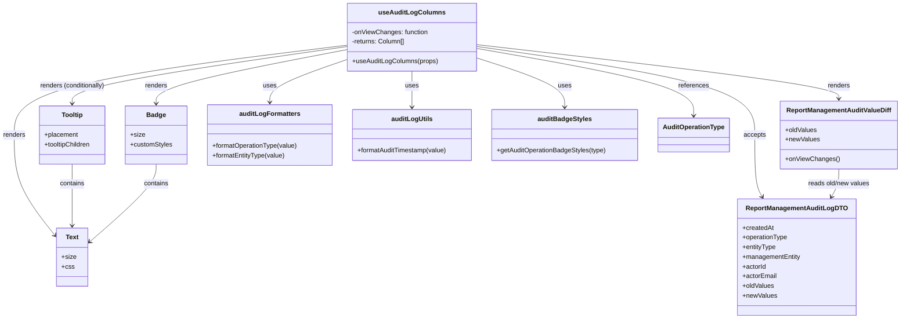

# Diagram: web/portal/src/pages/administration/report-management/search/ReportManagement.AuditLog.columns.tsx

> Auto-generated by Obscura crawlers

## Mermaid

### SVG

<svg id="container" width="2215.359375" xmlns="http://www.w3.org/2000/svg" class="classDiagram" height="788" viewBox="0 0 2215.359375 788" role="graphics-document document" aria-roledescription="class"><g><defs><marker id="container_class-aggregationStart" class="marker aggregation class" refX="18" refY="7" markerWidth="190" markerHeight="240" orient="auto"><path d="M 18,7 L9,13 L1,7 L9,1 Z"></path></marker></defs><defs><marker id="container_class-aggregationEnd" class="marker aggregation class" refX="1" refY="7" markerWidth="20" markerHeight="28" orient="auto"><path d="M 18,7 L9,13 L1,7 L9,1 Z"></path></marker></defs><defs><marker id="container_class-extensionStart" class="marker extension class" refX="18" refY="7" markerWidth="190" markerHeight="240" orient="auto"><path d="M 1,7 L18,13 V 1 Z"></path></marker></defs><defs><marker id="container_class-extensionEnd" class="marker extension class" refX="1" refY="7" markerWidth="20" markerHeight="28" orient="auto"><path d="M 1,1 V 13 L18,7 Z"></path></marker></defs><defs><marker id="container_class-compositionStart" class="marker composition class" refX="18" refY="7" markerWidth="190" markerHeight="240" orient="auto"><path d="M 18,7 L9,13 L1,7 L9,1 Z"></path></marker></defs><defs><marker id="container_class-compositionEnd" class="marker composition class" refX="1" refY="7" markerWidth="20" markerHeight="28" orient="auto"><path d="M 18,7 L9,13 L1,7 L9,1 Z"></path></marker></defs><defs><marker id="container_class-dependencyStart" class="marker dependency class" refX="6" refY="7" markerWidth="190" markerHeight="240" orient="auto"><path d="M 5,7 L9,13 L1,7 L9,1 Z"></path></marker></defs><defs><marker id="container_class-dependencyEnd" class="marker dependency class" refX="13" refY="7" markerWidth="20" markerHeight="28" orient="auto"><path d="M 18,7 L9,13 L14,7 L9,1 Z"></path></marker></defs><defs><marker id="container_class-lollipopStart" class="marker lollipop class" refX="13" refY="7" markerWidth="190" markerHeight="240" orient="auto"><circle stroke="black" fill="transparent" cx="7" cy="7" r="6"></circle></marker></defs><defs><marker id="container_class-lollipopEnd" class="marker lollipop class" refX="1" refY="7" markerWidth="190" markerHeight="240" orient="auto"><circle stroke="black" fill="transparent" cx="7" cy="7" r="6"></circle></marker></defs><g class="root"><g class="clusters"></g><g class="edgePaths"><path d="M867.281,145.501L834.47,156.751C801.659,168.001,736.036,190.5,703.225,208.417C670.414,226.333,670.414,239.667,670.414,246.333L670.414,253" id="id_useAuditLogColumns_auditLogFormatters_1" class="edge-thickness-normal edge-pattern-solid relation" style=";;;" data-edge="true" data-et="edge" data-id="id_useAuditLogColumns_auditLogFormatters_1" data-points="W3sieCI6ODY3LjI4MTI1LCJ5IjoxNDUuNTAxNDMzMzk0MjExMDZ9LHsieCI6NjcwLjQxNDA2MjUsInkiOjIxM30seyJ4Ijo2NzAuNDE0MDYyNSwieSI6MjU5fV0=" marker-end="url(#container_class-dependencyEnd)"></path><path d="M1023.324,176L1023.324,182.167C1023.324,188.333,1023.324,200.667,1023.324,215.5C1023.324,230.333,1023.324,247.667,1023.324,256.333L1023.324,265" id="id_useAuditLogColumns_auditLogUtils_2" class="edge-thickness-normal edge-pattern-solid relation" style=";;;" data-edge="true" data-et="edge" data-id="id_useAuditLogColumns_auditLogUtils_2" data-points="W3sieCI6MTAyMy4zMjQyMTg3NSwieSI6MTc2fSx7IngiOjEwMjMuMzI0MjE4NzUsInkiOjIxM30seyJ4IjoxMDIzLjMyNDIxODc1LCJ5IjoyNzF9XQ==" marker-end="url(#container_class-dependencyEnd)"></path><path d="M1179.367,141.871L1216.46,153.726C1253.553,165.581,1327.74,189.29,1364.833,209.812C1401.926,230.333,1401.926,247.667,1401.926,256.333L1401.926,265" id="id_useAuditLogColumns_auditBadgeStyles_3" class="edge-thickness-normal edge-pattern-solid relation" style=";;;" data-edge="true" data-et="edge" data-id="id_useAuditLogColumns_auditBadgeStyles_3" data-points="W3sieCI6MTE3OS4zNjcxODc1LCJ5IjoxNDEuODcwODk2MTg0NTYwNzZ9LHsieCI6MTQwMS45MjU3ODEyNSwieSI6MjEzfSx7IngiOjE0MDEuOTI1NzgxMjUsInkiOjI3MX1d" marker-end="url(#container_class-dependencyEnd)"></path><path d="M867.281,114.442L753.067,130.868C638.853,147.295,410.424,180.147,296.21,203.74C181.996,227.333,181.996,241.667,181.996,248.833L181.996,256" id="id_useAuditLogColumns_Tooltip_4" class="edge-thickness-normal edge-pattern-solid relation" style=";;;" data-edge="true" data-et="edge" data-id="id_useAuditLogColumns_Tooltip_4" data-points="W3sieCI6ODY3LjI4MTI1LCJ5IjoxMTQuNDQyMTM0ODMxNDYwNjh9LHsieCI6MTgxLjk5NjA5Mzc1LCJ5IjoyMTN9LHsieCI6MTgxLjk5NjA5Mzc1LCJ5IjoyNjJ9XQ==" marker-end="url(#container_class-dependencyEnd)"></path><path d="M867.281,121.853L787.876,137.044C708.47,152.235,549.659,182.618,470.253,204.975C390.848,227.333,390.848,241.667,390.848,248.833L390.848,256" id="id_useAuditLogColumns_Badge_5" class="edge-thickness-normal edge-pattern-solid relation" style=";;;" data-edge="true" data-et="edge" data-id="id_useAuditLogColumns_Badge_5" data-points="W3sieCI6ODY3LjI4MTI1LCJ5IjoxMjEuODUyODA0NTc1MjY4MzV9LHsieCI6MzkwLjg0NzY1NjI1LCJ5IjoyMTN9LHsieCI6MzkwLjg0NzY1NjI1LCJ5IjoyNjJ9XQ==" marker-end="url(#container_class-dependencyEnd)"></path><path d="M867.281,111.119L728.693,128.099C590.104,145.079,312.927,179.04,174.339,216.186C35.75,253.333,35.75,293.667,35.75,334C35.75,374.333,35.75,414.667,53.249,456.491C70.748,498.315,105.747,541.63,123.246,563.288L140.745,584.946" id="id_useAuditLogColumns_Text_6" class="edge-thickness-normal edge-pattern-solid relation" style=";;;" data-edge="true" data-et="edge" data-id="id_useAuditLogColumns_Text_6" data-points="W3sieCI6ODY3LjI4MTI1LCJ5IjoxMTEuMTE4NzY0ODA4MDI0NzF9LHsieCI6MzUuNzUsInkiOjIxM30seyJ4IjozNS43NSwieSI6MzM0fSx7IngiOjM1Ljc1LCJ5Ijo0NTV9LHsieCI6MTQ0LjUxNTYyNSwieSI6NTg5LjYxMjY3NjYyMDYzNjJ9XQ==" marker-end="url(#container_class-dependencyEnd)"></path><path d="M1179.367,110.083L1327.383,127.236C1475.398,144.389,1771.43,178.694,1919.445,201.014C2067.461,223.333,2067.461,233.667,2067.461,238.833L2067.461,244" id="id_useAuditLogColumns_ReportManagementAuditValueDiff_7" class="edge-thickness-normal edge-pattern-solid relation" style=";;;" data-edge="true" data-et="edge" data-id="id_useAuditLogColumns_ReportManagementAuditValueDiff_7" data-points="W3sieCI6MTE3OS4zNjcxODc1LCJ5IjoxMTAuMDgzMDcxNzY2MDc0N30seyJ4IjoyMDY3LjQ2MDkzNzUsInkiOjIxM30seyJ4IjoyMDY3LjQ2MDkzNzUsInkiOjI1MH1d" marker-end="url(#container_class-dependencyEnd)"></path><path d="M1179.367,119.208L1269.018,134.84C1358.669,150.472,1537.971,181.736,1627.622,209.535C1717.273,237.333,1717.273,261.667,1717.273,273.833L1717.273,286" id="id_useAuditLogColumns_AuditOperationType_8" class="edge-thickness-normal edge-pattern-solid relation" style=";;;" data-edge="true" data-et="edge" data-id="id_useAuditLogColumns_AuditOperationType_8" data-points="W3sieCI6MTE3OS4zNjcxODc1LCJ5IjoxMTkuMjA4MzI5ODE1MTk5NDZ9LHsieCI6MTcxNy4yNzM0Mzc1LCJ5IjoyMTN9LHsieCI6MTcxNy4yNzM0Mzc1LCJ5IjoyOTJ9XQ==" marker-end="url(#container_class-dependencyEnd)"></path><path d="M1179.367,114.429L1293.663,130.858C1407.958,147.286,1636.549,180.143,1750.845,216.738C1865.141,253.333,1865.141,293.667,1865.141,334C1865.141,374.333,1865.141,414.667,1868.099,440.127C1871.058,465.588,1876.975,476.175,1879.934,481.469L1882.893,486.763" id="id_useAuditLogColumns_ReportManagementAuditLogDTO_9" class="edge-thickness-normal edge-pattern-solid relation" style=";;;" data-edge="true" data-et="edge" data-id="id_useAuditLogColumns_ReportManagementAuditLogDTO_9" data-points="W3sieCI6MTE3OS4zNjcxODc1LCJ5IjoxMTQuNDI5MTE3NjUzODgyNzR9LHsieCI6MTg2NS4xNDA2MjUsInkiOjIxM30seyJ4IjoxODY1LjE0MDYyNSwieSI6MzM0fSx7IngiOjE4NjUuMTQwNjI1LCJ5Ijo0NTV9LHsieCI6MTg4NS44MTk3NzI5NjI3MDcyLCJ5Ijo0OTJ9XQ==" marker-end="url(#container_class-dependencyEnd)"></path><path d="M2067.461,418L2067.461,424.167C2067.461,430.333,2067.461,442.667,2064.502,454.127C2061.544,465.588,2055.626,476.175,2052.668,481.469L2049.709,486.763" id="id_ReportManagementAuditValueDiff_ReportManagementAuditLogDTO_10" class="edge-thickness-normal edge-pattern-solid relation" style=";;;" data-edge="true" data-et="edge" data-id="id_ReportManagementAuditValueDiff_ReportManagementAuditLogDTO_10" data-points="W3sieCI6MjA2Ny40NjA5Mzc1LCJ5Ijo0MTh9LHsieCI6MjA2Ny40NjA5Mzc1LCJ5Ijo0NTV9LHsieCI6MjA0Ni43ODE3ODk1MzcyOTI4LCJ5Ijo0OTJ9XQ==" marker-end="url(#container_class-dependencyEnd)"></path><path d="M181.996,406L181.996,414.167C181.996,422.333,181.996,438.667,181.996,464C181.996,489.333,181.996,523.667,181.996,540.833L181.996,558" id="id_Tooltip_Text_11" class="edge-thickness-normal edge-pattern-solid relation" style=";;;" data-edge="true" data-et="edge" data-id="id_Tooltip_Text_11" data-points="W3sieCI6MTgxLjk5NjA5Mzc1LCJ5Ijo0MDZ9LHsieCI6MTgxLjk5NjA5Mzc1LCJ5Ijo0NTV9LHsieCI6MTgxLjk5NjA5Mzc1LCJ5Ijo1NjR9XQ==" marker-end="url(#container_class-dependencyEnd)"></path><path d="M390.848,406L390.848,414.167C390.848,422.333,390.848,438.667,363.042,470.931C335.235,503.196,279.623,551.392,251.817,575.49L224.011,599.588" id="id_Badge_Text_12" class="edge-thickness-normal edge-pattern-solid relation" style=";;;" data-edge="true" data-et="edge" data-id="id_Badge_Text_12" data-points="W3sieCI6MzkwLjg0NzY1NjI1LCJ5Ijo0MDZ9LHsieCI6MzkwLjg0NzY1NjI1LCJ5Ijo0NTV9LHsieCI6MjE5LjQ3NjU2MjUsInkiOjYwMy41MTc3NjgzMDEzNTA0fV0=" marker-end="url(#container_class-dependencyEnd)"></path></g><g class="edgeLabels"><g class="edgeLabel" transform="translate(670.4140625, 213)"><g class="label" data-id="id_useAuditLogColumns_auditLogFormatters_1" transform="translate(-16.4921875, -12)"><foreignObject width="32.984375" height="24">

uses

</foreignObject></g></g><g class="edgeLabel" transform="translate(1023.32421875, 213)"><g class="label" data-id="id_useAuditLogColumns_auditLogUtils_2" transform="translate(-16.4921875, -12)"><foreignObject width="32.984375" height="24">

uses

</foreignObject></g></g><g class="edgeLabel" transform="translate(1401.92578125, 213)"><g class="label" data-id="id_useAuditLogColumns_auditBadgeStyles_3" transform="translate(-16.4921875, -12)"><foreignObject width="32.984375" height="24">

uses

</foreignObject></g></g><g class="edgeLabel" transform="translate(181.99609375, 213)"><g class="label" data-id="id_useAuditLogColumns_Tooltip_4" transform="translate(-82.4375, -12)"><foreignObject width="164.875" height="24">

renders (conditionally)

</foreignObject></g></g><g class="edgeLabel" transform="translate(390.84765625, 213)"><g class="label" data-id="id_useAuditLogColumns_Badge_5" transform="translate(-27.75, -12)"><foreignObject width="55.5" height="24">

renders

</foreignObject></g></g><g class="edgeLabel" transform="translate(35.75, 334)"><g class="label" data-id="id_useAuditLogColumns_Text_6" transform="translate(-27.75, -12)"><foreignObject width="55.5" height="24">

renders

</foreignObject></g></g><g class="edgeLabel" transform="translate(2067.4609375, 213)"><g class="label" data-id="id_useAuditLogColumns_ReportManagementAuditValueDiff_7" transform="translate(-27.75, -12)"><foreignObject width="55.5" height="24">

renders

</foreignObject></g></g><g class="edgeLabel" transform="translate(1717.2734375, 213)"><g class="label" data-id="id_useAuditLogColumns_AuditOperationType_8" transform="translate(-37.828125, -12)"><foreignObject width="75.65625" height="24">

references

</foreignObject></g></g><g class="edgeLabel" transform="translate(1865.140625, 334)"><g class="label" data-id="id_useAuditLogColumns_ReportManagementAuditLogDTO_9" transform="translate(-27.421875, -12)"><foreignObject width="54.84375" height="24">

accepts

</foreignObject></g></g><g class="edgeLabel" transform="translate(2067.4609375, 455)"><g class="label" data-id="id_ReportManagementAuditValueDiff_ReportManagementAuditLogDTO_10" transform="translate(-77.8828125, -12)"><foreignObject width="155.765625" height="24">

reads old/new values

</foreignObject></g></g><g class="edgeLabel" transform="translate(181.99609375, 455)"><g class="label" data-id="id_Tooltip_Text_11" transform="translate(-30.890625, -12)"><foreignObject width="61.78125" height="24">

contains

</foreignObject></g></g><g class="edgeLabel" transform="translate(390.84765625, 455)"><g class="label" data-id="id_Badge_Text_12" transform="translate(-30.890625, -12)"><foreignObject width="61.78125" height="24">

contains

</foreignObject></g></g></g><g class="nodes"><g class="node default" id="classId-useAuditLogColumns-0" transform="translate(1023.32421875, 92)"><g class="basic label-container"><path d="M-156.04296875 -84 L156.04296875 -84 L156.04296875 84 L-156.04296875 84" stroke="none" stroke-width="0" fill="#ECECFF" style=""></path><path d="M-156.04296875 -84 C-54.11867582652275 -84, 47.80561709695451 -84, 156.04296875 -84 M-156.04296875 -84 C-41.32545075408645 -84, 73.3920672418271 -84, 156.04296875 -84 M156.04296875 -84 C156.04296875 -39.00115672109462, 156.04296875 5.997686557810766, 156.04296875 84 M156.04296875 -84 C156.04296875 -24.32939463866832, 156.04296875 35.34121072266336, 156.04296875 84 M156.04296875 84 C62.943642764774495 84, -30.15568322045101 84, -156.04296875 84 M156.04296875 84 C84.56088306481355 84, 13.078797379627105 84, -156.04296875 84 M-156.04296875 84 C-156.04296875 40.23147746255496, -156.04296875 -3.5370450748900737, -156.04296875 -84 M-156.04296875 84 C-156.04296875 21.879910220312162, -156.04296875 -40.240179559375676, -156.04296875 -84" stroke="#9370DB" stroke-width="1.3" fill="none" stroke-dasharray="0 0" style=""></path></g><g class="annotation-group text" transform="translate(0, -60)"></g><g class="label-group text" transform="translate(-76.5859375, -60)"><g class="label" style="font-weight: bolder" transform="translate(0,-12)"><foreignObject width="153.171875" height="24">

useAuditLogColumns

</foreignObject></g></g><g class="members-group text" transform="translate(-144.04296875, -12)"><g class="label" style="" transform="translate(0,-12)"><foreignObject width="188.078125" height="24">

-onViewChanges: function

</foreignObject></g><g class="label" style="" transform="translate(0,12)"><foreignObject width="132.4375" height="24">

-returns: Column[]

</foreignObject></g></g><g class="methods-group text" transform="translate(-144.04296875, 60)"><g class="label" style="" transform="translate(0,-12)"><foreignObject width="211.5" height="24">

+useAuditLogColumns(props)

</foreignObject></g></g><g class="divider" style=""><path d="M-156.04296875 -36 C-34.220422342391316 -36, 87.60212406521737 -36, 156.04296875 -36 M-156.04296875 -36 C-88.39045843256551 -36, -20.73794811513102 -36, 156.04296875 -36" stroke="#9370DB" stroke-width="1.3" fill="none" stroke-dasharray="0 0" style=""></path></g><g class="divider" style=""><path d="M-156.04296875 36 C-92.04400614899521 36, -28.04504354799043 36, 156.04296875 36 M-156.04296875 36 C-90.61226444193179 36, -25.18156013386357 36, 156.04296875 36" stroke="#9370DB" stroke-width="1.3" fill="none" stroke-dasharray="0 0" style=""></path></g></g><g class="node default" id="classId-Tooltip-1" transform="translate(181.99609375, 334)"><g class="basic label-container"><path d="M-83.49609375 -72 L83.49609375 -72 L83.49609375 72 L-83.49609375 72" stroke="none" stroke-width="0" fill="#ECECFF" style=""></path><path d="M-83.49609375 -72 C-34.11566332805847 -72, 15.264767093883066 -72, 83.49609375 -72 M-83.49609375 -72 C-18.14471010018029 -72, 47.20667354963942 -72, 83.49609375 -72 M83.49609375 -72 C83.49609375 -26.31844955787595, 83.49609375 19.363100884248098, 83.49609375 72 M83.49609375 -72 C83.49609375 -38.42812435066324, 83.49609375 -4.856248701326479, 83.49609375 72 M83.49609375 72 C45.949345656471074 72, 8.402597562942148 72, -83.49609375 72 M83.49609375 72 C47.260353444611106 72, 11.024613139222211 72, -83.49609375 72 M-83.49609375 72 C-83.49609375 16.449393853178982, -83.49609375 -39.101212293642035, -83.49609375 -72 M-83.49609375 72 C-83.49609375 31.402692537403603, -83.49609375 -9.194614925192795, -83.49609375 -72" stroke="#9370DB" stroke-width="1.3" fill="none" stroke-dasharray="0 0" style=""></path></g><g class="annotation-group text" transform="translate(0, -48)"></g><g class="label-group text" transform="translate(-25.7265625, -48)"><g class="label" style="font-weight: bolder" transform="translate(0,-12)"><foreignObject width="51.453125" height="24">

Tooltip

</foreignObject></g></g><g class="members-group text" transform="translate(-71.49609375, 0)"><g class="label" style="" transform="translate(0,-12)"><foreignObject width="84.4375" height="24">

+placement

</foreignObject></g><g class="label" style="" transform="translate(0,12)"><foreignObject width="117.265625" height="24">

+tooltipChildren

</foreignObject></g></g><g class="methods-group text" transform="translate(-71.49609375, 72)"></g><g class="divider" style=""><path d="M-83.49609375 -24 C-28.06489118149036 -24, 27.36631138701928 -24, 83.49609375 -24 M-83.49609375 -24 C-17.294007634942147 -24, 48.908078480115705 -24, 83.49609375 -24" stroke="#9370DB" stroke-width="1.3" fill="none" stroke-dasharray="0 0" style=""></path></g><g class="divider" style=""><path d="M-83.49609375 48 C-26.670774704111714 48, 30.15454434177657 48, 83.49609375 48 M-83.49609375 48 C-41.099177875368895 48, 1.2977379992622105 48, 83.49609375 48" stroke="#9370DB" stroke-width="1.3" fill="none" stroke-dasharray="0 0" style=""></path></g></g><g class="node default" id="classId-Badge-2" transform="translate(390.84765625, 334)"><g class="basic label-container"><path d="M-75.35546875 -72 L75.35546875 -72 L75.35546875 72 L-75.35546875 72" stroke="none" stroke-width="0" fill="#ECECFF" style=""></path><path d="M-75.35546875 -72 C-39.21154838776832 -72, -3.067628025536635 -72, 75.35546875 -72 M-75.35546875 -72 C-28.89967853652189 -72, 17.55611167695622 -72, 75.35546875 -72 M75.35546875 -72 C75.35546875 -23.53398400032603, 75.35546875 24.93203199934794, 75.35546875 72 M75.35546875 -72 C75.35546875 -25.5273492722597, 75.35546875 20.945301455480603, 75.35546875 72 M75.35546875 72 C34.516823655546375 72, -6.32182143890725 72, -75.35546875 72 M75.35546875 72 C42.15566175521916 72, 8.955854760438314 72, -75.35546875 72 M-75.35546875 72 C-75.35546875 18.41008265122342, -75.35546875 -35.17983469755316, -75.35546875 -72 M-75.35546875 72 C-75.35546875 20.486340285410563, -75.35546875 -31.027319429178874, -75.35546875 -72" stroke="#9370DB" stroke-width="1.3" fill="none" stroke-dasharray="0 0" style=""></path></g><g class="annotation-group text" transform="translate(0, -48)"></g><g class="label-group text" transform="translate(-22.7734375, -48)"><g class="label" style="font-weight: bolder" transform="translate(0,-12)"><foreignObject width="45.546875" height="24">

Badge

</foreignObject></g></g><g class="members-group text" transform="translate(-63.35546875, 0)"><g class="label" style="" transform="translate(0,-12)"><foreignObject width="35.578125" height="24">

+size

</foreignObject></g><g class="label" style="" transform="translate(0,12)"><foreignObject width="103.9375" height="24">

+customStyles

</foreignObject></g></g><g class="methods-group text" transform="translate(-63.35546875, 72)"></g><g class="divider" style=""><path d="M-75.35546875 -24 C-27.20735016728696 -24, 20.940768415426078 -24, 75.35546875 -24 M-75.35546875 -24 C-34.81702182103899 -24, 5.721425107922016 -24, 75.35546875 -24" stroke="#9370DB" stroke-width="1.3" fill="none" stroke-dasharray="0 0" style=""></path></g><g class="divider" style=""><path d="M-75.35546875 48 C-30.035778695974336 48, 15.283911358051327 48, 75.35546875 48 M-75.35546875 48 C-19.88345112268813 48, 35.58856650462374 48, 75.35546875 48" stroke="#9370DB" stroke-width="1.3" fill="none" stroke-dasharray="0 0" style=""></path></g></g><g class="node default" id="classId-Text-3" transform="translate(181.99609375, 636)"><g class="basic label-container"><path d="M-37.48046875 -72 L37.48046875 -72 L37.48046875 72 L-37.48046875 72" stroke="none" stroke-width="0" fill="#ECECFF" style=""></path><path d="M-37.48046875 -72 C-13.325982894875224 -72, 10.828502960249551 -72, 37.48046875 -72 M-37.48046875 -72 C-7.963181416343769 -72, 21.554105917312462 -72, 37.48046875 -72 M37.48046875 -72 C37.48046875 -17.45650963555395, 37.48046875 37.0869807288921, 37.48046875 72 M37.48046875 -72 C37.48046875 -15.140458517788062, 37.48046875 41.719082964423876, 37.48046875 72 M37.48046875 72 C21.920854769607327 72, 6.361240789214655 72, -37.48046875 72 M37.48046875 72 C10.691957327334084 72, -16.096554095331832 72, -37.48046875 72 M-37.48046875 72 C-37.48046875 14.602315885059824, -37.48046875 -42.79536822988035, -37.48046875 -72 M-37.48046875 72 C-37.48046875 27.210404754072016, -37.48046875 -17.579190491855968, -37.48046875 -72" stroke="#9370DB" stroke-width="1.3" fill="none" stroke-dasharray="0 0" style=""></path></g><g class="annotation-group text" transform="translate(0, -48)"></g><g class="label-group text" transform="translate(-15.3828125, -48)"><g class="label" style="font-weight: bolder" transform="translate(0,-12)"><foreignObject width="30.765625" height="24">

Text

</foreignObject></g></g><g class="members-group text" transform="translate(-25.48046875, 0)"><g class="label" style="" transform="translate(0,-12)"><foreignObject width="35.578125" height="24">

+size

</foreignObject></g><g class="label" style="" transform="translate(0,12)"><foreignObject width="30.421875" height="24">

+css

</foreignObject></g></g><g class="methods-group text" transform="translate(-25.48046875, 72)"></g><g class="divider" style=""><path d="M-37.48046875 -24 C-17.299484066789354 -24, 2.8815006164212917 -24, 37.48046875 -24 M-37.48046875 -24 C-8.44695094167593 -24, 20.58656686664814 -24, 37.48046875 -24" stroke="#9370DB" stroke-width="1.3" fill="none" stroke-dasharray="0 0" style=""></path></g><g class="divider" style=""><path d="M-37.48046875 48 C-11.701399620353271 48, 14.077669509293457 48, 37.48046875 48 M-37.48046875 48 C-18.274515187322763 48, 0.9314383753544746 48, 37.48046875 48" stroke="#9370DB" stroke-width="1.3" fill="none" stroke-dasharray="0 0" style=""></path></g></g><g class="node default" id="classId-ReportManagementAuditValueDiff-4" transform="translate(2067.4609375, 334)"><g class="basic label-container"><path d="M-139.8984375 -84 L139.8984375 -84 L139.8984375 84 L-139.8984375 84" stroke="none" stroke-width="0" fill="#ECECFF" style=""></path><path d="M-139.8984375 -84 C-50.515779950559946 -84, 38.86687759888011 -84, 139.8984375 -84 M-139.8984375 -84 C-30.07359832276228 -84, 79.75124085447544 -84, 139.8984375 -84 M139.8984375 -84 C139.8984375 -29.315846261110366, 139.8984375 25.36830747777927, 139.8984375 84 M139.8984375 -84 C139.8984375 -38.93896618872003, 139.8984375 6.122067622559939, 139.8984375 84 M139.8984375 84 C30.286227923539528 84, -79.32598165292094 84, -139.8984375 84 M139.8984375 84 C30.828778616250204 84, -78.24088026749959 84, -139.8984375 84 M-139.8984375 84 C-139.8984375 24.526608003188414, -139.8984375 -34.94678399362317, -139.8984375 -84 M-139.8984375 84 C-139.8984375 23.983063886328672, -139.8984375 -36.033872227342655, -139.8984375 -84" stroke="#9370DB" stroke-width="1.3" fill="none" stroke-dasharray="0 0" style=""></path></g><g class="annotation-group text" transform="translate(0, -60)"></g><g class="label-group text" transform="translate(-124.609375, -60)"><g class="label" style="font-weight: bolder" transform="translate(0,-12)"><foreignObject width="249.21875" height="24">

ReportManagementAuditValueDiff

</foreignObject></g></g><g class="members-group text" transform="translate(-127.8984375, -12)"><g class="label" style="" transform="translate(0,-12)"><foreignObject width="78.5" height="24">

+oldValues

</foreignObject></g><g class="label" style="" transform="translate(0,12)"><foreignObject width="84.546875" height="24">

+newValues

</foreignObject></g></g><g class="methods-group text" transform="translate(-127.8984375, 60)"><g class="label" style="" transform="translate(0,-12)"><foreignObject width="131.1875" height="24">

+onViewChanges()

</foreignObject></g></g><g class="divider" style=""><path d="M-139.8984375 -36 C-54.134923086678 -36, 31.628591326644 -36, 139.8984375 -36 M-139.8984375 -36 C-56.31361567825725 -36, 27.2712061434855 -36, 139.8984375 -36" stroke="#9370DB" stroke-width="1.3" fill="none" stroke-dasharray="0 0" style=""></path></g><g class="divider" style=""><path d="M-139.8984375 36 C-78.10580239540954 36, -16.313167290819095 36, 139.8984375 36 M-139.8984375 36 C-59.464047140427894 36, 20.970343219144212 36, 139.8984375 36" stroke="#9370DB" stroke-width="1.3" fill="none" stroke-dasharray="0 0" style=""></path></g></g><g class="node default" id="classId-auditLogFormatters-5" transform="translate(670.4140625, 334)"><g class="basic label-container"><path d="M-154.2109375 -75 L154.2109375 -75 L154.2109375 75 L-154.2109375 75" stroke="none" stroke-width="0" fill="#ECECFF" style=""></path><path d="M-154.2109375 -75 C-61.11950072819336 -75, 31.971936043613283 -75, 154.2109375 -75 M-154.2109375 -75 C-66.52894715689496 -75, 21.153043186210084 -75, 154.2109375 -75 M154.2109375 -75 C154.2109375 -26.830416871081766, 154.2109375 21.339166257836467, 154.2109375 75 M154.2109375 -75 C154.2109375 -32.1445376976031, 154.2109375 10.710924604793803, 154.2109375 75 M154.2109375 75 C68.123030446084 75, -17.964876607831997 75, -154.2109375 75 M154.2109375 75 C32.403662569106245 75, -89.40361236178751 75, -154.2109375 75 M-154.2109375 75 C-154.2109375 42.94173697453998, -154.2109375 10.883473949079956, -154.2109375 -75 M-154.2109375 75 C-154.2109375 34.7512665553336, -154.2109375 -5.497466889332799, -154.2109375 -75" stroke="#9370DB" stroke-width="1.3" fill="none" stroke-dasharray="0 0" style=""></path></g><g class="annotation-group text" transform="translate(0, -51)"></g><g class="label-group text" transform="translate(-72.15625, -51)"><g class="label" style="font-weight: bolder" transform="translate(0,-12)"><foreignObject width="144.3125" height="24">

auditLogFormatters

</foreignObject></g></g><g class="members-group text" transform="translate(-142.2109375, -3)"></g><g class="methods-group text" transform="translate(-142.2109375, 27)"><g class="label" style="" transform="translate(0,-12)"><foreignObject width="212.265625" height="24">

+formatOperationType(value)

</foreignObject></g><g class="label" style="" transform="translate(0,12)"><foreignObject width="181.265625" height="24">

+formatEntityType(value)

</foreignObject></g></g><g class="divider" style=""><path d="M-154.2109375 -27 C-35.51161057926868 -27, 83.18771634146265 -27, 154.2109375 -27 M-154.2109375 -27 C-30.940989107620254 -27, 92.32895928475949 -27, 154.2109375 -27" stroke="#9370DB" stroke-width="1.3" fill="none" stroke-dasharray="0 0" style=""></path></g><g class="divider" style=""><path d="M-154.2109375 -3 C-63.01120029333288 -3, 28.188536913334246 -3, 154.2109375 -3 M-154.2109375 -3 C-69.6414465698182 -3, 14.9280443603636 -3, 154.2109375 -3" stroke="#9370DB" stroke-width="1.3" fill="none" stroke-dasharray="0 0" style=""></path></g></g><g class="node default" id="classId-auditLogUtils-6" transform="translate(1023.32421875, 334)"><g class="basic label-container"><path d="M-148.69921875 -63 L148.69921875 -63 L148.69921875 63 L-148.69921875 63" stroke="none" stroke-width="0" fill="#ECECFF" style=""></path><path d="M-148.69921875 -63 C-77.49069647164868 -63, -6.282174193297351 -63, 148.69921875 -63 M-148.69921875 -63 C-64.80752825385153 -63, 19.08416224229694 -63, 148.69921875 -63 M148.69921875 -63 C148.69921875 -16.068500113417542, 148.69921875 30.862999773164915, 148.69921875 63 M148.69921875 -63 C148.69921875 -29.79172237101357, 148.69921875 3.4165552579728597, 148.69921875 63 M148.69921875 63 C69.59219207555729 63, -9.514834598885415 63, -148.69921875 63 M148.69921875 63 C39.55307957715296 63, -69.59305959569409 63, -148.69921875 63 M-148.69921875 63 C-148.69921875 27.771575008510716, -148.69921875 -7.456849982978568, -148.69921875 -63 M-148.69921875 63 C-148.69921875 28.426570018042298, -148.69921875 -6.146859963915404, -148.69921875 -63" stroke="#9370DB" stroke-width="1.3" fill="none" stroke-dasharray="0 0" style=""></path></g><g class="annotation-group text" transform="translate(0, -39)"></g><g class="label-group text" transform="translate(-48.8828125, -39)"><g class="label" style="font-weight: bolder" transform="translate(0,-12)"><foreignObject width="97.765625" height="24">

auditLogUtils

</foreignObject></g></g><g class="members-group text" transform="translate(-136.69921875, 9)"></g><g class="methods-group text" transform="translate(-136.69921875, 39)"><g class="label" style="" transform="translate(0,-12)"><foreignObject width="224.515625" height="24">

+formatAuditTimestamp(value)

</foreignObject></g></g><g class="divider" style=""><path d="M-148.69921875 -15 C-46.70778655649555 -15, 55.2836456370089 -15, 148.69921875 -15 M-148.69921875 -15 C-86.74727323100535 -15, -24.795327712010717 -15, 148.69921875 -15" stroke="#9370DB" stroke-width="1.3" fill="none" stroke-dasharray="0 0" style=""></path></g><g class="divider" style=""><path d="M-148.69921875 9 C-44.58900740277133 9, 59.52120394445734 9, 148.69921875 9 M-148.69921875 9 C-86.60037516095852 9, -24.501531571917027 9, 148.69921875 9" stroke="#9370DB" stroke-width="1.3" fill="none" stroke-dasharray="0 0" style=""></path></g></g><g class="node default" id="classId-auditBadgeStyles-7" transform="translate(1401.92578125, 334)"><g class="basic label-container"><path d="M-179.90234375 -63 L179.90234375 -63 L179.90234375 63 L-179.90234375 63" stroke="none" stroke-width="0" fill="#ECECFF" style=""></path><path d="M-179.90234375 -63 C-69.77994994829201 -63, 40.34244385341597 -63, 179.90234375 -63 M-179.90234375 -63 C-62.49682701804227 -63, 54.908689713915464 -63, 179.90234375 -63 M179.90234375 -63 C179.90234375 -22.395776205392956, 179.90234375 18.20844758921409, 179.90234375 63 M179.90234375 -63 C179.90234375 -34.88710791285607, 179.90234375 -6.77421582571214, 179.90234375 63 M179.90234375 63 C56.35231682591646 63, -67.19771009816708 63, -179.90234375 63 M179.90234375 63 C62.75127073756592 63, -54.399802274868165 63, -179.90234375 63 M-179.90234375 63 C-179.90234375 19.015486569065743, -179.90234375 -24.969026861868514, -179.90234375 -63 M-179.90234375 63 C-179.90234375 29.15666206617798, -179.90234375 -4.686675867644041, -179.90234375 -63" stroke="#9370DB" stroke-width="1.3" fill="none" stroke-dasharray="0 0" style=""></path></g><g class="annotation-group text" transform="translate(0, -39)"></g><g class="label-group text" transform="translate(-64.2578125, -39)"><g class="label" style="font-weight: bolder" transform="translate(0,-12)"><foreignObject width="128.515625" height="24">

auditBadgeStyles

</foreignObject></g></g><g class="members-group text" transform="translate(-167.90234375, 9)"></g><g class="methods-group text" transform="translate(-167.90234375, 39)"><g class="label" style="" transform="translate(0,-12)"><foreignObject width="271.546875" height="24">

+getAuditOperationBadgeStyles(type)

</foreignObject></g></g><g class="divider" style=""><path d="M-179.90234375 -15 C-74.25119809744092 -15, 31.39994755511816 -15, 179.90234375 -15 M-179.90234375 -15 C-93.6980928640287 -15, -7.4938419780573895 -15, 179.90234375 -15" stroke="#9370DB" stroke-width="1.3" fill="none" stroke-dasharray="0 0" style=""></path></g><g class="divider" style=""><path d="M-179.90234375 9 C-105.01763595736081 9, -30.13292816472162 9, 179.90234375 9 M-179.90234375 9 C-45.47153640482543 9, 88.95927094034914 9, 179.90234375 9" stroke="#9370DB" stroke-width="1.3" fill="none" stroke-dasharray="0 0" style=""></path></g></g><g class="node default" id="classId-AuditOperationType-8" transform="translate(1717.2734375, 334)"><g class="basic label-container"><path d="M-85.4453125 -42 L85.4453125 -42 L85.4453125 42 L-85.4453125 42" stroke="none" stroke-width="0" fill="#ECECFF" style=""></path><path d="M-85.4453125 -42 C-42.20977284673129 -42, 1.025766806537419 -42, 85.4453125 -42 M-85.4453125 -42 C-40.654343266500796 -42, 4.136625966998409 -42, 85.4453125 -42 M85.4453125 -42 C85.4453125 -12.796845331702528, 85.4453125 16.406309336594944, 85.4453125 42 M85.4453125 -42 C85.4453125 -11.30026510587195, 85.4453125 19.3994697882561, 85.4453125 42 M85.4453125 42 C19.610579953557306 42, -46.22415259288539 42, -85.4453125 42 M85.4453125 42 C45.24733503335749 42, 5.049357566714974 42, -85.4453125 42 M-85.4453125 42 C-85.4453125 22.89619406427215, -85.4453125 3.792388128544303, -85.4453125 -42 M-85.4453125 42 C-85.4453125 16.08657777246868, -85.4453125 -9.826844455062641, -85.4453125 -42" stroke="#9370DB" stroke-width="1.3" fill="none" stroke-dasharray="0 0" style=""></path></g><g class="annotation-group text" transform="translate(0, -18)"></g><g class="label-group text" transform="translate(-73.4453125, -18)"><g class="label" style="font-weight: bolder" transform="translate(0,-12)"><foreignObject width="146.890625" height="24">

AuditOperationType

</foreignObject></g></g><g class="members-group text" transform="translate(-73.4453125, 30)"></g><g class="methods-group text" transform="translate(-73.4453125, 60)"></g><g class="divider" style=""><path d="M-85.4453125 6 C-33.20917867022775 6, 19.0269551595445 6, 85.4453125 6 M-85.4453125 6 C-33.47315265294154 6, 18.499007194116913 6, 85.4453125 6" stroke="#9370DB" stroke-width="1.3" fill="none" stroke-dasharray="0 0" style=""></path></g><g class="divider" style=""><path d="M-85.4453125 24 C-26.775149894367445 24, 31.89501271126511 24, 85.4453125 24 M-85.4453125 24 C-27.806402746880025 24, 29.83250700623995 24, 85.4453125 24" stroke="#9370DB" stroke-width="1.3" fill="none" stroke-dasharray="0 0" style=""></path></g></g><g class="node default" id="classId-ReportManagementAuditLogDTO-9" transform="translate(1966.30078125, 636)"><g class="basic label-container"><path d="M-143.67578125 -144 L143.67578125 -144 L143.67578125 144 L-143.67578125 144" stroke="none" stroke-width="0" fill="#ECECFF" style=""></path><path d="M-143.67578125 -144 C-40.67345116737948 -144, 62.328878915241035 -144, 143.67578125 -144 M-143.67578125 -144 C-79.88429725704006 -144, -16.09281326408012 -144, 143.67578125 -144 M143.67578125 -144 C143.67578125 -38.16234463537148, 143.67578125 67.67531072925703, 143.67578125 144 M143.67578125 -144 C143.67578125 -36.15576910652206, 143.67578125 71.68846178695588, 143.67578125 144 M143.67578125 144 C40.133954006033505 144, -63.40787323793299 144, -143.67578125 144 M143.67578125 144 C74.15948894374546 144, 4.643196637490917 144, -143.67578125 144 M-143.67578125 144 C-143.67578125 42.515967089611735, -143.67578125 -58.96806582077653, -143.67578125 -144 M-143.67578125 144 C-143.67578125 37.50779590669771, -143.67578125 -68.98440818660458, -143.67578125 -144" stroke="#9370DB" stroke-width="1.3" fill="none" stroke-dasharray="0 0" style=""></path></g><g class="annotation-group text" transform="translate(0, -120)"></g><g class="label-group text" transform="translate(-119.0234375, -120)"><g class="label" style="font-weight: bolder" transform="translate(0,-12)"><foreignObject width="238.046875" height="24">

ReportManagementAuditLogDTO

</foreignObject></g></g><g class="members-group text" transform="translate(-131.67578125, -72)"><g class="label" style="" transform="translate(0,-12)"><foreignObject width="77.375" height="24">

+createdAt

</foreignObject></g><g class="label" style="" transform="translate(0,12)"><foreignObject width="112.609375" height="24">

+operationType

</foreignObject></g><g class="label" style="" transform="translate(0,36)"><foreignObject width="83.671875" height="24">

+entityType

</foreignObject></g><g class="label" style="" transform="translate(0,60)"><foreignObject width="144.328125" height="24">

+managementEntity

</foreignObject></g><g class="label" style="" transform="translate(0,84)"><foreignObject width="59.453125" height="24">

+actorId

</foreignObject></g><g class="label" style="" transform="translate(0,108)"><foreignObject width="85.171875" height="24">

+actorEmail

</foreignObject></g><g class="label" style="" transform="translate(0,132)"><foreignObject width="78.5" height="24">

+oldValues

</foreignObject></g><g class="label" style="" transform="translate(0,156)"><foreignObject width="84.546875" height="24">

+newValues

</foreignObject></g></g><g class="methods-group text" transform="translate(-131.67578125, 144)"></g><g class="divider" style=""><path d="M-143.67578125 -96 C-37.86779297686107 -96, 67.94019529627786 -96, 143.67578125 -96 M-143.67578125 -96 C-35.95678907087667 -96, 71.76220310824667 -96, 143.67578125 -96" stroke="#9370DB" stroke-width="1.3" fill="none" stroke-dasharray="0 0" style=""></path></g><g class="divider" style=""><path d="M-143.67578125 120 C-57.955500521329 120, 27.764780207342 120, 143.67578125 120 M-143.67578125 120 C-72.51108631328252 120, -1.3463913765650375 120, 143.67578125 120" stroke="#9370DB" stroke-width="1.3" fill="none" stroke-dasharray="0 0" style=""></path></g></g></g></g></g></svg>
